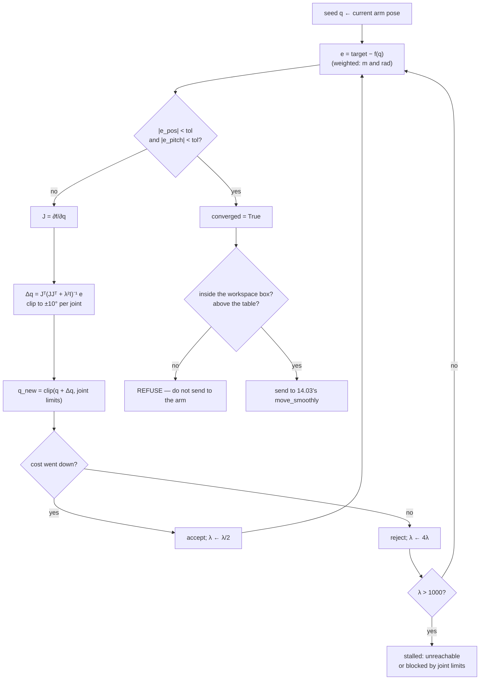

# 14.05 — Inverse kinematics — analytic and numerical

<!-- glance:start -->
<!-- generated by tools/build.py from curriculum/syllabus.yaml — edit the syllabus, not this block -->

| | |
|---|---|
| **Track** | Main path |
| **Difficulty** | Advanced |
| **Time** | 1 h 30 min |
| **Hardware** | none |
| **Software** | python, numpy |
| **Prerequisites** | [14.04 Forward kinematics — from joint angles to gripper pose](14.04-forward-kinematics.md) |
| **Optional prerequisites** | [FM.20 Optimization for robotics and ML: gradient descent to nonlinear least squares](../optional-foundations/mathematics/FM.20-optimization-basics.md) |
| **Skip if** | You have implemented analytic 2-link IK and a numerical IK solver. |

<!-- glance:end -->

## What you will learn

- Derive and implement the analytic IK of a planar 2-link arm with the law of cosines, and enumerate **all** its solutions.
- Classify any target as unreachable, boundary (one solution) or interior (two solutions), from link lengths alone.
- Implement numerical IK by damped least squares with joint limits, step clipping and a Levenberg–Marquardt acceptance test.
- Choose seeds deliberately, and explain why the same target can take 1 iteration or 88.
- Decide when an IK result is safe to send to the arm — and why `converged` is the only field that matters.

## Why it matters

This is the lesson that makes the arm useful. Everything before it answers "where is the gripper?"; this one answers
"what angles put the gripper *there?*", which is the question every task actually asks.

It is also the lesson with the most ways to be quietly wrong. IK can return a pose that is 12 cm from the target, or
inside the table, or on the far side of a joint limit, or a completely different elbow configuration from the one the
arm is in right now — and every one of those returns a plausible-looking array of five numbers. The habits here (check
convergence, check limits, check the workspace box, warm-start from the current pose) are what stand between an IK
solver and a broken gripper.

Downstream: [14.06](14.06-jacobian.md) is the derivative of the same equation, [14.07](14.07-trajectories.md) calls IK
once per 20 ms along a Cartesian path, [14.09](14.09-moveit2-motion-planning.md) hands the problem to a proper solver
with collision checking, and [15.08](../15-manipulation/15.08-pick-and-place-pipeline.md) uses it for every grasp.

<!-- prereqs:start -->
## Prerequisites

You need these first:

- [14.04 Forward kinematics — from joint angles to gripper pose](14.04-forward-kinematics.md)

### Optional prerequisite links

New to any of these? Take the foundation lesson first; skip it if you already know it.

- [FM.20 Optimization for robotics and ML: gradient descent to nonlinear least squares](../optional-foundations/mathematics/FM.20-optimization-basics.md)

Check your readiness: `python course.py why 14.05`
<!-- prereqs:end -->

## Concept

Forward kinematics is a function evaluation. Inverse kinematics is **solving an equation**, and equations behave
differently from functions:

| | FK | IK |
|---|---|---|
| Input | joint vector $q$ | desired pose $T^*$ |
| Cost | 5 matrix products | an analytic formula, or an iteration |
| Answers | exactly one | **0, 1, 2, … or infinitely many** |
| Fails? | never | often, and sometimes silently |

The 2-link arm shows all of it in one picture. To reach a point at radius $r$ from the shoulder you need a triangle
with sides $l_1$, $l_2$ and $r$. If $r > l_1 + l_2$ there is no such triangle — unreachable. If
$r < |l_1 - l_2|$, also none — the arm cannot fold tightly enough. In between, there are exactly **two** triangles,
mirror images across the line from the shoulder to the target: elbow up and elbow down. At the two boundaries the two
collapse into one.

For a real arm, add a fourth possibility: **infinitely many**. The SO-101 has five joints, and a realistic grasp task
asks for four numbers — position $(x, y, z)$ plus the approach pitch. Four equations, five unknowns: the arm is
**redundant by one** for that task, and the free parameter is `wrist_roll`. Rotating the gripper about its own
approach axis does not change where the tool goes (well, almost — the tool frame is 8 mm off that axis, so the other
joints shift slightly to compensate). That is why numerical IK on this arm converges from nearly any seed and yet
essentially never returns the same answer twice.

> [!TIP]
> **Ask your teacher:** "Draw me the two triangles for a 2-link arm reaching (0.18, 0.10), and show me where the elbow sits in each."

## Technical explanation

### Level 1 — The two triangles

```text
        Elbow "down" (q2 > 0)                         Elbow "up" (q2 < 0)

          ● elbow (0.115, -0.018)                        ● elbow (0.045, 0.107)
         ╱ ╲                                            ╱ ╲
   l1=0.116  l2=0.135                            l1=0.116  ╲ l2=0.135
       ╱       ╲                                        ╱     ╲
      ●─────────✕ target (0.18, 0.10)                  ●───────✕ target (0.18, 0.10)
   shoulder   r = 0.2059                            shoulder

   Same shoulder, same target, same link lengths, two different arms.
   Which one you want depends on the table, the object, and where the arm is right now.
```

The choice is not cosmetic. Elbow-down puts the elbow *below* the line to the target — into the table, in this
example. Elbow-up keeps it above. A solver that hands you an arbitrary branch will, sooner or later, hand you the one
that swings the elbow through your coffee.

### Level 2 — Analytic IK of the 2-link arm

Write the target as $(x, y)$, with $r^2 = x^2 + y^2$. The law of cosines on the triangle $(l_1, l_2, r)$ gives the
**interior** angle at the elbow, and $q_2$ is its supplement:

$$\cos q_2 = \frac{r^2 - l_1^2 - l_2^2}{2 l_1 l_2}$$

If $|\cos q_2| > 1$ there is no triangle: the target is unreachable. Otherwise
$\sin q_2 = \pm\sqrt{1 - \cos^2 q_2}$ — **the ± is the elbow-up / elbow-down choice**, and it is the entire source of
the two solutions. Then $q_1$ is the direction to the target minus the angle by which the second link "opens" away
from it:

$$q_1 = \operatorname{atan2}(y, x) - \operatorname{atan2}\!\left(l_2 \sin q_2,\; l_1 + l_2 \cos q_2\right)$$

**Worked example**, $l_1 = 0.116$, $l_2 = 0.135$, target $(0.18, 0.10)$:

$$r = \sqrt{0.18^2 + 0.10^2} = 0.20591, \qquad
\cos q_2 = \frac{0.042400 - 0.013456 - 0.018225}{2 \cdot 0.116 \cdot 0.135} = 0.34224$$

so $q_2 = \pm 69.987°$ and $\sin q_2 = \pm 0.93961$. The two bearings are
$\operatorname{atan2}(0.10, 0.18) = 29.055°$ and
$\operatorname{atan2}(0.135 \cdot 0.93961,\ 0.116 + 0.135 \cdot 0.34224) = \operatorname{atan2}(0.12685, 0.16220) = 38.027°$. Therefore

| branch | $q_2$ | $q_1$ | elbow at |
|---|---|---|---|
| elbow **up** ($\sin q_2 < 0$) | $-69.987°$ | $29.055 + 38.027 = 67.081°$ | $(0.045, 0.107)$ |
| elbow **down** ($\sin q_2 > 0$) | $+69.987°$ | $29.055 - 38.027 = -8.972°$ | $(0.115, -0.018)$ |

Substituting either back into FK returns $(0.18000, 0.10000)$ — always do this check, it costs nothing and catches
every sign error.

**Reachability, exactly.** With $|l_1 - l_2| = 0.019$ and $l_1 + l_2 = 0.251$:

| $r$ | solutions | why |
|---|---|---|
| 0.010 | **0** | inside the hole; the arm cannot fold that tightly |
| 0.019 | **1** | folded flat: $q_2 = \pm 180°$, both branches coincide |
| 0.100 | **2** | interior |
| 0.251 | **1** | fully stretched: $q_2 = 0$, both branches coincide |
| 0.2511 | **0** | too far |

The two one-solution cases are exactly the **singular** configurations of [14.06](14.06-jacobian.md). That is not a
coincidence: the place where two solutions merge into one is the place where the arm loses the ability to move in a
direction.

Analytic IK exists for the SO-101 too — the three parallel joints plus a wrist make it a "Pieper-like" chain that can
be solved in closed form. This course does not derive it, for one practical reason: the derivation must be redone from
scratch every time the robot changes, and the numerical solver below does not.

### Level 3 — Numerical IK: damped least squares

Define the task-space error at the current guess:

$$e(q) = x^* - f(q)$$

where $f$ is FK reduced to the task coordinates — for the SO-101, $f(q) = (x, y, z, \text{pitch})$. Linearise with the
Jacobian $J = \partial f / \partial q$ (built numerically here; [14.06](14.06-jacobian.md) does it analytically):

$$e(q + \Delta q) \approx e(q) - J \Delta q \quad\Longrightarrow\quad \Delta q = J^{+} e$$

This is Newton's method, and applied naively it explodes: near a singularity $J^{+}$ has huge entries, so a
millimetre of error asks for radians of joint motion. **Damped least squares** (Levenberg–Marquardt) fixes it by
solving a regularised problem, $\min \|J\Delta q - e\|^2 + \lambda^2\|\Delta q\|^2$:

$$\boxed{\Delta q = J^{T}\left(J J^{T} + \lambda^2 I\right)^{-1} e}$$

$\lambda = 0$ recovers the pseudo-inverse. Larger $\lambda$ trades accuracy for a bounded step. The adaptive version
in `ik_dls()` makes $\lambda$ self-tuning: take the step, and if the total error went down, **accept it and halve
$\lambda$** (be bolder next time); if it went up, **reject it and multiply $\lambda$ by 4** (be more careful). That is
the classical Levenberg–Marquardt loop, and it is why the solver is robust without any hand-tuning.

Three more details make it usable on a real arm:

- **Joint limits by clipping.** Every candidate $q$ is clipped into $[\text{lower}, \text{upper}]$ before it is
  evaluated. Crude, but it means the solver can never propose a pose the arm cannot hold.
- **Step clipping.** No single iteration may move any joint more than `max_step_rad` (10° by default). This keeps the
  linearisation honest.
- **Mixing meters and radians.** The task vector has three lengths and one angle; minimising their plain sum of
  squares is dimensionally meaningless. `pitch_weight = 0.1` declares the exchange rate: one radian of pitch error
  costs as much as 10 cm of position error. Raise it to insist on orientation; lower it to insist on position.

**Worked example.** Target $(0.25, 0.05, 0.10)$ m with an approach pitch of 60°, seeded from $q = 0$:

```text
converged in 8 iterations, q = [-13.31, -24.25, 21.74, 62.51, -0.42] deg,
position error 5.4e-06 m, pitch error 0.000 deg
FK check: [0.25  0.05  0.1 ]
```

Now the same target from four different seeds:

| seed | result | iterations |
|---|---|---|
| all zeros | converged | 8 |
| a pose 1° away | converged | **1** |
| folded $(0, -90, 90, 90, 0)$ | converged | 9 |
| stretched $(0, 90, -90, -90, 0)$ | converged | **88** |

Same answer to within a degree, eleven times the work. That is the entire argument for warm-starting, and it is the
reason [14.07](14.07-trajectories.md) feeds each Cartesian waypoint's solution in as the next one's seed.

**And what "the same answer" hides.** Solve that target from 60 random seeds and 50 converge — into 37 *different*
joint vectors. Look at them and the pattern is obvious: $q_1 \ldots q_4$ vary by a couple of degrees while
`wrist_roll` sweeps the full ±160°. They are one continuous family, the redundancy from the Concept section, not 37
unrelated solutions. Ask for position only (drop the pitch) and the redundancy becomes two-dimensional: the converged
solutions then show approach pitches anywhere from −4° to +39°.

### Level 4 — Knowing when not to trust the answer

`ik_dls()` returns an `IKResult`, and exactly one field decides whether the numbers are usable:

```python
@dataclass(frozen=True)
class IKResult:
    q: Array
    converged: bool          # <- this one
    iterations: int
    position_error_m: float
    pitch_error_rad: float
    reason: str
```

Four failure modes, all of which return a perfectly well-formed `q`:

| target | outcome |
|---|---|
| $(0.60, 0, 0.20)$ — beyond reach | `converged=False`, error **0.127 m**, stopped at the reach limit |
| $(0.35, 0, 0.03)$, pitch 90° — inside the reachable cloud, but not with the gripper vertical | `converged=False`, error **0.0091 m** |
| $(0.05, 0, 0.40)$, pitch 90° — behind and above | `converged=False`, error 0.077 m |
| $(0.25, 0.05, -0.05)$, pitch 90° — **inside your table** | `converged=True`, error 0.0000 m ✅ |

Read that last row twice. The solver did its job perfectly and handed you a pose 5 cm below the table surface. IK
knows nothing about the world; a workspace box check between the solver and the servos is not optional
([14.11](14.11-arm-safety.md)).

The second row is the subtle one, and it is why "is the point reachable?" is the wrong question. The point is
reachable — just not with the orientation you asked for. When IK fails, relax the *orientation* first:
$(0.35, 0, 0.03)$ misses by 9 mm at pitch 90° and is comfortably solvable at pitch 60°.

Note also that `reason` is advisory, not authoritative: the unreachable target above exhausted `max_iterations`
instead of reporting `stalled`, because $\lambda$ never grew past the threshold while the solver crept along the
boundary. Branch on `converged` and on `position_error_m`; log `reason`.

> [!TIP]
> **Ask your teacher:** "Give me an IK target that converges but that I must refuse to execute, and make me say why."

## Diagram

```text
 The law of cosines, with the numbers of the worked example

                          elbow
                            ●
                       l1  ╱ ╲  l2
                    0.116 ╱   ╲ 0.135          cos q2 = (r² − l1² − l2²) / (2 l1 l2)
                         ╱  q2 ╲                      = (0.042400 − 0.013456 − 0.018225)
              shoulder  ●───────✕ target               / (2 · 0.116 · 0.135)
                            r                          = 0.34224   →  q2 = ±69.987°
                         0.20591
                                                q1 = atan2(y, x) − atan2(l2 sin q2, l1 + l2 cos q2)
                                                   = 29.055° ∓ 38.027°

 Reachability, one dimension:

   r = 0 ──── |l1−l2| ──────────────────────── l1+l2 ────► r
         │      0.019                            0.251   │
      NO SOLUTION   │◄──── TWO SOLUTIONS ────►│      NO SOLUTION
                  ONE                        ONE
              (folded flat)              (fully stretched)
              ▲                            ▲
              └──── both are SINGULAR ─────┘   (14.06)
```



## Code

Analytic, from [`code/arm_kinematics.py`](code/arm_kinematics.py) — note that it returns a *list*, because the number
of answers is part of the answer:

```python
def two_link_ik(l1: float, l2: float, x: float, y: float, tol: float = 1e-9) -> list[TwoLinkSolution]:
    r2 = x * x + y * y
    c2 = (r2 - l1 * l1 - l2 * l2) / (2.0 * l1 * l2)
    if c2 > 1.0 + tol or c2 < -1.0 - tol:
        return []                                  # unreachable
    c2 = max(-1.0, min(1.0, c2))
    s2_abs = math.sqrt(max(0.0, 1.0 - c2 * c2))
    solutions: list[TwoLinkSolution] = []
    for s2, elbow in ((-s2_abs, "up"), (s2_abs, "down")):
        q2 = math.atan2(s2, c2)
        q1 = math.atan2(y, x) - math.atan2(l2 * s2, l1 + l2 * c2)
        sol = TwoLinkSolution(wrap_angle(q1), q2, elbow)
        if solutions and abs(s2_abs) < 1e-12:
            break                                  # boundary: both branches coincide
        solutions.append(sol)
    return solutions
```

Numerical, the core of `ik_dls()`:

```python
q = chain.clip(q0)
e = residual(q); cost = float(e @ e); lam = damping
for it in range(1, max_iterations + 1):
    if pos_err < position_tol_m and pitch_err < pitch_tol_rad:
        reason = "converged"; break
    J = numeric_jacobian(task_fn, q)
    dq = dls_solve(J, e, lam)                       # J^T (J J^T + lam^2 I)^-1 e
    biggest = float(np.max(np.abs(dq)))
    if biggest > max_step_rad:
        dq *= max_step_rad / biggest
    q_new = chain.clip(q + dq)
    e_new = residual(q_new); cost_new = float(e_new @ e_new)
    if cost_new < cost:
        q, e, cost = q_new, e_new, cost_new
        lam = max(lam * 0.5, 1e-6)                  # it worked: be bolder
    else:
        lam *= 4.0                                  # it didn't: be careful
        if lam > 1e3:
            reason = "stalled (target unreachable or blocked by joint limits)"; break
```

Run both, plus the figure of the two elbow branches:

```bash
cd 14-robotic-arm/code
py arm_kinematics.py          # the last lines are an IK round-trip: FK a pose, IK it back
py arm_viz.py two-link        # both branches, the reach circles and the target
```

## Exercise

### Exercise 14.05-E1 — Analytic IK by hand `[numerical]`

Hardware: none. With $l_1 = 0.116$, $l_2 = 0.135$, solve on paper for both branches and check each with
`ak.two_link_ik` and then with `ak.planar_fk`:

(a) target $(0.20, 0.00)$; (b) target $(0.05, 0.12)$; (c) target $(-0.10, 0.08)$ — behind the shoulder;
(d) target $(0.24, 0.10)$. For each, first compute $r$ and decide *before* solving how many solutions there will be.

### Exercise 14.05-E2 — Implement analytic IK and the solution count `[coding]`

Hardware: none. Implement `two_link_ik(l1, l2, x, y)` returning all solutions, `reachability(l1, l2, r)` returning
`"inside"`, `"boundary_inner"`, `"interior"`, `"boundary_outer"` or `"outside"`, and
`pick_solution(solutions, q_current)` that returns the branch closest to the arm's present joint vector (so the arm
does not flip its elbow mid-task). The tests round-trip a few hundred random reachable targets through IK and FK and
check every branch.

Check it: `python course.py check 14.05` (or `py -m pytest labs/exercises/14.05`).

### Exercise 14.05-E3 — Seeds and iteration counts `[coding]`

Hardware: none. Solve the SO-101 for target $(0.25, 0.05, 0.10)$ m at pitch 60° from the four seeds in Level 3, and
from 60 random seeds inside the joint limits. Report: how many converge, how many iterations each takes, and how many
*distinct* solutions you find at a 2° tolerance. Then plot (or just print) the converged `wrist_roll` values against
the converged `shoulder_pan` values and explain the shape in one sentence.

### Exercise 14.05-E4 — Predict the failures `[predict]`

Hardware: none. For each target, **predict** whether `ik_dls(arm, target, zeros, target_pitch=…)` converges, and if
not, roughly how far short it stops:

(a) $(0.60, 0, 0.20)$, pitch 0°; (b) $(0.35, 0, 0.03)$, pitch 90°; (c) the same point at pitch 60°;
(d) $(0.25, 0.05, -0.05)$, pitch 90°. Then run them. For any that converge, state whether you would send the result
to the arm and why.

### Exercise 14.05-E5 — Debug an elbow flip `[debugging]`

Hardware: none. A pick-and-place loop calls IK for each of ten waypoints along a straight line and sends each result
to the arm. Between waypoints 4 and 5 the arm swings violently through a large arc, even though the two tool positions
are 1 cm apart. Reproduce it: solve the ten points with `q0 = np.zeros(5)` every time, print each solution, and find
the jump. Then fix it with a one-line change and show the maximum joint step between consecutive waypoints before and
after.

## Expected result

- **14.05-E1:** (a) $r = 0.200 < 0.251$ → **2 solutions**: $\cos q_2 = (0.04 - 0.013456 - 0.018225)/0.03132 = 0.26562$,
  $q_2 = \pm 74.60°$; $q_1 = 0 \mp \operatorname{atan2}(0.135 \cdot 0.96410, 0.116 + 0.03586) = \mp 40.60°$. So
  elbow-up $(+40.60°, -74.60°)$ and elbow-down $(-40.60°, +74.60°)$, symmetric about the $x$ axis as they must be
  for a target on it. (b) $r = 0.1300$ → 2 solutions. (c) $r = 0.1281$ → 2 solutions; the arm reaches backwards, which
  the planar model allows and the SO-101's ±110° pan does not — a good reminder that the planar model has no joint
  limits. (d) $r = 0.2600 > 0.251$ → **0 solutions**; `two_link_ik` returns `[]`. Every FK round-trip reproduces the
  target to better than $10^{-15}$.
- **14.05-E2:** `python course.py check 14.05` passes with nothing skipped (about 25 tests, under two seconds). The
  tests people fail first: returning one solution instead of two at an interior point; returning two identical
  solutions at the boundary instead of one; and `pick_solution` comparing raw angle differences without wrapping.
- **14.05-E3:** From 60 random seeds, about **50 converge** and they land on roughly **37 distinct** joint vectors at
  a 2° tolerance. Every one of them has FK exactly at $(0.25, 0.05, 0.10)$ with pitch 60.0°. Printing
  `wrist_roll` against `shoulder_pan` shows a narrow band: `shoulder_pan` moves only between about −15.4° and −11.3°
  while `wrist_roll` sweeps from −153° to +163°. One sentence: *these are not 37 solutions, they are one
  one-dimensional family parameterised by `wrist_roll`, and the other joints shift by a couple of degrees because the
  tool frame is offset ~8 mm from the `wrist_roll` axis.* Iteration counts: 8 (zeros), 1 (near), 9 (folded), 88
  (stretched).
- **14.05-E4:** (a) **Fails** — `converged=False`, stops 0.127 m short at $(0.475, 0, 0.179)$, i.e. pressed against
  the reach limit. (b) **Fails**, but only by **9.1 mm**, reaching $(0.341, 0, 0.028)$ — the point is inside the
  reachable cloud, just not with the gripper vertical. (c) **Converges.** Relaxing the orientation is the first thing
  to try. (d) **Converges exactly**, error 0.0000 m — and you must **refuse to send it**, because $z = -0.05$ m is
  5 cm inside the table. A converged IK solution is a statement about the arm's geometry, not about the world.
- **14.05-E5:** With `q0 = zeros` every time, the solver lands in whatever basin the seed leads to, and one waypoint
  comes back with `wrist_roll` near +160° while its neighbour comes back near −150° — a 310° joint step for a 1 cm
  tool step. The fix is one line: seed each call with the **previous solution** instead of zeros
  (`q0 = q_prev`). Before: maximum joint step between consecutive waypoints of 150–310°. After: under 5°, and the
  solver also gets faster (1–3 iterations instead of 8–20). This is exactly what
  `trajectories.straight_line_trajectory()` does for you in [14.07](14.07-trajectories.md).

## Troubleshooting

### Symptom: IK "fails" on a point I can see the arm reaching

Work down this list; it is ordered by how often each is the cause.

1. **Check the orientation, not the position.** Re-run with `target_pitch=None`. If it converges, the position was
   fine and the requested approach was not.
2. **Check the seed.** Re-run from the arm's current pose, and from a pose you know is near the target. A solver that
   converges from one seed and not another is telling you about basins, not about reachability.
3. **Check the joint limits.** Print `chain.within_limits(res.q)` and compare `res.q` with `chain.lower/upper`. A
   solution pressed against a limit usually means the limit, not the geometry, is what stopped you.
4. **Check the reach arithmetic.** $\|p_{\text{target}} - p_{\text{shoulder}}\|$ against $L_1 + L_2 + L_3$ from
   [14.01](14.01-arm-anatomy.md) is a two-line sanity check that settles it.
5. Raise `max_iterations` and watch `position_error_m` per iteration. Still decreasing at iteration 200 means slow,
   not stuck; flat at 0.12 m means stuck.

### Symptom: IK converges but the arm lunges to get there

The solution is in a different branch (or a different part of the redundant family) from where the arm is now. Warm
start from the arm's measured pose, and add a guard: refuse any solution whose maximum joint difference from the
current pose exceeds, say, 30°, and re-solve from a different seed. `move_smoothly` in
[14.03](14.03-controlling-servos.md) will rate-limit the motion, but it will still take the long way round.

### Symptom: the tool position is right and the orientation is wrong (or vice versa)

That is `pitch_weight` talking. It converts radians into "meters that matter". At the default 0.1, one degree of pitch
error costs the same as 0.17 mm of position error — so the solver will happily trade a degree of pitch for a fraction
of a millimetre. Raise `pitch_weight` toward 1.0 to make orientation matter more, and tighten `pitch_tol_rad`.

### Symptom: results are non-deterministic between runs

You are seeding from something that changes (the measured arm pose, a random restart). That is usually correct
behaviour, but if you need reproducibility — in a test, say — seed from a constant and record it. Also check that you
are not re-using a *mutable* array as the seed and having it modified in place.

### Symptom: the solver oscillates and never converges near the edge of the workspace

$\lambda$ is too small for a nearly-singular Jacobian. Raise `damping` (try 0.05), or lower `max_step_rad`. The
adaptive loop normally handles this; if it does not, you are almost certainly at the reach boundary, where
[14.06](14.06-jacobian.md) explains what is happening to $J$.

## Common mistakes

- **Ignoring `converged`.** The single most expensive mistake in this lesson. A non-converged result is still a
  five-element array of plausible angles.
- **Assuming a converged solution is safe.** It says nothing about the table, the arm's own base, or your hand.
- **Seeding from zeros in a loop.** Guarantees branch flips between neighbouring waypoints.
- **Using `acos` instead of `atan2`.** `acos` loses the sign and silently gives you one branch. Every angle in IK
  comes from `atan2`.
- **Forgetting to wrap angle differences.** $+179°$ and $-179°$ are 2° apart, not 358°.
- **Treating "unreachable" and "unreachable with this orientation" as the same thing.** They have different fixes.
- **Mixing meters and radians in one cost function** without a declared weight. The result is a solver that optimises
  whichever unit happens to be numerically larger.

## Knowledge check

1. A planar 2-link arm has $l_1 = 0.116$, $l_2 = 0.135$. How many IK solutions for a target at $r = 0.19$? At
   $r = 0.019$? At $r = 0.30$?
   <details><summary>Answer</summary>

   $r = 0.19$: **two** (interior, $|l_1 - l_2| < r < l_1 + l_2$). $r = 0.019 = |l_1 - l_2|$: **one** (the inner
   boundary, arm folded flat). $r = 0.30 > 0.251$: **zero**.
   </details>

2. Why does the analytic solution use `atan2` in both places rather than `acos` and `asin`?
   <details><summary>Answer</summary>

   `atan2(y, x)` uses the signs of both arguments and returns an angle in the full $(-\pi, \pi]$ range, so it
   distinguishes the four quadrants. `acos` returns only $[0, \pi]$ and `asin` only $[-\pi/2, \pi/2]$, so either one
   silently collapses two distinct configurations into one.
   </details>

3. What does $\lambda$ do in $\Delta q = J^T(JJ^T + \lambda^2 I)^{-1} e$, and what does the adaptive loop do with it?
   <details><summary>Answer</summary>

   It regularises: it bounds the step size at the cost of accuracy, so that a nearly-singular $J$ cannot demand huge
   joint velocities. The Levenberg–Marquardt loop halves $\lambda$ after an accepted step (trusting the linearisation
   more) and quadruples it after a rejected one (falling back toward small, safe, gradient-descent-like steps).
   </details>

4. Predict: you ask for $(0.35, 0, 0.03)$ with the gripper vertical and IK fails by 9 mm. What is the cheapest change
   that makes it work, and what is the second cheapest?
   <details><summary>Answer</summary>

   Cheapest: **relax the orientation** — the same point solves at pitch 60°. Second cheapest: move the object 3–4 cm
   closer to the base, i.e. move the tray. Only after those: a longer arm or a different mounting position. The point
   is inside the reachable cloud, so nothing about the position is impossible.
   </details>

5. Your IK returns `converged=True` with `q = [0, 85°, -90°, -80°, 0]` and the arm is currently at all zeros. Anything
   to worry about?
   <details><summary>Answer</summary>

   Yes: the motion from here to there sweeps the whole arm through a huge arc, through space you have not checked.
   Converged means "these angles put the tool there", not "getting there is safe". Check the joint step against the
   current pose, warm start from the current pose instead, and for anything non-trivial use a planner that checks the
   path ([14.09](14.09-moveit2-motion-planning.md)).
   </details>

6. Why does solving the SO-101 for position + pitch from 60 random seeds give dozens of different answers, while the
   2-link arm gives exactly two?
   <details><summary>Answer</summary>

   Four task equations, five joints: the arm is redundant by one for that task, so the solutions form a continuous
   one-parameter family (essentially `wrist_roll`), and a numerical solver lands wherever its seed leads. The 2-link
   arm has two equations and two joints, so the solution set is discrete — exactly the two triangles.
   </details>

7. You want the arm to never flip its elbow during a Cartesian move. What do you do?
   <details><summary>Answer</summary>

   Warm start: seed each waypoint's IK with the previous waypoint's solution, so the solver stays in the same basin.
   Add a guard that rejects any solution more than a few degrees per joint from the previous one and re-solves. If
   the flip is unavoidable — because the path crosses a singularity — that is a path-planning problem, not an IK
   problem.
   </details>

## Practical challenge

Write `safe_ik(chain, target_xyz, pitch, q_current, box)` — the function you would actually put between a vision
system and the servos.

Acceptance criteria:

- It warm starts from `q_current`, and falls back to a small set of deliberately chosen restarts (folded, extended,
  current pose mirrored) before giving up.
- It returns a tagged result: `Ok(q)`, `Unreachable(best_error)`, `OutsideBox(q, which_bound)` or
  `TooFarToMove(q, max_joint_step)` — never a bare array.
- The workspace box rejects anything below `z_table + clearance`, outside a configured $|y|$ and $x$ range, or with
  any point of the last link below the table (sample the link, do not just check the tip).
- `TooFarToMove` triggers above a configurable per-joint step (default 30°), and the function first tries to find a
  closer solution before reporting it.
- A pytest suite proves each branch fires: a target 0.6 m away, a target at $z = -0.05$, a target that is only
  solvable with a large elbow flip, and 200 random in-box targets that all return `Ok` with FK error below 0.5 mm.
- Solving 200 targets takes under 5 seconds.

## You can skip this if…

You can answer knowledge-check questions 1, 3 and 6 without looking, and you have implemented both an analytic 2-link
IK and a damped-least-squares solver with joint limits in real code. Then:
`python course.py skip 14.05 --reason "implemented analytic and numerical IK with limits before"`.

## Go deeper

- Lynch & Park, *Modern Robotics*, chapter 6 "Inverse kinematics" — analytic IK, Newton–Raphson IK and the numerical
  conditioning, free PDF and videos: https://hades.mech.northwestern.edu/index.php/Modern_Robotics
- Buss, "Introduction to Inverse Kinematics with Jacobian Transpose, Pseudoinverse and Damped Least Squares" — the
  short, readable paper this lesson's solver follows:
  https://mathweb.ucsd.edu/~sbuss/ResearchWeb/ikmethods/iksurvey.pdf
- Nocedal & Wright, *Numerical Optimization*, chapter 10 — Levenberg–Marquardt as a trust-region method, if you want
  to know *why* the $\lambda$ update rule works: https://link.springer.com/book/10.1007/978-0-387-40065-5
- Orocos KDL and TRAC-IK, the solvers MoveIt actually uses in [14.09](14.09-moveit2-motion-planning.md):
  https://www.orocos.org/kdl.html and https://traclabs.com/projects/trac-ik/
- Optimization basics in this course, if the gradient/Jacobian machinery is new:
  [FM.20](../optional-foundations/mathematics/FM.20-optimization-basics.md)

## Progress checkpoint

- [ ] I can derive 2-link IK with the law of cosines and get both branches.
- [ ] I can classify a target as 0, 1 or 2 solutions from the link lengths alone.
- [ ] I can implement damped least squares with joint limits and explain what $\lambda$ does.
- [ ] I warm start from the current pose and know what happens when I do not.
- [ ] I never send an IK result to the arm without checking `converged` **and** a workspace box.

`python course.py complete 14.05` (exercises done) · `python course.py master 14.05` (challenge done) ·
`python course.py struggle 14.05 "what was hard"`

Next: [14.06 — The Jacobian — velocities, singularities and resolved-rate control](14.06-jacobian.md).
