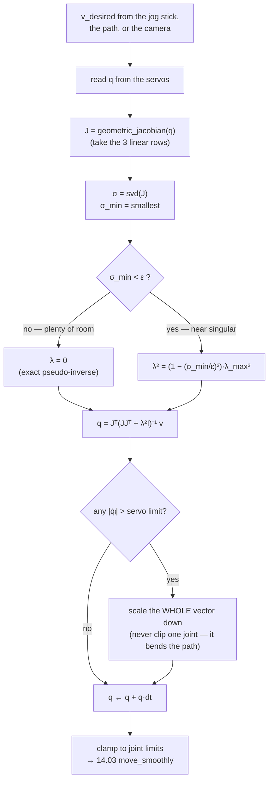

# 14.06 — The Jacobian — velocities, singularities and resolved-rate control

<!-- glance:start -->
<!-- generated by tools/build.py from curriculum/syllabus.yaml — edit the syllabus, not this block -->

| | |
|---|---|
| **Track** | Main path |
| **Difficulty** | Advanced |
| **Time** | 1 h 15 min |
| **Hardware** | none |
| **Software** | python, numpy |
| **Prerequisites** | [14.05 Inverse kinematics — analytic and numerical](14.05-inverse-kinematics.md) |
| **Optional prerequisites** | [FM.17 Calculus for robots: derivatives, rates and partial derivatives](../optional-foundations/mathematics/FM.17-derivatives.md)<br>[FM.19 Linear systems and least squares](../optional-foundations/mathematics/FM.19-linear-systems-least-squares.md) |
| **Skip if** | You use Jacobians for velocity control and can detect singularities. |

<!-- glance:end -->

## What you will learn

- Build the Jacobian of any serial arm from geometry alone, with the $z_i \times (p_{\text{tool}} - p_i)$ rule, and check it against a numerical derivative.
- Convert between joint speeds and tool speed in both directions, and read the numbers as "this pose's gear ratios".
- Detect a singularity **before** you reach it, from the smallest singular value and the manipulability measure.
- Run a resolved-rate loop that survives a singularity, using damped least squares instead of the inverse.
- Compute the joint torques a payload demands, from the same matrix transposed.

## Why it matters

Everything you have commanded so far has been a *position*. Real manipulation is full of *velocities*: "move the
gripper 3 cm to the left at 5 cm/s", "follow the edge of the table", "servo toward the object the camera sees"
([15.06](../15-manipulation/15.06-visual-servoing.md)). None of those is an IK problem. They are Jacobian problems,
and the Jacobian is what a teleop jog button, a Cartesian controller and a visual servo loop all run on.

It is also the single matrix that tells you where your arm is about to behave badly. Ask the arm to keep moving its
gripper outward at 5 cm/s: **0.9 mm** before full reach the exact inverse already demands **215 °/s** from a servo
that tops out near 300 °/s, and a few tenths of a millimetre later it asks for over **1,100 °/s**. An arm does not
"run out of workspace" gracefully; it tries, saturates, drifts off the path, and jerks. The fix — damped least
squares — is three lines of numpy, and this lesson is where you learn which three.

And the transpose of the same matrix answers a mechanical question for free: how much torque each joint needs to hold
a payload. That is how you find out whether your 16.5 kgf·cm servos can lift the thing you want to pick up
([15.01](../15-manipulation/15.01-physics-of-grasping.md)).

<!-- prereqs:start -->
## Prerequisites

You need these first:

- [14.05 Inverse kinematics — analytic and numerical](14.05-inverse-kinematics.md)

### Optional prerequisite links

New to any of these? Take the foundation lesson first; skip it if you already know it.

- [FM.17 Calculus for robots: derivatives, rates and partial derivatives](../optional-foundations/mathematics/FM.17-derivatives.md)
- [FM.19 Linear systems and least squares](../optional-foundations/mathematics/FM.19-linear-systems-least-squares.md)

Check your readiness: `python course.py why 14.06`
<!-- prereqs:end -->

## Concept

Forward kinematics is a function $p = f(q)$. The Jacobian is simply **its derivative** — but because both sides are
vectors, the derivative is a matrix, and that matrix has a very physical reading.

Think of each joint as a gear engaged with the tool. Turn joint 2 alone at 1 rad/s: the tool moves at some velocity,
in some direction. That velocity is **column 2 of the Jacobian**. Do it for every joint and you have the whole matrix:

$$v_{\text{tool}} = J(q)\,\dot q$$

Three things follow immediately, and they are the whole lesson.

1. **The gear ratios depend on where the arm is.** $J$ is a function of $q$, recomputed every control tick. A pose
   where the elbow is bent gives one set of ratios; the same arm nearly straight gives another.
2. **Going backwards is division, and division can blow up.** To get a commanded tool velocity you need
   $\dot q = J^{-1} v$. When $J$ becomes nearly non-invertible — a **singularity** — that inverse demands enormous
   joint speeds for an ordinary tool speed. Not a numerical artefact: the arm genuinely *cannot* move the tool that
   way, and the algebra reports it as infinity.
3. **The same matrix transposed converts forces into torques.** Push on the gripper with force $f$; each joint feels
   $\tau = J^T f$. One matrix, two jobs, because power is conserved: $f \cdot v = \tau \cdot \dot q$ for every motion.

The picture to hold: at each pose, spin all joints at up to 1 rad/s in every combination and mark all the tool
velocities you can produce. You get an **ellipse** (an ellipsoid in 3D). A fat round ellipse means the arm is agile in
every direction. A flat one means there is a direction where the tool can barely move — and at a singularity the
ellipse collapses to a line: one direction is *completely* lost.

> [!TIP]
> **Ask your teacher:** "Draw me the velocity ellipse of a 2-link arm at three elbow angles and tell me what the flat direction means physically."

## Technical explanation

### Level 1 — The columns, one joint at a time

Take the planar 2-link model of the SO-101's upper arm and forearm, $l_1 = 0.116$ m, $l_2 = 0.135$ m, at
$q = (30°, 60°)$. The joints sit at

```text
shoulder (0.0000, 0.0000)   elbow (0.1005, 0.0580)   tool (0.1005, 0.1930)
```

Joint 1 rotates the **whole arm** about the shoulder, so the tool moves perpendicular to the vector from the shoulder
to the tool. In 2D, "rotate a vector $r$ by 90° counter-clockwise" is $(-r_y, r_x)$:

$$J_{:,1} = \hat z \times (p_{\text{tool}} - p_{\text{shoulder}}) = (-0.1930,\; 0.1005)$$

Joint 2 rotates only what is beyond the elbow, so the same rule applies from the elbow:

$$J_{:,2} = \hat z \times (p_{\text{tool}} - p_{\text{elbow}}) = (-0.1350,\; 0.0000)$$

$$J = \begin{bmatrix} -0.1930 & -0.1350 \\ \phantom{-}0.1005 & \phantom{-}0.0000\end{bmatrix} \ \text{[m/rad]}$$

Read the second column physically: at this pose the forearm points **straight up**, so turning the elbow moves the
tool purely sideways, at 0.135 m per radian. No $y$ component at all — and the matrix says so.

Units matter: an entry of $J$ is metres per radian. Multiply by rad/s and you get m/s.

**Forward use.** Spin joint 1 at 1 rad/s and hold the elbow: the tool moves at $(-0.193, 0.1005)$ m/s, i.e.
0.2176 m/s — a 0.2176 m lever at 1 rad/s, exactly as you would expect. Spin both at
$\dot q = (20°/s, -30°/s) = (0.349, -0.524)$ rad/s:

$$v = J\dot q = (0.0033,\; 0.0351)\ \text{m/s}, \quad \|v\| = 3.52\ \text{cm/s}$$

**Backward use.** You want the tool to move 5 cm/s along $+x$ and not at all along $y$:

$$\dot q = J^{-1}\begin{pmatrix}0.05\\0\end{pmatrix} = (0.0000,\; -0.3704)\ \text{rad/s} = (0°/s,\; -21.22°/s)$$

Only the elbow turns — which is obvious once you notice that joint 2 is the only one producing pure-$x$ motion here.
The matrix found it without you having to see it.

### Level 2 — The general rule, for any arm

For a serial chain of revolute joints, with joint $i$'s axis $z_i$ (a unit vector, expressed in the base frame) and a
point $p_i$ on that axis:

$$J_i = \begin{bmatrix} z_i \times (p_{\text{tool}} - p_i) \\ z_i \end{bmatrix} \in \mathbb{R}^6$$

The top three rows are the **linear** velocity of the tool point, the bottom three its **angular** velocity. This is
the *geometric* Jacobian, and it needs nothing but the frames you already compute in FK
([14.04](14.04-forward-kinematics.md)) — no differentiation, no DH table, no symbolic algebra. `SerialChain.frames(q)`
hands you every $T_{\text{base},i}$; $z_i$ is that frame's rotation applied to the joint's own axis, and $p_i$ is its
translation.

For the SO-101 at $q = (20°, -30°, 40°, 60°, 0°)$, tool at $(0.2072, -0.0613, 0.0575)$ m:

$$J = \begin{bmatrix}
-0.0613 & -0.0556 & -0.1603 & -0.1431 & -0.0028\\
-0.1683 & \phantom{-}0.0202 & \phantom{-}0.0584 & \phantom{-}0.0521 & -0.0074\\
\phantom{-}0.0000 & -0.1488 & -0.1808 & -0.0470 & -0.0001\\ \hline
\phantom{-}0.0000 & \phantom{-}0.3420 & \phantom{-}0.3420 & \phantom{-}0.3420 & -0.3214\\
\phantom{-}0.0000 & \phantom{-}0.9397 & \phantom{-}0.9397 & \phantom{-}0.9397 & \phantom{-}0.1170\\
-1.0000 & \phantom{-}0.0000 & \phantom{-}0.0000 & \phantom{-}0.0000 & \phantom{-}0.9397
\end{bmatrix}$$

Three sanity checks you can make by eye, and should:

- **Column 1, bottom half, is $(0,0,-1)$.** `shoulder_pan` rotates about the base $z$ axis; the sign is negative
  because the URDF's first joint origin has `rpy` with a 180° roll. The arm's own frame convention, not a bug.
- **Columns 2, 3 and 4 have identical bottom halves.** `shoulder_lift`, `elbow_flex` and `wrist_flex` are all
  **parallel** — that is the arm's shoulder-elbow-wrist plane. Three parallel axes is exactly the structure that
  produces the planar model of Level 1.
- **Column 5's top half is ≈ 0** ($< 0.008$ m/rad). `wrist_roll` spins the gripper about its own approach axis and
  barely moves the tool point — the redundancy [14.05](14.05-inverse-kinematics.md) found by experiment, visible here
  as a nearly-zero column.

Always verify a hand-built Jacobian against a numerical one, which cannot be wrong in the same way:

```python
J_numeric = ak.numeric_jacobian(lambda qq: arm.fk(qq)[:3, 3], q)   # central differences
assert np.abs(J_numeric - arm.geometric_jacobian(q)[:3]).max() < 1e-8   # 3.5e-11 in practice
```

> [!NOTE]
> New to partial derivatives, or to solving an over/under-determined linear system? →
> [FM.17 Calculus for robots](../optional-foundations/mathematics/FM.17-derivatives.md) and
> [FM.19 Linear systems and least squares](../optional-foundations/mathematics/FM.19-linear-systems-least-squares.md).
> Skip them if $\partial f/\partial q$ and "least squares" are already comfortable.

### Level 3 — Singularities, measured

A singularity is where $J$ loses rank: some direction of tool motion becomes unreachable at any joint speed. For a
square $J$ that is $\det J = 0$; in general it is the smallest singular value going to zero.

For the 2-link arm the determinant is beautifully simple. With $s_2 = \sin q_2$:

$$\det J = l_1 l_2 \sin q_2 \quad\Longrightarrow\quad w = \sqrt{\det(JJ^T)} = l_1 l_2 |\sin q_2|$$

$w$ is **Yoshikawa's manipulability measure**, the volume of the velocity ellipse. It depends on $q_2$ **only**: the
arm is most agile with the elbow at exactly 90° ($w = l_1 l_2 = 0.01566$) and singular when the elbow is straight
($q_2 = 0$) or folded flat ($q_2 = \pm180°$). Both are precisely the configurations where
[14.05](14.05-inverse-kinematics.md)'s two IK solutions merged into one. That is the same fact seen from two sides:
where two solutions collide, a direction of motion disappears.

Watch what that costs as the elbow straightens ($q_1 = 30°$ throughout). $\sigma_1, \sigma_2$ are the singular values
of $J$ (the ellipse's semi-axes, in m/rad), and the last column is the joint speed the exact inverse demands for a
5 cm/s tool motion along $+x$:

| $q_2$ | reach $r$ [m] | $w$ | $\sigma_1$ | $\sigma_2$ | $\sigma_1/\sigma_2$ | max $\|\dot q\|$ for 5 cm/s |
|---|---|---|---|---|---|---|
| 120° | 0.1266 | 0.01356 | 0.1661 | 0.0817 | 2.0 | 0.43 rad/s = 25 °/s |
| 90° | 0.1780 | **0.01566** | 0.2107 | 0.0743 | 2.8 | 0.22 rad/s = 12 °/s |
| 60° | 0.2176 | 0.01356 | 0.2503 | 0.0542 | 4.6 | 0.37 rad/s = 21 °/s |
| 30° | 0.2425 | 0.00783 | 0.2761 | 0.0284 | 9.7 | 1.07 rad/s = 61 °/s |
| 10° | 0.2501 | 0.00272 | 0.2840 | 0.0096 | 29.7 | 3.75 rad/s = 215 °/s |
| 5° | 0.2508 | 0.00137 | 0.2848 | 0.0048 | 59.4 | 7.73 rad/s = **443 °/s** |
| 1° | 0.2510 | 0.00027 | 0.2850 | 0.0010 | 297 | 39.5 rad/s = **2,266 °/s** |
| 0° | 0.2510 | 0.00000 | 0.2850 | 0.0000 | ∞ | ∞ |

The numbers that matter: at $q_2 = 10°$ the arm is 0.9 mm from its reach limit and the demand is already above the
STS3215's no-load speed. **You do not have to reach the singularity to be destroyed by it.** $\sigma_2$ is the useful
alarm, because it has units (m/rad) and a physical meaning: at $\sigma_2 = 0.0096$, one radian of the worst-case joint
combination buys you 9.6 mm of tool motion in the worst direction.

**Damped least squares** replaces the exact inverse with the solution of a regularised problem
$\min \|J\dot q - v\|^2 + \lambda^2\|\dot q\|^2$:

$$\boxed{\dot q = J^{T}\left(JJ^{T} + \lambda^2 I\right)^{-1} v}$$

Exactly the equation [14.05](14.05-inverse-kinematics.md) used for IK steps, applied now to velocities. In SVD terms
it replaces each $1/\sigma_i$ by $\sigma_i/(\sigma_i^2 + \lambda^2)$, which is $\approx 1/\sigma_i$ when
$\sigma_i \gg \lambda$ and goes smoothly to **zero** when $\sigma_i \to 0$, peaking at $1/(2\lambda)$. That single
substitution turns "infinite joint speed" into "give up on the impossible direction".

At $q_2 = 1°$, asking for 5 cm/s along $+x$:

| $\lambda$ | $\dot q$ [°/s] | achieved $v$ [m/s] | velocity error |
|---|---|---|---|
| 0 | (1213, −2266) | (0.0500, 0.0000) | 0 — and unexecutable |
| 0.001 | (579, −1087) | (0.0307, −0.0114) | 0.022 m/s |
| 0.01 | (6.6, −23.1) | (0.0133, −0.0217) | 0.043 m/s |
| 0.02 | (−1.7, −7.6) | (0.0130, −0.0218) | 0.043 m/s |
| 0.05 | (−3.9, −3.2) | (0.0126, −0.0213) | 0.043 m/s |

$\lambda$ has units of m/rad — the same units as $\sigma$ — and you choose it as *the smallest singular value you are
willing to invert honestly*. $\lambda = 0.01$ means "don't try to exploit any direction worth less than 1 cm per
radian". Everything from 0.01 upward behaves the same here, which is the point: the answer is no longer sensitive to
how close you are to the singularity.

**The force side.** The same matrix, transposed, maps an end-effector wrench to joint torques:

$$\tau = J^T f$$

At the 2-link pose above with a 200 g payload ($f = (0, -1.962)$ N, straight down in the arm's vertical plane):

$$\tau = J^T f = \begin{bmatrix}-0.1930 & 0.1005\\ -0.1350 & 0.0000\end{bmatrix}\begin{pmatrix}0\\-1.962\end{pmatrix}
= (-0.1972,\; 0.0000)\ \text{N·m}$$

The shoulder needs 0.197 N·m = 2.01 kgf·cm; **the elbow needs nothing at all**, because the tool is directly above the
elbow, so gravity's line of action passes through the elbow axis and produces no moment there. On the real 5-DOF arm
at $q = (20°, -30°, 40°, 60°, 0°)$, the same 200 g gives

```text
shoulder_pan   +0.0000 N·m    (vertical axis: gravity never loads it)
shoulder_lift  +0.2919 N·m  = 2.98 kgf·cm
elbow_flex     +0.3547 N·m  = 3.62 kgf·cm
wrist_flex     +0.0923 N·m  = 0.94 kgf·cm
wrist_roll     +0.0001 N·m
```

and fully extended at $q = 0$ the worst joint climbs to **0.632 N·m = 6.44 kgf·cm** — 39 % of the STS3215's 16.5
kgf·cm stall torque, for the payload alone, before the arm's own weight (which this calculation ignores; it is the
*payload* Jacobian, not a dynamics model). That is why the arm sags near full extension and why
[14.11](14.11-arm-safety.md) keeps the workspace box well inside the geometric reach.

### Level 4 — Resolved-rate control

The control loop this all exists for:

```text
every dt:   read q  →  J = jacobian(q)  →  q̇ = dls(J, v_desired, λ)
            →  clip q̇ to the servo limits  →  q ← q + q̇·dt  →  command q
```

That is "resolved-rate motion control" (Whitney, 1969), and it is what a Cartesian jog button does. It needs no IK at
all: it never solves for a pose, it just integrates. The cost is drift — integrating an approximation accumulates
error — so a real implementation either closes the loop on measured tool pose (visual servoing,
[15.06](../15-manipulation/15.06-visual-servoing.md)) or periodically re-anchors with IK.

`arm_viz.py resolved-rate` runs exactly this, driving the 2-link tip straight outward at 5 cm/s **through** the reach
limit at 0.251 m. With $\lambda = 0$:

```text
λ = 0.00 : max |q̇| = 20.00 rad/s = 1146 °/s (saturated), final tip x = 0.2473 m
λ = 0.02 : max |q̇| =  1.10 rad/s =   63 °/s,             final tip x = 0.2505 m
```

Read that carefully, because it is the opposite of what people expect. The **undamped** controller, the one that
insists on exactness, ends up *further from the goal* (0.2473 m) than the damped one (0.2505 m) — after demanding
joint speeds four times any servo's limit. It threw the arm past the singularity and out the other side. Damping is
not a compromise here; it is strictly better as soon as the servos have limits, which they always do.

Two refinements worth knowing:

- **Variable damping.** Keep $\lambda = 0$ when $\sigma_{\min}$ is comfortable and ramp it up only inside a threshold
  $\epsilon$: $\lambda^2 = (1 - (\sigma_{\min}/\epsilon)^2)\lambda_{\max}^2$ when $\sigma_{\min} < \epsilon$, else 0.
  Full accuracy everywhere except where it would hurt (Nakamura & Hanafusa, 1986; Chiaverini et al., 1994).
- **Redundancy resolution.** A 5-DOF arm doing a 3-DOF position task has two spare dimensions. The general solution
  is $\dot q = J^{+}v + (I - J^{+}J)\dot q_0$, where the second term lives in the null space: it moves the joints
  **without moving the tool at all**. Point $\dot q_0$ away from the joint limits, or in the direction that increases
  $w$, and the arm stays out of trouble while the tool obeys you.

> [!TIP]
> **Ask your teacher:** "Show me the null-space term on the SO-101: a joint motion that leaves the gripper exactly where it is."

## Diagram

```text
 The velocity ellipse: what the tool can do when |q̇| ≤ 1 rad/s

   q2 = 90°  (best)              q2 = 30°                    q2 → 0  (SINGULAR)

        ╭───────╮                    ╱‾‾‾╲                        ────────
      ╭─╯       ╰─╮                ╱       ╲                     (a line segment)
      │     ●     │              ╱     ●     ╲                        ●
      ╰─╮       ╭─╯                ╲       ╱                    ── no motion ──
        ╰───────╯                    ╲___╱                        across the line

    σ = 0.211, 0.074             σ = 0.276, 0.028            σ = 0.285, 0.000
    w = 0.01566                  w = 0.00783                 w = 0
    fat: agile in every          flat: cheap along the       collapsed: the radial
    direction                    arm, expensive across       direction is GONE

                    l1 = 0.116, l2 = 0.135, semi-axes in m/rad


 Why the singularity is at full stretch:

        shoulder ●━━━━━━━━●━━━━━━━━━► tool          Both links pull along the SAME line.
                   l1      l2                       Any joint motion moves the tip
                   ◄── r = l1 + l2 ──►              ACROSS that line (a circle), never
                                                    ALONG it. Radial velocity: impossible.
```



## Code

Everything is in [`code/arm_kinematics.py`](code/arm_kinematics.py), already used by
[14.05](14.05-inverse-kinematics.md)'s IK solver. The planar Jacobian is the $\hat z \times r$ rule, literally:

```python
def planar_jacobian(lengths, q, with_orientation=False):
    pts = planar_joint_points(lengths, q)          # base, every joint, the tip
    tip = pts[-1]
    J = np.zeros((3 if with_orientation else 2, len(q)))
    for j in range(len(q)):
        r = tip - pts[j]                           # from joint j to the tip
        J[0, j] = -r[1]                            # z x r  in 2D
        J[1, j] = r[0]
        if with_orientation:
            J[2, j] = 1.0                          # every revolute joint adds 1 rad/s of tip spin
    return J
```

The 3D version is the same rule with a real cross product:

```python
def geometric_jacobian(self, q):
    frames = self.frames(q)                        # [(link, T_base_link)] from FK
    p_tool = frames[-1][1][:3, 3]
    J = np.zeros((6, self.n_dof))
    col = 0
    for (_, T), joint in zip(frames, self.joints):
        if joint.type != "revolute":
            continue
        z = T[:3, :3] @ (np.asarray(joint.axis) / np.linalg.norm(joint.axis))
        p = T[:3, 3]
        J[:3, col] = np.cross(z, p_tool - p)       # linear
        J[3:, col] = z                             # angular
        col += 1
    return J
```

And the damped inverse — the three lines the lesson is about:

```python
def dls_solve(J, e, damping):
    """dq = J^T (J J^T + lambda^2 I)^-1 e.  damping = 0 is the pseudo-inverse."""
    m = J.shape[0]
    return J.T @ np.linalg.solve(J @ J.T + (damping ** 2) * np.eye(m), e)
```

Run them:

```bash
cd 14-robotic-arm/code
py arm_viz.py ellipses          # the velocity ellipses of the diagram, to PNG
py arm_viz.py resolved-rate     # pseudo-inverse vs damped LS through the reach limit
```

```python
# a REPL session worth doing by hand, from 14-robotic-arm/code
import numpy as np, arm_kinematics as ak
arm = ak.load_so101()
q = np.radians([20, -30, 40, 60, 0])
J = arm.geometric_jacobian(q)[:3]              # linear rows only: a 3-DOF position task
print(np.linalg.svd(J, compute_uv=False))      # [0.3213 0.1793 0.0980]
print(ak.manipulability(J))                    # 0.005647
print(J.T @ np.array([0, 0, -0.2 * 9.81]))     # joint torques for a 200 g payload [N·m]
```

## Exercise

### Exercise 14.06-E1 — The Jacobian by hand `[numerical]`

Hardware: none. For the planar arm $l_1 = 0.116$, $l_2 = 0.135$ at $q = (30°, 60°)$:

1. Compute the three points (shoulder, elbow, tool) and build $J$ with the $\hat z \times r$ rule. No calculus.
2. Predict the tool velocity for $\dot q = (0, 1)$ rad/s **before** multiplying. Then multiply.
3. Find $\dot q$ that moves the tool at 5 cm/s along $+x$, and again at 5 cm/s along $+y$. Compare the two joint-speed
   magnitudes and say which direction this pose is "geared for".
4. Verify every number with `ak.planar_jacobian` and with `ak.numeric_jacobian(lambda qq: np.array(ak.planar_fk((l1, l2), qq)[:2]), q)`.

### Exercise 14.06-E2 — Implement the Jacobian toolkit `[coding]`

Hardware: none. Implement `planar_jacobian`, `manipulability`, `singular_values`, `dls_velocity`,
`scale_to_limits` and `payload_torques` in `labs/exercises/14.06/student.py`. The tests check your Jacobian against a
central-difference derivative of FK at 200 random poses, pin $w = l_1 l_2 |\sin q_2|$, verify that `dls_velocity`
equals the exact inverse when $\lambda = 0$ and stays bounded at the singularity, and check the torque duality
$f \cdot v = \tau \cdot \dot q$.

Check it: `python course.py check 14.06` (or `py -m pytest labs/exercises/14.06`).

### Exercise 14.06-E3 — Predict the blow-up `[predict]`

Hardware: none. The 2-link arm is at $q = (30°, 20°)$ and you command the tip at 5 cm/s along $+x$.

1. **Predict**, before computing: is the required joint speed closer to 30 °/s, 100 °/s or 400 °/s? Write your guess
   down.
2. Compute it exactly. Then compute $q_2 = 10°$, $5°$ and $2°$, and find the elbow angle at which the demand first
   exceeds 300 °/s (a plausible servo limit).
3. Convert that elbow angle into a **radius**: how many millimetres from full extension does your usable workspace
   actually end? Compare with the workspace box you will set in [14.11](14.11-arm-safety.md).

### Exercise 14.06-E4 — Resolved rate, with and without damping `[coding]`

Hardware: none. Write the loop of Level 4 for the 2-link arm: start at $(0.20, 0.03)$ (elbow-down branch), command
$v = (0.05, 0)$ m/s for 4 s at 100 Hz, and log the maximum $|\dot q|$ and the tip position. Run it with
$\lambda \in \{0, 0.005, 0.02, 0.05\}$ and a joint-speed saturation of 5 rad/s.

Report, for each $\lambda$: the peak joint speed *demanded* (before saturation), the final tip $x$, and the largest
deviation from the commanded straight line in $y$. Then add variable damping ($\epsilon = 0.02$, $\lambda_{max} = 0.05$)
and show it beats every fixed $\lambda$ on at least one of those three metrics.

### Exercise 14.06-E5 — Can the servo hold it? `[numerical]`

Hardware: none (a real arm is optional for the last step — `arm`).

Compute $\tau = J^T f$ for a 200 g payload at five SO-101 poses: $q = 0$ (fully extended), the mid-reach pose
$(20°, -30°, 40°, 60°, 0°)$, and three of your own choosing including one close to the base. For each, report the
worst joint torque in N·m **and** as a percentage of the STS3215's 16.5 kgf·cm (7.4 V) stall torque.

Then answer with numbers: what is the heaviest payload the arm can hold at full extension if you cap servo torque at
the 30 % used in [14.03](14.03-controlling-servos.md)? If you have the arm, verify the direction of the effect (not the
number) by reading `Present_Load` at two poses while holding the same object.

## Expected result

- **14.06-E1:** Points $(0,0)$, $(0.1005, 0.0580)$, $(0.1005, 0.1930)$;
  $J = \begin{bmatrix}-0.1930 & -0.1350\\ 0.1005 & 0\end{bmatrix}$. For $\dot q = (0,1)$: $v = (-0.135, 0)$ m/s —
  pure $-x$, because the forearm points straight up. For 5 cm/s along $+x$: $\dot q = (0, -21.22°/s)$. For 5 cm/s
  along $+y$: $\dot q = (28.5°/s, -40.8°/s)$, i.e. $\|\dot q\| = 0.87$ rad/s versus 0.37 rad/s for the $x$ move — this
  pose is geared for $x$ motion. Both library calls agree to better than $10^{-11}$.
- **14.06-E2:** `python course.py check 14.06` passes with nothing skipped (about 20 tests, under 3 s). The usual
  failures: building the Jacobian from the *previous joint* instead of the tip; forgetting that
  $\hat z \times r = (-r_y, r_x)$ and not $(r_y, -r_x)$; and writing `dls_velocity` as
  $(J^TJ + \lambda^2 I)^{-1}J^T v$ — algebraically the same vector, but it inverts an $n \times n$ matrix instead of
  an $m \times m$ one and blows up at $\lambda = 0$ for a redundant arm, where $J^TJ$ is singular by construction.
- **14.06-E3:** The true answer at $q_2 = 20°$ is 1.748 rad/s = **100 °/s** — and then it explodes: 215 °/s at 10°,
  443 °/s at 5°, 1,127 °/s at 2°. The 300 °/s threshold is crossed at $q_2 = 7.28°$, which is $r = 0.25050$ m —
  **0.50 mm** short of the 0.2510 m reach limit. Do not let that fool you into a 1 mm safety margin: the demand is
  already 215 °/s at 0.9 mm out, and the arm is unusable long before it is impossible. At $q_2 = 30°$
  ($r = 0.2425$ m, **8.5 mm** of margin) the demand is a comfortable 61 °/s. Any workspace-box margin between 1 and
  2 cm is defensible; zero is not.
- **14.06-E4:** With a 5 rad/s saturation, 100 Hz and 4 s (exact values shift with `dt`, the trend does not):

  | $\lambda$ | peak demanded $\|\dot q\|$ | final tip $x$ | max $\|\Delta y\|$ |
  |---|---|---|---|
  | 0 | **1,229 rad/s** | 0.2494 m | 2.7 mm |
  | 0.005 | 4.27 rad/s | 0.2505 m | 13.6 mm |
  | 0.02 | 1.10 rad/s | 0.2505 m | 14.2 mm |
  | 0.05 | 0.44 rad/s | 0.2506 m | 17.8 mm |
  | variable ($\epsilon = 0.02$, $\lambda_{\max} = 0.05$) | 2.12 rad/s | 0.2505 m | 14.0 mm |

  Three things to take away. (1) The undamped run demands **1,229 rad/s** — 70,000 °/s — so every number it produces
  afterwards is fiction; saturation, not your controller, decided what the arm did. (2) Despite that, it ends
  *further* from the limit (0.2494 m) than any damped run. (3) The $y$ deviation grows with $\lambda$ because damping
  trades path accuracy for boundedness — and all of it happens in the last centimetre, where the commanded straight
  line was never achievable anyway. Variable damping gets the best of both: full accuracy until
  $\sigma_{\min} < 0.02$, a peak demand of 2.12 rad/s, and the same final $x$ as the best fixed $\lambda$.
- **14.06-E5:** At $q = 0$ (tool at $(0.391, 0, 0.227)$, 0.452 m from the base): `shoulder_lift` 0.632 N·m
  (6.44 kgf·cm, **39 %** of stall), `elbow_flex` 0.577 N·m, `wrist_flex` 0.312 N·m. At the mid-reach pose:
  `elbow_flex` 0.355 N·m (3.62 kgf·cm, 22 %). `shoulder_pan` is 0.000 N·m at every pose — a vertical axis carries no
  gravity moment. With torque capped at 30 % of stall (0.485 N·m) the arm cannot even hold the 200 g payload at full
  extension: the limit payload there is $0.485/0.632 \times 200 \approx 153$ g, and that is before the arm's own link
  weight, which dominates on a 550 g arm. Real answer: **keep the payload near the base and the elbow bent.** On
  hardware, `Present_Load` rises clearly between a folded pose and an extended one with the same object; treat the
  absolute value as indicative only (it is an uncalibrated PWM-duty proxy, not a torque sensor).

## Troubleshooting

### Symptom: my Jacobian disagrees with the numerical one

Do this in order; it localises the bug in about a minute.

1. **Compare column by column, not matrix norm.** One wrong column tells you which joint's geometry you got wrong;
   a norm tells you nothing.
2. **If only the bottom (angular) rows are wrong**, your $z_i$ is in the wrong frame. It must be the joint axis
   expressed in the **base** frame: `T_base_i[:3,:3] @ axis_local`, not `axis_local`.
3. **If only the top (linear) rows are wrong**, check the cross-product order. $z \times (p_{\text{tool}} - p_i)$, not
   $(p_{\text{tool}} - p_i) \times z$. The sign flips and it looks plausible.
4. **If exactly one column is zero and shouldn't be**, $p_i$ is the tool point (so $r = 0$). You took the frame of the
   wrong link.
5. **If everything is out by a constant factor**, you are mixing degrees and radians. $J$ is metres per **radian**.

### Symptom: the arm shudders or lunges during a Cartesian jog

Print $\sigma_{\min}$ every tick and plot it. If it drops below about $10\lambda$ when the shudder starts, you are
near a singularity: raise $\lambda$, add variable damping, or stop the jog with a workspace box. If $\sigma_{\min}$
is healthy, the problem is not the Jacobian — look at the servo rate limits and the command rate
([14.03](14.03-controlling-servos.md)), and at whether you are re-reading $q$ every tick or integrating open-loop.

### Symptom: the tool drifts off the commanded straight line

Two separate causes, distinguished by *when*:

- **Drift that grows steadily** = open-loop integration error. $q \leftarrow q + \dot q\,dt$ is Euler's method on an
  approximation. Re-anchor with IK every 10–20 ticks, or reduce `dt`.
- **Drift that appears suddenly near the edge** = damping. Damped least squares deliberately gives up accuracy for
  boundedness; the error in the table above is 4.3 cm/s of the requested 5 cm/s, all of it in the radial direction.
  That is not a bug, it is the arm telling you it cannot go there.

### Symptom: one joint saturates and the path bends

You clipped that joint's speed individually. Clipping one component of $\dot q$ changes the *direction* of the tool
motion, which is almost always worse than being slow. Scale the whole vector by
`min(1, limit / max(abs(qd)))` — same direction, lower speed.

### Symptom: `numpy.linalg.LinAlgError: Singular matrix`

You called `np.linalg.solve` or `inv` on $J$ at (or extremely near) a singularity, which is exactly what this lesson
says not to do. Use `dls_solve` with $\lambda > 0$, or `np.linalg.pinv` with an `rcond` you chose deliberately. Note
that the error is the *lucky* outcome — a hair away from singular you get no error and a nonsense answer.

## Common mistakes

- **Computing $J$ once and reusing it.** It is a function of $q$ and changes completely across a move. Recompute
  every tick.
- **Inverting $J$ directly.** Works in the demo, fails on the robot. Damp it.
- **Treating the 6-row Jacobian as one object when your task is 3-DOF.** For a position task use `J[:3]`; mixing
  metres and radians in one matrix without weights makes the SVD meaningless (the same units problem as
  `pitch_weight` in [14.05](14.05-inverse-kinematics.md)).
- **Watching $\det J$ instead of $\sigma_{\min}$.** The determinant is only defined for a square $J$, and it scales
  with the product of *all* singular values — a large $\det$ can still hide one tiny $\sigma$.
- **Using manipulability $w$ as a safety threshold without units.** $w$ has units of m$^n$/rad$^n$ and its magnitude
  means nothing across arms. $\sigma_{\min}$ (m/rad) is comparable, interpretable and what you should alarm on.
- **Forgetting that $\tau = J^Tf$ ignores the arm's own weight.** It is the *payload* torque only. A gravity-torque
  model needs link masses and centres of mass (module 16's dynamics).
- **Clipping instead of scaling** when a joint speed exceeds its limit. It silently rotates your Cartesian direction.

## Knowledge check

1. What are the units of a linear Jacobian entry, and what does an entry of 0.135 mean physically?
   <details><summary>Answer</summary>

   Metres per radian. An entry $J_{xj} = 0.135$ means: turning joint $j$ at 1 rad/s, with all other joints held,
   moves the tool at 0.135 m/s along the base $x$ axis. Equivalently, that joint is a "gear" with a 0.135 m lever arm
   in the $x$ direction at this pose.
   </details>

2. The 2-link arm has $w = l_1 l_2 |\sin q_2|$. Why does $q_1$ not appear?
   <details><summary>Answer</summary>

   $q_1$ rotates the whole arm rigidly about the base. Rotating a mechanism does not change what it *can* do — it
   rotates the velocity ellipse along with the arm, keeping its shape and area. Only the internal shape of the arm,
   which here is entirely $q_2$, affects manipulability.
   </details>

3. Predict: you command the tip of the 2-link arm straight outward at 5 cm/s with $\lambda = 0$, at $q_2 = 5°$. What
   joint speed is demanded, and what will the servo actually do?
   <details><summary>Answer</summary>

   7.73 rad/s = **443 °/s**, about 1.5× the STS3215's no-load speed and far beyond any safe limit. The servo will
   saturate at its own maximum, so the *ratio* between the two joint speeds is destroyed, the tool leaves the
   commanded direction, and the motion looks like a jerk. Nothing in the algebra warned you — only $\sigma_{\min}$
   would have.
   </details>

4. Your arm is 1 cm from full extension and you need to keep moving outward. Name three legitimate responses.
   <details><summary>Answer</summary>

   (a) Damp: accept that the radial component stops while lateral motion continues (DLS does this automatically).
   (b) Stop and re-plan: the target is outside the usable workspace, so move the *base* (or the object) instead.
   (c) Re-plan the task in joint space so the arm approaches the target from a different, better-conditioned
   configuration. What is *not* legitimate: raising the joint speed limit.
   </details>

5. A force of 5 N pushes straight down on the gripper at a pose where the linear Jacobian's third row is
   $(0, -0.149, -0.181, -0.047, 0)$ m/rad. Which joint feels the most torque, and how much?
   <details><summary>Answer</summary>

   $\tau = J^Tf$ with $f = (0,0,-5)$ picks out that row times $-5$: $\tau = (0, 0.744, 0.904, 0.235, 0)$ N·m.
   `elbow_flex` feels the most, 0.904 N·m — which is 56 % of the STS3215's 1.618 N·m stall torque, from a push of
   about half a kilogram.
   `shoulder_pan` feels nothing: its axis is vertical, parallel to the force.
   </details>

6. Why is damped least squares *better*, not just safer, than the exact inverse when the servos have speed limits?
   <details><summary>Answer</summary>

   Because the exact inverse's answer is unexecutable, and an unexecutable command gets mangled by saturation into
   something with the wrong direction. DLS returns the best *executable* command, so the arm keeps following the
   achievable part of the motion. In the measured run, the damped controller ends 3 mm closer to the goal than the
   undamped one.
   </details>

7. The SO-101's `wrist_roll` column has a near-zero top half. What does that imply for a position-only task, and for
   the null space?
   <details><summary>Answer</summary>

   For a position task `wrist_roll` contributes almost nothing, so the position Jacobian is effectively 3×4 rather
   than 3×5, and $\sigma_{\min}$ of the full 3×5 matrix is dominated by the other columns. `wrist_roll` is very nearly
   a pure null-space direction: you can spin it freely without moving the tool point — which is exactly the redundant
   family [14.05](14.05-inverse-kinematics.md) found when it solved the same target from 60 seeds.
   </details>

8. You must alarm at "getting close to a singularity". Would you threshold on $\det J$, on $w$, or on
   $\sigma_{\min}$, and what value?
   <details><summary>Answer</summary>

   $\sigma_{\min}$, because it has interpretable units (m/rad) and directly bounds the worst-case joint speed:
   $\|\dot q\| \le \|v\|/\sigma_{\min}$. Pick it from your servo limit: with a 300 °/s = 5.2 rad/s limit and a 5 cm/s
   task, you need $\sigma_{\min} \ge 0.05/5.2 \approx 0.010$ m/rad. That is the $q_2 \approx 10°$ row of the table, and
   it is also a sensible $\lambda$.
   </details>

## Practical challenge

Build `jog.py`: a Cartesian jog controller for the SO-101 that cannot be made to misbehave.

Acceptance criteria:

- Takes a desired tool velocity (from keys, a gamepad, or a scripted sequence) and runs a resolved-rate loop at
  50 Hz, reading $q$ each tick and commanding through [14.03](14.03-controlling-servos.md)'s `move_smoothly` or a
  direct goal write with the servo speed limits set.
- Variable damping: $\lambda = 0$ when $\sigma_{\min} > \epsilon$, ramping to $\lambda_{\max}$ as
  $\sigma_{\min} \to 0$. Both constants configurable, with your chosen defaults justified in a comment by the servo
  speed limit.
- Whole-vector speed scaling (never per-joint clipping), plus a joint-limit barrier: as a joint approaches its limit,
  a null-space term pushes it back **without** disturbing the commanded tool velocity. Prove the null-space property
  numerically ($\|J\dot q_{\text{null}}\| < 10^{-9}$).
- A workspace box: the loop refuses to integrate outside it and reports which face it hit.
- Runs against `FakeArmBus` with no hardware, and a pytest suite that drives it into (a) the reach singularity, (b) a
  joint limit, (c) a wall of the box, and asserts that the maximum commanded joint speed never exceeds the limit and
  the tool never leaves the box.
- A plot of $\sigma_{\min}$, $\lambda$ and $\max|\dot q|$ over a scripted run that deliberately drives at the
  singularity.

## You can skip this if…

You can answer knowledge-check questions 1, 3 and 8 without looking, you can build a geometric Jacobian for an
arbitrary serial chain from its frames, and you have written a resolved-rate loop with damped least squares before.
Then: `python course.py skip 14.06 --reason "built Jacobians and DLS resolved-rate control before"`.

## Go deeper

- Lynch & Park, *Modern Robotics*, chapter 5 "Velocity kinematics and statics" — the geometric Jacobian, singularities,
  manipulability ellipsoids and the force duality, with free videos: https://hades.mech.northwestern.edu/index.php/Modern_Robotics
- Yoshikawa, "Manipulability of Robotic Mechanisms", *IJRR* 4(2):3–9, 1985 — the original definition of
  $w = \sqrt{\det JJ^T}$ (paywalled; the definition is reproduced in *Modern Robotics* §5.4):
  https://doi.org/10.1177/027836498500400201
- Buss, "Introduction to Inverse Kinematics with Jacobian Transpose, Pseudoinverse and Damped Least Squares" — the
  clearest short derivation of DLS and of the SVD view of $\sigma/(\sigma^2+\lambda^2)$:
  https://mathweb.ucsd.edu/~sbuss/ResearchWeb/ikmethods/iksurvey.pdf
- Chiaverini, Siciliano & Egeland, "Review of the damped least-squares inverse kinematics with experiments on an
  industrial robot manipulator", *IEEE T-CST* 2(2):123–134, 1994 — where variable damping comes from (paywalled):
  https://doi.org/10.1109/87.294335
- Peter Corke's Robotics Toolbox for Python — `robot.jacob0(q)`, `robot.manipulability(q)`; a second implementation to
  check yours against: https://github.com/petercorke/robotics-toolbox-python
- QUT Robot Academy, "Velocity kinematics" lessons — short videos if you want the ellipse explained out loud:
  https://robotacademy.net.au/
- Foundations in this course, if the calculus or the least-squares machinery is new:
  [FM.17 Calculus for robots](../optional-foundations/mathematics/FM.17-derivatives.md),
  [FM.19 Linear systems and least squares](../optional-foundations/mathematics/FM.19-linear-systems-least-squares.md)

## Progress checkpoint

- [ ] I can build a Jacobian from geometry and verify it against a numerical derivative.
- [ ] I can convert joint speeds to tool speed and back, and say which direction a pose is geared for.
- [ ] I detect singularities with $\sigma_{\min}$ and know what threshold my servos imply.
- [ ] I use damped least squares, and can explain why it beats the exact inverse on a real arm.
- [ ] I can compute the joint torques a payload demands with $\tau = J^T f$.

`python course.py complete 14.06` (exercises done) · `python course.py master 14.06` (challenge done) ·
`python course.py struggle 14.06 "what was hard"`

Next: [14.07 — Trajectories — joint vs Cartesian, trapezoidal and cubic profiles](14.07-trajectories.md).
