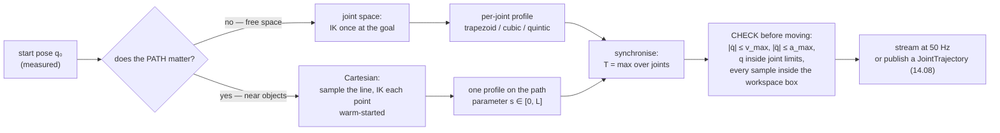

# 14.07 — Trajectories — joint vs Cartesian, trapezoidal and cubic profiles

<!-- glance:start -->
<!-- generated by tools/build.py from curriculum/syllabus.yaml — edit the syllabus, not this block -->

| | |
|---|---|
| **Track** | Main path |
| **Difficulty** | Intermediate |
| **Time** | 1 h |
| **Hardware** | none |
| **Software** | python, numpy |
| **Prerequisites** | [14.05 Inverse kinematics — analytic and numerical](14.05-inverse-kinematics.md) |
| **Skip if** | You generate smooth, time-parameterized trajectories. |

<!-- glance:end -->

## What you will learn

- Explain why sending a goal position is not a motion command, and what a *trajectory* adds to it.
- Compute a trapezoidal profile by hand: acceleration time, cruise time, total time, and whether it degenerates into a triangle.
- Choose between trapezoidal, cubic and quintic profiles from the limits that actually bind, with the durations to prove it.
- Synchronise several joints so they start and finish together, instead of arriving one at a time.
- Decide, for a given move, whether to interpolate in joint space or in Cartesian space — and know what the arc between two poses will cost you.

## Why it matters

So far a move has been "go to these angles" — and what the arm does between here and there has been the servo's
business. That is fine for the first powered session and unacceptable for everything after it. Three things break:

**The path is a surprise.** Interpolating joint angles makes the gripper travel an arc, not a line. For a 20 cm
sideways move on the SO-101 the arc bulges **22.5 mm** forward of the straight line — enough to sweep the cup that
was sitting safely in front of the arm.

**The timing is a surprise.** Each joint runs at its own speed limit, so a 60° shoulder move and a 20° wrist move
that start together end 0.7 s apart. The intermediate poses are ones nobody designed and nobody checked.

**The acceleration is a surprise.** A step change in the goal register is an infinite acceleration request. The servo
does something — its own internal ramp, or a lurch — and that something is not in your model, not repeatable, and hard
on both the gearbox and your grip on the payload.

A trajectory replaces all three surprises with numbers: position, velocity and acceleration for every joint at every
instant, computed before anything moves. It is also exactly what [14.08](14.08-arm-urdf-and-ros2-control.md)'s
`joint_trajectory_controller` and [14.09](14.09-moveit2-motion-planning.md)'s MoveIt consume — this lesson is the
content of the message they pass around.

<!-- prereqs:start -->
## Prerequisites

You need these first:

- [14.05 Inverse kinematics — analytic and numerical](14.05-inverse-kinematics.md)

### Optional prerequisite links

None.

Check your readiness: `python course.py why 14.07`
<!-- prereqs:end -->

## Concept

A move has two independent questions, and confusing them is the main source of trouble:

1. **What path does the gripper follow through space?** — geometry, no time in it at all.
2. **How fast do we travel along that path?** — the *time parameterisation*.

Answer question 2 and you get a **profile**: how a single number (a joint angle, or a distance along a path) evolves
from start to finish. Answer question 1 first and you have chosen between two families:

| | Joint-space trajectory | Cartesian trajectory |
|---|---|---|
| You interpolate | the joint angles | the tool pose |
| The gripper path is | whatever the geometry produces (an arc) | exactly what you asked for (a line, a circle) |
| IK calls | one, at the goal | one per sample — 50 per second |
| Speed | fastest the joints allow | limited by the worst-conditioned pose on the path |
| Singularities | never a problem (you never invert $J$) | can make the path impossible mid-way |
| Use it for | free space: "get from here to roughly there" | contact and precision: approach, retreat, pouring, wiping |

The distributed-systems reading: a joint-space move is "eventually consistent" — you specify the endpoints and let
the system find its way. A Cartesian move is a strongly-ordered stream of intermediate states, and you pay for that
ordering in compute (an IK solve per sample) and in fragility (any sample can fail).

Real arms use both, in the same task. A pick is: joint-space move to a pre-grasp pose 10 cm above the object (fast,
don't care about the path), then a **Cartesian straight line** down to the grasp (slow, path matters, don't swing into
the object), close the gripper, Cartesian straight line back up, joint-space move to the place pose. That sequence is
the whole of [15.08](../15-manipulation/15.08-pick-and-place-pipeline.md), and it exists because of this table.

> [!TIP]
> **Ask your teacher:** "Draw the gripper path for a joint-space move between two poses, and tell me where the arc bulges and why."

## Technical explanation

### Level 1 — Why a goal is not a motion

Write a new value into the servo's `Goal_Position` and you have specified a discontinuity. The servo fills in the gap
with its own internal profile — the `Goal_Velocity` and `Acceleration` registers of
[14.03](14.03-controlling-servos.md) — which is a *safety net*, not a plan:

- It is per-joint, so joints finish at different times.
- You cannot query it, so you cannot check the intermediate poses for collisions.
- It is the servo firmware's behaviour, not yours, so it changes between servo models.

A trajectory is the opposite: an explicit function $q(t), \dot q(t), \ddot q(t)$ for every joint, computed in advance,
inspectable, checkable against your limits, and identical in simulation and on hardware. You then stream it at a fixed
rate (50 Hz here) and each servo only ever sees small steps.

### Level 2 — The trapezoidal profile

The minimum-time profile for one coordinate under both a velocity limit $v_{\max}$ and an acceleration limit
$a_{\max}$ is: accelerate at $a_{\max}$, cruise at $v_{\max}$, decelerate at $a_{\max}$.

Reaching cruise speed takes $t_a = v_{\max}/a_{\max}$ and covers $\tfrac12 a_{\max} t_a^2 = v_{\max}^2/(2a_{\max})$.
Accelerating and decelerating together therefore consume $v_{\max}^2/a_{\max}$ of the distance $D = |q_1 - q_0|$. So:

$$
T = \begin{cases}
\dfrac{v_{\max}}{a_{\max}} \cdot 2 + \dfrac{D - v_{\max}^2/a_{\max}}{v_{\max}}
 = \dfrac{D}{v_{\max}} + \dfrac{v_{\max}}{a_{\max}} & \text{if } D \ge \dfrac{v_{\max}^2}{a_{\max}}\quad\text{(trapezoid)}\\[3mm]
2\sqrt{\dfrac{D}{a_{\max}}} & \text{otherwise}\quad\text{(triangle, peak } v = \sqrt{D\,a_{\max}})
\end{cases}
$$

**Worked example**, a 90° joint move with $v_{\max} = 60°/s$ and $a_{\max} = 120°/s^2$:

$$t_a = \frac{60}{120} = 0.5\ \text{s}, \qquad \text{distance while accelerating} = \tfrac12 \cdot 120 \cdot 0.5^2 = 15°$$

Two ramps use 30° of the 90°, leaving 60° of cruise at 60°/s = 1.0 s. Total $T = 0.5 + 1.0 + 0.5 = 2.0$ s, which is
also $D/v_{\max} + v_{\max}/a_{\max} = 1.5 + 0.5$.

**The triangle case.** The same limits for a 20° move: $v_{\max}^2/a_{\max} = 30°$ > 20°, so the joint never reaches
60°/s. $T = 2\sqrt{20/120} = 0.816$ s and the peak speed is $\sqrt{20 \cdot 120} = 49.0°/s$. The break-even distance
is exactly 30°: shorter moves are acceleration-limited, longer ones velocity-limited. Knowing which regime you are in
tells you which limit to raise when a motion is too slow — raising $v_{\max}$ for a 20° move changes nothing at all.

The trapezoid's flaw is **infinite jerk**: acceleration jumps from 0 to $a_{\max}$ instantaneously at $t = 0$. Real
hardware answers with a small vibration; a payload in the gripper answers by sliding. The S-curve fix (limiting jerk
too) is what industrial controllers use and what `time_optimal_trajectory_generation` produces in MoveIt.

### Level 3 — Polynomial profiles

A cubic $q(t) = a_0 + a_1t + a_2t^2 + a_3t^3$ has exactly four coefficients, which is exactly four boundary
conditions: $q(0), \dot q(0), q(T), \dot q(T)$. For a rest-to-rest move ($\dot q = 0$ at both ends):

$$q(t) = q_0 + 3\frac{D}{T^2}t^2 - 2\frac{D}{T^3}t^3, \qquad
\dot q_{\text{peak}} = \frac{3D}{2T}\ \text{at } t = T/2, \qquad
\ddot q_{\text{peak}} = \frac{6D}{T^2}\ \text{at } t = 0, T$$

Invert those to find the shortest legal duration:
$T \ge \max\left(1.5D/v_{\max},\ \sqrt{6D/a_{\max}}\right)$. The quintic adds $\ddot q(0) = \ddot q(T) = 0$ — six
conditions, six coefficients — which makes the acceleration *continuous* and the jerk finite, at the price of
sharper peaks: $\dot q_{\text{peak}} = 15D/(8T)$ and $\ddot q_{\text{peak}} = (10/\sqrt3)D/T^2$.

Measured durations for the same 60°/s, 120°/s² limits, so you can see which profile wins when:

| move | trapezoid | shape | cubic | quintic | binding limit |
|---|---|---|---|---|---|
| 5° | **0.408 s** | triangle | 0.500 s | 0.490 s | acceleration |
| 10° | **0.577 s** | triangle | 0.707 s | 0.694 s | acceleration |
| 20° | **0.816 s** | triangle | 1.000 s | 0.981 s | acceleration |
| 30° | **1.000 s** | triangle (just) | 1.225 s | 1.201 s | both, exactly |
| 45° | **1.250 s** | trapezoid | 1.500 s | 1.471 s | velocity |
| 90° | **2.000 s** | trapezoid | 2.250 s | 2.812 s | velocity |
| 180° | **3.500 s** | trapezoid | 4.500 s | 5.625 s | velocity |

Read three things out of it. (1) The trapezoid is always fastest — it is the minimum-time profile under those two
limits, by construction. (2) The cubic costs 12–29 % more time for a much gentler start. (3) The quintic is
**faster than the cubic** for short moves and much slower for long ones: on a short move acceleration binds, and the
quintic's acceleration peak factor (5.77) is lower than the cubic's (6.0); on a long move velocity binds, and the
quintic's velocity peak factor (1.875) is worse than the cubic's (1.5). "Smoother is slower" is not a law; it depends
on which limit you are against.

For the 90° cubic, $T = 2.25$ s gives $\dot q_{\text{peak}} = 60.0°/s$ (exactly at the limit — that is what made it
the shortest) and $\ddot q_{\text{peak}} = 106.7°/s^2$, comfortably inside 120. The quintic's $T = 2.8125$ s gives
60.0 °/s and only 65.7 °/s².

### Level 4 — Many joints, and paths through space

**Synchronise.** Give five joints their own fastest profiles and they finish at five different times. Take the
longest duration $T$ and re-plan every joint to take exactly $T$ — `Trapezoid.with_duration` solves
$v = \left(a T - \sqrt{a^2T^2 - 4aD}\right)/2$ for the cruise speed that stretches the move to fit. Every joint then
accelerates at $a_{\max}$, cruises slower, and they all stop together.

A concrete SO-101 move, from a pose with the tool at $(0.25, -0.10, 0.10)$ m to $(0.25, +0.10, 0.10)$ m — 20 cm
sideways at constant height, both at a 45° approach:

```text
q_start = (  25.31, -33.37, 38.90, 39.47,  0.73) deg
q_goal  = ( -25.30, -33.37, 38.90, 39.46, -1.18) deg
```

Only `shoulder_pan` really moves (50.6°), so the synchronised duration is its own: **1.344 s**, peak 60 °/s.

**And the path is an arc.** `shoulder_pan` rotating means the tool travels on a circle about the base axis. Measured
along that joint-space trajectory:

```text
straight-line distance   200.0 mm
actual tool path         206.7 mm
maximum deviation         22.5 mm   (the tool bulges forward to x = 0.2725 m)
height                    constant at z = 0.100 m
```

22.5 mm of unplanned bulge is a knocked-over object. The **Cartesian** version of the same move interpolates the tool
point along the straight line with a trapezoidal profile on the path parameter $s$, solving IK at every 20 ms sample,
each one warm-started from the previous solution ([14.05](14.05-inverse-kinematics.md)):

```text
duration                  2.500 s   (v_max 0.10 m/s, a_max 0.20 m/s^2)
maximum deviation         0.017 mm
peak joint speeds         27.1, 18.3, 11.8, 6.6, 1.0 deg/s
IK cost                   126 solves, 1.52 s wall clock  ->  12 ms per solve
```

The straight line is **86 % slower** (2.50 s vs 1.34 s) and needs 126 IK solves, and it goes exactly where you said.
That trade is the lesson. Note also the last line: 12 ms per IK solve in Python against a 20 ms control period leaves
almost no margin — **compute the whole trajectory before you start moving**, never inside the control loop. When you
genuinely need on-line Cartesian motion, that is what [14.06](14.06-jacobian.md)'s resolved-rate loop is for (one
matrix solve per tick, no iteration).

**The message this becomes.** ROS 2's `trajectory_msgs/JointTrajectory` is precisely the sampled arrays you just
computed:

```text
joint_names: [shoulder_pan, shoulder_lift, elbow_flex, wrist_flex, wrist_roll]
points:
  - positions: [...]  velocities: [...]  accelerations: [...]  time_from_start: 0.000
  - positions: [...]  velocities: [...]  accelerations: [...]  time_from_start: 0.020
  ...                                                          time_from_start: 1.344
```

`joint_trajectory_controller` interpolates between those points (linear, cubic or quintic spline depending on which
fields you populate) and runs them at its own update rate. Supply positions only and you get linear interpolation
between samples; supply velocities too and it splines properly. That is [14.08](14.08-arm-urdf-and-ros2-control.md).

> [!TIP]
> **Ask your teacher:** "Why does supplying velocities as well as positions change how joint_trajectory_controller interpolates, and when does it matter?"

## Diagram

```text
 One joint, 90° with v_max = 60°/s and a_max = 120°/s²

 velocity
  60 ┤        ┌───────────────┐                    ← cruise, 60°/s for 1.000 s
     │       ╱                 ╲
  30 ┤      ╱                   ╲                  area under the curve = 90°
     │     ╱                     ╲                 = 15° + 60° + 15°
   0 ┼────┴───────────────────────┴────► t
     0   0.5                     1.5   2.0 s
     |←ta→|←────── t_cruise ─────→|←ta→|

 acceleration                                      jerk is INFINITE at these four
 120 ┤    ┌────┐                 ┌────┐            corners: the payload feels a kick
   0 ┼────┘    └─────────────────┘    └──► t       (an S-curve rounds them off)
-120 ┤                                 └────┘

 Short move (20°): the cruise phase vanishes → a TRIANGLE, peak 49°/s, T = 0.816 s
 Break-even distance = v_max² / a_max = 30°.  Below it, raising v_max changes NOTHING.
```

```text
 Joint space vs Cartesian, top view (z = 0.10 m throughout)

                         y
                         ▲
      goal (0.25, +0.10) ●
                        ╱│
        joint-space    ╱ │  Cartesian
        (arc, 1.34 s) ╱  │  (line, 2.50 s)
                     ╱   │
                    │    │            ← the arc bulges 22.5 mm to +x, to x = 0.2725
                    │    │              because shoulder_pan sweeps the tool on a circle
                     ╲   │
                      ╲  │
     start (0.25,-0.10)● │
                         │
    base ────────────────┴──────────► x
     ●                 0.25
```



## Code

All of it is in [`code/trajectories.py`](code/trajectories.py). The trapezoid is a frozen dataclass with two
constructors — the minimum-time one and the "take exactly this long" one that makes synchronisation possible:

```python
@classmethod
def fastest(cls, q0, q1, v_max, a_max) -> Trapezoid:
    D = abs(q1 - q0)
    if D >= v_max * v_max / a_max:                 # long enough to reach cruise speed
        t_a = v_max / a_max
        t_c = (D - v_max * v_max / a_max) / v_max
        return cls(q0, q1, v_max, a_max, t_a, t_c)
    v_peak = math.sqrt(D * a_max)                  # triangle
    return cls(q0, q1, v_peak, a_max, v_peak / a_max, 0.0)

@classmethod
def with_duration(cls, q0, q1, duration, a_max) -> Trapezoid:
    """v solves  D = v(T - v/a)  ->  v = (aT - sqrt(a^2 T^2 - 4 a D)) / 2."""
    D = abs(q1 - q0)
    disc = a_max * a_max * duration * duration - 4.0 * a_max * D
    if disc < -1e-12:
        raise ValueError(f"cannot move {D:.4f} in {duration:.3f} s with a_max = {a_max}")
    v = (a_max * duration - math.sqrt(max(0.0, disc))) / 2.0
    return cls(q0, q1, v, a_max, v / a_max, max(0.0, duration - 2.0 * v / a_max))
```

Synchronisation is then three lines:

```python
def synchronized_trapezoids(q0, q1, v_max, a_max) -> list[Trapezoid]:
    fastest = [Trapezoid.fastest(a, b, v, acc) for a, b, v, acc in zip(q0, q1, v_max, a_max)]
    T = max(p.duration for p in fastest)                       # the slowest joint sets the pace
    return [Trapezoid.with_duration(a, b, T, acc) for a, b, acc in zip(q0, q1, a_max)]
```

And a Cartesian straight line is a profile on the path parameter plus warm-started IK:

```python
def straight_line_trajectory(p_start, p_goal, v_max, a_max, dt, ik, q_start):
    L = float(np.linalg.norm(p_goal - p_start))
    prof = Trapezoid.fastest(0.0, L, v_max, a_max)             # metres, not radians
    t = np.arange(0.0, prof.duration + dt / 2, dt); t[-1] = prof.duration
    s, _, _ = prof.sample(t)
    points = p_start + s[:, None] * (p_goal - p_start) / L
    q_prev, qs = np.asarray(q_start, dtype=float), []
    for p in points:
        q_prev = ik(p, q_prev)                                 # warm start: no elbow flips
        qs.append(q_prev)
    return t, points, np.array(qs)
```

Run them:

```bash
cd 14-robotic-arm/code
py trajectories.py                   # the worked numbers of Level 2 and Level 3
py arm_viz.py profiles               # trapezoid vs cubic vs quintic, against the limits
py arm_viz.py joint-vs-cartesian     # the arc and the line, side view
```

```python
# from 14-robotic-arm/code — the synchronised five-joint move of Level 4
import numpy as np, math, arm_kinematics as ak, trajectories as tr
arm = ak.load_so101()
q0 = np.radians([25.31, -33.37, 38.90, 39.47,  0.73])
q1 = np.radians([-25.30, -33.37, 38.90, 39.46, -1.18])
t, q, qd, qdd = tr.joint_space_trajectory(q0, q1, math.radians(60), math.radians(120), dt=0.02)
print(t[-1], len(t))                                    # 1.344 s, 68 samples
print(np.degrees(np.abs(qd).max()), np.degrees(np.abs(qdd).max()))   # 60.0, 120.0 — at the limits
```

## Exercise

### Exercise 14.07-E1 — Profiles by hand `[numerical]`

Hardware: none. With $v_{\max} = 45°/s$ and $a_{\max} = 90°/s^2$ (a deliberately different pair from the lesson's):

1. Compute the break-even distance between the triangle and the trapezoid regimes.
2. For moves of 10°, 22.5°, 60° and 120°: give $t_a$, $t_{\text{cruise}}$, $T$ and the peak speed, saying for each
   whether it is a triangle or a trapezoid. Check the total distance by computing the area under your velocity curve.
3. For the 60° move, compute the shortest legal cubic and quintic durations and the peak acceleration of each.
4. Verify everything with `tr.Trapezoid.fastest`, `tr.min_duration_cubic` and `tr.min_duration_quintic`.

### Exercise 14.07-E2 — Implement the trajectory generator `[coding]`

Hardware: none. Implement `trapezoid_profile`, `sample_trapezoid`, `cubic_coefficients`,
`polynomial_sample`, `min_duration_cubic`, `min_duration_quintic` and `synchronize` in
`labs/exercises/14.07/student.py`. The tests check that position starts and ends exactly where asked, that the
integral of your velocity equals the distance, that no sample exceeds the limits, that a rest-to-rest cubic has zero
velocity at both ends, and that `synchronize` gives every joint the same duration without exceeding any joint's
acceleration limit.

Check it: `python course.py check 14.07` (or `py -m pytest labs/exercises/14.07`).

### Exercise 14.07-E3 — Predict the arc `[predict]`

Hardware: none. The arm must move the gripper from $(0.25, -0.10, 0.10)$ m to $(0.25, +0.10, 0.10)$ m, both with a
45° approach pitch.

1. **Before computing:** sketch the tool path of a synchronised joint-space move. Does it bulge toward the base or
   away from it? Predict the maximum deviation from the straight line to within a factor of two, and the tool height
   at the midpoint.
2. Now compute both trajectories (joint-space and Cartesian) and measure: duration, path length, maximum deviation,
   minimum and maximum $z$.
3. A 15 cm tall bottle, 4 cm in diameter, stands on the table with its centre at $(0.29, 0.00)$. Which move knocks it
   over, and by how many millimetres does each path clear or penetrate it? (Ignore the gripper's own width, then say
   how a 3 cm wide gripper changes your answer.)

### Exercise 14.07-E4 — Profile the profiles `[coding]`

Hardware: none. For the five-joint move of Level 4, generate joint-space trajectories with `kind="trapezoid"`,
`"cubic"` and `"quintic"` and, for each: report the duration, the peak joint speed and acceleration per joint, and the
maximum jerk you can measure by differencing the acceleration. Plot all three position/velocity/acceleration curves on
shared axes with the limits drawn in.

Then answer with a number: if a 200 g payload needs at least 0.5 N of grip friction margin and the gripper provides
2 N of normal force against $\mu = 0.6$, which profiles' peak *tool* accelerations are safe? (Compute the tool
acceleration from the Jacobian: $a_{\text{tool}} \approx J\ddot q + \dot J \dot q$; the second term may be estimated
by differencing $J\dot q$.)

### Exercise 14.07-E5 — Debug a trajectory that lurches `[debugging]`

Hardware: none. A colleague's trajectory generator produces this for a single joint moving 40° with
$v_{\max} = 60°/s$, $a_{\max} = 120°/s^2$, sampled at 20 ms:

```text
t [s]    0.00   0.02   0.04   ...   0.64   0.66   0.68   0.70
q [deg]  0.00   0.02   0.10   ...  38.4   39.4   40.0   40.0
qd[deg/s] 0.0    2.4    4.8   ...  60.0   48.0    0.0    0.0
```

The arm visibly lurches at the end of every move. Find the bug from the numbers alone — do not read their code first —
and say what the last few samples *should* be. Then reproduce it: write a generator with that bug, plot velocity and
acceleration, and compute the peak acceleration it implicitly demands. Finally, write the one-line check that would
have caught it before the arm moved.

## Expected result

- **14.07-E1:** Break-even $D = v_{\max}^2/a_{\max} = 45^2/90 = 22.5°$ — exactly the third test value, so the 22.5°
  move sits on the boundary ($t_a = 0.5$ s, $t_c = 0$, $T = 1.000$ s, peak exactly 45 °/s; triangle and trapezoid agree).
  10°: triangle, $T = 2\sqrt{10/90} = 0.667$ s, peak $\sqrt{900} = 30$ °/s. 60°: trapezoid,
  $T = 60/45 + 45/90 = 1.833$ s, $t_a = 0.5$ s, $t_c = 0.833$ s. 120°: trapezoid, $T = 3.167$ s, $t_c = 2.167$ s.
  Cubic for 60°: $T = \max(1.5 \cdot 60/45, \sqrt{6 \cdot 60/90}) = \max(2.000, 2.000) = 2.000$ s — both limits bind at
  once, peak acceleration exactly 90 °/s². Quintic: $T = \max(1.875 \cdot 60/45, \sqrt{5.7735 \cdot 60/90}) =
  \max(2.500, 1.962) = 2.500$ s, peak acceleration 55.4 °/s².
- **14.07-E2:** `python course.py check 14.07` passes with nothing skipped (38 tests, under a second). The tests
  people fail first: the triangle case (forgetting that $t_c$ can be zero and dividing by it); getting
  `with_duration`'s quadratic root the wrong way round, which picks the *fast* branch and then overshoots; and
  sampling at exactly $t = T$, where a clamp is needed or the polynomial drifts past the goal.
- **14.07-E3:** The arc bulges **away from the base** (to larger $x$), because `shoulder_pan` swings the tool on a
  circle of radius 0.269 m about the base axis and the straight line is that circle's chord. Measured: joint-space
  **1.344 s**, path 206.7 mm, maximum deviation **22.5 mm** (tool reaches $x = 0.2725$), $z$ constant at 0.100 m.
  Cartesian: **2.500 s**, deviation **0.017 mm**, $z$ constant. The bottle at $(0.29, 0.00)$ has its near surface at
  $x = 0.270$ and is 15 cm tall, so the tool's 10 cm height passes through its body. The joint-space path reaches
  $x = 0.2725$ at $y = 0$ — **2.5 mm inside the bottle**, so it goes over. The Cartesian path stays at $x = 0.250$,
  **20 mm clear**. Add a 3 cm wide gripper (±15 mm) and the Cartesian clearance drops to 5 mm, which is the point
  where you stop eyeballing it and let a collision checker decide ([14.09](14.09-moveit2-motion-planning.md)). (If you
  predicted "toward the base", check which side of its arc a chord lies on.)
- **14.07-E4:** At `dt = 0.005`:

  | | duration | peak $\|\dot q\|$ | peak $\|\ddot q\|$ | measured max jerk | peak $\|J\ddot q\|$ |
  |---|---|---|---|---|---|
  | trapezoid | 1.344 s | 60.0 °/s | 120.0 °/s² | 24,000 °/s³ | 0.606 m/s² |
  | cubic | 1.591 s | 47.7 °/s | 120.0 °/s² | 174 °/s³ | 0.490 m/s² |
  | quintic | 1.582 s | 60.0 °/s | 116.8 °/s² | 995 °/s³ | 0.477 m/s² |

  The trapezoid's 24,000 °/s³ is $a_{\max}/dt$ — halve `dt` and it doubles, which is how you *see* that its jerk is
  unbounded rather than merely large. The cubic and quintic numbers are real and finite. Note the quintic is
  marginally **faster** than the cubic here (1.582 vs 1.591 s): the pan joint moves 50.6°, which is an
  acceleration-limited move for both polynomials. The friction question: available grip is
  $\mu F_N = 0.6 \times 2 = 1.2$ N against a weight of $0.2 \times 9.81 = 1.96$ N, so the object **already slips at
  rest** — and the inertial term the profiles differ by is $0.2 \times (0.606 - 0.477) = 0.026$ N, 2 % of the friction
  budget. The number's real lesson: on a small arm, **gravity dominates trajectory dynamics**. Fix the grip force
  first; choose a profile for smoothness and wear, not for the payload's safety.
- **14.07-E5:** The velocity drops from 60 °/s to 48 to 0 in two 20 ms samples — that is a deceleration of
  −2,400 °/s², twenty times $a_{\max}$. The generator is not decelerating at all: it cruises until it hits the goal
  and then truncates. Correct behaviour for a 40° move (a trapezoid: $40 > 30$): $t_a = 0.5$ s, $t_c = 0.167$ s,
  $T = 1.167$ s, with the last 15° spent ramping down symmetrically. The one-line check:
  `assert np.abs(np.diff(qd) / dt).max() <= a_max * 1.01` on every trajectory before it is sent — a check that costs
  microseconds and catches the whole family of these bugs.

## Troubleshooting

### Symptom: the arm arrives at the goal but jerks at the end

Difference the velocity of your own trajectory and look at the implied acceleration at the last few samples.

1. If $|\Delta \dot q / \Delta t|$ exceeds $a_{\max}$ at the end, your profile is truncated rather than decelerated
   (exercise E5). Fix the profile, not the servo.
2. If the profile is clean, the arm is not *following* it. Compare the commanded and measured positions over time: a
   constant lag means the servo's own `Goal_Velocity`/`Acceleration` limits are tighter than your trajectory's, so
   the servo is running its own profile and your last command arrives as a step. Raise the servo limits *above* your
   trajectory's, or lower your trajectory's below the servo's.
3. If the lag varies, your streaming rate is irregular — check for a blocking read in the loop.

### Symptom: the joints do not arrive together

You generated per-joint `fastest` profiles instead of synchronised ones. Print each joint's duration before
synchronising: they will differ. Use `synchronized_trapezoids` (or `joint_space_trajectory`, which does it for you).

### Symptom: a Cartesian move fails partway with an IK error

The straight line passes through a pose the arm cannot hold — a joint limit, or a singularity.

1. Print `converged` and `position_error_m` for **every** sample, not just the failing one: the error usually grows
   for many samples before the failure.
2. Plot $\sigma_{\min}$ of the Jacobian along the path ([14.06](14.06-jacobian.md)). A dip to near zero says
   singularity; a healthy $\sigma_{\min}$ with a joint pressed against its limit says joint limit.
3. Fixes, in order of cheapness: change the approach orientation; move the endpoints a few centimetres; split the
   move into a joint-space transit plus a shorter Cartesian segment; let a planner do it
   ([14.09](14.09-moveit2-motion-planning.md)).

### Symptom: the trajectory is correct in simulation and lurches on the real arm

Simulation has no latency. Check, in order: your streaming period against the actual wall-clock interval between
writes (log it); whether one bus write for six servos takes longer than your period (at 1 Mbps it should not, but a
USB hiccup will); and whether your loop recomputes anything expensive per tick. Pre-compute the whole trajectory, then
stream.

### Symptom: `cannot move 0.9 in 0.500 s with a_max = 2.0`

`with_duration` is telling you the truth: even a full-acceleration triangle needs $2\sqrt{D/a} = 1.34$ s. This
normally happens when you impose a duration from outside (a fixed cycle time). Either raise $a_{\max}$, shorten the
move, or accept the longer duration.

## Common mistakes

- **Sending a goal and calling it a trajectory.** The servo's internal ramp is a safety net, not a plan you can
  inspect.
- **Planning each joint independently.** Without synchronisation the arm passes through poses nobody designed.
- **Choosing Cartesian by default.** It is 2× slower here, needs an IK solve per sample, and can fail mid-path.
  Use it where the path matters; use joint space everywhere else.
- **Solving IK inside the control loop.** 12 ms per solve against a 20 ms period is not a margin. Pre-compute.
- **Forgetting to re-check the limits after synchronisation.** Stretching a move to a longer duration is always safe
  for velocity; imposing a *shorter* duration is not.
- **Assuming smoother means slower.** For short, acceleration-limited moves the quintic beats the cubic.
- **Ignoring the first sample.** A trajectory whose first point is not the arm's *measured* current position is a
  step command in disguise — the most common cause of a lurch at the start of a move.
- **Treating time as sample index.** Publish `time_from_start` explicitly; do not assume the consumer runs at your
  sample rate.

## Knowledge check

1. A joint must move 12° with $v_{\max} = 60°/s$ and $a_{\max} = 120°/s^2$. Trapezoid or triangle, and how long?
   <details><summary>Answer</summary>

   Break-even is $v_{\max}^2/a_{\max} = 30°$, and 12° < 30°, so it is a **triangle**. $T = 2\sqrt{12/120} = 0.632$ s,
   peak speed $\sqrt{12 \times 120} = 37.9$ °/s — the joint never gets near its 60 °/s limit. Doubling $v_{\max}$
   would not speed this move up at all.
   </details>

2. Why does a trapezoidal profile vibrate the arm, and what does a quintic change?
   <details><summary>Answer</summary>

   The trapezoid's acceleration is discontinuous — it jumps from 0 to $a_{\max}$ instantaneously, which is infinite
   jerk, and a structure with any compliance answers with a transient. A cubic still has discontinuous acceleration at
   the endpoints; a quintic forces $\ddot q = 0$ at both ends, so the acceleration is continuous and the jerk is
   finite. The cost is a longer duration when the velocity limit binds.
   </details>

3. Predict: five joints move 60°, 30°, 20°, 5° and 0° with the same limits. Without synchronisation, how long after
   the first joint stops does the last one stop?
   <details><summary>Answer</summary>

   Durations are 1.500 s (60°, trapezoid), 1.000 s (30°), 0.816 s (20°), 0.408 s (5°) and ~0 s. The joints stop over a
   window of about **1.5 s**, with the 5° joint finishing 1.09 s before the 60° one. During that window the arm passes
   through poses that are nobody's plan. Synchronised, all five take 1.500 s and stop together.
   </details>

4. You need the gripper to travel in a straight line but the move is taking too long. Name two legitimate fixes and
   one that is not.
   <details><summary>Answer</summary>

   Legitimate: raise the Cartesian $v_{\max}/a_{\max}$ (after checking that the resulting joint speeds along the whole
   path stay inside the servo limits — the worst pose on the path sets the real limit); or shorten the Cartesian
   segment to only the part that needs it and do the rest in joint space. Not legitimate: increasing `dt` to get fewer
   samples — that does not make the move faster, it makes the interpolation coarser and the path worse.
   </details>

5. Your trajectory's first point is the last commanded position, but the arm actually sags 3° below it under gravity.
   What happens when you start streaming?
   <details><summary>Answer</summary>

   A 3° step at $t = 0$, executed as fast as the servo can — a lurch, exactly the thing a trajectory exists to
   prevent. Always seed the first point from the **measured** position (`bus.read_positions()`), and if the gap is
   large, insert a short slow segment to close it before the real move starts.
   </details>

6. Why is the same 90° move 2.00 s as a trapezoid, 2.25 s as a cubic and 2.81 s as a quintic — but a 10° move is
   0.577 / 0.707 / 0.694 s, with the quintic **faster** than the cubic?
   <details><summary>Answer</summary>

   Different limits bind. On the long move the velocity limit binds, and peak velocity is $1.5D/T$ for a cubic versus
   $1.875D/T$ for a quintic — the quintic's sharper velocity peak forces a longer $T$. On the short move the
   acceleration limit binds, and there the quintic's peak factor ($10/\sqrt3 = 5.77$) is *lower* than the cubic's
   (6.0), so it finishes marginally sooner.
   </details>

7. A joint-space move between two poses 20 cm apart deviates 22.5 mm from the straight line. What single number about
   the geometry explains it?
   <details><summary>Answer</summary>

   The radius of the arc: **0.2336 m**, measured from the `shoulder_pan` axis (which sits at $x = 0.0388$ m, not at
   the origin). The move is essentially a rotation of that one joint, so the tool travels on a circle of that radius,
   and a 20 cm chord of it has a sagitta of $R - \sqrt{R^2 - (L/2)^2} = 0.2336 - \sqrt{0.05457 - 0.01} = 22.5$ mm.
   The deviation is pure geometry; the velocity profile has nothing to do with it.
   </details>

8. A trapezoidal profile's measured jerk is 24,000 °/s³ at `dt = 5 ms` and 48,000 °/s³ at `dt = 2.5 ms`. What is it
   really?
   <details><summary>Answer</summary>

   Infinite. Jerk is the derivative of acceleration, and the trapezoid's acceleration is a step function, so the true
   jerk is a Dirac impulse. What you measured is $a_{\max}/dt$ — an artefact of the sampling, and the fact that it
   scales as $1/dt$ is the proof. A cubic's measured jerk stays put when you refine `dt`.
   </details>

9. What does `joint_trajectory_controller` do differently when you populate `velocities` as well as `positions`?
   <details><summary>Answer</summary>

   With positions only it interpolates linearly between the points (or with a spline it has to infer), so the
   velocity is piecewise constant and the acceleration is impulsive at every point. With positions *and* velocities it
   fits a cubic spline segment between consecutive points that matches both, giving a continuous velocity. Add
   accelerations and it uses a quintic. If your points are dense (20 ms) the difference is small; if they are sparse
   (one per 200 ms) it is the difference between smooth and staircase.
   </details>

## Practical challenge

Write `plan_move.py`: the function every later lesson will call to get from one pose to another safely.

`plan_move(chain, q_start, target, *, mode, limits, box) -> Trajectory` where `mode` is `"joint"` or `"cartesian"`
and `target` is either a joint vector or a tool position plus approach pitch.

Acceptance criteria:

- Returns a `Trajectory` dataclass with `t`, `q`, `qd`, `qdd` arrays *and* a `validate()` that re-checks every sample
  against the joint limits, $v_{\max}$, $a_{\max}$ and the workspace box, returning a list of violations rather than
  raising.
- Joint mode: synchronised profiles, selectable `trapezoid | cubic | quintic`.
- Cartesian mode: straight line with warm-started IK, and it **fails cleanly** — naming the sample index, the tool
  position and the reason — when any sample does not converge or leaves the box. No partial trajectory is ever
  returned as if it were complete.
- Both modes seed the first sample from a *measured* `q_start` and insert a short approach segment when that differs
  from the requested start by more than 1°.
- An automatic fallback: if a Cartesian plan fails, it reports what a joint-space plan's maximum path deviation would
  have been, so the caller can decide.
- A pytest suite covering: a 90° single-joint move against hand-computed timings; a five-joint synchronised move where
  every joint's duration is equal; a Cartesian move that leaves the box; a Cartesian move through a near-singular
  pose; and a property test over 200 random moves asserting `validate()` returns no violations.
- The whole thing plans a typical move in under 200 ms, and you report the measured number.

## You can skip this if…

You can answer knowledge-check questions 1, 3 and 7 without looking, you have implemented a trapezoidal profile with
the triangle case and a multi-joint synchronisation, and you can say which of joint-space and Cartesian interpolation
you would use for the approach segment of a grasp and why. Then:
`python course.py skip 14.07 --reason "implemented time-parameterised joint and Cartesian trajectories before"`.

## Go deeper

- Lynch & Park, *Modern Robotics*, chapter 9 "Trajectory generation" — point-to-point profiles, via points, and
  time-optimal time scaling, with the derivations this lesson summarises:
  https://hades.mech.northwestern.edu/index.php/Modern_Robotics
- Kunz & Stilman, "Time-Optimal Trajectory Generation for Path Following with Bounded Acceleration and Velocity"
  (RSS 2012) — the algorithm behind MoveIt's `time_optimal_trajectory_generation`:
  https://www.roboticsproceedings.org/rss08/p27.html
- `joint_trajectory_controller` documentation (Jazzy) — the message format, the interpolation rules and the tolerance
  parameters you will meet in [14.08](14.08-arm-urdf-and-ros2-control.md):
  https://control.ros.org/jazzy/doc/ros2_controllers/joint_trajectory_controller/doc/userdoc.html
- `trajectory_msgs/JointTrajectory` and `JointTrajectoryPoint` definitions — what actually goes on the wire:
  https://github.com/ros2/common_interfaces/blob/jazzy/trajectory_msgs/msg/JointTrajectory.msg and
  https://github.com/ros2/common_interfaces/blob/jazzy/trajectory_msgs/msg/JointTrajectoryPoint.msg
- MoveIt 2 time parameterisation concepts, when you want the planner to do this for you:
  https://moveit.picknik.ai/main/doc/concepts/trajectory_processing.html
- Ruckig — an open-source online jerk-limited trajectory generator, if you want S-curves without writing them:
  https://github.com/pantor/ruckig

## Progress checkpoint

- [ ] I can compute a trapezoidal profile by hand and say whether it is a triangle or a trapezoid.
- [ ] I can pick between trapezoid, cubic and quintic from the limit that actually binds.
- [ ] I synchronise multi-joint moves so every joint starts and stops together.
- [ ] I can say what a joint-space move's gripper path will look like, and estimate the deviation.
- [ ] I validate every trajectory against limits and the workspace box before anything moves.

`python course.py complete 14.07` (exercises done) · `python course.py master 14.07` (challenge done) ·
`python course.py struggle 14.07 "what was hard"`

Next: [14.08 — The arm in ROS 2 — URDF, joint states and ros2_control](14.08-arm-urdf-and-ros2-control.md).
