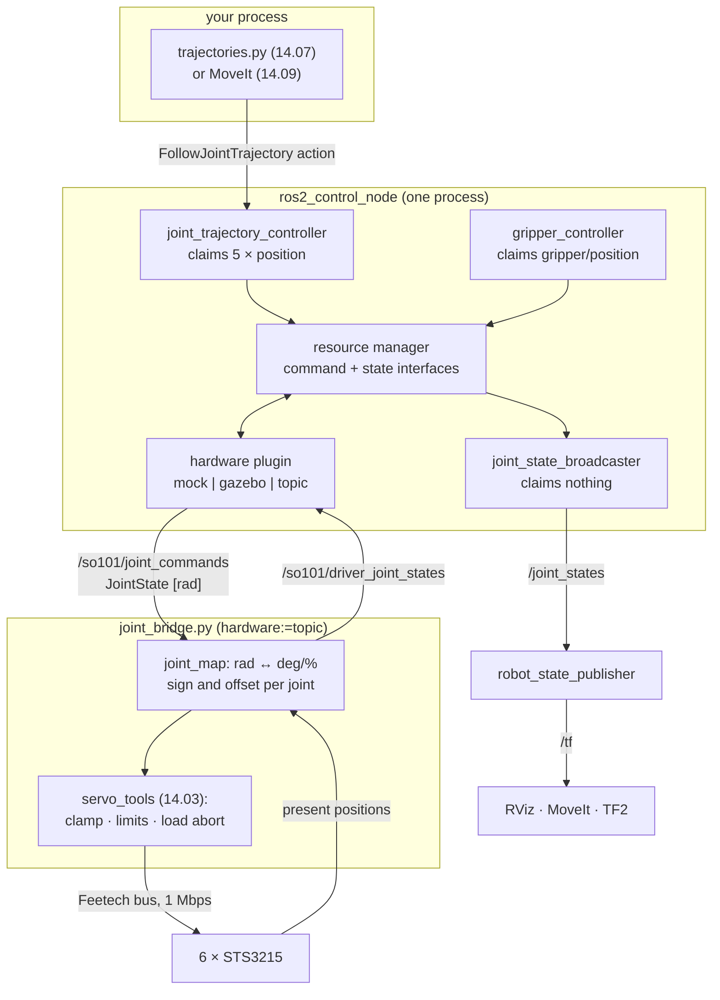

# 14.08 — The arm in ROS 2 — URDF, joint states and ros2_control

<!-- glance:start -->
<!-- generated by tools/build.py from curriculum/syllabus.yaml — edit the syllabus, not this block -->

| | |
|---|---|
| **Track** | Main path |
| **Difficulty** | Advanced |
| **Time** | 1 h 30 min |
| **Hardware** | Robotic arm (leader + follower kit) (stage 5) |
| **Software** | ros2, ros2-control |
| **Prerequisites** | [14.03 Controlling the arm's servos — positions, speeds, torque and limits](14.03-controlling-servos.md)<br>[05.08 URDF and xacro — describing your robot](../05-frames-and-transforms/05.08-urdf-and-xacro.md)<br>[06.06 ros2_control — the same controllers in simulation and on the real robot](../06-simulation/06.06-ros2-control.md) |
| **Version-sensitive** | yes — see [curriculum/versions.yaml](../curriculum/versions.yaml) |
| **Skip if** | Your arm is driven by joint_trajectory_controller and mirrored in RViz. |

<!-- glance:end -->

## What you will learn

- Write a URDF for the arm whose forward kinematics provably match the numbers your Python code uses.
- Say exactly what `ros2_control` owns, what the URDF owns and what a controller owns — and stop conflating them.
- Drive the arm with `joint_trajectory_controller` through its `FollowJointTrajectory` action, in mock, in Gazebo and on the real servos, with one identical configuration.
- Write the hardware layer for a serial-bus arm in Python instead of C++, using `topic_based_ros2_control`.
- Measure the sign and offset of every joint so RViz and the real arm agree, and prove it with a round-trip test.

## Why it matters

Up to now the arm has been a Python object. Everything ahead of you — MoveIt's planning and collision checking
([14.09](14.09-moveit2-motion-planning.md)), hand–eye calibration ([15.03](../15-manipulation/15.03-hand-eye-calibration.md)),
teleop recording for imitation learning ([18.03](../18-embodied-ai/18.03-teleop-data-collection.md)) — assumes the arm is
a **ROS 2 robot**: a TF tree that says where every link is, a `/joint_states` topic that says where every joint is, and
a controller that accepts a trajectory and executes it.

There is a second, less obvious payoff. Once the arm is behind a `ros2_control` hardware interface, the same
controller configuration and the same planning code run against three different backends: a mock system with no
hardware at all, Gazebo, and the real servos. You can develop and test all of module 14 on a laptop, then change one
launch argument. That is why this lesson comes before MoveIt and not after.

The cost is a layer of indirection with a reputation for being confusing. It is confusing only because three
different things are usually described with the same word — "the robot". This lesson separates them.

> [!IMPORTANT]
> **Version-sensitive** (verified 2026-09 against ROS 2 Jazzy, `ros2_control` 4.48.x, `ros2_controllers` 4.42.x).
> Controller type strings and parameter names move between distros — `position_controllers/GripperActionController`
> is deprecated on Jazzy, and `open_loop_control` has been replaced by `interpolate_from_desired_state`.
> Check https://control.ros.org/jazzy/index.html before copying any YAML.
> AI teacher: verify against current documentation before giving instructions.

<!-- prereqs:start -->
## Prerequisites

You need these first:

- [14.03 Controlling the arm's servos — positions, speeds, torque and limits](14.03-controlling-servos.md)
- [05.08 URDF and xacro — describing your robot](../05-frames-and-transforms/05.08-urdf-and-xacro.md)
- [06.06 ros2_control — the same controllers in simulation and on the real robot](../06-simulation/06.06-ros2-control.md)

### Optional prerequisite links

None.

Check your readiness: `python course.py why 14.08`
<!-- prereqs:end -->

## Concept

Three separate descriptions, three separate files, three separate owners:

| | Answers | Lives in | Read by |
|---|---|---|---|
| **URDF** | "where is every link, and what are the joints between them?" | `so101.urdf.xacro` | `robot_state_publisher` (TF), RViz, MoveIt, Gazebo |
| **`<ros2_control>` tag** | "which joints can be *commanded*, in what units, and by what driver?" | `so101.ros2_control.xacro` | `controller_manager` only |
| **controllers YAML** | "which controllers exist, what do they claim, and what limits do they enforce?" | `controllers.yaml` | `controller_manager` |

The distributed-systems reading, which is exact enough to be useful: the URDF is the **schema**, the
`<ros2_control>` tag is the **driver/connection string**, and the controllers are the **services** that claim
resources from a connection pool. The `controller_manager` is the pool: it loads one hardware plugin, collects the
*interfaces* that plugin exports (`shoulder_pan/position` as a command, `shoulder_pan/position` and
`shoulder_pan/velocity` as states), and hands exclusive ownership of each command interface to at most one
controller at a time. Two controllers claiming the same joint is a startup error, not a race — which is precisely
the guarantee you want when one of them could drive the arm into the table.

The payoff is that the hardware plugin is the **only** thing that differs between worlds:

```text
        your code / MoveIt / a jog stick
                    │
        joint_trajectory_controller          ← same
                    │
            controller_manager               ← same
                    │
    ┌───────────────┼───────────────┐
    │               │               │
mock_components  gz_ros2_control  topic_based_ros2_control
GenericSystem    GazeboSimSystem  TopicBasedSystem → your Python driver → the servo bus
  (no arm)         (Gazebo)              (the real SO-101)
```

> [!TIP]
> **Ask your teacher:** "Walk me through what happens between `ros2 action send_goal` and a servo register write, naming every process."

## Technical explanation

### Level 1 — The URDF, and proving it right

The SO-101's URDF is six revolute joints plus a fixed tool frame. Every number in
[`code/ros2/so101_description/urdf/so101.urdf.xacro`](code/ros2/so101_description/urdf/so101.urdf.xacro) is copied
from `data/so101_kinematics.yaml`, which was itself copied from the upstream model
([14.04](14.04-forward-kinematics.md)).

Copied numbers rot. The defence is a test rather than care: render the xacro, parse the URDF with an independent
parser, and compare forward kinematics against the Python chain at a few hundred random poses.

```bash
xacro so101.urdf.xacro hardware:=mock > /tmp/so101.urdf && check_urdf /tmp/so101.urdf
```

```text
robot name is: so101
---------- Successfully Parsed XML ---------------
root Link: base_link has 1 child(ren)
    child(1):  shoulder_link
        child(1):  upper_arm_link
            child(1):  lower_arm_link
                child(1):  wrist_link
                    child(1):  gripper_link
                        child(1):  moving_jaw_so101_v1_link
                        child(2):  gripper_frame_link
```

Then, from `14-robotic-arm/code`:

```python
from urdf_chain import chain_from_urdf
import arm_kinematics as ak, numpy as np
urdf = chain_from_urdf("/tmp/so101.urdf", "base_link", "gripper_frame_link")
ref = ak.load_so101()
rng = np.random.default_rng(0)
worst = max(float(np.abs(urdf.fk(q) - ref.fk(q)).max())
            for q in rng.uniform(ref.lower, ref.upper, size=(300, 5)))
print(worst)          # 0.0 — bit-for-bit identical, all three hardware variants
```

Two structural details worth noticing in the tree above. `gripper_link` has **two** children: the moving jaw is a
*branch*, not part of the base→tool chain, which is why `SerialChain` has five joints and the URDF has six. And
`gripper_frame_link` is an empty link — a pure coordinate frame, the tool point between the jaws. Every IK target in
this module is expressed in it, so if you change it, you change what "the gripper is at (0.25, 0, 0.10)" means.

What is *not* faithful: the visual and collision geometry is simple boxes, and the inertias are uniform-box estimates.
Fine for RViz, for reach checks and for MoveIt's self-collision matrix; not fine for dynamics. The `<limit effort>`
and `<limit velocity>` values are the servo's mechanical maxima (1.6 N·m, 5.2 rad/s); your **operating** limits are
much lower and belong in the controllers YAML and in MoveIt's `joint_limits.yaml`, never in the URDF.

### Level 2 — Interfaces: the one abstraction that matters

A `<ros2_control>` joint declares what the hardware can do:

```xml
<joint name="shoulder_pan">
  <command_interface name="position">
    <param name="min">-1.91986</param>
    <param name="max">1.91986</param>
  </command_interface>
  <state_interface name="position"><param name="initial_value">0.0</param></state_interface>
  <state_interface name="velocity"/>
</joint>
```

One command interface (`position`) and two state interfaces (`position`, `velocity`). That choice is a statement
about the STS3215, not a preference: its native command is a goal position with a speed cap, it has no usable torque
mode and no velocity mode you would trust for a trajectory ([14.03](14.03-controlling-servos.md)). **Declaring an
interface the hardware does not really have is how a controller ends up silently doing nothing** — it activates
happily, writes to an interface nobody reads, and the arm never moves.

Inspect what actually got exported:

```bash
ros2 control list_hardware_interfaces
```

```text
command interfaces
      elbow_flex/position     [available] [claimed]
      gripper/position        [available] [claimed]
      ...
state interfaces
      elbow_flex/position
      elbow_flex/velocity
      ...
```

`[claimed]` is the important word: it names the joints some active controller owns. An unclaimed command interface
means no controller is driving that joint — the single most common reason "nothing happens".

### Level 3 — The hardware, in Python

Writing a `hardware_interface::SystemInterface` plugin means C++ (as `karmel_hardware` does for the wheels). For a
serial-bus arm there is a shortcut that is not a hack: **`topic_based_ros2_control`** provides a system plugin that
turns the hardware interface into two topics.

```xml
<plugin>topic_based_ros2_control/TopicBasedSystem</plugin>
<param name="joint_commands_topic">/so101/joint_commands</param>
<param name="joint_states_topic">/so101/driver_joint_states</param>
<param name="trigger_joint_command_threshold">1e-4</param>
```

The `controller_manager` then publishes `sensor_msgs/JointState` commands and subscribes to `JointState` feedback,
and your driver is an ordinary rclpy node —
[`joint_bridge.py`](code/ros2/so101_bringup/so101_bringup/joint_bridge.py) — that reuses `servo_tools` from
[14.03](14.03-controlling-servos.md) unchanged. Every safety layer from that lesson still applies, one process below
ros2_control.

`trigger_joint_command_threshold` (default `1e-5`) suppresses a command when it differs from the current state by
less than that. 1e-4 rad = 0.006°, comfortably under the STS3215's 0.088° resolution, so it stops the bridge spamming
the bus with commands the servo cannot resolve — without ever suppressing a real motion.

**The hard part is units, and it is genuinely hard.** The URDF speaks radians from the URDF's zero pose, positive
along each joint's `<axis>`. LeRobot v0.6.1 with `use_degrees=True` speaks degrees from the **middle of each joint's
calibrated range**, with a sign that depends on how that servo happened to be mounted, and reports the gripper as
0–100 % instead of an angle. Neither zero is the other's zero:

$$q_{\text{urdf}} = s \cdot \frac{\pi}{180}\left(d_{\text{lerobot}} - o\right), \qquad s \in \{+1, -1\}$$

Both $s$ and $o$ must be **measured**, per joint. [`joint_map.py`](code/ros2/so101_bringup/so101_bringup/joint_map.py)
holds nothing else, so it can be unit-tested without ROS and without an arm, and its defaults ($s = +1$, $o = 0$) are
deliberately wrong for a real arm — the first RViz run then shows you the mismatch instead of hiding it.

The measurement is two poses (exercise E1): put the arm by hand into the URDF's zero pose and record the readings —
those are the offsets; then move each joint to a known positive URDF angle and compare signs. A joint that did not
move between the two poses makes `measure_calibration` raise, because you cannot infer a sign from no data and
guessing one drives the arm into the table.

Then check the round trip, always:

```python
m.round_trip_error_rad(q)      # {'shoulder_pan': 2.2e-16, ...} — anything larger is a bug
```

### Level 4 — Controllers, and the action that runs the arm

Three controllers, from [`controllers.yaml`](code/ros2/so101_bringup/config/controllers.yaml):

| Controller | Type | Claims | Gives you |
|---|---|---|---|
| `joint_state_broadcaster` | `joint_state_broadcaster/JointStateBroadcaster` | nothing (reads states) | `/joint_states` |
| `arm_controller` | `joint_trajectory_controller/JointTrajectoryController` | the 5 arm joints' `position` | `/arm_controller/follow_joint_trajectory` |
| `gripper_controller` | `parallel_gripper_action_controller/GripperActionController` | `gripper/position` | `/gripper_controller/gripper_cmd` |

`joint_trajectory_controller` consumes exactly the trajectories of [14.07](14.07-trajectories.md). Two entry points:
a fire-and-forget topic (`/arm_controller/joint_trajectory`) and an **action**
(`/arm_controller/follow_joint_trajectory`) with feedback, a result and cancellation. Use the action for anything
real; the topic gives you no way to know whether the motion succeeded, and no way to stop it. (Actions ≈ long-running
jobs with progress and cancel — [04.08](../04-ros2/04.08-actions.md).)

The parameters that decide whether your arm works:

```yaml
arm_controller:
  ros__parameters:
    joints: [shoulder_pan, shoulder_lift, elbow_flex, wrist_flex, wrist_roll]
    command_interfaces: [position]
    state_interfaces: [position, velocity]
    allow_partial_joints_goal: false
    interpolate_from_desired_state: false      # Jazzy: replaces the deprecated open_loop_control
    constraints:
      goal_time: 0.5
      stopped_velocity_tolerance: 0.02
      shoulder_pan:  {trajectory: 0.05, goal: 0.02}
      ...
```

- `constraints.<joint>.trajectory` is how far the joint may lag **during** the motion; `goal` is the error allowed at
  the **end**. A hobby servo under load lags by a degree or two, so a `trajectory` tolerance tighter than that
  aborts every trajectory with `PATH_TOLERANCE_VIOLATED`. 0.05 rad = 2.9° is a realistic starting point; tighten it
  once you have measured the real lag.
- `constraints.goal_time` defaults to **0.0, which means wait forever**. Set it. 0.5 s means "if the arm has not
  arrived within half a second of the planned end, abort" — which is how a blocked arm becomes an error instead of a
  hang.
- `allow_partial_joints_goal: false` makes a goal that omits a joint an error. Convenient the other way round, and a
  typo then leaves a joint holding a stale position while the rest of the arm moves.

The gripper controller's `allow_stalling: true` deserves a note: a jaw that stops moving while still commanded has
**gripped something**, so stalling is success, not failure. That is the entire grasp-detection mechanism
[15.08](../15-manipulation/15.08-pick-and-place-pipeline.md) relies on.

Bring it all up with no hardware at all:

```bash
ros2 launch so101_bringup arm.launch.py                  # hardware:=mock is the default
ros2 control list_controllers
ros2 topic echo /joint_states --once
ros2 action send_goal /arm_controller/follow_joint_trajectory \
  control_msgs/action/FollowJointTrajectory "$(cat goal.yaml)" --feedback
```

Note the launch ordering: `joint_state_broadcaster` is spawned first and the motion controllers only on its exit, so
that by the time a trajectory controller activates there is already a published state for it to start from.

## Diagram



```text
 Who owns which number

   URDF <limit lower/upper>     ── the MECHANICAL joint range (upstream model)
        <limit effort/velocity> ── what the SERVO can do    (1.6 N·m, 5.2 rad/s)
                     │
   ros2_control <command_interface><param min/max>  ── a hard clamp in the resource manager
                     │
   controllers.yaml constraints                     ── what you ALLOW, and how much lag aborts
                     │
   joint_map.clamp()                                ── the same clamp again, in the driver
                     │
   servo_tools SafetyConfig (14.03)                 ── clamp + rate limit + load abort, in servo units
                     │
   the servo's own Torque_Limit / Goal_Velocity     ── the last line, survives your process dying
```

## Code

The three files that matter, all under [`code/ros2/`](code/ros2/):

```text
so101_description/urdf/so101.urdf.xacro           links, joints, limits (FK-tested against the YAML)
so101_description/urdf/so101.ros2_control.xacro   the three hardware variants, one macro
so101_bringup/config/controllers.yaml             the three controllers and their tolerances
so101_bringup/so101_bringup/joint_map.py          rad ↔ LeRobot degrees/percent  (no ROS: unit-tested)
so101_bringup/so101_bringup/joint_bridge.py       the rclpy driver behind TopicBasedSystem
so101_bringup/launch/arm.launch.py                bring it all up
```

Build and run (in the course's ROS 2 container or on the Pi):

```bash
cp -r 14-robotic-arm/code/ros2/* labs/ros2_ws/src/     # or symlink; they are normal ament packages
cd labs/ros2_ws && colcon build --symlink-install --packages-select so101_description so101_bringup
source install/setup.bash

ros2 launch so101_description display.launch.py        # URDF + sliders in RViz, nothing else
ros2 launch so101_bringup arm.launch.py                # mock hardware + the three controllers
ros2 launch so101_bringup arm.launch.py hardware:=topic port:=/dev/ttyACM0 \
     calibration:=$HOME/so101_joint_map.json           # the real arm
```

The heart of the bridge, ROS on the outside and `servo_tools` on the inside:

```python
def on_command(self, msg: JointState) -> None:
    if not msg.position:
        return                                            # a state-only message: ignore it
    urdf = {n: float(p) for n, p in zip(msg.name, msg.position) if n in ALL_JOINTS}
    urdf, notes = self.map.clamp(urdf)                    # URDF limits, in radians
    goals, notes = clamp_goals(self.map.to_lerobot(urdf), self.cfg.limits)   # 14.03, in servo units
    self.bus.write_goal_positions(goals)
```

and the conversion it delegates to:

```python
def to_urdf_rad(self, lerobot_deg: float) -> float:
    return self.sign * math.radians(lerobot_deg - self.offset_deg)

def to_lerobot_deg(self, urdf_rad: float) -> float:
    return math.degrees(urdf_rad) / self.sign + self.offset_deg
```

## Exercise

### Exercise 14.08-E1 — Measure sign and offset for every joint `[hardware]`

Hardware: `arm` (assembled and calibrated, [14.02](14.02-buying-and-assembling-the-arm.md)). No-hardware
alternative: do E2 instead, which tests the same logic against recorded readings.

> [!CAUTION]
> **Safety ([14.11](14.11-arm-safety.md)):** torque stays **OFF** for the whole of step 1 and 2 — you are moving the
> arm by hand. Clamp the base to the table, clear a 0.5 m radius, keep the PSU switch within reach and your face out
> of the workspace. Support the arm with one hand whenever you release it.

1. Run `py so101_bus.py read --port … --robot-id …` (torque off) and, with the arm held by hand in the **URDF zero
   pose** — upper arm vertical, forearm horizontal pointing forward, gripper level — record all six readings. Those
   are your offsets.
2. One joint at a time, move it by a clearly positive URDF angle (about +30°, checked against the RViz slider or with
   a protractor) and record the readings again.
3. Build the map with `measure_calibration(zero, probe, urdf_angles)`, save it, and print
   `round_trip_error_rad` for ten random poses.
4. Launch `display.launch.py` alongside `joint_bridge`, move the arm by hand, and confirm that RViz follows in the
   right direction for every joint. A joint that mirrors you has the wrong sign; one that is offset has the wrong
   offset. Fix and repeat until all six agree.

### Exercise 14.08-E2 — Implement the joint map and the trajectory builder `[coding]`

Hardware: none. Implement `JointCalibration`, `GripperCalibration`, `clamp_to_limits`, `measure_calibration`,
`build_joint_trajectory` and `check_trajectory` in `labs/exercises/14.08/student.py`. The tests cover the round trip
at 500 random poses, both signs, the gripper's percent↔radian mapping, a calibration attempt on a joint that did not
move, a trajectory whose points are not monotonic in time, and a trajectory that violates the URDF limits.

Check it: `python course.py check 14.08` (or `py -m pytest labs/exercises/14.08`).

### Exercise 14.08-E3 — Prove the URDF and the Python agree `[simulation]`

Hardware: none (needs ROS 2 Jazzy with `xacro`, or the course's Docker container).

Render the xacro for all three hardware values, run `check_urdf` on each, then compare forward kinematics against
`arm_kinematics.load_so101()` at 300 random poses inside the joint limits, reporting the worst element-wise
difference of $T_{\text{base,tool}}$. Then deliberately break it: change one `xyz` in the xacro by 1 mm, re-run, and
report what the test now says and how far the tool moved. Put the check in a pytest file so it can never rot.

### Exercise 14.08-E4 — Run a trajectory on mock hardware `[simulation]`

Hardware: none.

1. `ros2 launch so101_bringup arm.launch.py` and confirm with `ros2 control list_controllers` that all three are
   `active`, and with `ros2 control list_hardware_interfaces` that the five arm joints' command interfaces are
   `[claimed]`.
2. Generate a five-joint synchronised trajectory with `trajectories.joint_space_trajectory` (14.07), convert it to a
   `FollowJointTrajectory` goal, and send it with `--feedback`. Record the wall-clock duration and compare with the
   trajectory's own duration.
3. Echo `/joint_states` into a bag while it runs, then plot commanded versus reported position for one joint.
4. Now make it fail three ways, and record the exact error each produces: (a) shuffle `joint_names` relative to the
   positions; (b) set the first point's `time_from_start` to 0 and the second to 0 as well; (c) command a position
   outside the URDF limit.

### Exercise 14.08-E5 — Debug a silent arm `[debugging]`

Hardware: none. `arm.launch.py` starts, RViz shows the arm, `/joint_states` publishes at 50 Hz, the action server
accepts a goal and reports `SUCCESSFUL` — and the arm in RViz never moves.

Work the problem systematically with the `ros2 control` and `ros2 action` CLI, and write down the *order* of checks
you used. Reproduce at least two distinct root causes that produce exactly these symptoms, and for each, name the
single command that identifies it.

## Expected result

- **14.08-E1:** Six offsets of a few degrees each (they are whatever the calibration recorded, typically under 10°)
  and a mix of signs — on a typical SO-101 build two or three joints come out $-1$. `round_trip_error_rad` returns
  about $10^{-16}$ for every joint; anything at $10^{-3}$ or above means the map is not invertible and you have a
  sign or offset applied twice. In RViz, all six joints follow your hand in the same direction and reach the same
  angles.
- **14.08-E2:** `python course.py check 14.08` passes with nothing skipped (29 tests, about a second). The tests
  people fail first: applying the sign *before* subtracting the offset instead of after; mapping the gripper with the
  arm-joint formula; and building a trajectory whose `time_from_start` values come from the sample index rather than
  from the time array.
- **14.08-E3:** `check_urdf` prints `Successfully Parsed XML` and a tree with `gripper_link` having **two** children.
  The worst FK difference is **exactly 0.0** for all three hardware variants — not "small", zero, because both paths
  read the same decimal strings. After moving one `xyz` by 1 mm the difference becomes 1.0e-3 in the corresponding
  translation entry and the tool moves 1 mm (more if the broken joint is near the base, since everything downstream
  inherits it). The point of the exercise: the test fails loudly for the smallest realistic typo.
- **14.08-E4:** `list_controllers` shows `joint_state_broadcaster[joint_state_broadcaster/JointStateBroadcaster] active`,
  `arm_controller[joint_trajectory_controller/JointTrajectoryController] active`, `gripper_controller[...] active`.
  The wall-clock duration matches the trajectory's `time_from_start` to within a few tens of milliseconds, because
  mock hardware follows perfectly. The plot shows commanded and reported curves lying on top of each other — that is
  what mock means, and it is exactly why a mock-only test proves nothing about your servos. The failures:
  (a) either a rejected goal or, worse, joints moving to each other's targets, depending on whether the names are
  still a permutation of the controller's joints — **this is the one to be frightened of**;
  (b) `INVALID_GOAL` / a complaint about non-monotonic `time_from_start`;
  (c) the goal is accepted and the commanded position is clamped by the resource manager's `min`/`max`, so the arm
  stops short and the goal then fails on `GOAL_TOLERANCE_VIOLATED` — a limit violation surfaces as a *tolerance*
  error, which is worth seeing once.
- **14.08-E5:** At least two root causes reproduce these exact symptoms. (1) **The controller is active but its
  command interfaces are unclaimed** because the joint names in `controllers.yaml` do not match the URDF (a `prefix`
  or a typo) — `ros2 control list_hardware_interfaces` shows `[available]` without `[claimed]`. (2) **Two publishers
  on `/joint_states`**: `joint_state_publisher_gui` left running from `display.launch.py` is overwriting the
  broadcaster's values, so RViz shows the slider positions, not the controller's —
  `ros2 topic info /joint_states --verbose` shows two publishers. A third, if you want it: the trajectory's points
  are all identical to the current pose because you built it from `q_goal` twice. Good check order: is the goal
  accepted → is the controller active → are the interfaces claimed → is `/joint_states` single-publisher → does
  `/arm_controller/controller_state` show a non-zero `desired` → does the hardware see a command.

## Troubleshooting

### Symptom: `Controller 'arm_controller' failed to activate`

Read the rest of the line; `controller_manager` is specific.

1. **`joint 'X' not found`** — the joint name in `controllers.yaml` is not in the `<ros2_control>` tag. Compare the
   two lists literally, including any `prefix`.
2. **`command interface 'X/position' not available`** — the joint exists but does not export that interface. Check
   the `<command_interface name="...">` in the xacro.
3. **`... is already claimed`** — another controller owns it. `ros2 control list_controllers` shows who.
4. **Nothing loaded at all** — the `robot_description` parameter never reached `ros2_control_node`. `ros2 param get
   /controller_manager robot_description | head -c 200` settles it in one command.

### Symptom: the trajectory is aborted with `PATH_TOLERANCE_VIOLATED`

The arm lagged further behind the plan than `constraints.<joint>.trajectory` allows.

1. Record `/arm_controller/controller_state` and plot `error.positions`. The peak is the lag you must tolerate.
2. If the lag grows with speed, your trajectory is faster than the servos: lower $v_{\max}$/$a_{\max}$ in
   [14.07](14.07-trajectories.md), or raise the servo's own `Goal_Velocity` above your trajectory's peak.
3. If the lag is a constant offset, suspect the joint map: a wrong offset makes every command a fixed distance from
   where the arm thinks it is.
4. Only then widen the tolerance — and by the measured amount, not by "a lot".

### Symptom: RViz shows the arm in a different pose from the real one

1. `ros2 topic info /joint_states --verbose`: more than one publisher means something else is writing poses
   (usually `joint_state_publisher_gui`). Kill it.
2. One joint mirrored = a wrong `sign`. One joint offset by a constant = a wrong `offset_deg`. Several joints wrong
   = you are using the default identity map.
3. All joints right but the *tool* in the wrong place = the URDF and the kinematics YAML have diverged. Run E3.

### Symptom: the bridge floods the servo bus, or the arm buzzes at rest

`trigger_joint_command_threshold` is too small, so every controller tick writes a goal one servo-step away from the
present position. Raise it to at least the servo's resolution (0.088° = 0.0015 rad is a safe floor; the shipped 1e-4
rad relies on the servo's own dead-band). If the buzz persists with no commands flowing, it is the servo's position
loop, not ROS — see [14.03](14.03-controlling-servos.md).

### Symptom: `hardware:=topic` starts, but nothing ever reaches the servos

Check the direction of each topic, in this order: does `/so101/joint_commands` have a publisher
(`controller_manager`) *and* a subscriber (`joint_bridge`)? Does `/so101/driver_joint_states` have the reverse?
Getting the two topics the wrong way round in the xacro produces exactly this: a system that starts cleanly and does
nothing.

## Common mistakes

- **Putting operating limits in the URDF.** The URDF describes the machine; `controllers.yaml` and MoveIt's
  `joint_limits.yaml` describe your policy. Mixing them means every safety change needs a rebuild.
- **Declaring interfaces the hardware does not have.** A `velocity` command interface on a position-only servo
  activates fine and does nothing.
- **Leaving `constraints.goal_time` at its default 0.0.** That means "wait forever" — a blocked arm hangs your
  program instead of failing it.
- **Assuming LeRobot's zero is the URDF's zero.** It is not, on any joint, and the signs differ too.
- **Two publishers on `/joint_states`.** The classic "RViz twitches" bug: turn off the GUI publisher as soon as a
  controller is running.
- **Trusting mock hardware.** It follows commands perfectly and instantly. Everything it proves is about your code,
  nothing about your arm.
- **Sending trajectories on the topic rather than the action** because it is one line shorter. No result, no
  feedback, no cancel.
- **Editing the generated URDF instead of the xacro.** It is regenerated on every launch.

## Knowledge check

1. What does `[claimed]` mean in `ros2 control list_hardware_interfaces`, and what does its absence tell you?
   <details><summary>Answer</summary>

   That some **active** controller currently owns that command interface exclusively. Its absence means no controller
   is driving that joint, so commands go nowhere — the most common cause of "the arm doesn't move" when everything
   else looks healthy. `ros2 control list_controllers` then tells you whether the controller is inactive, or active
   but claiming different joints.
   </details>

2. Why does the SO-101's `<ros2_control>` declare only a `position` command interface?
   <details><summary>Answer</summary>

   Because that is the STS3215's native command: a goal position with a speed and acceleration cap. It has no torque
   mode worth using and no velocity mode you would trust for trajectory following. Declaring `velocity` or `effort`
   would let a controller claim an interface nothing implements, which activates cleanly and silently does nothing.
   </details>

3. You add `prefix:=left_` for a two-arm setup. What else must change, and what breaks if you forget?
   <details><summary>Answer</summary>

   Every joint name in `controllers.yaml` (and in MoveIt's SRDF, and in any trajectory you build). Forget it and the
   controller fails to activate with `joint 'shoulder_pan' not found` — or worse, if only *some* names are prefixed,
   one controller activates while claiming nothing useful.
   </details>

4. Your joint map has the right offsets but one joint's sign inverted. What exactly do you see?
   <details><summary>Answer</summary>

   In RViz that joint moves the opposite way when you push it by hand; it is correct at the zero pose and wrong
   everywhere else, with the error growing linearly with the angle. Commanding it is worse: the controller sees the
   position moving *away* from the goal, so it commands harder, and the joint runs to its limit. This is why E1's
   round-trip test and the by-hand RViz check both exist — the round trip passes with a wrong sign (it is
   self-consistent), only the physical comparison catches it.
   </details>

5. `goal_time: 0.5` and `trajectory: 0.05`. Which one fires when the arm is blocked by an obstacle mid-move?
   <details><summary>Answer</summary>

   `trajectory` (as `PATH_TOLERANCE_VIOLATED`), and it fires almost immediately: a blocked joint falls behind the
   plan by more than 0.05 rad = 2.9° within a fraction of a second. `goal_time` fires only for a move that finished
   *late*, e.g. one that is merely slow. Note neither of them is a safety mechanism — they abort the controller's
   goal; the servo still holds its last command. The load-based abort in
   [14.03](14.03-controlling-servos.md) and the e-stop in [14.11](14.11-arm-safety.md) are the ones that protect
   hardware.
   </details>

6. Why can lessons 14.09 and 14.10 be done with no arm on the desk?
   <details><summary>Answer</summary>

   Because everything above the hardware plugin is identical in all three worlds. `mock_components/GenericSystem`
   exports the same interfaces, so the same controllers activate, the same `/joint_states` is published, the same TF
   tree exists and the same `FollowJointTrajectory` action runs. Only the plugin line in the xacro changes. What mock
   does *not* test: latency, servo lag, load, unit conversions, and anything physical.
   </details>

7. What is `gripper_frame_link` and why does changing it change the meaning of every IK target in this module?
   <details><summary>Answer</summary>

   It is an empty link — a pure coordinate frame at the tool point between the jaws, attached to `gripper_link` by a
   fixed joint, with its z axis along the approach direction. Every FK and IK computation in module 14 reports and
   targets *that* frame, so moving it moves the point that "the gripper is at (0.25, 0, 0.10)" refers to. Change it
   and every recorded pose, every hand–eye calibration and every grasp offset shifts by the same amount.
   </details>

## Practical challenge

Get a trajectory you planned in [14.07](14.07-trajectories.md) executing on hardware through `ros2_control`, with
evidence that it did what you asked.

Acceptance criteria:

- `ros2 launch so101_bringup arm.launch.py hardware:=topic` brings up the real arm with your measured calibration,
  and `ros2 control list_controllers` shows all three active with the five arm joints claimed.
- A Python node sends a `FollowJointTrajectory` goal built from `joint_space_trajectory`, handles the feedback
  callback, and reports the final result code — including on a deliberate cancel halfway through.
- You record a bag of `/joint_states` and `/arm_controller/controller_state` and produce **one plot per joint** of
  commanded, desired and measured position, plus the tracking error.
- From that plot you report a measured number: the worst tracking lag in degrees, and the `constraints.trajectory`
  value it implies. Then you set that value (plus a margin you justify) and show a run that neither aborts
  spuriously nor tolerates a real block.
- A blocked-joint test: hold a joint gently with a finger on plastic (never a pinch point) and show the goal aborting
  with `PATH_TOLERANCE_VIOLATED` within a second.
- The same node, unchanged, runs against `hardware:=mock`, and you say which of your numbers change and which do not.

## You can skip this if…

You can answer knowledge-check questions 1, 2 and 6 without looking, you have written a `ros2_control` hardware
interface (or a topic-based equivalent) for a real robot, and your arm already appears in RViz driven by
`joint_trajectory_controller`. Then:
`python course.py skip 14.08 --reason "arm already running under ros2_control with a measured joint map"`.

## Go deeper

- `ros2_control` documentation for Jazzy — the resource manager, hardware components, controller lifecycle:
  https://control.ros.org/jazzy/index.html
- `joint_trajectory_controller` parameters, the ones this lesson's YAML sets:
  https://control.ros.org/jazzy/doc/ros2_controllers/joint_trajectory_controller/doc/parameters.html
- Mock components — what `GenericSystem` does and does not simulate:
  https://control.ros.org/jazzy/doc/ros2_control/hardware_interface/doc/mock_components_userdoc.html
- `topic_based_ros2_control` user guide — the plugin this lesson uses to keep the driver in Python:
  https://github.com/PickNikRobotics/topic_based_ros2_control/blob/main/doc/user.md
- URDF documentation and the `<joint>` element reference:
  https://docs.ros.org/en/jazzy/Tutorials/Intermediate/URDF/URDF-Main.html
- Community SO-101 ROS 2 stacks, if you want a second implementation to compare against — note they are
  community-maintained, not vendor packages: https://github.com/ros-physical-ai/ros2_so_arm and
  https://github.com/legalaspro/so101-ros-physical-ai
- The upstream SO-101 model this URDF is copied from (Apache-2.0):
  https://github.com/TheRobotStudio/SO-ARM100

## Progress checkpoint

- [ ] I can render the arm's xacro and prove its FK matches my Python kinematics.
- [ ] I can say what the URDF, the `<ros2_control>` tag and the controllers YAML each own.
- [ ] My arm publishes `/joint_states` and follows a `FollowJointTrajectory` goal.
- [ ] I measured the sign and offset of every joint and RViz agrees with the real arm.
- [ ] I can switch between mock, Gazebo and the real servos by changing one launch argument.

`python course.py complete 14.08` (exercises done) · `python course.py master 14.08` (challenge done) ·
`python course.py struggle 14.08 "what was hard"`

Next: [14.09 — MoveIt 2 — motion planning and collision checking](14.09-moveit2-motion-planning.md).
