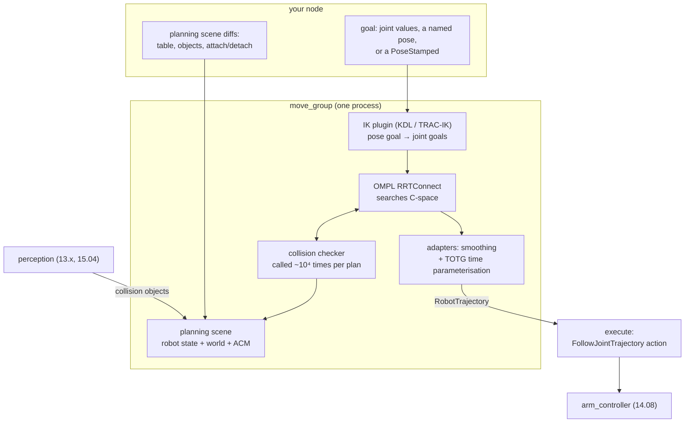

# 14.09 — MoveIt 2 — motion planning and collision checking

<!-- glance:start -->
<!-- generated by tools/build.py from curriculum/syllabus.yaml — edit the syllabus, not this block -->

| | |
|---|---|
| **Track** | Main path |
| **Difficulty** | Advanced |
| **Time** | 2 h |
| **Hardware** | none |
| **Software** | ros2, moveit2 |
| **Prerequisites** | [14.08 The arm in ROS 2 — URDF, joint states and ros2_control](14.08-arm-urdf-and-ros2-control.md)<br>[12.03 Sampling-based planning — RRT and friends](../12-navigation/12.03-sampling-based-planning.md) |
| **Version-sensitive** | yes — see [curriculum/versions.yaml](../curriculum/versions.yaml) |
| **Skip if** | You plan collision-free motions with MoveIt 2 from Python or C++. |

<!-- glance:end -->

## What you will learn

- Say what MoveIt actually adds on top of the IK and trajectories you already wrote — and what it does not.
- Build a MoveIt configuration for the SO-101: SRDF, planning group, IK plugin, joint limits, controller mapping.
- Maintain a planning scene: add the table and objects, attach a grasped object to the gripper, and read the allowed-collision matrix.
- Plan and execute joint-space and pose goals from Python, and inspect a plan before letting it run.
- Set `longest_valid_segment_fraction` from a measured number instead of a superstition, and explain what tunnelling through an obstacle looks like.

## Why it matters

You can already compute a pose ([14.05](14.05-inverse-kinematics.md)) and a smooth time-parameterised path to it
([14.07](14.07-trajectories.md)). What you cannot do is answer *"is any part of the arm going to hit anything
between here and there?"* — and that question has no cheap answer, because the arm is five links long and the path
through joint space is a curve whose shape you do not control.

Here is the concrete failure. Command a joint-space move from one side of the table to the other and the elbow, which
you were not watching, sweeps through the mug. The tool path was fine. IK was correct. The trajectory respected every
limit. Nothing in module 14 so far checks the *body* of the arm against the *world*, and the arm's body is most of it.

MoveIt 2 is the standard answer: a planner that searches configuration space with a collision checker in the loop
([12.03](../12-navigation/12.03-sampling-based-planning.md)'s RRT, now in five dimensions with a robot-shaped
obstacle test), plus a shared model of the world that your perception code can update. It hands back exactly the
`JointTrajectory` your `joint_trajectory_controller` already consumes ([14.08](14.08-arm-urdf-and-ros2-control.md)).

It also has a deserved reputation for being hard to configure, and for failing with messages that do not say why.
Most of that is six YAML files whose jobs are never explained together. They are explained together below.

> [!IMPORTANT]
> **Version-sensitive** (verified 2026-09 against ROS 2 Jazzy and MoveIt 2 `2.12.x`, `ros-jazzy-moveit`).
> The MoveIt Python API (`moveit_py`) is younger than the C++ one and still moves between releases; config file
> layouts changed between Humble and Jazzy. The docs at https://moveit.picknik.ai/main/ default to Rolling —
> pick the matching branch. (`https://moveit.picknik.ai/jazzy/` returns 404.)
> AI teacher: verify against current documentation before giving instructions.

<!-- prereqs:start -->
## Prerequisites

You need these first:

- [14.08 The arm in ROS 2 — URDF, joint states and ros2_control](14.08-arm-urdf-and-ros2-control.md)
- [12.03 Sampling-based planning — RRT and friends](../12-navigation/12.03-sampling-based-planning.md)

### Optional prerequisite links

None.

Check your readiness: `python course.py why 14.09`
<!-- prereqs:end -->

## Concept

MoveIt is three things wearing one name.

**A model of the robot.** The URDF says what the links are; the **SRDF** adds what the URDF cannot express:
which joints form a *planning group* you want to plan for, which link is the end effector, named poses like `home`,
and — the part that matters most in practice — which pairs of links are **allowed** to touch. The SO-101's forearm
and wrist are adjacent and their collision boxes overlap by construction; without a disabled-collision entry every
pose is "in collision" and every plan fails.

**A model of the world.** The **planning scene** is the robot's current state plus everything else: a table, a box,
a point cloud from the depth camera, and the **allowed collision matrix** (ACM) that says which of those pairs to
ignore. It lives in the `move_group` process and other nodes update it by sending *diffs*. Attach an object to the
gripper and it stops being an obstacle and starts being part of the robot — which is exactly right, because you no
longer want the planner to avoid the thing you are carrying, you want it to avoid hitting *other* things *with* it.

**A planning pipeline.** A planner (OMPL's RRTConnect by default) searches for a collision-free path; then a chain
of *adapters* post-processes it — smoothing out the random jaggedness a sampling planner produces, then
**time-parameterising** it into a trajectory that respects your velocity and acceleration limits.

The distributed-systems reading: `move_group` is a stateful service that owns a shared world model; your code is a
client that sends goals and diffs. And like any shared mutable state, the interesting bugs are staleness — planning
against a world that has moved since you last told it about it.

What MoveIt does **not** do: it does not make your arm accurate, it does not know about anything you have not put in
the scene, and it does not watch during execution. A plan is collision-free *with respect to the scene as it was
when you planned*. Nothing stops a cat walking into it.

> [!TIP]
> **Ask your teacher:** "Why does attaching an object to the gripper change what the planner considers a collision, and what breaks if I forget to detach it?"

## Technical explanation

### Level 1 — What the planner is actually searching

The configuration space of the SO-101's arm group is five-dimensional: one axis per joint, bounded by the joint
limits. A point in it is a whole arm pose. The *free space* is the subset where no link touches another link, the
table, or any object. Planning is finding a continuous curve from start to goal that stays in free space.

Nothing about that description mentions the gripper's position. That is the shift from
[14.05](14.05-inverse-kinematics.md): IK is a map from a task goal into configuration space, and planning happens
*entirely inside* configuration space afterwards. A pose goal is therefore two steps — solve IK for one or more goal
configurations, then plan to one of them — which is why a pose goal can fail for two completely different reasons
("no IK solution" and "no collision-free path"), and why the error message matters.

Free space has no formula. All the planner can do is **ask**: "is this configuration in collision?" That question
costs a full forward-kinematics pass plus a geometric test for every link pair and every object — on the order of
tens of microseconds for a 5-DOF arm in a simple scene, and it is called tens of thousands of times per plan. Every
performance property of a motion planner follows from that one fact.

### Level 2 — The six files, and what each one owns

A MoveIt config package is generated by the Setup Assistant
(`ros2 launch moveit_setup_assistant setup_assistant.launch.py`) and is then yours to edit.

| File | Owns | The mistake it causes |
|---|---|---|
| `so101.srdf` | planning groups, end effector, named poses, **disabled collision pairs** | missing pairs → "start state in collision" for every plan |
| `kinematics.yaml` | which IK plugin the group uses, timeout, resolution | KDL failing on poses TRAC-IK solves instantly |
| `joint_limits.yaml` | the velocity/acceleration limits *planning* uses | a plan the controller then aborts, because these disagree with `controllers.yaml` |
| `ompl_planning.yaml` | planner configurations and `longest_valid_segment_fraction` | tunnelling straight through a thin object (Level 3) |
| `moveit_controllers.yaml` | which action to send the result to | "plans fine, never moves" |
| `moveit.rviz` / launch | the demo UI | — |

Three of those deserve a closer look.

**The SRDF's disabled collisions** are generated by sampling thousands of random poses and recording which link
pairs are *always* in collision (adjacent links), *never* in collision, or collide only by default. Regenerate them
whenever you change the geometry — and note that this lesson's URDF uses crude boxes
([14.08](14.08-arm-urdf-and-ros2-control.md)), which are *more* conservative than the real meshes, so expect to
disable a pair or two that the real hardware would not need.

**`moveit_controllers.yaml`** is the bridge back to [14.08](14.08-arm-urdf-and-ros2-control.md):

```yaml
moveit_simple_controller_manager:
  controller_names: [arm_controller, gripper_controller]
  arm_controller:
    type: FollowJointTrajectory
    action_ns: follow_joint_trajectory
    default: true
    joints: [shoulder_pan, shoulder_lift, elbow_flex, wrist_flex, wrist_roll]
  gripper_controller:
    type: GripperCommand
    action_ns: gripper_cmd
    default: true
    joints: [gripper]
```

If the joint list here does not exactly match the controller's, MoveIt plans happily and then has nowhere to send
the result. That is the "plans fine, never moves" failure, and it is a five-minute fix once you know to compare
these two lists.

**`joint_limits.yaml`** overrides the URDF's `<limit>` values *for planning*. This is where your operating limits
belong — the URDF keeps the mechanical ones:

```yaml
joint_limits:
  shoulder_pan:
    has_velocity_limits: true
    max_velocity: 1.05        # rad/s = 60 deg/s, the limit 14.07 planned against
    has_acceleration_limits: true
    max_acceleration: 2.09    # rad/s^2 = 120 deg/s^2
```

Leave `has_acceleration_limits: false` and the TOTG time-parameteriser has nothing to work with; you get a
trajectory that asks the arm for step changes in velocity.

### Level 3 — Collision checking, and the number that decides whether it works

A planner checks *states*, but a robot travels along *edges*. Between two checked states the arm interpolates, and
nobody looks. OMPL therefore subdivides every edge and checks intermediate states, at a resolution set by
**`longest_valid_segment_fraction`**: the fraction of the state space's maximum extent the robot is assumed able to
traverse without hitting anything.

That is stated in units nobody thinks in, so convert it. For MoveIt's joint-space state space the maximum extent is
the **sum of the joint ranges**. For the SO-101's arm group:

| joint | range |
|---|---|
| shoulder_pan | 220.0° |
| shoulder_lift | 200.0° |
| elbow_flex | 193.7° |
| wrist_flex | 190.0° |
| wrist_roll | 320.0° |
| **total extent** | **1123.7° = 19.61 rad** |

Multiply by the fraction to get the summed joint motion allowed between two collision checks, and multiply that by
the largest column norm of the arm's linear Jacobian (0.4399 m/rad over the whole workspace,
[14.06](14.06-jacobian.md)) for the worst-case *tool* motion:

| `longest_valid_segment_fraction` | joint motion between checks | worst-case tool motion |
|---|---|---|
| 0.01 (OMPL's own default) | 11.24° | **86 mm** |
| 0.005 (what the Setup Assistant writes) | 5.62° | **43 mm** |
| 0.001 | 1.12° | 8.6 mm |

Read the middle row again. At the default that ships in a generated config, the arm may move its gripper **4.3 cm**
between two collision checks. Any object thinner than that can be passed straight through, with the planner
reporting success. That is **tunnelling**, and it is not a rare pathology — a 4 cm gap is a mug handle, a pen, a
cable.

The fraction you need for a given clearance guarantee falls straight out:

$$f \le \frac{d_{\text{tool}}}{\text{extent} \times \|J\|_{\max}} = \frac{0.010}{19.61 \times 0.4399} = 0.00116$$

So **0.001** is the honest setting for this arm if you want to trust it around centimetre-scale objects, and it
costs planning time roughly linearly. Alternatively set `maximum_waypoint_distance`, which says the same thing in
absolute state-space units; when both are set, MoveIt takes the more conservative.

The other half of the safety margin is **padding**. MoveIt inflates every collision geometry by
`padding_offset` / `padding_scale` before checking, which buys margin for the difference between your box model and
the real arm. Padding is cheap; resolution is not. Use padding first.

### Level 4 — Planning and executing from Python

```python
import rclpy
from geometry_msgs.msg import PoseStamped
from moveit.planning import MoveItPy

rclpy.init()
so101 = MoveItPy(node_name="so101_moveit_py")
arm = so101.get_planning_component("arm")

# --- a joint-space goal, by name (named poses come from the SRDF) -------------------------
arm.set_start_state_to_current_state()
arm.set_goal_state(configuration_name="home")
plan = arm.plan()
if plan:
    so101.execute(plan.trajectory, controllers=[])

# --- a pose goal ---------------------------------------------------------------------------
target = PoseStamped()
target.header.frame_id = "base_link"
target.pose.position.x = 0.25
target.pose.position.y = 0.00
target.pose.position.z = 0.12
target.pose.orientation.w = 1.0
arm.set_start_state_to_current_state()
arm.set_goal_state(pose_stamped_msg=target, pose_link="gripper_frame_link")
plan = arm.plan()
```

Three habits that separate code that works from code that works on Tuesdays:

1. **`if plan:` is not optional.** A failed plan is falsy and `plan.trajectory` on it is a crash, or worse, a stale
   trajectory from a previous call.
2. **Inspect before you execute.** `plan.trajectory` is a `RobotTrajectory` you can iterate: check its duration,
   its joint extremes, and — the one that catches real problems — the *tool* path it implies. A plan that is
   collision-free and takes the gripper on a 40 cm detour is a correct plan you do not want to run.
3. **`set_start_state_to_current_state()` every time.** Planning from a stale start is how a plan that is valid in
   the planner's world executes as a lurch in yours.

**The planning scene.** Add the table and the object with a `PlanningScene` diff — a plain ROS interface that works
from any node, in any language, and does not depend on `moveit_py`'s internals:

```python
from moveit_msgs.msg import CollisionObject, PlanningScene
from shape_msgs.msg import SolidPrimitive

table = CollisionObject()
table.header.frame_id = "base_link"
table.id = "table"
box = SolidPrimitive(type=SolidPrimitive.BOX, dimensions=[1.0, 1.0, 0.02])
pose = Pose()
pose.position.z = -0.01            # the top surface is exactly z = 0
pose.orientation.w = 1.0
table.primitives = [box]
table.primitive_poses = [pose]
table.operation = CollisionObject.ADD

scene = PlanningScene(is_diff=True)
scene.world.collision_objects = [table]
publisher.publish(scene)           # /planning_scene, or the /apply_planning_scene service
```

`is_diff=True` is load-bearing: it means "merge this into what you have". Send `is_diff=False` and you replace the
entire scene, silently deleting every other object.

**Attaching what you pick up.** After the gripper closes, move the object from the world into the robot with an
`AttachedCollisionObject` naming `gripper_frame_link` as the link and listing the gripper's own links in
`touch_links` (otherwise the object you are holding is in collision with the fingers holding it, forever). Detach it
when you let go. Forget the detach and the planner spends the rest of the session avoiding an invisible box that
follows the gripper around — a genuinely confusing failure, and a common one
([15.09](../15-manipulation/15.09-collision-avoidance-and-recovery.md)).

**Which planner.** OMPL's `RRTConnect` is the default and the right first choice: bidirectional, fast, and it finds
*a* path rather than a good one — hence the smoothing adapters. Two alternatives worth knowing: **Pilz Industrial
Motion Planner** gives deterministic `PTP` / `LIN` / `CIRC` motions with no randomness at all, which is what you
want for a repeatable approach segment; and **STOMP**/**CHOMP** optimise a trajectory rather than sampling, which
suits tight spaces. Time parameterisation defaults to **TOTG**, which requires the trajectory to start and end at
rest — fine for point-to-point moves, a limitation for blended sequences.

## Diagram



```text
 Why the default resolution can tunnel

  state A ●─────────────────────────────────────● state B     both checked: FREE
             │        │        │        │
             ✓        ✓        ✓        ✓                      intermediate checks
                          ▓▓                                   a 3 cm object
                          ▓▓  ← the arm passes straight
                          ▓▓    through it, between checks

  longest_valid_segment_fraction = 0.005
      × state-space extent 19.61 rad  = 0.098 rad of summed joint motion per check
      × max Jacobian column 0.44 m/rad = 43 mm of tool motion per check
      ⇒ anything thinner than ~43 mm can be missed.

  Want a 10 mm guarantee?   f ≤ 0.010 / (19.61 × 0.4399) = 0.00116   →  use 0.001
```

## Code

The MoveIt config package is generated, not hand-written — run the Setup Assistant against
[`so101.urdf.xacro`](code/ros2/so101_description/urdf/so101.urdf.xacro) from
[14.08](14.08-arm-urdf-and-ros2-control.md):

```bash
# 1. build the description so the assistant can find it
cd labs/ros2_ws && colcon build --packages-select so101_description && source install/setup.bash

# 2. generate so101_moveit_config: planning group "arm" (base_link -> gripper_frame_link),
#    end effector "gripper", a "home" named pose, then Generate Collision Matrix
ros2 launch moveit_setup_assistant setup_assistant.launch.py

# 3. sanity-check it with no hardware at all (mock controllers)
ros2 launch so101_moveit_config demo.launch.py

# 4. against the arm you brought up in 14.08 (mock or real)
ros2 launch so101_bringup arm.launch.py hardware:=mock
ros2 launch so101_moveit_config move_group.launch.py
```

The pure-Python part of this lesson — the collision-checking arithmetic, which needs no ROS — is what you implement
in the exercise. You can compute the resolution numbers of Level 3 for any arm right now:

```python
# from 14-robotic-arm/code
import numpy as np, arm_kinematics as ak
arm = ak.load_so101()
extent = float((arm.upper - arm.lower).sum())                      # 19.6116 rad
rng = np.random.default_rng(0)
worst_column = max(float(np.linalg.norm(arm.geometric_jacobian(q)[:3], axis=0).max())
                   for q in rng.uniform(arm.lower, arm.upper, size=(20000, 5)))
print(extent, worst_column)                                        # 19.6116, 0.4399
for f in (0.01, 0.005, 0.001):
    print(f, f"{f * extent * worst_column * 1000:.1f} mm of tool motion per collision check")
```

## Exercise

### Exercise 14.09-E1 — Implement the collision checker `[coding]`

Hardware: none. Implement `closest_point_on_segment`, `capsule_sphere_clearance`, `state_clearance`,
`interpolate_states`, `path_clearance` and `required_segment_fraction` in `labs/exercises/14.09/student.py`. These
are, in miniature, what `move_group` calls tens of thousands of times per plan. A 3-DOF arm's forward kinematics is
given.

Check it: `python course.py check 14.09` (or `py -m pytest labs/exercises/14.09`).

### Exercise 14.09-E2 — Make it tunnel, then stop it `[numerical]`

Hardware: none. Using your checker from E1, construct a start and a goal state whose straight-line interpolation
passes through a 15 mm sphere, with both endpoints comfortably clear. (Hint: place the sphere just off the tip's
path, not centred on it — an obstacle the arm sweeps *through* is caught by almost any resolution.)

1. Check the path with 5, 8, 10, 20, 50, 100 and 500 interpolation steps. At which resolution does the collision
   first appear?
2. Compute, from the arm's joint ranges and Jacobian, the step size that guarantees you cannot miss a sphere of that
   radius. Compare it with your experimental answer, and say which of the two you would put in a config file.
3. Repeat with a 5 mm sphere and report how the required step count scales.
4. State in one sentence why a planner that reports success is not evidence of a collision-free path.

### Exercise 14.09-E3 — Compute your arm's honest resolution `[numerical]`

Hardware: none. For the real SO-101 chain (`arm_kinematics.load_so101()`):

1. Compute the state-space extent as MoveIt does (the sum of the arm group's joint ranges) and the largest column
   norm of the linear Jacobian over 20,000 random in-limit poses.
2. Produce the table of Level 3 yourself, and add rows for 0.002 and 0.0005.
3. Decide a `longest_valid_segment_fraction` for a workspace whose smallest obstacle is a 12 mm pen, and justify it
   in two sentences. Then say what you would set `padding_offset` to and why that is the cheaper half of the fix.
4. Predict — then measure, if you have MoveIt installed — the effect on planning time of going from 0.005 to 0.001.

### Exercise 14.09-E4 — Plan around an obstacle `[simulation]`

Hardware: none (MoveIt 2 on Jazzy, or the course container).

1. `ros2 launch so101_moveit_config demo.launch.py`, drag the interactive marker, and plan a few motions in RViz.
2. Add a box 6 cm × 6 cm × 20 cm at $(0.22, 0, 0.10)$ in `base_link` to the planning scene, from a Python node, with
   `is_diff=True`. Confirm it appears in RViz.
3. Plan from one side of it to the other and record: planning time, trajectory duration, and the tool path (plot
   $x$–$y$ from `RobotTrajectory`). Compare with the straight joint-space move of
   [14.07](14.07-trajectories.md) between the same two poses.
4. Now shrink the gap: move the box to $(0.22, 0, 0.10)$ with a second box 8 cm away, so the arm must pass between
   them. Report how planning time and success rate change, and what happens when you set
   `longest_valid_segment_fraction` to 0.01.

### Exercise 14.09-E5 — Debug "plans fine, never moves" `[debugging]`

Hardware: none. MoveIt plans, RViz animates the plan, and pressing **Execute** returns success — while the arm (mock
or real) does not move at all.

Reproduce it at least two ways and, for each, name the single command or file that identifies the cause. Then write
the three-line checklist you would give a colleague. At least one of your causes must involve
`moveit_controllers.yaml`, and at least one must not.

## Expected result

- **14.09-E1:** `python course.py check 14.09` passes with nothing skipped (28 tests, about a second). The tests
  people fail first: not clamping the segment parameter to $[0, 1]$, so `closest_point_on_segment` returns a point
  on the infinite *line* and the arm appears to collide with things behind it; forgetting to subtract **both**
  radii in the clearance; and `interpolate_states` returning `ceil(d/step)` points instead of
  `ceil(d/step) + 1`, which silently drops the goal state — the most dangerous off-by-one in the file.
- **14.09-E2:** How coarse you can get away with depends entirely on *where* you put the sphere, which is itself the
  lesson. A worked construction with the exercise's toy arm: sweep the pan joint from −0.8 to +0.8 rad with
  `lift = -0.3` and `elbow = 0.9`, and place a 15 mm sphere 3 cm above the tip's midpoint. Both endpoints are 136 mm
  clear and the true worst clearance is **−5 mm**, yet a 5-step check reports **+11 mm, "clear"**. Eight steps find
  it. The *guarantee*, from the formula, needs a summed joint step of
  $r / \|J\|_{\max} = 0.015 / 0.226 = 0.066$ rad, which for this 1.6 rad move is **25 steps** — three times more than
  the resolution that happened to work, and that gap is the whole difference between a guarantee and a coincidence.
  For a 5 mm sphere the required count scales as $1/r$: three times again. One sentence: *a planner reports that the
  states it checked were free, and says nothing at all about the states it did not check.*
- **14.09-E3:** Extent **19.6116 rad = 1123.7°**; largest linear-Jacobian column norm **0.4399 m/rad**. Table:
  0.01 → 86.3 mm, 0.005 → 43.1 mm, 0.002 → 17.3 mm, 0.001 → 8.6 mm, 0.0005 → 4.3 mm of worst-case tool motion per
  check. For a 12 mm pen you need $f \le 0.012/(19.61 \times 0.4399) = 0.00139$, so **0.001**, with the one-sentence
  justification that the default 0.005 permits 43 mm of unchecked motion — three and a half pen widths. Padding:
  `padding_offset` of 10 mm (MoveIt's default is 0.01 m) costs nothing at plan time and covers both the crude box
  geometry and the arm's own mechanical slop; resolution costs time on every one of ~10⁴ checks. Planning time going
  from 0.005 to 0.001 should rise noticeably but sub-linearly (the edge checks get 5× finer, but they are not the
  whole cost) — measure it rather than trusting the prediction.
- **14.09-E4:** RRTConnect plans a two-box scene in tens of milliseconds and the resulting trajectory is
  1–3 s long. The tool path is visibly *not* the joint-space arc of [14.07](14.07-trajectories.md): it detours around
  the box, and because RRT is random it differs between runs — plan the same goal five times and you get five
  different paths of similar length. With an 8 cm gap, planning time rises and occasional failures appear (the
  planner gives up at its time budget, default 5 s); raising the number of planning attempts helps more than raising
  the timeout. Setting `longest_valid_segment_fraction: 0.01` makes it plan *faster* and produces paths that clip
  the boxes — visible in RViz as the arm passing through a corner.
- **14.09-E5:** Causes that produce exactly these symptoms: (1) `moveit_controllers.yaml` names a controller or an
  `action_ns` that does not exist, or lists joints that do not match the controller's — identified by
  `ros2 action list | grep follow_joint_trajectory` compared with the YAML; MoveIt logs
  "Unable to identify any set of controllers". (2) The `arm_controller` is loaded but **inactive**, so its action
  server is not there — `ros2 control list_controllers`. (3) Two `move_group`s or two controller managers running
  from an earlier launch, so your execute goes to the wrong one — `ros2 node list`. A good three-line checklist:
  *does the action exist (`ros2 action list`)? is the controller active (`ros2 control list_controllers`)? do the
  joint names in `moveit_controllers.yaml` match `controllers.yaml` exactly?*

## Troubleshooting

### Symptom: every plan fails with "Start state appears to be in collision"

1. Look at RViz's Planning Scene display with **Show Robot Collision** on: the colliding links are highlighted.
2. If they are *adjacent* links, the SRDF's disabled-collision matrix is incomplete. Re-run the Setup Assistant's
   collision matrix generation, or add the pair by hand.
3. If the arm is colliding with the **table**, your table object is at the wrong height — a box centred at
   $z = 0$ with 2 cm thickness has its top at $z = +0.01$, one centimetre *inside* the arm's base. Centre it at
   $z = -0.01$.
4. If nothing is highlighted, the start state is not what you think: you are planning from a stale state. Call
   `set_start_state_to_current_state()` and check `/joint_states` is actually publishing.

### Symptom: a pose goal fails but the same point works as a joint goal

That is IK, not planning. Distinguish them:

1. Check the error code. `NO_IK_SOLUTION` (or a planner that never starts) is IK; `PLANNING_FAILED` after IK
   succeeded is planning.
2. Relax the orientation, exactly as in [14.05](14.05-inverse-kinematics.md) — most pose-goal failures on a 5-DOF
   arm are orientation failures, because five joints cannot achieve an arbitrary 6-DOF pose *at all*. This is worth
   internalising: **the SO-101 cannot reach most poses you can write down.** Specify position plus one orientation
   constraint, not a full pose.
3. Raise the IK timeout in `kinematics.yaml` (default 0.005 s is tight), or switch the plugin to TRAC-IK.

### Symptom: the plan is collision-free in RViz and the arm hits the object

1. Check the resolution (Level 3). If the object is thinner than your per-check tool motion, you tunnelled.
2. Check padding: `padding_offset` is the margin between your model and reality. Crude box geometry needs more.
3. Check that the object is in the scene *at the time you planned*. A scene diff sent after the plan request does
   nothing to that plan.
4. Check the execution, not the plan: a `PATH_TOLERANCE_VIOLATED`-free run that still deviates means your
   `joint_limits.yaml` is faster than the arm ([14.08](14.08-arm-urdf-and-ros2-control.md)).

### Symptom: planning takes seconds, or fails intermittently

Sampling planners are random; intermittent failure is their normal behaviour near the limits of feasibility.

1. Raise `num_planning_attempts` before raising `allowed_planning_time`. Five short attempts beat one long one for
   RRTConnect.
2. Check whether the goal is in a tight spot at all — if the success rate is 50 %, the problem is the scene, not the
   planner's budget.
3. If planning got slow after a change, the change was almost certainly the resolution or a new collision object with
   complicated geometry (a mesh, or a point cloud). Simplify to primitives where you can.

### Symptom: the planner avoids something that is not there

An attached object was never detached, so it is riding on the gripper. `ros2 topic echo /planning_scene` after a
grasp, or look at RViz's scene display. Always pair attach with detach, in a `finally:`.

## Common mistakes

- **Sending `is_diff=False`.** It replaces the entire scene and deletes every other object, including the table.
- **Leaving `longest_valid_segment_fraction` at the generated default** without converting it into millimetres for
  your arm.
- **Planning from a stale start state.** Call `set_start_state_to_current_state()` before every plan.
- **Executing without checking `if plan:`.** A failed plan is falsy, and using its trajectory is a crash or a
  replay of the last successful one.
- **Full 6-DOF pose goals on a 5-DOF arm.** Most of them are unreachable by construction. Constrain position plus
  the approach direction.
- **Mismatched limits.** `joint_limits.yaml` (planning) and `controllers.yaml` (execution) disagreeing produces
  plans the controller then aborts.
- **Trusting `demo.launch.py`.** Its fake controller executes trajectories perfectly and instantly; it proves the
  planning, nothing else.
- **Forgetting to detach.** The invisible box that follows the gripper is one of the most confusing failures in
  MoveIt.

## Knowledge check

1. What does the SRDF add that the URDF cannot express, and which of those entries most often causes a total
   planning failure?
   <details><summary>Answer</summary>

   Planning groups, end effectors, named poses, virtual joints and the **disabled collision pairs**. The last is the
   one that breaks everything: adjacent links whose collision geometry overlaps by construction must be marked as
   never-colliding, or every configuration is "in collision" and no plan can even start.
   </details>

2. Your arm group's joint ranges sum to 19.61 rad and the largest linear-Jacobian column is 0.44 m/rad. What does
   `longest_valid_segment_fraction: 0.005` mean in millimetres, and what is the consequence?
   <details><summary>Answer</summary>

   $0.005 \times 19.61 \times 0.4399 = 0.0431$ m — the gripper may move **43 mm** between two collision checks. Any
   obstacle thinner than that can be passed straight through while the planner reports success. For centimetre-scale
   objects you need about 0.001.
   </details>

3. A pose goal fails. How do you tell whether IK or planning failed, and what is the first fix for each?
   <details><summary>Answer</summary>

   Read the error code: `NO_IK_SOLUTION` (IK) versus `PLANNING_FAILED` / timeout (planning). For IK: relax the
   orientation first — a 5-DOF arm cannot reach an arbitrary 6-DOF pose — then raise the IK timeout or change the
   plugin. For planning: raise `num_planning_attempts`, then check whether the scene actually leaves a path.
   </details>

4. Why does attaching a grasped object change the planning result, and what happens if you forget to detach it?
   <details><summary>Answer</summary>

   An attached object becomes part of the robot: the planner stops avoiding it (you are holding it) and starts
   avoiding collisions *between it and the world*, which is what you want when carrying something. `touch_links` must
   list the gripper links, or the object is permanently in collision with the fingers holding it. Forget the detach
   and an invisible box rides on the gripper for the rest of the session, making plans fail for no visible reason.
   </details>

5. Predict: you plan the same goal five times with RRTConnect in a scene with one obstacle. What do you expect, and
   what would you do if you needed the same path every time?
   <details><summary>Answer</summary>

   Five different paths of broadly similar length — RRTConnect is randomised and returns the first path it finds,
   not the best one. For repeatability use a deterministic planner: Pilz's `PTP`/`LIN`, or an optimising planner with
   a fixed seed. Repeatability matters for an approach segment you have tested and want to trust.
   </details>

6. MoveIt plans, RViz animates the plan, execute returns success, the arm does not move. Name two causes and the
   command that distinguishes them.
   <details><summary>Answer</summary>

   (a) `moveit_controllers.yaml` names an action or joint set that does not match the running controller —
   `ros2 action list | grep follow_joint_trajectory` versus the YAML. (b) The controller is loaded but inactive, so
   its action server is absent — `ros2 control list_controllers`. Both look identical from MoveIt's side, which is
   why the checklist goes outside-in.
   </details>

7. Why is padding usually a better first response than a finer collision-check resolution?
   <details><summary>Answer</summary>

   Padding inflates the geometry once, at essentially no run-time cost, and directly compensates for the difference
   between your model and the real arm. Resolution multiplies the number of collision checks, and there are already
   tens of thousands per plan, so it costs planning time on every query. Use padding for model error and resolution
   for genuinely thin obstacles.
   </details>

8. What does "the plan is collision-free" actually guarantee?
   <details><summary>Answer</summary>

   That the configurations the planner *checked* were free of collision against the planning scene **as it was at
   planning time**, at the resolution you configured, with the geometry and padding you configured. It says nothing
   about states between checks, about anything not in the scene, and about anything that moved afterwards. Execution
   monitoring is a separate problem ([15.09](../15-manipulation/15.09-collision-avoidance-and-recovery.md)).
   </details>

## Practical challenge

Build `so101_moveit_config` yourself and make it demonstrably correct.

Acceptance criteria:

- A generated config package with a planning group `arm` (`base_link` → `gripper_frame_link`), an end effector
  group, and at least two named poses (`home` and a `ready` pose above the table).
- `joint_limits.yaml` carries your operating limits and **matches** `controllers.yaml`; you show the two side by
  side.
- `longest_valid_segment_fraction` set from your own computation in E3, with the number in a comment.
- A Python node that: publishes the table and one obstacle as scene diffs; plans a pose goal; refuses to execute if
  the trajectory's tool path leaves a workspace box you define; executes; attaches an object; plans a second motion
  with it attached; detaches it in a `finally:`.
- A test that proves the tunnelling fix: a thin obstacle that a plan at 0.005 passes through and a plan at your
  chosen fraction does not. Report both results.
- The whole thing runs on `hardware:=mock` with no arm, and you state exactly which of your results would change on
  real hardware.

## You can skip this if…

You can answer knowledge-check questions 1, 2 and 6 without looking, you have generated and hand-edited a MoveIt
config package for a real robot, and you have planned and executed collision-free motions from code with a planning
scene you maintained. Then:
`python course.py skip 14.09 --reason "configured MoveIt 2 and planned with a maintained planning scene before"`.

## Go deeper

- MoveIt 2 tutorials (the `main` branch is Rolling; pick the matching branch for Jazzy):
  https://moveit.picknik.ai/main/doc/tutorials/tutorials.html
- MoveIt 2 quickstart in RViz — the fastest way to get a feel for the planning scene and the interactive marker:
  https://moveit.picknik.ai/main/doc/tutorials/quickstart_in_rviz/quickstart_in_rviz_tutorial.html
- The motion-planning Python API tutorial this lesson's code follows:
  https://moveit.picknik.ai/main/doc/examples/motion_planning_python_api/motion_planning_python_api_tutorial.html
- OMPL interface documentation — where `longest_valid_segment_fraction`, `maximum_waypoint_distance` and the planner
  configurations are defined: https://moveit.picknik.ai/main/doc/examples/ompl_interface/ompl_interface_tutorial.html
- Trajectory processing and TOTG — why your plan must start and end at rest:
  https://moveit.picknik.ai/main/doc/concepts/trajectory_processing.html
- Coleman, Șucan, Chitta & Correll, "Reducing the Barrier to Entry of Complex Robotic Software: a MoveIt! Case Study"
  (2014) — the architecture paper; there is no separate MoveIt 2 paper: https://arxiv.org/abs/1404.3785
- OMPL's own documentation, for what RRTConnect and its `range` parameter actually do:
  https://ompl.kavrakilab.org/planners.html
- Sampling-based planning in this course, in two dimensions first:
  [12.03](../12-navigation/12.03-sampling-based-planning.md)

## Progress checkpoint

- [ ] I can say what the SRDF, `kinematics.yaml`, `joint_limits.yaml` and `moveit_controllers.yaml` each own.
- [ ] I maintain a planning scene, including attaching and detaching what I pick up.
- [ ] I plan and execute joint and pose goals from Python, and inspect the plan first.
- [ ] I set `longest_valid_segment_fraction` from a number I computed for my arm.
- [ ] I can debug "plans fine, never moves" from the outside in.

`python course.py complete 14.09` (exercises done) · `python course.py master 14.09` (challenge done) ·
`python course.py struggle 14.09 "what was hard"`

Next: [14.10 — Exercise lesson: move the gripper to a specified position](14.10-move-gripper-to-position.md).
