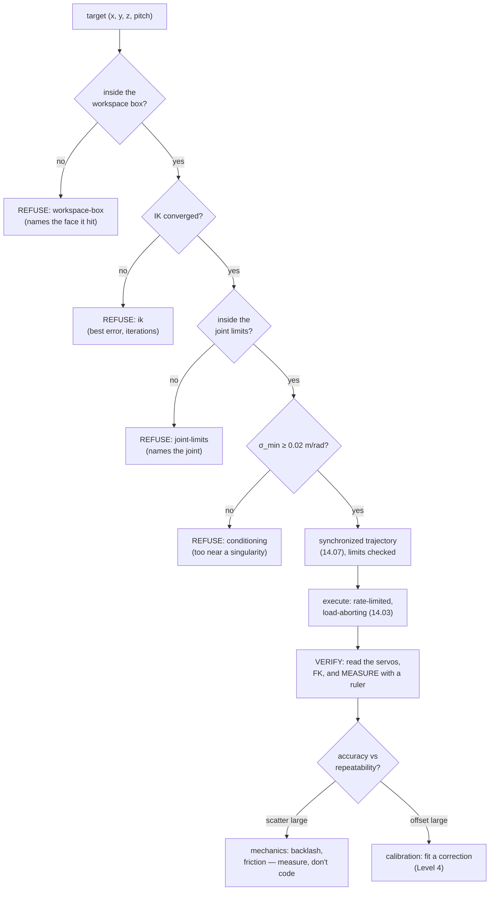

# 14.10 — Exercise lesson: move the gripper to a specified position

<!-- glance:start -->
<!-- generated by tools/build.py from curriculum/syllabus.yaml — edit the syllabus, not this block -->

| | |
|---|---|
| **Track** | Main path |
| **Difficulty** | Intermediate |
| **Time** | 1 h |
| **Hardware** | Robotic arm (leader + follower kit) (stage 5) |
| **Software** | ros2, moveit2 |
| **Prerequisites** | [14.09 MoveIt 2 — motion planning and collision checking](14.09-moveit2-motion-planning.md)<br>[14.06 The Jacobian — velocities, singularities and resolved-rate control](14.06-jacobian.md) |
| **Skip if** | Your arm reaches commanded Cartesian positions within a centimetre. |

<!-- glance:end -->

## What you will learn

- Run the whole module-14 pipeline end to end: a number in, a gripper at that point, a measurement out.
- Order the safety checks so that nothing reaches a servo until every earlier check has passed, and so that a refusal names its stage.
- Measure your arm's **accuracy** and its **repeatability** separately, with a protocol you can repeat.
- Build the error budget: which millimetres come from the servos, which from your calibration, and which from the model.
- Remove the systematic part with a measured correction, and say honestly what is left.

## Why it matters

This is the acceptance test for everything from [14.01](14.01-arm-anatomy.md) to
[14.09](14.09-moveit2-motion-planning.md). "Put the gripper at $(0.25, 0.00, 0.12)$" sounds trivial after five
lessons of kinematics, and it is the first time all of it has to be right *at once*: the geometry, the IK, the joint
map, the limits, the trajectory, the servos.

It is also the lesson where you find out what your arm can actually do — and the answer is probably not what you
expect. A 3D-printed arm with hobby servos will typically return to the same pose within about a millimetre and sit
**a centimetre** away from the point you asked for. Those are two different numbers with two different causes, and
telling them apart is the whole skill. Almost every "the arm is inaccurate" complaint is really "my calibration is a
degree off", and a degree is 10 mm at the gripper.

Everything downstream depends on getting this straight. A grasp plan
([15.05](../15-manipulation/15.05-grasp-planning.md)) that assumes 1 mm accuracy on an arm with 10 mm accuracy fails
in a way that looks like a perception bug.

> [!CAUTION]
> **Safety ([14.11](14.11-arm-safety.md)):** every hardware step below energises the arm. Clamp the base to the
> table. Clear a 0.5 m radius — no mugs, no cables, no cat. Keep the servo PSU switch within one second's reach and
> your face out of the workspace. Start at the default 30 % torque and 30 °/s and raise them one at a time. When a
> script ends the arm goes **limp and falls**: support it with a hand.

<!-- prereqs:start -->
## Prerequisites

You need these first:

- [14.09 MoveIt 2 — motion planning and collision checking](14.09-moveit2-motion-planning.md)
- [14.06 The Jacobian — velocities, singularities and resolved-rate control](14.06-jacobian.md)

### Optional prerequisite links

None.

Check your readiness: `python course.py why 14.10`
<!-- prereqs:end -->

## Concept

Three words that get used interchangeably and must not be:

| | Question | Typical SO-101 | Limited by |
|---|---|---|---|
| **Resolution** | What is the smallest change I can command? | 0.088° ≈ **0.3 mm** at the tool | the servo's 12-bit encoder |
| **Repeatability** | Go to the same target ten times — how much do the results scatter? | **1–3 mm** | backlash, friction, servo dead-band |
| **Accuracy** | How far is the average result from the point I asked for? | **5–15 mm** | your calibration and your model |

Resolution is a property of the hardware and is never your problem on this arm. Repeatability is a property of the
mechanics — you can measure it, you mostly cannot improve it without better hardware. **Accuracy is a property of
your software**, and you can improve it enormously in an afternoon.

That is a liberating fact, because it means the hierarchy of fixes is clear. If your arm scatters by 8 mm, stop
looking at your code: that is mechanics. If it lands consistently 12 mm short of every target, your code can fix
that completely — and the fix is a measurement, not a guess.

The second idea of the lesson is **the gate**. A command to move the arm passes through a series of checks, each of
which can refuse, in an order chosen so that the cheapest and most dangerous checks come first:

```text
  workspace box  →  IK  →  joint limits  →  conditioning  →  trajectory  →  execute  →  verify
        ↑                                                                                 ↑
   refuses a point you                                                         closes the loop: what
   never want to visit                                                         did the arm actually do?
```

The workspace box is first *on purpose*. It is the only check that knows about the world — the table, the edge of
the bench, your hand — and it is the only one that can refuse a target that the rest of the pipeline would happily
and correctly execute. [14.05](14.05-inverse-kinematics.md) showed why: IK converges perfectly on a point 5 cm
inside the table.

> [!TIP]
> **Ask your teacher:** "Give me three measurements that distinguish a repeatability problem from an accuracy problem, and tell me which of my results is which."

## Technical explanation

### Level 1 — The pipeline, as code

[`code/reach.py`](code/reach.py) is the whole module in one file, and its structure *is* the gate above. Each stage
returns a `ReachPlan` that names the stage that decided the outcome, so a refusal is never a mystery:

```text
$ py reach.py --dry-run 0.25 0.0 0.12
target      [0.25, 0.0, 0.12] m
result      OK at stage 'planned': all checks passed
joints      [-0.0, -44.79, 37.64, 52.15, 0.01] deg
FK check    [0.25, -0.0, 0.11999] m (residual 0.011 mm)
sigma_min   0.0991 m/rad (worst-case 0.50 rad/s for a 5 cm/s move)
trajectory  51 points, 0.993 s
```

```text
$ py reach.py --dry-run 0.50 0.0 0.12
result      REFUSED at stage 'workspace-box': x = 0.500 m is above the box maximum 0.340 m

$ py reach.py --dry-run 0.25 0.0 -0.05
result      REFUSED at stage 'workspace-box': z = -0.050 m is below the box minimum 0.020 m

$ py reach.py --dry-run 0.12 0.0 0.30 --pitch 90
result      REFUSED at stage 'ik': max_iterations (best error 66.4 mm after 200 iterations)
```

Note what the box's defaults are: $x \in [0.10, 0.34]$, $y \in [\pm 0.22]$, $z \in [0.02, 0.32]$. The upper $x$
bound is **0.34 m against a reach of 0.45 m at the URDF zero pose** (0.55 m at full stretch) — a margin of 11 cm or
more, because of [14.06](14.06-jacobian.md): the last centimetres of reach are where $\sigma_{\min}$ collapses and
the arm becomes uncontrollable long before it becomes unable.

The `FK check` line deserves attention. It is *not* a measurement — it is the model checking itself, and it will
always say something like 0.01 mm because the same equations produced both numbers. A residual of 0.011 mm means
"IK converged", not "the arm will be within 0.011 mm". Confusing the two is the single most common mistake in this
lesson.

### Level 2 — The error budget, in millimetres

Where do the millimetres come from? Use the Jacobian ([14.06](14.06-jacobian.md)): a joint error $\Delta q$ becomes
a tool error $J\Delta q$. At the representative pose for $(0.25, 0, 0.12)$ with a 45° approach, the linear
Jacobian's column norms are

$$\|J_{:,i}\| = (0.2112,\; 0.1808,\; 0.2588,\; 0.1594,\; 0.0079)\ \text{m/rad}$$

Now push each source of joint error through it:

| Source | Joint error | Tool error (worst case) | Tool error (RSS) |
|---|---|---|---|
| Servo resolution (half a step) | 0.044° = 7.7e-4 rad | **0.47 mm** | 0.32 mm |
| Calibration offset, 0.5° per joint | 0.5° | **5.3 mm** | 3.6 mm |
| Calibration offset, 1° per joint | 1.0° | **10.7 mm** | 7.2 mm |
| Calibration offset, 2° per joint | 2.0° | **21.4 mm** | 14.4 mm |
| A 1 mm link-length error in the URDF | — | **1.0 mm** | 1.0 mm |

Read the table as a priority list. The encoder contributes half a millimetre and is irrelevant. A **one-degree**
error in the joint map of [14.08](14.08-arm-urdf-and-ros2-control.md) contributes a **centimetre**, and one degree
is easy to be wrong by when you are eyeballing a zero pose by hand. Everything else — link lengths, printed-part
tolerances, the frame definition of `gripper_frame_link` — is in the millimetre range.

Two sources the table does not cover, because they are not constant and must be measured on *your* arm:

- **Backlash** in the printed gear train: the joint sits in a different place depending on which side you approached
  from. Measure it by commanding the same target from the left and from the right and differencing the results.
- **Gravity sag**: a position-controlled servo holds against a torque error, so the arm droops more when extended or
  loaded. Measure it by commanding the same pose empty and with a 100 g payload.

### Level 3 — Measuring it properly

The measurement is the lesson. Do it like this:

1. **Tape a grid of paper to the table**, aligned with `base_link`'s $x$ and $y$, with a cross drawn at each target.
   Measuring in the robot's own frame removes a whole class of error.
2. **Define the reference point on the gripper** and never change it: the midpoint between the jaw tips, with the
   jaws at a fixed opening. A hanging pointer (a 3 mm rod taped to the gripper, tip at a known offset) makes it
   visible.
3. **Approach every target from the same direction and the same home pose.** Mixing approach directions mixes
   backlash into your repeatability number.
4. **Ten repeats per target**, returning to home in between. Record each position with calipers to the nearest
   0.5 mm.
5. Compute **both** numbers, and label them:

$$\text{repeatability} = \max_i \|p_i - \bar p\|, \qquad \text{accuracy} = \|\bar p - p_{\text{commanded}}\|$$

Repeatability is scatter about your own mean; accuracy is the offset of that mean from the truth. They are
independent: an arm can be repeatable to 0.5 mm and wrong by 20 mm, which is the *good* case, because a consistent
error is one you can correct.

`reach.py --repeat 10` does the bookkeeping and prints both:

```text
repeatability over 10 runs: mean offset from the commanded point 3.120 mm, spread (max |p - mean|) 0.000 mm
```

Against the fake servo bus the spread is exactly **zero** — simulated servos have no backlash and no friction — and
the 3.1 mm offset is the fake bus's own 1° position tolerance. That is the correct behaviour for a simulator and
exactly why a simulated repeatability number means nothing. The number you care about comes off a ruler.

### Level 4 — Correcting the systematic part

Once you have measured a grid of targets, you have a set of (commanded, measured) pairs — and the systematic part of
the error is a function you can fit and invert. Three levels of ambition:

1. **A constant offset.** Average $(p_{\text{cmd}} - p_{\text{meas}})$ over the grid, add it to every future
   command. Two lines of code.
2. **An affine correction** $p_{\text{corrected}} = A\,p_{\text{meas}} + b$, fitted by least squares over the grid
   (12 parameters from ≥ 4 well-spread points; use 20+). This absorbs scale and skew as well as offset, which is
   what a joint-angle bias actually looks like in task space.
3. **Re-fitting the kinematics** — solving for the joint offsets themselves rather than a task-space correction.
   More correct, more work; this is what commercial arms' calibration routines do.

Simulate it before you do it, by injecting a known joint bias into `arm_kinematics` and fitting the correction to
the resulting errors. With a 1° (1σ) per-joint bias on a 34-point grid over the workspace, averaged over 12 random
biases:

| | mean error | max error |
|---|---|---|
| raw | 7.2 mm | 8.9 mm |
| after a constant offset | 2.6 mm | 4.7 mm |
| after an affine fit | **0.81 mm** | 1.72 mm |
| affine fit on half the grid, tested on the other half | **0.95 mm** | 2.06 mm |

Three things to take from it. **One degree of calibration error is 7 mm of accuracy** — the Level 2 table, confirmed
end to end. A constant offset removes about two thirds of it and an affine fit removes about **89 %**. And the last
row is the one that matters: a fit validated only on the points it was fitted to proves nothing, so hold half out.
Here the held-out error (0.95 mm) is barely worse than the fitted one (0.81 mm), which is what tells you the
correction is real rather than curve-fitted noise.

The spread between individual biases is large — across those 12 draws the raw maximum error ranged from 3.0 mm to
16.5 mm — so do not treat any single number here as a prediction for your arm. Measure yours.

And then be honest about what is left. After correction your arm is accurate to roughly its repeatability, and no
amount of software makes it better than that. If you need 0.5 mm, you need different hardware.

> [!TIP]
> **Ask your teacher:** "My arm is repeatable to 2 mm and accurate to 11 mm. What do I fix, in what order, and what is the best I can hope for?"

## Diagram



```text
 The measurement sheet — tape it to the table, aligned with base_link

        y
        ▲
  +0.12 ┤   ✕        ✕        ✕        ✕          ✕ = commanded target
        │                                          ● = where the gripper actually went
   0.00 ┤   ✕   ●    ✕  ●     ✕ ●      ✕  ●
        │                                        For each target, 10 repeats from home:
  -0.12 ┤   ✕        ✕        ✕        ✕           accuracy      = |mean − ✕|
        └───┴────────┴────────┴────────┴──► x      repeatability = max |each − mean|
          0.15     0.20     0.25     0.30

  A consistent ● to the left of every ✕  →  systematic: fix it in software (Level 4).
  ● scattered around each ✕             →  mechanical: measure it, then live with it.
```

## Code

```bash
cd 14-robotic-arm/code

py reach.py --dry-run 0.25 0.0 0.12              # plan and check, touch nothing
py reach.py --dry-run --simulate 0.25 0.0 0.12   # + execute against the fake servo bus
py reach.py --dry-run --simulate --repeat 10 0.25 0.0 0.12
py reach.py --dry-run 0.50 0.0 0.12              # a refusal, with the stage named
```

The gate, in full, is short enough to read at once:

```python
def plan_reach(chain, target_xyz, q_start, *, pitch=None, box=None, min_sigma=0.02, ...):
    problems = box.violations(target)
    if problems:
        return ReachPlan(False, "workspace-box", "; ".join(problems), target)

    result = ak.ik_dls(chain, target, q_start, target_pitch=pitch, position_tol_m=position_tol_m)
    if not result.converged:
        return ReachPlan(False, "ik", f"{result.reason} (best error {…} mm)", target, q=result.q)

    if not chain.within_limits(result.q):
        return ReachPlan(False, "joint-limits", "outside limits: " + ", ".join(outside), target, q=result.q)

    sigma_min = float(np.linalg.svd(chain.geometric_jacobian(result.q)[:3], compute_uv=False)[-1])
    if sigma_min < min_sigma:
        return ReachPlan(False, "conditioning", f"sigma_min {sigma_min:.4f} < {min_sigma:.4f} m/rad", …)

    t, q_path, qd, _ = tr.joint_space_trajectory(q_start, result.q, v_max, a_max, dt=dt)
    return ReachPlan(True, "planned", "all checks passed", target, q=result.q, t=t, q_path=q_path, …)
```

and execution never touches a servo without a plan that says `ok`:

```python
def execute(bus, plan, chain, cfg, sleep=None):
    if not plan.ok or plan.q_path is None:
        raise SafetyError(f"refusing to execute a plan that failed at stage '{plan.stage}'")
    safe_enable_torque(bus, cfg)                       # 14.03: no jump on torque-on
    for q in plan.q_path[::5]:                         # 10 Hz waypoints
        present = move_smoothly(bus, joint_vector_to_goals(chain, q), cfg, sleep=…)
    return present
```

On the real arm, replace `joint_vector_to_goals`' identity mapping with the **measured** joint map from
[14.08](14.08-arm-urdf-and-ros2-control.md) — the default in `reach.py` is sign = +1, offset = 0, which is wrong for
every real SO-101 and will send the arm somewhere surprising if you forget.

For the ROS 2 path, the same targets go through MoveIt's pose goal
([14.09](14.09-moveit2-motion-planning.md)) and the arm controller of
[14.08](14.08-arm-urdf-and-ros2-control.md); the checks above still belong in front of it, because MoveIt's
planning scene does not know about the parts of the world you have not described.

## Exercise

### Exercise 14.10-E1 — Drive the gate `[coding]`

Hardware: none. Run `reach.py --dry-run` on at least eight targets chosen to trigger **every** stage:

- two that pass;
- one outside each of the box's six faces (pick three of them);
- one that is inside the box but unsolvable at pitch 90° and solvable at pitch 45°;
- one that gets refused for conditioning (hint: lower `--min-sigma`'s complement — push toward the reach limit by
  raising the box's `x` bound in code).

For each, record the stage that refused and the reason string. Then answer: why is the workspace box checked
*before* IK, when IK is what tells you whether the point is reachable at all?

### Exercise 14.10-E2 — Your arm's error budget `[numerical]`

Hardware: none.

1. Reproduce the Level 2 table for a pose of your own choosing, using
   `chain.geometric_jacobian(q)[:3]` and the 0.0879° servo step.
2. Add a row: what tool error does a 3 mm error in the `gripper_frame_link` offset produce, and why is it the same
   number everywhere in the workspace when the joint errors are not?
3. Compute, for your chosen pose, the per-joint calibration error that would produce exactly 5 mm of tool error, and
   say which joint you would measure most carefully as a result.
4. Predict: if you improve your calibration from 2° to 0.5° per joint, by what factor does the accuracy improve, and
   what number does it stop at?

### Exercise 14.10-E3 — Measure accuracy and repeatability `[hardware]`

Hardware: `arm` (calibrated, [14.08](14.08-arm-urdf-and-ros2-control.md)), plus paper, a pen and calipers or a steel
rule. No-hardware alternative: run the same protocol against `--simulate` and explain, in writing, which of the two
numbers the simulation cannot tell you and why.

> [!CAUTION]
> **Safety:** clamp the arm, clear a 0.5 m radius, keep the PSU switch in reach, keep your hands out of the
> workspace while it moves, and measure only when it has stopped. Start at 30 % torque and 30 °/s.

1. Tape a grid aligned with `base_link`; mark four targets at $x \in \{0.15, 0.20, 0.25, 0.30\}$, $y = 0$,
   $z = 0.02$ (just touching the paper) with a 45° approach.
2. For each target: ten runs, returning to the home pose between each, measuring the pointer position each time.
3. Report, per target: the mean position, the accuracy, the repeatability — and a sentence saying which dominates.
4. Repeat one target approaching from $y = +0.10$ and from $y = -0.10$. The difference is your **backlash**.
5. Repeat one target with a 100 g payload in the gripper. The difference is your **gravity sag**.

### Exercise 14.10-E4 — Fit and validate a correction `[coding]`

Hardware: `arm` (or simulate an unknown joint bias, which is the honest no-hardware version).

1. Measure (or simulate) a grid of at least 20 (commanded, measured) pairs spread over the workspace.
2. Fit a constant offset; report mean and max error before and after.
3. Fit an affine correction $A p + b$ by least squares; report mean and max error.
4. **Hold out half the grid**, fit on the other half, and report the error on the held-out points. Explain in one
   sentence why step 3's number alone would have been dishonest.
5. Apply the correction inside `reach.py` and re-measure three fresh targets that were in neither half.

The workspace box, the two statistics and the fitting functions are auto-graded (23 tests, no hardware):
implement `WorkspaceBox`, `accuracy_and_repeatability`, `fit_offset`, `fit_affine`, `apply_affine`, `residuals` and
`holdout_validate` in `labs/exercises/14.10/student.py`.

Check it: `python course.py check 14.10` (or `py -m pytest labs/exercises/14.10`).

### Exercise 14.10-E5 — Debug a 4 cm error `[debugging]`

Hardware: none needed to reason; the arm helps.

You command $(0.25, 0.00, 0.12)$ and the gripper ends up at roughly $(0.21, 0.00, 0.16)$ — 4 cm out, consistently,
with a scatter of under 1 mm. `reach.py` reports `FK check ... residual 0.011 mm`.

1. **Before computing:** list four hypotheses that would produce a large, *consistent*, *repeatable* error, and rank
   them by how cheap they are to test.
2. Work out, from the Jacobian, roughly what per-joint error would produce a 4 cm displacement in that direction.
   Is it plausible as a calibration error, or is it too large?
3. Identify the actual class of cause and the one measurement that confirms it.
4. State why the 0.011 mm residual is not evidence of anything.

## Expected result

- **14.10-E1:** Eight targets, eight named stages. $(0.50, 0, 0.12)$ → `workspace-box`,
  "x = 0.500 m is above the box maximum 0.340 m". $(0.25, 0, -0.05)$ → `workspace-box` on $z$.
  $(0.12, 0, 0.30)$ at pitch 90° → `ik`, "best error 66.4 mm after 200 iterations"; the same point at pitch 45°
  plans. $(0.34, 0.20, 0.02)$ at pitch 90° → `ik`, best error 22.7 mm — *inside* the box and still unreachable at
  that orientation, exactly the lesson of [14.05](14.05-inverse-kinematics.md). The box-before-IK answer: the box is
  the only check that knows about the **world**. IK will converge happily on a point inside your table, and a check
  that runs after IK has already spent the compute and, worse, invites you to "just execute it since IK worked".
- **14.10-E2:** At $(0.25, 0, 0.12)$, pitch 45°, the column norms are
  $(0.2112, 0.1808, 0.2588, 0.1594, 0.0079)$ m/rad. Half a servo step gives **0.47 mm** worst case, 0.32 mm RSS;
  1° per joint gives **10.7 mm** worst case, 7.2 mm RSS. (2) A 3 mm tool-frame offset gives exactly 3 mm everywhere,
  because it is a fixed translation in the tool frame, not something the joint angles amplify — the Jacobian does
  not enter. (3) Solving $5\ \text{mm} = \Delta q \sum_i\|J_{:,i}\|$ gives $\Delta q = 0.0053$ rad $= 0.30°$ per
  joint. `elbow_flex` has the largest column (0.2588 m/rad), so it is the joint whose calibration repays the most
  care — and `wrist_roll`, at 0.0079, barely matters at all for position. (4) Linearly: 4× better, from about
  21 mm to about 5 mm, and it stops at your repeatability — beyond that you are correcting noise.
- **14.10-E3:** Expect repeatability of **1–3 mm** and accuracy of **5–15 mm** on a well-built SO-101, with accuracy
  degrading with reach. Backlash typically shows as a **1–3 mm** difference between the two approach directions;
  gravity sag with 100 g as **2–5 mm**, downward, worst at full extension. If your repeatability is worse than 5 mm,
  suspect a loose horn screw or a servo bracket before anything in software. Against `--simulate` the spread is
  **exactly 0.000 mm**: the fake servos have no backlash, no friction and no compliance, so the simulation can tell
  you about your *pipeline* and nothing at all about your *arm*.
- **14.10-E4:** With a 1° (1σ) simulated joint bias over a 34-point grid, averaged over 12 random biases: raw mean
  7.2 mm / max 8.9 mm; after a constant offset 2.6 / 4.7 mm; after an affine fit **0.81 / 1.72 mm**; fitted on half
  and tested on the other half **0.95 / 2.06 mm**. Your single run will differ a lot — across those 12 biases the
  raw maximum ranged from 3.0 to 16.5 mm — so report your own numbers, not these. The held-out error being barely
  worse than the fitted one is what tells you the correction is real; step 3 alone is dishonest because a
  12-parameter fit to 34 points will always look good on those 34 points. On hardware expect the same *shape* of
  result, and expect the residual to bottom out at your measured repeatability rather than at 1 mm.
  `python course.py check 14.10` passes with nothing skipped (23 tests, under two seconds); the two tests that carry
  the lesson are "a real correction generalises" and "fitting noise does not".
- **14.10-E5:** (1) Plausible causes of a large consistent error: a wrong joint-map offset or sign
  ([14.08](14.08-arm-urdf-and-ros2-control.md)); the wrong tool frame (measuring to the jaw tip while the model
  means `gripper_frame_link`); a mismatch between where the arm is clamped and where `base_link` is assumed to be;
  and gravity sag. Cheapest first: compare RViz with the real arm by eye, then measure one joint with a protractor.
  (2) A 4 cm displacement needs about $0.04 / 1.02 = 0.039$ rad $= 2.2°$ summed across the joints — entirely
  plausible as calibration error, so that hypothesis survives. (3) The 4 cm is *back and up*, which is exactly what
  happens when `shoulder_lift` and `elbow_flex` both read a couple of degrees off — confirm by commanding a single
  joint to a known angle and measuring it with a protractor. (4) The 0.011 mm residual is the *model* checking
  itself: IK and FK use the same equations, so it reports convergence, never contact with reality. The only evidence
  about reality is a ruler.

## Troubleshooting

### Symptom: the arm goes somewhere completely different from the target

Not a calibration problem — a *mapping* problem. In order:

1. Compare RViz with the real arm by eye ([14.08](14.08-arm-urdf-and-ros2-control.md)). A joint that moves the wrong
   way has a sign error; a joint that is offset has an offset error.
2. Check you are not using `reach.py`'s identity `joint_vector_to_goals` on real hardware. It exists so the
   no-hardware path runs and it is wrong for every real arm.
3. Check the joint **order**. A permutation between your joint vector and the servo names produces exactly this,
   and it is invisible in any round-trip test that uses the same permutation twice.

### Symptom: repeatable to 1 mm, but 15 mm from the target

Textbook systematic error, and good news. Measure a grid and fit the correction of Level 4. Before that, check the
two cheap systematic causes: the tool reference point (are you measuring to the jaw tip while the model means the
point between the jaws?) and the base frame (is `base_link` where you think it is relative to your paper grid?).

### Symptom: scatter of 5 mm or more between identical runs

Mechanical. Software cannot fix it; find it.

1. With torque off, push each joint gently back and forth and feel for play. A loose servo horn screw is the usual
   culprit.
2. Check `Present_Load` during a hold ([14.03](14.03-controlling-servos.md)). A joint fighting gravity at 20 % load
   will sag differently depending on where it came from.
3. Approach the target from the same direction every time and re-measure. If the scatter collapses, you were
   measuring backlash, not repeatability.
4. Slow the final approach down. A trajectory that arrives fast overshoots and settles differently each time.

### Symptom: `REFUSED at stage 'conditioning'`

The goal pose is too near a singularity for the arm to be controllable there ([14.06](14.06-jacobian.md)). Do not
lower `--min-sigma` to make the message go away. Move the target a few centimetres toward the base, or change the
approach pitch so the arm reaches it with the elbow bent.

### Symptom: the numbers were fine yesterday

Something moved. The clamp, the paper grid, the tool reference, or the servo calibration (LeRobot's calibration file
is per `robot-id`; a re-run of `lerobot-calibrate` changes every offset). Re-measure two targets before you debug
anything else — a five-minute check that regularly saves an afternoon.

## Common mistakes

- **Reading the `FK check` residual as accuracy.** It is the model agreeing with itself. Only a ruler measures
  accuracy.
- **Reporting one number.** "My arm is accurate to 3 mm" is meaningless without saying whether that is scatter or
  offset.
- **Measuring with mixed approach directions.** You get backlash folded into repeatability and both numbers become
  useless.
- **Fitting a correction and validating it on the same points.** Always hold some out.
- **Correcting below your repeatability.** Once the systematic part is gone, more fitting is curve-fitting noise.
- **Leaving the identity joint map in place on hardware.** `reach.py`'s default is deliberately the wrong one.
- **Lowering `--min-sigma` to silence a refusal.** The refusal is telling you the arm cannot control that point.
- **Measuring while the arm is still settling.** Wait for the motion to finish and the load to stabilise.

## Knowledge check

1. Your arm returns to within 1 mm every time but sits 12 mm from the commanded point. Which do you fix, and how?
   <details><summary>Answer</summary>

   The accuracy, and it is fixable in software: measure a grid of (commanded, measured) pairs and fit a correction
   (constant offset, then affine). 1 mm repeatability means the mechanics are fine; a consistent 12 mm offset is
   almost always a calibration error of a degree or two, which the Jacobian turns into exactly that much tool error.
   </details>

2. Why is 0.088° of servo resolution irrelevant to this lesson's numbers?
   <details><summary>Answer</summary>

   Push it through the Jacobian: half a step is $7.7 \times 10^{-4}$ rad, which at a representative pose is
   **0.47 mm** worst case across all five joints. That is an order of magnitude below the repeatability of the
   mechanics and two orders below a typical calibration error. The encoder is not your limiting factor and never
   will be on this arm.
   </details>

3. `reach.py` reports `FK check ... residual 0.009 mm`. What has it proved?
   <details><summary>Answer</summary>

   That the IK solver converged — that FK of the solution reproduces the target, using the same equations that
   produced the solution. It has proved nothing whatsoever about where the physical arm will go. It is a
   self-consistency check, not a measurement.
   </details>

4. Why is the workspace box checked before IK rather than after?
   <details><summary>Answer</summary>

   Because it is the only check that knows about the world. IK is a statement about the arm's geometry and will
   happily converge on a point 5 cm inside your table. Checking the box first also means the pipeline never presents
   you with a converged solution for a point you should not visit — which is the situation where people talk
   themselves into executing it.
   </details>

5. Predict: you command the same target from the left and from the right and the results differ by 2 mm. What is
   that, and how does it change your measurement protocol?
   <details><summary>Answer</summary>

   Backlash — play in the gear train, so the joint settles differently depending on which way it was last driven.
   The protocol must approach every target from the same direction and the same home pose, or backlash contaminates
   the repeatability number. If your task genuinely approaches from both sides, then 2 mm is part of your real
   repeatability and you should report it as such.
   </details>

6. You fit an affine correction on 20 measured points and the mean error drops from 9 mm to 0.3 mm. What do you do
   before believing it?
   <details><summary>Answer</summary>

   Hold points out. A 12-parameter fit to 20 points will fit those 20 points well whatever the truth is. Fit on
   half, test on the other half, and compare: if the held-out error is close to the fitted error (as in the
   simulated runs: 0.95 mm against 0.81 mm), the correction is real. If it is much worse, you fitted noise.
   </details>

7. After correction your accuracy is 1.8 mm and your repeatability is 1.6 mm. Is more calibration worth doing?
   <details><summary>Answer</summary>

   No. Accuracy can never be better than repeatability — you cannot correct an error that changes every time. At
   1.8 versus 1.6 mm the systematic part is essentially gone and further fitting will chase noise. If the task needs
   better, the answer is mechanical (tighter hardware, metal-gear servos) or a different strategy (visual servoing,
   [15.06](../15-manipulation/15.06-visual-servoing.md), which closes the loop on the object rather than trusting the
   arm's model).
   </details>

## Practical challenge

Make the arm hit a target you did not choose in advance, and prove it.

Acceptance criteria:

- A calibration session: ≥ 20 measured grid points, an affine correction fitted on half and validated on the other
  half, with both error numbers reported.
- `reach.py` (or your own equivalent) applies the correction, and every stage of the gate is still enforced,
  including after correction — a corrected target that leaves the workspace box must still be refused.
- A **blind test**: have someone else mark five crosses on the paper inside your workspace, read off their
  coordinates in `base_link`, and command them. Report the accuracy at each, with photographs.
- Three of the five are hit within **2× your measured repeatability**. If not, you say why, with evidence, rather
  than adjusting until they are.
- A one-page written result: your arm's resolution, repeatability, accuracy before and after correction, backlash,
  and gravity sag with a 100 g payload — each with the measurement that produced it.
- A statement of what you would need in order to halve each number, and which of those you consider worth the money.

## You can skip this if…

You can answer knowledge-check questions 1, 3 and 7 without looking, and you have measured an arm's accuracy and
repeatability separately, on hardware, with a protocol you can describe. Then:
`python course.py skip 14.10 --reason "measured arm accuracy and repeatability and corrected the systematic part"`.

## Go deeper

- ISO 9283, *Manipulating industrial robots — Performance criteria and related test methods* — the standard
  definitions of pose accuracy and repeatability, and the test procedure this lesson's protocol imitates:
  https://www.iso.org/standard/22244.html
- Lynch & Park, *Modern Robotics*, chapter 4 — forward kinematics and where model error enters:
  https://hades.mech.northwestern.edu/index.php/Modern_Robotics
- MoveIt 2 "hand-eye calibration" tutorial, for when the correction should come from a camera rather than a ruler:
  https://moveit.picknik.ai/main/doc/examples/hand_eye_calibration/hand_eye_calibration_tutorial.html
- LeRobot's SO-101 calibration documentation — what `lerobot-calibrate` actually writes, and why re-running it
  invalidates your measurements: https://huggingface.co/docs/lerobot/so101
- The next step when the arm's own accuracy is not enough — closing the loop on what the camera sees:
  [15.06](../15-manipulation/15.06-visual-servoing.md)

## Progress checkpoint

- [ ] I can send a target through the gate and read a refusal that names its stage.
- [ ] I can compute my arm's error budget from the Jacobian and say which source dominates.
- [ ] I have measured accuracy and repeatability separately, with a repeatable protocol.
- [ ] I have fitted a correction and validated it on held-out points.
- [ ] I know what my arm can and cannot do, in millimetres, and I can say it out loud.

`python course.py complete 14.10` (exercises done) · `python course.py master 14.10` (challenge done) ·
`python course.py struggle 14.10 "what was hard"`

Next: [14.11 — Arm safety — torque, speed, workspace limits and e-stop](14.11-arm-safety.md).
