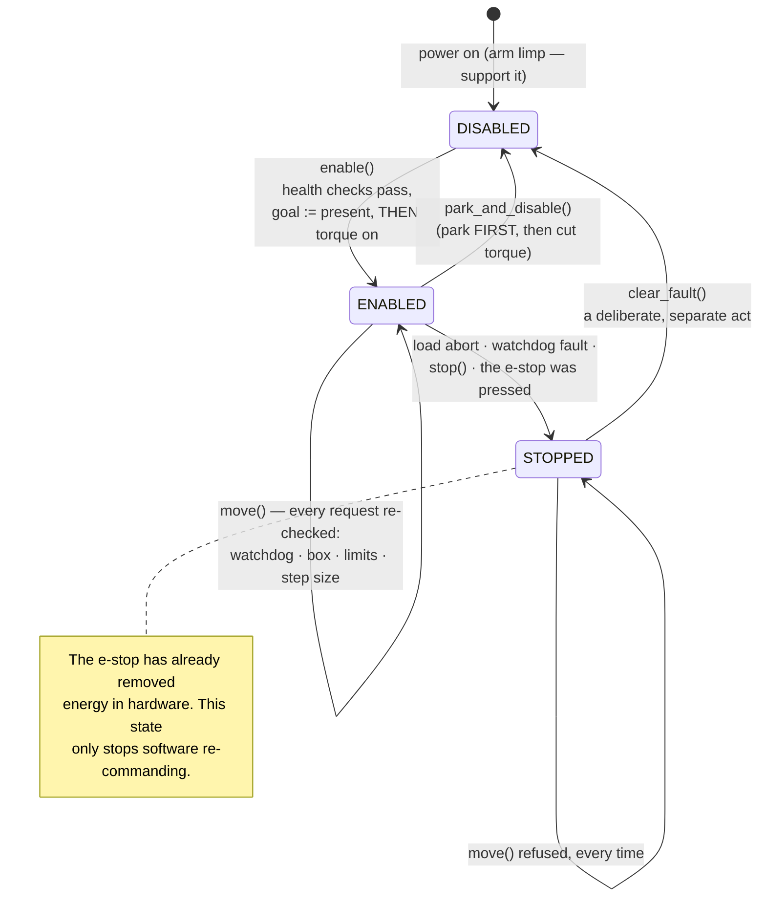

# 14.11 — Arm safety — torque, speed, workspace limits and e-stop

<!-- glance:start -->
<!-- generated by tools/build.py from curriculum/syllabus.yaml — edit the syllabus, not this block -->

| | |
|---|---|
| **Track** | Main path |
| **Difficulty** | Intermediate |
| **Time** | 45 min |
| **Hardware** | Robotic arm (leader + follower kit) (stage 5) |
| **Software** | none |
| **Prerequisites** | [14.03 Controlling the arm's servos — positions, speeds, torque and limits](14.03-controlling-servos.md) |
| **Skip if** | Never skip — read before powering the arm near people. |

<!-- glance:end -->

## What you will learn

- Name the five ways a small arm actually hurts people and equipment, with the numbers behind each.
- Compute your arm's worst-case tip speed, kinetic energy and pinch force, and use them to choose torque and speed limits you can justify.
- Build the layered defence — software clamp, rate limit, servo registers, load abort, watchdog, workspace box, e-stop — and say which failure each layer catches.
- Wire and test a hardware e-stop for the servo supply, and handle the one thing that makes arms different from wheeled robots: **cutting power makes an arm fall**.
- Run a session from a written pre-flight checklist, and shut down by parking before de-energising.

## Why it matters

The SO-101 weighs about half a kilogram and is driven by servos you can stall with your hand. It does not look
dangerous, and that is exactly the problem: people put their face in the workspace to see what the gripper is doing.

Three numbers change that intuition, and you will compute all three in this lesson:

- At its no-load speed the gripper travels at **2.86 m/s** — faster than you can withdraw a hand.
- The first thing a naively-enabled arm does is jump to whatever is in its goal register, which in
  [14.03](14.03-controlling-servos.md)'s demonstration was **28° at full speed**: 27 cm of tip travel in 93 ms.
- And while the arm can only push about **3 N** at the gripper — genuinely feeble — a finger caught 1 cm from a
  joint axis sees **162 N**, because the same torque acts on a fiftieth of the lever.

None of those is lethal. All of them will break a finger joint, a camera lens, or the arm itself. And the failure
modes get worse as the course goes on: [14.09](14.09-moveit2-motion-planning.md) has a planner deciding where the
arm goes, [18.06](../18-embodied-ai/18.06-train-first-policy-lerobot.md) has a neural network deciding, and
[19.09](../19-llm-robot-agents/19.09-agent-safety-boundaries.md) has a language model deciding. Every one of those
produces joint angles you did not write, and the only thing standing between them and your hands is the layer this
lesson builds.

> [!IMPORTANT]
> This lesson has no "skip if". Read it before you power the arm near a person, and re-read it before the first
> session with any new source of commands — a planner, a policy, an agent.

<!-- prereqs:start -->
## Prerequisites

You need these first:

- [14.03 Controlling the arm's servos — positions, speeds, torque and limits](14.03-controlling-servos.md)

### Optional prerequisite links

None.

Check your readiness: `python course.py why 14.11`
<!-- prereqs:end -->

## Concept

Arms differ from the wheeled base you have been building in one structural way, and almost every arm-specific safety
rule follows from it: **a wheeled robot stops when you cut power; an arm falls.**

Removing torque from the base means the motors coast and friction stops it. Removing torque from an arm means five
joints simultaneously stop resisting gravity, and half a kilogram of plastic swings down from wherever it was. That
turns the most basic safety action — kill the power — into something with a consequence you must plan for. It is why
every script in this module warns you to support the arm with a hand when it ends, and why this lesson's shutdown
path **parks before it de-energises**.

The second idea is **layers**, and the discipline is that each layer must be independent and each must be assumed to
fail. From the outside in:

```text
  a written checklist and a person paying attention   ← the only layer that understands context
  the workspace box                                    ← knows about the table and your hands
  the software limits and rate limit  (14.03)          ← catches bad IK, typos, drifting policies
  the servo's own speed/torque registers               ← survives your process dying
  the load abort                                       ← the only layer that senses the world
  the WATCHDOG                                         ← catches a hung or crashed controller
  the E-STOP                                           ← removes ENERGY, in hardware, with no software involved
```

Only the last one is a real stop. Everything above it is a program deciding not to move, and a program can be wrong,
hung, or replaced by a neural network next month. That is not an argument against the software layers — they catch
almost everything — it is an argument for having the hardware one as well.

The third idea is **make the dangerous thing require a deliberate act**. A latching e-stop does not un-stop when you
release it; you twist it, and then software must explicitly re-enable. The `SafetySupervisor` in this lesson mirrors
that: a fault latches into a `STOPPED` state and `clear_fault()` is a separate call you have to write on purpose.

> [!TIP]
> **Ask your teacher:** "Give me five ways this arm could hurt me or itself, and make me say which layer catches each one."

## Technical explanation

### Level 1 — The five hazards, concretely

| Hazard | How it happens | What catches it |
|---|---|---|
| **The torque-on jump** | You enable torque while a stale goal sits in the servo's register; the joint snaps to it at full speed | `safe_enable_torque` writing goal = present *before* enabling ([14.03](14.03-controlling-servos.md)) |
| **Pinch** | A finger or cable between two links, near a joint axis where the lever is short | torque limit, load abort, and keeping hands out |
| **Gravity collapse** | The script ends, an exception escapes, or you hit the e-stop — and the arm drops | park-then-disable; designing the workspace so a falling arm hits nothing |
| **Stall heating** | The arm pushes against something indefinitely; the servo draws stall current and cooks | load abort, temperature check, torque limit |
| **A command you did not write** | Bad IK, a planner that ignored an obstacle, a policy that drifted outside its training distribution | workspace box, joint limits, step limit, watchdog, e-stop |

The last row is the one that grows. Everything from [14.09](14.09-moveit2-motion-planning.md) onward puts something
other than you in charge of the joint angles.

### Level 2 — The numbers that justify your limits

Do not pick 30 % and 30 °/s because a lesson said so. Derive them.

**Speed.** The worst case is the whole arm swinging about the base at full reach, $v = r\omega$ with $r = 0.546$ m:

| joint speed limit | tip speed | kinetic energy (300 g effective) |
|---|---|---|
| 300 °/s (servo no-load) | **2.86 m/s** | 1.23 J |
| 60 °/s | 0.57 m/s | 0.049 J |
| **30 °/s (course default)** | **0.29 m/s** | 0.012 J |

Energy scales with the *square* of speed: dropping from 300 °/s to 30 °/s divides the impact energy by **100**. For
comparison, 1.2 J is roughly a 120 g object dropped from a metre; 0.012 J is that object dropped from a centimetre.
That ratio is the entire argument for the first-run limits.

(These are lumped-mass estimates, not a dynamics model, and they are not a safety certification. They exist to make
the *ratio* visible.)

**Force.** $F = \tau / r$, with the STS3215's 1.618 N·m stall torque:

| where | at full torque | at 30 % |
|---|---|---|
| at the tool, fully extended (0.546 m) | 3.0 N | 0.9 N |
| at the gripper jaw tip (0.05 m) | 32 N | 9.7 N |
| **2 cm from a joint axis** | **81 N** | 24 N |
| **1 cm from a joint axis** | **162 N** | 49 N |

Read that top-to-bottom. The arm is almost harmless at its tool — you can stop it with two fingers, which is why it
is a good arm to learn on. It is genuinely dangerous *near its joints*, where the short lever multiplies the same
torque by fifty. The safety rule that falls out is not "watch the gripper"; it is **keep fingers away from the
joints**, and route cables so they cannot be drawn into one.

**The first-run limits, justified.** 30 % torque caps the worst pinch at 49 N — unpleasant but survivable — and
30 °/s gives you about three seconds to react to a 1 m motion. Raise them one at a time, re-running the same test,
recording what you changed.

### Level 3 — The layers, and what each one actually catches

`SafetySupervisor` in [`code/arm_safety.py`](code/arm_safety.py) is the layer above
[14.03](14.03-controlling-servos.md)'s `servo_tools`, and it adds the three things `servo_tools` cannot do:

**A session state machine.** `DISABLED → ENABLED → STOPPED`. Motion is refused unless the state is `ENABLED`; a
fault latches into `STOPPED`; and `clear_fault()` is a deliberate separate call. This is the software mirror of a
latching e-stop, and the point is that recovery is never automatic.

```text
$ py arm_safety.py
  refused before enabling:   arm is disabled
  refused, outside the box: ['workspace box: z = -0.050 m is below the box minimum 0.020 m']
  refused, outside limits:  ['wrist_flex: 80.0 deg outside [-40.0, 40.0] deg']
  refused, step too big:    ['wrist_flex: 35.0 deg step exceeds 30.0 deg per request']
  refused, watchdog:        ['watchdog: no heartbeat for more than 0.50 s']
  blocked joint -> STOPPED: elbow_flex: load 30 % during move — stopped at 5.0
  refuses to re-enable:     stopped (…); call clear_fault() deliberately before enabling
```

**A watchdog.** [14.03](14.03-controlling-servos.md) named this as the gap and it is worth being precise about what
a watchdog can and cannot do here. If your control loop hangs, the supervisor's heartbeat goes stale and every
subsequent motion request is refused — so nothing *new* happens. But the servos keep holding their last commanded
goal, because **software cannot de-energise anything by not running**. A watchdog prevents new motion; only the
e-stop removes energy. Both are needed, and confusing them is dangerous.

(The Pico firmware's watchdog on the wheels *does* stop the motors, because there "stop" means "write zero duty" and
the firmware is the thing still running. On the arm, the thing you would have to write to is a servo you can no
longer talk to.)

**A parked shutdown.** `park_and_disable()` moves to a pose that is safe to drop from and *then* cuts torque:

```python
def park_and_disable(self, bus, sleep=None):
    parked = bus.read_positions()
    if self.state is ArmState.ENABLED:
        goals, _ = _clamped(self.park_pose_deg, self.config)
        try:
            parked = move_smoothly(bus, goals, self.config, sleep=…)
        except SafetyError as exc:              # blocked on the way home: stop where we are
            self.stop(f"could not park: {exc}")
    bus.disable_torque()
    ...
```

Call it in a `finally:`. A session that ends with an exception is exactly the session where the arm is somewhere
awkward.

### Level 4 — The e-stop, and the falling-arm problem

> [!CAUTION]
> **Safety:** the wiring below is on the **low-voltage servo supply only** (5–12 V DC). Mains voltage is never part
> of this course: use certified power supplies, never open or modify them, and disconnect the DC side before
> changing any wiring ([SAFETY.md](../SAFETY.md)).

A real e-stop removes energy from the actuators **in hardware**, with no software in the path. The arm's version is
the same pattern as the base's ([SAFETY.md](../SAFETY.md), Stage 6), with one wire moved:

```text
  PSU + ──[fuse]──[main switch]──┬────────────────────────────▶ the USB/serial adapter and the Pi
                                 │                               (stay powered: log what happened)
                                 └──[E-STOP NC]──[relay]──────▶ SERVO BUS V+  (6 × STS3215)
```

| From | To | Wire | Notes |
|---|---|---|---|
| PSU V+ | inline fuse | red, 18 AWG | fuse just above your measured peak current (2–3 A for six STS3215 at 7.4 V; measure yours) |
| fuse | main switch | red | the switch you already have |
| main switch | e-stop NC terminal | red | **normally closed**: pressing the button *opens* it |
| e-stop NC other terminal | relay/contactor coil path or the servo V+ line | red | for ≤ 3 A the button's own contacts can carry the servo current directly; above that use a relay |
| relay output | servo bus board V+ | red, 18 AWG | the bus board, not an individual servo |
| PSU − | servo bus board −, and the adapter's ground | black | one common ground, star-wired at the PSU |
| main switch (before the e-stop) | USB adapter / Pi supply | red | **tapped before the e-stop**, so the computer survives the stop |

Two properties are non-negotiable. **Latching**: pressing it stays pressed until someone twists it, so the hazard
cannot reset itself. And **releasing must not restart motion**: after a twist, your software must go through
`clear_fault()` and `enable()` again, deliberately.

And now the arm-specific problem. **Pressing the e-stop makes the arm fall.** That is not a flaw in the design; it
is the correct trade — an uncommanded arm holding position with a fault is worse than an arm on the table. But it
means the e-stop is a *last resort*, not a routine stop, and it means you must design for the drop:

1. **Test the drop deliberately**, once, with nothing under the arm, and watch where it lands. That is your fall
   footprint; keep it clear for every session afterwards.
2. **Keep the workspace box above the table** with clearance, so a falling arm lands on its own base rather than on
   an object.
3. **Use the software stop for ordinary faults** — `stop()` holds position and refuses further motion — and keep the
   e-stop for "something is wrong and I do not know what".
4. Do **not** add a spring counterbalance to "fix" this until you understand that it changes every torque number in
   [14.06](14.06-jacobian.md).

## Diagram



```text
 Why the pinch numbers look the way they do

    tau = 1.618 N·m (STS3215 stall)

    F = tau / r          r = 0.546 m  ──▶    3 N    "I can stop it with two fingers"
                         r = 0.05  m  ──▶   32 N    a firm grip
                         r = 0.02  m  ──▶   81 N    a bruise
                         r = 0.01  m  ──▶  162 N    a broken finger

         ┌──────────────────────────────┐
    ●════╡                              ╞══▶  weak out here
    ↑ joint axis                        tool
    │
    the dangerous centimetre
```

## Code

```bash
cd 14-robotic-arm/code
py arm_safety.py        # the checklist, the numbers, and a no-hardware session
                        # showing every refusal and the parked shutdown
```

The gate, which every command passes through:

```python
def check_move(self, goals_deg, tool_point=None, present_deg=None) -> list[str]:
    problems = []
    if self.state is not ArmState.ENABLED:
        problems.append(f"arm is {self.state.value}" + (f" ({self._fault})" if self._fault else ""))
    if self.watchdog_expired:
        problems.append(f"watchdog: no heartbeat for more than {self.watchdog_s:.2f} s")
    if tool_point is not None:
        problems.extend(f"workspace box: {v}" for v in self.box.violations(tool_point))
    for joint, value in goals_deg.items():
        limits = self.config.limits.get(joint)
        if limits is None:
            problems.append(f"{joint}: no software limits configured")     # never silently allow
        elif not limits.contains(value):
            problems.append(f"{joint}: {value:.1f} deg outside [{limits.lower}, {limits.upper}]")
    if present_deg is not None:
        for joint, value in goals_deg.items():
            step = abs(value - present_deg.get(joint, value))
            if step > self.max_joint_step_deg:
                problems.append(f"{joint}: {step:.1f} deg step exceeds {self.max_joint_step_deg}")
    return problems
```

Note the `no software limits configured` branch. A joint with no configured limit is an **error**, not a joint
without limits — silently allowing it is how accidents start, and it is the same rule as
[14.03](14.03-controlling-servos.md)'s `clamp_goals`.

The numbers of Level 2 are functions, so you can recompute them for your own arm:

```python
from arm_safety import kinetic_energy, pinch_force, tip_speed
tip_speed(30.0)              # 0.286 m/s
kinetic_energy(300.0)        # 1.226 J   — and kinetic_energy(30.0) is 0.012 J
pinch_force(0.01)            # 161.8 N
pinch_force(0.01, 30.0)      #  48.5 N
```

## Exercise

### Exercise 14.11-E1 — Your arm's numbers `[numerical]`

Hardware: none.

1. Compute tip speed and kinetic energy for joint-speed limits of 10, 30, 60, 120 and 300 °/s. Plot energy against
   speed and say in one sentence why the curve shape matters for choosing a limit.
2. Compute the pinch force at 0.005, 0.01, 0.02, 0.05 and 0.20 m from a joint axis, at 100 %, 50 % and 30 % torque.
   Find the torque percentage at which the force 1 cm from a joint axis drops below 50 N.
3. Your arm will pick up a 200 g object. Using [14.06](14.06-jacobian.md)'s $\tau = J^Tf$, what is the minimum
   torque limit that can hold it at full extension? Compare with your answer to (2) and state the conflict in one
   sentence.
4. Decide, and write down, the torque and speed limits you will use for (a) the first run of new code, (b) routine
   operation, (c) picking up the 200 g object. Justify each with a number.

### Exercise 14.11-E2 — Implement the supervisor `[coding]`

Hardware: none. Implement `ArmState`, `SafetySupervisor` (the state machine, the watchdog, `check_move`,
`stop`/`clear_fault`) and the three number functions in `labs/exercises/14.11/student.py`. The tests drive it
through every refusal, a latched fault, a stale watchdog, and a parked shutdown, against a fake servo bus.

Check it: `python course.py check 14.11` (or `py -m pytest labs/exercises/14.11`).

### Exercise 14.11-E3 — Build and test the e-stop `[hardware]`

Hardware: `arm`, `estop` (a latching NC mushroom button; see [HARDWARE.md](../HARDWARE.md) stage 6 — it can be
bought early, at this lesson), `tools` (multimeter).

> [!CAUTION]
> **Safety:** DC side only, never mains. Disconnect the PSU before wiring. Check continuity with the multimeter
> **before** connecting power: the button's NC contact must read ~0 Ω released and open-circuit pressed. Confirm the
> polarity of every connection before you apply power.

1. Wire the servo supply through the e-stop per the Level 4 table, tapping the USB adapter's supply **before** the
   button. Verify with the multimeter, unpowered, that pressing the button opens the servo V+ path and does **not**
   open the adapter's.
2. Power up with the arm resting on the table and torque off. Confirm the adapter still enumerates with the button
   pressed.
3. With the arm holding a raised pose, press the button. **Nothing under the arm.** Record: how far it falls, where
   it lands, how long it takes.
4. Release the button. Confirm the arm does **not** re-energise until you deliberately re-enable in software.
5. Measure the servo supply current with the arm holding a loaded pose, and size your fuse from it.

### Exercise 14.11-E4 — Predict the failures `[predict]`

Hardware: none for the prediction; the arm for the confirmation of (a) and (d).

**Predict first**, in writing, then check:

(a) You `kill -9` the process driving the arm while it holds a pose. What does the arm do? Which layer, if any,
notices?
(b) A learned policy outputs a joint vector 90° from the current pose in one step. Which layer catches it, and what
does the arm do?
(c) The USB cable is unplugged mid-motion. What does the arm do?
(d) You press the e-stop while the arm is extended over the table with a 200 g object in the gripper. Describe the
next two seconds.
(e) The watchdog expires because your control loop blocked on a slow network call. What stops, and what does not?

### Exercise 14.11-E5 — Write your safety case `[design]`

Hardware: none.

Write a one-page safety case for **your** arm setup, in the format that
[20.04](../20-final-robot/20.04-safety-case.md) will extend to the whole robot:

1. The hazards, with the numbers from E1.
2. The layers, and for each hazard, which layer catches it and what happens if that layer is absent.
3. Your chosen limits, each with its justification.
4. The pre-flight checklist you will actually use — start from `arm_safety.PRE_FLIGHT` and change at least two lines
   to fit your bench.
5. The one hazard you have **not** mitigated, and why you accept it.

Item 5 is the point of the exercise. A safety case with no accepted risks is not honest.

## Expected result

- **14.11-E1:** Tip speeds 0.095 / 0.286 / 0.572 / 1.14 / 2.86 m/s; energies (300 g) 0.001 / 0.012 / 0.049 / 0.196 /
  1.226 J. The curve is quadratic, so **halving the speed quarters the energy** — which is why the cheap first-run
  fix is always to slow down, and why going from 300 to 30 °/s buys a factor of 100 rather than 10. (2) Pinch force
  at 100 % torque: 324 / 162 / 81 / 32 / 8.1 N. Below 50 N at 1 cm needs about **31 %** torque — which is,
  not coincidentally, where the course's 30 % default comes from. (3) Holding 200 g at full extension needs
  0.632 N·m ([14.06](14.06-jacobian.md)), i.e. **39 %** of stall, so the payload *requires* more torque than the
  pinch limit *allows*. That is the conflict, and it is real: you cannot have both a 200 g payload at full extension
  and a 50 N pinch ceiling. The resolution is to keep the payload near the base (mid-reach needs only 22 %) rather
  than to raise the limit. (4) A defensible answer: first run 30 % / 30 °/s; routine 30 % / 60 °/s; payload work
  45 % / 30 °/s with the workspace box tightened to $x \le 0.28$ m, plus an explicit note that the pinch force is
  now 73 N at 1 cm and hands stay out.
- **14.11-E2:** `python course.py check 14.11` passes with nothing skipped (26 tests, about a second). The tests
  people fail first: allowing `enable()` from `STOPPED`; making `clear_fault()` go straight to `ENABLED` (it must go
  to `DISABLED`, so re-enabling is a second deliberate act); and a watchdog compared with `>=` so it fires one tick
  early or one tick late.
- **14.11-E3:** Continuity: the NC contact reads under 1 Ω released, open pressed, and the adapter's supply path is
  unaffected either way. With the button pressed the USB adapter still enumerates and your script can still log.
  A typical SO-101 falls **15–30 cm** in about **0.3 s** and lands on its own base or the table with an audible
  knock; if yours reaches anything else, your workspace box is wrong. After release the arm stays limp — if it
  springs back to holding, your software re-enables automatically and that is a bug to fix before the next session.
  Holding current for six STS3215 at 7.4 V is typically **0.5–1.5 A**, peaking higher during a fast move, so a
  **3 A** fuse is a reasonable starting point — measure yours rather than copying that.
- **14.11-E4:** (a) The arm **keeps holding**: the servos have their own position loop and the last goal in their
  registers. Nothing notices; no software layer is running. This is the single most important thing to understand
  about the watchdog's limits. (b) The step limit catches it (`check_move`'s `max_joint_step_deg`), and the arm does
  not move at all — provided the policy's output goes through the supervisor and not straight to the bus.
  (c) Same as (a): the arm holds its last goal indefinitely. (d) The arm drops, the object drops, and both land in
  roughly the fall footprint you measured in E3; the whole thing is over in well under a second and you cannot
  intervene. (e) *New* motion stops, because every request is refused. The arm's *current* pose is held, because
  nothing removed energy. Software stops commands; only hardware stops power.
- **14.11-E5:** A one-page document. A good one names at least one accepted risk explicitly — the usual honest
  answer is "the arm falls when the e-stop is pressed, and I accept that because the fall footprint is clear and the
  alternative is worse", or "I have no light curtain, so I rely on a checklist and on being present".

## Troubleshooting

### Symptom: the arm jumps violently the moment I enable torque

The classic, and it is a start-up **order** problem, not a limits problem. The servo's `Goal_Position` register still
holds a value from a previous session, and enabling torque makes it go there at whatever speed it can.
`safe_enable_torque` ([14.03](14.03-controlling-servos.md)) fixes it by writing goal = present position *before*
enabling. If it still jumps, check that you are writing the goal to **every** joint, including the gripper, and that
the speed and acceleration registers were written before the goal.

### Symptom: the e-stop does nothing

Work the circuit, not the code.

1. Multimeter across the button, unpowered: NC contact should read near 0 Ω released and open pressed. If it reads
   open when released, you are on the NO contact — move the wire.
2. Check you interrupted the **servo** V+ and not a signal line or the logic supply.
3. If the arm keeps holding with the button pressed, the servos are still powered from somewhere: a second supply,
   a USB bus-powered adapter feeding the bus board, or a wire bypassing the button.

### Symptom: the arm collapses whenever my script ends

That is correct behaviour, and it is what the warning in every script means. If you do not want it: call
`park_and_disable()` in a `finally:` so the fall starts from a low pose, or leave torque enabled deliberately and
accept that the arm stays energised (and hot) while you think about it. There is no third option in software — the
arm has no brakes.

### Symptom: the load abort fires constantly during normal moves

`max_load_percent` is too close to what the arm needs to hold itself. Log `Present_Load` through a normal move and
set the threshold above the observed peak, not at a round number. Remember the constraint from
[14.03](14.03-controlling-servos.md): `max_load_percent` must be **below** `torque_percent`, or the check can never
fire at all.

### Symptom: a joint gets hot

Stop, disable torque, and let it cool. Then find what it was pushing against: a hot servo is a servo that has been
stalled, and stalling is either an obstacle, a joint limit it is fighting, or gravity at a pose it cannot hold.
Check the temperature in `read_telemetry`; the `SafetyConfig` default refuses to enable above 55 °C.

### Symptom: the workspace box refuses targets I know are fine

Check the frame before the numbers: the box is in `base_link`, and if the arm is not clamped where you think it is,
every bound is offset. Then check whether you are testing the *tool point* or a joint — the box in
[`reach.py`](code/reach.py) checks the tool, and a pose whose tool is inside the box can still put an elbow outside
it. That is a real gap, and closing it is the practical challenge.

## Common mistakes

- **Treating a watchdog as a stop.** It prevents new commands. It cannot remove energy. Only the e-stop can.
- **Wiring the e-stop to the logic supply.** The computer must stay powered so it can log the event and shut down
  cleanly; only the actuators lose power.
- **Using the NO contact.** A normally-open button does nothing until pressed *and* fails to a live state. Always
  normally closed, so a broken wire stops the arm.
- **Automatic recovery.** Releasing the button, or clearing the fault, must not restart motion. Two deliberate acts.
- **Raising limits to make a refusal go away.** The refusal is a measurement. Fix the cause.
- **Forgetting that the arm falls.** Every `disable_torque()` is a drop. Park first, or catch it.
- **Leaving the first-run limits on forever, or removing them on day two.** Raise them one at a time, record each
  change, re-run the same test.
- **Putting your face in the workspace to see better.** Use a camera ([13.01](../13-computer-vision/13.01-images-as-data.md)) or move your head.
- **Letting a planner or a policy write straight to the bus.** Everything goes through the supervisor.

## Knowledge check

1. Why does the pinch force 1 cm from a joint axis (162 N) dwarf the force at the tool (3 N), when it is the same
   servo?
   <details><summary>Answer</summary>

   $F = \tau / r$. The same 1.618 N·m acts on a lever fifty times shorter, so the force is fifty times larger. This
   is why "the arm is weak, I can stop it with my hand" is true at the gripper and dangerously false near a joint,
   and why cables must never be routed where a joint can draw them in.
   </details>

2. You `kill -9` the process driving the arm. What happens, and which layer notices?
   <details><summary>Answer</summary>

   Nothing happens — the arm keeps holding its last commanded pose, because each servo runs its own position loop
   against the goal in its register. No software layer notices, because no software is running. The watchdog would
   refuse *future* commands if something were still running to refuse them. Only the e-stop removes energy, and it
   makes the arm fall.
   </details>

3. Why must the e-stop be normally closed and latching?
   <details><summary>Answer</summary>

   **Normally closed** so the circuit fails safe: a broken wire, a pulled connector or a failed contact all
   de-energise the arm rather than silently disabling the stop. **Latching** so the hazard cannot reset itself —
   somebody must twist the button, and then software must re-enable deliberately, which gives a human two chances to
   think.
   </details>

4. Dropping the speed limit from 300 °/s to 30 °/s reduces impact energy by what factor, and why?
   <details><summary>Answer</summary>

   **One hundred.** Kinetic energy is $\tfrac12 m v^2$ and $v = r\omega$, so energy goes as the square of the speed
   limit: a factor of ten in speed is a factor of a hundred in energy (1.23 J → 0.012 J). Slowing down is always the
   cheapest and most effective first safety measure.
   </details>

5. Your policy commands a joint 90° from its current position in one step. Name every layer that could catch it and
   say which one you would rely on.
   <details><summary>Answer</summary>

   The step limit in `check_move` (refuses the request outright), the software joint limits (if the target is
   outside them), `move_smoothly`'s per-tick rate limit (executes it but slowly, so you can react), and the servo's
   own `Goal_Velocity` (slowly, even if your process dies mid-move). Rely on the **step limit**, because it is the
   only one that refuses rather than executing; the rest are there for when it is wrong.
   </details>

6. Why does `clear_fault()` return the arm to `DISABLED` rather than `ENABLED`?
   <details><summary>Answer</summary>

   So that recovery takes two deliberate acts, mirroring a latching e-stop: clearing the fault acknowledges it,
   enabling re-energises. A single call that goes straight back to moving is exactly the "automatic recovery" that
   turns a caught fault into an uncommanded motion while somebody has their hands in the workspace.
   </details>

7. You need 39 % torque to hold a 200 g payload at full extension, but you want a pinch ceiling that needs 31 %.
   What do you do?
   <details><summary>Answer</summary>

   Change the task, not the ceiling. Keep the payload near the base — mid-reach needs only about 22 % — and tighten
   the workspace box so the arm never carries it at full extension. If the task genuinely requires 200 g at 0.55 m,
   then you have chosen the wrong arm for it, and raising the torque limit is buying a payload with your fingers.
   </details>

8. What does the workspace box protect against that joint limits do not?
   <details><summary>Answer</summary>

   Joint limits describe the *arm*; the box describes the *world*. Every pose inside the joint limits is one the arm
   can hold — including poses 5 cm inside your table, or over the keyboard. The box is the only layer in the stack
   that knows anything about what is around the arm, which is why
   [14.10](14.10-move-gripper-to-position.md)'s pipeline checks it first, and why its main weakness (it checks the
   tool point, not the elbow) is worth closing.
   </details>

## Practical challenge

Make the workspace box protect the whole arm, not just the gripper — and prove it.

Acceptance criteria:

- A `body_in_box(chain, q, box, link_radius)` that samples every link of the arm (not just the tool) and reports
  which link leaves the box, where, and by how much.
- `SafetySupervisor.check_move` uses it, so a pose whose *tool* is legal but whose *elbow* swings outside the box is
  refused, naming the link.
- It checks the whole **trajectory**, not only the endpoint: a move whose endpoints are both inside the box but
  whose path leaves it is refused, with the sample index. Use the resolution argument of
  [14.09](14.09-moveit2-motion-planning.md) to choose the sampling step, and state the step you chose and why.
- A pytest suite proving each case: tool outside; elbow outside with the tool inside; a path that exits and
  re-enters; and 200 random in-box poses that are all accepted. It runs in under 5 seconds with no hardware.
- A measured cost: how long the check takes per pose, and what that means for a 50 Hz loop.
- On hardware, a demonstration: command a move you know sweeps the elbow outside the box, show it refused, then
  disable the check and show (with the arm in a safe pose, nothing in the way) that the elbow really does go there.

## You can skip this if…

**Never skip this lesson.** It is the only one in the course with that rule. If you are experienced with industrial
arm safety, read Level 4 and the checklist anyway: the falling-arm behaviour and the servo-bus e-stop wiring are
specific to this hardware, and the numbers in Level 2 are specific to the STS3215.

## Go deeper

- [SAFETY.md](../SAFETY.md) — the course's ten standing rules and the hazards-by-stage table this lesson expands.
- ISO 10218 (industrial robot safety; the ISO/TS 15066 collaborative guidance is now folded into ISO 10218-2:2025).
  Not applicable to a hobby arm, but it is where the concepts of speed-and-separation monitoring and power-and-force
  limiting come from: https://www.iso.org/standard/73934.html
- ISO 13850, the standard for emergency stop functions — why latching and normally-closed are requirements rather
  than preferences: https://www.iso.org/standard/59970.html
- IEC 60204-1 stop categories (0 = immediate removal of power, 1 = controlled stop then removal, 2 = controlled stop
  with power maintained). The arm's e-stop is category 0; `park_and_disable()` is category 1, and the distinction is
  exactly the falling-arm problem: https://webstore.iec.ch/publication/26037
- Feetech STS3215 documentation, for the torque and speed figures this lesson computes from —
  verify against the servos you actually bought: https://www.feetechrc.com/
- The course's arm hardware page, including the e-stop purchase:
  [hardware/stage-5-robotic-arm.md](../hardware/stage-5-robotic-arm.md) and
  [hardware/stage-6-final-robot.md](../hardware/stage-6-final-robot.md)
- Where this goes next: [20.04 The safety case](../20-final-robot/20.04-safety-case.md) for the whole robot, and
  [19.09](../19-llm-robot-agents/19.09-agent-safety-boundaries.md) when a language model starts issuing the commands.

## Progress checkpoint

- [ ] I can name the five hazards and the layer that catches each.
- [ ] I computed my arm's tip speed, kinetic energy and pinch force, and chose limits from those numbers.
- [ ] My arm's servo supply runs through a latching, normally-closed e-stop that I have tested this session.
- [ ] I know exactly what happens when the e-stop is pressed, because I have watched it fall.
- [ ] Every session starts from a checklist and ends with a parked shutdown.

`python course.py complete 14.11` (exercises done) · `python course.py master 14.11` (challenge done) ·
`python course.py struggle 14.11 "what was hard"`

Next: module [15 — Manipulation](../15-manipulation/15.01-physics-of-grasping.md), where the arm starts picking
things up.
