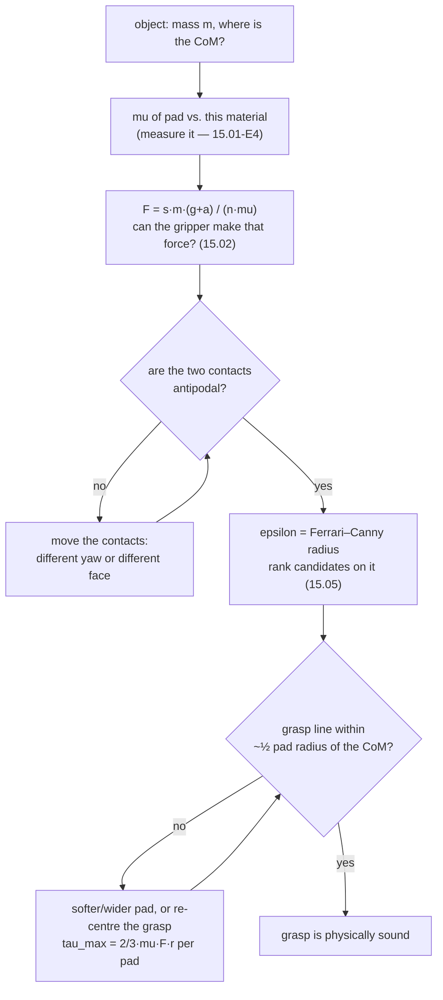

# 15.01 — The physics of grasping — force, friction and friction cones

<!-- glance:start -->
<!-- generated by tools/build.py from curriculum/syllabus.yaml — edit the syllabus, not this block -->

| | |
|---|---|
| **Track** | Main path |
| **Difficulty** | Intermediate |
| **Time** | 50 min |
| **Hardware** | none |
| **Software** | none |
| **Prerequisites** | [14.01 Arm anatomy — joints, links, DOF, workspace, end effector](../14-robotic-arm/14.01-arm-anatomy.md) |
| **Optional prerequisites** | [FP.02 Forces, mass, weight and Newton's laws](../optional-foundations/physics/FP.02-forces-newton.md)<br>[FP.03 Friction and traction](../optional-foundations/physics/FP.03-friction-traction.md) |
| **Skip if** | You can compute the grip force needed for an object and friction coefficient. |

<!-- glance:end -->

## What you will learn

- Compute the grip force an object needs, from its mass, the pad friction and how fast you plan to lift it.
- Draw the friction cone of a contact and decide whether a given finger force is physically possible.
- Test a two-finger pinch for **force closure** with the antipodal condition, by hand and in code.
- Explain why a hard, small pad lets a heavy mug rotate out of the gripper even when it never slides.
- Score one grasp against another with the Ferrari–Canny $\varepsilon$ metric, and say what the number means.

## Why it matters

Module 14 can put the gripper anywhere. This module makes it *hold* something, and the difference is entirely physics.

Almost every failed pick you will see in module 15 has a physical explanation that costs two lines of arithmetic to
find. The object slides down out of the pads: you did not squeeze hard enough for the friction you have. The object
spins in the gripper as the arm lifts: your pads are hard and small, and the grasp is off the centre of mass. The
object pops out sideways the instant the jaws touch: the two contacts are not antipodal, so closing the jaws generated
a net force that pushed it away. None of those is a software bug, and none of them is fixed by tuning the controller.

This lesson gives you the four numbers that decide all of it — $\mu$, the normal force, the contact patch radius, and
the offset from the centre of mass — and the code to compute them. [15.02](15.02-grippers.md) uses them to choose a
gripper; [15.05](15.05-grasp-planning.md) uses them as the scoring function of a grasp planner.

<!-- prereqs:start -->
## Prerequisites

You need these first:

- [14.01 Arm anatomy — joints, links, DOF, workspace, end effector](../14-robotic-arm/14.01-arm-anatomy.md)

### Optional prerequisite links

New to any of these? Take the foundation lesson first; skip it if you already know it.

- [FP.02 Forces, mass, weight and Newton's laws](../optional-foundations/physics/FP.02-forces-newton.md)
- [FP.03 Friction and traction](../optional-foundations/physics/FP.03-friction-traction.md)

Check your readiness: `python course.py why 15.01`
<!-- prereqs:end -->

## Concept

Forget "gripping hard". A grasp is a **constraint problem**, and the right question is not "how much force am I
applying?" but "what set of forces and torques can these contacts resist?"

Here is the whole idea in one picture. Press a finger against a surface. You can push *into* the surface as hard as you
like — that is the normal direction. You can also drag *along* the surface, but only up to a limit set by friction,
$|f_t| \le \mu f_n$. Plot every force the contact can transmit and you get a **cone**: a solid ice-cream cone of
directions opening around the inward normal, whose half-angle is $\arctan \mu$. Outside the cone, the finger slips.

That cone is the contact's *API contract*. Everything else in this lesson is composition: put two or three cones on an
object, ask what the combined set of achievable forces-and-torques looks like, and check whether gravity, the
acceleration of the arm and a knock from a passing cat all live inside it.

The distributed-systems analogy is closer than you would expect. Each contact is a service that will accept requests
only from a restricted region of the request space (the cone). The grasp as a whole is the composition of those
services. **Force closure** is the statement that the composition covers *every* possible request, with a bounded
amount of work — that no disturbance exists that the grasp cannot answer. A grasp without force closure has a hole in
its coverage, and the world will find it, usually while the arm is accelerating.

One more thing that surprises people: force closure is a property of **geometry and friction**, not of how hard you
squeeze. Squeezing harder scales every achievable force up, but it cannot rotate a cone. If the cones do not cover a
direction at 5 N, they will not cover it at 50 N either — you will just crush the object.

> [!TIP]
> **Ask your teacher:** "Explain the friction cone without equations, then again with a numerical example for a rubber pad on a glass jar."

## Technical explanation

### Level 1 — Coulomb friction and the cone

The whole model is one inequality. A contact transmits a normal force $f_n \ge 0$ (fingers push, they do not pull) and
a tangential force $f_t$, and it does not slip as long as

$$|f_t| \le \mu\, f_n$$

$\mu$ is the **coefficient of friction** of that pair of materials — not of one material. A TPU pad on a glass jar and
the same pad on a cardboard box have different $\mu$. Writing the force as a vector, the feasible set is a cone whose
half-angle is

$$\alpha = \arctan \mu$$

| $\mu$ | 0.10 | 0.25 | 0.40 | 0.60 | 0.80 | 1.00 | 1.50 |
|---|---|---|---|---|---|---|---|
| $\alpha$ | 5.7° | 14.0° | 21.8° | 31.0° | 38.7° | 45.0° | 56.3° |

Two practical readings of that table. First, $\mu = 1$ is not a magic maximum: rubber on rough plastic routinely
exceeds it. Second, $\alpha$ is exactly the angle of a ramp on which the object just starts to slide — which is how
you will measure $\mu$ in exercise 15.01-E4 with a clipboard and a phone.

> [!NOTE]
> New to friction and normal forces? → [FP.03 Friction and traction](../optional-foundations/physics/FP.03-friction-traction.md)
> and [FP.02 Forces and Newton's laws](../optional-foundations/physics/FP.02-forces-newton.md). Skip them if
> $F = \mu N$ is already familiar.

### Level 2 — How hard to squeeze

The commonest grasp in this course is a **pinch**: two flat pads on two opposite vertical faces, lifting straight up.
The pads push horizontally; the object's weight is carried entirely by friction. With $n$ contacts, a safety factor
$s$ and an extra vertical acceleration $a$ from the lift:

$$n\, \mu\, F \;\ge\; s\, m\, (g + a) \qquad\Longrightarrow\qquad \boxed{F \;=\; \frac{s\, m\, (g + a)}{n\, \mu}}$$

**Worked example — a full 330 ml can.** $m = 0.345$ kg, rubber pad on aluminium $\mu = 0.6$, two pads, lifting at
$a = 2$ m/s², safety factor 2:

$$F = \frac{2 \cdot 0.345 \cdot (9.81 + 2)}{2 \cdot 0.6} = \frac{8.149}{1.2} = 6.79\ \text{N per pad}$$

The can weighs 3.38 N. You have to squeeze it with **twice its weight per pad** to lift it safely, and that is with
good rubber. Now spill some water on the pad so $\mu$ drops to 0.25 and the same can needs **16.3 N per pad** — which,
as [15.02](15.02-grippers.md) will show, is more than a hobby-servo jaw can produce. The lesson is not "add force"; it
is that $\mu$ is the dominant term and pad material is a design decision, not a detail.

Run the whole table:

```text
object                       m kg    mu  a m/s2  safety  F per pad N
empty 330 ml can            0.015  0.60     0.0     2.0         0.25
full 330 ml can             0.345  0.60     0.0     2.0         5.64
full can, 2 m/s^2 lift      0.345  0.60     2.0     2.0         6.79
full can, wet/slick pad     0.345  0.25     2.0     2.0        16.30
250 g mug, rubber pad       0.250  0.80     1.0     2.0         3.38
250 g mug, bare plastic     0.250  0.30     1.0     2.0         9.01
```

Inverted, the same formula answers the question you will ask more often — *given the gripper I own, what can it pick
up?* At 5 N per pad, $\mu = 0.25$ buys you 116 g and $\mu = 1.0$ buys you 463 g. A factor of four, from the pads alone.

### Level 3 — The torque nobody budgets for

Friction against sliding is the easy half. The half that actually drops mugs is **rotation**.

A mathematical *point* contact transmits force and no torque about its own normal. So if your grasp line misses the
object's centre of mass by $d$, gravity applies a torque $m g d$ that nothing resists, and the object rotates in the
jaws until its centre of mass hangs below the grasp line — taking the rim of the mug into the arm on the way.

Real pads are not points. A soft pad flattens into a patch, and a circular patch of radius $r$ under uniform pressure
resists a torsional moment of

$$\tau_{\max} = \tfrac{2}{3}\, \mu\, F\, r$$

**Worked example — a 250 g mug grasped 20 mm off its centre of mass.** Gravity torque
$= 0.250 \cdot 9.81 \cdot 0.020 = 0.0491$ N·m. With 6 N per pad and $\mu = 0.8$, two pads:

| pad patch radius | $\tau_{\max}$ (two pads) | verdict |
|---|---|---|
| 0 mm (hard point) | 0.0000 N·m | **rotates** |
| 4 mm | 0.0256 N·m | **rotates** |
| 8 mm | 0.0512 N·m | holds |
| 12 mm | 0.0768 N·m | holds |

The fix is not more force — doubling $F$ doubles $\tau_{\max}$, but so does gluing on a pad twice as wide, for free and
without crushing anything. This single line of arithmetic is the entire argument for soft pads, and it is why
[15.05](15.05-grasp-planning.md) scores a grasp partly on **how close the closing line passes to the centroid**.

### Level 4 — Wrenches, the grasp wrench space and $\varepsilon$

To compare two grasps you need one number, and to get one number you need to treat forces and torques together.

A planar **wrench** is $w = (f_x, f_y, \tau)$: the force applied at a contact plus the torque it makes about the
object's centre of mass, $\tau = (p - c) \times f$. (Torque has units of N·m while forces are N, so the code divides
$\tau$ by a characteristic length $L = 50$ mm to make the three numbers commensurate — otherwise "distance to the
origin" mixes units and means nothing.)

Take the two edges of each contact's friction cone, convert them to unit wrenches, and take the convex hull of the
lot. That hull is the **grasp wrench space**: every wrench the fingers can apply, up to scale. Then

> **Force closure** ⟺ the origin is *strictly inside* the hull.

That is the geometric form of "no disturbance direction is uncovered": if the origin is interior, then for any
disturbance wrench $w_d$, some positive combination of contact wrenches cancels it. The **Ferrari–Canny $\varepsilon$
metric** makes it quantitative: $\varepsilon$ is the radius of the largest ball centred on the origin that still fits
inside the hull — the *weakest* direction of the grasp, per unit of total contact force. $\varepsilon = 0$ means no
force closure at all.

For two fingers in the plane there is a shortcut you can check by eye, the **antipodal condition**:

> A pinch has force closure exactly when the straight line joining the two contact points lies inside **both**
> friction cones.

Now the numbers, for a pinch on a 60 mm box (`py grasp_physics.py --only closure`):

```text
case                               antipodal   epsilon
flat faces, mu 0.6, aligned             True    0.2529
contacts 15 mm out of line              True    0.0422
contacts 30 mm out of line             False    0.0000
faces tilted 20 deg, mu 0.6             True    0.0953
faces tilted 40 deg, mu 0.6            False    0.0000
faces tilted 40 deg, mu 1.0             True    0.0438
slippery mu 0.1, aligned                True    0.0511
```

Read the rows in pairs and every one of them is a design rule:

- Rows 1–3: **misalignment is the killer.** Sliding one pad 15 mm along the face — while the grasp stays "antipodal"
  by the boolean test — costs **83%** of the quality. At 30 mm the grasp line leaves the cones and the grasp fails
  outright. The boolean is a cliff; $\varepsilon$ is the slope leading to it, which is why a planner should rank on
  $\varepsilon$ and not on a yes/no test.
- Rows 4–6: **a tapered object is a slippery object.** Faces tilted 40° are ungraspable at $\mu = 0.6$ and merely poor
  at $\mu = 1.0$. Note $\tan 40° = 0.839$: the grasp survives exactly when $\mu > \tan(\text{taper})$, which the table
  confirms.
- Row 7: low friction never fails the *boolean* test on parallel faces (the grasp line is normal to both faces, so it
  is inside any cone), but $\varepsilon$ collapses to a fifth. Force closure is not the same as a good grasp.

And more fingers:

```text
2 fingers: epsilon = 0.2529      3 fingers: epsilon = 0.3087
4 fingers: epsilon = 0.3087      5 fingers: epsilon = 0.3087
```

Three fingers around a disc buy you 22% over two. The fourth and fifth buy you **nothing** — with $\mu = 0.6$, three
cones already cover the plane, and the extra fingers add wrenches strictly inside the existing hull. That is worth
remembering the next time someone tells you a five-finger hand is obviously better than a two-finger jaw. It is better,
but not because of $\varepsilon$; it is better because it can *reach* grasps a jaw cannot.

## Diagram

```text
 ONE CONTACT                                TWO CONTACTS: the antipodal test
                                            (planar pinch, cones drawn from each contact)
      friction cone, half-angle
      alpha = atan(mu)                        ┌──────────────┐
             ╲    │    ╱                      │              │
              ╲   │   ╱   alpha = 31.0°       │   ╲      ╱   │
               ╲  │  ╱    for mu = 0.6     ●──┼────╳────╳────┼──●
                ╲ │ ╱                      p1 │   ╱      ╲   │  p2
    ════════════╳═══════════  object       ▲  │              │   ▲
       surface  │ ▲                        │  └──────────────┘   │
                │ └ inward normal n        │    the segment p1—p2 must lie
                │                          │    INSIDE both cones
        f inside cone  -> sticks      pad pushes
        f outside cone -> SLIPS       this way

 GRASP WRENCH SPACE (why epsilon is a radius)

      tau/L ▲                    hull of the cone-edge wrenches
            │        ╱‾‾‾╲       (4 wrenches for a 2-finger planar pinch)
            │      ╱   ○   ╲     ○ = origin, ε = radius of the biggest
            │     │ ←─ε─→  │         ball centred on it inside the hull
            │      ╲       ╱
            │        ╲___╱       origin OUTSIDE the hull -> no force closure,
            └──────────────► fx   some disturbance cannot be resisted at all
```



## Code

[`code/grasp_physics.py`](code/grasp_physics.py) is the whole lesson as ~200 lines of numpy. The two functions you will
use most:

```python
def required_normal_force(mass_kg, mu, *, n_contacts=2, accel_m_s2=0.0, safety=1.0, g=G) -> float:
    """Normal force per finger needed to hold mass_kg against slip in a pinch grasp."""
    if mu <= 0.0:
        raise ValueError("a frictionless pinch grasp cannot hold anything: mu must be > 0")
    return safety * mass_kg * (g + accel_m_s2) / (mu * n_contacts)


def is_antipodal(c1: Contact, c2: Contact, tol: float = 1e-9) -> bool:
    """True if the segment joining the two contacts lies inside **both** friction cones."""
    d = c2.p - c1.p
    dist = float(np.linalg.norm(d))
    if dist < 1e-12:
        return False
    d = d / dist
    a1 = math.acos(max(-1.0, min(1.0, float(d @ c1.n))))
    a2 = math.acos(max(-1.0, min(1.0, float(-d @ c2.n))))
    return a1 <= friction_cone_half_angle(c1.mu) + tol and a2 <= friction_cone_half_angle(c2.mu) + tol
```

`epsilon_quality()` builds the primitive wrenches from every cone edge, takes their `scipy.spatial.ConvexHull`, and
returns the distance from the origin to the nearest facet — `0.0` when the origin is outside:

```python
hull = ConvexHull(w)
offsets = hull.equations[:, -1]      # normal . x + offset <= 0 inside; normals are unit
if float(offsets.max()) >= 0.0:
    return 0.0                       # the origin is outside the hull -> not force closure
return float(-offsets.max())
```

Run it:

```bash
cd 15-manipulation/code
py grasp_physics.py                 # all three tables above
py grasp_physics.py --only closure  # just the force-closure experiments
```

## Exercise

### Exercise 15.01-E1 — Grip force by hand `[numerical]`

Hardware: none. Compute $F$ per pad, on paper, then check each with `required_normal_force`:

(a) a 120 g apple, $\mu = 0.55$, lifted at 1 m/s², safety 2;
(b) the same apple with a slick plastic pad, $\mu = 0.20$;
(c) a 500 g water bottle, $\mu = 0.6$, safety 2, no extra acceleration — and then the same bottle when the arm is on
karmel and the base brakes at 3 m/s² *horizontally* (think before you reuse the vertical formula);
(d) invert it: your jaw makes 4.7 N per pad and $\mu = 0.45$ — what is the heaviest object you may pick, at safety 2
and 1 m/s²?

### Exercise 15.01-E2 — Implement the contact model `[coding]`

Hardware: none. Implement `friction_cone_half_angle`, `required_normal_force`, `max_payload_kg`,
`torsional_friction_moment`, `Contact.force_is_feasible`, `is_antipodal` and `epsilon_quality` from their docstrings.
The tests check each against hand-computed cases, then check the properties that must hold for *any* correct
implementation: $\varepsilon$ is monotone in $\mu$; a grasp with $\varepsilon > 0$ passes the antipodal test and one
with $\varepsilon = 0$ on two contacts does not; adding a finger never lowers $\varepsilon$.

Check it: `python course.py check 15.01` (or `py -m pytest labs/exercises/15.01`).

### Exercise 15.01-E3 — Predict which pinches hold `[predict]`

Hardware: none. For each pinch on a 60 mm box, **write down your prediction first** (force closure: yes/no; and rank
them best to worst), then run `py grasp_physics.py --only closure` and compare:

(a) flat faces, pads aligned, $\mu = 0.6$; (b) the same, one pad slid 15 mm along the face; (c) slid 30 mm;
(d) faces tapered 20°, $\mu = 0.6$; (e) tapered 40°, $\mu = 0.6$; (f) tapered 40°, $\mu = 1.0$.
Then answer in one sentence: for a taper of $\theta$, what is the minimum $\mu$?

### Exercise 15.01-E4 — Measure $\mu$ with a ramp `[hardware]`

Hardware: none from the catalog — a clipboard or book, a phone with a spirit-level/inclinometer app, and five objects
you will later ask the arm to pick (a can, a block, a marker, an eraser, a phone).

Put the object on the flat board, lift one end slowly until the object *just* starts to slide, and read the angle.
Then $\mu = \tan\theta$. Do three trials per object and record the spread. Repeat with a strip of the pad material you
intend to glue on the jaws taped to the board, because that — not the bare board — is the $\mu$ your gripper gets.
Write the results into a small table; [15.02](15.02-grippers.md) and [15.05](15.05-grasp-planning.md) both consume it.

### Exercise 15.01-E5 — Size the pad for the mug `[design]`

Hardware: none. A 250 g mug, grasped with its handle sticking out so the grasp line misses the centre of mass by
20 mm. Your jaw makes 4.7 N per pad and the pad's $\mu$ is 0.8. Using $\tau_{\max} = \frac{2}{3}\mu F r$ per pad, find
the smallest pad patch radius that stops the mug rotating, with a safety factor of 1.5. Then give two other fixes that
do not involve changing the pad, and say what each costs.

## Expected result

- **15.01-E1:** (a) $F = 2 \cdot 0.12 \cdot 10.81 / (2 \cdot 0.55) = 2.36$ N. (b) $\mu = 0.20$ → **6.49 N**, 2.75× more,
  from the pad alone. (c) 8.18 N vertically. Horizontally the weight is *not* carried by friction any more — the pads
  squeeze across the direction of braking only if the can sits the right way round, and in general you must add the
  inertial force as a separate wrench; the honest quick answer is to use $\sqrt{g^2 + a^2} = 10.26$ m/s² in place of
  $g + a$, giving 8.55 N, and the honest full answer is the wrench argument of Level 4. (d) $m_{\max} = 2 \cdot 0.45
  \cdot 4.7 / (2 \cdot 10.81) = 0.196$ kg ≈ **196 g**. If that surprises you, good: this is the number that decides
  which objects module 15 can actually pick.
- **15.01-E2:** `python course.py check 15.01` passes with nothing skipped (about 30 tests, well under a second). The
  two that catch people: `epsilon_quality` must return exactly `0.0` — not a small negative number — when the origin
  is outside the hull; and `Contact.force_is_feasible` must reject a *pulling* force ($f_n < 0$) before it ever looks
  at the tangential component.
- **15.01-E3:** Force closure for (a), (b), (d), (f); none for (c) and (e). Ranking by $\varepsilon$:
  (a) 0.2529 ≫ (d) 0.0953 > (f) 0.0438 > (b) 0.0422 ≫ (c) = (e) = 0. The surprise is that (b) — "just 15 mm off" —
  is the second *worst* of the surviving grasps. Minimum friction for a taper $\theta$: $\mu > \tan\theta$
  ($\tan 20° = 0.364$, $\tan 40° = 0.839$).
- **15.01-E4:** Typical ranges on a bare wooden board: cardboard 0.4–0.6, unfinished wood 0.35–0.5, aluminium can
  0.25–0.4, glossy phone back 0.2–0.35. With a TPU or silicone pad taped down, everything rises to roughly 0.6–0.9 and
  the *spread between materials shrinks* — that consistency is worth as much as the higher number. Expect ±3° of scatter
  between trials (±0.05–0.08 in $\mu$), which is exactly why the grip-force formula carries a safety factor of 2.
- **15.01-E5:** Need $\tau \ge 1.5 \cdot 0.250 \cdot 9.81 \cdot 0.020 = 0.0736$ N·m from two pads, so
  $r \ge 0.0736 / (2 \cdot \frac{2}{3} \cdot 0.8 \cdot 4.7) = 0.0147$ m ≈ **15 mm patch radius**, i.e. a 30 mm-wide
  soft pad — bigger than the SO-101's printed jaw. Two other fixes: **re-centre the grasp** (a 5 mm offset needs only
  a 3.7 mm patch — this is free, and it is what a planner does for you), or **hold the mug by the rim instead of the
  body** so the grasp line passes through the axis. A third, worse fix: squeeze harder — 4.7 N is already near the
  servo's safe limit, and doubling it to buy a 7 mm pad radius will mark a soft object.

## Troubleshooting

### Symptom: the object slides down out of the jaws during the lift

Measure, do not guess, in this order:

1. **Recompute $F$ with the real $\mu$.** Run 15.01-E4 on that exact object and pad. A $\mu$ you assumed to be 0.6
   and is actually 0.25 explains a factor of 2.4 by itself, and it is the cause more often than everything below
   combined.
2. **Check the acceleration.** If it slides only during a fast lift or a hard stop, $a$ is the term you dropped. Log
   the commanded trajectory's peak acceleration and put it in the formula.
3. **Check the force you are actually getting**, not the one you commanded. A bus servo at its torque limit, a
   linkage with more friction than you modelled, or a pad that has compressed since you measured it, all cut $F$.
   [15.02](15.02-grippers.md) measures it with a kitchen scale.
4. **Only then** consider the pads. New pad material is the biggest single lever, and the slowest to try.

### Symptom: the object rotates in the jaws instead of sliding

This is torsion, not slip, and more squeeze barely helps. Compute $m g d$ and compare it with
$2 \cdot \frac{2}{3}\mu F r$. Either shrink $d$ (grasp nearer the centre of mass) or grow $r$ (softer, wider pad). If
the object rotates about the *approach* axis instead — it tips forward out of the jaws — the grasp is too shallow:
close the pads lower down the object, which [15.05](15.05-grasp-planning.md) controls with `grasp_depth_m`.

### Symptom: the object shoots out sideways as the jaws close

The contacts are not antipodal, so the two pad forces do not cancel and their resultant ejects the object. Check
`is_antipodal` on the two contact points your planner chose, and check that the jaws actually close
**symmetrically** — a single-actuator jaw where one finger is driven and the other is passive pushes the object
sideways by design, and needs the object to be against a stop or the approach to be slower.

### Symptom: `epsilon_quality` returns 0.0 for a grasp that obviously works

Three usual causes, cheapest first: the contact normals point *outward* (they must point from the surface **into** the
object); the contacts are given in different frames; or the grasp really is planar-degenerate — two contacts whose
cone edges span only a 2D slice of the 3D wrench space $(f_x, f_y, \tau)$, which `ConvexHull` reports as a degenerate
hull and the function correctly scores 0. Print `primitive_wrenches(contacts)` and look at the rank.

### Symptom: a heavier object holds better than a lighter one

Not a bug in your model — check whether the heavier one is also the one with the flatter faces or the grippier
surface. $\varepsilon$ says nothing about mass; it is scale-free. Mass enters only through the required force. If two
grasps have similar $\varepsilon$ and one holds, the difference is $F$ or $\mu$, and you can measure both.

## Common mistakes

- **Treating $\mu$ as a property of one material.** It belongs to the *pair*. "PLA has $\mu = 0.4$" is meaningless.
- **Quoting a $\mu$ from a table instead of measuring it.** Five minutes with a ramp beats any table, and the
  measurement is the input to every later number.
- **Forgetting the acceleration term.** Robots do not lift quasi-statically. A 2 m/s² lift adds 20% to the force.
- **Budgeting no safety factor.** $\mu$ varies with humidity, dust, wear and which side of the object you touched.
  2 is the course default; below 1.5 you will drop things.
- **Believing force closure means "good grasp".** It is a boolean, and a grasp can pass it with $\varepsilon = 0.04$.
  Rank on $\varepsilon$.
- **Ignoring torsion until the mug spins.** A point contact resists *zero* torque about its normal. Pad radius is a
  first-class design parameter, not cosmetics.
- **Fixing a slipping grasp by squeezing harder, forever.** Force scales $\varepsilon$ but cannot create it, and the
  next thing that gives way is the object.

## Knowledge check

1. A pad has $\mu = 0.45$. What is the friction-cone half-angle, and what does that angle mean physically?
   <details><summary>Answer</summary>

   $\alpha = \arctan 0.45 = 24.2°$. Physically: a force applied within 24.2° of the surface normal sticks; anything
   further out slips. It is also the ramp angle at which that object just starts to slide, which is how you measure it.
   </details>

2. Your jaw can make 6 N per pad. With $\mu = 0.5$, two pads, a safety factor of 2 and a 1 m/s² lift, what is the
   heaviest object you may pick?
   <details><summary>Answer</summary>

   $m = n \mu F / (s(g+a)) = 2 \cdot 0.5 \cdot 6 / (2 \cdot 10.81) = 0.277$ kg ≈ **277 g**. Note how little that is —
   it is roughly a full teacup, and it is why [15.02](15.02-grippers.md) spends its time on pads and strokes rather
   than on motors.
   </details>

3. Predict: you double the grip force on a grasp whose $\varepsilon$ is 0. What happens to $\varepsilon$?
   <details><summary>Answer</summary>

   Nothing — it stays 0. $\varepsilon$ is computed from *unit* wrenches at the cone edges, so it is scale-free: force
   scales what the grasp can resist, but cannot change which directions it can resist at all. Force closure is
   geometry plus friction. Doubling the force only gets you closer to crushing the object.
   </details>

4. Why does adding a fourth and fifth finger around a disc not improve $\varepsilon$ at all, when the third one did?
   <details><summary>Answer</summary>

   With $\mu = 0.6$ (cone half-angle 31°), three evenly spaced cones already positively span the whole planar wrench
   space, so the convex hull of their edge wrenches is already as large as it gets in the weakest direction. The extra
   fingers contribute wrenches that lie *inside* the existing hull, so the inscribed-ball radius does not grow
   (0.2529 → 0.3087 → 0.3087 → 0.3087). Extra fingers buy reachability and robustness to a bad contact, not $\varepsilon$.
   </details>

5. A grasp passes `is_antipodal` but the object still spins out of the jaws while the arm lifts. What is happening,
   and what is the cheapest fix?
   <details><summary>Answer</summary>

   Torsion about the contact normal, which the antipodal test says nothing about. The grasp line misses the centre of
   mass by $d$ and gravity applies $mgd$; a hard, small pad resists $\frac{2}{3}\mu F r \approx 0$. Cheapest fix: move
   the grasp so the closing line passes nearer the centre of mass (free, and it is what a planner does). Next cheapest:
   a softer, wider pad.
   </details>

6. An object's two gripping faces are not parallel — they taper by 25°. What is the minimum pad $\mu$ for the pinch to
   have force closure, and where does the number come from?
   <details><summary>Answer</summary>

   $\mu > \tan 25° = 0.466$. The grasp line is horizontal while each surface normal is tilted 25° away from it, so the
   line is inside a cone only if the cone's half-angle $\arctan\mu$ exceeds 25°. This is the same condition as the
   ramp: a taper is a ramp you are trying to hold the object on.
   </details>

7. Two candidate grasps on the same block score $\varepsilon = 0.25$ and $\varepsilon = 0.04$. Both have force
   closure. Does it matter which you execute?
   <details><summary>Answer</summary>

   Yes, a great deal. $\varepsilon$ is the *weakest* disturbance direction the grasp can resist per unit of contact
   force, so the 0.04 grasp tolerates about six times less disturbance — and your contact points are themselves
   uncertain by several millimetres after [15.04](15.04-object-pose-estimation.md)'s pose estimate. A high-$\varepsilon$
   grasp is also a grasp that stays valid when the real contacts land a few millimetres from the planned ones.
   </details>

## Practical challenge

Build `can_i_hold_it(object_spec, gripper_spec) -> Verdict` — the function you would put in front of a pick-and-place
pipeline, so the robot refuses impossible picks *before* moving.

Acceptance criteria:

- Inputs are an object (mass, the two candidate contact points with their normals, the surface material) and a gripper
  (max force per pad, pad $\mu$ per material from your **own** 15.01-E4 measurements, pad patch radius).
- It returns a tagged verdict — `Ok(margin)`, `TooHeavy(needed_n, available_n)`, `NoForceClosure(epsilon)` or
  `WillRotate(tau_needed, tau_max)` — never a bare boolean, and `margin` is the ratio of available to required force.
- It accounts for the planned lift acceleration and a configurable safety factor, and it checks torsion against the
  distance from the closing line to the centre of mass.
- A pytest suite proves each verdict fires: the full can with good pads (`Ok`), the same can with $\mu = 0.25$
  (`TooHeavy`), a 40°-tapered block at $\mu = 0.6$ (`NoForceClosure`), and the off-centre mug with a 4 mm pad
  (`WillRotate`).
- A short table in your notes: for your five 15.01-E4 objects, the verdict and the margin. Check at least two of them
  against reality once you have an arm in [15.08](15.08-pick-and-place-pipeline.md), and record where the model was
  wrong.

## You can skip this if…

You can answer knowledge-check questions 3, 5 and 6 correctly without looking, and you can compute the grip force for
a 300 g object at $\mu = 0.4$ with a safety factor of 2 in your head to within 10%. Then:
`python course.py skip 15.01 --reason "grasp mechanics, friction cones and force closure are familiar"`.

## Go deeper

- Lynch & Park, *Modern Robotics*, chapter 12 "Grasping and Manipulation" — friction cones, wrench cones and form/force
  closure done properly, with the 3D case this lesson only sketches. Free PDF:
  https://hades.mech.northwestern.edu/images/7/7f/MR.pdf
- Ferrari & Canny, "Planning Optimal Grasps" (ICRA 1992) — the four-page paper that defines the $\varepsilon$ metric
  used here: https://www.semanticscholar.org/paper/Planning-optimal-grasps-Ferrari-Canny/bd2d50392ab0a78e87c9c1cae9d7b1dab5dcbcd6
- Bohg, Morales, Asfour & Kragic, "Data-Driven Grasp Synthesis — A Survey" (T-RO 2014) — the map from analytic grasping
  (this lesson) to learned grasping ([15.05](15.05-grasp-planning.md)): https://arxiv.org/abs/1309.2660
- Tedrake, MIT 6.4210 *Robotic Manipulation* course notes — the best free treatment of contact mechanics with runnable
  notebooks: https://manipulation.csail.mit.edu/
- Friction from first principles, in this course:
  [FP.03 Friction and traction](../optional-foundations/physics/FP.03-friction-traction.md).

## Progress checkpoint

- [ ] I can compute the grip force an object needs from mass, $\mu$, acceleration and a safety factor.
- [ ] I can draw a friction cone and say whether a given finger force is feasible.
- [ ] I can test a two-finger pinch for force closure with the antipodal condition.
- [ ] I can explain why a hard, small pad lets an off-centre object rotate, and size a pad that does not.
- [ ] I measure $\mu$ for my own pads and objects instead of quoting a table.

`python course.py complete 15.01` (exercises done) · `python course.py master 15.01` (challenge done) ·
`python course.py struggle 15.01 "what was hard"`

Next: [15.02 — Grippers — parallel jaw, compliant, suction](15.02-grippers.md).
