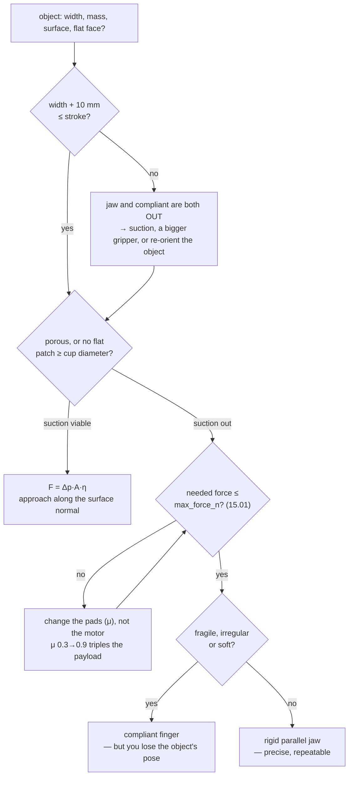

# 15.02 — Grippers — parallel jaw, compliant, suction

<!-- glance:start -->
<!-- generated by tools/build.py from curriculum/syllabus.yaml — edit the syllabus, not this block -->

| | |
|---|---|
| **Track** | Main path |
| **Difficulty** | Beginner |
| **Time** | 40 min |
| **Hardware** | none |
| **Software** | none |
| **Prerequisites** | [15.01 The physics of grasping — force, friction and friction cones](15.01-physics-of-grasping.md) |
| **Skip if** | You know which gripper suits which objects. |

<!-- glance:end -->

## What you will learn

- Describe any parallel-jaw gripper with the four numbers that decide what it can pick: stroke, force, pad $\mu$, pad radius.
- Convert a servo's datasheet torque into the force that actually appears at the pads, and measure the real number with a kitchen scale.
- Compute a suction cup's pull-off and shear capacity, and name the three surfaces where suction simply does not work.
- Explain what a compliant (Fin Ray / underactuated) finger buys you, and what it costs you.
- Turn "which gripper should I use?" into a table of arithmetic you can defend.

## Why it matters

The gripper is the only part of the robot that touches the task. Everything upstream — SLAM, Nav2, MoveIt, the VLA
model in module 18 — exists to put this one object in the right place, and if the gripper cannot close around it,
none of that matters.

It is also the part people choose last and regret first. The SO-101 ships with a printed parallel jaw whose stroke is
about **45 mm**. That single number silently deletes a large fraction of the objects in your kitchen: a drinks can
(66 mm), a phone (72 mm), a bundled sock (55 mm), an egg (45 mm with no clearance). You will not discover this while
writing a grasp planner; you will discover it in [15.05](15.05-grasp-planning.md) when the planner returns zero
candidates, and by then you have built a pipeline around the wrong end effector.

Twenty minutes of arithmetic here tells you which objects your robot can ever pick, which ones need different pads,
and which ones need a different gripper entirely.

<!-- prereqs:start -->
## Prerequisites

You need these first:

- [15.01 The physics of grasping — force, friction and friction cones](15.01-physics-of-grasping.md)

### Optional prerequisite links

None.

Check your readiness: `python course.py why 15.02`
<!-- prereqs:end -->

## Concept

There are only three ways to hold something, and they differ in *where the holding force comes from*.

**Squeeze it.** Two (or more) rigid surfaces press inward; friction carries the load. This is the parallel jaw, and
[15.01](15.01-physics-of-grasping.md) is its complete theory. Predictable, positionally precise — when the jaws close,
you know within a millimetre where the object is relative to the tool frame — and utterly dependent on $\mu$ and on
the object fitting between the pads.

**Conform to it.** A compliant finger deforms around the object instead of pressing at two points. The contact patch
grows, the contact normals spread out over the surface, and the pressure per square millimetre drops. You gain
tolerance to pose error and the ability to hold eggs and fruit. You lose precision: after the grasp, you no longer
know exactly where the object is, because the finger moved as much as the object did.

**Stick to it.** A suction cup evacuates the air between itself and a flat surface, and *atmospheric pressure* does
the holding — up to 101 kPa over the cup's area, which is a lot of force from a very small device. It needs one flat,
smooth, non-porous patch and nothing else; it does not care about the object's width at all. It is how almost every
warehouse robot on earth picks boxes.

The trap is thinking one of these is "the good one". They are answers to different questions, and the honest way to
choose is to compute the capacity of each against the object you actually have. That is what this lesson's code does:
`evaluate(object, jaw, suction)` returns, for each gripper type, a *sentence* — "yes: 0.3 N of 4.7 N", "no: porous
surface, the cup cannot hold vacuum" — because the answer to "which gripper?" is always a reason, not a score.

> [!TIP]
> **Ask your teacher:** "Walk me through why a suction cup can lift 600 g with a 20 mm cup, when my whole gripper motor only makes 5 N."

## Technical explanation

### Level 1 — The parallel jaw in four numbers

```python
@dataclass(frozen=True)
class JawGripper:
    name: str
    stroke_m: float          # maximum opening between the pads
    max_force_n: float       # normal force per pad at the commanded torque limit
    pad_mu: float = 0.6      # friction of the pad against a typical object
    pad_radius_m: float = 0.006   # effective contact patch radius (0 = hard point)
    finger_length_m: float = 0.05
```

- **Stroke** is a hard filter, and it is stricter than it looks: the jaws must open *wider than the object* so they
  can descend around it without brushing it over. The course uses 10 mm of clearance, so a 45 mm stroke handles
  objects up to **35 mm**.
- **Force** decides the payload, through [15.01](15.01-physics-of-grasping.md)'s formula.
- **Pad $\mu$** is the biggest lever on payload and the cheapest to change.
- **Pad radius** decides whether an off-centre object rotates.

### Level 2 — From servo torque to pad force

Servo datasheets quote **stall torque**, usually in kg·cm. Three conversions stand between that and the force at the
pad:

$$F = \frac{\text{torque\_limit} \times \tau_{\text{stall}} \times \eta}{\ell}$$

- $\tau_{\text{stall}}$ in N·m, from kg·cm: $1\ \text{kg·cm} = 0.01\ \text{m} \times 9.81\ \text{N} = 0.0981$ N·m.
- **`torque_limit`** — the fraction of stall you may actually command. A hobby bus servo at stall draws its maximum
  current, heats up and strips its gearbox; [14.11](../14-robotic-arm/14.11-arm-safety.md) sets the course limit at **30%**.
- **$\eta$** — linkage efficiency. A printed jaw with a pin joint is maybe 0.7.
- **$\ell$** — the distance from the jaw pivot to the pad centre, about 45 mm on the SO-101.

**Worked example.** A 15 kg·cm servo: $\tau_{\text{stall}} = 1.47$ N·m; at 30% with $\eta = 0.7$ and $\ell = 45$ mm,
$F = 0.30 \cdot 1.47 \cdot 0.7 / 0.045 = 6.9$ N per pad. The full table (`py grippers.py --only jaw`):

```text
    stall torque   30% limit N  50% limit N  100% (never) N
        10 kg*cm           4.6          7.6            15.3
        15 kg*cm           6.9         11.4            22.9
        20 kg*cm           9.2         15.3            30.5
        30 kg*cm          13.7         22.9            45.8
```

The last column is the number that appears in marketing material, and it is the one you must never use.

Feed 4.7 N per pad — the conservative SO-101 figure this course carries — into the payload formula:

```text
SO-101 jaw: stroke 45 mm, 4.7 N per pad
  mu = 0.30 -> max payload   130 g        mu = 0.45 -> max payload   194 g
  mu = 0.60 -> max payload   259 g        mu = 0.90 -> max payload   389 g
```

**Three times the payload from the pads alone**, at zero cost in motor, power or software. This is the single highest
-leverage modification you can make to a low-cost arm.

> [!IMPORTANT]
> The 1.0 N·m stall torque and 45 mm lever in `so101_jaw()` are **placeholders in the right ballpark**, not
> datasheet values. The published stall torque of the Feetech STS3215 depends on the gear variant and the supply
> voltage, and your printed jaw's pad geometry depends on what you glue to it. Exercises 15.02-E1 and 15.02-E3
> replace both with measurements of *your* arm.

### Level 3 — Suction, where atmosphere does the work

The model is one line:

$$F = \Delta p \times A \times \eta, \qquad A = \pi \left(\tfrac{d}{2}\right)^2$$

$\Delta p$ is the **gauge** pressure — how far below atmosphere the pump pulls, not the absolute pressure. A small
12 V diaphragm pump reaches roughly 40–70 kPa; industrial ejectors reach 85 kPa. The theoretical ceiling is one
atmosphere, 101 kPa, because the cup cannot pull harder than the air outside pushes. $\eta \approx 0.7$ covers the
cup deforming and its lip leaking, on a flat, smooth, clean surface.

**Worked example.** A 20 mm cup at 60 kPa: $A = \pi \cdot 0.010^2 = 314$ mm² $= 3.14 \times 10^{-4}$ m², so
$F = 60000 \cdot 3.14\!\times\!10^{-4} \cdot 0.7 = 13.2$ N. At safety 2 and 1 m/s², that is **610 g** — more than
twice what the whole SO-101 jaw can hold, from a device the size of a coin.

```text
  cup mm   kPa  area mm2  normal N  shear N  payload g
      10    60        79       3.3      1.6        153
      20    60       314      13.2      6.6        610
      30    60       707      29.7     14.8       1373
      40    60      1257      52.8     26.4       2441
```

Force goes as $d^2$: doubling the cup diameter quadruples the capacity. That is why suction scales so well and why it
is the default in warehouses.

Two caveats that decide whether you can use it at all:

- **Shear is about half of pull-off.** The cup resists sideways load only through the friction of its lip under the
  suction load, $\mu_{\text{lip}} \approx 0.5$. The same 20 mm cup holds 610 g hanging straight down but only **305 g**
  if you hold the object against a vertical wall. Approach along the surface normal, and lift along it.
- **Three surfaces defeat it entirely**: **porous** (cardboard, fabric, unglazed pottery — the cup cannot hold a
  vacuum against the leak), **not flat over at least a cup diameter** (a golf ball, a marker pen, a crumpled bag), and
  **soft enough to deform and break the seal**. A cardboard box is porous on its cut edges but usually fine on its
  printed faces, which is why warehouse cups are large and their pumps have generous flow.

### Level 4 — Compliance: what conforming buys and costs

A **Fin Ray** finger is two flexible bands joined at a tip to make a triangle, cross-braced by ribs on flex hinges.
Push it sideways in the middle and it does *not* bend away — it curves **around** the pressure point. That is the
whole trick, and it is why a printed TPU Fin Ray finger wraps a golf ball while a rigid jaw touches it at two points.

The physical consequences:

| | rigid jaw | compliant finger |
|---|---|---|
| Contact | 2 small patches | a wrapped arc — many contacts |
| Pressure at a given force | high (marks eggs, fruit) | low, spread over the arc |
| Tolerance to a pose error | a few mm before the object is pushed away | a centimetre or more |
| Where is the object after grasping? | known to ~1 mm | **unknown to ~5–10 mm** |
| Torsional resistance | $\frac{2}{3}\mu F r$ with a small $r$ | large — the wrap resists rotation directly |
| Max force | motor-limited | *also* limited by the finger's own stiffness |

The last row is the real cost, and it is not the one people expect. It is not that compliant fingers are weak — it is
that **you lose the pose of the object**. Everything in [15.08](15.08-pick-and-place-pipeline.md) that places an
object precisely assumes the grasp did not move it. With compliant fingers, either you re-perceive the object after
grasping, or you accept centimetre-level placement.

An **underactuated** finger is the mechanical cousin: two or three phalanges driven by one tendon, so the finger
closes around whatever shape it meets and the contact forces distribute themselves. Same trade — adaptability for
knowledge.

And the selection logic, which is just the three models above applied in order
(`py grippers.py --only select`):

```text
wooden cube 30 mm      ( 30 mm,   20 g, textured)
    parallel jaw   yes: 0.3 N of 4.7 N (mu 0.75)
    suction        yes: 610 g capacity vs 20 g
    compliant jaw  works, but a rigid jaw holds position better
cardboard box 30 mm    ( 30 mm,   60 g, porous)
    parallel jaw   yes: 0.9 N of 4.7 N (mu 0.70)
    suction        no: porous surface, the cup cannot hold vacuum
    compliant jaw  works, but a rigid jaw holds position better
egg                    ( 45 mm,   60 g, smooth-rigid)
    parallel jaw   no: needs 45 mm + clearance, stroke is 45 mm
    suction        no: no flat patch for the cup to seal against
    compliant jaw  no: same stroke limit as the rigid jaw
full 330 ml can        ( 66 mm,  345 g, smooth-rigid)
    parallel jaw   no: needs 66 mm + clearance, stroke is 45 mm
    suction        yes: 610 g capacity vs 345 g
    compliant jaw  no: same stroke limit as the rigid jaw
```

Read the egg row carefully: **compliance does not extend the stroke.** A Fin Ray finger still has to fit around the
object, and on this arm it is usually *thicker* than a rigid one, so it reduces the usable stroke. The most common
beginner's hope — "a soft gripper will pick everything" — is exactly wrong about the one constraint that binds most.

## Diagram

```text
 PARALLEL JAW — the four numbers                SUCTION — where the force comes from

        ◄──── stroke ────►                          atmosphere pushes: 101 kPa
      ┌──┐              ┌──┐                     │  │  │  │  │  │  │  │  │
      │  │   object     │  │                     ▼  ▼  ▼  ▼  ▼  ▼  ▼  ▼  ▼
      │▓▓│◄── width ───►│▓▓│   ▓ = pad,        ╔═══════════════════════╗
      │▓▓│              │▓▓│       radius r    ║  cup: inside at       ║
      └┬─┘              └─┬┘                   ║  101 − Δp  kPa        ║
       │   F ──►    ◄── F │                    ╚═══════╤═══════════════╝
       │                  │                    ════════╧════════ workpiece
     pivot ◄── ℓ ──► pad  │                         net F = Δp · A · η
       ▲                                        20 mm cup, Δp = 60 kPa:
       └ servo torque τ                         F = 60000 · 3.14e-4 · 0.7 = 13.2 N

 COMPLIANT (Fin Ray) — why it curves TOWARD the load

      rigid finger              Fin Ray finger
        │                          ╲    ribs on flex hinges
        │  ← push                   ╲╲  ╱
        │     bends AWAY             ╲╲╱   ← push
        │                             ╲╲   curves AROUND the object
        ●                              ●
      2 contact points           an arc of contacts, low pressure
```



## Code

[`code/grippers.py`](code/grippers.py) holds the three models and the selection table. The suction model is four lines
and the jaw model is five:

```python
def servo_jaw_force(stall_torque_nm: float, lever_arm_m: float, *,
                    torque_limit: float = 0.30, efficiency: float = 0.7) -> float:
    """Normal force per pad from a servo-driven jaw: F = limit * stall * eta / lever."""
    if lever_arm_m <= 0.0:
        raise ValueError("lever_arm_m must be > 0")
    return torque_limit * stall_torque_nm * efficiency / lever_arm_m


@dataclass(frozen=True)
class SuctionGripper:
    name: str
    cup_diameter_m: float
    n_cups: int = 1
    gauge_pressure_pa: float = 60_000.0
    efficiency: float = 0.7
    lip_mu: float = 0.5

    def normal_force_n(self) -> float:
        return self.n_cups * suction_force_n(self.gauge_pressure_pa, self.cup_diameter_m, self.efficiency)

    def shear_force_n(self) -> float:
        """Force the cup resists *along* the surface: friction of the lip under the suction load."""
        return self.lip_mu * self.normal_force_n()
```

`MU_TABLE` maps a surface description to a friction coefficient — **replace its values with your own 15.01-E4
measurements** before you trust any verdict it produces:

```python
MU_TABLE: dict[str, float] = {   # rubber pad against ..., measured the way 15.01-E4 measures it
    "smooth-rigid": 0.45, "textured": 0.75, "porous": 0.70, "soft": 0.90, "irregular": 0.55,
}
```

Run it:

```bash
cd 15-manipulation/code
py grippers.py                  # jaw forces, suction table, and the full selection matrix
py grippers.py --only suction
```

## Exercise

### Exercise 15.02-E1 — Measure your gripper's stroke and pad geometry `[hardware]`

> [!CAUTION]
> **Safety:** Power the arm down for this exercise. You are measuring a static mechanism with calipers or a ruler;
> there is no reason for a servo to be energised, and a bus servo that receives a stale command while your fingers are
> between the jaws will close on them. If you must have it powered to open the jaw, set the torque limit to its
> minimum first ([14.11](../14-robotic-arm/14.11-arm-safety.md)) and keep the power switch within reach.

Hardware: `arm` (SO-101). Measure and record: the maximum opening between the pad faces (the **stroke**), the pad-face
dimensions, the pad-centre-to-pivot distance $\ell$, and the effective patch radius (press the pad onto a sheet of
paper over carbon paper, or onto plasticine, and measure the mark). Then update `so101_jaw()`'s numbers in your own
copy and re-run the selection table.

No arm yet? Use the published 45 mm stroke and skip to 15.02-E2 — every other exercise in this lesson runs without
hardware.

### Exercise 15.02-E2 — Implement the gripper models `[coding]`

Hardware: none. Implement `servo_jaw_force`, `kgcm_to_nm`, `JawGripper.fits`, `JawGripper.max_payload_kg`,
`SuctionGripper.normal_force_n`, `.shear_force_n`, `.max_payload_kg` and the `evaluate` selection function from their
docstrings. The tests check hand-computed values, the $d^2$ scaling of suction, the clearance rule in `fits`, and that
`evaluate` returns the right *reason* for each of the five ways a gripper can be ruled out.

Check it: `python course.py check 15.02` (or `py -m pytest labs/exercises/15.02`).

### Exercise 15.02-E3 — Measure the real pad force `[hardware]`

> [!CAUTION]
> **Safety:** Set the gripper servo's torque limit to the course value (30% of stall) **before** this test, keep the
> arm's other joints disabled or held, and keep your hand out of the jaw. Close the jaw on the scale in small
> commanded steps, not in one motion. Stop at the first sign of the servo buzzing or getting hot — that is stall, and
> it strips gearboxes ([14.11](../14-robotic-arm/14.11-arm-safety.md)).

Hardware: `arm`, plus a kitchen scale (1 g resolution). Stand the scale on its side, or lay it flat and press one pad
down onto it through a small rigid block, so the jaw closes against the scale's pan. Command the gripper closed in
steps and record grams at each step; $F\ [\text{N}] = \text{grams} \times 0.00981$. Plot force against the commanded
position or torque, and note the value at your 30% limit. Compare with `servo_jaw_force`'s prediction and explain the
gap.

No arm? Predict the curve's shape instead and write down what you expect, then check it against the expected result
below.

### Exercise 15.02-E4 — Predict the selection table `[predict]`

Hardware: none. Before running the code: for each of the nine objects in `grippers.OBJECTS`, predict which of the
three gripper types can handle it. Then run `py grippers.py --only select` and score yourself. For every object where
all three say "no", write the *cheapest* change that would make one of them work.

### Exercise 15.02-E5 — Specify a gripper for a real task `[design]`

Hardware: none. You must pick up, from a table, in this order: a full 330 ml can, a phone, an egg and a bundled sock.
Specify one end effector that handles as many as possible, and state exactly which ones it cannot do and why. Give
numbers for: stroke, force per pad (and the servo torque that implies at 30%), pad material and $\mu$, pad patch
radius, and — if you propose suction — cup diameter, required $\Delta p$ and whether shear or pull-off governs. Then
say what it would cost you to cover the remainder.

## Expected result

- **15.02-E1:** An SO-101 with the stock printed jaw measures roughly 40–48 mm of stroke depending on the print and on
  how much pad you glued on; $\ell$ is 40–50 mm. The pad-mark measurement is the interesting one: a bare printed PLA
  pad leaves a mark 2–4 mm across (patch radius 1–2 mm, essentially a point contact, so $\tau_{\max} \approx 0$),
  while a 2 mm silicone or TPU pad leaves 8–14 mm (radius 4–7 mm). That is the measurement that explains why
  [15.01](15.01-physics-of-grasping.md)'s mug rotates.
- **15.02-E2:** `python course.py check 15.02` passes with nothing skipped (about 25 tests, under a second). The two
  that catch people: `fits` must include the clearance (`width + clearance <= stroke`, not `width <= stroke`), and
  `evaluate` must check *porosity before flatness* — a porous object with a flat face is still not suckable, and the
  test pins the reason string's meaning, not its wording.
- **15.02-E3:** Expect a curve that is roughly linear in commanded torque and then **flattens**, and a measured force
  at the 30% limit of about **half to two-thirds** of `servo_jaw_force`'s prediction — so 3–5 N where the formula says
  6.9 N for a 15 kg·cm servo. The gap is real and has three parts: the published stall torque is measured at a higher
  supply voltage than your bench supply delivers under load; the printed linkage's efficiency is nearer 0.5 than 0.7;
  and the servo's internal current limit cuts in before the commanded torque does. Use **your measured number**
  everywhere afterwards. If the curve is *not* monotone, or it drops after a peak, the jaw is flexing — the pads are
  splaying apart under load, which is a stiffness problem and not a torque problem.
- **15.02-E4:** The code's verdicts are in Level 4 above; the full nine-object table comes out of
  `py grippers.py --only select`. Three objects get "no" from everything with the stock jaw — the egg, the sock and
  the golf ball. Cheapest fixes: the **egg** needs 10 mm more stroke (a longer printed jaw link, ≈ free), the **sock**
  is compressible so a compliant finger with the same stroke actually can squash it to 35 mm (nothing else works), and
  the **golf ball** needs either 5 mm more stroke or to be rolled against a wall so a two-point grasp becomes a
  three-point one.
- **15.02-E5:** There is no single answer, but a defensible one is: a 75 mm-stroke jaw with silicone pads
  ($\mu \approx 0.8$, patch radius 6 mm) making 8 N per pad, which needs $8 \cdot 0.045/(0.30 \cdot 0.7) = 1.71$ N·m
  of stall torque ≈ **17.5 kg·cm**. It handles the can (needs 4.7 N at $\mu = 0.8$, safety 2, 1 m/s²), the phone
  (2.6 N) and the sock. It **cannot** do the egg safely — 45 mm fits, but 0.81 N spread over a 6 mm patch is about
  7 kPa on a shell that cracks around 15–30 kPa at a point, so it is close enough that a compliant finger is the right
  answer. Adding a 20 mm suction cup on a second port covers the can and the phone with far more margin and adds a
  pump, a valve and a vacuum sensor. State that cost honestly.

## Troubleshooting

### Symptom: the jaw closes on the object and it squirts out

Two distinguishable causes, and the fix differs:

1. **Asymmetric closing.** Watch which pad moves. If only one moves, the object is pushed toward the other until it
   hits it — which works only if the object cannot escape sideways. Slow the close, or approach so the object is
   already against the passive pad.
2. **Non-antipodal contacts.** Run `is_antipodal` ([15.01](15.01-physics-of-grasping.md)) on the two planned contact
   points. A rounded or tapered object needs the pads on the flat part, which is a planning problem
   ([15.05](15.05-grasp-planning.md)), not a gripper problem.

### Symptom: the measured pad force is far below the formula

Work down the chain, cheapest first: **supply voltage under load** (measure it *while* the servo pulls, not at
idle — a sagging battery is the most common single cause); **the torque limit you actually set** (read it back from
the servo, do not assume the write took); **linkage efficiency** (does the jaw flex visibly? does the pivot bind?);
and finally the **datasheet** itself, which may be for a different gear variant. See
[14.03](../14-robotic-arm/14.03-controlling-servos.md) for reading the servo's registers back.

### Symptom: the suction cup will not hold, or holds and then slowly releases

1. **Listen.** A hiss is a leak: the surface is porous or textured, or the lip is not seated flat. A quiet cup that
   still drops the object is a pump problem.
2. **Measure $\Delta p$** with a vacuum gauge at the cup, not at the pump. Long thin tubing costs you flow, and flow is
   what sustains a vacuum against a small leak.
3. **Check the approach angle.** The cup must arrive along the surface normal. A few degrees off and the lip seals on
   one side only.
4. **Slow release after a good grip** is almost always a slow leak the pump cannot keep up with — porous material, or
   a scratch across the sealing surface. A bigger cup will not fix a leak; more flow will.

### Symptom: the compliant finger holds the object but the place is wildly off

Working as designed. The finger deformed, and so did your assumption about where the object sits in the tool frame.
Either re-perceive the object after the grasp (see it in the camera, or use a fixture to re-seat it), or switch to a
rigid jaw for anything that must be placed precisely. This is the trade in Level 4, and it cannot be tuned away.

## Common mistakes

- **Sizing the jaw to the object's width instead of width + clearance.** 10 mm of clearance is the difference between
  a grasp and knocking the object over on approach.
- **Using the datasheet's stall torque as the working torque.** It is the number you must never reach.
- **Spending money on a stronger gripper motor before changing the pads.** $\mu$ from 0.3 to 0.9 triples the payload.
- **Confusing gauge and absolute pressure for suction.** "60 kPa vacuum" means 60 kPa *below* atmosphere, i.e. 41 kPa
  absolute. Using 60 kPa as the absolute value halves your force estimate.
- **Assuming suction works sideways as well as downward.** Shear is roughly half of pull-off.
- **Trying to suck cardboard, fabric or a curved surface.** Porous or non-flat means no seal, no matter the pump.
- **Expecting compliance to solve a stroke problem.** It usually makes the stroke worse.
- **Never measuring the actual pad force.** Every number downstream in module 15 depends on it.

## Knowledge check

1. Your gripper has a 45 mm stroke. What is the widest object you should plan to grasp, and why not 45 mm?
   <details><summary>Answer</summary>

   About **35 mm**, using the course's 10 mm clearance. The jaws must descend *around* the object without touching it
   — the object's pose from [15.04](15.04-object-pose-estimation.md) is only good to a few millimetres, the arm's
   positioning adds a few more, and a jaw that brushes a 45 mm object tips it over before it can close.
   </details>

2. A 20 kg·cm servo drives a jaw with a 40 mm lever at the course's 30% torque limit and $\eta = 0.7$. What force per
   pad, and what mass can it hold at $\mu = 0.6$, safety 2, 1 m/s²?
   <details><summary>Answer</summary>

   $\tau_{\text{stall}} = 20 \cdot 0.0981 = 1.962$ N·m; $F = 0.30 \cdot 1.962 \cdot 0.7/0.040 = 10.3$ N per pad.
   Payload $= 2 \cdot 0.6 \cdot 10.3/(2 \cdot 10.81) = 0.572$ kg ≈ **572 g**.
   </details>

3. Predict: you swap a 20 mm suction cup for a 40 mm one at the same 60 kPa. By how much does the pull-off force
   change, and by how much does the payload?
   <details><summary>Answer</summary>

   Force goes as area, so as $d^2$: **4×**, from 13.2 N to 52.8 N, and the payload likewise from 610 g to 2441 g. What
   does *not* scale is whether the surface has a flat, clean patch 40 mm across to seal against — which is usually the
   binding constraint, not the force.
   </details>

4. Why can a suction cup the size of a coin out-lift an entire servo-driven jaw?
   <details><summary>Answer</summary>

   Because the motor is not doing the work — the atmosphere is. Over a 20 mm cup, atmospheric pressure supplies up to
   $101000 \cdot 3.14\!\times\!10^{-4} = 31.7$ N, and the pump only has to remove the air to let it act. A jaw must
   generate its entire force through a gearbox on a short lever. The price is that suction needs a flat, non-porous,
   clean patch, and a jaw does not.
   </details>

5. You switch from rigid pads to Fin Ray fingers and your pick success rate goes up while your *place* accuracy gets
   much worse. Explain both in one sentence each.
   <details><summary>Answer</summary>

   Picks improve because the finger wraps the object, tolerating several millimetres of pose error and spreading the
   contact pressure. Places get worse because the finger, not just the object, deformed — so the object's pose in the
   tool frame is no longer the one your planner assumed, and the error goes straight into the place position.
   </details>

6. Your pump reads 60 kPa at the pump but the cup keeps dropping a smooth plastic box. Name three checks in the order
   you would do them.
   <details><summary>Answer</summary>

   (1) Measure $\Delta p$ **at the cup**, not at the pump — thin, long tubing loses flow and the cup never reaches
   60 kPa. (2) Check the approach angle: the cup must land along the surface normal, or the lip seals on one side.
   (3) Check whether the load is pull-off or **shear** — held sideways, the same cup gives only about half its rated
   capacity, so a box that hangs fine can slide off a tilted face.
   </details>

7. Two grippers cost the same: one has twice the stroke, the other twice the force. For a tabletop pick-and-place
   robot in a kitchen, which do you buy?
   <details><summary>Answer</summary>

   Stroke, almost always. The selection table shows stroke ruling out five of nine household objects while force rules
   out none of the ones that fit — a 45 mm jaw at 4.7 N can already hold 259 g at $\mu = 0.6$, which covers most of a
   kitchen. Force is also the one you can partly recover for free by changing pad material; stroke you cannot.
   </details>

## Practical challenge

Design, print and measure a pad upgrade for your gripper, and prove it with numbers.

Acceptance criteria:

- You measure the **baseline**: stroke, force per pad at your torque limit (15.02-E3), pad patch radius (15.02-E1) and
  $\mu$ against five objects (15.01-E4). Record them in a table.
- You change **one thing** — pad material, pad area, or both — and re-measure all four.
- You predict, from the measurements and [15.01](15.01-physics-of-grasping.md)'s formulas, the new maximum payload and
  the new maximum centre-of-mass offset before rotation, *before* testing.
- You test: lift each of the five objects ten times, at a lift acceleration you log, and record the success rate
  before and after.
- The predicted and measured payloads agree within 30%, or you can explain the discrepancy with a measurement
  (a sagging supply voltage, a flexing jaw, a $\mu$ that changed once the pad picked up dust).
- Write down the one sentence you would tell someone else building this arm.

No arm yet? Do the whole challenge in the model instead: pick a gripper from the catalog, put its numbers into
`JawGripper`, and produce the same predicted table plus a short note on which predictions you consider risky and what
measurement would settle each.

## You can skip this if…

You can answer knowledge-check questions 1, 3 and 7 correctly without looking, and you can state — from memory — the
force a 20 mm cup at 60 kPa makes and the payload a 4.7 N/pad jaw can hold at $\mu = 0.6$, to within 20%. Then:
`python course.py skip 15.02 --reason "gripper selection and sizing already familiar"`.

## Go deeper

- Schmalz, "Theoretical Holding Force of a Suction Cup" — the vendor's own derivation of $F = \Delta p \cdot A$, with
  the safety factors industry actually uses (1.5 smooth, ≥ 2.0 porous/oily/rough):
  https://www.schmalz.com/en/support/know-how/vacuum-knowledge/the-vacuum-system-and-its-components/system-design-calculation-example/theoretical-holding-force-of-a-suction-cup
- Schmalz, "Vacuum Suction Cups" — cup shapes (flat, bellows, oval) and which surface each is for:
  https://www.schmalz.com/en/support/know-how/vacuum-knowledge/the-vacuum-system-and-its-components/vacuum-suction-cups
- Festo, "Bionic grippers and soft robots" — the Fin Ray Effect and the adaptive-finger family, from the people who
  productised it: https://www.festo.com/us/en/e/about-festo/research-and-development/bionic-learning-network/bionic-grippers-and-soft-robots-id_33288
- Festo DHAS adaptive gripper finger datasheet — real dimensions and forces for a commercial Fin Ray finger:
  https://www.festo.com/media/catalog/202802_documentation.pdf
- Lynch & Park, *Modern Robotics*, chapter 12 — the mechanics behind all three gripper types:
  https://hades.mech.northwestern.edu/images/7/7f/MR.pdf
- The arm and gripper you have: [stage 5 in the hardware catalog](../hardware/stage-5-robotic-arm.md).

## Progress checkpoint

- [ ] I can state my gripper's stroke, force per pad, pad $\mu$ and pad patch radius — measured, not assumed.
- [ ] I can convert a servo's kg·cm datasheet number into the force at the pads, and say why the real value is lower.
- [ ] I can compute a suction cup's pull-off and shear capacity and name the surfaces where it fails.
- [ ] I can say what a compliant finger buys and what it costs.
- [ ] I can defend a gripper choice for a given object with arithmetic, not opinion.

`python course.py complete 15.02` (exercises done) · `python course.py master 15.02` (challenge done) ·
`python course.py struggle 15.02 "what was hard"`

Next: [15.03 — Hand–eye calibration — eye-in-hand and eye-to-hand](15.03-hand-eye-calibration.md).
