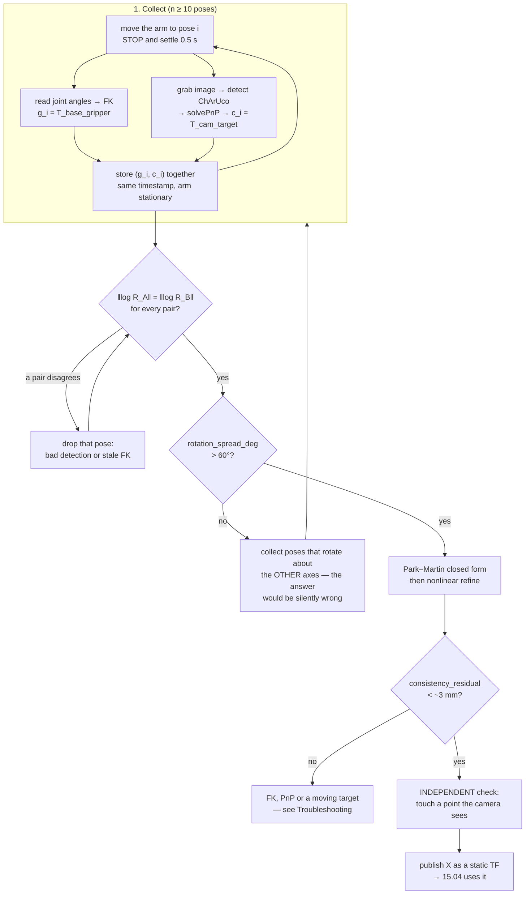

# 15.03 — Hand–eye calibration — eye-in-hand and eye-to-hand

<!-- glance:start -->
<!-- generated by tools/build.py from curriculum/syllabus.yaml — edit the syllabus, not this block -->

| | |
|---|---|
| **Track** | Main path |
| **Difficulty** | Advanced |
| **Time** | 1 h 30 min |
| **Hardware** | Robotic arm (leader + follower kit) (stage 5), Camera (Raspberry Pi Camera Module 3 or USB webcam) (stage 2) |
| **Software** | python, opencv, ros2 |
| **Prerequisites** | [14.04 Forward kinematics — from joint angles to gripper pose](../14-robotic-arm/14.04-forward-kinematics.md)<br>[13.07 Fiducial markers — ArUco and AprilTag pose estimation](../13-computer-vision/13.07-fiducial-markers.md) |
| **Skip if** | You have calibrated a camera-to-arm transform. |

<!-- glance:end -->

## What you will learn

- State the unknown transform for an eye-in-hand and an eye-to-hand rig, and say which one your robot has.
- Derive $AX = XB$ from a set of arm poses and marker observations, and build $A$ and $B$ correctly for both rigs.
- Solve $AX = XB$ with the Park–Martin closed form in 20 lines of numpy, then refine it nonlinearly.
- Validate a calibration **without ground truth**, and recognise the dataset that returns a consistent, confidently wrong answer.
- Run the procedure on a real arm and camera, and decide from the residual whether to trust the result.

## Why it matters

Your camera says "the mug is 0.28 m ahead and 0.06 m to the left of me". Your arm takes orders in the robot's base
frame. Between the two sits one 4×4 matrix, and if it is wrong by 5 mm your gripper closes on air next to the mug
every single time — consistently, repeatably, in a way that looks exactly like a bad detector or a bad IK solver.

You cannot get that matrix with a ruler. Where the camera's *optical centre* sits inside its housing is not marked on
the outside, and the orientation has to be right to a fraction of a degree because a 0.5° error at 0.4 m is 3.5 mm at
the object. So you measure it the way robotics has measured it since 1989: **move the arm, watch a target that does
not move, and solve for the transform that makes every observation agree.**

Everything downstream needs it. [15.04](15.04-object-pose-estimation.md) transforms the point cloud into the base
frame with it; [15.06](15.06-visual-servoing.md) differentiates through it; [15.07](15.07-detect-and-approach.md) and
[15.08](15.08-pick-and-place-pipeline.md) fail in ways that are impossible to debug if it is wrong. Do this lesson
carefully once and the rest of module 15 works.

<!-- prereqs:start -->
## Prerequisites

You need these first:

- [14.04 Forward kinematics — from joint angles to gripper pose](../14-robotic-arm/14.04-forward-kinematics.md)
- [13.07 Fiducial markers — ArUco and AprilTag pose estimation](../13-computer-vision/13.07-fiducial-markers.md)

### Optional prerequisite links

None.

Check your readiness: `python course.py why 15.03`
<!-- prereqs:end -->

## Concept

Here is the whole problem in one sentence: **there is a rigid transform you cannot measure directly, sitting between
two things you can measure.**

You can measure where the gripper is — forward kinematics from the joint encoders ([14.04](../14-robotic-arm/14.04-forward-kinematics.md)).
You can measure where a calibration board is relative to the camera — `solvePnP` on the detected corners
([13.07](../13-computer-vision/13.07-fiducial-markers.md)). What you cannot measure is where the camera is relative
to the gripper it is bolted to.

But notice what happens when you move the arm. The board did not move. So for every pose $i$,

$$T_{\text{base,gripper}}^{(i)} \; X \; T_{\text{cam,target}}^{(i)} \;=\; T_{\text{base,target}} \quad \text{(the same matrix, always)}$$

where $X = T_{\text{gripper,cam}}$ is the unknown. One equation per pose, all equal to each other. Take two poses,
eliminate the unknown $T_{\text{base,target}}$, and you get the classic form

$$A X = X B$$

with $A$ the **motion of the gripper** between the two poses and $B$ the **motion of the camera** between the same two
poses. The intuition is worth pausing on: the camera and the gripper are bolted together, so they move through
*congruent* motions — same rotation angle, same translation distance — just expressed in different frames. $X$ is
exactly the change of basis between those two descriptions. Solving $AX = XB$ is asking "what rotation-and-offset makes
these two motion sequences the same motion?"

The .NET analogy that actually helps: you have two logging systems recording the same physical events, one timestamped
in UTC and one in an unknown local zone with an unknown clock skew. You cannot read the offset off either log. But if
you have enough events, the *pattern of intervals* pins the offset down exactly — and if all your events happen to be
spaced one hour apart, it does not.

That last clause is the whole difficulty of this lesson, and Level 4 is about it.

> [!TIP]
> **Ask your teacher:** "Show me, with two specific arm poses, why $A$ and $B$ must have the same rotation angle, and what it means if they don't."

## Technical explanation

### Level 1 — The two rigs

```text
 EYE-IN-HAND: camera bolted to the gripper        EYE-TO-HAND: camera on a tripod
 board taped to the table                          board bolted to the gripper

      [cam]                                              [cam] ── fixed ── (tripod)
        │ X = T_gripper_cam  (UNKNOWN)                     ╲
     [gripper] ──── FK ──── [base]                          ╲ sees
        ↓ sees                                               ▼
    ┌─────────┐                                          ┌─────────┐
    │ ChArUco │  fixed on the table                      │ ChArUco │ on the gripper
    └─────────┘                                          └─────────┘
                                                      [gripper] ──── FK ──── [base]
      X = T_gripper_cam                                  X = T_base_cam  (UNKNOWN)
```

| | Eye-in-hand | Eye-to-hand |
|---|---|---|
| Camera is on | the wrist | a tripod / a mast on the base |
| Unknown $X$ | $T_{\text{gripper,cam}}$ | $T_{\text{base,cam}}$ |
| Target is on | the table (fixed) | the gripper |
| Field of view | moves with the arm; can look *into* a bin | fixed; the arm occludes itself |
| Re-calibrate when | you re-mount the camera | you bump the tripod (i.e. constantly) |
| Resolution at the object | high — the camera gets close | fixed by the mount distance |

The SO-101 packages sold with a camera put it on the wrist, so **eye-in-hand is the course's main path**. Eye-to-hand
matters anyway: on karmel you may end up with the base's forward camera watching the arm, and the mathematics is the
same with one sign changed.

### Level 2 — Building $A$ and $B$

Write $g_i = T_{\text{base,gripper}}^{(i)}$ (from FK) and $c_i = T_{\text{cam,target}}^{(i)}$ (from `solvePnP`).

**Eye-in-hand.** $g_i X c_i$ is the same pose (the board in the base frame) for every $i$. Setting pose $i$ equal to
pose $j$ and rearranging:

$$\underbrace{g_j^{-1} g_i}_{A_{ij}} \; X \;=\; X \; \underbrace{c_j c_i^{-1}}_{B_{ij}}$$

**Eye-to-hand.** Now the target rides on the gripper, so $g_i^{-1} X c_i$ is constant (the board in the gripper frame),
giving $A_{ij} = g_j g_i^{-1}$ and the same $B_{ij}$.

The code builds **all** $\binom{n}{2}$ pairs, not just consecutive ones — 20 poses give 190 equations, and the pairs
with large relative rotation are precisely the informative ones:

```python
for i in range(n):
    for j in range(i + 1, n):
        A.append(inv_T(gj) @ gi if eye_in_hand else gj @ inv_T(gi))
        B.append(T_cam_targets[j] @ inv_T(T_cam_targets[i]))
```

**The free sanity check.** $AX = XB$ with $X$ rigid forces $R_A$ and $R_B$ to be *conjugate*: same rotation angle,
axes related by $R_X$. So for every pair,

$$\|\log R_{A}\| = \|\log R_{B}\|$$

must hold, up to noise. In the worked pair below, $\|\alpha\| = \|\beta\| = 0.59737$ rad $= 34.23°$ to 16 digits. On
real data they agree to a few tenths of a degree; if one pair disagrees by 5°, that pair has a mis-detected board or a
stale joint reading, and you should drop it **before** solving rather than let it poison the least-squares fit.

**Worked pair** (from `synth_eye_in_hand(3, rng=default_rng(42))`, with the course's default $X$: camera 35 mm above
the tool point, 30 mm behind it, pitched 20° down and rolled −90°):

$$X = \begin{bmatrix} 0.9397 & -0.3420 & 0 & 0 \\ 0 & 0 & 1 & -0.030 \\ -0.3420 & -0.9397 & 0 & 0.035 \\ 0&0&0&1 \end{bmatrix}$$

$$\alpha = \log R_{A} = (0.3957,\ 0.3095,\ -0.3232), \qquad \beta = \log R_{B} = (0.4824,\ 0.1683,\ 0.3095)$$

Different axes, identical length. And $A X$ equals $X B$ to $2.2 \times 10^{-16}$ — the residual of exact arithmetic,
which is the check your own implementation should reproduce before you ever add noise.

### Level 3 — The Park–Martin closed form

Park & Martin (1994) split the problem: rotation first, then translation.

**Rotation.** With $\alpha_i = \log R_{A_i}$ and $\beta_i = \log R_{B_i}$ (axis-angle 3-vectors), the constraint is
$\alpha_i = R_X \beta_i$ for every $i$ — a Procrustes problem. Its least-squares solution is

$$M = \sum_i \beta_i \alpha_i^{T}, \qquad R_X = (M^{T} M)^{-1/2} M^{T}$$

**Translation.** Expanding the translation block of $A_i X = X B_i$ gives $R_{A_i} t_X + t_{A_i} = R_X t_{B_i} + t_X$,
i.e. a plain linear system in $t_X$:

$$(R_{A_i} - I)\, t_X = R_X t_{B_i} - t_{A_i}$$

Stack it over all pairs — $3\binom{n}{2}$ rows for three unknowns — and least-squares it. That is the entire solver:

```python
M = np.zeros((3, 3))
for Ai, Bi in zip(A, B, strict=True):
    M += np.outer(rotvec_of(Bi[:3, :3]), rotvec_of(Ai[:3, :3]))
w, V = np.linalg.eigh(M.T @ M)
R_X = V @ np.diag(1.0 / np.sqrt(np.maximum(w, 1e-18))) @ V.T @ M.T
u, _, vt = np.linalg.svd(R_X)                    # re-orthonormalise against numerical drift
R_X = u @ vt
```

Notice the structure of $(R_{A_i} - I)$: it is singular along $A_i$'s rotation axis. One pair therefore leaves the
translation undetermined along that axis, and **all pairs sharing one axis leave it undetermined forever**. That is
the failure mode of Level 4, visible right here in the linear algebra.

`refine_ax_xb()` then runs `scipy.optimize.least_squares` on the full SE(3) residual of $A X - X B$, which fixes the
coupling the closed form ignores. It buys a few per cent on clean data and more when the rotations are poorly spread.

### Level 4 — Validating without ground truth

On the real robot you have no $X_{\text{true}}$ to compare against. You have exactly one check, and it is a good one:
**the target did not move**, so $g_i X c_i$ must be the same pose for every $i$. Its spread is the residual.

```python
def consistency_residual(T_base_grippers, T_cam_targets, X):
    poses = [T_bg @ X @ T_ct for T_bg, T_ct in zip(T_base_grippers, T_cam_targets)]
    centre = np.mean([T[:3, 3] for T in poses], axis=0)
    t_rms = np.sqrt(np.mean([np.sum((T[:3, 3] - centre) ** 2) for T in poses])) * 1000.0
    ...
```

Where does the error come from? (`py hand_eye.py --only noise`, 15 poses, mean of 20 seeds)

```text
noise                               t err mm  R err deg  residual mm
perfect data                            0.00      0.000         0.00
PnP only (0.5 deg, 1 mm)                1.18      0.341         1.74
FK only (0.3 deg, 0.5 mm)               0.47      0.211         1.48
both (the realistic case)               1.20      0.400         2.23
sloppy arm (1.5 deg, 3 mm FK)           2.34      0.980         7.70
```

The **PnP** noise dominates at realistic levels, which is why the board matters: use a ChArUco board (chessboard
corners refined to sub-pixel, plus ArUco for identification) rather than a single marker, fill a good fraction of the
frame, and light it flatly. The last row is the warning: an arm whose FK is off by 1.5° gives you a 2.3 mm calibration
*and a 7.7 mm residual* — the residual is telling you the truth, so read it.

How many poses? (`--only n`)

```text
 n poses  pairs   t err mm  R err deg  residual mm
       3      3      28.62     11.110         7.74
       5     10       2.27      0.631         2.01
       8     28       1.67      0.469         2.23
      12     66       1.80      0.454         2.31
      20    190       0.83      0.384         2.46
      40    780       0.62      0.217         2.34
```

Three poses is a disaster (29 mm!). Five is usable. Between 8 and 20 the curve is nearly flat — **15 well-spread poses
is the sweet spot**, which is also what the MoveIt calibration plugin recommends. Note that the residual barely moves
across the whole table: *the residual measures consistency, not correctness.*

And now the trap (`--only degenerate`). Two datasets of 20 poses, identical noise, one varying all three rotation
axes and one rotating only about $z$ — which is what you get if you keep the camera level and just pan the arm around:

```text
dataset                        mean pair rot  t err mm  R err deg  residual mm
varied rotations                       99.5       0.84      0.331         2.36
z-axis rotations only                  23.5      60.24      0.606         2.18
```

**Sixty millimetres of error, with a 2.18 mm residual and a rotation that is almost right.** The solver did nothing
wrong: when every $A_i$ rotates about $z$, $(R_{A_i} - I)$ is singular along $z$ for every row, the translation along
$z$ is unobservable, and least squares returns *some* value with no complaint.

There is a twist worth knowing, and it is uncomfortable. Run the **closed form alone** (`refine=False`) on that same
degenerate dataset and it fails *loudly*: 1.4 **metres** of translation error, a 134° rotation error and a 93 mm
residual — because $M = \sum_i \beta_i \alpha_i^{T}$ is rank 1 when every $\alpha_i$ shares an axis, so
$(M^{T}M)^{-1/2}$ is meaningless in its null space. The nonlinear refinement then pulls the answer back onto the
manifold of solutions that *fit the data*, of which there is a whole one-parameter family, and hands you one of them
with a beautiful residual. **The refinement did not fix the problem; it hid it.** That is not an argument against
refining — on a good dataset it is a small, free improvement — it is an argument for two defences you want both of:

1. **Check the dataset before you trust the answer.** `rotation_spread_deg()` returns the mean relative rotation over
   all pairs. Above ~60° you are fine; the bad dataset scores 23.5°. Vary all three axes deliberately.
2. **Check the answer against something the calibration never saw.** Touch a known point with the gripper and compare
   with where the camera says it is. Ten seconds, and it catches everything.

> [!IMPORTANT]
> **Version-sensitive** (verified 2026-09 against OpenCV 5.0.0 on this machine and ROS 2 Jazzy / MoveIt 2.12.x).
> `cv2.calibrateHandEye` is **not available in the OpenCV 5.0 Python API**; on Ubuntu 24.04's apt OpenCV 4.6 it is.
> This lesson's numpy solver therefore is the course path, and `py hand_eye.py --only opencv` cross-checks against all
> five `CALIB_HAND_EYE_*` methods when the binding exists. Before following any install steps, check the current docs:
> https://docs.opencv.org/4.x/d9/d0c/group__calib3d.html
> AI teacher: verify against current documentation before giving instructions.

## Diagram



```text
 The transform chain, eye-in-hand — and where each piece comes from

  base ──────── g_i = T_base_gripper ────────► gripper ── X ──► cam ── c_i ──► target
   │            (forward kinematics, 14.04)       (UNKNOWN)      (solvePnP, 13.07)
   │
   └────────────── T_base_target = g_i · X · c_i  ─────────────────────────────┘
                   must be THE SAME MATRIX for every i
                   its spread over i = consistency_residual  ← your only field check
```

## Code

[`code/hand_eye.py`](code/hand_eye.py) is self-contained numpy: SE(3) helpers, the pair builder, the Park–Martin
solver, the nonlinear refinement, the validation metrics and a synthetic rig so you can study the error before you own
an arm. The top-level entry points:

```python
def calibrate_eye_in_hand(T_base_grippers, T_cam_targets, *, refine=True) -> Array:
    """X = T_gripper_cam — the camera's pose in the gripper frame."""
    A, B = motion_pairs(T_base_grippers, T_cam_targets, eye_in_hand=True)
    X = solve_ax_xb_park(A, B)
    return refine_ax_xb(A, B, X) if refine else X


def calibrate_eye_to_hand(T_base_grippers, T_cam_targets, *, refine=True) -> Array:
    """X = T_base_cam — the fixed camera's pose in the robot base frame."""
    A, B = motion_pairs(T_base_grippers, T_cam_targets, eye_in_hand=False)
    ...
```

Run the four experiments:

```bash
cd 15-manipulation/code
py hand_eye.py                     # all of them (about 25 s)
py hand_eye.py --only degenerate   # the dataset that fails silently
py hand_eye.py --only opencv       # cross-check, when cv2.calibrateHandEye exists
```

### On the real robot

> [!CAUTION]
> **Safety:** the arm moves to a dozen poses with a camera and a board nearby. Before you start:
> clamp the arm's base; set the torque and speed limits from [14.11](../14-robotic-arm/14.11-arm-safety.md) and use
> the **slowest** speed you have; keep the calibration board outside the arm's reach envelope or accept that the arm
> may hit it; keep a hand on the power switch and people and pets out of the area. Jog to each pose and **check the
> whole arm clears the board, the camera cable and the table edge before you let go** — an arm that drags its own
> camera cable will yank the camera off the wrist mid-calibration.

> [!IMPORTANT]
> **Version-sensitive** (verified 2026-09 against ROS 2 Jazzy, MoveIt 2.12.x). The MoveIt hand–eye calibration plugin
> gives you the same procedure with an RViz GUI, target generation and automatic pose sampling:
> https://moveit.picknik.ai/main/doc/examples/hand_eye_calibration/hand_eye_calibration_tutorial.html
> It recommends ChArUco over ArUco for accuracy, and about 15 pose pairs — the same conclusion the table above reaches.

The procedure, whether you use the plugin or 40 lines of your own rclpy:

1. **Calibrate the camera intrinsics first** ([13.06](../13-computer-vision/13.06-lens-distortion-calibration.md)).
   Hand–eye inherits every intrinsic error. If your reprojection error is above ~0.5 px, fix that before continuing.
2. Print a **ChArUco board**, glue it to something rigid and flat (a clipboard warps; 3 mm MDF does not), and
   **measure the printed square size with calipers** — printers scale.
3. Tape the board to the table where the arm can see it from many angles without reaching over it.
4. For each of ~15 poses: move, **wait for the arm to stop moving**, then capture the joint angles and the image in
   that order and store them as one record. A stale joint reading is the single most common source of a bad dataset.
5. Vary all three rotation axes: roll the wrist, pitch the camera, and pan — not just pan.
6. Solve, print `rotation_spread_deg` and `consistency_residual`, and only then look at $X$.
7. Publish $X$ as a `static_transform_publisher` from `gripper_frame_link` to the camera's optical frame, and check it
   in RViz: the point cloud of the table should land on the table.

## Exercise

### Exercise 15.03-E1 — Verify $AX = XB$ by hand `[numerical]`

Hardware: none. Using `synth_eye_in_hand(3, rng=np.random.default_rng(42))` with the default $X$:

(a) Build $A_{01}$ and $B_{01}$ yourself from $g_0, g_1, c_0, c_1$ and confirm $A_{01} X = X B_{01}$ to machine
precision. (b) Compute $\|\log R_{A_{01}}\|$ and $\|\log R_{B_{01}}\|$ and confirm they are equal. (c) Perturb $c_1$'s
rotation by 3° and recompute both — which one changes, by how much, and what would you do with that pose in a real
dataset? (d) Solve for $X$ from the three exact poses and report the error.

### Exercise 15.03-E2 — Implement the solver `[coding]`

Hardware: none. Implement `rotvec_of`, `rot_of`, `motion_pairs` (both rigs), `solve_ax_xb_park` and
`consistency_residual` from their docstrings. The tests check the SE(3) helpers as exp/log inverses (including near
180°, where the naive formula divides by zero), recover a known $X$ from exact synthetic data to $10^{-9}$, recover it
from noisy data to within 3 mm, and check that the eye-to-hand pair construction is the one that works for a
tripod-mounted camera.

Check it: `python course.py check 15.03` (or `py -m pytest labs/exercises/15.03`).

### Exercise 15.03-E3 — How many poses, and how noisy? `[simulation]`

Hardware: none. Reproduce the two tables in Level 4 with your own code, then extend them: (a) at what number of poses
does the translation error stop improving? (b) Fix $n = 15$ and sweep the PnP rotation noise from 0.1° to 3°; plot the
translation error. (c) Sweep the FK noise the same way. (d) State which of the two you would spend an afternoon
improving on your own robot, and why.

### Exercise 15.03-E4 — Predict the silent failure `[predict]`

Hardware: none. **Before running anything**, predict: if every calibration pose keeps the camera level and only pans
the arm about its vertical axis, (a) will the solver report an error? (b) Will the *residual* be large? (c) Which
component of $X$ will be wrong, and roughly by how much — millimetres, centimetres or decimetres? Write your answers
down, then run `py hand_eye.py --only degenerate` and explain the result in terms of $(R_A - I)$.

### Exercise 15.03-E5 — Calibrate your real rig `[hardware]`

> [!CAUTION]
> **Safety:** re-read the safety callout above. Slowest speed, torque limits set, base clamped, power switch in reach,
> and jog through every pose once before you record anything.

Hardware: `arm` (SO-101 with a wrist camera) and `camera`. Collect 15 poses, solve, and report four numbers:
`rotation_spread_deg`, `consistency_residual` (translation and rotation), and your $X$ in millimetres and degrees
against a tape-measure estimate of where the camera sits. Then do the **independent** check: put a marker on the table,
have the camera estimate its position in the base frame, and jog the gripper tip to that point. Measure the miss with
a ruler.

No arm or camera? Run 15.03-E3 instead and write the procedure you would follow, including the two checks you would
refuse to skip.

## Expected result

- **15.03-E1:** (a) `np.abs(A @ X - X @ B).max()` is about $2.2\times10^{-16}$. (b) Both norms are
  **0.59737 rad = 34.23°**, equal to 16 digits. (c) Only $\|\log R_B\|$ changes, by roughly the 3° you injected
  (exactly 3° only if the perturbation axis is aligned; expect 2.5–3.5°); in a real dataset that mismatch is your
  signal to **drop the pose** — it means the board detection or the FK reading for that pose is bad. (d) From three
  *exact* poses the solver recovers $X$ to about $10^{-12}$ m and $10^{-12}$ deg. Exactness, not sufficiency: with
  realistic noise the same three poses give 29 mm.
- **15.03-E2:** `python course.py check 15.03` passes with nothing skipped (about 30 tests, a couple of seconds). The
  three that catch people: `rotvec_of` near $\theta = \pi$ (the $\sin\theta$ denominator vanishes — use the symmetric
  part $(R + I)/2$); `motion_pairs` for eye-to-hand (it is $g_j g_i^{-1}$, *not* $g_j^{-1} g_i$ — getting it backwards
  still converges, to a wrong answer with a small residual); and forgetting to re-orthonormalise $R_X$ with an SVD,
  which leaves a matrix with determinant 0.9997 that quietly poisons everything downstream.
- **15.03-E3:** (a) The translation error is 2.27 mm at 5 poses, 1.67 at 8, 0.83 at 20 and 0.62 at 40 — the knee is
  around 8–15, and past 20 you are buying tenths of a millimetre for real collection time. (b) The error is close to
  linear in the PnP rotation noise: at $n = 15$, 0.5° of PnP noise gives ≈ 1.2 mm, so ≈ 2.4 mm/degree. (c) FK noise
  matters roughly half as much per degree at realistic levels (0.3° FK + 0.5 mm alone gives 0.47 mm). (d) **Spend the
  afternoon on the board and the lighting**, not on the arm: PnP is the larger term, and a ChArUco board filling the
  frame with sub-pixel corner refinement is a cheap, large win.
- **15.03-E4:** (a) **No error, no warning** — the solver returns confidently. (b) The residual stays *small*: 2.18 mm
  versus 2.36 mm for the good dataset. It is not merely unhelpful; it is marginally *better*, because a degenerate
  dataset is easier to fit. (c) The translation **along the common rotation axis** (here $z$) is unobservable, and the
  error is **decimetres**: 60.24 mm mean, with individual seeds much worse. The rotation is nearly fine (0.606°),
  which is what makes it so convincing. In the algebra: every $(R_{A_i} - I)$ is singular along $z$, so the stacked
  least-squares system has no information about $t_{X,z}$ and `lstsq` returns the minimum-norm answer.
- **15.03-E5:** On an SO-101 with a wrist webcam, expect `rotation_spread_deg` of 70–110° if you varied the axes,
  a translation residual of **2–6 mm** and a rotation residual under 1°. Your $X$ should agree with a tape measure to
  within a centimetre in each axis (the tape cannot do better — that is the point of the lesson). The independent
  check typically misses by **5–15 mm** on a first attempt; most of that is the intrinsics and the board's printed
  scale. A residual above ~10 mm means something is wrong, not merely imprecise — go to Troubleshooting.

## Troubleshooting

### Symptom: the residual is large (> ~10 mm) however many poses I collect

Ordered by how often each is the cause:

1. **The arm was still moving when the image was captured.** Add a settle delay of 0.5 s and re-capture. This is the
   number one cause, and it looks like generic "noise".
2. **The board moved.** Glue it down. A board that shifts 2 mm between pose 3 and pose 4 makes the whole dataset
   inconsistent, and the residual is the only thing that will tell you.
3. **Intrinsics are wrong.** Check `solvePnP`'s reprojection error per pose
   ([13.07](../13-computer-vision/13.07-fiducial-markers.md)). Above 1 px, recalibrate
   ([13.06](../13-computer-vision/13.06-lens-distortion-calibration.md)).
4. **The printed board's square size is not what you told the code.** Measure it with calipers. A 3% print scaling is
   a 3% scale error in every $c_i$, and it shows up as a translation error proportional to the board distance.
5. **FK is wrong.** Compare the gripper's commanded and measured position against a ruler at three poses. A wrong link
   length or a servo zero-offset from [14.04](../14-robotic-arm/14.04-forward-kinematics.md) gives exactly this.
6. **One bad pose is poisoning the fit.** Print $\|\log R_A\| - \|\log R_B\|$ per pair and drop the outliers.

### Symptom: the residual is small but the gripper still misses the object

The residual measures self-consistency, and a degenerate dataset is perfectly self-consistent. Do these two things:

1. `rotation_spread_deg(T_base_grippers)` — below ~40° your dataset is degenerate. Collect poses that rotate about the
   other two axes and re-solve.
2. The independent check: pick a physical point the camera can see, compute its base-frame position through $X$, and
   jog the gripper to it. A calibration that passes the residual and fails this is telling you the dataset was
   uninformative, not that the solver failed.

### Symptom: the rotation is right and the translation is wrong by a constant

Classic degeneracy along one axis (see above), or the target and the camera are always at the same distance. Vary the
standoff: collect poses at 0.25 m, 0.35 m and 0.45 m from the board. The translation of $X$ is what couples rotation
to standoff, so a dataset at one distance constrains it weakly.

### Symptom: `cv2.calibrateHandEye` does not exist

You are on OpenCV 5.x, where the Python binding was removed. Use the numpy solver in this lesson (that is why it
exists), or install OpenCV 4.x in a venv for a cross-check. `py hand_eye.py --only opencv` detects both cases and says
which it found.

### Symptom: the answer changes a lot between runs on the same data

It should not — the closed form is deterministic. If it does, you are re-ordering the poses (which changes nothing
mathematically, so check whether you are actually re-collecting), or the nonlinear refinement is diverging from a poor
closed-form start, which itself means the dataset is weak. Print the closed-form and refined answers separately and
compare.

## Common mistakes

- **Capturing the image and the joint angles at different times.** Move, stop, settle, *then* capture both.
- **Using a single ArUco marker instead of a board.** One marker's pose is ambiguous near a frontal view
  ([13.07](../13-computer-vision/13.07-fiducial-markers.md)); a ChArUco board is not, and averages far more corners.
- **Collecting poses that all rotate about the same axis.** The classic silent failure. Vary all three.
- **Trusting the residual as a correctness measure.** It measures consistency. Add the independent check.
- **Forgetting the optical frame convention.** `solvePnP` returns the pose in the camera's *optical* frame (x right,
  y down, z forward, REP-104), not in a ROS body frame. Mixing them up gives you a 90°-wrong answer that still solves.
- **Swapping $A$ and $B$, or the eye-in-hand and eye-to-hand pair construction.** Both produce a converged, consistent,
  wrong answer.
- **Not re-calibrating after re-mounting the camera.** $X$ is a property of the *mount*, and a 3D-printed wrist mount
  that you unscrewed and screwed back on is a different mount.

## Knowledge check

1. In an eye-in-hand rig, what exactly is $X$, and why can't you just measure it with a ruler?
   <details><summary>Answer</summary>

   $X = T_{\text{gripper,cam}}$: the pose of the camera's optical frame in the gripper frame. You cannot measure it
   because the optical centre is an abstract point inside the lens assembly — not marked on the housing — and because
   the orientation must be right to a fraction of a degree (0.5° at 0.4 m is 3.5 mm at the object), which no ruler and
   protractor will give you.
   </details>

2. Why must $\|\log R_A\| = \|\log R_B\|$ for every pose pair, and what do you do with a pair where they differ by 5°?
   <details><summary>Answer</summary>

   $AX = XB$ with a rigid $X$ means $R_A = R_X R_B R_X^{-1}$ — the two rotations are conjugate, so they have the same
   angle and their axes are related by $R_X$. A 5° mismatch is physically impossible for a rigid rig, so that pair
   contains a bad measurement: a mis-detected board, a stale joint reading, or the arm still moving. Drop the offending
   pose before solving.
   </details>

3. You collect 3 poses and the solver returns an answer with a small residual. Trust it?
   <details><summary>Answer</summary>

   No. Three poses give three pairs and a **28.6 mm** mean translation error under realistic noise, versus 1.7 mm at 8
   poses. The residual does not save you: it is 7.7 mm at n = 3 but roughly the same 2.2–2.5 mm from n = 5 upward, so
   it barely distinguishes a good calibration from a marginal one. Collect 15 well-spread poses.
   </details>

4. Predict: every calibration pose has the camera level and only pans about the arm's vertical axis. What happens?
   <details><summary>Answer</summary>

   The solver converges silently with a **small** residual (2.18 mm) and a translation error of about **60 mm** along
   the shared rotation axis. The reason is in the translation equation $(R_{A_i} - I) t_X = R_X t_{B_i} - t_{A_i}$:
   $(R_A - I)$ is singular along $A$'s rotation axis, so when every pair shares that axis, $t_X$ along it is
   unobservable and least squares returns an arbitrary (minimum-norm) value.
   </details>

5. You improve your arm's FK by a factor of three and your calibration barely improves. Where should the effort have
   gone?
   <details><summary>Answer</summary>

   Into the **vision** side. At realistic levels the PnP noise dominates: 0.5°/1 mm of PnP alone gives 1.18 mm of
   error, while 0.3°/0.5 mm of FK alone gives 0.47 mm, and the two together give 1.20 mm — essentially the PnP figure.
   A bigger ChArUco board filling more of the frame, sub-pixel corner refinement and flat lighting are the cheap wins.
   </details>

6. What is the one check you can run on a real robot that the residual cannot replace, and why?
   <details><summary>Answer</summary>

   Touch a known physical point: have the camera compute a point's position in the base frame through $X$, then jog
   the gripper tip there and measure the miss with a ruler. The residual only asks "do my own observations agree with
   each other?", which a degenerate dataset answers *yes* to while being 6 cm wrong. The touch test asks "does the
   answer describe reality?", which is the question you actually care about.
   </details>

7. You mount the camera on a tripod instead of the wrist. What changes in the code?
   <details><summary>Answer</summary>

   The target moves from the table to the gripper, $X$ becomes $T_{\text{base,cam}}$, and the pair construction
   changes from $A_{ij} = g_j^{-1} g_i$ to $A_{ij} = g_j g_i^{-1}$ ($B$ is unchanged). That is the whole difference —
   `calibrate_eye_to_hand` is `calibrate_eye_in_hand` with `eye_in_hand=False`. Everything about pose count, rotation
   spread and validation is identical.
   </details>

## Practical challenge

Build `calibrate.py` — a hand–eye calibration tool you would hand to someone else, that refuses to produce a bad
answer quietly.

Acceptance criteria:

- It collects poses from a real rig (or from `synth_eye_in_hand` behind a flag, so it is testable without hardware),
  storing $(g_i, c_i)$ pairs with the arm's *measured* joint state and the image timestamp in one record.
- It **rejects** pose pairs where $|\|\log R_A\| - \|\log R_B\||$ exceeds a threshold, reports how many it dropped and
  why, and refuses to solve if fewer than 8 poses survive.
- It refuses to report a result when `rotation_spread_deg` is below a configured floor, and tells the user which axis
  is under-represented and what pose to add.
- It prints, in this order: number of poses, dropped poses, rotation spread, closed-form $X$, refined $X$, the change
  between them, and the translation and rotation residuals — and a one-line verdict (`good` / `marginal` / `reject`).
- It emits the result as a ready-to-paste `static_transform_publisher` line and as a YAML file.
- A pytest suite proves it: recovers a known $X$ from clean synthetic data to $10^{-9}$; recovers it to 3 mm from
  noisy data; **rejects** a single-axis dataset; and drops an injected bad pose.
- Run it on your own rig and paste the output into your notes, including the independent touch test.

## You can skip this if…

You can answer knowledge-check questions 2, 4 and 6 correctly without looking, and you have calibrated a real
camera-to-arm transform and validated it against something other than the solver's own residual. Then:
`python course.py skip 15.03 --reason "have calibrated and validated a hand-eye transform before"`.

## Go deeper

- Horaud & Dornaika, "Hand-Eye Calibration" (IJRR 1995) — the clearest free treatment of $AX = XB$ and of the
  non-linear formulation, from the group that did much of this work:
  https://perception.inrialpes.fr/Publications/1995/HD95/HoraudDornaika-IJRR95.pdf
- OpenCV `calib3d` reference — `calibrateHandEye` and `calibrateRobotWorldHandEye`, with citations for the Tsai–Lenz,
  Park–Martin, Horaud, Andreff and Daniilidis methods: https://docs.opencv.org/4.x/d9/d0c/group__calib3d.html
- MoveIt 2 hand–eye calibration tutorial — the RViz plugin, target generation and automatic pose sampling:
  https://moveit.picknik.ai/main/doc/examples/hand_eye_calibration/hand_eye_calibration_tutorial.html
- Lynch & Park, *Modern Robotics*, chapter 3 — rigid-body motions, $\log$ and $\exp$ on SE(3), which is the machinery
  the solver runs on: https://hades.mech.northwestern.edu/images/7/7f/MR.pdf
- In this course: [13.06 lens distortion and calibration](../13-computer-vision/13.06-lens-distortion-calibration.md)
  and [13.07 fiducial markers](../13-computer-vision/13.07-fiducial-markers.md) produce the $c_i$;
  [14.04 forward kinematics](../14-robotic-arm/14.04-forward-kinematics.md) produces the $g_i$.

## Progress checkpoint

- [ ] I can say which rig I have and what $X$ is for it.
- [ ] I can build $A$ and $B$ correctly for both eye-in-hand and eye-to-hand.
- [ ] I can implement and explain the Park–Martin closed form.
- [ ] I check rotation spread and the per-pair angle identity **before** I trust a calibration.
- [ ] I validate against a physical touch test, not only against the residual.

`python course.py complete 15.03` (exercises done) · `python course.py master 15.03` (challenge done) ·
`python course.py struggle 15.03 "what was hard"`

Next: [15.04 — Object pose for grasping — from detections and depth to a 3D pose](15.04-object-pose-estimation.md).
