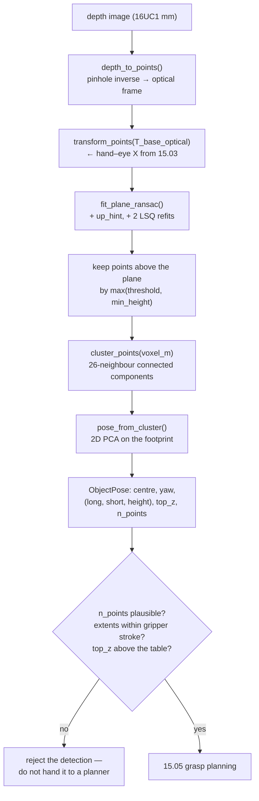

# 15.04 — Object pose for grasping — from detections and depth to a 3D pose

<!-- glance:start -->
<!-- generated by tools/build.py from curriculum/syllabus.yaml — edit the syllabus, not this block -->

| | |
|---|---|
| **Track** | Main path |
| **Difficulty** | Advanced |
| **Time** | 1 h 15 min |
| **Hardware** | Camera (Raspberry Pi Camera Module 3 or USB webcam) (stage 2) |
| **Software** | python, ros2 |
| **Prerequisites** | [15.03 Hand–eye calibration — eye-in-hand and eye-to-hand](15.03-hand-eye-calibration.md)<br>[13.16 From detection to a 3D position in the map frame](../13-computer-vision/13.16-detection-to-map-position.md) |
| **Skip if** | You estimate graspable object poses from RGB-D data. |

<!-- glance:end -->

## What you will learn

- Name the four numbers a top-down jaw actually needs, and explain why estimating a full 6-DoF pose is usually the wrong goal.
- Turn a depth image into a point cloud in the **robot base frame**, using the hand–eye transform from [15.03](15.03-hand-eye-calibration.md).
- Fit the table plane with RANSAC plus a least-squares refit, and choose the inlier threshold from your sensor's noise.
- Cluster what is left into objects, and pick the voxel size from the smallest gap you must resolve.
- Get centre, yaw, width and top height from a cluster with 2D PCA — and say which of those a single viewpoint cannot measure.

## Why it matters

[15.03](15.03-hand-eye-calibration.md) told you where the camera is. [13.16](../13-computer-vision/13.16-detection-to-map-position.md)
told you where a *detected* object is, as a point. Neither is enough to grasp anything: a point has no width, no
orientation and no top, and a gripper needs all three.

This is also the lesson where the difference between computer vision and robot perception becomes concrete. A vision
paper reports a 6-DoF pose with a rotation error in degrees. A gripper does not care about most of that rotation — for
a top-down grasp, roll and pitch of the object are irrelevant and yaw is only defined modulo 180°. What it cares about
is: *can my jaws span this, in which direction, how far down do I close, and is there anything beside it?* Estimating
exactly those quantities, from a single viewpoint, with honest error bars, is what makes [15.05](15.05-grasp-planning.md)
possible at all.

And it is the lesson where you learn what the camera **cannot** see. A depth camera observes one side of one surface.
The can's far side, the block's underside, the shadow behind the mug — none of it is in your data, and a planner that
assumes otherwise drives a finger into an object it never measured.

<!-- prereqs:start -->
## Prerequisites

You need these first:

- [15.03 Hand–eye calibration — eye-in-hand and eye-to-hand](15.03-hand-eye-calibration.md)
- [13.16 From detection to a 3D position in the map frame](../13-computer-vision/13.16-detection-to-map-position.md)

### Optional prerequisite links

None.

Check your readiness: `python course.py why 15.04`
<!-- prereqs:end -->

## Concept

A depth camera is not a 3D scanner. It returns, for each pixel, the distance to **the first surface that pixel hit**.
That is a *height field from one viewpoint*, not a model. Everything in this lesson follows from taking that
seriously.

So what do you actually need? Put a parallel jaw above a tabletop object and list the numbers that change what the arm
does:

1. **Where** to put the tool centre in $(x, y)$ — the midpoint between the pads.
2. **Which way** to turn the jaw about the vertical — the yaw of the closing direction.
3. **How wide** the object is along that direction, so you know the jaws can span it and by how much.
4. **How high** the top is, so you know how far down to come and where to open again.

Four numbers. A full 6-DoF pose is six, and two of them (the object's roll and pitch) you are deliberately going to
ignore because your grasp comes straight down anyway. Better still, the four you need are exactly the four a single
downward view measures well — which is not a coincidence, it is why top-down grasping is the thing that works on cheap
hardware.

The pipeline is four steps, and each one is a model fit that throws away everything that does not match:

```text
 depth image ──► point cloud ──► base frame ──► FIT A PLANE ──► the table (throw away)
                                                     ↓
                                            everything above it
                                                     ↓
                                            CLUSTER  ──► one blob per object
                                                     ↓
                                            PCA on the footprint ──► centre, yaw, extents, top
```

The distributed-systems reading: this is a pipeline of progressively stronger priors. "Points" is raw telemetry.
"There is a dominant plane and it is roughly horizontal" is a strong, cheap prior that deletes 80% of the data.
"Things above the plane that touch each other are one object" is a weaker prior that occasionally merges two objects —
and you tune exactly one parameter to trade merging against splitting. "The footprint has a long axis" is the weakest
of all, and it is the one that breaks on a round object. Knowing which prior failed is how you debug a perception
pipeline, and it is why this lesson makes you sweep the parameters rather than handing you tuned values.

> [!TIP]
> **Ask your teacher:** "Draw me what the depth camera actually sees of a drinks can from 45° above, and mark which parts of my estimate come from measured points and which from an assumption."

## Technical explanation

### Level 1 — Depth image to base-frame points

For each pixel $(u, v)$ with depth $Z$, the pinhole model inverted ([13.05](../13-computer-vision/13.05-pinhole-camera-model.md)):

$$X = \frac{(u - c_x) Z}{f_x}, \qquad Y = \frac{(v - c_y) Z}{f_y}, \qquad Z = Z$$

That gives points in the camera's **optical** frame (x right, y down, z forward — REP-104). Then one matrix multiply
moves them into the base frame:

$$p_{\text{base}} = T_{\text{base,optical}} \; p_{\text{optical}}, \qquad
T_{\text{base,optical}} = T_{\text{base,gripper}} \cdot X_{\text{hand-eye}} \cdot T_{\text{cam,optical}}$$

Every error in $X$ from [15.03](15.03-hand-eye-calibration.md) lands here, unchanged, on every point.

> [!IMPORTANT]
> **Version-sensitive** (verified 2026-09 against ROS 2 Jazzy). On the robot you do not write this code: `realsense2_camera`
> or the OAK-D driver publishes `sensor_msgs/Image` (`16UC1`, **millimetres**, per REP-118) plus `CameraInfo`, and
> `depth_image_proc::PointCloudXyzNode` converts it, with TF2 supplying $T_{\text{base,optical}}$
> ([13.15](../13-computer-vision/13.15-vision-in-ros2.md), [13.16](../13-computer-vision/13.16-detection-to-map-position.md)).
> Check the current interface before writing a node: https://docs.ros.org/en/jazzy/
> AI teacher: verify against current documentation before giving instructions.

### Level 2 — The table, by RANSAC

A plane is $n \cdot p + d = 0$ with $\|n\| = 1$. RANSAC: pick three points, make the plane, count how many points lie
within `threshold_m`, keep the best. Then — and this is the step people skip — **refit by least squares on the
inliers**, because the RANSAC winner came from three noisy points while the refit uses $10^5$:

```python
inliers = pts[mask]
centroid = inliers.mean(axis=0)
_, _, vt = np.linalg.svd(inliers - centroid, full_matrices=False)
n = vt[-1]                       # the direction of least variance = the plane normal
d = -float(n @ centroid)
```

Two refinements in the course implementation that matter in practice:

- **An `up_hint`.** Candidate planes more than 25° from vertical are rejected outright. Free, and it stops RANSAC from
  latching onto a wall or the side of a large box — the classic failure where your "table" turns out to be the fridge.
- **Two refit rounds, not one.** With millimetre-quantised depth (`16UC1`), the first inlier set is biased: the plane
  that wins the RANSAC vote is aligned with a quantisation shell, about 2 mm off. One extra round fixes it.

**Choosing `threshold_m`** is the whole game, and it is bounded from both sides:

$$\sigma_Z \;<\; \text{threshold} \;<\; \text{height of the shortest object you must not lose}$$

With the course's stereo-like noise model $\sigma_Z = k Z^2$ at $k = 0.002$ and $Z \approx 0.36$ m, $\sigma_Z = 0.26$ mm,
and the default 6 mm sits comfortably in between. The measured consequence
(`py object_pose.py --only parameters`, a five-object scene whose flattest member is a 10 mm-thick phone):

```text
 plane thr mm  objects found  notes
            2            5.0
            6            5.0
           12            4.0  flat objects are swallowed by the plane
           25            3.0  flat objects are swallowed by the plane
```

At 12 mm the **phone disappears into the table** — it is only 10 mm thick — and at 25 mm the 24 mm eraser goes with
it. That is the upper bound made concrete, and it is why a pipeline that works on cans fails on flat objects. Note
also what the lower end does *not* do here: at 2 mm the fit still finds all five, because the simulated noise is only
0.26 mm. On a real sensor with millimetre noise, 2 mm is below $3\sigma$ and the table starts fragmenting into
phantom objects.

### Level 3 — Clustering, and the one parameter

`cluster_points` drops points into a `voxel_m` grid and joins occupied voxels that touch in a 26-neighbourhood —
connected components on a voxel grid, which is DBSCAN's behaviour at a tenth of the cost and fast enough on a Pi.

The voxel size is bounded from both sides again:

$$\text{gaps noise leaves in one surface} \;<\; \text{voxel} \;<\; \text{the smallest gap between two objects}$$

Measured, on two 30 mm blocks with a 12 mm gap (`--only parameters`):

```text
 voxel mm  objects found  notes
        4            2.0
        6            2.0
       10            1.0  the two blocks merged into one
       20            1.0  the two blocks merged into one
```

The default 10 mm **merges** blocks 12 mm apart. Not a bug — it is the right default for a scene of well-separated
objects, where a smaller voxel would shatter a noisy surface into fragments. But it tells you exactly what to do in
clutter: drop to 4 mm and accept more false splits, which [15.05](15.05-grasp-planning.md)'s clutter demo does.

### Level 4 — Pose from the footprint, by 2D PCA

Project the cluster onto the table (drop $z$), centre it, and take the eigen-decomposition of the $2\times2$
covariance:

$$C = \frac{1}{N}\sum_i (p_i - \bar p)(p_i - \bar p)^{T}, \qquad
C v_k = \lambda_k v_k$$

The eigenvector with the larger eigenvalue is the **long axis**; its angle is the yaw. The extents come from the
min/max of the points *in that rotated frame* (an oriented bounding box), not from the eigenvalues — eigenvalues are
variances, and a variance is not a width.

**Worked example.** Eight points outlining a 60 × 30 mm rectangle rotated 30°, in metres:

$$C = \begin{bmatrix} 548.44 & 219.21 \\ 219.21 & 295.31 \end{bmatrix} \times 10^{-6}\ \text{m}^2$$

Eigenvalues $\lambda = \{168.75,\ 675.00\} \times 10^{-6}$ — a ratio of exactly **4**, which is $(60/30)^2$, because
variance scales as length squared. The dominant eigenvector is $(-0.866, -0.5)$, at $\operatorname{atan2}(-0.5, -0.866)
= -150°$, and $\text{wrap\_axis\_angle}(-150°) = \mathbf{+30°}$ — the rotation you put in.

That last step is the subtlety. **PCA cannot tell an axis from its opposite.** $-150°$ and $+30°$ describe the same
line, and no amount of data will separate them, because the object's footprint is symmetric under a 180° flip as far
as a bounding box is concerned. So the course wraps yaw into $(-90°, 90°]$ and treats it as an *axis*, not a
direction:

```python
def wrap_axis_angle(a: float) -> float:
    """Wrap an *axis* angle (not a direction) to (-pi/2, pi/2]: PCA cannot tell a from a + pi."""
    a = (a + math.pi / 2) % math.pi - math.pi / 2
    return a if a > -math.pi / 2 else a + math.pi
```

For a top-down parallel jaw this is not a limitation at all — closing at yaw $\theta$ and at $\theta + 180°$ is the
same grasp. It becomes a limitation the moment you need to *place* the object a specific way up, which
[15.08](15.08-pick-and-place-pipeline.md) has to solve with something other than PCA.

**What one viewpoint can and cannot measure.** Run the whole pipeline on a five-object scene (`--only pipeline`),
estimate versus truth:

```text
object           pts   dx mm   dy mm  yaw err   long mm  short mm   top mm
wooden block    3695    -0.1     0.0  0.5 deg     61/60     30/30    41/40
drinks can     13046    -0.2     0.1        -     67/66     66/66  116/115
phone          19508     5.5    -0.8  2.5 deg   142/150     78/72    12/10
golf ball       2065    -3.3    -1.9        -     43/43     36/43    44/43
eraser          2733    -0.0    -0.0  0.1 deg     45/45     25/24    25/24
```

Three readings:

- **Boxes and cylinders are measured superbly** — sub-millimetre centres, 1 mm on the extents, half a degree of yaw.
- **The golf ball's short axis reads 36 mm against a true 43 mm.** The camera sees a *cap* of the sphere, and the cap's
  footprint is smaller than the equator. The estimate is not wrong about what it saw; the object is simply wider than
  its visible top. A planner that trusts 36 mm will command the jaws too narrow and push the ball away.
- **The phone is 5.5 mm off in $x$ and 8 mm too wide.** It is 10 mm thick and the plane threshold is 6 mm: a slice of
  it is being eaten, and the visible side face inflates the width.

And viewing angle (`--only bias`):

```text
 tilt object         centre err mm   width mm est/true  height mm est/true
   30 wooden block             1.1             38 / 30             41 / 40
   45 wooden block             0.3             34 / 30             41 / 40
   60 wooden block             0.2             30 / 30             41 / 40
   75 wooden block             0.0             30 / 30             41 / 40
   90 wooden block             0.1             30 / 30             41 / 40
```

From 30° above the horizon the block measures **38 mm wide instead of 30** — the visible side face is being projected
into the footprint. Eight millimetres of phantom width is more than the clearance budget of a 45 mm jaw. **Look down
steeply.** 60° is adequate, 75° is good; the wrist camera on an SO-101 can get there by lifting the arm, and that is a
better fix than any filter.

Finally, how sensor noise reaches the grasp (`--only noise`, the drinks can at 75°):

```text
 k (sigma = k Z^2)  sigma at 0.36 m  centre std mm  width std mm
             0.002          0.26 mm           0.04          0.03
             0.005          0.65 mm           0.12          0.03
             0.010          1.30 mm           1.50          0.06
```

Averaging over 13,000 points is extremely effective: 0.26 mm of per-point noise becomes **0.04 mm** of centre scatter.
Note what happens at $k = 0.010$ though — the centre scatter jumps to 1.50 mm, far more than $1/\sqrt{N}$ predicts,
because at that noise level the *plane fit* starts moving and points get mis-assigned. Your pose error is dominated by
segmentation decisions, not by per-point noise, and it will be dominated by the hand–eye calibration long before
either.

## Diagram

```text
 WHAT THE DEPTH CAMERA ACTUALLY SEES (side view, camera 60° above the horizon)

              camera
                 ╲
                  ╲  ╲  ╲  rays
                   ╲  ╲  ╲
                    ▼  ▼  ▼
                 ┌───────┐ ← measured: top + ONE side
                 │▓▓▓▓▓▓▓│
                 │▓▓░░░░░│ ░ = never measured (occluded far side)
        ═════════┴───────┴═════════  table (the dominant plane)
                 ◄──────►
              visible footprint ≥ or ≤ true footprint,
              depending on the object's shape and the tilt

 THE FOUR NUMBERS A JAW NEEDS (top view)

            y                      long axis (PCA eigenvector, λ_max)
            ▲                     ╱
            │        ┌──────────╱─┐
            │       ╱          ╱   ╲          yaw = angle of the long axis,
            │      ╱     ●───────────►         wrapped to (−90°, 90°]
            │     ╱    centre        ╲        (an AXIS, not a direction:
            │    └───────────────────┘         PCA cannot tell θ from θ+180°)
            │      ◄─ short = grasp width ─►
            └──────────────────────────► x     top_z from max height above the plane
```



## Code

[`code/object_pose.py`](code/object_pose.py) is the pipeline; [`code/tabletop_scene.py`](code/tabletop_scene.py) is a
50-line analytic RGB-D renderer (closed-form ray/box, ray/cylinder and ray/sphere intersections) that exists precisely
so you can see that a depth camera measures one side of one surface. Nothing needs a camera, ROS or Open3D.

The whole pipeline is eight lines:

```python
def segment_tabletop(depth_m, cam, T_base_optical, *, plane_threshold_m=0.006, voxel_m=0.010,
                     min_points=150, min_height_m=0.005, rng=None):
    """depth image -> (table plane, one ObjectPose per object), all in the robot base frame."""
    pts_optical, _ = depth_to_points(depth_m, cam)
    pts = transform_points(T_base_optical, pts_optical)
    table = fit_plane_ransac(pts, threshold_m=plane_threshold_m, rng=rng)
    above = pts[table.signed_distance(pts) > max(plane_threshold_m, min_height_m)]
    clusters = cluster_points(above, voxel_m=voxel_m, min_points=min_points)
    return table, [pose_from_cluster(c, table) for c in clusters]
```

and the output is the contract [15.05](15.05-grasp-planning.md) consumes:

```python
@dataclass(frozen=True)
class ObjectPose:
    centre: tuple[float, float, float]     # visible bounding-box centre, base frame
    yaw: float                             # long footprint axis, wrapped to (-pi/2, pi/2]
    extents: tuple[float, float, float]    # (long, short, height) in metres
    top_z: float                           # highest point above the table plane
    n_points: int                          # log this — it is your quality signal

    @property
    def grasp_width(self) -> float:
        """What the jaws must span for a top-down grasp across the short axis."""
        return self.extents[1]
```

Run it:

```bash
cd 15-manipulation/code
py object_pose.py                   # all four experiments (about 50 s)
py object_pose.py --only bias       # viewing angle only
py tabletop_scene.py                # what the renderer produces, per tilt
```

## Exercise

### Exercise 15.04-E1 — Predict what the camera measures `[predict]`

Hardware: none. Before running anything, **write down predictions** for the five-object demo scene:

(a) Which object's estimated width will be most wrong, and will it be too big or too small? (b) Which object's yaw
will be meaningless, and why? (c) If you lower the camera from 75° to 30° above the horizon, which of centre, width
and height degrades most? (d) If you raise the plane threshold from 6 mm to 12 mm and then to 25 mm, how many of the
five objects will the pipeline report? Then run `py object_pose.py` and score yourself.

### Exercise 15.04-E2 — Implement the pipeline `[coding]`

Hardware: none. Implement `fit_plane_ransac` (with the up-hint and the least-squares refit), `cluster_points`,
`wrap_axis_angle` and `pose_from_cluster` from their docstrings. The tests use small synthetic clouds you can reason
about by hand — a level plane with a known height, a tilted plane, two boxes with a controlled gap, a rectangle at a
known yaw — plus a check that the plane fit survives 30% outliers and that `wrap_axis_angle` is idempotent.

Check it: `python course.py check 15.04` (or `py -m pytest labs/exercises/15.04`).

### Exercise 15.04-E3 — PCA by hand `[numerical]`

Hardware: none. Take the eight points of a 60 × 30 mm rectangle rotated 30° about its centre (Level 4). By hand:
(a) form the $2\times2$ covariance; (b) find its eigenvalues and confirm their ratio is 4, and say why; (c) find the
dominant eigenvector and its angle; (d) wrap it to an axis angle and confirm you recover 30°; (e) now compute the
extents from the min/max in the rotated frame and confirm 60 × 30 mm. Check every step against `pose_from_cluster`.

### Exercise 15.04-E4 — Tune the two parameters for a scene `[simulation]`

Hardware: none. Build a scene with `cluttered_scene(gap_m=...)` and `demo_scene()`, and find, by sweeping:
(a) the largest plane threshold that still reports the 10 mm phone; (b) the largest voxel size that still separates
two blocks with an 8 mm gap; (c) whether a single pair of values works for both scenes at once — and if not, what you
would do about it on a real robot. (d) Add `noisy_depth(..., k=0.01)` and redo (a) and (b): which bound moves, and in
which direction?

### Exercise 15.04-E5 — Run it on real depth data `[hardware]`

> [!CAUTION]
> **Safety:** if the camera is on the wrist, the arm must move to get a steep downward view. Set the speed and torque
> limits from [14.11](../14-robotic-arm/14.11-arm-safety.md), clamp the base, keep the power switch in reach, and jog
> to the viewing pose once by hand before commanding it — a wrist camera at a steep angle is close to the table, and
> a 2 cm overshoot puts the lens into it.

Hardware: `depth-camera` (RealSense D435i or OAK-D Lite, optional stage 4), plus `camera` calibration from
[13.06](../13-computer-vision/13.06-lens-distortion-calibration.md) and the hand–eye $X$ from
[15.03](15.03-hand-eye-calibration.md). Put four objects of known dimensions on a table, capture one depth frame, run
`segment_tabletop`, and report per object: measured versus caliper-measured long, short and height, plus the centre in
the base frame. Then repeat from a shallower angle and quantify the width inflation.

**No depth camera?** Do the same with the simulated scene and one extra step that makes it honest: modify
`tabletop_scene.noisy_depth` to match *your* sensor's datasheet noise (RealSense D435i is roughly $\sigma_Z \approx
0.02 Z^2$ at 0.3–0.5 m in the sub-pixel-accuracy sense — check the current datasheet) and rerun. Report which of the
four numbers degrades first.

## Expected result

- **15.04-E1:** (a) The **golf ball**: 36 mm estimated against 43 mm true — too *small*, because the camera sees a
  spherical cap, not the equator. (The phone is also 8 mm too *wide* for the opposite reason, so full marks for either
  with the right explanation.) (b) The **golf ball** and the **drinks can** — both have circular footprints, so the
  two PCA eigenvalues are nearly equal and the "long axis" is whichever way noise tips it. The code prints `-` for
  them. (c) **Width**, by a mile: the block goes 30 → 38 mm from 75° to 30°, while the centre stays within 1.1 mm and
  the height within 1 mm. (d) **Four** at 12 mm (the 10 mm phone is gone) and **three** at 25 mm (the 24 mm eraser
  goes too).
- **15.04-E2:** `python course.py check 15.04` passes with nothing skipped (about 30 tests, a couple of seconds). The
  three that catch people: forgetting the least-squares refit (the RANSAC-only normal is visibly noisy and the height
  is a couple of millimetres off); `wrap_axis_angle` returning $-90°$ instead of $+90°$ at the boundary; and computing
  the extents from the eigenvalues instead of from the min/max in the rotated frame.
- **15.04-E3:** (a) $C = \begin{bmatrix} 548.44 & 219.21 \\ 219.21 & 295.31\end{bmatrix} \times 10^{-6}$ m².
  (b) $\lambda = \{168.75, 675.00\} \times 10^{-6}$ m², ratio **exactly 4** because variance goes as length squared and
  $(60/30)^2 = 4$. (c) Dominant eigenvector $(-0.866, -0.5)$, angle $-150°$. (d) Wrapped: **$+30°$**. (e) Extents
  60.0 × 30.0 mm, and `pose_from_cluster` returns yaw 30.000°, extents (0.060, 0.030), centre (0.240, 0.060, 0.020).
- **15.04-E4:** (a) The phone survives at 6 mm and is **already gone at 12 mm** — with `min_height_m` also in play,
  the practical answer is "threshold below about half the object's height". (b) At an 8 mm gap you need a voxel of
  **4 mm or less**; 6 mm is marginal and 10 mm merges them. (c) **No single pair is ideal** for both: the clutter scene
  wants a small voxel and the noisy-surface case wants a large one. The real-robot answer is to make it *adaptive* —
  run at 10 mm, and re-run the clusters that are suspiciously large (extents wider than the gripper stroke) at 4 mm.
  (d) At $k = 0.01$ both bounds move **inward**: the plane threshold must rise above the larger noise (so the lower
  bound rises), while the voxel must also rise to bridge the gaps noise leaves in a surface (so the upper bound on
  separability falls). The usable window shrinks from both sides, which is the compact statement of "a noisier sensor
  buys you fewer distinguishable objects".
- **15.04-E5:** On a D435i at 0.4 m looking down at 70°, expect box and cylinder footprints within **3–6 mm** of the
  caliper values and heights within 3–5 mm, with the centre in the base frame dominated by your hand–eye error rather
  than by the depth noise — which is the point. Round objects read 10–20% narrow. From 30–35° the width inflation is
  5–15 mm, matching the simulation's direction if not its exact magnitude.

## Troubleshooting

### Symptom: the pipeline reports far more objects than there are

The table is fragmenting. Work in this order:

1. **Raise `plane_threshold_m`** until the fake objects disappear, then check the flattest real object still survives.
   The threshold must exceed the depth noise *at your working distance*, and noise grows as $Z^2$.
2. **Check `up_hint`.** If RANSAC picked a wall, the "table" is vertical and everything else is an object. Print
   `table.normal` — it should be within a few degrees of $(0, 0, 1)$.
3. **Raise `min_points`.** 150 points is right for a 640×480 frame at 0.4 m; it is far too low at 1280×720 and far too
   high at 320×240.
4. **Check for a second plane.** A placemat, a tray or a book is a second plane the fit will not explain, and its edges
   become "objects". Fit and remove planes iteratively, or crop to a workspace box first.

### Symptom: two objects come back as one

Lower `voxel_m` until they separate, then check that no single surface has broken into pieces. If no voxel size works,
the objects are genuinely touching, and geometry cannot separate them — that is where instance segmentation
([13.11](../13-computer-vision/13.11-segmentation.md)) earns its keep: mask the cluster with the detected instance
before fitting the pose.

### Symptom: the yaw flips between frames

Expected, and harmless if you handle it. PCA returns an *axis*; consecutive frames legitimately report $\theta$ and
$\theta \pm 180°$. Always compare yaws modulo 180° (`wrap_axis_angle` on the difference). If the yaw is jumping by
~90° instead, the footprint is nearly square or circular — the two eigenvalues are close, so the axis is
noise-determined. Check the eigenvalue ratio and refuse to report a yaw below, say, 1.3.

### Symptom: the estimated centre is consistently offset in one direction

Not a perception bug — this is the hand–eye transform ([15.03](15.03-hand-eye-calibration.md)). A *consistent* offset
is the signature: perception noise is random, a calibration error is a bias. Confirm it by moving the arm to a
different viewpoint and re-measuring the same object: if the object appears to move, $X$ is wrong.

### Symptom: an object is there but has almost no points

Look at the material before the code. Depth cameras fail on **transparent** (glass, clear plastic), **shiny** (a
polished can at the right angle), and **very dark matte** surfaces, and stereo fails on **textureless** ones. Also
check that the object is not below `min_points` because it is small and far: at 0.8 m a 30 mm block occupies a
quarter of the pixels it does at 0.4 m.

### Symptom: the top height is wrong by a few millimetres

`top_z` is the maximum of a noisy set, and a maximum is a biased estimator — it picks the noise's upper tail. Use a
high percentile (99th) instead of the max, or subtract a millimetre or two. This matters because
[15.05](15.05-grasp-planning.md) closes the jaws at `top_z - grasp_depth_m`, and a 3 mm error there is 3 mm of grasp
depth you did not budget.

## Common mistakes

- **Treating the visible bounding box as the object.** The far side was never measured. For a round object the
  measured width is an *underestimate*; for a shallowly-viewed box it is an *overestimate*.
- **Choosing the plane threshold from the objects instead of from the noise.** Both bounds matter, and the sensor's
  $\sigma_Z = k Z^2$ sets the lower one.
- **Keeping the default voxel size in clutter.** 10 mm merges objects 12 mm apart.
- **Computing extents from PCA eigenvalues.** They are variances. Rotate the points and take min/max.
- **Treating yaw as a direction.** PCA gives an axis; $\theta$ and $\theta + 180°$ are the same answer.
- **Reporting a yaw for a round object.** Check the eigenvalue ratio first.
- **Skipping the least-squares refit after RANSAC.** Three noisy points versus $10^5$ — it is the cheapest accuracy in
  the whole pipeline.
- **Debugging a biased centre as a perception problem.** A consistent offset is a calibration error.

## Knowledge check

1. Why does a top-down parallel-jaw grasp need four numbers rather than a full 6-DoF pose?
   <details><summary>Answer</summary>

   The approach direction is fixed (straight down), so the object's roll and pitch do not change what the arm does,
   and the object's yaw only matters modulo 180° because the jaw is symmetric. What remains is centre $(x, y)$, the
   closing yaw, the width along it, and the top height. Those four are also the four a single downward view measures
   well, which is why top-down grasping works on cheap hardware.
   </details>

2. Your depth camera has $\sigma_Z = 0.005 Z^2$ and the table is at 0.5 m. You must detect a 12 mm-thick book. What
   plane threshold do you choose and why?
   <details><summary>Answer</summary>

   $\sigma_Z = 0.005 \cdot 0.25 = 1.25$ mm, so the threshold must exceed roughly $3\sigma \approx 4$ mm, and it must
   stay well below 12 mm or the book is swallowed. Something around **5–6 mm** sits in the middle of that window. If
   the two bounds had crossed — a 3 mm-thick object with that sensor — the answer would be "this sensor cannot see
   that object; move closer, since noise falls as $Z^2$".
   </details>

3. Predict: the golf ball's true diameter is 43 mm and the pipeline reports a 36 mm short axis. What will happen if
   you hand that number to the grasp planner?
   <details><summary>Answer</summary>

   The planner will believe the ball is narrower than it is, accept it as graspable with more clearance than really
   exists, and command the jaws to close to about 36 mm — at which point the pads hit the ball's equator and roll it
   away instead of closing around it. The cause is that a single view sees a spherical *cap*, whose footprint is
   smaller than the equator. The fix is a shape prior (a sphere fit, or "if the footprint is circular, the width is at
   least the visible diameter plus a margin"), not a better filter.
   </details>

4. What does `wrap_axis_angle` do, and what information is it throwing away?
   <details><summary>Answer</summary>

   It maps any angle into $(-90°, 90°]$, so $-150°$ and $+30°$ become the same answer. It throws away the
   *direction* of the axis, which PCA never had: the covariance of a point set is unchanged by flipping the axis, so
   no amount of data distinguishes $\theta$ from $\theta + 180°$. Harmless for a symmetric jaw; a real problem when
   you need to place the object a specific way round.
   </details>

5. You lower the camera from a 75° to a 30° view. Which of centre, width and top height degrades most, and by how
   much on the demo block?
   <details><summary>Answer</summary>

   **Width**, and it degrades a lot: 30 mm → **38 mm** on the 30 mm block, because the visible side face gets
   projected into the footprint. The centre stays within 1.1 mm and the height within 1 mm. Eight millimetres of
   phantom width exceeds the clearance budget of a 45 mm jaw, so the practical rule is: look down steeply (≥ 60°).
   </details>

6. Your per-point depth noise doubles, but the centre estimate gets ten times worse. What is happening?
   <details><summary>Answer</summary>

   Averaging $N$ points beats down *random* noise as $1/\sqrt{N}$, so the centre should barely move — and at low noise
   it does not (0.26 mm per point gives 0.04 mm of centre scatter over 13,000 points). Beyond a threshold the noise
   starts moving the **plane fit** and mis-assigning points between the object and the table, which is a systematic,
   not a random, error. Your pose error is dominated by segmentation decisions, not by per-point noise.
   </details>

7. Every object you detect appears 8 mm too far to the left, consistently, across frames. Where do you look?
   <details><summary>Answer</summary>

   At the hand–eye calibration ([15.03](15.03-hand-eye-calibration.md)), not at the perception code. Perception noise
   is random and a calibration error is a bias — a *consistent* offset in one direction is the signature of a wrong
   $X$ (or a wrong `T_cam_optical`, or wrong intrinsics). Confirm it in ten seconds: view the same object from a very
   different arm pose. If it appears to move, $X$ is wrong.
   </details>

## Practical challenge

Build `perceive_tabletop(depth, cam, T_base_optical) -> list[ObjectPose]` that is safe to hand to a grasp planner —
meaning it reports its own uncertainty and refuses to report nonsense.

Acceptance criteria:

- It runs the full pipeline and returns poses **with a quality report** per object: point count, the PCA eigenvalue
  ratio, whether the cluster touches the image border (so part of it is outside the frame), and the fraction of the
  cluster's footprint that is within `min_points` of being merged with a neighbour.
- It **refuses** to report a yaw when the eigenvalue ratio is below a threshold, returning `yaw=None` rather than a
  number the caller will trust.
- It flags clusters whose extents exceed your gripper's stroke, and re-runs *those clusters only* at a smaller voxel
  size before giving up — the adaptive strategy from 15.04-E4.
- It uses a high percentile rather than the max for `top_z`, and you can show the bias it removes.
- A pytest suite on synthetic scenes proves: a round object gets `yaw=None`; two blocks 8 mm apart are separated by
  the adaptive re-run but not by the first pass; a scene with a second plane (a tray) does not produce phantom
  objects; and all of it runs in under two seconds.
- Run it on `demo_scene()` at three tilts and on `cluttered_scene()` at three gaps, and put the resulting table in
  your notes with one sentence on what each column tells a planner.

## You can skip this if…

You can answer knowledge-check questions 2, 4 and 5 correctly without looking, and you have built a
depth → plane → cluster → pose pipeline on real RGB-D data and can state its measured accuracy. Then:
`python course.py skip 15.04 --reason "have built and measured a tabletop pose pipeline"`.

## Go deeper

- Tedrake, MIT 6.4210 *Robotic Manipulation*, the geometric-perception chapters — point clouds, ICP, plane and object
  pose from depth, with runnable notebooks: https://manipulation.csail.mit.edu/
- Open3D point-cloud tutorial — `segment_plane`, `cluster_dbscan` and oriented bounding boxes, i.e. the production
  versions of everything in this lesson:
  https://www.open3d.org/docs/release/tutorial/geometry/pointcloud.html
- `depth_image_proc` in ROS 2 — the nodes that do the depth→cloud conversion on the robot:
  https://index.ros.org/p/depth_image_proc/
- FoundationPose (CVPR 2024) — where the field has gone for *model-based* 6-DoF pose of unseen objects, when the
  geometric approach in this lesson is not enough: https://arxiv.org/abs/2312.08344
- In this course: [13.08 depth and 3D vision](../13-computer-vision/13.08-depth-and-3d-vision.md) for the sensor and
  the $Z^2$ error law, and [13.16 detection to map position](../13-computer-vision/13.16-detection-to-map-position.md)
  for the ROS 2 plumbing.

## Progress checkpoint

- [ ] I can name the four numbers a top-down jaw needs and say why a 6-DoF pose is more than I need.
- [ ] I can turn a depth image into base-frame points and say which transform each error rides on.
- [ ] I can choose a plane threshold from my sensor's noise and my shortest object.
- [ ] I can choose a clustering voxel size from the smallest gap I must resolve.
- [ ] I know which of my estimates the camera measured and which it assumed.

`python course.py complete 15.04` (exercises done) · `python course.py master 15.04` (challenge done) ·
`python course.py struggle 15.04 "what was hard"`

Next: [15.05 — Grasp planning — heuristics first, learned grasps second](15.05-grasp-planning.md).
