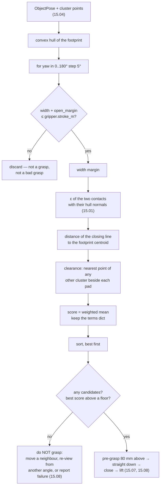

# 15.05 — Grasp planning — heuristics first, learned grasps second

<!-- glance:start -->
<!-- generated by tools/build.py from curriculum/syllabus.yaml — edit the syllabus, not this block -->

| | |
|---|---|
| **Track** | Main path |
| **Difficulty** | Advanced |
| **Time** | 1 h |
| **Hardware** | none |
| **Software** | python |
| **Prerequisites** | [15.04 Object pose for grasping — from detections and depth to a 3D pose](15.04-object-pose-estimation.md)<br>[15.02 Grippers — parallel jaw, compliant, suction](15.02-grippers.md) |
| **Skip if** | You generate and rank grasp candidates. |

<!-- glance:end -->

## What you will learn

- Enumerate every top-down grasp candidate for an object cluster, and filter the ones the gripper physically cannot make.
- Build a grasp score out of terms you can argue about one at a time, and tune it by watching each term move.
- Use [15.01](15.01-physics-of-grasping.md)'s $\varepsilon$ metric as a stability term inside a planner.
- Detect when clutter has blocked every candidate, and say what the robot should do instead of grasping.
- State precisely when a learned grasp model (Dex-Net, Contact-GraspNet, AnyGrasp) beats this heuristic, and when it does not.

## Why it matters

You now have, per object, a centre, a yaw, a width and a top height ([15.04](15.04-object-pose-estimation.md)). Turning
that into "close the jaws here, at this angle, at this height" looks like one line of arithmetic, and for one isolated
box on an empty table it is. Then the object is round, or near a wall, or too wide in one direction and fine in
another, or there are three of them and two are touching — and you discover that grasping is a **search**, not a
formula.

The reason to write the heuristic planner yourself, before reaching for a learned model, is not nostalgia. It is that
the heuristic makes every decision explicit and inspectable. When the robot picks the wrong grasp, you can print four
numbers and see *which* consideration outvoted the others, change a weight, and watch the ranking move. When a
90-million-parameter grasp network picks the wrong grasp, you can retrain it. On a robot you are building and
debugging, the first is worth a great deal more, and it is a far better baseline than people expect: for tabletop
objects that fit your jaw, a decent heuristic planner is competitive with learned models and takes 200 lines.

The honest summary of where it stops working is in Level 4, and it is specific: clutter, non-convex shapes, and
grasps that are not top-down.

<!-- prereqs:start -->
## Prerequisites

You need these first:

- [15.04 Object pose for grasping — from detections and depth to a 3D pose](15.04-object-pose-estimation.md)
- [15.02 Grippers — parallel jaw, compliant, suction](15.02-grippers.md)

### Optional prerequisite links

None.

Check your readiness: `python course.py why 15.05`
<!-- prereqs:end -->

## Concept

A grasp planner does three things, in this order: **generate**, **filter**, **rank**.

**Generate.** Fix the approach direction (straight down — you have 5 DOF and a table, and
[14.01](../14-robotic-arm/14.01-arm-anatomy.md) explained why the SO-101's compass direction is not free anyway). What
remains is one continuous parameter, the **yaw of the closing direction**, and you sample it: every 5° from 0 to 180°
gives 36 candidates. Beyond 180° you are repeating yourself, because a parallel jaw closing at $\theta$ and at
$\theta + 180°$ is the same grasp.

**Filter.** A candidate whose width exceeds the jaw's stroke is not a worse grasp, it is *not a grasp*. Throw it away
and do not let it into the score, or you will spend your life tuning a weight to express "impossible".

**Rank.** What is left needs an ordering, and this is where judgement lives. Four considerations, each of which you
can defend to someone who asks:

1. How much **jaw travel** is left after closing — margin against a wrong width estimate.
2. How **stable** the resulting pinch is — the $\varepsilon$ metric from [15.01](15.01-physics-of-grasping.md).
3. How close the closing line passes to the footprint **centroid** — the torque argument from 15.01.
4. Whether there is **room beside** the object for the fingers to come down.

Weighted mean, sorted, best first. That's it.

The temptation is to add a fifth, sixth and seventh term until the ranking looks right on the scene in front of you.
Resist it. The design rule that survives contact with a real robot is: **few terms, each with a physical meaning and a
unit you can explain, and each printed alongside the score.** The `terms` dict in the code is not debugging output; it
is the interface. `score=0.626 [width=0.33 stab=0.48 centre=0.90 clear=1.00]` tells you in one glance that this grasp
is well centred and unobstructed but tight in the jaw, which is a sentence about the world, not about a number.

> [!TIP]
> **Ask your teacher:** "Take one object and change the four score weights one at a time; show me which grasp wins in each case and why."

## Technical explanation

### Level 1 — The candidate and its geometry

```python
@dataclass(frozen=True)
class Grasp:
    position: tuple[float, float, float]   # midpoint between the pads at closing, base frame
    yaw: float                             # rotation about z of the CLOSING direction
    width: float                           # the object's width along that direction
    contacts: tuple[tuple[float, float], tuple[float, float]]
    score: float                           # 0..1, higher is better
    terms: dict[str, float]                # what the score is made of
```

The geometry runs on the cluster's **convex hull footprint**, not its raw points. That is the correct model for a jaw:
the pads approach from outside and touch the outside, so they can never enter a concavity. It is also 20 points
instead of 4000.

Three functions do all the work:

- `width_along(hull, d)` — project the hull onto the unit closing direction $d$; the width is max − min.
- `contact_points(hull, centre, d)` — the hull vertices furthest along $+d$ and $-d$, each slid onto the closing line
  through the centre so both pads act along one line.
- `hull_normal_at(hull, p)` — the inward normal of the hull edge nearest $p$, which is the direction that pad pushes.

Then the closing height:

```python
z = max(table_z + 0.004, pose.top_z - grasp_depth_m)
```

`grasp_depth_m` (15 mm by default) is how far below the top the pads close: deep enough for a real contact patch,
shallow enough not to hit the table, and clamped 4 mm above the table so the pads never scrape it. This one line is
where a 3 mm error in `top_z` ([15.04](15.04-object-pose-estimation.md)) becomes 3 mm of missing grasp depth.

### Level 2 — The four terms

Every term is normalised to $[0, 1]$ and the score is their weighted mean:

$$\text{score} = \frac{\sum_k w_k\, t_k}{\sum_k w_k}, \qquad
w = (0.30,\ 0.30,\ 0.20,\ 0.20)$$

**1. Width margin** — $t = \operatorname{clip}\!\left(\dfrac{\text{stroke} - \text{width}}{\text{stroke}},\ 0,\ 1\right)$.
A grasp that uses 90% of the stroke has 0.1 here. It is a proxy for "how wrong can my width estimate be before this
fails", and after 15.04 you know that estimate can be 8 mm out.

**2. Stability** — $t = \operatorname{clip}(\varepsilon / 0.3,\ 0,\ 1)$, where $\varepsilon$ is
`epsilon_quality()` on the two contacts with their hull normals. 0.3 is what a clean antipodal pinch scores at
$\mu = 0.6$ on a disc ([15.01](15.01-physics-of-grasping.md)), so the term is "how close to a textbook pinch is this".

**3. Centred** — $t = \operatorname{clip}(1 - \text{offset}/0.02,\ 0,\ 1)$, the distance from the pad midpoint to the
footprint centroid, saturating at 20 mm. This is the torsion argument: a closing line 20 mm off the centroid is one
your pads cannot resist rotating about.

**4. Clearance** — for each pad, look 8 mm *outside* the contact, find the nearest point of any other cluster within a
30 mm height band, and score $\operatorname{clip}(\text{dist} / 16\text{mm}, 0, 1)$. Minimum over both pads and all
neighbours.

Watch them move. The wooden block is 60 × 30 mm with its long axis at 25°, so the narrow closing direction is 115°
(`py grasp_planning.py --only terms`, an 80 mm jaw so nothing is filtered out):

```text
 yaw deg  width mm   width   stab  centre  clear   score
       0      66.8    0.16   0.00    0.89   1.00   0.427
      20      62.5    0.22   0.74    0.84   1.00   0.655
      60      66.1    0.17   0.00    0.81   1.00   0.414
      90      52.0    0.35   0.16    0.85   1.00   0.522
     110      34.8    0.57   0.47    0.89   1.00   0.689
     120      34.9    0.56   0.47    0.92   1.00   0.694
     150      58.7    0.27   0.00    0.98   1.00   0.477
```

Two things to notice, and they are the reason to look at terms rather than scores:

- At yaw 60° and 150° the **stability term is exactly zero** — those closing directions put the pads on the block's
  corners, where the hull normals diverge so far that the two friction cones do not cover the grasp line. The
  $\varepsilon$ metric caught a geometric fact that "width" alone never would.
- At yaw 20° the stability is **0.74**, higher than the winner's 0.47, and the grasp still loses — because it needs
  62.5 mm of stroke. The ranking is a genuine trade, which is why it is a weighted sum and not a lexicographic rule.

The winner is yaw 120° at 0.694, next to the geometrically narrowest direction at 115° — the extra centring beats the
0.1 mm of extra width.

### Level 3 — Filtering, and what "no candidates" means

Now the same scene with a real 45 mm jaw versus an 80 mm one (`--only ranking`):

```text
--- SO-101 jaw: stroke 45 mm, 4.7 N per pad ---
phone          no feasible top-down grasp (narrowest footprint 78 mm)
drinks can     no feasible top-down grasp (narrowest footprint 66 mm)
wooden block    3 candidates, best 2:
               (0.237, 0.059, 0.026) yaw +115.0 deg  width  30.0 mm  score 0.626  [width=0.33 stab=0.48 centre=0.90 clear=1.00]
eraser          7 candidates, best 2:
               (0.188, 0.161, 0.010) yaw  +50.0 deg  width  24.7 mm  score 0.638  [width=0.45 stab=0.40 centre=0.91 clear=1.00]
golf ball      no feasible top-down grasp (narrowest footprint 39 mm)

--- 80 mm industrial jaw: stroke 80 mm, 30.0 N per pad ---
drinks can     36 candidates, best 2:
               (0.299, -0.101, 0.101) yaw +130.0 deg  width  66.3 mm  score 0.606  [width=0.17 stab=0.84 centre=0.52 clear=1.00]
wooden block   36 candidates, best 2: ... score 0.713
golf ball      36 candidates, best 2: ... score 0.677
```

**Three of five objects are ungraspable with the stock jaw**, and the planner says so with a number instead of failing
mysteriously. That is the single most useful output of a grasp planner and the reason [15.02](15.02-grippers.md) came
first: the fix is a longer jaw link, not a better algorithm.

Note the can on the 80 mm jaw: 36 candidates, stability 0.84 (a cylinder is the ideal antipodal object — every
direction is a diameter), and yet **centre = 0.52**, because the contact-point construction on a circular hull puts
the midpoint a few millimetres off the centroid. Circles are the case where this planner's simple contact model is
weakest, and the term reports it honestly rather than hiding it.

And the friction sweep (`--only friction`), which is just [15.01](15.01-physics-of-grasping.md) showing up inside a
planner:

```text
    mu   block: best score   stab term
  0.10               0.509        0.09
  0.40               0.586        0.35
  0.90               0.666        0.62
```

Better pads do not merely let you lift more — they change which grasp the planner *chooses*, because low friction
penalises every candidate whose contacts are not perfectly opposed.

**Clutter** (`--only clutter`): two 60 × 30 mm blocks side by side, varying the gap, with the 45 mm jaw.

```text
 gap mm  objects  candidates  blocked  best yaw  best score
     12        2           6        6        90       0.489
     24        2           6        0        90       0.634
     40        2           5        0        90       0.644
     80        2           4        0        90       0.631
```

At a 12 mm gap **every candidate is blocked** and the best score drops from 0.634 to 0.489. There is no clever yaw to
switch to: the only direction the 45 mm jaw can close on a 60 × 30 mm block is across the 30 mm axis, which is exactly
the direction of the neighbour. Closing along the other axis would need 60 mm of stroke.

This is the most important thing the planner can tell you, and it is not "grasp A instead of grasp B". It is: **there
is no acceptable grasp; the robot must change the world first** — push the neighbour aside, pick it up first, or admit
it needs thinner fingers. [15.08](15.08-pick-and-place-pipeline.md) turns that into a state-machine transition. A
planner that instead returns its least-bad candidate will drive a pad into the neighbour at full torque.

### Level 4 — When to use a learned grasp model

The heuristic above assumes: a **top-down** approach, a **convex footprint**, a **parallel** jaw, and an object whose
visible footprint is close to its real one. Each assumption is a place a learned model wins.

| | heuristic (this lesson) | learned (Dex-Net / Contact-GraspNet / AnyGrasp) |
|---|---|---|
| Approach | fixed, top-down | full 6-DoF, including side and angled grasps |
| Shape model | convex hull of the footprint | raw point cloud, concavities included |
| Clutter | one hand-written clearance term | learned from millions of cluttered scenes |
| Unseen objects | fine, if they are convex and fit | fine, and better on odd shapes |
| Compute | milliseconds, CPU, on a Pi | 50–500 ms on a GPU; not on a Pi 5 |
| Debuggable | four printed numbers | a confidence score |
| Training data | none | millions of synthetic or real grasps |

The lineage is worth knowing because it explains *what the models learned*:

- **Dex-Net 2.0** (2017) trains a CNN on millions of synthetic depth images labelled by an **analytic robustness
  metric** — essentially $\varepsilon$ under pose uncertainty. The network is a fast approximation of the physics in
  [15.01](15.01-physics-of-grasping.md), not a replacement for it.
- **Contact-GraspNet** (2021) predicts grasps anchored on **observed contact points**, which cuts the search space
  from 6 DoF to 4 per point and makes single-view clutter tractable.
- **AnyGrasp** (2023) adds dense 6-DoF detection plus temporal tracking, and is commonly the "grasp skill" sitting
  under an LLM or VLM planner — which is exactly how module 18 and
  [19.01](../19-llm-robot-agents/19.01-why-llms-dont-drive-motors.md) use it.

The practical rule for this course: **use the heuristic until you can name the case it fails on.** If your objects are
tabletop, convex-ish and fit the jaw, a learned model will not improve your success rate and will cost you a GPU and
your ability to debug. When you start clearing a bin of mixed objects, it will.

> [!IMPORTANT]
> **Version-sensitive** (verified 2026-09). Off-the-shelf grasp models move fast and their licences vary: AnyGrasp's
> SDK requires a licence key, and several repositories target specific CUDA/PyTorch versions. Check the project pages
> and the current licence before building anything on one: https://github.com/NVlabs/contact_graspnet and
> https://github.com/graspnet/anygrasp_sdk
> AI teacher: verify current availability, licensing and hardware requirements before recommending one.

## Diagram

```text
 GENERATE → FILTER → RANK, on one 60 x 30 mm block (long axis at 25°)

  yaw = 0°           yaw = 25°          yaw = 90°          yaw = 115°  ◄── winner
  width 66.8 mm      width 62.5 mm      width 52.0 mm      width 30.0 mm
   ╔══════════╗       ╔════════╗          ╔═════╗            ╔═══╗
   ║          ║      ▓║        ║▓        ▓║     ║▓          ▓║   ║▓
  ▓║          ║▓      ║        ║          ║     ║            ║   ║
   ╚══════════╝       ╚════════╝          ╚═════╝            ╚═══╝
   ▲ pads here                                               ▲ pads here
   45 mm jaw: FILTERED OUT (needs 66.8 + 10 mm)              45 mm jaw: 30 + 10 ≤ 45 ✓

 THE FOUR TERMS, and what each one is really asking

   width   "how wrong can my width estimate be?"    (stroke − width) / stroke
   stab    "is this a textbook pinch?"              ε / 0.3          ← 15.01
   centre  "will it rotate in the jaws?"            1 − offset / 20 mm
   clear   "can the fingers get down beside it?"    dist_to_neighbour / 16 mm

 CLUTTER: why 'pick the best candidate' is the wrong answer

       block A            block B          the only direction a 45 mm jaw can close
      ┌────────┐ 12 mm   ┌────────┐        on a 60 x 30 block is across the 30 mm axis
      │        │◄──────► │        │        — which points straight at the neighbour.
      └────────┘         └────────┘        ALL 6 candidates blocked.
            ▲ pad wants to be HERE          → do not grasp. Move the neighbour first.
```



## Code

[`code/grasp_planning.py`](code/grasp_planning.py) is the planner. It imports the physics from
[`grasp_physics.py`](code/grasp_physics.py), the gripper from [`grippers.py`](code/grippers.py) and the perception
from [`object_pose.py`](code/object_pose.py) — the four lessons are four modules, and `plan_scene()` is 15.04 + 15.05
end to end:

```python
def plan_scene(depth, cam, T_base_optical, gripper, rng=None, voxel_m=0.010, **kw):
    """15.04 + 15.05 end to end: depth image in, ranked grasps per object out."""
    pts_optical, _ = depth_to_points(depth, cam)
    pts = transform_points(T_base_optical, pts_optical)
    table = fit_plane_ransac(pts, rng=rng)
    above = pts[table.signed_distance(pts) > 0.006]
    clusters = cluster_points(above, voxel_m=voxel_m)
    out = []
    for i, c in enumerate(clusters):
        pose = pose_from_cluster(c, table)
        obstacles = [o for j, o in enumerate(clusters) if j != i]
        out.append((pose, grasp_candidates(c, pose, gripper, table_z=table.height,
                                           obstacles=obstacles, **kw)))
    return out
```

The weights are a dataclass, on purpose — they are configuration, not magic constants buried in an expression:

```python
@dataclass(frozen=True)
class ScoreWeights:
    """Every term is 0..1 and the score is their weighted mean. Tune these, don't hide them."""
    width_margin: float = 0.30      # how much jaw travel is left after closing
    stability: float = 0.30         # epsilon metric of the two contacts (15.01)
    centred: float = 0.20           # how close the closing line passes to the footprint centroid
    clearance: float = 0.20         # room around the pads for the fingers to come down
```

and `Grasp.pre_grasp` is the waypoint [15.07](15.07-detect-and-approach.md) will actually command:

```python
@property
def pre_grasp(self) -> tuple[float, float, float]:
    """Where the gripper waits before the final straight-down approach (see 15.07)."""
    return (self.position[0], self.position[1], self.position[2] + 0.08)
```

Run it:

```bash
cd 15-manipulation/code
py grasp_planning.py                 # all four experiments (about 20 s)
py grasp_planning.py --only terms    # one object, every yaw, every term
py grasp_planning.py --only clutter  # the gap sweep
```

## Exercise

### Exercise 15.05-E1 — Predict the winning yaw `[predict]`

Hardware: none. The wooden block is 60 × 30 mm with its long axis at 25°. **Before running anything**, predict:
(a) which yaw wins with an 80 mm jaw, to the nearest 5°; (b) how many of the five demo objects the 45 mm SO-101 jaw
can grasp at all, and which; (c) what the stability term does at yaw 60° and why; (d) whether the best yaw for the
drinks can with an 80 mm jaw is well-defined. Then run `py grasp_planning.py --only terms` and `--only ranking`.

### Exercise 15.05-E2 — Implement the planner `[coding]`

Hardware: none. Implement `footprint_hull`, `width_along`, `contact_points`, `hull_normal_at` and `grasp_candidates`
from their docstrings. The tests use hand-checkable footprints — an axis-aligned rectangle, a rotated one, a regular
polygon approximating a circle — and check: widths at known angles; that no returned grasp exceeds the stroke; that
candidates come back sorted; that the stability term matches `epsilon_quality` on the same contacts; and that adding
an obstacle beside one pad drops the clearance term without changing the others.

Check it: `python course.py check 15.05` (or `py -m pytest labs/exercises/15.05`).

### Exercise 15.05-E3 — Tune the weights, and justify it `[simulation]`

Hardware: none. For each of the four terms, set its weight to 1.0 and the others to 0, and report which grasp wins on
the wooden block and on the golf ball with an 80 mm jaw. Then: (a) find a weight vector under which the planner picks
a grasp you consider clearly wrong, and explain the mechanism; (b) argue for one change to the defaults, with the
scene that motivates it; (c) explain why `width_margin` and `stability` both get 0.30 while `centred` and `clearance`
get 0.20, and whether you agree.

### Exercise 15.05-E4 — Make the planner refuse `[coding]`

Hardware: none. `grasp_candidates` currently returns its best candidate even when every one is blocked. Add a decision
layer `plan_or_refuse(pose, points, gripper, obstacles) -> Grasp | Refusal` that returns a **tagged refusal** —
`TooWide(narrowest_mm, stroke_mm)`, `Blocked(best_score, blocking_object)`, `Unstable(best_epsilon)` — with a score
floor you choose and justify. Show it refusing correctly on: the phone with a 45 mm jaw, the 12 mm-gap clutter scene,
and a 40°-tapered block at $\mu = 0.4$.

### Exercise 15.05-E5 — Grasp a shape the hull gets wrong `[design]`

Hardware: none. Build a scene containing an L-shaped object (two boxes joined at a right angle). Run the planner and
inspect the result. Then answer with evidence: (a) what does the convex hull do to the L's concave corner, and what
does the planner therefore believe about the object's width? (b) Does it return a grasp that would actually work?
(c) Name two ways to fix it — one that stays heuristic, one that does not — and say what each costs.

## Expected result

- **15.05-E1:** (a) **120°** wins at 0.694, just ahead of 115° at 0.689 — the geometrically narrowest direction is
  115° (25° + 90°), and 120° wins because it is slightly better centred. Predicting 115° counts as right. (b) **Two**:
  the wooden block (3 candidates) and the eraser (7). The phone (78 mm), the can (66 mm) and the golf ball (39 mm)
  are all filtered out — 39 mm plus 10 mm of clearance exceeds a 45 mm stroke. (c) **Exactly 0.00**: at yaw 60° the
  pads land on the block's corners, where the two hull normals diverge enough that the friction cones no longer cover
  the grasp line, so $\varepsilon = 0$ — no force closure. (d) **No** — a cylinder's footprint is a circle, so every
  closing direction is a diameter and the widths are all 66.3–66.4 mm; the winner (130°) is decided by millimetre-level
  noise in the contact construction, and the `centre` term is a poor 0.52 for the same reason.
- **15.05-E2:** `python course.py check 15.05` passes with nothing skipped (about 25 tests, a couple of seconds). The
  two that catch people: `contact_points` must project both contacts onto the closing line through the centre (or the
  two pads act along parallel but different lines and $\varepsilon$ comes out wrong), and `hull_normal_at` must flip
  the edge normal to point **into** the hull — getting the sign wrong gives $\varepsilon = 0$ everywhere, which looks
  like a physics result and is a bug.
- **15.05-E3:** On the wooden block with the 80 mm jaw: `width_margin` alone picks **yaw 115°, 30.0 mm** — the
  narrowest direction, as you would hope. `stability` alone picks **yaw 25°** with `stab=0.84` and a width of
  **60.4 mm**, i.e. it grasps the block across its *long* axis because the flat faces there are perfectly opposed —
  technically the most stable pinch and a terrible use of the jaw. `centred` alone picks **yaw 145°** with
  `centre=1.00` and `stab=0.03` — very nearly a zero-$\varepsilon$ corner grasp. `clearance` alone ties every candidate
  at 1.00 in an uncluttered scene, so the sort returns the first, **yaw 0°**, with `stab=0.00` and a 66.8 mm width:
  the worst grasp available. (a) That last one is the easiest clearly-wrong result to produce, and the mechanism is
  worth stating: a term that is constant across candidates contributes **no ordering information**, so giving it all
  the weight makes the choice arbitrary. (b) A defensible
  change: raise `clearance` above 0.20, because it is the only term expressing "this will collide", and a collision is
  categorically worse than a mediocre grasp — better still, make it a **filter** rather than a term, which is 15.05-E4.
  (c) The two 0.30 terms are the ones that decide whether the grasp *works at all*; the two 0.20 terms decide how well.
  Disagreeing is fine if you bring a scene.
- **15.05-E4:** Your refusal layer should reject the phone as `TooWide(78, 45)`, the 12 mm clutter scene as
  `Blocked(0.489, "block B")` — note all six candidates have `clear < 0.5` — and the tapered block as
  `Unstable(≈0)` since $\mu = 0.4 < \tan 40° = 0.839$ ([15.01](15.01-physics-of-grasping.md)). A reasonable score
  floor is 0.55, but justify yours from the term values rather than from the total: "refuse if `clear < 0.5` or
  `stab < 0.2`" is a better rule than "refuse below 0.55" precisely because it names the reason.
- **15.05-E5:** (a) The hull **bridges the concave corner**, so the planner sees a triangle-ish footprint that is
  wider than either arm of the L and includes empty space. (b) Usually **no**: it proposes a grasp across the bridged
  region, where one pad touches a real face and the other touches nothing until it has pushed the object. (c)
  Heuristic fix: split the cluster into convex parts (or simply grasp across a *local* width computed from the raw
  footprint along the closing line, rejecting directions where the profile has a gap) — cheap, and it handles L, T and
  U shapes. Non-heuristic fix: a learned model trained on full point clouds, e.g. Contact-GraspNet, which anchors
  grasps on observed contact points and never bridges anything — costs a GPU and your ability to explain the choice.

## Troubleshooting

### Symptom: the planner returns no candidates for an object I can clearly grasp

1. **Print the narrowest footprint width** and compare with `stroke - open_margin_m`. Nine times out of ten this is a
   stroke problem ([15.02](15.02-grippers.md)), not a planner problem.
2. **Check the perception first.** A merged cluster ([15.04](15.04-object-pose-estimation.md)) is wider than either
   object. Print `pose.extents` and compare with calipers.
3. **Check `open_margin_m`.** 10 mm of required clearance is 10 mm of stroke you cannot use; if your pose estimate is
   good to 2 mm you can justify lowering it, and you should say so in a comment.
4. Only then consider the yaw step. 5° is fine; a coarse 30° step can genuinely miss a narrow window on an elongated
   object.

### Symptom: the chosen grasp looks obviously worse than an alternative I can see

Print the `terms` dict for both. One of them is different, and it will tell you which consideration you and the
planner disagree about. Then decide whether *you* are wrong (the $\varepsilon$ term frequently sees something the eye
does not, like corner contacts) or the weights are. Change a weight, re-run, and check the change on a second scene
before keeping it — a weight tuned on one object is overfitting with extra steps.

### Symptom: the pads hit the table

`grasp_depth_m` is larger than the object is tall, so `top_z - grasp_depth_m` falls below the table and only the 4 mm
clamp saves you. Make the depth adaptive: `min(grasp_depth_m, 0.4 * object_height)`. Also check `top_z` itself — it is
the max of a noisy set and biased upward ([15.04](15.04-object-pose-estimation.md)).

### Symptom: the grasp is right in simulation and misses on the robot

The planner is almost certainly fine; the error is upstream, and it is systematic. Check in this order:
hand–eye $X$ ([15.03](15.03-hand-eye-calibration.md)) — a consistent offset in one direction is its signature; the
arm's FK and joint zeros ([14.04](../14-robotic-arm/14.04-forward-kinematics.md)); the tool frame offset (did you
change the fingers?); and only then the pose estimate. The diagnostic that separates them: command the *same* grasp
from two different arm configurations. If the miss changes, it is kinematics; if it does not, it is perception.

### Symptom: the grasp works but the object ends up rotated in the gripper

The `centred` term was low and you did not look. Print it. A closing line 15 mm off the centroid scores about 0.25,
and 15.01's arithmetic says your pads cannot resist the resulting torque unless they are wide and soft.

## Common mistakes

- **Letting infeasible candidates into the score.** "Impossible" is a filter, never a low weight.
- **Adding a fifth, sixth and seventh term.** Each new term makes the ranking less explicable and is usually a
  symptom of an upstream problem.
- **Tuning weights on one object.** Tune on at least three, including one round one and one in clutter.
- **Returning the best candidate when they are all bad.** A planner's most valuable output is sometimes "do not grasp".
- **Using the raw point cloud instead of the convex hull for the footprint.** Slower and no better — the pads touch
  the outside. (Except for concave objects, where the hull is *wrong* — see 15.05-E5.)
- **Forgetting that the yaw is only defined modulo 180°.** Sampling 0–360° doubles your work for no candidates.
- **Reaching for a learned grasp model before you can name the case your heuristic fails on.** You will gain a GPU
  dependency and lose your ability to debug.
- **Trusting the score across different grippers.** 0.626 with a 45 mm jaw and 0.713 with an 80 mm one are the same
  grasp; the width term is relative to the stroke.

## Knowledge check

1. Why does the planner sample yaw from 0° to 180° rather than 0° to 360°?
   <details><summary>Answer</summary>

   A parallel jaw is symmetric: closing along direction $d$ and along $-d$ produces the identical pair of contacts and
   the identical grasp. Sampling the second half of the circle just recomputes each candidate twice. It is the same
   180° ambiguity that makes [15.04](15.04-object-pose-estimation.md)'s PCA yaw an *axis* rather than a direction.
   </details>

2. At yaw 60° on the wooden block the stability term is exactly 0.00 while the width term is 0.17. What is the
   physical fact behind the zero?
   <details><summary>Answer</summary>

   The pads land on the block's **corners**. The inward normals of the two hull edges there diverge so far from the
   grasp line that the line leaves at least one friction cone, so the two-contact grasp has no force closure and
   $\varepsilon = 0$ ([15.01](15.01-physics-of-grasping.md)). The width term knows nothing about this — it only
   measures how far apart the extreme hull points are.
   </details>

3. Your 45 mm jaw reports "no feasible top-down grasp" for a golf ball whose measured footprint is 39 mm. Two things
   are going on. Name both.
   <details><summary>Answer</summary>

   (1) 39 mm + the 10 mm open margin = 49 mm > 45 mm of stroke, so it is correctly filtered. (2) The 39 mm is itself
   an **underestimate**: the true diameter is 43 mm, and the camera only saw a spherical cap
   ([15.04](15.04-object-pose-estimation.md)). So the object is even less graspable than the planner thinks. Both
   point to the same fix — a longer jaw — but only the second tells you not to trust "it's only 4 mm short".
   </details>

4. Predict: two blocks are 12 mm apart and every candidate has `clear < 0.5`. What should the robot do, and what
   should it *not* do?
   <details><summary>Answer</summary>

   It should **not** execute its best candidate — all six drive a pad into the neighbour, and the score only fell from
   0.634 to 0.489, which is not a large enough drop to look alarming. It should change the world: push the neighbour
   aside, pick the neighbour first, or report that it needs thinner fingers. There is no better yaw available, because
   the only direction a 45 mm jaw can close on a 60 × 30 block is the one pointing at the neighbour.
   </details>

5. You change your pads from $\mu = 0.4$ to $\mu = 0.9$. Besides lifting more, what else changes in the planner?
   <details><summary>Answer</summary>

   **Which grasp it chooses.** $\mu$ enters the stability term through $\varepsilon$, and higher friction widens every
   friction cone, so candidates whose contacts are imperfectly opposed stop being penalised. On the wooden block the
   best score rises from 0.586 to 0.666 and the stability term from 0.35 to 0.62. Low friction makes the planner
   conservative about geometry; high friction lets it consider grasps it previously scored at zero.
   </details>

6. When is a learned grasp model (Contact-GraspNet, AnyGrasp) worth its cost over this heuristic?
   <details><summary>Answer</summary>

   When one of the heuristic's assumptions actually breaks: **non-top-down** grasps (an object on a shelf, or one that
   must be grasped from the side), **concave or complex shapes** where the convex hull bridges real gaps, and
   **dense clutter** where hand-written clearance rules cannot capture what fits. For convex-ish tabletop objects that
   fit your jaw, it will not improve your success rate, and it costs a GPU plus the four printed numbers that let you
   debug a bad choice.
   </details>

7. Grasp A scores 0.626 on a 45 mm jaw; grasp B scores 0.713 on an 80 mm jaw. Is B better?
   <details><summary>Answer</summary>

   They are **the same grasp** on the same block at the same yaw — only the gripper changed. The `width_margin` term
   is relative to the stroke, so a wider jaw scores every candidate higher. Scores are comparable *within* one
   gripper and one scene, never across them. If you need a cross-gripper comparison, compare the terms that are
   absolute: $\varepsilon$ and the centroid offset in millimetres.
   </details>

## Practical challenge

Build `plan_grasps(scene_depth, cam, T_base_optical, gripper) -> GraspPlan` — the planner you would actually put in
front of an arm, with the refusal logic of 15.05-E4 and enough instrumentation to debug a bad pick after the fact.

Acceptance criteria:

- It runs 15.04 + 15.05 end to end and returns, per object, either a ranked list of grasps or a **tagged refusal**
  naming the reason and the blocking object.
- Feasibility is a **filter** (stroke, table collision, workspace box from [14.05](../14-robotic-arm/14.05-inverse-kinematics.md)),
  and the score only orders what survives.
- Every returned grasp carries its `terms` dict, the object's point count and extents, and the pre-grasp waypoint, so
  a failed pick can be explained from the log alone — no re-running required.
- It checks each grasp against IK before returning it: a grasp the arm cannot reach at the pre-grasp *and* the closing
  pose is not a grasp. (`ik_dls` from [14.05](../14-robotic-arm/14.05-inverse-kinematics.md); a converged solution is
  necessary, not sufficient — check the workspace box too.)
- A pytest suite proves: every returned grasp is within the stroke; the planner refuses the 12 mm clutter scene; it
  refuses an object that is graspable but out of the arm's reach; and the whole thing runs on `demo_scene()` in under
  five seconds.
- Produce one table for your notes: five objects × three camera tilts × two grippers, showing the chosen grasp or the
  refusal reason. Write one paragraph on what changed with tilt and why — you should be able to trace it back to
  [15.04](15.04-object-pose-estimation.md)'s width inflation.

## You can skip this if…

You can answer knowledge-check questions 2, 4 and 6 correctly without looking, and you have written a grasp candidate
generator with an explicit, inspectable scoring function and a refusal path. Then:
`python course.py skip 15.05 --reason "have built and tuned a heuristic grasp planner"`.

## Go deeper

- Bohg, Morales, Asfour & Kragic, "Data-Driven Grasp Synthesis — A Survey" (T-RO 2014) — the taxonomy that connects
  analytic grasping to learned grasping, and the known/familiar/unknown object split:
  https://arxiv.org/abs/1309.2660
- Mahler et al., "Dex-Net 2.0" (RSS 2017) — the template for "analytic metric labels synthetic data, CNN learns the
  metric": https://arxiv.org/abs/1703.09312
- Sundermeyer, Mousavian, Triebel & Fox, "Contact-GraspNet" (ICRA 2021) — 6-DoF grasps anchored on observed contact
  points, the off-the-shelf proposer to reach for first: https://arxiv.org/abs/2103.14127
- Fang et al., "AnyGrasp" (T-RO 2023) — dense 6-DoF detection plus temporal tracking, commonly used as the grasp skill
  under a VLM/LLM planner: https://arxiv.org/abs/2212.08333
- Fang et al., "GraspNet-1Billion" (CVPR 2020) — the benchmark and its evaluation protocol, if you want to measure a
  planner rather than eyeball it: https://www.graspnet.net/
- Tedrake, MIT 6.4210 *Robotic Manipulation* — the antipodal-grasp and grasp-sampling chapters, with notebooks:
  https://manipulation.csail.mit.edu/

## Progress checkpoint

- [ ] I can generate and filter top-down grasp candidates for a cluster.
- [ ] I can explain every term in my score and what it is physically asking.
- [ ] I read the `terms` dict, not just the score, when a grasp looks wrong.
- [ ] I detect "no acceptable grasp" and act on it instead of executing the least-bad candidate.
- [ ] I can name the specific case that would make me reach for a learned grasp model.

`python course.py complete 15.05` (exercises done) · `python course.py master 15.05` (challenge done) ·
`python course.py struggle 15.05 "what was hard"`

Next: [15.06 — Visual servoing — closing the loop through the camera](15.06-visual-servoing.md).
