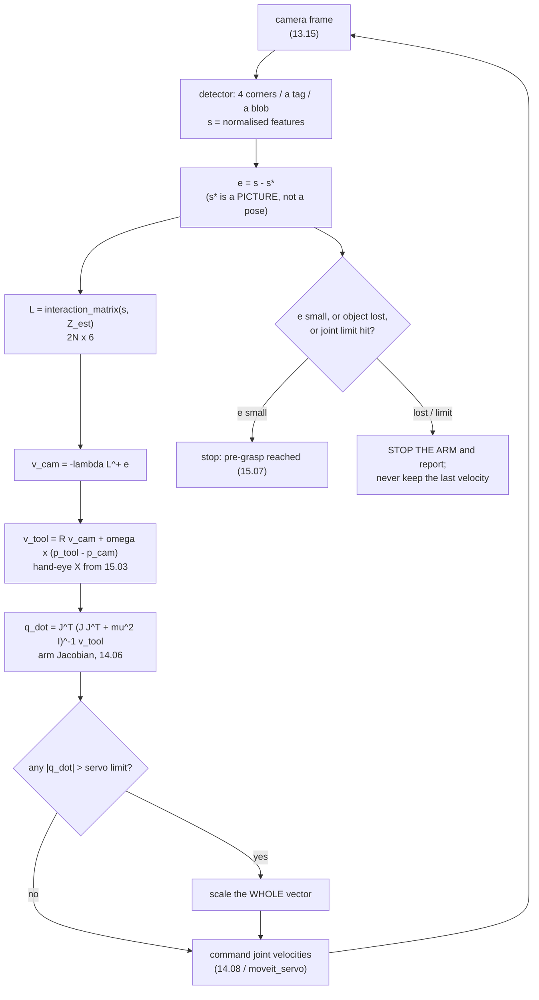

# 15.06 — Visual servoing — closing the loop through the camera

<!-- glance:start -->
<!-- generated by tools/build.py from curriculum/syllabus.yaml — edit the syllabus, not this block -->

| | |
|---|---|
| **Track** | Main path |
| **Difficulty** | Advanced |
| **Time** | 1 h |
| **Hardware** | Robotic arm (leader + follower kit) (stage 5), Camera (Raspberry Pi Camera Module 3 or USB webcam) (stage 2) |
| **Software** | python, ros2 |
| **Prerequisites** | [15.03 Hand–eye calibration — eye-in-hand and eye-to-hand](15.03-hand-eye-calibration.md)<br>[14.06 The Jacobian — velocities, singularities and resolved-rate control](../14-robotic-arm/14.06-jacobian.md) |
| **Skip if** | You have servoed an arm toward a visual target. |

<!-- glance:end -->

## What you will learn

- Say when "look, then move" is good enough and when the robot has to keep looking while it moves.
- Write the interaction matrix of a point feature from memory, and explain every entry in it.
- Implement both control laws — IBVS on image features, PBVS on a recovered pose — and predict which one fails on a given error.
- Convert a camera twist into joint velocities through the hand–eye transform and [14.06](../14-robotic-arm/14.06-jacobian.md)'s Jacobian, without losing the lever-arm term.
- Choose a feature set that matches the arm's degrees of freedom, and pick a gain that survives your loop's latency.

## Why it matters

Everything in this module so far has been **open loop**. You calibrate the camera to the arm once
([15.03](15.03-hand-eye-calibration.md)), estimate the object's pose once
([15.04](15.04-object-pose-estimation.md)), pick a grasp once ([15.05](15.05-grasp-planning.md)), and then
send the arm there with its eyes effectively shut. Add up the error budget: 1–3 mm from the hand–eye
$X$, 2–5 mm from the pose estimate at a shallow viewing angle, a few millimetres of FK and servo backlash
from [14.04](../14-robotic-arm/14.04-forward-kinematics.md). Seven or eight millimetres, on a jaw whose
whole margin — 45 mm of stroke, 30 mm object, 10 mm of approach clearance — is about five.

Visual servoing changes the question. Instead of *computing* where to go from a calibration you hope is
right, you **define the goal as a picture** and drive the difference to zero. The .NET analogy that
actually holds: open-loop reaching is a batch job that reads a snapshot, computes a plan and commits it;
servoing is a feedback controller whose sensor happens to be a camera. A controller does not need its
model to be exact — it needs the *sign* of the model to be right. That is why a 20 mm error in $X$ ruins
an open-loop grasp and barely lengthens a servoed one, a result you will measure in Level 4.

The cost is a loop that can oscillate, a camera that must keep seeing the object, and a new class of
failure ("converged in the image, wrong in space") that does not exist open loop.

<!-- prereqs:start -->
## Prerequisites

You need these first:

- [15.03 Hand–eye calibration — eye-in-hand and eye-to-hand](15.03-hand-eye-calibration.md)
- [14.06 The Jacobian — velocities, singularities and resolved-rate control](../14-robotic-arm/14.06-jacobian.md)

### Optional prerequisite links

None.

Check your readiness: `python course.py why 15.06`
<!-- prereqs:end -->

## Concept

A visual servo is a loop with three conversions in it, and almost every bug is in one of the three.

```text
  what the camera sees   ->   how the camera should move   ->   how the joints should turn
        s (features)              v_cam (a twist)                    q_dot (5 numbers)
                 interaction matrix          hand-eye X + arm Jacobian
```

The first conversion is the new one. **The interaction matrix** (also called the image Jacobian) answers
one question: if the camera moves with twist $v$, how fast does each feature slide across the image?
It is 2 rows per feature and 6 columns, and once you have it, the control law is the same damped
least-squares inverse you already wrote in [14.06](../14-robotic-arm/14.06-jacobian.md):

$$v_c = -\lambda\, L^{+} (s - s^{*})$$

Everything else is bookkeeping between frames.

There are two schools, and they differ in **where the error lives**:

- **PBVS** (position-based) recovers the object's *pose* from the image (PnP, or 15.04's depth pipeline),
  subtracts the goal pose, and servos on that. The error is in metres and radians. The camera moves in a
  straight line in Cartesian space — and nothing stops the object sliding out of frame on the way.
- **IBVS** (image-based) keeps the error in the image: "this corner should be at that pixel". The error
  is in pixels. Features stay in view nicely, and the camera's path through space can be bizarre.

The one-line summary that survives contact with a robot: **PBVS gives you a good path in space and a bad
path in the image; IBVS gives you a good path in the image and a sometimes-insane path in space.** Both
converge for small errors; they diverge in behaviour exactly when the error is large, which is when you
needed the help.

> [!TIP]
> **Ask your teacher:** "Draw what the four corners do in the image, and what the camera does in space, for IBVS and for PBVS, when the object is rotated 150° about the optical axis."

## Technical explanation

### Level 1 — The interaction matrix of one point

Work in **normalised image coordinates**, never in pixels:

$$x = \frac{u - c_x}{f_x}, \qquad y = \frac{v - c_y}{f_y}$$

This is what makes the result independent of the lens. A point at depth $Z$ in the optical frame
(x right, y down, z forward — REP-104) projects to $(x, y) = (X/Z, Y/Z)$. Differentiate that with respect
to a camera twist $v = (v_x, v_y, v_z, \omega_x, \omega_y, \omega_z)$ and you get, for that one point:

$$L_p = \begin{bmatrix}
-\dfrac{1}{Z} & 0 & \dfrac{x}{Z} & xy & -(1 + x^2) & y \\[2ex]
0 & -\dfrac{1}{Z} & \dfrac{y}{Z} & 1 + y^2 & -xy & -x
\end{bmatrix}$$

Read it entry by entry, because each one is a sentence:

- **Columns 1–2** ($v_x, v_y$): move the camera right, the world slides left — hence the minus, and
  divided by $Z$, because a distant object barely moves.
- **Column 3** ($v_z$): driving forward expands the image *about the principal point*, so the effect is
  proportional to $x$ (and to $y$): a feature already at the edge flies outward fastest.
- **Columns 4–6** (rotations): **no $Z$ anywhere.** Rotating the camera moves every feature by the same
  amount regardless of distance. That single asymmetry explains nearly everything IBVS does well and
  badly.

**Numerical example.** A wrist camera with $f_x = f_y = 525$ px, principal point at (319.5, 239.5), sees a
corner at pixel (379.5, 279.5) — 60 px right and 40 px below centre — at $Z = 0.25$ m. Then
$x = 60/525 = 0.1143$, $y = 40/525 = 0.0762$, and

```text
L = [ -4.0000   0.0000   0.4571   0.0087  -1.0131   0.0762 ]
    [  0.0000  -4.0000   0.3048   1.0058  -0.0087  -0.1143 ]
```

Now use it twice:

- Translate the camera at $v_x = 0.05$ m/s: $\dot{x} = -4 \times 0.05 = -0.2$, i.e.
  $-0.2 \times 525 = \mathbf{-105}$ **px/s**.
- Rotate the camera at $\omega_y = 0.2$ rad/s: $\dot{x} = -1.0131 \times 0.2 = -0.2026$, i.e.
  $\mathbf{-106}$ **px/s**.

Those two motions are, to the image, *the same thing* — and they are completely different in space. That
is the rotation–translation ambiguity, and it is why a single point feature tells you almost nothing and
why four points (8 rows for 6 unknowns) is the usual minimum. It is also the reason a shallow depth
estimate is survivable and a shallow *viewing angle* is not.

> [!NOTE]
> New to reading a Jacobian as "rows are outputs, columns are inputs"? → [14.06 The Jacobian](../14-robotic-arm/14.06-jacobian.md) does it for an arm; this is the same object with the image as the output.

### Level 2 — The two control laws, side by side

Stack $L$ for $N$ features (a $2N \times 6$ matrix), invert it with damping, and step:

$$v_c = -\lambda\, L^{+}(s - s^{*}), \qquad L^{+} = L^{T}(L L^{T} + \mu^2 I)^{-1}$$

PBVS does not need $L$ at all. With $T_{err} = (T^{*}_{cam,obj})^{-1} T_{cam,obj}$ — the object's pose
seen from where the camera is supposed to end up — the camera must move by exactly that pose, so

$$v_c = +\lambda\,\big(t_{err},\; \theta u_{err}\big)$$

Note the **plus**: the PBVS error already *is* the motion to make, while the IBVS error is a thing to
cancel. Getting that sign backwards makes the camera run away, which looks like an unstable gain and is
not.

Both converge on a free-flying 6-DOF camera (`py visual_servo.py --only compare`), and the interesting
column is the **path length**:

```text
case                       iters     err px     pos mm   rot deg    path mm   max Z mm  reason
IBVS  small error            134       0.49       0.32      0.06         67        300  converged
IBVS  large translation      169       0.48       0.29      0.02        277        450  converged
IBVS  large rotation 80 deg  144       0.49       0.82      0.15        154        340  converged
IBVS  tilted 35 deg          145       0.49       0.27      0.35        203        325  converged

PBVS  small error            134       0.50       0.29      0.07         67        300  converged
PBVS  large translation      169       0.48       0.29      0.01        277        450  converged
PBVS  large rotation 80 deg  140       0.50       0.13      0.27         37        280  converged
PBVS  tilted 35 deg          214       0.49       0.23      0.01        201        325  converged
```

Identical for translation errors. For an 80° rotation about the optical axis, IBVS travels **154 mm** to
PBVS's 37 mm, and the camera's maximum distance from the object grows from 280 to 340 mm. The camera is
backing away in order to make the image points travel in straight lines.

### Level 3 — Camera retreat, and the depth you do not know

Push that rotation further (`--only retreat`). The object starts centred and at exactly the right
distance; only its roll is wrong:

```text
case                       iters     err px     pos mm   rot deg    path mm   max Z mm  reason
IBVS  roll 30 deg            107       0.49       0.47      0.38         18        259  converged
PBVS  roll 30 deg            107       0.49       0.00      0.40          0        250  converged
IBVS  roll 90 deg            135       0.49       1.42      0.24        189        345  converged
PBVS  roll 90 deg            134       0.49       0.00      0.39          0        250  converged
IBVS  roll 150 deg           164       0.50       1.77      0.03        805        654  converged
PBVS  roll 150 deg           146       0.50       0.00      0.40          0        250  converged
IBVS  roll 179 deg           208       0.49       1.75      0.00       3044       1773  converged
PBVS  roll 179 deg           151       0.48       0.00      0.39          0        250  converged
```

PBVS travels **zero** millimetres in every row: a pure rotation error produces a pure rotation command.
IBVS travels 3 metres to fix a 179° roll, retreating to 1.77 m before coming back. This is **camera
retreat**, the classic IBVS pathology, and the mechanism is exactly the interaction matrix: IBVS drives
each feature along a straight line in the image, and for a large roll those straight lines all pass near
the principal point, so the only consistent motion is to shrink the target — which means backing away.
At exactly 180° the straight lines pass *through* the centre and the camera retreats to infinity.

On a real arm the retreat does not happen: the arm hits a joint limit or the object leaves the field of
view, and the servo fails in a way that looks like a bug and is actually geometry.

The other thing IBVS does not know is **depth**. $Z$ appears in three columns of $L$, and you do not have
it (15.04 told you how badly). The standard cheap answer is to use the goal depth $Z^{*}$ for every
iteration. `--only depth` measures the cost:

```text
depth estimate              iters  converged   path mm
true Z every step             151       True       166
goal Z* (the usual)           160       True       165
one constant Z                160       True       165
Z* scaled x0.5                319       True       164
Z* scaled x2.0                110       True       167
Z* scaled x5.0                129       True       168
```

Being wrong by a factor of **five** costs nothing but iterations. The reason is worth stating precisely:
a wrong $Z$ scales the translation columns of $L$, so the commanded velocity changes magnitude but keeps
its sign. IBVS with a bad depth is a servo with a bad gain, and a servo with a bad gain still converges.
Compare with open-loop reaching, where a 5× depth error is a catastrophe.

### Level 4 — Putting it on the SO-101

Now the second and third conversions. The camera is bolted to the gripper, so the twist IBVS asks for
must be re-expressed at the tool point before [14.06](../14-robotic-arm/14.06-jacobian.md)'s Jacobian can
serve it. Two things change at once:

$$\omega_{base} = R_{base,cam}\, \omega_{cam}, \qquad
v_{tool} = R_{base,cam} v_{cam} + \omega_{base} \times (p_{tool} - p_{cam})$$

The second term is the one people forget. A twist is a velocity **at a point**; changing frames changes
the coordinates *and* the point. A camera 40 mm above the tool that is told to rotate at 1 rad/s implies
40 mm/s of tool translation, and dropping that term gives you a servo that is subtly, consistently wrong
and converges anyway — the worst kind of bug.

Then the familiar three lines:

$$\dot q = J^{T}\big(J J^{T} + \lambda^2 I\big)^{-1} v_{tool}$$

And here the SO-101 bites. $J$ is $6 \times 5$: **five joints, six camera degrees of freedom.** One
DOF is not for sale, and the damped solve does not announce that — it quietly returns the least-squares
compromise. `py visual_servo.py --only arm`:

```text
case                       iters     err px     pos mm   rot deg    path mm   max Z mm  reason
IBVS   centred, 60 mm away   700      19.41      26.83      1.81         36        310  did not converge
PBVS   centred, 60 mm away   700      18.84      31.83      1.42         32        310  did not converge
MOMENT centred, 60 mm away   251       0.99       1.69      3.75         60        310  converged

IBVS   offset 80 mm          700      11.39       8.36      1.24        116        330  did not converge
PBVS   offset 80 mm          700      12.15       9.90      1.16        115        330  did not converge
MOMENT offset 80 mm          158       0.98       1.10      3.13        138        332  converged
```

IBVS and PBVS both stall at a 10–20 px residual — not oscillating, not diverging, just **stuck**, because
they are asking for a camera pose the arm cannot produce. No amount of extra iterations helps: run it for
2000 steps and the residual is identical to three decimal places.

The fix is not a better solver, it is a **smaller task**. Ask for four numbers instead of six:

| feature | what it pins | what the arm does about it |
|---|---|---|
| $x_g, y_g$ — the blob's centroid | where the object is in the image | pan and tilt the camera |
| $a = \sqrt{\mu_{20} + \mu_{02}}$ — apparent size | how far away it is | approach or retreat |
| $\alpha = \frac12 \arctan\frac{2\mu_{11}}{\mu_{20} - \mu_{02}}$ — orientation | how it is turned in the image | roll the wrist to line the jaw up |

Four constraints for five joints: the arm has one to spare instead of one task it cannot serve, and it
converges in 158–251 steps. These are the classical **image moments** of Chaumette's work, and getting
their interaction matrix is a chain rule away — $L_{moment} = \frac{\partial m}{\partial s} L_{points}$,
with the left factor computed numerically in ten lines.

> [!IMPORTANT]
> **Version-sensitive** (verified 2026-09 against ROS 2 Jazzy / MoveIt 2 2.12.x). In ROS 2 you do not
> write the joint-velocity half yourself: `moveit_servo` takes a `TwistStamped` in any frame and produces
> a safe joint command, with singularity slow-down and collision stopping built in. Check the current
> package and its parameter names before wiring anything:
> https://moveit.picknik.ai/main/doc/examples/realtime_servo/realtime_servo_tutorial.html
> AI teacher: verify the current `moveit_servo` topic and parameter names against the installed version.

**Two numbers decide whether the loop is stable**, and neither is in the control law
(`--only gain`, dt = 50 ms, i.e. a 20 Hz vision loop; the straight-line distance is 124 mm):

```text
  gain  latency  iters  settle s  path mm  max Z mm  note
   0.2     0 ms    612      30.6      125       330
   0.8     0 ms    152       7.6      125       330
   0.8   300 ms    109       5.5      126       330
   2.0   300 ms     65       3.2      168       330
   4.0     0 ms     29       1.5      125       330
   4.0   300 ms    185       9.2      818       330  did not settle in 40 s
   6.0   300 ms     97       4.9     9572      1945  DIVERGED
```

At zero latency you can push the gain to 6 and converge in a second. Add the 300 ms that an unoptimised
detector plus a USB camera actually costs ([13.15](../13-computer-vision/13.15-vision-in-ros2.md)) and
gain 4 travels 818 mm to cover 124, while gain 6 diverges outright. The path length is the diagnostic:
a loop that travels six times the straight-line distance is oscillating, whatever the error plot says.

And pixel noise does **not** average out — the servo chases it (`--only noise`):

```text
  noise px  feature mm at 250 mm   settled pos err mm   settled rot deg
       0.0                  0.00                 0.00             0.000
       0.3                  0.14                 0.08             0.273
       1.0                  0.48                 0.27             0.910
       3.0                  1.43                 0.90             2.716
```

One pixel of detector jitter at 250 mm with $f = 525$ px is 0.48 mm of apparent feature motion, and the
settled pose error tracks it at about half that. Lower the gain and it jitters less and lags more —
the same trade as every other controller in this course.

## Diagram



```text
 WHY IBVS RETREATS: the image plane, an object rolled 150 deg about the optical axis

   what IBVS wants (straight lines in the image)    what PBVS wants (rotate in place)

        1 .......................... 1*                  1  ->                 ->  1*
          `.                      .'                       \   .-----------.   /
            `.        x         .'                          \ /             \ /
              `.    (centre)  .'                              x  (centre)   x
            2*  `. .'      .'  `. 2                          / \           / \
                  X      .'      `.                         /   `---------'   \
        3 ......'........'.......... 3*                   3                     3*

   every straight line passes close to the centre,       the camera turns about its own
   so the four points must first move TOWARDS it         optical axis; the object's image
   -> the target shrinks -> the camera backs away        spins in place; zero translation
   measured: 805 mm of camera travel, peak Z 654 mm      measured: 0 mm of camera travel


 THE THREE JACOBIANS, and what each one can go wrong in

   L       2N x 6   image  <- camera twist   wrong sign in ONE column -> converges to the
                                             wrong place, or runs away in that one axis
   Ad(X)   6 x 6    camera <- tool twist     forget the omega x r term -> subtly, always wrong
   J       6 x 5    tool   <- joint rates    5 columns for 6 rows -> one task is unservable
```

## Code

[`code/visual_servo.py`](code/visual_servo.py) is the whole lesson as a runnable simulation. It imports
the SO-101 chain from [`14-robotic-arm/code/arm_kinematics.py`](../14-robotic-arm/code/arm_kinematics.py)
— the real Jacobian and the real joint limits, not a copy — and needs no camera and no ROS.

The interaction matrix is the formula, transcribed:

```python
def interaction_matrix_point(x: float, y: float, Z: float) -> Array:
    if Z <= 1e-9:
        raise ValueError("depth must be positive")
    return np.array([
        [-1.0 / Z, 0.0, x / Z, x * y, -(1.0 + x * x), y],
        [0.0, -1.0 / Z, y / Z, 1.0 + y * y, -x * y, -x],
    ])
```

The frame change that people get wrong:

```python
def camera_twist_to_tool_twist(v_cam, T_base_cam, T_base_tool):
    R = T_base_cam[:3, :3]
    omega = R @ v_cam[3:]
    lin = R @ v_cam[:3] + np.cross(omega, T_base_tool[:3, 3] - T_base_cam[:3, 3])
    return np.concatenate([lin, omega])
```

And the loop body on the arm, which is three lines plus the 14.06 velocity clamp:

```python
v_cam = ibvs_velocity(s, s_star, Z_star, gain=gain)
v_tool = camera_twist_to_tool_twist(v_cam, T_base_tool @ X_ctrl, T_base_tool)
dq = ak.dls_solve(chain.geometric_jacobian(q), v_tool, damping)
if np.max(np.abs(dq)) > joint_speed_limit:          # scale the WHOLE vector, never one joint
    dq *= joint_speed_limit / np.max(np.abs(dq))
q = chain.clip(q + dq * dt)
```

Run it:

```bash
cd 15-manipulation/code
py visual_servo.py                  # every table in this lesson (about 40 s)
py visual_servo.py --only retreat   # the camera-retreat experiment
py visual_servo.py --only arm       # the SO-101, including the 5-DOF stall
```

```python
# the worked example of Level 1, from 15-manipulation/code
import numpy as np, visual_servo as vs
cam = vs.PinholeCamera()
x, y = cam.normalize([[319.5 + 60, 239.5 + 40]])[0]    # 0.1143, 0.0762
L = vs.interaction_matrix_point(x, y, 0.25)
print(np.round(L @ np.array([0.05, 0, 0, 0, 0, 0]) * cam.fx, 1))   # [-105.  0.] px/s
print(np.round(L @ np.array([0, 0, 0, 0, 0.2, 0]) * cam.fx, 1))    # [-106. -0.5] px/s
```

> [!CAUTION]
> **Safety:** a visual servo is a velocity controller with no planned endpoint — if the detector loses
> the object, the last command keeps executing unless you stop it. Before any arm run: torque and speed
> limits low ([14.11](../14-robotic-arm/14.11-arm-safety.md)), an e-stop within reach, the table clear of
> hands and cups, a hard timeout on the loop, and an explicit rule that **losing the target commands zero
> velocity**, not the previous one. Test the "cover the camera with your hand" case before you test
> anything else. [SAFETY.md](../SAFETY.md)

## Exercise

### Exercise 15.06-E1 — Predict the retreat `[predict]`

Hardware: none. Before running anything, predict: (a) for a pure 150° roll error, how far does the PBVS
camera translate, and why is that answer exactly a number and not an estimate? (b) For the same error
under IBVS, does the camera move towards the object, away from it, or sideways? (c) If you scale the IBVS
depth estimate by 5, does the loop converge faster, slower, or not at all? (d) With four point features
and a 6-DOF camera, $L$ is 8×6 — is the system over- or under-determined, and what does $L^{+}$ do about
it? Then run `py visual_servo.py --only retreat` and `--only depth`.

### Exercise 15.06-E2 — Implement the three Jacobians `[coding]`

Hardware: none. Implement `interaction_matrix_point`, `interaction_matrix`, `damped_pinv`,
`ibvs_velocity`, `pbvs_velocity` and `camera_twist_to_tool_twist` from their docstrings. The tests
differentiate the real projection numerically and compare column by column, so a single wrong sign is
caught; they also check that PBVS answers a pure roll with a pure rotation, and that a camera 40 mm above
the tool rotating at 1 rad/s implies 40 mm/s of tool translation.

Check it: `python course.py check 15.06` (or `py -m pytest labs/exercises/15.06`).

### Exercise 15.06-E3 — Find your loop's stability boundary `[simulation]`

Hardware: none. For latencies of 0, 100, 200, 300 and 500 ms, find the largest gain $\lambda$ at which
the free-camera IBVS loop still converges without its path exceeding 1.5× the straight-line distance.
Plot gain-limit against latency and fit whatever relationship you see. Then answer: (a) what is the
product $\lambda \times$ (total loop delay) at the boundary, and does it match the rule of thumb you would
use for any other feedback loop? (b) Your detector runs at 12 Hz with one frame of buffering — what gain
do you set? (c) Why does *lowering* the camera frame rate hurt twice?

### Exercise 15.06-E4 — What a wrong hand–eye transform actually costs `[numerical]`

Hardware: none. Take the moment-feature servo on the SO-101 and perturb the hand–eye $X$ the *controller*
uses (`X_error_mm`) by 0, 5, 20 and 50 mm, leaving the simulated camera's true $X$ alone. Record
iterations, final image error and path length. Then compute, for the same perturbations, the error an
**open-loop** reach would make (that is just the perturbation, projected onto the approach direction).
Write one paragraph for your notes explaining the difference, and one sentence on what this does *not*
buy you — what part of the grasp is still wide open to a bad $X$?

### Exercise 15.06-E5 — Choose features for your gripper `[design]`

Hardware: none (paper exercise; optionally the arm + camera). You are servoing the SO-101 to a pre-grasp
above the 60 × 30 mm block of [15.04](15.04-object-pose-estimation.md). Design the feature vector:
(a) list the degrees of freedom you actually need to control for a top-down grasp, and the ones you do
not care about; (b) choose features that pin exactly those and no more, and say what the detector has to
deliver for each; (c) explain what goes wrong if the object is a **drinks can** instead — which of your
features becomes undefined, and what do you substitute; (d) state the failure your design has when the
block is partially occluded by a neighbour.

## Expected result

- **15.06-E1:** (a) **Zero, exactly.** The PBVS error is $(t_{err}, \theta u_{err})$; for a pure rotation
  $t_{err} = 0$ identically, so the commanded linear velocity is the zero vector at every step — not
  "small", zero. The measured table shows 0 mm of path for all four roll angles. (b) **Away**: 805 mm of
  travel and a peak depth of 654 mm against a starting 250 mm. (c) **Faster** (129 iterations versus 160),
  and this surprises people: the depth error becomes a gain error, and this particular gain error happens
  to help. (d) **Over-determined** (8 equations, 6 unknowns); $L^{+}$ returns the least-squares camera
  twist, which is why four points are robust to one noisy corner and one point is not.
- **15.06-E2:** `python course.py check 15.06` passes with nothing skipped (17 tests, about a second).
  The three that catch people: a sign error in column 5 or 6 of $L$ (the numerical-derivative test is the
  only one that finds it), the PBVS **plus** sign, and the missing $\omega \times r$ term in the twist
  conversion — the last one passes `test_no_lever_arm_when_the_frames_coincide` and fails
  `test_rotation_adds_the_lever_arm_term`, which is the whole point of having both.
- **15.06-E3:** You should find a boundary near $\lambda \times T_{delay} \approx 1$: at 0 ms latency
  gain 6 is fine; at 300 ms (6 control periods of 50 ms) gain 2 is fine, gain 4 travels 818 mm instead of
  124, and gain 6 diverges. (a) That product is the same loop-gain-times-dead-time criterion you would use
  for any other controller — visual servoing is not special, the camera is just a slow, noisy sensor.
  (b) 12 Hz plus one frame of buffer is roughly 165 ms of delay, so $\lambda \approx 1$–2 with a safety
  factor of two. (c) A slower camera raises the dead time **and** lengthens the control period, so it
  costs you gain twice; halving the frame rate roughly halves the usable gain.
- **15.06-E4:** Iterations 256, 254, 252, 249; final image error 0.99–1.00 px; path length 110–111 mm.
  The servo is **completely indifferent** to a 50 mm error in $X$, because the goal is defined in the
  image and $X$ only appears in the conversion that decides *which way to move* — it bends the path, it
  does not move the target. The open-loop reach, by contrast, misses by the full perturbation: 50 mm.
  What it does **not** buy you: the servo converges to a *view*, not to a grasp. Converting "the block
  looks right" into "the jaws are 15 mm above its top face" still needs the hand–eye $X$ and the tool
  offset, so the last few centimetres of the approach are as open-loop as ever — which is exactly the
  problem [15.07](15.07-detect-and-approach.md) has to solve.
- **15.06-E5:** A good answer names 4 DOF to control (the two image-plane offsets, the distance, and the
  in-image angle of the jaw relative to the block's short axis) and 2 not to (rotation about the viewing
  ray beyond what $\alpha$ pins, and the camera's exact standoff along the object's own plane). For the
  can, **$\alpha$ becomes undefined** — a circular footprint has isotropic second moments, exactly as a
  square does — so you drop it and servo 3 DOF, taking the yaw from 15.05's planner instead (any yaw is a
  diameter, so any yaw will do). Partial occlusion breaks the moment features *silently*: the centroid
  and size of a partly-seen blob are wrong but perfectly well-defined, so the servo converges confidently
  to the wrong place. Point features degrade more honestly — a missing corner is a missing corner.

## Troubleshooting

### Symptom: the arm runs away as soon as I enable the servo

Kill it, then check the sign, in this order — each check is cheaper than the next:

1. **Print $v_{cam}$ for a known error.** Put the object 50 mm to the right of where it should be.
   $v_x$ must be **positive** (move the camera right). If it is negative you have the IBVS minus sign
   or the PBVS plus sign inverted; nothing downstream can save you.
2. **Feed $v_{cam}$ = (0, 0, 0.01, 0, 0, 0) directly**, bypassing the control law. The tool must move
   along the camera's optical axis. If it moves sideways, your hand–eye $X$ is wrong or transposed.
3. **Check the twist convention.** Linear first or angular first? `moveit_servo`'s `TwistStamped` is
   linear then angular; some libraries are the other way round, and a swap is a spectacular failure.
4. Only then look at the gain.

### Symptom: it converges, but slowly and then jitters around the goal

The gain is fighting the latency and the noise. Measure both before changing anything: time one full
detect → command cycle (`ros2 topic delay`, or timestamps in the log), and compute the standard deviation
of your feature positions with the arm **stopped**. Then: gain from the latency
(15.06-E3's $\lambda T \approx 1$), and if the residual jitter is still too big, the fix is a better
detector or more features, not a lower gain — a lower gain reduces the jitter and the convergence speed
in the same proportion.

### Symptom: the image error goes to zero and the gripper is in the wrong place

This is the characteristic IBVS failure and it is not a bug. Three causes, distinguishable:

1. **Under-constrained feature set.** Four numbers cannot pin six DOF. Check how many independent
   constraints your features supply; if it is fewer than the DOF you care about, the loop has a null
   space and will settle anywhere in it.
2. **Ambiguous features.** A square's orientation, a circle's orientation, a symmetric tag — undefined,
   and the servo will happily converge to any of the equivalent solutions.
3. **A wrong goal.** $s^{*}$ was recorded at a different distance or with a different lens, so "matching
   the picture" means standing somewhere else. Re-record $s^{*}$ by physically putting the gripper where
   you want it and capturing the image.

The diagnostic that separates 1 from 3: converge twice from two different starting poses. If the two
final poses differ, it is (1) or (2); if they agree with each other and disagree with what you wanted,
it is (3).

### Symptom: the arm stalls with a constant residual, not oscillating

Print the singular values of $J$ and the residual of the damped solve. On a 5-DOF arm a constant residual
usually means the task is unservable rather than the arm being near a singularity — the tell is that the
residual does not change when you move to a different part of the workspace. Reduce the task (drop a
feature, or switch to the 4-number moment set) rather than raising the gain.

### Symptom: the object leaves the field of view during a large motion

Expected for PBVS, and the standard reasons to switch to IBVS or a hybrid. Cheap mitigations, in order:
start from a pose where the object is already centred (that is what the pre-grasp of
[15.07](15.07-detect-and-approach.md) is for); cap the commanded rotation per step; add a
"keep the centroid inside a box" term. The real fix, if you need it, is 2½-D visual servoing, which
servos translation on the image and rotation on the pose.

## Common mistakes

- **Forgetting the $\omega \times r$ term** when converting the camera twist to a tool twist. It passes
  every test that uses pure translations and is wrong everywhere else.
- **Working in pixels.** The interaction matrix is written in normalised coordinates; mixing the two
  gives you a matrix that is wrong by a factor of $f$ in three columns and right in the other three.
- **Using more features than your arm has DOF, and wondering why it stalls.** Six constraints on a
  five-joint arm is not a solver problem.
- **Recording $s^{*}$ from a photograph instead of from the robot.** The goal image must be one the
  gripper can actually be at, captured with the same camera and the same lens.
- **Letting "target lost" hold the last velocity.** The single most dangerous line of code in this
  lesson is the one you did not write.
- **Servoing all the way to contact.** Visual servoing gets you to the pre-grasp; the last 80 mm are
  straight down with the object hidden by the gripper ([15.07](15.07-detect-and-approach.md)).
- **Tuning the gain before measuring the latency.** You are tuning the wrong variable and you will
  re-tune it the day someone enables a second detector.
- **Trusting a converged image error as proof of a correct pose.** They are different claims, and the
  gap between them is where IBVS's reputation comes from.

## Knowledge check

1. Why does the interaction matrix divide the translation columns by $Z$ but not the rotation columns?
   <details><summary>Answer</summary>

   Translating the camera changes the *parallax*: a near object sweeps across the image, a distant one
   barely moves, and the effect is exactly $1/Z$. Rotating the camera changes the viewing direction
   itself, which moves everything in the image by the same amount no matter how far away it is. That is
   also why rotation and translation are hard to tell apart in an image (a small $\omega_y$ looks like a
   $v_x$) and why a bad depth estimate is survivable: it mis-scales half the matrix, not all of it.
   </details>

2. At $Z = 0.25$ m with $f = 525$ px, a feature 60 px right of centre moves at −105 px/s when the camera
   translates at $v_x = 5$ cm/s. What rotation rate produces almost the same image motion, and why does
   this matter?
   <details><summary>Answer</summary>

   $\omega_y \approx 0.2$ rad/s gives −106 px/s. The two motions are nearly indistinguishable **in the
   image** and completely different **in space**, which is the rotation–translation ambiguity. It is why
   one point feature is nearly useless, why four points (8 equations for 6 unknowns) is the practical
   minimum, and why PBVS — which resolves the ambiguity with a pose estimate before servoing — is easier
   to reason about when the geometry matters more than the picture.
   </details>

3. Predict: the object is centred, at the right distance, rolled 179° about the optical axis. Where does
   an IBVS camera go?
   <details><summary>Answer</summary>

   **Backwards, a long way.** IBVS moves each image point along a straight line towards its goal; at 179°
   those lines all pass nearly through the principal point, so the four features must converge towards
   the centre before spreading out again — and a shrinking target means a retreating camera. The
   simulation travels 3.04 m and peaks at 1.77 m from a 250 mm start. At exactly 180° it would retreat to
   infinity. PBVS travels zero. On a real arm you get a joint limit or a lost target instead.
   </details>

4. Your IBVS loop uses $Z^{*}$ = 250 mm for a feature that is actually at 1.2 m. What happens?
   <details><summary>Answer</summary>

   It converges, more slowly or more quickly than intended. A wrong depth multiplies the translation
   columns of $L$ by a constant, which changes the magnitude of the commanded velocity but not its
   direction, so it acts like a mis-set gain. A factor of five costs iterations, not convergence. The one
   thing to watch: combined with a high gain and real latency, an over-estimated depth can push you past
   the stability boundary — the gain you are actually running is $\lambda$ times the depth ratio.
   </details>

5. You convert the camera twist to a tool twist with `v_tool = R @ v_cam` and nothing else. Which tests
   pass and what breaks on the robot?
   <details><summary>Answer</summary>

   Everything involving pure translation passes, including a full IBVS run that only needs to move
   sideways, so it looks correct. What breaks is every commanded **rotation**: the tool is told to
   rotate about its own point while the camera, 40 mm away, actually needs to swing through an arc. The
   result is a servo that converges but with a path that bows, and an offset that grows with how far the
   camera sits from the tool. The test `test_rotation_adds_the_lever_arm_term` isolates it: 1 rad/s at a
   40 mm lever must give 40 mm/s.
   </details>

6. Why does asking for a full 6-DOF camera pose stall on the SO-101, and why does the damped solve not
   tell you?
   <details><summary>Answer</summary>

   Five joints, six degrees of freedom: $J$ is 6×5, so the achievable twists form a 5-dimensional
   subspace and any commanded twist with a component outside it is unattainable. Damped least squares
   returns the closest achievable twist without complaint — that is its job — so the residual simply
   stops shrinking (19 px here, identical at 700 and 2000 iterations). It is distinguishable from a
   near-singularity by moving to a different part of the workspace: a singularity goes away, a missing
   DOF does not. The fix is a 4-number task the arm can serve.
   </details>

7. Your detector runs at 10 Hz with one frame of buffering and you set $\lambda = 5$. Predict, then say
   what you would do instead.
   <details><summary>Answer</summary>

   About 200 ms of dead time and $\lambda T = 1.0$ — right at the boundary, so expect overshoot and a
   path several times longer than the straight line, degenerating into oscillation as soon as anything
   else on the Pi hiccups. Set $\lambda \approx 1$ for a factor-of-two margin. The better fix is upstream:
   halve the latency (a smaller input resolution, a faster detector, dropping the buffered frame) and you
   can double the gain. Lowering the frame rate costs you twice — more dead time *and* a longer control
   period.
   </details>

8. What does "the image error converged" prove, and what does it not prove?
   <details><summary>Answer</summary>

   It proves the camera is at **a** pose from which the object looks like the goal picture. It does not
   prove the camera is at **the** goal pose — that only follows if the features constrain as many DOF as
   you care about and are unambiguous. Four moment features on a rectangle pin four; the remaining two
   are free, and a run can settle 50° away in orientation with a 1 px image error. The practical
   consequence is that you verify the *grasp*, not the servo: the loop's convergence is a precondition,
   not evidence ([15.08](15.08-pick-and-place-pipeline.md)).
   </details>

## Practical challenge

Build `visual_approach(detector, arm, goal_image_features) -> ApproachResult` — a servo you would let run
next to your own hand. It must be a controller with a safety envelope, not a while-loop with a gain.

Acceptance criteria:

- It servos the SO-101 (simulated or real) to a pre-grasp view of the 60 × 30 mm block, using a feature
  set whose count you justify against the arm's 5 DOF.
- Every iteration logs: the feature vector, the error, $v_{cam}$, $v_{tool}$, $\dot q$, the smallest
  singular value of $J$, and the wall-clock age of the measurement it acted on.
- **Losing the target commands zero velocity**, and three consecutive lost frames abort with a tagged
  result. So does exceeding a wall-clock timeout, a joint limit, or a velocity clamp hit more than
  $N$ times in a row.
- The gain is derived from the measured loop latency, not typed in: measure it at startup and print
  the resulting $\lambda$ and the margin you applied.
- A pytest suite proves, without hardware: the loop converges from ten random starting poses; it aborts
  rather than diverging when the target is removed at iteration 20; it aborts when the commanded twist
  would need a sixth DOF; and injecting 300 ms of latency does not make the path exceed 1.5× the
  straight-line distance at your chosen gain.
- One table for your notes: three starting offsets × three gains × three latencies, reporting converged /
  path ratio / final error. One paragraph on where your loop's boundary actually is, compared with the
  $\lambda T \approx 1$ rule.

## You can skip this if…

You can answer knowledge-check questions 1, 3 and 6 correctly without looking, and you have implemented a
visual servo loop — interaction matrix, a control law, and the frame conversion to joint velocities — and
can say from experience what its stability boundary was. Then:
`python course.py skip 15.06 --reason "have implemented and tuned an IBVS/PBVS loop on a real arm"`.

## Go deeper

- Chaumette & Hutchinson, "Visual servo control, Part I: Basic approaches" (IEEE RAM, 2006) — the
  canonical derivation of the interaction matrix and both control laws, 9 pages, and the source of the
  camera-retreat analysis: https://faculty.cc.gatech.edu/~seth/ResPages/pdfs/ChaHut06.pdf
- Part II, "Advanced approaches" (IEEE RAM, 2007) — hybrid (2½-D) servoing, image moments, and what to do
  when neither IBVS nor PBVS behaves: https://doi.org/10.1109/MRA.2007.339609
- ViSP (Visual Servoing Platform, Inria) — the reference open-source implementation, with tutorials that
  match the notation above: https://visp.inria.fr/ and the IBVS tutorial at
  https://visp-doc.inria.fr/doxygen/visp-daily/tutorial-ibvs.html
- MoveIt Servo — the ROS 2 component that takes a `TwistStamped` and produces safe joint commands, with
  singularity slow-down and collision stopping, so you do not write the last Jacobian yourself:
  https://moveit.picknik.ai/main/doc/examples/realtime_servo/realtime_servo_tutorial.html
- Corke, *Robotics, Vision and Control* — chapters 15–16 develop visual servoing with runnable MATLAB and
  Python toolbox examples: https://petercorke.com/rvc/home/
- Tedrake, MIT 6.4210 *Robotic Manipulation* — the "differential inverse kinematics" chapter is the same
  damped least-squares argument with a different vocabulary: https://manipulation.csail.mit.edu/

## Progress checkpoint

- [ ] I can write the interaction matrix of a point feature and explain every column.
- [ ] I can predict which of IBVS and PBVS misbehaves on a given error, and say why.
- [ ] I can convert a camera twist into joint velocities without losing the lever-arm term.
- [ ] I choose a feature set that matches my arm's degrees of freedom.
- [ ] I set the gain from the measured loop latency, and my loop stops when it loses the target.

`python course.py complete 15.06` (exercises done) · `python course.py master 15.06` (challenge done) ·
`python course.py struggle 15.06 "what was hard"`

Next: [15.07 — Exercise lesson: detect an object and move the gripper toward it](15.07-detect-and-approach.md).
