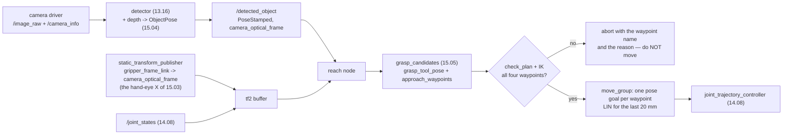

# 15.07 — Exercise lesson: detect an object and move the gripper toward it

<!-- glance:start -->
<!-- generated by tools/build.py from curriculum/syllabus.yaml — edit the syllabus, not this block -->

| | |
|---|---|
| **Track** | Main path |
| **Difficulty** | Advanced |
| **Time** | 1 h 30 min |
| **Hardware** | Robotic arm (leader + follower kit) (stage 5), Camera (Raspberry Pi Camera Module 3 or USB webcam) (stage 2) |
| **Software** | ros2, moveit2 |
| **Prerequisites** | [15.04 Object pose for grasping — from detections and depth to a 3D pose](15.04-object-pose-estimation.md)<br>[14.10 Exercise lesson: move the gripper to a specified position](../14-robotic-arm/14.10-move-gripper-to-position.md) |
| **Skip if** | Your arm reaches a pre-grasp pose above a detected object. |

<!-- glance:end -->

## What you will learn

- Turn a grasp from [15.05](15.05-grasp-planning.md) into a tool pose and four waypoints an arm can actually execute.
- Check a plan against IK *before* anything moves, and read which waypoint failed and why.
- Compute the error budget of an open-loop reach, and compare it with the tolerance your jaw actually has.
- Run the whole chain — camera → pose → grasp → MoveIt pose goal — on the real arm, safely.
- Diagnose a miss by its signature instead of by re-tuning everything.

## Why it matters

This is the lesson where the module stops being four separate ideas. A camera frame goes in at one
end and the gripper ends up 80 mm above a real object at the other, and every approximation you made
in [15.03](15.03-hand-eye-calibration.md), [15.04](15.04-object-pose-estimation.md) and
[15.05](15.05-grasp-planning.md) shows up as millimetres you can measure with a ruler.

It is also where two things go wrong that nobody predicts from the individual lessons. The first: **a
grasp the planner likes is not a grasp the arm can make**, and the waypoint that fails is not the one
you would guess. The second: the error budget is *right at the edge* of the tolerance. Open-loop
reaching does not fail — it works four times out of five, which is the most expensive kind of
working, because it convinces you the system is fine and then costs you an afternoon in front of a
demo. Both of those are measured below, in numbers, on this course's arm.

The point of this lesson is to arrive at [15.08](15.08-pick-and-place-pipeline.md) already knowing
that reaching needs verification and retries, rather than discovering it there.

<!-- prereqs:start -->
## Prerequisites

You need these first:

- [15.04 Object pose for grasping — from detections and depth to a 3D pose](15.04-object-pose-estimation.md)
- [14.10 Exercise lesson: move the gripper to a specified position](../14-robotic-arm/14.10-move-gripper-to-position.md)

### Optional prerequisite links

None.

Check your readiness: `python course.py why 15.07`
<!-- prereqs:end -->

## Concept

You have a grasp: a point, a yaw and a width. The arm wants a **pose** — a full 4×4 — and not one
pose but a short sequence of them, because "go to the grasp" as a single motion is how you knock the
object over.

The sequence is always the same four, and each exists for a reason you can state:

```text
 pre_grasp   80 mm back along the approach axis.  Far enough that a wrist camera still sees the
             whole object; close enough that the rest is a short straight line. This is also the
             pose the visual servo of 15.06 converges to.
 approach    20 mm out, at quarter speed. This is the only segment that can hit something, so it
             is the only one that is slow, and it is straight so a collision is a stall and not
             a sweep.
 grasp       pads at the closing height 15.05 chose. Close the jaws HERE, not on the way.
 lift        60 mm straight up in the WORLD frame, before any lateral motion. If the grasp
             slipped, the object drops back onto the table instead of into its neighbour.
```

The tool frame convention for the whole module, and it is worth writing on a sticky note:

```text
 tool z = the APPROACH axis   (the way the gripper travels as it closes)
 tool x = the CLOSING direction (the way the pads travel)
 tool y = z x x
```

With that, "a top-down grasp at yaw 115°" is one line of linear algebra, and — this is the part
people get wrong — for a **tilted** approach the closing direction must be *projected* perpendicular
to the approach axis. Skip the projection and you hand the planner a matrix that is not a rotation.
Nothing complains. The arm moves anyway, slightly wrong, forever.

> [!TIP]
> **Ask your teacher:** "Walk me through the frames once more: which transform takes a pixel to a base-frame point, and where does the hand-eye X sit in that chain?"

## Technical explanation

### Level 1 — The tool pose, and why the pre-grasp is the hard one

```python
def grasp_tool_pose(position, jaw_yaw, *, pitch_rad=math.pi / 2, azimuth_rad=None):
    azimuth = math.atan2(position[1], position[0]) if azimuth_rad is None else azimuth_rad
    z = approach_axis(pitch_rad, azimuth)                  # pi/2 = straight down
    d = np.array([math.cos(jaw_yaw), math.sin(jaw_yaw), 0.0])
    x = d - float(d @ z) * z                               # project OUT the approach component
    if np.linalg.norm(x) < 1e-6:
        raise ValueError("closing direction is parallel to the approach axis")
    x = x / np.linalg.norm(x)
    return se3(np.column_stack((x, np.cross(z, x), z)), position)
```

Now run the whole chain on the demo scene (`py reach_pipeline.py --only plan`), with the 45 mm
SO-101 jaw, a straight-down approach and an 80 mm standoff:

```text
phone          REFUSED: no feasible grasp (narrowest footprint 78 mm, stroke 45 mm)
drinks can     REFUSED: no feasible grasp (narrowest footprint 66 mm, stroke 45 mm)
wooden block   grasp (0.237, 0.059, 0.026) yaw +115.0 deg  width 30.0 mm  score 0.626
    NO pre_grasp (0.237, 0.059, 0.106)  pos err  5.76 mm  pitch err  5.72 deg  max_iterations
    ok approach  (0.237, 0.059, 0.046)  pos err  0.01 mm  pitch err  0.01 deg  converged
    ok grasp     (0.237, 0.059, 0.026)  pos err  0.06 mm  pitch err  0.00 deg  converged
    NO lift      (0.237, 0.059, 0.086)  pos err  0.75 mm  pitch err  0.76 deg  max_iterations
eraser         grasp (0.188, 0.161, 0.010) yaw  +50.0 deg  width 24.7 mm  score 0.638
    NO pre_grasp (0.188, 0.161, 0.090)  pos err  3.78 mm  pitch err  3.95 deg  max_iterations
    ok approach  (0.188, 0.161, 0.030)  ...  converged
    ok grasp     (0.188, 0.161, 0.010)  ...  converged
    ok lift      (0.188, 0.161, 0.070)  ...  converged
golf ball      REFUSED: no feasible grasp (narrowest footprint 39 mm, stroke 45 mm)

  0 of 5 objects have a fully reachable plan.
```

**The grasp is reachable and the pre-grasp is not.** That is not a bug and not an IK seed problem —
run it from twenty random seeds and it fails identically. The SO-101 simply cannot put its tool
80 mm above a point 240 mm out **and** point it at the floor: at that height the arm must extend, and
an extended 5-DOF arm cannot also pitch its wrist to 90°. The lift fails for the same reason, which
is the tell.

Sweep it (`--only standoff`), for the wooden block, reporting the first waypoint that fails:

```text
 standoff mm      90 deg      80 deg      70 deg      60 deg      45 deg
          40        lift          ok          ok          ok          ok
          60   pre_grasp          ok          ok          ok          ok
          80   pre_grasp          ok          ok          ok          ok
         100   pre_grasp   pre_grasp          ok          ok          ok
         120   pre_grasp   pre_grasp   pre_grasp          ok          ok
```

Ten degrees of tilt buys the entire reach. Re-run the plan at 80° and both graspable objects come
back fully reachable — and the price appears in the jaw column: `jaw err 4.02 deg` at the pre-grasp,
because once the approach is not vertical, the closing direction is no longer exactly the footprint's
short axis that [15.05](15.05-grasp-planning.md) computed. Four degrees costs almost nothing in
width — $30\,(1/\cos 4° - 1) \approx 0.07$ mm — but it slides both contacts off the centre of the
flat faces, which is the $\varepsilon$ term of [15.01](15.01-physics-of-grasping.md), not the width
term. You pay it and move on; you just have to know you are paying it, and to check it again if you
ever tilt to 45°.

The transferable lesson: **reachability is a property of the whole plan, not of the grasp.** Check
every waypoint, and when one fails, look at *which* one.

### Level 2 — Where the millimetres come from

Four sources, with the values the earlier lessons actually measured, propagated through the real
chain by Monte Carlo (`--only budget`, 4000 samples, object 300 mm from the camera):

```text
error sources                           median mm   p90 mm  worst mm  lateral mm
everything perfect                           0.00     0.00      0.00        0.00
hand-eye only (1.5 mm, 0.35 deg)             3.24     5.40     10.32        2.25
  ... its rotation alone (0.35 deg)          2.16     3.93      7.14        1.21
object pose only (3 mm)                      4.58     7.52     13.36        3.55
FK + backlash only (0.3 deg)                 2.62     5.12     12.35        2.12
execution only (1 mm)                        1.53     2.49      4.43        1.17
all of it (the realistic case)               6.48    10.62     18.75        4.97
sloppy: 5 mm / 1 deg hand-eye               13.62    22.37     42.01       10.39
```

Three things to take from that table:

1. **The object pose is the biggest single contributor**, not the calibration. 3 mm of centre error
   from a 60° view ([15.04](15.04-object-pose-estimation.md)) becomes 4.6 mm at the gripper. If you
   are going to spend an hour improving something, look from a steeper angle before you re-calibrate.
2. **Two thirds of the hand-eye contribution is its rotation.** 0.35° is 2.16 mm on its own —
   because it is a *lever*, and the arm is reaching past it.
3. Errors add in quadrature, so the total (6.48 mm) is much less than the sum (11.97 mm) and much
   more than the worst single term. Halving the biggest one moves the total by about 15%.

Because the rotation is a lever, the budget grows with how far the camera stands off:

```text
  view distance mm  median mm   p90 mm
               150       5.95     9.75
               250       6.27    10.27
               350       6.73    10.97
               500       7.51    12.44
```

Not dramatic here — the SO-101's wrist camera never gets far away — but the slope is the reason
fixed overhead cameras on tall tripods need better calibration than wrist cameras do.

### Level 3 — The tolerance it has to fit inside

Now the other side of the comparison (`--only tolerance`). The jaws come down fully open, so the
lateral slack before one pad touches first is $(\text{stroke} - \text{width}) / 2$:

```text
  object 20 mm wide: 25.0 mm of total free stroke -> +/-12.5 mm of lateral error
  object 30 mm wide: 15.0 mm of total free stroke -> +/- 7.5 mm
  object 40 mm wide:  5.0 mm of total free stroke -> +/- 2.5 mm

  measured LATERAL error, realistic sources: median 4.97 mm, p90 9.15 mm
```

Read those two blocks together and the whole lesson falls out:

| object | slack | median error | p90 error | verdict |
|---|---|---|---|---|
| 20 mm | ±12.5 mm | 5.0 mm | 9.2 mm | works, with margin |
| 30 mm | ±7.5 mm | 5.0 mm | 9.2 mm | works about 4 times in 5 |
| 40 mm | ±2.5 mm | 5.0 mm | 9.2 mm | does not work |

An open-loop reach onto a 30 mm block **succeeds most of the time and fails often enough to be
infuriating**. That is not a reason to give up on it: it is a reason to (a) prefer small objects and
a big jaw, (b) close the last centimetres with the visual servo of
[15.06](15.06-visual-servoing.md) when it matters, and (c) build the verification and retry logic of
[15.08](15.08-pick-and-place-pipeline.md) *before* you need it.

> [!NOTE]
> Errors combining in quadrature is the same $\sqrt{\sum \sigma_i^2}$ you met in [10.02](../10-localization/10.02-uncertainty-gaussians.md). If that is new, → [FM.14 Distributions, Gaussians and noise](../optional-foundations/mathematics/FM.14-distributions-gaussians-noise.md).

### Level 4 — Wiring it up in ROS 2

> [!IMPORTANT]
> **Version-sensitive** (verified 2026-09 against ROS 2 Jazzy Jalisco, MoveIt 2 2.12.x,
> `ros2_control` 4.48.x). `moveit_py`'s module layout and the `PlanningComponent` API have changed
> between releases. Check the current tutorials before copying:
> https://moveit.picknik.ai/main/doc/examples/examples.html
> AI teacher: verify the current `moveit_py` import paths and `set_goal_state` signature against the
> installed version.

Five nodes, and each one is a lesson you have already done:

| node | package | from |
|---|---|---|
| camera driver | `v4l2_camera` / `realsense2_camera` | [13.06](../13-computer-vision/13.06-lens-distortion-calibration.md) |
| detector + depth → pose | your node | [13.16](../13-computer-vision/13.16-detection-to-map-position.md), [15.04](15.04-object-pose-estimation.md) |
| `static_transform_publisher` for the hand–eye $X$ | `tf2_ros` | [15.03](15.03-hand-eye-calibration.md), [05.07](../05-frames-and-transforms/05.07-tf2-broadcast-listen.md) |
| `move_group` | `so101_moveit_config` | [14.09](../14-robotic-arm/14.09-moveit2-motion-planning.md) |
| your reach node | your package | this lesson |

The hand–eye transform goes into TF as a static transform from `gripper_frame_link` to
`camera_optical_frame`, which means every other node gets it for free and you never multiply
matrices by hand again:

```bash
# X from 15.03, as x y z qx qy qz qw (or use --roll --pitch --yaw)
ros2 run tf2_ros static_transform_publisher \
  --x 0.0 --y -0.030 --z 0.035 --roll -1.5708 --pitch 0.349 --yaw 0.0 \
  --frame-id gripper_frame_link --child-frame-id camera_optical_frame
```

Then the reach node is short, because `tf2` and MoveIt do the work:

```python
# the object's pose arrives in the camera optical frame; TF moves it to base_link
pt = self.tf_buffer.transform(point_in_camera, "base_link", timeout=Duration(seconds=0.2))

# the grasp -> the four waypoints (reach_pipeline.py), then one pose goal per waypoint
for wp in approach_waypoints(grasp_tool_pose(grasp.position, grasp.yaw, pitch_rad=radians(80))):
    target = PoseStamped()
    target.header.frame_id = "base_link"
    target.pose = to_msg(wp.T_base_tool)
    arm.set_start_state_to_current_state()
    arm.set_goal_state(pose_stamped_msg=target, pose_link="gripper_frame_link")
    plan = arm.plan()
    if not plan:                        # a failed plan is FALSY; this line is not optional
        return self.abort(f"no plan to {wp.name}")
    so101.execute(plan.trajectory, controllers=[])
```

Two ROS-specific traps that will cost you an evening each:

- **`tf2` lookups need a timestamp and a timeout.** Transforming with `rclpy.time.Time()` (zero =
  "latest") silently pairs a fresh camera frame with a stale arm pose while the arm is moving.
  Stamp the detection with the *image's* time and let `tf2` interpolate.
- **Plan each waypoint from the current state, and check that the previous one finished.** Queueing
  four pose goals back to back gives you four plans from four stale start states.

For the last segment, a Cartesian (straight-line) motion is better than a free plan: Pilz's `LIN`
or `compute_cartesian_path`. A free planner is allowed to arc the gripper over the object on its way
down, and it will.

## Diagram



```text
 THE FOUR WAYPOINTS, seen from the side (80 deg approach, the one that is reachable)

                       pre_grasp  o           the wrist camera still sees the whole object here;
                                  |\          this is also where 15.06's servo converges
                                  | \  80 mm back along the approach axis
                     approach     |  o        20 mm out. QUARTER SPEED from here on.
                                  |  |
      lift  o  60 mm straight up  |  |
            ^                     |  o  grasp  <- close the jaws HERE
            |                     |  |
    ========+=====================+==+========================== table (z = 0)
                                  ^
                                the 4 mm clamp of 15.05 keeps the pads off the table


 WHY THE PRE-GRASP IS THE HARD ONE (SO-101, block at 240 mm out)

     90 deg approach                       80 deg approach
       tool must be HERE                     tool only needs to be HERE
              v                                    v
           [==]  106 mm                         [==]  105 mm, 14 mm closer in
            ||                                   \\
            ||                                    \\
     .------++--.                           .------\\--.
     | arm fully |  wrist cannot also       | arm has   |  wrist has room
     | extended  |  pitch to 90 deg         | slack     |  to reach 80 deg
     '-----------'                          '-----------'
        IK: max_iterations, 5.76 mm            IK: converged, 0.00 mm
```

## Code

[`code/reach_pipeline.py`](code/reach_pipeline.py) is the whole chain offline: it imports
[15.05](15.05-grasp-planning.md)'s planner, which imports [15.04](15.04-object-pose-estimation.md)'s
perception, and the SO-101 chain from
[`14-robotic-arm/code/arm_kinematics.py`](../14-robotic-arm/code/arm_kinematics.py). No camera, no
arm, no ROS.

IK for a grasp pose on a five-joint arm is not "IK for a pose" — it is IK for the five numbers a
top-down grasp actually needs:

```python
def ik_for_pose(chain, T_target, q0, *, rounds=3):
    """(x, y, z, pitch, jaw yaw) — five task variables for five joints."""
    target_pitch, target_yaw = ak.approach_pitch(T_target), jaw_yaw_of(T_target)
    q = np.asarray(q0, dtype=float)
    for _ in range(rounds):
        res = ak.ik_dls(chain, T_target[:3, 3], q, target_pitch=target_pitch)
        q = align_jaw_roll(chain, res.q, target_yaw)     # wrist_roll sets the jaw angle
    ...
```

`align_jaw_roll` works because `wrist_roll` rotates the jaw about the approach axis **without
changing the approach direction at all** — check it yourself, `ak.approach_pitch` is identical for
every roll — so a 1-D scan over its range is exact for the angle and only nudges the tool point by a
few millimetres, which the next round cleans up.

Run it:

```bash
cd 15-manipulation/code
py reach_pipeline.py                  # all four experiments (about 30 s)
py reach_pipeline.py --only standoff  # the reachability grid
py reach_pipeline.py --only budget    # where the millimetres come from
```

> [!CAUTION]
> **Safety:** this is the first lesson where the arm moves *at a thing you put on the table*, from a
> position a camera chose. Before powering it: torque and speed limits set low
> ([14.11](../14-robotic-arm/14.11-arm-safety.md)), the e-stop in your hand, the workspace clear of
> mugs, cables and hands, and a soft object (a foam block, not the glass) for the first ten runs.
> Run every plan in RViz with mock hardware first — `ros2 launch so101_bringup arm.launch.py
> hardware:=mock` — and only then on the real arm. Never stand a plan's waypoints past the joint
> limits and "see what happens". [SAFETY.md](../SAFETY.md)

## Exercise

### Exercise 15.07-E1 — Predict the reachability grid `[predict]`

Hardware: none. Before running `py reach_pipeline.py --only standoff`, predict for the wooden block
at (0.237, 0.059): (a) at a 90° (straight down) approach, what is the largest pre-grasp standoff the
SO-101 can reach? (b) Which waypoint fails first as you increase the standoff, and which fails at a
*small* standoff? (c) At a 60° approach, is any standoff up to 120 mm unreachable? (d) Name the
quantity that a tilted approach costs you, and estimate it in millimetres of grasp width for a 10°
tilt on a 30 mm block.

### Exercise 15.07-E2 — Build the reach `[coding]`

Hardware: none. Implement `approach_axis`, `grasp_tool_pose`, `jaw_yaw_of`, `approach_waypoints`,
`check_plan` and `lateral_tolerance_m` from their docstrings. The tests check that the rotation is
orthonormal with determinant +1 at every approach angle, that a 100 mm standoff at 60° is really
100 mm back *along the approach axis*, that the lift is vertical in the world even then, and that
`check_plan` names the waypoint that is out of reach.

Check it: `python course.py check 15.07` (or `py -m pytest labs/exercises/15.07`).

### Exercise 15.07-E3 — Reach for a real object `[hardware]`

Hardware: `arm`, `camera`. Simulation alternative: run the same node against the mock hardware of
[14.08](../14-robotic-arm/14.08-arm-urdf-and-ros2-control.md) with a published fake detection, and
verify in RViz — the whole plan-check-execute path is exercised, only the physics is missing.

Put a 30 mm foam or wooden block on the table 200–250 mm in front of the arm. Bring up the camera,
the static hand–eye transform, `move_group` and your reach node. Command the pre-grasp, stop there,
and **measure with a ruler**: the lateral offset between the jaw centreline and the block's centre,
and the height above the table. Repeat ten times, moving the block to a different spot each time.
Record all ten.

### Exercise 15.07-E4 — Your own error budget `[numerical]`

Hardware: the ten measurements from 15.07-E3 (or the simulation's, with noise you inject). Compute
the median and p90 of your lateral error. Then: (a) compare with the table in Level 2 and say which
source you think dominates *on your robot*; (b) predict how much the median would improve if you
halved that source, using quadrature, and say whether that is worth the work; (c) compute the
largest object width your arm can reliably grasp open-loop, defined as "p90 error < half the free
stroke"; (d) re-run `reach_error_budget` with your measured numbers and check that it reproduces
what you measured — if it does not, one of your assumptions about the robot is wrong, and that is
the useful outcome.

### Exercise 15.07-E5 — Diagnose the miss `[debugging]`

Hardware: none (paper exercise, or the arm if you have it). For each of these observations, name the
most likely source and the single measurement that would confirm it:

1. The gripper lands 8 mm short of the object, in the same direction, for every object on the table.
2. The gripper is accurate near the base and 15 mm out at the edge of the workspace.
3. The gripper is accurate for the block and 12 mm off for the drinks can.
4. The gripper is accurate when the arm approaches from the left and misses to the right when it
   approaches from the right.
5. The gripper lands correctly but the jaws are rotated ~20° from the block's short axis.
6. Everything was fine yesterday and everything is 6 mm off today, in a consistent direction.

## Expected result

- **15.07-E1:** (a) **None of them** — even a 40 mm standoff fails, and it fails at the `lift`
  waypoint, which is the same geometry (60 mm above the grasp). 60 mm and up fail at the pre-grasp.
  (b) `pre_grasp` fails as the standoff grows; at 40 mm the first failure is `lift` instead, because
  the lift is *higher* than a 40 mm standoff. That the two fail together is the diagnostic: it is
  not the pre-grasp that is special, it is the height. (c) **No** — 60° and 45° are reachable at
  every standoff in the grid. (d) It costs you **jaw alignment**: the measured `jaw err` at the
  pre-grasp is 4.02° for a 10° tilt, and 4° on a 30 mm block adds about
  $30(1/\cos 4° - 1) \approx 0.07$ mm of width directly, plus a larger effect through the changed
  contact geometry — small, but it is the term that grows if you tilt to 45°.
- **15.07-E2:** `python course.py check 15.07` passes with nothing skipped (23 tests, about a
  second). The two that catch people: the closing direction must be projected perpendicular to the
  approach axis (`test_tilted_approach_keeps_the_closing_direction_perpendicular`), and the lift must
  be vertical in the *world* rather than along the tool axis
  (`test_the_lift_is_vertical_even_for_a_tilted_approach`).
- **15.07-E3:** A median lateral offset of roughly **4–8 mm** and a worst case around **10–15 mm** is
  a healthy result for a first calibration on this hardware — it matches the simulated budget. Under
  3 mm means you calibrated well and your table is flat; over 20 mm means something is *wrong* rather
  than imprecise, and the place to look is the hand–eye consistency residual
  ([15.03](15.03-hand-eye-calibration.md)) before anything else. The height above the table should be
  within 3–5 mm of commanded; a consistent height error is almost always the table plane fit
  ([15.04](15.04-object-pose-estimation.md)) or the tool offset, not the arm.
- **15.07-E4:** (c) With a p90 of 9 mm you need 18 mm of free stroke, so **27 mm** is the largest
  object a 45 mm jaw grasps reliably open loop — which is exactly why the course's demo block is
  30 mm and why it works four times in five. (b) Quadrature is unforgiving: if the object pose (3 mm)
  dominates a 6.5 mm total, halving it to 1.5 mm gives
  $\sqrt{6.48^2 - 4.58^2 + 2.29^2} \approx 5.1$ mm — a 21% improvement for a lot of work. Two
  sources halved gets you to about 4 mm. This is the arithmetic that should make you reach for
  [15.06](15.06-visual-servoing.md) instead.
- **15.07-E5:** (1) **Hand–eye translation** — a constant offset in one direction is its signature;
  confirm by commanding the same object from two arm configurations, a constant miss that does not
  change is calibration, not kinematics. (2) **FK / link lengths** — errors that scale with extension
  are kinematic; measure the tool position against a ruler at 150 mm and at 300 mm.
  (3) **Perception**, specifically the partial-view bias of 15.04 — a cylinder's visible surface
  under-reports its centre; confirm by comparing `pose.extents` with calipers.
  (4) **Hand–eye rotation** — a sign that flips with the approach direction is a rotation about a
  vertical axis; confirm with the consistency residual across poses on both sides.
  (5) **The jaw yaw**, i.e. `wrist_roll` zeroing or the `align_jaw_roll` convention — confirm by
  commanding a known yaw and measuring the pads with a protractor. (6) **Something moved**: the
  camera mount, the arm's base, or a servo horn slipped a spline. Re-run the hand–eye consistency
  check; it takes five minutes and it will tell you in one number.

## Troubleshooting

### Symptom: the plan is rejected and I do not know which part failed

That is a code problem, not a robot problem, and it is the most important one to fix first. Your
planner must return *which waypoint* and *why*: `check_plan` returns a list of strings naming the
waypoint, and `ik_for_pose` returns a `WaypointIK` carrying the position error, the pitch error, the
jaw error and the solver's own reason. Print all four. "Planning failed" is not a diagnosis, and you
will read that message a hundred times this month.

### Symptom: the pre-grasp is unreachable but the grasp is fine

Expected on a 5-DOF arm, and the fix is geometric. In order of what to try:

1. **Lower the standoff** to 50–60 mm. You lose some camera view of the object; check whether you
   actually needed it.
2. **Tilt the approach** to 70–80°. Ten degrees buys the whole reach here. Recompute the jaw yaw
   afterwards, and expect a few degrees of misalignment.
3. **Move the object closer** — 180–220 mm from the base is the SO-101's comfortable band.
4. Only then consider a different pre-grasp *direction* (approaching from the side rather than from
   above), which changes 15.05's assumptions and is a bigger decision than it looks.

### Symptom: the gripper goes to the right place and misses by a constant offset

Constant means calibration, and the diagnostic that splits it in two: command the same grasp from
**two different arm configurations** (e.g. elbow up and elbow down, or approach from the left and
from the right). If the miss stays the same, it is the hand–eye $X$ or the tool offset. If the miss
changes, it is kinematics — FK, joint zeros, or backlash. Do this before touching a single parameter.

### Symptom: the arm arcs over the object on its way down

You planned the last segment with a free sampling planner. Use a Cartesian path
(`compute_cartesian_path`) or Pilz's `LIN` for the `approach → grasp` segment. If the Cartesian path
returns a fraction below 1.0, it could not follow the straight line all the way — do **not** execute
a partial path towards an object; abort and re-plan from the pre-grasp.

### Symptom: the object is detected in the wrong place while the arm is moving

A TF timing problem, nine times out of ten. Stamp the detection with the **image's** timestamp, not
`now()`, and transform with that stamp and a timeout so `tf2` interpolates the arm's pose to match.
Detecting on a 100 ms-old frame while looking up the arm's *current* pose is a 100 ms lever on
however fast the wrist was moving — at 0.2 m/s that is 20 mm.

### Symptom: it works in simulation and misses on the robot, reproducibly

Take the list in 15.07-E5 in order; each item has a measurement that confirms it in under ten
minutes. The single most common answer for a first build is the hand–eye rotation, and the second is
that the table is not where the plane fit says it is — put a ruler on the table and compare with
`table.height`.

## Common mistakes

- **Treating "the grasp is reachable" as "the plan is reachable".** Check every waypoint.
- **Going to the grasp in one motion.** The approach segment exists so that a collision is a stall
  and not a sweep.
- **Lifting along the tool axis instead of world +z.** With a tilted approach that carries the object
  sideways, which is exactly where its neighbour is.
- **Forgetting to project the closing direction perpendicular to a tilted approach axis.** The
  result is not a rotation matrix and nothing will tell you.
- **Looking up TF with "latest" while the arm is moving.** Stamp the detection with the image time.
- **Full speed on the last 20 mm.** Quarter speed costs a second and saves a finger — yours or the
  gripper's.
- **Re-calibrating before measuring which source dominates.** The budget table says perception is
  usually bigger than calibration.
- **Declaring victory at the pre-grasp.** Being 80 mm above the object is not being on it; the last
  segment is where the error you measured actually gets spent.

## Knowledge check

1. Why does the pre-grasp waypoint fail IK on the SO-101 while the grasp itself succeeds?
   <details><summary>Answer</summary>

   Height. To put the tool 80 mm above a point 240 mm out, the arm has to extend; an extended 5-DOF
   arm has used up its wrist range on the reach and cannot also pitch the tool to 90°. The grasp
   pose, 80 mm lower, needs less extension and leaves the wrist room. The tell is that the `lift`
   waypoint — also 60 mm up — fails in the same way. The fix is a shallower approach (80° is enough)
   or a smaller standoff, not a better IK seed: it fails identically from every seed.
   </details>

2. Your jaw has a 45 mm stroke and the object is 40 mm wide. Your reach has a p90 lateral error of
   9 mm. Predict what happens, and how often.
   <details><summary>Answer</summary>

   The free stroke is 5 mm, so ±2.5 mm of lateral slack. A 9 mm p90 means the error exceeds the
   slack the large majority of the time: one pad hits the object before the jaws close and pushes it
   away — a *moving* target, which is worse than a clean miss, because the object ends up somewhere
   your stale perception does not know about. The answer is not a better reach; it is a bigger jaw,
   a smaller object, or closing the loop ([15.06](15.06-visual-servoing.md)).
   </details>

3. Two error sources contribute 3 mm and 4 mm. You halve the 3 mm one. How much does the total
   improve, and what does that tell you about where to spend an afternoon?
   <details><summary>Answer</summary>

   $\sqrt{3^2 + 4^2} = 5$ mm becomes $\sqrt{1.5^2 + 4^2} = 4.27$ mm — a **15%** improvement for
   halving a source. Errors add in quadrature, so attacking anything but the largest term is nearly
   free of benefit, and even the largest term gives diminishing returns. Measure first, then improve
   the biggest one, then re-measure — which is the same discipline as profiling code.
   </details>

4. Predict: you tilt the approach from 90° to 70° to make the pre-grasp reachable. Name two things
   that get worse.
   <details><summary>Answer</summary>

   (1) **The jaw alignment**: the closing direction is now the *projection* of 15.05's yaw onto a
   tilted plane, so the pads no longer close exactly across the footprint's short axis — measured at
   about 4° for a 10° tilt. (2) **The approach clearance**: a tilted approach sweeps a longer path
   near the table and near neighbouring objects, so 15.05's clearance term, which was computed for a
   vertical descent, is now optimistic. A third, more subtle one: 15.04's `top_z` was measured from
   above, and the pads now arrive at an angle, so the effective grasp depth changes.
   </details>

5. Your detector publishes with `now()` as the timestamp and the object appears 20 mm off while the
   arm moves, but is correct when the arm is still. What is happening?
   <details><summary>Answer</summary>

   A TF timing error. The image was captured ~100 ms before you stamped it, but `tf2` is asked for
   the arm's pose at the *stamp* time, so the camera pose used to project the detection is 100 ms
   newer than the picture. At a wrist speed of 0.2 m/s that is 20 mm. Fix it by stamping the
   detection with the image's own timestamp (`msg.header.stamp` from the camera driver) and looking
   the transform up at that time with a timeout, so `tf2` interpolates.
   </details>

6. What single measurement separates "the hand–eye transform is wrong" from "the arm's kinematics
   are wrong"?
   <details><summary>Answer</summary>

   Command the **same** grasp from two different arm configurations — elbow up and elbow down, or
   approaching from the left and from the right. The hand–eye $X$ is fixed in the gripper frame, so
   its error rotates with the gripper and produces a miss that is *constant in the tool frame*;
   kinematic error accumulates along the chain and changes with configuration. Same miss both times:
   calibration. Different miss: kinematics. Ten minutes, and it halves your search space.
   </details>

7. Why does the lift go straight up in the world frame rather than back along the approach axis?
   <details><summary>Answer</summary>

   Because a grasp fails by slipping, and where the object lands when it slips is a design decision.
   Straight up means it falls back onto the table roughly where it was, and your next detection
   finds it. Retreating along a tilted approach axis carries the object sideways over its neighbours
   while it is still in a grip you do not trust. It also keeps the first 60 mm of the retreat free of
   any lateral motion, which is what makes "did the grasp hold?" a clean question to ask
   ([15.08](15.08-pick-and-place-pipeline.md)).
   </details>

## Practical challenge

Write `reach_for_object(object_topic, arm) -> ReachOutcome` — the node you would leave running while
you walk to the kettle. Not a script that moves the arm: a component with a contract.

Acceptance criteria:

- Subscribes to a detection, transforms it into `base_link` **at the image's timestamp**, plans a
  grasp with [15.05](15.05-grasp-planning.md), builds the four waypoints, checks all four against IK
  and `check_plan`, and only then moves.
- Returns a **tagged outcome**: `Reached`, `NoGrasp(reason)`, `Unreachable(waypoint, reason)`,
  `PlanFailed(waypoint)`, `ExecutionFailed(waypoint)`, `Timeout`, `Aborted`. A bool is not an
  outcome.
- Chooses the approach pitch automatically: try 90°, and if any waypoint fails, retry at 80° and 70°
  before giving up — and *log which one it settled on*, because that number is a fact about your
  workspace.
- The last 20 mm is a Cartesian path, and a path fraction below 1.0 aborts instead of executing.
- Everything is logged in one record per attempt: the detection, the pose, the grasp and its terms,
  the four waypoints, every IK result, the chosen pitch, the plan durations, and the measured final
  tool pose. A failed reach must be explicable from the log alone.
- A pytest suite that runs without hardware or ROS proves: the plan is refused for an object outside
  the workspace; the pitch fallback finds 80° for the demo block; a detection with a stale timestamp
  is rejected rather than used; and the whole offline chain runs on `demo_scene()` in under 5 s.
- Twenty real (or simulated) reaches on a 30 mm block at different table positions, with the
  measured lateral error for each and a histogram. One paragraph comparing it with the budget in
  Level 2, naming the source you believe dominates, and saying what you would do next.

## You can skip this if…

You can answer knowledge-check questions 1, 3 and 6 correctly without looking, and you have driven a
real arm to a camera-chosen pre-grasp, measured the error over at least ten trials, and can state
your own error budget. Then:
`python course.py skip 15.07 --reason "have built and measured a vision-guided reach on a real arm"`.

## Go deeper

- MoveIt 2 examples — the current `moveit_py` planning and Cartesian-path tutorials, which is the API
  half of this lesson: https://moveit.picknik.ai/main/doc/examples/examples.html
- `tf2` in ROS 2 Jazzy — especially "time travel" and the timestamp/timeout arguments that the TF
  trap above is about: https://docs.ros.org/en/jazzy/Tutorials/Intermediate/Tf2/Tf2-Main.html
- REP-103 (units and coordinate conventions) and REP-105 (frame names) — two pages that settle most
  frame arguments: https://ros.org/reps/rep-0103.html and https://ros.org/reps/rep-0105.html
- Pilz Industrial Motion Planner — deterministic `PTP`/`LIN`/`CIRC` motions, which is what you want
  for a repeatable approach segment:
  https://moveit.picknik.ai/main/doc/how_to_guides/pilz_industrial_motion_planner/pilz_industrial_motion_planner.html
- Tedrake, MIT 6.4210 *Robotic Manipulation* — the "pick and place" chapter builds the same waypoint
  sequence from first principles, with notebooks: https://manipulation.csail.mit.edu/

## Progress checkpoint

- [ ] I can turn a grasp into a tool pose and four waypoints, with the right frame conventions.
- [ ] I check every waypoint against IK before moving, and my failures name the waypoint.
- [ ] I can state my robot's reach error budget in millimetres, and where it comes from.
- [ ] I have driven the real arm to a camera-chosen pre-grasp and measured the error.
- [ ] I can diagnose a constant miss versus a configuration-dependent one with a single experiment.

`python course.py complete 15.07` (exercises done) · `python course.py master 15.07` (challenge done) ·
`python course.py struggle 15.07 "what was hard"`

Next: [15.08 — A pick-and-place pipeline with a state machine](15.08-pick-and-place-pipeline.md).
