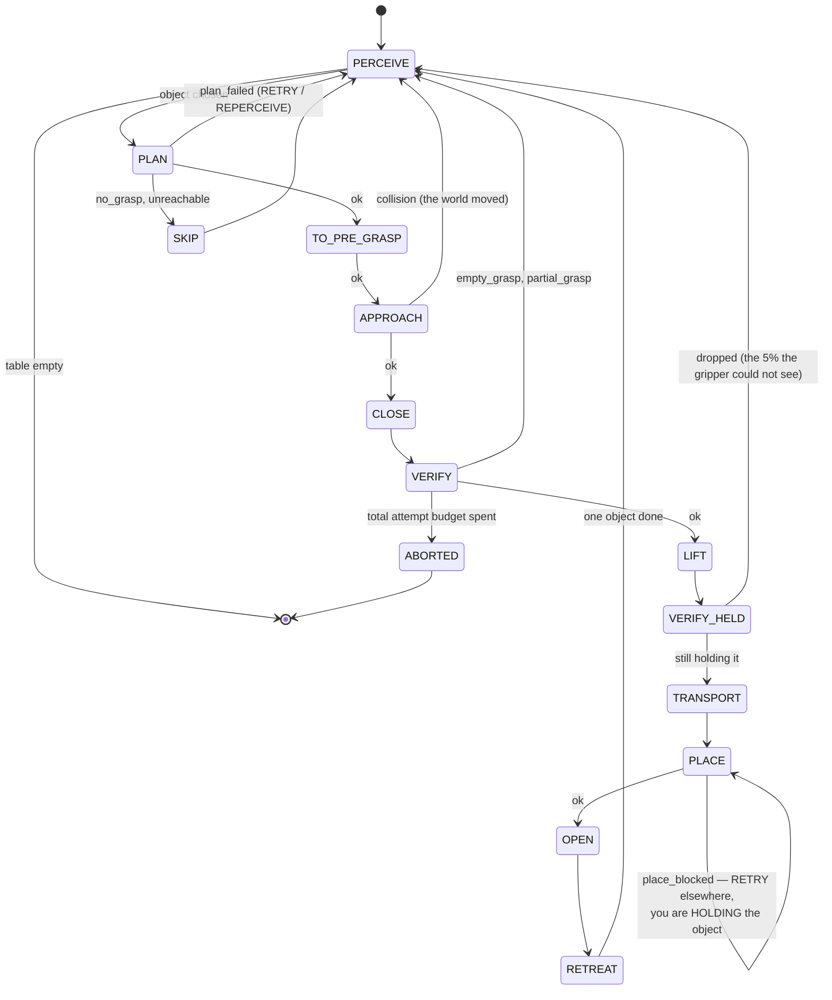

# 15.08 — A pick-and-place pipeline with a state machine

<!-- glance:start -->
<!-- generated by tools/build.py from curriculum/syllabus.yaml — edit the syllabus, not this block -->

| | |
|---|---|
| **Track** | Main path |
| **Difficulty** | Advanced |
| **Time** | 2 h |
| **Hardware** | Robotic arm (leader + follower kit) (stage 5), Camera (Raspberry Pi Camera Module 3 or USB webcam) (stage 2) |
| **Software** | ros2, moveit2 |
| **Prerequisites** | [15.07 Exercise lesson: detect an object and move the gripper toward it](15.07-detect-and-approach.md)<br>[15.05 Grasp planning — heuristics first, learned grasps second](15.05-grasp-planning.md) |
| **Skip if** | Your arm picks and places objects with failure detection and retries. |

<!-- glance:end -->

## What you will learn

- Split a pick-and-place task into phases along the lines where it actually fails, not where the code is easy to write.
- Verify a grasp from signals the gripper already has, and say what each one cannot see.
- Write a retry policy that distinguishes "try again" from "look again", and measure what the difference is worth.
- Predict a task's success rate from the reach error budget of [15.07](15.07-detect-and-approach.md).
- Recognise the failures that no gripper-side check can catch, and place a later check that does.

## Why it matters

[15.07](15.07-detect-and-approach.md) ended with an uncomfortable number: an open-loop reach onto a
30 mm block lands within the jaw's slack about four times in five. A pipeline built on top of that
without verification does not fail four times in five — it does something worse. It reports success,
transports nothing to the place location, opens an empty gripper, and goes back for the next object,
while the block you thought you picked is now 12 mm from where perception last saw it because a pad
pushed it on the way past.

This lesson is about the difference between a demo and a system. The state machine is not
bureaucracy; it is the structure that lets you say **which** of eleven things went wrong and
**therefore** what to do. The retry policy is not a `for` loop with a counter; the distinction it
encodes — did this failure change the world? — is the whole difference between a policy that works
and one that spends its attempt budget pushing an object across the table.

If you have built anything distributed, the shape will be familiar: tagged errors rather than
booleans, idempotency where you can get it, a re-read after any operation that may have mutated
shared state, and a budget that bounds the whole thing. Manipulation just has a shared state you can
knock over.

<!-- prereqs:start -->
## Prerequisites

You need these first:

- [15.07 Exercise lesson: detect an object and move the gripper toward it](15.07-detect-and-approach.md)
- [15.05 Grasp planning — heuristics first, learned grasps second](15.05-grasp-planning.md)

### Optional prerequisite links

None.

Check your readiness: `python course.py why 15.08`
<!-- prereqs:end -->

## Concept

**One phase per thing that can independently fail.** That is the entire design rule, and it is why
the sequence has eleven steps rather than three:

```text
 PERCEIVE -> PLAN -> TO_PRE_GRASP -> APPROACH -> CLOSE -> VERIFY -> LIFT -> VERIFY_HELD
           -> TRANSPORT -> PLACE -> OPEN -> RETREAT -> DONE
```

`APPROACH` is separate from `TO_PRE_GRASP` because only one of them can hit something. `VERIFY` is
separate from `CLOSE` because closing always "succeeds" — the servo reaches its commanded position
either way. `VERIFY_HELD` is separate from `VERIFY` because gravity gets a vote after the lift, and
because there is one failure mode the gripper genuinely cannot see until then.

Each phase returns an **`Outcome` with a tag**, never a bool:

```python
ok  no_object  no_grasp  unreachable  plan_failed  collision
empty_grasp  partial_grasp  dropped  place_blocked  aborted
```

A bool tells you a phase failed. A tag tells you what to do about it, which is the only reason you
asked. The policy is then one pure function you can unit-test without a robot:

```python
def decide(self, outcome, attempts_on_object, total_attempts) -> Action
```

and the action is one of `CONTINUE`, `RETRY`, `REPERCEIVE`, `NUDGE`, `SKIP_OBJECT`, `ABORT`.

The one idea worth carrying out of this lesson is the split between `RETRY` and `REPERCEIVE`:

- The planner timed out. **The world did not move.** Retry in place.
- A pad brushed the object and the jaws closed on air. **The world moved**, by about 12 mm, and your
  perception is now describing a table that no longer exists. Look again *before* you do anything.

Retrying a stale plan is not merely wasteful. It aims the gripper where the object used to be,
misses again, and pushes it further.

> [!TIP]
> **Ask your teacher:** "Walk me through what each phase can return and what the policy should do with it, and challenge my answers — especially the ones where I want to retry."

## Technical explanation

### Level 1 — Verifying a grasp with what you already have

The SO-101's jaw is driven by a bus servo that reports its own position and load
([14.03](../14-robotic-arm/14.03-controlling-servos.md)). That is two signals for free, and a
re-look at the table is a third. Used in the right order they answer three different questions:

```python
def verify_grasp(reading, expected_width_mm, *, width_tol_mm=6.0,
                 empty_width_mm=4.0, min_load=0.10):
    if reading.width_mm <= empty_width_mm:
        return Outcome("empty_grasp", f"jaws closed to {reading.width_mm:.1f} mm")
    if reading.load < min_load:
        return Outcome("empty_grasp", f"no load at {reading.width_mm:.1f} mm")
    if abs(reading.width_mm - expected_width_mm) > width_tol_mm:
        return Outcome("partial_grasp",
                       f"held {reading.width_mm:.1f} mm, expected {expected_width_mm:.1f} mm")
    return OK
```

The order is load-bearing. **Width is checked first because a jaw closed on its own mechanical stop
reads a perfectly healthy load** — it is pushing against itself. Anyone who writes "if the current is
high, we have the object" gets a pipeline that is confident and wrong.

Measure what each signal is worth (`py pick_place_fsm.py --only verification`, 2000 simulated
closes on a 30 mm block, 325 of which really failed):

```text
signal                              misses caught   false alarms
jaws not fully closed                       29.2%           0.0%
servo load above 0.10                        0.0%           0.0%
all three (verify_grasp)                    95.1%           0.0%
```

The load signal catches **nothing** on its own, exactly for the reason above. "Not fully closed"
catches under a third, because the common failure is not an empty jaw — it is a jaw holding a corner,
which reads a plausible 17 mm. Together they catch 95%, with no false alarms, which is the number
that makes a pipeline usable.

The remaining 5% is the interesting part, and it is not a tuning problem. Sometimes the pads squeeze
the object, it rolls out as they finish closing, and the reading *at the moment you measure it* is
indistinguishable from a real grasp. No gripper-side signal can see that, ever. It is caught one
phase later: lift, then look at the table again. If the object is still lying there, you are holding
nothing, whatever the servo says. That is why `VERIFY_HELD` exists, and it is a general principle —
**when a check has a blind spot, put the next check somewhere the blind spot is visible**, rather
than making the first check cleverer.

### Level 2 — The retry policy, and what it is worth

```python
def decide(self, outcome, attempts_on_object, total_attempts):
    if outcome.ok:                                       return Action.CONTINUE
    if total_attempts >= self.max_total_attempts:        return Action.ABORT
    if outcome.tag in self.give_up:                      return Action.SKIP_OBJECT
    if attempts_on_object >= self.max_attempts_per_object: return Action.SKIP_OBJECT
    if outcome.tag in self.retry_in_place:               return Action.RETRY
    if outcome.tag in self.reperceive:
        if self.allow_nudge and attempts_on_object >= self.nudge_after:
            return Action.NUDGE
        return Action.REPERCEIVE
    return Action.ABORT      # an unknown tag is a bug, not a thing to retry
```

Four things in there are decisions, not code:

1. **The global budget is checked before the tags.** One place to look when a run stops, and a
   robot that cannot loop forever on any path.
2. **`place_blocked` is a `RETRY`, not a `SKIP_OBJECT`.** You are *holding* the object; "skip it" is
   not a legal move. Every failure tag has to be legal for the state the machine is actually in, and
   this is the one people get wrong.
3. **`NUDGE` before `SKIP_OBJECT`.** After two honest failures on the same object, trying a third
   time from a fresh look is unlikely to help — the object is probably somewhere awkward. Changing
   the world on purpose (push it, or pick its neighbour first) is a different move, and
   [15.05](15.05-grasp-planning.md) already told you when it is needed.
4. **An unknown tag aborts.** A tag no rule covers means your code has a path you did not think
   about, and a moving robot is a bad place to find that out.

Now measure the policies (`--only policy`, 300 simulated tables, four graspable objects plus a
drinks can that is correctly refused every time):

```text
policy                              picked/4  attempts  skipped  aborted
no policy: stop on 1st failure          1.68      1.00     0.04     0.96
blind retry (same plan)                 2.40      6.94     2.37     0.06
re-perceive after a failure             3.57      4.86     1.43     0.00
  ... + nudge after 2 tries             3.55      4.86     1.45     0.00
  ... + 5 attempts per object           3.78      5.44     1.22     0.00
```

Read the `attempts` column next to the `picked` column, because that is where the argument is:

- **No policy** clears 1.68 of 4 objects and stops. Every one of those runs ends with a human.
- **Blind retry** spends **7** failed attempts to get 2.4 objects. It is not that retries do not
  help; it is that retrying the *same plan* aims at where the object used to be, and each miss
  pushes it another 12 mm.
- **Re-perceiving** spends **5** attempts and gets 3.6 — fewer attempts, 50% more objects.
- Nudging does not help *here* (this table is uncluttered; nudging is for
  [15.05](15.05-grasp-planning.md)'s blocked-candidate scene), and honesty about that is worth more
  than a table where every row improves.
- Raising the per-object budget to 5 buys the last 0.2 objects for half an attempt each — the point
  where you stop tuning and go improve the reach instead.

### Level 3 — Predicting the task's success rate from the reach budget

[15.07](15.07-detect-and-approach.md) gave you a lateral error distribution; this gives you what it
does to the task, with verification and re-perception in the loop (`--only error`, 200 tables per
cell):

```text
  lateral sigma mm   15 mm obj   20 mm obj   25 mm obj   30 mm obj   35 mm obj
               1.0        100%        100%        100%        100%         94%
               2.0        100%        100%        100%        100%         88%
               4.0        100%        100%        100%         96%         66%
               6.0        100%        100%         98%         90%         49%
               8.0        100%        100%         94%         76%         44%
```

Row 4 mm is this course's measured budget. Two conclusions, both actionable:

- **The policy turns a 4-in-5 grasp into a 96% task** for the 30 mm block. That is what retries buy,
  and it is why the honest answer to "my grasp succeeds 80% of the time" is "then build the loop".
- **It cannot rescue a 35 mm object** on a 45 mm jaw: 66%, and no amount of retrying fixes a
  tolerance of ±5 mm against an error of 4 mm. The table is flat in the top-left and falls off a
  cliff on the right, and the cliff is where slack ≈ error. When you are on the cliff, the fix is
  mechanical (a longer jaw), perceptual (a steeper view), or closed-loop
  ([15.06](15.06-visual-servoing.md)) — never another retry.

A useful rule you can read off the table: **success collapses when the jaw slack drops below about
1.5 σ of your reach error.** For a 45 mm jaw and a 4 mm σ that is objects wider than about 33 mm.

### Level 4 — What the phases look like in ROS 2

> [!IMPORTANT]
> **Version-sensitive** (verified 2026-09 against ROS 2 Jazzy Jalisco, MoveIt 2 2.12.x).
> MoveIt's `moveit_task_constructor` is the maintained way to express multi-stage manipulation
> tasks, but its availability and API differ between distros; check before adopting it:
> https://moveit.picknik.ai/main/doc/tutorials/pick_and_place_with_moveit_task_constructor/pick_and_place_with_moveit_task_constructor.html
> AI teacher: verify whether `moveit_task_constructor` is packaged for the installed distro before
> recommending it.

The machine belongs in **one** node. Not because a distributed version is impossible, but because
the state is genuinely shared and small, and every alternative you will be tempted by — a phase per
node, coordinated over topics — reinvents distributed consensus for a table with four blocks on it.

The one thing to expose is the **task**, as a ROS 2 **action**
([04.08](../04-ros2/04.08-actions.md)): long-running, with feedback (the current phase and
attempt count) and, critically, **cancel**. A pick-and-place that cannot be cancelled mid-approach is
not finished.

Three implementation notes that are specific to manipulation:

- **Idempotency where you can get it.** `PERCEIVE`, `PLAN` and every motion to a *pose* are
  idempotent: running them twice is harmless. `CLOSE`, `OPEN` and `NUDGE` are not — they change the
  world. Structure the retry logic so that only the idempotent phases are ever repeated blindly, and
  everything after a non-idempotent phase goes through `PERCEIVE` first.
- **The planning scene must follow the machine.** Attach the object on `CLOSE`, detach it on `OPEN`,
  and remove stale objects before `PLAN`. Forget the detach and the planner avoids an invisible box
  that follows the gripper for the rest of the session —
  [15.09](15.09-collision-avoidance-and-recovery.md) is that lesson.
- **Log one record per attempt**, with the detection, the grasp and its terms, the waypoints, the
  gripper reading, the outcome tag and the action. When the pipeline fails overnight you want to
  read the log, not reproduce the run.

## Diagram



```text
 THE TWO KINDS OF FAILURE, and why one function tells them apart

   the world did NOT move                   the world DID move
   ----------------------                   -------------------
   plan_failed   (a sampler seed)           empty_grasp    (a pad pushed it ~12 mm)
   place_blocked (pick another spot)        partial_grasp  (it rotated in the jaws)
                                            collision      (something is not where you thought)
            |                                        dropped        (it is back on the table, elsewhere)
            v                                                     |
        RETRY in place                                            v
   (the plan is still true)                          REPERCEIVE first
                                             (the plan describes a table
                                              that no longer exists)


 WHAT EACH CHECK CAN AND CANNOT SEE

   after CLOSE:   width  ###############................   catches the empty jaw
                  load   ................................   catches nothing (stop = high load)
                  width vs expected #########.............   catches the corner grasp
                                                          }-> 95% together

   after LIFT:    is the object still on the table? ######   catches the other 5%:
                                                             the squeeze-and-roll-out, which
                                                             reads EXACTLY like a good grasp
```

## Code

[`code/pick_place_fsm.py`](code/pick_place_fsm.py) is the machine, the policy, the verification and
a 90-line simulated world with the failure modes that actually happen — including the one that
matters most:

```python
if err_mm > slack_mm:
    truth.x += self.rng.normal(0, self.nudge_mm / 1000.0)   # a pad pushed it
    truth.y += self.rng.normal(0, self.nudge_mm / 1000.0)
```

That is three lines, and it is the reason `REPERCEIVE` beats `RETRY`. A simulator without it will
tell you blind retries are fine.

The machine is a flat loop over phases on purpose — the value of a state machine here is that you
can *read the transition table*, and a class hierarchy hides it:

```bash
cd 15-manipulation/code
py pick_place_fsm.py                     # all four experiments (about 30 s)
py pick_place_fsm.py --only run          # one run, every transition
py pick_place_fsm.py --only policy       # the policy comparison
```

One run, with every failure type in it (`--only run`):

```text
object        phase         outcome         action      detail
small cube    VERIFY        partial_grasp   reperceive  held 10.6 mm, expected 20.0 mm
small cube    VERIFY        ok              continue
small cube    RETREAT       ok              continue
eraser        APPROACH      collision       reperceive  stopped on contact during the approach
eraser        VERIFY        ok              continue
eraser        RETREAT       ok              continue
wooden block  VERIFY        empty_grasp     reperceive  jaws closed to 0.9 mm
wooden block  VERIFY        partial_grasp   reperceive  held 15.9 mm, expected 30.0 mm
wooden block  VERIFY        ok              continue
wooden block  VERIFY_HELD   dropped         reperceive  nothing was in the jaws; verification missed it
wooden block  VERIFY        partial_grasp   skip        held 18.5 mm, expected 30.0 mm
wide box      VERIFY        ok              continue
wide box      RETREAT       ok              continue
drinks can    PLAN          no_grasp        skip        66 mm needs more stroke

  picked: ['small cube', 'eraser', 'wide box']
  skipped: ['wooden block', 'drinks can']
```

Read the `wooden block` rows: `VERIFY` passed, `VERIFY_HELD` caught that it was holding nothing,
the machine re-perceived, tried once more, hit its per-object budget and moved on. Nobody had to be
in the room.

> [!CAUTION]
> **Safety:** this is the first lesson where the arm runs a *sequence* unattended, and retries mean
> it will try again after something already went wrong — which is exactly when a human reaches in.
> Before running it: the e-stop in reach and tested, torque and speed limits low
> ([14.11](../14-robotic-arm/14.11-arm-safety.md)), a global attempt budget **and** a wall-clock
> timeout, the task exposed as a cancellable action, and nothing fragile on the table. Test the
> cancel path before you test the happy path, and watch the first full run with your hand on the
> switch. [SAFETY.md](../SAFETY.md)

## Exercise

### Exercise 15.08-E1 — Predict the policy table `[predict]`

Hardware: none. Before running `py pick_place_fsm.py --only policy`, predict: (a) which policy picks
the most objects, and which spends the most attempts; (b) whether blind retry does better or worse
than no policy at all, and why; (c) what fraction of runs end in an abort with no policy; (d) whether
enabling `NUDGE` helps on this table, and what scene it *would* help on. Then run it and account for
every prediction you got wrong.

### Exercise 15.08-E2 — Implement the machine's three decisions `[coding]`

Hardware: none. Implement `next_phase`, `verify_grasp` and `RetryPolicy.decide` from their
docstrings. The tests pin the ordering inside `decide` (the global budget outranks every tag; an
unknown tag aborts) and the ordering inside `verify_grasp` (width before load, because a jaw on its
own stop reads a healthy load).

Check it: `python course.py check 15.08` (or `py -m pytest labs/exercises/15.08`).

### Exercise 15.08-E3 — Find the cliff `[simulation]`

Hardware: none. For your own jaw stroke, find the object width at which the success rate falls
below 90%, for lateral error sigmas of 2, 4 and 8 mm. Plot width against success for each sigma.
Then: (a) express the cliff as a rule relating the jaw slack to sigma, and check it against all
three curves; (b) you can spend one afternoon — halve sigma, or add 10 mm of jaw stroke. Which buys
more, and at which object size does the answer change? (c) Explain why the curves are flat and then
fall rather than declining smoothly.

### Exercise 15.08-E4 — Verification you cannot fool `[coding]`

Hardware: none. `SimWorld.convincing_miss_p` models the failure that reads exactly like a grasp.
Add a **fourth** verification signal that catches it, and measure how much it is worth:

1. Implement `verify_by_reperception(world, target)` — after the lift, look at the table again and
   check whether the object is still there.
2. Extend `verify_grasp` into a `verify(...)` that takes both the gripper reading and the
   re-perception result, and returns a tag that says *which* check fired.
3. Re-run the verification table with the new check and report the caught/false-alarm numbers.
4. Then argue the cost: re-perception takes a camera frame and a second of arm time, on **every**
   pick. State the condition under which you would run it always, and the condition under which you
   would run it only after a previous failure.

### Exercise 15.08-E5 — A failure the policy handles wrongly `[debugging]`

Hardware: none. The policy in this lesson has at least three situations it handles badly. Find them
and fix them with evidence. To start you off, one is here:

> The gripper closes on the object, `VERIFY` passes, `TRANSPORT` succeeds, `PLACE` reports
> `place_blocked` three times in a row and the per-object budget runs out. What does the machine do,
> and what is the arm holding while it does it?

For each problem you find: construct a scene or a sequence of outcomes that triggers it, say what
the machine does, say what it should do, and change the policy or the phase list to fix it. Then
show the fix does not make the policy table in Level 2 worse.

## Expected result

- **15.08-E1:** (a) "re-perceive + 5 attempts per object" picks the most (3.78 of 4); **blind retry**
  spends the most attempts (6.94) while picking 2.40. (b) Blind retry does better than no policy on
  the count (2.40 versus 1.68) and much worse *per attempt* — it spends nearly 7 failed attempts to
  get there, and the mechanism is that a failed grasp moved the object by ~12 mm, so the retried
  plan aims at where it used to be and pushes it further. (c) **96%** of no-policy runs abort. (d)
  Nudging changes nothing here (3.55 versus 3.57 — noise). It is for clutter: the 12 mm-gap scene of
  [15.05](15.05-grasp-planning.md), where *every* candidate is blocked and no amount of re-looking
  produces a grasp, because the world has to change first.
- **15.08-E2:** `python course.py check 15.08` passes with nothing skipped (26 tests, well under a
  second). The two that catch people: `test_high_load_does_not_rescue_a_fully_closed_jaw` (width
  first) and `test_the_global_budget_aborts_and_outranks_everything` (the budget is checked before
  the tags, including tags you would otherwise skip on).
- **15.08-E3:** With a 45 mm jaw the 4 mm-sigma curve is at 100% to 25 mm, 96% at 30 mm and 66% at
  35 mm; the 8 mm curve breaks at about 25 mm. (a) The cliff is where **slack ≈ 1.5 σ**:
  $(45 - w)/2 \approx 1.5\sigma$, i.e. $w \approx 45 - 3\sigma$ — 33 mm at σ = 4, 39 mm at σ = 2,
  21 mm at σ = 8. Check it against the table: it predicts all three break points to within a few
  millimetres. (b) 10 mm of stroke moves the cliff by 10 mm; halving σ moves it by $1.5\sigma$, so
  at σ = 4 that is 6 mm and at σ = 8 it is 12 mm. **The jaw wins when your reach is already good;
  the reach wins when it is bad** — and the crossover is at σ ≈ 6.7 mm. (c) The curves are flat and
  then fall because success is $P(|{\rm error}| < {\rm slack})$ for a roughly Gaussian error:
  while slack is several σ the tail is negligible, and once slack approaches σ the probability falls
  fast. It is the same shape as any margin-versus-noise curve, and it is why "it works, then it
  suddenly does not" is the normal experience of tightening a tolerance.
- **15.08-E4:** Re-perception should catch essentially all of the remaining 5%, taking the combined
  detection rate to ~100% with a false-alarm rate set by your perception's own miss rate — which is
  the trade you are actually making, because an object that perception *fails to see* on the table
  looks exactly like a successful grasp. Run it always when a pick is expensive to get wrong
  (fragile object, a place location you cannot inspect) or when picks are rare; run it only after a
  previous failure when throughput matters and a dropped object is cheap. A good answer notices that
  the check is nearly free if you were going to `PERCEIVE` for the next object anyway — move the
  lift's re-look *into* the next cycle's perception and it costs one comparison.
- **15.08-E5:** The seeded one: the machine **skips the object while still holding it**, and every
  subsequent phase operates with a full gripper — the next `PERCEIVE` sees the table through an
  occluding object, the next `APPROACH` collides, and the object is eventually dropped somewhere
  arbitrary. The fix is a phase-aware policy: `SKIP_OBJECT` is only legal while the gripper is
  empty; from any holding state the only legal exits are "place it somewhere, anywhere safe" or
  "abort with the object held and say so". Two more to find: (1) `collision` during `APPROACH` goes
  to `REPERCEIVE`, but the arm is still *at* the collision — there is no retreat before re-looking,
  and the wrist camera's view is blocked by the thing it hit; (2) `total_attempts` is never reset
  between objects, so a table with many objects abort-ends on the last ones purely because the
  earlier ones were hard. Both are one-line fixes and both are the kind of thing that only shows up
  after an hour of unattended running.

## Troubleshooting

### Symptom: the pipeline reports success and the place location is empty

Your verification has a blind spot and you are trusting it. In order:

1. **Log the gripper reading at every `CLOSE`**, with the expected width. Nine times out of ten the
   reading was right there and nobody looked at it.
2. **Check that `expected_width_mm` comes from the grasp, not a constant.** A hard-coded expectation
   makes `partial_grasp` undetectable for every object of a different size.
3. **Add the re-look after the lift.** The squeeze-and-roll-out failure is invisible to the gripper
   by construction; no threshold change will find it.
4. Only then tighten `width_tol_mm`, and watch the false-alarm rate as you do.

### Symptom: the robot keeps grabbing at the same empty spot

`RETRY` where you needed `REPERCEIVE`. The signature is unmistakable in the log: the same target
position, three attempts in a row, each `empty_grasp`. Move that tag to `reperceive` and it goes
away. If it *still* happens after re-perceiving, your perception is re-detecting a stale object —
check that the detector is not smoothing or tracking across frames, which is exactly the wrong
behaviour here.

### Symptom: the run aborts halfway with "budget exhausted" on an easy table

`total_attempts` is not being reset, or `max_total_attempts` is scaled for one object while your
table has five. Decide which you mean: a budget per object (reset it on a successful `RETREAT`) or a
budget per *run* (then size it as objects × per-object budget, plus slack). Both are defensible;
having one and thinking you have the other is not.

### Symptom: everything works in simulation and the real robot pushes objects off the table

Your simulator does not model the push. Add it — three lines — and re-run your policy comparison;
the conclusions will change. More generally: a simulator that only models the failures you already
handle will always tell you your handling is adequate.

### Symptom: the arm is holding an object and the machine has moved on

A phase/policy mismatch: an action that is legal when the gripper is empty was taken while it was
full. Add the gripper state to the policy's inputs and assert on it. This is the manipulation
version of a transaction that returned without committing or rolling back, and it has the same fix:
make the illegal state unrepresentable, or at least assert it loudly.

## Common mistakes

- **Booleans instead of tagged outcomes.** You cannot write a policy over `False`.
- **Trusting the servo load.** A jaw closed on its own stop reads a healthy load. Width first.
- **Retrying a plan after the world moved.** Every miss pushes the object further from where your
  plan says it is.
- **Skipping an object you are holding.** Every action has to be legal for the machine's actual
  state, not just for its phase.
- **A hard-coded `expected_width_mm`.** Then `partial_grasp` can never fire for anything but one
  object.
- **No global budget, or a budget that is never reset.** Both produce runs that end in ways nobody
  can explain.
- **Retrying a tag no rule covers.** An unknown tag is a bug in your code; keep the robot still
  until you have read it.
- **Forgetting to detach the object from the planning scene on `OPEN`.**
  ([15.09](15.09-collision-avoidance-and-recovery.md) is an entire lesson about what that does.)
- **A pipeline that cannot be cancelled.** Expose it as an action with a working cancel, and test
  the cancel first.

## Knowledge check

1. Why is `VERIFY` a separate phase from `CLOSE`?
   <details><summary>Answer</summary>

   Because `CLOSE` always succeeds. The servo reaches its commanded position whether the object is
   in the jaws or not, so "the close command completed" carries no information about the world. The
   phase boundary is drawn where a *different thing* can fail, and "did the jaws end up around the
   object" is a different thing from "did the servo move". The same argument makes `APPROACH`
   separate from `TO_PRE_GRASP`: only one of them can hit something.
   </details>

2. Your verification uses only the servo load. What exactly does it miss, and why does it *look*
   like it is working?
   <details><summary>Answer</summary>

   It misses **everything** — the measured catch rate is 0%. A jaw that closes on nothing runs into
   its own mechanical stop and draws a high current, so the load reading of a failed grasp looks
   identical to that of a good one. It appears to work because it also never produces a false alarm
   on a successful grasp, so in a demo where most grasps succeed it agrees with reality most of the
   time. Width is the first check; load is a second opinion.
   </details>

3. Predict: the pads brush the object, the jaws close on air, and your policy retries the same plan.
   What happens on attempts two and three?
   <details><summary>Answer</summary>

   Both miss, and each one pushes the object further. The first miss moved it about 12 mm, so the
   stale plan is now aiming ~12 mm off before the reach error is even added; the second miss moves
   it again. Measured over 300 tables, blind retry spends 6.94 failed attempts to pick 2.40 objects
   while re-perceiving spends 4.86 to pick 3.57. The retry is not merely wasted — it is actively
   making the task harder.
   </details>

4. Your jaw has a 45 mm stroke and your reach error is σ = 4 mm. Which objects will your pipeline
   handle reliably, and where is the cliff?
   <details><summary>Answer</summary>

   Everything up to about **30 mm** (96% with retries); 35 mm falls to 66%. The rule is
   slack ≈ 1.5 σ, i.e. the cliff is at width ≈ stroke − 3σ = 33 mm. Above it, retries do not help,
   because retrying does not change the distribution you are sampling from. The fixes are
   mechanical (more stroke), perceptual (a steeper view, per
   [15.04](15.04-object-pose-estimation.md)), or closed-loop ([15.06](15.06-visual-servoing.md)).
   </details>

5. Why is `place_blocked` handled with `RETRY` rather than `SKIP_OBJECT`?
   <details><summary>Answer</summary>

   Because the object is in the gripper. "Skip this object" is an action that only makes sense when
   the jaws are empty; taken while holding something it leaves the machine operating with a full
   gripper — occluded perception, collisions on the next approach, and eventually the object dropped
   somewhere arbitrary. The legal moves from a holding state are "place it somewhere else" or "stop
   and say you are holding it". Every tag must map to an action that is legal in the state the
   machine is actually in, not just in the phase.
   </details>

6. Name a grasp failure that no gripper-side signal can detect, and say where you would catch it.
   <details><summary>Answer</summary>

   The squeeze-and-roll-out: the pads close on the object, it rolls free as they finish, and the
   width and load at the moment of measurement are exactly those of a successful grasp. It is about
   5% of failures in the simulation. Catch it **after the lift**, by looking at the table again: if
   the object is still lying there, the gripper is empty whatever the servo says. The general
   principle — when a check has a blind spot, put the next check where the blind spot is visible
   rather than making the first check cleverer.
   </details>

7. Which phases of this pipeline are idempotent, and why does it matter for the retry policy?
   <details><summary>Answer</summary>

   `PERCEIVE`, `PLAN` and any motion to a *pose* (`TO_PRE_GRASP`, `APPROACH`, `LIFT`, `TRANSPORT`,
   `PLACE`, `RETREAT`) are idempotent: running them twice leaves the world as it was. `CLOSE`,
   `OPEN` and `NUDGE` are not — they change it. Only idempotent phases may be repeated blindly;
   anything after a non-idempotent phase has to go back through `PERCEIVE` first, because the state
   your plan was computed from no longer holds. It is the same rule as retrying a non-idempotent
   HTTP request, with the same consequence for getting it wrong.
   </details>

8. The policy checks the global attempt budget *before* the failure tags. Why that order?
   <details><summary>Answer</summary>

   So that there is exactly one reason a run can stop for exhaustion, and no tag can route around
   it. If the tags were checked first, a tag mapped to `SKIP_OBJECT` or `RETRY` would keep the
   machine moving past the budget, and an unattended run could continue indefinitely on a robot
   whose gripper is broken. Checking the budget first also makes the abort message trivially
   explainable: one counter, one threshold, printed.
   </details>

## Practical challenge

Build `clear_the_table(action_server)` — a pick-and-place task you would leave running while you
leave the room, on the real arm or in simulation.

Acceptance criteria:

- Exposed as a ROS 2 action with feedback (current phase, current object, attempts used of the
  budget) and a **cancel that stops the arm mid-approach within 200 ms**. Test the cancel first.
- The policy takes the gripper state as an input, and `SKIP_OBJECT` is unrepresentable while
  holding an object. Add an assertion that fires if it ever happens.
- Verification uses at least three signals, including a re-look at the table after the lift, and
  each failure records *which* signal fired.
- The planning scene follows the machine: detected objects added before `PLAN`, the target attached
  on `CLOSE`, detached on `OPEN`, stale objects removed. (Preview of
  [15.09](15.09-collision-avoidance-and-recovery.md); doing it now will make that lesson short.)
- A global attempt budget **and** a wall-clock timeout, both logged when they fire, with
  `total_attempts` reset on a policy you can state in one sentence.
- One structured log record per attempt, sufficient to reconstruct the run without re-running it.
- A pytest suite without hardware proves: a table of five clears with the reference policy in under
  15 attempts over 100 seeds; the machine never takes an action that is illegal for its gripper
  state; a cancel at every phase leaves the arm stopped and the machine in a terminal state; and the
  `place_blocked`-while-holding scenario ends with the object placed or an explicit "holding" abort.
- Twenty runs (real or simulated) with the per-run outcome table and a short paragraph naming the
  failure mode that cost you the most, with the evidence from your logs.

## You can skip this if…

You can answer knowledge-check questions 2, 3 and 5 correctly without looking, and you have built a
manipulation pipeline with tagged outcomes, a verification step and a retry policy that distinguishes
world-changing from world-preserving failures — and you can quote its measured success rate. Then:
`python course.py skip 15.08 --reason "have built and measured a verified pick-and-place pipeline"`.

## Go deeper

- MoveIt Task Constructor — the maintained way to express a multi-stage manipulation task in ROS 2,
  with stages, solutions and a viewer; the concepts map one to one onto the phases above:
  https://moveit.picknik.ai/main/doc/tutorials/pick_and_place_with_moveit_task_constructor/pick_and_place_with_moveit_task_constructor.html
- ROS 2 actions (Jazzy) — what a long-running, cancellable task looks like in ROS, including the
  goal/feedback/result contract: https://docs.ros.org/en/jazzy/Tutorials/Intermediate/Writing-an-Action-Server-Client/Py.html
- BehaviorTree.CPP — the other standard way to write this, and the one Nav2 uses; worth reading even
  if you keep the state machine, for the vocabulary of fallback and decorator nodes:
  https://www.behaviortree.dev/
- Kroemer, Niekum & Konidaris, "A Review of Robot Learning for Manipulation" (JMLR 2021) — the
  section on task structure and skill preconditions is the academic version of this lesson's phases:
  https://arxiv.org/abs/1907.03146
- Tedrake, MIT 6.4210 *Robotic Manipulation* — the chapter on building a complete manipulation
  system, including grasp verification and task-level state: https://manipulation.csail.mit.edu/

## Progress checkpoint

- [ ] I split a task into phases along the lines where it actually fails.
- [ ] Every phase returns a tagged outcome, and my policy is one testable function.
- [ ] I can verify a grasp from the gripper's own signals, and name what they cannot see.
- [ ] I distinguish failures that changed the world from failures that did not.
- [ ] I can predict my pipeline's success rate from my reach error and my jaw's slack.

`python course.py complete 15.08` (exercises done) · `python course.py master 15.08` (challenge done) ·
`python course.py struggle 15.08 "what was hard"`

Next: [15.09 — Collision avoidance, the planning scene and failure recovery](15.09-collision-avoidance-and-recovery.md).
