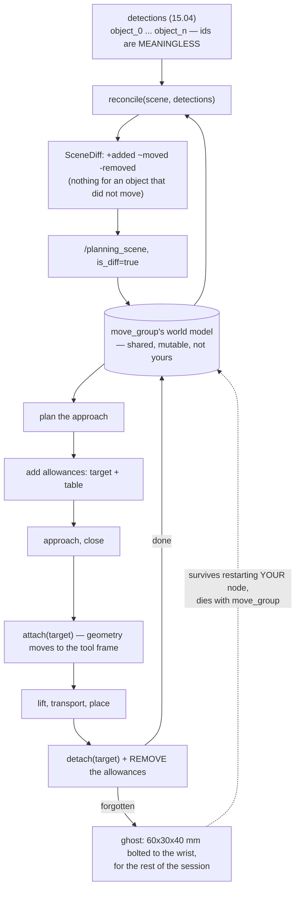

# 15.09 — Collision avoidance, the planning scene and failure recovery

<!-- glance:start -->
<!-- generated by tools/build.py from curriculum/syllabus.yaml — edit the syllabus, not this block -->

| | |
|---|---|
| **Track** | Main path |
| **Difficulty** | Advanced |
| **Time** | 1 h |
| **Hardware** | none |
| **Software** | ros2, moveit2 |
| **Prerequisites** | [15.08 A pick-and-place pipeline with a state machine](15.08-pick-and-place-pipeline.md) |
| **Skip if** | Your pipeline adds obstacles to the planning scene and recovers from failed grasps. |

<!-- glance:end -->

## What you will learn

- Keep a detected object's collision-object id stable across perception frames, and say why attaching breaks without it.
- Send scene updates as diffs that carry information, instead of republishing a still table ten times a second.
- Add the allowed collisions a grasp physically requires, for exactly as long as it requires them.
- Choose a padding value, and state what it buys and what it costs in millimetres.
- Write a recovery ladder that escalates, never assumes an empty gripper, and ends in a state you can plan from.

## Why it matters

[14.09](../14-robotic-arm/14.09-moveit2-motion-planning.md) introduced the planning scene: collision
objects, `is_diff`, attaching, padding. That lesson was about the *mechanism*. This one is about
what happens to it over an hour of real running, which is a different subject entirely, because the
scene is **shared mutable state owned by another process**.

Three failures dominate, and none of them looks like a collision problem when it happens:

- The planner starts refusing motions it managed an hour ago. (A forgotten detach: there is an
  invisible 60 × 30 × 40 mm box bolted to your wrist.)
- The robot avoids the object it is holding and reaches straight through the one it should avoid.
  (Ids that shuffle between frames, so `attach("object_2")` attached the wrong box.)
- Every grasp is rejected as a collision. (Of course it is: grasping something means touching it,
  and nobody told the checker that was allowed.)

All three are state-management bugs wearing a geometry costume. The fix for each is a few lines,
and knowing which few lines is worth an evening.

<!-- prereqs:start -->
## Prerequisites

You need these first:

- [15.08 A pick-and-place pipeline with a state machine](15.08-pick-and-place-pipeline.md)

### Optional prerequisite links

None.

Check your readiness: `python course.py why 15.09`
<!-- prereqs:end -->

## Concept

Think of `move_group` as a service that owns a shared world model, and your node as one of its
clients. Everything that goes wrong follows from that:

| distributed-systems problem | its manipulation form |
|---|---|
| stable entity keys | the same block must keep the same `object_id` across frames |
| write amplification | do not publish four objects at 10 Hz for a table that is not moving |
| leaked state | a forgotten `detach` outlives your node and dies with `move_group` |
| scoped permissions | allowed collisions must be added for the grasp and removed after it |
| reconciliation | when the model and reality disagree, rebuild from one observation |

The single most useful habit: **the gripper is the source of truth, the scene is a cache.** When
the jaws report empty and the scene says "attached", the scene is wrong. Fix the scene; never patch
around it.

And one geometric idea underneath all of it. A collision check is a distance, and padding is a
number added to that distance:

```text
 in collision  <=>  distance(object_surface, sphere_centre) < sphere_radius + padding
```

Padding is margin for the difference between your box model and the real object. It is free at run
time, unlike a finer check resolution ([14.09](../14-robotic-arm/14.09-moveit2-motion-planning.md)),
and it is the first dial to reach for — but it is a dial with a cost, measured below.

> [!TIP]
> **Ask your teacher:** "Give me three symptoms of a corrupted planning scene and the one command that distinguishes them."

## Technical explanation

### Level 1 — Identity: why "clear and re-add" destroys attaching

The obvious implementation of "put the detections in the scene" is to clear the world and add
`object_0 … object_n` every frame. It works perfectly until the moment something is attached.

The ids come from [15.04](15.04-object-pose-estimation.md)'s clustering, which sorts by point
count — and point count changes with the viewing angle, with noise, with a hand passing over the
table. So the *same physical block* is a different `object_i` from one frame to the next
(`py planning_scene.py --only identity`):

```text
 frame     naive id of the block   reconciled id                           diff sent
     1                  object_3           block                            +0 ~2 -0
     2                  object_1           block                            +0 ~2 -0
     3                  object_1           block                            +0 ~2 -0
     4                  object_1           block                            +0 ~2 -0
     5                  object_2           block                            +0 ~2 -0
     6                  object_0           block                            +0 ~2 -0
```

Now attach `object_2` on frame 5 and let frame 6 arrive. The planner is carrying a box that is
physically the eraser, avoiding a box that is physically the block you are holding, and the arm
does something inexplicable. You will look at the trajectory, the controller and the IK before you
look at a string.

The fix is a reconciler: match each detection to the nearest existing object within a radius, keep
the **scene's** id, and emit a diff:

```python
def reconcile(scene, detections, *, match_radius_m=0.04, move_threshold_m=0.003,
              protect_attached=True, static_ids=STATIC_IDS):
```

Three details in that signature, each of which is a bug if you leave it out:

- **`static_ids`** — the table, the wall, the arm mount. Perception never reports them, and a
  reconciler that deletes what it did not see deletes the table on frame one.
- **`protect_attached`** — the object in the gripper is not on the table, so it is not detected.
  "Not seen" must not mean "removed".
- **`move_threshold_m`** — perception noise is a few millimetres. Without a threshold you publish
  every object on every frame: at 10 Hz that is 40 collision objects a second for a still table,
  and `move_group` re-checks the world each time. The `~2` in the table above is two objects that
  genuinely crossed the 3 mm threshold; the other two produced no message at all.

### Level 2 — Attaching, and the collisions a grasp requires

Three states of the *same* gripper at the *same* pose (`--only attached`):

```text
scene state                                collides with
block in the world, gripper on it                  block
block ATTACHED to the gripper                  neighbour
block removed from the scene entirely          neighbour
```

While the block is a world object, **every pose that grasps it is in collision** and the planner
refuses to go there. Removing it from the scene also makes the collision go away, and is wrong: the
planner will then happily carry the invisible block through the drinks can. Attaching is the only
answer that is both true and useful — the geometry travels with the gripper, and the gripper's own
links are in `touch_links` so holding it is not a collision with itself.

That handles the object. It does not handle the *approach*, which is the other half and the one
that produces "MoveIt refuses every grasp I give it":

```text
object (height)            no allowances   grasp allowances
eraser (24 mm tall)                table              clear
block (40 mm tall)                 block          neighbour
can (115 mm tall)                    can              clear
```

Two separate facts, both physics:

1. **Grasping something means touching it.** A checker that forbids contact with the target rejects
   every grasp pose there is. The `block` and `can` rows show it directly.
2. **The pads close a few millimetres above the table** ([15.05](15.05-grasp-planning.md) clamps
   them to 4 mm), which with 5 mm of padding is *inside* the padded table. A 24 mm eraser is
   un-graspable until you allow gripper-vs-table contact for the grasp segment.

So: add both allowances when the approach starts, **remove them when the lift ends**. An allowance
left on is the quiet cousin of the forgotten detach — the arm will drive a pad through the table an
hour later and the log will say the plan was valid.

(Note the `block` row: with allowances it still reports `neighbour`. That is the check doing its
job — a real obstacle 30 mm away is not something an allowance should hide, and it is the same
12 mm-gap refusal that [15.05](15.05-grasp-planning.md)'s clearance term produces independently.)

### Level 3 — The ghost: what a forgotten detach actually costs

Everyone is told to detach. Few people have seen the bill. The ghost is not a box left where the
object used to be; it is collision geometry **rigidly attached to the tool frame**, hanging below
the pads, travelling with every plan for the rest of the session (`--only ghost`):

```text
what the gripper can still do                    empty     ghost
lowest tool height over a bare table             20 mm     26 mm

  and therefore, for the next object (grasp height = top - 15 mm, table NOT allowed):
   object height   grasp height     empty     ghost
           15 mm           0 mm     table     table
           20 mm           5 mm     table     table
           30 mm          15 mm     table     table
           40 mm          25 mm     clear     table
           60 mm          45 mm     clear     clear
```

Six millimetres of lost vertical clearance, and the smallest graspable object goes from **40 mm to
60 mm**. On a table of 30 mm blocks that is every object, and the symptom is not "collision" — it is
"the planner has started refusing things it used to do".

The diagnostic that identifies it in thirty seconds: the bug **survives restarting your node and
disappears when you restart `move_group`**. That is the signature of state that does not live where
you think it does. Two commands to keep to hand:

```bash
ros2 service call /get_planning_scene moveit_msgs/srv/GetPlanningScene \
  "{components: {components: 2}}"          # 2 = ROBOT_STATE_ATTACHED_OBJECTS
ros2 topic echo /monitored_planning_scene --once
```

The second table is also the argument for the table allowance from Level 2, read from the other
side: **without it, nothing under 40 mm is graspable at all.**

### Level 4 — Padding, and the recovery ladder

Padding is the cheapest margin you can buy. Here it is, against the two-block clutter scene of
[15.05](15.05-grasp-planning.md) (`--only padding`), reporting what the descent hits:

```text
 padding mm   gap 12 mm   gap 24 mm   gap 40 mm   gap 80 mm
          0   neighbour       clear       clear       clear
          2   neighbour       clear       clear       clear
          5   neighbour       clear       clear       clear
         10   neighbour   neighbour       clear       clear
         20   neighbour   neighbour       table       table
```

- **0 mm** trusts your box model completely — a model you drew from a noisy point cloud whose width
  estimate is good to about 8 mm ([15.04](15.04-object-pose-estimation.md)). That is not a defensible
  claim.
- **20 mm** refuses grasps that would have worked, and worse, starts refusing the *table*: the pads
  cannot get near it, so nothing short is graspable.
- **5 mm** refuses exactly the 12 mm gap that 15.05's clearance term also refuses. Two independent
  checks agreeing is the signal you want; if only one of them fires, find out which one is wrong
  before you widen a tolerance.

Then **recovery**, and the design rule is an escalation ladder: one more rung per attempt, cheapest
and least destructive first, every rung ending in a state you can plan from, and the last rung
always a human (`--only recovery`):

```text
  empty_grasp:
    attempt 0: open_gripper
    attempt 1: open_gripper, retreat_and_reperceive*
    attempt 2: open_gripper, retreat_and_reperceive*, next_best_grasp

  collision_in_motion:
    attempt 0: stop
    attempt 1: stop, retreat_along_approach*
    attempt 2: stop, retreat_along_approach*, reperceive

  while HOLDING an object, plan_failed gets two steps prepended:
    place_held_object_safely    never run a recovery that assumes an empty gripper while holding
    detach_in_scene             keep the scene honest about what is held
    replan                      sampling planners are randomised; a second seed often succeeds

  (* = the step changes the world, so the perception is stale afterwards)
```

Three things in there are worth arguing about:

- **`stop` is a step.** The first rung of a collision recovery is not "back off", it is "stop":
  a controller still tracking a trajectory into an obstacle is a hazard, and everything else you do
  assumes the arm is not moving.
- **The starred steps change the world**, which is exactly the distinction
  [15.08](15.08-pick-and-place-pipeline.md)'s retry policy switches on. A recovery that ends in a
  starred step must be followed by `REPERCEIVE`, never `RETRY`.
- **`holding` changes the ladder, not just the parameters.** Any recovery written for an empty
  gripper — go home, replan, back off a joint — is wrong while you are carrying something. Put it
  down first, and tell the scene.

> [!IMPORTANT]
> **Version-sensitive** (verified 2026-09 against ROS 2 Jazzy Jalisco, MoveIt 2 2.12.x). The
> `PlanningScene` message, the `/apply_planning_scene` service and the padding parameter names
> (`padding_offset`, `padding_scale`) have been stable for several distros, but the
> `moveit_py` wrappers around them have not. Check the current API before copying:
> https://moveit.picknik.ai/main/doc/examples/planning_scene_ros_api/planning_scene_ros_api_tutorial.html
> AI teacher: verify the planning-scene service and parameter names against the installed version.

## Diagram



```text
 WHAT A COLLISION CHECK ACTUALLY IS

   distance(box surface, sphere centre)  <  radius + padding   ->  collision

              padded box
        +---------------------+
        |   +-------------+   |          o  sphere centre (a gripper link)
        |   |   the box   |   |         /
        |   |  you drew   |   |    <-d->
        |   +-------------+   |
        +---------------------+
          ^ padding: margin for the difference between the box you drew
            from a noisy point cloud and the object that is really there


 THE LIFECYCLE OF ONE DETECTED OBJECT, and the two places it leaks

   detected --reconcile--> in the world --allow(target,table)--> approach
        ^                                                            |
        |                                                          close
     re-detected                                                     |
        |                                                          attach   <-- geometry
   on the table <--open+detach-- transported <--lift-- held             moves to the tool
        |                              ^                                    frame HERE
        |                              |
        |                        FORGET THE DETACH ------> ghost, forever
        |
        +-- FORGET TO REMOVE THE ALLOWANCE ------> the arm drives a pad
                                                   through the table, later,
                                                   and the plan was "valid"
```

## Code

[`code/planning_scene.py`](code/planning_scene.py) is the arithmetic and the state machinery
underneath the ROS objects — a box distance, a few spheres for the gripper, a reconciler and a
recovery ladder. It is not MoveIt's FCL and does not try to be; it is the part you have to get right
regardless of which checker runs it.

The reconciler, which is the piece worth reading twice:

```python
unmatched_ids = [i for i in scene.objects
                 if i not in static_ids
                 and not (protect_attached and i == scene.attached)]
for det in detections:
    best, best_d = None, match_radius_m
    for oid in unmatched_ids:
        if oid in taken:
            continue
        d = np.linalg.norm(np.asarray(scene.objects[oid].centre) - np.asarray(det.centre))
        if d < best_d:
            best, best_d = oid, d
    if best is None:
        added.append(det)                       # genuinely new: keep its own id
        continue
    taken.add(best)                             # claim it: two detections cannot share an id
    if best_d > move_threshold_m or scene.objects[best].size != det.size:
        moved.append(replace(det, object_id=best))      # re-issue under the SCENE's id
removed = tuple(i for i in unmatched_ids if i not in taken)
```

And the allowances, which are four lines and an hour of your life:

```python
def grasp_allowances(target_id: str, table_id: str = "table") -> frozenset[str]:
    """Add when the approach starts, REMOVE when the lift ends."""
    return frozenset({target_id, table_id})
```

Run it:

```bash
cd 15-manipulation/code
py planning_scene.py                  # all five experiments (a few seconds)
py planning_scene.py --only ghost     # what a forgotten detach costs
py planning_scene.py --only padding   # the padding sweep
```

> [!CAUTION]
> **Safety:** a corrupted planning scene is not a cosmetic bug — it is a robot that believes the
> world is somewhere it is not, and the failure mode is driving into things at full planned speed.
> Whenever you change padding, allowances or attach/detach logic, re-run the affected motions in
> RViz with mock hardware first and watch the collision markers, keep speed and torque limits low
> ([14.11](../14-robotic-arm/14.11-arm-safety.md)), and keep the e-stop in hand for the first real
> run after any scene-code change. [SAFETY.md](../SAFETY.md)

## Exercise

### Exercise 15.09-E1 — Predict the ghost `[predict]`

Hardware: none. Before running `py planning_scene.py --only ghost`, predict: (a) how much vertical
clearance a forgotten 60 × 30 × 40 mm attached object costs the gripper; (b) the smallest object
height that is still graspable with and without the ghost; (c) whether the ghost makes the gripper
*wider*, and why your answer depends on the object's dimensions and the jaw span; (d) which process
you would have to restart to make the symptom disappear, and what that tells you. Then run it, and
also run `--only attached` and explain the `neighbour` entry in the `block` row.

### Exercise 15.09-E2 — Build the scene machinery `[coding]`

Hardware: none. Implement `box_distance`, `collides`, `reconcile`, `grasp_allowances` and
`recovery_plan` from their docstrings. The tests pin the cases that bite: a still table produces an
**empty** diff; the table is never removed for not being detected; neither is the attached object;
two detections cannot claim the same id; a 24 mm eraser needs the table allowance; and the
`HOLDING_PREFIX` applies only to recoveries that assume an empty gripper.

Check it: `python course.py check 15.09` (or `py -m pytest labs/exercises/15.09`).

### Exercise 15.09-E3 — Choose your padding, with evidence `[simulation]`

Hardware: none. Produce the padding sweep for *your* objects and *your* gripper model: for padding
0–25 mm, report for each object whether the grasp is clear, and what it collides with when it is
not. Then: (a) choose a value and justify it in one sentence that mentions a measured number from
[15.04](15.04-object-pose-estimation.md); (b) find the padding at which the **table** starts
blocking grasps, and explain why that is a different kind of failure from the neighbour blocking
them; (c) argue for or against using a *different* padding for the approach segment than for the
transit, and say what could go wrong with that.

### Exercise 15.09-E4 — Break the scene four ways `[debugging]`

Hardware: none (or the arm with mock hardware). For each corruption, write the code that produces
it, observe the symptom, then write the one check that would have caught it at the moment it
happened rather than an hour later:

1. Attach an object and never detach it.
2. Clear and re-add the world with fresh `object_i` ids on every frame, then attach.
3. Add the grasp allowances and never remove them.
4. Publish a `PlanningScene` with `is_diff=False`.

For each: the symptom as a user would describe it, the diagnostic that identifies it in under a
minute, and the assertion or watchdog you would add. Number 4 is the shortest to produce and the
most alarming; say exactly what it destroys.

### Exercise 15.09-E5 — Design the recovery ladder for your robot `[design]`

Hardware: none. Take the seven failures in `Failure` and write your own ladder, then defend it:
(a) which rung is first for each, and why is the cheapest one cheapest; (b) which of your steps
change the world, and how does that interact with
[15.08](15.08-pick-and-place-pipeline.md)'s `RETRY`/`REPERCEIVE` split; (c) which failures need the
holding prefix and which would be *harmed* by it; (d) what is your last rung, and what exactly does
"abort to human" leave behind — where is the arm, what is in the gripper, what is in the scene, and
what does the log say?

## Expected result

- **15.09-E1:** (a) **6 mm** — the lowest tool height over a bare table goes from 20 mm to 26 mm,
  because the attached box hangs below the pads. (b) 40 mm without the ghost, **60 mm with it** (and
  nothing under 40 mm is graspable either way once the table allowance is removed, which is Level 2
  arriving from the other direction). (c) **Not for this object**: the block is 30 mm across the
  jaws and the pads already span ±30 mm, so the ghost is inside the gripper's existing footprint.
  A wider or longer object *would* widen it — the answer depends on the held object's dimensions
  against the jaw span, which is a good reason not to generalise from one test. (d) **`move_group`**,
  not your node: the attached-object state lives in the planning-scene monitor. A bug that survives
  restarting your process and dies with someone else's is telling you where the state is. The
  `neighbour` entry in the `block` row of `--only attached` is the check working correctly — a real
  obstacle 30 mm away is not something an allowance should hide, and it is the same refusal 15.05's
  clearance term produces independently.
- **15.09-E2:** `python course.py check 15.09` passes with nothing skipped (28 tests, under a
  second). The three that catch people: `test_a_still_table_produces_no_diff` (you must compare
  against the threshold and send *nothing* when nothing moved), `test_two_detections_cannot_claim_
  the_same_id` (the greedy match must claim), and
  `test_holding_does_not_change_recoveries_that_already_assume_it` (prepending "put the object
  down" to a `DROPPED` recovery is nonsense — you no longer have it).
- **15.09-E3:** With the course's numbers: 0–5 mm clears everything except the 12 mm gap; 10 mm
  starts refusing the 24 mm gap; 20 mm refuses the **table**, which means nothing short is
  graspable. (a) A defensible sentence: "5 mm, because 15.04's width estimate is good to about
  8 mm at a 60° view and the error is roughly symmetric, so half of it is the margin I need."
  (b) The neighbour blocking a grasp is the checker being *conservative about a real obstacle*; the
  table blocking a grasp is the checker being wrong about a surface whose position you know to
  under a millimetre — the first is a tolerance choice, the second is a modelling error you fix with
  an allowance, not with padding. (c) Different paddings per segment is defensible (large for
  transit, small for the approach where you have just looked) and is what `padding_scale` is for;
  the risk is that the transition between the two is a discontinuity in what the planner believes,
  so a path that was valid becomes invalid mid-motion, which surfaces as an execution abort rather
  than a planning failure.
- **15.09-E4:** (1) "The planner has started refusing things it used to do", worse the lower you
  reach; diagnose by querying the attached objects; catch it with an invariant asserted at the top
  of every `PERCEIVE`: the scene's attached object must equal the pipeline's `holding` state.
  (2) "The arm reached straight through the object it was avoiding"; diagnose by logging the
  attached id alongside the target id; catch it by never using perception-assigned ids in the scene.
  (3) Nothing at all, for an hour — then a pad through the table on some later approach, from a
  "valid" plan; catch it by making the allowance a context manager that cannot outlive the grasp.
  (4) `is_diff=False` **replaces the entire scene**, so it silently deletes the table, every other
  object, and the attached object, in one message. The symptom is an arm that plans straight through
  the table on the very next motion, and it is the most dangerous item on this list because the plan
  is perfectly valid in the world it was given.
- **15.09-E5:** A good ladder has `stop` first for anything involving contact or limits,
  `detach_in_scene` first for `DROPPED` and `ATTACHED_BUT_EMPTY` (because the model is wrong before
  anything else is), and a `reperceive` rung on every failure whose earlier rungs touched the world.
  The holding prefix belongs on `PLAN_FAILED`, `COLLISION_IN_MOTION` and `JOINT_LIMIT`; it is
  actively wrong on `DROPPED` and `ATTACHED_BUT_EMPTY`, where the premise is that you are *not*
  holding it. For (d), a good "abort to human" specifies all four: the arm at a named safe
  configuration, the gripper open (or explicitly reported as holding, if opening would drop
  something fragile), the scene reconciled from a fresh observation, and a log record naming the
  failure, every rung attempted and the final state. "Abort" that leaves an arm mid-approach with an
  object in the jaws and a stale scene is a worse state than the failure it was recovering from.

## Troubleshooting

### Symptom: the planner refuses motions it used to manage

Suspect a ghost first — it is the most common and the easiest to confirm:

1. **Query the attached objects.**
   `ros2 service call /get_planning_scene moveit_msgs/srv/GetPlanningScene "{components: {components: 2}}"`.
   If anything is listed and your gripper is empty, that is your bug.
2. **Restart `move_group` alone.** If the problem vanishes and your node was untouched, the state
   was in the scene, not your code.
3. **Echo `/monitored_planning_scene`** and count the world objects. More than you put there means
   stale objects are accumulating — check that your reconciler's `removed` list is actually being
   sent.
4. Only then look at padding and joint limits.

### Symptom: every grasp pose is reported as a collision

Expected, and correct, until you add the allowances. Check in this order: (1) is the target
allowed? (2) is the table allowed? (3) is the object *attached* rather than still a world object at
the moment you try to lift it? Each of the three produces the same message and needs a different
fix, and printing *which object* the checker named tells you which one immediately — which is why
`collides` returns an id and not a bool.

### Symptom: the arm avoids the object it is holding

Ids. The object in the gripper is still a world object (you never attached it), or it is attached
under an id that now refers to a different physical object (you re-assigned ids on the next
perception frame). Log the attached id and the target id side by side for one pick and the answer
will be obvious. The permanent fix is the reconciler: perception-assigned ids must never reach the
scene.

### Symptom: `move_group` is slow, or the scene lags behind reality

You are writing too much. Count your `/planning_scene` publications per second: a reconciler with
no move threshold republishes every object on every frame. Add the threshold, publish diffs, and
watch the rate drop by an order of magnitude on a still table. If it is still slow, check the
*number* of collision objects — stale ones accumulate silently.

### Symptom: the arm drives a pad into the table, from a plan the checker approved

An allowance that outlived its grasp. The plan really was valid — in a world where the gripper is
allowed to intersect the table. Make the allowance scoped: a context manager, or an explicit
`remove_allowances` in the same function that added them, with an assertion at the start of the next
transit that no allowances are active.

### Symptom: everything disappeared from the scene at once

`is_diff=False`. That message replaces the entire scene rather than merging into it. It is one
boolean and it deletes the table.

## Common mistakes

- **Using perception-assigned ids in the planning scene.** They are not identities; they are the
  order the clustering happened to return.
- **Removing what you did not see.** The table, the walls and the object in your gripper are never
  detected.
- **Republishing an unmoved object.** Ten scene updates a second for a table that is not moving,
  and `move_group` re-checks every one.
- **Removing the object instead of attaching it.** The collision goes away; so does the planner's
  knowledge that the gripper is now 60 mm longer.
- **Forgetting the detach.** Six millimetres of clearance and every short object, for the rest of
  the session.
- **Forgetting to remove the allowances.** The same bug, quieter, and it ends with a pad through
  the table.
- **Publishing with `is_diff=False`.** One boolean, whole scene gone.
- **Padding as a substitute for a better model.** Padding buys margin for uncertainty you have
  measured; it cannot fix a box that is in the wrong place.
- **A recovery that assumes an empty gripper.** Half of them do; check before you run one.
- **"Abort" that leaves the arm wherever it was.** An abort must land in a state you can plan from.

## Knowledge check

1. Why does "clear the world and re-add `object_0 … object_n` each frame" break attaching?
   <details><summary>Answer</summary>

   Because the ids come from the clustering order, which changes with the viewing angle and with
   noise, so the same physical block is `object_3` on one frame and `object_1` on the next.
   `attach("object_2")` then attaches whichever object happens to hold that id, and the planner
   ends up avoiding the box in your gripper while reaching through the one it should avoid. The fix
   is a reconciler that matches detections to existing ids by position and keeps the scene's id.
   </details>

2. You attach an object and never detach it. What is the measurable cost, and which process do you
   restart to confirm it?
   <details><summary>Answer</summary>

   The attached geometry travels with the tool frame forever. Measured here: the lowest reachable
   tool height over a bare table goes from 20 mm to 26 mm, and the smallest graspable object goes
   from 40 mm to 60 mm — on a table of 30 mm blocks, that is all of them. Restart **`move_group`**:
   the attached-object state lives in the planning-scene monitor, so the bug survives restarting
   your node and dies with `move_group`. That asymmetry is the diagnosis.
   </details>

3. MoveIt rejects every grasp pose you send as a collision. Name the two allowances you need and
   why each is physics rather than a workaround.
   <details><summary>Answer</summary>

   **The target**, because grasping something means touching it — a checker that forbids contact
   with the object you are picking rejects every grasp pose that exists. And **the table**, because
   the pads close a few millimetres above it (15.05 clamps to 4 mm) and any padding puts that inside
   the padded table; a 24 mm eraser is un-graspable without it. Both are added for the approach-and-
   lift segment and removed afterwards.
   </details>

4. Predict: you raise padding from 5 mm to 20 mm on the course's table. What stops working, and what
   is the qualitative difference between the two things that start blocking?
   <details><summary>Answer</summary>

   The 24 mm gap stops being graspable (a neighbour blocks it), and then the **table** starts
   blocking grasps, which means nothing short can be picked at all. The difference matters: a
   neighbour blocking a grasp is the checker being conservative about a real obstacle whose position
   you know to a few millimetres — a tolerance choice. The table blocking a grasp is the checker
   being wrong about a surface you know to under a millimetre — a modelling error, fixed with an
   allowance rather than by lowering padding.
   </details>

5. Your pipeline publishes the whole detected world every perception frame at 10 Hz. Name two
   distinct problems.
   <details><summary>Answer</summary>

   (1) **Write amplification**: four objects times 10 Hz is 40 collision-object updates a second for
   a table that is not moving, and `move_group` re-checks the world on each. (2) **Identity churn**:
   republishing under fresh ids destroys the association any attach depends on, and republishing
   under the same ids still jitters every object by the perception noise, so a plan computed 50 ms
   ago is checked against a slightly different world. The fix is one function: diff against what the
   scene already has and send only what actually changed.
   </details>

6. What single invariant, asserted once per cycle, would catch both the forgotten detach and the
   wrongly-attached object?
   <details><summary>Answer</summary>

   **The scene's attached object must equal the pipeline's own `holding` state** — same id, or both
   empty. Assert it at the top of every `PERCEIVE`. A forgotten detach shows up as "scene says
   `block`, pipeline says empty"; a wrong attach shows up as "scene says `object_2`, pipeline says
   `block`". It is the manipulation version of reconciling a cache against its source of truth, and
   the source of truth is the gripper, not the scene.
   </details>

7. Why is `stop` the first rung of the collision-recovery ladder rather than `retreat`?
   <details><summary>Answer</summary>

   Because a controller still tracking a trajectory into an obstacle is a hazard, and every
   subsequent step assumes the arm is not moving. Retreating is also a *world-changing* step — you
   are pushing against something — so it must be followed by re-perception, while stopping is free
   and reversible. The general rule for a recovery ladder: cheapest and least destructive first,
   every rung ending in a state you can plan from, and the last rung always a human.
   </details>

8. Which of these recoveries must **not** be prefixed with "put the held object down", and why?
   `plan_failed`, `dropped`, `joint_limit`, `attached_but_empty`.
   <details><summary>Answer</summary>

   **`dropped` and `attached_but_empty`** — in both the premise is that the gripper is *not* holding
   anything, so "put it down first" is nonsense and would either fail or open the jaws at a
   meaningless place. `plan_failed` and `joint_limit` both have recoveries written for an empty
   gripper (go home, back off a joint), so with an object in hand they need the prefix. The general
   form: a recovery step has preconditions, and the gripper state is one of them.
   </details>

## Practical challenge

Build `SceneKeeper` — the component that owns your robot's view of the planner's world, so that no
other part of the pipeline ever publishes a collision object.

Acceptance criteria:

- One class, one owner. It exposes `update_from_detections`, `attach`, `detach`,
  `with_grasp_allowances` (a context manager) and `assert_consistent`, and nothing else in the
  codebase touches `/planning_scene`.
- Ids are stable across frames, the table and fixtures are never removed, and the attached object
  is never removed for being unseen. Measure the update rate on a still table and report it: a
  correct implementation sends nothing.
- `with_grasp_allowances` cannot leak — the allowances are removed on the way out of the block,
  including on an exception, and `assert_consistent` fails if any are active outside one.
- `assert_consistent` checks, at minimum: the scene's attached object equals the pipeline's
  `holding`; no allowances are active; the object count is within one of the last detection's; and
  no object is older than N seconds without being re-detected.
- A recovery ladder wired to [15.08](15.08-pick-and-place-pipeline.md)'s outcome tags, with the
  holding prefix applied correctly, and every world-changing step routed back through re-perception.
- A pytest suite without ROS proves: a still table produces zero updates over 100 frames; a shuffled
  detection order never changes an id; an exception inside the allowance block still removes the
  allowances; `assert_consistent` catches an injected ghost; and the recovery ladder never returns a
  step whose preconditions the current state violates.
- Run your pick-and-place from 15.08 for 30 minutes (real or simulated) with `assert_consistent`
  enabled, and report every assertion it fired, with the cause.

## You can skip this if…

You can answer knowledge-check questions 1, 2 and 6 correctly without looking, and you have
maintained a planning scene from live perception through at least a dozen attach/detach cycles
without a ghost or an id mix-up — and can say what your padding is and why. Then:
`python course.py skip 15.09 --reason "have maintained a live planning scene with attach/detach and recovery"`.

## Go deeper

- MoveIt Planning Scene ROS API — the `PlanningScene` message, `is_diff`, and the
  `/apply_planning_scene` service, which is the interface this lesson is about:
  https://moveit.picknik.ai/main/doc/examples/planning_scene_ros_api/planning_scene_ros_api_tutorial.html
- MoveIt Planning Scene Monitor — how the scene is assembled from the robot state, TF and your
  diffs, which explains exactly where the ghost lives:
  https://moveit.picknik.ai/main/doc/concepts/planning_scene_monitor.html
- `moveit_msgs/msg/CollisionObject` and `AttachedCollisionObject` — the field-by-field definitions,
  including `touch_links` and the `ADD`/`MOVE`/`REMOVE` operations:
  https://docs.ros.org/en/ros2_packages/jazzy/api/moveit_msgs/interfaces/msg/CollisionObject.html
- Octomap for what you cannot model as boxes — occupancy of the space your primitives do not cover,
  fed from the depth camera: https://moveit.picknik.ai/main/doc/examples/perception_pipeline/perception_pipeline_tutorial.html
- Flexible Collision Library (FCL) — the checker underneath MoveIt, if you want to know what
  "distance + padding" really costs: https://github.com/flexible-collision-library/fcl

## Progress checkpoint

- [ ] My detected objects keep stable ids across perception frames.
- [ ] I send scene diffs that carry information, not a republished still table.
- [ ] I add the allowances a grasp physically needs, and remove them when it ends.
- [ ] I can state my padding value and what it buys and costs in millimetres.
- [ ] My recovery ladder escalates, never assumes an empty gripper, and ends somewhere I can plan from.

`python course.py complete 15.09` (exercises done) · `python course.py master 15.09` (challenge done) ·
`python course.py struggle 15.09 "what was hard"`

Next: [15.10 — Mobile manipulation — the arm on the moving base](15.10-mobile-manipulation.md).
