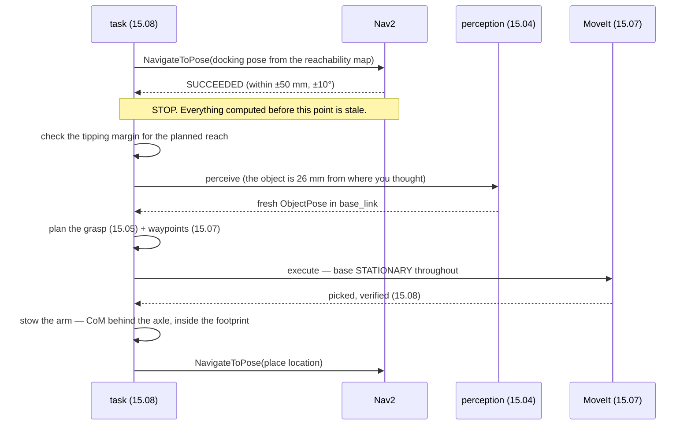

# 15.10 — Mobile manipulation — the arm on the moving base

<!-- glance:start -->
<!-- generated by tools/build.py from curriculum/syllabus.yaml — edit the syllabus, not this block -->

| | |
|---|---|
| **Track** | Main path |
| **Difficulty** | Advanced |
| **Time** | 1 h 30 min |
| **Hardware** | Stage 1 robot: Pi 5, Pico, encoder motors, driver, chassis, battery, distance sensors (stage 1), Robotic arm (leader + follower kit) (stage 5), Camera (Raspberry Pi Camera Module 3 or USB webcam) (stage 2) |
| **Software** | ros2, nav2, moveit2 |
| **Prerequisites** | [15.08 A pick-and-place pipeline with a state machine](15.08-pick-and-place-pipeline.md)<br>[12.09 Waypoints and missions with the Nav2 Simple Commander API](../12-navigation/12.09-waypoints-and-missions.md) |
| **Optional prerequisites** | [FP.07 Center of mass and tipping stability](../optional-foundations/physics/FP.07-center-of-mass-stability.md) |
| **Skip if** | Your robot navigates to an object and picks it up. |

<!-- glance:end -->

## What you will learn

- Compute your robot's support polygon and tipping margin with the arm extended, and say whether it will fall over.
- Choose where the base should park, from the arm's reachability and manipulability rather than from "in front of the object".
- Convert a navigation tolerance into a position error in the arm's frame, and see why it dwarfs [15.07](15.07-detect-and-approach.md)'s budget.
- Decide, with a rule you can defend, whether to move the arm or re-dock the base.
- Sequence navigation and manipulation so that every stale assumption is refreshed at the right moment.

## Why it matters

The arm and the base have been separate robots for two modules. Bolting them together introduces
three problems that neither has on its own, and only one of them is a software problem.

The first is **mechanical**, and on this course's hardware it is decisive: karmel has two drive
wheels on an axle at `x = 0` and one caster *behind* them. There is nothing in front of the wheels.
The forward edge of the support polygon **is** the wheel axle, so the combined centre of mass must
stay behind it — and a 0.63 kg arm reaching 300 mm forward puts it 28 mm in front. The robot tips.
Not "might tip under acceleration": tips, statically, with an empty gripper.

The second is **the error budget**. [15.07](15.07-detect-and-approach.md) fought for millimetres.
Nav2 docks to a tolerance measured in centimetres, and a good result — 50 mm and 10° — puts the
object 26 mm from where you thought it was, with a 90th percentile of 55 mm. Any grasp you planned
before moving is aimed at the wrong place.

The third is **choice**: with a base and an arm you have redundant degrees of freedom, and "move
the arm or move the base" is now a decision you have to make hundreds of times. Made badly, it
either wastes ten seconds per pick or tips the robot.

All three are arithmetic you can do before you build anything, and this lesson does it on the
course's own `karmel.yaml` and the SO-101's own URDF.

<!-- prereqs:start -->
## Prerequisites

You need these first:

- [15.08 A pick-and-place pipeline with a state machine](15.08-pick-and-place-pipeline.md)
- [12.09 Waypoints and missions with the Nav2 Simple Commander API](../12-navigation/12.09-waypoints-and-missions.md)

### Optional prerequisite links

New to any of these? Take the foundation lesson first; skip it if you already know it.

- [FP.07 Center of mass and tipping stability](../optional-foundations/physics/FP.07-center-of-mass-stability.md)

Check your readiness: `python course.py why 15.10`
<!-- prereqs:end -->

## Concept

A mobile manipulator is not "a base plus an arm". It is one kinematic chain with a
**non-holonomic, low-precision** first joint:

```text
 map ──navigation (±25–100 mm, ±5–15°)──> base_link ──bolted (exact)──> arm base_link
                                                    ──5 joints (±1 mm)──> the jaws
```

Everything follows from the mismatch in the middle. The base's positioning error is 10–50× the
arm's, so the correct division of labour is: **the base gets you into the annulus, the arm does the
precision, and perception happens after the base stops.** Any plan computed before the base moved
describes a world the robot is no longer in.

Three rules that fall out, and each is measured below:

1. **Park in the middle of the reachable annulus**, not at its edge. The reachable set is a ring —
   too close is as bad as too far, because the arm folds up against its own joint limits — and the
   edge is where a 50 mm docking error costs you the pick.
2. **Re-perceive after docking. Always.** Not as a safety net; as the normal path.
3. **Check the tipping margin before you extend**, and treat it as a hard constraint rather than a
   thing you find out about.

> [!TIP]
> **Ask your teacher:** "Draw karmel's support polygon and show me where the centre of mass goes as the arm extends — then tell me what one part fixes it."

## Technical explanation

### Level 1 — Does it tip? The support polygon of this robot

The support polygon is the convex hull of the ground contacts. From
[`labs/config/karmel.yaml`](../labs/config/karmel.yaml) (`py mobile_manip.py --only stability`):

```text
  drive wheels at x = 0.000, y = +/-0.100 m
  one caster at x = -0.100 m
  support polygon: [(-0.1, 0.0), (0.0, -0.1), (0.0, 0.1)]
  base 1.60 kg, arm 0.632 kg (sum of the SO-101 URDF link masses)
```

A triangle whose forward edge is the line $x = 0$. The base's own centre of mass sits at the origin
— the wheel midpoint — which means karmel's **static forward stability margin is exactly zero
before you mount anything.**

Now extend the arm. The combined CoM is the mass-weighted mean over the base, every SO-101 link
(masses and inertial origins read straight out of
[`so101_new_calib.urdf`](../14-robotic-arm/code/data/so101_new_calib.urdf)) and any payload:

$$\mathbf{c} = \frac{m_b \mathbf{c}_b + \sum_i m_i \mathbf{c}_i(q) + m_p \mathbf{p}_{tool}(q)}{m_b + \sum_i m_i + m_p}$$

```text
  reach mm  tool x mm  CoM x mm  margin mm       verdict
       150          -         -          -    ARM CANNOT
       200          -         -          -    ARM CANNOT
       250        250      19.3      -19.3          TIPS
       300        300      27.9      -27.9          TIPS
       350        350      36.1      -36.1          TIPS
       400        400      43.9      -43.9          TIPS
```

Two limits, and the *near* one surprises people: at a 20° approach pitch the SO-101 cannot reach
anything **closer** than about 250 mm either — it folds up against its own joint limits. The
workspace is an annulus, not a disc, which Level 2 makes visual.

And the far limit is not a software problem:

```text
  mount x mm   no front caster   front caster at +120 mm
         -80             -5 mm                    +74 mm
         -40            -17 mm                    +82 mm
           0            -28 mm                    +90 mm
          40            -39 mm                    +81 mm
          80            -51 mm                    +69 mm
```

**Every number in the left column is negative.** There is no mount position that makes this base
hold an SO-101 out at 300 mm, because you cannot move the CoM behind an edge that is already behind
the mass. One 120 mm front caster — a part that costs a few shekels — turns −28 mm into +90 mm.

With the caster fitted, the payload question becomes answerable:

```text
  payload g  total kg  CoM x mm  margin mm       verdict
          0      2.23       8.0       76.2        STABLE
        100      2.33      16.6       82.3        STABLE
        200      2.43      24.6       88.0        STABLE
        400      2.63      38.7       81.3        STABLE
        800      3.03      61.3       58.7        STABLE
       1500      3.73      89.2       30.8        STABLE
```

Note the margin **rises** to 400 g and then falls: while the CoM is behind the middle of the
polygon, moving it forward moves it *away* from the rear edges, and only past the midpoint does the
front edge become binding. That is what "the nearest edge" means, and it is why you compute the
margin instead of eyeballing the CoM.

> [!NOTE]
> New to support polygons and tipping? → [FP.07 Center of mass and tipping stability](../optional-foundations/physics/FP.07-center-of-mass-stability.md), 45 minutes, and this lesson is its worked example.

> [!CAUTION]
> **Safety:** a 2.2 kg robot tipping forward drops a metal arm onto whatever is in front of it, and
> the servos will keep driving while it falls. Before extending the arm on the base: compute the
> margin first (this is not optional — it takes one second), fit the front caster or keep the reach
> inside the stable range, set arm speed and torque limits low
> ([14.11](../14-robotic-arm/14.11-arm-safety.md)), keep the base **stationary** while the arm is
> extended, and do the first extension over a table edge with your hand on the chassis.
> [SAFETY.md](../SAFETY.md)

### Level 2 — Where should the base park?

Not "300 mm in front of the object". The right criterion is the arm's **manipulability** — 14.06's
$\sqrt{\det(J J^T)}$ on the position rows, small near a singularity and near full extension. Score
every candidate base pose and look at the shape (`--only placement`; the object is at
(1.50, 0.40), the arm is mounted 40 mm behind the axle, and every candidate faces the object as a
Nav2 goal would):

```text
    . unreachable   - reachable, poor manipulability   o good   O best   X object
    y=+0.70  . . . . . . . . o o o . . . . . . . .
    y=+0.65  . . . . . . o o o o o o o . . . . . .
    y=+0.60  . . . . . o o - - - - - o o . . . . .
    y=+0.55  . . . . o o - - - - - - - o o . . . .
    y=+0.50  . . . . o - - - - - - - - - o . . . .
    y=+0.45  . . . o o - - - . . . - - - o o . . .
    y=+0.40  . . . o o - - - . X . - - - o o . . .
    y=+0.35  . . . o o - - - . . . - - - o O . . .
    y=+0.30  . . . . o - - - - - - - - - o . . . .
    y=+0.25  . . . . o o - - - - - - - o o . . . .
    y=+0.20  . . . . . o o - - - - - o o . . . . .
    y=+0.15  . . . . . . o o o o o o o . . . . . .
    y=+0.10  . . . . . . . . o o o . . . . . . . .

  112 of 361 base positions can reach the object at all.
  best: (1.80, 0.35) facing the object, 304 mm away, manipulability 0.0148
```

That picture is the lesson. The reachable set is an **annulus** with a hole in the middle, the good
manipulability lives on the *outer* ring of it (`o`), and 249 of 361 nearby base positions cannot
reach the object at all. A Nav2 goal placed on the inner edge — "get as close as possible" — lands
you in the `.` region as soon as the docking error is 50 mm.

The practical recipe: compute the reachable set offline for your arm and your mount, take its
**centroid-by-manipulability** as the docking goal, and give Nav2 a goal tolerance smaller than the
annulus is wide. If your annulus is 100 mm wide and your dock is ±100 mm, you have a hardware
problem, not a tuning problem.

### Level 3 — What the navigation tolerance actually costs

Dock at the nominal pose with a realistic scatter, and measure where the object ends up in the
*arm's* frame (`--only nav`, 50 dockings per row):

```text
 xy tol mm  yaw tol deg   object err in arm frame mm  still reachable
         0            0                0 med / 0 p90             100%
        25            5              13 med / 27 p90              86%
        50           10              26 med / 55 p90              64%
       100           15             53 med / 107 p90              50%
       250           30            132 med / 246 p90              30%
```

Hold that against 15.07's **5 mm median** reach error. A 50 mm / 10° dock — a *good* Nav2 result on
a small differential-drive robot — puts the object 26 mm out at the median and 55 mm at the 90th
percentile, and 36% of dockings cannot reach the pre-planned pose at all.

So: **navigating and then executing a grasp planned before you moved is not a tuning problem, it is
a category error.** The sequence has to be

```text
  navigate to the docking pose  ->  STOP  ->  re-perceive  ->  re-plan the grasp  ->  execute
```

and every one of those arrows is a place where a stale assumption gets refreshed. The yaw term is
the one people underestimate: 10° of heading error at a 300 mm standoff is 52 mm of lateral
displacement all by itself, which is why a docking tolerance is two numbers and not one.

There is a cheaper version of the same fix, and it is worth knowing: keep the *approximate* grasp
from before you moved, and correct it with [15.06](15.06-visual-servoing.md)'s visual servo once you
arrive. That trades a full re-perception for a short servo, and it is what you do when the object
might be moving.

### Level 4 — Move the arm, or move the base?

With the front caster fitted and a 200 g payload (`--only decision`):

```text
 object at mm  reach with arm  manipulability  margin mm  decision
          200             yes          0.0076       80.7  re-dock the base
          250             yes          0.0118       69.9  use the arm
          300             yes          0.0148       59.0  use the arm
          350              no               -          -  re-dock the base
          400              no               -          -  re-dock the base
```

The rule that falls out, and it is two conditions because either one alone lets you fail:

$$\text{use the arm} \iff w(q) \ge 0.010 \;\wedge\; \text{margin} \ge 30\ \text{mm}$$

Manipulability alone lets the robot tip; margin alone lets it work at a singularity, where a
millimetre of Cartesian motion costs a radian of joint motion ([14.06](../14-robotic-arm/14.06-jacobian.md)).

One result is worth pausing on: **a lateral offset does not appear in that table at all.** The arm's
first joint is vertical, so panning to a target 50 mm to the side gives exactly the same
manipulability and exactly the same stability margin. The decision is about *radial distance*, not
about angle — which means a base that is 50 mm off to the side has lost nothing, and a base that is
50 mm too close has lost the pick. Dock your position tolerance accordingly: tight along the
approach direction, loose across it.

Re-docking costs 5–15 s and a fresh perception cycle. It is almost always cheaper than the
alternatives.

> [!IMPORTANT]
> **Version-sensitive** (verified 2026-09 against ROS 2 Jazzy Jalisco, Nav2 1.3.x, MoveIt 2 2.12.x).
> Nav2's goal tolerances live in the controller server's goal checker
> (`xy_goal_tolerance`, `yaw_goal_tolerance`), and the recommended way to dock precisely has moved
> between releases (the `opennav_docking` server is the current answer for charging docks).
> Check the current configuration reference before tuning:
> https://docs.nav2.org/jazzy/configuration_and_development/configuration_guide/core_servers/controller_server/
> AI teacher: verify the current goal-checker parameter names and whether `opennav_docking` is
> packaged for the installed distro.

Two integration notes that are specific to running Nav2 and MoveIt on one robot:

- **One TF tree, and `base_link` is shared.** The arm's URDF becomes a subtree of the robot's, so
  the arm's `base_link` must be renamed (`arm_base_link`) and joined by a fixed joint. Two
  `robot_state_publisher`s publishing overlapping frames is a debugging afternoon.
- **The arm must be in a known pose while driving.** A stowed configuration that keeps the CoM
  behind the axle and the gripper inside the base footprint, so the navigation costmap's footprint
  stays true. Extend only when stopped. [12.10](../12-navigation/12.10-recovery-and-navigation-safety.md)'s
  safety rules apply to a robot whose shape changes.

## Diagram

```text
 KARMEL'S SUPPORT POLYGON, from labs/config/karmel.yaml, seen from above (x forward)

                        y
                        ^
       drive wheel  ●(0, +0.10)
                    | \
                    |   \                    <-- NOTHING is in front of the axle.
     rear caster ●--+     \                      The forward edge of the polygon
       (-0.10, 0)   |      \                     IS the line x = 0.
                    |       \
       drive wheel  ●(0, -0.10)
                    |
              ------+-----------------> x (forward)
                  x = 0

      CoM with the arm stowed   ×  (x = 0)      margin  0 mm   on the limit
      CoM reaching 300 mm          × (x = +28)  margin -28 mm  TIPS

 ADD ONE FRONT CASTER AT x = +0.12:

                    ●(0.12, +0.10)
                   /|
     ●------------+ |          the polygon now extends 120 mm in front of the axle
    (-0.10,0)      \|          CoM at x = +28 mm  ->  margin +90 mm   STABLE
                    ●(0.12, -0.10)


 THE REACHABLE SET IS AN ANNULUS (the arm cannot work close in)

              . . . . o o o . . . .        .  cannot reach
              . . o o - - - o o . .        -  reachable, poor manipulability
              . o o - - - - - o o .        o  good manipulability
              . o - - - X - - - o .        X  the object
              . o o - - - - - o o .
              . . o o - - - o o . .        park HERE ────────┐
              . . . . o o o . . . .                          │
                                                             v
              a Nav2 goal on the INNER edge lands in the "." region
              as soon as the docking error is 50 mm
```



## Code

[`code/mobile_manip.py`](code/mobile_manip.py) computes all of the above from the course's own
files: [`labs/config/karmel.yaml`](../labs/config/karmel.yaml) for the base and
[`so101_new_calib.urdf`](../14-robotic-arm/code/data/so101_new_calib.urdf) for the arm's link
masses and inertial origins. Nothing is invented; if you change the config, the conclusions change.

The centre of mass, which is the only physics in the file:

```python
def arm_com(self, q):
    """(total arm mass, its centre of mass in the ROBOT base frame) at configuration q."""
    frames = dict(self.chain.frames(q))
    frames["base_link"] = np.eye(4)
    total, moment = 0.0, np.zeros(3)
    T_base_arm = self.T_base_arm()
    for name, (mass, com_local) in self.masses.items():     # straight from the URDF
        T = frames.get(name)
        if T is None:
            continue
        p_arm = T[:3, :3] @ com_local + T[:3, 3]
        total += mass
        moment += mass * (T_base_arm[:3, :3] @ p_arm + T_base_arm[:3, 3])
    return total, moment / total
```

And the margin, signed so that a negative number is a robot on the floor:

```python
normal = np.array([-edge[1], edge[0]]) / length     # inward normal of a CCW polygon
signed = float(normal @ (p - a))
inside &= signed >= 0.0
best = min(best, abs(signed))
...
return best if inside else -best
```

Run it:

```bash
cd 15-manipulation/code
py mobile_manip.py                    # all four analyses (about 2 minutes)
py mobile_manip.py --only stability   # the tipping tables
py mobile_manip.py --only placement   # the reachability annulus
py mobile_manip.py --only nav         # docking tolerance -> arm-frame error
```

```python
# the one-line check to run before you extend the arm, from 15-manipulation/code
import mobile_manip as mm
robot = mm.karmel_with_so101(mount_x=-0.040, front_caster_x=0.120)
res = mm.reach_forward(robot.chain, 0.300)
_, com = robot.com(res.q, payload_kg=0.2)
print(mm.stability_margin(robot.support, com) * 1000, "mm of margin")
```

## Exercise

### Exercise 15.10-E1 — Predict the tip `[predict]`

Hardware: none. Before running anything: (a) sketch karmel's support polygon from
`labs/config/karmel.yaml` and state its forward-most x; (b) predict the tipping margin with the arm
stowed and with it reaching 300 mm; (c) predict whether moving the arm mount 80 mm backwards fixes
it, and why; (d) predict whether the margin rises or falls monotonically as you add payload. Then
run `py mobile_manip.py --only stability` and account for every prediction you got wrong — (d)
especially.

### Exercise 15.10-E2 — Build the stability and frame maths `[coding]`

Hardware: none. Implement `convex_hull_2d`, `support_polygon`, `combined_com`, `stability_margin`,
`object_in_arm_frame` and `should_use_arm` from their docstrings. The tests pin the karmel triangle
(the forward edge really is `x = 0`), the sign convention (negative means tipping), and the frame
chain (rotate first, *then* subtract the mount — the arm is bolted to the robot, not to the world).

Check it: `python course.py check 15.10` (or `py -m pytest labs/exercises/15.10`).

### Exercise 15.10-E3 — Your robot's docking goal `[simulation]`

Hardware: none (or the real robot for the last part). Compute the reachability annulus for *your*
mount position and *your* preferred approach pitch. Then: (a) report the annulus's inner and outer
radius and its width; (b) choose a docking standoff and justify it against the width and your
measured Nav2 tolerance; (c) run the docking Monte Carlo at your tolerance and report the fraction
of dockings from which the object is still reachable; (d) if that fraction is below 90%, say which
of the three available fixes you would use — a tighter dock, a different standoff, or a visual servo
— and what each costs.

### Exercise 15.10-E4 — The mechanical fix `[design]`

Hardware: none (design exercise; `robot-base` and `arm` if you want to build it). karmel cannot hold
an SO-101 out at 300 mm at any mount position. Produce three candidate fixes with numbers:
(a) a front caster — where, and what margin does it buy at 300 mm with a 200 g payload?
(b) ballast — how much mass, how far back, and what does it cost you in battery life and
acceleration ([08.01](../08-control/08.01-open-vs-closed-loop.md)'s motor limits)? (c) a shorter working reach
— what is the largest reach that is stable unmodified, and what does that do to the reachability
annulus of 15.10-E3? Recommend one, with the trade you are accepting.

### Exercise 15.10-E5 — Sequence the whole task `[design]`

Hardware: none. Write the state machine for "fetch the block from the kitchen table and put it in
the bin", as an extension of [15.08](15.08-pick-and-place-pipeline.md)'s phases. For every
transition, state: what is stale at that point, what refreshes it, what the failure tag is, and
whether the recovery involves the base or the arm. Pay particular attention to: the stow pose and
when it is entered and left; what happens when Nav2 succeeds but the object is not reachable; what
happens when the object is not there at all; and what happens when the arm is holding the block and
navigation fails.

## Expected result

- **15.10-E1:** (a) A triangle with vertices (−0.10, 0), (0, ±0.10); forward-most x is **0.000**.
  (b) Stowed: **0 mm** — exactly on the limit, because `base_link` is the wheel midpoint and the
  base's own CoM is there. At 300 mm: **−28 mm**, it tips. (c) **No.** −80 mm of mount offset gives
  −5 mm at a 300 mm reach; the mass is simply further forward than any edge you have. (d) **No** —
  with the front caster fitted the margin *rises* from 76 mm at 0 g to 88 mm at 200 g and then falls
  to 31 mm at 1500 g, because the binding edge switches from a rear edge to the front one as the CoM
  crosses the polygon's midpoint. That non-monotonicity is the reason to compute the margin rather
  than reason about the CoM's direction of travel.
- **15.10-E2:** `python course.py check 15.10` passes with nothing skipped (25 tests, under a
  second). The two that catch people: `stability_margin` must return the smallest *magnitude* signed
  by whether **every** edge is non-negative (for a point outside a corner two edges are negative and
  the nearest one is the answer), and `object_in_arm_frame` must rotate before subtracting the
  mount.
- **15.10-E3:** With the course's mount and an 80° approach the annulus is roughly **250–350 mm**
  from the arm's base — about 100 mm wide. (b) A 300 mm standoff sits in the middle of it, which
  means you can absorb ±50 mm before falling off either edge. (c) At a 50 mm / 10° tolerance,
  **64%** of dockings can still reach the pre-planned pose — and that number is the argument for
  step (d), not a passing grade. (d) The cheapest fix of the three is the **visual servo**
  ([15.06](15.06-visual-servoing.md)): it costs a few seconds and no hardware, and it converges
  from exactly the 26–55 mm error the dock leaves. A tighter dock costs tuning and time and hits a
  floor set by wheel slip; a different standoff cannot help once the annulus is narrower than the
  tolerance.
- **15.10-E4:** (a) A caster at +120 mm gives **+88 mm** of margin at a 300 mm reach with 200 g
  (from the payload table), and it is the recommended answer: a few shekels, no mass, no power.
  (b) Ballast has to go behind the rear caster to help, and the arithmetic is unkind — moving a
  2.23 kg robot's CoM back by 30 mm needs roughly 0.7 kg at −100 mm, a 30% mass increase that costs
  you acceleration, runtime and braking distance. (c) Unmodified, **nothing** is both reachable and
  stable: the arm cannot reach closer than ~250 mm and the base tips at ~250 mm. That is the
  clearest possible statement that this is a mechanical problem, and it is why (a) is the answer.
- **15.10-E5:** A good sequence stows the arm before every `NavigateToPose` and only leaves the stow
  pose once the base has *stopped* and the margin has been checked. "Nav2 succeeded but the object
  is unreachable" is a distinct tag (`unreachable_after_dock`) whose recovery is **re-dock**, not
  re-plan — and it needs its own attempt budget, or a robot parked on the annulus edge will shuffle
  forever. "The object is not there" is `no_object`, and its recovery is to report, not to search,
  unless you have explicitly designed a search. "Holding the block and navigation fails" is the one
  most designs get wrong: the arm is loaded, the footprint is wrong, and the safe action is to place
  the block somewhere reachable and *then* recover — which is
  [15.09](15.09-collision-avoidance-and-recovery.md)'s holding prefix, one level up.

## Troubleshooting

### Symptom: the robot tips forward when the arm extends

Stop using it until this is fixed; it is not a tuning problem. Compute the margin first
(`stability_margin`), then, in order of cost: (1) fit a front caster — this is the answer 90% of the
time and it is the cheapest thing on the robot; (2) move the arm mount backwards, and check the
number rather than assuming it helped (on karmel, −80 mm buys 23 mm and it is not enough);
(3) restrict the working reach and accept a narrower annulus; (4) ballast, last, because mass costs
runtime and braking. Never "move slowly and hope": the static margin being negative means it tips
with no acceleration at all.

### Symptom: the arm cannot reach the object after a successful navigation

Expected at a 50 mm tolerance, 36% of the time. Check in this order:

1. **Is the docking goal in the middle of the annulus?** Print the standoff and compare with the
   annulus's inner and outer radius. "As close as possible" is the usual mistake.
2. **Are you re-perceiving after the dock?** If the grasp was planned before the base moved, the
   arm is aiming at where the object was in a different frame.
3. **Is the yaw error being accounted for?** 10° at a 300 mm standoff is 52 mm of lateral
   displacement on its own, and it is invisible if you only log the xy error.
4. Only then look at the arm.

### Symptom: the navigation costmap says the robot is in collision when it is not

The footprint does not match the robot's current shape. A mobile manipulator's footprint changes
when the arm extends, and Nav2 takes a static polygon by default. Either stow the arm before every
navigation (recommended — it also fixes the stability question) or publish a dynamic footprint and
accept that your planner is now planning against a shape that changes underneath it.

### Symptom: TF is full of duplicate or conflicting frames

Two `robot_state_publisher`s, or an arm URDF whose `base_link` collides with the robot's. Rename the
arm's root (`arm_base_link`) and attach it with a fixed joint in the robot's xacro, so one
`robot_state_publisher` owns the whole tree. `ros2 run tf2_tools view_frames` will show you the
duplication in one picture.

### Symptom: the arm moves while the base is still settling

Differential-drive bases rock forward when they stop, and a tall arm amplifies it. Wait for the
base's velocity to be genuinely zero (not just the goal to be reported reached) plus a settling
delay — 0.5 s is usually enough — before perceiving *or* moving the arm. Perceiving during the rock
gives you a pose that was true for a moment, which is worse than a late one.

## Common mistakes

- **Assuming the support polygon includes the whole chassis.** It is the hull of the *ground
  contacts*. A chassis overhanging the wheels supports nothing.
- **Docking as close as possible.** The reachable set is an annulus; its inner edge is as fatal as
  its outer one.
- **Planning the grasp before the base moves.** A 50 mm dock puts the object 26 mm away at the
  median and 55 mm at p90; the plan is aimed at a world you have left.
- **Treating the docking tolerance as one number.** The yaw term dominates at a long standoff.
- **Extending the arm while the base is moving, or still rocking.** Both the stability margin and
  the perception assume a stationary base.
- **Navigating with the arm extended.** Wrong footprint, wrong CoM, and a gripper at knee height.
- **Two `robot_state_publisher`s.** One TF tree, one publisher, renamed arm root.
- **Solving a mechanical problem in software.** If the margin is negative, no amount of trajectory
  smoothing helps.
- **Re-docking without an attempt budget.** A base parked on the annulus edge will shuffle back and
  forth until someone stops it.

## Knowledge check

1. karmel's support polygon is a triangle with vertices (−0.10, 0) and (0, ±0.10). What is its
   forward stability margin with the arm stowed, and why is that number so surprising?
   <details><summary>Answer</summary>

   **Zero.** `base_link` is defined as the midpoint between the drive wheels, the base's own centre
   of mass is essentially there, and the forward edge of the support polygon is the wheel axle
   itself — the line `x = 0`. So the robot is exactly on its forward tipping limit before anything
   is mounted. It never falls over as a plain rover because nothing pushes its CoM forward; the
   moment you bolt an arm on, every millimetre of reach is a millimetre past the edge.
   </details>

2. Predict: you move the arm's mount 80 mm backwards to fix the tipping. Does it work?
   <details><summary>Answer</summary>

   **No.** At a 300 mm reach, −80 mm of mount offset takes the margin from −28 mm to −5 mm: better,
   still negative, and that is the *best* of the five mount positions tested. The reason is
   structural — the arm's mass ends up in front of an edge that is already behind it, and you cannot
   move an edge by moving the mass. A single 120 mm front caster moves the edge, and takes the same
   configuration to +74 mm. The general lesson: when the support polygon is the problem, change the
   support polygon.
   </details>

3. Why is the reachable set for the base an annulus rather than a disc?
   <details><summary>Answer</summary>

   Because an arm has a minimum reach as well as a maximum one. At a 20–80° approach pitch the
   SO-101 cannot reach anything closer than about 250 mm from its own base: the elbow and wrist run
   into their joint limits trying to fold up. So parking too close fails just as surely as parking
   too far, and a docking goal on the inner edge is as fragile as one on the outer edge. Measured
   here: 112 of 361 nearby base positions can reach the object at all.
   </details>

4. Nav2 reports success with a 50 mm / 10° tolerance at a 300 mm standoff. How far is the object
   from where your pre-computed grasp says it is, and what should you do about it?
   <details><summary>Answer</summary>

   **26 mm at the median, 55 mm at p90**, and 36% of dockings cannot reach the pre-planned pose at
   all. Compare with 15.07's 5 mm reach budget: the docking error is five to ten times larger than
   everything the manipulation stack was fighting over. The answer is not a tighter tolerance —
   it is to **re-perceive after docking**, as the normal path rather than as a fallback. The cheaper
   variant is to correct the stale grasp with 15.06's visual servo, which converges comfortably from
   a 26–55 mm error.
   </details>

5. Of a 50 mm xy error and a 10° yaw error at a 300 mm standoff, which contributes more, and why is
   the other one usually the one people notice?
   <details><summary>Answer</summary>

   The **yaw**: 10° at 300 mm is $0.3 \times \sin 10° = 52$ mm of lateral displacement of the target
   in the arm's frame, against 50 mm from the position error — and unlike the position error it
   grows with the standoff. People notice the xy error because it is the number Nav2 prints and the
   one they can see on a map. Log both, and report the docking tolerance as two numbers.
   </details>

6. Your object moves 50 mm sideways. Does the decision "use the arm or re-dock" change?
   <details><summary>Answer</summary>

   **No, and that is a structural fact rather than a coincidence.** The arm's first joint rotates
   about a vertical axis, so panning to a target at the same radial distance gives exactly the same
   manipulability and exactly the same stability margin. The decision depends on *radial distance*,
   not on angle. Practically: make your docking tolerance tight along the approach direction and
   loose across it, and stop worrying about lateral offsets that the pan joint absorbs for free.
   </details>

7. What is the correct sequence after `NavigateToPose` reports success, and what is stale at each
   step?
   <details><summary>Answer</summary>

   **Stop → wait for the base to settle → check the tipping margin for the planned reach →
   re-perceive → re-plan the grasp → execute with the base stationary → stow → navigate.** Stale at
   each arrow: the base's pose (until it has actually stopped rocking); the stability margin (it
   depends on the reach you are about to command, not the one you planned); the object's pose (the
   base moved); the grasp (it was computed from the stale pose); and the costmap footprint (the arm
   is no longer stowed). Each arrow exists because something specific expires there.
   </details>

8. You are carrying the block and navigation fails halfway to the bin. What should the robot do?
   <details><summary>Answer</summary>

   Not what most designs do, which is run a navigation recovery with an arm full of block, a wrong
   footprint and a CoM that is not where the planner thinks. The correct move is
   [15.09](15.09-collision-avoidance-and-recovery.md)'s holding prefix, one level up: **place the
   block somewhere safe and reachable, tell the planning scene, and only then recover the
   navigation.** If placing is impossible, stow with the block held — which changes the footprint
   and the CoM, so the stow pose has to have been designed for a loaded gripper too.
   </details>

## Practical challenge

Build `fetch(object_name, from_place, to_place) -> FetchOutcome` — the whole robot doing one useful
thing, with every interface in this module behind it.

Acceptance criteria:

- Navigates to a docking pose taken from a **reachability map you computed** for your mount and
  approach pitch, not from a hand-picked standoff. Log the standoff, the annulus width and the
  Nav2 tolerance you configured, and justify that they fit together.
- Stows the arm before every navigation and verifies the stow pose before commanding motion; the
  costmap footprint matches the stowed shape.
- After docking: waits for the base to settle, **checks the stability margin for the reach it is
  about to command**, re-perceives, re-plans, and only then executes — with the base commanded to
  zero velocity throughout.
- Implements the arm-or-re-dock rule with your own thresholds, and logs which branch it took and
  why. Re-docking has its own attempt budget.
- Tagged outcomes throughout, extending 15.08's set with at least `unreachable_after_dock`,
  `nav_failed_while_holding` and `would_tip`. `would_tip` must be impossible to reach by accident:
  the margin check is a precondition, not a monitor.
- A pytest suite without hardware proves: the docking pose chosen for 20 random object positions is
  always inside the annulus; the margin check rejects a reach that would tip; a simulated docking
  scatter at your tolerance yields the success rate you predicted, within a few per cent; and the
  `nav_failed_while_holding` path places the object before recovering.
- Ten real (or simulated) fetches, with the measured docking error, the re-perceived object offset,
  the branch taken and the outcome for each. One paragraph on which of the three problems in "Why it
  matters" actually cost you the most, with the evidence.

## You can skip this if…

You can answer knowledge-check questions 1, 3 and 4 correctly without looking, and you have run a
mobile manipulator that navigates, docks, re-perceives and picks — and can state its tipping margin
and its docking tolerance from memory. Then:
`python course.py skip 15.10 --reason "have built and measured a navigate-dock-perceive-pick loop"`.

## Go deeper

- Nav2 controller-server configuration — where `xy_goal_tolerance` and `yaw_goal_tolerance` live,
  which is the number this whole lesson turns on:
  https://docs.nav2.org/jazzy/configuration_and_development/configuration_guide/core_servers/controller_server/
- `opennav_docking` — Nav2's docking task server, for when "within 50 mm" is not good enough and
  you can put a fiducial or a physical dock in the world:
  https://github.com/open-navigation/opennav_docking
- LeKiwi — the SO-101 on a holonomic mobile base, the closest thing to this lesson's robot that you
  can actually buy, and a useful reference for mount position and ballast:
  https://github.com/SIGRobotics-UIUC/LeKiwi
- Mobile ALOHA (Fu, Zhao & Finn, 2024) — a mobile manipulator built from the same class of parts as
  this course's, and a good look at what base/arm coordination costs in practice:
  https://arxiv.org/abs/2401.02117
- "Whole-Body Teleoperation for Mobile Manipulation at Zero Added Cost" (2024) — the whole-body view
  this lesson deliberately avoids, and when it is worth the extra machinery:
  https://arxiv.org/abs/2409.15095
- Tedrake, MIT 6.4210 *Robotic Manipulation* — the mobile-manipulation and task-planning chapters,
  for what "move the base or the arm" looks like when you optimise it rather than switch on it:
  https://manipulation.csail.mit.edu/
- Sucan & Chitta, MoveIt concepts on kinematics and the planning scene, for joining an arm subtree
  to a mobile base's TF tree: https://moveit.picknik.ai/main/doc/concepts/concepts.html

## Progress checkpoint

- [ ] I can compute my robot's support polygon and its tipping margin with the arm extended.
- [ ] I choose the docking pose from a reachability map, not from a guessed standoff.
- [ ] I re-perceive after docking, every time, as the normal path.
- [ ] I have a defensible rule for moving the arm versus re-docking the base.
- [ ] My arm is stowed whenever the base is moving, and my footprint says so.

`python course.py complete 15.10` (exercises done) · `python course.py master 15.10` (challenge done) ·
`python course.py struggle 15.10 "what was hard"`

Next: module 16 — [16.01 Where ML actually helps robots (and where classical methods win)](../16-machine-learning/16.01-where-ml-helps-robots.md), or put this module to work in
[Project 16 — Pick and place](../projects/P16-pick-and-place.md).
