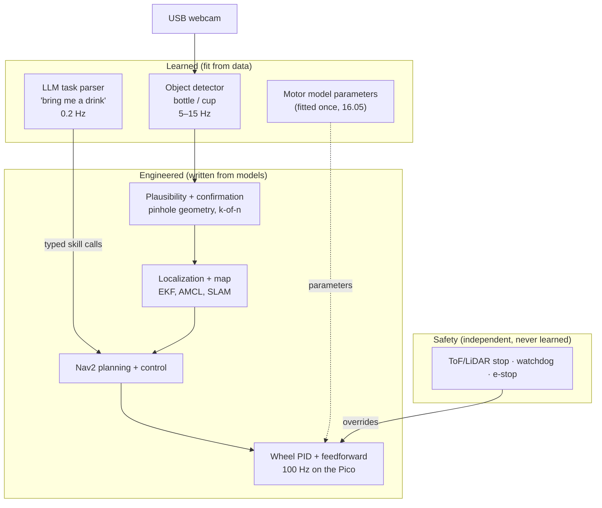

# 16.01 — Where ML actually helps robots (and where classical methods win)

<!-- glance:start -->
<!-- glance:end -->

## What you will learn

- Decide, for any part of karmel's software stack, whether it should be engineered, learned, or a hybrid, and defend the decision with six concrete questions.
- Name the honest failure mode of a learned component at each layer, from motor control to language.
- Compute what a model's latency and per-frame error rate mean for the robot: heading error, false alarms per hour.
- Wrap a learned component in engineered checks (confidence gates, physical plausibility, safety envelopes) instead of trusting it.

## Why it matters

The final karmel drives to the kitchen and picks up a bottle or a cup. Somewhere in that chain a neural network has to answer "is that a bottle?", because nobody can write that rule by hand for every bottle in every kitchen. But almost everything else in the chain — holding a wheel speed, estimating the pose, planning a path, stopping before a wall — is done better, faster and more safely by the classical methods you learned in modules 08–12.

Coming from AI/LLM work, the tempting move is "learn everything end to end". Coming from classical engineering, it's "ML is a black box, avoid it". Both are expensive mistakes on a robot. This lesson gives you a layer-by-layer argument you can reuse on every design decision in modules 16–20, and it sets up the rest of this module: data (16.02), fine-tuning (16.03), running models on robot compute (16.04), learning a motor model (16.05) and evaluating ML inside the robot (16.06).

<!-- prereqs:start -->
<!-- prereqs:end -->

## Concept

### Two ways to get a function

Every box in a robot's software is a function: encoder ticks → wheel speed, LiDAR scan → pose, image → "bottle at (u, v)". You can obtain that function two ways:

- **Write it** from a model you understand: kinematics, a first-order motor model, a Kalman filter, A*. This is *engineering*. You get guarantees, inspectability and tiny compute. You need to know the model.
- **Fit it** from examples: collect inputs and desired outputs, train a model. This is *machine learning* (new to it? → [FML.01 What machine learning is — and isn't](../optional-foundations/machine-learning/FML.01-what-is-ml.md)). You don't need the model, but you need data that covers the situations the robot will meet, and you get no guarantees outside that data.

The software analogy: a payment system's validation rules (engineered, auditable, never surprise you) versus its fraud score (learned, catches patterns nobody could write down, sometimes wrong in ways nobody predicted). Nobody ships a fraud model *instead of* the rules. The model feeds a decision the rules still bound. Robots work the same way.

### The shape of a good answer: learned parts inside an engineered frame

karmel finding a bottle, done well, looks like this:

1. A **learned detector** says "bottle, score 0.91, box at pixels (140, 60)–(170, 118)". Nothing else can do this job.
2. **Geometry** (engineered) turns the box and a range measurement into a position in the map frame (13.16) and checks the result is physically possible: a 58-pixel-tall object 3 m away would be 0.77 m tall, so it isn't a bottle.
3. **A tracker and a confirmation rule** (engineered) require the bottle to be seen in several frames before the robot commits.
4. **Nav2** (engineered) plans and drives there. The **safety layer** (engineered, dumb, reliable) stops the wheels if the ToF sensor sees anything closer than 20 cm, whatever the network believes.

The network does the one thing only a network can do. Everything that must be fast, provable or safe stays engineered. This pattern — **learned perception, engineered decision and control, independent safety** — is where the field is in 2026 for home robots. The frontier (vision-language-action models, module 18) pushes learning further down the stack for manipulation, but even there the controller, the joint limits and the e-stop stay classical.

### Where classical wins, in one sentence each

- You can write the physics down (motors, kinematics, dynamics).
- You need a guarantee (never drive into the stairs).
- The loop is fast and the compute is small (a 100 Hz PID on a Pico).
- Data is scarce, or collecting it means crashing the robot.

### Where ML wins, in one sentence each

- The input is the open world: images of objects, people, clutter, language.
- The behaviour is easy to demonstrate but hard to specify (folding a towel).
- The model exists but has unknown parameters that data can pin down (system identification, 16.05). This is ML's quiet, boring, extremely useful job.

> [!TIP]
> **Ask your teacher:** "Pick three components of a robot vacuum and argue both sides — engineered and learned — for each. Then tell me which side you think wins and why."

## Technical explanation

### Level 1 — Intuition: six questions

For any component, ask:

| # | Question | Pushes towards engineered when… | Pushes towards learned when… |
|---|---|---|---|
| 1 | **Model**: can you write the physics or geometry down? | Yes (motor, kinematics, projection) | No (what does a "cup" look like?) |
| 2 | **Data**: can you get enough examples cheaply and safely? | Data means crashes, or rare events | Logging is free, labels are cheap |
| 3 | **Variety**: how open-ended are the inputs? | Fixed, structured (encoder ticks) | Unbounded (any kitchen, any lighting) |
| 4 | **Latency**: does the loop leave room for a model? | Hard deadlines of milliseconds | Hundreds of milliseconds or seconds are fine |
| 5 | **Failure**: what does a wrong answer cost? | Injury, damage, a fall down the stairs | A retry, a slower task |
| 6 | **Verify**: must you explain or certify the behaviour? | Yes | "Passes the test suite" is enough |

No single question decides. A detector for bottles scores "learned" on almost everything. An obstacle stop scores "engineered" on everything. The interesting cases are in between.

### Level 2 — Practical: the stack, layer by layer, with honest failure modes

| Layer (rate) | What karmel uses | Where ML genuinely helps | Honest failure mode of the ML version |
|---|---|---|---|
| **Safety** (50–1000 Hz) | ToF/LiDAR threshold, firmware watchdog, e-stop | Nowhere in the stop path. ML may *request* slowing down near people. | A missed detection is a collision. A network has no "never" guarantee, and it fails silently on inputs unlike its training data. |
| **Actuation** (100 Hz) | PID + feedforward on the Pico (08) | Fitting feedforward/model parameters from logs (16.05); learning residual friction | An MLP motor model extrapolates badly: in 16.05 its error grows about 6× at a battery voltage it never saw, while the 3-parameter physics fit doesn't change. |
| **State estimation** (50 Hz) | Wheel odometry + IMU EKF (09, 10) | Learned IMU noise models, learned visual odometry features in texture-poor rooms | No calibrated covariance. The filter trusts a confident wrong estimate and the pose jumps. |
| **Mapping and localization** (1–10 Hz) | slam_toolbox, AMCL (11) | Learned place recognition, semantic labels on the map ("kitchen") | Seasonal/lighting changes break learned loop closures. A false loop closure corrupts the whole map. |
| **Perception** (5–30 Hz) | Classical color/contour detection for easy targets (13.03), AprilTags (13.07) | **Object detection and segmentation of everyday objects** (13.10, 16.03), open-vocabulary search (13.13) | Distribution shift: new room, new lighting, a transparent bottle. High offline mAP, poor closed-loop behaviour (16.06). |
| **Global planning** (≈1 Hz) | A*/Smac on a costmap (12) | Learned costs ("people walk here"), rarely the planner itself | A learned planner can't prove it avoids obstacles. Classical planners are optimal on the costmap and cheap. |
| **Local control** (20 Hz) | MPPI or DWB (12) | RL policies in research, sim-trained (17) | Sim-to-real gap, reward hacking, no hard constraint satisfaction (17.09). |
| **Manipulation** (10–50 Hz) | IK + MoveIt, heuristic grasps (14, 15) | Grasp prediction in clutter (15.05), imitation-learned policies (ACT, diffusion, 18) | Needs 50+ demonstrations per task; compounding errors when the scene drifts from the demos (18.02). |
| **Task and language** (0.1–1 Hz) | Behaviour trees, state machines | An LLM/VLM turns "bring me a drink" into typed skill calls (19) | Hallucinated objects, jailbreaks, seconds of latency. Never allowed near motor commands (19.01). |

Read the right-hand column twice. None of those failures shows up in a demo. All of them show up in a home over a month.

### Level 3 — Mathematics: what latency and error rates cost a robot

**Latency becomes geometry.** A detection describes the world at the moment the image was captured. If the robot rotates at $\omega$ while the model runs for $L$ seconds, a bearing combined with the *current* heading is wrong by

$$\Delta\theta = \omega L$$

Example: karmel spins at $\omega = 0.5$ rad/s to search. A MobileNet-class detector with $L = 0.12$ s gives $\Delta\theta = 0.06$ rad (3.4°). A ResNet-50-class detector running at $L = 1.6$ s on the Pi 5 CPU gives $\Delta\theta = 0.8$ rad (46°). At 2 m, a 0.8 rad error means aiming about $2 \sin 0.8 = 1.43$ m to the side of the bottle. The more accurate model can produce the worse robot. 16.06 simulates exactly this.

**Per-frame error rates become per-hour events.** Suppose a detector produces a false "bottle" with probability $q$ per frame, independently, at $f$ frames per second. In $t$ seconds you expect $q f t$ false alarms, and the chance of none at all is

$$P(\text{no false alarm}) = (1 - q)^{f t}$$

At $f = 10$ Hz for one hour ($N = 36{,}000$ frames):

| $q$ per frame | Expected false alarms per hour | $P$(none in 1 min) | $P$(none in 1 h) |
|---|---|---|---|
| 0.01 | 360 | 0.0024 | ≈ 0 |
| 0.001 | 36 | 0.55 | ≈ 0 |
| 0.0001 | 3.6 | 0.94 | 0.027 |

A detector that is "99.9% right per frame" still raises 36 false alarms per hour. That is fine if a false alarm costs a 10-second detour and the tracker filters most of them. It is unacceptable if a false alarm triggers the obstacle stop in the middle of a hallway, or worse, if a *missed* obstacle is the failure. This arithmetic is why safety functions stay engineered and why every learned perception output passes through confirmation rules.

**Extrapolation.** A learned model is an interpolator of its training data. A physics model extrapolates as far as its physics holds. In [16.05](16.05-learning-dynamics.md) you'll fit both to the same motor logs recorded at 10.5–12.5 V: at a nearly empty battery (9.3 V) the physics model's error stays at 0.004 rad/s while the MLP's grows from 0.048 to 0.288 rad/s.

> [!NOTE]
> New to the pinhole model used below? → [13.05 The pinhole camera model](../13-computer-vision/13.05-pinhole-camera-model.md).

### Level 4 — Implementation: patterns for putting ML on a robot

1. **Put the model behind an interface, with a non-ML fallback.** `ObjectDetector.detect(image) -> list[Detection]` has a classical implementation (color + contours, 13.03) for tests and a learned one for the real task. This is the same idea as the `DifferentialBase` HAL with a simulator behind it.
2. **Gate on confidence, then on physics.** A pinhole camera says an object $H$ metres tall at distance $Z$ appears $h = f_y H / Z$ pixels tall. With karmel's 320×240 stream and 1.20 rad horizontal field of view, $f_y = 160 / \tan(0.6) = 233.9$ px. A "bottle" 58 px tall with the LiDAR reading 1.00 m along that bearing is $58 \times 1.00 / 233.9 = 0.25$ m tall: plausible. The same box with the LiDAR reading 3.10 m (the wall behind a poster) implies 0.77 m: reject.
3. **Require temporal consistency.** k detections in the last n frames, or a tracker with a minimum track age (13.12), before any action.
4. **Keep an engineered safety envelope that ignores the model.** Speed limits, the ToF stop and the watchdog run on the Pico and don't read the network's output.
5. **Log what the model saw and decided.** Every false alarm the robot logs is a labelled training example for the next version (16.02) and a data point for field monitoring (16.06).

## Diagram



## Code

Two small, runnable programs live in `16-machine-learning/code/` (Python ≥ 3.10, standard library only).

### The scorecard: `ml_fit_scorecard.py`

It encodes the six questions for twelve components of karmel's stack as scores from −2 (engineer it) to +2 (learn it). The scores are judgement calls, and they're meant to be argued with.

```bash
cd 16-machine-learning/code
py ml_fit_scorecard.py                                      # Linux/macOS: python3
py ml_fit_scorecard.py --explain perception.object_detection
```

The core of the decision:

```python
@dataclass(frozen=True)
class Component:
    layer: str
    name: str
    scores: tuple[int, int, int, int, int, int]   # model, data, variety, latency, failure, verify
    loop_hz: float
    note: str

    @property
    def verdict(self) -> str:
        total = sum(self.scores)
        if total <= -4:
            return "engineer it"
        if total >= 4:
            return "learn it"
        return "hybrid: engineered frame, learned part"
```

Output:

```text
layer             component                mode data vari late fail veri total  verdict
actuation         wheel_speed_pid            -2   +2   -2   -2   -1   -1    -6  engineer it
actuation         motor_feedforward_model    +0   +2   -1   -1   +1   +0    +1  hybrid: engineered frame, learned part
safety            obstacle_stop              -2   -2   -1   -2   -2   -2   -11  engineer it
state_estimation  odometry_and_ekf           -2   +0   -2   -2   -1   -1    -8  engineer it
state_estimation  slam                       -1   +0   +0   +0   -1   -1    -3  hybrid: engineered frame, learned part
perception        object_detection           +2   +1   +2   +1   +1   +1    +8  learn it
perception        fiducial_markers           -2   +0   -2   -1   +0   -1    -6  engineer it
navigation        global_planning            -2   -1   -1   +0   -1   -1    -6  engineer it
navigation        local_control              -1   -1   +0   -1   -2   -1    -6  engineer it
manipulation      grasp_selection            +1   +0   +2   +0   +0   +0    +3  hybrid: engineered frame, learned part
manipulation      dexterous_pick_policy      +2   +0   +2   +0   +1   +1    +6  learn it
task              language_to_goals          +2   +2   +2   +2   +0   +0    +8  learn it

3 of 12 components are clearly 'learn it'. Everything that keeps karmel safe is engineered.
```

### An engineered check around a learned output: `plausibility_gate.py`

```python
import math

FY_PX = (320 / 2) / math.tan(1.20 / 2)          # 320x240 stream, karmel.yaml horizontal FOV 1.20 rad
REAL_HEIGHT_M = {"bottle": (0.15, 0.35), "cup": (0.07, 0.15)}
TOLERANCE = 0.2                                 # +-20 %: box looseness, range noise, camera tilt


def implied_height_m(box_height_px: float, range_m: float) -> float:
    """Pinhole model: h_px = fy * H / Z  =>  H = h_px * Z / fy."""
    return box_height_px * range_m / FY_PX


def plausible(label: str, box_height_px: float, range_m: float) -> tuple[bool, float]:
    lo, hi = REAL_HEIGHT_M[label]
    h = implied_height_m(box_height_px, range_m)
    return (lo * (1 - TOLERANCE) <= h <= hi * (1 + TOLERANCE)), h
```

`py plausibility_gate.py` prints:

```text
fy = 233.9 px
bottle  58 px at 1.00 m -> 0.25 m tall -> ACCEPT   (real bottle on the floor)
bottle  58 px at 3.10 m -> 0.77 m tall -> REJECT   (bottle on a poster: the LiDAR sees the wall behind it)
cup     40 px at 2.00 m -> 0.34 m tall -> REJECT   ('cup' that is really a vase across the room)
cup     24 px at 1.20 m -> 0.12 m tall -> ACCEPT   (real mug on a low table)
```

## Exercise

All exercises need hardware: **none**.

### Exercise 16.01-E1 — Predict the verdicts `[predict]`

Before running `ml_fit_scorecard.py`, cover its output and write down your own verdict (engineer / learn / hybrid) for: wheel speed PID, obstacle stop, SLAM, object detection, AprilTag detection, grasp selection, language to goals. Then run the script. For every disagreement, write one sentence naming the question (model, data, variety, latency, failure, verify) where you and the script differ.

### Exercise 16.01-E2 — Latency and false alarms on the back of an envelope `[numerical]`

(a) karmel searches by spinning at 0.8 rad/s. A detector takes 0.45 s per frame on the Pi 5. If the code combines the detected bearing with the robot's current heading, what is the heading error in degrees, and how far to the side of a bottle 1.5 m away does the robot aim? (b) The same detector outputs a false "cup" in 1 of every 2,000 frames and runs at 2 Hz. How many false cups per hour of searching? What is the probability of a 10-minute search with no false cup? (c) You add a rule: act only if the object appears in 2 of 3 consecutive frames. Assuming independent false alarms, roughly how many *confirmed* false cups per hour remain?

### Exercise 16.01-E3 — Score a different robot `[coding]`

Copy `ml_fit_scorecard.py` to `vacuum_scorecard.py` and replace `STACK` with a robot vacuum's components: bumper stop, cliff sensor stop, room segmentation of the map, carpet detection, "avoid pet mess and cables" camera detector, coverage path planner, voice commands. Score each and write a one-line `note` defending your scores. Run it and make sure every safety component comes out "engineer it". If one doesn't, change the scores or explain in the note why your scoring rule is wrong.

### Exercise 16.01-E4 — The learned obstacle stop `[debugging]`

A teammate replaces karmel's ToF-threshold stop with "the detector's `person` and `wall` classes, stop if score > 0.5 and box height > 120 px". In the office tests it stopped every time (50 of 50 runs). At home it hit a glass door and a black sofa in the first week. Write a short incident analysis: (1) the two most likely root causes, using the six questions, (2) why 50/50 in the office proved little (use the false-alarm arithmetic in reverse: what failure rate per approach is still consistent with 0 failures in 50 runs?), (3) the design you would ship instead.

## Expected result

- **16.01-E1:** Most engineers agree with the script on the PID, obstacle stop, AprilTags and object detection. Typical disagreements: SLAM (you may say "engineer it"; the script's "hybrid" reflects learned place recognition and semantics), grasp selection (−1 to +5 are all defensible depending on clutter) and language (some score `failure` negative because a wrong goal wastes a trip). Full credit if every disagreement names a specific question.
- **16.01-E2:** (a) $\Delta\theta = 0.8 \times 0.45 = 0.36$ rad = **20.6°**. Lateral miss $1.5 \sin 0.36 =$ **0.53 m** (±0.01). (b) $q f t = 0.0005 \times 2 \times 3600 =$ **3.6 false cups per hour**. $P = (1 - 0.0005)^{1200} =$ **0.55** (±0.01). (c) The probability that a given window of 3 frames holds at least 2 false alarms is about $3q^2 = 7.5 \times 10^{-7}$, so about $7200 \times 7.5 \times 10^{-7} \approx$ **0.005 per hour**, one per ~200 hours. Real false alarms are *not* independent (the same poster fools every frame), so the true number is higher. That's why the plausibility gate exists.
- **16.01-E3:** A scorecard where bumper and cliff stops score ≤ −8, the coverage planner ≤ −4, and the pet-mess/cable detector ≥ +4 (open-world images, retry is cheap, but a miss smears the floor, so `failure` near 0). Room segmentation and voice commands usually land at "hybrid" or "learn it". The script must run and print a table.
- **16.01-E4:** (1) Distribution shift and a missing model: glass and black leather look nothing like the office's walls and people, and "box height > 120 px" encodes a camera-distance assumption that fails for large dark surfaces. The camera also can't see glass reliably at all, while a ToF sensor measures it (mostly). (2) With 0 failures in $n = 50$ trials, the 95% upper bound on the per-approach failure rate is about $3/n = 6\%$ (the "rule of three"). At 20 approaches a day that's still about one collision a day. (3) Keep the ToF/LiDAR threshold stop on the Pico as the only safety function. Use the detector only to *slow down earlier* near people, never to decide that it is safe to continue.

## Troubleshooting

### Symptom: the learned component worked in the demo and fails at home

1. **List what differs** between the demo data and home: rooms, lighting, objects, camera height, motion blur, time of day. If you can't list the demo conditions, you didn't control them. Start logging them (16.02).
2. **Check whether the failure is perception or integration.** Replay the logged frames through the model offline. If the offline detections are good, the bug is in the integration: latency compensation, thresholds, frame transforms (16.06).
3. **If perception is at fault, collect failing frames** from the new condition, label them, and evaluate on a held-out *session* from that condition before and after retraining (16.03).
4. **Add an engineered gate** (plausibility, temporal confirmation) so the next unknown failure is a skipped detection rather than a wrong action.

### Symptom: the team can't agree whether to learn or engineer a component

1. Score it with the six questions, independently, then compare. Disagreements usually sit on one question.
2. Turn that question into a measurement: "latency" becomes the p90 inference time on the Pi (16.04). "Data" becomes the labelling hours for 500 boxes. "Failure" becomes a list of consequences.
3. Build the cheapest classical baseline first (an afternoon). Keep the learned version only if it beats the baseline *on the task metric*, in the real conditions.

### Symptom: `py ml_fit_scorecard.py` fails with `SyntaxError` or `TypeError` on `tuple[...]`

Run `py --version` (or `python3 --version`). The course needs Python 3.10 or newer.

## Common mistakes

- **"End to end is more elegant."** It also removes every place where you could test, bound or explain the behaviour. Learn the part you can't write, engineer the rest.
- **Putting a network in the safety path.** Networks have no "never". Safety functions must be simple enough to reason about exhaustively and must run even when the model process has crashed.
- **Comparing models by offline accuracy only.** A slower, more accurate model can make a worse robot (latency becomes heading error). Evaluate the robot, not the model (16.06).
- **Forgetting that "ML" includes fitting parameters of a known model.** Least-squares system identification (16.05) is machine learning, and often the most valuable ML on a small robot.
- **Skipping the classical baseline.** Without one, you can't tell whether the network earned its compute, latency and data costs. For a single bright-colored target, 13.03's color segmentation may be enough.
- **Trusting confidence scores as probabilities.** Neural network scores are usually over-confident. Calibrate them before using them in decisions (16.06).

## Knowledge check

1. Name the six questions and, for each, the answer that pushes a component towards being engineered.
   <details><summary>Answer</summary>

   Model: the physics/geometry can be written down. Data: examples are scarce or dangerous to collect. Variety: inputs are fixed and structured. Latency: hard millisecond deadlines. Failure: a wrong answer causes injury or damage. Verify: the behaviour must be explained or certified.
   </details>

2. Why is object detection of bottles and cups the textbook case for a learned component, while AprilTag detection is not?
   <details><summary>Answer</summary>

   Nobody can write down what every bottle looks like under every lighting condition (model: no; variety: open world), labelled images are cheap, a 100–200 ms latency is acceptable, and a wrong detection costs a retry once geometry and confirmation rules gate it. AprilTags are designed patterns with exact geometry: a classical decoder with PnP is faster, exact and verifiable (13.07). ML adds nothing there.
   </details>

3. karmel spins at 0.6 rad/s while searching. Model A takes 90 ms per frame, model B takes 1.2 s. If the code uses the current heading to aim, what heading error does each cause?
   <details><summary>Answer</summary>

   $\Delta\theta = \omega L$. A: $0.6 \times 0.09 = 0.054$ rad (3.1°). B: $0.6 \times 1.2 = 0.72$ rad (41°). The fix is to store the robot pose at image capture time and combine the bearing with *that* pose, but B still sees far fewer frames per search.
   </details>

4. A detector's false-positive rate is 0.2% per frame at 5 Hz. How many false alarms per hour? What changes if the false alarms come from one poster the robot passes daily?
   <details><summary>Answer</summary>

   $0.002 \times 5 \times 3600 = 36$ per hour on average. If they come from one poster, they aren't independent: every frame of the poster is wrong, so temporal confirmation doesn't remove them. You need a plausibility check (the implied real size is wrong) or new training data with that poster labelled as background.
   </details>

5. Predict: you fit an MLP and a 3-parameter physics model to motor logs recorded with a full battery. Which one's error grows more when the battery is nearly empty, and why?
   <details><summary>Answer</summary>

   The MLP's. It only interpolates between voltages it saw. The physics model encodes speed ∝ duty × voltage, which remains true outside the training range. In 16.05 the MLP's error grows about 6× while the physics model's stays flat.
   </details>

6. Debugging scenario: a detector gives score 0.95 on a "bottle" that the LiDAR places 3.5 m away, and the box is 70 px tall on the 320×240 stream ($f_y$ = 233.9 px). Accept or reject, and why?
   <details><summary>Answer</summary>

   Implied height $= 70 \times 3.5 / 233.9 = 1.05$ m. No bottle is 1 m tall, so reject, whatever the score. Likely a floor lamp, a poster, or the box is on an object in front of a far wall while the LiDAR beam passed beside it. A high score doesn't override geometry.
   </details>

7. Where does ML *not* belong in karmel, under any score, and what goes there instead?
   <details><summary>Answer</summary>

   The safety path: the obstacle stop, the watchdog and the e-stop. Instead: a range-sensor threshold and a command watchdog on the Pico, plus a hardware e-stop that cuts motor power. ML may only request more caution (slow down near people), never permit less.
   </details>

## Practical challenge

Write a one-page **architecture decision record** (ADR, the same format you'd use for a distributed-systems decision) for karmel's "find a bottle or a cup" perception, comparing four options: (1) classical color/contour detection (13.03), (2) a fine-tuned detector (16.03), (3) an open-vocabulary detector such as OWLv2 or Grounding DINO (13.13), (4) a cloud VLM call (13.14).

**Acceptance criteria:**

- Each option gets the six-question scores with one sentence of evidence per score. At least two of the pieces of evidence are *measured* by you (for example, inference latency on your laptop from 13.10, or the number of labelled images you already have).
- The ADR names the failure mode of the chosen option and the engineered mitigation (confidence threshold, plausibility gate, k-of-n confirmation, fallback) for each.
- The decision states the task-level metric that would make you revisit it (for example, "success rate of the find-and-approach task below 85% over 20 trials in two rooms"), which you will measure in 16.06.
- Your teacher (or a colleague) can't find a component in your design where a model's wrong answer leads directly to motion without an engineered check.

## You can skip this if…

You can answer knowledge-check questions 3, 4 and 6 correctly without looking, and you can argue for and against ML for each layer of a robot's stack (safety, actuation, estimation, perception, planning, manipulation, task) in under five minutes, naming a concrete failure mode for each.

`python course.py skip 16.01 --reason "I already decide learned vs engineered per layer"`

## Go deeper

- [FML.01 What machine learning is — and isn't](../optional-foundations/machine-learning/FML.01-what-is-ml.md) — the course's foundation lesson on training, inference and when ML is appropriate at all.
- Sculley et al., "Hidden Technical Debt in Machine Learning Systems" (NeurIPS 2015): https://papers.nips.cc/paper_files/paper/2015/hash/86df7dcfd896fcaf2674f757a2463eba-Abstract.html — why the model is the small part of an ML system. Every point applies doubly to robots.
- Capuano et al., "Robot Learning: A Tutorial" (Hugging Face, 2025): https://arxiv.org/abs/2510.12403 — a modern bridge from classical robotics to learned policies, with LeRobot examples. Read the introduction for the argument, the rest before module 18.
- Tedrake, *Robotic Manipulation* (MIT course notes): https://manipulation.csail.mit.edu/ — a working roboticist's view of where perception is learned and control stays model-based.
- Tedrake, *Underactuated Robotics*, chapter "System Identification": https://underactuated.csail.mit.edu/sysid.html — the quiet kind of ML that fits physical models; background for 16.05.
- Hugging Face Robotics Course: https://huggingface.co/learn/robotics-course — the classical-to-learning progression, hands-on.

## Progress checkpoint

- [ ] I can score any robot component with the six questions and defend the verdict.
- [ ] I can name the honest failure mode of a learned component at each layer of karmel's stack.
- [ ] I can compute heading error from latency and false alarms per hour from a per-frame error rate.
- [ ] I can design engineered gates (confidence, plausibility, temporal confirmation, safety envelope) around a learned output.

`python course.py complete 16.01` (exercises done) · `python course.py master 16.01`
(challenge done) · `python course.py struggle 16.01 "what was hard"`

Next: [16.02 — Data for robots: collecting, labeling, datasets from rosbags](16.02-robot-data.md).
