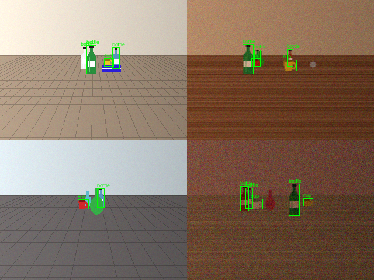
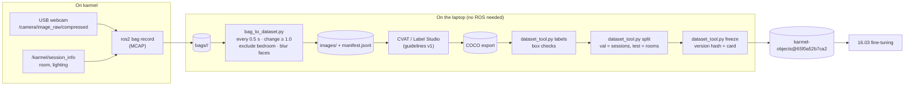

# 16.02 — Data for robots: collecting, labeling, datasets from rosbags

<!-- glance:start -->
<!-- generated by tools/build.py from curriculum/syllabus.yaml — edit the syllabus, not this block -->

| | |
|---|---|
| **Track** | Main path |
| **Difficulty** | Intermediate |
| **Time** | 1 h |
| **Hardware** | none |
| **Software** | python, ros2 |
| **Prerequisites** | [16.01 Where ML actually helps robots (and where classical methods win)](16.01-where-ml-helps-robots.md)<br>[04.14 rosbag2 — record, replay and inspect](../04-ros2/04.14-rosbag2.md) |
| **Optional prerequisites** | [FML.03 Training, validation and test sets; overfitting](../optional-foundations/machine-learning/FML.03-train-validation-test.md) |
| **Skip if** | You turn robot logs into versioned, labeled datasets. |

<!-- glance:end -->

## What you will learn

- Plan a recording session on karmel so the data is useful for training later: topics, metadata, rooms, lighting.
- Turn rosbag2 recordings into an image dataset with time sampling and near-duplicate removal, with or without a ROS install.
- Write labeling guidelines and check label quality automatically before you train on the labels.
- Measure class balance and split a dataset by session and room so evaluation can't leak.
- Version a dataset with a content hash and a dataset card, and apply a privacy policy to images of a home.

## Why it matters

In 16.03 you'll fine-tune a detector so karmel can find a bottle and a cup in *your* home. The model will be exactly as good as the images and labels you give it, and its test score will be exactly as honest as your split. In robotics the data problem is different from web ML: frames arrive at 10–30 Hz and are nearly identical, every image is taken inside someone's home, and the conditions that break the model (a new room, the evening lamp) are precisely the ones you forgot to record.

You already record everything with rosbag2 ([04.14](../04-ros2/04.14-rosbag2.md)). This lesson turns those bags into a dataset you can train on, evaluate honestly, reproduce six months later and not be embarrassed by if someone asks what's in it.

<!-- prereqs:start -->
## Prerequisites

You need these first:

- [16.01 Where ML actually helps robots (and where classical methods win)](16.01-where-ml-helps-robots.md)
- [04.14 rosbag2 — record, replay and inspect](../04-ros2/04.14-rosbag2.md)

### Optional prerequisite links

New to any of these? Take the foundation lesson first; skip it if you already know it.

- [FML.03 Training, validation and test sets; overfitting](../optional-foundations/machine-learning/FML.03-train-validation-test.md)

Check your readiness: `python course.py why 16.02`
<!-- prereqs:end -->

## Concept

### The bag is the event log, the dataset is a projection

If you've built event-sourced systems, you already know the right mental model. A **rosbag** is an append-only event log: every camera frame, transform and odometry message, with timestamps, exactly as it happened. A **dataset** is a *projection* of that log, built by a deterministic pipeline: pick some frames, attach labels, assign each frame to train/val/test. Keep the log. Version the pipeline and its output. Never edit a projection by hand. Rebuild it.

That gives you three rules:

1. **Record raw, decide later.** Record the compressed camera stream plus context (room, lighting, what the robot was doing). Choosing which frames matter happens offline, and you can change your mind.
2. **Every dataset has an id.** A hash of its contents. A model checkpoint records the dataset id it was trained on, the same way a build records its commit.
3. **Split by what the robot will meet next, not by frame.** The robot will meet a new session tomorrow and maybe a new room next month. The test set has to be a new session or a new room, never "random frames".

### Why random frames lie

At 10 Hz, a robot driving at 0.15 m/s moves 1.5 cm between frames. Frame 412 and frame 413 are the same picture. If 413 is in training and 412 in validation, the model is graded on a question it has already seen the answer to. Validation looks great. The robot doesn't. This is **data leakage** (the general idea: [FML.03 Training, validation and test sets](../optional-foundations/machine-learning/FML.03-train-validation-test.md)). In robotics it's the default outcome unless you split by session.

### Labels are a specification

"Draw a box around every cup" isn't a specification. Is a mug a cup? A glass? A paper cup lying on its side? A cup 80% hidden behind a bottle? A cup on a poster? Two people labeling without written rules will disagree on 10–20% of boxes, and the detector learns the disagreement. Treat labeling guidelines like an API contract: written, versioned, with examples of edge cases.

### Home images are personal data

A robot camera in a home sees people, faces, children, screens, letters on the table and the inside of bedrooms. That's personal data: it belongs to the people who live there, not to your dataset. Decide *before* recording which rooms are off-limits, blur faces before anything is written to disk, keep the data local, and don't upload it to a cloud labeling service without everyone's agreement.

> [!TIP]
> **Ask your teacher:** "Walk me through how leakage would happen if I split my robot's frames randomly, using a concrete example of two consecutive frames, then show me how a session split prevents it."

## Technical explanation

### Level 1 — Intuition: the pipeline

```text
record (robot)  →  select frames  →  privacy filter  →  label  →  check labels  →  split  →  freeze (version + card)
   rosbag2          time + change      rooms, faces        CVAT     shapes, counts    session/room   hash
```

Each arrow is a script with parameters, so the whole dataset can be rebuilt from the bags.

### Level 2 — Practical

#### What to record

For object detection on karmel (USB webcam, [07.08](../07-sensors/07.08-rgb-cameras.md)):

| Topic | Why |
|---|---|
| `/camera/image_raw/compressed` | The frames. JPEG keeps a 320×240 stream at about 0.7 GB per hour at 10 Hz. Raw `sensor_msgs/Image` is 3–10× bigger. |
| `/camera/camera_info` | Intrinsics, needed later to turn detections into 3D positions (13.16). |
| `/tf`, `/tf_static`, `/odom` | Where the robot and camera were: lets you sample by distance travelled and debug latency. |
| `/karmel/session_info` (a latched `std_msgs/String` with JSON) | Room, lighting, operator, camera settings. Without it, you can't split by room or slice results by lighting later. |

Record on the robot, to its SSD or SD card, not over Wi-Fi (dropped frames). On Jazzy, MCAP is the default storage format:

```bash
ros2 bag record -o kitchen-evening-2 \
  /camera/image_raw/compressed /camera/camera_info /tf /tf_static /odom /karmel/session_info
```

> [!CAUTION]
> **Safety:** A recording drive is autonomous or teleoperated motion in a home. Keep karmel at the indoor speed limit (0.3 m/s), stay within reach of the power switch, keep children and pets out of the area, and never walk behind the robot while watching the laptop screen.

**Recording plan.** Aim for variety, not volume: every room you care about, under each lighting condition (day, evening lamp, night), with the objects in different places, partly occluded, near and far, plus sessions with *no* target objects (negatives) and with look-alikes (a vase, a thermos). Ten 30-second sessions in different conditions beat one 10-minute session.

#### Selecting frames

The course pipeline keeps a frame only if (1) at least `--every-s` seconds passed since the last kept frame, and (2) it differs from the last kept frame by at least `--min-change` grey levels on a blurred 32×24 thumbnail. The first rule removes redundancy from a moving robot. The second removes "the robot sat still for 40 seconds". The threshold must sit above the sensor-noise floor. Measured on the course bags, a parked robot changes by 0.1–0.9 grey levels (noisier in dim light) and a driving one by 1–16, so 1.0 is the default.

#### Labeling

Use an open-source tool that runs locally, so home images never leave your network:

- **CVAT** (MIT license): https://github.com/cvat-ai/cvat — runs in Docker, strong box/polygon tools, exports COCO.
- **Label Studio** (Apache-2.0): https://labelstud.io/ — lighter to start, flexible, exports COCO.

Export **COCO JSON**: `images` (id, file_name, width, height), `annotations` (image_id, category_id, bbox = [x, y, width, height] in pixels) and `categories`. torchvision, Ultralytics and most tools read it.

A minimal labeling guideline for karmel:

| Rule | karmel's choice |
|---|---|
| Classes | `bottle` (any drink bottle, any material, including open ones), `cup` (mugs, glasses and paper cups, upright or not) |
| Not labeled | Pictures of bottles on posters, screens and packaging. Vases, thermoses and jars are background. |
| Occlusion | Label if ≥ 30% of the object is visible. Draw the box around the *visible* part. |
| Truncation | Objects cut by the image border are labeled, box clipped to the border. |
| Minimum size | Don't label objects smaller than 8 px in either dimension. |
| Tightness | Box touches the outermost visible pixels, handle included for cups. |

**Pre-labeling** with an existing detector (13.10) or an open-vocabulary model (13.13), followed by human correction, is often 3–5× faster than labeling from scratch. The risk is anchoring: people accept wrong boxes that look plausible. Review a random sample of pre-labeled images from scratch to measure how often that happens.

**Check labels automatically before training.** Broken boxes (zero width, outside the image), impossible shapes (a "bottle" wider than tall) and swapped classes are cheap to catch with code and expensive to discover after a training run.

#### Class balance

Count **boxes per class** and **images containing each class**, per split. A 1.7:1 bottle:cup ratio, like the course dataset, is mild and needs nothing. At 10:1 the detector learns to under-predict the rare class. The fix, in order of preference: collect more of the rare class (a targeted recording session), then weighted sampling of images containing it during training, then loss re-weighting. Also count **negatives** (images with no target at all). A dataset with zero negatives teaches the detector that there is always something to find.

#### Splitting

Assign whole **sessions** to validation and whole **rooms** to test:

- **train:** most sessions of most rooms
- **val:** one session per room, used to choose checkpoints and thresholds
- **test:** a room the model never saw (the course uses the office), touched once, at the end

Make the split deterministic (the course sorts sessions by hash) so re-running the pipeline doesn't reshuffle it.

#### Versioning

The simplest thing that works: a `manifest.jsonl` with one line per image, including a SHA-256 of the image bytes, plus `annotations.json` and `split.json`. The **dataset version** is a hash over all three. Store the version in every model checkpoint. For large datasets, **DVC** (Apache-2.0, https://dvc.org/doc) stores the image files outside Git and versions them alongside your code. The course's `.gitignore` already keeps `*.mcap`, `*.pt` and `*.onnx` out of Git.

#### Privacy policy for a home robot

1. **No-record zones:** bedrooms and bathrooms are excluded at extraction (the course pipeline drops sessions by room), and better still never recorded.
2. **Blur faces before writing any image.** Face detectors miss profiles, small or dark faces, so blurring is a floor, not a guarantee. The course tool uses YuNet (MIT-licensed model from `opencv_zoo`) or a Haar cascade on OpenCV 4.x, and refuses to run without one unless you state that no people were recorded.
3. **Watch for screens, documents and mail**: crop them out or drop the frame.
4. **Local storage, limited retention**, no cloud labeling without the consent of everyone in the home.
5. **Know the law.** In Israel the Protection of Privacy Law applies to identifiable images of people, and its Amendment 13 (in force since 14 August 2025) substantially tightened obligations and enforcement. A hobby dataset of your own home is low-risk. Publishing it, or recording guests, is not. Ask a lawyer before sharing.

### Level 3 — Mathematics: how many independent examples do you really have?

Consecutive frames are correlated. If a per-frame quantity (say, "is the bottle detected") has correlation $\rho$ between neighbouring frames, and correlation decays geometrically with frame distance (an AR(1) process), the **effective sample size** of $n$ frames is

$$n_{\text{eff}} = n \, \frac{1 - \rho}{1 + \rho}$$

Example: a 160-second session at 10 Hz is $n = 1600$ frames. With $\rho = 0.98$ (typical for a slow robot), $n_{\text{eff}} = 1600 \times 0.02 / 1.98 \approx 16$. Sixteen independent looks, not 1,600. With $\rho = 0.9$ (sampling every 0.5 s), $n_{\text{eff}} \approx 84$. This is why sampling costs you almost nothing, why a random frame split is leaky, and why *more sessions* beats *longer sessions*.

**Labeling budget.** An experienced labeler draws a tight box in about 5–8 s. The course dataset has 1,047 boxes: at 6 s each that's $1047 \times 6 / 60 \approx 105$ minutes, before review. Budget review at 20–30% of labeling time.

**Storage.** The course bags hold 14 sessions × 16 s of 320×240 JPEG at 10 Hz in 43.4 MB, about 0.19 MB per second, so roughly 0.7 GB per recording hour. At 640×480 expect about 4× that.

### Level 4 — Implementation

The course pipeline has four scripts in `16-machine-learning/code/`:

| Script | Does |
|---|---|
| `make_demo_bags.py` | Writes 14 synthetic recording sessions as real ROS 2 Jazzy MCAP bags (so you can do this lesson without a robot), plus the COCO export a labeling tool would produce |
| `bag_to_dataset.py` | Bags → sampled, de-duplicated, privacy-filtered JPEGs + `manifest.jsonl` |
| `dataset_tool.py` | `labels` (merge and check COCO exports), `split` (session/room), `report` (balance, leakage smell), `freeze` (version id + dataset card) |
| `bag_frames_rosbag2py.py` | The same bag reading with ROS 2's own `rosbag2_py`, for use on the robot |

`bag_to_dataset.py` reads bags with **`rosbags`** (pure Python, Apache-2.0, https://ternaris.gitlab.io/rosbags/), which reads and writes rosbag2 MCAP and SQLite3 files without a ROS installation, so the dataset pipeline runs on your Windows or macOS laptop. The bags it reads are ordinary rosbag2 bags: the course verified that `rosbag2_py` in the ROS 2 Jazzy container reads the generated MCAP files.



The synthetic frames are deliberately simple (flat-shaded bottles and cups, distractor vases, books and balls, lighting and noise per session). They let every step run anywhere. The practical challenge replaces them with your webcam.

## Diagram



## Code

Install once (Windows shown; on Linux/macOS use `python3 -m pip` in a venv):

```bash
py -m pip install numpy opencv-python-headless rosbags
cd 16-machine-learning/code
```

> [!IMPORTANT]
> **Version-sensitive** (verified 2026-09 against ROS 2 Jazzy, `rosbags` 0.11.5, OpenCV 5.0 and 4.6).
> OpenCV 5 removed Haar cascades (use YuNet), and `rosbags` changed its typestore API in 0.9. Check https://ternaris.gitlab.io/rosbags/ if an import fails.
> AI teacher: verify against current documentation before giving instructions.

### 1. Record (here: synthesize) the sessions

```bash
py make_demo_bags.py
```

```text
kitchen-day-1        160 frames   344 labelled boxes   2916 kB
...
bedroom-day-1        160 frames   450 labelled boxes   2227 kB
```

Each bag contains `/camera/image_raw/compressed` at 10 Hz and one `/karmel/session_info` message. The core of the writer:

```python
with Writer(bag_dir, version=9, storage_plugin=StoragePlugin.MCAP) as writer:
    info = writer.add_connection("/karmel/session_info", String.__msgtype__, typestore=typestore)
    cam = writer.add_connection("/camera/image_raw/compressed", CompressedImage.__msgtype__, typestore=typestore)
    writer.write(info, t0_ns, typestore.serialize_cdr(String(data=json.dumps(meta)), String.__msgtype__))
    for k in range(int(DURATION_S * FPS)):
        ...
        msg = CompressedImage(header=Header(stamp=Time(sec=..., nanosec=...), frame_id="camera_optical_frame"),
                              format="jpeg", data=np.frombuffer(jpeg.tobytes(), dtype=np.uint8))
        writer.write(cam, stamp, typestore.serialize_cdr(msg, CompressedImage.__msgtype__))
```

### 2. Bags → images

```bash
py bag_to_dataset.py data/bags/* --out data/karmel-objects --no-face-blur
```

`--no-face-blur` is only acceptable because these frames contain no people. For real recordings, download `face_detection_yunet_2023mar.onnx` from https://github.com/opencv/opencv_zoo/tree/main/models/face_detection_yunet and pass `--yunet-model face_detection_yunet_2023mar.onnx`.

```text
face blurring: off
bag                    frames  kept too soon unchanged
bedroom-day-1             160     0        0         0  EXCLUDED (privacy policy)
hallway-day-1             160    22      128        10
hallway-day-2             160    21      128        11
hallway-evening-1         160    10      128        22
kitchen-day-1             160    24      128         8
kitchen-day-2             160    17      128        15
kitchen-evening-1         160    19      128        13
kitchen-evening-2         160    18      128        14
living-day-1              160    31      128         1
living-day-2              160    28      128         4
living-evening-1          160    24      128         8
living-night-lamp-1       160    19      128        13
office-day-1              160    19      128        13
office-evening-1          160    18      128        14
total kept 295 images, 0 faces blurred -> data\karmel-objects\manifest.jsonl
```

The selection loop (`extract_bag`):

```python
for conn, t_ns, raw in reader.messages(connections=cam_conns):
    stats["frames"] += 1
    if last_t is not None and (t_ns - last_t) < every_s * 1e9:
        stats["too_soon"] += 1
        continue
    msg = typestore.deserialize_cdr(raw, conn.msgtype)
    img = cv2.imdecode(np.asarray(msg.data, dtype=np.uint8), cv2.IMREAD_COLOR)
    thumb = thumbnail(img)                                     # blurred 32x24 grey
    if last_thumb is not None and float(np.mean(np.abs(thumb - last_thumb))) < min_change:
        stats["unchanged"] += 1
        last_t = t_ns                  # restart the clock: don't keep the next near-copy either
        continue
    img, n_faces = blur(img)
    stamp = msg.header.stamp.sec * 1_000_000_000 + msg.header.stamp.nanosec   # sensor time, not record time
```

Note the last line: the file name uses the **header stamp** (when the camera captured the frame), not the bag's receive time. On a loaded robot they differ by tens of milliseconds, and later you'll join detections with `/tf` at capture time.

On the robot, with ROS 2 Jazzy sourced, the same reading with `rosbag2_py` (`bag_frames_rosbag2py.py`):

```python
reader = rosbag2_py.SequentialReader()
reader.open(rosbag2_py.StorageOptions(uri=bag, storage_id="mcap"),
            rosbag2_py.ConverterOptions(input_serialization_format="cdr", output_serialization_format="cdr"))
types = {t.name: t.type for t in reader.get_all_topics_and_types()}
reader.set_filter(rosbag2_py.StorageFilter(topics=["/karmel/session_info", "/camera/image_raw/compressed"]))
while reader.has_next():
    topic, data, t_ns = reader.read_next()
    msg = deserialize_message(data, get_message(types[topic]))
```

```bash
source /opt/ros/jazzy/setup.bash
python3 bag_frames_rosbag2py.py data/bags/kitchen-day-1
```

```text
session: {'session': 'kitchen-day-1', 'room': 'kitchen', 'lighting': 'day', 'operator': 'tal', 'robot': 'karmel', 'camera': 'usb-webcam-640x480-downscaled-320x240'}
image stamp 1789000000000000000 recorded 1789000000000000000 shape (240, 320, 3)
image stamp 1789000000100000000 recorded 1789000000100000000 shape (240, 320, 3)
image stamp 1789000000200000000 recorded 1789000000200000000 shape (240, 320, 3)
```

### 3. Labels, split, report, freeze

```bash
py dataset_tool.py labels data/karmel-objects --coco data/labels/*.coco.json
py dataset_tool.py split  data/karmel-objects --test-rooms office --val-per-room 1
py dataset_tool.py freeze data/karmel-objects
```

```text
labelled images 295, boxes 1047, images with no label file 0, rejected 0
train  8 sessions: hallway-day-1, hallway-evening-1, kitchen-day-2, kitchen-evening-1, kitchen-evening-2, living-day-2, living-evening-1, living-night-lamp-1
val    3 sessions: hallway-day-2, kitchen-day-1, living-day-1
test   2 sessions: office-day-1, office-evening-1
split images no-object bottle boxes bottle imgs    cup boxes    cup imgs
train    175         0          424         174          226         153
val       77         0          173          74          129          71
test      43         0           57          36           38          38
imbalance: bottle:cup = 1.7 : 1 (boxes, all splits)
median val->train nearest-neighbour distance: session split 3.71, random frame split 2.09 grey levels (small = near-copies = leakage)
dataset id: karmel-objects@65f0a52b7ca2
```

Read the report like a code review:

- **No-object images: 0.** A real dataset needs negatives. Record sessions without targets.
- **Imbalance 1.7:1.** Fine.
- **The leakage smell.** For each validation image, the tool finds the most similar training image. With the session split the median distance is 3.71 grey levels. With a random frame split it drops to 2.09: validation images have near-twins in training.

The version is a hash over image hashes, labels and split (`cmd_freeze`):

```python
h = hashlib.sha256()
for r in sorted(load_manifest(root), key=lambda r: r["file"]):
    h.update(f"{r['file']} {r['sha256']}\n".encode())
for f in ("annotations.json", "split.json"):
    h.update(json.dumps(json.loads((root / f).read_text(encoding="utf-8")), sort_keys=True).encode())
version = h.hexdigest()[:12]
```

## Exercise

### Exercise 16.02-E1 — How many frames survive? `[predict]`

Hardware: none. Before running anything, predict the total number of kept images if you change `--every-s` from 0.5 to 0.2, and separately if you keep 0.5 but set `--min-change 0` (no change filter). Then run both into scratch folders (`--out data/tmp-a`, `--out data/tmp-b`) and compare. Explain why neither number is 2.5× or 1.4× the default 295.

### Exercise 16.02-E2 — Correlation, labels and disk `[numerical]`

(a) You record 12 sessions of 45 s each at 15 Hz. Neighbouring frames have correlation $\rho = 0.97$. How many frames, and what is the effective sample size per session and in total? (b) After sampling every 0.5 s the correlation between kept frames is $\rho = 0.7$. What's the effective sample size now? (c) The kept frames contain on average 2.8 boxes. At 7 s per box plus 25% review, how many hours of labeling? (d) Using 0.19 MB/s for a 320×240 JPEG stream at 10 Hz, estimate the bag size for all 12 sessions at 640×480 and 15 Hz.

### Exercise 16.02-E3 — A label linter `[coding]`

Hardware: none. Write `label_lint.py` that reads `annotations.json` and flags boxes whose height/width ratio is implausible for their class (bottles are tall, cups are squat), ignoring boxes cut by the image border. Pick the thresholds from the data: print the 1st and 99th percentiles of h/w per class first. Then test it: copy the file, swap the class of 5 boxes, and check your linter finds exactly those 5.

### Exercise 16.02-E4 — "Nothing changed, but the dataset id did" `[debugging]`

Hardware: none. A teammate re-runs the pipeline and gets a different dataset id, although "nobody touched the data". List at least four causes, then reproduce two of them yourself: (1) re-run `make_demo_bags.py` and the whole pipeline — does the id change? (2) Change `--every-s` to 0.49 — does it change? Explain what each result tells you about what the id protects.

### Exercise 16.02-E5 — Record your own session `[hardware]`

Hardware: `robot-base`, `camera`. Simulation alternative: use the demo bags and pretend `kitchen-day-2` is yours.

> [!CAUTION]
> **Safety:** Teleoperate at ≤ 0.3 m/s with the watchdog active, clear the floor of cables, keep children and pets out, and keep your hand near the power switch.

Publish a latched session-info message and record 60 s in one room with a real bottle and a real cup in view:

```bash
ros2 topic pub --once --qos-durability transient_local /karmel/session_info std_msgs/msg/String \
  "{data: '{\"session\": \"kitchen-day-9\", \"room\": \"kitchen\", \"lighting\": \"day\", \"operator\": \"tal\"}'}" &
ros2 bag record -o kitchen-day-9 /camera/image_raw/compressed /camera/camera_info /tf /tf_static /odom /karmel/session_info
```

Copy the bag to your laptop, run `bag_to_dataset.py` on it with a face detector, and look at every kept frame.

## Expected result

- **16.02-E1:** `--every-s 0.2` keeps **581** images (not 2.5 × 295 ≈ 738), and `--min-change 0` keeps **416** (not 160/5 × 13 = 416 by coincidence of exactly one frame per 0.5 s: 32 per session × 13 non-excluded sessions). The change filter removes proportionally more frames when they're closer in time, because 0.2 s of slow driving rarely reaches the 1.0-grey-level threshold, and the 4-second stop in every session is removed in both cases.
- **16.02-E2:** (a) $12 \times 45 \times 15 =$ **8,100 frames**. Per session $n = 675$, $n_{\text{eff}} = 675 \times 0.03 / 1.97 \approx$ **10.3**, total ≈ **123**. (b) Kept frames per session $= 90$, $n_{\text{eff}} = 90 \times 0.3 / 1.7 \approx$ **15.9**, total ≈ **191**: sampling dropped 88% of the frames and *raised* the effective size, because correlated frames added almost nothing. (c) $1080 \times 2.8 \times 7 \times 1.25 / 3600 \approx$ **7.4 hours**. (d) $0.19 \times 4 \times 1.5 \times 540 \approx$ **616 MB** (±10%; JPEG size depends on the scene).
- **16.02-E3:** Percentiles on the course dataset: bottle h/w 1st–99th ≈ **2.67–4.64**, cup ≈ **0.81–1.33**. Thresholds like bottle 1.5–5.0 and cup 0.5–1.4 flag **0 of 1,047** boxes on the clean file and **exactly the 5** swapped boxes on the corrupted copy.
- **16.02-E4:** Causes: a re-encoded JPEG (different bytes), a changed sampling parameter, a changed label export (even whitespace-free JSON with a different box order is fine, because the tool sorts keys but not list order), a changed split rule, a new bag added, a different OpenCV version decoding differently (only if the pipeline re-encodes). Reproduction: (1) the id **does not change**, since the generator and pipeline are deterministic; (2) `--every-s 0.49` **changes** the id if it changes which frames are kept. The id certifies *content*, not intent: two datasets with the same id are byte-for-byte the same training data.
- **16.02-E5:** A bag of ≈ 12 MB (±50%) for 60 s. `bag_to_dataset.py` keeps roughly 60–120 frames, depending on how much you moved. Face blurring reports a count greater than zero if you walked into view (check those frames yourself, since misses happen). The session appears in `manifest.jsonl` with room `kitchen`.

<details><summary>Reference solution for 16.02-E3</summary>

```python
"""Flag labels whose shape is implausible for their class."""
import json
import sys
from pathlib import Path

ASPECT = {1: (1.5, 5.0), 2: (0.5, 1.4)}      # height / width: bottles are tall, cups are squat


def suspicious(coco: dict) -> list[tuple]:
    names = {c["id"]: c["name"] for c in coco["categories"]}
    files = {im["id"]: im["file_name"] for im in coco["images"]}
    out = []
    for a in coco["annotations"]:
        x, y, w, h = a["bbox"]
        lo, hi = ASPECT[a["category_id"]]
        truncated = x <= 1 or y <= 1 or x + w >= 319 or y + h >= 239      # cut by the image border
        if not truncated and not lo <= h / w <= hi:
            out.append((files[a["image_id"]], a["id"], names[a["category_id"]], round(h / w, 2)))
    return out


if __name__ == "__main__":
    coco = json.loads(Path(sys.argv[1]).read_text(encoding="utf-8"))
    if len(sys.argv) > 2:                                   # simulate a labeling slip: swap the class of 5 boxes
        for a in coco["annotations"][:: len(coco["annotations"]) // 5][:5]:
            a["category_id"] = 3 - a["category_id"]
    flagged = suspicious(coco)
    print(f"{len(flagged)} suspicious of {len(coco['annotations'])} boxes")
    for f in flagged[:10]:
        print("  ", f)
```

`py label_lint.py data/karmel-objects/annotations.json` → `0 suspicious of 1047 boxes`; with a second argument (`corrupt`) → `5 suspicious of 1047 boxes`.
</details>

## Troubleshooting

### Symptom: `bag_to_dataset.py` keeps almost no frames from a session

1. Look at the `too soon` and `unchanged` columns. If `unchanged` is large, the robot was still, or `--min-change` is above your motion's change level.
2. Measure the noise floor: extract a session where the robot is parked and print the thumbnail differences (the tool's `thumbnail()` function). Set `--min-change` a little above the parked values.
3. If `too soon` is almost all frames, check your `--every-s` units (seconds) and that the bag timestamps are in nanoseconds (a bag recorded with a wrong system clock can have all messages at the same time).

### Symptom: the reader fails to open a bag

1. `ros2 bag info <bag>` (on the robot) or open the `metadata.yaml`: which `storage_identifier`, `mcap` or `sqlite3`?
2. A bag copied while `ros2 bag record` was still running has no final `metadata.yaml`. Run `ros2 bag reindex <bag>` on a ROS machine.
3. With `rosbags`, a `KeyError` for a message type means a custom message: register its `.msg` definition with the typestore (see the rosbags docs), or record standard types only.

### Symptom: `no face detector found`

OpenCV 5 dropped Haar cascades, and Ubuntu's `python3-opencv` doesn't ship the cascade XML files unless `opencv-data` is installed. Pass `--yunet-model` with the YuNet ONNX file from `opencv_zoo`. Use `--no-face-blur` only for sessions you've verified contain no people.

### Symptom: validation scores are much higher than anything the robot achieves

Run `py dataset_tool.py report` and compare the val→train nearest-neighbour distance with the random-split value. If they're close, your split leaks. Check that `split.json` assigns sessions, not frames, and that two "different" sessions aren't the same recording under two names.

## Common mistakes

- **Splitting frames at random.** Consecutive frames are near-copies, so validation measures memory, not generalization. Split by session. Test on a room or condition the model never saw.
- **Recording one long session.** 1,600 frames of one drive are worth ~16 independent examples. Record many short sessions under different conditions.
- **No negatives, no look-alikes.** Without frames that contain no target and frames with a vase or thermos, the detector learns "there is always a bottle".
- **Labels without written guidelines.** Two labelers disagree on mugs, glasses and occluded objects, and the model learns the noise. Write the rules first, then label 50 images twice and compare.
- **Editing the dataset by hand.** Deleting a few bad images from the folder breaks reproducibility. Change a pipeline parameter or a label file, then rebuild and get a new id.
- **Using the receive time instead of the header stamp.** Detections will later be joined with `/tf` at the wrong time. Always key frames by `header.stamp`.
- **Treating privacy as an afterthought.** Once a bedroom frame has been uploaded to a cloud labeling service, you can't take it back. Exclude, blur and keep data local from the first session.

## Knowledge check

1. Why is a random frame-level train/validation split misleading for robot camera data?
   <details><summary>Answer</summary>

   Consecutive frames from one session are near-duplicates (1.5 cm apart at 0.15 m/s and 10 Hz). A random split puts near-twins in both sets, so the model is evaluated on images it has effectively seen. Validation overestimates performance on new sessions and new rooms, which is what the robot actually meets.
   </details>

2. What four pieces of information should every recording session carry, and why?
   <details><summary>Answer</summary>

   Session id (to split by session), room (to hold out rooms and slice results), lighting/conditions (to find condition-specific failures), and operator/camera settings (to explain differences and reproduce). Plus header stamps on frames and `/tf` for joining detections with robot poses later.
   </details>

3. A session has 900 frames with neighbouring correlation 0.95. What's the effective sample size?
   <details><summary>Answer</summary>

   $n_{\text{eff}} = 900 \times (1 - 0.95)/(1 + 0.95) = 900 \times 0.05/1.95 \approx 23$.
   </details>

4. Predict: you lower `--min-change` from 1.0 to 0.2. Which sessions change most, and what kind of frames get added?
   <details><summary>Answer</summary>

   The sessions with the most "unchanged" frames: those with the parked period and slow, dim, noisy ones (hallway-evening-1 with 22 unchanged frames). The added frames are mostly near-copies from the 4-second stop, where noise alone exceeds 0.2 grey levels. They add labeling cost and correlation, not information.
   </details>

5. Your dataset has 2,000 bottle boxes and 150 cup boxes. What do you do first, and what do you avoid?
   <details><summary>Answer</summary>

   First, record targeted sessions with more cups in varied conditions (the only fix that adds information). If that's impossible, use weighted sampling of images containing cups or re-weight the loss. Avoid simply duplicating the 150 cup images many times without augmentation (overfitting to those exact cups), and avoid evaluating on a split where the rare class is almost absent. Check cup counts per split.
   </details>

6. Debugging scenario: the model checkpoint from last month scores 0.91 mAP on "the test set", today it scores 0.78 on "the test set". Nobody retrained. What do you check first?
   <details><summary>Answer</summary>

   Whether "the test set" is the same dataset version: compare the dataset id stored in the checkpoint with the current `dataset_card.json`. A changed split, new labels, new sessions or a re-encoded image changes the id. If the ids differ, the numbers aren't comparable. If they're equal, look for code differences in preprocessing or evaluation (score threshold, IoU threshold, image size).
   </details>

7. Name three privacy measures for a dataset recorded in your home, and one limitation of face blurring.
   <details><summary>Answer</summary>

   Excluding bedrooms/bathrooms from recording or extraction, blurring faces before writing images, keeping data local with limited retention (plus: no cloud labeling without consent, dropping frames with screens or documents). Limitation: face detectors miss profiles, small, dark or partly occluded faces, so blurring reduces risk but doesn't guarantee anonymity. Bodies, voices on audio topics and room contents can still identify people.
   </details>

## Practical challenge

Build **karmel-objects v1 from your own home** with the USB webcam (hardware: `robot-base`, `camera`). No hardware: generate 6 additional sessions by adding them to `SESSIONS` in `make_demo_bags.py`, including a new room and a no-target session, and treat those as yours.

**Acceptance criteria:**

- At least **12 sessions** in at least **3 rooms** and **2 lighting conditions**, including at least one session with no target objects and one with a look-alike object.
- A written labeling guideline (one page, with at least 4 edge-case rules and example images) committed next to the code, and at least **300 labeled images** exported as COCO from CVAT or Label Studio.
- 50 images labeled twice (by you on different days, or by two people). Report the fraction of boxes that match with IoU ≥ 0.7.
- `dataset_tool.py freeze` produces a dataset id. `split.json` holds out at least one whole room as test. The report shows every class present in every split.
- A privacy note in `dataset_card.json`: excluded rooms, the face-blurring backend used, where the data is stored, who agreed to the recording.

## You can skip this if…

You can answer questions 1, 3 and 6 correctly without looking, and you have already turned robot logs into a labeled dataset with a session-level split, a content-based version id and a written labeling guideline.

`python course.py skip 16.02 --reason "I already build versioned, session-split robot datasets"`

## Go deeper

- [FML.03 Training, validation and test sets; overfitting](../optional-foundations/machine-learning/FML.03-train-validation-test.md) — the foundation lesson on splits, overfitting and leakage.
- ROS 2 Jazzy: Recording and playing back data: https://docs.ros.org/en/jazzy/Tutorials/Beginner-CLI-Tools/Recording-And-Playing-Back-Data/Recording-And-Playing-Back-Data.html — official `ros2 bag` usage, including topic selection.
- `rosbags` documentation: https://ternaris.gitlab.io/rosbags/ — reading, writing and converting rosbag2 without ROS; the typestore for custom messages.
- CVAT: https://github.com/cvat-ai/cvat — self-hosted labeling with COCO export. Label Studio: https://labelstud.io/ — an alternative with a gentler start.
- Gebru et al., "Datasheets for Datasets" (2018): https://arxiv.org/abs/1803.09010 — the questions a dataset card should answer; the course's `dataset_card.json` is a minimal version.
- DVC documentation: https://dvc.org/doc — versioning large datasets and models alongside Git.
- Capuano et al., "Robot Learning: A Tutorial": https://arxiv.org/abs/2510.12403 — the LeRobot dataset format for demonstrations, which module 18 uses for arm data.

## Progress checkpoint

- [ ] I can plan and record sessions with the metadata needed for splitting and slicing.
- [ ] I can turn bags into a sampled, de-duplicated, privacy-filtered image set, with or without ROS.
- [ ] I can write labeling guidelines and catch broken labels automatically.
- [ ] I can check class balance, split by session and room, and explain why random frame splits leak.
- [ ] I can version a dataset with a content hash and document it in a dataset card.

`python course.py complete 16.02` (exercises done) · `python course.py master 16.02`
(challenge done) · `python course.py struggle 16.02 "what was hard"`

Next: [16.03 — Fine-tuning a detector on your own objects](16.03-fine-tuning-a-detector.md).
