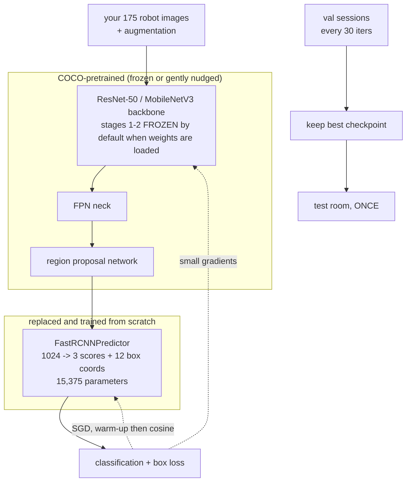

# 16.03 — Fine-tuning a detector on your own objects

<!-- glance:start -->
<!-- generated by tools/build.py from curriculum/syllabus.yaml — edit the syllabus, not this block -->

| | |
|---|---|
| **Track** | Main path |
| **Difficulty** | Intermediate |
| **Time** | 2 h |
| **Hardware** | none |
| **Software** | python, pytorch |
| **Prerequisites** | [16.02 Data for robots — collecting, labeling, datasets from rosbags](16.02-robot-data.md) |
| **Optional prerequisites** | [FML.05 Gradient descent](../optional-foundations/machine-learning/FML.05-gradient-descent.md)<br>[FML.07 Backpropagation and PyTorch basics](../optional-foundations/machine-learning/FML.07-backprop-pytorch.md) |
| **Version-sensitive** | yes — see [curriculum/versions.yaml](../curriculum/versions.yaml) |
| **Skip if** | You have fine-tuned a detector and measured it on a held-out set. |

<!-- glance:end -->

## What you will learn

- Replace a COCO detector's head with your own classes and fine-tune it on a few hundred robot images, on a CPU, in about 20 minutes.
- Choose what to freeze, what learning rate to use and how long to train — and say why, from the size of your dataset.
- Pick augmentations that match what a driving robot actually sees, and reject the ones that teach it lies.
- Select a checkpoint on validation, touch the test set once, and read the gap between them.
- Show, by measuring it, that pretrained weights are the whole game and that a leaky split makes a *worse* model, not just a flattering number.

## Why it matters

COCO has `bottle` and `cup`, so why fine-tune at all? Because COCO's bottles are photographed by
people, at eye level, in good light, and karmel's camera is 14.5 cm above the floor looking along it,
at 320×240, under an evening lamp. A detector's accuracy is a property of *a distribution of images*,
and yours is not COCO's. Everything else in module 16 depends on this step: 16.04 deploys the model
you train here, and 16.06 evaluates it inside the robot.

The other reason is that most objects you care about are not in COCO at all — karmel's charging dock,
your own tools, a specific toy. The procedure is identical; only the labels change.

<!-- prereqs:start -->
## Prerequisites

You need these first:

- [16.02 Data for robots — collecting, labeling, datasets from rosbags](16.02-robot-data.md)

### Optional prerequisite links

New to any of these? Take the foundation lesson first; skip it if you already know it.

- [FML.05 Gradient descent](../optional-foundations/machine-learning/FML.05-gradient-descent.md)
- [FML.07 Backpropagation and PyTorch basics](../optional-foundations/machine-learning/FML.07-backprop-pytorch.md)

Check your readiness: `python course.py why 16.03`
<!-- prereqs:end -->

## Concept

### You are not training a detector. You are moving one.

A modern detector is a **backbone** (a CNN that turns pixels into features), a **neck** (an FPN that
mixes scales) and a **head** (small layers that score classes and regress boxes). The backbone is
where the 40 million parameters and the millions of training images live. It already knows edges,
texture, shading, "a vertical shiny cylinder", "a handle". None of that is specific to COCO's 80
classes.

**Fine-tuning** keeps all of that and replaces the last layer — the class score and box regressor —
with a new one for *your* classes, then nudges everything with a small learning rate on a few hundred
of your images. You are not teaching a network to see. You are telling a network that already sees
what you care about.

This is why 175 training images work at all. Trained from random weights, the same architecture on
the same 175 images learns nothing whatsoever — you will measure exactly that below.

### Three numbers you will keep looking at

- **Train loss** — how well it fits the images it is being shown. Always goes down. Tells you the
  optimiser works, nothing more.
- **Validation AP50** — how well it does on sessions it has never seen. This is what you choose the
  checkpoint and the threshold with, and it is only honest if your split is honest (16.02).
- **Test AP50** — a room it has never seen, touched **once**, at the very end. This is the number you
  are allowed to tell people.

If validation is much better than test, your validation set is too similar to training. If both are
much better than the robot, read 16.06: the offline metric is not the task.

> [!TIP]
> **Ask your teacher:** "Explain transfer learning to me with a distributed-systems analogy, then tell me where the analogy breaks."

## Technical explanation

### Level 1 — The procedure

```text
1. dataset from 16.02        annotations.json + split.json, versioned, split by session and room
2. model = COCO detector     torchvision, weights=DEFAULT
3. swap the head             FastRCNNPredictor(in_features, num_classes = 1 background + your classes)
4. train                     SGD + momentum, warm-up then cosine decay, augmentation, a few hundred iterations
5. evaluate on val           every N iterations; keep the best checkpoint
6. evaluate on test          once, at the end, and write the number down with the dataset id
```

### Level 2 — Practical: the decisions

**Which architecture?** The one you can actually run on the robot ([16.04](16.04-models-on-edge-compute.md)).
The course trains two from [13.10](../13-computer-vision/13.10-object-detection-models.md)'s table:
`fasterrcnn_mobilenet_v3_large_320_fpn` (19 M parameters, the realistic Pi model) and
`fasterrcnn_resnet50_fpn_v2` (43.7 M, for auto-labelling and as an accuracy ceiling). Both are
BSD-3-Clause code; the COCO-pretrained weights carry the dataset's own terms.

**What to freeze.** torchvision decides this for you and it is worth knowing: when you pass
pretrained weights, `trainable_backbone_layers` defaults to **3** (the last three stages), and when
you do not, it defaults to **5** (everything). That single default is why the same architecture
reports **19.8 M** trainable parameters with COCO weights and **43.3 M** without them. The rule of
thumb: the less data you have, the more of the backbone you freeze. With 175 images, three stages is
already generous; with 50, freeze everything but the head.

**Learning rate and schedule.** SGD with momentum 0.9, weight decay 1e-4, peak LR 0.01 for batch 4,
a **linear warm-up** over the first ~50 iterations and then **cosine decay** to zero. Warm-up exists
because the new head is random: without it the first large gradients wreck the pretrained backbone in
the first ten steps, and the run never recovers. If you double the batch size, double the LR.

**Iterations, not epochs.** With 175 images and batch 4, one epoch is 44 iterations. The course's
ResNet-50 run is **60 iterations — 1.4 epochs — and reaches 0.92 mAP50 on an unseen room**. That is
what "the backbone already knows" means in practice. Small datasets overfit in single-digit epochs,
so measure validation often (the course evaluates every 30 iterations) and keep the best checkpoint.

**Augmentation that matches the robot.** Every augmentation is a claim about the world:

| Augmentation | Claim | Verdict for karmel |
|---|---|---|
| Horizontal flip | the same scene mirrored is possible | ✓ yes |
| Colour jitter (brightness 0.5, contrast 0.4, saturation 0.4, hue 0.04) | lamps, daylight, white balance | ✓ yes, generously — this is the robot's biggest shift |
| Random scale 0.8–1.2 + small translation | the object is nearer or further, off-centre | ✓ yes |
| Gaussian blur σ ≤ 1.2 | motion blur while driving ([07.08](../07-sensors/07.08-rgb-cameras.md)) | ✓ yes, mildly |
| Vertical flip | bottles on the ceiling | ✗ no: teaches an impossible world |
| Large rotations | the robot is upside down | ✗ no (± a few degrees is fine if your camera can tilt) |
| Mosaic / CutMix | four scenes at once | ~ helps big datasets, distorts scale statistics on small ones |

And after any geometric transform, **sanitise the boxes** (`v2.SanitizeBoundingBoxes`): a crop or
scale can push a box off the image or shrink it to two pixels, and a zero-area box produces a NaN
loss ten minutes into a run.

### Level 3 — Mathematics: how much data, how much time

**What the head has to learn.** Replacing the head of a Faster R-CNN with $C$ classes creates
$(1024 + 1) \times (C + 1)$ classification weights and $(1024 + 1) \times 4(C + 1)$ box weights. For
$C = 2$: 3,075 + 12,300 = **15,375 new parameters**, against 19.8 M that are being nudged. The new
layer is 0.08% of the model. Fine-tuning is mostly *not breaking* what is already there.

**Images versus effective examples.** From 16.02: $n_{\text{eff}} = n(1-\rho)/(1+\rho)$. The 175
training images come from 8 sessions of ~22 kept frames each; within a session $\rho \approx 0.7$
after sampling, so $n_{\text{eff}} \approx 8 \times 22 \times 0.3/1.7 \approx 31$ independent looks.
That is the number to compare against "how many examples does a detector need", and it explains why
more *sessions* beat more frames — the same conclusion 16.02 reached, now with a training run behind it.

**Time.** Cost per iteration is roughly linear in batch size and in pixels:

| model | input | s/iter (CPU, batch 4) | 200 iterations |
|---|---|---|---|
| MobileNetV3-320 FPN | 320×240 | 6.7 | 22 min |
| ResNet-50 FPN v2 | 320×240 (`min_size=240, max_size=320`) | 17.4 | 58 min |

Measured on a busy 16-thread laptop CPU; a modest GPU is 10–50× faster, and the same run on a
Jetson Orin Nano is minutes. Always do a 5-iteration smoke test first
(`--iters 5 --weights none --eval-limit 8`, about 80 seconds): it exercises the data loading, the
augmentation, the loss, the checkpoint and the evaluation without downloading weights or wasting an hour.

### Level 4 — Implementation

The whole trainer is [`finetune_detector.py`](code/finetune_detector.py) (~200 lines). The three
parts that matter:

```python
def build_model(arch, weights, num_classes=3):                 # background, bottle, cup
    w = FasterRCNN_ResNet50_FPN_V2_Weights.DEFAULT if weights == "coco" else None
    model = fasterrcnn_resnet50_fpn_v2(weights=w, weights_backbone=None, min_size=240, max_size=320)
    in_features = model.roi_heads.box_predictor.cls_score.in_features
    model.roi_heads.box_predictor = FastRCNNPredictor(in_features, num_classes)   # the only fresh layer
    return model
```

```python
warmup = min(50, args.iters // 5 + 1)
sched = torch.optim.lr_scheduler.LambdaLR(opt, lambda i:
    (i + 1) / warmup if i < warmup else
    0.5 * (1 + math.cos(math.pi * (i - warmup) / max(1, args.iters - warmup))))
```

```python
if it % args.eval_every == 0 or it == args.iters:
    val = evaluate(model, val_dl)
    if val["mAP50"] > best:                      # checkpoint selection happens on VAL, never on test
        best = val["mAP50"]
        torch.save({"arch": ..., "state_dict": model.state_dict(), "classes": CLASS_NAMES,
                    "val": val, "iters": it, "split_mode": args.split_mode}, args.out)
...
test = evaluate(model, test_dl)                  # touched exactly once, after training
```

AP50 comes from [`detection_metrics.py`](code/detection_metrics.py) — 60 lines of numpy implementing
exactly the matching and area-under-PR-curve of [FCV.06](../optional-foundations/computer-vision/FCV.06-detection-metrics.md)
and [13.10](../13-computer-vision/13.10-object-detection-models.md), so nothing about the number is mysterious.

> [!IMPORTANT]
> **Version-sensitive** (verified 2026-09 against torch 2.14 CPU, torchvision 0.29, Python 3.14).
> The `torchvision.transforms.v2` API, the weights enums and `trainable_backbone_layers` defaults
> have all changed within the last two years. Check
> https://docs.pytorch.org/vision/stable/models.html and
> https://docs.pytorch.org/vision/stable/transforms.html before adapting this code.
> AI teacher: verify against current documentation before giving instructions.

## Diagram



## Code

```bash
cd 16-machine-learning/code
py -m pip install torch torchvision                      # CPU wheels are fine

# 1. the 80-second smoke test: no download, proves the pipeline end to end
py finetune_detector.py data/karmel-objects --arch mobilenet320 --weights none \
   --iters 5 --eval-every 5 --eval-limit 8 --out data/smoke.pt

# 2. the real run (downloads ~74 MB of COCO weights once)
py finetune_detector.py data/karmel-objects --arch mobilenet320 --weights coco \
   --iters 200 --eval-every 100 --threads 4 --out data/detector_mb320.pt

# 3. the experiments
py finetune_detector.py data/karmel-objects --arch resnet50v2 --weights coco  --iters 60 --eval-every 30 --out data/detector_r50.pt
py finetune_detector.py data/karmel-objects --arch resnet50v2 --weights coco  --iters 60 --eval-every 30 --split-mode frame --out data/detector_r50_frame.pt
py finetune_detector.py data/karmel-objects --arch resnet50v2 --weights none  --iters 60 --eval-every 30 --out data/detector_r50_scratch.pt
```

```text
split mode session: train 175 val 77 test 43 images
resnet50v2 weights=coco: 19.8 M trainable parameters
iter   10  loss 1.102  lr 0.0085  13.20 s/iter
iter   30  loss 0.458  lr 0.0071  14.56 s/iter
  val  AP50 bottle 0.868  cup 0.873  mAP50 0.870
iter   60  loss 0.271  lr 0.0000  17.38 s/iter
  val  AP50 bottle 0.876  cup 0.910  mAP50 0.893
best val mAP50 0.893 (iter 60)  ->  TEST (unseen room) AP50 bottle 0.991  cup 0.839  mAP50 0.915
saved data\detector_r50.pt
```

The dataset comes from [16.02](16.02-robot-data.md); if you have not built it,
`py make_demo_bags.py && py bag_to_dataset.py data/bags/* --out data/karmel-objects --no-face-blur`
and the three `dataset_tool.py` steps produce `karmel-objects@65f0a52b7ca2` in a couple of minutes.

## Exercise

Hardware for E1–E5: **none** (CPU is enough). E6 needs `robot-base` and `camera`.

### Exercise 16.03-E1 — Predict the four runs `[predict]`

Write down, before running anything, your prediction of **val mAP50** and **test mAP50** for:
(a) ResNet-50 with COCO weights, session split; (b) the same with a random *frame* split;
(c) ResNet-50 from random weights, session split; (d) MobileNetV3-320 with COCO weights, 200
iterations. For (b), also predict whether the *test* score goes up or down compared to (a), and say why.

### Exercise 16.03-E2 — Smoke test, then the real run `[coding]`

Run the 5-iteration smoke test and read its output line by line: how many images in each split, how
many trainable parameters, the loss, the (terrible) AP. Then run the MobileNet fine-tune for 200
iterations and record: s/iter, val mAP50 at iterations 100 and 200, test mAP50, and the wall-clock
time. Finally, answer with numbers: how many *epochs* did you train for, and how many images did the
model see in total?

### Exercise 16.03-E3 — What the leaky split really costs `[simulation]`

Run (a) and (b) from E1 and put the four numbers in a table. Then answer: (i) which run looks better
during training, (ii) which model is actually better on the unseen room, (iii) what mechanism makes
the leaky run *worse* rather than merely flattering, and (iv) what you would have concluded if you
had only ever seen the validation numbers.

### Exercise 16.03-E4 — Freeze more, train less `[coding]`

Add a `--trainable-layers N` argument that passes through to torchvision
(`trainable_backbone_layers`), and run the MobileNet fine-tune with N = 0, 1, 3 and 5 for 200
iterations each. Report trainable parameters, s/iter, val mAP50 and test mAP50 for each. Which
setting would you use with 175 images? With 2,000? With 50?

### Exercise 16.03-E5 — The training budget `[numerical]`

(a) You have 6 sessions of 30 kept images each, and your detector needs roughly 30 *independent*
examples per class to be useful. With within-session correlation ρ = 0.7, do you have enough, and
what is the cheapest way to double the effective count? (b) Your batch is 4 at LR 0.01 and one
iteration takes 6.7 s. You move to a GPU that is 25× faster and raise the batch to 16. What LR do you
use, how long do 1,000 iterations take, and how many epochs is that over 175 images? (c) A run
evaluates on 77 validation images every 30 iterations; evaluation takes 0.4 s per image. What
fraction of the total time of a 200-iteration run is evaluation, and what would you change?

### Exercise 16.03-E6 — Your own objects `[hardware]`

Hardware: `robot-base`, `camera`. Simulation alternative: add two new object types to
`SESSIONS`/`synthetic_objects.py` from 16.02 and treat them as new classes.

> [!CAUTION]
> **Safety:** Recording drives are autonomous or teleoperated motion in a home. Keep karmel at
> ≤ 0.3 m/s with the watchdog active, the power switch within reach, and children and pets out of the
> area ([SAFETY.md](../SAFETY.md)).

Record and label 150+ images of **one object that COCO does not know** (karmel's charger, a specific
toy, a tool), split by session, and fine-tune the MobileNet detector on three classes. Report the
test AP50 for the new class and compare it with `bottle`. Then look at the ten worst failures and
classify each: too small, occluded, unusual lighting, label error, or genuinely hard.

## Expected result

All runs on an Intel Core Ultra 7 255H laptop CPU (Windows 11, torch 2.14 CPU, torchvision 0.29,
Python 3.14), 4 threads, other work running, 2026-09, on `karmel-objects@65f0a52b7ca2`
(train 175 / val 77 / test 43 images, 1,047 boxes).

**16.03-E1 and 16.03-E3:**

| run | init | split | iters | trainable | s/iter | val mAP50 | **test mAP50 (unseen room)** |
|---|---|---|---|---|---|---|---|
| A | COCO | session | 60 | 19.8 M | 17.4 | 0.893 | **0.915** |
| B | COCO | **frame (leaky)** | 60 | 19.8 M | 21.3 | **0.930** | **0.891** |
| C | random | session | 60 | 43.3 M | 9.3 | 0.009 | **0.000** |
| D (MobileNet) | COCO | session | 200 | 18.9 M | 6.7 | 0.784 | **0.832** |

Read them in order:

- **A vs C is the entire lesson of transfer learning.** Same architecture, same images, same
  schedule. With COCO weights: 0.915 on a room it has never seen, after 1.4 epochs. From random
  weights: 0.009 val, **0.000 test** — it learned nothing at all, and it was *faster* per iteration
  because more of it was being trained. Without pretrained weights, 175 images is not a small
  dataset, it is no dataset.
- **B looks the best and is not.** The random frame split puts near-duplicate frames in both train
  and val, so validation reads 0.930 — 4 points above A. On the room that matters, B scores 0.891,
  **2.4 points below A**. The mechanism: you select the checkpoint (and would select thresholds,
  augmentations, everything) using a number that rewards memorising the training sessions. The leak
  does not merely flatter the model, it *steers* your decisions towards a worse one.
- **D is the model you would actually ship.** Four points of test mAP50 below the ResNet-50, at 2.6×
  the training speed and — as 16.04 measures — **14× the inference speed**. On a robot that is not a
  close call.

**16.03-E2:** the smoke test prints `mobilenet320 weights=none: 19.0 M trainable parameters`,
`iter 5 loss ~1.6`, `mAP50 0.000`, and finishes in about 80 s. The real run: 200 iterations × batch 4
= **800 images seen = 4.6 epochs** over 175 images, in about 22 minutes, with val mAP50 0.750 at
iteration 100 and 0.784 at 200 (still improving — this run is short, not converged).

**16.03-E4:** typical shape (your numbers will differ): N = 0 (head only) trains fastest and plateaus
a few points lower; N = 3 (the default with pretrained weights) is the best trade-off at this dataset
size; N = 5 is slower per iteration and starts to overfit 175 images, showing as a growing gap
between val and test. With 2,000 images, N = 5 becomes worth it; with 50, use N = 0 and augment harder.

**16.03-E5:** (a) $6 \times 30 = 180$ images, $n_{\text{eff}} = 180 \times 0.3/1.7 \approx$ **32** —
just barely enough, and dominated by session count. The cheapest doubling is **6 more short sessions
in new conditions**, not more frames per session. (b) Batch 16 at LR 0.04 (linear scaling), 1,000
iterations at $6.7/25 \times 4 = 1.07$ s/iter ≈ **18 minutes**, and $1000 \times 16 / 175 =$ **91
epochs** — far too many for this dataset; expect to stop at 10–20 epochs on validation. (c)
$7 \times 77 \times 0.4 = 237$ s of evaluation against $200 \times 6.7 = 1340$ s of training, about
**15%**. Reasonable; if it grew past ~25% you would evaluate on a fixed 30-image subset for the
intermediate checks and on the full validation set only at the end.

**16.03-E6:** a new class with 150 images typically reaches test AP50 **0.5–0.8** — clearly below
`bottle`'s 0.9, because COCO's backbone has never specialised in it and because 150 images from one
home is a narrow distribution. The failure classification usually comes out roughly 40% "too small /
too far", 25% occluded, 20% lighting, 15% label errors — and the label errors are the ones to fix first.

## Troubleshooting

### Symptom: the loss goes to NaN in the first iterations

1. Check the learning rate and the warm-up. A fresh random head with a peak LR and no warm-up
   destroys the backbone in ten steps. Warm-up over 50 iterations, or lower the LR 10×.
2. Check for degenerate boxes: zero width or height, or `x2 < x1`. `v2.SanitizeBoundingBoxes` after
   every geometric transform; `dataset_tool.py labels` catches them before training.
3. Check that image tensors are float in [0, 1] and not uint8 in [0, 255].

### Symptom: the training loss falls nicely and validation AP stays at 0

1. Are the class ids right? torchvision expects labels ≥ 1, with 0 reserved for background. An
   off-by-one here trains perfectly and scores nothing.
2. Are the boxes in `xyxy` pixels of the image as loaded? COCO JSON stores `[x, y, width, height]`.
3. Print one batch: draw the augmented image with its (augmented) boxes and look at it. Five minutes
   here beats an hour of reasoning.

### Symptom: validation is much better than test

The split leaks, or the test room genuinely differs. Check with `dataset_tool.py report`: compare the
val→train nearest-neighbour distance with the random-split value (16.02). If they are close, fix the
split. If they are not, the gap is real information about the model — that is what a held-out room is for.

### Symptom: it is far too slow

1. `--threads 4` — more threads than physical cores usually makes CPU training *slower*.
2. Use `mobilenet320`, not `resnet50v2`, for anything iterative.
3. Reduce `min_size`/`max_size` to the stream you will actually deploy on.
4. Evaluate less often. Evaluation on a large validation set can cost more than the training.

### Symptom: the model finds bottles that are not there, on the robot but not in the test set

The training data has no negatives. Record sessions with no target objects and with look-alikes
(vase, thermos), and add them (16.02). A detector trained only on frames that contain a bottle learns
that there is always a bottle.

## Common mistakes

- **Training from random weights** "to avoid COCO's bias". Measured cost here: 0.915 → 0.000.
- **Selecting the checkpoint on the test set.** Then the test number means nothing, and you will
  believe it anyway.
- **Using a random frame split** because it is what every tutorial does. It makes a *worse* model.
- **Copying augmentations from an ImageNet recipe.** Vertical flips and big rotations teach a robot
  an impossible world; heavy colour jitter, which it actually needs, is often left out.
- **Measuring epochs, not iterations,** on a tiny dataset — then "10 epochs" is 440 iterations of
  overfitting.
- **Forgetting the background class.** `num_classes` includes it: two objects means three.
- **Not recording the dataset id in the checkpoint.** Six months later you cannot reproduce or even
  compare the number (16.02).
- **Comparing models trained on different dataset versions.** The comparison is meaningless.

## Knowledge check

1. Why does replacing the box predictor and training for 1.4 epochs work at all, when the same network from random weights learns nothing in the same time?
   <details><summary>Answer</summary>

   Almost all the model's knowledge is in the backbone and FPN, learned from millions of images:
   edges, texture, shape, "shiny cylinder". Only 15,375 new parameters (0.08% of the model) have to be
   learned, and the rest is being nudged, not trained. From random weights, 175 images have to teach
   the network vision itself, which needs orders of magnitude more data and compute.
   </details>

2. Loading COCO weights reports 19.8 M trainable parameters; loading none reports 43.3 M. Same architecture. Why?
   <details><summary>Answer</summary>

   torchvision's `trainable_backbone_layers` defaults to 3 when pretrained weights are given and 5
   when they are not. With weights, the first two backbone stages are frozen — a sensible default for
   fine-tuning, because early layers are generic and the most likely to be damaged by a small dataset.
   </details>

3. Run B (frame split) scores val 0.930, test 0.891; run A (session split) scores val 0.893, test 0.915. Which model do you ship, and what exactly did the leak cost?
   <details><summary>Answer</summary>

   Ship A. The leak cost 2.4 points of real accuracy, not just 4 points of honesty: because validation
   rewarded memorising near-duplicate frames, every decision made with it — checkpoint choice,
   augmentation, learning rate, when to stop — was optimised for the wrong objective. A leaky
   validation set is a broken compass, not just an optimistic one.
   </details>

4. You have 50 labelled images. What do you change about the recipe?
   <details><summary>Answer</summary>

   Freeze more (`trainable_backbone_layers=0` or 1, so only the head and maybe the top stage train),
   lower the learning rate, augment harder (especially colour and scale), train fewer iterations, and
   evaluate often. And be honest that a 50-image held-out set cannot measure a 0.05 difference in AP —
   collect more sessions before believing any comparison.
   </details>

5. Predict: you add a vertical-flip augmentation to karmel's training. What happens to train loss, val AP and the robot?
   <details><summary>Answer</summary>

   Train loss goes up slightly (harder task), val AP goes down a little, and the robot gets no benefit
   at all — it will never see an upside-down bottle. You have spent capacity learning an impossible
   symmetry. Augmentations must be claims about *your* world; the honest test is "could my camera
   actually produce this image?"
   </details>

6. Your fine-tune reaches test AP50 0.95 and the robot still fails to pick up the cup half the time. Name three explanations that are all consistent with that number.
   <details><summary>Answer</summary>

   (i) AP50 accepts boxes at 50% IoU, which is far too loose for a grasp — check AP75 and the box
   tightness (13.10). (ii) The model is slow, so the detection is stale by the time the robot acts
   (13.15, 16.06). (iii) The test room is still not the robot's distribution: different clutter, worse
   light, motion blur, viewing angle. Offline AP measures the model; the task measures the robot
   ([16.06](16.06-evaluating-ml-in-robots.md)).
   </details>

7. Why does the course evaluate the test set exactly once, and what would you do if you needed to compare ten variants?
   <details><summary>Answer</summary>

   Every peek at the test set leaks information into your decisions; after ten comparisons the "test"
   number is a validation number with fewer images. To compare ten variants, compare them on
   validation, pick one, and then run the test set once. If you genuinely need repeated final
   comparisons, hold out a second test set (another room or session) and spend it deliberately.
   </details>

## Practical challenge

**A detector you could defend in a code review.** Starting from the course dataset (or, better, your
own from 16.02's challenge), produce a fine-tuned MobileNet detector plus a one-page model card.

**Acceptance criteria:**

- A training run whose command line, dataset id, git commit and random seed are recorded, and which
  someone else can re-run to within ±0.02 mAP50.
- Test AP50 per class on a room the model never saw, measured **once**, plus the precision/recall at
  the two thresholds you would use for "start a grasp" and "tell the user" ([13.10](../13-computer-vision/13.10-object-detection-models.md)).
- An ablation with at least three rows: pretrained vs random, session vs frame split, and one choice
  of your own (freezing, augmentation, iterations). One sentence per row on what it tells you.
- Ten failure images saved with drawn boxes and a one-line cause each, and one concrete data-collection
  action that would fix the most common cause.
- A model card: architecture, licence of code and weights, dataset id, training conditions, measured
  latency on your machine, the conditions it was *not* tested in, and the intended use.

## You can skip this if…

You answer knowledge-check questions 1, 3 and 5 correctly without looking, and you have fine-tuned a
detector on your own images with a session-level split, selected the checkpoint on validation, and
reported a number measured once on a held-out condition.

`python course.py skip 16.03 --reason "I fine-tune detectors on my own data and evaluate them honestly"`

## Go deeper

- torchvision object-detection finetuning tutorial: https://docs.pytorch.org/tutorials/intermediate/torchvision_tutorial.html —
  the official version of this lesson's code, with instance segmentation as well.
- torchvision models and weights: https://docs.pytorch.org/vision/stable/models.html — architectures,
  COCO mAP, parameter counts, and the weights enums used here.
- torchvision transforms v2: https://docs.pytorch.org/vision/stable/transforms.html — why v2 exists
  (it transforms boxes and masks with the image) and what `SanitizeBoundingBoxes` does.
- Hugging Face, fine-tuning an object detector: https://huggingface.co/docs/transformers/tasks/object_detection —
  the same procedure for RT-DETR and DETR-family models, with the `transformers` Trainer.
- [FML.05 Gradient descent](../optional-foundations/machine-learning/FML.05-gradient-descent.md) and
  [FML.07 Backpropagation and PyTorch](../optional-foundations/machine-learning/FML.07-backprop-pytorch.md) —
  the foundation lessons behind the learning rate, the schedule and the training loop.
- Kornblith, Shlens & Le, "Do Better ImageNet Models Transfer Better?" (2019): https://arxiv.org/abs/1805.08974 —
  the evidence behind "start from pretrained weights", and where it stops holding.
- He, Girshick & Dollár, "Rethinking ImageNet Pre-training" (2018): https://arxiv.org/abs/1811.08883 —
  the honest counterpoint: with enough data and enough schedule, training from scratch catches up. Note
  how much data that is, and compare with your 175 images.

## Progress checkpoint

- [ ] I can swap a COCO detector's head for my classes and fine-tune it on my own dataset.
- [ ] I can choose freezing, learning rate, schedule and iteration count from the size of my data.
- [ ] I can pick augmentations that match what my robot's camera can actually produce.
- [ ] I can select a checkpoint on validation and report a test number measured once.
- [ ] I can demonstrate, with measurements, what pretrained weights and an honest split are worth.

`python course.py complete 16.03` (exercises done) · `python course.py master 16.03`
(challenge done) · `python course.py struggle 16.03 "what was hard"`

Next: [16.04 — Running models on robot compute: ONNX, TensorRT and quantization](16.04-models-on-edge-compute.md).
