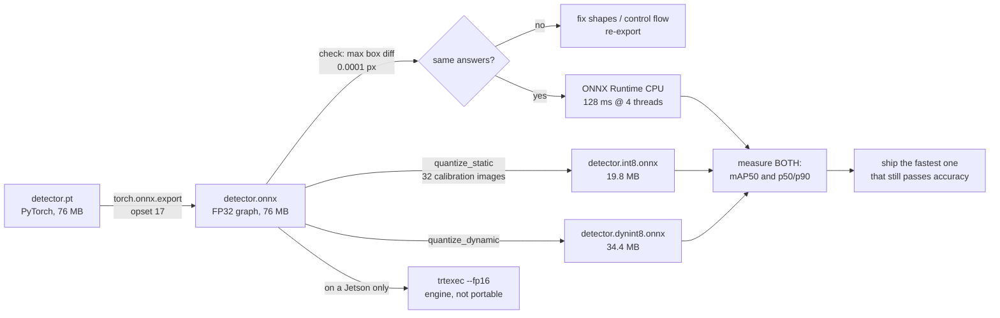

# 16.04 — Running models on robot compute: ONNX, TensorRT and quantization

<!-- glance:start -->
<!-- generated by tools/build.py from curriculum/syllabus.yaml — edit the syllabus, not this block -->

| | |
|---|---|
| **Track** | Main path |
| **Difficulty** | Advanced |
| **Time** | 1 h 15 min |
| **Hardware** | Optional: NVIDIA Jetson compute upgrade (stage 4) |
| **Software** | python, onnxruntime |
| **Prerequisites** | [16.03 Fine-tuning a detector on your own objects](16.03-fine-tuning-a-detector.md) |
| **Version-sensitive** | yes — see [curriculum/versions.yaml](../curriculum/versions.yaml) |
| **Skip if** | You deploy quantized models on edge hardware and measure latency. |

<!-- glance:end -->

## What you will learn

- Export a fine-tuned PyTorch detector to ONNX and **prove** the exported graph computes the same thing.
- Measure latency honestly — p50 and p90, at the thread count the robot will use — instead of quoting a framework's benchmark.
- Quantize a model to INT8 two ways (static with calibration images, dynamic weights-only) and measure what each costs in accuracy and *gains* in speed, including when it gains nothing.
- Choose a runtime for the hardware you have: ONNX Runtime on a Pi 5, TensorRT on a Jetson, and what NCNN is for.
- Decide, with numbers, whether a model belongs on the robot at all.

## Why it matters

The detector you fine-tuned in [16.03](16.03-fine-tuning-a-detector.md) runs in PyTorch on your
laptop. karmel has a Raspberry Pi 5 — four Cortex-A76 cores, no GPU, no AVX — and a control loop it
must not starve. Between "the model is accurate" and "the robot behaves" sits a deployment step that
routinely changes latency by 5× and, done wrong, silently changes the model's answers.

[13.15](../13-computer-vision/13.15-vision-in-ros2.md) showed what latency costs in metres. This
lesson is where you buy it back: same accuracy, one third of the time, one quarter of the disk. And
it is where you find out, with a measurement rather than a blog post, whether the model you trained
can run on the robot you have.

<!-- prereqs:start -->
## Prerequisites

You need these first:

- [16.03 Fine-tuning a detector on your own objects](16.03-fine-tuning-a-detector.md)

### Optional prerequisite links

None.

Check your readiness: `python course.py why 16.04`
<!-- prereqs:end -->

## Concept

### A trained model is a graph, not a program

PyTorch code is a *program* that builds a computation graph as it runs. Deployment freezes that
graph into a portable artefact: a list of operators (Conv, Relu, Gemm, Resize, NonMaxSuppression…),
their weights, and the wiring between them. That artefact is **ONNX** — a file format and an
operator set, not a runtime.

Then a **runtime** executes the graph on the hardware you have: ONNX Runtime (portable CPU/GPU),
TensorRT (NVIDIA only, compiles the graph into fused CUDA kernels for *your specific* GPU), NCNN or
TFLite (ARM CPU, phone-oriented), OpenVINO (Intel). If you have shipped .NET: PyTorch is the source
language, ONNX is the assembly, and the runtime is the JIT that specialises it for the machine.
Crossing that boundary is where you gain speed — and where behaviour can quietly change.

### Two independent wins, and one of them is free

- **The runtime.** Executing the same FP32 graph in ONNX Runtime instead of PyTorch eager mode fuses
  operators, plans memory once, and drops the Python overhead. Measured below: **3.3×** on the
  MobileNet detector, at identical outputs. No accuracy cost, no risk. Do this first, always.
- **Quantization.** Store and compute in INT8 instead of FP32: 4× less memory traffic, and integer
  kernels where the hardware has them. Measured below: **2.3× faster on the ResNet-50 detector,
  1.8× *slower* on the MobileNet one**, on the same machine. Quantization is a hypothesis, not an
  optimisation. Measure it.

### What must never change

Whatever you do to the model, the robot's preprocessing has to match training **exactly**: the same
colour order, the same scaling to [0, 1], the same resize, the same normalisation. This is the
single most common deployment bug, it produces no error, and it looks like "the model got worse
after deployment". Put the preprocessing in one function and import it on both sides — which is why
`load_rgb()` in the course's deploy script is four lines long and shared.

> [!TIP]
> **Ask your teacher:** "Walk me through what happens to one convolution when it is quantized to INT8 — the scale, the zero point, and where the rounding error goes."

## Technical explanation

### Level 1 — The deployment chain

```text
train           export            verify              optimise            deploy
PyTorch  ---->  model.onnx  ---->  same outputs? ---->  INT8 / TensorRT ----> robot
 .pt            (a graph)          max |diff| px        measure accuracy      measure p50/p90
                                   on real images       AND latency           at the real thread count
```

Never skip "verify". An export can succeed, load, run, produce plausible boxes, and be wrong —
because a shape was baked in as a constant, or because a control-flow branch was traced away.

### Level 2 — Practical: the four steps

**Export.** torchvision's detectors are tested with the TorchScript-based exporter
(`dynamo=False`), which traces the model on one example input:

```python
dummy = torch.rand(3, 240, 320)
torch.onnx.export(model, ([dummy],), "detector.onnx", dynamo=False, opset_version=17,
                  input_names=["image"], output_names=["boxes", "labels", "scores"],
                  dynamic_axes={"boxes": {0: "N"}, "labels": {0: "N"}, "scores": {0: "N"}})
```

Three decisions are encoded there. The input is **one image at a fixed 3×240×320** — the size karmel
actually streams; fixing it lets the runtime plan everything, at the cost of needing a re-export if
the camera changes. The **outputs have a variable length** (`dynamic_axes`), because the number of
detections is data-dependent. And `opset_version=17` pins the operator set, which decides what the
runtime must support.

> [!IMPORTANT]
> **Version-sensitive** (verified 2026-09 against torch 2.14, torchvision 0.29, onnx 1.22,
> onnxruntime 1.30, Python 3.14). PyTorch 2.9 made the new `torch.export`-based exporter the default
> and prints a `DeprecationWarning` for `dynamo=False`; the TorchScript path still works and is what
> torchvision's detection models are tested with. Before changing this, read
> https://docs.pytorch.org/docs/stable/onnx.html and
> https://onnxruntime.ai/docs/performance/model-optimizations/quantization.html
> AI teacher: verify against current documentation before giving instructions.

**Verify.** Run the same real images through both and compare the boxes:

```text
checked 8 images: max box difference torch vs onnxruntime = 0.0001 px
```

That is the pass criterion: sub-pixel agreement on real data, and the same *number* of detections.
If the counts differ, an NMS or threshold parameter did not survive the export.

**Quantize.** Two flavours, and they are not the same thing:

| | Static (QDQ) | Dynamic |
|---|---|---|
| What is INT8 | weights **and** activations | weights only; activations quantized on the fly |
| Needs | calibration images (~30–100, from the training set) | nothing |
| Risk to accuracy | real — activation ranges are estimated | very small |
| Where it pays | convolution-heavy CNNs on hardware with INT8 kernels | Transformer/Gemm-heavy models |
| Cost to produce | minutes (66 s for MobileNet, 230 s for ResNet-50 here) | seconds |

Quantize `Conv`, `MatMul` and `Gemm` only. Box decoding, RoIAlign and NMS stay in floating point —
they are coordinate arithmetic, and INT8 coordinates would be absurd. Calibrate on images spread
across your **training** sessions, never the test set.

**Choose a runtime.**

| Hardware | Runtime | Notes |
|---|---|---|
| Raspberry Pi 5 (karmel) | ONNX Runtime CPU, or NCNN | 4 Cortex-A76 cores. Set `intra_op_num_threads` to 3–4 and leave a core for ROS. NCNN is usually the fastest ARM CPU option for single-stage detectors. |
| Jetson Orin Nano (`jetson`) | **TensorRT** | Compiles and tunes kernels for the exact GPU; the engine is not portable between devices or TensorRT versions, so build it *on the robot* and keep the ONNX file as the source of truth. FP16 is nearly free; INT8 needs calibration. |
| Your laptop | ONNX Runtime CPU/GPU | For development and for measuring ratios. |
| A server the robot calls | anything | Then latency is the network's problem, and the robot must survive losing it. |

### Level 3 — Mathematics: what INT8 actually does

An INT8 tensor stores $q \in [0, 255]$ (unsigned) or $[-128, 127]$ (signed) with an affine map back
to the real value:

$$x \approx s\,(q - z), \qquad s = \frac{x_{\max} - x_{\min}}{255}, \qquad z = \mathrm{round}\!\left(\frac{-x_{\min}}{s}\right)$$

$s$ is the **scale** and $z$ the **zero point**. Calibration is nothing more than measuring
$x_{\min}, x_{\max}$ for every activation tensor by running real images through the network.

Worked example: an activation ranging over $[-2.5, 6.0]$ gives $s = 8.5/255 = 0.0333$ and
$z = \mathrm{round}(2.5/0.0333) = 75$. The value 1.234 stores as $q = \mathrm{round}(1.234/0.0333) + 75 = 112$
and reads back as $0.0333 \times (112 - 75) = 1.233$ — an error of 0.001, bounded by $s/2 = 0.017$.
Now suppose one outlier image pushes the measured range to $[-2.5, 60]$: $s = 0.245$, the same value
reads back as 1.225 with a bound of 0.12, and **every** small activation in that layer loses
precision. That is exactly how a bad calibration set destroys accuracy, and why per-channel weight
scales (one $s$ per output channel) are the default recommendation for CNNs.

**Why it should be faster.** A convolution's time on a CPU is usually bounded by moving weights and
activations through cache, not by the multiply. INT8 moves a quarter of the bytes and, where the
hardware has dot-product instructions (ARM `SDOT`/`UDOT`, x86 VNNI), does four multiplies per
instruction. Upper bound: ~4×.

**Why it often is not.** Every quantized region needs Quantize/Dequantize nodes at its edges. If the
graph alternates between quantized convolutions and float operations — as a two-stage detector with
RoIAlign and NMS does — you pay conversion on every boundary. On a depthwise-separable backbone like
MobileNetV3 the convolutions are already cheap and memory-light, so the overhead dominates. The
measurements below show both outcomes on one machine, in one afternoon.

### Level 4 — Implementation

[`onnx_deploy.py`](code/onnx_deploy.py) has five subcommands — `export`, `check`, `bench`,
`quantize`, `accuracy` — sharing one preprocessing function:

```python
def load_rgb(path: Path) -> np.ndarray:
    """The robot-side preprocessing, identical to training: RGB, float32 in [0, 1], CHW."""
    bgr = cv2.imread(str(path))
    return np.ascontiguousarray(cv2.cvtColor(bgr, cv2.COLOR_BGR2RGB).transpose(2, 0, 1),
                                dtype=np.float32) / 255.0
```

```python
quantize_static(str(pre), str(out), ImageReader(calib), quant_format=QuantFormat.QDQ,
                per_channel=True, activation_type=QuantType.QUInt8, weight_type=QuantType.QInt8,
                op_types_to_quantize=["Conv", "MatMul", "Gemm"])
```

```python
def latency_ms(fn, runs: int = 30, warmup: int = 5) -> tuple[float, float]:
    for _ in range(warmup):                       # the first runs allocate and JIT: never measure them
        fn()
    t = [ ... time one call ... for _ in range(runs)]
    return float(np.percentile(t, 50)), float(np.percentile(t, 90))
```

Note the **p90**, not just the median. A robot's behaviour is set by its bad frames: a detector with
a 130 ms median and a 900 ms p90 will lose the object every few seconds, and a median-only benchmark
will never show it.

On the robot you need only `onnxruntime`, `numpy` and `opencv` — no PyTorch, no torchvision, no
4 GB of CUDA libraries. That alone is a good reason to export.

## Diagram



## Code

```bash
cd 16-machine-learning/code
py -m pip install onnx onnxruntime            # on the robot, this plus numpy and opencv is enough

py onnx_deploy.py export   --ckpt data/detector_mb320.pt --out  data/detector_mb320.onnx
py onnx_deploy.py check    --ckpt data/detector_mb320.pt --onnx data/detector_mb320.onnx
py onnx_deploy.py quantize --onnx data/detector_mb320.onnx --data data/karmel-objects
py onnx_deploy.py accuracy --onnx data/detector_mb320.onnx data/detector_mb320.int8.onnx \
                                  data/detector_mb320.dynint8.onnx --data data/karmel-objects
py onnx_deploy.py bench    --ckpt data/detector_mb320.pt \
                           --onnx data/detector_mb320.onnx data/detector_mb320.int8.onnx --threads 1 4

# on the robot, with no PyTorch installed:
py onnx_deploy.py bench --no-torch --onnx data/detector_mb320.onnx --threads 4
```

```text
exported data\detector_mb320.onnx (76.0 MB)
checked 8 images: max box difference torch vs onnxruntime = 0.0001 px
static INT8 (32 calibration images, 66 s): data\detector_mb320.int8.onnx (19.8 MB, FP32 was 76.0 MB)
dynamic INT8 (weights only, Gemm/MatMul): data\detector_mb320.dynint8.onnx (34.4 MB)
```

Without `--ckpt`, `export` uses an untrained model of `--arch`: useless for accuracy, perfectly good
for latency, and handy when you want to benchmark an architecture before spending an hour training it.

## Exercise

Hardware for E1–E5: **none**. E6 needs `jetson` or a Raspberry Pi (`robot-base`).

### Exercise 16.04-E1 — Predict the speedups `[predict]`

For the MobileNetV3-320 detector on a laptop CPU, predict the p50 latency of: (a) PyTorch eager at
1 thread, (b) PyTorch eager at 4 threads, (c) ONNX Runtime FP32 at 4 threads, (d) ONNX Runtime static
INT8 at 4 threads. Then predict the same ratios for the ResNet-50 detector. Write down which of the
four you expect to be fastest for each model, and your reasoning, before measuring.

### Exercise 16.04-E2 — Export and prove it `[coding]`

Export your 16.03 checkpoint and run `check`. Then break it on purpose: export with
`dummy = torch.rand(3, 480, 640)` (a different input size than the robot streams) and run `check`
with 240×320 images. What happens — an error, or wrong numbers? Explain what `dynamic_axes` would
and would not have fixed, and write the one assertion you would add to a deployment script.

### Exercise 16.04-E3 — Quantize and pay for it `[simulation]`

Quantize your model both ways and fill in this table from your own runs: file size, test mAP50 per
class, p50 and p90 at 1 and 4 threads. Then answer: which variant would you deploy on karmel's Pi,
which on a Jetson, and what measurement would change your mind?

### Exercise 16.04-E4 — The preprocessing bug your metric will not catch `[debugging]`

A teammate's robot-side inference uses this preprocessing for a model trained on RGB:

```python
img = cv2.imread(path)                      # BGR uint8
x = img.transpose(2, 0, 1).astype(np.float32) / 255.0
```

Find the bug by reading it. **Predict** what it does to test mAP50 — up, down, how much — then prove
it: copy `onnx_deploy.py`, replace `load_rgb` with theirs, and run `accuracy` on the test split.
Compare with the correct value. Then explain your result, list two more preprocessing mismatches with
the same shape, and give the one check that catches the whole class of them.

### Exercise 16.04-E5 — Quantization arithmetic and the compute budget `[numerical]`

(a) An activation tensor ranges over $[-1.0, 7.0]$. Compute $s$ and $z$ for unsigned INT8, encode
2.718, decode it, and give the maximum rounding error. (b) One outlier image extends the range to
$[-1.0, 40.0]$. Repeat, and say what fraction of the INT8 codes the *original* range now occupies.
(c) karmel's Pi 5 must run the detector, Nav2's local planner at 20 Hz and the 50 Hz control loop on
4 cores. If the detector takes 400 ms of a single core per frame, what detection rate can you afford
while leaving a core free, and what does that rate cost in metres of error when the robot turns at
0.5 rad/s with an object 2 m away?

### Exercise 16.04-E6 — On the real robot `[hardware]`

Hardware: `robot-base` (Pi 5) or `jetson`. Simulation alternative: use the laptop numbers and the
3–6× Pi factor from [13.10](../13-computer-vision/13.10-object-detection-models.md), and say
explicitly that they are estimates.

> [!CAUTION]
> **Safety:** Do this with the robot on a stand, wheels in the air. A benchmark loop pins all four
> cores; if the control loop starves while the wheels are on the floor, the robot keeps its last
> command. Keep the power switch within reach.

Copy the ONNX files to the robot, install `onnxruntime`, and run
`py onnx_deploy.py bench --no-torch --onnx ... --threads 1 2 3 4`. Report p50 and p90 for each thread
count, the CPU temperature before and after (`vcgencmd measure_temp` or
`cat /sys/class/thermal/thermal_zone0/temp`), and whether the numbers drift over a 5-minute run
(thermal throttling). Then state the maximum detection rate you would budget on this robot.

## Expected result

Measured on an Intel Core Ultra 7 255H laptop (Windows 11, torch 2.14 CPU, onnxruntime 1.30,
Python 3.14), 2026-09, with other work running. Accuracy on the 43-image unseen-room test set of
`karmel-objects@65f0a52b7ca2`.

**16.04-E1 and 16.04-E3, MobileNetV3-320 FPN detector (from 16.03):**

| runtime | threads | p50 | p90 | size | test mAP50 |
|---|---|---|---|---|---|
| PyTorch eager | 1 | 423.0 ms | 576.3 ms | 76 MB (.pt) | 0.832 |
| PyTorch eager | 4 | 716.3 ms | 1089.0 ms | | 0.832 |
| ONNX Runtime FP32 | 1 | 287.3 ms | 334.0 ms | 76.0 MB | 0.832 |
| **ONNX Runtime FP32** | **4** | **127.9 ms** | **150.2 ms** | 76.0 MB | **0.832** |
| ONNX Runtime static INT8 | 1 | 310.9 ms | 412.4 ms | **19.8 MB** | 0.799 |
| ONNX Runtime static INT8 | 4 | 235.9 ms | 334.6 ms | 19.8 MB | 0.799 |
| ONNX Runtime dynamic INT8 | 4 | — | — | 34.4 MB | 0.833 |

**ResNet-50 FPN v2 detector, same pipeline:**

| runtime | threads | p50 | p90 | size | test mAP50 |
|---|---|---|---|---|---|
| PyTorch eager | 4 | 2440.8 ms | 2581.8 ms | 173 MB | 0.915 |
| ONNX Runtime FP32 | 4 | 1791.4 ms | 1892.9 ms | 173.2 MB | 0.915 |
| **ONNX Runtime static INT8** | **4** | **771.1 ms** | 827.5 ms | **44.3 MB** | 0.911 |
| ONNX Runtime dynamic INT8 | 4 | — | — | 134.7 MB | 0.916 |

Five things to take from these tables:

1. **The free win is the runtime.** 716 ms → 128 ms on the MobileNet, with byte-identical answers
   (max box difference 0.0001 px). Export before you optimise anything else.
2. **PyTorch at 4 threads was slower than at 1** (716 vs 423 ms) on this busy machine — thread
   contention on a small model. Always benchmark at the thread count you will deploy with, on a
   machine in the state you will deploy in.
3. **Static INT8 helped the big model 2.3× and hurt the small one 1.8×.** MobileNetV3's depthwise
   convolutions are already cheap; the Quantize/Dequantize nodes around them cost more than they save.
   ResNet-50's dense 3×3 convolutions are exactly what INT8 kernels are for.
4. **Accuracy cost is small but real:** −0.033 mAP50 for MobileNet static INT8 (mostly `cup`:
   0.752 → 0.705), −0.004 for ResNet-50. Dynamic INT8 cost nothing measurable on either
   (0.833 and 0.916) — it is the safe default when you only want a smaller file.
5. **The small model is 14× faster and 0.08 mAP50 worse.** On a robot that is not a close call.

**Pi 5 estimate** (measure it, don't trust it): 3–6× the 4-thread laptop numbers gives roughly
0.4–0.8 s per frame for the MobileNet Faster R-CNN, i.e. **1–2 Hz**. If you need 5–10 Hz on a Pi,
use a single-stage detector exported to NCNN — for reference, Ultralytics publishes YOLO26n on a Pi 5
at 126 ms (ONNX) and 67 ms (NCNN) per 640 px image, and on a Jetson Orin Nano Super at 4.6 ms with
TensorRT FP16.

**16.04-E2:** exporting at 480×640 and running 240×320 images through it raises the friendly failure:

```text
declared input shape: [3, 480, 640]
FAILED: InvalidArgument [ONNXRuntimeError] : 2 : INVALID_ARGUMENT : Got invalid dimensions for input:
image for the following indices index: 1 Got: 240 Expected: 480  index: 2 Got: 320 Expected: 640
```
 The dangerous version is a model
exported with a *batch* dimension baked in, or with a preprocessing constant traced from the dummy
input, which runs happily and returns boxes in the wrong coordinate system. `dynamic_axes` on the
input would have allowed other sizes to run, but would not have made them *correct*: the model's
internal resize was traced with the dummy's numbers. The assertion to ship:
`assert sess.get_inputs()[0].shape[-2:] == [H, W]` against the camera's configured size, at startup.

**16.04-E4:** the bug is the missing `cv2.cvtColor(..., cv2.COLOR_BGR2RGB)` — OpenCV loads BGR, the
model was trained on RGB. Now the measurement, which is the reason this exercise exists:

```text
correct RGB      AP50 bottle 0.911  cup 0.752  mAP50 0.832
BGR (the bug)    AP50 bottle 0.953  cup 0.767  mAP50 0.860
```

**The broken pipeline scores higher.** On the course's synthetic dataset the two classes differ in
shape, size and brightness at least as much as in hue, so swapping two channels perturbs the
features without destroying them — and on 43 images, 0.03 of mAP50 is noise anyway. On real
photographs a channel swap usually costs much more, but that is not something you can count on
noticing. The lesson: **an aggregate metric is not a test.** A metric that moved 3 points would not
have made anyone look, and a metric that moved the *right* way actively hides the bug.

Two more mismatches with the same shape: forgetting `/ 255.0` (or applying it twice), and resizing
with a different interpolation or aspect-ratio policy than training. What catches all of them: run
**one** fixed image through the deployed pipeline and assert the boxes match a stored reference to
< 1 px — the same `check` idea as for the graph, applied to the preprocessing. That assertion fails
loudly on every one of these bugs, on the first frame, on the robot.

**16.04-E5:** (a) $s = 8.0/255 = 0.03137$, $z = \mathrm{round}(1.0/0.03137) = 32$;
$q = \mathrm{round}(2.718/0.03137) + 32 = 119$; decoded $0.03137 \times (119 - 32) = 2.729$; maximum
error $s/2 = 0.0157$. (b) $s = 41/255 = 0.1608$, $q = \mathrm{round}(2.718/0.1608) + 6 = 23$, decoded
$0.1608 \times 17 = 2.734$, max error 0.080 — 5× worse, and the original $[-1, 7]$ range now occupies
$8/41 = 20\%$ of the codes, so 80% of the INT8 resolution is spent on values that occur once. (c)
400 ms per frame on one core leaves at most **2.5 Hz** if the detector may use one core continuously
(and you want to stay below that to leave headroom). At 2.5 Hz the newest detection is on average
0.2 s old plus the 0.4 s of inference: $r\omega\Delta t = 2 \times 0.5 \times 0.6 = 0.6$ m of error
if the consumer uses the current pose — and ~0 if it uses the capture stamp
([13.15](../13-computer-vision/13.15-vision-in-ros2.md)). Latency you compensate; throughput you cannot.

**16.04-E6:** on a Pi 5 expect the 1→4 thread speedup to be close to 3× (four equal cores, unlike a
laptop's performance/efficiency mix), temperatures rising 15–25 °C under a sustained benchmark, and
throttling after a few minutes without a heatsink and fan — visible as p50 drifting up by 10–30%
over a 5-minute run. Budget the detection rate from the **throttled** number, not the first one.

## Troubleshooting

### Symptom: `torch.onnx.export` fails with a tracing or control-flow error

The model has data-dependent Python control flow. Options in order: pass `dynamo=False` (the
TorchScript exporter, which torchvision's detectors are tested with), pin a different `opset_version`,
or keep the offending post-processing *outside* the exported graph and do it in numpy on the robot.

### Symptom: ONNX Runtime and PyTorch give different numbers of detections

A score threshold or NMS parameter was baked in differently. Print both models' post-processing
parameters (`model.roi_heads.score_thresh`, `nms_thresh`, `detections_per_img`), export with an
explicitly low internal threshold, and apply your own threshold after inference
([13.10](../13-computer-vision/13.10-object-detection-models.md)).

### Symptom: the quantized model is accurate on the test set and terrible on the robot

Your calibration images were not representative. Calibrate on images spread across **all** training
sessions and lighting conditions — the course takes every $n$-th image of the training split for
exactly this reason — and never calibrate on the test set.

### Symptom: INT8 is slower than FP32

Expected on some models (see the MobileNet row above). Check: does your CPU have INT8 dot-product
instructions (ARM `SDOT` on Cortex-A76, x86 VNNI)? Is the quantized region fragmented by float
operations? Try dynamic quantization instead (smaller file, no accuracy cost, sometimes no speed
change either) and, if speed is what you need, change the *architecture* rather than the number format.

### Symptom: it is fast on the bench and slow on the robot

1. Thread count: the robot has other jobs. `intra_op_num_threads = cores - 1`.
2. Thermal throttling: measure again after five minutes.
3. Memory: a 173 MB FP32 model plus ONNX Runtime's arenas on an 8 GB Pi that is also running Nav2 and
   a SLAM map will swap. Watch RSS, not just latency.
4. It is not the model at all: measure the *pipeline* ([13.15](../13-computer-vision/13.15-vision-in-ros2.md)).

## Common mistakes

- **Quantizing before exporting and benchmarking FP32.** The free 3× win gets attributed to INT8.
- **Reporting the median only.** p90 is what the robot feels.
- **Benchmarking with the machine idle** and deploying onto a machine that is not.
- **Different preprocessing on the robot.** No error, quiet accuracy loss.
- **Calibrating on the test set.** The INT8 model then has seen the test data.
- **Shipping a TensorRT engine built on another machine.** Engines are specific to the GPU, the
  driver and the TensorRT version. Ship the ONNX file; build the engine on the robot.
- **Assuming INT8 is 4× faster.** It is an upper bound derived from memory traffic, not a promise.
- **Keeping PyTorch on the robot** "just in case". It is gigabytes, and `onnxruntime` + numpy + opencv
  is all the robot needs.

## Knowledge check

1. What exactly is ONNX, and what is it not?
   <details><summary>Answer</summary>

   It is a file format plus a versioned operator set — a frozen computation graph with its weights. It
   is *not* a runtime, not an optimiser and not a guarantee of speed. Executing it is the job of ONNX
   Runtime, TensorRT, NCNN or another engine, and the speed comes from those.
   </details>

2. You export a detector and the boxes agree with PyTorch to 0.0001 px on eight images. What has that proved, and what has it not?
   <details><summary>Answer</summary>

   It proves the graph computes the same function on those inputs — no baked-in shape, no traced-away
   branch, no lost weight. It does not prove the *robot's* pipeline is right: preprocessing, colour
   order, resize and thresholds live outside the graph, and they are where deployment bugs actually are.
   </details>

3. Static INT8 on the ResNet-50 detector: 2.3× faster, −0.004 mAP50. On the MobileNet detector: 1.8× slower, −0.033 mAP50. Explain both.
   <details><summary>Answer</summary>

   ResNet-50 is dominated by dense 3×3 convolutions that are memory-bound in FP32 and map well onto
   INT8 kernels, and its many channels average away quantization error. MobileNetV3 uses depthwise
   separable convolutions that are already cheap and have few channels per group, so the
   Quantize/Dequantize nodes at every boundary cost more than the arithmetic saved, and the per-channel
   error hits harder — visible mostly on the harder class (`cup`: 0.752 → 0.705).
   </details>

4. An activation ranges over [0, 4] and calibration measures [0, 40] because of one outlier image. What is the effect on every value in the normal range?
   <details><summary>Answer</summary>

   The scale grows 10× (from 0.0157 to 0.157), so every rounding error grows 10× and the normal range
   uses only 10% of the 256 codes. Fix it by calibrating on representative images, by percentile
   calibration (clip at the 99.9th percentile instead of the max), or per-channel scales.
   </details>

5. Predict: you halve the input resolution from 320×240 to 160×120. What happens to latency and to detection of a cup 2 m away?
   <details><summary>Answer</summary>

   Latency falls by roughly 4× (convolution cost scales with pixel count, though fixed overheads and
   post-processing do not). The cup, already about 12 px tall at 2 m on the 320-wide stream, becomes
   6 px and disappears: below roughly 16 px most detectors fail ([13.10](../13-computer-vision/13.10-object-detection-models.md)).
   Resolution is traded against range, not against "quality".
   </details>

6. Why build the TensorRT engine on the robot rather than shipping it with the image?
   <details><summary>Answer</summary>

   TensorRT compiles and auto-tunes kernels for the specific GPU architecture, driver and TensorRT
   version; an engine built elsewhere may refuse to load or run far below its potential. Ship the ONNX
   file as the portable artefact and build the engine as a first-boot or install step, caching it after.
   </details>

7. Your model runs at 128 ms p50 and 150 ms p90 on the laptop, and the robot must act on objects 2 m away while turning at 0.5 rad/s. What do you need to check before deciding this is fast enough?
   <details><summary>Answer</summary>

   The number on the *robot* (expect 3–6× on a Pi 5, and again after thermal throttling), at the thread
   count left over after ROS and Nav2; the queueing on top of inference (13.15 — the QoS depth can add
   half a second); and whether the consumer compensates for latency using the capture stamp. 0.5 s of
   uncompensated latency at those numbers is 0.5 m of error; compensated, it is a slower reaction and
   nothing else.
   </details>

## Practical challenge

**A deployment you can hand to someone else.** Produce a `deploy/` directory for your 16.03 model
containing: the ONNX file, a `manifest.json` (model architecture, dataset id, training command, test
mAP50, export opset, preprocessing spec, measured p50/p90 per thread count and per machine), a
`predict.py` that uses **only** `onnxruntime`, `numpy` and `opencv`, and a `verify.py` that fails
loudly if anything drifts.

**Acceptance criteria:**

- `verify.py` checks, on at least five labelled images: the input shape matches the camera's
  configured size, the boxes agree with the recorded reference within 1 px, and the measured mAP50 is
  within 0.01 of the manifest — and it exits non-zero otherwise.
- `predict.py` runs on a machine with no PyTorch installed. Prove it (a fresh venv is enough).
- The manifest reports at least two variants (FP32 and one quantized) with accuracy *and* latency,
  and one sentence saying which you ship and why.
- A measured or clearly-labelled estimated number for karmel's Pi 5, with the thread count and the
  factor you used, and the maximum detection rate you would budget.
- Running `predict.py` with a deliberately wrong preprocessing (BGR instead of RGB) makes `verify.py`
  fail. Show the output.

## You can skip this if…

You answer knowledge-check questions 2, 3 and 6 correctly without looking, and you have already
deployed a quantized model on edge hardware with measured p50/p90 latency and a measured accuracy
delta against the FP32 original.

`python course.py skip 16.04 --reason "I export, quantize and benchmark models on edge hardware"`

## Go deeper

- ONNX Runtime quantization guide: https://onnxruntime.ai/docs/performance/model-optimizations/quantization.html —
  static vs dynamic, QDQ format, per-channel weights, and when each is recommended.
- ONNX Runtime performance tuning: https://onnxruntime.ai/docs/performance/tune-performance/ —
  thread settings, execution providers, and how to profile a graph.
- PyTorch ONNX export: https://docs.pytorch.org/docs/stable/onnx.html — the TorchScript and
  `torch.export` exporters, dynamic shapes, and the operator coverage tables.
- NVIDIA TensorRT documentation: https://docs.nvidia.com/deeplearning/tensorrt/latest/index.html —
  `trtexec`, FP16/INT8 calibration, and why engines are device-specific.
- NCNN: https://github.com/Tencent/ncnn — a small ARM-first inference engine; usually the fastest CPU
  option for single-stage detectors on a Pi.
- Jacob et al., "Quantization and Training of Neural Networks for Efficient Integer-Arithmetic-Only
  Inference" (2017): https://arxiv.org/abs/1712.05877 — the paper the scale/zero-point arithmetic in
  Level 3 comes from.
- Ultralytics Raspberry Pi and Jetson guides: https://docs.ultralytics.com/guides/raspberry-pi/ ·
  https://docs.ultralytics.com/guides/nvidia-jetson/ — published per-format benchmarks on exactly the
  hardware karmel uses; read them with the licence page ([13.10](../13-computer-vision/13.10-object-detection-models.md)).

## Progress checkpoint

- [ ] I can export a detector to ONNX and prove the exported graph agrees with PyTorch.
- [ ] I can measure p50 and p90 latency at a realistic thread count and read what they mean for the robot.
- [ ] I can quantize statically and dynamically and state the accuracy and speed cost of each, measured.
- [ ] I can pick a runtime for the hardware I have, and explain why a TensorRT engine is built on the robot.
- [ ] I can tell whether a model belongs on the robot at all, with numbers.

`python course.py complete 16.04` (exercises done) · `python course.py master 16.04`
(challenge done) · `python course.py struggle 16.04 "what was hard"`

Next: [16.05 — Learning a motor model: regression and system identification](16.05-learning-dynamics.md).
