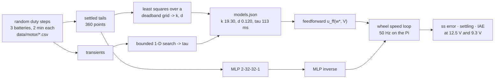

# 16.05 — Learning a motor model: regression and system identification

<!-- glance:start -->
<!-- generated by tools/build.py from curriculum/syllabus.yaml — edit the syllabus, not this block -->

| | |
|---|---|
| **Track** | Main path |
| **Difficulty** | Intermediate |
| **Time** | 1 h |
| **Hardware** | none |
| **Software** | python, numpy |
| **Prerequisites** | [16.01 Where ML actually helps robots (and where classical methods win)](16.01-where-ml-helps-robots.md)<br>[08.02 Measuring a motor — step response, deadband and time constant](../08-control/08.02-motor-step-response.md) |
| **Optional prerequisites** | [FML.02 Supervised learning: regression and classification](../optional-foundations/machine-learning/FML.02-supervised-learning.md)<br>[FM.19 Linear systems and least squares](../optional-foundations/mathematics/FM.19-linear-systems-least-squares.md) |
| **Skip if** | You have fit a dynamics model from logged robot data. |

<!-- glance:end -->

## What you will learn

- Design an excitation experiment that produces logs a model can actually be fitted to, and say why a slow ramp is the wrong one.
- Fit karmel's motor model — gain, deadband, time constant — from logged duty, voltage and wheel speed, with least squares and a 1-D search.
- Fit a neural network to the same data, and measure where it wins (unmodelled effects) and where it fails badly (any input it has never seen).
- Use the fitted model as **feedforward** and measure what it buys in the speed loop: settling time, steady-state error and IAE, at a full and a nearly empty battery.
- Recognise this as the most useful machine learning on a small robot, and know when a black box is the right choice anyway.

## Why it matters

In [08.09](../08-control/08.09-feedforward-exact-speed.md) you gave the wheel-speed loop a
feedforward term built from two constants in `karmel.yaml`: a maximum wheel speed and a deadband.
Those numbers came from a measurement you made once, on a full battery, on your robot, on your floor.
They are already wrong for a half-empty battery, and they were never right for the second motor.

Fitting them from data is machine learning — the quiet, boring, extremely useful kind. It needs no
GPU, no labels, no dataset card, and it improves the robot's behaviour today. It is also the cleanest
place in the whole course to see the difference between a model that **knows physics** and a model
that only **interpolates data**, because here you can drive both outside their training range and
watch exactly one of them fall apart.

<!-- prereqs:start -->
## Prerequisites

You need these first:

- [16.01 Where ML actually helps robots (and where classical methods win)](16.01-where-ml-helps-robots.md)
- [08.02 Measuring a motor — step response, deadband and time constant](../08-control/08.02-motor-step-response.md)

### Optional prerequisite links

New to any of these? Take the foundation lesson first; skip it if you already know it.

- [FML.02 Supervised learning: regression and classification](../optional-foundations/machine-learning/FML.02-supervised-learning.md)
- [FM.19 Linear systems and least squares](../optional-foundations/mathematics/FM.19-linear-systems-least-squares.md)

Check your readiness: `python course.py why 16.05`
<!-- prereqs:end -->

## Concept

### Grey box beats black box when you have the physics

A DC motor driven by PWM through an H-bridge behaves, to a very good approximation, like this:

- speed is proportional to duty cycle, **and to battery voltage** (the bridge passes the battery
  through: half duty at 12.5 V is more speed than half duty at 9.3 V);
- below some duty the wheel does not turn at all — static friction and gearbox stiction: the
  **deadband** ([08.02](../08-control/08.02-motor-step-response.md));
- it does not reach its final speed instantly, but with a first-order lag of time constant $\tau$.

Three numbers: gain $k$, deadband $d$, time constant $\tau$. That is a **grey-box** model — the
structure comes from physics, the parameters come from your data. A **black-box** model (a neural
network) assumes nothing and learns the mapping from examples.

The difference shows up the moment the robot leaves the conditions you recorded. The grey box
extrapolates as far as its physics holds. The black box does whatever the training data's edges
happened to suggest — which, at a battery voltage it never saw, is nonsense delivered with total
confidence. You will measure a **6–70× error ratio** between them below.

### Excitation: the experiment decides what you can learn

You cannot fit a model to data that does not contain the answer. Drive the wheels with a slow ramp
and every sample is near steady state: you can fit $k$ and $d$ and learn *nothing* about $\tau$.
Drive them with a constant duty and you learn one point. The right experiment is **random steps**:
pick a random duty, hold it long enough to settle (here 0.8 s ≈ 7 τ), jump to another. Every step
contains a transient (which identifies $\tau$) and a settled tail (which identifies $k$ and $d$), and
the random order decorrelates the inputs from time, drift and battery sag.

Then deliberately record the conditions you want to *test* extrapolation on, and keep them out of the
training set: a nearly empty battery, and duties beyond the range you trained on.

> [!CAUTION]
> **Safety:** Every experiment in this lesson spins the wheels. Put the robot on a stand with the
> wheels in the air, keep the power switch within reach, keep fingers, hair and cables clear of the
> wheels, and never leave a Li-ion pack charging unattended ([SAFETY.md](../SAFETY.md)). The
> simulated version needs no hardware at all.

> [!TIP]
> **Ask your teacher:** "Show me two logs — one from a slow ramp, one from random steps — and make me work out which parameters each one can and cannot identify."

## Technical explanation

### Level 1 — The model

$$\tau \frac{d\omega}{dt} = k \cdot \mathrm{dz}(u) \cdot \frac{V}{V_{\text{nom}}} - \omega,
\qquad \mathrm{dz}(u) = \mathrm{sign}(u)\,\max(|u| - d,\, 0)$$

with $u$ the commanded duty in $[-1, 1]$, $V$ the battery voltage, $\omega$ the wheel speed in rad/s.
`dz` is the deadzone: it subtracts the deadband and keeps the sign. In steady state the derivative is
zero, so

$$\omega_{\infty} = k \cdot \mathrm{dz}(u) \cdot \frac{V}{V_{\text{nom}}}$$

and the **inverse** — the feedforward you actually want — is

$$u_{\text{ff}}(\omega^\*, V) = \mathrm{sign}(\omega^\*)\left(d + \frac{|\omega^\*|\,V_{\text{nom}}}{k\,V}\right)$$

Read that once more: it is the feedforward of [08.09](../08-control/08.09-feedforward-exact-speed.md)
with the battery voltage in it. That one extra factor is what this lesson buys.

### Level 2 — Practical: fitting it in two steps

**Step 1: $k$ and $d$ from the settled tails.** Average the last 0.3 s of each 0.8 s hold to get
$(u_i, V_i, \omega_i)$. For a *fixed* deadband the model is linear in $k$, so least squares has a
closed form. Sweep the deadband over a grid, solve for $k$ at each, keep the pair with the lowest
residual:

$$x_i = \mathrm{dz}(u_i)\frac{V_i}{V_{\text{nom}}}, \qquad
k^\*(d) = \frac{\sum_i x_i \omega_i}{\sum_i x_i^2}, \qquad
d^\* = \arg\min_d \sum_i (k^\*(d)\,x_i - \omega_i)^2$$

This is ordinary linear regression ([FM.19](../optional-foundations/mathematics/FM.19-linear-systems-least-squares.md))
wrapped in a one-dimensional search over the one parameter that makes the problem non-linear. No
gradient descent, no learning rate, no seed — the same answer every time.

**Step 2: $\tau$ from the transients.** With $k$ and $d$ fixed, simulate the first-order response over
the whole log and pick the $\tau$ that minimises the squared error against the measured speed
(`scipy.optimize.minimize_scalar`, bounded). One parameter, one bounded search.

**Why not fit all three at once?** You can, and gradient-based optimisers will do it. But splitting
gives you a closed form for the part that has one, makes the deadband's cost curve inspectable, and
fails in a way you can diagnose. Reach for the general optimiser when the structure stops being
separable, not before.

**The neural network, for comparison.** A 2→32→32→1 MLP with tanh activations, trained with Adam on
normalised inputs, on exactly the same 360 steady-state points: $(u, V) \mapsto \omega$. And its
inverse, $(\omega, V) \mapsto u$, trained only on points where the wheel was actually moving, because
the inverse is undefined inside the deadband.

### Level 3 — Mathematics: what each model does outside its data

The training logs cover three states of charge (100%, 75%, 50% — 10.51 to 12.50 V) and
$|u| \le 0.8$. The test sets are a nearly empty battery (9.15–9.34 V) and duties up to 1.0. Measured RMSE
of the predicted steady-state wheel speed, in rad/s:

| test set | physics fit | MLP | ratio |
|---|---|---|---|
| held-out time, same batteries (**in distribution**) | 0.005 | 0.048 | 10× |
| low battery, 9.3 V (**never seen**) | 0.004 | 0.288 | **72×** |
| duty up to 1.0 (**trained ≤ 0.8**) | 0.006 | 0.139 | 23× |

The physics model's error does not change, because the physics did not change. The MLP's error grows
by a factor of 6 when it has to leave its training range — and it does not signal that it is
extrapolating. Probing both at specific points shows where it goes: at $(u = 1.0, V = 11.5)$ the
physics model says 18.1 rad/s and the MLP says 17.5; at $(u = 0.5, V = 9.3)$ they agree to 0.1.
The failure is not dramatic. It is a systematic bias of a few percent, exactly the size that makes a
robot drift and a diagnosis hard.

**How many points do you need?** With $n$ steady-state points, noise $\sigma$ and duty values spread
over a range of variance $\mathrm{Var}(x)$, the standard error of the slope is

$$\mathrm{SE}(k) = \frac{\sigma}{\sqrt{n\,\mathrm{Var}(x)}}$$

With $\sigma \approx 0.05$ rad/s, 360 points and duties spread over $\pm 0.8$ (so
$\mathrm{Var}(x) \approx 0.13$), $\mathrm{SE}(k) \approx 0.05/\sqrt{360 \times 0.13} = 0.007$ rad/s
per unit duty — about 0.04% of $k = 19.8$. Two minutes of logging is not a compromise; it is
massively more than enough, and *spread* (the $\mathrm{Var}(x)$ term) buys you more than duration.

### Level 4 — Implementation: feedforward in the loop

Fitting the model is not the point. Using it is. The wheel-speed loop of
[08.04](../08-control/08.04-proportional-control.md)–[08.09](../08-control/08.09-feedforward-exact-speed.md)
becomes

```python
u = ff(target_rad_s, state.battery_v) + kp * e + integral      # feedforward + feedback
if -1.0 < u < 1.0:                                             # anti-windup: integrate only unsaturated
    integral += ki * e * DT
base.set_wheel_duty(clip(u, -1.0, 1.0), 0.0)
```

with four choices of `ff` to compare: none, `karmel.yaml`'s constants (which ignore the battery), the
fitted physics model, and the MLP's inverse. The metrics are the control ones from module 08:
steady-state error, settling time into a ±5% band, and integrated absolute error (IAE).

The fitted parameters go back into the robot as data, not code: `data/motor/models.json` holds `k`,
`deadband` and `tau` per wheel, and the controller loads them. When you change a motor, a wheel or a
battery, you re-run the experiment — you do not re-derive anything.

## Diagram

```text
the experiment (random duty steps, wheels in the air)

duty  0.8 ─┐      ┌──────┐                 ┌───┐
           │      │      │   ┌───┐         │   │
  0.0 ─────┼──────┘      └───┘   └─────────┘   └───   each hold = 0.8 s = 7 tau
           │                                            |<-- 0.5 s -->|<-0.3->|
 -0.8 ─────┘                                              transient    settled tail
                                                          -> tau       -> k, deadband

what the settled tails look like (each point is one hold)

 omega  ^                              12.5 V  ...*
 rad/s  |                          9.3 V ..*'   *'
     16 |                              *'    *'
        |                          .*'    .*'          slope = k * V / V_nom
      8 |                      .*'    .*'
        |                  .*'    .*'
      0 |______________*---*---------------------->  duty
        0        0.12 = deadband                1.0
                 |<-->| nothing happens here
```



## Code

[`motor_sysid.py`](code/motor_sysid.py) has three subcommands and runs entirely on the simulator from
`robotlab.sim`, so it needs no hardware:

```bash
cd 16-machine-learning/code
py motor_sysid.py log      # 5 logging sessions -> data/motor/*.csv   (~10 s)
py motor_sysid.py fit      # physics fit + MLP, in-range vs extrapolation  (~1 min)
py motor_sysid.py ff       # closed-loop: PI alone vs PI + each feedforward
```

```text
train_soc100         6000 samples, battery 12.29-12.50 V, |duty| <= 0.8
train_soc75          6000 samples, battery 11.40-11.60 V, |duty| <= 0.8
train_soc50          6000 samples, battery 10.51-10.70 V, |duty| <= 0.8
test_soc12           6000 samples, battery  9.15- 9.34 V, |duty| <= 0.8
test_fullduty_soc75  6000 samples, battery 11.35-11.61 V, |duty| <= 1.0
```

Three training voltages, two test conditions the training data never covers. The voltage moves
*within* a session too (the pack sags under load and recovers), which is free excitation for the
voltage term.

The fit itself is fifteen lines:

```python
def fit_physics(logs, wheel):
    d, v, w = (np.concatenate(z) for z in zip(*(steady_points(L, wheel) for L in logs)))
    best = None
    for db in np.arange(0.0, 0.301, 0.005):                 # grid over the non-linear parameter
        x = np.sign(d) * np.maximum(np.abs(d) - db, 0.0) * v / V_NOM
        k = float(x @ w / (x @ x))                          # closed-form least squares for the linear one
        sse = float(np.sum((k * x - w) ** 2))
        if best is None or sse < best[0]:
            best = (sse, k, float(db))
    _, k, db = best

    def dyn_error(tau):                                     # then tau, from the transients
        m = PhysicsMotor(k, db, tau)
        return sum(np.mean((m.simulate(L["duty_" + wheel[0]], L["battery_v"]) - L[wheel + "_rad_s"]) ** 2) for L in logs)

    tau = minimize_scalar(dyn_error, bounds=(0.01, 0.5), method="bounded").x
    return PhysicsMotor(k, db, float(tau))
```

**On the real robot**, log the same six columns from telemetry with the wheels in the air —
`t, duty_l, duty_r, battery_v, left_rad_s, right_rad_s` ([labs/README.md](../labs/README.md) has the
protocol) — save them as CSV in `data/motor/`, and run `fit` unchanged.

## Exercise

Hardware for E1–E4: **none**. E5 needs `robot-base`.

### Exercise 16.05-E1 — Predict the extrapolation `[predict]`

Both models are fitted on logs recorded at 10.5–12.5 V with $|u| \le 0.8$, and both fit the training
data well. Before running `fit`, predict the RMSE of each on: (a) held-out time at the same
batteries, (b) a 9.3 V battery, (c) duties up to 1.0. Give a ratio, not just a ranking, and state the
reason for each.

### Exercise 16.05-E2 — Fit it and read the parameters `[coding]`

Run `log` and `fit`. Compare the three fitted parameters with `labs/config/karmel.yaml`
(`max_wheel_speed_rad_s`, `duty_deadband`, `motor_time_constant_s`). They will not match exactly.
For each, say whether the difference is a measurement artefact, a modelling choice, or a real
disagreement — and what you would change in the config. Then fit the **right** wheel as well and
report the difference between the two motors.

### Exercise 16.05-E3 — What is the feedforward worth? `[simulation]`

Run `ff` and build a table of steady-state error, settling time and IAE for the four feedforwards ×
two batteries × three controller tunings. Then answer:

1. With a well-tuned PI (kp 0.03, ki 0.4), does the feedforward improve the steady-state error at all?
   Why not, and what *does* it improve?
2. With the detuned PI (ki 0.1), how much does each feedforward improve IAE at a low battery?
3. When is the `karmel.yaml` constant feedforward as good as the fitted one, and when is it 10× worse?

### Exercise 16.05-E4 — Break the experiment `[debugging]`

Change the excitation and see what dies. (a) Set `HOLD_S = 0.15` (shorter than 2 τ) and re-run
`log` + `fit`: which parameter goes wrong, and in which direction? (b) Restrict the random duties to
$[0.4, 0.8]$ (never near the deadband) and re-fit: what happens to the deadband estimate, and why does
the *speed* prediction stay good in range while the *feedforward* gets worse? (c) Log at a single
battery voltage: which parameter becomes unidentifiable, and what does the fit report instead?

### Exercise 16.05-E5 — Your own motors `[hardware]`

Hardware: `robot-base`. Simulation alternative: E2.

> [!CAUTION]
> **Safety:** Wheels in the air on a stand, power switch within reach, fingers and cables clear, and
> nothing loose near the wheels. Random duty steps make the robot lurch violently if it is on the floor.

Log 2 minutes of random duty steps at a full and at a half-empty pack, fit both wheels, and put the
numbers in `labs/config/karmel.yaml`. Then run a straight-line drive test before and after, and
report the heading drift over 2 m. A left/right gain mismatch of a few percent is the usual cause of
a robot that curves ([09.05](../09-odometry/09.05-calibrating-odometry.md)).

## Expected result

Simulated runs are deterministic (fixed seeds); hardware numbers will differ in magnitude and agree
in shape.

**16.05-E1 and 16.05-E2:** the fit reports

```text
physics fit (left wheel): k = 19.30 rad/s per duty, deadband = 0.120, tau = 113 ms   (360 steady-state points)
test set                              physics RMSE  MLP RMSE   (steady-state wheel speed, rad/s)
held-out time, same battery                  0.005     0.048
low battery (soc 0.12)                       0.004     0.288
|duty| up to 1.0 (trained <= 0.8)            0.006     0.139
probe (duty, V) -> physics / MLP rad/s: (0.5, 12.4) 8.4/8.4  (0.5, 9.3) 6.3/6.4  (1.0, 11.5) 18.1/17.5  (0.1, 11.5) 0.0/0.1
```

The deadband comes back as **0.120** against the config's `duty_deadband: 0.12` — the fit recovers the
parameter that generated the data, which is the right sanity check to run first. The gain is
**19.30 rad/s per unit duty at the 10.8 V nominal** (`battery.nominal_v`), while the config's
`max_wheel_speed_rad_s: 17.0` is the speed at full duty at that same nominal:
$19.30 \times (1 - 0.12) = 17.0$ rad/s — the same number expressed differently, not a disagreement. τ comes back as **113 ms** against the
config's 80 ms; that one *is* a real difference, because the identified τ absorbs the encoder
filtering and the 50 Hz sampling as well as the motor. Which is the honest answer to "what is the
time constant of the motor?" — for control design, the 113 ms you measured end to end.

**16.05-E3:** the measured table (`ff`), left wheel, step to 11.11 rad/s (0.5 m/s):

| controller | feedforward | battery | ss error | settling (±5%) | IAE |
|---|---|---|---|---|---|
| P only, kp 0.03 | none | 12.51 V | +8.26 | never | 12.60 |
| | none | 9.34 V | +8.74 | never | 13.30 |
| | karmel.yaml constants | 12.51 V | −1.01 | never | 2.13 |
| | karmel.yaml constants | 9.34 V | +1.06 | never | 2.41 |
| | **fitted physics (uses V)** | 12.51 V | **−0.01** | **0.14 s** | **0.85** |
| | **fitted physics (uses V)** | 9.34 V | **−0.00** | **0.18 s** | **0.98** |
| | MLP inverse (uses V) | 12.51 V | −0.08 | 0.14 s | 0.92 |
| | MLP inverse (uses V) | 9.34 V | +0.38 | 0.20 s | 1.48 |
| PI, kp 0.03 ki 0.4 | none | 12.51 V | −0.00 | 0.28 s | 1.65 |
| | fitted physics | 12.51 V | +0.00 | 0.42 s | 1.33 |
| | fitted physics | 9.34 V | +0.00 | 0.44 s | 1.27 |
| PI, kp 0.03 ki 0.1 | none | 12.51 V | +1.40 | never | 5.57 |
| | karmel.yaml constants | 12.51 V | −0.37 | 1.02 s | 1.85 |
| | fitted physics | 12.51 V | −0.23 | 0.68 s | 1.47 |
| | fitted physics | 9.34 V | −0.12 | 0.16 s | 1.22 |

Answers: (1) with a well-tuned PI the integrator removes the steady-state error whatever the
feedforward does — that is what integrators are for. What the feedforward improves is **IAE**
(1.65 → 1.33, about 20%) and, far more importantly, the *size of the job the integrator has to do*:
with no feedforward the integrator has to wind up from zero every time, which is where overshoot and
the interaction with saturation come from. (2) With the detuned PI at 9.34 V, IAE falls from 6.70 to
1.32 (constants) and 1.22 (fitted) — a factor of five, and it turns "never settles" into 0.16 s. (3)
The constant feedforward is fine whenever the battery is near the voltage it was calibrated at; at
12.51 V it already overshoots by 1.01 rad/s (9%) and at 9.34 V it undershoots by 1.06 — an 18% swing
across a normal discharge, which the voltage-aware model removes entirely. And the MLP inverse is
almost as good as the physics model **at 12.51 V** (IAE 0.92 vs 0.85) and clearly worse at the
battery it never saw (1.48 vs 0.98, ss error +0.38 rad/s).

**16.05-E4:** (a) with `HOLD_S = 0.15` the settled tail is taken before the motor has settled, so the
apparent steady-state speed is too low and **k is under-estimated** (by roughly $1 - e^{-0.15/0.113}$
of its value in the worst case); τ is also poorly determined because each transient is truncated. (b)
Never probing below duty 0.4 leaves the deadband unconstrained: the fit can trade deadband against
gain along a nearly flat valley, so the reported $d$ drifts and the *in-range* prediction stays
excellent (the product is right) while the **feedforward is biased everywhere near zero speed**, which
is exactly where a robot creeps into a wall. (c) With a single battery voltage, $k$ and the voltage
scaling are not separately identifiable: the fit returns a $k$ that is correct *only at that voltage*,
and the whole $V/V_{\text{nom}}$ term becomes an untested assumption. Excitation has to cover every
input you intend the model to use.

**16.05-E5:** on real hardware expect $k$ within 20% of the nominal $17/(1 - 0.12) = 19.3$ rad/s per
duty, a deadband of 0.08–0.20 (higher on a cold, stiff gearbox and on carpet), and τ of 80–200 ms.
The two wheels typically differ by **2–8%** in gain and by up to 0.03 in deadband; putting the
per-wheel numbers into the config and the feedforward usually cuts straight-line heading drift over
2 m by half or better.

## Troubleshooting

### Symptom: the fitted gain is much lower than the datasheet suggests

1. Were the wheels in the air or on the floor? Load lowers the speed at a given duty — which is fine,
   as long as you fit in the condition you will drive in, and say which.
2. Was the battery sagging during the run? Log `battery_v` *per sample*, not once at the start; the
   model already accounts for voltage if you give it voltage.
3. Is the speed estimate filtered? Heavy encoder filtering makes steps look slower and inflates τ
   while deflating the apparent gain at short holds.

### Symptom: the deadband estimate jumps around between runs

The excitation does not spend enough time near the deadband. Add deliberate small-duty samples (the
course's logger draws 15% of its steps from ±0.25). Then look at the cost curve over the deadband
grid: if it is flat, the data cannot identify it, and no optimiser will fix that.

### Symptom: the model fits beautifully and the robot behaves worse with feedforward on

1. Sign and units: `ff` must return duty in $[-1, 1]$ for a target in rad/s **per wheel**, not m/s
   for the robot.
2. Is the feedforward being added *and* the integrator still tuned for a loop without it? Re-tune the
   feedback after adding feedforward — it now has much less work to do.
3. Saturation: if `ff` alone exceeds 1.0, the feedback term has no authority left. Clip and use
   anti-windup ([08.05](../08-control/08.05-integral-control.md)).

### Symptom: the MLP predicts well on the test split and badly on the robot

That is the lesson, not a bug. Check whether the robot is operating outside the training range
(voltage, duty, load, temperature). Either extend the excitation to cover it, or use the grey-box
model, which does not need to have seen it.

## Common mistakes

- **Fitting a slow ramp.** It identifies $k$ and $d$ and tells you nothing about $\tau$.
- **Logging one battery voltage** and then relying on the voltage term.
- **Averaging the whole hold instead of its tail** — the transient drags the steady-state estimate down.
- **Fitting one wheel and using it for both.** Motors differ by a few percent, and that is precisely
  what makes a robot curve.
- **Reporting $R^2$ on the training data** as evidence the model is good. Hold out a *condition*, not
  a random sample of rows — the same rule as 16.02's session split.
- **Reaching for a neural network** for a system whose physics is three lines long.
- **Believing $\tau$ is the motor's.** What you identify includes the encoder filter and the sampling
  rate, and that is the right number for designing the loop that uses them.
- **Fitting once and never again.** Re-fit after changing wheels, motors, batteries or the surface.

## Knowledge check

1. Why is `speed ∝ duty × battery_voltage` the single most valuable term in this model for a battery-powered robot?
   <details><summary>Answer</summary>

   A 3S Li-ion pack runs from about 12.6 V to 9.9 V — a 27% swing — and the H-bridge passes that
   straight through. Without the voltage term the same duty means a 27% different speed over a
   discharge, which the feedback loop has to absorb as error. Measured here: an 18% swing in
   steady-state error between a full and a nearly empty battery with a voltage-blind feedforward,
   and essentially zero with a voltage-aware one.
   </details>

2. The physics model's RMSE is 0.005 rad/s in range and 0.004 at a voltage it never saw. The MLP's is 0.048 and 0.288. What single property explains both columns?
   <details><summary>Answer</summary>

   Where the knowledge comes from. The physics model's structure is true everywhere the physics holds,
   so leaving the training range costs it nothing. The MLP has no structure; outside the convex hull of
   its training inputs it produces whatever its boundary behaviour happens to be — here a few percent
   of systematic bias, delivered with no warning. (Note also that the MLP is 10× worse *in* range too:
   a 3-parameter model with the right shape beats a 1,000-parameter one with the wrong prior on 360 points.)
   </details>

3. You hold each duty for 0.15 s with τ = 0.113 s and average the last 0.05 s. What fraction of the final speed have you actually reached, and which way is your gain biased?
   <details><summary>Answer</summary>

   After 0.10 s (the start of the averaging window), $1 - e^{-0.10/0.113} = 59\%$; by 0.15 s,
   $1 - e^{-0.15/0.113} = 73\%$. You are averaging roughly 66% of the final speed, so $k$ is
   under-estimated by about a third. Hold for at least 5 τ and average the last 30%.
   </details>

4. With a well-tuned PI controller, feedforward does not change the steady-state error. So why add it?
   <details><summary>Answer</summary>

   Because it changes the transient and the authority left for feedback: measured IAE falls about 20%
   with a good PI, and the integrator no longer has to wind up from zero on every step (which is where
   overshoot and windup interact with saturation). With a conservatively tuned loop — which is what you
   ship when you cannot tune aggressively without oscillation — feedforward is worth a factor of 5 in
   IAE and turns "never settles" into 0.16 s.
   </details>

5. Predict: you log only duties in [0.4, 0.8] and fit. The in-range prediction is excellent. Where does the robot misbehave?
   <details><summary>Answer</summary>

   Near zero speed. The deadband is unidentified (it trades off against the gain along a flat valley),
   so the inverse model's offset is wrong exactly where the offset dominates: slow approaches, fine
   positioning, the last few centimetres before a wall. Excellent in-range fit, wrong constant, worst
   possible place.
   </details>

6. When *is* a neural network the right choice for a motor model?
   <details><summary>Answer</summary>

   When the residual after the physics model is large and structured — cogging torque, backlash,
   temperature- and wear-dependent friction, a flexible transmission, terrain-dependent load. The
   standard pattern is a **residual** model: physics for the bulk (which extrapolates), a small learned
   correction for what the physics misses (which does not), plus a guard that falls back to the physics
   term whenever the inputs leave the training range.
   </details>

7. Your two wheels fit to k = 19.8 and k = 18.9 with the same deadband. What will the robot do, and what do you do about it?
   <details><summary>Answer</summary>

   Drive in an arc under open-loop duty commands: a 4.5% gain difference bends a 2 m straight line by
   several centimetres, and odometry will not see it because the encoders report what actually happened
   ([09.05](../09-odometry/09.05-calibrating-odometry.md)). Fix it with **per-wheel** feedforward
   constants, which the closed-loop wheel controller then barely has to correct at all.
   </details>

## Practical challenge

**Fit, deploy and prove it.** Produce a per-wheel motor model for karmel (simulated or real), put it
into the robot's configuration, and demonstrate the improvement end to end.

**Acceptance criteria:**

- A logging script that records ≥ 2 minutes per condition at ≥ 3 battery states, with random steps
  that include the deadband region, and a written note on why each design choice was made.
- `models.json` with $k$, $d$, $\tau$ **per wheel**, plus a residual plot (predicted vs measured
  steady-state speed) and the standard error of $k$.
- A held-out **condition** (not a random row split) with the RMSE of the physics model and of an MLP
  on it, and one sentence explaining the ratio.
- The wheel-speed loop running with the fitted feedforward: settling time, steady-state error and IAE
  at a full and a low battery, against the same loop without feedforward, in one table.
- One failure you caused on purpose (bad excitation, wrong sign, unclipped feedforward) with the
  symptom it produced and how you detected it.

## You can skip this if…

You answer knowledge-check questions 2, 3 and 5 correctly without looking, and you have already fitted
a dynamics model from logged robot data, validated it on a held-out *condition*, and used it as
feedforward in a real control loop.

`python course.py skip 16.05 --reason "I do system identification and use the model as feedforward"`

## Go deeper

- Tedrake, *Underactuated Robotics*, "System Identification": https://underactuated.csail.mit.edu/sysid.html —
  the same ideas, from excitation design to parameter identifiability, for arms and walkers.
- [FM.19 Linear systems and least squares](../optional-foundations/mathematics/FM.19-linear-systems-least-squares.md) —
  the closed-form regression this lesson wraps in a deadband search.
- [FML.02 Supervised learning](../optional-foundations/machine-learning/FML.02-supervised-learning.md) —
  where curve fitting and "machine learning" are the same thing, and where they are not.
- scipy.optimize: https://docs.scipy.org/doc/scipy/reference/optimize.html — `minimize_scalar`,
  `least_squares` and `curve_fit`, the tools for the non-separable case.
- Ljung, *System Identification: Theory for the User* — the standard reference; chapters on excitation
  and identifiability are the ones this lesson skims.
- Nguyen-Tuong & Peters, "Model Learning for Robot Control: A Survey" (2011):
  https://link.springer.com/article/10.1007/s10339-011-0404-1 — when learned dynamics models beat
  analytical ones in robotics, and the residual-learning pattern.
- [08.09 Feedforward: hitting the exact speed](../08-control/08.09-feedforward-exact-speed.md) — the
  lesson whose two hand-measured constants you have just replaced with a fitted model.

## Progress checkpoint

- [ ] I can design an excitation experiment that identifies every parameter I intend to use.
- [ ] I can fit gain, deadband and time constant from logged data with least squares and a 1-D search.
- [ ] I can show, with numbers, where a neural network beats a physics model and where it fails badly.
- [ ] I can use a fitted model as feedforward and measure the improvement in settling time and IAE.
- [ ] I can tell when a learned residual on top of physics is the right design.

`python course.py complete 16.05` (exercises done) · `python course.py master 16.05`
(challenge done) · `python course.py struggle 16.05 "what was hard"`

Next: [16.06 — Evaluating ML components inside a robot](16.06-evaluating-ml-in-robots.md).
