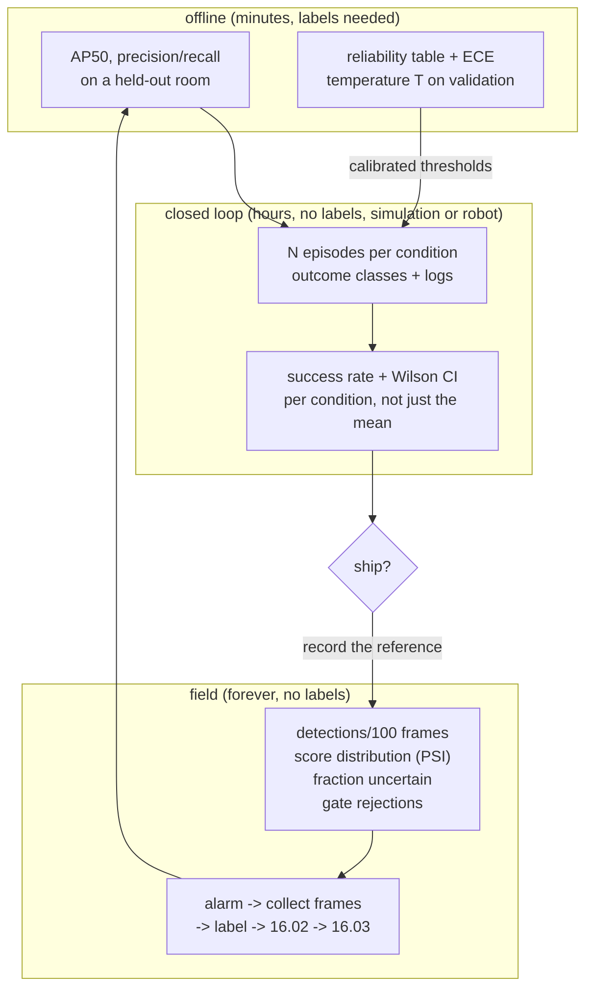

# 16.06 — Evaluating ML components inside a robot

<!-- glance:start -->
<!-- generated by tools/build.py from curriculum/syllabus.yaml — edit the syllabus, not this block -->

| | |
|---|---|
| **Track** | Main path |
| **Difficulty** | Intermediate |
| **Time** | 50 min |
| **Hardware** | none |
| **Software** | python |
| **Prerequisites** | [16.03 Fine-tuning a detector on your own objects](16.03-fine-tuning-a-detector.md) |
| **Optional prerequisites** | [FCV.06 Detection metrics: IoU, precision, recall, mAP](../optional-foundations/computer-vision/FCV.06-detection-metrics.md) |
| **Skip if** | You evaluate ML modules by closed-loop task success, not just offline metrics. |

<!-- glance:end -->

## What you will learn

- Design an acceptance test for a robot behaviour: trials, conditions, a success definition someone else could apply, and a stopping rule.
- Show why the model with the better mAP can make the worse robot, and which configuration change flips it.
- Calibrate confidence scores so that "0.9" means 90%, and choose action thresholds from the calibrated numbers.
- Monitor a deployed model **without labels**, and alarm on the signal that actually moves when the world changes.
- Put a confidence interval on a success rate, and know how many trials you need before a difference means anything.

## Why it matters

You now have a fine-tuned detector ([16.03](16.03-fine-tuning-a-detector.md)) that scores 0.83 mAP50
on an unseen room, exported and quantized ([16.04](16.04-models-on-edge-compute.md)), publishing into
ROS at a measured latency ([13.15](../13-computer-vision/13.15-vision-in-ros2.md)). None of those
numbers tells you whether karmel can find a bottle and drive to it.

That gap is not a detail. In the measurements below, a detector with **AP50 0.71 produces a robot
that fails 100% of the time** in one configuration and succeeds 89% in another — with the same model,
the same images and the same threshold. Offline metrics measure the model. Your user experiences the
task. This lesson is how you measure the thing your user experiences, and how you keep measuring it
after the robot leaves your desk.

<!-- prereqs:start -->
## Prerequisites

You need these first:

- [16.03 Fine-tuning a detector on your own objects](16.03-fine-tuning-a-detector.md)

### Optional prerequisite links

New to any of these? Take the foundation lesson first; skip it if you already know it.

- [FCV.06 Detection metrics: IoU, precision, recall, mAP](../optional-foundations/computer-vision/FCV.06-detection-metrics.md)

Check your readiness: `python course.py why 16.06`
<!-- prereqs:end -->

## Concept

### Three different questions, three different tests

| Question | Test | What it catches |
|---|---|---|
| Is the model right on data like the training data? | offline metrics: AP50, precision/recall | regressions, bad training runs |
| Does the robot accomplish the task? | **closed-loop trials**, in the world or in simulation | latency, thresholds, geometry, integration, everything |
| Is today's world still like the training world? | **field monitoring** on unlabelled outputs | distribution shift, a dirty lens, a new room, a new season |

The first is cheap and answers a narrow question. The second is the only one that answers the
question you care about. The third is the only one you can run forever, because it needs no labels.

A learned component inside a robot is a stage in a pipeline with latency, thresholds, a tracker and a
planner around it. Its *offline* quality is one of maybe six things that decide the outcome. A
"better" model that is 13× slower can easily be worse — and the measurement below shows exactly how
much worse.

### Confidence scores are not probabilities

A detector that says 0.9 is right about 87% of the time in the measurement below — close. One that
says 0.75 is right 64% of the time — not close. Neural networks are systematically **over-confident**:
they push scores towards 0 and 1 harder than the evidence warrants. That does not affect ranking, so
it does not affect AP at all; but every threshold you set, every "act only if confident" rule, and
every fusion with another sensor is a decision made on a number you believe means a probability.
Calibration is the cheap fix: one scalar, fitted on validation, and it never changes the ranking.

### You cannot label the field, so monitor the outputs

Once the robot is in a home, nobody labels its frames. What you *can* log is what the model said:
how many detections per frame, the distribution of scores, how many were near the decision boundary,
how often the plausibility gate rejected something ([13.16](../13-computer-vision/13.16-detection-to-map-position.md)),
how often the tracker lost an object. When the world shifts, those distributions shift first — before
anyone files a complaint.

> [!TIP]
> **Ask your teacher:** "Give me a robot failure story and quiz me on which layer to blame — perception, geometry, timing, planning or the task logic — and what single measurement would settle it."

## Technical explanation

### Level 1 — The evaluation pyramid

```text
      field monitoring            forever, no labels, alarms on distribution shift
   field trials (real robot)      dozens of episodes, expensive, the only ground truth
 closed-loop simulation           hundreds of episodes, cheap, tests integration and timing
      replay on logged bags       deterministic, tests the pipeline end to end on real data
  offline metrics (AP, PR)        seconds, tests the model only
       unit tests                 milliseconds, tests the geometry and the plumbing
```

Each layer is cheaper and narrower than the one above. You run the bottom continuously, the middle on
every change, and the top before you believe anything.

### Level 2 — Practical: designing an acceptance test

Write these down *before* running anything, or you will discover afterwards that you were measuring
something else:

1. **The task, precisely.** "karmel starts at a random pose in the living room, finds the bottle and
   stops within 0.35 m of it, within 45 s."
2. **Success, so that a stranger gets the same answer.** A distance threshold and a time limit, not
   "it looked right". Record the *outcome class*, not just success/failure: success, drove to a wrong
   place, timeout, gave up, safety stop.
3. **The conditions, enumerated.** Rooms × lighting × object placement × starting pose. Every cell
   gets trials; report per cell, not just the mean. A 90% average made of 100% in the kitchen and 60%
   in the hallway is two different robots.
4. **The number of trials, from the difference you need to detect** (Level 3). 10 trials is a demo.
5. **What gets logged every episode:** the bag, the detection stream, the poses, the outcome, and a
   one-line human note. Without the bag you cannot diagnose a failure; without the note you cannot
   remember it.
6. **A stopping rule.** "20 trials per condition, then analyse" — decided in advance, so you cannot
   stop when the numbers look good.

**Classify every failure.** A robot failure is not "the detector was wrong". Six layers, and you can
tell them apart from the logs:

| Layer | Symptom in the logs | Cheapest fix |
|---|---|---|
| Perception | no detection while the object was in view, or a confident wrong class | data (16.02, 16.03) |
| Geometry | the detection was right, the 3D position wrong | intrinsics, depth method, extrinsics (13.16) |
| Timing | the position was right at capture, wrong when used | capture stamps, queue depth (13.15) |
| Decision | acted on one weak detection, or never acted | thresholds and k-of-n confirmation |
| Planning/control | the goal was right, the robot did not get there | Nav2, costmaps (module 12) |
| Task logic | the robot did the wrong thing correctly | the behaviour tree |

### Level 3 — Mathematics: how many trials, and what a score means

**A success rate is a binomial estimate.** 18 successes in 20 trials is not "90%". The Wilson 95%
interval is **[70%, 97%]** — a range so wide it contains both "excellent" and "barely usable". At
89/100 it narrows to [81%, 94%]. And zero failures in $n$ trials means only that the failure rate is
plausibly below about $3/n$ (the *rule of three*): **0 failures in 20 trials is consistent with a 15%
failure rate**, which at 20 approaches a day is three failures a day.

**How many trials to tell two configurations apart?** For two independent samples, 80% power at
$\alpha = 0.05$:

| comparison | trials **per arm** |
|---|---|
| 50% vs 90% | 20 |
| 58% vs 89% | 31 |
| 70% vs 85% | 121 |
| 80% vs 90% | 199 |

Read this before planning a hardware trial: distinguishing a 10-point improvement near the top needs
**200 trials per configuration**. On a real robot at 25 s per episode plus a minute of setup, 20
trials is half an hour and 200 is a day and a half. This is why you tune in closed-loop *simulation*
(hundreds of episodes for free) and use the hardware trial to confirm, not to search.

**Calibration.** Bucket the scores, and in each bucket compare the mean score (confidence) with the
fraction actually correct (accuracy). The **expected calibration error** is the weighted average gap:

$$\mathrm{ECE} = \sum_{b} \frac{n_b}{N}\,\bigl|\mathrm{acc}(b) - \mathrm{conf}(b)\bigr|$$

**Temperature scaling** (Guo et al., 2017) fixes most of it with one number: convert the score to a
logit, divide by $T$, convert back, with $T$ chosen on a *validation* set to minimise negative
log-likelihood.

$$\hat{p} = \sigma\!\left(\frac{\mathrm{logit}(p)}{T}\right)$$

$T > 1$ softens over-confidence. Because $\sigma(\cdot/T)$ is monotone, the ranking — and therefore
AP — is unchanged. Only the *meaning* of the number changes, which is exactly what you needed.

**Distribution shift without labels.** The **population stability index** compares today's
distribution of some logged quantity with a reference recorded during acceptance:

$$\mathrm{PSI} = \sum_{b} (c_b - r_b)\,\ln\frac{c_b}{r_b}$$

over bins defined by the reference's quantiles, with $r_b, c_b$ the reference and current fractions.
The credit-risk rule of thumb — **< 0.1 stable, 0.1–0.25 drifting, > 0.25 shifted** — is a starting
point, not a law: calibrate the threshold on your own quiet days.

### Level 4 — Implementation

[`evaluate_in_the_loop.py`](code/evaluate_in_the_loop.py) runs all three analyses against a
*parametric* detector — one with knobs for recall vs distance, false alarms, latency and
over-confidence — so you can change exactly one property and see what the robot feels:

```python
@dataclass(frozen=True)
class DetectorModel:
    name: str
    latency_s: float           # image capture -> detections available, measured on the robot
    recall_near: float         # probability of detecting a visible bottle at 0.5 m
    range_m: float             # distance at which recall has halved
    false_alarms_per_frame: float
    overconfidence: float      # 1.0 = calibrated; > 1 pushes scores towards 0/1

BIG   = DetectorModel("big (ResNet-50 class)",   latency_s=1.60, recall_near=0.97, range_m=3.5, ...)
SMALL = DetectorModel("small (MobileNet class)", latency_s=0.12, recall_near=0.90, range_m=2.2, ...)
```

The episode is the search behaviour of [16.01](16.01-where-ml-helps-robots.md): spin at 0.5 rad/s,
and when `k` of the last `n` detector outputs are above the score threshold, drive at 0.25 m/s
towards the detected position. One switch decides whether the bearing is combined with the robot's
pose **at capture time** or with its **current** pose — the bug from
[05.10](../05-frames-and-transforms/05.10-object-from-camera-to-map.md), on a knob.

```bash
cd 16-machine-learning/code
py evaluate_in_the_loop.py task          # offline AP vs closed-loop success, 300 episodes per row
py evaluate_in_the_loop.py calibration   # reliability table, ECE, temperature scaling
py evaluate_in_the_loop.py shift         # a week of field monitoring with no labels
```

When you have real logs, replace the parametric detector with `(score, correct?)` pairs from your own
evaluation and per-episode outcomes from your own trials. **The analysis code does not change** —
that is the point of keeping it separate from the model.

## Diagram



## Code

```text
py evaluate_in_the_loop.py task

detector                  AP50 latency  thr  k/n pose used success  wrong timeout median time
big (ResNet-50 class)     0.71   1.60s  0.5 1/1    current      0%    98%      2%           -
big (ResNet-50 class)     0.71   1.60s  0.5 1/1    capture     89%    10%      2%       14.6s
big (ResNet-50 class)     0.71   1.60s  0.8 2/3    capture     35%     2%     63%       24.9s
small (MobileNet class)   0.48   0.12s  0.5 1/1    current     51%    49%      0%       10.1s
small (MobileNet class)   0.48   0.12s  0.5 1/1    capture     58%    42%      0%       10.3s
small (MobileNet class)   0.48   0.12s  0.8 2/3    capture     89%     6%      5%       13.7s
```

Six rows, 300 episodes each, and every lesson of this module is in them. They are discussed in full
under Expected result.

## Exercise

Hardware for E1–E6: **none**. E7 needs `robot-base` and `camera`.

### Exercise 16.06-E1 — Which detector makes the better robot? `[predict]`

Detector BIG: AP50 0.71, latency 1.60 s, recall 0.97 at 0.5 m, usable to 3.5 m. Detector SMALL:
AP50 0.48, latency 0.12 s, recall 0.90, usable to 2.2 m. The task is "spin to search, then drive to
the bottle, 45 s limit". Predict the success rate of each with a 0.5 threshold and no confirmation
rule, using the capture pose. Then predict what adding a 2-of-3 confirmation rule and a 0.8 threshold
does to **each** — same change, and the two models react in opposite directions. Say why before you run it.

### Exercise 16.06-E2 — Run the closed-loop evaluation `[simulation]`

Run `py evaluate_in_the_loop.py task --episodes 300`. Fill in a table of success / wrong-place /
timeout per row, and answer:

1. Which row would a leaderboard have chosen, and which row is the best robot?
2. The BIG detector goes from 0% to 89% with one change. Which, and why is the effect that large?
3. Why does the same confirmation rule that takes SMALL from 58% to 89% take BIG from 89% to 35%?
4. What would you have concluded from 10 episodes per row instead of 300? Compute the Wilson interval
   for 9/10 and for 267/300 to support your answer.

### Exercise 16.06-E3 — Make the scores mean something `[coding]`

Run `py evaluate_in_the_loop.py calibration`. Report the ECE before and after temperature scaling, the
fitted $T$, and the row of the reliability table for scores in [0.9, 1.0]. Then answer: the robot's
rule is "act only when score ≥ 0.9". What fraction of detections pass, what fraction of those are
actually right, and what raw threshold would you need for a *genuine* 90%? Finally, explain in one
sentence why temperature scaling leaves AP unchanged.

### Exercise 16.06-E4 — A week in the field `[simulation]`

Run `py evaluate_in_the_loop.py shift`. Identify the day karmel moved to a new dim room from the
monitor output alone. Then answer: (a) which of the three monitored quantities moved most, and which
barely moved at all, (b) what a detections-per-frame monitor alone would have told you, (c) what you
would set your PSI alarm threshold to given days 1–5, and (d) what the robot should *do* when the
alarm fires — list three actions in increasing order of cost.

### Exercise 16.06-E5 — Trial arithmetic `[numerical]`

(a) Your robot succeeds in 18 of 20 trials. Give the point estimate and the Wilson 95% interval, and
say whether you can claim "over 85% success". (b) A new detector gives 17 of 20. Can you tell the two
apart? How many trials per configuration would you need to distinguish 70% from 85% at 80% power?
(c) A safety-relevant behaviour has 0 failures in 50 trials. What is the 95% upper bound on its
failure rate, and how many failures per week does that allow at 30 activations a day? (d) One episode
takes 25 s plus 60 s of setup. How long is the trial in (b), and what does that imply about where you
should do your tuning?

### Exercise 16.06-E6 — Write the evaluation code `[coding]`

Implement the reliability table, ECE, temperature scaling, the Wilson interval, PSI and the
closed-loop outcome summary yourself. Check it: `python course.py check 16.06`.

### Exercise 16.06-E7 — A real acceptance test `[hardware]`

Hardware: `robot-base`, `camera`. Simulation alternative: E2, with the Gazebo world of
[06.07](../06-simulation/06.07-simulated-sensors-and-noise.md) if you want a physical simulator in the loop.

> [!CAUTION]
> **Safety:** Autonomous motion in a home. Indoor speed limit 0.3 m/s, watchdog active, power switch
> within reach, children and pets out of the test area, and an observer whose only job is the stop
> button ([SAFETY.md](../SAFETY.md)).

Define and run a 20-episode acceptance test for "find the bottle" in **two** rooms (40 episodes
total). Record a bag per episode, the outcome class, and a one-line note. Report the success rate
with a Wilson interval **per room**, the failure taxonomy, and the single change you would make next —
justified by the taxonomy, not by intuition.

## Expected result

Simulation results are from `evaluate_in_the_loop.py` with its fixed seeds (300 episodes per row);
re-running reproduces them exactly.

**16.06-E1 and 16.06-E2:** the six rows above, read in order:

1. **Offline AP ranks the models BIG (0.71) > SMALL (0.48). The best robot is a tie at 89% — and the
   configuration matters far more than the model.** The spread *within* one model (0% to 89%) is
   larger than the spread between models.
2. **BIG at 0% → 89%: the pose used.** With a 1.6 s pipeline and a robot spinning at 0.5 rad/s, using
   the *current* heading with a *1.6 s old* bearing is an error of $\omega L = 0.8$ rad ≈ 46°: the
   robot drives almost perpendicular to the bottle, every time. 98% "drove to a wrong place" is not a
   perception failure at all, and no amount of retraining would have fixed it. Using the capture pose
   costs one line ([05.10](../05-frames-and-transforms/05.10-object-from-camera-to-map.md)).
3. **The confirmation rule helps the fast model and destroys the slow one.** SMALL sees ~8 frames per
   second, so "2 of the last 3 detections above 0.8" is cheap: it filters false alarms (wrong-place
   drops 42% → 6%) and success rises to 89%. BIG sees 0.6 frames per second, so the same rule needs
   ~5 s of continuous visibility while the robot is spinning past the bottle; it usually never
   triggers, and 63% of episodes end in a timeout. **A "safety" rule is a latency budget.**
4. With 10 episodes you would be comparing numbers whose intervals overlap everything: 9/10 = 90% has
   a Wilson interval of **[60%, 98%]**, while 267/300 = 89% gives **[85%, 92%]**. At 10 episodes the
   0% row would still be unmistakable, but you could not have ranked rows 2, 3 and 6 at all.

**16.06-E3:**

```text
raw scores: ECE = 0.097
    score bin     n mean score fraction correct
   0.7-0.8     353       0.75             0.64
   0.8-0.9     508       0.85             0.70
   0.9-1.0    1397       0.97             0.87

temperature-scaled, T=1.95: ECE = 0.011
   0.9-1.0     538       0.95             0.95

'act only when score >= 0.9': 35% of detections pass, 87% of those are correct
(the raw score promised >= 90 %). Calibrated, the same detections read >= 0.76.
```

ECE falls from **0.097 to 0.011** for one fitted scalar. The practical reading: the rule "act only
above 0.9" passes 35% of detections and is right 87% of the time — close enough to be believed and
wrong enough to matter when the action is a grasp. For a genuine 90% you need about **0.95 raw** (or,
much better, calibrate and use 0.90 on the calibrated score, which is what the number now means).
AP is unchanged because temperature scaling is monotone: it reorders nothing, so every
precision/recall pair — and the area under the curve — is identical.

**16.06-E4:**

```text
day condition                dets/100 frames  uncertain 0.3-0.7  PSI(scores)   alarm
  1 usual rooms                         32.3                17%         0.02   -
  2 usual rooms                         31.7                18%         0.02   -
  3 usual rooms                         32.4                20%         0.04   -
  4 usual rooms                         31.9                22%         0.04   -
  5 usual rooms                         34.5                19%         0.02   -
  6 dim new room                        34.5                34%         0.90   ALARM
  7 dim new room                        34.9                36%         1.05   ALARM
reference: 31.0 detections/100 frames, 18% uncertain
```

The shift starts on **day 6**. (a) PSI moves by a factor of 20 (0.02–0.04 → 0.90); the fraction of
uncertain detections nearly doubles (19% → 34%); **detections per 100 frames barely moves at all**
(32 → 34.5), because the model finds fewer real bottles *and* hallucinates more, and the two changes
cancel. (b) A rate-only monitor would have reported "normal" through both bad days — it was inside
the ±30% band the whole time. That is the lesson: monitor the *shape* of the score distribution, not
just the count. (c) Days 1–5 sit at 0.02–0.04, so an alarm at 0.25 (the standard rule of thumb) is
about 6× the quiet-day maximum: comfortable. If your quiet days ran at 0.15 you would raise it, and
also ask why they are so variable. (d) In increasing cost: **log more** (keep the frames from alarm
periods — they are exactly the training data you are missing), **be more conservative** (raise the
action threshold, require more confirmations, reduce speed), and **stop and ask** (fall back to the
classical detector or tell the user the robot cannot see well here). Then label the collected frames
and go around the loop: 16.02 → 16.03 → here.

**16.06-E5:** (a) 18/20 = 90%, Wilson 95% **[70%, 97%]**. You cannot claim "over 85%" — the interval
includes 70%. (b) 17/20 = 85% has the interval [64%, 95%], which overlaps almost entirely; the two
are indistinguishable. Distinguishing a true 70% from a true 85% at 80% power needs **121 trials per
arm**. (c) Rule of three: $3/50 =$ **6%** upper bound (Wilson gives [0%, 7.1%]). At 30 activations a
day that is up to $30 \times 7 \times 0.06 \approx$ **12 failures a week** still consistent with your
clean 50-trial run — which is why safety arguments are built from design and interlocks, never from a
clean test run. (d) $2 \times 121 \times 85$ s ≈ **5.7 hours** of pure trial time, realistically two
days with resets and battery changes. Tune in simulation where 300 episodes are free; spend hardware
trials on confirming one or two candidates.

**16.06-E6:** `python course.py check 16.06` passes with no skipped tests.

**16.06-E7:** typical first-run results on real hardware: 40–75% success, a strong per-room
difference (often 20+ points), and a failure taxonomy dominated by **timing and decision**, not
perception — the same shape as the simulated table. Expect at least one failure mode you did not
anticipate at all; that one is the most valuable output of the whole exercise.

## Troubleshooting

### Symptom: offline metrics improved, the robot did not

Work down the taxonomy with the logs from one failing episode: was the object detected while visible
(perception)? Was the 3D position right (geometry)? Was it right *at the time it was used* (timing)?
Did the decision rule fire (thresholds, k-of-n)? Did the planner reach the goal? Nine times out of
ten on a first integration it is timing or thresholds.

### Symptom: the success rate swings wildly between test sessions

Two candidates. **Too few trials** — compute the interval before concluding anything (18/20 spans
[70%, 97%]). Or **uncontrolled conditions**: light through a window, battery state, a moved chair.
Log the conditions per episode and report per condition; a mean over uncontrolled conditions is a
number without a meaning.

### Symptom: raising the confidence threshold made the robot worse

You traded false alarms for missed detections, and your pipeline could not afford the missed frames —
exactly the BIG detector's 89% → 35% above. Check the *rate* of usable detections after the
threshold: with a slow detector a k-of-n rule needs seconds of continuous visibility. Fix the frame
rate before tightening the rule.

### Symptom: the monitor never alarms

Check that the reference was recorded during acceptance (not from training-set images), that you are
monitoring a quantity that actually moves (score distribution, uncertain fraction, gate rejections —
not just the detection count), and that the alarm threshold was set from your own quiet days.

### Symptom: the monitor alarms constantly

Your reference period was too narrow (one room, one time of day). Record the reference across the
conditions the robot legitimately meets, and set the threshold above the worst quiet day.

## Common mistakes

- **Shipping on offline metrics.** They measure the model, not the robot.
- **Ten trials.** The interval on 9/10 is [60%, 98%]. That is not a measurement.
- **Reporting the mean over conditions.** Report per room, per lighting, per distance.
- **Changing two things between trial sets.** Then you have learned nothing about either.
- **Treating scores as probabilities** without calibrating, then building threshold logic on them.
- **Calibrating on the test set.** Fit $T$ on validation, measure on test.
- **Monitoring only the detection count.** It is the quantity least likely to move under shift.
- **Stopping the trial when the numbers look good.** Decide the stopping rule first.
- **Arguing safety from a clean test run.** 0 failures in 50 trials still allows ~6%.

## Knowledge check

1. A detector with AP50 0.71 gives a robot 0% task success; the same detector with one line changed gives 89%. What was the line, and what does that tell you about offline metrics?
   <details><summary>Answer</summary>

   The TF lookup used the robot's current pose instead of its pose at image capture. With a 1.6 s
   pipeline and a 0.5 rad/s spin that is 0.8 rad (46°) of bearing error, so the robot drives past the
   bottle every time. Offline AP cannot see integration, latency or frames — it evaluates a function
   from images to boxes, and a robot is not that.
   </details>

2. Why does a 2-of-3 confirmation rule help a 8 Hz detector and cripple a 0.6 Hz one?
   <details><summary>Answer</summary>

   The rule is a requirement in *time*, not in frames. At 8 Hz, 2 of the last 3 outputs is ~0.4 s of
   visibility — cheap while spinning past an object. At 0.6 Hz it is ~5 s, longer than the object stays
   in view, so the rule rarely fires and episodes time out (63% here). Every temporal filter has to be
   budgeted against the detection rate.
   </details>

3. Your robot succeeds 18 times in 20 trials. Your manager asks whether it meets a "90% success" requirement. What do you say?
   <details><summary>Answer</summary>

   The point estimate is 90%, but the 95% interval is [70%, 97%]: the data are consistent with a true
   rate anywhere in that range, so the requirement is neither demonstrated nor refuted. To demonstrate
   90% with a reasonable interval you need on the order of 100+ trials, and you should report per
   condition as well as overall.
   </details>

4. Temperature scaling changes every score. Why does it not change AP50?
   <details><summary>Answer</summary>

   It is a monotone transform: if score A > score B before, it is after. AP is computed by walking the
   detections in score order, so the whole precision–recall curve is identical. What changes is the
   *meaning* of a given number — and therefore every threshold you set, which is the point.
   </details>

5. Predict: the robot moves to a dim room the model never saw. What happens to detections per frame, to the fraction of scores in 0.3–0.7, and to PSI?
   <details><summary>Answer</summary>

   Detections per frame moves least — fewer true detections and more false alarms roughly cancel
   (measured: 32 → 34.5 per 100 frames, inside a ±30% band). The uncertain fraction nearly doubles
   (19% → 34%) and PSI jumps by more than an order of magnitude (0.02–0.04 → 0.90). Monitor the shape
   of the distribution, not the count.
   </details>

6. You have two candidate configurations and one afternoon with the robot. How do you spend it?
   <details><summary>Answer</summary>

   Not on a head-to-head hardware trial: separating 80% from 90% needs ~200 episodes per arm. Choose
   between them in closed-loop simulation (hundreds of episodes, free), then spend the afternoon on
   20–40 episodes of the winner in the real conditions, to catch what simulation does not model —
   lighting, reflections, clutter, people — and to confirm the simulated number is not wildly off.
   </details>

7. What do you log from a deployed robot so that next month's model is better than this month's?
   <details><summary>Answer</summary>

   Per frame: detection count, scores, gate rejections, latency. Per episode: outcome class, the bag,
   conditions, a human note. On alarm: the raw frames from the alarm window — they are precisely the
   examples your training set lacks, and they feed straight into 16.02's pipeline. Plus the model and
   dataset ids, so you can tell which version produced which behaviour.
   </details>

## Practical challenge

**An acceptance test karmel has to pass before every release.** Write it as a document plus a script.

**Acceptance criteria:**

- A written test plan: task, success definition, outcome classes, conditions (≥ 2 rooms × 2 lighting),
  trials per cell derived from the difference you want to detect, stopping rule, and what is logged.
- A runner that executes the episodes (simulated or real), writes one JSON record per episode, and
  produces a report with per-condition success rates **and Wilson intervals**, the failure taxonomy,
  and the median time to success.
- A calibration step: fit $T$ on a validation set, report ECE before and after, and state the
  *calibrated* thresholds used for "start a grasp" and "tell the user".
- A monitoring baseline: the reference distributions recorded during the acceptance run, the alarm
  thresholds derived from them, and a script that scores a new day's log against the reference.
- One deliberately injected regression (add 400 ms of latency, or drop the threshold to 0.2) that your
  report catches, with the per-condition table that reveals it.

## You can skip this if…

You answer knowledge-check questions 1, 3 and 5 correctly without looking, and you already evaluate ML
components by closed-loop task success with confidence intervals, calibrate confidence scores before
thresholding on them, and monitor a deployed model without labels.

`python course.py skip 16.06 --reason "I evaluate ML in the loop, with intervals, calibration and field monitoring"`

## Go deeper

- Guo et al., "On Calibration of Modern Neural Networks" (ICML 2017): https://arxiv.org/abs/1706.04599 —
  where temperature scaling and the reliability diagram come from, and the evidence that modern
  networks are over-confident.
- [FCV.06 Detection metrics: IoU, precision, recall, mAP](../optional-foundations/computer-vision/FCV.06-detection-metrics.md) —
  the offline metrics this lesson puts in their place.
- Sculley et al., "Hidden Technical Debt in Machine Learning Systems" (NeurIPS 2015):
  https://papers.nips.cc/paper_files/paper/2015/hash/86df7dcfd896fcaf2674f757a2463eba-Abstract.html —
  monitoring, feedback loops and the maintenance cost of a learned component.
- Breck et al., "The ML Test Score" (IEEE Big Data 2017): https://research.google/pubs/pub46555/ —
  a checklist of tests for production ML; read it as a robotics checklist and note which items your
  robot already fails.
- Amodei et al., "Concrete Problems in AI Safety" (2016): https://arxiv.org/abs/1606.06565 —
  distributional shift and safe exploration, stated precisely.
- Brown, Cai & DasGupta, "Interval Estimation for a Binomial Proportion" (Statistical Science, 2001):
  https://projecteuclid.org/journals/statistical-science/volume-16/issue-2/Interval-Estimation-for-a-Binomial-Proportion/10.1214/ss/1009213286.full —
  why you should use the Wilson interval and not the textbook normal approximation.
- Hanley & Lippman-Hand, "If nothing goes wrong, is everything all right?" (JAMA 1983):
  https://jamanetwork.com/journals/jama/article-abstract/391788 — the one-page origin of the rule of three.

## Progress checkpoint

- [ ] I can write an acceptance test with conditions, outcome classes, trial counts and a stopping rule.
- [ ] I can explain and demonstrate a case where the better offline model makes the worse robot.
- [ ] I can calibrate confidence scores and set action thresholds on numbers that mean what they say.
- [ ] I can monitor a deployed model without labels and choose an alarm threshold from quiet days.
- [ ] I can put a confidence interval on a success rate and size a trial before running it.

`python course.py complete 16.06` (exercises done) · `python course.py master 16.06`
(challenge done) · `python course.py struggle 16.06 "what was hard"`

Next: [17.01 — The RL framing: environment, state, action, reward, policy](../17-reinforcement-learning/17.01-rl-framing.md).
