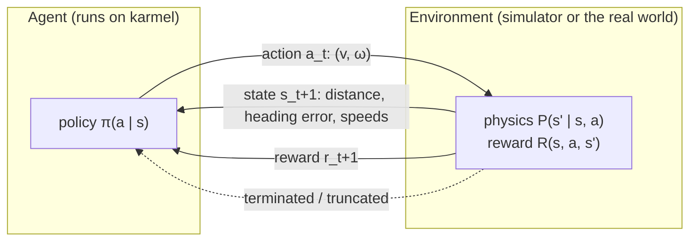

# 17.01 — The RL framing — environment, state, action, reward, policy

<!-- glance:start -->
<!-- generated by tools/build.py from curriculum/syllabus.yaml — edit the syllabus, not this block -->

| | |
|---|---|
| **Track** | Main path |
| **Difficulty** | Intermediate |
| **Time** | 45 min |
| **Hardware** | none |
| **Software** | none |
| **Prerequisites** | [16.01 Where ML actually helps robots (and where classical methods win)](../16-machine-learning/16.01-where-ml-helps-robots.md)<br>[06.02 The course mini-simulator — physics in 100 lines of Python](../06-simulation/06.02-course-mini-simulator.md) |
| **Optional prerequisites** | [FML.01 What machine learning is — and isn't](../optional-foundations/machine-learning/FML.01-what-is-ml.md) |
| **Skip if** | You can formulate a robot task as an MDP. |

<!-- glance:end -->

## What you will learn

- Name the parts of a reinforcement-learning problem (agent, environment, state, action, reward, policy, episode) for a real robot task.
- Write a robot task down as a Markov decision process: states, actions, transition probabilities, rewards, discount.
- Tell whether a state description is Markov, and fix it when it isn't.
- Run the agent–environment loop in code with the Gymnasium-style `reset`/`step` API.
- Decide when RL is the wrong tool for a robot problem, and say what to use instead.

## Why it matters

Everything karmel does so far was designed by you: a PID loop holds wheel speed, odometry integrates ticks, Nav2 plans a path. Reinforcement learning (RL) is the other way to get behaviour. You describe *what is good* with a number, the reward, and an optimizer finds *how* by trial and error. That is how legged robots learned to walk in minutes on a GPU, and how a policy learns to dock a robot when the geometry is awkward.

It is also how you waste a month. RL needs millions of trials, finds loopholes in your reward, and produces a neural network you can't read. The first skill is framing: turning "drive to the charger without hitting the sofa" into an exact problem statement. Only then can you judge whether RL is worth it. This module stays in simulation. Lesson [17.09](17.09-rl-sim-to-real.md) covers what it takes to put a learned policy on the real robot.

<!-- prereqs:start -->
## Prerequisites

You need these first:

- [16.01 Where ML actually helps robots (and where classical methods win)](../16-machine-learning/16.01-where-ml-helps-robots.md)
- [06.02 The course mini-simulator — physics in 100 lines of Python](../06-simulation/06.02-course-mini-simulator.md)

### Optional prerequisite links

New to any of these? Take the foundation lesson first; skip it if you already know it.

- [FML.01 What machine learning is — and isn't](../optional-foundations/machine-learning/FML.01-what-is-ml.md)

Check your readiness: `python course.py why 17.01`
<!-- prereqs:end -->

## Concept

### Learning by consequences

Think of training a dog to fetch. You don't program its legs. You wait for it to do something close to what you want and you give it a treat. After enough repetitions it does the thing that earns treats. RL is exactly that, with a program as the dog and a number as the treat.

Five words carry the whole field:

- **Agent**: the learner and decision maker. For us, the policy running on karmel's computer.
- **Environment**: everything the agent does not control. The room, the motors, the physics, the battery, the simulator.
- **State** $s$: what the agent observes before it decides. Example: distance and direction to the goal plus the current wheel speeds.
- **Action** $a$: what it decides. Example: a forward speed and a turn rate.
- **Reward** $r$: a single number the environment returns after each action. Example: +10 for reaching the charger, −1 per second spent.

The agent's behaviour is its **policy** $\pi$: a function from state to action (or to a probability of each action). Learning means changing the policy so that the *total* reward over time goes up. A run from a start state until something ends it (goal reached, crash, time limit) is an **episode**.

### The loop

A distributed-systems analogy helps: the environment is a remote service with a two-call API. `reset()` starts a session and returns the first observation. `step(action)` returns the next observation, a reward, and flags saying whether the session is over. The agent is a client that calls `step` millions of times and gradually learns which requests pay. You cannot read the service's source code; you can only call it. That constraint, learning from interaction rather than from a model, is what makes RL different from planning.

### What makes it hard

1. **Delayed consequences.** Turning left now might be what makes docking possible 5 seconds later. The reward for the dock arrives long after the decision that earned it. Assigning credit backwards in time is the core technical problem (lessons 17.02–17.05).
2. **Exploration.** The agent only learns about actions it tries. If it always does what currently looks best, it may never discover something better (17.02).
3. **The reward is the specification.** The optimizer does exactly what the number says, not what you meant (17.08).

> [!TIP]
> **Ask your teacher:** "Take three robot tasks I care about and help me write each one as state, action, reward and episode end. Then tell me which of them you would NOT solve with RL, and why."

## Technical explanation

### Level 1 — The Markov decision process

The formal object behind every RL problem is a **Markov decision process (MDP)**, the tuple $(\mathcal{S}, \mathcal{A}, P, R, \gamma)$:

| Symbol | Meaning | karmel go-to-goal |
|---|---|---|
| $\mathcal{S}$ | set of states | (distance to goal, heading error, measured $v$, measured $\omega$) |
| $\mathcal{A}$ | set of actions | $v \in [-0.5, 0.5]$ m/s, $\omega \in [-2.5, 2.5]$ rad/s |
| $P(s' \mid s, a)$ | transition probabilities | the physics: motor lag, slip, noise |
| $R(s, a, s')$ | reward | progress toward the goal, +10 on arrival, −10 on collision |
| $\gamma \in [0, 1)$ | discount | 0.99: a reward 100 steps away is worth $0.99^{100} = 0.37$ of one now |

The agent never sees $P$ or $R$ as formulas. It only sees samples: it is in $s$, does $a$, and the world answers with $s'$ and $r$.

> [!NOTE]
> New to probability notation like $P(s' \mid s, a)$? → [FM.13 Probability from zero](../optional-foundations/mathematics/FM.13-probability-basics.md). New to what "learning" means for a program? → [FML.01 What machine learning is](../optional-foundations/machine-learning/FML.01-what-is-ml.md). Skip them if you already know them.

### Level 2 — A small MDP you can hold in your head

karmel is in a corridor of 6 cells. Cell 5 is the charging dock. Cell 0 is the top of a staircase. It starts in cell 2. Each move costs −1 (time and battery). Reaching the dock gives +10 and ends the episode. Falling down the stairs gives −10 and ends it. The floor is slippery: a command does nothing with probability 0.2.

```text
cell:    0          1     2     3     4     5
      [STAIRS]      .     S     .     .   [DOCK]
       -10, end                           +10, end
```

The transition probabilities from cell 2 are:

| action | $s' = 1$ | $s' = 2$ | $s' = 3$ | reward |
|---|---|---|---|---|
| LEFT | 0.8 | 0.2 | 0 | −1 |
| RIGHT | 0 | 0.2 | 0.8 | −1 |

Two policies, analysed by hand:

- **Always RIGHT.** It needs 3 successful moves. Each attempt succeeds with probability 0.8, so the expected number of steps is $3 / 0.8 = 3.75$. The last move pays +10, the others −1, so the expected return is $-(3.75 - 1) + 10 = 7.25$.
- **Always LEFT.** It needs 2 successful moves: $2 / 0.8 = 2.5$ steps, return $-(2.5 - 1) - 10 = -11.5$.

The code below runs 5000 episodes of each and gets 7.23 and −11.51. That is sampling noise around the hand calculation.

### Level 3 — The Markov property: what goes into the state

An MDP assumes the **Markov property**: the future depends on the present state and action only, not on how you got there.

$$P(s_{t+1} \mid s_t, a_t) = P(s_{t+1} \mid s_t, a_t, s_{t-1}, a_{t-1}, \dots, s_0)$$

For robots this is a design decision, not a fact of nature. Examples with karmel:

- **Position only** (x, y, θ) is not Markov for driving. Two robots at the same pose, one standing and one moving at 0.5 m/s, will be in different places 0.1 s later. Add the wheel speeds and it becomes (nearly) Markov.
- **One LiDAR scan** can't tell whether a person is walking toward you or away. Stack the last 2–3 scans, or add a recurrent network, to recover velocity.
- **Command latency** of 100 ms means the action you send now takes effect one step later. The state must include the last action, or the policy sees the robot react to a command it can no longer remember sending.

When the agent can't observe everything that matters (the true slip, the battery sag, where the person is), the problem is **partially observable** (a POMDP). Real robots are always partially observable. The practical recipe is to put enough recent history into the observation that the Markov assumption is "close enough", then test.

### Level 4 — Episodes, termination and truncation

An episode ends for one of two very different reasons, and modern APIs keep them apart:

- **Terminated**: the MDP itself ends. The goal is reached, the robot crashed, it fell down the stairs. There is no future reward after this, by definition.
- **Truncated**: *you* stopped it. The time limit of 20 s ran out, or the experiment was cut short. The robot could have continued, and future reward did exist.

Mixing them up is a classic bug. If a time-limit stop is treated as "terminated", the learner concludes that the state 20 s into an episode is worthless, which is false. Gymnasium's `step()` returns both flags for this reason, and every algorithm in lessons 17.03–17.07 uses them differently.

### When NOT to use RL

RL is the right tool when you can't write the controller, can simulate cheaply, and can define success with a number. For most of karmel's problems at least one of these fails:

| Task | Use instead | Why not RL |
|---|---|---|
| Hold a wheel speed | PID + feedforward ([08.09](../08-control/08.09-feedforward-exact-speed.md)) | A 3-parameter controller with guarantees beats a network trained for hours |
| Drive from A to B in a known map | Nav2 planners ([12.05](../12-navigation/12.05-local-planning-obstacle-avoidance.md)) | Path planning has exact, fast algorithms |
| Estimate the pose | Odometry + EKF ([10.06](../10-localization/10.06-extended-kalman-filter.md)) | Estimation isn't a decision problem |
| Pick up a cup, with demonstrations available | Imitation learning ([18.02](../18-embodied-ai/18.02-imitation-learning-behavior-cloning.md)) | Copying 50 demos beats millions of trials |
| Walk on rough terrain, dexterous in-hand rotation, agile flight | **RL in a GPU simulator** | Contact-rich dynamics too hard to model by hand, success easy to score |

Red flags that should push you away from RL: you can't simulate the task; a single failure is dangerous or expensive; you can't define success without a human judging it; a classical method already works at 90%.

## Diagram



```text
One episode as a sequence (the "trajectory"):

 s0 --a0--> r1, s1 --a1--> r2, s2 --a2--> ... --a(T-1)--> rT, sT   (terminated or truncated)
 |                                                               |
 reset()                                               step() returns the flags
```

## Code

[`code/corridor_mdp.py`](code/corridor_mdp.py) (tested by `code/test_rl_code.py`) writes the corridor down twice. `CorridorMDP` is the white-box model with its transition table. `CorridorEnv` is the black box an agent sees, with the Gymnasium-style `reset`/`step`. The important part:

```python
@dataclass(frozen=True)
class CorridorMDP:
    """The five parts of an MDP: states S, actions A, transitions P, rewards R, discount gamma."""
    n_cells: int = 6
    start: int = 2
    slip: float = 0.2  # probability that a command has no effect
    step_reward: float = -1.0
    dock_reward: float = 10.0
    stairs_reward: float = -10.0
    gamma: float = 0.9

    def transitions(self, s: int, a: int) -> list[tuple[float, int, float, bool]]:
        """P(s', r | s, a) as a list of (probability, next_state, reward, terminated)."""
        target = s - 1 if a == LEFT else s + 1
        outcomes = []
        for prob, s2 in ((1.0 - self.slip, target), (self.slip, s)):
            if s2 == 0:
                outcomes.append((prob, s2, self.stairs_reward, True))
            elif s2 == self.n_cells - 1:
                outcomes.append((prob, s2, self.dock_reward, True))
            else:
                outcomes.append((prob, s2, self.step_reward, False))
        return outcomes


def run_episode(env: CorridorEnv, policy, seed: int) -> tuple[float, float, int]:
    """One episode: returns (undiscounted return, discounted return, steps)."""
    s, _ = env.reset(seed=seed)
    total, discounted, k = 0.0, 0.0, 0
    while True:
        a = policy(s, env.rng)
        s, r, terminated, truncated, _ = env.step(a)
        total += r
        discounted += env.mdp.gamma**k * r
        k += 1
        if terminated or truncated:
            return total, discounted, k
```

Run it (numpy only, about 3 s):

```bash
python 17-reinforcement-learning/code/corridor_mdp.py
```

```text
P(s', r | s=2, a) in the corridor:
  a=LEFT : p=0.8 -> s'=1 r=-1, p=0.2 -> s'=2 r=-1
  a=RIGHT: p=0.8 -> s'=3 r=-1, p=0.2 -> s'=2 r=-1

policy           mean return  mean disc. return  mean steps   (5000 episodes, seeds 0..4999)
always RIGHT            7.23               5.02        3.77
always LEFT           -11.51             -10.00        2.51
uniform random         -8.60              -5.96        7.53
```

The "discounted return" column uses $\gamma = 0.9$. Lesson 17.02 explains it. Seeds 0–4999 make the table reproducible.

## Exercise

All exercises need hardware: none.

### Exercise 17.01-E1 — Frame four robot tasks `[design]`

For each task write the state (what numbers, from which sensors), the action (units and limits), the reward, what terminates an episode and what truncates it: (a) karmel docks onto its charger; (b) karmel follows a person at 1 m; (c) the arm (catalog `arm`) pushes a cup to a marked spot on the table; (d) karmel explores the apartment to build a map. Then mark each one "RL is a good fit", "RL is possible but a classical method is better", or "RL is a bad fit", with one sentence of justification.

### Exercise 17.01-E2 — Is it Markov? `[predict]`

For each observation, say whether it is (approximately) Markov for the task, and if not, what to add: (a) go-to-goal with observation = (distance to goal, heading error); (b) the same plus measured $v$ and $\omega$; (c) balancing a two-wheeled robot with observation = tilt angle only; (d) the go-to-goal robot with 200 ms command latency and observation (b).

### Exercise 17.01-E3 — Expected return by hand `[numerical]`

In the corridor, compute by hand the expected number of steps and the expected undiscounted return of "always RIGHT" when (a) slip = 0, (b) slip = 0.5, (c) the robot starts in cell 4 with slip 0.2. Then edit `CorridorMDP` and `main()` in `corridor_mdp.py` to check all three.

### Exercise 17.01-E4 — Terminated or truncated? `[debugging]`

A teammate's environment returns `done=True` in all of these situations: goal reached; 30 s time limit; the robot hit the wall; the battery simulation dropped below the cutoff voltage; the training script is shutting down. Split them into `terminated` and `truncated`, and explain what goes wrong in learning if the time limit is reported as `terminated`.

## Expected result

- **17.01-E1:** (a) State: distance and bearing to the dock from a marker or the map, wheel speeds, maybe front range. Action: $(v, \omega)$ within 0.5 m/s and 2.5 rad/s. Reward: progress plus a bonus for contact with the right alignment, a penalty for collisions. Terminated on docked or collided, truncated at a time limit. RL is possible, but a visual-servoing controller (13.07) is usually better. (b) State: the person's range and bearing (from LiDAR or camera), robot speeds. Reward: $-|d - 1.0|$ minus a collision penalty. Classical control is better; RL is possible. (c) State: arm joint angles, cup pose from the camera, target pose. Action: joint velocity deltas. Reward: minus the distance from cup to target, a bonus inside tolerance. Terminated when the cup is off the table. Good fit for RL in simulation, or for imitation learning with demos (18.02). (d) State: the partial map plus the pose. Action: the next frontier to visit. Reward: newly mapped area minus time. Classical frontier exploration works well, so RL is a poor fit unless you have a huge simulated dataset of apartments.
- **17.01-E2:** (a) Not Markov: the robot's current speed changes what happens next. (b) Approximately Markov (slip and battery sag are hidden, and small). (c) Not Markov: tilt without tilt *rate* can't distinguish falling from recovering; add the gyro rate. (d) Not Markov: the command already "in the pipe" matters. Add the last 2 actions to the observation.
- **17.01-E3:** (a) 3 steps, return $-2 + 10 = 8$. (b) $3 / 0.5 = 6$ expected steps, return $-5 + 10 = 5$. (c) One move: $1/0.8 = 1.25$ steps, return $-0.25 + 10 = 9.75$. The simulation with 5000 episodes lands within about ±0.05 of each value.
- **17.01-E4:** Terminated: goal reached, hit the wall, battery below cutoff (if the task definition says a dead battery ends the mission). Truncated: the 30 s limit and the script shutting down. If the time limit is reported as terminated, the learner treats "20 s in and still driving" as a state with zero future value. States late in an episode then look worse than they are, value estimates become inconsistent (the same state has value 0 at one time and not at another), and learning slows or becomes unstable.

## Troubleshooting

### Symptom: I can't decide what the state should be

1. List what a human expert would need to see to act well. If a skilled teleoperator needs the wheel speeds, so does the policy.
2. Remove anything the real robot won't have at run time (true pose from the simulator, hidden physics parameters). Those belong in the critic at most (17.09).
3. Check the Markov property with a thought experiment: can two situations have identical observations but need different actions? If yes, add the missing history.

### Symptom: the problem looks like RL, but I'm not sure it's worth it

1. Write the best classical baseline you can in one day and measure its success rate.
2. Estimate how many episodes RL will need (thousands to millions) and how long one simulated episode takes. If that product is weeks of compute, stop.
3. If demonstrations are cheap (teleop), try imitation learning first.

### Symptom: episode returns look wrong when I print them

1. Print one trajectory: state, action, reward, flags for every step. Look for rewards given after termination, or episodes that never end.
2. Check the reward at the final step: is the goal bonus added once, or on every step while inside the goal?
3. Check that `reset()` actually resets everything, including step counters and previous-distance variables.

## Common mistakes

- **Putting simulator-only truth into the observation.** The policy then depends on something the robot won't have. Use only what real sensors provide, with realistic noise.
- **Treating time limits as terminal.** Use `truncated` for anything you imposed from outside the task.
- **Choosing RL because it's interesting.** Always build and measure a classical baseline first. Lesson 17.07's hand-written go-to-goal controller reaches 100% success in 48 steps. The learned policy has to beat that to earn its complexity.
- **Actions without units or limits.** "Motor power 0–255" hides saturation and deadband. Use physical units with the robot's real limits from `labs/config/karmel.yaml`.
- **Ignoring latency.** A policy trained with instant actions meets a robot where commands arrive 50–150 ms late (17.09).

## Knowledge check

1. Name the five parts of an MDP and give karmel's go-to-goal version of each.
   <details><summary>Answer</summary>

   States $\mathcal{S}$: distance and heading error to the goal, measured $v$ and $\omega$. Actions $\mathcal{A}$: $(v, \omega)$ within $\pm 0.5$ m/s and $\pm 2.5$ rad/s. Transitions $P(s' \mid s, a)$: the physics (motor lag, slip, noise). Reward $R$: progress, +10 goal, −10 collision. Discount $\gamma$: e.g. 0.99.
   </details>

2. In the corridor with slip 0.2, what is the expected return of "always RIGHT" from cell 3?
   <details><summary>Answer</summary>

   Two successful moves: $2/0.8 = 2.5$ expected steps. All but the last cost −1: $-(2.5 - 1) + 10 = 8.5$.
   </details>

3. Why is (x, y, θ) alone not a Markov state for a robot that accelerates with a 0.08 s motor time constant?
   <details><summary>Answer</summary>

   The next pose depends on the current wheel speeds, which aren't in the state. Two robots at the same pose, one stopped and one at full speed, move differently under the same command. Add the measured wheel speeds (or $v, \omega$).
   </details>

4. Predict: an environment marks the 20 s time limit as `terminated=True`. The robot is near the goal at 19.9 s in many episodes. What does the learner believe about those states?
   <details><summary>Answer</summary>

   That they have no future value: the episode "ended", so there is nothing to gain. The value of being near the goal late in an episode is underestimated. The same observation gets inconsistent targets depending on the clock, which the agent can't see, so learning becomes noisy and slower.
   </details>

5. Give two robot tasks where RL is a poor choice, and what you'd use instead.
   <details><summary>Answer</summary>

   Holding a wheel speed: PID with feedforward. Path planning in a known map: A*/Nav2 planners. Also: pose estimation (EKF), and manipulation with cheap demonstrations (imitation learning).
   </details>

6. What is the difference between the agent's policy and the environment's transition function?
   <details><summary>Answer</summary>

   The policy $\pi(a \mid s)$ is what the agent controls and learns: which action to take. The transition function $P(s' \mid s, a)$ belongs to the world: what happens after the action. The agent can't change it, and in RL it usually can't even see it.
   </details>

7. Debugging: a teammate's go-to-goal environment uses the simulator's true pose, true wheel slip and true battery voltage in the observation. Training works great. Why are you worried?
   <details><summary>Answer</summary>

   The real robot doesn't observe true slip and has a noisy pose estimate. The policy has learned to rely on inputs that won't exist, or will be much worse, at deployment. Use only sensor-derived quantities with realistic noise, and keep privileged information for training-only components such as the critic.
   </details>

## Practical challenge

Frame karmel's "return to the charger when the battery is low" behaviour as an MDP and implement it as a black-box environment with `reset(seed)` and `step(action)` in the style of `CorridorEnv`. The world is a 1-D corridor of 20 cells with the charger at cell 0. The battery drops by a random amount each step (0.5–1.5%, more when moving). The robot starts at a random cell with a random charge of 30–100%. Actions: LEFT, RIGHT, WAIT. The episode terminates when the robot docks or the battery reaches 0, and is truncated at 200 steps. Choose rewards so "keep working far away while charge is high, head home in time" is the best behaviour: for example, +0.1 per step spent in cells 10–19 (the work area), −50 for an empty battery, +5 for docking.

**Acceptance criteria:** the observation is Markov (justify each entry in a comment); the environment is deterministic per seed (same seed and actions give identical trajectories); a hand-written threshold policy ("go home when charge < distance × 1.5% + margin") runs for 1000 episodes and you report its mean return and its empty-battery rate; the empty-battery rate is below 5%. You will train a learner on it after 17.03.

## You can skip this if…

You answer knowledge-check questions 2, 3 and 4 correctly without looking and can frame Exercise 17.01-E1 (a) completely in under five minutes, including the terminated/truncated split.

`python course.py skip 17.01 --reason "I can formulate robot tasks as MDPs"`

## Go deeper

- Sutton & Barto, *Reinforcement Learning: An Introduction*, 2nd ed., chapter 3 (finite MDPs): http://incompleteideas.net/book/the-book-2nd.html — the standard definitions, free PDF.
- OpenAI Spinning Up, "Key Concepts in RL": https://spinningup.openai.com/ — a compact page of the same vocabulary with deep-RL notation.
- Gymnasium documentation, basic usage and the `terminated`/`truncated` split: https://gymnasium.farama.org/ — the API every later lesson uses.
- Hugging Face Deep RL Course, unit 1: https://huggingface.co/learn/deep-rl-course — a gentle, hands-on introduction to the same framing.
- David Silver's RL lectures (UCL/DeepMind), lecture 2 on MDPs: https://www.youtube.com/playlist?list=PLqYmG7hTraZDM-OYHWgPebj2MfCFzFObQ — the classic video treatment.

## Progress checkpoint

- [ ] I can name agent, environment, state, action, reward, policy and episode for a robot task.
- [ ] I can write a robot task as an MDP and compute a simple expected return by hand.
- [ ] I can say whether an observation is Markov and what history to add.
- [ ] I separate `terminated` from `truncated`.
- [ ] I can argue when RL is the wrong tool.

`python course.py complete 17.01` (exercises done) · `python course.py master 17.01` (challenge done) · `python course.py struggle 17.01 "what was hard"`

Next: [17.02 — Value, return, exploration and exploitation](17.02-value-exploration.md).
