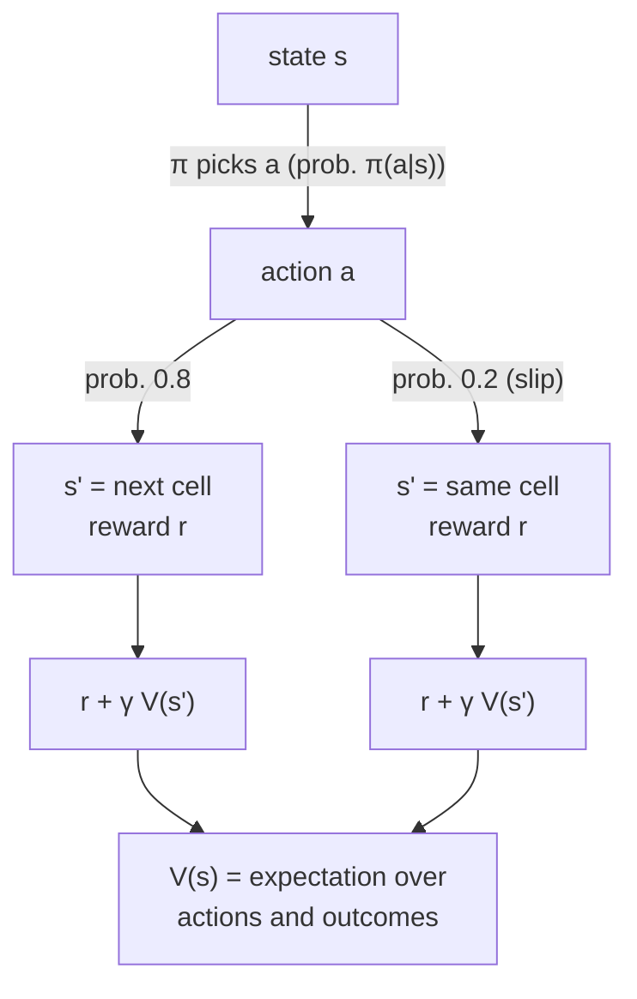

# 17.02 — Value, return, exploration and exploitation

<!-- glance:start -->
<!-- generated by tools/build.py from curriculum/syllabus.yaml — edit the syllabus, not this block -->

| | |
|---|---|
| **Track** | Main path |
| **Difficulty** | Intermediate |
| **Time** | 50 min |
| **Hardware** | none |
| **Software** | python |
| **Prerequisites** | [17.01 The RL framing — environment, state, action, reward, policy](17.01-rl-framing.md) |
| **Optional prerequisites** | [FM.13 Probability from zero](../optional-foundations/mathematics/FM.13-probability-basics.md) |
| **Skip if** | You understand discounting and epsilon-greedy exploration. |

<!-- glance:end -->

## What you will learn

- Compute the discounted return of a reward sequence and explain what the discount $\gamma$ does to a robot's behaviour.
- Define the state value $V^\pi(s)$ and the action value $Q^\pi(s, a)$, and compute them for a small robot MDP two ways: by sampling and by solving the Bellman equations.
- Explain the exploration–exploitation dilemma with a robot example and measure it on a multi-armed bandit.
- Implement ε-greedy action selection with incremental averages, and compare it with greedy, optimistic initial values and UCB.

## Why it matters

A reward arrives one step at a time, but a robot must care about the *sum*. Docking takes 40 small moves that each cost battery before the single +10 arrives. The **return** and the **value function** turn that stream into one number per state or per action, so "which action is better here?" becomes a comparison. Every algorithm in this module, from Q-learning (17.03) to PPO and SAC (17.06), estimates one of these quantities.

The second idea is older than robots. You can only learn what an action is worth by trying it, and every try of a worse action costs you. karmel has four ways to approach its charger. Approach 1 docks 70% of the time, but the robot doesn't know that. A robot that always repeats its current favourite can lock onto a 55% approach for life. The fix costs a little every day: sometimes try something else. How much is the exploration–exploitation trade-off, and you'll measure it here.

<!-- prereqs:start -->
## Prerequisites

You need these first:

- [17.01 The RL framing — environment, state, action, reward, policy](17.01-rl-framing.md)

### Optional prerequisite links

New to any of these? Take the foundation lesson first; skip it if you already know it.

- [FM.13 Probability from zero](../optional-foundations/mathematics/FM.13-probability-basics.md)

Check your readiness: `python course.py why 17.02`
<!-- prereqs:end -->

## Concept

### Return: adding up the future, with a discount

Money analogy: ₪100 today is worth more to you than ₪100 in ten years. A discount rate turns a stream of future payments into one present value. RL does the same with rewards. A reward $k$ steps in the future is multiplied by $\gamma^k$, with $\gamma$ slightly below 1.

Why discount at all?

- **Math**: with $\gamma < 1$ an endless stream of rewards still sums to a finite number.
- **Behaviour**: a lower $\gamma$ makes the robot short-sighted. With $\gamma = 0.5$ a reward 10 steps away is worth $0.5^{10} \approx 0.001$, practically nothing. The robot won't sacrifice anything now for it.
- **Uncertainty**: the far future is less predictable (battery, people, slip), so trusting it less is reasonable.

A useful rule of thumb is the **effective horizon** $1/(1-\gamma)$: about how many steps ahead the robot "cares". With $\gamma = 0.99$ and 10 decisions per second, that's 100 steps, or 10 s.

### Value: how good is it to be here?

The **value** of a state is the return you expect from it if you keep following your policy. It's a prediction: "from 1 m in front of the dock, facing it, I expect a return of about +8". The **action value** $Q(s, a)$ answers a sharper question: "from here, if I turn left *first* and then follow my policy, what return do I expect?". Once you have good Q-values, acting well is trivial: pick the action with the highest Q. Lessons 17.03 and 17.04 are about learning Q.

### Exploration versus exploitation

Picture a restaurant street. You know one place that's good. Exploiting means going there again. Exploring means trying a new place that might be better or worse. If you never explore, you never find the best restaurant. If you always explore, you rarely get to eat at the best one you know.

karmel faces the same thing at its charger. There are four approach manoeuvres with unknown success rates. Each docking attempt is a pull on a slot machine's arm, and the reward is 1 (docked) or 0 (failed). This is the **multi-armed bandit**: RL with a single state, which isolates exploration from everything else.

> [!TIP]
> **Ask your teacher:** "Explain why a greedy agent can get stuck forever on a worse docking approach, using a concrete sequence of four attempts with actual 0/1 outcomes."

## Technical explanation

### Level 1 — The return in numbers

The discounted return from time $t$ is

$$G_t = r_{t+1} + \gamma\, r_{t+2} + \gamma^2 r_{t+3} + \dots = \sum_{k=0}^{\infty} \gamma^k\, r_{t+k+1}$$

It satisfies a one-step recursion, the seed of every Bellman equation: $G_t = r_{t+1} + \gamma\, G_{t+1}$.

**Example.** karmel takes three moves (−1 each) and then docks (+10): rewards $[-1, -1, -1, +10]$.

| $\gamma$ | $G_0$ | effective horizon |
|---|---|---|
| 1.0 | $-1 - 1 - 1 + 10 = 7.000$ | ∞ |
| 0.9 | $-1 - 0.9 - 0.81 + 0.729 \cdot 10 = 4.580$ | 10 steps |
| 0.5 | $-1 - 0.5 - 0.25 + 0.125 \cdot 10 = -0.500$ | 2 steps |
| 0.0 | $-1.000$ | 1 step |

With $\gamma = 0.5$ the trip to the dock looks *worse than doing nothing*. A robot trained with that discount would rather not bother. Choose $\gamma$ so the horizon covers the task. Docking takes about 40 steps at 10 Hz, so use $\gamma \ge 0.975$, horizon ≥ 40. The course uses 0.99.

### Level 2 — Value functions and the Bellman expectation equation

For a policy $\pi$:

$$V^\pi(s) = \mathbb{E}_\pi[\,G_t \mid s_t = s\,], \qquad Q^\pi(s, a) = \mathbb{E}_\pi[\,G_t \mid s_t = s, a_t = a\,]$$

Substitute $G_t = r_{t+1} + \gamma G_{t+1}$ and take expectations over the environment's randomness:

$$V^\pi(s) = \sum_a \pi(a \mid s) \sum_{s', r} P(s', r \mid s, a)\,\big[r + \gamma V^\pi(s')\big]$$

This is the **Bellman expectation equation**: the value here equals the expected immediate reward plus the discounted value of where you land. $V = 0$ at terminal states.

**Worked example (corridor from 17.01, $\gamma = 0.9$, slip 0.2, policy "always RIGHT").** From cell 4, RIGHT reaches the dock (+10, end) with probability 0.8 or stays (−1) with probability 0.2:

$$V(4) = 0.8 \cdot 10 + 0.2\,(-1 + 0.9\,V(4)) \;\Rightarrow\; V(4)(1 - 0.18) = 7.8 \;\Rightarrow\; V(4) = 9.512$$

Cell 3: $V(3) = 0.8\,(-1 + 0.9 \cdot 9.512) + 0.2\,(-1 + 0.9\,V(3)) \Rightarrow V(3) = 7.133$. Continue the pattern and you get the whole vector. For a finite MDP the equations are linear: $V = r_\pi + \gamma P_\pi V$, so $V = (I - \gamma P_\pi)^{-1} r_\pi$. `bandits.py` solves that system and also estimates $V(2)$ by averaging 5000 sampled discounted returns (Monte Carlo):

```text
always RIGHT    exact V = [0.    3.209 5.043 7.133 9.512 0.   ]   Monte Carlo V(start=2) = 5.020 (5000 episodes)
uniform random  exact V = [ 0.    -8.201 -5.903 -2.466  3.064  0.   ]   Monte Carlo V(start=2) = -5.957 (5000 episodes)
```

The action value follows from $V$ with one step of look-ahead: $Q^\pi(s, a) = \sum P\,[r + \gamma V^\pi(s')]$. For cell 2 under "always RIGHT": $Q(2, \text{RIGHT}) = 5.043$ (the same as $V(2)$) and $Q(2, \text{LEFT}) = 0.8\,(-1 + 0.9 \cdot 3.209) + 0.2\,(-1 + 0.9 \cdot 5.043) = 2.218$. Going left once and then right is worse. You can read that off without simulating anything.

> [!NOTE]
> Expectations and conditional probability → [FM.13 Probability from zero](../optional-foundations/mathematics/FM.13-probability-basics.md). Skip it if $\mathbb{E}[X \mid Y]$ is familiar.

### Level 3 — Optimal values

The best achievable values are $V^*(s) = \max_\pi V^\pi(s)$ and $Q^*(s, a) = \max_\pi Q^\pi(s,a)$. They satisfy the **Bellman optimality equation**, the same equation with a max over the next action instead of an average over the policy:

$$Q^*(s, a) = \sum_{s', r} P(s', r \mid s, a)\,\big[r + \gamma \max_{a'} Q^*(s', a')\big]$$

If you know $Q^*$, the optimal policy is greedy: $\pi^*(s) = \arg\max_a Q^*(s, a)$. When you know $P$, you can solve this by repeated sweeps (**value iteration**). Q-learning (17.03) solves it from samples, without $P$.

### Level 4 — Bandits: estimating action values while acting

A bandit has one state and $k$ actions. Action $a$ has an unknown mean reward $q_*(a)$. The agent keeps an estimate $Q(a)$ and a count $N(a)$, and updates with the **incremental mean**:

$$N(a) \leftarrow N(a) + 1, \qquad Q(a) \leftarrow Q(a) + \frac{1}{N(a)}\,\big[r - Q(a)\big]$$

This is "old estimate + step size × error", the shape of every RL update. Example: outcomes 1, 0, 1, 1 give $Q = 1.0, 0.5, 0.667, 0.75$, exactly the running mean, without storing the history.

Action selection rules:

- **Greedy**: $a = \arg\max_a Q(a)$. It never tries an action whose estimate is currently lower, even if that estimate came from one unlucky attempt.
- **ε-greedy**: with probability ε pick a uniformly random action, otherwise greedy. Every action keeps getting sampled, so every estimate converges. The price is picking a random (often worse) action ε of the time forever, unless ε decays.
- **Optimistic initial values**: start all $Q(a)$ at 1.0, above anything achievable. Each tried action disappoints and drops, so the greedy agent tries all of them early. It explores only at the start.
- **UCB (upper confidence bound)**: $a = \arg\max_a \big[Q(a) + c\sqrt{\ln t / N(a)}\big]$. Prefer actions that look good *or* haven't been tried much. Uncertainty itself earns a bonus.

**Measured.** karmel's four docking approaches succeed with probabilities 0.55, **0.70**, 0.62, 0.40. We simulate 2000 independent robots, each making 1000 docking attempts (seed 0). Regret is how many dockings were lost compared with always using the best approach ($1000 \times 0.70$ minus what was achieved):

```text
strategy                          success, last 100  picks best, last 100   regret
greedy (epsilon = 0)                          0.587                 0.300    111.7
epsilon-greedy, epsilon = 0.01                0.656                 0.600     65.6
epsilon-greedy, epsilon = 0.1                 0.677                 0.817     35.6
epsilon-greedy, epsilon = 0.3                 0.657                 0.741     50.8
greedy, optimistic Q0 = 1.0                   0.641                 0.527     59.7
UCB, c = 1                                    0.671                 0.761     45.3
```

Read it like an engineer. Greedy finds the best approach in only 30% of robots, because its first unlucky attempts lock it in. ε = 0.1 finds the best approach in 82% of robots and has the lowest regret here. ε = 0.3 finds the best approach more reliably but pays for exploring 30% of the time: its success in the last 100 attempts is lower (0.657) even though it knows more. Note that "picks best" for ε = 0.1 can never exceed $0.9 + 0.1/4 = 0.925$. In deep RL, the same trade-off shows up as the ε schedule in DQN (17.04) and the entropy of a stochastic policy in PPO and SAC (17.06).

## Diagram



```text
Backup diagram for V(4), always RIGHT, gamma = 0.9

            V(4) = 9.512
               |
             RIGHT
          /         \
     p=0.8           p=0.2
   DOCK (+10)      cell 4 (-1)
   V = 0           V(4) = 9.512
   10 + 0.9*0      -1 + 0.9*9.512 = 7.561
          \         /
   0.8*10 + 0.2*7.561 = 9.512
```

## Code

[`code/bandits.py`](code/bandits.py) (tested by `code/test_rl_code.py`) has three parts: discounted returns, exact and Monte Carlo policy values for the corridor, and the vectorized bandit experiment. The core of the bandit, for 2000 robots at once:

```python
for t in range(steps):
    if ucb_c is not None:
        bonus = ucb_c * np.sqrt(np.log(t + 1) / np.maximum(N, 1e-9))
        scores = np.where(N == 0, np.inf, Q + bonus)
        greedy = np.argmax(scores, axis=1)
    else:
        noise = rng.random((runs, k)) * 1e-6  # random tie-breaking
        greedy = np.argmax(Q + noise, axis=1)
    explore = rng.random(runs) < epsilon
    actions = np.where(explore, rng.integers(k, size=runs), greedy)
    r = (rng.random(runs) < probs[actions]).astype(float)
    N[rows, actions] += 1
    Q[rows, actions] += (r - Q[rows, actions]) / N[rows, actions]  # incremental mean
```

And the exact policy evaluation, a linear solve:

```python
def policy_value_exact(mdp: CorridorMDP, policy_probs: np.ndarray) -> np.ndarray:
    """Solve V = r_pi + gamma P_pi V for every cell. ``policy_probs[s] = [p(LEFT), p(RIGHT)]``."""
    n = mdp.n_cells
    P = np.zeros((n, n))
    r = np.zeros(n)
    for s in range(n):
        if mdp.terminal(s):
            continue  # V(terminal) = 0
        for a in (LEFT, RIGHT):
            for prob, s2, reward, done in mdp.transitions(s, a):
                p = policy_probs[s, a] * prob
                r[s] += p * reward
                if not done:
                    P[s, s2] += p
    return np.linalg.solve(np.eye(n) - mdp.gamma * P, r)
```

Run everything (about 5 s on a laptop, numpy only):

```bash
python 17-reinforcement-learning/code/bandits.py
python 17-reinforcement-learning/code/bandits.py --part 3
```

The first command prints the three tables shown in this lesson: the $\gamma$ table, the $V$ vectors and the strategy comparison.

## Exercise

All exercises need hardware: none.

### Exercise 17.02-E1 — Horizons for karmel `[numerical]`

karmel's RL controller decides 10 times per second. (a) What is the effective horizon in seconds for $\gamma$ = 0.9, 0.99 and 0.999? (b) After how many steps has a reward's weight dropped to one half with $\gamma = 0.99$? (c) The rewards for a 10-step docking run are nine −1s followed by +10. Compute $G_0$ for $\gamma = 0.9$ and $\gamma = 0.99$ and say which $\gamma$ makes docking look worthwhile.

### Exercise 17.02-E2 — Bellman by hand `[numerical]`

With slip = 0 (deterministic corridor) and $\gamma = 0.9$, compute $V(1) \dots V(4)$ for "always RIGHT" by hand, starting from $V(4)$. Then change `CorridorMDP(slip=0.0)` in a Python shell and check with `policy_value_exact`.

### Exercise 17.02-E3 — Predict the discount effect `[predict]`

Before running anything, predict how $V(2)$ under "always RIGHT" changes when $\gamma$ goes from 0.9 to 0.5 and to 0.99. Will any value become negative? Then check with `policy_value_exact` and `dataclasses.replace(CorridorMDP(), gamma=...)`.

### Exercise 17.02-E4 — Tune exploration `[simulation]`

Using `bandit_experiment`: (a) add ε = 0.05 and ε = 0.2 to the comparison; (b) implement a decaying schedule $\varepsilon_t = \max(0.01,\ 1/\sqrt{t+1})$ (add a parameter) and compare its regret with constant ε = 0.1; (c) change the true success rates to `[0.55, 0.58, 0.62, 0.40]` (two nearly equal approaches) and describe how "picks best" changes for ε = 0.1.

## Expected result

- **17.02-E1:** (a) 10 steps = 1 s; 100 steps = 10 s; 1000 steps = 100 s. (b) $\ln 0.5 / \ln 0.99 = 69$ steps (6.9 s). (c) $\gamma = 0.9$: $G_0 = -2.25$ (docking looks worse than nothing); $\gamma = 0.99$: $G_0 = +0.49$. Only the longer horizon makes a 10-step docking worthwhile.
- **17.02-E2:** $V(4) = 10$, $V(3) = -1 + 0.9 \cdot 10 = 8$, $V(2) = -1 + 0.9 \cdot 8 = 6.2$, $V(1) = -1 + 0.9 \cdot 6.2 = 4.58$. `policy_value_exact` prints `[0. 4.58 6.2 8. 10. 0.]`.
- **17.02-E3:** $\gamma = 0.5$: $V = [0, -1.064, 0.107, 2.741, 8.667, 0]$. $V(2)$ drops to 0.107 and cell 1 becomes negative, because the −1s now outweigh the heavily discounted +10. $\gamma = 0.99$: $V(2) = 7.006$, close to the undiscounted expectation of 7.25.
- **17.02-E4:** Measured with seed 0, 2000 runs × 1000 attempts (other seeds move these by about ±3 regret and ±0.02 in the rates). (a) ε = 0.05: success (last 100) 0.676, picks best 0.779, regret **39.4**. ε = 0.2: 0.668, 0.794, regret **41.6**. Both are worse than ε = 0.1 (35.6): too little exploration versus too much. (b) The decaying schedule: success 0.680, picks best 0.804, regret **30.8**, the best in the table. It explores heavily while the estimates are poor and almost stops once they're good. (c) With rates `[0.55, 0.58, 0.62, 0.40]` the best approach is now approach 2. ε = 0.1 picks it only **65%** of the time (down from 82%), because 0.58 and 0.62 need many samples to tell apart. Regret *falls* to **28.7**, because choosing the second-best costs only 0.04 per attempt.

## Troubleshooting

### Symptom: my Monte Carlo value disagrees with the exact value

1. Check the discount exponent: the first reward gets $\gamma^0$. Off-by-one gives values about $\gamma$ times too small.
2. Check that the terminal reward is counted once and nothing is added after termination.
3. Check the sample size: with 5000 episodes the standard error is roughly $\text{std}(G) / \sqrt{5000}$, about 0.03 for the corridor. Differences larger than 0.1 are bugs, not noise.

### Symptom: `np.linalg.solve` says the matrix is singular

1. $\gamma = 1$ with a policy that can loop forever (for example always hitting a wall) has infinite or undefined values. Use $\gamma < 1$ or make sure every policy ends.
2. Terminal rows must stay zero in $P$ so terminal values are pinned at 0.

### Symptom: ε-greedy doesn't beat greedy in my experiment

1. Check tie-breaking. With `np.argmax` and all estimates at 0, "greedy" always picks action 0. If action 0 happens to be the best one, greedy looks brilliant. Add tiny random noise, or break ties at random.
2. Average over many runs (hundreds). One bandit run is dominated by luck.
3. Check that exploring actions also update the estimates. They must.

## Common mistakes

- **Picking γ without thinking about the horizon.** $\gamma = 0.9$ at 50 Hz is a 0.2 s horizon: the robot can't care about anything that happens after that.
- **Confusing reward with value.** Reward is what you get this step. Value is what you expect from here on. A state can have zero reward and high value (one step from the dock).
- **Evaluating an exploring policy as if it were the final policy.** Report the greedy (ε = 0) performance separately from the training curve, which includes exploration.
- **Exploring forever with a constant large ε on a real robot.** Random actions on hardware are a safety issue. Decay ε, and keep exploration in simulation.
- **Sample means with a fixed step size in a stationary problem.** $1/N$ converges to the true mean. A constant step size tracks changes but never settles, which is useful only if the world drifts (battery wear, floor changes).

## Knowledge check

1. Compute $G_0$ for rewards $[0, 0, 5]$ with $\gamma = 0.9$.
   <details><summary>Answer</summary>

   $0 + 0.9 \cdot 0 + 0.81 \cdot 5 = 4.05$.
   </details>

2. What is the effective horizon for $\gamma = 0.98$, and how many seconds is it at 20 Hz?
   <details><summary>Answer</summary>

   $1/(1 - 0.98) = 50$ steps, which is 2.5 s at 20 Hz.
   </details>

3. In words, what does $Q^\pi(s, a)$ measure, and how does it differ from $V^\pi(s)$?
   <details><summary>Answer</summary>

   The expected return if you take action $a$ now in state $s$ and follow $\pi$ afterwards. $V^\pi(s)$ averages over the actions $\pi$ itself would pick: $V^\pi(s) = \sum_a \pi(a|s)\,Q^\pi(s,a)$.
   </details>

4. Predict: a greedy bandit agent starts with all estimates at 0. Its first try of approach 1 (true success 0.70) fails, and its first try of approach 0 (0.55) succeeds. What happens next, and why does ε-greedy fix it?
   <details><summary>Answer</summary>

   Approach 0 has estimate 1.0, approach 1 has 0.0. Greedy keeps picking approach 0, whose estimate settles around 0.55. That is still above approach 1's frozen estimate of 0, so approach 1 is never tried again. ε-greedy keeps sampling approach 1 occasionally; its estimate climbs toward 0.70 and overtakes.
   </details>

5. Using the incremental mean, the estimate is 0.6 after 4 attempts. The fifth attempt succeeds (r = 1). New estimate?
   <details><summary>Answer</summary>

   $0.6 + \frac{1}{5}(1 - 0.6) = 0.68$.
   </details>

6. Why do optimistic initial values explore only early on?
   <details><summary>Answer</summary>

   Every action starts overrated. Trying one drags its estimate down toward reality, so greedy moves on to the untried, still-optimistic ones. Once all estimates have fallen to realistic levels, the optimism is gone and the agent is plain greedy.
   </details>

7. Debugging: your robot's value estimates for states near the dock are *lower* than those far away, with rewards −1 per step and +10 at the dock. What would you check first?
   <details><summary>Answer</summary>

   The discount and the terminal handling. A very small γ, or bootstrapping from the terminal state as if the episode continued (adding γ·V(dock) with a wrong non-zero V), or the dock bonus never being added. Print one trajectory's rewards and recompute $G$ by hand.
   </details>

## Practical challenge

Make the bandit a **contextual bandit** and connect it to karmel: the best docking approach depends on how the robot arrives. Define 3 contexts (arriving from the left, the front, the right) and a 3 × 4 table of true success rates you invent, where the best approach differs per context. Each attempt draws a random context. Implement ε-greedy with one estimate table per context, and compare it with an agent that ignores the context.

**Acceptance criteria:** 1000 runs × 2000 attempts with a fixed seed; a table of regret for ε ∈ {0.01, 0.05, 0.1, 0.2} for both agents; the context-aware agent has lower regret than the context-blind one for every ε, by a margin you explain from your success table; a short paragraph on why a contextual bandit is "RL with one step" and what a second step (the state changing because of the action) would add.

## You can skip this if…

You answer knowledge-check questions 2, 4 and 5 correctly without looking and can derive $V(4) = 9.512$ for the slippery corridor on paper.

`python course.py skip 17.02 --reason "I understand discounting and epsilon-greedy exploration"`

## Go deeper

- Sutton & Barto, chapter 2 (multi-armed bandits) and chapters 3–4 (value functions, Bellman equations, dynamic programming): http://incompleteideas.net/book/the-book-2nd.html — the ε-greedy/optimistic/UCB comparison here follows chapter 2's 10-armed testbed.
- David Silver's RL lectures, lecture 2 (MDPs, Bellman equations) and lecture 9 (exploration and exploitation): https://www.youtube.com/playlist?list=PLqYmG7hTraZDM-OYHWgPebj2MfCFzFObQ
- OpenAI Spinning Up, "Key Concepts in RL" (value functions and Bellman equations): https://spinningup.openai.com/
- Hugging Face Deep RL Course, unit 2 (value-based methods): https://huggingface.co/learn/deep-rl-course

## Progress checkpoint

- [ ] I can compute a discounted return and choose γ from a task's time horizon.
- [ ] I can define $V^\pi$ and $Q^\pi$ and solve a small Bellman system by hand and in numpy.
- [ ] I can explain exploration vs exploitation with the docking example.
- [ ] I implemented and compared ε-greedy, optimistic initialization and UCB, and I can read the regret table.

`python course.py complete 17.02` (exercises done) · `python course.py master 17.02` (challenge done) · `python course.py struggle 17.02 "what was hard"`

Next: [17.03 — Q-learning on a gridworld robot](17.03-q-learning-gridworld.md).
