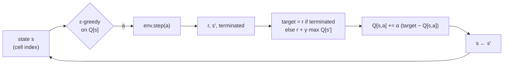

# 17.03 — Q-learning on a gridworld robot

<!-- glance:start -->
<!-- generated by tools/build.py from curriculum/syllabus.yaml — edit the syllabus, not this block -->

| | |
|---|---|
| **Track** | Main path |
| **Difficulty** | Intermediate |
| **Time** | 1 h 15 min |
| **Hardware** | none |
| **Software** | python, numpy |
| **Prerequisites** | [17.02 Value, return, exploration and exploitation](17.02-value-exploration.md) |
| **Skip if** | You have implemented tabular Q-learning. |

<!-- glance:end -->

## What you will learn

- Derive the Q-learning update from the Bellman optimality equation and explain every symbol in it.
- Compute a temporal-difference (TD) update by hand and implement it for a Q-table.
- Train tabular Q-learning with ε-greedy exploration on a gridworld robot and read its learning curve.
- Check a learned Q-table against the optimal one from value iteration, and diagnose the usual bugs (terminal bootstrapping, step size, exploration).
- Explain why the same algorithm needs a smaller step size and more episodes when the robot's wheels slip.

## Why it matters

Q-learning is the smallest algorithm that does the full RL job: it learns good behaviour from nothing but `reset()` and `step()`, with no model of the physics. It's tabular here, one number per (state, action), which only works for small discrete worlds. The update rule is the same one inside DQN (17.04), and the critic of every actor-critic method, including SAC (17.06), is trained with a close relative of it. If you can make it work and debug it on a 4 × 6 grid, the deep versions stop being magic.

The grid is a floor plan for karmel. It has to reach its charger around two walls while avoiding the top of a staircase. When the floor is slippery, the learned route changes. That's the whole point of learning from experience instead of planning on an idealized map.

<!-- prereqs:start -->
## Prerequisites

You need these first:

- [17.02 Value, return, exploration and exploitation](17.02-value-exploration.md)

### Optional prerequisite links

None.

Check your readiness: `python course.py why 17.03`
<!-- prereqs:end -->

## Concept

### Learning a table of "how good is this move here"

Imagine a notebook with one row per cell of the apartment and one column per direction (up, right, down, left). Each entry holds a guess: "if I'm here and move this way, and act well afterwards, how much reward will I collect?". At first every guess is 0. Every time the robot actually makes a move, it corrects one entry a little:

> my old guess ← my old guess + a bit × (what just happened + my guess for where I landed − my old guess)

"What just happened + my guess for where I landed" is a better-informed guess than the old one, because it contains one step of real experience. Nudging toward it is **temporal-difference learning**: learning a guess from a later guess. It's like updating an ETA on a road trip. You don't wait until you arrive; after each junction you compare the old ETA with "time already driven + the new ETA from here".

Once the notebook is accurate, acting well is trivial: in each cell pick the direction with the biggest number.

### Why it works without a map

The robot never reads the floor plan. Walls, stairs and slippery patches show up only through what `step()` returns. That makes Q-learning **model-free**. It is also **off-policy**: the update uses the *best* next action ($\max$), not the one the robot will actually take while exploring. So the robot can wander randomly 10% of the time and still learn the values of the *greedy* policy.

> [!TIP]
> **Ask your teacher:** "Walk me through the first three Q-learning updates of an episode on the 17.03 grid with α = 0.5 and γ = 0.9, starting from a Q-table of zeros. Show which entries change."

## Technical explanation

### Level 1 — The gridworld

```text
    col:  0 1 2 3 4 5
    row 0 S . . # . G        S start   G charger (+10, ends)
    row 1 . # . # . .        # wall    X stairs  (-10, ends)
    row 2 . # . . . X        every move costs -1; bumping a wall = stay, still -1
    row 3 . . . # . .
```

States are cell indices `row * 6 + col` (0–23). Actions: 0 up, 1 right, 2 down, 3 left. The shortest path from S is 9 moves: right, right, down, down, right, right, up, up, right. It passes *next to* the stairs at (2, 4). Its return is $8 \times (-1) + 10 = +2$. Optionally, with probability `slip` the robot moves perpendicular to the command, like wheels skidding on a rug.

### Level 2 — The update rule

Q-learning keeps a table $Q(s, a)$ and, after each transition $(s, a, r, s')$, applies

$$Q(s, a) \leftarrow Q(s, a) + \alpha\,\Big[\underbrace{r + \gamma \max_{a'} Q(s', a')}_{\text{TD target}} - Q(s, a)\Big]$$

The bracket is the **TD error** $\delta$. If $s'$ is terminal (charger or stairs) there is no future, so the target is just $r$.

| Symbol | Meaning | Typical value here |
|---|---|---|
| $\alpha$ | step size: how far to move toward the target | 0.5 (deterministic), 0.05 (slippery) |
| $\gamma$ | discount | 0.9 |
| $\max_{a'} Q(s', a')$ | value of acting greedily from where you landed | — |
| ε | exploration rate for choosing actions | 0.1 |

**Worked update.** $Q(1, \text{right}) = 0.5$. The robot moves right from cell 1 to cell 2 and gets $r = -1$. Cell 2's row is $[0, 2, 5, 1]$, so $\max_{a'} Q(2, a') = 5$. With $\alpha = 0.5$ and $\gamma = 0.9$:

$$\text{target} = -1 + 0.9 \times 5 = 3.5, \quad \delta = 3.5 - 0.5 = 3.0, \quad Q(1, \text{right}) \leftarrow 0.5 + 0.5 \times 3.0 = 2.0$$

**Worked terminal update.** $Q(4, \text{right}) = 3.0$. Moving right from cell 4 reaches the charger: $r = +10$, terminal. Target $= 10$ (no bootstrap, whatever garbage is stored for the charger's row), $\delta = 7$, and with $\alpha = 0.1$: $Q \leftarrow 3.0 + 0.1 \times 7 = 3.7$.

### Level 3 — Where the rule comes from

The Bellman optimality equation from 17.02 says the optimal $Q^*$ satisfies

$$Q^*(s, a) = \mathbb{E}\big[\,r + \gamma \max_{a'} Q^*(s', a') \;\big|\; s, a\,\big]$$

We can't compute that expectation without the model $P$. But each real transition gives one unbiased *sample* of the quantity inside it. Q-learning does a stochastic-approximation step toward the sample, the same trick as the incremental mean in 17.02, with $\alpha$ playing the role of $1/N$. Under standard conditions (every state–action pair visited infinitely often, step sizes that decay like $\sum \alpha = \infty$, $\sum \alpha^2 < \infty$) the table converges to $Q^*$ (Watkins & Dayan, 1992).

Two consequences you will see in the numbers:

- **Deterministic world, α = 1:** one update copies the target exactly. Sweeping all pairs repeatedly *is* value iteration. The exercise tests rely on this.
- **Stochastic world:** the target is noisy (sometimes you slip into the stairs, sometimes not). A large α chases the noise. The table jitters and the greedy policy can flip to a dangerous move. You need a small α (or a decaying one) and more episodes.

**SARSA, the on-policy sibling.** Replace $\max_{a'} Q(s', a')$ with $Q(s', a_{\text{next}})$, the action the ε-greedy robot will actually take next. SARSA learns the value of the *exploring* policy and therefore prefers routes that are safe even when it occasionally acts randomly (farther from the stairs). Q-learning learns the greedy policy's value and happily walks the edge. Sutton & Barto's "cliff walking" example is exactly this.

### Level 4 — The training loop and measured results

```text
for each episode:
    s = env.reset()
    repeat:
        a = epsilon_greedy(Q, s, epsilon, rng)
        s', r, terminated, truncated = env.step(a)
        q_learning_update(Q, s, a, r, s', terminated, alpha, gamma)   # bootstrap only if not terminated
        s = s'
    until terminated or truncated
```

A time-limit **truncation** is not terminal: the update still bootstraps from $s'$. Only `terminated` switches the bootstrap off.

**Measured: deterministic floor** (500 episodes, α = 0.5, γ = 0.9, ε = 0.1, seed 0, about 1 s). Mean return per block of 50 episodes: `-8.5 0.3 -1.1 0.6 1.0 1.1 1.0 0.2 0.2 0.9`. The training return stays below the optimal +2 because 10% of actions are random. The greedy policy equals the optimal one, and 1000 greedy test episodes all reach the charger with return **2.00**. The learned $\max_a Q$ matches value iteration exactly along the path (for example $V(S) = -1.39$), and less exactly in cells the robot rarely visits:

```text
learned V(s) = max_a Q(s, a):          optimal V*(s) from value iteration:
 -1.39  -0.43   0.63   #  10.00  G      -1.39  -0.43   0.63   #  10.00  G
 -2.25    #     1.81   #   8.00  9.98   -2.25    #     1.81   #   8.00  10.00
 -4.51    #     3.12  4.58  6.20  X     -1.39    #     3.12  4.58  6.20  X
 -3.28  -0.65   1.81   #   4.58  0.96   -0.43   0.63   1.81   #   4.58  3.12
```

Cell (2, 0) has $-4.51$ instead of $-1.39$ because it's rarely visited, and its greedy action is still correct. **Tabular Q-learning is only accurate where the robot has actually been.** That limitation motivates function approximation in 17.04.

**Measured: slippery floor, slip = 0.2.** With the same α = 0.5 and 3000 episodes, the greedy policy walks *right into the stairs* from (2, 4) and reaches the charger in only **10.9%** of test episodes. Noisy targets plus a big step size left a wrong ordering of Q-values. With α = 0.05 and 5000 episodes (seed 0, about 5 s) the learned policy reaches the charger in **89.6%** of 1000 test episodes (mean return −2.87). The optimal policy from value iteration scores 88.9% (−2.98) on the same episodes. Even optimal behaviour falls down the stairs about 11% of the time, because the only route passes next to them.

## Diagram



```text
One update, drawn on the table (alpha = 0.5, gamma = 0.9)

  Q row for cell 1:  up   right  down  left          Q row for cell 2:  up  right  down  left
                    0.0  [0.5]   0.0   0.0                              0.0  2.0   [5.0]  1.0
                           ^                                                         |
                           |  0.5 + 0.5 * ( -1 + 0.9 * 5.0  - 0.5 ) = 2.0            |
                           +---------------------------------------------------------+
                                           max over the next row
```

## Code

The auto-graded exercise is in [`labs/exercises/17.03/`](../labs/exercises/17.03/README.md). You implement four functions in `student.py`; the `GridWorld` class is provided. The reference update is three lines:

```python
def q_learning_update(Q, state, action, reward, next_state, terminated, alpha, gamma) -> float:
    bootstrap = 0.0 if terminated else gamma * float(np.max(Q[next_state]))
    td_error = reward + bootstrap - Q[state, action]
    Q[state, action] += alpha * td_error
    return float(td_error)
```

Check it: `python course.py check 17.03`

The training script [`code/gridworld_q.py`](code/gridworld_q.py) runs *your* `student.py` (or `--solution`), prints the learning curve, the greedy policy as arrows, the learned and optimal values, and a 1000-episode greedy test:

```python
def train(ex, env, episodes, alpha, gamma, epsilon, seed):
    rng = np.random.default_rng(seed)
    Q = np.zeros((env.n_states, env.n_actions))
    returns = []
    for _ in range(episodes):
        s = env.reset()
        total = 0.0
        while True:
            a = ex.epsilon_greedy(Q, s, epsilon, rng)
            s2, r, terminated, truncated = env.step(a, rng)
            ex.q_learning_update(Q, s, a, r, s2, terminated, alpha, gamma)
            total += r
            s = s2
            if terminated or truncated:
                break
        returns.append(total)
    return Q, returns
```

```bash
python 17-reinforcement-learning/code/gridworld_q.py                  # your student.py
python 17-reinforcement-learning/code/gridworld_q.py --solution
python 17-reinforcement-learning/code/gridworld_q.py --solution --slip 0.2 --episodes 5000 --alpha 0.05
```

Deterministic run, the greedy policy printed:

```text
greedy policy:
> > v # > G
^ # v # ^ ^
v # > > ^ X
> > ^ # ^ <
...
greedy policy over 1000 test episodes: mean return 2.00, reached the charger 100.0%
optimal policy, same 1000 episodes:   mean return 2.00, reached the charger 100.0%
```

## Exercise

All exercises need hardware: none.

### Exercise 17.03-E1 — Implement Q-learning `[coding]`

Implement `q_learning_update`, `greedy_action`, `greedy_policy` and `epsilon_greedy` in `labs/exercises/17.03/student.py` (the README lists the exact contract). Check it: `python course.py check 17.03`. Then run `gridworld_q.py` without `--solution` and confirm your code reaches the charger in 100% of greedy test episodes.

### Exercise 17.03-E2 — Three updates by hand `[numerical]`

Start from a Q-table of zeros, α = 0.5, γ = 0.9. The robot takes S → right → right → down (states 0 → 1 → 2 → 8, rewards −1 each). (a) Write the three updated entries. (b) In a second episode it takes the same first move again. What is $Q(0, \text{right})$ after that update? (c) Why did the second visit change $Q(0, \text{right})$ even though the reward was the same?

### Exercise 17.03-E3 — The terminal bootstrap bug `[debugging]`

Change your update so it *always* bootstraps (ignore `terminated`). Run `gridworld_q.py` and compare $V$ next to the charger and the test success rate with the correct version. Explain the numbers. (Hint: which Q-row does the charger have, and is it ever updated?) Then fix it back.

### Exercise 17.03-E4 — Predict the slippery route `[predict]`

Before running: with slip = 0.2, will the optimal policy still pass next to the stairs at (2, 4)? Will the success rate be 100%? Will a large step size α = 0.5 learn the same policy as α = 0.05? Then run both commands from the Code section, plus α = 0.5 with 3000 episodes, and compare with your predictions.

### Exercise 17.03-E5 — SARSA on the same grid `[simulation]`

Copy `train` into a `train_sarsa` that picks the next action before updating and uses $Q(s', a')$ instead of $\max_{a'} Q(s', a')$. Train both with slip = 0.2, α = 0.05, ε = 0.1, 5000 episodes, seeds 0–4. Compare (a) the mean *training* return over the last 1000 episodes (with exploration), and (b) the greedy test success rate.

## Expected result

- **17.03-E1:** `python course.py check 17.03` reports 13 passed, 0 skipped. `gridworld_q.py` prints the arrow grid shown in the Code section and `mean return 2.00, reached the charger 100.0%` (seed 0). With your own code and seed 0 the numbers are identical to the reference, because the tests pin down how the random generator is used.
- **17.03-E2:** (a) $Q(0,\text{right}) = 0.5(-1 + 0.9 \cdot 0 - 0) = -0.5$; $Q(1,\text{right}) = -0.5$; $Q(2,\text{down}) = -0.5$. (b) The target is $-1 + 0.9 \max Q(1) = -1 + 0.9 \times 0 = -1$, because the max over cell 1's row is still 0 (up, down and left are untouched). $Q(0,\text{right}) = -0.5 + 0.5(-1 + 0.5) = -0.75$. (c) The update moves the estimate toward a new target. The first update only went halfway (α = 0.5), so the old estimate was still off and keeps moving toward −1.
- **17.03-E3:** The charger and stairs rows are never updated (no action is taken from a terminal state), so they stay at 0 and the output is identical. The bug is invisible here. It shows up when those rows are non-zero: with an optimistic initialization (say Q = 20 everywhere), the target next to the charger becomes $10 + 0.9 \times 20 = 28$, values near G are inflated, and the robot learns wrong priorities. In deep RL (17.04) the network always outputs something for the terminal state, so this bug always matters there. `test_update_does_not_bootstrap_from_terminal_state` catches it.
- **17.03-E4:** Yes, the optimal route still passes (2, 4): every route to G does. Success is **not** 100%: the optimal policy reaches the charger in about 89% of episodes. α = 0.5 (3000 episodes) learns a *wrong* policy: in the seed-0 run the action at (2, 4) points right, into the stairs, and success is 10.9%. α = 0.05 (5000 episodes) learns a policy that matches optimal: 89.6% vs 88.9%.
- **17.03-E5:** Measured (seeds 0–4, 5000 episodes each, greedy test on 1000 episodes with seed 123): Q-learning training return over the last 1000 episodes **−4.62** (per-seed −4.46 to −4.80), greedy success **0.896** on every seed; SARSA **−4.71** (−4.56 to −5.06), greedy success **0.895** (0.889–0.896). On this grid they are the same within seed noise, because there is no safer route to prefer: every path to G passes next to X. To see SARSA's cautious behaviour you need a layout with a longer route that stays away from the danger, as in Sutton & Barto's cliff-walking grid (example 6.6).

## Troubleshooting

### Symptom: the greedy policy walks into a wall forever

1. Print `Q[s]` for that cell. If all entries are equal (often 0), the cell was never updated: exploration never reached it. Increase episodes or ε, or check that `epsilon_greedy` really explores.
2. If the wall-bump action has the highest value, check the reward for bumping: it must still be −1, otherwise standing against a wall is free.
3. Check the episode time limit. With 100 steps and a policy stuck against a wall, the return is −100. If you see −100 in the log, this is happening.

### Symptom: values keep growing without bound

1. Terminal bootstrap: for the charger transition the target must be `r`, not `r + gamma * max Q`.
2. γ ≥ 1 with a loop that gives positive reward (a reward bug) makes values diverge. Print the per-step rewards of a trajectory.
3. α > 1 overshoots the target on every update. Keep 0 < α ≤ 1.

### Symptom: learning works deterministically but fails with slip

1. Reduce α (0.05–0.1) or decay it per state–action with $1/N(s,a)$.
2. Train longer and evaluate greedily over many episodes. Single greedy runs are luck.
3. Compare with value iteration (`gridworld_q.py` prints it). If the *optimal* success rate is also below 100%, the task itself is risky, not your code.

### Symptom: `course.py check 17.03` fails on `test_epsilon_greedy_uses_the_rng_as_specified`

1. Call `rng.random()` exactly once per call, before deciding.
2. Call `rng.integers(4)` only when exploring, and don't draw any other numbers (no `rng.choice`, no shuffling).

## Common mistakes

- **Bootstrapping from terminal states.** The most common Q-learning bug, and in deep RL it is always harmful.
- **Treating truncation as termination.** A time-out is not the end of the world. Keep bootstrapping.
- **Evaluating with exploration on.** The learning curve includes ε-random moves. Measure the policy with ε = 0.
- **One seed, one conclusion.** RL results vary run to run. Use several seeds before comparing settings.
- **Tables for continuous states.** Discretizing karmel's pose into a fine grid explodes the table (and the data needed). That's what 17.04 fixes.
- **Integer Q arrays.** `np.zeros((24, 4), dtype=int)` silently truncates every update to 0.

## Knowledge check

1. Write the Q-learning update and name each part.
   <details><summary>Answer</summary>

   $Q(s,a) \leftarrow Q(s,a) + \alpha[r + \gamma \max_{a'} Q(s',a') - Q(s,a)]$. $\alpha$ is the step size, $r$ the reward, $\gamma$ the discount, $\max_{a'} Q(s', a')$ the estimated value of acting greedily from the next state, the bracket is the TD error, and the target is $r$ alone if $s'$ is terminal.
   </details>

2. $Q(s,a) = 1.0$, $r = -1$, $\max_{a'} Q(s', a') = 4.0$, $\gamma = 0.9$, $\alpha = 0.25$. New $Q(s,a)$?
   <details><summary>Answer</summary>

   Target $= -1 + 3.6 = 2.6$; $\delta = 1.6$; $Q = 1.0 + 0.25 \times 1.6 = 1.4$.
   </details>

3. Why is Q-learning called off-policy, and why is that useful for a robot?
   <details><summary>Answer</summary>

   Its target uses the greedy next action ($\max$), not the action the behaviour policy actually takes. It learns the greedy policy's values while collecting data with an exploring (or even a human teleop, or an old) policy. That makes it possible to reuse logged experience, which DQN's replay buffer exploits.
   </details>

4. Predict: you train on the slippery grid with α = 0.9 for 50 000 episodes. Will the greedy policy be reliable?
   <details><summary>Answer</summary>

   Not reliably. With a large constant α each update mostly copies the latest noisy target, so Q-values keep jumping with each lucky or unlucky slip, and the greedy action in risky cells can flip back and forth. More episodes don't average the noise out. Use a small or decaying α.
   </details>

5. The robot's episodes are cut at 100 steps. At step 100 it is in cell 7, not terminal. What target does the update use for that last transition?
   <details><summary>Answer</summary>

   $r + \gamma \max_{a'} Q(7, a')$: a truncation still bootstraps, because the state has future value that the time limit just didn't let the robot collect.
   </details>

6. Why does the learned value of rarely visited cells differ from the optimal value even when the greedy path is perfect?
   <details><summary>Answer</summary>

   A tabular method only improves entries it actually updates. Cells far from the useful route are visited only by occasional exploration, so their estimates lag. The greedy policy along the route can still be optimal because those cells' values don't affect route decisions.
   </details>

7. Debugging: your Q-learning agent reaches the charger in training, but `greedy_policy(Q)` shows arrows pointing into walls in about half the cells, including cells on the route. What would you check?
   <details><summary>Answer</summary>

   (1) Whether `greedy_policy` uses the right axis (`axis=1` over actions, not `axis=0` over states). (2) The action index mapping in rendering vs the environment (0 up, 1 right, 2 down, 3 left). (3) Whether the Q-table was reset or overwritten after training, for example returning a fresh zeros array.
   </details>

## Practical challenge

Train Q-learning on the "return to the charger when the battery is low" corridor you built in the 17.01 challenge (or, if you skipped it, a 10 × 10 version of this lesson's gridworld with a randomly placed wall segment per training run, fixed per run). Discretize the battery into 10 levels so the state is (cell, battery level).

**Acceptance criteria:** a learning curve (mean return per 100 episodes) that flattens; a greedy evaluation over 1000 episodes with fixed seeds whose empty-battery rate is below that of your hand-written threshold policy from 17.01, or within 1 percentage point of it with a higher mean return; a printed table of the learned action (go home or work) against cell and battery level that you can explain; results over 3 training seeds with their spread.

## You can skip this if…

You answer knowledge-check questions 2, 4 and 5 correctly without looking, and `python course.py check 17.03` passes with an implementation you wrote in under 20 minutes.

`python course.py skip 17.03 --reason "I have implemented tabular Q-learning"`

## Go deeper

- Sutton & Barto, chapter 6 (temporal-difference learning, SARSA, Q-learning, cliff walking): http://incompleteideas.net/book/the-book-2nd.html — the source of the SARSA-vs-Q-learning comparison.
- Hugging Face Deep RL Course, unit 2 (Q-learning, with a FrozenLake gridworld): https://huggingface.co/learn/deep-rl-course
- David Silver's RL lectures, lectures 4–5 (model-free prediction and control): https://www.youtube.com/playlist?list=PLqYmG7hTraZDM-OYHWgPebj2MfCFzFObQ
- CleanRL documentation (for when you move to DQN, whose update is this one with a network): https://docs.cleanrl.dev/

## Progress checkpoint

- [ ] I can derive the Q-learning update from the Bellman optimality equation.
- [ ] I can compute TD updates by hand, including terminal and truncated transitions.
- [ ] My `labs/exercises/17.03` implementation passes `python course.py check 17.03`.
- [ ] I trained Q-learning on the deterministic and the slippery grid and can explain the step-size result.
- [ ] I can compare a learned Q-table with value iteration and explain where they differ.

`python course.py complete 17.03` (exercises done) · `python course.py master 17.03` (challenge done) · `python course.py struggle 17.03 "what was hard"`

Next: [17.04 — From tables to networks — DQN](17.04-deep-q-networks.md).
