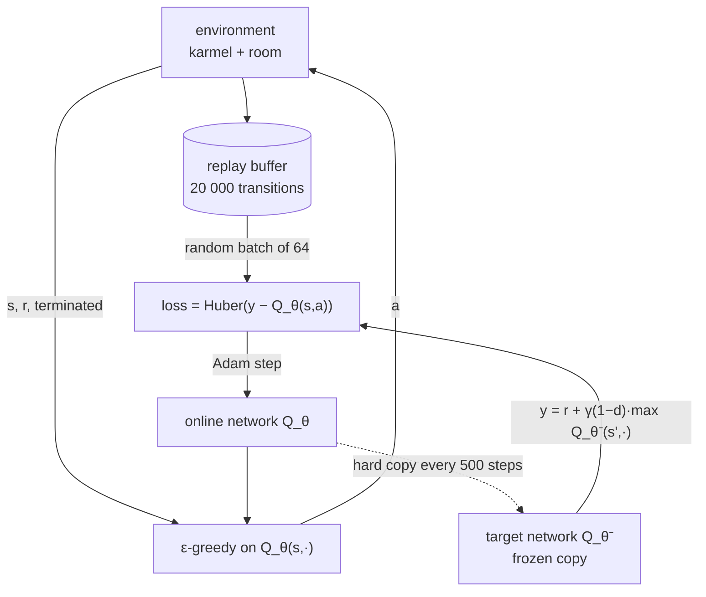

# 17.04 — From tables to networks — DQN

<!-- glance:start -->
<!-- generated by tools/build.py from curriculum/syllabus.yaml — edit the syllabus, not this block -->

| | |
|---|---|
| **Track** | Main path |
| **Difficulty** | Advanced |
| **Time** | 1 h |
| **Hardware** | none |
| **Software** | python, pytorch |
| **Prerequisites** | [17.03 Q-learning on a gridworld robot](17.03-q-learning-gridworld.md) |
| **Optional prerequisites** | [FML.06 Neural networks from zero](../optional-foundations/machine-learning/FML.06-neural-networks.md)<br>[FML.07 Backpropagation and PyTorch basics](../optional-foundations/machine-learning/FML.07-backprop-pytorch.md) |
| **Skip if** | You understand why DQN needs replay buffers and target networks. |

<!-- glance:end -->

## What you will learn

- Explain why a Q-table stops working for a robot and what a network replaces it with.
- Write the DQN loss, including the terminal mask, and compute a batch of TD targets by hand.
- Explain what a replay buffer and a target network each fix, and predict what breaks without them.
- Train DQN on a random-goal gridworld, read its learning curve, and measure the greedy policy against the shortest path.
- Recognize the failure signatures of deep Q-learning: diverging values, a flat success rate, and a loss that falls while the policy gets worse.

## Why it matters

Tabular Q-learning (17.03) needs one number per (state, action). karmel's real state is a pose, a speed and 16 range readings: continuous, and with no two episodes ever visiting the same state twice. Even a modest discretization explodes, and worse, a table learns nothing about a cell it has not visited. A robot cannot afford that. It has to learn "drive toward the goal" once and apply it everywhere.

A neural network turns the table into a function $Q_\theta(s, a)$ that **generalizes**: a gradient step taken in one state changes the values in all similar states. That is the whole promise of deep RL, and the whole danger. The same generalization that shares knowledge also lets one bad update corrupt states you never visited, and the target you are regressing toward is produced by the network you are updating. DQN (Mnih et al., 2015, Atari from pixels) is the design that made this stable enough to work, with two mechanisms you will meet again inside SAC (17.06): a replay buffer and a target network.

<!-- prereqs:start -->
## Prerequisites

You need these first:

- [17.03 Q-learning on a gridworld robot](17.03-q-learning-gridworld.md)

### Optional prerequisite links

New to any of these? Take the foundation lesson first; skip it if you already know it.

- [FML.06 Neural networks from zero](../optional-foundations/machine-learning/FML.06-neural-networks.md)
- [FML.07 Backpropagation and PyTorch basics](../optional-foundations/machine-learning/FML.07-backprop-pytorch.md)

Check your readiness: `python course.py why 17.04`
<!-- prereqs:end -->

## Concept

### The notebook becomes a formula

In 17.03 you kept a notebook with one row per cell. Now imagine you cannot afford the notebook, so you hire a junior engineer with a formula: give them the state, they return four numbers, one per action. Every time you observe a transition you tell them "your estimate for this one was off by 3.5, adjust". They cannot adjust one entry in isolation: they adjust the formula, which moves their answer for every similar state at the same time.

That is supervised regression, with two twists that break the usual rules of supervised learning:

1. **The data is not i.i.d.** The robot collects it by moving, so consecutive samples are almost identical: 50 steps along a wall, then 50 in a corner. Fitting a network to a stream like that is fitting to whatever it is looking at right now, and forgetting the rest. In .NET terms: training on a single partition key's hot stream instead of a shuffled read of the table.
2. **The labels move.** The regression target is $r + \gamma \max_{a'} Q_\theta(s', a')$, computed with the *same* weights you are about to change. You are chasing a target that runs when you move. Feedback loops like this diverge.

DQN's two fixes map one to one onto those two problems:

- **Replay buffer.** Store the last N transitions and train on a random *batch* from it. This decorrelates the samples and reuses each transition many times (RL data is expensive; on a real robot it costs battery and wheel wear).
- **Target network.** Keep a frozen copy $Q_{\theta^-}$ and compute the target with it, refreshing the copy every few hundred steps. The target stops moving between refreshes, so each interval is an ordinary regression problem.

> [!TIP]
> **Ask your teacher:** "Why is the replay buffer an off-policy trick, and why can't I put a replay buffer on plain REINFORCE?"

### What the robot sees here

The lesson's environment is a 7 × 7 room with an internal wall. Every episode the robot **and** the charger appear at random free cells. The observation is a two-channel 7 × 7 image (where I am, where the charger is), flattened to 98 numbers. A table would need one row per (robot cell, goal cell) pair: 45 free cells give $45 \times 44 = 1980$ rows and 7,920 entries, most of which the robot would visit a handful of times in 30,000 steps. The network has to learn the *relationship* between the two channels instead, which is exactly the thing that generalizes.

## Technical explanation

### Level 1 — The same update, now with gradients

Tabular: $Q(s,a) \leftarrow Q(s,a) + \alpha\,[\,y - Q(s,a)\,]$, one entry moves.

Deep: minimize a regression loss over a batch $B$ of transitions, and let the optimizer move the weights.

$$y_i = r_i + \gamma\,(1 - d_i)\,\max_{a'} Q_{\theta^-}(s'_i, a'), \qquad L(\theta) = \frac{1}{|B|}\sum_{i \in B} \ell\big(y_i - Q_\theta(s_i, a_i)\big)$$

$d_i = 1$ when the transition **terminated** (charger reached), which switches the bootstrap off exactly as in 17.03 — except that now the network *does* output a value for the terminal state, so forgetting the mask really does corrupt learning. A truncation (time limit) has $d_i = 0$.

$\ell$ is the Huber loss: quadratic for small errors, linear beyond 1, so one absurd TD error cannot produce a giant gradient step.

$$\ell(\delta) = \begin{cases} \tfrac{1}{2}\delta^2 & |\delta| \le 1 \\ |\delta| - \tfrac{1}{2} & \text{otherwise} \end{cases}$$

**Worked batch.** Three transitions, $\gamma = 0.95$:

| $i$ | $r_i$ | terminated $d_i$ | $Q_{\theta^-}(s'_i, \cdot)$ | $\max_{a'}$ | $y_i$ | $Q_\theta(s_i,a_i)$ | $\delta_i$ | $\ell(\delta_i)$ |
|---|---|---|---|---|---|---|---|---|
| 1 | −1 | 0 | [2.1, 3.4, −0.7, 1.2] | 3.4 | $-1 + 0.95(3.4) = 2.23$ | 1.80 | 0.43 | 0.092 |
| 2 | −1 | 0 | [0.4, 0.9, 1.9, −2.0] | 1.9 | $-1 + 0.95(1.9) = 0.805$ | −0.20 | 1.005 | 0.505 |
| 3 | +10 | 1 | [5.0, 5.0, 5.0, 5.0] | 5.0 | $10$ (masked) | 6.50 | 3.50 | 3.000 |

Loss = mean = **1.199**. With a plain squared error it would be 4.482, and transition 3 alone would contribute 12.25 — that single sample would dominate the gradient. Forgetting the mask on transition 3 would give $y_3 = 10 + 0.95 \times 5 = 14.75$ instead of 10: the network learns that reaching the charger is worth more than it is, and the inflation compounds every time that state is sampled.

### Level 2 — The five design choices that matter

| Choice | This lesson's value | What it controls |
|---|---|---|
| Replay buffer size | 20,000 transitions | How old the oldest experience is. Too small → correlated batches; too large → stale, off-policy data from a much worse policy. |
| Batch size | 64 | Gradient noise per step. |
| Target refresh | hard copy every 500 steps | How stale the target is. Smaller = faster but less stable. (SAC uses a soft update, $\theta^- \leftarrow \tau\theta + (1-\tau)\theta^-$, with $\tau = 0.005$.) |
| ε schedule | 1.0 → 0.05 over the first 40% of the run | Exploration. At step 6,000 of 30,000 it is exactly $1 - 0.95 \cdot \frac{6000}{12000} = 0.525$. |
| Learning rate | 1e-3, Adam, gradient-norm clip 10 | Step size in weight space. |

Warmup (1,000 steps) fills the buffer before the first gradient step, so the first batches are not 64 copies of one transition.

### Level 3 — Why this can diverge, and what Double DQN fixes

Q-learning with function approximation and bootstrapping is the "deadly triad" (Sutton & Barto, §11.3): **function approximation + bootstrapping + off-policy training** together have no convergence guarantee. DQN does not solve this; it engineers around it.

There is also a systematic bias. The target uses $\max_{a'} Q(s', a')$, and the max of noisy estimates is biased upward: if four actions have true value 0 and independent noise of standard deviation $\sigma = 1$, then $\mathbb{E}[\max] \approx 1.03\sigma > 0$. Bootstrapping propagates that optimism backward, step after step. **Double DQN** (van Hasselt et al., 2016) breaks it by splitting the two roles of the max: the online network *chooses* the action, the target network *evaluates* it.

$$y_i = r_i + \gamma\,(1-d_i)\,Q_{\theta^-}\!\big(s'_i,\ \arg\max_{a'} Q_{\theta}(s'_i, a')\big)$$

One line of code; it is the default in most modern implementations. Exercise 17.04-E5 has you add it.

> [!TIP]
> **Ask your teacher:** "Show me numerically that the max of four noisy zero-mean estimates is positive on average, and how Double DQN removes most of that bias."

### Level 4 — Measured results and the ablations

Run on this machine (Windows 11, CPU only, PyTorch 2.14, `torch.set_num_threads(1)`), 30,000 environment steps, about 3.5 minutes:

```text
seed 0, full DQN                     trained in 215 s
   step  return (last 50 ep)  success (last 50 ep)
   3000               -36.82                  0.36
   9000               -25.60                  0.56
  15000                -7.88                  0.82
  21000                 2.64                  0.96
  30000                 1.70                  0.94
greedy evaluation on unseen seeds: {'success_rate': 0.967, 'steps_vs_shortest': 1.05}
```

`steps_vs_shortest` is the honest metric: 1.05 means the learned policy takes 5% more steps than the BFS shortest path. Success alone would hide a policy that wanders and still arrives.

| Run | Greedy success (300 unseen episodes) | Steps vs shortest |
|---|---|---|
| full DQN, seed 0 | 0.967 | 1.05 |
| full DQN, seed 1 | 0.927 | 1.03 |
| **no replay** (`--no-replay`) | **0.08** | 1.00 |
| no target network (`--no-target`) | 0.997 | 1.02 |

Read those two ablations carefully, because they are not the story the textbook tells.

- **Without replay, learning collapses.** The success rate never rises above 0.28 and ends at 0.08. Each gradient step is computed from the 64 most recent, highly correlated transitions. (The `steps_vs_shortest` of 1.00 is a trap: it is averaged over the 8% of episodes that succeeded, which are the ones where the goal happened to be next door.)
- **Without a target network, this task trains fine** — in fact slightly better and 2× faster. The target network is insurance, and on a small task with a short horizon ($\gamma = 0.95$, episodes ≤ 50 steps) the premium is not worth much. Its value shows up with long horizons, high-dimensional observations and $\gamma = 0.99$. Never generalize a stability result from one small environment; measure it on yours.

The same file trains CartPole-v1 (`--env cartpole`), where the observation is 4 physical numbers rather than an image-like grid. Measured here: 60,000 steps in 326 s, greedy evaluation **162.5** mean episode length out of a possible 500 — learning, clearly, but far from solved, and the curve wobbles between 107 and 159 along the way. (For comparison, PPO from Stable-Baselines3 reaches 500 on the same task in 50,000 steps in 17.06. Hand-rolled DQN with untuned hyperparameters is a teaching implementation, not a baseline to publish.) CartPole is the closest thing in this module to a continuous-state robot problem — and it is also where DQN stops: **DQN only handles discrete actions.** karmel's real command is a continuous $(v, \omega)$ pair. Discretizing it into a handful of choices is a legitimate hack for a small robot and a terrible one for an arm with six joints. Continuous actions are why 17.05 and 17.06 exist.

## Diagram



```text
Why the buffer matters (what a batch looks like)

  without replay: the last 64 steps          with replay: 64 samples out of 20 000
  ┌────────────────────────────────┐         ┌────────────────────────────────┐
  │ corner corner corner corner …  │         │ corner  wall  goal!  open  …   │
  │ all from ONE situation         │         │ 300 different situations        │
  └────────────────────────────────┘         └────────────────────────────────┘
  gradient step = "be good here,             gradient step = "be good on
  forget everywhere else"                     average, everywhere"
```

## Code

The complete implementation is [`code/dqn.py`](code/dqn.py) (235 lines, no GPU needed). The training loop is the tabular loop from 17.03 with the table replaced by a network and two extra blocks:

```python
if step >= cfg.warmup and len(buffer) >= cfg.batch:
    batch = random.sample(buffer, cfg.batch) if cfg.use_replay else list(buffer)
    o, a, r, o2, done = (torch.as_tensor(np.array(x), dtype=torch.float32) for x in zip(*batch, strict=True))
    with torch.no_grad():
        bootstrap_net = target if cfg.use_target else q
        y = r + cfg.gamma * (1.0 - done) * bootstrap_net(o2).max(dim=1).values  # TD target
    q_sa = q(o).gather(1, a.long().unsqueeze(1)).squeeze(1)
    loss = nn.functional.smooth_l1_loss(q_sa, y)  # Huber loss
    opt.zero_grad()
    loss.backward()
    nn.utils.clip_grad_norm_(q.parameters(), 10.0)
    opt.step()
    if cfg.use_target and step % cfg.target_every == 0:
        target.load_state_dict(q.state_dict())
```

`torch.no_grad()` around the target is not an optimization: it is the **semi-gradient** rule. The target is treated as a constant label. Letting gradients flow into $y$ changes the algorithm and makes it worse.

Run it:

```bash
python 17-reinforcement-learning/code/dqn.py                              # ~3.5 min on CPU
python 17-reinforcement-learning/code/dqn.py --no-replay                  # ablation
python 17-reinforcement-learning/code/dqn.py --no-target                  # ablation
python 17-reinforcement-learning/code/dqn.py --seed 1
python 17-reinforcement-learning/code/dqn.py --env cartpole --steps 60000 # discrete actions, physical state
```

The auto-graded exercise [`labs/exercises/17.04/`](../labs/exercises/17.04/README.md) is the same three pieces in numpy, isolated so you can test them without waiting for a training run: the circular replay buffer, the ε schedule, and the batched TD target with its terminal mask.

```bash
python course.py check 17.04
```

## Exercise

All exercises need hardware: none.

### Exercise 17.04-E1 — Buffer, schedule and target `[coding]`

Implement `ReplayBuffer`, `epsilon_at`, `td_target` and `double_dqn_target` in `labs/exercises/17.04/student.py`. The README states the exact contract (circular overwrite, sampling with a supplied `numpy` generator, the terminal mask). Check it: `python course.py check 17.04`.

### Exercise 17.04-E2 — Predict the ablations `[predict]`

Before running anything, write down your predictions: (a) with `--no-replay`, will the final greedy success rate be above or below 0.5? (b) with `--no-target`, by how much will the success rate drop? (c) which of the two runs will be *faster* in wall-clock seconds, and why? Then run both and compare with the table in Level 4.

### Exercise 17.04-E3 — The mask bug `[debugging]`

In `dqn.py`, change the target line to `y = r + cfg.gamma * bootstrap_net(o2).max(dim=1).values` (drop `(1.0 - done)`). Train 30,000 steps. Report the learning curve and the greedy success rate, and print `q(obs).max()` for a state next to the goal before and after the change. Explain the direction of the error. Then revert.

### Exercise 17.04-E4 — TD targets by hand `[numerical]`

Batch of two transitions, $\gamma = 0.99$. (a) $r = -0.05$, not terminated, $Q_{\theta^-}(s', \cdot) = [4.0, 4.6, 3.1, 4.2]$, $Q_\theta(s,a) = 4.1$. (b) $r = +10$, terminated, $Q_{\theta^-}(s', \cdot) = [7.0, 7.1, 6.9, 7.0]$, $Q_\theta(s,a) = 5.2$. Compute both targets, both TD errors, the Huber loss of the batch, and the squared-error loss of the batch. Then redo (b) with the online network choosing and the target network evaluating (Double DQN), given $Q_\theta(s', \cdot) = [7.4, 6.8, 7.0, 6.6]$.

### Exercise 17.04-E5 — Double DQN `[simulation]`

Add a `--double` flag to `dqn.py`: choose the next action with the online network, evaluate it with the target network (one changed line). Train seeds 0, 1 and 2 with and without it on the gridworld, 30,000 steps each. Report the greedy success rate and `steps_vs_shortest` for all six runs, and also print the mean of $\max_a Q_\theta(s_0, a)$ over 100 fresh start states for each run. State whether the difference in success is larger than the spread across seeds.

## Expected result

- **17.04-E1:** `python course.py check 17.04` reports 16 passed, 0 skipped. A buffer of capacity 3 fed 5 transitions holds the last 3, in insertion order; `epsilon_at(6000, ...)` with the lesson's schedule returns 0.525; the target for a terminated transition equals its reward exactly.
- **17.04-E2:** (a) far below: 0.08 greedy success, and the training success rate never exceeds 0.28. (b) It does not drop on this task: 0.997 vs 0.967, within the seed-to-seed spread. (c) `--no-target` is faster in wall-clock time (95 s vs 215 s here), because it skips the forward pass through the second network and the periodic state-dict copy. Your absolute seconds will differ; the ratio should not.
- **17.04-E3:** Values inflate without bound near the goal. The bootstrap now adds $\gamma \max_a Q(\text{goal state}, a)$ to a $+10$ reward, and the goal state's own value is fed by that same inflated estimate. Expect $\max_a Q$ near the goal to climb far past the true optimum of about $+10$ (the true return of an episode is at most $10 - (\text{steps}-1)$), and the success rate to be unstable or to fall. The order of actions can survive for a while, which is why this bug often hides.
- **17.04-E4:** (a) $y = -0.05 + 0.99 \times 4.6 = 4.504$, $\delta = 0.404$, $\ell = 0.0816$. (b) $y = 10$ (masked), $\delta = 4.8$, $\ell = 4.3$. Huber batch loss $= (0.0816 + 4.3)/2 = 2.191$; squared-error batch loss $= (0.1632 + 23.04)/2 = 11.60$ — the terminal sample is 141× the other one in squared error, 53× in Huber. Double DQN for (b) changes nothing, because the transition terminated and the bootstrap is masked out; for (a) it would evaluate the online network's argmax instead of the target's own max.
- **17.04-E5:** On this small task expect Double DQN to change success by less than the seed spread (which is about 0.04 between seeds 0 and 1 for plain DQN), but the mean $\max_a Q(s_0, \cdot)$ should be measurably *lower* with Double DQN — that is the overestimation being removed. A correct write-up says "no significant difference in success on this task, smaller value estimates, need a harder/longer-horizon task to see the benefit". If you report a large success improvement from 3 seeds, you are reading noise.

## Troubleshooting

### Symptom: the loss goes down but the success rate does not

1. Print the mean and max of $Q_\theta$ over a batch every 1,000 steps. A network that predicts a constant has a low loss and no policy. If all four action values are within 0.01 of each other, the network has collapsed to predicting the average return.
2. Check the ε schedule. If ε is still near 1.0 at the end, the greedy policy is never exercised during training and the buffer contains only random walks.
3. Check that the greedy action comes from `argmax` over the **action** axis (`dim=1` on a batch, `dim=0` on a single observation).

### Symptom: Q-values grow to thousands

1. The terminal mask (`1 - done`). This is the first thing to check, every time.
2. The target network is not actually frozen: verify you call `target.load_state_dict(q.state_dict())`, not `target = q` (which aliases the same module).
3. Learning rate too high for the reward scale. Rewards of ±10 with lr 1e-2 diverge; either lower the learning rate or scale the rewards.

### Symptom: training is much slower than 215 s / 30k steps

1. `torch.set_num_threads(1)`. For a 3-layer, 128-unit network, multithreading costs more than it saves — the run was 2–3× slower here with the default thread count.
2. You are on the GPU. For networks this small, CPU wins: the batch is too small to fill a GPU and every transfer costs more than the matmul.
3. A print or a plot inside the step loop. Log every 1,000 steps, not every step.

### Symptom: results differ every run even with `--seed 0`

1. `dqn.py` seeds `torch`, `random` and `numpy`. If you added another source (e.g. `np.random.rand`), seed it too.
2. Different PyTorch or numpy versions change the random streams. Seeds make a run reproducible on one machine and one version, not across them. Compare distributions over 3+ seeds, never single runs.

## Common mistakes

- **Bootstrapping into terminal states.** Invisible in tabular code (17.03-E3), always harmful here.
- **Treating truncation as termination.** A 50-step time limit is not the end of the world; `done` must stay 0 for truncated transitions or the network learns that time running out means zero future value.
- **Letting gradients flow into the target.** Without `torch.no_grad()`, you optimize a different objective and stability gets worse.
- **A buffer that is too large for a fast-changing policy.** 1M transitions on a task that solves in 30k steps means most batches come from a policy that no longer exists.
- **Judging by the training curve.** It includes ε-random actions. Always evaluate greedily on unseen seeds, and report a quality metric (steps vs shortest path), not just success.
- **Using DQN for continuous actions.** There is no `max` over a continuous action set. Use 17.05/17.06 methods, not 27 discretized bins per joint.

## Knowledge check

1. Why can't you just discretize karmel's state finely and use the 17.03 code?
   <details><summary>Answer</summary>

   The table grows as the product of the bins of every state dimension (pose, speed, 16 ranges), which is astronomically large, and — more importantly — a table generalizes to nothing: every cell must be visited many times to be learned. A network shares one set of weights across all states, so experience in one state improves the estimate in similar states.
   </details>

2. What exactly does the replay buffer fix, and what does the target network fix?
   <details><summary>Answer</summary>

   The buffer fixes correlated, non-i.i.d. data (consecutive robot steps are nearly identical) and lets each expensive transition be reused many times. The target network fixes the moving-target problem: the regression label is computed with a frozen copy, so within each refresh interval it is ordinary supervised regression.
   </details>

3. $\gamma = 0.99$, $r = -0.05$, transition **truncated** by the time limit, $Q_{\theta^-}(s',\cdot) = [2.0, 3.0, 1.0, 2.5]$. What is the target?
   <details><summary>Answer</summary>

   $-0.05 + 0.99 \times 3.0 = 2.92$. Truncation is not termination: the mask stays 0 and the bootstrap remains.
   </details>

4. Predict: you keep everything but set the target refresh to every 1 step. What happens and why?
   <details><summary>Answer</summary>

   The target network becomes the online network, i.e. the `--no-target` ablation. On this small task it still works (0.997 success) and runs faster; on long-horizon, high-dimensional tasks it is where instability and value divergence appear. Refreshing every step is not "more up to date is better" — it removes the decoupling that the mechanism exists for.
   </details>

5. Your DQN reaches 100% success but `steps_vs_shortest` is 1.9. Is it a good policy?
   <details><summary>Answer</summary>

   It works but is twice as long as optimal, which on a real robot is twice the battery and twice the exposure to collisions. Likely causes: the per-step cost is too small relative to the goal reward, γ is low enough that a slow route is barely penalized, or training stopped early. Success rate alone is never sufficient as a robot metric.
   </details>

6. Why does the max in the TD target bias values upward, and how does Double DQN help?
   <details><summary>Answer</summary>

   $\mathbb{E}[\max_a \hat{Q}] \ge \max_a \mathbb{E}[\hat{Q}]$ (Jensen): the max picks whichever action got a lucky noise draw, so estimation noise turns into systematic optimism, and bootstrapping propagates it. Double DQN selects the argmax with the online network and evaluates it with the target network; the two sets of weights have independent noise, so the selection bias mostly cancels.
   </details>

7. Debugging: the success rate is stuck near 0.2 and the mean episode return is around −40 from the first log line to the last. Name three checks, in order.
   <details><summary>Answer</summary>

   (1) Is a gradient step actually running? Print the loss — with `warmup` above the number of steps, or a buffer shorter than the batch, no learning happens at all. (2) Is the replay buffer being sampled randomly, and does it hold more than a batch worth of distinct transitions? (3) Is ε decaying, and does the greedy policy differ from the random one — evaluate greedily and compare against a random policy's success rate.
   </details>

8. Why does `torch.no_grad()` around the target computation matter algorithmically, not just for speed?
   <details><summary>Answer</summary>

   Q-learning is a *semi-gradient* method: the target is treated as a fixed label even though it depends on θ. Differentiating through it optimizes a different objective (something closer to the Bellman residual), which changes the fixed point and, in practice, destabilizes training.
   </details>

## Practical challenge

Take the "battery" task from the 17.03 challenge (drive to the charger before the battery runs out) and solve it with DQN on a 10 × 10 room, with the robot start, the charger and one wall segment randomized per episode, and the battery level as an extra observation channel (or a 101st input).

**Acceptance criteria:** a learning curve over at least 3 seeds with the spread shown; a greedy evaluation over 300 unseen episode seeds reporting success rate, `steps_vs_shortest` and empty-battery rate; a measured comparison against (a) a random policy and (b) your hand-written threshold policy from 17.01; an ablation table for replay on/off and target on/off on *this* task with your conclusion about which one matters here; and one paragraph explaining any disagreement with this lesson's ablation table.

## You can skip this if…

You answer knowledge-check questions 2, 3 and 6 correctly without looking, `python course.py check 17.04` passes with code you wrote in under 20 minutes, and you can state from memory what the terminal mask does to a truncated transition.

`python course.py skip 17.04 --reason "I understand why DQN needs replay buffers and target networks"`

## Go deeper

- Mnih et al., "Human-level control through deep reinforcement learning" (Nature, 2015) — the original DQN, with the replay + target-network ablation table: https://www.nature.com/articles/nature14236
- van Hasselt, Guez & Silver, "Deep Reinforcement Learning with Double Q-learning" (2015) — the overestimation analysis behind 17.04-E5: https://arxiv.org/abs/1509.06461
- CleanRL's single-file `dqn.py` — the reference implementation to compare yours against, with published learning curves: https://docs.cleanrl.dev/rl-algorithms/dqn/
- Sutton & Barto, chapters 9–11 (function approximation, the deadly triad): http://incompleteideas.net/book/the-book-2nd.html
- Hugging Face Deep RL Course, unit 3 (DQN, hands-on): https://huggingface.co/learn/deep-rl-course

## Progress checkpoint

- [ ] I can explain what a network replaces and why a table fails for a robot.
- [ ] I can compute a batch of TD targets, including the terminal mask, and the Huber loss.
- [ ] I implemented the replay buffer, the ε schedule and the TD target, and `python course.py check 17.04` passes.
- [ ] I ran both ablations and can explain which one mattered here and why.
- [ ] I evaluate policies greedily on unseen seeds with a quality metric, not just success rate.

`python course.py complete 17.04` (exercises done) · `python course.py master 17.04` (challenge done) · `python course.py struggle 17.04 "what was hard"`

Next: [17.05 — Policy gradients — REINFORCE intuitively and mathematically](17.05-policy-gradients.md).
