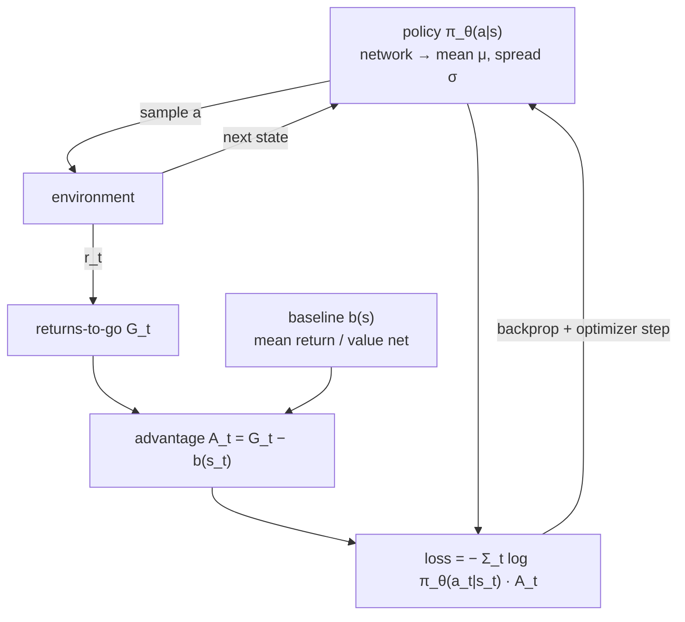

# 17.05 — Policy gradients — REINFORCE intuitively and mathematically

<!-- glance:start -->
<!-- generated by tools/build.py from curriculum/syllabus.yaml — edit the syllabus, not this block -->

| | |
|---|---|
| **Track** | Main path |
| **Difficulty** | Advanced |
| **Time** | 1 h 15 min |
| **Hardware** | none |
| **Software** | python, pytorch |
| **Prerequisites** | [17.03 Q-learning on a gridworld robot](17.03-q-learning-gridworld.md) |
| **Optional prerequisites** | [FM.17 Calculus for robots: derivatives, rates and partial derivatives](../optional-foundations/mathematics/FM.17-derivatives.md)<br>[FML.05 Gradient descent](../optional-foundations/machine-learning/FML.05-gradient-descent.md) |
| **Skip if** | You can derive the REINFORCE estimator. |

<!-- glance:end -->

## What you will learn

- Explain why a robot with continuous commands needs a policy, not a Q-table with an `argmax`.
- Derive the score-function (log-derivative) estimator and check it numerically against finite differences.
- Implement REINFORCE with a Gaussian policy for a continuous action, computing the gradients by hand.
- Show, with measured numbers, that a baseline leaves the gradient unbiased and cuts its variance.
- Recognize REINFORCE's three weaknesses — variance, on-policy data, no step-size protection — which are exactly what PPO and SAC fix in 17.06.

## Why it matters

Everything in 17.03 and 17.04 ends with $\arg\max_a Q(s, a)$. That requires a finite list of actions. karmel's actual command is a pair of real numbers $(v, \omega)$; the SO-101 arm's command is six joint targets. There is no max over a continuous set, and chopping $(v, \omega)$ into 25 discrete combinations makes the robot jerky and the action space explode as soon as you add a joint.

Policy gradients attack the problem from the other end: parameterize the **policy** $\pi_\theta(a \mid s)$ directly — for a robot, usually a Gaussian whose mean is a network output — and do gradient *ascent* on the expected return. Continuous actions come for free, stochastic policies explore by construction, and the objective you optimize is the thing you actually care about. REINFORCE (Williams, 1992) is the simplest such algorithm. It is too noisy to train karmel on its own, but PPO and SAC are it plus variance reduction and a trust region, so this lesson is where their loss functions stop being magic.

<!-- prereqs:start -->
## Prerequisites

You need these first:

- [17.03 Q-learning on a gridworld robot](17.03-q-learning-gridworld.md)

### Optional prerequisite links

New to any of these? Take the foundation lesson first; skip it if you already know it.

- [FM.17 Calculus for robots: derivatives, rates and partial derivatives](../optional-foundations/mathematics/FM.17-derivatives.md)
- [FML.05 Gradient descent](../optional-foundations/machine-learning/FML.05-gradient-descent.md)

Check your readiness: `python course.py why 17.05`
<!-- prereqs:end -->

## Concept

### The problem: you cannot differentiate the world

> [!NOTE]
> This lesson is calculus end to end: partial derivatives, the chain rule, and gradients of things with respect
> to a vector of parameters. New to them? → [FM.17 Calculus for robots: derivatives, rates and partial derivatives](../optional-foundations/mathematics/FM.17-derivatives.md).
> Skip it if $\nabla_\theta$ of a scalar with respect to a parameter vector already reads as "the direction of
> steepest increase" without effort.

You want to maximize $J(\theta) = \mathbb{E}[\,R\,]$, the expected return of the robot's episodes. The obvious idea is to differentiate $J$ with respect to $\theta$ and step uphill. But the return comes out of physics: wheels slipping, a motor saturating, a wall. There is no $\partial(\text{floor})/\partial\theta$, and you would need a differentiable model of the world to get one.

The escape is that *you* choose the action, and the action was drawn from *your* distribution. You cannot differentiate the outcome, but you can differentiate the **probability** of the action that produced it. So instead of asking "how should I change the action to get more reward?", ask "how should I change the *probability* of the actions I already tried, in proportion to how well they went?".

> Sample actions. Whatever earned more than expected, make more likely. Whatever earned less, make less likely.

That is the entire algorithm. It needs no model, no max, and works identically for 2 discrete actions and for a 6-dimensional continuous command.

### Why the "than expected" matters

If every reward is positive, the rule "make what you did more likely, in proportion to reward" increases the probability of *everything*, just at different rates. It still works, because probabilities must sum to 1, but it is enormously noisy: a mediocre action that happened to be sampled gets pushed up too.

Subtracting a **baseline** $b$ — an estimate of "what I expected here" — changes the signal from "reward" to "surprise". Actions that beat expectations are pushed up; actions that fall short are actively pushed down. The measured effect on the gradient's noise in this lesson's docking task is a factor of 2.6.

> [!TIP]
> **Ask your teacher:** "Show me why subtracting a constant baseline leaves the gradient unbiased, first with the one-line proof and then by running the estimator 500 times and comparing the means."

## Technical explanation

### Level 1 — The log-derivative trick on one decision

One state, three actions: karmel is docking and must pick a turning speed — slow, medium or fast. The policy is a softmax over three logits $\theta = [0.5,\,0.0,\,-0.5]$, and the (unknown to the robot) expected rewards are $R = [1, 3, 0]$: medium docks best.

$$\nabla_\theta \mathbb{E}_{a \sim \pi_\theta}[R(a)] = \nabla_\theta \sum_a \pi_\theta(a) R(a) = \sum_a \pi_\theta(a)\, \nabla_\theta \log \pi_\theta(a)\, R(a) = \mathbb{E}_{a \sim \pi_\theta}\!\big[\,R(a)\, \nabla_\theta \log \pi_\theta(a)\,\big]$$

The middle step is the whole trick: $\nabla \pi = \pi \nabla \log \pi$. The left side needs the sum over all actions (impossible when actions are continuous and rewards come from physics); the right side is an **expectation you can sample** — act, observe the reward, multiply by the gradient of the log-probability of what you did.

For a softmax, $\nabla_\theta \log \pi_\theta(a) = \mathbf{e}_a - \pi_\theta$ (one-hot minus the probability vector). Measured by `reinforce.py --part trick`:

```text
pi = [0.5065 0.3072 0.1863]   J = sum_a pi(a) R(a) = 1.4281
exact gradient  pi_k (R_k - J)         = [-0.2168  0.4829 -0.2661]
finite differences                     = [-0.2168  0.4829 -0.2661]

one sample a=1, R=3: grad log pi(a) = onehot - pi = [-0.5065  0.6928 -0.1863]; R * score = [-1.5194  2.0784 -0.559 ]
```

The exact gradient and central finite differences agree to four decimals — that is the check you should run on any gradient you derive. Note the single sample: it points roughly the right way (up on action 1, down on the others) but its magnitude is 4× the true gradient. One sample is a very noisy arrow.

### Level 2 — From one decision to a trajectory

An episode is a sequence of decisions. The same derivation over trajectories $\tau$ gives the **policy gradient theorem**:

$$\nabla_\theta J(\theta) = \mathbb{E}_\tau\!\left[\sum_{t=0}^{T-1} \nabla_\theta \log \pi_\theta(a_t \mid s_t)\,\big(G_t - b(s_t)\big)\right], \qquad G_t = \sum_{k=t}^{T-1} \gamma^{\,k-t} r_k$$

Two things deserve attention:

- **The environment's dynamics vanished.** $\log P(\tau)$ contains transition probabilities, but they do not depend on $\theta$, so their gradient is zero. This is why the method is model-free.
- **$G_t$, not the whole return.** An action at $t$ cannot affect rewards collected before $t$ (causality), so weighting it by the *return-to-go* is valid and has lower variance. Example, rewards $[-1, -1, -1, +10]$ with $\gamma = 0.9$: the returns-to-go are $[4.58,\ 6.20,\ 8.00,\ 10.00]$, not $4 \times 4.58$.

**The baseline is free.** For any $b$ that does not depend on the action,

$$\mathbb{E}_{a}\big[\nabla_\theta \log \pi_\theta(a \mid s)\, b(s)\big] = b(s)\, \nabla_\theta \sum_a \pi_\theta(a \mid s) = b(s)\, \nabla_\theta 1 = 0$$

so subtracting it changes the variance but not the mean. The best simple choice is $b(s) = V(s)$, at which point $G_t - V(s_t)$ is an estimate of the **advantage** $A(s_t, a_t)$ — "how much better than average was this action here?" — and you have just invented actor-critic (17.06).

Measured variance reduction on the 3-action example, 500 independent estimates each:

| Samples per estimate | Std of the estimate, no baseline | Std with $b = J$ |
|---|---|---|
| 10 | [0.336, 0.382, 0.134] | [0.239, 0.206, 0.196] |
| 100 | [0.105, 0.118, 0.043] | [0.072, 0.063, 0.060] |
| 10,000 | [0.010, 0.012, 0.004] | [0.007, 0.006, 0.006] |

Both estimators converge to the exact gradient $[-0.2168, 0.4829, -0.2661]$; the baseline just gets there with fewer samples. Also note the $1/\sqrt{N}$ scaling: 100× more samples, 10× less noise. That is why RL is data hungry.

### Level 3 — Continuous actions: a Gaussian policy

For a continuous command, let the policy be $a \sim \mathcal{N}(\mu_\theta(s), \sigma_\theta^2)$. Then

$$\log \pi_\theta(a \mid s) = -\frac{(a - \mu)^2}{2\sigma^2} - \log \sigma - \tfrac{1}{2}\log 2\pi, \qquad \frac{\partial \log \pi}{\partial \mu} = \frac{a - \mu}{\sigma^2}, \qquad \frac{\partial \log \pi}{\partial (\log \sigma)} = \frac{(a-\mu)^2}{\sigma^2} - 1$$

Read them physically. The $\mu$ term says: move the mean **toward** the action you sampled if it did better than the baseline, away from it if worse. The $\log\sigma$ term says: if a good action was far from the mean (more than one σ away), widen the distribution; if the good actions are all close to the mean, narrow it. Exploration is learned, not scheduled.

**Numbers.** $\mu = 0.30$ m/s, $\sigma = 0.10$, sampled $a = 0.42$ m/s, advantage $+2$: $\partial\log\pi/\partial\mu = (0.42-0.30)/0.01 = 12.0$, so the mean is pushed up; $\partial \log\pi/\partial(\log\sigma) = 0.12^2/0.01 - 1 = +0.44$, so σ widens slightly, because a sample 1.2σ out did well.

The lesson's task: karmel sits 0.5–1.5 m in front of its charger and must creep up to it. The policy has exactly two parameters, $a \sim \mathcal{N}(k\,x,\ \sigma^2)$ with $x$ the remaining distance, and the reward is $-|x_{t+1}| - 0.1\,a^2$ (be at the dock, don't slam the motors). You are literally learning the gain of a P-controller (08.04) by trial and error.

### Level 4 — Measured: REINFORCE learns the P-gain

> [!NOTE]
> The estimated gradient is only half the story; the other half is the update rule that consumes it — step
> size, momentum, Adam — and `lr 5e-4` below is exactly that knob. New to it? →
> [FML.05 Gradient descent](../optional-foundations/machine-learning/FML.05-gradient-descent.md).
> Skip it if you can already predict what halving the learning rate does to the curves in the table.

`reinforce.py --part dock`, 300 iterations of 16 episodes, lr 5e-4, from $k = 0$:

| | final $k$ | final σ | std of the $k$-gradient (last 100 iters) | return on 300 held-out episodes |
|---|---|---|---|---|
| no baseline | 1.42 | 0.193 | 42.5 | −12.99 |
| baseline (mean return-to-go) | 1.21 | 0.212 | 16.1 | −12.80 |
| hand-tuned $k = 1.0$ | — | 0 | — | −12.85 |
| hand-tuned $k = 0.5$ / $k = 3.0$ | — | 0 | — | −15.55 / −18.56 |

Three honest readings:

1. REINFORCE found the useful region of gain on its own, from $k=0$, with no model of the robot. Its final controller matches the hand-tuned one (−12.80 vs −12.85), which is the correct benchmark to compare against — and a good reminder that for a one-parameter controller, tuning by hand is 300× cheaper.
2. The baseline cut the gradient noise by 2.6× (42.5 → 16.1), and the run with the baseline sits closer to the optimum after the same number of episodes.
3. σ shrank from 0.30 to about 0.2 but not to 0: the reward's $-0.1a^2$ term and the noise in the start distance keep some exploration worthwhile.

With a neural-network policy on CartPole-v1 (`--part cartpole`, 600 episodes, about 1 minute), the story gets worse:

```text
episode    60  mean length (last 50)   73.8
episode   120  mean length (last 50)  146.2
episode   180  mean length (last 50)   39.9     <- collapse
episode   300  mean length (last 50)  103.1
episode   360  mean length (last 50)  142.7
episode   600  mean length (last 50)   69.6
```

It learns, then falls apart, then recovers. Nothing is broken: this is REINFORCE. Each update uses one episode, is thrown away afterwards (**on-policy**), and has no limit on how far the policy may move in one step, so a lucky batch can push the policy off a cliff. PPO's clipped objective exists precisely to stop that, and it turns this jagged curve into the monotone one you will measure in 17.06.

## Diagram



```text
What one update does to a Gaussian policy over the speed command

     before:        μ=0.30, σ=0.10            after an update with A > 0 at a = 0.42
       prob                                      prob
        |      ,-.                                |        ,-.
        |     /   \                               |       /   \
        |    /     \      * a sampled here        |      /     \      * 
        |___/_______\_____________ v [m/s]        |_____/_______\_________ v [m/s]
          0.2  0.3  0.4  0.5                        0.2  0.3  0.4  0.5
                                                   μ moved toward the good action,
                                                   σ widened (the sample was 1.2σ out)

  A < 0 at the same action pushes μ the other way: "that was worse than expected here".
```

## Code

[`code/reinforce.py`](code/reinforce.py) has the three parts in one file, all CPU, no training rig:

```bash
python 17-reinforcement-learning/code/reinforce.py --part trick      # exact vs sampled gradient, < 5 s
python 17-reinforcement-learning/code/reinforce.py --part dock       # Gaussian policy, numpy, ~8 s
python 17-reinforcement-learning/code/reinforce.py --part cartpole   # PyTorch policy, ~1 min
```

The docking update, with every gradient written out by hand (no autograd, so you can see the score function):

```python
G = np.array([np.cumsum(r[::-1])[::-1] for _, _, r in episodes])   # returns-to-go, (batch, T)
b = G.mean(axis=0) if baseline else np.zeros(HORIZON)              # per-timestep average
sigma = np.exp(log_sigma)
g_k, g_ls = 0.0, 0.0
for (x, a, _), G_i in zip(episodes, G, strict=True):
    mu = k * x
    dlogp_dk = (a - mu) / sigma**2 * x                  # d/dk     log N(a; kx, sigma^2)
    dlogp_dls = (a - mu) ** 2 / sigma**2 - 1.0          # d/dlog σ log N(a; kx, sigma^2)
    g_k += np.sum((G_i - b) * dlogp_dk)
    g_ls += np.sum((G_i - b) * dlogp_dls)
k += lr * np.clip(g_k / batch, -50, 50)                 # gradient ASCENT on expected return
```

In the PyTorch version the same thing is written as a loss, because optimizers minimize:

```python
loss = -(torch.stack(logps) * advantages).sum()   # minimizing −J is ascending J
```

The minus sign is the single most common bug in this lesson. A missing minus trains a policy to be as bad as possible, which looks exactly like "my RL doesn't work".

The auto-graded exercise [`labs/exercises/17.05/`](../labs/exercises/17.05/README.md) is the estimator itself: returns-to-go, the softmax and Gaussian score functions, and the batch gradient with and without a baseline, checked against finite differences.

```bash
python course.py check 17.05
```

## Exercise

All exercises need hardware: none.

### Exercise 17.05-E1 — Implement the estimator `[coding]`

Implement `returns_to_go`, `softmax_score`, `gaussian_score`, `policy_gradient_estimate` and `mean_baseline` in `labs/exercises/17.05/student.py`. The tests check your gradient against central finite differences, so a sign error or a missing $1/\sigma^2$ cannot pass. Check it: `python course.py check 17.05`.

### Exercise 17.05-E2 — The trick by hand `[numerical]`

A 2-action softmax with logits $\theta = [0.2, -0.3]$ and expected rewards $R = [0, 5]$. (a) Compute $\pi$, $J$ and the exact gradient $\pi_k(R_k - J)$. (b) You sample $a = 1$ and get $R = 5$: compute the one-sample estimate $R \nabla_\theta \log \pi$ and the same with baseline $b = J$. (c) You sample $a = 0$ and get $R = 0$: compute both again. (d) What does (c) tell you about learning from failures without a baseline?

### Exercise 17.05-E3 — Measure the variance yourself `[simulation]`

Run the docking task with and without the baseline for seeds 0–4 (`--part dock --seed n`). Collect the final $k$, the standard deviation of the $k$-gradient over the last 100 iterations, and the held-out return. Report mean and spread over the 5 seeds for both settings, and state whether the difference in the final return is larger than the seed spread.

### Exercise 17.05-E4 — Predict the damage `[predict]`

Predict, then verify by editing a copy of `reinforce.py`: (a) weight every step by the *total* episode return instead of the return-to-go; (b) initialize $\sigma = 0.01$ instead of 0.3; (c) increase the learning rate from 5e-4 to 5e-3; (d) drop the minus sign in the CartPole loss. For each, predict the learning curve's shape *before* running, then run and explain the difference.

### Exercise 17.05-E5 — Continuous actions in the robot environment `[simulation]`

Train the docking policy with a second parameter: let the mean be $\mu = k_1 x + k_2 \dot{x}$ (add the current speed to the state, which makes it a PD controller) and derive $\partial \log \pi / \partial k_2$ yourself. Train with a baseline for 600 iterations. Does the learned $(k_1, k_2)$ beat the best pure-P controller on the 300 held-out episodes, and by how much?

## Expected result

- **17.05-E1:** `python course.py check 17.05` reports 13 passed, 0 skipped. Your analytic gradient must match the finite-difference gradient to about 1e-6, and the baseline version must have the same mean over many samples but a smaller spread.
- **17.05-E2:** (a) $\pi = [0.6225, 0.3775]$, $J = 1.8877$, exact gradient $[-1.175, +1.175]$. (b) score $= [-0.6225, +0.6225]$, estimate $[-3.112, +3.112]$, with the baseline $[-1.937, +1.937]$ — closer to the truth. (c) Without a baseline the estimate is exactly $[0, 0]$: $R = 0$ multiplies the whole gradient away, so the failed attempt teaches **nothing**. With the baseline it is $[+0.713, -0.713]$: action 0 is actively pushed down. (d) With non-negative rewards and no baseline, only successes carry information, so you must wait for a success before anything moves; with a baseline, failures are informative immediately. This is why sparse-reward tasks and no baseline are a bad combination.
- **17.05-E3:** Expect the baseline runs to show roughly a 2–3× smaller gradient standard deviation (seed 0: 16.1 vs 42.5). Final $k$ lands in the 1.0–1.6 band in both cases, and the held-out returns are within a few tenths of each other and of the hand-tuned $k = 1.0$ value (−12.85). A correct conclusion: the baseline reduces variance measurably, and on this easy 1-parameter problem it changes the final performance by less than the seed spread.
- **17.05-E4:** (a) Still converges but more slowly and noisily: every step gets credit for rewards collected before it. (b) With σ = 0.01 the policy barely explores; $k$ moves very slowly and can stall entirely, because the $\log\sigma$ gradient grows σ only when sampled actions beat the baseline. (c) At lr 5e-3 the gradient clip (±50) fires constantly and $k$ overshoots and oscillates — a controller gain bouncing above and below the optimum. (d) Without the minus, CartPole's mean episode length falls toward 9–10 steps within a few dozen episodes: you are successfully training it to drop the pole.
- **17.05-E5:** A PD policy should reach the dock with less overshoot, and its held-out return should beat the best pure-P value (−12.80 to −12.85) by roughly 0.3–1.0, with $k_2 < 0$ (damping). The derivative you need is $\partial \log\pi/\partial k_2 = \frac{a-\mu}{\sigma^2}\dot{x}$ — the same score function with $\dot{x}$ in place of $x$. If your $k_2$ runs away to a large magnitude, the speed input is not normalized, or the gradient clip is hiding a scale problem.

## Troubleshooting

### Symptom: the return goes down steadily from the first iteration

1. The sign. Gradient **ascent** on $J$ means `theta += lr * grad` or `loss = -(logp * A).sum()`. One minus in the wrong place turns your optimizer into a pessimizer, and the curve is unmistakable: smooth, confident degradation.
2. Advantage sign: it is $G_t - b$, not $b - G_t$.
3. If you use `torch.distributions`, check you call `log_prob(a)` on the action that was actually executed (after clipping? no — on the *sampled* action; clipping happens on the way to the robot and must not change the log-probability you differentiate).

### Symptom: the policy becomes deterministic early and stops improving

1. Print σ (or the policy entropy) every iteration. If it collapses toward 0 in the first few dozen updates, the learning rate on $\log\sigma$ is too high, or the returns have a large constant offset that a baseline should have removed.
2. Add an entropy bonus (17.06 does this with `ent_coef`), or clamp $\log\sigma$ to a floor as `reinforce.py` does (`np.clip(log_sigma, log(0.02), log(1.0))`).
3. Check that you are not evaluating with the *mean* action during training. Training must sample.

### Symptom: the gradient is huge and the parameters jump

1. Check the scale of $G_t$. Returns of ±300 multiply every score function by ±300. Normalize the advantages (subtract the mean, divide by the std — the PyTorch part does exactly this) or scale the reward.
2. $1/\sigma^2$ in the Gaussian score blows up as σ shrinks. A σ floor is not cosmetic.
3. Clip the gradient norm, and log how often the clip fires. If it fires every iteration, your learning rate is the problem, not the clip.

### Symptom: my analytic gradient disagrees with finite differences

1. Compare *per component*, with a central difference and $\varepsilon = 10^{-6}$: `(J(θ+ε e_k) − J(θ−ε e_k)) / (2ε)`.
2. A constant factor off (2×, $T$×, batch×) means an averaging mistake: sum over time, average over episodes.
3. A sign flip on one component only usually means the one-hot index and the action index disagree.

## Common mistakes

- **Minimizing instead of maximizing.** See above; check it on every new implementation.
- **Reusing old data.** REINFORCE is on-policy: after one update, every stored trajectory was generated by a policy that no longer exists. A replay buffer here is simply wrong (PPO's importance ratio is what makes limited reuse legal).
- **Using the total return for every step.** Correct but noisier. Use returns-to-go.
- **A baseline that depends on the action.** $b(s)$ may use the state, never $a$. $b(s,a)$ biases the gradient.
- **Judging progress from the loss.** The "loss" $-\sum \log\pi \cdot A$ is not a quantity that should go down. Plot the return.
- **One seed.** REINFORCE's per-run spread is enormous. Three seeds minimum before any claim.

## Knowledge check

1. Why can't you compute $\nabla_\theta J$ by differentiating the reward with respect to the action?
   <details><summary>Answer</summary>

   Because the reward is produced by the environment, which you have no differentiable model of, and the dependence goes through physics (contacts, saturation) that is often non-differentiable. The log-derivative trick moves the derivative onto the policy's own probability, which you do know in closed form.
   </details>

2. Write the REINFORCE estimator for one episode and name every factor.
   <details><summary>Answer</summary>

   $\hat{g} = \sum_t \nabla_\theta \log \pi_\theta(a_t \mid s_t)\,(G_t - b(s_t))$. $\nabla \log \pi$ is the score function (how to make this action more likely), $G_t$ the return-to-go from $t$, $b(s_t)$ a state-dependent baseline. The update is $\theta \leftarrow \theta + \alpha \hat{g}$ (ascent).
   </details>

3. $\mu = -0.2$ rad/s, $\sigma = 0.25$, sampled $a = 0.3$, advantage $-1.5$. In which direction does the mean move, and does σ grow or shrink?
   <details><summary>Answer</summary>

   $\partial \log\pi/\partial\mu = (0.3-(-0.2))/0.0625 = 8.0$; times the advantage $-1.5$ gives $-12$, so the mean moves **away** from 0.3 (more negative). $\partial\log\pi/\partial\log\sigma = (0.5)^2/0.0625 - 1 = 3.0$; times $-1.5$ is negative, so σ **shrinks**: a far-out sample that did badly makes the policy less adventurous.
   </details>

4. Why is subtracting a baseline free, and what does it buy?
   <details><summary>Answer</summary>

   $\mathbb{E}_a[\nabla\log\pi(a|s)] = \nabla\sum_a \pi(a|s) = \nabla 1 = 0$, so any $b(s)$ contributes zero to the expectation: the estimator stays unbiased. It buys variance: measured 2.6× lower gradient standard deviation on the docking task, and it makes failures informative (E2c).
   </details>

5. Predict: rewards are 0 everywhere and +1 on success, you use no baseline, and the policy succeeds in 1 episode out of 200. What does the learning curve look like?
   <details><summary>Answer</summary>

   Flat for long stretches: 199 episodes out of 200 contribute an exactly zero gradient, so the parameters only move on the rare success, and that single update is very noisy. This is the sparse-reward failure mode. Fixes: a baseline (so failures push down), reward shaping (17.08), or a method with a critic (17.06).
   </details>

6. Why can't REINFORCE use a replay buffer, while DQN can?
   <details><summary>Answer</summary>

   The estimator is an expectation over trajectories drawn from the **current** policy; old data comes from a different distribution and biases it. DQN's target is built from the Bellman optimality equation, which does not care which policy collected the transition (off-policy). Reusing data in a policy-gradient method requires an importance ratio $\pi_\text{new}/\pi_\text{old}$, which is exactly what PPO clips.
   </details>

7. Debugging: your CartPole policy reaches an average length of 150, then drops to 20 and stays there. What do you check, in order?
   <details><summary>Answer</summary>

   (1) Policy entropy / σ: a collapse to a near-deterministic bad policy cannot recover, because exploration is gone. (2) Advantage normalization and learning rate: one huge batch can move the policy far in a single step — this is the no-trust-region failure REINFORCE has and PPO fixes. (3) That the environment is being reset properly and the seed varies per episode, so you are not measuring one unlucky initial state forever.
   </details>

## Practical challenge

Write your own REINFORCE (Gaussian policy, PyTorch, with a learned value-function baseline) for the karmel go-to-goal environment of 17.07, and measure it honestly against the PPO result there.

**Acceptance criteria:** a learning curve over 3 seeds with the spread; a 100-episode evaluation on the unseen seeds 10000–10099 reporting success rate, mean steps to goal and mean spin; a comparison table against the hand-written controller (100% success, 48.4 steps) and 17.07's PPO run (100%, 38.8 steps); the wall-clock and environment-step count each method needed; and one paragraph on what you would change first — the baseline, the step size, or the algorithm.

## You can skip this if…

You answer knowledge-check questions 2, 4 and 6 correctly without looking, you can derive $\partial \log \mathcal{N}(a; \mu, \sigma^2)/\partial\mu$ on paper, and `python course.py check 17.05` passes with code you wrote in under 25 minutes.

`python course.py skip 17.05 --reason "I can derive the REINFORCE estimator"`

## Go deeper

- Williams, "Simple statistical gradient-following algorithms for connectionist reinforcement learning" (1992) — the original REINFORCE paper: https://link.springer.com/article/10.1007/BF00992696
- Sutton, McAllester, Singh & Mansour, "Policy Gradient Methods for RL with Function Approximation" (NeurIPS 1999) — the policy gradient theorem: https://proceedings.neurips.cc/paper/1999/hash/464d828b85b0bed98e80ade0a5c43b0f-Abstract.html
- OpenAI Spinning Up, "Intro to Policy Optimization" — the cleanest derivation on the internet, with code: https://spinningup.openai.com/en/latest/spinningup/rl_intro3.html
- Hugging Face Deep RL Course, unit 4 (policy gradients, hands-on): https://huggingface.co/learn/deep-rl-course
- Sutton & Barto, chapter 13 (policy gradient methods, baselines, actor-critic): http://incompleteideas.net/book/the-book-2nd.html

## Progress checkpoint

- [ ] I can explain why continuous actions need a policy rather than an argmax over Q.
- [ ] I derived the score-function estimator and checked a gradient against finite differences.
- [ ] I implemented REINFORCE with a Gaussian policy and know both score functions by heart.
- [ ] I measured the variance reduction a baseline gives and can state what it does not change.
- [ ] I can name REINFORCE's three weaknesses and say which 17.06 mechanism fixes each.

`python course.py complete 17.05` (exercises done) · `python course.py master 17.05` (challenge done) · `python course.py struggle 17.05 "what was hard"`

Next: [17.06 — Actor-critic, PPO and SAC with Stable-Baselines3](17.06-actor-critic-ppo-sac.md).
