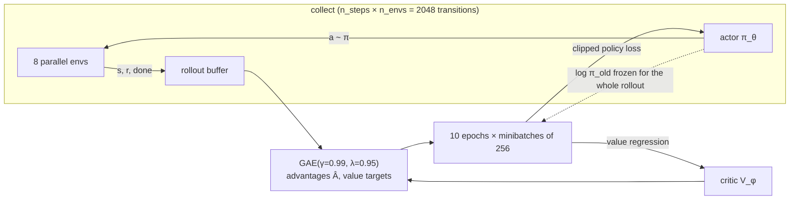

# 17.06 — Actor-critic, PPO and SAC with Stable-Baselines3

<!-- glance:start -->
<!-- generated by tools/build.py from curriculum/syllabus.yaml — edit the syllabus, not this block -->

| | |
|---|---|
| **Track** | Main path |
| **Difficulty** | Advanced |
| **Time** | 1 h 15 min |
| **Hardware** | none |
| **Software** | python, stable-baselines3, gymnasium |
| **Prerequisites** | [17.05 Policy gradients — REINFORCE intuitively and mathematically](17.05-policy-gradients.md)<br>[17.04 From tables to networks — DQN](17.04-deep-q-networks.md) |
| **Version-sensitive** | yes — see [curriculum/versions.yaml](../curriculum/versions.yaml) |
| **Skip if** | You train PPO/SAC agents with SB3 and read their learning curves. |

<!-- glance:end -->

## What you will learn

- Explain what a critic adds to the policy gradient of 17.05 and compute a GAE advantage by hand.
- Explain PPO's clipped objective in one sentence and say exactly what it prevents.
- Choose between PPO and SAC for a given robot task using sample efficiency, wall clock and action space.
- Train both with Stable-Baselines3, read the Monitor logs, and evaluate a policy deterministically on unseen seeds.
- Recognize the two learning-curve pathologies you will actually hit: a collapse after good progress, and a flat curve that means the algorithm is wrong for the task.

## Why it matters

You are not going to write PPO from scratch for karmel, any more than you would write your own TLS stack. The skill that matters is *choosing* the algorithm, feeding it a correct environment, and reading its learning curve honestly. Stable-Baselines3 is the standard library for that on the CPU-sized problems in this course, and the same two algorithms — PPO and SAC — are what the robot-learning literature reaches for when the policy is trained in simulation.

This lesson is the last one before you point them at karmel (17.07). It is also where the two halves you built by hand meet: DQN's bootstrapped value estimate (17.04) becomes the **critic**, and REINFORCE's score function (17.05) becomes the **actor**.

<!-- prereqs:start -->
## Prerequisites

You need these first:

- [17.05 Policy gradients — REINFORCE intuitively and mathematically](17.05-policy-gradients.md)
- [17.04 From tables to networks — DQN](17.04-deep-q-networks.md)

### Optional prerequisite links

None.

Check your readiness: `python course.py why 17.06`
<!-- prereqs:end -->

> [!IMPORTANT]
> **Version-sensitive** (measured 2026-09 with Stable-Baselines3 2.9.0, Gymnasium 1.3.0, PyTorch 2.14 CPU, Python 3.14 on Windows; the course robot runs Python 3.12 on Ubuntu 24.04, see [`curriculum/versions.yaml`](../curriculum/versions.yaml)).
> SB3's API and default hyperparameters change between minor versions. Check the current docs before copying parameter names: https://stable-baselines3.readthedocs.io/
> AI teacher: verify the installed versions (`pip show stable-baselines3 gymnasium`) and the current documentation before giving install or parameter instructions.

## Concept

### The critic is a baseline that learns

REINFORCE's weakness was noise: it weighted each action by the return of the whole rest of the episode, a number that depends on everything that happened afterwards. In 17.05 you subtracted a baseline and the noise dropped by 2.6×. An **actor-critic** method takes that idea to its conclusion: learn the baseline as a value function $V_\phi(s)$, and use it not only to centre the return but to *replace* most of it.

$$A_t = \underbrace{r_t + \gamma V_\phi(s_{t+1})}_{\text{one real step + a prediction}} - V_\phi(s_t)$$

That is the TD error from 17.03, now used as "how much better than expected was this action". One real reward plus a learned prediction, instead of 200 real rewards: much lower variance, some bias (the critic is wrong at first). GAE (below) is the knob between the two.

Two networks, two jobs:

- **Actor** $\pi_\theta(a \mid s)$ — decides. Trained with the policy gradient, weighted by $A_t$.
- **Critic** $V_\phi(s)$ — predicts the return. Trained by regression on the observed returns, exactly like DQN's Q-network but with no max and no actions.

### PPO: small, safe steps

REINFORCE's other weakness was that a single unlucky batch could push the policy off a cliff (you saw CartPole's mean length fall from 146 to 40 between two logs). Nothing in the algorithm limits how far one update moves the policy.

PPO limits it. It computes the ratio between the new and old probability of each action it has already collected, $\rho_t = \pi_\theta(a_t|s_t) / \pi_{\theta_\text{old}}(a_t|s_t)$, and refuses to pay for improvements that come from moving that ratio far from 1. In deployment terms: you may ship, but not more than 20% of the fleet at once, and you get no credit for changes beyond that. Because the ratio corrects for the mismatch between the old and new policies, PPO may also reuse each batch of data for several epochs — something REINFORCE cannot do at all.

### SAC: squeeze every transition, and stay curious on purpose

SAC goes the other way. It is **off-policy**, like DQN: transitions go into a replay buffer and are reused for thousands of gradient steps. That makes it drastically more sample efficient — the number that matters when each sample costs a real robot's battery. It also adds the policy's entropy to the objective, so "stay as random as you can while still doing well" is written into the reward rather than tuned by hand.

The price is wall-clock time: SAC does one or more gradient updates *per environment step*, while PPO collects 2,048 cheap simulator steps and then does a burst of updates. On this lesson's Pendulum benchmark, SAC needed **1,316 s** where PPO needed **71 s** for the same 20,000 environment steps — and SAC was the one that solved the task.

> [!TIP]
> **Ask your teacher:** "Given a simulator that runs at 1,000 steps/s and a real robot that runs at 10 steps/s, walk me through choosing between PPO and SAC for each."

## Technical explanation

### Level 1 — Generalized Advantage Estimation (GAE)

The advantage can be estimated from 1 step (low variance, biased by the critic's error) or from the whole episode (unbiased, very noisy). GAE(λ) blends every horizon with exponentially decaying weights:

$$\delta_t = r_t + \gamma V(s_{t+1}) - V(s_t), \qquad \hat{A}^{\text{GAE}}_t = \sum_{l \ge 0} (\gamma\lambda)^l\, \delta_{t+l}$$

$\lambda = 0$ gives the one-step TD error; $\lambda = 1$ gives the Monte-Carlo advantage $G_t - V(s_t)$. SB3's default is 0.95, which is what 17.07 uses.

**Worked example.** A 4-step episode ending at the goal, $\gamma = 0.99$, $\lambda = 0.95$, rewards $[-0.05, -0.05, -0.05, +10]$, critic predictions $V = [2.0, 3.0, 5.0, 9.0]$, and the last step **terminates** (so $V(s_4)$ is masked to 0):

| $t$ | $\delta_t$ | GAE $\hat{A}_t$ | MC advantage $G_t - V(s_t)$ |
|---|---|---|---|
| 0 | $-0.05 + 0.99(3.0) - 2.0 = 0.92$ | 6.953 | 7.554 |
| 1 | $-0.05 + 0.99(5.0) - 3.0 = 1.90$ | 6.415 | 6.702 |
| 2 | $-0.05 + 0.99(9.0) - 5.0 = 3.86$ | 4.800 | 4.850 |
| 3 | $10 + 0 - 9.0 = 1.00$ | 1.000 | 1.000 |

The GAE values sit slightly below the Monte-Carlo ones because the critic's optimism is partly trusted instead of waiting for the real return. The value targets the critic is then regressed on are $\hat{A}_t + V(s_t) = [8.95, 9.41, 9.80, 10.0]$. Note the terminal mask again: it appears in the critic's bootstrap exactly as it did in DQN's target.

### Level 2 — What PPO's clip actually does

$$L^{\text{CLIP}}(\theta) = \mathbb{E}_t\Big[\min\big(\rho_t \hat{A}_t,\ \text{clip}(\rho_t, 1-\epsilon, 1+\epsilon)\,\hat{A}_t\big)\Big], \qquad \rho_t = \frac{\pi_\theta(a_t|s_t)}{\pi_{\theta_\text{old}}(a_t|s_t)}$$

Work through the four cases with $\epsilon = 0.2$ and $|\hat{A}| = 2$:

| $\rho_t$ | $\hat{A}_t$ | $\rho \hat{A}$ | clipped | objective ($\min$) | effect |
|---|---|---|---|---|---|
| 1.5 | +2 | 3.0 | 2.4 | **2.4** | good action, already 50% more likely → no further reward for pushing |
| 1.5 | −2 | −3.0 | −2.4 | **−3.0** | bad action that became *more* likely → full penalty, push it back |
| 0.5 | +2 | 1.0 | 1.6 | **1.0** | good action that became less likely → full gradient to bring it back |
| 0.5 | −2 | −1.0 | −1.6 | **−1.6** | bad action already halved → no extra reward for suppressing it more |

The asymmetry is the point: the $\min$ makes the objective *pessimistic*, so the clip removes the incentive to move further in the direction you have already moved far enough, but never removes the incentive to undo a mistake.

The full SB3 loss also carries a value-function term and an entropy bonus:
$L = L^{\text{CLIP}} - c_v\,(V_\phi(s_t) - \hat{R}_t)^2 + c_e\,H[\pi_\theta]$. `ent_coef` ($c_e$) defaults to 0.0; raising it to 0.005–0.01 is the standard fix when a policy converges to a deterministic mediocre behaviour too early.

**Rollout arithmetic**, which trips everyone up once: PPO collects `n_steps` transitions *per environment*. With `n_envs=8` and `n_steps=256` a rollout is 2,048 transitions; with `batch_size=256` and `n_epochs=10` that rollout produces $10 \times 2048/256 = 80$ gradient steps before new data is collected. `total_timesteps` counts steps across **all** environments, so 60,000 steps on 8 envs is 7,500 steps per environment.

### Level 3 — SAC in one page

SAC maximizes return **plus** entropy:

$$J(\pi) = \mathbb{E}\Big[\sum_t r_t + \alpha\,\mathcal{H}\big(\pi(\cdot \mid s_t)\big)\Big]$$

- $\alpha$ is tuned automatically (SB3's default `ent_coef="auto"`) toward a target entropy of $-\dim(\mathcal{A})$.
- Two Q-networks ("twin critics"); the target uses the **minimum** of the two, which counteracts the overestimation bias you met in 17.04.
- Target networks updated softly: $\theta^- \leftarrow \tau\theta + (1-\tau)\theta^-$ with $\tau = 0.005$, instead of DQN's hard copy.
- Actor trained to maximize $Q(s, a) - \alpha \log \pi(a|s)$, with the reparameterization trick (differentiate *through* the sampled action; possible because the critic here is differentiable, unlike the environment in 17.05).
- Continuous actions only. For discrete actions use PPO, A2C or DQN.

| | PPO | SAC |
|---|---|---|
| Data | on-policy, discard after `n_epochs` | off-policy replay buffer (here 200k transitions) |
| Sample efficiency | low | high (often 10× better) |
| Wall clock per step | low (rollouts are cheap, updates batched) | high (a gradient step per env step) |
| Parallel envs | scales well (8–32 envs) | usually 1–4 |
| Action space | discrete or continuous | continuous |
| Sensitivity to hyperparameters | moderate | lower, but slower to debug |
| Use it when | the simulator is fast and cheap | samples are expensive (real robot, slow sim) |

### Level 4 — Measured on the classics

`sb3_classic.py` trains both pairs and writes Monitor CSVs plus a learning-curve PNG. Measured on this machine (CPU, 2 threads):

**CartPole-v1, discrete actions, 50,000 steps on 4 envs.** Deterministic evaluation over 20 episodes, maximum 500:

| Algorithm | Return at 12.5k | at 25k | at 37.5k | at 50k | Final deterministic evaluation |
|---|---|---|---|---|---|
| A2C | 111.5 | 187.1 | 287.3 | **51.6** | **47.7 ± 5.0** |
| PPO | 125.7 | 209.9 | 300.8 | 454.5 | **500.0 ± 0.0** |

A2C climbed to 287 and then **collapsed**. That is not a bug in SB3 and not bad luck in one episode: A2C is an actor-critic method with no trust region, so it is REINFORCE's cliff problem with a critic attached. PPO's clip is exactly the missing piece. If you take one habit from this lesson: **always evaluate the final policy, never just the last point of the training curve**, and always keep the curve, because "47.7" alone would have told you nothing about what happened.

**Pendulum-v1, continuous torque, 20,000 steps on 1 env.** A good swing-up-and-hold policy scores about −150 per episode; a random one about −1,200:

| Algorithm | Return at 5k | at 10k | at 20k | Final deterministic evaluation | Wall clock |
|---|---|---|---|---|---|
| PPO | −1287 | −1322 | −1150 | **−1035.6 ± 149.8** | 71 s |
| SAC | −920 | −156 | −167 | **−116.5 ± 60.0** | 1316 s |

SAC solved it in about 10,000 samples. PPO had barely started after 20,000 — it needs roughly 200k–500k steps and tuned hyperparameters on this task. This is the sample-efficiency gap in one table, and the wall-clock column is the other half of the trade: 18× the time for the same 20,000 steps, because SAC ran a gradient update on every one of them.

## Diagram



```text
PPO's clipped objective, advantage A > 0 (a good action)

  objective
     ^
 2.4 |                 ______________________   clip: no reward past ρ = 1.2
     |                /
     |               /
     |              /                            gradient still flows here
     |             /
  ---+------------/--------------------------->  ρ = π_new / π_old
     |          0.8   1.0   1.2

  advantage A < 0 (a bad action): mirrored — the flat part is on the LEFT (ρ < 0.8),
  and moving the action UP in probability is penalized without any limit.
```

## Code

[`code/sb3_classic.py`](code/sb3_classic.py) is deliberately small; the interesting part is that everything is measured through SB3's `Monitor` CSVs, so the same reader produces the tables in 17.07–17.09:

```python
venv = make_vec_env(setup["env_id"], n_envs=n_envs, seed=seed, monitor_dir=str(out))
model = make_model(algo, venv, seed)            # A2C / PPO / SAC with device="cpu"
model.learn(total_timesteps=steps)
mean, std = evaluate_policy(model, eval_env, n_eval_episodes=20, deterministic=True)
table = rl_tools.curve_table(rl_tools.read_monitor_dir(out), [...], window=20)
```

`device="cpu"` is not a typo: for `MlpPolicy` networks of 64 units, the CPU is faster than a GPU, and SB3 prints a warning telling you so.

```bash
# install into the labs virtualenv (see labs/README.md); on Ubuntu 24.04, pip into the
# system Python is blocked by PEP 668, so a venv is not optional there
pip install "stable-baselines3>=2.9" "gymnasium>=1.3"
python 17-reinforcement-learning/code/sb3_classic.py cartpole   # A2C vs PPO, ~5 min
python 17-reinforcement-learning/code/sb3_classic.py pendulum   # PPO vs SAC, ~23 min (SAC is slow)
python 17-reinforcement-learning/code/sb3_classic.py cartpole --seeds 0 1 2
```

The helpers in [`code/rl_tools.py`](code/rl_tools.py) read Monitor CSVs without pandas, build the curve tables, plot several runs together, and run the deterministic evaluation used throughout the rest of the module:

```python
def read_monitor_dir(folder):      # every *.monitor.csv episode, sorted by finish time
def curve_table(log, checkpoints, window=100)   # mean return/length/success before each checkpoint
def plot_curves(runs, out_png, window=100)      # return and success rate vs environment steps
def evaluate(policy, make_env, episodes=100, seed=10_000)  # success, collisions, steps, spin
```

## Exercise

All exercises need hardware: none.

### Exercise 17.06-E1 — GAE and the clip by hand `[numerical]`

(a) Episode of 3 steps, $\gamma = 0.9$, $\lambda = 0.8$, rewards $[1, 1, 5]$, critic $V = [4, 4, 4]$, the last step terminates. Compute $\delta_t$, the GAE advantages and the critic's regression targets. (b) With $\epsilon = 0.2$, compute PPO's objective for $(\rho, \hat{A})$ = (1.3, +1), (1.3, −1), (0.7, +1), (0.7, −1), and say in each case whether the gradient is zero. (c) A rollout of `n_envs=4`, `n_steps=512`, `batch_size=128`, `n_epochs=10`: how many transitions per rollout, how many gradient steps per rollout, and how many rollouts fit into `total_timesteps=100_000`?

### Exercise 17.06-E2 — Predict, then run the CartPole pair `[predict]`

Predict before running: (a) which of A2C and PPO reaches 500 first; (b) whether the *final* A2C policy will be better than its best point during training; (c) what the seed-to-seed spread will be. Then run `sb3_classic.py cartpole --seeds 0 1 2`, report the deterministic evaluation of all six runs, and compare with your predictions and with the lesson's table.

### Exercise 17.06-E3 — Sample efficiency versus wall clock `[simulation]`

Run `sb3_classic.py pendulum` and record, for both algorithms: environment steps to first reach a mean return above −300, wall-clock seconds to that point, and the final deterministic evaluation. Then re-run PPO alone with `--steps 200000` and report where it gets. Write two sentences: which algorithm you would use if the simulator ran at 20 steps/s, and which if it ran at 5,000 steps/s.

### Exercise 17.06-E4 — Break it on purpose `[debugging]`

Starting from the PPO CartPole setup, make three separate changes and report the learning curve for each: (a) `n_steps=16` (rollout of 64 transitions with 4 envs); (b) `clip_range=1.0`; (c) `ent_coef=0.05`. For each, say which failure mode you have created and which symptom identifies it from the curve alone.

### Exercise 17.06-E5 — Pick the algorithm `[design]`

For each task, choose PPO, SAC, DQN or "not RL at all", and justify in two or three lines using action space, sample cost and wall clock: (a) karmel go-to-goal in the course simulator, which runs ~1,000 steps/s with 8 parallel environments; (b) a real SO-101 arm learning to push a block, 10 Hz control, no simulator, a human resets each episode; (c) choosing which of four docking approach angles to use, from a fixed shelf of four; (d) driving a straight line at 0.3 m/s on a known robot; (e) a quadruped learning to walk in a GPU simulator with 4,096 parallel environments.

## Expected result

- **17.06-E1:** (a) $\delta = [1 + 0.9(4) - 4,\ 1 + 0.9(4) - 4,\ 5 + 0 - 4] = [0.6, 0.6, 1.0]$; GAE with $\gamma\lambda = 0.72$: $\hat{A}_2 = 1.0$, $\hat{A}_1 = 0.6 + 0.72(1.0) = 1.32$, $\hat{A}_0 = 0.6 + 0.72(1.32) = 1.5504$; value targets $\hat{A} + V = [5.5504, 5.32, 5.0]$. (b) (1.3, +1) → 1.2, gradient **zero** (clipped side); (1.3, −1) → −1.3, gradient non-zero; (0.7, +1) → 0.7, non-zero; (0.7, −1) → −0.8, zero. (c) 2,048 transitions per rollout; $10 \times 2048/128 = 160$ gradient steps; 48.8 → 48 full rollouts in 100,000 steps.
- **17.06-E2:** PPO reaches 500 and stays; the lesson's seed-0 run evaluates at 500.0 ± 0.0 after 50k steps. A2C's final policy is *much worse* than its best training point (47.7 ± 5.0 after peaking at 287 during training). Seed spread for A2C is large (it can end anywhere between ~40 and ~500); for PPO on CartPole it is small. If your three PPO seeds all land above 400 and your three A2C seeds disagree wildly, you have reproduced the lesson.
- **17.06-E3:** SAC crosses −300 at roughly 7,000–10,000 environment steps, which takes several hundred seconds; PPO does not cross it at all within 20,000 steps (−1035.6 at the end) and typically needs 200k+ steps, at which point it should reach roughly −400 to −200 depending on the seed. Correct answers: at 20 steps/s the environment is the bottleneck, so use SAC and pay for gradient time; at 5,000 steps/s, PPO with many parallel environments finishes sooner in wall clock even though it burns 10× the samples.
- **17.06-E4:** (a) Tiny rollouts give noisy advantages and a critic that never sees a full episode: the curve rises slowly, wobbles, and often plateaus far below 500. (b) `clip_range=1.0` effectively removes the trust region: expect A2C-like behaviour — faster early progress and then a collapse. (c) A large entropy bonus keeps the policy deliberately random: the curve plateaus at a mediocre value (typically 100–300) and never converges, because the objective is no longer mostly about the return.
- **17.06-E5:** (a) PPO — fast simulator, cheap samples, parallel envs, and that is what 17.07 uses. (b) SAC — every sample costs a human reset; sample efficiency dominates, and the action space is continuous. (c) DQN or even a contextual bandit (17.02): four discrete choices. (d) Not RL at all: a PID controller (08.04) with odometry feedback solves this exactly, is tunable in minutes and cannot surprise you. (e) PPO — with 4,096 parallel environments, samples are essentially free and PPO's throughput wins (this is what Isaac Lab does, 17.09).

## Troubleshooting

### Symptom: SB3 refuses my environment

1. Run `gymnasium.utils.env_checker.check_env(env)` first and treat warnings as errors. SB3 wraps your env in `Monitor` and a `VecEnv`; a wrong dtype or an out-of-bounds observation surfaces as a confusing error much later.
2. `observation_space` must contain what `reset()` and `step()` actually return, including dtype (`float32`, not `float64`) and bounds.
3. `reset(seed=...)` must call `super().reset(seed=seed)` and use `self.np_random`.

### Symptom: the reward never improves (flat curve)

1. Check the algorithm/action-space match: SAC on a discrete space and DQN on a continuous space are both errors, not slow learning.
2. Measure a baseline: a scripted policy and a random policy on the same environment. If your scripted policy also scores near the RL curve, the environment's reward may be degenerate, not the algorithm (17.08).
3. Look at episode **length** as well as return. A curve that is flat in return but changing in length means something is learning.
4. Check that episodes end: if `truncated` is never set, the Monitor logs nothing and the curve is empty.

### Symptom: the curve looks nothing like the lesson's

1. Different library versions, different defaults. Print `stable_baselines3.__version__` and compare with the marker at the top of this lesson.
2. One seed is not a result. Run 3 seeds before concluding anything.
3. Check `n_envs`: the x-axis is *total* environment steps across all envs, so 8 envs reach 60,000 steps 8× sooner in wall clock, and per-environment learning is 8× less.

### Symptom: SAC is unbearably slow

1. That is expected: one gradient step per environment step. Options: `train_freq=(2, "step")` with `gradient_steps=2`, fewer `learning_starts`, or a smaller network.
2. Check you are on the CPU for small MLPs — a GPU is slower here, and SB3 warns about it.
3. If you only need a policy, not sample efficiency, use PPO with more parallel environments.

## Common mistakes

- **Reporting the last point of the training curve as the result.** A2C's 287 → 51.6 collapse is the reason; always run a deterministic evaluation on unseen seeds.
- **Comparing algorithms at equal wall clock or equal steps without saying which.** They give opposite answers here (PPO wins per second, SAC wins per sample).
- **Forgetting `deterministic=True` at evaluation.** A stochastic policy scores worse and noisier, and the difference can be large for SAC.
- **Tuning by re-running one seed until it looks good.** That is fitting the seed, not the policy.
- **Changing two hyperparameters at once.** One change, three seeds, then decide.
- **Assuming defaults are good for your task.** SB3's defaults are tuned for the classic benchmarks. 17.07 changes `n_steps`, `batch_size` and the network size for karmel.

## Knowledge check

1. What does the critic replace, and what does it cost?
   <details><summary>Answer</summary>

   It replaces the noisy Monte-Carlo return-to-go in the policy gradient with "one real reward + a predicted value", cutting variance dramatically. The cost is bias: early in training the critic is wrong, so the advantages point in slightly wrong directions. GAE(λ) trades those two off, λ = 0 all bias-ish (one-step), λ = 1 all variance (Monte Carlo).
   </details>

2. $\gamma = 0.99$, $\lambda = 0.95$, $\delta = [0.92, 1.90, 3.86, 1.00]$ with the last step terminal. What is $\hat{A}_2$?
   <details><summary>Answer</summary>

   $\hat{A}_3 = 1.00$, and $\hat{A}_2 = 3.86 + 0.99 \times 0.95 \times 1.00 = 4.80$. (Continuing: $\hat{A}_1 = 1.90 + 0.9405 \times 4.80 = 6.41$.)
   </details>

3. The ratio for a transition is 1.4, its advantage is +3, $\epsilon = 0.2$. What is PPO's objective for it, and what is its gradient?
   <details><summary>Answer</summary>

   $\min(1.4 \times 3,\ 1.2 \times 3) = 3.6$, taken from the clipped branch, whose gradient with respect to θ is zero. PPO has already made this good action 40% more likely than the policy that collected it and refuses to pay for more in this update.
   </details>

4. Why can PPO reuse a batch for 10 epochs while REINFORCE cannot reuse it at all?
   <details><summary>Answer</summary>

   The importance ratio $\pi_\theta/\pi_{\theta_\text{old}}$ corrects for the fact that the data came from an older policy, and the clip keeps that correction in a range where it is trustworthy. REINFORCE's estimator assumes the data came from the current policy and has no such correction.
   </details>

5. Predict: you train SAC on karmel's go-to-goal task with 8 parallel environments to speed it up. What happens to wall-clock time and to sample efficiency?
   <details><summary>Answer</summary>

   Sample efficiency stays roughly the same or gets slightly worse (the replay buffer fills with more similar data per gradient step), and wall clock improves much less than 8× because the bottleneck is the gradient updates, not the simulator. SAC scales poorly with parallel environments; that is PPO's trick.
   </details>

6. Your PPO run on a continuous-control task has a return curve that rises then falls, and the policy's entropy has dropped to almost zero. What are the two most likely fixes?
   <details><summary>Answer</summary>

   (1) Add an entropy bonus (`ent_coef` 0.005–0.01) so the policy keeps exploring; (2) lower the learning rate or the clip range so each update moves less. Also check that the reward is not encouraging an early degenerate behaviour (17.08).
   </details>

7. For a real SO-101 arm with a human resetting each episode, why is "PPO with 8 environments" not an option?
   <details><summary>Answer</summary>

   There is only one robot: you cannot run 8 parallel real environments, and PPO needs hundreds of thousands of samples at, say, 10 Hz with human resets — weeks of work. You either use a sample-efficient off-policy method (SAC), train in simulation and transfer (17.09), or use imitation learning from demonstrations (18.02), which is what module 18 does.
   </details>

## Practical challenge

Make PPO solve Pendulum-v1 (deterministic evaluation better than −200 over 20 episodes) and report what it cost.

**Acceptance criteria:** three seeds, each evaluated deterministically on 20 episodes; learning curves plotted together with `rl_tools.plot_curves`; a table of what you changed from SB3's defaults (steps, `n_envs`, `gamma`, `gae_lambda`, `ent_coef`, learning rate, network size) with one line each on *why*; the environment steps and wall-clock seconds it took; and a comparison against this lesson's SAC result (−116.5 in 20k steps / 1,316 s), including which of the two you would choose on a robot where a sample costs one second and a gradient step costs nothing.

## You can skip this if…

You answer knowledge-check questions 1, 3 and 5 correctly without looking, and you can take a Monitor CSV directory and produce a learning curve and a deterministic evaluation with three seeds, unaided, in under 20 minutes.

`python course.py skip 17.06 --reason "I train PPO/SAC agents with SB3 and read their learning curves"`

## Go deeper

- Schulman et al., "Proximal Policy Optimization Algorithms" (2017) — the clipped objective: https://arxiv.org/abs/1707.06347
- Schulman et al., "High-Dimensional Continuous Control Using Generalized Advantage Estimation" (2015) — GAE(λ): https://arxiv.org/abs/1506.02438
- Haarnoja et al., "Soft Actor-Critic" (2018) — the entropy-regularized objective and twin critics: https://arxiv.org/abs/1801.01290
- Stable-Baselines3 documentation — the API, every hyperparameter, and the tuned defaults: https://stable-baselines3.readthedocs.io/
- "The 37 Implementation Details of Proximal Policy Optimization" — why your from-scratch PPO does not match the paper: https://iclr-blog-track.github.io/2022/03/25/ppo-implementation-details/
- RL Baselines3 Zoo — tuned hyperparameters per environment, worth copying before you tune anything yourself: https://rl-baselines3-zoo.readthedocs.io/

## Progress checkpoint

- [ ] I can explain what the critic and GAE(λ) do, and compute advantages by hand.
- [ ] I can state what PPO's clip prevents and which of the four cases has zero gradient.
- [ ] I trained A2C, PPO and SAC with SB3 and read their Monitor logs.
- [ ] I can justify a PPO/SAC choice from sample cost, wall clock and action space.
- [ ] I never report a training curve's last point as a result.

`python course.py complete 17.06` (exercises done) · `python course.py master 17.06` (challenge done) · `python course.py struggle 17.06 "what was hard"`

Next: [17.07 — Wrap the course simulator as a Gymnasium environment and train go-to-goal](17.07-robot-gym-environment.md).
