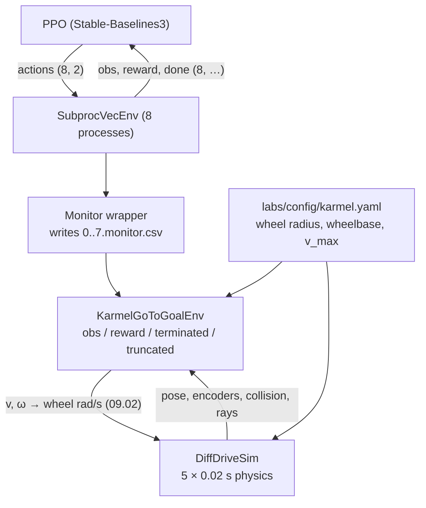

# 17.07 — Wrap the course simulator as a Gymnasium environment and train go-to-goal

<!-- glance:start -->
<!-- generated by tools/build.py from curriculum/syllabus.yaml — edit the syllabus, not this block -->

| | |
|---|---|
| **Track** | Main path |
| **Difficulty** | Advanced |
| **Time** | 2 h |
| **Hardware** | none |
| **Software** | python, gymnasium, stable-baselines3 |
| **Prerequisites** | [17.06 Actor-critic, PPO and SAC with Stable-Baselines3](17.06-actor-critic-ppo-sac.md) |
| **Skip if** | You have trained a navigation policy in a custom Gymnasium environment. |

<!-- glance:end -->

## What you will learn

- Implement the Gymnasium contract (`reset`, `step`, spaces, seeding, `info`) on top of the course's own simulator.
- Design an observation that the real karmel could actually produce, and normalize it so a network can learn from it.
- Distinguish `terminated` from `truncated` in code, and see what each one does to the learner.
- Train PPO on 8 parallel copies of your environment and evaluate it on episode seeds it never saw.
- Compare a learned policy against a hand-written controller with numbers that survive scrutiny: success, steps, collisions, spin.

## Why it matters

Everything you have built so far consumed environments that somebody else wrote. From here on, **you** write the environment, and that is where most real RL projects go wrong. The environment is the specification: the observation decides what the robot can possibly know, the action decides what it can do, the reward decides what it will become, and the termination rules decide what "an episode" even means. An algorithm bug produces a bad policy; an environment bug produces a policy that is excellent at the wrong task.

This lesson's environment is reused twice more: 17.08 breaks its reward on purpose, and 17.09 randomizes its physics. It is also the point where you can finally answer the only question that matters for karmel: does a learned policy beat the 20-line controller you could write in an afternoon?

<!-- prereqs:start -->
## Prerequisites

You need these first:

- [17.06 Actor-critic, PPO and SAC with Stable-Baselines3](17.06-actor-critic-ppo-sac.md)

### Optional prerequisite links

None.

Check your readiness: `python course.py why 17.07`
<!-- prereqs:end -->

## Concept

### An environment is an interface with a contract

`gymnasium.Env` is a small interface — two methods and two spaces — and every RL library in existence speaks it. In .NET terms it is `IEnumerable` for decision problems: trivially small, and everything downstream depends on you honouring the contract exactly.

```text
reset(seed=None, options=None) -> (observation, info)
step(action)                   -> (observation, reward, terminated, truncated, info)
observation_space, action_space: gymnasium.spaces.Box / Discrete / …
```

The contract has sharp edges that cost people days:

- **`terminated` is not `truncated`.** Terminated = the episode really ended (goal reached, robot crashed): there is no future, and the learner must not bootstrap. Truncated = we stopped watching (time limit): the future exists, keep bootstrapping. You met the consequence in 17.03-E3 and 17.04-E3; here you write the code that sets them.
- **Only `self.np_random`.** `reset(seed=s)` must make the episode reproducible. A stray `np.random.uniform` makes runs unrepeatable and silently breaks parallel environments, which would otherwise all draw the same numbers or none at all.
- **The observation must be inside `observation_space`**, dtype included. `float64` where you declared `float32` is a real error that surfaces 200 lines deep inside the library.

### The observation is a promise about the real robot

The simulator knows the robot's exact pose. The real karmel does not. If you put the true pose into the observation, you train a policy that cannot run on hardware — it is the sim-to-real trap of 06.10, embedded in the environment's very first line.

So the observation is built only from things karmel can measure or estimate on the robot:

| Index | Quantity | Normalized by | Where it comes from on the real robot |
|---|---|---|---|
| 0 | distance to goal | 5.66 m (room diagonal) | localization (module 10) or a marker detection (13.07) |
| 1, 2 | cos, sin of the heading error | — | the same estimate plus the IMU heading |
| 3 | forward speed $v$ | 0.5 m/s | wheel encoders (07.02, 09.01) |
| 4 | yaw rate $\omega$ | 2.5 rad/s | encoders / gyro |
| 5… | 16 range readings around the robot | 2.0 m | LiDAR (07.07), only when obstacles are enabled |

Two design details worth internalizing:

- **cos/sin instead of the angle.** A heading error of $+179°$ and $-179°$ are nearly the same situation, but as raw numbers they are at opposite ends of the range. Feeding $(\cos e, \sin e)$ removes the wrap discontinuity that would otherwise make the network learn a cliff. (Same reason quaternions beat roll-pitch-yaw in 05.05.)
- **Everything in $[-1, 1]$.** Networks learn badly from inputs of wildly different scales. Dividing each quantity by its physical maximum is the cheapest normalization there is, and it also documents the units.

The action is symmetric: `[-1, 1]²` mapped to $(v, \omega)$ = (0.5 m/s, 2.5 rad/s) × action, which then goes through the same inverse kinematics you wrote in 09.02 and the simulated motor PID. The policy never touches wheel speeds directly, exactly as on the real robot.

> [!TIP]
> **Ask your teacher:** "Show me what happens to a trained policy if I replace cos/sin of the heading error with the raw angle, and let me predict the failure first."

## Technical explanation

### Level 1 — The two clocks

One environment step is **0.1 s** of simulated time (10 Hz control), made of 5 physics steps of 0.02 s. This split matters:

- The physics needs small steps to be stable and to catch collisions (`DiffDriveSim` integrates at 50 Hz, the rate the Pico firmware runs its velocity PID at).
- The policy should run at the rate the real robot can actually run a network and a perception pipeline: 10 Hz is realistic for a Raspberry Pi 5 with a camera in the loop; 50 Hz is not.

A 200-step episode is therefore 20 seconds of robot time — long enough to cross a 4 m room twice.

### Level 2 — The reward, in one line

$$r_t = 10\,(d_{t-1} - d_t) - 0.05 + 10\,[\text{success}] - 10\,[\text{collision}]$$

- $10 (d_{t-1} - d_t)$: **progress**, metres closer since the last step, scaled. Driving at the full 0.5 m/s straight at the goal earns $10 \times 0.05 = 0.5$ per step.
- $-0.05$ per step: time costs battery. Standing still for the whole episode earns $-10$.
- $\pm 10$ terminal bonuses.

Why progress rather than $-d_t$ (distance as a penalty)? Because the sum of progress over an episode telescopes to $10(d_0 - d_{\text{final}})$ — it cannot be farmed by hanging around, and it gives dense feedback from the first step instead of one sparse signal at the end. Lesson 17.08 shows what happens when a shaping term does *not* telescope.

**Sanity check with numbers.** Goal 2.2 m away, robot drives straight and stops inside the 0.15 m tolerance after 45 steps: return $\approx 10(2.2 - 0.15) - 0.05 \times 45 + 10 = 20.5 - 2.25 + 10 = 28.25$. The measured hand-written controller averages **25.6** over 100 episodes, because it turns first (spending time without progress) and the goal is not always straight ahead. Being able to predict the return of a behaviour to within a few percent *before* training is the best environment test there is.

### Level 3 — Termination, truncation and the info dict

```python
success   = d < self.goal_tolerance_m          # 0.15 m
terminated = bool(success or collided)
truncated  = bool(not terminated and self.steps >= self.max_episode_steps)
```

Never both. `info` carries what the *metrics* need but the policy must not see: `is_success`, `collided`, `distance`, `spin_rad` (total |heading change| — the reward-hacking detector of 17.08) and `path_m`. Passing `monitor_kwargs={"info_keywords": ("is_success",)}` makes SB3's `Monitor` write the success flag into its CSV, so the learning curve can show success rate next to return.

### Level 4 — Vectorization and the measured results

PPO wants throughput, so training runs 8 copies of the environment in separate processes (`SubprocVecEnv`). On Windows and macOS those processes start fresh, so the factory must be **picklable** — hence a small `EnvFactory` class instead of a lambda. The PPO settings are chosen around that:

```python
PPO("MlpPolicy", venv, n_steps=max(64, 2048 // n_envs),   # a 2048-transition rollout in total
    batch_size=256, n_epochs=10, learning_rate=3e-4, gamma=0.99, gae_lambda=0.95,
    clip_range=0.2, ent_coef=0.0, policy_kwargs={"net_arch": [64, 64]}, device="cpu")
```

**Measured, empty room, PPO, 60,000 environment steps, 8 envs** (seed 0; 137 s on this machine, ~440 steps/s):

```text
 env steps  episodes   return  length  success
      6000        31    -3.55   193.1     0.10
     12000        73     7.05   164.3     0.41
     18000       146    22.35    94.6     0.93
     30000       366    24.66    47.9     1.00
     60000      1030    27.61    45.5     1.00
```

Evaluation on 100 episode seeds (10000–10099) that training never saw, deterministic actions:

| Policy | Success | Collisions | Mean steps to goal | Mean return | Mean spin |
|---|---|---|---|---|---|
| PPO seed 0 | 1.00 | 0.00 | **38.8** | 26.28 | 1.65 rad |
| PPO seed 1 | 1.00 | 0.00 | 38.7 | 26.27 | 1.64 rad |
| PPO seed 2 | 1.00 | 0.00 | 38.7 | 26.28 | 1.71 rad |
| hand-written `heading_controller` | 1.00 | 0.00 | 48.4 | 25.60 | 1.60 rad |
| SAC, 30,000 steps, 4 envs | 1.00 | 0.00 | 54.2 | 25.38 | 1.00 rad |

Read this honestly. **The learned policy is 20% faster than the hand-written one and just as reliable — and the hand-written one is 20 lines, took minutes to write, and needs no training.** That is the actual result of this lesson, and it is the same conclusion as 16.01: RL earns its keep when the task is hard to write by hand, not when it is easy. SAC reached the same success in half the environment steps (30k vs 60k) but took longer in wall clock and produced a slower policy at that budget.

Now make the task hard to write by hand — three round obstacles, 16 LiDAR-like rays in the observation, 150,000 steps:

| Policy | Success | Collisions | Mean steps to goal |
|---|---|---|---|
| PPO with obstacles, 150k steps | **0.82** | 0.18 | 45.0 |
| hand-written (ignores the rays) | 0.65 | 0.35 | 48.6 |

The learned policy is clearly better than the naive baseline — and 0.82 is still far below what a real robot needs, and far below what Nav2's local planner (12.05) achieves with no learning at all. The right conclusion for karmel is a layered one: classical navigation for the driving, learning for the parts that resist modelling.

## Diagram



```text
What the observation measures (empty room, one episode)

        y ^                     * goal
          |                    /
          |            d = 2.2 m
          |                  /
          |        e (heading error)
          |         ,-------/
          |        /     ^ robot heading θ
          |       (o)----->  x_robot
          +---------------------------> x
                                         obs = [d/5.66, cos e, sin e, v/0.5, ω/2.5]
                                             = [0.389,  0.93,  0.37, 0.0,   0.0]

  e = wrap(atan2(goal_y − y, goal_x − x) − θ)      always in (−π, π]
  cos/sin instead of e: no jump between +179° and −179°
```

## Code

The environment is [`code/karmel_env.py`](code/karmel_env.py) (about 330 lines including obstacles, domain randomization and rendering). The step function is the whole contract in 25 lines:

```python
def step(self, action):
    action = np.clip(np.asarray(action, dtype=np.float64).reshape(2), -1.0, 1.0)
    self._pending.append(action)
    applied = self._pending.pop(0)            # with latency the robot executes an older command
    v, w = applied[0] * self.v_max, applied[1] * self.w_max
    left = np.clip((v - 0.5 * w * self.b) / self.r, -self.max_wheel, self.max_wheel)
    right = np.clip((v + 0.5 * w * self.b) / self.r, -self.max_wheel, self.max_wheel)

    x0, y0, th0 = self.sim.pose
    collided = False
    for _ in range(self.substeps):            # 5 × 0.02 s of physics per control step
        self.sim.set_velocity(float(left), float(right))
        self.sim.step(self.physics_dt)
        collided = collided or self.sim.collided
    ...
    d, e = self._distance(), self._heading_error()
    success = d < self.goal_tolerance_m
    terminated = bool(success or collided)
    truncated = bool(not terminated and self.steps >= self.max_episode_steps)
    reward = self._reward(d, e, success, collided)
    self._d_prev, self._e_prev = d, e
    return self._observation(), float(reward), terminated, truncated, self._info(success, collided)
```

`collided = collided or self.sim.collided` is not defensive programming: a collision can happen in substep 2 and be cleared by substep 5, and losing it teaches the policy that walls are free.

Run one scripted episode (no training, no libraries beyond numpy):

```bash
python 17-reinforcement-learning/code/karmel_env.py
# hand-written controller: 51 steps, return 26.69, success=True, collided=False,
# final distance 0.149 m, spin 1.66 rad
```

Train and evaluate with [`code/train_go_to_goal.py`](code/train_go_to_goal.py):

```bash
python 17-reinforcement-learning/code/train_go_to_goal.py                          # PPO, 60k steps, ~2-6 min
python 17-reinforcement-learning/code/train_go_to_goal.py --algo sac --steps 30000 --n-envs 4
python 17-reinforcement-learning/code/train_go_to_goal.py --obstacles 3 --steps 150000
python 17-reinforcement-learning/code/train_go_to_goal.py --eval-only 17-reinforcement-learning/code/runs/ppo_goal_s0/model.zip
python 17-reinforcement-learning/code/train_go_to_goal.py --exercise student       # train YOUR env
```

Each run writes `model.zip`, one Monitor CSV per environment, `learning_curve.png` and `summary.json` into `code/runs/<name>_s<seed>/`.

The auto-graded exercise [`labs/exercises/17.07/`](../labs/exercises/17.07/README.md) has you write the environment yourself — spaces, seeding, kinematics, reward, termination — with Gymnasium's own `check_env` run as part of the tests, warnings treated as failures.

```bash
python course.py check 17.07
```

> [!CAUTION]
> **Safety:** everything in this lesson is simulation. A policy trained here must never drive the real karmel directly. Learned policies get a deterministic safety shield, speed limits and a reachable e-stop first — that is 17.09, and it is not optional.

## Exercise

All exercises need hardware: none (simulation only).

### Exercise 17.07-E1 — Write the environment `[coding]`

Implement `twist_to_wheels`, `make_observation`, `step_reward` and the `GoToGoalEnv` class in `labs/exercises/17.07/student.py`. The tests run `check_env`, verify seeding and the start/goal sampling rules, and script three episodes (reach the goal, hit a wall, time out). Check it: `python course.py check 17.07`. Then train PPO on *your* environment: `python 17-reinforcement-learning/code/train_go_to_goal.py --exercise student`.

### Exercise 17.07-E2 — Predict the return `[predict]`

Before running anything: for an episode where the goal starts 2.0 m away and the robot is already facing it, predict (a) the return of a policy that drives straight at full speed, (b) the return of standing still for 200 steps, (c) the return of spinning in place for 200 steps. Then measure all three with `reward_hacking.py scripted` (it prints exactly these, per reward mode) and explain any difference from your prediction.

### Exercise 17.07-E3 — Train and compare `[simulation]`

Train PPO with seeds 0, 1 and 2 (60,000 steps each) and evaluate all three on the 100 unseen episode seeds. Report success, mean steps to goal and mean spin for each, plus the hand-written baseline, and state the seed spread. Then answer in one paragraph: would you ship the learned policy on karmel? Why or why not?

### Exercise 17.07-E4 — Break the observation `[debugging]`

Make three separate copies of the environment, each with one change, train 60,000 steps and report the learning curve and the evaluation: (a) replace `cos e, sin e` with the raw angle $e$; (b) remove the speed and yaw-rate entries (indices 3 and 4); (c) feed the *unnormalized* distance in metres instead of `d / 5.66`. Predict each outcome before training, then explain which observations turned out to be load-bearing and why.

### Exercise 17.07-E5 — Obstacles `[simulation]`

Train with `--obstacles 3 --steps 150000` (about 18 minutes here) and evaluate. Report the success and collision rate against the hand-written controller, which ignores the rays entirely. Then look at where the failures are: print the start, goal and obstacle positions of 10 failed episodes and describe the pattern in one or two sentences.

## Expected result

- **17.07-E1:** `python course.py check 17.07` reports 21 passed, 0 skipped. Training your own environment with `--exercise student` should reproduce the reference run closely: at 18,000 steps the success rate is already ~0.99 and the final 100-episode evaluation is 1.00 success with ~39 mean steps to goal (measured with the reference solution: 1.00 success, 38.79 steps, 59 s of training).
- **17.07-E2:** (a) $10 \times (2.0 - 0.15) - 0.05 n + 10 \approx 28.5 - 0.05n$, so about 26–27 for a 40-step episode. (b) exactly $-0.05 \times 200 = -10.0$. (c) also $-10.0$ under the `progress` reward — spinning makes no progress and is not otherwise rewarded. The measured table gives 25.2 / −10.0 / −10.0 for the hand-written, spin and stand-still behaviours. Remember (c): in 17.08 the same spin scores **+62.2** under a slightly different reward.
- **17.07-E3:** All three seeds reach 1.00 success with 38.7–38.8 mean steps and spin 1.64–1.71 rad; the hand-written controller reaches 1.00 success in 48.4 steps. The seed spread is tiny (0.1 steps) on this easy task, which is itself the finding — do not expect that on a harder one. The honest answer to "would you ship it": not on its own. A 20% speed gain does not justify a network you cannot inspect, when the failure modes of the hand-written controller are known and its behaviour is predictable. It becomes interesting with obstacles (E5) or with dynamics that are hard to model.
- **17.07-E4:** (a) The raw angle usually still trains but is measurably worse and slower, because the policy must learn the $\pm\pi$ discontinuity; expect a lower success rate early and more spin. (b) Removing $v$ and $\omega$ makes the state non-Markov (the robot cannot tell whether it is already turning), so the policy overshoots the goal tolerance and takes more steps; it typically still succeeds in the empty room. (c) Unnormalized distance trains more slowly and is more seed-sensitive — one input with a range of 0–5.66 among inputs of −1…1 skews the first layer. The lesson: (a) and (c) are about *representation*, (b) is about *information*. Only (b) changes what the policy can in principle know.
- **17.07-E5:** Measured: PPO 0.82 success / 0.18 collisions / 45.0 steps versus the hand-written controller's 0.65 / 0.35 / 48.6. The failures cluster where an obstacle sits close to the goal or directly on the straight line to it, and where two obstacles form a narrow gap: with 16 rays at 2 m the robot sees the gap only when it is nearly inside it.

## Troubleshooting

### Symptom: `check_env` complains about the observation

1. Print `obs.dtype`, `obs.shape` and `env.observation_space`. `float32` everywhere, and the shape must match exactly.
2. Clip the observation to the space's bounds as the last step of `_observation()`. Noise or an unexpected speed spike can push a normalized value past 1.0.
3. If it complains about seeding: `super().reset(seed=seed)` must be the first line of `reset`, and every random draw must go through `self.np_random`.

### Symptom: training is flat at 0% success

1. Run the hand-written controller on your environment first (`karmel_env.py`). If it does not reach the goal either, the bug is in the environment: check the sign of the heading error, the wheel-speed conversion, and that `goal_tolerance_m` is reachable.
2. Print the reward of a straight-line approach step by step. Progress must be positive while closing in. A sign error here trains the robot to run away, and the learning curve looks "flat" because it is bounded below by the time limit.
3. Check `terminated`/`truncated`: if `truncated` is never true, episodes never end, `Monitor` never writes a row, and the curve is empty rather than flat.

### Symptom: the policy reaches the goal but takes forever

1. Compare `mean_steps_to_goal` with the hand-written baseline and with the straight-line lower bound ($d/0.5$ m/s ÷ 0.1 s per step).
2. Raise the per-step cost (from −0.05 to −0.1) or train longer; the step penalty is what buys speed.
3. Check the action scaling: if `v_max` in the environment is smaller than the robot's real maximum, the policy is not slow, the environment is.

### Symptom: `SubprocVecEnv` hangs or raises a pickling error on Windows

1. The environment factory must be a module-level class or function (`EnvFactory`), never a lambda or a closure.
2. Everything the factory touches must be importable in a fresh process: no open file handles, no matplotlib figures created at import time.
3. Fall back to `--vec dummy` (single process) to check whether the problem is the environment or the parallelism. It is slower but always works.

### Symptom: results differ between `--eval-only` and the end of training

1. Evaluation uses `deterministic=True` (the distribution's mean); training logs stochastic actions. They should differ slightly — deterministic is usually a little better.
2. Evaluation uses seeds 10000–10099; training uses its own. If your evaluation is much better, check that the evaluation environment has the same difficulty settings (obstacles, randomization).

## Common mistakes

- **Putting the true pose in the observation.** It trains beautifully and cannot be deployed. Every observation entry must have an answer to "how does the real robot measure this?".
- **A reward that depends on state you cannot sense.** Rewards may use privileged information (the simulator knows the true distance); observations may not.
- **Mixing up `terminated` and `truncated`.** The single most common environment bug in RL, and it silently degrades learning rather than crashing.
- **Forgetting to clip the action.** `check_env` sends deliberately out-of-range actions; a robot that accelerates to 7 m/s because the policy said 14 is not a robot.
- **Losing a collision inside the substeps.** See the `or` in `step()`.
- **Evaluating on the training seeds.** Use the held-out range (10000+) and say so in the report.
- **Concluding that RL won because it beat a straw-man baseline.** Write the best hand-written controller you can, first. It is also your fallback when the policy misbehaves.

## Knowledge check

1. Why does the observation use $(\cos e, \sin e)$ rather than $e$?
   <details><summary>Answer</summary>

   The heading error wraps at $\pm\pi$: $+179°$ and $-179°$ describe almost the same geometry but are at opposite ends of the input range, so the network would have to learn a discontinuity. $(\cos, \sin)$ is continuous around the circle and keeps both inputs in $[-1, 1]$.
   </details>

2. The robot hits a wall at step 130 of a 200-step episode. What are `terminated` and `truncated`, and what does the learner do with the value of the next state?
   <details><summary>Answer</summary>

   `terminated=True`, `truncated=False`. The bootstrap is masked: the target for that transition is just the reward ($-10$ plus the step terms), with no $\gamma V(s')$.
   </details>

3. What return does a policy that stands still for the whole episode get, and why is that a useful number to know?
   <details><summary>Answer</summary>

   $-0.05 \times 200 = -10$. It is the floor that any learned behaviour must beat, and it is the number you compare degenerate behaviours against when you suspect reward hacking (17.08).
   </details>

4. Predict: you change the control step from 0.1 s to 0.5 s and keep everything else. What happens?
   <details><summary>Answer</summary>

   Each action lasts 0.5 s, so the robot overshoots the 0.15 m tolerance and oscillates around the goal; episodes of 200 steps now cover 100 s, making the step penalty relatively less important; and the policy gets 5× fewer decisions per metre. Expect worse precision near the goal and, at some point, failure to stop inside the tolerance at all.
   </details>

5. Why are the per-episode metrics (`is_success`, `collided`, `spin_rad`) in `info` and not in the observation?
   <details><summary>Answer</summary>

   They are for measuring the policy, not for the policy. `spin_rad` in particular is a diagnostic of degenerate behaviour; a policy given its own accumulated spin as input could learn to exploit whatever the metric is used for. Keep evaluation channels separate from the observation.
   </details>

6. The learned policy takes 38.8 steps and the hand-written one 48.4, both at 100% success. Does that justify deploying the learned one?
   <details><summary>Answer</summary>

   Not on its own. A 20% improvement on a task that a 20-line controller already solves perfectly buys you an opaque policy, a training pipeline, and a new class of failure modes. Learning earns its place where the hand-written baseline is *bad* — with obstacles, the same comparison is 0.82 vs 0.65 success, which is a real difference.
   </details>

7. Your environment uses `np.random.default_rng(0)` inside `reset()`. Name two things that break.
   <details><summary>Answer</summary>

   (1) Every episode is identical (the same start and goal forever), so the policy overfits to one situation. (2) All 8 parallel environments produce exactly the same data, destroying the decorrelation that vectorization is for. Use `self.np_random`, seeded via `super().reset(seed=seed)`.
   </details>

8. Why do 8 parallel environments help PPO but not SAC?
   <details><summary>Answer</summary>

   PPO's bottleneck is collecting a 2,048-transition on-policy rollout, which parallelizes linearly. SAC's bottleneck is the gradient step it performs per environment step; more environments produce data faster than it can consume it, so wall clock improves little and the replay data gets more correlated.
   </details>

## Practical challenge

Make the learned policy actually worth deploying: train a go-to-goal policy with 3 obstacles that beats **both** the hand-written controller and your own best hand-written obstacle-avoiding controller (add a simple ray-based repulsion term to `heading_controller` — this is the DWB-style local planner of 12.05 in 15 lines).

**Acceptance criteria:** three training seeds with learning curves; a 100-episode evaluation on unseen seeds reporting success, collision rate, mean steps and mean spin for the learned policy, the naive baseline and your improved baseline; a statement of which observation changes you made and why; an analysis of 10 failure episodes with a hypothesis for each; and a decision, in writing, on whether you would put this policy on karmel behind the 17.09 safety shield.

## You can skip this if…

You answer knowledge-check questions 2, 5 and 7 correctly without looking, `python course.py check 17.07` passes with an environment you wrote yourself, and you can state the difference between what may appear in the observation and what may appear in the reward.

`python course.py skip 17.07 --reason "I have trained a navigation policy in a custom Gymnasium environment"`

## Go deeper

- Gymnasium documentation — the `Env` contract, spaces, wrappers and vectorization: https://gymnasium.farama.org/
- Gymnasium's "Make your own custom environment" tutorial — the canonical version of what you built here: https://gymnasium.farama.org/introduction/create_custom_env/
- Stable-Baselines3 "Using Custom Environments" and the `check_env` utility: https://stable-baselines3.readthedocs.io/en/master/guide/custom_env.html
- RL Baselines3 Zoo — tuned PPO/SAC hyperparameters to copy before inventing your own: https://rl-baselines3-zoo.readthedocs.io/
- Nav2's local planners, the classical alternative you are competing against: https://docs.nav2.org/

## Progress checkpoint

- [ ] I implemented `reset`, `step`, both spaces and correct seeding, and `check_env` passes.
- [ ] I can justify every entry of the observation by how the real robot would measure it.
- [ ] I set `terminated` and `truncated` correctly and can say what each does to the learner.
- [ ] I trained PPO on 8 parallel environments and evaluated on unseen seeds.
- [ ] I compared the learned policy against a hand-written baseline and reached a defensible conclusion.

`python course.py complete 17.07` (exercises done) · `python course.py master 17.07` (challenge done) · `python course.py struggle 17.07 "what was hard"`

Next: [17.08 — Reward design and reward hacking](17.08-reward-design.md).
