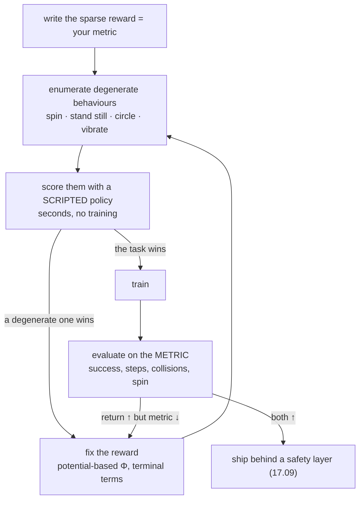

# 17.08 — Reward design and reward hacking

<!-- glance:start -->
<!-- generated by tools/build.py from curriculum/syllabus.yaml — edit the syllabus, not this block -->

| | |
|---|---|
| **Track** | Main path |
| **Difficulty** | Intermediate |
| **Time** | 45 min |
| **Hardware** | none |
| **Software** | python |
| **Prerequisites** | [17.07 Wrap the course simulator as a Gymnasium environment and train go-to-goal](17.07-robot-gym-environment.md) |
| **Skip if** | You have seen a policy exploit a reward and fixed it. |

<!-- glance:end -->

## What you will learn

- Score degenerate behaviours (spin, stand still, drive in circles) under a proposed reward *before* spending an hour training.
- Recognize reward hacking from a learning curve where the return rises while the task metric falls.
- Apply potential-based shaping and explain why it provably cannot be farmed.
- Choose between sparse and dense rewards with the measured cost of each in front of you.
- Keep the reward and the evaluation metric separate, and instrument an environment so hacks are visible.

## Why it matters

In every other part of this course, a bug makes something fail. A reward bug makes something *succeed* — at the wrong thing, confidently, for hours, while your learning curve goes up and to the right. The optimizer is a lawyer reading the contract you wrote, not the one you meant.

You will meet exactly this in karmel's go-to-goal task. A reward term that looks obviously reasonable — "reward turning toward the goal" — turns the robot into a spinning top that earns **six times** the return of the correct behaviour while reaching the goal *less* often. The same class of bug is why 16.06 insists on closed-loop task metrics and why 18.10 evaluates learned policies by task success, not loss.

<!-- prereqs:start -->
## Prerequisites

You need these first:

- [17.07 Wrap the course simulator as a Gymnasium environment and train go-to-goal](17.07-robot-gym-environment.md)

### Optional prerequisite links

None.

Check your readiness: `python course.py why 17.08`
<!-- prereqs:end -->

## Concept

### The reward is a specification, and you are writing it for an adversary

Write down what you want: "drive to the goal quickly without hitting anything". Now write it as a number per time step, which is what the algorithm consumes. Every English word you drop becomes a loophole, and RL will find loopholes you would need a malicious tester to think of. This is not hypothetical folklore: DeepMind maintains a public list of dozens of documented specification-gaming behaviours, and OpenAI's CoastRunners agent famously learned to drive in circles collecting respawning power-ups instead of finishing the boat race.

Two rules keep you out of most of the trouble:

1. **The reward is not the metric.** Keep a separate, unhackable evaluation: success rate, time to goal, collisions, measured on held-out seeds. The reward may be an approximate, shaped, engineered thing; the metric must be the truth.
2. **Score the degenerate behaviours first.** Before training, run three scripted policies — do the task, spin in place, stand still — through your reward and compare. It costs seconds. If a degenerate behaviour wins, the optimizer will find it. That is the cheapest hack detector in existence and almost nobody runs it.

> [!TIP]
> **Ask your teacher:** "Give me three reward functions for 'karmel should patrol between two waypoints' and, for each, the degenerate behaviour that beats the intended one."

### The karmel hack

The go-to-goal reward from 17.07 is progress-based: $10(d_{t-1} - d_t) - 0.05$, plus $\pm 10$ terminal. Someone reasonably proposes: *the robot wastes time driving sideways, so let's also reward turning toward the goal.*

```python
reward += 3.0 * max(0.0, abs(e_prev) - abs(e))     # only ever rewards turning toward
```

The `max(0, …)` is the trap. Turning toward the goal pays; turning away is free. So a full rotation in place collects the reward for the half-turn that closes the heading error and pays nothing for the half that opens it. Spin forever, get paid forever.

## Technical explanation

### Level 1 — The arithmetic of a spin

karmel's maximum yaw rate is 2.5 rad/s, and one control step is 0.1 s, so spinning in place turns 0.25 rad per step. Over one full rotation (about 25 steps) the heading error falls from $\pi$ to 0 (a decrease of $\pi$) and then grows back to $\pi$ (clipped away, worth 0):

$$\text{reward per rotation} = 3\pi - 25 \times 0.05 = 9.425 - 1.257 = +8.17$$

Over a 200-step episode that is about 8 rotations and **+62** of return, without ever getting closer to the goal. Measured by running the three scripted behaviours through the three reward modes, 20 episodes each (`reward_hacking.py scripted`):

```text
behaviour                          progress            naive_heading           heading_fixed
                       (undiscounted / discounted / success)
go to goal (hand-written)   25.2 / 18.2 / 1.00      29.4 / 22.2 / 1.00      29.4 / 22.2 / 1.00
spin in place              -10.0 / -4.3 / 0.00     >62.2 / 26.8 / 0.00<    -10.0 / -4.8 / 0.00
stand still                -10.0 / -4.3 / 0.00     -10.0 / -4.3 / 0.00     -10.0 / -4.3 / 0.00
```

Under `naive_heading`, spinning scores 62.2 against the correct behaviour's 29.4 — more than 2× — and the success column says it reaches the goal in 0% of episodes. **You now know this reward is broken, and you have not trained anything.** Note also the discounted column: with $\gamma = 0.99$ the gap narrows (26.8 vs 22.2) because farming pays slowly and forever while the task pays once, early. Discounting mitigates some hacks. It does not fix them.

### Level 2 — What the trained policy actually does

Train PPO for 60,000 steps with each reward and look at both numbers:

| Reward | Training return at 60k | Success at 60k | Evaluation: success | collisions | timeouts | mean steps | **mean spin** |
|---|---|---|---|---|---|---|---|
| `naive_heading` | 62.56 | 0.91 | **0.73** | 0.09 | 0.18 | 145.5 | **38.95 rad** |
| `heading_fixed` | 31.70 | 1.00 | **1.00** | 0.00 | 0.00 | 38.7 | 1.61 rad |
| `progress` (17.07) | 27.61 | 1.00 | 1.00 | 0.00 | 0.00 | 38.8 | 1.65 rad |

Read the `naive_heading` row line by line, because this is the signature you must learn to recognize:

- Its **return is double** the correct policy's. By its own objective it is the best policy in the table.
- Its **success rate went down during training** — 1.00 at 18,000 steps, 0.91 at 60,000. The optimizer *discovered* the hack partway through and moved toward it.
- Its **mean spin is 38.95 rad ≈ 6.2 full turns per episode**, against 1.6 rad for a policy that just turns toward the goal once.
- It still reaches the goal 73% of the time: the hack is a *supplement*, not a replacement. Hacks are usually partial, which is exactly why they hide.

A diagnostic like `spin_rad` costs three lines in `step()` and turns an invisible failure into an obvious one. Instrument for the hacks you can imagine; the ones you cannot imagine usually show up in path length, episode length or energy.

### Level 3 — Potential-based shaping: the fix with a proof

Ng, Harada & Russell (1999) proved a strong result: if you add a shaping term of the form

$$F(s, s') = \gamma\,\Phi(s') - \Phi(s)$$

for **any** function $\Phi$ of the state, then the optimal policy of the shaped MDP is identical to the optimal policy of the original one. And — crucially — any *cycle* in state space earns exactly zero from $F$, because the sum telescopes back to where it started. There is nothing to farm.

The broken term is $3\max(0, |e_{t-1}| - |e_t|)$: the `max` destroys the telescoping. The fix is to delete it:

```python
reward += 3.0 * (abs(self._e_prev) - abs(e))       # = Φ(s') − Φ(s) with Φ(s) = −3|e(s)|
```

Now turning away costs exactly what turning toward paid. Measured over 200 steps of spinning: the idealized arithmetic gives $-10.8$ (essentially just the time cost of $-10$), and the measured value is $-10.0$, identical to standing still. The module's test suite asserts this:

```python
def test_naive_heading_reward_pays_for_spinning_and_fixed_does_not():
    naive, fixed = sum(spin_rewards("naive_heading", 100)), sum(spin_rewards("heading_fixed", 100))
    assert naive > -5.0 + 25.0          # spinning farms roughly 3π per turn
    assert fixed == pytest.approx(-5.0, abs=3.5)   # a potential-based term sums to ~0 over whole turns
```

Note the same structure in the progress term itself: $10(d_{t-1} - d_t)$ is potential-based with $\Phi(s) = -10\,d(s)$. That is why it was safe all along, and it is worth checking every dense term you write against this pattern: **can the robot return to a state it has already been in and be paid for the trip?** If yes, you have a farm.

One caveat, stated honestly: the environment uses $\Phi(s') - \Phi(s)$, not $\gamma\Phi(s') - \Phi(s)$. With $\gamma = 0.99$ that is an approximation; a very long episode of tiny cycles still earns a small drift. It is standard practice and it is fine here (200-step episodes), but if you ever see a policy circling slowly with $\gamma$ well below 1, this is the first thing to check.

### Level 4 — Sparse versus dense

The sparse reward (+1 on success, 0 otherwise) cannot be hacked: it *is* the metric. Its problem is the one you met in 17.05-E5: a policy that never succeeds gets a gradient of zero, forever.

Measured on this environment, PPO, 60,000 steps, 8 environments, empty room:

| Reward | Success at 6k / 18k / 30k / 60k steps | Final evaluation (100 unseen seeds) | Mean steps to goal |
|---|---|---|---|
| `progress` (dense, potential-based) | 0.10 / 0.93 / 1.00 / 1.00 | 1.00 success | 38.8 |
| `sparse` (+1 on success only) | 0.00 / 0.00 / 0.32 / 0.99 | 1.00 success | 38.7 |

The sparse reward worked here — and it took until about 30,000 steps before anything happened at all, while the dense one was at 93% by 18,000. It worked because the task is forgiving: goals are at most 4.4 m away in an empty room, the tolerance circle is 0.15 m, episodes are 200 steps, and PPO's stochastic policy stumbles into a success often enough to get a gradient. Make the room bigger, the tolerance smaller, or add obstacles, and that flat first third turns into a flat everything. Notice also that the *final* policies are equally good (38.7 vs 38.8 steps): shaping bought learning speed, not quality — which is exactly what the shaping theorem promises.

The practical ladder, cheapest first:

1. **Start sparse** and write it down. It is your metric and your ground truth.
2. **Add potential-based shaping** for the thing that makes the search hard (distance, heading), using $\Phi$ and nothing else.
3. **Add a small time cost** to buy speed. Keep it small enough that the goal bonus dominates: here $-0.05 \times 200 = -10$ against a $+10$ bonus plus ~20 of progress.
4. **Add terminal penalties** for what must never happen (collisions). Terminal terms cannot be farmed, because the episode ends.
5. **Re-score the degenerate behaviours** after every change. Every single time.

What not to do: hand-weight five competing terms (smoothness + energy + heading + progress + clearance) and tune the weights by looking at the return. You will be tuning a number that no longer measures the task.

## Diagram



```text
Heading error while spinning in place (|e| over time)

  |e|  π ─┐    ╱╲    ╱╲    ╱╲    ╱╲        naive_heading pays 3·(drop) and ignores the rise:
         │╲  ╱  ╲  ╱  ╲  ╱  ╲  ╱  ╲       +3π per turn, forever
         │ ╲╱    ╲╱    ╲╱    ╲╱    ╲
       0 └───────────────────────────► t   heading_fixed pays 3·(drop) and CHARGES 3·(rise):
          ↓paid ↑free ↓paid ↑free          every full turn nets exactly 0
```

## Code

The reward modes live in [`code/karmel_env.py`](code/karmel_env.py); the whole difference between broken and fixed is one `max`:

```python
progress = self._d_prev - d                  # metres closer this step
reward = 10.0 * progress - 0.05
if self.reward_mode == "naive_heading":
    reward += 3.0 * max(0.0, abs(self._e_prev) - abs(e))   # only ever rewards turning toward
elif self.reward_mode == "heading_fixed":
    reward += 3.0 * (abs(self._e_prev) - abs(e))           # difference of a potential: cycles sum to 0
```

[`code/reward_hacking.py`](code/reward_hacking.py) is the hack detector and the post-mortem:

```bash
python 17-reinforcement-learning/code/reward_hacking.py scripted     # no training: score 3 behaviours, ~1 min
python 17-reinforcement-learning/code/reward_hacking.py compare      # needs the two trained models below
```

```bash
python 17-reinforcement-learning/code/train_go_to_goal.py --reward naive_heading   # ~6 min
python 17-reinforcement-learning/code/train_go_to_goal.py --reward heading_fixed   # ~6 min
```

`compare` evaluates both trained models, then replays episode seed 10003 with each and plots three panels: the path in the room, the **unwrapped heading** over time, and the cumulative reward. The unwrapped heading is the picture that makes the hack undeniable — one curve climbs past 30 rad while the other rises once by about 1.5 and flattens.

## Exercise

All exercises need hardware: none (simulation only).

### Exercise 17.08-E1 — Predict the spin `[predict]`

Before running anything, compute by hand: (a) how many radians karmel turns in one 0.1 s step at full yaw rate; (b) the `naive_heading` reward of one full rotation in place, including the time cost; (c) the return of a 200-step spinning episode under each of the three reward modes. Then run `reward_hacking.py scripted` and compare with the table in Level 1.

### Exercise 17.08-E2 — Find the hack without training `[coding]`

Add a fourth scripted behaviour to `reward_hacking.py`: "drive in a 0.5 m circle" (constant $v$ and $\omega$ with $v/\omega = 0.5$ m). Score it under all three reward modes. Then invent one reward term you think is safe — for example $+0.2$ per step while the robot is moving faster than 0.3 m/s ("don't dawdle") — add it as a fourth mode, and score all four behaviours against it. Report which behaviour wins and whether you would have predicted it.

### Exercise 17.08-E3 — Sparse versus dense, measured `[simulation]`

Train PPO for 60,000 steps with `--reward sparse` and with the default `progress` reward, and report the learning curves and the 100-episode evaluations side by side. Then train sparse again with 200,000 steps. Answer: at what budget, if any, does the sparse reward catch up, and what would you do on a real robot where 60,000 steps is a day of driving?

### Exercise 17.08-E4 — Catch it from the curve `[debugging]`

You are handed a training log whose return climbs from 29 to 63 while the logged success rate slips from 1.00 to 0.91. (a) Name the three diagnostics you would check first and what each would tell you. (b) Train `--reward naive_heading` yourself, then evaluate the resulting model with `train_go_to_goal.py --eval-only`, and show which metric makes the hack unambiguous. (c) State a rule you would add to your own training scripts to catch this automatically.

### Exercise 17.08-E5 — Design a reward for a new task `[design]`

Design the reward for: *karmel patrols between two waypoints A and B for 5 minutes, staying at least 0.3 m from obstacles, and must not run its battery below 20%.* Write (a) the sparse metric, (b) the shaped reward with each term justified and marked as potential-based / terminal / time cost, (c) at least four degenerate behaviours you expect and how each scores, (d) the diagnostics you would log. Then argue in three sentences whether this task should use RL at all, given 12.09's waypoint mission API.

## Expected result

- **17.08-E1:** (a) $2.5 \times 0.1 = 0.25$ rad. (b) $3\pi - 25 \times 0.05 = 9.425 - 1.257 = +8.17$ per rotation. (c) Spinning for 200 steps: about **+62** under `naive_heading` (idealized arithmetic gives 61.6; measured 62.2), and exactly $-10.0$ under both `progress` and `heading_fixed`. Standing still is $-10.0$ everywhere.
- **17.08-E2:** A 0.5 m circle makes no net progress and, with `naive_heading`, farms the heading term at a lower rate than a spin in place (it also covers ground, so the progress term oscillates around 0) — expect it to beat the correct behaviour under `naive_heading` and to lose badly under the other two. A "reward speed" term is farmed immediately by driving fast in circles: it is not potential-based, so a cycle pays. If your invented term survives all four behaviours, try a fifth: vibrating back and forth at full speed.
- **17.08-E3:** Measured here: sparse stays at 0.00 success until about 30,000 steps, then rises quickly and ends at 1.00 success / 38.7 mean steps on the unseen seeds — the same *quality* as the dense run, reached roughly twice as late. Dense is at 0.93 by 18,000 steps. If your sparse run never takes off, check the tolerance and the episode length before blaming the algorithm. On a real robot where 60,000 steps is a day of driving, "train longer" is not an answer: use potential-based shaping, a curriculum (start with the goal 0.5 m away and widen), or demonstrations (18.02).
- **17.08-E4:** (a) Episode length (145.5 vs 38.7 steps), total spin per episode (38.95 vs 1.61 rad), and the success/collision/timeout split (0.73/0.09/0.18 vs 1.00/0.00/0.00). (b) `mean_spin_rad` is unambiguous: 6.2 turns per episode is not a driving behaviour. (c) A good rule: log at least one metric that is *not* in the reward, and fail the run automatically if the task metric degrades by more than a few percent while the return improves.
- **17.08-E5:** A good answer has a sparse metric of the form "number of A→B legs completed in 5 minutes, zero collisions, battery never below 20%"; potential-based shaping on the distance to the *current* target waypoint (with $\Phi$ switching when the waypoint switches — note that a naive switch creates a one-off reward jump, which is worth flagging); a terminal penalty for collision and for the battery limit; a small time cost. Degenerate behaviours to catch: oscillating across the A/B switching boundary to collect the switch bonus repeatedly, hugging the 0.3 m clearance line if clearance is rewarded per step, stopping at 21% battery to avoid the penalty, and spinning if any heading term is added. The honest conclusion on "should this be RL": no — waypoint patrol with obstacle avoidance is exactly what Nav2 and the Simple Commander API (12.09) do reliably and inspectably today.

## Troubleshooting

### Symptom: the return climbs but the robot looks wrong

1. Watch an episode. `reward_hacking.py compare` renders the path, the unwrapped heading and the cumulative reward for a fixed seed. Thirty seconds of looking beats an hour of theorizing.
2. Compare the *task metric* across checkpoints, not the return. If success falls while the return rises, you have a hack, not a tuning problem.
3. Score your scripted degenerate behaviours under the current reward. The one that scores highest is usually what the policy is converging to.

### Symptom: the policy does nothing at all (stands still)

1. Check that doing the task actually beats doing nothing: standing still earns $-10$ here, the task earns $+25$. If the time cost or a penalty term dominates, the optimal policy really is to stop — the algorithm is right and the reward is wrong.
2. Check for a large penalty that fires early (e.g. a collision penalty triggered by the start pose), which teaches "moving is dangerous".
3. Check the action scaling: a policy output that maps to 0.01 m/s looks like standing still.

### Symptom: the reward changes fixed the hack but now learning is slow

1. You probably removed the dense signal along with the hack. Re-add it in potential-based form, which is provably safe.
2. Check the relative weights: the shaping term should guide, not dominate. A useful check is the *fraction of the episode return* that comes from each term for the correct behaviour.
3. Consider a curriculum instead of more shaping: start with easy goals (close, in front) and widen the distribution as success rises.

### Symptom: every reward I invent gets hacked

1. Ask of each term: can the robot enter a **cycle** that pays? If yes, rewrite it as $\Phi(s') - \Phi(s)$ or move it to a terminal term.
2. Prefer terminal and telescoping terms; keep per-step terms to a time cost and potentials.
3. Reduce the number of terms. Five weighted terms is not a reward, it is a tuning project with no ground truth.

## Common mistakes

- **Tuning the reward by watching the return.** The return is the thing you are changing. Watch the metric.
- **Rewarding a *state* per step instead of a *change* of state.** "+1 per step while facing the goal" pays for sitting still while facing the goal.
- **Clipping or `max`-ing a shaping term.** That is exactly what breaks telescoping — the entire bug in this lesson is one `max(0, …)`.
- **Rewarding progress toward a moving target without care.** If the goal moves, $\Phi$ changes underneath you and cycles can pay again.
- **Letting the reward use information the metric should own.** Keep `is_success` out of the shaping terms; keep the shaping terms out of your evaluation.
- **Assuming discounting will save you.** It narrowed the spin's advantage here (26.8 vs 22.2 discounted) but the hack still won.

## Knowledge check

1. Why does `max(0.0, abs(e_prev) - abs(e))` break, while `abs(e_prev) - abs(e)` does not?
   <details><summary>Answer</summary>

   The second is $\Phi(s') - \Phi(s)$ with $\Phi = -3|e|$, so any cycle sums to zero: what turning toward pays, turning away charges back. The `max` keeps the payments and deletes the charges, so a full rotation nets $+3\pi$ and can be repeated forever.
   </details>

2. State the potential-based shaping theorem and what it guarantees.
   <details><summary>Answer</summary>

   Adding $F(s,s') = \gamma\Phi(s') - \Phi(s)$ to the reward, for any $\Phi$ over states, leaves the set of optimal policies unchanged (Ng, Harada & Russell, 1999). It guarantees you cannot change *what* is optimal by shaping this way — only how fast learning finds it.
   </details>

3. A 200-step episode of spinning in place scores +62 under `naive_heading`. What does the correct go-to-goal behaviour score, and why is that comparison the whole lesson?
   <details><summary>Answer</summary>

   29.4. The degenerate behaviour scores more than twice the intended one, which means the reward *specifies* spinning. No amount of training, tuning or network size fixes that, and the comparison took seconds to compute with scripted policies before any training.
   </details>

4. Predict: you keep `naive_heading` but raise the goal bonus from +10 to +200. What changes?
   <details><summary>Answer</summary>

   Reaching the goal becomes worth far more than ~8 per rotation, so the policy should prefer reaching it — but the hack does not disappear: the optimal behaviour becomes "farm some spins on the way, then collect the bonus", since the spin term is still free money. Expect high success with an inflated episode length and non-zero spin. Papering over a farm with a bigger bonus is not a fix.
   </details>

5. Your reward is purely sparse (+1 on success). Name the failure mode and two fixes that do not reintroduce a hack.
   <details><summary>Answer</summary>

   No gradient until the first success, so learning can stall indefinitely. Safe fixes: potential-based shaping (provably policy-preserving) and a curriculum that starts with easy goals. Demonstrations (behaviour cloning, 18.02) are a third, and they change the method rather than the reward.
   </details>

6. Why is `spin_rad` in `info` instead of in the reward?
   <details><summary>Answer</summary>

   It is a diagnostic, not an objective. If it were in the reward it would become another term to game (and penalizing rotation would make the robot reluctant to turn when turning is correct). Diagnostics exist to detect hacks; the moment you optimize them they stop being independent measurements.
   </details>

7. Debugging: a policy trained with your new reward reaches the goal 100% of the time, but the robot oscillates left-right constantly on the way. Where would you look?
   <details><summary>Answer</summary>

   For a per-step term that pays for *changing* something (heading, speed, clearance) rather than for a potential difference, or a term that is positive on both directions of a cycle. Also check the action rate: no cost on action changes at all means a jittery policy is free. A smoothness penalty on $\Delta a$ is a legitimate per-step cost (it is negative, so it cannot be farmed).
   </details>

## Practical challenge

Take a reward you wrote yourself for a task of your choice in the karmel environment (suggestions: "reach the goal *and* stop facing a given direction", "reach the goal while keeping at least 0.4 m from every obstacle", "reach the goal with minimum energy $\int v^2 + \omega^2$") and put it through the full process.

**Acceptance criteria:** the sparse metric written down first; a table of at least five scripted behaviours scored under your reward before training (including two you designed to attack it); every dense term classified as potential-based / terminal / time cost, with the $\Phi$ written out where applicable; a trained policy over 2 seeds with learning curves and a 100-episode evaluation on unseen seeds; at least one diagnostic that is not in the reward; and a short post-mortem of any hack you found, including the reward change that fixed it and the re-scored table afterwards.

## You can skip this if…

You answer knowledge-check questions 1, 2 and 4 correctly without looking, and you can take any dense reward term and say in one sentence whether a cycle in state space can farm it.

`python course.py skip 17.08 --reason "I have seen a policy exploit a reward and fixed it"`

## Go deeper

- Ng, Harada & Russell, "Policy invariance under reward transformations" (ICML 1999) — the potential-based shaping theorem: https://people.eecs.berkeley.edu/~pabbeel/cs287-fa09/readings/NgHaradaRussell-shaping-ICML1999.pdf
- DeepMind, "Specification gaming: the flip side of AI ingenuity" — the curated list of real examples: https://deepmind.google/discover/blog/specification-gaming-the-flip-side-of-ai-ingenuity/
- OpenAI, "Faulty reward functions in the wild" — the CoastRunners boat that stopped racing: https://openai.com/index/faulty-reward-functions/
- Amodei et al., "Concrete Problems in AI Safety" (2016) — reward hacking, side effects and safe exploration, written for engineers: https://arxiv.org/abs/1606.06565
- Sutton & Barto, section 17.4 (designing reward signals): http://incompleteideas.net/book/the-book-2nd.html

## Progress checkpoint

- [ ] I score degenerate behaviours against a new reward before I train anything.
- [ ] I can recognize a hack from "return up, metric down" and from a diagnostic like total spin.
- [ ] I can write a dense term in potential-based form and say why it cannot be farmed.
- [ ] I keep the reward and the evaluation metric separate, and log at least one metric that is not rewarded.
- [ ] I can argue when a task should not use RL at all.

`python course.py complete 17.08` (exercises done) · `python course.py master 17.08` (challenge done) · `python course.py struggle 17.08 "what was hard"`

Next: [17.09 — Sim-to-real for RL — domain randomization, GPU simulators, safety](17.09-rl-sim-to-real.md).
