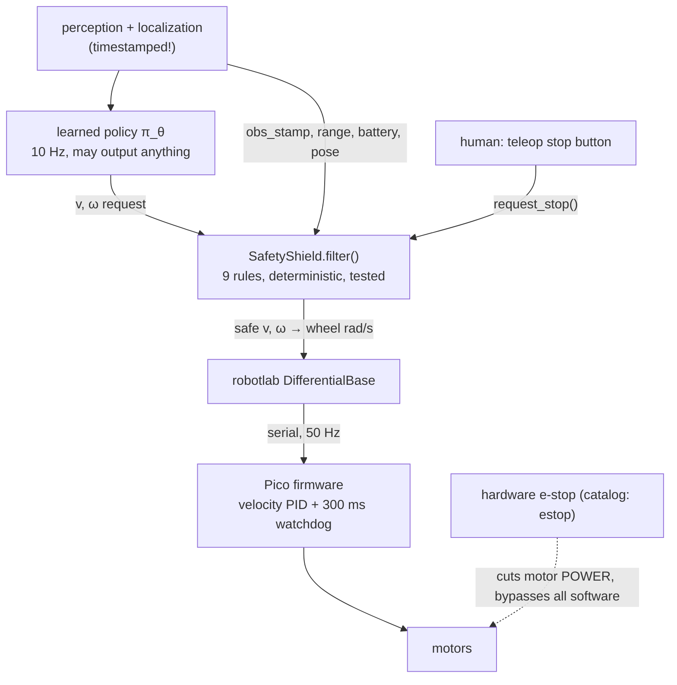

# 17.09 — Sim-to-real for RL — domain randomization, GPU simulators, safety

<!-- glance:start -->
<!-- generated by tools/build.py from curriculum/syllabus.yaml — edit the syllabus, not this block -->

| | |
|---|---|
| **Track** | Main path |
| **Difficulty** | Advanced |
| **Time** | 1 h |
| **Hardware** | none |
| **Software** | none |
| **Prerequisites** | [17.08 Reward design and reward hacking](17.08-reward-design.md)<br>[06.10 The sim-to-real gap — what transfers and what doesn't](../06-simulation/06.10-sim-to-real-gap.md) |
| **Version-sensitive** | yes — see [curriculum/versions.yaml](../curriculum/versions.yaml) |
| **Skip if** | You can plan a sim-to-real RL deployment with safety layers. |

<!-- glance:end -->

## What you will learn

- Name the specific mismatches that break a sim-trained driving policy, and rank them by how much damage they do.
- Measure a robot's real parameters with two short test drives and centre your randomization ranges on what you measured.
- Evaluate a policy on a panel of "test robots", including ones outside the training distribution, and read the failure edge.
- Say what a GPU-parallel simulator changes about the workflow and what it does not.
- Put a learned policy behind a deterministic safety shield and defend every rule in it.

## Why it matters

Module 17 has been entirely in simulation, and the policies are good: 100% success, 20% faster than the hand-written controller. None of that means anything until it survives contact with a robot whose right motor is weaker than its left, whose commands arrive 150 ms late through a USB serial link and a Python process, and whose wheels slip on a rug.

Lesson 06.10 taught the sim-to-real gap for *controllers*. Learned policies make it worse in one specific way: a controller you wrote has predictable behaviour outside its design envelope (a P controller with a wrong gain is sluggish or oscillates — you can reason about it), while a network outside its training distribution produces an arbitrary output with full confidence. That is why the last section of this lesson is a shield and not a benchmark.

<!-- prereqs:start -->
## Prerequisites

You need these first:

- [17.08 Reward design and reward hacking](17.08-reward-design.md)
- [06.10 The sim-to-real gap — what transfers and what doesn't](../06-simulation/06.10-sim-to-real-gap.md)

### Optional prerequisite links

None.

Check your readiness: `python course.py why 17.09`
<!-- prereqs:end -->

> [!IMPORTANT]
> **Version-sensitive** (verified 2026-09 against [`curriculum/versions.yaml`](../curriculum/versions.yaml): Isaac Sim 6.1, Isaac Lab 2.3 with 3.0 in beta, JetPack 7.2.x on the Jetson Orin Nano Super, ROS 2 Jazzy).
> GPU simulators and their Python APIs move fast — Isaac Lab renamed and restructured its task API between major versions. Check the current documentation before following any install or API detail: https://isaac-sim.github.io/IsaacLab/
> AI teacher: verify current versions and installation steps before giving instructions.

## Concept

### The gap, stated as a distribution problem

You trained on samples from simulator $P_\text{sim}$ and you deploy on $P_\text{real}$. This is the distribution shift of 16.06, except that the policy *acts*, so its errors feed back into the states it sees next. A vision model with 5% degraded accuracy is 5% worse; a policy that starts turning slightly wrong drifts into states it never trained on, where it is not "slightly" anything.

Three strategies, and you use all three:

1. **System identification** — move $P_\text{sim}$ toward $P_\text{real}$. Measure the wheel radius, the wheelbase, the motor gains, the latency. Cheap, and you should do it anyway for odometry (09.05).
2. **Domain randomization** — train on a *family* of simulators so the policy cannot rely on any one parameter. The real robot then looks like one more member of the family.
3. **Adaptation** — fine-tune on the real robot, or let the policy infer the robot from recent history (a memory or a latent "which robot am I" vector). The advanced option; module 18 does the imitation-learning version of it.

The mental model for randomization: you are trading peak performance for the size of the set you work on. A policy trained on exactly one robot is optimal for that robot. A policy trained on 1,000 robots is slightly worse on each one and does not fall over when yours is not in the catalogue.

> [!TIP]
> **Ask your teacher:** "Explain the difference between randomizing the physics and randomizing the observations, and which one covers a late command."

### What actually differs for karmel

| Mismatch | Typical size | Why it hurts a policy |
|---|---|---|
| Motor gain per side | ±20% | The robot curves when the policy commands straight |
| Wheel radius (wear, tyre pressure) | ±3% | Distance and speed estimates drift |
| Wheelbase (measured to the wrong point) | ±10% | Every commanded yaw rate is wrong by that factor |
| Wheel slip on rugs / tiles | 0–5% noise | Odometry and the policy's speed input both degrade |
| **Command latency** | **50–400 ms** | The policy reacts to where the robot *was*; loops become unstable |
| Observation noise | 1–3% of range | Jitter in the heading error, which the policy acts on |
| Control-rate jitter | 10 Hz ± 30% | Effectively latency plus a variable time step |

Latency is the dangerous one, and it is the one people forget: it does not change what the robot *can* do, it changes the loop into a delayed feedback system, which is the classic route to oscillation (08.07).

## Technical explanation

### Level 1 — Randomization ranges, and where they come from

`karmel_env.py` samples a new hidden robot at every `reset()` when `randomize=True`:

```python
@dataclass(frozen=True)
class Randomization:
    motor_gain: tuple[float, float] = (0.80, 1.05)          # per motor, independently
    wheel_radius_scale: tuple[float, float] = (0.97, 1.03)  # per wheel
    wheel_separation_scale: tuple[float, float] = (0.95, 1.10)
    slip_std: tuple[float, float] = (0.0, 0.05)
    obs_noise_std: tuple[float, float] = (0.0, 0.03)        # on every observation entry
    action_delay_steps: tuple[int, int] = (0, 4)            # 0..4 control steps = 0-400 ms
```

Each range answers "how wrong could my measurement of this be, plus how much could it change during a session?". Ranges that are too narrow give you a fragile policy; ranges that are too wide give you a cautious, slow policy that has to survive robots that do not exist (train a policy for a robot whose right motor might be 3× weaker than its left, and it will crawl).

### Level 2 — Measure first: system identification with two test drives

`domain_randomization.py sysid` identifies a hidden robot the way you would identify a real one, using only measurements you can actually take at home:

**Test 1 — drive straight 0.3 m/s for 5 s.** Compare the distance the encoders *claim* with the distance a tape measure reports. The ratio is the effective wheel-radius scale.

**Test 2 — spin in place for 4 s.** Integrate the gyro (bias measured while standing still first) to get the true yaw, and compare with the wheel-travel difference. $\omega = (d_\text{right} - d_\text{left})/b$ gives the effective wheelbase.

Measured against a hidden robot whose true parameters were radius scale 1.0015 and wheelbase scale 1.0700:

```text
test 1: encoders say 1.519 m, tape measure says 1.517 m -> radius scale 0.9986
test 2: gyro yaw 5.777 rad (wrapped -0.506; true final heading -0.507),
        wheel travel difference 1.235 m -> wheelbase 0.2137 m, scale 1.0685
randomize around what you measured, e.g. wheel_separation_scale U(1.04, 1.10)
instead of a blind U(0.90, 1.20)
```

The wheelbase estimate is 1.0685 against a truth of 1.0700 — a 0.14% error from a 4-second spin. Note the detail that makes it work: the gyro yaw is **unwrapped** (5.777 rad, not the wrapped −0.506). Integrating a rate gives you total rotation; comparing it with a heading angle is the classic off-by-$2\pi$ bug.

Now the randomization range is $\pm 0.03$ around a measured 1.07 instead of $\pm 0.15$ around a guessed 1.00. Narrower *and* centred on the truth: better robustness and better peak performance at the same time. **System identification is not an alternative to randomization; it is what tells you where to centre it.**

### Level 3 — Measured: does randomization buy anything?

Three policies — the hand-written controller, PPO trained on the nominal simulator (60k steps), and PPO trained with randomization (100k steps) — evaluated on a panel of test robots, 50 episodes each, held-out seeds. Cells are success rate / mean steps to goal:

| Test robot | hand-written | PPO nominal | PPO randomized |
|---|---|---|---|
| nominal (training sim) | 1.00 / 48.3 | 1.00 / 39.0 | 1.00 / 39.7 |
| `realistic()` preset (the course's own imperfect robot) | 1.00 / 49.0 | 1.00 / 39.2 | 1.00 / 39.8 |
| 100 ms command latency | 1.00 / 47.6 | 1.00 / 40.7 | 1.00 / 40.6 |
| 200 ms latency + 3% observation noise | 1.00 / 48.8 | 1.00 / 45.7 | 1.00 / 43.6 |
| worn: right motor 0.8, wheelbase +10%, 5% slip, 100 ms latency | 1.00 / 49.3 | 1.00 / 41.1 | 1.00 / 41.1 |
| 400 ms latency (edge of the training range) | 1.00 / 53.5 | 0.98 / 60.0 | 1.00 / 53.7 |
| **outside ranges:** 500 ms latency | 1.00 / 63.8 | 0.98 / 89.3 | 1.00 / 72.6 |
| **outside ranges:** 600 ms latency | 1.00 / 107.0 | **0.12** / 86.8 | **0.58** / 79.0 |
| **outside ranges:** 10% observation noise | 1.00 / 55.0 | 1.00 / 39.1 | 1.00 / 39.9 |

Four conclusions, in order of importance:

1. **Inside the training distribution, both learned policies are fine and randomization costs almost nothing** (39.0 → 39.7 steps on the nominal robot). That is the trade being made, and here it is cheap.
2. **At the edge, randomization is worth 2 percentage points and 6 steps** (400 ms: 1.00/53.7 vs 0.98/60.0).
3. **Just outside it, the nominal policy falls off a cliff: 0.12 success at 600 ms.** The randomized one degrades instead of collapsing (0.58). Randomization does not extend the envelope indefinitely; it softens the wall at its edge. Plan your ranges to *contain* reality with margin, and verify the margin.
4. **The hand-written controller never fails anywhere** — it just gets slow (107 steps at 600 ms). Read that line twice before you deploy a network. A simple feedback law has graceful degradation for free, which is why the safety layer below is a hand-written controller of last resort, not a second network.

Observation noise of 10% (3× the training range) barely mattered, because the policy mostly needs the *direction* of the goal, which is robust to noise. Not every out-of-distribution parameter is dangerous; measure which ones are.

### Level 4 — GPU-parallel simulators

The runs in this module used 8 CPU processes and ~140–900 environment steps per second. Isaac Lab (on Isaac Sim, NVIDIA GPUs) runs thousands of environments *inside the GPU*, keeping observations and actions in GPU memory so there is no per-step Python round trip, and reaches millions of steps per second on contact-rich tasks. That changes the workflow qualitatively:

- Domain randomization becomes cheap enough to be per-environment rather than per-run: 4,096 robots, all different, every reset.
- PPO with huge batches becomes the default algorithm again (sample efficiency stops mattering when samples are nearly free; throughput is everything). This is the opposite of the conclusion in 17.06 for a slow simulator.
- Training runs that take hours on a laptop take minutes, so the bottleneck moves to *you*: reward design (17.08) and the environment's fidelity.

What it does not change: your reward is still your specification, contact-rich and deformable things (cables, carpet, cloth) are still hard to simulate accurately, and the sim-to-real gap still exists — ANYmal and quadruped locomotion results rely on heavy randomization and careful actuator models, not on the GPU.

For this course's hardware (Jetson Orin Nano Super, JetPack 7.2.x), Isaac Lab training happens on a desktop GPU or in the cloud; the Jetson is for *inference*, which is where 16.04's edge-deployment numbers apply.

### Level 5 — The safety layer, which is not optional

> [!CAUTION]
> **Safety:** before the first run of any learned policy on the real robot: wheels off the ground on a stand, a human with a finger on the hardware e-stop (catalog item `estop`), the deployment speed limit set to half the robot's maximum, and the area clear of people and pets. Read [SAFETY.md](../SAFETY.md) again — a learned policy is exactly the case those rules were written for.

A learned policy is an untested function approximator. It can output NaN when an observation is NaN, full speed when localization jumps, or a perfectly reasonable command 400 ms too late. It never talks to the motors. Every cycle passes through [`code/safety_layer.py`](code/safety_layer.py), which applies these rules in order and reports which fired:

| # | Rule | Fires when | Action |
|---|---|---|---|
| 1 | e-stop latched | a human or a supervisor requested a stop | zero, until a **human** calls `reset()` |
| 2 | stale observation | the newest observation is older than 250 ms | stop (ramped at 4×) |
| 3 | non-finite | NaN/inf in the command | stop |
| 4 | low battery | below the config's warning voltage | stop |
| 5 | velocity limits | \|v\| > 0.25 m/s or \|ω\| > 1.5 rad/s | clamp (half the robot's maximum) |
| 6 | obstacle stop | front range < 0.30 m while driving forward | v = 0, turning still allowed |
| 7 | geofence | position outside the allowed box *and* heading further out | v = 0 |
| 8 | acceleration limit | command changes faster than 0.5 m/s², 3 rad/s² | ramp |
| 9 | violation budget | rules 2, 3, 4, 6 or 7 fire 50 cycles in a row (5 s at 10 Hz) | latch the e-stop |

Two design points that are easy to get wrong:

- **Clamping is normal; repeated blocking is not.** Rules 5 and 8 fire constantly in healthy operation and are not counted as violations. The budget in rule 9 exists so that a policy which is *permanently* being blocked (driving into a wall for five seconds) ends up stopped rather than grinding forever.
- **The shield is not the last line of defence.** Below it, the Pico firmware's 300 ms watchdog stops the wheels if this process hangs, and below that, the hardware e-stop cuts motor power independently of all software. Three layers, each with a different failure assumption.

Measured run of a deliberately misbehaving policy (full speed, a 3-cycle NaN burst, into a wall, then a hard spin, with a teleop stop at step 130):

```text
step  v sent  w sent  rules fired
   1   0.050   0.000  velocity_limit, accel_limit      <- 1.0 m/s requested, 0.25 allowed, ramped
   5   0.250   0.000  velocity_limit
  30   0.050   0.000  non_finite, accel_limit          <- NaN caught, ramped down at 4x
  31   0.000   0.000  non_finite
  71   0.200   0.000  velocity_limit, obstacle_stop, accel_limit
  75   0.000   0.000  velocity_limit, obstacle_stop    <- stopped 0.30 m from the wall
 104   0.000   1.500  velocity_limit                   <- 6 rad/s requested, 1.5 allowed
 130   0.000   0.000  estop_latched                    <- human pressed stop; stays latched
```

and the frozen-perception case, which is the one that scares people in production:

```text
  41   0.200   0.000  -
  42   0.000   0.000  stale_observation                <- camera pipeline froze at step 40
  43   0.000   0.000  stale_observation
```

The robot stopped 250 ms after the observations stopped arriving, without anybody noticing anything else was wrong.

## Diagram



```text
Why latency destabilizes a learned loop (400 ms = 4 control steps)

  command:  ──►│ turn left │ turn left │ turn left │ turn left │ turn right │
  applied:      ····························►│ turn left │ turn left │ ...
                 the robot is still turning left while the policy, seeing the
                 overshoot, is already asking for right → oscillation

  The fix during TRAINING: sample the delay per episode (action_delay_steps 0..4),
  so the policy learns to act on where the robot WILL be, not where it is.
```

## Code

[`code/domain_randomization.py`](code/domain_randomization.py) — identification and the robustness panel:

```bash
python 17-reinforcement-learning/code/domain_randomization.py sysid            # ~10 s, no training needed
python 17-reinforcement-learning/code/domain_randomization.py robustness       # needs the two models below
python 17-reinforcement-learning/code/train_go_to_goal.py                      # nominal, 60k steps
python 17-reinforcement-learning/code/train_go_to_goal.py --randomize --steps 100000   # ~14 min
```

[`code/safety_layer.py`](code/safety_layer.py) — the shield, ~200 lines, no ROS, fully unit-tested in `code/test_rl_code.py`:

```python
shield = SafetyShield(ShieldConfig.from_config(cfg, geofence=(0.3, 0.3, 2.7, 2.7)))
v, w, fired = shield.filter(ShieldInput(
    now=state.t, obs_stamp=obs_stamp, v_cmd=v_cmd, w_cmd=w_cmd,
    front_range_m=state.range_m, battery_v=state.battery_v, x=x, y=y, theta=theta))
```

```bash
python 17-reinforcement-learning/code/safety_layer.py     # drives a misbehaving policy through the shield
python -m pytest 17-reinforcement-learning/code           # the module's tests, including the shield's
```

Note what `run_with_shield` does even when the shield is holding the robot still: it sends a wheel command on **every** 20 ms cycle. The firmware watchdog stops the motors after 300 ms of silence, so "send nothing" and "send zero" are different things — the first is a failure mode, the second is a decision.

## Exercise

All exercises need hardware: none (everything runs in simulation; the deployment plan in E5 is written, not executed).

### Exercise 17.09-E1 — Predict the robustness table `[predict]`

Before running: predict, for the nominal-trained PPO policy, its success rate at (a) 100 ms latency, (b) 400 ms latency, (c) 600 ms latency, (d) 10% observation noise. Then predict the same four for the randomized policy, and for the hand-written controller. Run `domain_randomization.py robustness` and compare. Which of your predictions was most wrong, and what does that tell you about your intuition for out-of-distribution behaviour?

### Exercise 17.09-E2 — Identify a robot `[simulation]`

Run `domain_randomization.py sysid` and read the code. Then: (a) change the hidden robot's `wheel_separation_scale` to 0.93 and re-run — does the estimate track it? (b) Add a gyro bias of 0.02 rad/s and *skip* the bias-measurement step; how large is the wheelbase error after a 4-second spin? (c) Propose a third test drive that would identify the per-motor gain asymmetry, and say what you would measure.

### Exercise 17.09-E3 — Choose the ranges `[design]`

You measured your own karmel: wheel radius scale 1.02 ± 0.01, wheelbase scale 1.07 ± 0.02, a command latency of 120 ms ± 40 ms measured by timestamping a command and its first encoder response, and battery-dependent motor gain falling about 8% between full and low battery. Write the `Randomization` dataclass you would train with, justify every range in one line, and state which parameter you would *not* randomize and why. Then say how you would verify, before deployment, that reality is inside your ranges.

### Exercise 17.09-E4 — Extend the shield `[coding]`

Add two rules to `SafetyShield` and a test for each in the style of `code/test_rl_code.py`: (a) **command rate limit** — if `filter` has not been called for more than 0.5 s, treat the first new command as a fresh start (ramp from zero) rather than continuing from the old velocity; (b) **stuck detection** — if the commanded speed has been above 0.1 m/s for 3 s while the measured speed stayed below 0.02 m/s, stop and latch. State, for each rule, which real failure it protects against and what it would cost you in false positives.

### Exercise 17.09-E5 — Write the deployment plan `[design]`

Write the one-page plan you would follow to put the 17.07 policy on the real karmel, covering: the hardware checklist (stand, e-stop, fuse, battery state, clear area), the software layers and their timeouts, the exact sequence of test steps from wheels-up to 2 m of free driving, the abort criteria for each step, what you log so a failure can be diagnosed afterwards, and the three measurements you would take *before* the first powered run to check that the robot is inside your randomization ranges. Then state the decision rule: what result would make you go back to simulation?

## Expected result

- **17.09-E1:** Measured: nominal PPO is 1.00 at 100 ms, 0.98 at 400 ms, **0.12** at 600 ms, 1.00 at 10% noise. Randomized PPO: 1.00 / 1.00 / 0.58 / 1.00. Hand-written: 1.00 everywhere, degrading only in steps (48 → 107). Most people underestimate the cliff at 600 ms and overestimate the damage from observation noise. The lesson is that out-of-distribution behaviour is not a smooth extrapolation of in-distribution behaviour.
- **17.09-E2:** (a) Yes — the estimator is a ratio of measured yaw to wheel-travel difference and tracks any scale; expect an error well under 1% (the measured example: 1.0685 estimated vs 1.0700 true). (b) A 0.02 rad/s bias over 4.5 s of integration adds about 0.09 rad to a 5.78 rad yaw (~1.6%), so the wheelbase is estimated about 1.6% low — enough to matter for a dead-reckoning robot, which is why 07.05 measures the bias first. (c) Drive each wheel alone at a fixed command and measure the distance travelled, or drive both at the same command and measure the arc radius: the curvature gives the gain ratio directly.
- **17.09-E3:** A good answer centres every range on the measurement and sizes it from the uncertainty plus expected drift: radius scale U(1.00, 1.04), wheelbase U(1.04, 1.10), `action_delay_steps` 0–3 (covering 0–300 ms around a measured 120 ms, with margin for a slow perception frame), motor gain U(0.85, 1.05) to cover the battery droop, slip U(0, 0.05) for the rug. Do not randomize things you control exactly, such as the control period, unless you actually observe jitter. Verification before deployment: re-run the two sysid drives on the *deployment* battery state, and time the command→response loop with timestamps for a few hundred cycles, checking that the 99th percentile is inside the trained delay range.
- **17.09-E4:** (a) Protects against a hung control process that resumes: without the rule, the shield's remembered velocity makes it ramp from a stale value; the cost is a slightly slower restart. (b) Protects against a stalled wheel, a robot caught on a cable or a wedged caster — which drains the battery and burns the motor driver; the cost is false positives when the robot is legitimately pushing something, so it must be configurable per task. Both tests should be deterministic and run in milliseconds, like the existing ones.
- **17.09-E5:** A complete plan names, at minimum: wheels-up first test (the policy runs, watch the wheel directions match the intent), then a 0.25 m/s limit on the floor with a 1 m geofence and a human on the e-stop, then widening. Abort criteria per step, e.g. "any rule 2/3/4 firing", "any unexpected reverse", "spin exceeding 2 rad in one episode". Logs: every `ShieldInput`, every `fired` tuple, the raw policy output, the observation with its timestamp, and the battery voltage — enough to replay the episode offline. Pre-run measurements: the two sysid drives and the command→response latency. Decision rule: if the rules fire in normal operation, or the policy's behaviour differs qualitatively from the simulation, go back to simulation and fix the model — do not tune the shield until the policy looks acceptable.

## Troubleshooting

### Symptom: the policy works in simulation and oscillates on the robot

1. Measure the latency first: timestamp a command and the first encoder change it causes, over a few hundred cycles, and look at the 99th percentile, not the mean. If it exceeds your trained `action_delay_steps` range, that is your answer.
2. Check the control rate actually achieved on the Pi (log the loop period). A policy trained at a fixed 10 Hz on a loop that actually runs at 6–14 Hz sees a different world.
3. Re-train with the measured latency range included. Do not "fix" it by lowering the speed limit alone — that hides the instability instead of removing it.

### Symptom: the policy drives in a curve when commanded straight

1. Per-side motor gain or wheel radius mismatch: run the sysid drives. Then decide whether to fix it in calibration (better) or to cover it by randomization (necessary anyway).
2. Check the wheelbase used by the environment's inverse kinematics against the measured one. A 10% wheelbase error is a 10% yaw-rate error on every command.

### Symptom: the randomized policy is much slower than the nominal one

1. Check your ranges for absurd members: a family that includes a robot with a 3× motor asymmetry forces cautious behaviour on all of them.
2. Centre the ranges on measurements (sysid) and narrow them. Measured-and-narrow beats guessed-and-wide on both robustness and speed.
3. Consider an asymmetric actor-critic: the critic may see privileged parameters (the true gains) during training; the actor sees only what the robot can measure.

### Symptom: the shield keeps latching the e-stop

1. Print the `fired` history. Rules 5 and 8 firing constantly is normal; rules 2, 3, 6 and 7 firing continuously is the policy or the perception pipeline misbehaving, and the budget doing its job.
2. Rule 2 (stale observation) latching usually means a perception pipeline that is slower than 4 Hz, not a shield that is too strict.
3. Do not raise `max_consecutive_violations` to make the symptom go away. That is the alarm, not the fire.

## Common mistakes

- **Randomizing without measuring.** Wide blind ranges cost performance and still might not contain reality.
- **Forgetting latency.** The one mismatch that turns a working policy into an unstable loop, and the one most often absent from the simulator.
- **Trusting a smooth extrapolation.** 0.98 success at the edge of the range and 0.12 just outside it is the real shape of the curve.
- **Putting privileged information in the observation.** The true pose, the hidden gains, the obstacle list: all fine for the critic during training, fatal in the actor.
- **Testing the policy without the shield, then deploying with it.** Test the *deployed system*: the shield changes the dynamics (clamps, ramps) and therefore the policy's behaviour.
- **Treating the shield as tunable.** Its rules encode physical safety limits. If they fire, fix the policy.
- **Skipping the hand-written baseline as a fallback.** It degrades gracefully where the policy collapses; keep it as the recovery behaviour (12.10).

## Knowledge check

1. Why is command latency more dangerous to a learned policy than a 10% motor-gain error?
   <details><summary>Answer</summary>

   A gain error is a static mismatch: the policy's feedback corrects for it within a few steps. Latency changes the *structure* of the loop — the policy acts on stale state, and the correction arrives after the situation has changed, which produces oscillation and, past some delay, divergence. The measured cliff: 0.98 success at 400 ms, 0.12 at 600 ms.
   </details>

2. What does system identification buy you if you are going to randomize anyway?
   <details><summary>Answer</summary>

   It tells you where to centre the ranges and how wide they must be. Measured-and-narrow (wheelbase U(1.04, 1.10) around a measured 1.07) gives better robustness *and* better peak performance than blind-and-wide (U(0.90, 1.20)), because the policy no longer has to hedge against robots that do not exist.
   </details>

3. In the sysid spin test, why must the gyro yaw be unwrapped rather than compared as an angle?
   <details><summary>Answer</summary>

   The test spins nearly one full turn: the integrated yaw is 5.777 rad, whose wrapped value is −0.506 rad. The wheelbase is computed from *total* rotation, so using the wrapped heading would give an answer off by $2\pi$ (and a wildly wrong wheelbase).
   </details>

4. Predict: you train with `action_delay_steps` fixed at 2 (200 ms) instead of sampled from 0–4. What do you expect on a robot with 100 ms of latency?
   <details><summary>Answer</summary>

   Worse than a policy trained on the sampled range. A policy trained on exactly one delay can *learn* that delay — anticipating by exactly 200 ms — and that compensation is wrong at 100 ms. Randomization makes the policy robust to a set; a single wrong constant is still a single wrong model.
   </details>

5. Why are rules 5 and 8 (velocity and acceleration clamping) excluded from the violation budget?
   <details><summary>Answer</summary>

   They fire in normal operation — any policy asking for full speed is clamped to the deployment limit, and every command change is ramped. Counting them would latch the e-stop during healthy driving. The budget counts rules that indicate something is *wrong* (stale data, NaN, low battery, blocked, geofenced).
   </details>

6. The shield decides to stop. Why does the loop keep sending wheel commands at 50 Hz instead of simply not sending anything?
   <details><summary>Answer</summary>

   Because the firmware watchdog stops the motors after 300 ms of silence, and that stop is uncontrolled — you would lose the acceleration ramp, and you could not distinguish "deliberately stopped" from "the Pi crashed". Sending an explicit zero is a decision; sending nothing is a failure mode that happens to look similar.
   </details>

7. Your GPU simulator trains a policy 1,000× faster. Which of these problems does it solve: reward hacking, the sim-to-real gap, sample inefficiency, contact modelling for a carpet?
   <details><summary>Answer</summary>

   Only sample inefficiency (and even that just by making samples cheap, not by needing fewer). Reward hacking is a specification problem, the sim-to-real gap is a modelling problem, and contact with deformable surfaces remains hard to simulate accurately at any speed.
   </details>

8. What is the one thing the hand-written controller does in the robustness table that the learned policies do not?
   <details><summary>Answer</summary>

   It degrades gracefully everywhere: 1.00 success on every test robot, just slower (48 → 107 steps). It has no training distribution to leave. That property is why the fallback behaviour in a deployed system should be a simple feedback law, not a second network.
   </details>

## Practical challenge

Produce a go/no-go package for deploying a learned go-to-goal policy on karmel — everything except the powered run itself.

**Acceptance criteria:** measured sysid values for your own robot (or the `realistic()` preset if you have no hardware yet) with the two test drives and their repeatability over 3 runs; a `Randomization` configuration justified by those measurements; a policy trained with it, evaluated on a panel of at least 6 test robots including 2 outside your ranges, with the same table format as Level 3; the hand-written controller as a baseline column; your extended safety shield from 17.09-E4 with passing tests; a replay showing the shield stopping a deliberately broken policy (use `misbehaving_policy`); and a written go/no-go decision naming the evidence for each criterion — including the abort criteria you would use during the first real run.

## You can skip this if…

You answer knowledge-check questions 1, 4 and 6 correctly without looking, and you can write, from memory, the five safety rules you would put between a learned policy and a real robot's motors, in priority order.

`python course.py skip 17.09 --reason "I can plan a sim-to-real RL deployment with safety layers"`

## Go deeper

- Tobin et al., "Domain Randomization for Transferring Deep Neural Networks from Simulation to the Real World" (2017) — the original paper: https://arxiv.org/abs/1703.06907
- Peng et al., "Sim-to-Real Transfer of Robotic Control with Dynamics Randomization" (2017) — randomizing physics rather than pixels: https://arxiv.org/abs/1710.06537
- OpenAI et al., "Solving Rubik's Cube with a Robot Hand" (2019) — automatic domain randomization, and an honest account of what it cost: https://arxiv.org/abs/1910.07113
- Zhao, Queralta & Westerlund, "Sim-to-Real Transfer in Deep Reinforcement Learning for Robotics: a Survey" (2020): https://arxiv.org/abs/2009.13303
- Isaac Lab documentation — GPU-parallel RL environments, domain randomization APIs and the current version: https://isaac-sim.github.io/IsaacLab/
- Hwangbo et al., "Learning agile and dynamic motor skills for legged robots" (Science Robotics, 2019) — the actuator-network approach to closing the gap: https://arxiv.org/abs/1901.08652

## Progress checkpoint

- [ ] I can rank the sim-to-real mismatches for a wheeled robot and name the most dangerous one.
- [ ] I identified a robot's wheel radius and wheelbase from two test drives and centred randomization on the result.
- [ ] I evaluated a policy on a panel of test robots including out-of-distribution ones, and can describe the cliff.
- [ ] I can say what a GPU simulator changes and what it does not.
- [ ] I can write and defend every rule of the safety shield between a policy and the motors.

`python course.py complete 17.09` (exercises done) · `python course.py master 17.09` (challenge done) · `python course.py struggle 17.09 "what was hard"`

Next: module 18 — [18.01 The embodied AI landscape](../18-embodied-ai/18.01-embodied-ai-landscape.md), where policies are learned from demonstrations instead of rewards.
