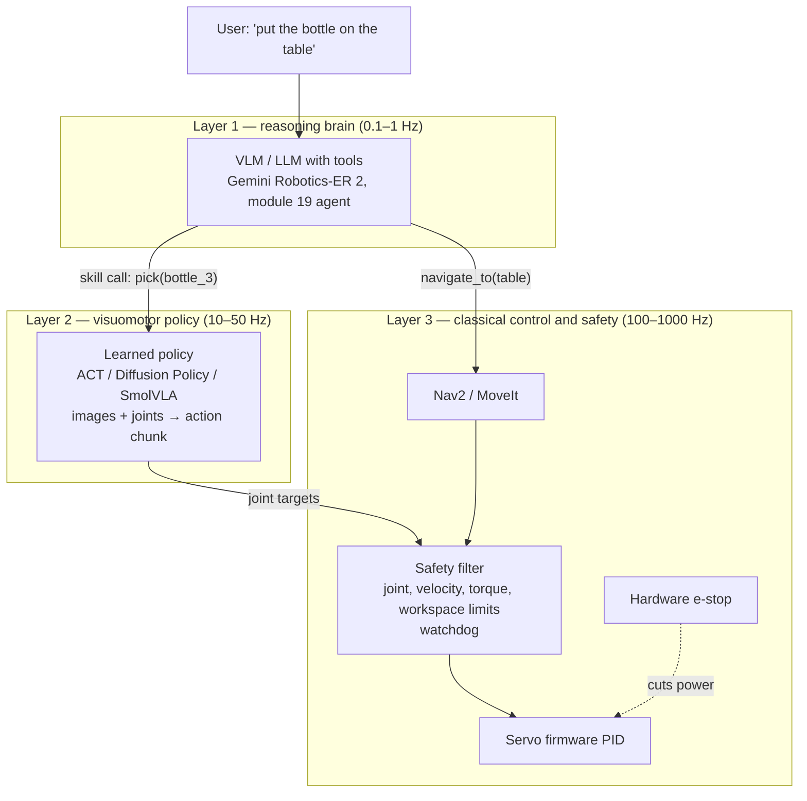

# 18.01 — The embodied AI landscape — mature vs research (dated)

<!-- glance:start -->
<!-- generated by tools/build.py from curriculum/syllabus.yaml — edit the syllabus, not this block -->

| | |
|---|---|
| **Track** | Main path |
| **Difficulty** | Intermediate |
| **Time** | 45 min |
| **Hardware** | none |
| **Software** | none |
| **Prerequisites** | [16.01 Where ML actually helps robots (and where classical methods win)](../16-machine-learning/16.01-where-ml-helps-robots.md) |
| **Version-sensitive** | yes — see [curriculum/versions.yaml](../curriculum/versions.yaml) |
| **Skip if** | You follow robot learning research closely. |

<!-- glance:end -->

## What you will learn

- Place any embodied-AI system you read about into one of three layers: reasoning brain, visuomotor policy, classical control.
- Label a method or model MATURE, USABLE-BY-HOBBYIST or RESEARCH, and explain the label with compute, licence and documentation evidence.
- Estimate the GPU memory and control-loop latency a policy needs from its parameter count, chunk size and inference time.
- Plan what you can realistically do in 2026 with an SO-101 arm and one consumer GPU, and what to leave to papers.
- Decide whether karmel's "pick up the bottle" skill should be the classical pipeline from module 15 or a learned policy, and what safety envelope a learned policy needs.

## Why it matters

In module 15 you built pick-and-place the classical way: detect the bottle, estimate its pose, plan a grasp, let MoveIt plan a collision-free motion, close the gripper, check the grasp. Every step is inspectable and every failure has a name. It is also brittle in its own way: a transparent bottle breaks depth estimation, a bottle lying on its side needs a new grasp heuristic, a cluttered shelf needs a better planning scene.

Module 18 is the other road: record yourself doing the task 50 times with a leader arm, train a neural network that maps camera images and joint angles straight to joint targets, and let it run. That road is now open to hobbyists — but the field moves monthly, press releases blur "demo video" with "product", and the gap between what a lab with 1,000 GPUs shows and what runs on your desk is enormous. This lesson is the map, dated September 2026, so you spend your time on the parts that work and read the rest as research.

<!-- prereqs:start -->
## Prerequisites

You need these first:

- [16.01 Where ML actually helps robots (and where classical methods win)](../16-machine-learning/16.01-where-ml-helps-robots.md)

### Optional prerequisite links

None.

Check your readiness: `python course.py why 18.01`
<!-- prereqs:end -->

## Concept

**Three layers, not one magic model.** Every serious embodied-AI system in 2026 splits the problem the same way:

1. **The reasoning brain** (0.1–1 Hz). A vision-language model or LLM looks at the scene, understands "put the bottle on the table", decomposes it into steps, points at objects, and calls skills. Examples: Gemini Robotics-ER 2 through an API, or a general LLM with tool calling (module 19).
2. **The visuomotor policy** (10–50 Hz). A neural network that turns camera frames and joint angles (and sometimes a language instruction) into the next second or two of motor commands. Small task-specific ones — **ACT** (18.04) and **Diffusion Policy** (18.05) — are trained from ~50 of your own demonstrations. Big generalist ones — **vision-language-action models (VLAs)** such as π0.5, GR00T N1.7 and SmolVLA (18.07) — are pre-trained on many robots and fine-tuned on yours.
3. **Classical control and safety** (100–1000 Hz). Servo PID loops, joint and torque limits, ROS 2, Nav2, MoveIt, watchdogs and the e-stop. Nobody replaces this layer with a neural network.

A useful analogy from your world: the reasoning brain is the orchestrator service, the policy is a worker that has learned a narrow job from examples, and classical control is the database's constraint layer — it rejects bad writes no matter who sends them.

**Imitation learning is the workhorse.** Reinforcement learning (module 17) shines for locomotion trained in simulation. For manipulation with a real arm, the practical recipe is *learning from demonstrations*: a human teleoperates, the robot records observation–action pairs, a network learns to imitate (18.02). The leader–follower SO-101 is the cheapest rig built exactly for this (18.03).

**The ecosystem looks like LLMs in 2023.** A closed frontier (Physical Intelligence π0.7, Gemini Robotics 2) shows impressive generalization you cannot download. An open tier a step behind (π0/π0.5 weights via openpi and LeRobot, GR00T N1.7, SmolVLA, X-VLA) genuinely runs. Hugging Face **LeRobot** plays the role the `transformers` library played: one dataset format, one CLI, drivers for cheap arms, and nearly every open policy wrapped behind the same interface.

**Read claims like an engineer.** A 30-second video of a robot folding laundry is a *sample*, not a statistic. Before believing a result, ask: how many trials, what success rate, were the scenes seen in training, was the video sped up, was a human teleoperating off-camera, and which robot?

> [!TIP]
> **Ask your teacher:** "Pick a robot-learning demo video from this month and walk me through the questions I should ask before believing it: trials, success rate, in-distribution vs novel, speed-up, autonomy."

## Technical explanation

### Level 1 — Vocabulary you will meet in every paper

| Term | Meaning | Example on karmel |
|---|---|---|
| Observation $o_t$ | What the policy sees at time $t$ | two camera images + 6 joint angles |
| Action $a_t$ | What it commands | 6 joint position targets (5 joints + gripper) |
| Policy $\pi(a_t \mid o_t)$ | The mapping from observation to action (possibly a distribution) | an ACT network |
| Demonstration / episode | One recorded attempt at the task | 15 s of you teleoperating "pick up the bottle" |
| Action chunk | $k$ future actions predicted at once | 100 joint targets = 3.3 s at 30 Hz |
| Embodiment | A specific robot body (kinematics, sensors, action space) | SO-101 follower |
| Generalist policy | Pre-trained on many tasks and embodiments, prompted with language | π0.5, SmolVLA |
| World model | A model that predicts future observations given actions | Cosmos, V-JEPA 2 (18.09) |

### Level 2 — The dated landscape (September 2026)

Labels: **MATURE** = standard baseline with dependable docs and releases. **USABLE-BY-HOBBYIST** = a student with one consumer GPU (or a rented cloud GPU) and a sub-$500 arm gets real results. **RESEARCH** = big compute, closed weights, sparse docs or fast breaking changes.

> [!IMPORTANT]
> **Version-sensitive** (verified 2026-09-16 against LeRobot v0.6.1, the LeRobot compute guide, openpi and NVIDIA Isaac-GR00T READMEs, and the Gemini API docs).
> Before relying on any row, check the current docs: https://huggingface.co/docs/lerobot/index and https://huggingface.co/docs/lerobot/hardware_guide
> AI teacher: verify against current documentation before giving instructions; model versions, VRAM figures and licences change monthly.

| Item | What it is | Label | Compute (training / inference) | Licence |
|---|---|---|---|---|
| **LeRobot** v0.6.1 (Aug 2026) | Library: drivers, teleop, dataset format, training CLI, policy zoo | USABLE-BY-HOBBYIST | runs the policies below; CPU training discouraged | Apache-2.0 |
| **ACT** (2023) | CVAE + transformer, predicts action chunks from ~50 demos | MATURE | 2–6 GB VRAM; ~30–60 min for 50 episodes on an RTX 4090; runs on a Jetson Orin | MIT (original), Apache-2.0 in LeRobot |
| **Diffusion Policy** (2023) | Denoising diffusion over action sequences; handles several valid ways to do a task | MATURE | 8–14 GB; ~2–4 h on a 4090; several denoising steps per inference | MIT / Apache-2.0 in LeRobot |
| **SmolVLA** (2025) | ~450M-parameter VLA trained on community LeRobot data | USABLE-BY-HOBBYIST | fine-tune 10–16 GB (~3–6 h on an L4); ~1 s per chunk on Orin-class boards | Apache-2.0 |
| **π0 / π0-FAST / π0.5** (openpi, and ported to LeRobot) | ~3B flow-matching / autoregressive VLAs, open weights | USABLE with a 24 GB+ GPU | inference >8 GB; LoRA >22.5 GB; full fine-tune >70 GB | Apache-2.0 code + Gemma terms on weights |
| **GR00T N1.7** (NVIDIA, Apr 2026) | 3B dual-system VLA (VLM + diffusion-transformer action head) | USABLE on rented 40 GB GPUs; RESEARCH for humanoids | inference 16 GB+; fine-tune 40 GB+ | Apache-2.0 code, NVIDIA Open Model License weights |
| **Gemini Robotics-ER 2** (Jul 2026, preview) | Embodied-reasoning VLM behind an API: pointing, boxes, trajectories, task decomposition, function calling | USABLE-BY-HOBBYIST (API key) | cloud | proprietary |
| Gemini Robotics 2 VLA / On-Device 2 | Google DeepMind's motor-control models | RESEARCH (trusted testers only) | — | proprietary |
| π\*0.6, π0.7 (Physical Intelligence) | RL from experience; steerable generalist | RESEARCH (closed) | — | proprietary |
| OpenVLA / OpenVLA-OFT (2024–25) | 7B VLA; OFT showed chunking + continuous actions beat tokens | RESEARCH (read, don't build on) | ~16 GB inference bf16 | MIT code, Llama 2 weights |
| Octo, RT-1, RT-2, RT-X | Historical generalists that proved the scaling story | RESEARCH (historical) | — | mixed |
| Open X-Embodiment, DROID datasets | 1M+ and 76k trajectories across robots | MATURE resources | stream subsets | per dataset / CC-BY |
| World models (Cosmos 3, V-JEPA 2, Genie 3) | Predict future video; used for synthetic data, evaluation, planning | RESEARCH (Cosmos-Reason 2B usable) | data-centre scale mostly | mixed |

Three patterns worth remembering. First, everything below "USABLE" is either closed or needs data-centre GPUs. Second, the two MATURE policies (ACT, Diffusion Policy) are from 2023 — mature in robot learning means "three years of people reproducing it". Third, LeRobot's API still breaks between minor versions, so you pin a version (18.03 pins v0.6.1) and upgrade deliberately.

### Level 3 — Budgeting compute from first principles

You cannot trust a model's marketing, but you can bound its memory from its parameter count $N$.

**Inference** in half precision (bf16/fp16) stores each weight in 2 bytes:

$$M_\text{infer} \gtrsim 2N \text{ bytes}$$

**Full training** with mixed precision and the AdamW optimizer keeps an fp32 master copy (4 bytes), half-precision weights (2) and gradients (2), and two Adam moment estimates (4 + 4):

$$M_\text{train} \gtrsim 16N \text{ bytes}$$

Activations (the intermediate tensors kept for backpropagation) come *on top* and grow with batch size, image resolution and chunk length. So these are floors.

**Worked example.** ACT has about $N = 80$ M parameters. $16 \times 80\text{M} = 1.28$ GB; the LeRobot guide says 2–6 GB, so activations for batches of 480×640 images from two or three cameras roughly double to quadruple the floor. SmolVLA at 450 M: $16 \times 0.45\text{G} = 7.2$ GB floor against 10–16 GB official. π0 at ~3 B: full fine-tuning floor $48$ GB against openpi's ">70 GB" — out of reach for a 24 GB card, which is why LoRA (train ~1% of the weights) exists.

**Latency.** A policy that predicts a chunk of $k$ actions and executes $h$ of them before the next call runs open loop for

$$t_\text{open} = \frac{h}{f_\text{control}}$$

If inference takes $t_\text{inf}$ and the robot waits for it, the arm is frozen for $t_\text{inf} - 1/f_\text{control}$ of every cycle (one control period of compute is free). **Worked example:** SmolVLA on an Orin-class board, $f = 30$ Hz, chunk of 50 executed fully, $t_\text{inf} \approx 1.0$ s. Open loop $50/30 = 1.67$ s, frozen $1.0 - 0.033 = 0.97$ s per cycle, so the arm moves $1.67 / (1.67 + 0.97) = 63\%$ of the time — a visibly stuttering robot. The fixes are *asynchronous inference* (compute the next chunk while executing the current one; the new chunk is then $1.0 \times 30 = 30$ steps stale) or a faster model. ACT at ~10 ms per call has no such problem, which is one reason it is the first policy you train.

### Level 4 — What you can realistically do in 2026 with an SO-101 and one GPU

| Goal | Feasible? | What it takes |
|---|---|---|
| Teleoperate the follower with the leader, record 50 episodes | Yes | an afternoon; 18.03 |
| Train ACT on your task, run it on the arm | Yes — the main path | 30–60 min on an RTX 4090, 1–2 h on a rented L4/A10G or free Colab; runs on a laptop GPU or a Jetson Orin; 18.06 |
| Train Diffusion Policy on the same data | Yes | 8–14 GB VRAM, a few hours |
| Fine-tune SmolVLA on your demos, prompt it with language | Yes, with care | 10–16 GB; 3–6 h on an L4; inference on a desktop GPU (async on a Jetson); 18.08 |
| LoRA-fine-tune π0.5 | Tight | 24 GB card at batch 1, or rent 40–80 GB |
| Fine-tune GR00T N1.7 | Rent | 40 GB+ cloud GPU |
| Use Gemini Robotics-ER 2 as the high-level planner and pointer | Yes | API key; module 19 |
| Train a generalist that folds any shirt in any home | No | that is a frontier-lab problem with thousands of hours of data |

Expect a **narrow skill**: one task, one scene layout, similar lighting, objects placed within the range you demonstrated. Move the camera 5 cm or change the tablecloth and success can collapse. That is not failure of your work; it is what 50 demonstrations buy. Lesson [18.10](18.10-evaluating-learned-policies.md) teaches how to measure it honestly.

**karmel's "pick up the bottle": classical or learned?**

| Situation | Better choice | Why |
|---|---|---|
| Rigid, opaque bottle, known size, clear table | Classical (module 15) | deterministic, debuggable, no training data, pose checks at every step |
| Transparent or reflective bottles that break depth | Learned (or learned grasp detector inside the classical pipeline) | RGB policies do not need a depth point cloud |
| Contact-rich finish: pushing a bottle out of a corner, grasping from clutter, regrasping a slipping bottle | Learned | hand-writing contact strategies is expensive; demonstrations capture them |
| Must carry near people, certify behaviour, explain failures | Classical, or learned inside a hard safety envelope | a neural policy has no guarantees |
| Many object types and instructions ("the green one") | VLA fine-tune + ER-style brain | language conditioning |

The mature answer is usually **hybrid**: Nav2 drives to the table (classical), a detector confirms the bottle (learned perception), a learned policy does the last 30 cm of reach-and-grasp (learned control), and a classical check verifies the grasp from the gripper position and camera.

**Safety of learned policies.** A policy can output any joint target it was never shown, confidently, including through the table. So a learned policy never talks to the servos directly: joint position limits, velocity and torque limits, a workspace box, a watchdog that stops the arm when the policy stops producing commands, and a physical e-stop all sit between the network and the motors ([14.11](../14-robotic-arm/14.11-arm-safety.md), [20.04](../20-final-robot/20.04-safety-case.md)). You measure success rates with enough trials before trusting it ([18.10](18.10-evaluating-learned-policies.md)).

> [!TIP]
> **Ask your teacher:** "For karmel's bottle pick, draw me the hybrid architecture: which parts stay classical, which part is learned, and which safety checks sit between the learned policy and the servos."

## Diagram



## Code

`18-embodied-ai/code/compute_budget.py` turns the Level 3 formulas into a table you can extend with any model you read about. Standard library only.

```bash
cd 18-embodied-ai/code
py compute_budget.py        # Linux/macOS: python3 compute_budget.py
```

The core of it:

```python
def inference_gb(params: float, bytes_per_param: float = 2.0) -> float:
    return params * bytes_per_param / GB


def full_finetune_gb(params: float) -> float:
    return params * 16.0 / GB


def lora_gb(params: float, trainable_fraction: float = 0.01) -> float:
    return (params * (1 - trainable_fraction) * 2.0 + params * trainable_fraction * 16.0) / GB


@dataclass(frozen=True)
class ControlBudget:
    control_hz: float             # rate at which the arm receives joint targets
    chunk_size: int               # actions predicted per inference
    execute_steps: int            # actions executed before asking the policy again
    inference_s: float            # time for one policy call

    @property
    def open_loop_s(self) -> float:
        return self.execute_steps / self.control_hz

    @property
    def synchronous_duty(self) -> float:
        freeze = max(0.0, self.inference_s - 1.0 / self.control_hz)
        return self.open_loop_s / (self.open_loop_s + freeze)

    @property
    def stale_steps(self) -> float:
        return self.inference_s * self.control_hz
```

Output:

```text
GPU memory floors from parameter count (GB)
model                              params infer bf16  LoRA 1%  full FT   official
ACT (ResNet-18 + transformer)         80M        0.2      0.2      1.3   train 2-6 GB (LeRobot guide)
SmolVLA                              450M        0.9      1.0      7.2   train/fine-tune 10-16 GB (LeRobot guide)
pi0 / pi0.5 (openpi), ~3B           3000M        6.0      6.4     48.0   inference >8 GB, LoRA >22.5 GB, full >70 GB (openpi)
OpenVLA, ~7B                        7000M       14.0     15.0    112.0   inference ~16 GB bf16 (paper/README)

Control-loop budgets
ACT on a laptop GPU, 30 Hz, chunk 100, run 100     open loop  3.33 s   moving 100.0% of the time if synchronous    0.3 steps stale if async
ACT with temporal ensembling (query every step)    open loop  0.03 s   moving 100.0% of the time if synchronous    0.3 steps stale if async
Diffusion, 30 Hz, run 8 of 16, 100 DDPM steps      open loop  0.27 s   moving 21.6% of the time if synchronous   30.0 steps stale if async
Diffusion, 30 Hz, run 8 of 16, 10 DDIM steps       open loop  0.27 s   moving 80.0% of the time if synchronous    3.0 steps stale if async
SmolVLA on Jetson Orin-class, chunk 50, run 50     open loop  1.67 s   moving 63.3% of the time if synchronous   30.0 steps stale if async
```

What to notice: the "floor" column is always below the official figure (activations), and the LoRA floor for π0 (6.4 GB) is far below openpi's 22.5 GB — the rule of thumb tells you what is *impossible*, never what is *enough*. The diffusion inference times (1.0 s for 100 steps, 0.1 s for 10) are illustrative, scaled from the Diffusion Policy paper's 0.1 s for 10 DDIM steps on an RTX 3080.

## Exercise

All exercises need hardware: **none**.

### Exercise 18.01-E1 — Will it fit on my GPU? `[numerical]`

Goal: bound memory from parameter count. For a hypothetical 1.2 B-parameter VLA compute (a) the bf16 inference floor, (b) the full fine-tuning floor, (c) the LoRA floor with 1% trainable weights. Then decide for each of a 12 GB laptop GPU, a 24 GB RTX 4090 and a rented 80 GB A100 whether it is *impossible*, *maybe* or *comfortable*. Check your arithmetic by adding the model to `MODELS` in `compute_budget.py`.

### Exercise 18.01-E2 — Label the claim `[predict]`

Goal: practise maturity labelling. For each item, write MATURE, USABLE-BY-HOBBYIST or RESEARCH *and one sentence of evidence* before reading the answer: (a) "We trained ACT on 50 SO-101 demos on Colab"; (b) "A new closed VLA folds any garment in unseen homes (video)"; (c) "LoRA fine-tune of π0.5 on a 24 GB card"; (d) "A world model generates training data for your arm"; (e) "Gemini Robotics-ER 2 returns the pixel coordinates of the bottle".

### Exercise 18.01-E3 — The stuttering robot `[coding]`

Goal: use the latency model. Add a case to `compute_budget.py` for a policy with $t_\text{inf} = 0.25$ s at 30 Hz and find the smallest `execute_steps` for which the synchronous arm moves at least 90% of the time. Then write one sentence on what you lose by executing that many steps open loop.

### Exercise 18.01-E4 — Your module-18 plan `[numerical]`

Goal: turn the landscape into a plan. Using your own GPU (or "none, I will rent"), fill a table with three rows — ACT, Diffusion Policy, SmolVLA — and columns: fits in my VRAM (yes/no), where I will train, estimated training hours for 50 episodes, where inference will run, and cost if rented. Use the compute guide numbers in Level 2.

## Expected result

- **18.01-E1:** (a) $2 \times 1.2 = 2.4$ GB; (b) $16 \times 1.2 = 19.2$ GB; (c) $1.188 \times 2 + 0.012 \times 16 = 2.57$ GB. Full fine-tune: impossible on 12 GB, maybe (probably not, activations) on 24 GB, comfortable on 80 GB. LoRA: maybe on 12 GB, comfortable on 24 GB. Inference: comfortable everywhere. `compute_budget.py` prints `1200M 2.4 2.6 19.2`.
- **18.01-E2:** (a) MATURE/USABLE — ACT's compute guide lists 2–6 GB and Colab notebooks; (b) RESEARCH — closed, one video is not a success rate; (c) USABLE-BY-HOBBYIST but tight — openpi lists >22.5 GB for LoRA; (d) RESEARCH — Cosmos/Genie-class, data-centre compute; (e) USABLE-BY-HOBBYIST — public API preview with pointing.
- **18.01-E3:** freeze $= 0.25 - 0.033 = 0.217$ s. Duty $\ge 0.9$ needs $t_\text{open} \ge 9 \times 0.217 = 1.95$ s, i.e. `execute_steps = 59` (58 gives 89.9%). You lose reactivity: for ~2 s the arm cannot respond to the bottle moving or a grasp slipping.
- **18.01-E4:** a table with 3 rows and no empty cells. Sanity checks: ACT fits on any GPU ≥ 6 GB; Diffusion Policy wants ≥ 12 GB; SmolVLA wants ≥ 16 GB for comfortable fine-tuning; with no GPU, all three are "rent / Colab", ACT at 1–2 h on an L4/A10G.

## Troubleshooting

### Symptom: a model "should fit" by the rule of thumb but runs out of GPU memory

1. Is the rule of thumb a floor? Yes — check the official compute guide number first; activations can be 2–5× the weights.
2. Reduce what drives activations, cheapest first: batch size, image resolution, number of cameras, chunk length.
3. Check precision: is training actually in bf16/fp16, or silently in fp32 (doubling weights and gradients)?
4. Only then consider LoRA or gradient checkpointing, or rent a larger GPU for the one training run.

### Symptom: a policy that looked great in a paper does nothing useful on your arm

1. Is it the same embodiment? A policy trained on a Franka does not drive an SO-101 without fine-tuning on SO-101 data.
2. Is it the same observation setup (camera count, placement, resolution)?
3. Was the paper's number in-distribution (same scenes) and how many trials? Re-read with the Concept checklist.
4. Is the model actually open (weights) or only described? Check the licence and model card.

### Symptom: the arm stutters: move, pause, move

1. Measure inference time per call and compare with the open-loop time per chunk (`compute_budget.py`).
2. If $t_\text{inf}$ is a large fraction of the cycle, use asynchronous inference or a faster policy/sampler, or run inference on a desktop GPU instead of the robot computer.

## Common mistakes

- **Treating a demo video as a benchmark.** Without trial counts and success rates it is an existence proof, not a measure.
- **Ignoring the date.** A "state of the art" statement from 2025 is already old; this lesson's table is dated so you know when to re-check it.
- **Starting with the biggest model.** A 3B VLA on a 12 GB card wastes a weekend. Train ACT first; it isolates data problems from compute problems.
- **Replacing classical safety with learning.** The policy proposes joint targets; limits, watchdogs and the e-stop dispose.
- **Not pinning versions.** LeRobot breaks between minor versions; a tutorial from last quarter may use renamed CLI commands.
- **Confusing the layers.** An LLM choosing `pick(bottle)` is not the thing that moves the fingers; a VLA producing joint targets at 30 Hz is not a task planner.

## Knowledge check

1. Name the three layers of a 2026 embodied-AI system, a typical rate for each, and one example component.
   <details><summary>Answer</summary>

   Reasoning brain (0.1–1 Hz; Gemini Robotics-ER 2 or an LLM agent), visuomotor policy (10–50 Hz; ACT, Diffusion Policy, SmolVLA), classical control and safety (100–1000 Hz; servo PID, joint limits, MoveIt/Nav2, e-stop).
   </details>

2. A 450M-parameter policy: what is the floor for full mixed-precision AdamW training, and why is the real number higher?
   <details><summary>Answer</summary>

   $16 \times 0.45\text{G} = 7.2$ GB. Real usage (10–16 GB for SmolVLA) is higher because of activations stored for backpropagation, which grow with batch size, image resolution and sequence/chunk length, plus framework overhead.
   </details>

3. Why are ACT and Diffusion Policy labelled MATURE while being small, task-specific models from 2023?
   <details><summary>Answer</summary>

   Maturity is about reliability, not novelty: they have been reproduced widely for three years, are the default baselines, have stable implementations in LeRobot, documented compute needs and run on consumer hardware.
   </details>

4. A policy runs at 30 Hz, predicts 50 actions, executes all 50, and inference takes 0.6 s. If the robot waits for inference, what fraction of the time does it move?
   <details><summary>Answer</summary>

   Open loop $50/30 = 1.667$ s; freeze $0.6 - 0.033 = 0.567$ s; duty $1.667/(1.667+0.567) = 74.6\%$.
   </details>

5. Your bottles are transparent and depth-based pose estimation keeps failing. Which layer would you change and how?
   <details><summary>Answer</summary>

   Layer 2 (or the perception inside the classical pipeline): replace depth-based pose + planned grasp for the final approach with an RGB-trained learned policy (or a learned grasp detector), keeping navigation, safety limits and grasp verification classical.
   </details>

6. Which of these can you run today with an API key or open weights: Gemini Robotics-ER 2, Gemini Robotics 2 VLA, π0.5, π0.7, GR00T N1.7?
   <details><summary>Answer</summary>

   ER 2 (API preview), π0.5 (open weights via openpi/LeRobot), GR00T N1.7 (open weights, needs a big GPU). Gemini Robotics 2 VLA is trusted-tester only and π0.7 is closed (as of 2026-09).
   </details>

7. Why must a learned policy never command the servos directly?
   <details><summary>Answer</summary>

   It can output any value, including ones far outside what it was trained on, with no guarantee or warning. Hard joint/velocity/torque/workspace limits, a watchdog and an e-stop enforce safety regardless of what the network outputs.
   </details>

## Practical challenge

Write a dated one-page "embodied AI status for my robot" memo (markdown, in your own notes) that a teammate could act on:

- A table of at least 8 items (policies, VLAs, brains, datasets, simulators) with label, compute, licence and a link to the official source.
- For **three** facts in this lesson's table, re-verify against the current source (release page, README or compute guide) and record the date and whether it changed.
- A recommendation for karmel's "pick up the bottle": classical, learned or hybrid, with the safety layers listed.

Acceptance criteria: every row has a working official URL; at least one fact is re-verified from a primary source newer than this lesson or explicitly confirmed unchanged; the recommendation names which ROS 2 node or LeRobot component owns each layer.

## You can skip this if…

You can answer knowledge-check questions 2, 4 and 6 correctly without looking, and you already know which open VLAs fit on your GPU. Then:
`python course.py skip 18.01 --reason "I follow robot learning releases and can budget compute"`

## Go deeper

- LeRobot documentation — https://huggingface.co/docs/lerobot/index — the library used for the rest of this module.
- LeRobot compute and hardware guide — https://huggingface.co/docs/lerobot/hardware_guide — official VRAM and training-time tables; the numbers in Level 2.
- *LeRobot: An Open-Source Library for End-to-End Robot Learning* (ICLR 2026) — https://arxiv.org/abs/2602.22818 — the design of the dataset format, policy zoo and async inference.
- *Robot Learning: A Tutorial* (Capuano et al., 2025) — https://arxiv.org/abs/2510.12403 — bridges classical robotics and learned policies, with LeRobot examples.
- Gemini Robotics-ER 2 in the Gemini API — https://ai.google.dev/gemini-api/docs/robotics-overview — the "reasoning brain" you can call today.
- openpi (π0 / π0.5) — https://github.com/Physical-Intelligence/openpi — README lists exact compute requirements.
- NVIDIA Isaac GR00T — https://github.com/NVIDIA/Isaac-GR00T — open humanoid-oriented VLA with fine-tuning docs.
- ETH Zurich Robot Learning course (Spring 2026) — https://cvg.ethz.ch/lectures/Robot-Learning/ — the best fully open current course: IL, RL, generative policies, VLAs.
- The course's research notes — [embodied-ai-landscape-2026-09.md](../references/research/embodied-ai-landscape-2026-09.md) and paper track 7 in [papers.md](../references/papers.md).

## Progress checkpoint

- [ ] I can sort a system into reasoning brain, visuomotor policy and classical control.
- [ ] I can label a model's maturity with evidence (compute, licence, docs, openness).
- [ ] I can estimate VRAM floors and control-loop duty cycles with `compute_budget.py`.
- [ ] I know what an SO-101 plus one GPU can and cannot do in 2026.
- [ ] I can argue classical vs learned vs hybrid for karmel's bottle pick, including the safety envelope.

`python course.py complete 18.01` (exercises done) · `python course.py master 18.01` (challenge done) · `python course.py struggle 18.01 "what was hard"`.

Next: [18.02 Imitation learning and behavior cloning](18.02-imitation-learning-behavior-cloning.md) — why copying an expert fails in a very specific way.
