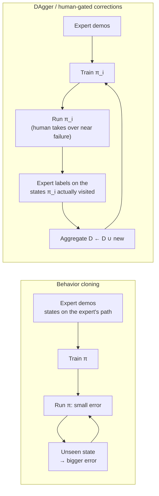

# 18.02 — Imitation learning and behavior cloning

<!-- glance:start -->
<!-- generated by tools/build.py from curriculum/syllabus.yaml — edit the syllabus, not this block -->

| | |
|---|---|
| **Track** | Main path |
| **Difficulty** | Intermediate |
| **Time** | 1 h |
| **Hardware** | none |
| **Software** | python, pytorch |
| **Prerequisites** | [18.01 The embodied AI landscape — mature vs research (dated)](18.01-embodied-ai-landscape.md) |
| **Optional prerequisites** | [FML.02 Supervised learning: regression and classification](../optional-foundations/machine-learning/FML.02-supervised-learning.md)<br>[FML.04 Loss functions](../optional-foundations/machine-learning/FML.04-loss-functions.md) |
| **Skip if** | You can explain compounding errors and DAgger. |

<!-- glance:end -->

## What you will learn

- Frame "learn from demonstrations" as supervised learning, and train a behavior-cloning policy.
- Explain covariate shift and why behavior cloning's errors compound over an episode, with the $T^2\epsilon$ argument and a numerical example.
- Run DAgger and explain why labelling the learner's own states fixes compounding error, and how human interventions implement it on a real arm.
- Show why MSE regression fails on multimodal demonstrations (two valid ways → averaged into a collision) and name the policy classes that fix it.
- Judge demonstration data quality: consistency, coverage, pauses, observability.

## Why it matters

The policies you will train on the SO-101 — ACT, Diffusion Policy, SmolVLA — are all behavior cloning at heart: a network trained to output what you did in the recordings. Every one of their design choices exists to fight one of two failure modes you meet in this lesson. **Compounding error**: the robot makes a small mistake, lands in a situation you never demonstrated, and has no idea how to recover — so the next mistake is bigger. **Multimodality**: you picked up the bottle from the left in half the demos and from the right in the other half, and a naive network averages the two into a path straight through the bottle.

When karmel's learned bottle-pick policy drifts, freezes, or dithers between two approaches, you will recognise which failure it is and what to change: the data, the collection protocol, or the policy class.

<!-- prereqs:start -->
## Prerequisites

You need these first:

- [18.01 The embodied AI landscape — mature vs research (dated)](18.01-embodied-ai-landscape.md)

### Optional prerequisite links

New to any of these? Take the foundation lesson first; skip it if you already know it.

- [FML.02 Supervised learning: regression and classification](../optional-foundations/machine-learning/FML.02-supervised-learning.md)
- [FML.04 Loss functions](../optional-foundations/machine-learning/FML.04-loss-functions.md)

Check your readiness: `python course.py why 18.02`
<!-- prereqs:end -->

## Concept

**Behavior cloning (BC) is supervised learning on a robot's recordings.** While you teleoperate, the robot logs pairs (observation, action) at every control step: camera image and joint angles in, the joint targets you commanded out. Train a network to map one to the other with an ordinary regression loss. At run time, feed it the current observation and send its output to the servos. It is the same workflow as training any model on labelled data.

> [!NOTE]
> New to supervised learning or loss functions? → [FML.02 Supervised learning](../optional-foundations/machine-learning/FML.02-supervised-learning.md) and [FML.04 Loss functions](../optional-foundations/machine-learning/FML.04-loss-functions.md). Skip them if you have trained regression models.

**The catch: the test distribution is created by the model itself.** In ordinary ML, the test images do not change because your classifier made a mistake. In robotics they do. The policy's action moves the arm, and the *next* observation depends on that action. The training data contains only states the expert visited — the expert's own "happy path". A slightly wrong action puts the arm 5 mm off that path, into a state with no training data nearby, where the network's output is an extrapolation. The next action is worse, the arm is 15 mm off, then 40 mm. This is **covariate shift**, and the growth is **compounding error**.

A distributed-systems analogy: a service tested only against production traffic from well-behaved clients. The first malformed request produces a slightly wrong response, the client retries with an even stranger request, and within seconds you are in a code path nobody ever exercised.

**Two cures.** Either (a) put recovery behaviour into the data — the expert must show what to do *after* a mistake — or (b) make fewer independent decisions so there are fewer chances to go wrong (action chunking, 18.04). **DAgger** (Dataset Aggregation) is the principled version of (a): let the *learner* drive, ask the expert what it *would* have done in each state the learner visited, add those labels to the dataset, retrain, repeat. With a human expert on a real arm this becomes: run the policy, take over with the leader arm when it is about to fail, record the correction.

**The second catch: there is more than one right answer.** Ask ten people to pick up a bottle and they will approach from different sides. Mean-squared-error regression predicts the *average* action for each observation. The average of "go left" and "go right" is "go straight" — into the obstacle. The fix is a policy that represents a *distribution* over actions and samples one mode: a mixture of Gaussians, discretized action classes, a conditional VAE (ACT, 18.04) or a diffusion model (18.05).

> [!TIP]
> **Ask your teacher:** "Explain covariate shift in behavior cloning using an example from web services or recommendation systems, then map it back to a robot arm reaching for a bottle."

## Technical explanation

### Level 1 — The setup

At each control step $t$ the robot observes $o_t$, the expert (you, through the leader arm) chooses $a_t = \pi^*(o_t)$, and the world moves to the next state. A demonstration dataset is $\mathcal{D} = \{(o_t^{(i)}, a_t^{(i)})\}$ over episodes $i$. Behavior cloning fits parameters $\theta$:

$$\theta^\star = \arg\min_\theta \; \mathbb{E}_{(o,a)\sim\mathcal{D}} \left[ \ell\big(\pi_\theta(o), a\big) \right]$$

with $\ell$ usually MSE $\|\pi_\theta(o) - a\|^2$ or L1 $|\pi_\theta(o) - a|$.

**Numerical example.** An SO-101 episode of 10 s at 30 Hz gives 300 pairs; 50 episodes give 15,000 pairs, each with 6 action numbers (5 joint angles in degrees + gripper). That is a small supervised dataset by ML standards — which is why data *quality* matters so much.

### Level 2 — Why errors compound (covariate shift)

The expert's states follow a distribution $d_{\pi^*}$; the learner, once running, visits $d_{\pi_\theta}$. Training minimizes the error on $d_{\pi^*}$, but performance depends on the error on $d_{\pi_\theta}$ — and the two drift apart as soon as the learner makes a mistake.

A clean worst-case argument (Ross & Bagnell): suppose the learner makes a mistake with probability $\epsilon$ at each step *while it is still on the expert's distribution*, and once it has made a mistake it is off-distribution and fails at every remaining step. An error at step $t$ costs up to $T - t$ steps of failure:

$$J(\pi_\theta) \;\le\; J(\pi^*) + \sum_{t=1}^{T} \epsilon\,(T - t) \;\approx\; J(\pi^*) + \tfrac{1}{2}\epsilon T^2 \quad\Rightarrow\quad O(\epsilon T^2)$$

Error grows with the **square** of the horizon. DAgger trains on the learner's own distribution, so a mistake at step $t$ costs roughly one step and the bound becomes $O(\epsilon T)$ (under the paper's assumptions).

**Numerical example.** A per-step mistake probability of $\epsilon = 0.01$ sounds like a 99%-accurate model. Over a 10 s episode at 30 Hz ($T = 300$):

- Probability of a whole episode with no mistake: $(1 - 0.01)^{300} = 0.049$ — under 5%.
- Worst-case expected failed steps, BC: $\epsilon T^2 = 0.01 \times 300^2 = 900$ (i.e. the bound is useless — "every episode fails"); with $\tfrac12$: 450.
- DAgger-style: $\epsilon T = 3$ failed steps.

The same accuracy at 100 steps gives 36.6% clean episodes; at 1,000 steps, 0.004%. Long horizons and high control rates make BC harder — one motivation for predicting chunks (18.04), which reduces the number of decisions.

### Level 3 — DAgger and its practical descendants

```text
D ← expert demonstrations
π_1 ← train(D)
for i = 1 … N:
    run π_i in the world, record the states s it visits
    ask the expert for labels a* = π*(s) on those states
    D ← D ∪ {(s, a*)}
    π_{i+1} ← train(D)
```

Asking a human "what would you have done in this exact state?" for every frame is impractical on a real arm, so practice uses variants:

- **HG-DAgger** (human-gated): the policy drives; the human takes over only when it is about to fail and hands control back after recovering. Only the takeover segments get expert labels. LeRobot v0.6 implements this loop (`lerobot-rollout --strategy.type=dagger`, SO-101 leader supported) — you will meet it after you have a trained policy ([18.06](18.06-train-first-policy-lerobot.md)).
- **Noise injection (DART-style)**: perturb the arm *during demonstration* so the expert's corrections are recorded. Cheap, no trained policy needed.
- **Recovery demonstrations**: deliberately start some episodes from awkward poses — gripper already beside the bottle, bottle slightly knocked over — and demonstrate the recovery.

### Level 4 — The multimodality problem

For a given observation $o$, the demonstrations define a *distribution* of actions $p(a \mid o)$. The MSE-optimal prediction is its mean:

$$\arg\min_{\hat a}\; \mathbb{E}_{a \sim p(a\mid o)}\|\hat a - a\|^2 = \mathbb{E}[a \mid o]$$

If $p(a\mid o)$ has two separated modes, the mean lies between them — possibly in a region no demonstration ever occupied. L1 loss predicts the per-dimension *median*, which for a 50/50 split is anywhere between the modes: no better.

**Numerical example.** The lab's obstacle task: start at (0, 0), obstacle of radius 0.3 m at (1, 0), goal at (2, 0), speed 0.5 m/s. A left demo heads for (0.65, +0.5): its first velocity is $a_L = 0.5 \cdot (0.65, 0.5)/0.820 = (0.40, +0.30)$ m/s. A right demo: $a_R = (0.40, -0.30)$. With 50/50 data the MSE prediction is $(0.40, 0.00)$: straight at the obstacle. The same happens to position targets: the left demo is at (0.60, +0.46) after 1.5 s, the right one at (0.60, −0.46), and their average (0.60, 0.00) is 0.1 m from the obstacle's surface on a collision course.

In closed loop the story has a twist worth knowing: a very sharp network fed a slightly asymmetric state may "escape" to one side, because the two modes separate quickly as $y$ moves off zero. That is luck, not a policy — the side then depends on millimetres of noise — and it disappears as soon as the policy commits to a longer action chunk, which is exactly what real policies do (18.04, 18.05). The lab therefore uses chunks of waypoints.

Policy classes that represent $p(a\mid o)$ instead of its mean:

| Approach | Idea | Where you see it |
|---|---|---|
| Mixture density network | Output weights, means and variances of $K$ Gaussians; sample one | classic BC baselines (robomimic GMM) |
| Discretize / classify | Bin actions into classes or tokens; cross-entropy; sample a class | Behavior Transformers, VQ-BeT (in LeRobot), RT-2 and π0-FAST action tokens |
| Conditional VAE | A latent "style" variable $z$ selects the mode | ACT (18.04) |
| Energy-based / implicit | Learn a score for (o, a); optimize at run time | Implicit BC |
| Diffusion / flow matching | Learn to denoise random noise into a sample from $p(a\mid o)$ | Diffusion Policy (18.05), π0, SmolVLA, GR00T |

**Data quality is the other lever.** Much "multimodality" in real datasets is accidental: the operator sometimes pauses, sometimes re-grasps, sometimes approaches from the left for no reason. Consistent demonstrations make every policy class work better. Rules of thumb that follow from this lesson (18.03 turns them into a protocol):

1. **One strategy per task** unless you *want* the policy to learn several.
2. **No pauses**: a policy trained on "sometimes wait 2 s here" learns to wait — sometimes forever, because a frozen arm produces the same observation again.
3. **Observability**: the policy only sees the cameras and joints. If you needed to lean sideways to see the bottle, the policy cannot.
4. **Coverage**: vary object positions systematically across the region you care about; include some recoveries.

> [!TIP]
> **Ask your teacher:** "Show me why MSE regression predicts the conditional mean with a two-point example, then explain how a mixture density network with two Gaussians would fit the same data."

## Diagram



```text
Multimodal demos, top view (obstacle O, start S, goal G)

   y
  +0.5 |        .-------------.            left demos  (50%)
       |      /                 \
   0.0 | S ---------->[ O ]------------ G   MSE average = straight line → collision
       |      \                 /
  -0.5 |        '-------------'            right demos (50%)
       +----------------------------------- x
         0          1.0              2.0 m
```

## Code

The lab lives in `18-embodied-ai/code/il_lab.py` (numpy + PyTorch, CPU is fine; the tests are `test_il_lab.py`). Two of its three experiments belong to this lesson.

```bash
cd 18-embodied-ai/code
py il_lab.py bc-dagger          # Linux/macOS: python3 il_lab.py bc-dagger
py il_lab.py multimodal --plots # writes out/18_multimodal.png
py -m pytest test_il_lab.py -q  # quick versions of every claim below
```

If PyTorch is missing: `py -m pip install torch --index-url https://download.pytorch.org/whl/cpu`.

**Experiment 1 — compounding error.** A point robot follows a sine-shaped lane ($y = 0.5 \sin(\pi x)$, lane ±0.2 m) at 0.5 m/s for 80 steps at 10 Hz. The expert is a feedback controller: feed-forward along the curve plus a correction $3.0\,(y_\text{centre} - y)$. Execution has sideways noise (σ = 0.3 m/s — slip and backlash). The demonstrations are *perfect*: recorded without noise, so every training state lies exactly on the centre line and the data never shows a correction. The DAgger loop is the algorithm from Level 3, verbatim:

```python
    # Demonstrations from a perfect teleoperator: no noise, so every state lies on the centre line.
    xs = task.rollout(task.expert, n_demos, rng, noise=False)[:, :-1].reshape(-1, 2)
    ys = task.expert(xs)
    policy = as_policy(fit_mse(xs, ys, seed, epochs))              # behavior cloning

    for it in range(1, dagger_iters + 1):
        visited = task.rollout(policy, rollouts_per_iter, rng)[:, :-1].reshape(-1, 2)   # learner drives
        xs = np.concatenate([xs, visited])
        ys = np.concatenate([ys, task.expert(visited)])            # expert labels the learner's states
        policy = as_policy(fit_mse(xs, ys, seed + it, epochs))     # retrain on the aggregate
```

Output (seed 0; your digits may differ slightly on another CPU/PyTorch build):

```text
1) Compounding error - lane following, actuation noise 0.3 m/s, lane +/-0.2 m, 80 steps
                                          mean |cross-track error| [m] at t = 2 s  4 s  6 s  8 s
   expert (acting with the same noise) : success  100%   0.034  0.034  0.036  0.033
   BC on 800 clean expert samples  : success    8%   0.158  0.308  0.535  1.207
   DAgger iteration 1 (1600 samples)  : success   94%   0.040  0.039  0.056  0.041
   DAgger iteration 2 (2400 samples)  : success   98%   0.041  0.042  0.043  0.034
   DAgger iteration 3 (3200 samples)  : success  100%   0.039  0.038  0.041  0.036
   DAgger iteration 4 (4000 samples)  : success  100%   0.039  0.038  0.042  0.047
   (bc-dagger: 17.4 s)
```

What to notice:

- The expert, *with the same noise*, stays at ~34 mm error: its feedback cancels disturbances. Noise is not the problem.
- BC's error **grows with time**: 0.16 → 0.31 → 0.54 → 1.21 m. That growth, not the size of any one error, is compounding. Only 8% of 200 episodes stay in the lane.
- One DAgger iteration (10 learner rollouts labelled by the expert) brings success to 94%, two to 98%. The new data is exactly the off-centre states where BC had nothing to learn from.

**Experiment 2 — multimodal demonstrations.** 40 demonstrations, alternately passing left and right of an obstacle of radius 0.3 m. The policy acts like a position-controlled arm: from the current position it predicts a *chunk* of 6 future waypoints (one every 0.5 s, relative to where it is), drives through the first 2, then predicts again. The MSE policy is the same `fit_mse` as above, with 12 outputs instead of 2.

```text
2) Multimodal demos - obstacle radius 0.3 m at (1, 0), 40 demos: half pass left, half right
   MSE chunk at (0, 0), waypoints 1-3 [m]: (+0.20, +0.00)  (+0.39, +0.02)  (+0.60, +0.01)
   MSE behavior cloning    : success  34%   collisions  66%
   diffusion policy trained in 20.2 s (3000 iterations), 100 episodes:
   DDPM 50 denoising steps: success  92%   collisions   8%   went left  65%   42.57 ms per call (batch of 100)
   DDIM 10 denoising steps: success  82%   collisions  16%   went left  53%   20.60 ms per call (batch of 100)
   DDIM  5 denoising steps: success  78%   collisions  17%   went left  48%    9.86 ms per call (batch of 100)
   (multimodal: 42.5 s)
```

The diffusion lines belong to [18.05](18.05-diffusion-policies.md). Here, look at the first two lines: the MSE chunk from the start is a straight line — its third waypoint (0.60, +0.01) is the average of (0.60, ±0.46) computed in Level 4 — and two thirds of the episodes hit the obstacle. `out/18_multimodal.png` shows the demonstrations as two tight bundles, the MSE rollouts as a fan of paths through the middle, and the diffusion rollouts as two bundles again.

## Exercise

All exercises need hardware: **none** (a CPU with numpy and PyTorch).

### Exercise 18.02-E1 — How bad is 99% accurate? `[numerical]`

Goal: feel the $T^2$ effect. A policy makes an unrecoverable mistake with probability $\epsilon$ per step. Compute the probability of a clean episode for (a) $\epsilon = 0.01$, 10 s at 30 Hz; (b) the same policy at 10 Hz; (c) the $\epsilon$ needed for 90% clean episodes at 30 Hz over 10 s.

### Exercise 18.02-E2 — Predict, then run: noisy demonstrations `[predict]`

Goal: see that recovery data can come from the demonstrations themselves. **Before running**, predict BC's success rate if the demos are recorded *with* the execution noise (the expert corrects itself on camera). Then change `noise=False` to `noise=True` in the demonstration rollout of `bc_vs_dagger` and run `py il_lab.py bc-dagger`.

### Exercise 18.02-E3 — A mixture density network `[coding]`

Goal: fix multimodality with the simplest distributional policy. Write `fit_mdn(obs, chunks, n_components=2)`: an MLP that outputs, for each component, a logit, a 12-number mean chunk and a log standard deviation; train it with the negative log-likelihood of a Gaussian mixture (`torch.distributions.MixtureSameFamily` with `Independent(Normal(...), 1)` components). At run time sample a component, then use its mean. Build the data with `obs, chunks = il_lab.waypoint_chunks(task, demos)` as `multimodal()` does, run 100 episodes with `il_lab.run_obstacle(task, policy, task.starts(100, rng), execute=2)` (the policy must return shape `(n, 6, 2)`), and report collision and success rates.

### Exercise 18.02-E4 — The freezing policy `[debugging]`

Goal: diagnose a data problem from behaviour. A colleague's SO-101 policy reaches toward the bottle, stops 3 cm above it and stays there for ever. Their 50 demos include 12 where they paused 1–3 s above the bottle to line up the gripper. Explain the mechanism in terms of $p(a \mid o)$ and propose two fixes — one in the data, one in the policy class.

### Exercise 18.02-E5 — How much DAgger is enough? `[coding]`

Goal: measure data efficiency. Change `rollouts_per_iter` to 1, 3 and 10 and record the success rate after each DAgger iteration. Plot success versus *number of expert-labelled samples*.

## Expected result

- **18.02-E1:** (a) $0.99^{300} = 0.049$; (b) $0.99^{100} = 0.366$ — but only if the per-step mistake rate stayed the same at 10 Hz, which it usually doesn't (bigger steps); (c) $(1-\epsilon)^{300} = 0.9$ → $\epsilon = 1 - 0.9^{1/300} = 3.5 \times 10^{-4}$.
- **18.02-E2:** success jumps from 8% to about 97% (0.975 with seed 0). The noisy demonstrations contain off-centre states *with* the expert's corrections, which is exactly what DAgger adds. On a real arm this is the argument for including recoveries in your demos.
- **18.02-E3:** a 2-component MDN (MLP 128×2, 1,500 full-batch Adam epochs, one shared standard deviation per component) reached 0% collisions, 99% success and 52% left in our run; accept collisions under 10%, success above 85% and a left fraction between 30% and 70%. If collisions stay high, check that you sample a component per call rather than averaging the component means (averaging reintroduces the MSE failure).
- **18.02-E4:** above the bottle, the data contains both "move down" and "stay still" for nearly identical observations; the policy predicts a small average motion or sampled "stay", and a stationary arm produces the same observation, so it stays forever (a self-reinforcing loop). Data fix: delete or trim the pauses (18.03's `inspect_demos.py` flags them). Policy fixes: action chunking so a whole descent is committed (18.04), or observation history so the policy can tell it has already waited.
- **18.02-E5:** with seed 0: 10 rollouts per iteration reach 94% after the first iteration (800 labelled samples); 3 rollouts reach 92.5% after one iteration (240 labelled); 1 rollout needs 3 iterations (240 labelled) to reach 97%, with a dip to ~66–70% in between. Your plot should rise steeply after a few hundred on-policy labels and then flatten — labels on the learner's own states are far more valuable than more clean demos, and small batches are noisier.

## Troubleshooting

### Symptom: behavior cloning looks perfect on the training data but fails when run

1. Compare training loss with closed-loop success. Low loss + low success = covariate shift, not underfitting.
2. Plot error versus time within episodes. Growing error = compounding; constant error from step 0 = a bias (wrong units, frame, normalization).
3. Check where failures start: the first frames that leave the demonstrated region are where you need recovery data (DAgger, noisy demos).

### Symptom: the policy drives into the middle between two valid options

1. Plot the demonstrations for that situation. Two clusters = true multimodality.
2. Decide: do you *want* both strategies? If not, re-record with one. If yes, use a distributional policy (MDN, CVAE, diffusion).
3. Check the loss: MSE and L1 both average; switching to L1 alone does not fix it.

### Symptom: DAgger stops improving

1. Are the expert labels on visited states actually good? A human correcting late (after the failure) teaches recovery from disaster, not avoidance.
2. Is the network big enough for the aggregated dataset? Check training loss on the aggregate.
3. Are you retraining from the aggregate, not only the newest data? Training on only new data forgets the original task.

## Common mistakes

- **Judging a policy by validation loss.** Offline loss says almost nothing about closed-loop success; only rollouts measure that ([16.06](../16-machine-learning/16.06-evaluating-ml-in-robots.md), [18.10](18.10-evaluating-learned-policies.md)).
- **Recording "perfect" demos only.** Clean, identical demonstrations cover the narrowest possible slice of states. Include variation and recoveries.
- **Mixing strategies by accident.** Approaching sometimes from the left, sometimes from the right, creates multimodality you then have to model.
- **Leaving pauses in the data.** They teach the policy to freeze.
- **Demonstrating with information the robot doesn't have.** If the camera can't see it, the policy can't learn it.
- **Using the last DAgger batch alone.** Aggregate; otherwise the policy forgets the original behaviour.

## Knowledge check

1. What is covariate shift in behavior cloning, in one sentence?
   <details><summary>Answer</summary>

   The policy is trained on states from the expert's distribution but, once its own actions drive the robot, it visits a different distribution of states where it has no training data.
   </details>

2. Per-step unrecoverable-mistake probability 0.5%, episode 20 s at 30 Hz. What is the probability of a clean episode?
   <details><summary>Answer</summary>

   $T = 600$; $0.995^{600} = 0.049$ — about 5%.
   </details>

3. Why does DAgger reduce the compounding-error bound from $O(\epsilon T^2)$ to roughly $O(\epsilon T)$?
   <details><summary>Answer</summary>

   It trains on the state distribution the learner itself induces, so errors are measured (and corrected) where the learner actually goes; a mistake no longer leads into unlabelled territory that costs every remaining step.
   </details>

4. Demonstrations at the start state are 50% $a = (0.4, +0.3)$ and 50% $a = (0.4, -0.3)$ m/s. What does an MSE-trained policy output, and what does an L1-trained one output?
   <details><summary>Answer</summary>

   MSE: the mean, $(0.4, 0.0)$. L1: a per-dimension median; with an exact 50/50 split any $v_y$ in $[-0.3, +0.3]$ minimizes the loss, so in practice something near 0 — neither picks a mode.
   </details>

5. Predict: you add 20 more perfect, noise-free demonstrations to the lane task. Does BC's success rate improve much?
   <details><summary>Answer</summary>

   No. The new data lies on the same centre line, so it adds no information about off-centre states. Coverage, not quantity, is the problem.
   </details>

6. On a real SO-101, how is DAgger's "ask the expert for labels on visited states" implemented?
   <details><summary>Answer</summary>

   Human-gated interventions (HG-DAgger): the policy runs, the operator takes over with the leader arm when failure is imminent, teleoperates a recovery and correction, and returns control; the intervention segments are recorded and aggregated into the training set (LeRobot's `lerobot-rollout --strategy.type=dagger`).
   </details>

7. Name three policy classes that represent a multimodal action distribution, and one model that uses each.
   <details><summary>Answer</summary>

   Conditional VAE (ACT); diffusion or flow matching (Diffusion Policy, π0, SmolVLA, GR00T); discretized actions/tokens (VQ-BeT, RT-2, π0-FAST). Mixture density networks are a fourth.
   </details>

## Practical challenge

Beat compounding error *without* DAgger. Modify the lane task so that BC trained only on demonstrations reaches ≥ 90% success, under these rules: the evaluation noise (σ = 0.3 m/s) and the network size stay the same; you may change only how demonstrations are collected (count, start states, injected noise level) and must use at most 1,600 demonstration samples.

Acceptance criteria: a short table of at least three collection strategies you tried with their success rates over 200 evaluation episodes; the winner reaches ≥ 90%; one paragraph mapping the winning strategy to a concrete SO-101 recording protocol for "pick up the bottle".

## You can skip this if…

You can answer knowledge-check questions 2, 3 and 4 correctly without looking and can explain how human interventions implement DAgger on a real arm. Then:
`python course.py skip 18.02 --reason "I can explain compounding errors, DAgger and the multimodality problem"`

## Go deeper

- *A Reduction of Imitation Learning and Structured Prediction to No-Regret Online Learning* (DAgger, Ross, Gordon, Bagnell 2011) — https://arxiv.org/abs/1011.0686 — read the introduction and the algorithm; the source of the $T^2$ vs $T$ argument.
- *HG-DAgger: Interactive Imitation Learning with Human Experts* (Kelly et al. 2019) — https://arxiv.org/abs/1810.02890 — the human-gated variant used on real robots.
- LeRobot human-in-the-loop data collection — https://huggingface.co/docs/lerobot/hil_data_collection — DAgger on an SO-101 once you have a policy.
- *What Matters in Learning from Offline Human Demonstrations for Robot Manipulation* (robomimic) — https://arxiv.org/abs/2108.03298 — the empirical study of data quality, operator skill and policy classes.
- *BC-Z: Zero-Shot Task Generalization with Robotic Imitation Learning* — https://arxiv.org/abs/2202.02005 — large-scale BC with interventions during collection.
- *Implicit Behavioral Cloning* — https://arxiv.org/abs/2109.00137 — the energy-based answer to multimodality.
- *Behavior Transformers: Cloning k modes with one stone* — https://arxiv.org/abs/2206.11251 — discretize-then-refine for multimodal demos.
- Stanford CS 224R (Finn) — https://cs224r.stanford.edu/ — imitation-learning lectures with the same arguments in more depth.

## Progress checkpoint

- [ ] I can train a behavior-cloning policy as supervised learning on (observation, action) pairs.
- [ ] I can explain covariate shift and compute how per-step error rates turn into episode failure rates.
- [ ] I can run DAgger and explain its real-arm form (human interventions).
- [ ] I can show why MSE fails on multimodal demos and name policy classes that fix it.
- [ ] I can list the data-quality rules that follow from these failure modes.

`python course.py complete 18.02` (exercises done) · `python course.py master 18.02` (challenge done) · `python course.py struggle 18.02 "what was hard"`.

Next: [18.03 Teleoperation and demonstration data](18.03-teleop-data-collection.md) — collecting the demonstrations for real, with a leader–follower SO-101.
