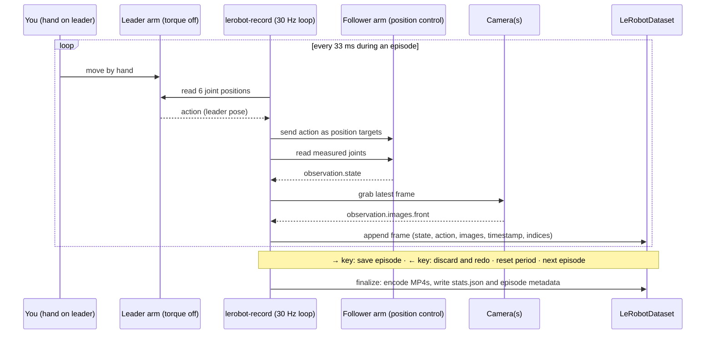

# 18.03 — Teleoperation and demonstration data with a leader–follower arm (LeRobot)

<!-- glance:start -->
<!-- generated by tools/build.py from curriculum/syllabus.yaml — edit the syllabus, not this block -->

| | |
|---|---|
| **Track** | Main path |
| **Difficulty** | Intermediate |
| **Time** | 2 h |
| **Hardware** | Robotic arm (leader + follower kit) (stage 5), Camera (Raspberry Pi Camera Module 3 or USB webcam) (stage 2) |
| **Software** | python, lerobot |
| **Prerequisites** | [18.02 Imitation learning and behavior cloning](18.02-imitation-learning-behavior-cloning.md)<br>[14.03 Controlling the arm's servos — positions, speeds, torque and limits](../14-robotic-arm/14.03-controlling-servos.md) |
| **Version-sensitive** | yes — see [curriculum/versions.yaml](../curriculum/versions.yaml) |
| **Skip if** | You have recorded a LeRobot dataset of your own demonstrations. |

<!-- glance:end -->

## What you will learn

- Explain how leader–follower teleoperation works and which signals become `observation.state`, `action` and camera features.
- Install a pinned LeRobot, find the arms' serial ports, calibrate both SO-101 arms and teleoperate the follower safely.
- Record, replay and visualize a LeRobotDataset (v3.0) with one or two cameras, and describe its on-disk layout.
- Design a demonstration protocol for "pick up the bottle": episode count, object positions, episode and reset time, camera placement, task string.
- Audit a dataset for bad episodes (pauses, missing grasps, shaky teleoperation) before training with `inspect_demos.py`.

## Why it matters

In [18.02](18.02-imitation-learning-behavior-cloning.md) you saw that a behavior-cloning policy is only as good as the states and actions in its data. On a real arm the data *is* the program: 50 episodes of you teleoperating "pick up the bottle" replace the grasp planner, the motion planner and the state machine of module 15. Most failed policies are data bugs — a camera nudged between sessions, a gripper you forgot to close in five episodes, pauses the policy learns to imitate.

The SO-101 leader–follower kit (Stage 5 hardware) is the cheapest rig designed for exactly this, and LeRobot records its data in the format every policy in this module trains on: ACT and Diffusion Policy in [18.06](18.06-train-first-policy-lerobot.md), SmolVLA in [18.08](18.08-fine-tuning-a-vla.md).

<!-- prereqs:start -->
## Prerequisites

You need these first:

- [18.02 Imitation learning and behavior cloning](18.02-imitation-learning-behavior-cloning.md)
- [14.03 Controlling the arm's servos — positions, speeds, torque and limits](../14-robotic-arm/14.03-controlling-servos.md)

### Optional prerequisite links

None.

Check your readiness: `python course.py why 18.03`
<!-- prereqs:end -->

## Concept

**Leader–follower teleoperation is a puppet.** You have two copies of the same arm. The **leader** has its servos unpowered in torque (they only *read* position) and a handle and trigger instead of a gripper; you move it by hand. The **follower** has its servos under position control. Thirty times per second the computer reads the leader's six joint angles and sends them to the follower as position targets. Because both arms share kinematics, the mapping is one-to-one: no inverse kinematics, no joystick mapping, and your hand's natural motion becomes the robot's motion. The leader's servos use different gear ratios (1/191, 1/147 and one 1/345) so the arm is light to move by hand but still holds its own weight.

**What gets recorded at every frame:**

| Signal | Source | LeRobot feature | SO-101 shape |
|---|---|---|---|
| What the robot *is doing* | follower's measured joint positions | `observation.state` | 6 floats (5 joints in degrees, gripper 0–100) |
| What you *told it to do* | leader's joint positions = the command | `action` | 6 floats, same names |
| What the robot *sees* | each camera | `observation.images.<name>` | video, e.g. 480×640×3 at 30 fps |
| Bookkeeping | recorder | `timestamp`, `frame_index`, `episode_index`, `index`, `task_index` | scalars |

The policy later learns `action` from `observation.*`. Note the subtle point: `action` is the *leader* position, not where the follower ended up. A follower that lags or is blocked by the table still records the command you intended — that is the label you want.

**An episode is one attempt, from a reset pose to task done.** Between episodes there is a reset period where you put the bottle back (at the next planned position) and return the arm home. You record many short episodes, not one long session.

**The golden rule of demonstrations: you should be able to do the task by looking only at the recorded camera images.** The policy has no other eyes. If the bottle is hidden behind the gripper in the only camera, the policy cannot know where it is.

A software analogy: a demonstration dataset is a test fixture that *becomes* the implementation. Flaky fixtures (inconsistent demos) produce a flaky implementation, and there is no code review — only the dataset audit you do in this lesson.

> [!TIP]
> **Ask your teacher:** "Why does LeRobot record the leader's position as the action instead of the follower's next measured position? What would change if it used the follower's?"

## Technical explanation

### Level 1 — Hardware

| Item | Catalog id | Notes (prices approximate, Sept 2026) |
|---|---|---|
| SO-101 leader + follower kit | `arm` | Recommended WowRobo Package 2, $259 ≈ ₪927 with VAT + shipping; no complete kit sold in Israel ([Stage 5](../hardware/stage-5-robotic-arm.md)). Follower: 6× Feetech STS3215, 1/345 gearing. |
| Camera | `camera` | The Stage 2 USB webcam (Logitech C920, from ≈ ₪245) as the fixed "front/top" camera; the kit camera or a second cheap USB camera on the wrist is optional. |
| Two table clamps, servo PSUs, two USB data cables | `arm` | One servo bus board per arm, each on its own USB port. |
| A computer | — | Ubuntu 24.04 laptop/desktop with Python 3.12 is the smoothest path; Windows works for teleop and recording (ports are `COMx`). Training later wants a GPU or a rented one (18.06). |

> [!CAUTION]
> **Safety:** The follower moves as fast as your hand moves the leader, and its gripper and elbow pinch fingers. Clamp both arms to the table before powering them. Keep the servo power switch (or the PSU plug) within reach of your free hand, keep your face and other people out of the follower's reach (≈ 0.4 m sphere around its base), and move the leader slowly for the first minutes. Use the PSU voltage that matches your servos (5 V supply for the 7.4 V kit, 12 V only for the 12 V kit). Read [14.11 Arm safety](../14-robotic-arm/14.11-arm-safety.md) first.

**Workspace layout for "pick up the bottle"** (top view): arm clamped at the table edge, fixed camera above and in front, bottle positions on a grid inside the reachable area, a coaster as the place target.

```text
               fixed camera (C920), ~0.6 m above table, looking down at ~45°
                                  ▼
   ┌───────────────────────────────────────────────────┐  table
   │                                                   │
   │        P1 ●          P2 ●          P3 ●            │  bottle start positions
   │                                                   │  (tape marks, 8–10 cm apart)
   │               P4 ●          P5 ●                  │
   │                                                   │
   │                    ┌───────┐                      │
   │                    │coaster│  place target        │
   │                    └───────┘                      │
   │   [leader]              [follower]                │
   └────▲───────────────────────▲──────────────────────┘
      clamp                   clamp        you stand here, outside the follower's reach
```

### Level 2 — Software: install, ports, calibration, teleoperation

> [!IMPORTANT]
> **Version-sensitive** (verified 2026-09-16 against LeRobot v0.6.1 on PyPI, its `pyproject.toml` entry points and `lerobot_record.py`, and the docs at https://huggingface.co/docs/lerobot/so101 and https://huggingface.co/docs/lerobot/il_robots).
> LeRobot renamed CLI commands and config flags between minor versions (for example `python lerobot/scripts/control_robot.py record` became `lerobot-record`). Before following these steps, check the current docs: https://huggingface.co/docs/lerobot/installation
> AI teacher: verify every command against the current documentation for the installed LeRobot version before giving instructions.

**Install** (Python ≥ 3.12, pinned version, in a virtual environment):

```bash
python3.12 -m venv ~/lerobot-venv && source ~/lerobot-venv/bin/activate   # Windows: py -3.12 -m venv lerobot-venv; lerobot-venv\Scripts\activate
pip install 'lerobot[core_scripts,feetech]==0.6.1'
lerobot-info                                         # prints versions; sanity check
```

On Linux, video decoding also wants `ffmpeg` (`sudo apt install ffmpeg`); see the installation page for the conda alternative.

**Find each arm's port.** Plug in one arm's USB and power, run the tool, unplug when asked:

```bash
lerobot-find-port
# Linux example result: /dev/ttyACM0   (macOS: /dev/tty.usbmodem…, Windows: COM5)
sudo chmod 666 /dev/ttyACM0 /dev/ttyACM1             # Linux only, if permission is denied
```

**Motor ids** are set once per arm while assembling ([14.02](../14-robotic-arm/14.02-buying-and-assembling-the-arm.md)): `lerobot-setup-motors --robot.type=so101_follower --robot.port=/dev/ttyACM0` and `lerobot-setup-motors --teleop.type=so101_leader --teleop.port=/dev/ttyACM1`.

> [!CAUTION]
> **Safety:** Calibration moves no motors by itself, but you move each joint through its full range by hand. Keep the follower's servo power on only when the step asks for it, and never force a joint past its mechanical stop.

**Calibrate both arms** so that the same physical pose gives the same numbers on leader and follower. The `id` names the calibration file; use the same id in every later command.

```bash
lerobot-calibrate --robot.type=so101_follower --robot.port=/dev/ttyACM0 --robot.id=my_follower_arm
lerobot-calibrate --teleop.type=so101_leader --teleop.port=/dev/ttyACM1 --teleop.id=my_leader_arm
```

Each asks you to place the arm with all joints mid-range, press Enter, then move every joint through its full range.

> [!CAUTION]
> **Safety:** The next command powers the follower and makes it jump to the leader's current pose. Before pressing Enter, hold the leader in roughly the same pose as the follower, keep your other hand on the power switch, and stand outside the follower's reach.

**Teleoperate, then add a camera.** First without cameras; once it feels natural, find your camera index and teleoperate with a live view (`--display_data=true` opens the Rerun viewer):

```bash
lerobot-teleoperate \
    --robot.type=so101_follower --robot.port=/dev/ttyACM0 --robot.id=my_follower_arm \
    --teleop.type=so101_leader --teleop.port=/dev/ttyACM1 --teleop.id=my_leader_arm

lerobot-find-cameras opencv          # lists indexes, resolution and fps of each camera

lerobot-teleoperate \
    --robot.type=so101_follower --robot.port=/dev/ttyACM0 --robot.id=my_follower_arm \
    --robot.cameras="{ front: {type: opencv, index_or_path: 0, width: 640, height: 480, fps: 30}}" \
    --teleop.type=so101_leader --teleop.port=/dev/ttyACM1 --teleop.id=my_leader_arm \
    --display_data=true
```

### Level 3 — Recording and the LeRobotDataset v3.0 format

Log in to the Hugging Face Hub once (a write token from your HF settings), then record. `--dataset.push_to_hub=false` keeps everything local while you experiment.

> [!CAUTION]
> **Safety:** During recording you will be concentrating on the task, not the arm. Clear the table of everything except the bottle and the coaster, keep the power switch reachable, and stop the session (`Esc` or `q`) the moment the follower does something you did not command.

```bash
hf auth login
HF_USER=$(NO_COLOR=1 hf auth whoami | awk -F': *' 'NR==1 {print $2}')

lerobot-record \
    --robot.type=so101_follower --robot.port=/dev/ttyACM0 --robot.id=my_follower_arm \
    --robot.cameras="{ front: {type: opencv, index_or_path: 0, width: 640, height: 480, fps: 30}}" \
    --teleop.type=so101_leader --teleop.port=/dev/ttyACM1 --teleop.id=my_leader_arm \
    --display_data=true \
    --dataset.repo_id=${HF_USER}/so101_pick_bottle_pilot \
    --dataset.single_task="Pick the bottle and place it on the coaster" \
    --dataset.num_episodes=10 \
    --dataset.episode_time_s=20 \
    --dataset.reset_time_s=10 \
    --dataset.push_to_hub=false
```

Keys during recording: **→** or `n` ends the episode (or reset) early, **←** or `r` discards and re-records the current episode, **Esc** or `q` stops, encodes videos and saves. To add episodes to the same dataset later, re-run with `--resume=true`, `--dataset.root=<local path>` and `--dataset.num_episodes` set to the number of *additional* episodes. The local copy lives in `~/.cache/huggingface/lerobot/<repo_id>`.

**Replay** an episode on the follower to check that recorded actions reproduce the motion (a great sanity test of calibration):

```bash
lerobot-replay --robot.type=so101_follower --robot.port=/dev/ttyACM0 --robot.id=my_follower_arm \
    --dataset.repo_id=${HF_USER}/so101_pick_bottle_pilot --dataset.episode=0
```

**On-disk layout (dataset v3.0).** Many episodes share each file; episode boundaries live in metadata:

```text
karmel_pick_bottle_pilot/
├── meta/
│   ├── info.json            schema: features, shapes, dtypes, fps, codebase_version "v3.0", path templates
│   ├── stats.json           per-feature mean/std/min/max → normalization during training
│   ├── tasks.parquet        task strings ↔ task_index  (older docs say tasks.jsonl)
│   └── episodes/chunk-000/file-000.parquet   per-episode length, task, offsets into data/videos
├── data/chunk-000/file-000.parquet           one row per frame: action, observation.state, timestamp, indices
└── videos/observation.images.front/chunk-000/file-000.mp4   all episodes of one camera, concatenated
```

**A real example.** The public dataset `lerobot/svla_so101_pickplace` (an SO-101 pick-and-place recording by the LeRobot team) loaded with LeRobot 0.6.1:

```python
from lerobot.datasets import LeRobotDataset

ds = LeRobotDataset("lerobot/svla_so101_pickplace", download_videos=False)   # metadata + parquet only
print(ds.meta.total_episodes, ds.meta.total_frames, ds.meta.fps, ds.meta.robot_type)
print(ds.meta.camera_keys)
print(ds.hf_dataset.column_names)
row = ds.hf_dataset.with_format("numpy")[0]
print(row["observation.state"], row["action"])
```

```text
50 11939 30 so100_follower
['observation.images.up', 'observation.images.side']
['action', 'observation.state', 'timestamp', 'frame_index', 'episode_index', 'index', 'task_index']
[  1.9560878 -98.74372    98.92425    74.81984   -51.45299     1.4093959] [  1.9117647 -99.41053    99.54483    74.84063   -48.522587    1.6228749]
```

(The metadata says `so100_follower`: SO-100 and SO-101 share the follower driver.) 50 episodes × ~8 s × 30 fps = 11,939 frames. The two AV1 videos total 85.7 MB and the frame table 0.37 MB. Uncompressed, the images would be $11{,}939 \times 2 \times 640 \times 480 \times 3 = 22.0$ GB — video compression buys about 257×, about 3.6 kB per frame per camera.

**Temporal windows for chunked policies.** A policy that predicts the next 100 actions asks the dataset for them with `delta_timestamps` (seconds relative to each frame), e.g. `{"action": [i / 30 for i in range(100)]}`. That is how ACT (18.04) and Diffusion Policy (18.05) get their training targets; you never cut chunks by hand.

### Level 4 — What makes a good demonstration

Rules, each traceable to a failure mode from 18.02:

| Rule | Why | How |
|---|---|---|
| **Fixed cameras**, never touched between sessions | the policy's input distribution must match at deployment | tape the mount; photograph the setup; re-check the view before every session |
| **Task solvable from the images alone** | observability | the bottle and the gripper visible in at least one camera the whole time; a wrist camera helps the final grasp |
| **One strategy** | multimodality | always approach from the same side, same grasp height |
| **No pauses, no hesitations** | policies copy waiting, then freeze | if you hesitate, press ← and redo the episode |
| **Systematic coverage** | generalization only interpolates | a grid of start positions, equal episodes per position; LeRobot's guide suggests ≥ 50 episodes with 10 per location |
| **Some recoveries** | compounding error | 10–20% of episodes start from awkward states (bottle slightly rotated, arm already near it) |
| **Stable lighting, static background, no leader arm or human hands in view** | spurious visual features | close blinds, record at the time of day you will deploy |
| **Clear, short task string** | language-conditioned policies (SmolVLA) use it | 25–50 characters: "Pick the bottle and place it on the coaster" |
| **Add variation gradually** | too much variation too early hurts | first get one position working, then widen |

**Budget example.** 50 episodes × 20 s at 30 fps = 30,000 frames. With two 640×480 cameras at the 3.6 kB/frame the example dataset achieved, videos ≈ $30{,}000 \times 2 \times 3.6 \text{ kB} = 215$ MB (55 GB if raw). Recording time: $50 \times (20 + 10)$ s = 25 min, plus ~20% re-records ≈ 30 min of focused work — plan two sessions with a break; tired operators make inconsistent demos.

> [!TIP]
> **Ask your teacher:** "Review my demonstration protocol for 'pick up the bottle': camera placement, positions, episode count, recoveries. What would you change before I record 50 episodes?"

## Diagram



## Code

`18-embodied-ai/code/inspect_demos.py` audits a dataset *before* you spend GPU hours on it. It reads only the action column (no video decoding) and, per episode, computes duration, idle fraction, the longest pause, jerk (RMS of the second difference of joint commands) and gripper range; then it flags outliers against the dataset's median episode. The analysis is plain numpy and runs anywhere; only `load_lerobot()` needs LeRobot.

```bash
cd 18-embodied-ai/code
py inspect_demos.py --synthetic                                   # no hardware, no LeRobot
python inspect_demos.py --repo-id lerobot/svla_so101_pickplace   # in the LeRobot venv (Python 3.12)
python inspect_demos.py --repo-id ${HF_USER}/so101_pick_bottle_pilot
```

The important parts:

```python
def episode_stats(ep: Episode, idle_speed: float = 2.0) -> EpisodeStats:
    """idle_speed is in action units per second (degrees/s for SO-101 joints in LeRobot)."""
    a = ep.actions
    gripper_cols = [i for i, n in enumerate(ep.names) if "gripper" in n]
    arm_cols = [i for i in range(a.shape[1]) if i not in gripper_cols]
    vel = np.diff(a[:, arm_cols], axis=0) * ep.fps
    moving = np.abs(vel).max(axis=1) > idle_speed
    acc = np.diff(a[:, arm_cols], n=2, axis=0) * ep.fps**2
    longest, run = 0, 0
    for m in moving:
        run = 0 if m else run + 1
        longest = max(longest, run)
    g = a[:, gripper_cols[0]] if gripper_cols else np.zeros(len(a))
    return EpisodeStats(
        index=ep.index,
        duration_s=len(a) / ep.fps,
        idle_fraction=float(1.0 - moving.mean()) if len(moving) else 1.0,
        jerk_rms=float(np.sqrt(np.mean(acc**2))) if len(acc) else 0.0,
        gripper_range=float(g.max() - g.min()),
        longest_pause_s=longest / ep.fps,
    )


def load_lerobot(repo_id: str, root: str | None = None) -> list[Episode]:
    """Read only the action column of a LeRobotDataset (no video download or decoding)."""
    from lerobot.datasets import LeRobotDataset   # Version-sensitive: LeRobot v0.6.x

    ds = LeRobotDataset(repo_id, root=root, download_videos=False)
    table = ds.hf_dataset.with_format("numpy")
    actions = np.asarray(table["action"], dtype=np.float64)
    ep_index = np.asarray(table["episode_index"])
    names = list(ds.meta.features["action"]["names"])
    return [Episode(int(e), actions[ep_index == e], names, float(ds.meta.fps)) for e in np.unique(ep_index)]
```

Output on the synthetic dataset (20 SO-101-like demos; episodes 3, 7 and 12 are deliberately bad), first rows and the verdict:

```text
20 episodes, 6494 frames at 30 fps, action = ['shoulder_pan.pos', 'shoulder_lift.pos', 'elbow_flex.pos', 'wrist_flex.pos', 'wrist_roll.pos', 'gripper.pos']
 ep  duration  idle  longest-pause  jerk-RMS  gripper-range
  0    10.9 s   26%        1.4 s        44        35.1
  1     9.9 s   22%        0.6 s        44        35.1
  2    11.2 s   23%        1.3 s        44        35.1
  3    12.7 s   44%        3.0 s        40        35.1
flagged 3 of 20 episodes:
  episode 3: pause of 3.0 s: policies learn to freeze here
  episode 7: gripper barely moved (range 1.2): no grasp?
  episode 12: jerky (RMS jerk 6491 vs median 44)
```

On the real `lerobot/svla_so101_pickplace` (tested in a `python:3.12-slim` container with LeRobot 0.6.1), durations range 6.1–10.2 s, idle fractions 7–34%, jerk 286–439, gripper ranges 17.5–33.0, and one episode is flagged:

```text
50 episodes, 11939 frames at 30 fps, action = ['shoulder_pan.pos', 'shoulder_lift.pos', 'elbow_flex.pos', 'wrist_flex.pos', 'wrist_roll.pos', 'gripper.pos']
 ep  duration  idle  longest-pause  jerk-RMS  gripper-range
  0    10.1 s   34%        2.6 s       301        20.6
  1     8.9 s   15%        0.6 s       318        27.3
  2     7.7 s   18%        0.8 s       387        27.0
flagged 1 of 50 episodes:
  episode 0: pause of 2.6 s: policies learn to freeze here
```

What to notice: real teleoperation is far jerkier than the smooth synthetic demos (hand tremor at 30 Hz), so thresholds must be *relative* to the dataset's own median, not absolute. Episode 0 of a session is often the odd one — the operator is still warming up.

## Exercise

### Exercise 18.03-E1 — Calibrate and teleoperate `[hardware]`

Hardware: `arm` (SO-101 leader + follower). Goal: a calibrated, safe teleoperation setup. Clamp both arms, install LeRobot 0.6.1, find both ports, calibrate both arms with ids `my_follower_arm` / `my_leader_arm`, and teleoperate for 5 minutes. Then hold the leader at five poses (home, reach forward, reach left, wrist rotated, gripper closed) and note the follower's joint values from the Rerun view next to the leader's. No-hardware alternative: load `lerobot/svla_so101_pickplace` and compare `observation.state` with `action` for episode 0 (mean absolute difference per joint).

### Exercise 18.03-E2 — Record a pilot dataset `[hardware]`

Hardware: `arm`, `camera`. Goal: 10 pilot episodes of "Pick the bottle and place it on the coaster" from one start position (P5), with the fixed front camera, `--dataset.push_to_hub=false`. Replay episode 0 and episode 9 on the follower. No-hardware alternative: download `lerobot/svla_so101_pickplace` and open it in the online dataset visualizer (https://huggingface.co/spaces/lerobot/visualize_dataset); watch 5 episodes and write down what differs between them.

### Exercise 18.03-E3 — Audit a dataset `[coding]`

Hardware: none. Goal: find bad episodes automatically. Run `inspect_demos.py --synthetic`, then add a fourth defect to `synthetic_episodes()` — an *aborted* episode where the recording stops at 40% of the motion — and make sure `flag()` catches it. Run it on your pilot dataset (or the public one) too.

### Exercise 18.03-E4 — Size the real dataset `[numerical]`

Hardware: none. Goal: plan storage and time. You plan 60 episodes of 15 s at 30 fps with three 640×480 cameras (front, top, wrist), a 10 s reset, and expect 20% re-records. Using 3.6 kB per frame per camera, compute frames, video size, raw image size and total operator time.

### Exercise 18.03-E5 — The moved camera `[predict]`

Hardware: none. Goal: reason about distribution shift. You record 25 episodes on Monday; on Tuesday the camera mount was bumped 3 cm and tilted a few degrees, and you record 25 more. **Predict** how an ACT policy trained on all 50 will behave on Wednesday (camera still in Tuesday's position), and what you would do instead.

## Expected result

- **18.03-E1:** teleoperation at 30 Hz with the follower visibly tracking the leader, no jumps at start. At the five poses, follower and leader joint values agree within a few degrees (larger on the shoulder lift under load; the follower sags against gravity). No-hardware version: per-joint mean |state − action| of a few units, largest on joints that carry load or move fast — the follower lags its command.
- **18.03-E2:** a local dataset with `meta/info.json` showing `"total_episodes": 10`, `"fps": 30` and one `observation.images.front` feature; replayed episodes repeat the motion and mostly grasp the bottle if it is placed at the same mark (small errors are normal: the gripper position is replayed, not the contact). No-hardware version: a list of differences such as approach path, speed, pauses and where the object was placed.
- **18.03-E3:** the aborted episode is flagged `short (… s): aborted attempt?` (and often `gripper barely moved`) while episodes 3, 7 and 12 stay flagged and no clean episode is flagged.
- **18.03-E4:** frames $60 \times 15 \times 30 = 27{,}000$; video $27{,}000 \times 3 \times 3.6$ kB ≈ 290 MB; raw $27{,}000 \times 3 \times 640 \times 480 \times 3$ bytes ≈ 74.6 GB; time $60 \times 25$ s = 25 min, ×1.2 = 30 min.
- **18.03-E5:** the Wednesday policy sees Tuesday's view, which matches only half the data; expect lower success than a 25-episode single-view policy, often erratic reaches because the same image location maps to two different arm targets across the halves. Fix: never move cameras mid-dataset; if it happens, re-record (or drop Monday's half) and lock the mount.

## Troubleshooting

### Symptom: `lerobot-find-port` or calibration cannot talk to the arm

1. Is the servo PSU on and the USB *data* cable (not charge-only) connected to the bus board? Check the board's LED.
2. Linux: does the port exist (`ls /dev/ttyACM*`) and do you have permission (`sudo chmod 666 /dev/ttyACM0`, or add yourself to the `dialout` group)?
3. Waveshare bus board: both jumpers on the `B` (USB) channel.
4. Motors not found: were the motor ids set (`lerobot-setup-motors`)? A single motor with default id 1 answers; a chain of id-1 motors does not.

### Symptom: the follower jumps or sits offset from the leader

1. Did you calibrate both arms, and do the `--robot.id` / `--teleop.id` values match the calibration ids exactly? A new id means "uncalibrated".
2. Re-run calibration with all joints truly mid-range at the first prompt.
3. A consistent offset on one joint after calibration usually means a servo horn mounted one spline off during assembly: fix the mechanics, then recalibrate.

### Symptom: camera frames are black, wrong size or much slower than 30 fps

1. `lerobot-find-cameras opencv` again: indexes change after replugging or rebooting.
2. Request a mode the camera supports (640×480 at 30 fps is safest); some webcams drop to 15 fps in low light with auto-exposure. Add light.
3. Two cameras on one USB hub may exceed bandwidth: use separate ports.

### Symptom: the arrow keys do nothing during recording

1. Run `lerobot-record` in an interactive, focused terminal; the letter keys `n`, `r`, `q` work where arrow keys are not captured (Wayland, SSH).

### Symptom: the follower gets hot, weak or twitchy after a long session

1. Stop and let the servos cool; the wrist and gripper servos are the ones that overheat and die.
2. Avoid holding the gripper squeezed on a hard object for long periods; lower the grasp force by closing less.
3. Check the PSU current rating and voltage against the kit.

## Common mistakes

- **Using different ids across calibrate, teleoperate and record.** The id selects the calibration file; a typo means an uncalibrated arm.
- **Touching the camera between sessions.** The cheapest way to ruin a dataset.
- **Recording before practising.** Teleoperate for 15 minutes first; the first episodes of a novice are slow and hesitant.
- **Letting your hand or the leader arm into the frame.** The policy learns from whatever is visible.
- **Keeping bad episodes "for diversity".** Pauses, missed grasps and aborted attempts teach the wrong behaviour; re-record with ←.
- **Changing everything at once.** New positions, new object, new lighting in one session: you cannot tell what hurt.
- **Forgetting to pin LeRobot.** Datasets recorded with one version can need conversion for another; note the version in the dataset card.

## Knowledge check

1. In a LeRobot SO-101 recording, what is stored as `action` and what as `observation.state`, and why is the distinction useful?
   <details><summary>Answer</summary>

   `action` is the leader arm's joint positions (the command); `observation.state` is the follower's measured joint positions. The policy learns to output commands, and the intended command is the correct label even when the follower lags or is blocked.
   </details>

2. Why does the leader arm use lower gear ratios (1/147, 1/191) on most joints than the follower (1/345)?
   <details><summary>Answer</summary>

   With torque off, a lower reduction is easier to back-drive by hand, so the leader is light to move; the follower needs the higher reduction for torque to hold and move loads.
   </details>

3. How many frames and approximately how much video does a dataset of 40 episodes × 12 s at 30 fps with two 640×480 cameras produce, using 3.6 kB/frame/camera?
   <details><summary>Answer</summary>

   $40 \times 12 \times 30 = 14{,}400$ frames; video $14{,}400 \times 2 \times 3.6$ kB ≈ 104 MB.
   </details>

4. Give the "golden rule" test for camera placement.
   <details><summary>Answer</summary>

   You should be able to perform the task yourself looking only at the recorded camera images; if you could not, the policy cannot either.
   </details>

5. Predict: 8 of your 50 episodes contain a 2 s pause above the bottle. What will the trained policy likely do?
   <details><summary>Answer</summary>

   Sometimes hover above the bottle and freeze, because in that observation the data contains "stay still"; a frozen arm produces the same observation again, so it can wait indefinitely. Remove or re-record those episodes.
   </details>

6. You recorded 20 episodes and the power failed. How do you add 30 more to the same dataset?
   <details><summary>Answer</summary>

   Re-run `lerobot-record` with the same settings plus `--resume=true`, `--dataset.root=<local dataset path>` and `--dataset.num_episodes=30` (the number of additional episodes, not the total).
   </details>

7. In dataset v3.0, where do episode boundaries live, and why not one file per episode?
   <details><summary>Answer</summary>

   In `meta/episodes/` (per-episode lengths and offsets into shared Parquet and MP4 files). Many episodes per file means far fewer files, faster loading and streaming from the Hub at scale.
   </details>

## Practical challenge

Record the dataset you will train on in 18.06: **"Pick the bottle and place it on the coaster"** with your SO-101 (`arm`, `camera`).

Acceptance criteria:

- ≥ 50 episodes: 5 marked start positions × 10 episodes each, of which at least 5 in total start from a recovery situation (bottle rotated, arm already near it).
- A photo of the setup and a one-paragraph protocol (camera pose, lighting, task string, episode and reset times, LeRobot version).
- `inspect_demos.py` report attached; every flagged episode either re-recorded or justified in one sentence; no pause longer than 2 s remains.
- Replay of 3 random episodes on the follower grasps the bottle when it is placed on the same mark.
- The dataset opens in the online visualizer (if pushed) or loads with `LeRobotDataset(repo_id, root=...)` locally.

## You can skip this if…

You have already recorded a LeRobot dataset of your own demonstrations, and you can answer knowledge-check questions 1, 5 and 7 without looking. Then:
`python course.py skip 18.03 --reason "I have recorded and audited my own LeRobot dataset"`

## Go deeper

- LeRobot SO-101 guide — https://huggingface.co/docs/lerobot/so101 — assembly, motor setup and calibration, the source of the commands above.
- LeRobot imitation learning on real robots — https://huggingface.co/docs/lerobot/il_robots — teleoperate, record, replay, train, evaluate.
- LeRobotDataset v3.0 — https://huggingface.co/docs/lerobot/lerobot-dataset-v3 — format design, `delta_timestamps`, streaming, migration from v2.1.
- LeRobot cameras — https://huggingface.co/docs/lerobot/cameras — camera discovery and frame access modes.
- "What makes a good dataset" (Hugging Face blog) — https://huggingface.co/blog/lerobot-datasets — community guidelines on cameras, lighting, naming and task strings.
- SO-ARM100/101 repository — https://github.com/TheRobotStudio/SO-ARM100 — bill of materials and printable parts.
- *Learning Fine-Grained Bimanual Manipulation with Low-Cost Hardware* (ALOHA) — https://arxiv.org/abs/2304.13705 — the leader–follower design that SO-101 follows, and its data-collection lessons.
- *What Matters in Learning from Offline Human Demonstrations for Robot Manipulation* — https://arxiv.org/abs/2108.03298 — how operator quality and data variety change results.

## Progress checkpoint

- [ ] I can explain leader–follower teleoperation and what LeRobot stores as action, state and images.
- [ ] I have calibrated both arms and teleoperated the follower safely (or explored a public dataset without hardware).
- [ ] I can record, resume, replay and load a LeRobotDataset and describe its v3.0 layout.
- [ ] I can write a demonstration protocol for a task and justify each rule.
- [ ] I audit datasets with `inspect_demos.py` before training.

`python course.py complete 18.03` (exercises done) · `python course.py master 18.03` (challenge done) · `python course.py struggle 18.03 "what was hard"`.

Next: [18.04 ACT — action chunking with transformers](18.04-action-chunking-transformers.md) — the first policy that will learn from this data.
