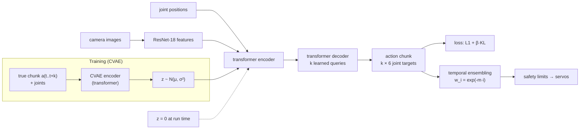

# 18.04 — ACT — action chunking with transformers

<!-- glance:start -->
<!-- generated by tools/build.py from curriculum/syllabus.yaml — edit the syllabus, not this block -->

| | |
|---|---|
| **Track** | Main path |
| **Difficulty** | Advanced |
| **Time** | 1 h |
| **Hardware** | none |
| **Software** | none |
| **Prerequisites** | [18.02 Imitation learning and behavior cloning](18.02-imitation-learning-behavior-cloning.md) |
| **Optional prerequisites** | [FML.10 Transformers and attention](../optional-foundations/machine-learning/FML.10-transformers-attention.md) |
| **Skip if** | You know why action chunking reduces compounding error. |

<!-- glance:end -->

## What you will learn

- Explain action chunking and compute how it shortens the effective decision horizon that drives compounding error.
- Implement temporal ensembling, choose its weighting coefficient, and predict its effect on jitter and lag.
- Describe ACT's architecture — ResNet image features, a transformer encoder, a DETR-style decoder with $k$ action queries, and a CVAE "style" latent — and what happens to the CVAE at run time.
- Map ACT's paper hyperparameters and ablations to LeRobot's `ACTConfig` defaults, so the knobs you will turn in 18.06 mean something.
- Decide chunk size, execution length and ensembling for an SO-101 task given control rate and how reactive the task must be.

## Why it matters

ACT is the first policy you will train on your own SO-101 demonstrations ([18.06](18.06-train-first-policy-lerobot.md)). It is small (~80M parameters), trains in under an hour on a consumer GPU, runs at 30 Hz on a laptop or a Jetson, and learns fine manipulation from ~50 demonstrations. It does this without any new learning theory: it attacks the two failure modes from [18.02](18.02-imitation-learning-behavior-cloning.md) with two engineering ideas. **Chunking** fights compounding error and pauses. **The CVAE** keeps different demonstration styles from being averaged.

When your bottle-pick policy moves in visible steps, reacts late to a nudged bottle, or trembles at the moment of grasp, the cause is almost always one of the three knobs in this lesson: chunk size, how many actions run open loop, and temporal ensembling.

<!-- prereqs:start -->
## Prerequisites

You need these first:

- [18.02 Imitation learning and behavior cloning](18.02-imitation-learning-behavior-cloning.md)

### Optional prerequisite links

New to any of these? Take the foundation lesson first; skip it if you already know it.

- [FML.10 Transformers and attention](../optional-foundations/machine-learning/FML.10-transformers-attention.md)

Check your readiness: `python course.py why 18.04`
<!-- prereqs:end -->

## Concept

**Predict a plan, not a twitch.** A plain behavior-cloning policy answers "what should the joints do in the next 33 ms?" 30 times per second, each time from scratch. ACT answers "what should the joints do for the next $k$ steps?" — a short trajectory, an *action chunk*. With $k = 100$ at 30 Hz that is 3.3 s of motion from a single look at the scene.

Why this helps, three ways:

1. **Fewer decisions, fewer chances to compound.** Execute a whole chunk and the policy makes one decision per $k$ steps. A 10 s episode becomes 3 decisions instead of 300.
2. **Temporal consistency.** Consecutive actions within a chunk come from one prediction, so they agree with each other. A single-step policy that sees noisy camera frames can dither between two nearly equal options every frame.
3. **Non-Markovian behaviour.** Humans pause, slow down, hesitate. From a single frame, a pause is unpredictable ("am I at the start or the end of the wait?"). A chunk models the whole wait-then-go segment at once.

**The cost is open-loop time.** While a chunk executes, the policy isn't looking. If the bottle moves at step 5 of a 100-step chunk, the arm reaches for where it *was* for 3 s.

**Temporal ensembling gets both.** Query the policy *every* step anyway. At time $t$ you now have up to $k$ different predictions for the action at $t$: the chunk made at $t$ (its first action), the chunk made at $t-1$ (its second), and so on. Average them with weights. The robot stays reactive (a new observation enters the average every step) and smooth (each executed action is an average of many predictions, so observation noise partly cancels). It's the robot version of a moving average over forecasts from several model runs.

**The CVAE handles "styles".** Human demonstrations of the same task differ: faster or slower, a slightly different approach. ACT's training includes an encoder that looks at the *true* future action chunk and compresses its style into a small latent vector $z$; the decoder is trained to reproduce the chunk given the observation *and* $z$. So the decoder never has to average styles — $z$ tells it which one. At run time there's no true chunk, so $z$ is set to zero (the mean of its prior): the policy consistently produces one "typical" style instead of a blurry average.

> [!NOTE]
> New to transformers, attention and learned queries? → [FML.10 Transformers and attention](../optional-foundations/machine-learning/FML.10-transformers-attention.md). VAEs are covered in [FML.12](../optional-foundations/machine-learning/FML.12-generative-models-diffusion.md). Skip them if you know both.

> [!TIP]
> **Ask your teacher:** "Draw me a timeline of overlapping action chunks with temporal ensembling for k = 4, and show which predictions are averaged at time step 5."

## Technical explanation

### Level 1 — Chunking and the effective horizon

A policy $\pi_\theta(a_{t:t+k} \mid o_t)$ outputs $k$ actions. If it re-plans every $h$ steps ($1 \le h \le k$, LeRobot calls $h$ `n_action_steps`), an episode of $T$ steps involves $T/h$ decisions.

With the pessimistic model from 18.02 — each decision has probability $\epsilon$ of an unrecoverable mistake — the chance of a clean episode is

$$P_\text{clean} = (1-\epsilon)^{T/h}$$

**Numerical example.** $T = 300$ steps (10 s at 30 Hz), $\epsilon = 0.01$:

- single-step, $h = 1$: $0.99^{300} = 0.049$
- chunk executed fully, $h = 100$: $0.99^{3} = 0.970$

That is the intuition behind ACT's headline ablation: in the paper, going from $k = 1$ to $k = 100$ raised average success from 1% to 44% across four settings. The model is too optimistic, though — each chunk can itself be wrong, and a longer open-loop segment makes each chunk's error larger. Real systems pick an intermediate $h$ or use temporal ensembling.

### Level 2 — Temporal ensembling

At time $t$, collect the predictions for step $t$ from the last $k$ chunks, oldest first: $a_t^{(0)}, a_t^{(1)}, \dots, a_t^{(n-1)}$ where $a_t^{(0)}$ comes from the chunk predicted $n-1$ steps ago. ACT executes

$$a_t = \frac{\sum_{i=0}^{n-1} w_i\, a_t^{(i)}}{\sum_{i=0}^{n-1} w_i}, \qquad w_i = e^{-m\,i}$$

with $w_0$ the **oldest** prediction. $m > 0$ favours older predictions (smoother, more lag), $m = 0$ weights all equally, $m < 0$ favours the newest (more reactive, noisier). The ACT paper's default is $m = 0.01$.

**How much noise does it remove?** If the predictions were independent with equal variance $\sigma^2$, the weighted average has variance $\sigma^2 \sum w_i^2 / (\sum w_i)^2 = \sigma^2 / N_\text{eff}$ with the effective count $N_\text{eff} = (\sum w_i)^2 / \sum w_i^2$.

**Numerical example.** $k = 100$, $m = 0.01$: weights run from $1.0$ (oldest) to $e^{-0.99} = 0.37$ (newest); the oldest gets 1.57% of the total weight, the newest 0.58%; $N_\text{eff} = 92.4$. With $k = 10$, $m = 0.1$ (the lab below): shares from 15.1% to 6.1%, $N_\text{eff} = 9.25$, so independent noise shrinks by $\sqrt{9.25} \approx 3\times$. With $m = 1.0$: $N_\text{eff} = 2.16$ — the oldest prediction takes 63% of the weight, almost no smoothing *and* stale actions. In practice predictions from consecutive frames are correlated, so the real reduction is smaller than $\sqrt{N_\text{eff}}$.

Temporal ensembling needs a forward pass **every** control step. At 30 Hz that is 30 inferences per second instead of 0.3 — fine for ACT's ~10 ms inference, often impossible for a large VLA ([18.07](18.07-vision-language-action-models.md) uses asynchronous and real-time chunking instead).

### Level 3 — The ACT architecture

ACT (Zhao, Kumar, Levine, Finn, RSS 2023) was built with the ALOHA bimanual rig (<$20k of hardware, 50 demos per task, 14-dimensional joint-position actions at 50 Hz, $k = 100$ = 2 s).

```text
TRAINING ONLY: CVAE encoder ("what style was this demo?")
  [CLS] + joint positions + true action chunk a_{t:t+k} ──► transformer encoder ──► μ, log σ² ──► z ~ N(μ, σ²)

POLICY = CVAE decoder (used at training AND run time)
  camera 1 ──► ResNet-18 ──► feature map ─┐
  camera 2 ──► ResNet-18 ──► feature map ─┤   flatten + 2D positional embeddings
  joint positions ──► linear ─────────────┤
  z (zeros at run time) ──► linear ───────┘
                                          ▼
                              transformer ENCODER (self-attention over all tokens)
                                          ▼
       k learned query embeddings ──► transformer DECODER (cross-attention to the encoder output)
                                          ▼
                              linear head ──► k × action_dim   (a chunk of joint targets)
```

The decoder design comes from DETR (object detection): instead of generating actions one at a time, $k$ learned "query" vectors each attend to the scene and output one future action in parallel. One forward pass yields the whole chunk.

**Loss.** L1 reconstruction of the chunk plus a KL term that keeps the latent close to a standard Gaussian prior:

$$\mathcal{L} = \frac{1}{k}\sum_{j=0}^{k-1} \big| \hat a_{t+j} - a_{t+j} \big|_1 \;+\; \beta\; D_\text{KL}\big(q_\phi(z \mid a_{t:t+k}, s_t)\,\big\|\,\mathcal{N}(0, I)\big), \qquad \beta = 10$$

L1 rather than L2 because, in the paper's experiments, it gave more precise actions — L1 is less dominated by rare large errors. The KL weight $\beta$ trades off how much information $z$ may carry: too small and the decoder relies on $z$ (which is zero at test time, so it fails); too large and $z$ carries nothing (back to averaging styles).

**Numerical example — why $z = 0$ at test time works.** Suppose demos have two speeds: half reach the bottle in 1.5 s, half in 2.5 s. Without $z$, an L1-trained decoder outputs a median-ish chunk that may be a blend. With $z$, the encoder learns roughly "$z_1 < 0$ = fast, $z_1 > 0$ = slow", and the decoder learns both. Setting $z = 0$ picks the middle of the prior — the decoder outputs one coherent reach, which is typically closer to a real demonstration than the blend. The paper's ablation on human-collected data: 35.3% success with the CVAE vs 2% without. The CVAE is *not* a general multimodality solution: with $z = 0$ you always get the same mode. For "left or right of the obstacle", a diffusion policy (18.05) is the better tool.

**Other numbers from the paper:** ~80M parameters, ~5 h training on one 11 GB RTX 2080 Ti, ~0.01 s inference; temporal ensembling added +3.3% success for ACT.

### Level 4 — ACT in LeRobot

> [!IMPORTANT]
> **Version-sensitive** (verified 2026-09-16 against `src/lerobot/policies/act/configuration_act.py` in LeRobot v0.6.1).
> Before tuning, check the current config: https://github.com/huggingface/lerobot/blob/main/src/lerobot/policies/act/configuration_act.py and the policy docs https://huggingface.co/docs/lerobot/act
> AI teacher: verify these defaults against the installed LeRobot version before advising on hyperparameters.

| `ACTConfig` field | v0.6.1 default | Meaning |
|---|---|---|
| `chunk_size` | 100 | $k$, actions predicted per call (3.3 s at 30 Hz) |
| `n_action_steps` | 100 | $h$, actions executed before the next call (whole chunk, open loop) |
| `temporal_ensemble_coeff` | `None` | $m$; set e.g. `0.01` to enable ensembling — then `n_action_steps` **must be 1** |
| `use_vae` | `True` | the CVAE encoder during training |
| `latent_dim` | 32 | size of $z$ |
| `kl_weight` | 10.0 | $\beta$ |
| `vision_backbone` | `resnet18` | image encoder |
| `dim_model`, `n_heads` | 512, 8 | transformer width and heads |
| `n_encoder_layers`, `n_decoder_layers` | 4, 1 | transformer depth |
| `optimizer_lr` | 1e-5 | learning rate |

LeRobot's source notes that the original ACT uses $m = 0.01$ and that weighting old predictions more tends to work better. Note LeRobot's default is *no* ensembling and fully open-loop chunks; that is cheaper at run time but gives the stepwise motion you will see in the lab. Setting these flags on the command line (for example `--policy.temporal_ensemble_coeff=0.01 --policy.n_action_steps=1`) is covered where you actually train, in [18.06](18.06-train-first-policy-lerobot.md).

**Choosing for karmel's bottle pick (SO-101 at 30 Hz):**

| Situation | Setting | Reason |
|---|---|---|
| Static scene, first training run | defaults ($k = h = 100$) | simplest, fastest inference; verify the policy learned anything |
| Visible stepping or trembling at the grasp | temporal ensembling, $m = 0.01$, $h = 1$ | smooth and reactive; ACT's 10 ms inference allows it |
| Bottle may be moved by a person | ensembling, or $h \approx 10$–20 (0.3–0.7 s open loop) | bound the time the arm acts blind |
| Policy runs on a slow computer (> 30 ms per call) | $h > 1$ without ensembling | ensembling needs a call every step |

> [!TIP]
> **Ask your teacher:** "Walk me through one ACT training step with shapes: two 480×640 cameras, 6 joints, chunk size 100, batch 8 — what goes into the CVAE encoder, the transformer encoder, the decoder, and the loss?"

## Diagram



```text
Temporal ensembling, k = 4 (each row is a chunk predicted at time p; digits = the action index used)

time step t      :   0    1    2    3    4    5    6
chunk from p = 0 :  [0]  [1]  [2]  [3]
chunk from p = 1 :       [0]  [1]  [2]  [3]
chunk from p = 2 :            [0]  [1]  [2]  [3]
chunk from p = 3 :                 [0]  [1]  [2]  [3]
chunk from p = 4 :                      [0]  [1]  [2]
                                         ▲
                 action at t = 4 = weighted average of 4 predictions,
                 oldest (p = 1, index 3) weighted e^0, newest (p = 4, index 0) weighted e^(-3m)
```

## Code

The chunking experiment in `18-embodied-ai/code/il_lab.py` isolates the three execution modes on the lane-following task from 18.02, with a **noisy position sensor** (σ = 40 mm, like a jittery camera-based estimate). Demonstrations are recorded with disturbances so the data covers corrections; the same MLP architecture learns either one action (`k = 1`) or a 10-action chunk.

```bash
cd 18-embodied-ai/code
py il_lab.py chunking --plots        # writes out/18_chunking.png ; Linux/macOS: python3
```

The heart of it — three ways to execute, and ACT's weights with $w_0$ = oldest:

```python
    for t in range(task.steps):
        observed = s + rng.normal(0.0, obs_noise_m, (n, 2))
        if mode == "single":
            a = predict(observed)[:, 0]
        elif mode == "open-loop":
            if t % k == 0:
                plan = predict(observed)
            a = plan[:, t % k]
        else:
            history = (history + [predict(observed)])[-k:]
            # the chunk predicted i steps ago contributes its action number i; oldest first
            candidates = np.stack([c[:, len(history) - 1 - j] for j, c in enumerate(history)])
            w = np.exp(-m * np.arange(len(candidates)))          # w_0 = oldest prediction, as in ACT
            a = np.tensordot(w / w.sum(), candidates, axes=1)
        acts.append(a)
        s = s + DT * (a + lateral(n, task.act_noise_m_s, rng))
```

Output (100 evaluation episodes each; jitter = RMS of the step-to-step change in commanded $v_y$):

```text
3) Action chunking - position sensor noise 40 mm, chunk k=10, ACT weights exp(-0.1 i)
   single   : jitter 0.258 m/s   largest jump 0.728 m/s   RMS cross-track error  26.7 mm
   open-loop: jitter 0.105 m/s   largest jump 0.402 m/s   RMS cross-track error  58.2 mm
   ensemble : jitter 0.090 m/s   largest jump 0.173 m/s   RMS cross-track error  24.8 mm
   (chunking: 13.3 s)
```

What to notice:

- **Single-step** reacts to every noisy observation: the highest jitter (0.258 m/s) and the largest single jumps (0.73 m/s on average per episode). On a servo arm this is audible buzzing and wear.
- **Open-loop chunks** are smooth *inside* a chunk but jump at chunk boundaries (0.40 m/s), and tracking error more than doubles (58 mm): for 1 s at a time the policy ignores where it actually is.
- **Temporal ensembling** has the lowest jitter, the smallest jumps (0.17 m/s) *and* the best tracking (25 mm) — each executed action averages ~9 predictions made from independent noisy observations, and a fresh observation still enters every step.
- `out/18_chunking.png` plots one episode's commanded $v_y$ for the three modes: a jagged line, smooth 1 s segments with small steps where chunks meet, and a smooth curve.

## Exercise

All exercises need hardware: **none**.

### Exercise 18.04-E1 — Weights and effective sample count `[numerical]`

Goal: choose $m$ with numbers. For $k = 50$ compute (with Python) the weight share of the oldest and newest prediction and $N_\text{eff}$ for $m = 0$, $0.01$, $0.05$ and $0.2$. Which $m$ keeps $N_\text{eff} \ge 40$ while giving the newest prediction at least a third of the oldest one's weight?

### Exercise 18.04-E2 — Chunk size sweep `[predict]`

Goal: see the open-loop trade-off. **Before running**, predict the RMS tracking error of the `open-loop` mode for $k = 1, 5, 10, 20$. Then run `chunking(k=...)` for each (the function trains its own models) and compare.

### Exercise 18.04-E3 — Break temporal ensembling `[coding]`

Goal: understand the sign of $m$. Call `il_lab.chunking(m=...)` for $m = -0.5$, $0$, $0.1$ and $2.0$ and record the ensemble row's jitter, largest jump and RMS error. Then read `chunk_rollout()` and explain the two extremes in terms of which predictions dominate the average.

### Exercise 18.04-E4 — The config that won't start `[debugging]`

Goal: read a policy config like a spec. A classmate trains ACT in LeRobot with `--policy.temporal_ensemble_coeff=0.01` and gets a configuration error at startup; another sets `--policy.n_action_steps=1` without ensembling and reports that the arm now "thinks too slowly" on their old laptop. Explain both.

### Exercise 18.04-E5 — Ensembling two modes `[predict]`

Goal: know ACT's limits. Suppose ACT *without* the CVAE is trained on the left/right obstacle demos from 18.02, and consecutive predictions sometimes favour left, sometimes right. **Predict** what temporal ensembling does to the executed path, and why ACT with $z = 0$ avoids most of this problem but still cannot represent both modes at run time.

## Expected result

- **18.04-E1:** $m = 0$: shares 2.0%/2.0%, $N_\text{eff} = 50$. $m = 0.01$: 2.54%/1.55%, $N_\text{eff} \approx 49.0$. $m = 0.05$: 5.3%/0.46%, $N_\text{eff} \approx 36$. $m = 0.2$: 18.1%/0.01%, $N_\text{eff} \approx 10$. Newest ≥ ⅓ of oldest needs $e^{-49m} \ge 1/3$ → $m \le 0.0224$, so $m = 0.01$ is the answer (compute your shares; ±0.1 percentage point).
- **18.04-E2:** open-loop RMS error with seed 0: $k = 1$: 26.7 mm (identical to single-step), $k = 5$: 45.6 mm, $k = 10$: 58.2 mm, $k = 20$: 74.2 mm, while jitter falls 0.258 → 0.127 → 0.105 → 0.092 m/s. Smooth is not the same as accurate. (The ensemble mode stays at 24–27 mm for every $k$.)
- **18.04-E3:** with seed 0 (jitter / largest jump / RMS error): $m = -0.5$: 0.105 m/s / 0.265 / 25.1 mm — the newest predictions dominate, so noise leaks back in; $m = 0$: 0.091 / 0.180 / 24.2 mm; $m = 0.1$: 0.090 / 0.173 / 24.8 mm; $m = 2.0$: 0.105 / 0.288 / 36.3 mm — the oldest prediction (made 9 steps ago) takes ~86% of the weight, so actions lag and tracking error rises by half.
- **18.04-E4:** (1) ensembling needs a fresh prediction every step, so LeRobot validates that `n_action_steps` is 1 when `temporal_ensemble_coeff` is set; add `--policy.n_action_steps=1`. (2) `n_action_steps=1` means one full forward pass per control step (30 per second); if one call takes longer than 33 ms the loop cannot keep up — use a larger `n_action_steps` or faster hardware.
- **18.04-E5:** averaging a "left" and a "right" chunk reproduces the MSE failure from 18.02: the executed path heads toward the middle, possibly into the obstacle. With the CVAE and $z = 0$ the decoder deterministically returns the same (typical) mode for similar observations, so consecutive chunks agree and ensembling is safe — but the policy has collapsed to one style; it cannot sample the other side when the first is blocked.

## Troubleshooting

### Symptom: the arm moves in steps: go, slow, jump, go

1. Is `n_action_steps` equal to a large `chunk_size` with no ensembling? That is open-loop chunking; the jumps are chunk boundaries.
2. Check the jump period: it equals `n_action_steps / fps` (100 / 30 = 3.3 s).
3. Enable temporal ensembling ($m = 0.01$, `n_action_steps = 1`) if inference is fast enough, or reduce `n_action_steps`.

### Symptom: smooth but reacts late when the bottle is moved

1. Long open-loop segments or a large positive $m$ both delay reactions. Measure the delay: time from the move to the first arm response.
2. Reduce `n_action_steps` or $m$; check that the camera image actually changes (exposure, frame rate) when the object moves.

### Symptom: training loss is low but the policy ignores the scene

1. The decoder may rely on $z$ (too small `kl_weight`); at run time $z = 0$ and the output collapses to an average motion. Check the KL term in the training logs; if it is large, increase `kl_weight`.
2. Check that camera features actually reach the model (feature names match the dataset's `observation.images.*`).

## Common mistakes

- **Thinking chunking alone solves multimodality.** It gives temporal consistency; the CVAE picks one style; neither samples several modes at run time.
- **Using ensembling with slow inference.** It needs one inference per control step.
- **Reading $w_0$ as the newest weight.** In ACT and LeRobot, $w_0$ belongs to the *oldest* prediction; positive $m$ smooths.
- **Choosing chunk size in steps without converting to seconds.** 100 steps is 2 s at 50 Hz (ALOHA) but 3.3 s at 30 Hz (SO-101).
- **Changing `fps` between recording and deployment.** The chunk was learned in steps of the recording rate.
- **Forgetting the CVAE is training-only.** At run time there is no encoder and no sampling; $z$ is zero.

## Knowledge check

1. An episode is 12 s at 30 Hz. How many policy decisions does ACT make with `chunk_size=100, n_action_steps=100`, and with temporal ensembling?
   <details><summary>Answer</summary>

   $T = 360$ steps. Open-loop chunks: $360/100 = 3.6$, so 4 calls. Ensembling: a call every step, 360 calls (but each executed action averages up to 100 predictions).
   </details>

2. With $w_i = e^{-m i}$ and $m = 0.01$, which prediction gets the largest weight, and how much larger than the newest of 100?
   <details><summary>Answer</summary>

   The oldest ($i = 0$, weight 1). The newest has $e^{-0.99} = 0.37$, so the oldest weighs $1/0.37 \approx 2.7\times$ as much.
   </details>

3. Why does ACT's CVAE use an encoder only during training, and what replaces $z$ at run time?
   <details><summary>Answer</summary>

   The encoder needs the true future action chunk to infer the demonstration's style, which does not exist at run time. $z$ is set to zero, the mean of the $\mathcal{N}(0, I)$ prior, giving one consistent, typical style.
   </details>

4. What did the ACT paper's ablations show for chunking, temporal ensembling and the CVAE?
   <details><summary>Answer</summary>

   Chunking: 1% success at $k = 1$ vs 44% at $k = 100$ (averaged over four settings). Temporal ensembling: +3.3% for ACT. CVAE on human data: 35.3% with vs 2% without.
   </details>

5. Predict: your SO-101 policy uses LeRobot defaults. A person slides the bottle 10 cm right just after a chunk starts. Roughly how long until the arm can respond?
   <details><summary>Answer</summary>

   Up to the remaining open-loop time of the chunk: up to 100/30 ≈ 3.3 s. With ensembling it could start responding at the next step (≈ 33 ms), though the average of older predictions slows the change.
   </details>

6. Independent predictions each have σ = 6 mm error. With $k = 10$, $m = 0.1$ ($N_\text{eff} = 9.25$), what is the σ of the ensembled action?
   <details><summary>Answer</summary>

   $6 / \sqrt{9.25} \approx 1.97$ mm (less in practice would be optimistic — correlated predictions reduce the benefit).
   </details>

7. Why does ACT's decoder use $k$ learned query vectors rather than generating actions one at a time?
   <details><summary>Answer</summary>

   It produces the whole chunk in one parallel forward pass (DETR-style), which is fast (~10 ms) and avoids autoregressive error accumulation within the chunk.
   </details>

## Practical challenge

Build a tiny ACT-style chunk policy with a CVAE latent on the lab's obstacle task — without a transformer. Use the data from `il_lab.waypoint_chunks(task, demos)` (6 waypoints = 12 numbers). An MLP encoder takes (state, true chunk) → $(\mu, \log\sigma^2)$ of a 2-D $z$; an MLP decoder takes (state, $z$) → chunk. Train with L1 + $\beta$·KL, and evaluate with `il_lab.run_obstacle(task, policy, task.starts(100, rng), execute=2)`.

Acceptance criteria: (1) a sweep over $\beta \in \{0.01, 0.1, 1, 10\}$ with success and collision rates over 100 episodes using $z = 0$, compared with the MSE policy's 66% collisions; (2) a plot of decoded first chunks at the start state for $z_1 \in \{-2, 0, 2\}$ showing whether the latent encodes left vs right; (3) a paragraph explaining why $z = 0$ does or does not avoid the obstacle for your best $\beta$, and what that says about when to prefer a diffusion policy.

## You can skip this if…

You can answer knowledge-check questions 1, 3 and 5 without looking and you know which LeRobot config fields control chunking and ensembling. Then:
`python course.py skip 18.04 --reason "I know why action chunking reduces compounding error and how ACT uses a CVAE"`

## Go deeper

- *Learning Fine-Grained Bimanual Manipulation with Low-Cost Hardware* (ACT/ALOHA) — https://arxiv.org/abs/2304.13705 — read all of it; architecture, ablations and the hardware design.
- ACT and ALOHA project page — https://tonyzhaozh.github.io/aloha/ — videos of the tasks and failure cases.
- Original ACT code — https://github.com/tonyzhaozh/act — the reference implementation.
- LeRobot ACT policy docs — https://huggingface.co/docs/lerobot/act — how the policy is exposed in the library you will use.
- LeRobot `ACTConfig` source — https://github.com/huggingface/lerobot/blob/main/src/lerobot/policies/act/configuration_act.py — every hyperparameter with its docstring.
- *End-to-End Object Detection with Transformers* (DETR) — https://arxiv.org/abs/2005.12872 — the learned-query decoder ACT borrows.
- *Real-Time Execution of Action Chunking Flow Policies* — https://arxiv.org/abs/2506.07339 — how slow VLAs blend chunks smoothly when per-step ensembling is too expensive.
- *Mobile ALOHA* — https://arxiv.org/abs/2401.02117 — ACT on a mobile manipulator with co-training.

## Progress checkpoint

- [ ] I can compute how chunking changes the number of decisions and the clean-episode probability.
- [ ] I can implement temporal ensembling and choose $m$ from weight shares and $N_\text{eff}$.
- [ ] I can describe ACT's ResNet + transformer + learned-query architecture and its CVAE (training vs run time).
- [ ] I can map LeRobot's `chunk_size`, `n_action_steps`, `temporal_ensemble_coeff` and `kl_weight` to behaviour on the arm.

`python course.py complete 18.04` (exercises done) · `python course.py master 18.04` (challenge done) · `python course.py struggle 18.04 "what was hard"`.

Next: [18.05 Diffusion policies](18.05-diffusion-policies.md) — sampling one of several valid ways instead of averaging them.
