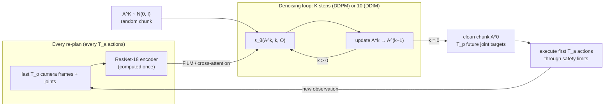

# 18.05 — Diffusion policies

<!-- glance:start -->
<!-- generated by tools/build.py from curriculum/syllabus.yaml — edit the syllabus, not this block -->

| | |
|---|---|
| **Track** | Main path |
| **Difficulty** | Advanced |
| **Time** | 1 h |
| **Hardware** | none |
| **Software** | none |
| **Prerequisites** | [18.02 Imitation learning and behavior cloning](18.02-imitation-learning-behavior-cloning.md) |
| **Optional prerequisites** | [FML.12 Generative models: VAEs, diffusion and flow matching (intuition)](../optional-foundations/machine-learning/FML.12-generative-models-diffusion.md) |
| **Skip if** | You can explain why diffusion handles multimodal demonstrations. |

<!-- glance:end -->

## What you will learn

- Explain why a policy that *samples* actions from a learned distribution handles multimodal demonstrations that break MSE regression.
- Write down the forward noising process, the noise-prediction training loss and one reverse denoising step, and compute them for a concrete action value.
- Run DDPM and DDIM sampling on a trained toy diffusion policy and measure the speed–quality trade-off of fewer denoising steps.
- Describe Diffusion Policy's receding-horizon execution (observation horizon, prediction horizon, action horizon) and map it to LeRobot's `DiffusionConfig`.
- Choose between ACT and Diffusion Policy for an SO-101 task using data properties, compute and latency.

## Why it matters

Your demonstrations of "pick up the bottle" will not be one clean behaviour. Sometimes you grasp the bottle's left side, sometimes its right; sometimes you nudge it upright first. In [18.02](18.02-imitation-learning-behavior-cloning.md) you saw MSE regression average such choices into a path through the obstacle, and in [18.04](18.04-action-chunking-transformers.md) you saw ACT sidestep the problem by committing to one "typical" style. Diffusion Policy takes the problem head-on: it learns the whole distribution of action chunks and samples one coherent choice each time it plans.

It is also the idea behind the action heads of today's large models — GR00T uses a diffusion transformer, and π0 and SmolVLA use the closely related flow matching ([18.07](18.07-vision-language-action-models.md)). Understanding one small diffusion policy makes those architectures readable.

<!-- prereqs:start -->
## Prerequisites

You need these first:

- [18.02 Imitation learning and behavior cloning](18.02-imitation-learning-behavior-cloning.md)

### Optional prerequisite links

New to any of these? Take the foundation lesson first; skip it if you already know it.

- [FML.12 Generative models: VAEs, diffusion and flow matching (intuition)](../optional-foundations/machine-learning/FML.12-generative-models-diffusion.md)

Check your readiness: `python course.py why 18.05`
<!-- prereqs:end -->

## Concept

**Generate an action the way image generators draw a picture.** An image diffusion model starts from pure static and removes noise step by step until a picture appears; the network was trained to answer "what noise was added to this?". A diffusion *policy* does the same in action space: start with a random chunk of joint targets, and at each step a network looking at the camera images says "this part is noise, remove it". After enough steps, a plausible action chunk remains.

> [!NOTE]
> New to diffusion models, VAEs or flow matching? → [FML.12 Generative models: VAEs, diffusion and flow matching](../optional-foundations/machine-learning/FML.12-generative-models-diffusion.md). Skip it if you can explain denoising training and sampling.

**Why sampling fixes multimodality.** Picture all demonstrated chunks for "bottle in front of the gripper" as points in a high-dimensional space: two clusters, "grasp from the left" and "grasp from the right", with empty space in between. MSE regression returns the centre of mass — the empty space. A diffusion model learns, at every noise level, which direction leads *toward the data*. Starting from random noise, the denoising path falls into one cluster or the other, like a ball rolling into one of two valleys, never stopping on the ridge. Different random starts give different valleys, in proportion to how often you demonstrated each.

**Why chunks and receding horizon.** Sampling one action at a time from a bimodal distribution can hop between modes on consecutive steps — left, right, left — which is the jittery hesitation you do not want. So Diffusion Policy samples a whole *sequence* of future actions (one coherent mode), executes the first part, and re-plans from the new observation. That's receding-horizon control, the same pattern as model-predictive control: plan long, commit short, re-plan.

**The price is compute.** One ACT inference is one forward pass. One diffusion inference is *K* forward passes of the denoiser (for example 100). DDIM, a deterministic sampler, lets a model trained with 100 noise levels sample with 10 larger steps; the Diffusion Policy authors report 0.1 s per inference on an RTX 3080 that way.

> [!TIP]
> **Ask your teacher:** "Explain the difference between regression, a mixture density network, a CVAE with z = 0, and a diffusion model on a single 1-D example where the demonstrated action is either −1 or +1."

## Technical explanation

### Level 1 — The two processes

- **Forward (noising), fixed, used only for training.** Take a clean demonstrated chunk $A^0$ (normalized to about $[-1, 1]$). Over $K$ steps, add more and more Gaussian noise, until $A^K$ is indistinguishable from pure noise.
- **Reverse (denoising), learned, used at run time.** Start from $A^K \sim \mathcal{N}(0, I)$. A network $\varepsilon_\theta(A^k, k, O)$ looks at the noisy chunk, the noise level $k$ and the observation $O$ (images, joint angles) and predicts the noise inside $A^k$. Remove a bit of it, move to $k-1$, repeat until $k = 0$.

The observation enters only as a *condition* of the denoiser. The chunk is the thing being generated.

### Level 2 — Diffusion Policy in practice

Diffusion Policy (Chi et al., RSS 2023; IJRR 2024) — the design choices that made it work on real robots:

| Choice | What it means | Why |
|---|---|---|
| Action sequences | generate a chunk of future actions, not one action | temporal consistency, commits to one mode, robust to demo pauses |
| Receding horizon | condition on the last $T_o$ observations, execute the first $T_a$ actions, re-plan | reactive yet consistent; the paper found $T_o = 2$ and $T_a = 8$ good for most tasks |
| Position control | actions are target positions, not velocities | the paper found position control consistently better for Diffusion Policy |
| Conditioning | observation features injected into a 1-D temporal CNN (U-Net) with FiLM at every layer, or a transformer denoiser with cross-attention | the observation is computed once per inference, not once per denoising step |
| Noise schedule | squared-cosine schedule, $K = 100$ training steps | standard from improved DDPM |
| Fast sampling | DDIM with 10 inference steps | 0.1 s latency on an RTX 3080 |
| Results | 15 tasks from 4 benchmarks | average 46.9% improvement over prior state of the art |

In the paper's Push-T example — the gripper can go left or right around a T-shaped block — Diffusion Policy learns both modes and commits to one per rollout, while LSTM-GMM and implicit BC were biased toward one side and Behavior Transformers failed to commit.

> [!IMPORTANT]
> **Version-sensitive** (verified 2026-09-16 against `src/lerobot/policies/diffusion/configuration_diffusion.py` in LeRobot v0.6.1).
> Before tuning, check the installed config: https://github.com/huggingface/lerobot/blob/main/src/lerobot/policies/diffusion/configuration_diffusion.py and https://huggingface.co/docs/lerobot/diffusion
> AI teacher: verify these defaults against the installed LeRobot version before advising on hyperparameters.

| `DiffusionConfig` field | v0.6.1 default | Meaning |
|---|---|---|
| `n_obs_steps` | 2 | $T_o$, observation frames fed to the policy |
| `horizon` | 64 | prediction horizon $T_p$: actions generated per inference (2.1 s at 30 fps) |
| `n_action_steps` | 32 | $T_a$: actions executed before re-planning (1.07 s at 30 fps) |
| `noise_scheduler_type` | `"DDPM"` | also supports `"DDIM"` |
| `num_train_timesteps` | 100 | $K$ |
| `num_inference_steps` | `None` | `None` means the same as `num_train_timesteps` (100 network passes) |
| `beta_schedule` | `"squaredcos_cap_v2"` | squared-cosine schedule |
| `prediction_type` | `"epsilon"` | the network predicts the noise |
| `vision_backbone` | `resnet18` | image encoder |
| `down_dims` | (512, 1024, 2048) | U-Net channel widths |
| `optimizer_lr` | 1e-4 | learning rate |

(The paper's defaults were shorter horizons; LeRobot's source keeps a comment for `drop_n_last_frames` that matches the older 16/8 values — another reason to read the config of the version you run rather than a blog post.) Training and deploying one on your SO-101 data is [18.06](18.06-train-first-policy-lerobot.md); the compute guide lists Diffusion Policy at about 8–14 GB of VRAM and a few hours on an RTX 4090 for 50 episodes ([18.01](18.01-embodied-ai-landscape.md)).

### Level 3 — The mathematics, with numbers

**Noise schedule.** Choose $\beta_1, \dots, \beta_K$ (small at first, larger later), let $\alpha_k = 1 - \beta_k$ and $\bar\alpha_k = \prod_{i \le k} \alpha_i$. The forward process has a closed form, so any noise level can be sampled in one line:

$$A^k = \sqrt{\bar\alpha_k}\, A^0 + \sqrt{1 - \bar\alpha_k}\;\varepsilon, \qquad \varepsilon \sim \mathcal{N}(0, I)$$

For the lab's squared-cosine schedule with $K = 50$: $\bar\alpha_1 = 0.998$, $\bar\alpha_{10} = 0.899$, $\bar\alpha_{25} = 0.494$, $\bar\alpha_{40} = 0.094$, $\bar\alpha_{50} \approx 10^{-6}$.

**Training loss** — noise prediction, a plain MSE, but on the *noise*, not on the action:

$$\mathcal{L}(\theta) = \mathbb{E}_{A^0,\,O,\,k,\,\varepsilon}\Big[\big\|\varepsilon - \varepsilon_\theta\big(\sqrt{\bar\alpha_k} A^0 + \sqrt{1-\bar\alpha_k}\,\varepsilon,\; k,\; O\big)\big\|^2\Big]$$

Why this doesn't average modes: for a *given* noisy input $A^k$, the noise that was added is well determined once $A^k$ is close to one cluster, so the regression target is unimodal except at very high noise, where the model only needs to push toward the data in general. The averaging that ruined MSE-on-actions is split across many small, easy denoising decisions.

**Numerical example — one training sample.** A normalized waypoint coordinate $A^0 = 0.6$ (the lab divides by the largest demo value, 1.37 m, so this is 0.82 m), noise draw $\varepsilon = -1.2$, noise level $k = 25$: $A^{25} = 0.703 \times 0.6 + 0.711 \times (-1.2) = -0.432$. The network sees $-0.432$, $k = 25$ and the observation, and must output $-1.2$. If it outputs exactly $-1.2$, the implied clean value is $\hat A^0 = (A^k - \sqrt{1-\bar\alpha_k}\,\hat\varepsilon)/\sqrt{\bar\alpha_k} = 0.6$. If it outputs $-1.0$ (an error of 0.2), $\hat A^0 = 0.398$ — which is why many steps with small corrections beat one big jump.

**DDPM reverse step** (stochastic). With the predicted clean chunk $\hat A^0$:

$$A^{k-1} = \frac{\sqrt{\bar\alpha_{k-1}}\,\beta_k}{1-\bar\alpha_k}\,\hat A^0 + \frac{\sqrt{\alpha_k}\,(1-\bar\alpha_{k-1})}{1-\bar\alpha_k}\,A^k + \sigma_k z, \qquad \sigma_k^2 = \frac{1-\bar\alpha_{k-1}}{1-\bar\alpha_k}\beta_k,\; z \sim \mathcal{N}(0, I)$$

That is a weighted blend of "where the network thinks the clean chunk is" and "where we are now", plus fresh noise. The Diffusion Policy paper writes the same update in Langevin-dynamics form, $A^{k-1} = \alpha\,(A^k - \gamma\,\varepsilon_\theta(O, A^k, k) + \mathcal{N}(0, \sigma^2 I))$: take a step along the learned gradient of the log-density, add a little noise.

**DDIM step** (deterministic, can skip levels). Jump from level $k$ to any earlier level $k'$:

$$A^{k'} = \sqrt{\bar\alpha_{k'}}\,\hat A^0 + \sqrt{1-\bar\alpha_{k'}}\;\hat\varepsilon$$

"Keep the same noise direction, just less of it." **Numerical example:** continuing from $A^{25} = -0.432$ with a perfect $\hat\varepsilon = -1.2$, jump straight to $k' = 12$ ($\bar\alpha_{12} = 0.858$): $A^{12} = 0.926 \times 0.6 + 0.377 \times (-1.2) = 0.104$. With 10 DDIM steps instead of 50 DDPM steps, the network runs 5× fewer times. The cost: larger steps amplify the network's errors, and with fewer steps the final sample depends more on the initial noise — modes can be sampled less evenly.

**Flow matching** (π0, SmolVLA, 18.07) learns a velocity field that moves noise to data along nearly straight paths; it needs fewer integration steps (often ~10) for similar quality. Same idea, different parameterization.

### Level 4 — ACT or Diffusion Policy for karmel?

| | ACT (18.04) | Diffusion Policy |
|---|---|---|
| Output | one deterministic chunk ($z = 0$) | a *sample* from $p(\text{chunk} \mid O)$ |
| Multimodal demos | picks one typical style; cannot represent both at run time | represents and samples all modes |
| Inference cost | 1 forward pass (~10 ms) | $K$ denoiser passes; 10 DDIM steps ≈ 0.1 s on an RTX 3080 |
| Temporal ensembling | yes, cheap | not used; receding horizon instead |
| Training compute (LeRobot guide) | ~2–6 GB, 30–60 min per 50 episodes on an RTX 4090 | ~8–14 GB, a few hours |
| Jetson-class inference | comfortable | marginal |
| Typical first choice when | demos are consistent; you want fast iteration | demos genuinely contain several strategies, or ACT averages/hesitates at decision points |

For karmel's bottle pick: start with ACT on consistent demonstrations (18.03's protocol). If the policy hesitates where your demos split (for example, which side of a tipped bottle to grasp), either make the demos consistent or switch to Diffusion Policy with DDIM sampling on a desktop GPU. Either way the learned policy sits behind the same joint, speed and workspace limits ([14.11](../14-robotic-arm/14.11-arm-safety.md)) and is evaluated with enough trials ([18.10](18.10-evaluating-learned-policies.md)): a sampled policy can pick a rare, never-tested mode on trial 37.

> [!TIP]
> **Ask your teacher:** "Take the DDIM update and show me, with numbers, how a 5-step sampler on a 50-level schedule chooses its noise levels and why its errors are larger than a 50-step DDPM's."

## Diagram



```text
Receding horizon (paper-style values, 10 Hz: T_o = 2, T_a = 8)

time steps     : t-1  t   t+1 t+2 t+3 t+4 t+5 t+6 t+7 t+8 t+9 ...
observations   : [o] [o]                                          ← condition
predicted chunk:          a   a   a   a   a   a   a   a   a   a ... (T_p actions)
executed       :          ▲───────── T_a = 8 ─────────▲
re-plan here   :                                          ● new chunk from o(t+7), o(t+8)
```

## Code

`18-embodied-ai/code/il_lab.py` contains a complete diffusion policy in about 70 lines: the squared-cosine schedule, noise-prediction training and both samplers. The obstacle experiment conditions it on the robot's position and generates a chunk of 6 relative waypoints (12 numbers, 3 s of motion), executes 2 of them (1 s) and re-plans — Diffusion Policy's receding horizon in miniature. 40 demonstrations pass the obstacle half on the left, half on the right.

```bash
cd 18-embodied-ai/code
py il_lab.py multimodal --plots        # Linux/macOS: python3 ; writes out/18_multimodal.png
py -m pytest test_il_lab.py -q         # includes a determinism test of the DDIM sampler
```

Training — the loss from Level 3, one batch per iteration:

```python
        for _ in range(iters):
            idx = torch.randint(0, len(o), (batch,), generator=g)
            k = torch.randint(0, k_steps, (batch,), generator=g)
            eps = torch.randn(batch, self.dim, generator=g)
            ab = self.abar[k][:, None]
            noisy = ab.sqrt() * a0[idx] + (1 - ab).sqrt() * eps
            loss = ((self.eps(noisy, k, o[idx]) - eps) ** 2).mean()
            opt.zero_grad()
            loss.backward()
            opt.step()
            sched.step()
```

Sampling — the DDPM and DDIM updates from Level 3:

```python
        if ddim_steps is None:
            for k in reversed(range(self.k_steps)):
                e = self.eps(a, torch.full((n,), k), st)
                ab = self.abar[k]
                ab_prev = self.abar[k - 1] if k > 0 else torch.tensor(1.0)
                a0 = ((a - (1 - ab).sqrt() * e) / ab.sqrt()).clamp(-1.0, 1.0)   # predicted clean chunk
                # mean of q(a_{k-1} | a_k, a0): a weighted blend of the clean guess and the current sample
                a = (ab_prev.sqrt() * self.betas[k] * a0 + self.alphas[k].sqrt() * (1 - ab_prev) * a) / (1 - ab)
                if k > 0:
                    var = self.betas[k] * (1 - ab_prev) / (1 - ab)
                    a = a + var.sqrt() * torch.randn(n, self.dim, generator=g)
        else:
            ks = np.linspace(self.k_steps - 1, 0, ddim_steps).round().astype(int)
            for i, k in enumerate(ks):
                e = self.eps(a, torch.full((n,), int(k)), st)
                ab = self.abar[k]
                a0 = ((a - (1 - ab).sqrt() * e) / ab.sqrt()).clamp(-1.0, 1.0)   # predicted clean chunk
                e = (a - ab.sqrt() * a0) / (1 - ab).sqrt()
                ab_prev = self.abar[ks[i + 1]] if i + 1 < len(ks) else torch.tensor(1.0)
                a = ab_prev.sqrt() * a0 + (1 - ab_prev).sqrt() * e
```

(Code indices run $0 \dots K-1$ where the equations use $1 \dots K$. Clamping $\hat A^0$ to $[-1, 1]$ is the `clip_sample=True` option LeRobot also defaults to.)

Output (seed 0, 100 episodes per sampler, all from the same start positions):

```text
2) Multimodal demos - obstacle radius 0.3 m at (1, 0), 40 demos: half pass left, half right
   MSE chunk at (0, 0), waypoints 1-3 [m]: (+0.20, +0.00)  (+0.39, +0.02)  (+0.60, +0.01)
   MSE behavior cloning    : success  34%   collisions  66%
   diffusion policy trained in 20.2 s (3000 iterations), 100 episodes:
   DDPM 50 denoising steps: success  92%   collisions   8%   went left  65%   42.57 ms per call (batch of 100)
   DDIM 10 denoising steps: success  82%   collisions  16%   went left  53%   20.60 ms per call (batch of 100)
   DDIM  5 denoising steps: success  78%   collisions  17%   went left  48%    9.86 ms per call (batch of 100)
   (multimodal: 42.5 s)
```

What to notice:

- **Same data, same network size, same execution** — only the loss and the sampling differ. MSE collides in 66% of episodes; DDPM in 8%.
- **Both modes are used.** "Went left" is 65% for DDPM; with only 100 episodes the 95% interval around a fair 50% is roughly ±10 points, so 65% suggests some bias from this small, briefly trained model — worth knowing when you evaluate a real policy ([18.10](18.10-evaluating-learned-policies.md)).
- **Fewer steps, faster, a bit worse.** DDIM with 10 steps cut the time per call about 2× here (on a busy laptop CPU the timing is noisy; the network-pass count drops 5×) and lost 10 points of success; 5 steps lost 14. On a real policy you measure this trade-off the same way before choosing `num_inference_steps`.
- `out/18_multimodal.png`: demonstrations as two tight bundles; MSE rollouts as a fan of paths through the middle of the obstacle; diffusion rollouts as two bundles again, noisier than the demos (a 3,000-iteration toy, not a tuned model).

## Exercise

All exercises need hardware: **none**.

### Exercise 18.05-E1 — Noise it by hand `[numerical]`

Goal: make the closed-form forward process concrete. With the lab's schedule ($K = 50$; $\bar\alpha_{10} = 0.899$, $\bar\alpha_{40} = 0.094$), a normalized action $A^0 = -0.5$ and noise $\varepsilon = 0.8$: (a) compute $A^{10}$ and $A^{40}$; (b) if the network predicts $\hat\varepsilon = 0.7$ at $k = 40$, what $\hat A^0$ does that imply; (c) do the same at $k = 10$. What does the difference tell you about where errors matter?

### Exercise 18.05-E2 — Predict, then sample the start `[predict]`

Goal: see the distribution, not a rollout. **Before running**, predict what 1,000 DDPM samples of the chunk at state (0, 0) look like if you plot their third waypoint $(x, y)$, and what the MSE policy's third waypoint is. Then train `DiffusionPolicy` as `multimodal()` does, call `dp.sample(np.zeros((1000, 2)), torch.Generator().manual_seed(0))`, reshape to `(1000, 6, 2)` and scatter-plot waypoint index 2.

### Exercise 18.05-E3 — The steps–quality curve `[coding]`

Goal: choose `num_inference_steps` with data. Using one trained model, measure success rate, collision rate and milliseconds per call for DDIM with 2, 3, 5, 10, 20 steps and DDPM with 50 steps (100 episodes each, same starts). Plot success versus network passes per call.

### Exercise 18.05-E4 — Execute more or re-plan more? `[predict]`

Goal: feel the receding-horizon trade-off. **Predict** how success changes when `execute` is 1, 2, 4 or 6 waypoints (0.5 s to 3 s open loop) for the DDPM sampler. Then run `multimodal(execute=...)` for each.

### Exercise 18.05-E5 — Diagnose the hesitating policy `[debugging]`

Goal: tell mode switching from other failures. A classmate's diffusion policy on the obstacle task sometimes wobbles left-right in front of the obstacle for a second before committing. Their config: chunk of 6 waypoints, `execute = 1`, DDIM with 3 steps. List three hypotheses in the order you would test them, with the measurement that confirms or rejects each.

## Expected result

- **18.05-E1:** (a) $A^{10} = 0.948 \times (-0.5) + 0.318 \times 0.8 = -0.220$; $A^{40} = 0.307 \times (-0.5) + 0.952 \times 0.8 = 0.608$. (b) $\hat A^0 = (0.608 - 0.952 \times 0.7)/0.307 = -0.19$ — a 0.1 noise error became a 0.31 action error. (c) at $k = 10$: $\hat A^0 = (-0.220 - 0.318 \times 0.7)/0.948 = -0.466$, an error of only 0.034. Errors at high noise levels are amplified by $\sqrt{1-\bar\alpha}/\sqrt{\bar\alpha}$; that is why samplers take small steps there and why very few DDIM steps degrade quality.
- **18.05-E2:** two clusters near $(0.60, +0.43)$ and $(0.62, -0.42)$ with some spread and only ~6% of points within ±0.1 m of $y = 0$; in our run 53.5% of samples were above $y = 0.2$ and 35.7% below $-0.2$ (a mild imbalance, as the rollouts showed). The MSE policy's third waypoint is about $(0.60, +0.01)$ — between the clusters, where no demonstration went.
- **18.05-E3:** our run (success / collisions): DDIM 2 steps 0% / 20% (it never reaches the goal cleanly), 3 steps 28% / 54%, 5 steps 78% / 17%, 10 steps 82% / 16%, 20 steps 83% / 15%, DDPM 50 steps 92% / 8%; time per batched call roughly proportional to network passes (about 1, 1.4, 1.7, 3.9, 11 and 32 ms on our CPU). The curve has a sharp knee between 3 and 5 passes and a slow climb after.
- **18.05-E4:** our run (DDPM, success / collisions): execute 1: 88% / 11%; 2: 92% / 8%; 4: 86% / 14%; 6: 86% / 14%. Re-planning every waypoint allows occasional mode hops near the obstacle; executing 3 s open loop follows stale plans. The differences are small with 100 episodes (±7 points is noise), so the honest conclusion is "best in the middle, but measure more episodes before believing it" — exactly the point of [18.10](18.10-evaluating-learned-policies.md).
- **18.05-E5:** (1) mode switching between consecutive re-plans: log the sign of each chunk's lateral waypoint per re-plan — alternating signs confirm it; fix with longer `execute` or a longer horizon. (2) too few DDIM steps: re-run with 10–20 steps or DDPM; if wobbling disappears, it was sampler error. (3) undertrained model or observation noise: check training loss curves and whether the wobble also appears in DDPM with many steps; add training iterations or data at the decision point.

## Troubleshooting

### Symptom: the diffusion policy's actions look like noise

1. Is the sampler using the *same* schedule and normalization as training? A different $K$, schedule or missing de-normalization is the most common bug.
2. Is the model trained enough? Diffusion training losses plateau early but keep improving sample quality; compare samples at several checkpoints.
3. Check the clean-chunk prediction at $k = 0$ on training observations: it should reproduce demo chunks closely.

### Symptom: the policy only ever takes one of the demonstrated strategies

1. Count the strategies in the data first — are they really balanced?
2. Is sampling actually stochastic? A fixed seed per call, or DDIM from a constant initial noise, makes it deterministic.
3. Evaluate with enough episodes: with 20 trials, 14/6 is not evidence of bias.

### Symptom: good success in evaluation but too slow on the robot

1. Measure time per inference and compare with the executed chunk duration (the `compute_budget.py` model from 18.01).
2. Reduce `num_inference_steps` with DDIM and re-measure success (Exercise E3's curve).
3. Run inference on a desktop GPU, or use an asynchronous client–server setup (18.06).

## Common mistakes

- **Thinking diffusion predicts the action directly.** It predicts the *noise*; the action emerges from repeated denoising.
- **Comparing samplers on different starts or seeds.** Evaluate every variant on the same start states.
- **Turning DDIM steps down to 2 because it's faster.** Errors at high noise levels explode; measure the curve.
- **Executing the whole prediction horizon.** Receding horizon means executing only the first part and re-planning.
- **Forgetting that sampling can choose a rare mode.** Rare-but-valid behaviours must also be safe; test enough trials.
- **Assuming LeRobot defaults equal the paper's.** v0.6.1 uses horizon 64 / 32 executed; read the config you run.

## Knowledge check

1. Why does MSE regression fail on bimodal demonstrations while a diffusion policy does not?
   <details><summary>Answer</summary>

   MSE predicts the conditional mean, which for two separated modes lies between them where no demonstration is. A diffusion policy learns to transform noise into samples of the whole distribution, so each sample lands in one mode.
   </details>

2. With $\bar\alpha_k = 0.36$, $A^0 = 1.0$ and $\varepsilon = -0.5$, what is $A^k$?
   <details><summary>Answer</summary>

   $\sqrt{0.36} \times 1.0 + \sqrt{0.64} \times (-0.5) = 0.6 - 0.4 = 0.2$.
   </details>

3. What does the network $\varepsilon_\theta$ take as input and output, and what is the training loss?
   <details><summary>Answer</summary>

   Input: the noisy action chunk $A^k$, the noise level $k$, and the observation $O$. Output: the predicted noise. Loss: MSE between the true added noise $\varepsilon$ and the prediction.
   </details>

4. Why does Diffusion Policy generate a sequence of actions and execute only part of it?
   <details><summary>Answer</summary>

   A sequence gives temporally consistent motion that commits to one mode and tolerates pauses in demos; executing only the first $T_a$ actions and re-planning keeps the policy reactive to new observations (receding horizon).
   </details>

5. A policy was trained with $K = 100$. How many network passes does inference need with DDPM, and with DDIM at 10 steps? What is the trade-off?
   <details><summary>Answer</summary>

   100 vs 10. DDIM is ~10× cheaper in denoiser passes but takes larger deterministic steps, which amplifies model errors and can reduce success or mode balance; measure it.
   </details>

6. Predict: LeRobot v0.6.1 Diffusion Policy at 30 fps with defaults. How long does the arm execute open loop per inference, and how many network passes does one inference take?
   <details><summary>Answer</summary>

   `n_action_steps = 32` → 32/30 ≈ 1.07 s open loop. `num_inference_steps = None` → equal to `num_train_timesteps = 100` denoiser passes (plus one observation encoding).
   </details>

7. Your demos are very consistent (one grasp strategy) and the policy must run on a Jetson. ACT or Diffusion Policy?
   <details><summary>Answer</summary>

   ACT: consistent demos remove Diffusion Policy's main advantage, and ACT needs one forward pass (~10 ms), comfortable on a Jetson, while diffusion needs many passes.
   </details>

## Practical challenge

Make the toy diffusion policy fast *and* reliable. Starting from `il_lab.multimodal()`, reach **≥ 90% success with at most 10 network passes per inference** on the obstacle task (100 episodes, the default starts), with the "went left" fraction between 35% and 65%.

You may change: the number of training iterations (≤ 10,000), the denoiser width, the number of training noise levels, the sampler (DDIM, or implement a flow-matching variant), and `execute`. You may not change the demonstrations or the task.

Acceptance criteria: a table of at least four configurations with success, collision rate, left fraction, passes per inference and training time; the winning configuration meets the thresholds on two different seeds; one paragraph explaining which change mattered most and why, in terms of Level 3.

## You can skip this if…

You can answer knowledge-check questions 2, 5 and 6 correctly without looking, and you can explain in two sentences why diffusion handles multimodal demonstrations. Then:
`python course.py skip 18.05 --reason "I can explain diffusion policies, DDIM and receding-horizon execution"`

## Go deeper

- *Diffusion Policy: Visuomotor Policy Learning via Action Diffusion* (Chi et al.) — https://arxiv.org/abs/2303.04137 — read the method, key design decisions and "intriguing properties"; skim the benchmark tables.
- Diffusion Policy project page — https://diffusion-policy.cs.columbia.edu/ — videos of the multimodal Push-T behaviour and real-robot tasks.
- Diffusion Policy code — https://github.com/real-stanford/diffusion_policy — reference implementation with CNN and transformer denoisers.
- LeRobot Diffusion Policy docs — https://huggingface.co/docs/lerobot/diffusion — the policy you will train on your data in 18.06.
- *Denoising Diffusion Probabilistic Models* (Ho et al.) — https://arxiv.org/abs/2006.11239 — the DDPM training loss and reverse process.
- *Denoising Diffusion Implicit Models* (Song et al.) — https://arxiv.org/abs/2010.02502 — the deterministic, step-skipping sampler.
- Lilian Weng, "What are Diffusion Models?" — https://lilianweng.github.io/posts/2021-07-11-diffusion-models/ — a careful derivation of every equation in Level 3.
- *Universal Manipulation Interface* — https://arxiv.org/abs/2402.10329 — Diffusion Policy trained on hand-held demonstrations and deployed on different arms.
- ETH Zurich Robot Learning (generative policies lectures) — https://cvg.ethz.ch/lectures/Robot-Learning/ — diffusion and flow-matching policies in a full course.

## Progress checkpoint

- [ ] I can explain why sampling from a learned distribution handles multimodal demonstrations.
- [ ] I can compute a forward noising step, the implied clean action, and a DDIM jump with numbers.
- [ ] I have run DDPM and DDIM on the lab policy and measured the speed–quality trade-off.
- [ ] I can map $T_o$, $T_p$, $T_a$ and inference steps to LeRobot's `DiffusionConfig`.
- [ ] I can choose between ACT and Diffusion Policy for an SO-101 task.

`python course.py complete 18.05` (exercises done) · `python course.py master 18.05` (challenge done) · `python course.py struggle 18.05 "what was hard"`.

Next: [18.06 Train and deploy your first policy with LeRobot](18.06-train-first-policy-lerobot.md) — ACT (and optionally Diffusion Policy) on the demonstrations you recorded in 18.03.
