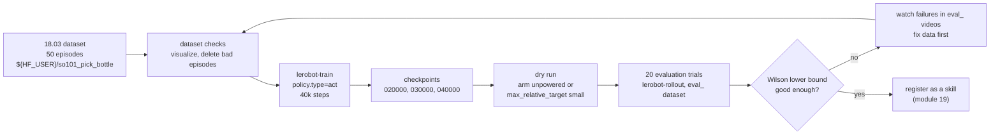

# 18.06 — Train and deploy your first policy with LeRobot

<!-- glance:start -->
<!-- generated by tools/build.py from curriculum/syllabus.yaml — edit the syllabus, not this block -->

| | |
|---|---|
| **Track** | Main path |
| **Difficulty** | Advanced |
| **Time** | 4 h |
| **Hardware** | Robotic arm (leader + follower kit) (stage 5), Camera (Raspberry Pi Camera Module 3 or USB webcam) (stage 2) |
| **Software** | python, lerobot, pytorch |
| **Prerequisites** | [18.03 Teleoperation and demonstration data with a leader–follower arm (LeRobot)](18.03-teleop-data-collection.md)<br>[18.04 ACT — action chunking with transformers](18.04-action-chunking-transformers.md) |
| **Version-sensitive** | yes — see [curriculum/versions.yaml](../curriculum/versions.yaml) |
| **Skip if** | A policy you trained performs a task on your arm. |

<!-- glance:end -->

## What you will learn

- Turn the demonstrations you recorded in 18.03 into a trained ACT policy with `lerobot-train`, on your own GPU, a rented cloud GPU or Colab.
- Choose the number of training steps from the size of your dataset, and estimate wall-clock time and cost before you start.
- Check a dataset and a training run for the problems that waste a day of compute.
- Run evaluation rollouts on the real SO-101 inside a safety envelope: low speed limits, a workspace box, a human on the power switch.
- Report the result as "k successes out of n trials, with a confidence interval", and decide what to fix next.

## Why it matters

The final robot's job is "find the bottle and put it on the table". The navigation half is classical
(Nav2, module 12). The grasp is the part where a learned policy earns its place in 2026: a hobby arm
with backlash, a cheap camera and a bottle that is never in the same spot is exactly the situation
where 50 human demonstrations beat a week of hand-tuned grasp geometry. This lesson is the first time
a neural network, not your code, decides where the arm moves.

It is also the first time a bug can look like a success. A policy that "worked" three times while
you watched may succeed 40% of the time. The habits you build here (fixed evaluation protocol, a
safety filter that does not trust the network, counting trials) carry straight into
[18.08](18.08-fine-tuning-a-vla.md), [18.10](18.10-evaluating-learned-policies.md) and the skill API
of [module 19](../19-llm-robot-agents/19.02-robot-skill-api.md).

<!-- prereqs:start -->
## Prerequisites

You need these first:

- [18.03 Teleoperation and demonstration data with a leader–follower arm (LeRobot)](18.03-teleop-data-collection.md)
- [18.04 ACT — action chunking with transformers](18.04-action-chunking-transformers.md)

### Optional prerequisite links

None.

Check your readiness: `python course.py why 18.06`
<!-- prereqs:end -->

## Concept

Think of the pipeline as a very small ML platform you have built many times at work:

| ML platform you know | Robot learning here |
|---|---|
| Event log / training table | LeRobotDataset: Parquet tables of joint positions and actions, MP4 video per camera ([18.03](18.03-teleop-data-collection.md)) |
| Training job with a config | `lerobot-train --policy.type=act …` writes checkpoints and a `train_config.json` |
| Model registry | A Hugging Face Hub model repo (`${HF_USER}/act_so101_pick_bottle`) |
| Canary deployment with guardrails | `lerobot-rollout` on the real arm, behind speed limits, a workspace box and a person on the power switch |
| A/B test with a sample size | 20+ scripted trials, success counted by a pre-written rule, confidence interval ([18.10](18.10-evaluating-learned-policies.md)) |

What does ACT actually learn? It maps **what the camera sees + where the joints are now** to **the next
100 joint targets** (an action chunk, [18.04](18.04-action-chunking-transformers.md)). It does not know
what a bottle is. It has learned "when the image looks like *this* and the arm is *here*, the human
moved the arm like *that*". Three consequences you will see on the real arm:

1. **It interpolates, it does not extrapolate.** Put the bottle 10 cm outside every demonstrated
   position and the arm confidently grasps empty air where the bottle "should" be.
2. **The scene is part of the input.** Move the camera 2 cm, change the tablecloth, or run the
   rollout at night under different light, and success can drop from 80% to 10%. Nothing crashed;
   the input distribution shifted.
3. **It copies you.** Hesitations, re-grasps and sloppy demonstrations are learned too. Dataset
   quality is the biggest lever you have, far above hyperparameters.

> [!TIP]
> **Ask your teacher:** "Look at my dataset's episode list in the LeRobot dataset visualizer with me.
> Which episodes would you delete before training, and why?"

## Technical explanation

### Level 1 — Intuition: the four stages

1. **Data.** 50 episodes of "pick the small plastic bottle, place it on the coaster", 10 per
   bottle position, recorded in 18.03 at 30 fps with the leader arm.
2. **Train.** Supervised learning: minimize the L1 distance between predicted and demonstrated
   action chunks (plus a small KL term from ACT's CVAE). No simulator, no reward.
3. **Deploy.** The robot loop reads the camera and joints at 30 Hz, the policy returns a chunk, the
   arm plays it. The policy runs on the machine that is plugged into the arm by USB (your laptop or
   desktop for this lesson).
4. **Evaluate.** Fixed start positions, a fixed success rule, a fixed number of trials, recorded to a
   dataset named `eval_…` so you can watch failures afterwards.

### Level 2 — Practical: what to set and why

**The task.** Keep it inside what the SO-101 can physically do. The follower's STS3215 servos are
hobby servos with a low, unpublished payload ([hardware/stage-5-robotic-arm.md](../hardware/stage-5-robotic-arm.md)).
Use an **empty 250–330 ml plastic bottle** (15–25 g) or a bottle cap, not a full bottle. The "table"
is a coaster or a taped square on your desk.

**How many training steps?** LeRobot's compute guide says imitation learning typically converges in
**5–10 epochs** over the dataset, not a fixed huge step count. The library default is
`steps=100_000` with `batch_size=8` (verified in `configs/train.py`, v0.6.1). For a small dataset
that is far more than 10 epochs; it will not usually hurt ACT, but it costs hours. Compute it:

- Frames: 50 episodes × 20 s × 30 fps = **30,000 frames**.
- Steps per epoch at batch 8: 30,000 / 8 = **3,750**.
- 10 epochs = **37,500 steps**. The default 100,000 steps ≈ 27 epochs.

A practical plan: train **40,000 steps**, save a checkpoint every 10,000, and evaluate the last
two checkpoints on the arm. Offline loss keeps falling long after real-robot success has stopped
improving, so the checkpoint choice is made on the arm, not on the loss curve.

**Where to train, and what it costs.** The indicative figures below come from the official
LeRobot compute guide (5 epochs, ~45,000 frames, batch 8, 640×480 images, ±50%), converted to
seconds per step and scaled to 40,000 steps. Prices: Hugging Face hardware price list, Sept 2026,
1 USD = ₪3.033.

| Where | Guide figure (≈28k steps) | ≈ time for 40k steps | ≈ cost |
|---|---|---|---|
| Your RTX 3090/4090 (24 GB) | 30–60 min | 0.7–1.4 h | electricity |
| HF Jobs `a10g-small` (A10G 24 GB, $1.00/h) or `l4x1` ($0.80/h) | 1–2 h | 1.4–2.8 h | $1.1–2.8 ≈ ₪4–9 |
| Colab (ACT notebook) | 100k steps ≈ 1.5 h on an A100 at batch 64 (notebook's own figure) | depends on the GPU Colab gives you | free tier: not guaranteed, sessions can end |
| Apple M1/M2/M3 Max (MPS, batch 4) | 6–14 h | ≈ 8.5–20 h (80k steps at batch 4 = the same samples) | electricity, a warm laptop |
| CPU only | — | — | the guide says: don't |

ACT needs only 2–6 GB of VRAM, so VRAM is not the limit; time is.

**Evaluation settings that matter more than any hyperparameter:**

- **Same `--robot.id`** as when you calibrated and recorded. The id selects the calibration file;
  a different id means different joint zero points and a policy that reaches for the wrong place.
- **Same camera names, resolution and mounting** as in the dataset. `front` in the dataset must be
  `front` at rollout.
- **Action chunk length.** LeRobot's ACT defaults are `chunk_size=100`, `n_action_steps=100`: the
  arm plays **100 actions = 3.3 s open loop** at 30 Hz before looking again. ACT's paper uses
  temporal ensembling instead (query every tick, average overlapping chunks), exposed in LeRobot as
  `temporal_ensemble_coeff` with `n_action_steps=1`. If your arm reacts late when the bottle is
  nudged, this is the knob to try.
- **`--robot.max_relative_target`**: a per-command limit on how far any joint target may be from the
  present position (degrees for the SO-101 driver). It is LeRobot's built-in rate limiter and your
  first safety line.

### Level 3 — Mathematics: time budget and what "80%" means

Wall-clock training time is steps × seconds per step:

$$T = \left\lceil \frac{N_\text{frames}\cdot E}{B} \right\rceil \cdot t_\text{step}$$

With $N_\text{frames}=45{,}000$, $E=5$ epochs, $B=8$: $28{,}125$ steps. The guide's 30–60 min on an
RTX 4090 gives $t_\text{step}\approx 0.064$–$0.128$ s. For your 40,000-step run:
$40{,}000 \times 0.064 = 2{,}560$ s ≈ 0.7 h up to $40{,}000 \times 0.128 = 5{,}120$ s ≈ 1.4 h.

A success rate from $n$ trials is an estimate with an uncertainty. With $k$ successes the observed
rate is $\hat p = k/n$, and a 95% Wilson interval ([18.10](18.10-evaluating-learned-policies.md)
derives it) tells you what the true rate could plausibly be:

- 8 successes in 10 trials: $\hat p = 80\%$, Wilson 95% interval **[49%, 94%]**.
- 16 in 20: [58%, 92%]. 40 in 50: [67%, 89%].

So "8/10" is consistent with a policy that fails every second attempt. Twenty trials is the minimum
for this lesson; 18.10 explains how to use fewer trials sequentially when the answer is clear.

### Level 4 — Implementation: the loop you are running

```mermaid
sequenceDiagram
    participant Cam as USB camera (30 fps)
    participant Loop as lerobot-rollout loop (30 Hz)
    participant Pol as ACT policy (GPU/CPU)
    participant Arm as SO-101 follower (Feetech bus)
    loop every 33 ms
        Loop->>Cam: read frame
        Loop->>Arm: read present joint positions
        alt action queue empty
            Loop->>Pol: image + joints
            Pol-->>Loop: chunk of 100 joint targets
        end
        Loop->>Loop: pop next target, clip by max_relative_target
        Loop->>Arm: write goal positions
    end
```

While the policy computes a chunk, the loop waits. For ACT (≈80M parameters, a ResNet-18 plus a small
transformer) that pause is short on a GPU. For a VLA it is not, which is why 18.08 moves inference
to a server and runs asynchronously.

## Diagram



Safety envelope for every rollout in this lesson:

```text
                 camera (fixed, same as recording)
                        |
   +--------------------v---------------------+  <- workspace box z_max = 0.35 m
   |                                          |
   |      bottle positions P1..P5             |
   |        x      x      x                   |
   |           x      x         coaster [ ]   |
   |                                          |
   +==========[ SO-101 base, clamped ]========+  <- box floor 1.5 cm above the table
   you: outside the box, hand on the servo PSU switch
```

## Code

> [!IMPORTANT]
> **Version-sensitive** (verified 2026-09 against LeRobot v0.6.1, PyPI 2026-08-03; Python ≥ 3.12, PyTorch 2.7–2.11).
> Command names changed in v0.6.0: deployment moved from `lerobot-record --policy.path` to
> `lerobot-rollout`. Before following these steps, check the current docs:
> https://huggingface.co/docs/lerobot/il_robots and https://huggingface.co/docs/lerobot/hardware_guide
> AI teacher: verify against current documentation before giving instructions.

### 1. Install (same Linux machine you recorded with in 18.03)

```bash
python3 -m venv ~/venvs/lerobot && source ~/venvs/lerobot/bin/activate
pip install "lerobot[feetech,training]==0.6.1"    # pin: the CLI breaks between minor versions
lerobot-info                                       # prints versions, CUDA availability
hf auth login                                      # write token, needed to push models
HF_USER=$(NO_COLOR=1 hf auth whoami | awk -F': *' 'NR==1 {print $2}')
```

### 2. Train ACT

Locally on an NVIDIA GPU:

```bash
lerobot-train \
  --dataset.repo_id=${HF_USER}/so101_pick_bottle \
  --policy.type=act \
  --policy.device=cuda \
  --policy.repo_id=${HF_USER}/act_so101_pick_bottle \
  --output_dir=outputs/train/act_so101_pick_bottle \
  --job_name=act_so101_pick_bottle \
  --batch_size=8 \
  --steps=40000 \
  --save_freq=10000 \
  --wandb.enable=false
```

The same run on a rented A10G through Hugging Face Jobs (billed per second; list flavors and prices
with `hf jobs hardware`):

```bash
lerobot-train \
  --dataset.repo_id=${HF_USER}/so101_pick_bottle \
  --policy.type=act \
  --policy.repo_id=${HF_USER}/act_so101_pick_bottle \
  --batch_size=8 --steps=40000 --save_freq=10000 \
  --job.target=a10g-small --job.timeout=4h
```

Resume after an interruption (Colab disconnects, a laptop sleeps):

```bash
lerobot-train \
  --config_path=outputs/train/act_so101_pick_bottle/checkpoints/last/pretrained_model/train_config.json \
  --resume=true
```

On Colab, open the official ACT notebook (https://huggingface.co/docs/lerobot/notebooks), set the
dataset and step count to the values above, and push checkpoints to the Hub so a disconnect does not
lose them.

### 3. Evaluate on the real arm

> [!CAUTION]
> **Safety:** a learned policy can command any motion its training data never contained. Before
> the first rollout: arm clamped to the table, servo power supply switch within reach, face and hands
> outside the arm's reach, nothing fragile within 40 cm, and read [14.11 Arm safety](../14-robotic-arm/14.11-arm-safety.md).
> First run with `--robot.max_relative_target` small. If anything surprises you, switch the servo
> power off; do not try to catch the arm.

A 60-second smoke test, no recording:

```bash
lerobot-rollout \
  --strategy.type=base \
  --policy.path=${HF_USER}/act_so101_pick_bottle \
  --robot.type=so101_follower \
  --robot.port=/dev/ttyACM0 \
  --robot.id=my_follower_arm \
  --robot.cameras="{ front: {type: opencv, index_or_path: 0, width: 640, height: 480, fps: 30}}" \
  --robot.max_relative_target=5 \
  --task="Pick the bottle and place it on the coaster" \
  --duration=60
```

Recorded evaluation episodes (the leader arm lets you reset the scene between episodes). The
`eval_` prefix is the LeRobot convention for datasets that contain policy rollouts, not human demos:

```bash
lerobot-rollout \
  --strategy.type=episodic \
  --policy.path=${HF_USER}/act_so101_pick_bottle \
  --robot.type=so101_follower \
  --robot.port=/dev/ttyACM0 \
  --robot.id=my_follower_arm \
  --robot.cameras="{ front: {type: opencv, index_or_path: 0, width: 640, height: 480, fps: 30}}" \
  --robot.max_relative_target=5 \
  --teleop.type=so101_leader \
  --teleop.port=/dev/ttyACM1 \
  --teleop.id=my_leader_arm \
  --dataset.repo_id=${HF_USER}/eval_act_so101_pick_bottle \
  --dataset.single_task="Pick the bottle and place it on the coaster" \
  --dataset.num_episodes=20 \
  --dataset.episode_time_s=40 \
  --dataset.reset_time_s=30
```

Run `lerobot-rollout --help` once: field names under `--strategy.*` and `--dataset.*` are the ones
most likely to change between versions.

### 4. Add a safety filter you control, and score the trials

`max_relative_target` limits speed, but it does not know where the table is. The course's
[`18-embodied-ai/code/deploy/safety_wrapper.py`](code/deploy/safety_wrapper.py) adds joint limits,
velocity limits, a Cartesian workspace box and a latched trip, in front of any LeRobot-style robot
object. The core of the filter:

```python
        clipped = np.clip(q, cfg.lower, cfg.upper)          # joint limits
        if not np.allclose(clipped, q):
            events.append("joint_limit")
        q = clipped

        max_step = cfg.max_vel * dt                          # velocity limit, from the MEASURED position
        step = np.clip(q - q_meas, -max_step, max_step)
        if not np.allclose(step, q - q_meas):
            events.append("velocity_limit")
        q = q_meas + step

        if not cfg.box.contains(cfg.fk(q)):                  # workspace box via forward kinematics
            events.append("workspace")
            q = self._shorten_to_box(q_meas, step)
```

Run the demo and the tests (no arm needed):

```bash
py 18-embodied-ai/code/deploy/safety_wrapper.py demo
py -m pytest 18-embodied-ai/code/deploy -q
```

(`py` on Windows; `python3` on Linux.) Score your trials with the statistics tool:

```bash
py 18-embodied-ai/code/deploy/success_stats.py interval 14 20
```

The filter's forward kinematics is an approximate SO-101 model. Replace `approx_fk` with the one
you built in [14.04](../14-robotic-arm/14.04-forward-kinematics.md), and check the box against a tape
measure before you rely on it. 18.10 wires the filter into the rollout loop.

## Exercise

### Exercise 18.06-E1 — Budget the training run `[numerical]`

Hardware: none. Your dataset from 18.03 (or assume 50 episodes × 25 s at 30 fps).

1. Compute the total frames, steps per epoch at batch 8, and steps for 8 epochs.
2. Using the per-step times derived in Level 3 (0.064–0.128 s on an RTX 4090, 0.128–0.256 s on an
   A10G), estimate wall-clock for both, and the HF Jobs cost at $1.00/h in shekels.
3. Decide: local, HF Jobs or Colab? Write one sentence of justification.

### Exercise 18.06-E2 — Predict before you train `[predict]`

Hardware: none. Before training, write down your predictions:

1. Offline training loss at step 10k vs 40k: which is lower?
2. Real-arm success at checkpoint 10k vs 40k: which is higher, and by how much?
3. What happens when the bottle is placed 8 cm left of every demonstrated position?

Keep the note; you will check it in E3.

### Exercise 18.06-E3 — Train, deploy and evaluate ACT `[hardware]`

Hardware: `arm` (SO-101 leader + follower), `camera`. GPU: your own, HF Jobs or Colab.
No-hardware alternative: train on the public SO-101 dataset `lerobot/svla_so101_pickplace` (50 episodes,
two cameras) and stop after checkpoint inspection and the safety demo (skip steps 3–6).

1. Visualize your dataset and delete episodes where you fumbled (`lerobot-edit-dataset --operation.type delete_episodes`).
2. Train 40k steps with checkpoints every 10k.
3. Wire nothing new yet: run the 60-second smoke test with `--robot.max_relative_target=5`.
4. Mark 5 positions on the table with tape (the 5 you demonstrated). Run 20 trials: 4 per position,
   in a shuffled order written down *before* you start.
5. Success rule (write it first): bottle standing on the coaster, gripper released, within 40 s.
6. Repeat for checkpoint 20k. Record both results with `success_stats.py interval`.

### Exercise 18.06-E4 — Break the scene on purpose `[hardware]`

Hardware: `arm`, `camera`. No-hardware alternative: answer in writing with your E2 predictions.

With the better checkpoint, run 5 trials each with (a) the bottle 8 cm outside the demonstrated
area, (b) a different-colored bottle, (c) the camera rotated a few degrees, (d) a desk lamp switched
on. Tabulate successes and write one sentence per condition on what the arm did.

## Expected result

**18.06-E1:** 50 × 25 s × 30 fps = 37,500 frames; 4,688 steps per epoch; 8 epochs ≈ 37,500 steps.
RTX 4090: 37,500 × 0.064–0.128 s ≈ 0.7–1.3 h. A10G: ≈ 1.3–2.7 h, ≈ $1.3–2.7 ≈ ₪4–8. Any choice is
fine if justified (for example "HF Jobs: my laptop has no NVIDIA GPU and ₪8 is less than a day of waiting").

**18.06-E2:** Loss at 40k is lower (it almost always is). Real success at 40k is usually similar to
20k–30k and sometimes worse; a large loss drop with no success change is normal. The out-of-distribution
bottle: the arm reaches toward the nearest demonstrated position, closes on air or knocks the bottle.

**18.06-E3:** Training finishes in the time you budgeted (±50%). The smoke test shows smooth,
purposeful motion toward the bottle. With 50 clean demos over 5 positions, a typical first ACT policy
scores somewhere between 10/20 and 18/20 on the demonstrated positions. Example report:
"checkpoint 40k: 14/20 = 70%, Wilson 95% [48%, 86%]; checkpoint 20k: 12/20 = 60%, [39%, 78%];
the intervals overlap, so I cannot say which is better." Below 5/20: go to Troubleshooting.

**18.06-E4:** Success drops sharply for (a) and usually for (c); (b) and (d) vary from mild to
severe. On 5 trials a condition can easily show 0/5 or 3/5 by chance: the Wilson interval for 2/5
is [12%, 77%]. The point is the failure *modes*, not the rates.

## Troubleshooting

### Symptom: the arm moves confidently to the wrong place from the first frame

1. Is `--robot.id` the one you calibrated and recorded with? Different id → different calibration file → shifted joint zeros. Fix the id.
2. Are camera names and indices the same as in the dataset? Compare `--robot.cameras` with the
   dataset's `observation.images.*` keys. `/dev/video0` and `/dev/video2` swap after reboots; use
   `lerobot-find-cameras` and fixed paths.
3. Replay a recorded episode with `lerobot-replay`. If the replay also misses, the arm or its
   calibration changed since recording (a servo was replaced, the arm was re-clamped elsewhere).
4. Only then suspect the policy.

### Symptom: the arm freezes or jerks every few seconds

1. Watch the timing: one jerk every ≈3.3 s matches `n_action_steps=100` at 30 Hz, the chunk boundary.
   Try temporal ensembling or fewer `n_action_steps` (check the config fields for your version).
2. Look at the loop rate in the rollout logs. If the policy runs on CPU, inference may take longer
   than a tick. Check which device the rollout uses (`lerobot-rollout --help` lists the device field
   for your version) and put the policy on the GPU.
3. USB: the follower's servo bus and a 1080p camera on the same hub can starve each other. Use 640×480 and separate ports.

### Symptom: training loss is fine but the arm does nothing useful

1. Open the dataset visualizer. Are the images black, blurred, or from the wrong camera? Is the
   gripper action recorded (does it change within an episode)?
2. Check episode count and length in `meta/info.json`: 50 episodes at 30 fps, not 5 at 3 fps.
3. Is the bottle visible in the camera frame at the grasp moment? Rule of thumb from the LeRobot
   docs: you should be able to do the task yourself looking only at the camera images.
4. Were demonstrations consistent? Five different grasp styles for one position teach the policy
   to average them.

### Symptom: `lerobot-train` fails immediately

1. `lerobot-info`: is CUDA available, is the PyTorch version in LeRobot's supported range?
2. Dataset not found: private dataset without `hf auth login`, or a typo in `repo_id`.
3. Out of memory on a small GPU: halve `--batch_size` and double `--steps`.
4. Unknown argument: you are reading docs for a different version. Pin and read the docs for
   the tag you installed.

## Common mistakes

- **Evaluating on the positions you watched during training.** You remember the successes. Write the
  trial order and success rule before the first rollout.
- **Choosing the checkpoint by loss.** Offline loss does not predict real success well for
  imitation learning. Evaluate at least two checkpoints on the arm.
- **Changing the scene between recording and evaluation.** New tablecloth, moved camera, curtains
  open. The camera is an input; freeze everything it sees except what the task varies.
- **Reporting "it works" after 3 tries.** 3/3 has a Wilson 95% interval of [44%, 100%].
- **Trusting `max_relative_target` as the whole safety story.** It limits step size, not where the
  arm goes. Add a workspace box and keep a human on the power switch.
- **Full bottles.** The SO-101 can grasp them in a demo and drop them on the 12th rollout when a
  servo heats up. Keep objects light.

## Knowledge check

1. Your dataset has 60 episodes × 15 s at 30 fps. How many steps are 10 epochs at batch 8?
   <details><summary>Answer</summary>

   60 × 15 × 30 = 27,000 frames. 27,000 / 8 = 3,375 steps per epoch. 10 epochs = 33,750 steps.
   </details>

2. Why can a checkpoint with a lower training loss perform worse on the arm?
   <details><summary>Answer</summary>

   Training loss measures how well the policy reproduces demonstrated actions on demonstrated
   states. On the arm, the policy visits its own states; small errors compound
   ([18.02](18.02-imitation-learning-behavior-cloning.md)). A model that fits the demonstrations more
   tightly can be more brittle off-distribution. Only closed-loop trials measure what you care about.
   </details>

3. You calibrated the follower as `blue_follower` and roll out with `--robot.id=follower`. What happens?
   <details><summary>Answer</summary>

   LeRobot looks for a calibration file for `follower`. If none exists it starts calibration; if an old
   one exists it uses different joint offsets. The policy's joint targets are then interpreted with the
   wrong zeros and the arm reaches to consistently wrong places.
   </details>

4. ACT in LeRobot defaults to `n_action_steps=100`. At 30 Hz, how long does the arm run without looking at the camera, and what failure does that cause?
   <details><summary>Answer</summary>

   100 / 30 = 3.3 s open loop. If the bottle moves or the grasp slips during those 3.3 s, the arm keeps
   executing the old plan. Temporal ensembling (query every tick, average overlapping chunks) or a
   shorter `n_action_steps` makes it react faster at the cost of more inference.
   </details>

5. Two checkpoints score 13/20 and 16/20. Can you conclude the second is better?
   <details><summary>Answer</summary>

   No. Wilson 95% intervals are about [43%, 82%] and [58%, 92%]; they overlap heavily, and Fisher's exact
   test gives p ≈ 0.48. You need many more trials, or a sequential test ([18.10](18.10-evaluating-learned-policies.md)),
   to separate them.
   </details>

6. Training ACT on 45,000 frames for 5 epochs takes about 1–2 h on an A10G. What does 60,000 steps at batch 8 cost on `a10g-small` at $1.00/h?
   <details><summary>Answer</summary>

   5 epochs at batch 8 = 28,125 steps, so 0.128–0.256 s per step. 60,000 steps = 7,700–15,400 s ≈ 2.1–4.3 h,
   ≈ $2.1–4.3 ≈ ₪6–13.
   </details>

7. Predict: you record all 50 demos in the afternoon and evaluate at night with the ceiling light on. What happens and how do you fix it for the next dataset?
   <details><summary>Answer</summary>

   Success usually drops, sometimes to near zero: the images are out of the training distribution.
   Fix by recording under the lighting you will deploy in, or deliberately varying lighting across
   demonstrations (and adding image augmentation), and by keeping the camera and background fixed.
   </details>

## Practical challenge

Get a trained policy to a **measured** 70% or better on your pick-and-place task.

Acceptance criteria:

- A written evaluation protocol (positions, trial order, success rule, time limit) committed before
  the final evaluation.
- At least 20 recorded trials in an `eval_` dataset on the Hub, with the Wilson 95% interval
  reported; the **lower bound** is at least 50% (for example 17/20 → [64%, 95%]).
- At least one improvement driven by watching failures (re-recorded demos, more positions, lighting
  fix), with before/after numbers.
- All rollouts ran with `max_relative_target` set and the safety filter's demo and tests passing.

## You can skip this if…

A policy you trained yourself performs a task on your arm, and you can answer knowledge-check
questions 1, 4 and 5 correctly without looking.

`python course.py skip 18.06 --reason "I have trained and evaluated a LeRobot policy on my arm"`

## Go deeper

- LeRobot, Imitation learning on real-world robots: https://huggingface.co/docs/lerobot/il_robots — the official record → train → rollout walkthrough for the current version.
- LeRobot compute guide: https://huggingface.co/docs/lerobot/hardware_guide — VRAM and wall-clock tables per policy and GPU, and HF Jobs targets.
- LeRobot notebooks (ACT and SmolVLA on Colab): https://huggingface.co/docs/lerobot/notebooks — when you have no NVIDIA GPU.
- Zhao et al., *Learning Fine-Grained Bimanual Manipulation with Low-Cost Hardware* (ACT), 2023: https://arxiv.org/abs/2304.13705 — read the temporal ensembling and ablation sections before tuning chunk length.
- Cadene et al., *LeRobot: An Open-Source Library for End-to-End Robot Learning*, 2026: https://arxiv.org/abs/2602.22818 — why the dataset and training pipeline look the way they do.
- Hugging Face blog, *What makes a good dataset*: https://huggingface.co/blog/lerobot-datasets#what-makes-a-good-dataset — the data-quality advice this lesson leans on.
- Capuano et al., *Robot Learning: A Tutorial*, 2025: https://arxiv.org/abs/2510.12403 — the imitation-learning chapter with LeRobot examples.

## Progress checkpoint

- [ ] I can compute training steps, time and cost from a dataset size before starting a run.
- [ ] I trained an ACT policy with `lerobot-train` and know where its checkpoints and config live.
- [ ] I ran a policy on the real arm with `max_relative_target` and the safety filter, a human on the power switch.
- [ ] I evaluated with a pre-written protocol and reported k/n with a Wilson interval.
- [ ] I can name three scene changes that break an imitation policy and why.

`python course.py complete 18.06` (exercises done) · `python course.py master 18.06`
(challenge done) · `python course.py struggle 18.06 "what was hard"`

Next: [18.07 — Vision-language-action models (VLAs)](18.07-vision-language-action-models.md).
