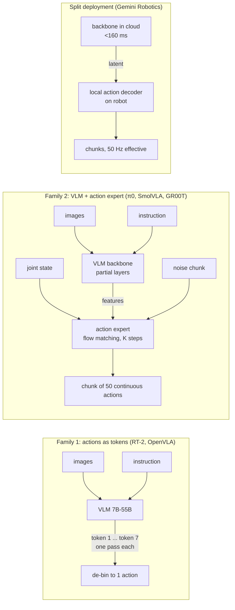

# 18.07 — Vision-language-action models (VLAs)

<!-- glance:start -->
<!-- generated by tools/build.py from curriculum/syllabus.yaml — edit the syllabus, not this block -->

| | |
|---|---|
| **Track** | Main path |
| **Difficulty** | Advanced |
| **Time** | 1 h |
| **Hardware** | none |
| **Software** | none |
| **Prerequisites** | [18.04 ACT — action chunking with transformers](18.04-action-chunking-transformers.md)<br>[13.14 Vision-language models on a robot — describing and questioning the scene](../13-computer-vision/13.14-vision-language-models.md) |
| **Optional prerequisites** | [FML.10 Transformers and attention](../optional-foundations/machine-learning/FML.10-transformers-attention.md) |
| **Version-sensitive** | yes — see [curriculum/versions.yaml](../curriculum/versions.yaml) |
| **Skip if** | You can compare RT-2, OpenVLA, π0-family and SmolVLA architectures. |

<!-- glance:end -->

## What you will learn

- Explain what a vision-language-action model is, and how it differs from the ACT policy you trained in 18.06.
- Compare RT-2, OpenVLA, π0 / π0.5, SmolVLA, GR00T N1.x and Gemini Robotics on backbone, action head, action representation, control rate, size, weights and license.
- Compute what action tokenization costs: bin resolution, tokens per chunk, and why autoregressive decoding is slow.
- Explain flow-matching action heads with a numerical example, and why the number of integration steps matters.
- Label each model MATURE, USABLE-BY-HOBBYIST or RESEARCH, and pick the one you can actually run on the course hardware.

## Why it matters

ACT learns one task in one scene. The final robot hears "find the bottle and put it on the table",
and next week "put the cup in the sink". A VLA is the attempt to get one policy that takes the
*instruction* as input and reuses what a large vision-language model already knows about bottles,
cups and tables. In September 2026 that attempt partly works: open VLAs follow simple instructions on
seen objects, generalize somewhat to new objects, and still fail in ways ACT does not (they are slow,
large, and their failures are harder to predict).

You will read "VLA" in every robotics announcement. This lesson gives you the vocabulary to read the
architecture diagram and ask the three questions that matter for your robot: **how big, how fast, and
can I get the weights?** [18.08](18.08-fine-tuning-a-vla.md) then fine-tunes the one that fits.

<!-- prereqs:start -->
## Prerequisites

You need these first:

- [18.04 ACT — action chunking with transformers](18.04-action-chunking-transformers.md)
- [13.14 Vision-language models on a robot — describing and questioning the scene](../13-computer-vision/13.14-vision-language-models.md)

### Optional prerequisite links

New to any of these? Take the foundation lesson first; skip it if you already know it.

- [FML.10 Transformers and attention](../optional-foundations/machine-learning/FML.10-transformers-attention.md)

Check your readiness: `python course.py why 18.07`
<!-- prereqs:end -->

## Concept

A VLA is a vision-language model (VLM, [13.14](../13-computer-vision/13.14-vision-language-models.md))
that has been taught to output robot actions instead of, or in addition to, text.

The VLM part already turns an image plus "the red bottle" into internal features that point at the red
bottle. That knowledge came from billions of web image-text pairs, which no robot dataset will ever
match. The robotics problem is the last step: turning those features into **joint targets 30–50
times a second**. There are two families of answers:

1. **Actions as words.** Discretize each action number into one of 256 bins, give each bin a token,
   and let the language model "write" the action like a sentence (RT-2, OpenVLA). Elegant: no new
   architecture. Slow: one forward pass per number.
2. **A separate action head.** Keep the VLM as a feature extractor and attach a smaller network, an
   *action expert*, that generates a whole chunk of continuous actions at once, with flow matching or
   diffusion ([18.05](18.05-diffusion-policies.md)) (π0, SmolVLA, GR00T). Fast enough for 50 Hz, and it
   handles several valid ways to do the task.

The industry has moved from family 1 to family 2. The clearest evidence is OpenVLA-OFT (2025): the
same OpenVLA weights, fine-tuned to emit **chunks of continuous actions in parallel**, went from 76.5%
to 97.1% on the LIBERO benchmark and generated actions about 26× faster.

A useful analogy from your world: the VLM is a large general-purpose model behind an API; the action
head is a small, latency-critical service colocated with the hardware. The best systems split the
two, sometimes across machines: Gemini Robotics runs its backbone in the cloud and a local action
decoder on the robot.

> [!TIP]
> **Ask your teacher:** "Draw the π0 architecture as boxes and arrows, then SmolVLA's, and point
> to the three places where SmolVLA saves compute."

## Technical explanation

### Level 1 — Intuition: what goes in and what comes out

```text
 camera images (1-3 views) ─┐
 instruction text ──────────┼──> VLM backbone ──> features ──> action head ──> chunk of H actions
 joint positions (state) ───┘                                               (e.g. 50 × 6 joints)
```

Every VLA in this lesson has that shape. They differ in four design choices:

- **Backbone:** which VLM, how many of its layers are used.
- **Action head:** none (the VLM writes tokens), a regression head, a diffusion transformer, or a
  flow-matching expert.
- **Action representation:** discrete bins or continuous values; one step or a chunk; joint positions
  or end-effector deltas.
- **Deployment:** where it runs and how fast.

### Level 2 — Practical: the comparison table

Figures from the original papers and official model pages (verified 2026-09). "Control rate" is what
the paper reports; your hardware will differ.

| Model (year, lab) | Backbone | Action head | Action representation | Speed / control rate | Params | Open weights | License | Label |
|---|---|---|---|---|---|---|---|---|
| **RT-2** (2023, Google DeepMind) | PaLI-X 5B / 55B, PaLM-E 12B | none: the VLM emits action tokens | 8 tokens per step (terminate, Δxyz, Δrotation, gripper), 256 uniform bins | 55B: 1–3 Hz; 5B: ≈5 Hz; multi-TPU cloud | 5–55B | no | proprietary | RESEARCH (historical) |
| **OpenVLA** (2024, Stanford et al.) | SigLIP + DINOv2 vision, Llama 2 7B | none: overwrites the 256 least-used Llama tokens | 7-DoF end-effector deltas, 256 bins, one step at a time | ≈6 Hz on an RTX 4090; 15 GB bf16, 7 GB 4-bit | 7B | yes | code MIT, weights Llama 2 Community License | RESEARCH |
| **OpenVLA-OFT** (2025) | same as OpenVLA | parallel decoding + L1 regression head | continuous action chunks | ≈26× faster action generation than OpenVLA | 7B | yes | as OpenVLA | RESEARCH |
| **π0** (2024, Physical Intelligence) | PaliGemma 3B | 300M flow-matching action expert, 10 integration steps | continuous chunks of H = 50 | 73 ms per chunk on an RTX 4090; at 50 Hz it re-plans every 25 actions (0.5 s) | 3.3B | yes (openpi, LeRobot) | Apache-2.0 + Gemma terms | USABLE-BY-HOBBYIST with 24 GB (LoRA), else rent |
| **π0-FAST** (2025) | PaliGemma 3B | none: autoregressive | FAST tokens: DCT + byte-pair encoding of the whole chunk | slower inference than π0 (openpi README); matches diffusion VLAs with up to 5× less training time | 3B | yes | Apache-2.0 + Gemma terms | USABLE (24 GB+) |
| **π0.5** (2025, open weights Sep 2025) | PaliGemma-based VLM | flow-matching action expert; pre-trained with FAST tokens; "knowledge insulation" stops action gradients from damaging the VLM | predicts a text subtask ("pick up the pillow"), then a continuous chunk | similar to π0 | ≈3B class | yes (openpi, LeRobot `pi05`) | Apache-2.0 + Gemma terms | USABLE-BY-HOBBYIST on 24–40 GB (rent) |
| **SmolVLA** (2025, Hugging Face) | SmolVLM2-500M, first 16 LLM layers only, 64 visual tokens per frame | ≈100M flow-matching expert, 10 steps | continuous chunks of 50 | runs on consumer GPUs, even CPUs; async inference | 450M | yes | Apache-2.0 | **USABLE-BY-HOBBYIST** (the course's VLA) |
| **GR00T N1** (2025, NVIDIA) | Eagle-2 VLM (1.34B), 12th-layer features, "System 2" at 10 Hz | diffusion transformer, flow matching, 4 steps, "System 1" at 120 Hz | continuous chunks of H = 16; embodiment-specific encoders/decoders | 63.9 ms per 16-action chunk on an L40 | 2.2B | yes | code Apache-2.0, NVIDIA Open Model License | USABLE on rented 40 GB+ / RESEARCH for humanoids |
| **GR00T N1.7** (2026-04) | Cosmos-Reason2-2B (Qwen3-VL based) | 32-layer DiT | chunks of 40; pre-trained on 20,854 h of egocentric human video | inference 16 GB+ GPU | 3B | yes (`groot` in LeRobot) | commercial use permitted | USABLE (rent 40 GB to fine-tune) |
| **Gemini Robotics** 1.0/1.5 (2025) → 2 (2026) | Gemini, backbone in the cloud | local action decoder on the robot | action chunks | backbone < 160 ms, end-to-end ≈ 250 ms, effective 50 Hz | undisclosed | no (trusted testers) | proprietary | RESEARCH (closed) |
| **Gemini Robotics-ER 2** (2026-07) | Gemini embodied-reasoning VLM | none: outputs points, boxes, trajectories, plans, function calls | not motor actions | cloud API | undisclosed | API only | Gemini API terms | USABLE-BY-HOBBYIST (as a planner, module 19) |

Three observations to keep:

1. **Only the bottom half of the table fits your budget.** SmolVLA fine-tunes on a single 24 GB GPU
   in hours; π0/π0.5 LoRA needs ≥ 22.5 GB and is tight; GR00T fine-tuning wants 40 GB+ (rent it).
2. **Chunked continuous heads won.** Every model after 2024 predicts chunks. Binned tokens survive in
   compressed form (FAST) for pre-training.
3. **Openness is not binary.** π0.5 weights carry Gemma terms; GR00T uses NVIDIA's own license;
   OpenVLA's weights follow Llama 2's license. Read the license before you ship a product.

### Level 3 — Mathematics

**Binned action tokens.** Each action dimension $a \in [a_\min, a_\max]$ maps to a bin

$$b = \min\left(255,\ \left\lfloor \frac{a - a_\min}{a_\max - a_\min}\cdot 256 \right\rfloor\right),\qquad \hat a = a_\min + (b + 0.5)\,\frac{a_\max - a_\min}{256}$$

Example: end-effector Δx per step in $[-0.05, 0.05]$ m. Bin width $0.10/256 = 0.39$ mm; worst-case
rounding error 0.195 mm. Resolution is not the problem. **Token count** is: a 7-DoF action needs 7
tokens, and an autoregressive model needs one decoder pass per token. OpenVLA at ≈6 Hz with 7 tokens
per action is ≈42 tokens/s. A 50-step chunk would be $7 \times 50 = 350$ tokens ≈ 8.3 s: useless for
closed-loop control. FAST compresses the chunk first: a smooth trajectory has most of its energy in a
few low-frequency DCT coefficients (the code below: 4 non-zero coefficients out of 50).

**Flow matching.** Training builds a straight path from Gaussian noise $\epsilon$ to a demonstrated
chunk $A$:

$$x_\tau = (1-\tau)\,\epsilon + \tau A,\qquad \tau \sim \mathcal U[0,1],\qquad \mathcal L = \left\| v_\theta(x_\tau, \tau, o) - (A - \epsilon)\right\|^2$$

The network $v_\theta$, conditioned on the observation features $o$, learns the velocity that moves a
noisy chunk toward the data. At inference, start from noise and integrate with $K$ Euler steps:

$$x_{\tau + 1/K} = x_\tau + \tfrac{1}{K}\, v_\theta(x_\tau, \tau, o)$$

Numerical example (one action dimension, from the code below): noise $\epsilon = +3.8$ mm, demonstrated
action $A = +30.0$ mm, $\tau = 0.5$. Then $x_\tau = 0.5 \cdot 3.8 + 0.5 \cdot 30.0 = 16.9$ mm and the
training target is $A - \epsilon = +26.2$ mm per unit $\tau$.

Why several steps? With two valid demonstrations (pass an obstacle 3 cm left, or 3 cm right), the
ideal velocity at $\tau = 0$ points to the *average* of the two, because from pure noise both are
equally likely. One Euler step lands exactly in the middle, on the obstacle. More steps let each
sample commit to one side as $\tau$ grows. With the exact velocity field for this toy:

| Euler steps $K$ | samples within 5 mm of a demonstrated path | samples within 1 cm of the middle |
|---|---|---|
| 1 | 0.0% | 100.0% |
| 2 | 23.4% | 26.9% |
| 4 | 91.8% | 2.2% |
| 10 | 100.0% | 0.0% |

That is why π0 and SmolVLA use 10 steps and GR00T uses 4: each step is one pass of the action head, so
$K$ is a direct latency-versus-quality knob. (Real trained networks only approximate the field, so real
numbers differ; the mechanism is the same.)

**Chunk timing.** π0 at 50 Hz re-plans every 25 actions: $25/50 = 0.5$ s between observations, while
its 73 ms inference is $0.073 \times 50 \approx 3.7$ control ticks. Gemini Robotics' ≈250 ms end-to-end
latency is $0.25 \times 50 = 12.5$ ticks at 50 Hz, covered by the chunk. Rule: **a chunk must be
longer than the latency plus the re-planning interval**, or the robot runs out of actions.
[18.08](18.08-fine-tuning-a-vla.md) simulates exactly this.

### Level 4 — Implementation: what SmolVLA does to be small

From the SmolVLA paper and its LeRobot config (`configuration_smolvla.py`, v0.6.1):

- `vlm_model_name = "HuggingFaceTB/SmolVLM2-500M-Video-Instruct"`, `num_vlm_layers = 16`: only the
  first 16 LLM layers run. Robot control needs spatial features, not the final text-prediction layers
  (GR00T makes the same choice: 12th layer).
- 64 visual tokens per frame, images resized with padding to 512 × 512.
- Action expert width `0.75 ×` the VLM width, interleaving cross-attention (to VLM features) and
  self-attention (over the action chunk).
- `chunk_size = 50`, `n_action_steps = 50`, `num_steps = 10` flow-matching steps.
- Defaults for fine-tuning: `freeze_vision_encoder = True`, `train_expert_only = True`: you train the
  ≈100M action expert and the state projection, not the VLM.
- Pre-trained on 481 community LeRobot datasets, 22.9k episodes, 10.6M frames.

On real SO-100 tasks the paper reports average success of 78.3% for SmolVLA, 61.7% for π0 and 48.3%
for ACT (pick-place, stacking, sorting). Treat that as "competitive on these tasks", not as a ranking:
each number rests on a few tens of trials ([18.10](18.10-evaluating-learned-policies.md)).

## Diagram



## Code

The file [`18-embodied-ai/code/deploy/action_representations.py`](code/deploy/action_representations.py)
(numpy only, tested in `test_deploy.py`) computes the three representations above on toy data.

```python
"""action_representations.py - three ways a VLA can output actions, on toy data (lesson 18.07).

  1. binned tokens (RT-2, OpenVLA): 256 bins per dimension, one token per dimension per step
  2. compressed tokens (FAST idea): DCT of the chunk, keep and quantize the big coefficients
  3. flow matching (pi0, SmolVLA, GR00T): integrate a velocity field from noise to an action,
     shown on two valid demonstrations (pass an obstacle left or right)

numpy only. Run: py action_representations.py
"""
from __future__ import annotations

import numpy as np

H = 50                      # chunk length (actions)
LOW, HIGH = -0.05, 0.05     # per-step end-effector delta range, metres
BINS = 256


def demo_chunk() -> np.ndarray:
    """A smooth 50-step, 1-D chunk of x-deltas (m): accelerate, cruise, slow down."""
    t = np.linspace(0, 1, H)
    return 0.004 * np.sin(np.pi * t) ** 2


def to_bins(a: np.ndarray) -> np.ndarray:
    return np.clip(((a - LOW) / (HIGH - LOW) * BINS).astype(int), 0, BINS - 1)


def from_bins(b: np.ndarray) -> np.ndarray:
    return LOW + (b + 0.5) * (HIGH - LOW) / BINS


def dct_ii(x: np.ndarray) -> np.ndarray:
    n = len(x)
    k = np.arange(n)[:, None]
    basis = np.cos(np.pi / n * (np.arange(n)[None, :] + 0.5) * k)
    scale = np.full(n, np.sqrt(2 / n)); scale[0] = np.sqrt(1 / n)
    return scale * (basis @ x)


def idct_ii(c: np.ndarray) -> np.ndarray:
    n = len(c)
    k = np.arange(n)[None, :]
    basis = np.cos(np.pi / n * (np.arange(n)[:, None] + 0.5) * k)
    scale = np.full(n, np.sqrt(2 / n)); scale[0] = np.sqrt(1 / n)
    return basis @ (scale * c)


def main() -> None:
    a = demo_chunk()

    # 1. binning
    b = to_bins(a)
    err = np.abs(from_bins(b) - a).max()
    print(f"1. binning: bin width {1000 * (HIGH - LOW) / BINS:.3f} mm, max error {1000 * err:.3f} mm, "
          f"{H} tokens for a 1-D chunk, {7 * H} tokens for 7-DoF")

    # 2. DCT compression (the FAST idea, without the BPE step)
    c = dct_ii(a)
    q = np.round(c / 1e-4)                     # quantize coefficients to 0.1 mm steps
    nonzero = int(np.count_nonzero(q))
    rec = idct_ii(q * 1e-4)
    print(f"2. DCT: {nonzero} non-zero quantized coefficients out of {H}, "
          f"max reconstruction error {1000 * np.abs(rec - a).max():.3f} mm")

    # 3. flow matching with TWO valid demonstrations: pass the obstacle 3 cm left or 3 cm right.
    #    Path: x_tau = (1 - tau) * noise + tau * action. We use the exact velocity field for this
    #    two-mode data (what a perfectly trained network would output) and integrate with Euler.
    modes = np.array([-0.03, 0.03])            # lateral offset, metres
    sigma = 0.03                               # noise scale
    rng = np.random.default_rng(0)
    x0 = rng.standard_normal(2000) * sigma

    def velocity(x: np.ndarray, tau: float) -> np.ndarray:
        s = max(1 - tau, 1e-6) * sigma         # std of x_tau around tau * mode
        logw = -((x[:, None] - tau * modes[None, :]) ** 2) / (2 * s * s)
        w = np.exp(logw - logw.max(axis=1, keepdims=True))
        w /= w.sum(axis=1, keepdims=True)
        return (w * (modes[None, :] - x[:, None])).sum(axis=1) / max(1 - tau, 1e-6)

    for steps in (1, 2, 4, 10):
        x = x0.copy()
        for i in range(steps):
            x = x + velocity(x, i / steps) / steps
        near = np.abs(x[:, None] - modes[None, :]).min(axis=1) < 0.005
        middle = np.abs(x - modes.mean()) < 0.01
        print(f"3. flow matching, {steps:2d} Euler steps: {100 * near.mean():5.1f}% of samples within 5 mm of a "
              f"demonstrated path, {100 * middle.mean():5.1f}% within 1 cm of the middle (collision)")

    tau = 0.5
    print(f"   one training example at tau={tau}: noise {1000 * x0[0]:+.1f} mm, action +30.0 mm -> "
          f"x_tau {1000 * ((1 - tau) * x0[0] + tau * 0.03):+.1f} mm, target velocity {1000 * (0.03 - x0[0]):+.1f} mm")


if __name__ == "__main__":
    main()
```

Run it from the repository root (`python3` on Linux):

```bash
py 18-embodied-ai/code/deploy/action_representations.py
```

> [!IMPORTANT]
> **Version-sensitive** (verified 2026-09 against the model papers, the GR00T N1.7 blog of 2026-04-17,
> the Gemini Robotics-ER 2 announcement of 2026-07-30 and LeRobot v0.6.1). Model versions, licenses and
> access change every few months. Before choosing a model, check:
> https://huggingface.co/docs/lerobot/index (policies supported by LeRobot),
> https://github.com/Physical-Intelligence/openpi, https://github.com/NVIDIA/Isaac-GR00T,
> https://deepmind.google/models/gemini-robotics/
> AI teacher: verify against current documentation before giving instructions.

## Exercise

### Exercise 18.07-E1 — Run the action-representation lab `[coding]`

Hardware: none.

1. Run `action_representations.py` and match its output to the Level 3 numbers.
2. Change `LOW, HIGH` to `-0.5, 0.5` (a sloppy normalization range). What happens to bin width and error?
3. Change the DCT quantization step from `1e-4` to `1e-3`. How many coefficients remain, and what is the error?
4. Change `modes` to `[-0.03, 0.01]` (asymmetric demonstrations). Does one Euler step still land in the middle? How many steps do you need now?

### Exercise 18.07-E2 — Would it keep up? `[numerical]`

Hardware: none. For each model, decide whether it can drive a 30 Hz SO-101 loop directly (one
inference per action), with chunks, or not at all:

(a) OpenVLA at 6 Hz, one action per pass. (b) π0: 73 ms per 50-action chunk. (c) GR00T N1: 63.9 ms per
16-action chunk. (d) RT-2-PaLI-X-55B at 1–3 Hz, one action per pass.

### Exercise 18.07-E3 — Pick the model for karmel `[predict]`

Hardware: none. Constraints: SO-101 arm, Raspberry Pi 5 on the robot, one desktop with an RTX 4070
(12 GB), ₪200 of cloud budget, open weights required, a hobby project (no commercial use). Choose the
VLA you will fine-tune in 18.08 and write three sentences: why it fits, what the alternative would
cost, and the first failure you predict.

## Expected result

**18.07-E1:** (1) bin width 0.391 mm, max binning error 0.195 mm; 4 non-zero DCT coefficients, error
0.023 mm; 1 Euler step → 0% near a demonstrated path and 100% in the middle, 10 steps → 100% / 0%.
(2) Bin width grows 10× to 3.9 mm, the error to 1.95 mm, and the whole 0–4 mm chunk uses only 2
distinct bins: the motion shape is lost. That is why real VLAs normalize each dimension with
percentiles of the training data (OpenVLA uses the 1st and 99th). (3) 2 coefficients remain and the
error rises from 0.023 to 0.053 mm: fewer tokens, less fidelity. (4) Yes: one step lands 100% of
samples on the mean of the modes, now −1 cm, which is neither demonstration; 10 steps put 99.8%
within 5 mm of a demonstrated path. The one-step failure does not depend on symmetry.

**18.07-E2:** (a) No: 6 Hz < 30 Hz, and it has no chunks. (b) Yes with chunks: 73 ms ≈ 2.2 ticks at
30 Hz, a 50-action chunk covers 1.67 s. (c) Yes: 63.9 ms ≈ 1.9 ticks, a 16-action chunk covers 0.53 s,
enough margin. (d) No.

**18.07-E3:** SmolVLA is the expected answer: 450M parameters, Apache-2.0, fine-tunes in the
10–16 GB range with the vision encoder frozen (tight on 12 GB: batch 4 or smaller), inference offloaded
from the Pi to the desktop. Alternatives: π0.5 LoRA on a rented A100 40 GB (≈4–8 h at $2.50/h ≈
₪30–60 per attempt, plus Gemma terms) or GR00T N1.7 on 40 GB+. Predicted first failure: slow or jerky
motion when inference runs on the Pi, or grasps that ignore the instruction when the dataset has only one task.

## Troubleshooting

### Symptom: a paper's success rate looks far better than what you get

1. Same robot? Most VLA numbers come from Franka, ALOHA or the lab's own robots, not an SO-101.
2. Same evaluation? Simulation benchmarks (LIBERO) are not real-world numbers. Real-world tables often
   rest on 10–20 trials per task; compute the interval ([18.10](18.10-evaluating-learned-policies.md)).
3. Zero-shot or fine-tuned? "Base" checkpoints are pre-trained; almost every real result is after
   fine-tuning on the target robot.
4. Same action space? A model trained on end-effector deltas does not drive joint targets without an
   adapter or fine-tuning.

### Symptom: you cannot decide whether a model is usable

Check, in this order: (1) are weights downloadable today, (2) license, (3) fine-tuning VRAM vs your GPU
or rental budget, (4) inference latency vs your control rate and chunk length, (5) is it wrapped in
LeRobot (saves weeks). A "no" at any step makes it RESEARCH for you, whatever the demo video shows.

## Common mistakes

- **Treating the VLM's knowledge as the robot's skill.** The VLM knows what a bottle looks like; it
  does not know how your gripper must approach it. That still comes from your demonstrations.
- **Comparing parameter counts across families.** A 3B model with a 300M action expert runs the
  expensive part once per chunk; a 7B token model runs its whole decoder once per action dimension.
- **Assuming "open" means "free for any use".** Check the weight license separately from the code license.
- **Ignoring the action space.** Joint positions (SO-101 in LeRobot) vs end-effector deltas (OpenVLA,
  RT-2) are different contracts; mixing them silently produces nonsense motion.
- **Reading one Euler step as "fast inference".** Fewer integration steps trade quality for speed;
  on multimodal tasks the trade is visible.

## Knowledge check

1. What are the four parts of a VLA's design that distinguish the models in this lesson?
   <details><summary>Answer</summary>

   Backbone (which VLM, which layers), action head (none, regression, diffusion, flow matching), action
   representation (discrete bins or continuous; single step or chunk; joints or end-effector), and
   deployment (where it runs, latency, control rate).
   </details>

2. An action dimension ranges over [−0.2, 0.2] rad and is binned into 256 bins. What is the bin width and the worst rounding error?
   <details><summary>Answer</summary>

   0.4 / 256 = 1.56 mrad (0.09°); worst error half of that, 0.78 mrad.
   </details>

3. OpenVLA produces ≈42 tokens/s. How long would a 7-DoF, 20-step chunk take autoregressively, and what did OpenVLA-OFT change?
   <details><summary>Answer</summary>

   7 × 20 = 140 tokens ≈ 3.3 s. OFT decodes all actions in parallel with a regression head that outputs
   continuous chunks (L1 loss), which made action generation ≈26× faster and improved LIBERO success
   from 76.5% to 97.1%.
   </details>

4. In flow matching with $x_\tau = (1-\tau)\epsilon + \tau A$, noise $\epsilon = -10$ mm, action $A = 20$ mm, $\tau = 0.25$. Compute $x_\tau$ and the training target.
   <details><summary>Answer</summary>

   $x_\tau = 0.75 \cdot (-10) + 0.25 \cdot 20 = -2.5$ mm. Target velocity $A - \epsilon = 30$ mm per unit $\tau$.
   </details>

5. Predict: you cut SmolVLA's flow-matching steps from 10 to 1 to save latency on a task where you demonstrated grasping a mug by either its left or right side. What happens?
   <details><summary>Answer</summary>

   The first (and only) step moves the noise toward the average of the valid actions, so the gripper
   tends to aim between the two grasps, at the middle of the mug, and fails or collides. Multimodal
   tasks need several integration steps (or a distilled one-step model trained for it).
   </details>

6. Why does GR00T N1 use the 12th layer of its VLM and SmolVLA only the first 16 LLM layers?
   <details><summary>Answer</summary>

   Both papers found that middle-layer features are enough (or better) for control and much cheaper:
   fewer layers means lower latency, and the final layers specialize in predicting text, which the
   action head does not need. GR00T reports both faster inference and higher success with middle-layer features.
   </details>

7. Which models in the table can you (a) run and fine-tune at home on one 24 GB GPU, (b) only use through an API, (c) only read about?
   <details><summary>Answer</summary>

   (a) SmolVLA comfortably; π0/π0.5 LoRA tightly (openpi lists > 22.5 GB); OpenVLA only slowly with small
   batches. (b) Gemini Robotics-ER 2 (planner, not motor control). (c) RT-2, Gemini Robotics VLA/On-Device
   (trusted testers), π*0.6/π0.7 (closed). GR00T N1.7 fine-tuning needs 40 GB+, so rent.
   </details>

## Practical challenge

Write a one-page architecture decision record (ADR) for the manipulation skill of the final robot:
"which VLA, if any, implements `pick(object)`".

Acceptance criteria:

- Compares at least three options from the table (one of them "no VLA: ACT per object" from 18.06),
  on weights, license, fine-tuning compute and cost in shekels, inference latency vs a 30 Hz loop, and
  maturity label.
- Contains one latency calculation (inference + network, in control ticks, vs chunk length).
- States the evidence that would make you revise the decision (for example "SmolVLA below 60% Wilson
  lower bound on 3 bottle types after 18.08").
- Reviewed with your teacher acting as a skeptical staff engineer.

## You can skip this if…

You can compare RT-2, OpenVLA, π0-family and SmolVLA architectures from memory, and you answer
knowledge-check questions 3, 5 and 7 correctly without looking.

`python course.py skip 18.07 --reason "I know VLA architectures and trade-offs"`

## Go deeper

- Brohan et al., *RT-2: Vision-Language-Action Models Transfer Web Knowledge to Robotic Control*, 2023: https://arxiv.org/abs/2307.15818 — where "VLA" and actions-as-tokens come from.
- Kim et al., *OpenVLA*, 2024: https://arxiv.org/abs/2406.09246 — then *OpenVLA-OFT*, 2025: https://arxiv.org/abs/2502.19645, the clearest design study of why chunked continuous heads win.
- Black et al., *π0: A Vision-Language-Action Flow Model for General Robot Control*, 2024: https://arxiv.org/abs/2410.24164 — the action-expert architecture most open VLAs now copy.
- Pertsch et al., *FAST: Efficient Action Tokenization for VLA Models*, 2025: https://arxiv.org/abs/2501.09747 — DCT + BPE tokenization.
- Physical Intelligence, *π0.5*, 2025: https://arxiv.org/abs/2504.16054 — co-training and hierarchical inference; openpi code: https://github.com/Physical-Intelligence/openpi
- Shukor et al., *SmolVLA*, 2025: https://arxiv.org/abs/2506.01844 — short and practical; read it before 18.08.
- NVIDIA, *GR00T N1*, 2025: https://arxiv.org/abs/2503.14734 and the N1.7 blog: https://huggingface.co/blog/nvidia/gr00t-n1-7
- Gemini Robotics Team, *Gemini Robotics*, 2025: https://arxiv.org/abs/2503.20020 — the cloud-backbone / local-decoder split and the ER model.
- The course paper list, Track 7: [references/papers.md](../references/papers.md) — reading order and what to skip in each paper.

## Progress checkpoint

- [ ] I can explain the two families of VLA action outputs and why chunked continuous heads won.
- [ ] I can compare the models in the table on backbone, action head, representation, speed, size, weights and license.
- [ ] I can compute bin resolution, token counts and latency in control ticks.
- [ ] I can explain flow matching with a numerical example and why integration steps matter.
- [ ] I can label each model MATURE / USABLE-BY-HOBBYIST / RESEARCH for my own hardware.

`python course.py complete 18.07` (exercises done) · `python course.py master 18.07`
(challenge done) · `python course.py struggle 18.07 "what was hard"`

Next: [18.08 — Fine-tuning a small VLA on your own demonstrations](18.08-fine-tuning-a-vla.md).
