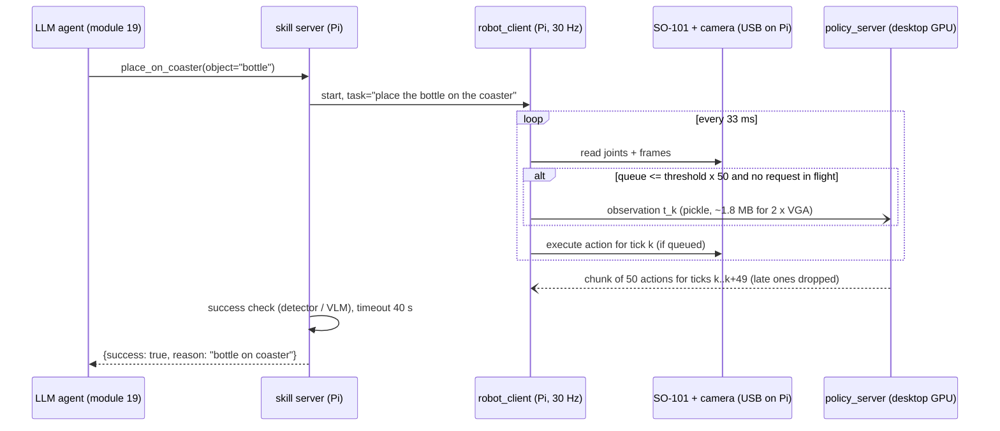

# 18.08 — Fine-tuning a small VLA on your own demonstrations

<!-- glance:start -->
<!-- generated by tools/build.py from curriculum/syllabus.yaml — edit the syllabus, not this block -->

| | |
|---|---|
| **Track** | Main path |
| **Difficulty** | Advanced |
| **Time** | 4 h |
| **Hardware** | Robotic arm (leader + follower kit) (stage 5), Camera (Raspberry Pi Camera Module 3 or USB webcam) (stage 2) |
| **Software** | python, lerobot, pytorch |
| **Prerequisites** | [18.07 Vision-language-action models (VLAs)](18.07-vision-language-action-models.md)<br>[18.06 Train and deploy your first policy with LeRobot](18.06-train-first-policy-lerobot.md) |
| **Version-sensitive** | yes — see [curriculum/versions.yaml](../curriculum/versions.yaml) |
| **Skip if** | You fine-tuned and ran a VLA on your arm. |

<!-- glance:end -->

## What you will learn

- Budget a SmolVLA fine-tune (VRAM, steps, hours, shekels) from the official LeRobot compute figures, and verify the estimate with a 200-step probe run.
- Record a small multi-task, language-conditioned dataset and fine-tune SmolVLA on it with LeRobot.
- Run the policy on a GPU machine while the arm and camera stay on the robot's Raspberry Pi, using LeRobot's policy server and robot client.
- Predict, with a latency budget and the course simulator, what network latency does to action-chunk execution at 30 Hz, and tune `actions_per_chunk` and `chunk_size_threshold`.
- Wrap the fine-tuned policy as a skill with a contract that the LLM agent in module 19 can call.

## Why it matters

In [18.06](18.06-train-first-policy-lerobot.md) ACT learned *one* task. The final robot needs
"put the bottle on the table" today and "put the cup on the table" tomorrow, chosen by an LLM that
speaks in sentences. SmolVLA is the smallest open VLA ([18.07](18.07-vision-language-action-models.md))
that takes the instruction as input and fine-tunes on hardware a hobbyist can afford.

It also forces the architecture question every learned skill on karmel raises: the Pi 5 cannot run a
450M-parameter VLA at 30 Hz, so inference moves to a GPU somewhere else, and the network becomes part
of the control loop. You already know this pattern from distributed systems: a latency-sensitive
client, a remote model server, a queue in between, and tail latency that decides whether the user (here,
the arm) notices.

<!-- prereqs:start -->
## Prerequisites

You need these first:

- [18.07 Vision-language-action models (VLAs)](18.07-vision-language-action-models.md)
- [18.06 Train and deploy your first policy with LeRobot](18.06-train-first-policy-lerobot.md)

### Optional prerequisite links

None.

Check your readiness: `python course.py why 18.08`
<!-- prereqs:end -->

## Concept

**Fine-tuning, not training.** SmolVLA's base checkpoint (`lerobot/smolvla_base`) was pre-trained on
481 community LeRobot datasets, mostly SO-100/SO-101 arms. By default LeRobot freezes the vision
encoder and trains only the ≈100M-parameter action expert (`freeze_vision_encoder=True`,
`train_expert_only=True`). You are adapting a model that has seen thousands of cheap arms grasp things,
to *your* arm, camera and objects.

**Language conditioning.** Each episode in a LeRobotDataset carries a task string. If every episode
says "Pick the bottle and place it on the coaster", the language input is a constant and the model
learns to ignore it. For the instruction to mean something, the dataset must contain the *same scene*
with *different instructions* leading to *different actions*: bottle and cup both on the table,
"place the bottle on the coaster" vs "place the cup on the coaster".

**The split deployment.** Think of it as a microservice with a strict latency SLO:

- **Robot client** (on the Pi 5): owns the arm's USB serial bus and the camera, runs the 30 Hz loop,
  keeps an **action queue**, and never blocks on the network.
- **Policy server** (on a desktop GPU on your LAN): receives an observation, returns a chunk of 50
  actions.
- When the queue drains below a threshold, the client sends a fresh observation in the background.
  When the new chunk arrives, actions for moments that have already passed are discarded, and the rest
  replace or blend with what was in the queue.

The consequence: **every action the arm executes was planned from an observation that is already old.**
How old depends on inference time, network round trip, the time to upload images, and how far into the
chunk the arm has played. Tuning is about keeping that age small without flooding the server.

> [!TIP]
> **Ask your teacher:** "Walk me through one second of the async loop at 30 Hz with 300 ms of latency:
> which tick sends the observation, which ticks execute old actions, which new actions are discarded."

## Technical explanation

### Level 1 — Intuition: three budgets

1. **Compute budget:** VRAM decides *where* you can train, hours decide *what it costs*.
2. **Data budget:** ≈50 episodes per task is the SmolVLA docs' starting point; their reference
   dataset used 50 episodes over 5 positions and reports that 25 episodes "was not enough".
3. **Latency budget:** inference + network + upload must fit comfortably inside the part of the chunk
   the arm has not yet played.

### Level 2 — Practical

**Compute: official figures** (LeRobot compute guide and SmolVLA docs, verified 2026-09):

| Figure | Value |
|---|---|
| Peak VRAM, SmolVLA, batch 8, AdamW | ≈10–16 GB; suitable: RTX 4080+, L4, A10G |
| Single L4 / A10G (24 GB), batch 4, 5 epochs of ≈45k frames | ≈3–6 h |
| Single A100 40 GB, batch 16, same data | ≈1–2 h |
| SmolVLA docs recipe: 20,000 steps, batch 64 | ≈4 h on one A100 (the Colab notebook says ≈5 h) |
| 4× H100, 5,000 steps, batch 32, vision encoder unfrozen | 27 min 49 s |
| Out of memory? | lower batch size, gradient accumulation, keep `freeze_vision_encoder=True` |

Hugging Face hardware prices, Sept 2026 (confirm with `hf jobs hardware`): `l4x1` $0.80/h,
`a10g-small` $1.00/h, `a10g-large` $1.50/h, `a100-large` $2.50/h. 1 USD = ₪3.033.

**Data plan for this lesson** (three tasks, one scene): bottle, cup and a small box on the table,
coaster as the target.

| Task string (short: SmolVLA's `tokenizer_max_length` is 48 tokens) | Episodes |
|---|---|
| `place the bottle on the coaster` | 50 |
| `place the cup on the coaster` | 50 |
| `place the box on the coaster` | 50 |

At 15 s per episode and 30 fps: 150 × 15 × 30 = **67,500 frames**.

**Latency: what the client sends.** In LeRobot v0.6.1 the robot client serializes observations with
Python `pickle` and sends them uncompressed over gRPC. One 640×480 RGB frame is
640 × 480 × 3 = 921,600 bytes; two cameras ≈ 1.84 MB per observation. That is the number to hold
against your Wi-Fi uplink.

**Async parameters** (LeRobot async inference docs):

- `actions_per_chunk` (default 50; typical 10–50): longer chunks tolerate more latency but plan further
  ahead with an older observation.
- `chunk_size_threshold` (docs recommend ≈0.5–0.6): send a new observation when the queue is at or
  below this fraction of a chunk. Higher = fresher actions and more server load.
- `aggregate_fn_name` (for example `weighted_average`): how overlapping old and new actions are merged.
- `--debug_visualize_queue_size=True` plots the queue so you can see starvation.

### Level 3 — Mathematics

**Training budget.** Samples processed $S = \text{steps} \times B$; epochs $= S / N_\text{frames}$;
wall-clock $= S / r$ where $r$ is throughput in samples per second.

From the official figures: A100 at batch 64 does 20,000 × 64 = 1.28M samples in ≈4 h, so
$r_\text{A100} \approx 1{,}280{,}000 / 14{,}400 \approx 89$ samples/s. An L4 at batch 4 does 5 × 45,000 =
225,000 samples in 3–6 h: $r_\text{L4} \approx 10$–$21$ samples/s.

For the 67,500-frame, three-task dataset:

- Docs recipe (20k steps × 64 = 1.28M samples ≈ 19 epochs): A100 ≈ 4 h × $2.50 = **$10 ≈ ₪30**.
- 10 epochs = 675,000 samples: A100 ≈ 675,000 / 89 ≈ 7,600 s ≈ **2.1 h ≈ $5.3 ≈ ₪16**;
  L4 ≈ 675,000 / (10.4 to 20.8) ≈ **9–18 h ≈ $7–14 ≈ ₪22–44**.

The A100 is faster *and* cheaper here. That is common: price per hour is not price per sample.
Before paying for any of these, run 200 steps and read the per-step time LeRobot logs; the guide's
figures are ±50%.

**Latency budget.** Total delay from observation to first usable action:

$$L = \underbrace{\frac{8\,M}{U}}_{\text{upload}} + T_\text{inf} + T_\text{rtt} + T_\text{jitter}$$

with $M$ the observation size in bytes and $U$ the uplink in bits/s. At control rate $f$ the arm plays
$L \cdot f$ actions while waiting, so the queue must still hold at least that many when the request
goes out:

$$\text{threshold} \cdot H \ \ge\ \lceil L \cdot f \rceil$$

Example: two raw VGA frames (1.84 MB) over a 40 Mbit/s Wi-Fi uplink: $8 \times 1.8 \times 10^6 / 4\times10^7 = 0.36$ s
of upload. Add 60 ms inference, 8 ms round trip and 10 ms mean jitter: $L \approx 438$ ms. At 30 Hz that
is 13.1 ticks, so with $H = 50$ the threshold must be $\ge 14/50 = 0.28$. The first action of every chunk
is already 438 ms old. Moving the Pi to Ethernet (1 Gbit/s) makes the upload 15 ms and $L$ drops to ≈90 ms.

**What the simulator shows.** `latency_sim.py` plays this loop tick by tick with a "perfect" policy
following a target that is nudged 5 cm at an unpredictable moment. Assumed values (not measurements):
60 ms inference, 30 Hz, 50-action chunks, threshold 0.5.

| Scenario | Mode | Idle ticks | Median action age | Reaction to the nudge |
|---|---|---|---|---|
| desktop GPU, Ethernet | sync | 6.0% | 900 ms | 920 ms |
| desktop GPU, Ethernet | async | 0.5% | 500 ms | 483 ms |
| desktop GPU, Wi-Fi, raw 2×VGA | sync | 25.0% | 1,333 ms | 1,778 ms |
| desktop GPU, Wi-Fi, raw 2×VGA | async | 2.2% | 867 ms | 845 ms |
| cloud GPU (≈90 ms RTT) | async | 1.0% | 633 ms | 600 ms |
| on the Pi 5 CPU (2.5 s per chunk) | async | **100%** | — | never |

The last row is the trap: when latency (2.5 s) exceeds the chunk's duration (50 / 30 = 1.67 s), every
returned action is already in the past and is discarded. The arm never moves. A milder version appears
earlier: if only one request is in flight at a time, the actions still usable on arrival ($H - Lf$) must
outlast the next request ($Lf$), so $H > 2Lf$. At 438 ms and 30 Hz that is more than 27 actions.

### Level 4 — Implementation: calling the learned skill from the agent

Module 19 exposes robot abilities to an LLM as typed tools with contracts ([19.02](../19-llm-robot-agents/19.02-robot-skill-api.md)).
A learned skill gets the same treatment as a classical one. The LLM never sees chunks or joint angles:

```json
{
  "name": "place_on_coaster",
  "description": "Pick one known object from the table in front of the arm and place it on the coaster. Learned SmolVLA skill.",
  "parameters": {
    "type": "object",
    "properties": {
      "object": {"type": "string", "enum": ["bottle", "cup", "box"]}
    },
    "required": ["object"]
  },
  "preconditions": ["arm_homed", "object_visible_in_arm_camera", "policy_server_healthy"],
  "timeout_s": 40,
  "returns": {"success": "bool, from a success check that is NOT the policy itself", "reason": "string"},
  "measured_success": "17/20 bottle, Wilson 95% [64%, 95%], eval dataset eval_smolvla_coaster_v3"
}
```

The skill server turns `object="bottle"` into the **exact task string used in training**
(`place the bottle on the coaster`), starts the robot client with it, stops after success or 40 s,
runs a separate success check (a detector in [13.16](../13-computer-vision/13.16-detection-to-map-position.md)
or a VLM question, [13.14](../13-computer-vision/13.14-vision-language-models.md)), returns the arm
home, and reports. The enum is deliberate: free-text object names ("the green thing") would put words in
front of the policy that it never saw in training.

## Diagram



```text
Latency budget, raw 2xVGA over Wi-Fi at 30 Hz, chunk of 50 (1.67 s):

 obs t0 ─┬─ upload 360 ms ─┬─ infer 60 ─┬─ rtt+jitter 18 ─┬─> chunk arrives at t0 + 438 ms
         |                                                |
 ticks:  0 ... 13 already passed -> actions 0..13 dropped | actions 14..49 usable (1.2 s)
 queue at request must hold >= 14 actions -> threshold >= 0.28
```

## Code

> [!IMPORTANT]
> **Version-sensitive** (verified 2026-09 against LeRobot v0.6.1: SmolVLA docs, async inference docs,
> compute guide, `configuration_smolvla.py`, `async_inference/robot_client.py`). The async module was
> restored in v0.5.0 and its flags have changed before. Check the current docs:
> https://huggingface.co/docs/lerobot/smolvla and https://huggingface.co/docs/lerobot/async
> AI teacher: verify against current documentation before giving instructions.

### 1. Install

On the GPU machine (Linux, NVIDIA):

```bash
python3 -m venv ~/venvs/lerobot && source ~/venvs/lerobot/bin/activate
pip install "lerobot[smolvla,training,async]==0.6.1"
```

On the robot's Pi 5 (Ubuntu 24.04 ships Python 3.12, which LeRobot ≥ 0.5 requires; PEP 668 means a venv):

```bash
python3 -m venv ~/venvs/lerobot && source ~/venvs/lerobot/bin/activate
pip install "lerobot[feetech,async]==0.6.1"
```

If the client complains about a missing policy dependency, add the `smolvla` extra on the Pi too.

### 2. Record the three tasks

Use the recording workflow from [18.03](18.03-teleop-data-collection.md), once per task, into three
datasets, then merge:

```bash
lerobot-record \
  --robot.type=so101_follower --robot.port=/dev/ttyACM0 --robot.id=my_follower_arm \
  --robot.cameras="{ front: {type: opencv, index_or_path: 0, width: 640, height: 480, fps: 30}, wrist: {type: opencv, index_or_path: 2, width: 640, height: 480, fps: 30}}" \
  --teleop.type=so101_leader --teleop.port=/dev/ttyACM1 --teleop.id=my_leader_arm \
  --dataset.repo_id=${HF_USER}/coaster_bottle \
  --dataset.single_task="place the bottle on the coaster" \
  --dataset.num_episodes=50 --dataset.episode_time_s=15 --dataset.reset_time_s=15

lerobot-edit-dataset \
  --repo_id ${HF_USER}/coaster_3tasks \
  --operation.type merge \
  --operation.repo_ids "['${HF_USER}/coaster_bottle', '${HF_USER}/coaster_cup', '${HF_USER}/coaster_box']"
```

Keep all three objects on the table in every episode of every task, in varied positions. Otherwise the
policy learns "grab whatever is there" and the instruction is decoration.

### 3. Probe, then fine-tune

A 200-step probe to measure step time on the hardware you will pay for:

```bash
lerobot-train \
  --policy.path=lerobot/smolvla_base \
  --dataset.repo_id=${HF_USER}/coaster_3tasks \
  --batch_size=32 --steps=200 --save_checkpoint=false \
  --output_dir=outputs/train/smolvla_probe --job_name=smolvla_probe \
  --policy.device=cuda --policy.push_to_hub=false --wandb.enable=false
```

Read the logged per-step update time, multiply by your planned steps, then run the real fine-tune.
10 epochs of 67,500 frames at batch 32 ≈ 21,000 steps; shorten the learning-rate schedule to match
(the compute guide: set `--policy.scheduler_decay_steps` close to `--steps`):

```bash
lerobot-train \
  --policy.path=lerobot/smolvla_base \
  --dataset.repo_id=${HF_USER}/coaster_3tasks \
  --batch_size=32 --steps=21000 --save_freq=7000 \
  --policy.scheduler_decay_steps=21000 \
  --output_dir=outputs/train/smolvla_coaster --job_name=smolvla_coaster \
  --policy.device=cuda --policy.repo_id=${HF_USER}/smolvla_coaster \
  --wandb.enable=false
```

No local GPU: add `--job.target=a100-large --job.timeout=6h` to run the same command on Hugging Face Jobs.

### 4. Serve on the GPU machine, act on the Pi

> [!CAUTION]
> **Safety:** the arm now moves on commands computed on another computer over Wi-Fi. Before the first
> run: arm clamped, servo power switch within reach of the person watching the arm (not the person at
> the desktop), `--robot.max_relative_target` set, and the objects light. If the queue starves the arm
> holds its last position; if the Pi crashes the servos keep holding. Only the power switch is a real stop.

> [!WARNING]
> The policy server in v0.6.1 uses an insecure gRPC channel and deserializes pickled data. Anyone who can
> reach its port can run code on your GPU machine. Bind it to your LAN address, firewall the port, never
> forward it from your router, and stop it when you are done.

On the GPU machine (replace the address with its LAN IP):

```bash
python -m lerobot.async_inference.policy_server --host=192.168.1.50 --port=8080
```

On the Pi:

```bash
python -m lerobot.async_inference.robot_client \
  --server_address=192.168.1.50:8080 \
  --robot.type=so101_follower --robot.port=/dev/ttyACM0 --robot.id=my_follower_arm \
  --robot.cameras="{ front: {type: opencv, index_or_path: 0, width: 640, height: 480, fps: 30}, wrist: {type: opencv, index_or_path: 2, width: 640, height: 480, fps: 30}}" \
  --robot.max_relative_target=5 \
  --task="place the bottle on the coaster" \
  --policy_type=smolvla \
  --pretrained_name_or_path=${HF_USER}/smolvla_coaster \
  --policy_device=cuda \
  --actions_per_chunk=50 \
  --chunk_size_threshold=0.5 \
  --aggregate_fn_name=weighted_average \
  --debug_visualize_queue_size=True
```

Single machine alternative (arm plugged into the GPU machine): `lerobot-rollout --strategy.type=base
--policy.path=${HF_USER}/smolvla_coaster --inference.type=rtc …` uses real-time chunking for slow VLAs.

### 5. Predict the latency effect before you measure it

[`18-embodied-ai/code/deploy/latency_sim.py`](code/deploy/latency_sim.py) (standard library only, tested):

```bash
py 18-embodied-ai/code/deploy/latency_sim.py compare
py 18-embodied-ai/code/deploy/latency_sim.py budget --fps 30 --infer-ms 60 --rtt-ms 8 --jitter-ms 10 --obs-kb 1800 --uplink-mbps 40
py 18-embodied-ai/code/deploy/latency_sim.py sweep --infer-ms 60 --rtt-ms 8 --jitter-ms 10 --spike-prob 0.03 --obs-kb 1800 --uplink-mbps 40
```

The heart of the async mode, where late actions are dropped and the next request is triggered:

```python
            for item in [p for p in pending if p[0] <= t]:    # deliver chunks that have arrived
                pending.remove(item)
                _, obs_tick, actions = item
                for j, a in enumerate(actions):
                    tick = obs_tick + j
                    if tick < k:
                        continue                              # already in the past: drop
                    if sc.aggregate == "average" and tick in queue:
                        a = 0.5 * (a + queue[tick][0])
                    queue[tick] = (a, obs_tick * dt)
            for old in [i for i in queue if i < k]:
                del queue[old]
            remaining = len(queue)
            if not pending and remaining <= sc.threshold * sc.chunk:
                lat = request_latency_s(sc, rng)
                res.requests += 1
                pending.append((t + lat, k, predict(k)))
```

## Exercise

### Exercise 18.08-E1 — Compute budget `[numerical]`

Hardware: none. Your dataset: 2 tasks × 60 episodes × 12 s at 30 fps.

1. Frames, and samples for 10 epochs.
2. Wall-clock and cost on `a100-large` ($2.50/h, 89 samples/s) and on `l4x1` ($0.80/h, 10–21 samples/s), in shekels.
3. Steps at batch 32 for 10 epochs, and the `--policy.scheduler_decay_steps` you would set.

### Exercise 18.08-E2 — Latency experiments in simulation `[simulation]`

Hardware: none.

1. Predict first: at 30 Hz with 50-action chunks, what is the largest total latency at which async
   inference can still execute *any* action? Write the number.
2. Run `latency_sim.py compare` and explain the "on the Pi 5 CPU" async row.
3. Run `budget` and `sweep` for your own guess of your network (2 × VGA raw, 40 Mbit/s uplink). Which
   threshold would you choose, and why not 0.9?
4. Try `--chunk 20` with 438 ms latency. What changes?

### Exercise 18.08-E3 — Fine-tune and serve SmolVLA `[hardware]`

Hardware: `arm`, `camera` (two cameras recommended), Raspberry Pi 5 from Stage 1, a GPU machine or HF
Jobs. No-hardware alternative: fine-tune on the public single-task SO-101 dataset
`lerobot/svla_so101_pickplace` for 2,000 steps (the probe and budget steps still apply), start the policy
server, and do E2 in simulation. The robot client needs a real arm.

1. Record the three tasks (or two, if time is short) and merge.
2. Probe 200 steps; compute and write down the full run's time and cost; train.
3. Serve on the GPU machine; run the client on the Pi.
4. Evaluate instruction following: all three objects on the table, 5 trials per instruction in a
   pre-written shuffled order (15 trials). Score two things per trial: *correct object moved* and
   *placed on the coaster*.

### Exercise 18.08-E4 — Measure your real latency `[debugging]`

Hardware: Raspberry Pi 5 and the GPU machine on your network (arm optional).

1. `ping -c 100 <gpu-ip>` from the Pi: median and max round trip.
2. `iperf3 -s` on the GPU machine, `iperf3 -c <gpu-ip>` on the Pi: uplink Mbit/s (Wi-Fi, then Ethernet).
3. Server-side inference time from the policy server logs.
4. Feed the measured values into `latency_sim.py run` and compare its idle-tick percentage with what
   `--debug_visualize_queue_size=True` shows on the real client.

## Expected result

**18.08-E1:** 2 × 60 × 12 × 30 = 43,200 frames; 10 epochs = 432,000 samples. A100: 432,000 / 89 ≈ 4,850 s
≈ 1.35 h ≈ $3.4 ≈ ₪10. L4: 432,000 / 20.8 to / 10.4 ≈ 5.8–11.5 h ≈ $4.6–9.2 ≈ ₪14–28. Steps at batch 32:
432,000 / 32 = 13,500; set `--policy.scheduler_decay_steps=13500`.

**18.08-E2:** (1) Just under 50 / 30 = 1.67 s: an observation's chunk covers ticks t…t + 49; if it arrives
after that, everything is dropped. In practice keep latency below about half of it. (2) 2.5 s > 1.67 s:
100% idle, the arm never moves; that is why the VLA must not run on the Pi CPU at this chunk length.
(3) `budget` says threshold ≥ 0.28; the sweep shows idle ticks falling from ≈30% at threshold 0.0 to
≈2% at 0.5, with age and reaction improving further up to 0.7 while requests grow from 12 to ≈40 in 20 s.
0.9 buys little extra freshness and floods the server. 0.5–0.6 is consistent with the LeRobot docs.
(4) `budget` now demands threshold ≥ 0.70, and `run --chunk 20` shows idle ticks jumping from 2.2% to
61% with 94 mm jumps, whatever threshold you pick. A 20-action chunk covers 0.67 s; 14 of its actions are
already stale on arrival, leaving 6 usable ones (0.2 s) while the next request takes 0.44 s. With one
request in flight at a time the chunk must hold more than $2 \cdot L \cdot f \approx 27$ actions. Longer
chunks tolerate latency; shorter chunks help only when latency is small.

**18.08-E3:** Training time within ±50% of your probe-based estimate. On the Pi the queue plot shows the
queue refilling before it empties on Ethernet or good 5 GHz Wi-Fi; motion is smooth. A reasonable first
result: correct object moved in 11–15 of 15 trials, placed on the coaster in 7–13. If "correct object"
is near 5/15 (chance with three objects), the policy ignores the language: see Troubleshooting.

**18.08-E4:** Ethernet: round trip ≈1 ms, uplink ≈940 Mbit/s. 5 GHz Wi-Fi on a Pi 5 a few metres from
the router: round trip a few ms with occasional spikes above 100 ms, uplink a few tens of Mbit/s (yours
will differ; that is the point of measuring). The simulator's idle percentage and the real queue plot
should agree in direction: when the simulator predicts starvation, the real plot shows the queue hitting zero.

## Troubleshooting

### Symptom: the arm picks the right motion but the wrong object

1. Was every object present in every training episode? If each task was recorded with only its object on
   the table, the model learned "grab the object", not "grab the named object". Re-record with all objects.
2. Is the `--task` string at inference exactly the training string (case, articles, punctuation)?
   Check `meta/tasks` in the dataset.
3. Are the objects distinguishable in the camera image at 512 × 512 after resizing? A white cup and a
   white box on a white table are hard for any model.
4. More episodes per task with swapped object positions help most. Unfreezing the vision encoder is a
   later, more expensive step.

### Symptom: the arm pauses, then lurches, every second or so

1. Run with `--debug_visualize_queue_size=True`. Queue hitting zero = starvation.
2. Measure latency (E4). If upload dominates (raw images over Wi-Fi), move the Pi to Ethernet, drop to one
   camera or lower resolution for both training and inference.
3. Raise `chunk_size_threshold` toward 0.6–0.7 so requests start earlier.
4. If inference alone exceeds ≈300 ms, check that the server really uses the GPU (`policy_device=cuda`,
   `nvidia-smi` shows the process).

### Symptom: the client cannot connect or disconnects

1. `ping` and `nc -vz <gpu-ip> 8080` from the Pi. No reply: firewall on the GPU machine (allow the port for
   the LAN only), or the server bound to 127.0.0.1.
2. Same LeRobot version on both machines? Pin `==0.6.1` on both; the gRPC messages change between versions.
3. Wi-Fi power saving on the Pi causes periodic stalls: see [03.10 Networking for robots](../03-robot-software/03.10-networking-for-robots.md).

### Symptom: training runs out of memory

1. Keep `freeze_vision_encoder=True` and `train_expert_only=True` (the defaults).
2. Halve `--batch_size`, double `--steps`, adjust `scheduler_decay_steps`.
3. Close other GPU users (a desktop session with a browser can hold 1–2 GB).

## Common mistakes

- **Constant task strings.** One instruction per dataset teaches the model to ignore language.
- **Paying per hour instead of per sample.** A faster GPU at a higher hourly price is often cheaper overall.
  Measure throughput with a probe run.
- **Training with two cameras and serving with one** (or different names or resolutions). The policy's
  input contract is the dataset's features.
- **Running the VLA on the Pi because "it loads".** Loading is not keeping up. Compare latency to chunk duration.
- **Exposing the policy server to the internet** for "remote demos". It deserializes pickles.
- **Letting the LLM send free-text instructions straight to the policy.** Map tool arguments to the exact
  trained task strings; reject everything else.

## Knowledge check

1. What does SmolVLA train by default when you fine-tune it in LeRobot, and why does that matter for VRAM?
   <details><summary>Answer</summary>

   The action expert (and state projection); the vision encoder is frozen (`freeze_vision_encoder=True`,
   `train_expert_only=True`). No gradients or optimizer state for the frozen VLM parameters, which keeps
   peak VRAM around 10–16 GB at batch 8.
   </details>

2. A100 at $2.50/h does 89 samples/s; an L4 at $0.80/h does 15 samples/s. Which is cheaper for 500,000 samples?
   <details><summary>Answer</summary>

   A100: 500,000 / 89 ≈ 5,620 s ≈ 1.56 h ≈ $3.9. L4: 500,000 / 15 ≈ 33,300 s ≈ 9.3 h ≈ $7.4. The A100 is
   cheaper and six times faster.
   </details>

3. Two 640×480 RGB cameras, uncompressed, over a 25 Mbit/s uplink. How long does the upload take, and what is the minimum threshold at 30 Hz with 50-action chunks if inference and network add 100 ms?
   <details><summary>Answer</summary>

   1,843,200 bytes × 8 / 25,000,000 ≈ 0.59 s. Total ≈ 0.69 s ≈ 20.7 ticks → at least 21 actions queued →
   threshold ≥ 21/50 = 0.42.
   </details>

4. Predict: latency is 2 s, chunk is 50 actions at 30 Hz. What does the arm do in async mode?
   <details><summary>Answer</summary>

   Nothing useful: the chunk covers 1.67 s, so every action is already in the past on arrival and is
   discarded. The queue stays empty and the arm holds its position. Fix latency (GPU, network) or,
   as a last resort, lengthen the chunk.
   </details>

5. Your 3-task policy moves the correct object in 6 of 15 trials. What is the most likely cause, and how do you check?
   <details><summary>Answer</summary>

   It ignores the instruction (6/15 = 40%, near the 33% of picking at random among three objects; Wilson
   interval [20%, 64%] includes 33%). Check whether every training episode contained all objects and whether
   the inference task strings exactly match `meta/tasks`.
   </details>

6. Why is a higher `chunk_size_threshold` not free?
   <details><summary>Answer</summary>

   It sends observations more often (in the simulator's cloud scenario: ≈24 requests in 20 s at 0.5, ≈40 at 0.7,
   ≈90 at 0.9), multiplying server load and upload traffic, and more merging of overlapping
   chunks. Freshness gains flatten once the threshold exceeds the latency-driven minimum by a margin.
   </details>

7. Why does the skill contract use `"enum": ["bottle", "cup", "box"]` instead of a free-text object name?
   <details><summary>Answer</summary>

   The policy only understands the task strings it was trained on. An enum lets the skill server map each
   allowed value to its exact training string, reject everything else, and report honestly measured
   success per object. Free text would let the LLM (or a prompt injection) send instructions the policy never
   saw, with unknown behavior ([19.09](../19-llm-robot-agents/19.09-agent-safety-boundaries.md)).
   </details>

## Practical challenge

Ship `place_on_coaster(object)` as a remotely served, language-conditioned skill.

Acceptance criteria:

- SmolVLA fine-tuned on at least 2 tasks with all objects present in every episode; training time and
  cost predicted from a probe run and within ±50% of actual.
- Policy server on a GPU machine, robot client on the Pi 5, firewall rule limiting the port to the LAN.
- Measured latency budget (ping, iperf3, inference time) and a threshold chosen with the budget formula,
  confirmed by the queue plot never hitting zero in 10 consecutive trials.
- 20 trials per object in a pre-written order; per-object success with Wilson 95% intervals; correct-object
  rate clearly above chance (lower bound above 33% for three objects).
- The JSON skill contract filled in with your measured numbers.

## You can skip this if…

You have fine-tuned a VLA and run it on your arm, and you answer knowledge-check questions 2, 3 and 4
correctly without looking.

`python course.py skip 18.08 --reason "I fine-tuned and served a VLA on my arm"`

## Go deeper

- LeRobot SmolVLA guide: https://huggingface.co/docs/lerobot/smolvla — official fine-tuning recipe and data advice.
- LeRobot asynchronous inference: https://huggingface.co/docs/lerobot/async — policy server, robot client and tuning of `actions_per_chunk` / `chunk_size_threshold`.
- LeRobot compute guide: https://huggingface.co/docs/lerobot/hardware_guide — VRAM and wall-clock tables, HF Jobs flavors.
- Hugging Face Jobs: https://huggingface.co/docs/hub/jobs — per-second billing and hardware flavors.
- Shukor et al., *SmolVLA*, 2025: https://arxiv.org/abs/2506.01844 — the async inference section measures ≈30% faster task completion (9.7 s vs 13.75 s).
- Black, Galliker, Levine, *Real-Time Execution of Action Chunking Flow Policies* (RTC), 2025: https://arxiv.org/abs/2506.07339 — how slow VLAs stay smooth; LeRobot's `--inference.type=rtc`.
- LeRobot datasets on the Hub: https://huggingface.co/datasets?other=LeRobot — see how others phrase task strings and structure multi-task data.

## Progress checkpoint

- [ ] I can budget a VLA fine-tune in VRAM, samples, hours and shekels, and verify it with a probe run.
- [ ] I recorded a multi-task dataset where language actually changes the correct action, and fine-tuned SmolVLA on it.
- [ ] I served the policy from a GPU machine to the arm on the Pi with a firewall around the server.
- [ ] I can compute a latency budget and choose a queue threshold, and I checked it in simulation and on the real client.
- [ ] I wrote a skill contract that an LLM agent can call safely.

`python course.py complete 18.08` (exercises done) · `python course.py master 18.08`
(challenge done) · `python course.py struggle 18.08 "what was hard"`

Next: [18.09 — Robot foundation models, world models and cross-embodiment data](18.09-foundation-models-world-models.md).
