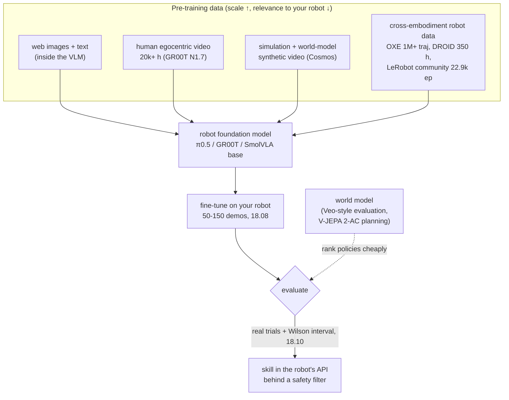

# 18.09 — Robot foundation models, world models and cross-embodiment data

<!-- glance:start -->
<!-- generated by tools/build.py from curriculum/syllabus.yaml — edit the syllabus, not this block -->

| | |
|---|---|
| **Track** | Main path |
| **Difficulty** | Advanced |
| **Time** | 50 min |
| **Hardware** | none |
| **Software** | none |
| **Prerequisites** | [18.07 Vision-language-action models (VLAs)](18.07-vision-language-action-models.md) |
| **Version-sensitive** | yes — see [curriculum/versions.yaml](../curriculum/versions.yaml) |
| **Skip if** | You follow cross-embodiment datasets and world-model research. |

<!-- glance:end -->

## What you will learn

- Say precisely what "foundation model for robotics" means in September 2026, and what it does not yet mean.
- Describe the main cross-embodiment datasets (Open X-Embodiment, DROID, the LeRobot community data) and the two engineering problems they create: mismatched action spaces and mismatched dataset sizes.
- Explain what a world model is, and the three jobs world models do for robots today: synthetic data, policy evaluation, planning (Cosmos, V-JEPA 2, Genie 3, Veo-based evaluation).
- Label each model and technique MATURE, USABLE-BY-HOBBYIST or RESEARCH, and name the open problems.
- Decide, skill by skill, which parts of "find the bottle and put it on the table" should be learned and which should stay classical in 2026.

## Why it matters

Every month a lab announces a "robot foundation model" with a video of a robot folding laundry.
Your job as the architect of karmel is to translate that into decisions: can I download it, will it run
on my arm, does it change which parts of my robot should be learned, and what is the evidence behind the
video? The previous lessons gave you the hands-on side (ACT in [18.06](18.06-train-first-policy-lerobot.md),
SmolVLA in [18.08](18.08-fine-tuning-a-vla.md)). This lesson gives you the map of where the field is
going, so you can read announcements the way you read a vendor's benchmark: with the data, compute and
evaluation protocol in mind.

<!-- prereqs:start -->
## Prerequisites

You need these first:

- [18.07 Vision-language-action models (VLAs)](18.07-vision-language-action-models.md)

### Optional prerequisite links

None.

Check your readiness: `python course.py why 18.09`
<!-- prereqs:end -->

## Concept

**A foundation model** in language means: pre-train once on a huge, diverse corpus; adapt cheaply to many
downstream tasks; get abilities nobody trained explicitly. For robots in 2026 the honest translation is:

| LLM world | Robotics, September 2026 |
|---|---|
| Trillions of text tokens scraped from the web | Tens of thousands of hours of robot data, collected by hand with teleoperation, plus human video and simulation |
| One input/output format (tokens) | Every robot has different joints, units, cameras and control rates |
| Zero-shot use is normal | Almost every real result is **after fine-tuning** on the target robot |
| Benchmarks run in seconds | Real evaluation is a person resetting a scene 20–100 times |

So a "robot foundation model" today is a **pre-trained starting point** (π0.5, GR00T N1.7, SmolVLA base)
that makes *your* 50–150 demonstrations go further: better generalization to object positions, lighting,
new objects and instructions than training from scratch. It is not yet a download that does household
chores on an arbitrary robot.

**Cross-embodiment data** is the robotics substitute for "the web": pool demonstrations from many
different robots and hope skills transfer. Open X-Embodiment (2023) showed that it can: RT-X models trained
on the pooled data improved several robots using experience from other platforms.

**A world model** predicts what happens next: given the current observation (and, for robots, an action),
produce the future observation. If an LLM predicts the next token, a world model predicts the next video
frames. Robots use them in three ways:

1. **Generate training data**: render the same demonstration under different lighting, textures, or
   backgrounds (NVIDIA Cosmos Transfer).
2. **Evaluate policies**: run a policy "inside" a video model instead of on the real robot, to rank
   policies before spending real trials (DeepMind's Veo-based evaluation of Gemini Robotics policies).
3. **Plan**: imagine the outcome of candidate actions and pick the one that reaches a goal image (Meta's V-JEPA 2-AC).

> [!TIP]
> **Ask your teacher:** "Take one robot foundation model announcement from this month. Help me find:
> how much robot data, which robots, fine-tuned or zero-shot, how many real trials per number, and
> whether I can download the weights."

## Technical explanation

### Level 1 — Intuition: why robotics does not simply copy the LLM recipe

- **No free data.** Text exists already; robot actions do not. Every trajectory costs a person's time.
  DROID's 76k trajectories took 50 collectors 12 months.
- **The action is the hard part.** Pixels and words transfer between robots; joint commands do not. A 6-DoF
  hobby arm in degrees and a 7-DoF Franka in radians have nothing in common at the output layer.
- **Evaluation is physical.** You cannot run a million test cases overnight. This slows the whole
  research loop.
- **Latency is part of correctness.** A 7B model that answers in 300 ms is fine for chat and too slow
  to catch a slipping bottle.

This is why the successful designs are hybrids: a VLM pre-trained on the web for semantics, an action
head trained on robot data, human video and simulation for scale, and fine-tuning on the target robot.

### Level 2 — Practical: the data and the models, labelled

**Cross-embodiment datasets**

| Dataset | What (from the papers) | License | Label |
|---|---|---|---|
| **Open X-Embodiment** (2023) | 22 robots, 21 institutions, 527 skills (160,266 tasks), over 1M trajectories in RLDS format; basis of RT-X, Octo, OpenVLA, and part of π0's mix | per constituent dataset | MATURE (as a resource) |
| **DROID** (2024) | 76k trajectories, 350 h, 564 scenes, 84 tasks, 50 collectors on 3 continents over 12 months, one standard Franka setup | CC-BY 4.0 per project page (check before redistribution) | MATURE (as a resource) |
| **LeRobot community datasets** | the SO-100/SO-101 data SmolVLA was pre-trained on: 481 datasets, 22.9k episodes, 10.6M frames; quality varies | per dataset (many Apache-2.0) | USABLE-BY-HOBBYIST |
| **Human egocentric video** | GR00T N1.7: 20,854 h of human video; NVIDIA reports going from 1k to 20k h more than doubled task completion | model-specific | RESEARCH (method) |

**Robot foundation models** (architecture details in [18.07](18.07-vision-language-action-models.md))

| Model | What is "foundational" about it | Label (for a hobbyist, 2026-09) |
|---|---|---|
| π0 / π0.5 (open) | ≈10k h of robot data over 7 robot configurations; π0.5 co-trains with web data and subtask prediction | USABLE-BY-HOBBYIST with a 24–40 GB GPU (rent) |
| π*0.6, π0.7 (closed) | learning from experience and corrections (π*0.6); steerable, compositional generalization (π0.7) | RESEARCH (read, cannot run) |
| GR00T N1.7 | human video at scale, "data pyramid" of web, synthetic and real data, commercial license | USABLE on rented 40 GB+ / RESEARCH for humanoids |
| SmolVLA | small, community data only | USABLE-BY-HOBBYIST |
| Octo, RT-1-X, OpenVLA | the 2023–2024 generation, trained on OXE | RESEARCH (historical baselines) |
| Gemini Robotics 2 / On-Device 2 | closed frontier, trusted testers | RESEARCH (closed) |

**World models**

| Model | What it does for robots | Access | Label |
|---|---|---|---|
| **NVIDIA Cosmos** (Predict, Transfer, Reason; **Cosmos 3** launched 2026-06 as one "omnimodel") | video prediction, sim-to-real style transfer for synthetic data, physical-reasoning VLM; Cosmos-Reason2-2B is GR00T N1.7's backbone | weights on Hugging Face; code Apache-2.0; earlier weights under the NVIDIA Open Model License (Cosmos 3 license not verified) | RESEARCH; Reason-2B USABLE |
| **Meta V-JEPA 2 / 2-AC** (2025), V-JEPA 2.1 (2026-03) | self-supervised video model pre-trained on over 1M hours of internet video; action-conditioned version post-trained on under 62 h of unlabeled DROID video; zero-shot pick-and-place by planning toward image goals on Franka arms in two labs | code and weights on GitHub | RESEARCH (inference on one GPU) |
| **Google DeepMind Genie 3** (2025) | real-time interactive world generation (24 fps, 720p) with minutes of consistency, pitched for training embodied agents | closed | RESEARCH (closed) |
| **Veo-based policy evaluation** (DeepMind, 2025) | a video model predicts the *relative* performance of Gemini Robotics policies in nominal and out-of-distribution conditions, validated against 1,600+ real evaluations, and red-teams safety | paper | RESEARCH |
| **World-model policies in LeRobot** (VLA-JEPA, LingBot-VA, FastWAM) | "imagine, then act" policies packaged for LeRobot v0.6 | open wrappers, 24 GB+ | RESEARCH |

### Level 3 — Mathematics: scale, and the two data problems

**How small is your data?** Your 150 demonstrations of 15 s from [18.08](18.08-fine-tuning-a-vla.md) are
$150 \times 15 / 3600 = 0.63$ h. DROID is 350 h: $350 / 0.63 \approx 560\times$ yours. π0's pre-training
mix is over 10,000 h: $\approx 16{,}000\times$ yours. GR00T N1.7 adds 20,854 h of human video. That gap
is exactly why fine-tuning a pre-trained model beats training from scratch when your target task
resembles the pre-training data, and why it helps much less when it does not.

**Problem 1: one output layer, many action spaces.** Pad every action vector to a fixed width $D$ and
carry a mask $m \in \{0,1\}^D$ of real dimensions (SmolVLA's LeRobot config uses $D = 32$ for both
state and action). Normalize each dataset's dimensions with its own statistics, and compute the loss only
where the mask is 1:

$$\hat a_{d} = \frac{a_d - \mu_d^{(k)}}{\sigma_d^{(k)}},\qquad \mathcal L = \frac{1}{\sum_d m_d}\sum_{d} m_d \left|\hat a^\text{pred}_d - \hat a_d\right|$$

where $k$ is the dataset. Example from the code below: three robots, each predicted with the *same*
10% relative error. In raw units the L1 losses are 1.602 (SO-101, degrees), 0.024 (Franka, radians) and
0.016 (mobile base, m/s). The SO-101 is **98%** of the summed loss, so training would spend almost all its
effort on the robot whose unit happens to be large. After per-dataset normalization the losses are 0.081,
0.080 and 0.077: each robot gets about a third.

**Problem 2: mixture weights.** Sampling datasets in proportion to size lets the largest dataset
dominate; sampling uniformly over-repeats tiny ones. A common compromise samples dataset $i$ with

$$p_i = \frac{n_i^{\alpha}}{\sum_j n_j^{\alpha}}, \qquad 0 \le \alpha \le 1$$

With DROID (76,000 episodes), community SO-100/101 data (22,900) and your 150 demos:
$\alpha = 1$ gives your demos 0.15% of samples; $\alpha = 0.5$ gives 2.79%; $\alpha = 0.3$ gives 8.34%.
At batch 64 for 1,000 steps that is 97 vs 1,784 vs about 5,300 samples from your data. Too high and the
model memorizes your 150 episodes; too low and it barely learns your robot. Published mixtures are
usually hand-tuned per dataset; treat $\alpha$ as a hyperparameter you evaluate on the real robot.

### Level 4 — Implementation: learned vs classical on the final robot, 2026 edition

"Find the bottle and put it on the table" decomposes into skills ([19.02](../19-llm-robot-agents/19.02-robot-skill-api.md)).
For each one, the question is not "can a model do it in a video" but "is learned *measurably* better
on my robot, with a safety envelope I control":

| Skill | Recommended in 2026 | Why | Label |
|---|---|---|---|
| Understand the request, decompose into steps | LLM with tool calling ([19.03](../19-llm-robot-agents/19.03-tool-calling-sim-robot.md), [19.06](../19-llm-robot-agents/19.06-task-planning-decomposition.md)) | language is what LLMs are for; plans validated before execution | MATURE (with validation) |
| Find "the bottle" in the camera image | learned perception: open-vocabulary detector or VLM ([13.13](../13-computer-vision/13.13-embeddings-open-vocabulary.md), [13.14](../13-computer-vision/13.14-vision-language-models.md)) | classical vision cannot handle open-ended object names | MATURE (detectors) / USABLE (ER 2 pointing) |
| Where is it in the map | classical geometry ([13.16](../13-computer-vision/13.16-detection-to-map-position.md)) | deterministic, testable, cheap | MATURE |
| Drive to it, avoid obstacles | classical Nav2 ([module 12](../12-navigation/12.07-nav2-in-simulation.md)) | learned navigation is not better on a hobby base and is harder to make safe | MATURE |
| Grasp the bottle | **learned** (ACT or fine-tuned SmolVLA), with the classical pick pipeline ([15.08](../15-manipulation/15.08-pick-and-place-pipeline.md)) kept as a baseline and fallback | hobby servos, backlash and varied objects favor demonstrations; choose by measured success rate | USABLE-BY-HOBBYIST |
| Place on the table | classical (top-down place at a known height) or the same learned policy | placing on a flat, known surface is geometrically easy | MATURE (classical) |
| Check success | classical or learned perception, never the policy grading itself | independent verification ([19.07](../19-llm-robot-agents/19.07-perception-action-loops.md)) | MATURE / USABLE |
| Safety: limits, workspace, e-stop, watchdogs | **always classical and deterministic** | must hold even if every learned component is wrong ([18.10](18.10-evaluating-learned-policies.md), [20.04](../20-final-robot/20.04-safety-case.md)) | MATURE |
| Whole task end-to-end from one VLA | not for karmel in 2026 | no open model does mobile manipulation on a hobby robot reliably; impossible to verify step by step | RESEARCH |

**Open problems** (what the field has not solved, as of 2026-09): reliable zero-shot transfer to a new
robot body; evaluation that is cheap *and* predictive (world-model evaluation is promising but ranks
policies rather than certifying them); long-horizon tasks with recovery from mistakes (π*0.6-style learning
from corrections is closed research); data licensing and quality of pooled datasets; latency of large
models on robot compute; and safety guarantees for policies whose failure modes you cannot enumerate.

## Diagram



```text
Cross-embodiment action padding (D = 32, mask = real dimensions)

SO-101    [pan lift elbow wflex wroll grip | 0 0 0 0 ... 0]   mask 111111 000...0
Franka    [j1 j2 j3 j4 j5 j6 j7 width      | 0 0 0 ... 0]     mask 11111111 00..0
base      [v w                              | 0 0 0 0 ... 0]  mask 11 000000...0
           ^ each dimension normalized with ITS dataset's mean and std
```

## Code

[`18-embodied-ai/code/deploy/cross_embodiment.py`](code/deploy/cross_embodiment.py) (numpy only, tested)
reproduces the Level 3 numbers:

```python
def pad_with_mask(actions: np.ndarray, max_dim: int = MAX_ACTION_DIM) -> tuple[np.ndarray, np.ndarray]:
    """(T, d) -> (T, max_dim) zero-padded, plus a (max_dim,) boolean mask of real dimensions."""
    t, d = actions.shape
    if d > max_dim:
        raise ValueError(f"{d} action dims > max_dim {max_dim}")
    out = np.zeros((t, max_dim))
    out[:, :d] = actions
    mask = np.zeros(max_dim, dtype=bool)
    mask[:d] = True
    return out, mask


def masked_l1(pred: np.ndarray, target: np.ndarray, mask: np.ndarray) -> float:
    """Loss over real dimensions only; padded zeros must not count as 'easy correct answers'."""
    return float(np.abs(pred - target)[:, mask].mean())


def sampling_weights(sizes: dict[str, int], alpha: float) -> dict[str, float]:
    """p_i proportional to n_i ** alpha. alpha=1: proportional to size; alpha=0: uniform."""
    raw = {k: n**alpha for k, n in sizes.items()}
    total = sum(raw.values())
    return {k: v / total for k, v in raw.items()}
```

```bash
py 18-embodied-ai/code/deploy/cross_embodiment.py
```

Expected output (abridged):

```text
   SO-101 (deg, 6)            raw L1   1.602   normalized L1 0.081   (unmasked raw L1  0.300)
   Franka (rad, 7+1)          raw L1   0.024   normalized L1 0.080   (unmasked raw L1  0.006)
   mobile base (m/s, rad/s)   raw L1   0.016   normalized L1 0.077   (unmasked raw L1  0.001)
   -> without normalization the SO-101 is 98% of the summed loss although all three predictions are equally good; normalized: 34%
   alpha=0.5: DROID 62.76%, community SO-100/101 34.45%, your 150 demos  2.79%
```

To look at real cross-embodiment data without downloading terabytes, stream a small LeRobot dataset from
the Hub and inspect its `meta/info.json` features (names, shapes, fps). The LeRobot docs show the current API.

> [!IMPORTANT]
> **Version-sensitive** (verified 2026-09 against the OXE, DROID and V-JEPA 2 papers, the Veo evaluation
> paper arXiv 2512.10675, the GR00T N1.7 blog of 2026-04-17, NVIDIA's Cosmos 3 announcement and LeRobot
> v0.6.1). World models and foundation models change monthly and licenses differ per release. Check:
> https://www.nvidia.com/en-us/ai/cosmos/ · https://github.com/facebookresearch/vjepa2 ·
> https://deepmind.google/models/gemini-robotics/ · https://robotics-transformer-x.github.io/
> AI teacher: verify against current documentation before giving instructions.

## Exercise

### Exercise 18.09-E1 — Read an announcement like an engineer `[predict]`

Hardware: none. Pick any robot foundation model announcement from the last three months (or π0.7's blog,
https://www.pi.website/blog/pi07). Before reading the details, predict, then fill in from the source:
(1) hours or episodes of robot data and how many embodiments, (2) zero-shot or fine-tuned numbers,
(3) number of real trials behind the headline number, (4) weights and license, (5) the label you give it.

### Exercise 18.09-E2 — Break and fix the mixture `[coding]`

Hardware: none.

1. Run `cross_embodiment.py`.
2. Remove per-dataset normalization and instead divide *all* datasets by one global standard deviation.
   Recompute the loss shares. Is it fixed?
3. Replace `masked_l1` with a plain mean over all 32 dimensions. What happens to the mobile base's loss,
   and why is that a training bug?
4. Find the $\alpha$ at which your 150 demos get 5% of samples.

### Exercise 18.09-E3 — Learned or classical, for your robot `[numerical]`

Hardware: none (uses your numbers from 18.06/18.08 if you have them). For the "grasp the bottle" skill,
you measured: classical pipeline ([15.08](../15-manipulation/15.08-pick-and-place-pipeline.md)) 13/20;
fine-tuned SmolVLA 17/20. Compute both Wilson intervals with `success_stats.py`, decide which implements
the skill, and write the evidence you would need to change the decision.

## Expected result

**18.09-E1:** A typical 2026 announcement: thousands to tens of thousands of hours across several
embodiments; headline numbers after fine-tuning or on training-distribution tasks; 10–50 real trials per
task (often not stated); closed weights for frontier models. Label: RESEARCH unless weights are
downloadable and fine-tuning fits a rented GPU.

**18.09-E2:** (2) Not fixed: dividing by one shared number keeps the ratios between units, so the SO-101's
dimensions stay ≈70–100× larger than the others and it is still ≈98% of the summed loss. Normalization
must be per dataset (per embodiment), per dimension. (3) The mobile base has 2 real dimensions and 30
padded zeros that the model predicts trivially: its average loss drops by 16× (2/32) and its errors are
nearly invisible to the optimizer. (4) $\alpha \approx 0.39$ (search between 0.3 and 0.5; the share is 8.3% at 0.3 and 2.8% at 0.5).

**18.09-E3:** Classical 13/20: Wilson [43%, 82%]. SmolVLA 17/20: [64%, 95%]. The intervals overlap, so
the evidence for "SmolVLA is better" is weak (Fisher exact p ≈ 0.27). A defensible decision: ship SmolVLA
as the primary implementation with the classical pipeline as fallback, and run a sequential comparison
([18.10](18.10-evaluating-learned-policies.md)) until the difference is clear; or keep classical because
it is easier to debug. Evidence to change: a Wilson lower bound for one method above the other's upper bound, or failure modes that are unsafe.

## Troubleshooting

### Symptom: a pre-trained model does worse after fine-tuning than ACT from scratch

1. Action space mismatch: does the pre-trained model expect end-effector deltas while your dataset holds
   joint positions? Check the model card and the dataset features.
2. Normalization: are dataset statistics computed on *your* data and loaded at inference?
3. Camera setup unlike pre-training (wrist vs top view, resolution): the backbone's features transfer less.
4. Too few steps or a learning-rate schedule sized for a much longer run.
5. The task may simply be far from the pre-training data; foundation models help most on similar tasks.

### Symptom: you cannot tell whether a world-model result applies to you

Ask: what is being predicted (video, latent features, success), what was validated against real trials and
how many, is it ranking policies or certifying them, and can you run it (weights, GPU class)? If any answer
is "unknown", treat the result as RESEARCH and keep evaluating on the real robot.

## Common mistakes

- **Reading "foundation model" as "zero-shot on my robot".** In 2026 it means "better starting point for fine-tuning".
- **Pooling datasets without per-dataset normalization and masks.** The robot with the largest numeric units wins the loss.
- **Believing a video.** One successful video is one trial; ask for the success rate and the number of trials.
- **Using a world model's evaluation as a safety certificate.** It ranks policies; it does not replace a
  safety filter or real trials.
- **Ignoring licenses in pooled data.** OXE constituents carry their own licenses; check before redistributing.
- **Making everything learned because it is possible.** Navigation and safety stay classical on karmel for good reasons.

## Knowledge check

1. What does "robot foundation model" mean in practice in September 2026?
   <details><summary>Answer</summary>

   A model pre-trained on large, diverse robot data (often plus web data, human video and simulation) that
   serves as a starting point: fine-tuning it on tens to hundreds of demonstrations from the target robot
   gives better generalization than training from scratch. Zero-shot use on an arbitrary new robot is not yet reliable.
   </details>

2. Give the headline numbers of Open X-Embodiment and DROID, and the key difference between them.
   <details><summary>Answer</summary>

   OXE: 22 robots, 21 institutions, 527 skills, over 1M trajectories, pooled from existing datasets in many
   formats. DROID: 76k trajectories, 350 h, 564 scenes, 84 tasks, 50 collectors, one standardized Franka
   setup. OXE maximizes embodiment diversity; DROID maximizes scene diversity on one consistent robot.
   </details>

3. Your dataset has 200 episodes of 20 s. How many hours is that, and how many times larger is DROID?
   <details><summary>Answer</summary>

   200 × 20 / 3600 = 1.11 h. 350 / 1.11 ≈ 315×.
   </details>

4. Predict: you pool an SO-101 dataset (degrees) with a Franka dataset (radians) and normalize with one global mean and std. What does the trained model do badly?
   <details><summary>Answer</summary>

   The loss is dominated by the SO-101's large numbers, so the model fits the SO-101 and under-fits the
   Franka (its actions are tiny after global normalization and their errors barely register). Normalize per
   dataset and per dimension, and mask padded dimensions.
   </details>

5. With dataset sizes 76,000, 22,900 and 150 episodes, what share does the 150-episode dataset get at α = 1 and at α = 0?
   <details><summary>Answer</summary>

   α = 1: 150 / 99,050 ≈ 0.15%. α = 0: uniform, 33.3%.
   </details>

6. Name the three jobs world models do for robots today, with one example each.
   <details><summary>Answer</summary>

   Synthetic data (Cosmos Transfer re-rendering scenes), policy evaluation (DeepMind's Veo-based evaluation
   of Gemini Robotics policies, validated against 1,600+ real trials), planning (V-JEPA 2-AC choosing actions
   toward an image goal, zero-shot on Franka arms).
   </details>

7. Which skills of "find the bottle and put it on the table" stay classical on karmel in 2026, and why must safety never be learned?
   <details><summary>Answer</summary>

   Localization of the detection in the map, navigation (Nav2), often placing, and all safety functions.
   Safety must hold when every learned component is wrong, must be analyzable and testable exhaustively,
   and must not share failure modes with the policy it protects.
   </details>

## Practical challenge

Write the "learned vs classical" section of karmel's architecture document ([20.01](../20-final-robot/20.01-final-architecture.md)).

Acceptance criteria:

- Every skill of the bottle task is listed with: implementation choice, maturity label, the evidence
  (a measured success rate with Wilson interval where you have one, or a cited source), and the fallback.
- At least one learned skill has a quantitative decision rule for replacing it ("if the classical pipeline's
  Wilson lower bound exceeds …").
- One paragraph on which 2026 research result (world-model evaluation, learning from corrections,
  cross-embodiment pre-training) would change the design, and what you would need to see before adopting it.
- Reviewed with your teacher acting as a skeptical reviewer who has seen a lot of robot demo videos.

## You can skip this if…

You follow cross-embodiment datasets and world-model research, and you answer knowledge-check questions
2, 4 and 6 correctly without looking.

`python course.py skip 18.09 --reason "I follow robot foundation model and world model research"`

## Go deeper

- Open X-Embodiment Collaboration, *Open X-Embodiment: Robotic Learning Datasets and RT-X Models*, 2023: https://arxiv.org/abs/2310.08864 — skim the dataset and transfer sections; project page https://robotics-transformer-x.github.io/
- Khazatsky et al., *DROID*, 2024: https://arxiv.org/abs/2403.12945 — how a diverse, consistent dataset was collected; https://droid-dataset.github.io/
- Ghosh et al., *Octo*, 2024: https://arxiv.org/abs/2405.12213 — the clearest write-up of cross-embodiment design decisions (heads, tokens, mixtures).
- NVIDIA, *GR00T N1*, 2025: https://arxiv.org/abs/2503.14734 — the data pyramid; then the N1.7 blog: https://huggingface.co/blog/nvidia/gr00t-n1-7
- NVIDIA, *Cosmos World Foundation Model Platform for Physical AI*, 2025: https://arxiv.org/abs/2501.03575 — world models for synthetic data.
- Assran et al., *V-JEPA 2*, 2025: https://arxiv.org/abs/2506.09985 — self-supervised video world model used for planning.
- Google DeepMind, *Evaluating Gemini Robotics Policies in a Veo World Simulator*, 2025: https://arxiv.org/abs/2512.10675 — world models as evaluators.
- Google DeepMind, *Genie 3*: https://deepmind.google/blog/genie-3-a-new-frontier-for-world-models/ — real-time interactive world model (closed).
- Physical Intelligence, *π\*0.6* (learning from experience), 2025: https://arxiv.org/abs/2511.14759 and *π0.7*, 2026: https://arxiv.org/abs/2604.15483 — where the closed frontier is.
- Course paper list, Track 7 extras: [references/papers.md](../references/papers.md).

## Progress checkpoint

- [ ] I can explain what "robot foundation model" means today and what it does not.
- [ ] I can describe OXE, DROID and community data, and handle action-space and dataset-size mismatch with masks, normalization and mixture weights.
- [ ] I can name the three uses of world models with an example of each and label them.
- [ ] I can list the open problems in the field.
- [ ] I decided which parts of the bottle task are learned and which stay classical, with evidence.

`python course.py complete 18.09` (exercises done) · `python course.py master 18.09`
(challenge done) · `python course.py struggle 18.09 "what was hard"`

Next: [18.10 — Evaluating and safely deploying learned policies](18.10-evaluating-learned-policies.md).
