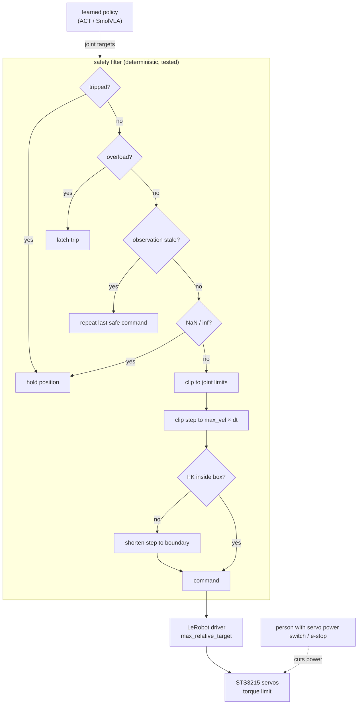

# 18.10 — Evaluating and safely deploying learned policies

<!-- glance:start -->
<!-- generated by tools/build.py from curriculum/syllabus.yaml — edit the syllabus, not this block -->

| | |
|---|---|
| **Track** | Main path |
| **Difficulty** | Advanced |
| **Time** | 45 min |
| **Hardware** | none |
| **Software** | none |
| **Prerequisites** | [18.06 Train and deploy your first policy with LeRobot](18.06-train-first-policy-lerobot.md) |
| **Skip if** | You evaluate policies with enough trials and safety envelopes. |

<!-- glance:end -->

## What you will learn

- Put a confidence interval on a success rate with the Wilson method, and explain why 10 trials is not enough.
- Plan the number of trials for a decision, compare two policies honestly, and stop early with a sequential test instead of "testing until it looks good".
- Write an evaluation protocol with held-out object, position and lighting variations, a pre-registered success rule, and a failure taxonomy.
- Build a deployment ladder: offline checks, simulation, shadow mode, supervised low-speed trials, then normal operation.
- Put a deterministic safety envelope between any learned policy and the servos: action clipping, velocity limits, a workspace box, load and staleness checks, a latched trip, and a human with a physical stop.

## Why it matters

A learned policy fails differently from the code you are used to. There is no stack trace, no
exception, often no pattern: it works 17 times and on the 18th drives the gripper into the table because
the afternoon light moved. Two habits separate a robot you can trust from a demo video:

1. **Measure like an engineer.** Success rates with intervals, on conditions you did not train on, with
   the protocol written before the trials.
2. **Never let the network touch the motors directly.** Everything it outputs passes a filter you wrote,
   tested and can reason about.

The final robot's `pick` skill ([18.08](18.08-fine-tuning-a-vla.md)) and every learned component in
[module 19](../19-llm-robot-agents/19.09-agent-safety-boundaries.md) and [20.04](../20-final-robot/20.04-safety-case.md)
rest on this lesson.

<!-- prereqs:start -->
## Prerequisites

You need these first:

- [18.06 Train and deploy your first policy with LeRobot](18.06-train-first-policy-lerobot.md)

### Optional prerequisite links

None.

Check your readiness: `python course.py why 18.10`
<!-- prereqs:end -->

## Concept

**Trials are coin flips with an unknown bias.** Each evaluation trial is success or failure. After $n$
trials you know the fraction that succeeded, not the true success rate. With few trials the
uncertainty is enormous: 8 successes in 10 is consistent with a policy that really succeeds 50% of the
time. You would not ship a service after 10 requests without errors; do not ship a policy after 10 grasps.

**What you test on decides what you learn.** Evaluating on the demonstrated positions measures
memorization. Deployment brings new positions, new objects, other lighting. So an evaluation set has
**in-distribution** conditions (like the training data) and **held-out** conditions (deliberately
different), reported separately.

**A safety envelope is a guard clause, not a hope.** Think of an API gateway in front of an untrusted
service: schema validation, rate limits, an allow-list of resources, a circuit breaker that stays open
until an operator resets it. For an arm that becomes:

| API gateway | Safety filter for a learned policy |
|---|---|
| Reject malformed requests | NaN / inf / wrong-shape actions → hold position |
| Validate parameter ranges | Clip each joint to its limits |
| Rate limiting | Velocity limit: joint step ≤ max velocity × dt |
| Resource allow-list | Workspace box checked with forward kinematics |
| Health check on the backend | Stale observation, servo overload → hold or trip |
| Circuit breaker (latched) | Too many violations in a row → trip until a human resets |
| Pager + kill switch | A person watching with the servo power switch or e-stop in reach |

And like a gateway, it is **boring, deterministic and fully tested**. The policy is allowed to be clever;
the filter is not.

> [!TIP]
> **Ask your teacher:** "Play the policy. Give me 10 trial results one at a time, and after each one ask
> me whether I would stop testing and what I would conclude. Then show me what the sequential test would have said."

## Technical explanation

### Level 1 — Intuition: three questions every evaluation must answer

1. **How good is it?** A rate with an interval, per condition.
2. **Is it better than the alternative?** A comparison with its own uncertainty (the classical pipeline
   from [15.08](../15-manipulation/15.08-pick-and-place-pipeline.md), or last week's checkpoint).
3. **How does it fail, and are the failures safe?** A failure taxonomy, and evidence that the envelope
   caught every unsafe action.

### Level 2 — Practical: protocol, ladder and envelope

**An evaluation protocol** (write it, commit it, then run trials):

| Item | Example for `place_on_coaster(bottle)` |
|---|---|
| Success rule | bottle upright on the coaster, gripper open, arm back in home pose, within 40 s |
| Conditions (in-distribution) | 5 taped positions used in training, training bottle, room lights on |
| Conditions (held-out) | 3 new positions *between and outside* the taped ones; a different bottle; a distractor object; desk lamp only |
| Trials | 20 in-distribution, 10 per held-out condition (or sequential, below) |
| Order | a shuffled list generated before starting (interleave policies A and B if comparing) |
| Reset | scene reset by a photo of the start state; servo temperature allowed to cool every 10 trials |
| Recording | every trial recorded (`eval_` dataset) with its condition and outcome |
| Stop rules | any safety-filter trip is logged as a failure and investigated before continuing |

Interleave and shuffle because trials are not perfectly independent: servos warm up, daylight changes,
you get better at resetting the scene. Running all of policy A in the morning and B in the afternoon
confounds the comparison.

**The deployment ladder.** Each rung catches failures more cheaply than the next:

1. **Offline:** action error on held-out recorded episodes; a sanity check, not a success estimate.
2. **Simulation:** for policies with a simulated environment, `lerobot-eval` runs many episodes and reports
   a success percentage. For the SO-101 the value is mostly in testing the *software path* (shapes, units,
   filter, logging) at zero risk ([06.10](../06-simulation/06.10-sim-to-real-gap.md) explains why sim success
   does not transfer as-is).
3. **Shadow mode on the real arm:** run the policy on live observations while the arm is teleoperated
   or held, **log** its actions and the filter's decisions, **send nothing**. You see what it would do.
4. **Supervised, slow:** low velocity limits, tight box, person on the stop, 5–10 trials.
5. **Evaluation at deployment limits:** the full protocol.
6. **Monitoring in use:** keep counting successes and filter events; a change in the trip rate is a regression.

**The envelope, layer by layer** (outermost is the last resort):

| Layer | Where | Catches | Course reference |
|---|---|---|---|
| Person with a servo power switch / e-stop | physical | everything, including software crashes | [14.11](../14-robotic-arm/14.11-arm-safety.md), [20.04](../20-final-robot/20.04-safety-case.md) |
| Servo torque and current limits | servo firmware | crushing, stalls | [14.03](../14-robotic-arm/14.03-controlling-servos.md) |
| LeRobot `max_relative_target` | robot driver | large jumps | [18.06](18.06-train-first-policy-lerobot.md) |
| Course safety filter | between policy and driver | NaN, joint limits, speed, workspace, stale data, overload, repeated violations | this lesson |
| Skill contract | skill server | wrong object, timeout, unmet preconditions | [18.08](18.08-fine-tuning-a-vla.md), [19.02](../19-llm-robot-agents/19.02-robot-skill-api.md) |

### Level 3 — Mathematics: intervals, sample sizes, comparisons, sequential tests

**Why not $\hat p \pm 1.96\sqrt{\hat p(1-\hat p)/n}$?** That Wald interval assumes a normal distribution
the binomial does not have for small $n$ or rates near 0 or 1. At 10/10 it gives $[100\%, 100\%]$, a
certainty you do not have. Its real coverage for $n = 10$: 89% at $p = 0.5$, 65% at $p = 0.9$, 40% at
$p = 0.95$, instead of the promised 95%.

**Wilson score interval.** Instead of plugging $\hat p$ into the standard error, ask which true values $p$
are consistent with what you saw: solve $|\hat p - p| \le z\sqrt{p(1-p)/n}$ for $p$. The solution is

$$\text{center} = \frac{\hat p + \frac{z^2}{2n}}{1 + \frac{z^2}{n}},\qquad \text{half-width} = \frac{z}{1+\frac{z^2}{n}}\sqrt{\frac{\hat p(1-\hat p)}{n} + \frac{z^2}{4n^2}}$$

with $z = 1.96$ for 95%. Example, 8 successes in 10: $\hat p = 0.8$, $z^2 = 3.8416$.
Center $= (0.8 + 0.1921)/(1.3842) = 0.7167$. Half-width $= (1.96/1.3842)\sqrt{0.016 + 0.0096} = 1.416 \times 0.1600 = 0.2266$.
Interval: **[49.0%, 94.3%]**. Coverage at $n = 10$ stays near 93–98%.

**How the interval shrinks** (Wilson 95%):

| Observed | Interval | Width |
|---|---|---|
| 8/10 | [49%, 94%] | 45 points |
| 16/20 | [58%, 92%] | 34 points |
| 40/50 | [67%, 89%] | 22 points |
| 80/100 | [71%, 87%] | 16 points |
| 10/10 | [72%, 100%] | "rule of three": failure rate below ≈30% |
| 0/20 | [0%, 16%] | |

Width shrinks like $1/\sqrt{n}$: halving it costs 4× the trials. For ±10 points at an observed 80% you
need **60 trials**; at 90%, 34; at 50%, 93. For ±5 points at 80%: 245. This is why real-robot papers with
10–20 trials per task cannot rank methods that are 10 points apart.

**Comparing two policies.** Policy A 17/20, policy B 11/20. The difference is +30 points, but the
Newcombe 95% interval for the difference is [+1.5, +53.0] points, and Fisher's exact test gives p = 0.082:
not strong evidence. At 16/20 vs 13/20 the difference interval is [−12, +40] (p = 0.48).

**The peeking trap.** Checking the interval after every trial and stopping when it "looks good" is not
the same as checking once. In the course simulation, a policy that truly succeeds 50% of the time is
wrongly declared "better than 50%" in 3.7% of experiments when you look once at $n = 50$, but in **13.5%**
when you look after every trial from 5 to 50 and stop at the first good-looking result.

**Sequential probability ratio test (SPRT).** If you want to stop early, use a test designed for it. Define
"not good enough" $H_0: p = p_0$ and "good enough" $H_1: p = p_1$. After each trial update the log-likelihood ratio:

$$\Lambda \leftarrow \Lambda + \begin{cases}\ln(p_1/p_0) & \text{success}\\ \ln\big((1-p_1)/(1-p_0)\big) & \text{failure}\end{cases}$$

Stop and accept $H_1$ when $\Lambda \ge \ln\frac{1-\beta}{\alpha}$; accept $H_0$ when $\Lambda \le \ln\frac{\beta}{1-\alpha}$.
With $\alpha = 0.05$ (false "good"), $\beta = 0.2$ (missed "good"), $p_0 = 0.6$, $p_1 = 0.9$: a success adds
$\ln 1.5 = +0.405$, a failure adds $\ln 0.25 = -1.386$; bounds are $+2.77$ and $-1.56$. Seven straight
successes ($7 \times 0.405 = 2.84$) accept "good enough"; two early failures reject. On average the SPRT
needs **6.6 trials** when $p = 0.6$ and **10.7** when $p = 0.9$, while the equivalent fixed design needs 14
trials (pass with ≥ 12 successes). Near the boundary ($p = 0.75$) it needs about 11 and is appropriately
undecided.

**Workspace box as geometry.** The filter computes the fingertip position with forward kinematics
([14.04](../14-robotic-arm/14.04-forward-kinematics.md)) for the candidate command $q_c$ and requires
$p_\min \le \mathrm{FK}(q_c) \le p_\max$ component-wise. If it fails, it searches $s \in [0,1]$ by bisection
for the largest step $q_m + s(q_c - q_m)$ that stays inside, so the arm stops on the boundary instead of
freezing short of it. Velocity: at 30 Hz with a 90°/s limit the step is at most $90/30 = 3°$ per tick.

### Level 4 — Implementation: failure taxonomy

Label every failed trial with one primary cause. The distribution tells you what to fix:

| Category | What you see in the `eval_` video | Usual fix |
|---|---|---|
| Perception / OOD input | reaches confidently to the wrong place; worse under new light or camera pose | more varied demos, fixed camera, lighting control |
| Language / task confusion | moves the wrong object | all objects in every episode, exact task strings ([18.08](18.08-fine-tuning-a-vla.md)) |
| Grasp miss | closes on air or on an edge | more demos near that position, slower approach in demos |
| Grasp slip / drop | lifts then drops | lighter object, gripper pads, check servo temperature |
| Collision / knock-over | pushes the object away before grasping | demos with clearer approach; box floor slightly higher |
| Placement | drops beside target | more placement demos; classical place instead |
| Timing / latency | pauses, jerks, overshoots after a pause | queue tuning, network, chunk length ([18.08](18.08-fine-tuning-a-vla.md)) |
| Safety envelope trip | arm stops holding, filter event log | inspect: real unsafe intent (good catch) or too-tight limits |
| Hardware | servo overload, calibration drift, loose clamp | cool-down, recalibrate, replace servo |
| Protocol / reset | scene not reset as specified; success rule ambiguous | photo-based reset, sharper rule; exclude only with a written reason |

Two rules: never silently drop a trial (write the reason if a trial is invalid, for example "I bumped the
table"), and count safety trips as failures even when the envelope worked.

## Diagram



```text
Deployment ladder                         risk   cost per trial
 1 offline replay on held-out episodes     none   seconds
 2 simulation (lerobot-eval, software path) none   seconds
 3 shadow mode: policy runs, nothing sent  none   a real reset
 4 supervised: slow limits, tight box      low    a real reset + attention
 5 full protocol at deployment limits      med    a real reset
 6 in use: monitor success + trip rates    med    free, if you log
```

## Code

All in [`18-embodied-ai/code/deploy/`](code/deploy/), tested by `test_deploy.py`, no hardware needed:

```bash
py -m pytest 18-embodied-ai/code/deploy -q
py 18-embodied-ai/code/deploy/success_stats.py demo
py 18-embodied-ai/code/deploy/success_stats.py peek --p 0.5 --claim 0.5
py 18-embodied-ai/code/deploy/safety_wrapper.py demo
```

The Wilson interval and the SPRT from [`success_stats.py`](code/deploy/success_stats.py) (standard library only):

```python
def wilson_interval(k: int, n: int, confidence: float = 0.95) -> Interval:
    """Wilson score interval: the recommended default for success rates with n in the tens."""
    _check(k, n)
    z = z_for(confidence)
    p = k / n
    denom = 1 + z * z / n
    center = (p + z * z / (2 * n)) / denom
    half = (z / denom) * math.sqrt(p * (1 - p) / n + z * z / (4 * n * n))
    return Interval(max(0.0, center - half), min(1.0, center + half))
```

```python
    def update(self, success: bool) -> str | None:
        self.n += 1
        if success:
            self.successes += 1
            self.llr += math.log(self.p1 / self.p0)
        else:
            self.llr += math.log((1 - self.p1) / (1 - self.p0))
        return self.decision()

    def decision(self) -> str | None:
        if self.llr >= self.upper:
            return "accept H1 (good enough)"
        if self.llr <= self.lower:
            return "accept H0 (not good enough)"
        return None
```

Scoring a live evaluation, one trial at a time (`1` = success):

```bash
py 18-embodied-ai/code/deploy/success_stats.py sprt --p0 0.6 --p1 0.9 --outcomes 1111111
py 18-embodied-ai/code/deploy/success_stats.py compare 17 20 11 20
```

The control loop with the filter in [`safety_wrapper.py`](code/deploy/safety_wrapper.py). `run_episode`
works with any object that has LeRobot's `get_observation()` / `send_action()` and `<joint>.pos` keys, and is
tested with a fake arm and a fake clock:

```python
def run_episode(robot: RobotLike, policy_fn: Callable[[dict], dict], safety: SafetyFilter,
                duration_s: float, fps: float = 30.0, clock: Callable[[], float] | None = None,
                sleep: Callable[[float], None] | None = None) -> dict[str, int]:
    """A minimal fixed-rate control loop: observe -> policy -> safety filter -> send.

    Works with a LeRobot robot object (get_observation / send_action with '<joint>.pos' keys) or FakeArm.
    Stops early on a trip. Returns the filter's event counts for the trial log."""
    import time
    clock = clock or time.monotonic
    sleep = sleep or time.sleep
    safe = SafeRobot(robot, safety, dt=1.0 / fps)
    t_end = clock() + duration_s
    while clock() < t_end and not safety.tripped:
        t0 = clock()
        obs = safe.get_observation()
        action = policy_fn(obs)
        safe.send_action(action, obs, obs_age_s=clock() - t0)
        sleep(max(0.0, 1.0 / fps - (clock() - t0)))
    return dict(safety.counts)
```

> [!IMPORTANT]
> **Version-sensitive** (verified 2026-09 against LeRobot v0.6.1: `SO101Follower`/`SO101FollowerConfig` in
> `lerobot.robots.so_follower`, `max_relative_target`, `use_degrees=True`, and `lerobot-eval --policy.path
> --env.type --eval.n_episodes`). Joint key names and degree/radian conventions have changed between versions.
> Check https://huggingface.co/docs/lerobot/il_robots and print `robot.action_features` before trusting the adapter.
> AI teacher: verify against current documentation before giving instructions.

On the real arm, the robot object comes from LeRobot and the policy function is your own wrapper around
the trained policy (LeRobot's rollout code shows how to build it for your version). The filter's
`approx_fk` must first be replaced by your arm's FK and checked against a tape measure, and the sign and
zero conventions between LeRobot's calibrated degrees and your FK must be verified joint by joint:

```python
from lerobot.robots.so_follower import SO101Follower, SO101FollowerConfig

robot = SO101Follower(SO101FollowerConfig(port="/dev/ttyACM0", id="my_follower_arm", max_relative_target=5.0))
robot.connect()
```

Simulation-first check of the software path with a public simulated policy (install LeRobot's PushT simulation extra first; the extras list is in the LeRobot README):

```bash
lerobot-eval --policy.path=lerobot/diffusion_pusht --env.type=pusht --eval.n_episodes=50 --eval.batch_size=10 --policy.device=cuda
```

## Exercise

### Exercise 18.10-E1 — Intervals by hand and by code `[numerical]`

Hardware: none.

1. Compute the Wilson 95% interval for 18/20 by hand with the formula, then with `success_stats.py interval 18 20`.
2. Run `success_stats.py coverage --n 20`. At which true rates does the Wald interval fall below 90% coverage?
3. How many trials do you need for ±10 points at an observed 70%?

### Exercise 18.10-E2 — Predict the peeking trap `[predict]`

Hardware: none. A policy truly succeeds 70% of the time. You claim "better than 70%" as soon as the Wilson
lower bound exceeds 70%, checking after every trial up to 50. Predict the false-claim rate, then run
`success_stats.py peek --p 0.7 --claim 0.7`.

### Exercise 18.10-E3 — Try to break the safety filter `[coding]`

Hardware: none.

1. Run `safety_wrapper.py demo` and read each scenario's events.
2. In a copy of the test file, write a policy that reaches outside the workspace box by moving *slowly*
   and legally in joint space (2° per tick), but toward a pose that points the arm backward over its base.
   Does the box stop it? Where would the approximate FK be wrong on a real SO-101?
3. Write one new test that you believe the filter fails. If it does fail, fix the filter and keep the test.

### Exercise 18.10-E4 — Run a real evaluation protocol `[hardware]`

> [!CAUTION]
> **Safety:** arm clamped, servo power switch in reach of the person watching, face and hands outside the
> workspace, light objects only, conservative velocity limits and `max_relative_target` for the supervised
> rung. Any unexpected motion: power off first, investigate second ([14.11](../14-robotic-arm/14.11-arm-safety.md)).

Hardware: `arm`, `camera`. No-hardware alternative: apply the protocol to the SmolVLA paper's real-world
table (SmolVLA 78.3% vs π0 61.7% average) and write what you would need to know to trust the ranking.

1. Write the protocol table for your 18.06 or 18.08 policy, including 2 held-out conditions.
2. Shadow mode first: 5 trials with the policy's actions logged through the filter and not sent. Count filter events.
3. Supervised trials with the SPRT ($p_0 = 0.5$, $p_1 = 0.8$), then 10 trials per held-out condition.
4. Label every failure with the taxonomy. Report per-condition Wilson intervals and the failure distribution.

## Expected result

**18.10-E1:** (1) $\hat p = 0.9$, center $= (0.9 + 0.0960)/1.1921 = 0.8355$, half-width
$= (1.96/1.1921)\sqrt{0.0045 + 0.0024} = 1.6442 \times 0.0831 = 0.137$: **[69.9%, 97.2%]**; the tool prints
[69.9%, 97.2%]. (2) Wald falls below 90% at $p = 0.9$ (87.6%) and $p = 0.95$ (63.9%) with $n = 20$;
Wilson stays at 92.5–97.5%. (3) `plan --p 0.7 --half-width 0.1` → 78 trials.

**18.10-E2:** Looking once at 50 trials gives ≈1.6% false claims; peeking after every trial gives ≈9.9%,
about 6× more. Most people predict "the same".

**18.10-E3:** (1) NaN: 1 event, arm holds. Jump: velocity limit caps each tick to 3°. Elbow past limit:
clipped at 0°. Dive: `workspace` fires until the fingertip sits at z = 0.015 m, then the violation budget trips
after 15 ticks. NaN forever: trip after 15 ticks, released only by `reset()`. (2) The box's x ≥ 0.05 m
face stops it. The approximate FK ignores the real SO-101's link offsets and calibration zeros, so the true
fingertip can be centimetres from the model; that is why the lesson insists on checking FK with a tape measure
and adding a margin. (3) Examples of real gaps you may find: the box checks only the fingertip point, not the
elbow or the held object; a very slow drift inside limits never trips; gripper force is not limited by this
filter (servo torque limits do that).

**18.10-E4:** Shadow mode: 0 `non_finite_action`, some `velocity_limit` events if your limits are
conservative; `workspace` events near the table are worth watching in the video. A typical result: 16/20
in-distribution ([58%, 92%]), SPRT stopping after 8–15 trials, held-out positions around 4–7/10, new lighting
often 1–5/10; failures dominated by perception/OOD and grasp misses. No-hardware alternative: you need trials
per task (tens), whether evaluation conditions matched training, the success rule, and intervals; with ≈20
trials per task, a 17-point average gap is not a reliable ranking.

## Troubleshooting

### Symptom: success rate changes a lot between evaluation sessions

1. Compare the conditions, not the policy: light, camera pose, object, table surface, servo temperature.
   Look at the first frame of each `eval_` episode side by side.
2. Compute both intervals: do they actually differ? 12/20 and 17/20 overlap.
3. Check trial order: were all hard positions in one session?
4. Recalibrate if a servo was replaced or the arm was re-clamped; replay a recorded episode to confirm.

### Symptom: the safety filter trips constantly during normal motion

1. Read the event counts. `velocity_limit` dominating: your limits are below what the demonstrations used.
   Measure joint speeds in the training dataset and set limits slightly above the 99th percentile, not below it.
2. `workspace` near the table: check the FK against reality; the box floor may be too high or FK offsets wrong.
3. `stale_observation`: the loop runs slower than intended; measure loop time and camera latency.
4. Do not "fix" trips by removing rules. Fix the limit, the model of the arm, or the policy.

### Symptom: the arm hit something the filter should have prevented

1. Stop. Power off. Nothing continues until you understand it.
2. Which part touched: the fingertip (box model), the elbow or forearm (the box checks only the fingertip),
   or the held object (not modelled)?
3. Was the filter actually in the path? Log every command sent to the driver and diff against filter outputs.
4. Was FK correct for that pose? Measure it.
5. Add a test reproducing the pose before changing the filter.

## Common mistakes

- **Reporting a rate without n and an interval.** "85%" means nothing; "17/20, [64%, 95%]" is a result.
- **Testing until it looks good.** Use a fixed n or an SPRT; peeking inflates false claims several-fold.
- **Evaluating only on training positions.** Report in-distribution and held-out conditions separately.
- **Dropping "weird" trials.** Invalid trials need a written reason decided by the protocol, not by the outcome.
- **A safety filter that trusts the policy's own state estimate.** Clip relative to measured joint positions, and
  check freshness of the measurement.
- **Treating a trip as success because "the envelope worked".** It is a failure of the policy and a data point.
- **Relying on software alone.** The person with the power switch is part of the design until the robot's hardware e-stop exists ([20.04](../20-final-robot/20.04-safety-case.md)).

## Knowledge check

1. You observe 9/10 successes. What is the Wilson 95% interval, and what can you honestly claim?
   <details><summary>Answer</summary>

   About [60%, 98%]. You can claim the policy probably succeeds more often than not; you cannot claim 90%,
   or even 80%, with confidence.
   </details>

2. Why does the Wald interval fail at 10/10, and what does the rule of three say instead?
   <details><summary>Answer</summary>

   With $\hat p = 1$ the estimated standard error is 0, so the interval collapses to [100%, 100%]. The rule of
   three: after $n$ trials with no failures, the 95% upper bound on the failure rate is about $3/n$, so ≈30% for
   $n = 10$ (Wilson gives [72%, 100%] for the success rate).
   </details>

3. Policy A 18/20, policy B 14/20. Is A better?
   <details><summary>Answer</summary>

   Not established. Run `success_stats.py compare 18 20 14 20`: the difference interval includes 0 and Fisher's
   exact p is well above 0.05. Run more interleaved trials or an SPRT comparison designed in advance.
   </details>

4. In an SPRT with $p_0 = 0.6$, $p_1 = 0.9$, $\alpha = 0.05$, $\beta = 0.2$, the first five trials are S S F S S. What is $\Lambda$, and do you stop?
   <details><summary>Answer</summary>

   $4 \times 0.405 - 1.386 = 0.236$. Bounds are −1.56 and +2.77, so continue.
   </details>

5. Predict: your filter clips steps relative to the *last commanded* position instead of the *measured* position. The servo is stalled against an object. What happens?
   <details><summary>Answer</summary>

   Each tick adds another legal step to the command while the joint does not move, so the commanded position
   runs away from the real one. The servo pushes harder and harder against the obstacle, and when it slips free
   it jumps by the accumulated difference. Clipping relative to the measured position (and an overload check)
   prevents both.
   </details>

6. What are the rungs of the deployment ladder, and what does shadow mode catch that simulation does not?
   <details><summary>Answer</summary>

   Offline replay, simulation, shadow mode, supervised slow trials, full protocol, monitoring in use. Shadow
   mode uses the real camera, lighting, calibration, units and timing, so it catches unit/sign errors, camera
   mismatches, latency, and unsafe intended actions on real observations, with zero motion risk.
   </details>

7. A held-out condition scores 3/10 and the in-distribution one 17/20. The team wants to ship because "overall 20/30 = 67%". What is wrong?
   <details><summary>Answer</summary>

   Pooling hides that the policy fails in the held-out condition ([11%, 60%]). Report per condition; ship only for
   conditions with adequate lower bounds, and restrict the skill's preconditions (for example "object within the
   demonstrated area") or improve the data.
   </details>

8. Name four layers of the envelope between a learned policy and the arm, from innermost to outermost.
   <details><summary>Answer</summary>

   Skill contract (preconditions, timeout, allowed arguments) → course safety filter (NaN, joint limits, velocity,
   workspace, staleness, overload, latched trip) → driver `max_relative_target` → servo torque/current limits →
   a person with the power switch / hardware e-stop.
   </details>

## Practical challenge

Certify one learned skill for use by the LLM agent.

Acceptance criteria:

- A committed protocol with at least 2 held-out conditions, success rule, trial order and stop rules.
- Deployment ladder evidence: shadow-mode log with filter events, then supervised trials, then the full protocol,
  all through `run_episode` or an equivalent loop with the course filter and `max_relative_target`.
- Results per condition with Wilson 95% intervals; either a fixed n decided in advance or an SPRT with its
  parameters written before the first trial.
- Every failure labelled with the taxonomy; every safety trip investigated in writing.
- A comparison against the classical baseline or the previous checkpoint, interleaved.
- The skill contract's preconditions restricted to the conditions whose lower bound meets your threshold.

## You can skip this if…

You already evaluate policies with enough trials, intervals and held-out conditions, deploy behind a tested
safety envelope, and answer knowledge-check questions 1, 4 and 5 correctly without looking.

`python course.py skip 18.10 --reason "I evaluate policies with statistics and safety envelopes"`

## Go deeper

- Wilson, *Probable Inference, the Law of Succession, and Statistical Inference*, JASA 1927: https://doi.org/10.1080/01621459.1927.10502953 — the original interval.
- Brown, Cai, DasGupta, *Interval Estimation for a Binomial Proportion*, Statistical Science 2001: https://doi.org/10.1214/ss/1009213286 — why Wald fails and Wilson is the default.
- NIST/SEMATECH e-Handbook of Statistical Methods: https://www.itl.nist.gov/div898/handbook/ — engineering reference for experiment design and intervals.
- [FM.21 Statistics for robot experiments](../optional-foundations/mathematics/FM.21-statistics-for-experiments.md) — means, spread, outliers and the rule of three, if the statistics here were new.
- LeRobot evaluation and rollout docs: https://huggingface.co/docs/lerobot/il_robots — recording `eval_` datasets and rollout strategies.
- Google DeepMind, *Evaluating Gemini Robotics Policies in a Veo World Simulator*, 2025: https://arxiv.org/abs/2512.10675 — where cheap policy evaluation research is heading ([18.09](18.09-foundation-models-world-models.md)).
- Sermanet et al., *Generating Robot Constitutions & Benchmarks for Semantic Safety* (ASIMOV), 2025: https://arxiv.org/abs/2503.08663 — semantic safety evaluation of embodied models.
- [SAFETY.md](../SAFETY.md) — the course's standing rules for arms and learned policies.

## Progress checkpoint

- [ ] I can compute and interpret Wilson intervals and plan the number of trials for a decision.
- [ ] I compare policies with interleaved trials and use an SPRT instead of peeking.
- [ ] I write evaluation protocols with held-out conditions and label failures with a taxonomy.
- [ ] I deploy through a ladder: offline, simulation, shadow mode, supervised, full protocol.
- [ ] Every learned policy I run goes through a tested safety filter with a person on the stop.

`python course.py complete 18.10` (exercises done) · `python course.py master 18.10`
(challenge done) · `python course.py struggle 18.10 "what was hard"`

Next: module 19 — [19.01 Why the LLM should not drive the motors](../19-llm-robot-agents/19.01-why-llms-dont-drive-motors.md).
