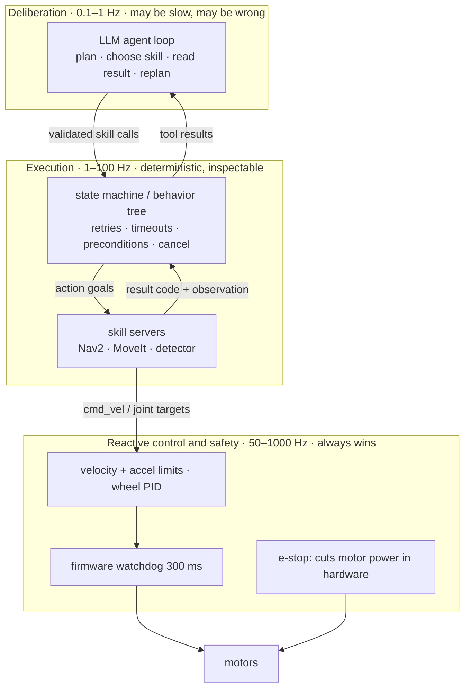

# 19.01 — Why the LLM should not drive the motors — the layered agent architecture

<!-- glance:start -->
<!-- generated by tools/build.py from curriculum/syllabus.yaml — edit the syllabus, not this block -->

| | |
|---|---|
| **Track** | Main path |
| **Difficulty** | Intermediate |
| **Time** | 40 min |
| **Hardware** | none |
| **Software** | none |
| **Prerequisites** | [12.01 The navigation problem — goals, waypoints, global and local planning](../12-navigation/12.01-the-navigation-problem.md)<br>[08.01 Open loop vs closed loop — why your robot doesn't drive straight](../08-control/08.01-open-vs-closed-loop.md) |
| **Skip if** | You can defend the layering between LLM, skills and controllers in a design review. |

<!-- glance:end -->

## What you will learn

- Place any part of a robot stack in the right rate band, from 1 kHz current control to a 0.2 Hz language model.
- Compute the dead-time distance a decision loop costs you, and the maximum speed that is safe for a given round-trip latency.
- Explain why the same rule — "stop when the front sensor reads less than 0.40 m" — is safe at 50 Hz and crashes the robot at 0.5 Hz.
- Assign every karmel responsibility to one of three layers and say which layer keeps the robot safe when the layer above it is slow, wrong or gone.
- Specify what each layer does when the layer above it goes silent.

## Why it matters

The rest of module 19 is about getting a language model to run your robot: "find the water bottle and put it on the kitchen table". That works, and by [19.03](19.03-tool-calling-sim-robot.md) you will watch it happen in the simulator.

It works *because of how it is wired*, not because the model is clever. A model call takes between half a second and ten seconds, occasionally times out, and is not guaranteed to return the same answer twice. A wheel that is turning at 0.3 m/s covers 30 cm in a second and does not care. If the model is inside the loop that stops the wheels, the robot's safety depends on a network round trip — which is the same design mistake as putting an HTTP call to a third-party service inside a database transaction that holds a lock, except the failure mode is a dent in your wall.

This lesson gets the architecture right before any model is involved, so that the rest of the module is about capability and not about damage. Every lesson after this one assumes the layering established here.

<!-- prereqs:start -->
## Prerequisites

You need these first:

- [12.01 The navigation problem — goals, waypoints, global and local planning](../12-navigation/12.01-the-navigation-problem.md)
- [08.01 Open loop vs closed loop — why your robot doesn't drive straight](../08-control/08.01-open-vs-closed-loop.md)

### Optional prerequisite links

None.

Check your readiness: `python course.py why 19.01`
<!-- prereqs:end -->

## Concept

A robot is a stack of loops, and each loop runs at the speed of the physics it controls.

The motor current loop has to react before the motor burns; that is microseconds to a millisecond. Wheel speed has to be corrected before the wheel has turned meaningfully; that is 10–50 ms ([08.04](../08-control/08.04-proportional-control.md)). Obstacle avoidance has to react before the robot travels its own safety margin; at 0.3 m/s and a 0.3 m margin, that is 1 s at the absolute latest, so Nav2's controller runs at 20 Hz ([12.05](../12-navigation/12.05-local-planning-obstacle-avoidance.md)). Deciding *which room to search next* can take five seconds without any physical consequence at all, because the robot can simply stand still while you decide.

That last sentence is the whole architecture: **a slow decision is safe exactly when the robot is allowed to do nothing while it waits.**

So the stack splits into three layers:

1. **Deliberation** (0.1–1 Hz, allowed to be slow, allowed to be wrong). The LLM: understands the request, decomposes it, chooses the next skill, reads results, replans. Output: *skill calls*, never motor commands.
2. **Execution** (1–100 Hz, deterministic, inspectable). The state machine or behavior tree ([19.04](19.04-state-machines.md), [19.05](19.05-behavior-trees.md)) plus the skill servers: Nav2, MoveIt, the detector. It knows how to retry, how to time out, and how to stop.
3. **Reactive control and safety** (50–1000 Hz, boring on purpose). PID loops, velocity and acceleration limits, the firmware watchdog, the collision monitor, the physical e-stop. This layer is allowed to overrule everything above it and never asks permission.

In your world this is the same shape as an orchestrator, a worker pool and the database's constraint layer. The orchestrator can be replaced, retried or rewritten by an LLM; the constraint layer rejects an illegal write no matter who sent it. Nobody proposes to implement `NOT NULL` with a model call.

The hard rule that falls out of it: **every layer must be able to fail safe on its own, without the layer above.** If the LLM never answers, the executive must time out and stop. If the executive hangs, the firmware watchdog must stop the motors ([03.03](../03-robot-software/03.03-robust-serial-communication.md)). If the software stops entirely, the e-stop must cut power ([SAFETY.md](../SAFETY.md)).

> [!TIP]
> **Ask your teacher:** "Give me three real robot behaviours and ask me which layer each belongs in — then tell me which ones I put in the wrong layer and what breaks."

## Technical explanation

### Level 1 — The rate bands, with the course's actual numbers

| Band | Period | Who runs there on karmel | Lesson |
|---|---|---|---|
| 1–20 kHz | 50 µs – 1 ms | motor PWM carrier | [02.03](../02-robot-electronics/02.03-motor-drivers-in-depth.md) |
| 100–1000 Hz | 1–10 ms | Pico wheel-velocity PID, firmware watchdog (300 ms) | [08.04](../08-control/08.04-proportional-control.md), [labs/README](../labs/README.md) |
| 20–100 Hz | 10–50 ms | odometry, EKF, Nav2 controller (20 Hz), `bt_navigator` tick (100 Hz) | [09.03](../09-odometry/09.03-dead-reckoning-integration.md), [12.06](../12-navigation/12.06-nav2-architecture.md) |
| 1–10 Hz | 0.1–1 s | LiDAR scans, object detection, Nav2 global replanning (1 Hz) | [07.07](../07-sensors/07.07-2d-lidar.md), [13.10](../13-computer-vision/13.10-object-detection-models.md) |
| 0.1–1 Hz | 1–10 s | **LLM turn**: plan, choose the next skill, read a result, replan | this module |

Two orders of magnitude separate the slowest control loop from the fastest LLM turn. You cannot close that gap by choosing a faster model; you close it by giving the LLM a job where a 1–10 s decision is harmless.

### Level 2 — Dead time, and the distance it costs

Any decision loop has **dead time**: the interval between "the world changed" and "the wheels changed". It has two parts. The loop only samples every $T_\text{poll}$ seconds, so in the worst case the event happens right after a sample and waits a full period. Then the decision itself takes $T_\text{rt}$ (the round trip). While both are happening, the robot keeps doing what it was last told:

$$d_\text{dead} = v \cdot (T_\text{poll} + T_\text{rt})$$

If the robot must stop before touching something, the margin it reacts at has to be at least that big, so the usable speed is capped:

$$v_\text{max} = \frac{d_\text{margin}}{T_\text{poll} + T_\text{rt}}$$

**Numbers for karmel.** The chassis radius is 0.160 m and the front range sensor sits 0.125 m forward of the centre, so the sensor reads 0.035 m more than the gap to the wall. A stop rule of "range < 0.40 m" therefore leaves $0.400 - 0.035 = 0.365$ m of real margin.

- A 50 Hz controller: $T_\text{poll} = T_\text{rt} = 0.02$ s, so $d_\text{dead} = 0.3 \times 0.04 = 0.012$ m. Twelve millimetres. The margin is 30× larger than it needs to be.
- An LLM asked every 2 s, answering in 2 s: $d_\text{dead} = 0.3 \times 4 = 1.2$ m. The margin is 0.365 m. The robot hits the wall with 0.8 m of decision still in flight.
- Keeping the same 2 s LLM in that loop and demanding safety instead gives $v_\text{max} = 0.365 / 4 = 0.09$ m/s — a robot that crawls at one tenth of walking pace and still has no margin for a slow response.

That is the quantitative argument for the layering, and you will measure exactly these numbers in the code section below.

### Level 3 — Three more reasons, beyond latency

**Latency is a distribution, not a number.** Model APIs have a long tail: a p50 of 1.5 s can come with a p99 of 8 s, plus timeouts and rate limits. A control loop is sized by its *worst* case, not its median. Sizing a robot's stopping distance by p50 latency is the same error as sizing a thread pool by average request time.

**Non-determinism.** The same prompt can produce different tool calls in two runs. Sampling temperature is only part of it; batching and floating-point non-associativity on the server mean even greedy decoding is not bit-reproducible. A safety property you cannot reproduce is not a safety property. You can still *use* a non-deterministic component — you just put it where being wrong costs a wasted trip to the kitchen, not a broken arm.

**Cost and context.** Every turn re-sends the whole transcript plus the tool definitions. karmel's six skills are 3,812 characters of JSON (≈950 tokens) on *every* request, and a successful fetch task takes ~14 turns. A 50 Hz control loop driven this way would be 50 requests per second, forever, each one paying for the full history. Even at zero latency, the economics say no.

**Each of these is a separate argument.** If tomorrow a model answers in 20 ms for free, the non-determinism argument still holds, and the layering stays.

### Level 4 — The contract of each layer

Write the contract down, because the failure modes are what you are designing:

| Layer | Owns | Must guarantee | What it does when the layer above is silent / wrong |
|---|---|---|---|
| **Deliberation** (LLM) | intent, decomposition, skill choice, explaining to the human | nothing about safety | — (it is the top) |
| **Execution** (FSM/BT + skill servers) | ordering, retries, timeouts, preconditions, cancellation | every skill terminates with a code; the robot ends stopped | proceeds with the last valid plan or stops and reports; never invents motion |
| **Reactive** (controllers, watchdog, e-stop) | velocity and acceleration limits, the 300 ms watchdog, collision monitor, e-stop | motors stop when commands stop | stops the motors, independently of everything above |

Three details do the real work:

1. **The LLM's output is a skill call, validated against a schema before anything moves** ([19.02](19.02-robot-skill-api.md)). A hallucinated place name is a rejected argument, not a drive command.
2. **Every skill has a timeout and a cancel path**, because "the layer above went quiet" must be a *bounded* event ([04.08](../04-ros2/04.08-actions.md)).
3. **The watchdog is the joint you can test.** The Pico stops the motors if no valid drive command arrives for 300 ms. Unplug the USB cable mid-drive and the robot stops — that is the whole argument for layering, reduced to one experiment you can perform.

> [!TIP]
> **Ask your teacher:** "Walk me through what happens on karmel, layer by layer and millisecond by millisecond, if the LLM API times out while the robot is driving to the kitchen."

## Diagram



The same story on a time axis, for the "stop below 0.40 m" rule at 0.3 m/s with a 2 s LLM in the loop:

```text
 t=0 s          t=2 s               t=4 s              t=6 s
  |              |                   |                  |
  |--- ask ----->|                   |                  |     range at t=0: 1.20 m  -> "keep driving"
  |              |<-- answer "go" ---|                  |     applied at t=2, based on a 2 s old reading
  |              |--- ask ---------->|                  |     range at t=2: 0.60 m  -> "keep driving"
  |              |                   |<-- "go" ---------|     applied at t=4
  |              |                   |--- ask --------->|     range at t=4: 0.00 m  -> the wall arrived first
  wheels:  ============ 0.3 m/s, uninterrupted ==============>  CONTACT at t ~ 4 s
                                          ^
                                          the 0.40 m line was crossed here, 1.2 s before anything could change
```

## Code

`19-llm-robot-agents/code/llm_in_the_loop.py` drives karmel at a wall in the course simulator ([06.02](../06-simulation/06.02-course-mini-simulator.md) taught the simulator; no hardware, no API key, nothing to install). One rule — "stop when the front range reads below 0.40 m" — is applied by three different drivers:

- `controller`: decides every 20 ms from a fresh reading, the normal 50 Hz loop;
- `llm`: decides every $L$ seconds, and its answer arrives $L$ seconds later; the last command is held meanwhile;
- `llm+watchdog`: the same, but `SimBase` runs the firmware's 300 ms watchdog, so the motors stop whenever commands stop arriving.

The part that matters is the decision timing — the LLM answer applied now is the answer to a question asked one latency ago:

```python
if pending is not None and sim.t >= pending[0] - 1e-9:   # an LLM answer arrives
    command, pending = pending[1], None
    base.set_wheel_velocity(command, command)
elif driver == "llm":
    base.set_wheel_velocity(command, command)            # no watchdog: the wheels keep turning

if sim.t >= next_decision - 1e-9:
    decision = 0.0 if (reading is not None and reading < STOP_BELOW_M) else wheel
    if driver == "controller":
        command = decision                               # applied immediately
        base.set_wheel_velocity(command, command)
    elif pending is None:
        pending = (sim.t + latency_s, decision)          # the answer arrives LATER
    next_decision = sim.t + period
```

Run it:

```bash
py 19-llm-robot-agents/code/llm_in_the_loop.py
py 19-llm-robot-agents/code/llm_in_the_loop.py --latency 0.5
py 19-llm-robot-agents/code/llm_in_the_loop.py --latency 2.0 --speed 0.15
```

## Exercise

### Exercise 19.01-E1 — Predict, then run `[predict]`

Hardware: none.

Before running anything, write down your predictions for the default run (0.3 m/s, 2 s latency):

1. Does the `controller` driver collide? What final gap does it leave?
2. Does the `llm` driver collide?
3. Does `llm+watchdog` collide, and is its final gap larger or smaller than the controller's? Why?
4. How many commands does each driver send in 20 s of simulated time?

Then run `py 19-llm-robot-agents/code/llm_in_the_loop.py` and compare. Explain the one result that surprised you most — especially the *sign* of the watchdog's effect.

### Exercise 19.01-E2 — The latency budget `[numerical]`

Hardware: none.

1. Using $v_\text{max} = d_\text{margin} / (T_\text{poll} + T_\text{rt})$ with $d_\text{margin} = 0.365$ m, compute the maximum safe speed for round-trip latencies of 0.2 s, 1 s, 2 s and 5 s (take $T_\text{poll} = T_\text{rt}$, as the script does). Compute them with Python, not by hand.
2. Invert it: at $v = 0.3$ m/s, what is the largest latency the rule survives?
3. Find the real threshold empirically: sweep `--latency` from 0.5 to 1.0 in 0.1 steps and find the first value where `llm` collides.
4. Your measured threshold will be *larger* than the formula's. Explain why in one sentence — and then explain why you must still design with the formula.

### Exercise 19.01-E3 — Assign the layers `[design]`

Hardware: none.

Put each of these in layer 1 (deliberation), 2 (execution) or 3 (reactive/safety), and for each one write the single sentence "if this is one layer too high, the failure is …":

| # | Responsibility |
|---|---|
| 1 | Clamping wheel speed to 0.5 m/s |
| 2 | Deciding to search the bedroom next |
| 3 | Retrying a failed grasp twice, then giving up |
| 4 | Stopping the motors when the serial link dies |
| 5 | Rewriting "bring me something to drink" as `navigate_to` + `pick` + `place` |
| 6 | Refusing to drive while the e-stop is pressed |
| 7 | Deciding that a 90 s navigation goal has taken too long |
| 8 | Choosing which of two detected bottles the user meant |

Then answer: which of these still work correctly if the internet connection to the model is cut mid-task?

## Expected result

**19.01-E1.** With the default `--latency 2.0 --speed 0.3` the table is (deterministic, seed 0):

```text
driver         collided  final gap m  overshoot m  at stop line s  commands
controller        False        0.356        0.017            8.22      1000
llm                True        0.000        0.365           10.22         9
llm+watchdog      False        1.736        0.000             nan         9
```

The controller stops 0.356 m from the wall, overshooting its own stop line by 17 mm. The `llm` driver collides: it overshoots by the full 0.365 m of margin. `llm+watchdog` never collides but also never gets near the wall — the watchdog stops the motors 300 ms after each command, so the robot creeps forward in 0.3 s bursts, covering only ~2.3 m in 20 s and never reaching the 0.40 m line (`nan` = never reached). The watchdog converts a crash into a robot that barely moves. That is the correct trade and it is *not* a working robot: it is evidence that the LLM does not belong in this loop at all.

**19.01-E2.** The formula gives 0.91, 0.18, 0.09 and 0.037 m/s for latencies of 0.2, 1, 2 and 5 s; at 0.3 m/s the largest tolerable latency is $0.365 / (2 \times 0.3) = 0.61$ s. The sweep shows no collision at 0.7 s (final gap 0.092 m, overshoot 0.281 m) and a collision at 0.8 s. The measured threshold is higher because the formula assumes the worst-case phase — the threshold being crossed immediately after a sample — while in this deterministic run the crossing happens mid-period, giving a realised dead time of about 1.5 latencies instead of 2. You design with 2, because the phase is not yours to choose on a real robot.

**19.01-E3.** 1 → layer 3. 2 → layer 1. 3 → layer 2. 4 → layer 3. 5 → layer 1. 6 → layer 3. 7 → layer 2. 8 → layer 1 (with layer 2 validating that the chosen `object_id` exists). Everything in layers 2 and 3 keeps working with the network cut: the robot finishes or safely abandons the current skill and stops. Only new *intent* is lost. If you put item 3 or 7 in layer 1, a network outage leaves a robot mid-motion with nobody to time it out.

## Troubleshooting

### Symptom: the agent works in the simulator and overshoots on the real robot

Measure, do not guess. (1) Log the wall-clock time of every model call for 20 calls and take the p50 *and* p99, not the mean. (2) Add the skill server's own latency: Nav2's `bt_loop_duration` is 10 ms, but a detection is 0.1–0.5 s. (3) Recompute $d_\text{dead} = v(T_\text{poll} + T_\text{rt})$ with the p99. If it exceeds the margin, the fix is never "prompt the model to be careful" — it is lowering $v$ in the controller's limits, or moving the decision down a layer.

### Symptom: the watchdog trips constantly during normal driving

The watchdog fires when no valid drive command arrives for 300 ms, so something above it is publishing slower than ~3 Hz. Check in this order: is the controller loop actually running at its configured rate (log the interval, look at the max, not the mean)? Is a blocking call — a model request, a file write, a `detect` — inside the control loop? Is the serial link dropping lines ([03.03](../03-robot-software/03.03-robust-serial-communication.md))? A watchdog that trips is doing its job; find the stall, do not lengthen the timeout.

### Symptom: "the LLM ignored my instruction to drive slowly"

It always will, eventually. Speed limits belong in layer 3 where they are enforced regardless of what any layer above asked for. If your only speed limit is a sentence in a prompt, you do not have a speed limit. Put it in the controller's velocity limits and in the skill's schema (`maximum:`), and treat the prompt as documentation.

### Symptom: the robot stops for seconds between skills and it looks broken

That is the architecture working: the robot stands still while layer 1 thinks. If the pauses are unacceptable, the fixes are architectural, not model-level — start the next navigation while the model reasons about the step after it, prefetch a likely plan, or give the executive a default "continue" policy. Never shorten the pause by letting the model command motion directly.

## Common mistakes

- **Treating average latency as the design number.** Robots are sized by the worst case. Use p99 and a timeout, and decide what happens *at* the timeout.
- **Putting the safety rule in the prompt.** Prompts are requests. Limits, geofences and watchdogs are enforcement. [19.09](19.09-agent-safety-boundaries.md) is the whole lesson; the habit starts here.
- **Letting the LLM emit velocities "just for teleop".** It is the same loop with the same dead time. If you want language-driven teleop, have the model call `drive(distance_m, speed)` as a skill with its own bounded, supervised execution.
- **Forgetting that the *skill* also has latency.** `detect_objects` takes 0.2 s in the simulator and a real detector on a Pi can take 0.5 s. That latency sits inside layer 2 and belongs in the same budget.
- **Assuming a faster model fixes the architecture.** Latency is only one of three independent arguments; non-determinism and cost do not improve with speed.
- **No plan for "the model is unreachable".** Decide it explicitly: finish the current skill, stop, report, and — if the robot is somewhere inconvenient — return to the dock.

## Knowledge check

1. karmel drives at 0.25 m/s. A decision loop polls every 0.5 s and answers in 1.5 s. How much margin does it need to guarantee a stop?
   <details><summary>Answer</summary>

   $d_\text{dead} = v(T_\text{poll} + T_\text{rt}) = 0.25 \times (0.5 + 1.5) = 0.5$ m. It needs at least 0.5 m of margin *before* adding braking distance and sensor error — more than karmel's 0.365 m stop margin, so this loop is not allowed to be the thing that stops the robot.
   </details>

2. Why does adding the firmware watchdog turn the collision into a non-collision in the experiment, and why is that still not an acceptable design?
   <details><summary>Answer</summary>

   The watchdog stops the motors 300 ms after the last command, so the robot only moves in short bursts between LLM answers and never builds up enough travel to reach the wall. It is not acceptable because the watchdog is a *failure* mechanism, not a control strategy: the robot ends up crawling (2.3 m in 20 s instead of 6 m), the motion is jerky, and you have hidden a design error behind a safety device. Safety devices should never be on the happy path.
   </details>

3. A vendor announces a model with 50 ms latency. Does the layering change?
   <details><summary>Answer</summary>

   No. Latency was one of three arguments. Non-determinism (the same input can yield a different action, and you cannot reproduce a safety property you cannot reproduce) and cost/context (the whole transcript plus ~950 tokens of tool definitions, per call, forever) are unaffected by speed. The reactive layer also has to survive the model being *unreachable*, which is about availability, not speed.
   </details>

4. Predict: you move "retry a failed grasp twice" from the executive up into the LLM. The model's API goes down after the first failed grasp. What does the robot do?
   <details><summary>Answer</summary>

   Nothing sensible. The `pick` skill returned `GRASP_FAILED` to a caller that no longer exists, so no retry happens and no decision is made to stop, either. The arm stays wherever it was, the base stays where it is, and the task never terminates. With the retry in layer 2, the executive retries twice, fails deterministically, stops the robot and records a result the human can read later.
   </details>

5. In the time diagram, the LLM's answer applied at $t = 2$ s was computed from the range reading at $t = 0$ s. What is that called in control terms, and what is its standard consequence?
   <details><summary>Answer</summary>

   It is dead time (transport delay) in the feedback path. In control terms dead time reduces phase margin: a loop that is stable at 50 Hz becomes oscillatory or unstable when you add a delay comparable to its time constant. This is the same effect you saw when tuning PID ([08.08](../08-control/08.08-tuning-pid.md)); here the delay is 100× the loop period, so the "loop" cannot stabilise anything at all.
   </details>

6. Which of these is a layer-3 responsibility: refusing to drive while a person is within 0.5 m, refusing to drive to a room the user said is off limits, refusing to pick up a knife?
   <details><summary>Answer</summary>

   Only the first. "A person within 0.5 m" is a sensor-triggered, hard-coded stop that must hold even if every layer above is compromised — a collision monitor. "Off-limits room" is a geofence: enforced in layer 2 (the skill rejects the place) and in Nav2's keepout costmap layer, which is also layer 2/3 depending on where you put it. "Do not pick up a knife" is a semantic judgement about an object class: that is layer 1 policy plus a layer-2 allowlist, and it is exactly the sort of rule an adversarial prompt can subvert — see [19.09](19.09-agent-safety-boundaries.md).
   </details>

7. You measure your model API: p50 1.2 s, p99 7 s, and 1 request in 200 times times out at 30 s. The robot must not move more than 0.2 m after a hazard appears. What speed does that allow if the model is in the loop?
   <details><summary>Answer</summary>

   You must design for the timeout, not the p99: $v_\text{max} = 0.2 / (30 + 30) = 0.0033$ m/s — 3 mm/s. The right conclusion is not "3 mm/s", it is "the model must not be in this loop"; give layer 3 the hazard rule and let the model keep choosing rooms.
   </details>

## Practical challenge

Write karmel's **latency budget and layer contract** — one page, in the repository, that the rest of module 19 will be held to.

1. Measure or source three latencies with evidence: your model API's p50/p99/timeout (20 calls, logged with timestamps; if you have no API key yet, use 1.5 s / 8 s / 30 s and mark it as an assumption to re-measure in [19.03](19.03-tool-calling-sim-robot.md)), `detect_objects` on your hardware, and a Nav2 goal round trip.
2. Compute $v_\text{max}$ for each candidate placement of the decision and state the speed limit you will enforce in layer 3.
3. Write the three-row contract table for karmel with your own numbers, and add a fourth column: *how I will test this*.
4. Test at least one of those rows for real: unplug the Pico's USB cable while the simulated or real robot is driving and confirm the motors stop within 300 ms.

> [!CAUTION]
> **Safety:** if you run step 4 on hardware, the robot is on a stand with the wheels in the air, the power switch is within reach, and nothing fragile is in front of it. First motor tests never happen on the floor ([SAFETY.md](../SAFETY.md)).

Acceptance criteria: every number has a source or a measurement; the speed limit is enforced somewhere in code, not in a prompt; each layer has a written "what I do when the layer above is silent"; the watchdog test is recorded with the observed stop time.

## You can skip this if…

Answer knowledge-check questions 1, 3 and 5 correctly without looking, and you can state karmel's dead-time formula and compute the maximum safe speed for a 2 s round trip from memory. If a colleague proposed "the LLM will publish `cmd_vel` at 5 Hz, it is simpler", you can say in three sentences why not — without mentioning how clever or not the model is.

`python course.py skip 19.01 --reason "I design layered robot agents and size loops by worst-case latency"`

## Go deeper

- SayCan — "Do As I Can, Not As I Say: Grounding Language in Robotic Affordances" (Ahn et al., 2022): https://arxiv.org/abs/2204.01691 — the paper that established "the LLM picks from a fixed library of skills"; read the affordance-scoring section for how feasibility was kept out of the model.
- Code as Policies (Liang et al., 2022): https://arxiv.org/abs/2209.07753 — the other half of the pattern: the model writes code against a perception/control API instead of emitting motions.
- ChatGPT for Robotics: Design Principles and Model Abilities (Vemprala et al., 2023): https://arxiv.org/abs/2306.17582 — a practitioner's recipe for the function library + human-in-the-loop workflow this module builds.
- Nav2 navigation concepts: https://docs.nav2.org/jazzy/getting_started/navigation_concepts/ — the official description of how servers, behavior trees and controllers are layered, at the rates quoted above.
- Gemini Robotics overview (embodied reasoning models as the "brain" that calls a lower-level skill API): https://ai.google.dev/gemini-api/docs/robotics-overview — the commercial version of the same split.
- Anthropic tool use overview: https://platform.claude.com/docs/en/agents-and-tools/tool-use/overview — what the deliberation layer's output actually looks like on the wire; used in [19.03](19.03-tool-calling-sim-robot.md).

## Progress checkpoint

- [ ] I can place any robot responsibility in the right rate band and justify it with a number.
- [ ] I can compute the dead-time distance and maximum safe speed for a given loop latency.
- [ ] I can explain the experiment's three results, including why the watchdog "fixes" the crash in the wrong way.
- [ ] I can write the contract of each layer, including what it does when the layer above is silent.
- [ ] I have karmel's latency budget written down with measured or explicitly assumed numbers.

`python course.py complete 19.01` (exercises done) · `python course.py master 19.01` (challenge done) · `python course.py struggle 19.01 "what was hard"`

Next: [19.02 — Designing the robot's skill API — the tools an LLM may call](19.02-robot-skill-api.md).
