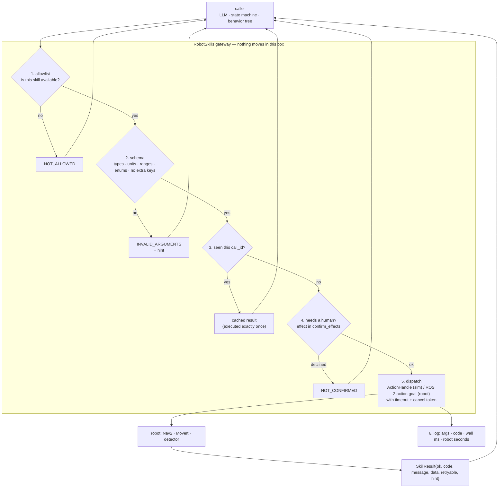

# 19.02 — Designing the robot's skill API — the tools an LLM may call

<!-- glance:start -->
<!-- generated by tools/build.py from curriculum/syllabus.yaml — edit the syllabus, not this block -->

| | |
|---|---|
| **Track** | Main path |
| **Difficulty** | Intermediate |
| **Time** | 1 h |
| **Hardware** | none |
| **Software** | ros2 |
| **Prerequisites** | [19.01 Why the LLM should not drive the motors — the layered agent architecture](19.01-why-llms-dont-drive-motors.md)<br>[04.08 Actions — long-running goals with feedback and cancellation](../04-ros2/04.08-actions.md) |
| **Skip if** | You design robot skills with explicit contracts, timeouts and failure modes. |

<!-- glance:end -->

## What you will learn

- Write a skill contract: typed parameters with units and ranges, preconditions, postconditions, failure codes, a timeout and an effect class.
- Generate a skill's JSON Schema from the robot's world model instead of hand-writing it, so a hallucinated place name becomes a rejected argument.
- Choose skill granularity with one test: can the executive time it out, cancel it and verify it?
- Decide what "safe to retry" means for each skill, and add an idempotency key where it isn't.
- Order the gateway's checks so nothing reaches the robot until it has passed all of them.

## Why it matters

The skill API is the entire attack surface, the entire capability surface and the entire debugging surface of an LLM-driven robot. Whatever is not in it cannot happen: karmel has no `drive` tool, so no prompt — friendly, confused or adversarial — can make the model publish a wheel command. Whatever *is* in it will eventually be called with the worst arguments you did not think of.

You have designed APIs for untrusted clients before. This one has three differences worth naming. The caller is *non-deterministic*, so "it worked in testing" means less than usual. The caller reads your documentation as part of its input, so your prose is executable and a vague description is a bug. And a bad call has physical consequences, so validation must happen **before** anything moves, not as an exception thrown halfway through a motion.

Get this right and the rest of module 19 is easy: [19.03](19.03-tool-calling-sim-robot.md) hands these definitions to a real model, [19.04](19.04-state-machines.md) and [19.05](19.05-behavior-trees.md) call the same skills from deterministic executives, and [19.06](19.06-task-planning-decomposition.md) validates whole plans against these same schemas.

<!-- prereqs:start -->
## Prerequisites

You need these first:

- [19.01 Why the LLM should not drive the motors — the layered agent architecture](19.01-why-llms-dont-drive-motors.md)
- [04.08 Actions — long-running goals with feedback and cancellation](../04-ros2/04.08-actions.md)

### Optional prerequisite links

None.

Check your readiness: `python course.py why 19.02`
<!-- prereqs:end -->

## Concept

A skill is not a function pointer. It is a **contract with a caller you do not control**.

Think of the interface you would design if an intern with amnesia had production access: they are capable, they read documentation, they forget everything between requests, and they are occasionally confidently wrong. You would not hand them `set_wheel_velocity(left, right)`. You would hand them `navigate_to(place)` where `place` is one of eleven names, the call either arrives or fails with a code, the robot is stopped afterwards either way, and calling it twice is harmless.

The contract has two audiences and they read different parts of it:

- **The model** reads the *prose*: the name, the description, the preconditions and the failure codes. This is how it decides what to call and what to do when a call fails. Prose is part of the API. A description that says "moves the robot" instead of "drives the base to a named place, avoiding obstacles; the robot is stopped when it returns" produces worse behaviour, reproducibly.
- **The gateway** reads the *schema*: types, units, ranges, enums. This is what is actually enforced. The model cannot violate it, because a violating call never runs.

Keep those two straight and a useful rule falls out: **anything that matters must be in the schema, not only in the description.** The description says "timeout up to 300 s"; the schema says `"maximum": 300`. If the model asks for 900 s, the description is a suggestion and the schema is the answer.

The last piece is the failure vocabulary. A skill that returns `False` teaches the model nothing; a skill that returns `OUT_OF_REACH` with the hint "navigate_to the surface the object is on, call detect_objects, then retry" turns a failure into the next correct action. Your error codes are the robot's way of teaching the model how the world works.

> [!TIP]
> **Ask your teacher:** "Give me three skills I might add to karmel and tell me, for each, whether it is at the right granularity — and what breaks if it isn't."

## Technical explanation

### Level 1 — Granularity: what is one skill?

The most common design mistake is picking the wrong size.

| Too small | Right | Too big |
|---|---|---|
| `set_wheel_velocity(l, r)` | `navigate_to(place)` | `tidy_the_kitchen()` |
| `move_joint(j, rad)` | `pick(object_id)` | `make_coffee()` |
| `grab_frame()` | `detect_objects()` | `find_whatever_the_user_wants()` |

Too small puts the LLM back in the control loop that [19.01](19.01-why-llms-dont-drive-motors.md) took it out of. Too big hides the decisions you wanted the model to make, and it cannot be verified: you cannot write a postcondition for `tidy_the_kitchen()`.

One test settles it. **A skill is the right size when the executive can time it out, cancel it, and check afterwards whether it worked.** `navigate_to` passes: 90 s default timeout, cancellable, and "am I within 0.10 m of the place pose?" is a measurement. `tidy_the_kitchen` fails all three.

karmel's catalogue — six skills, which is a realistic number for a first robot agent:

| Skill | Effect | Idempotent | Timeout s (default/max) | Failure codes |
|---|---|---|---|---|
| `list_places` | none | yes | — | — |
| `get_robot_state` | none | yes | — | — |
| `detect_objects` | none | yes | — | — |
| `navigate_to` | motion | yes | 90 / 300 | `UNKNOWN_PLACE`, `NO_PATH`, `BLOCKED`, `TIMEOUT`, `CANCELED`, `FAILED` |
| `pick` | manipulation | yes | 20 / 60 | `OBJECT_NOT_FOUND`, `OUT_OF_REACH`, `GRASP_FAILED`, `TIMEOUT`, `CANCELED`, `FAILED` |
| `place` | manipulation | **no** | 20 / 60 | `NOT_HOLDING_OBJECT`, `UNKNOWN_LOCATION`, `OUT_OF_REACH`, `TIMEOUT`, `CANCELED`, `FAILED` |

Note the two read-only skills. `list_places` and `get_robot_state` exist so the model never has to *guess* the state of the world — and so that "I don't know" has a cheap, safe remedy that isn't driving somewhere to look.

### Level 2 — The eight parts of a contract

Every skill in `robot_agent/skills.py` declares all eight. They are not decoration; each one prevents a specific failure you would otherwise debug on a real robot.

1. **Name and version.** `navigate_to`, `v1.0.0`. The version goes in the description because a robot in the field runs a mix of skill servers and "which `pick` did it call?" is a question you will ask.
2. **Parameters, with the unit in the name.** `timeout_s`, not `timeout`. Every REP-103 unit is SI, but the model does not know that unless you tell it, in the name *and* in the schema (`"x-unit": "s"`) *and* in the description. Units in names cost nothing and remove a whole class of error.
3. **Ranges and enums, generated from the world.** `place` is not "a string"; it is an enum of the eleven names in the semantic map, built from `world.places` at start-up. A place the robot does not know is then structurally unrepresentable — not "usually caught".
4. **Preconditions.** What must be true before the call is legal: *object detected in the last 120 s*, *object within 0.75 m*, *gripper empty*. They go in the prose so the model can plan, **and** they are enforced in the skill so the robot is safe when the model ignores them.
5. **Postconditions.** What is true if it returns success: *robot is at the place pose within 0.10 m*, *robot is stopped*. "The robot is stopped" is a postcondition of every motion skill. It is how the executive knows that a returned skill left the robot in a known state.
6. **Failure codes.** A closed set, listed in the description. Closed, because the model will branch on them and a new code it has never seen is a new untested branch.
7. **Timeout: a default and a hard maximum.** The default is what happens when nobody thinks about it; the maximum is what stops the model asking for 900 s because it is "being careful". Both are in the schema.
8. **Effect class and confirmation.** `none` (read-only), `motion`, `manipulation`. This one field lets you say "ask a human before any arm motion" in one place, for all skills, without touching the model. That is the hook [19.09](19.09-agent-safety-boundaries.md) builds on.

Here is the whole contract for one skill, as the course writes it:

```python
SkillSpec(
    "pick", "1.0.0", "Grasp and lift one detected object with the arm.",
    params=(Param("object_id", "string", "object_id from a recent detect_objects result.", pattern=r"[a-z]+-\d+"),
            timeout(20.0, 60.0)),
    preconditions=("object detected in the last 120 s", "object within 0.75 m of the robot (navigate first)",
                   "gripper empty"),
    postconditions=("robot holds the object",),
    failure_codes=("OBJECT_NOT_FOUND", "OUT_OF_REACH", "GRASP_FAILED", "TIMEOUT", "CANCELED", "FAILED"),
    default_timeout_s=20.0, max_timeout_s=60.0, idempotent=True, effect="manipulation",
    ros2_interface="karmel_interfaces/action/PickObject",
)
```

and this is what the model receives — description and JSON Schema, both **generated** from the declaration above, never written twice:

```json
{
  "name": "navigate_to",
  "description": "Drive the robot base to a named place, avoiding obstacles. (v1.0.0) Preconditions: e-stop released; gripper may hold an object. On success: robot is at the place pose within 0.10 m; robot is stopped. Failure codes: UNKNOWN_PLACE, NO_PATH, BLOCKED, TIMEOUT, CANCELED, FAILED. Safe to repeat.",
  "input_schema": {
    "type": "object",
    "properties": {
      "place": {"type": "string", "enum": ["bed", "bedroom", "charging_dock", "coffee_table", "desk",
                "kitchen", "kitchen_counter", "kitchen_table", "living_room", "sofa", "study"],
                "description": "Exact place name from list_places."},
      "timeout_s": {"type": "number", "x-unit": "s", "minimum": 1.0, "maximum": 300.0, "default": 90.0,
                "description": "Give up (and stop the robot) after this long. Unit: s. Range: [1.0, 300.0]. Default: 90.0."}
    },
    "required": ["place"],
    "additionalProperties": false
  }
}
```

`"additionalProperties": false` is the line people leave out. Without it, `navigate_to(place="kitchen", speed=2.0)` is a *valid* call whose `speed` is silently ignored — the worst possible outcome, because the model believes it set a speed and you believe you have a speed limit.

### Level 3 — Retry semantics and idempotency

"Retryable" and "idempotent" are different questions and both matter.

**Retryable** is about the failure: is trying again likely to help? `GRASP_FAILED`, `BLOCKED`, `NO_PATH` and `TIMEOUT` are retryable — the world moves. `UNKNOWN_PLACE` and `INVALID_ARGUMENTS` are not: the same call will fail identically, forever. The result carries a `retryable` flag so the executive does not have to re-derive it.

**Idempotent** is about success: does calling it twice do the job twice? `navigate_to("kitchen")` twice leaves you in the kitchen — idempotent. `pick("bottle-1")` twice is idempotent too, and deliberately so: the second call sees `holding == "bottle-1"` and returns `SUCCEEDED` ("already holding") without moving the arm. `place` is **not**: the object is released on the first call, and the second call operates on a world you no longer understand — an empty gripper if nothing changed, or a *different* object if the agent picked something up in between.

This matters more than it looks, because of a failure mode specific to networked agents: the skill succeeds and the *result* is lost — a dropped connection, a timeout on the caller's side, a crashed agent process. The caller has no idea whether it happened. The fix is the same one you would use for a payment API: an **idempotency key**. Every tool call from the model already has a unique id, so the gateway stores results by call id and replays them instead of re-executing:

```python
if call_id is not None and call_id in self._by_call_id:   # never execute the same call twice
    result = self._by_call_id[call_id]
    self.log.append(CallRecord(call_id, name, args, result, t0_sim, self.world.t, 0.0, cached=True))
    return result
```

One line of policy, and "the model repeated a `place` because the first result never arrived" stops being a category of bug.

### Level 4 — The gateway, and why the order of its checks is the design

Every call — from the LLM, from the state machine of [19.04](19.04-state-machines.md), from the behavior tree of [19.05](19.05-behavior-trees.md) — goes through `RobotSkills.call` in exactly this order:

1. **Allowlist.** Is this skill available to *this* caller at all? A rejected name never reaches the schema. This is where you hand a voice interface a read-only subset, or drop `pick` while the arm is being serviced.
2. **Schema validation.** Types, ranges, enums, unknown parameters. Deliberately strict: `True` is not a number, `NaN` is not finite, `"30 s"` is not `30`.
3. **Idempotency cache.** A repeated `call_id` returns the stored result without touching the robot.
4. **Human confirmation.** If the effect class is in `confirm_effects`, ask. A "no" is `NOT_CONFIRMED`, with a hint that says *do not retry*.
5. **Dispatch with a timeout**, on a cancellable handle.
6. **Log** the call, its arguments, its result, its wall-clock time and the simulated robot time it consumed.

Two properties of that order are worth arguing about, because they are the design:

**Nothing touches the robot before step 5.** Steps 1–4 are pure functions of the request and the gateway's own state. That is what makes a bad call *free*: a hallucinated place name costs one rejected message, not a drive across the apartment.

**The checks run cheapest-and-most-decisive first.** Allowlist before schema, because a skill you are not allowed to call should not leak its parameter list. Schema before confirmation, because you must not ask a human to approve a call that is malformed.

On the real robot only step 5 changes: instead of running a simulated `ActionHandle`, the gateway sends a ROS 2 action goal ([04.08](../04-ros2/04.08-actions.md)). The mapping is declared next to the skills, and a test asserts that the Python failure codes are exactly the `uint8` constants in the `.action` file:

```text
navigate_to  ->  karmel_interfaces/action/NavigateToNamedPlace
   goal:    string place_name, float32 timeout_s, bool allow_replanning
   result:  uint8 SUCCEEDED=0 UNKNOWN_PLACE=1 NO_PATH=2 TIMEOUT=3 CANCELED=4 BLOCKED=5 FAILED=6
   feedback: string state, PoseStamped current_pose, float32 distance_remaining_m, ...
```

This is not a coincidence, it is the reason to use actions for skills. A ROS 2 action already *is* the shape of a skill call: a goal with typed fields, feedback while it runs, cooperative cancellation, and a terminal result with a code. Your skill layer becomes a thin, testable translation rather than an invention.

### The cost of a tool definition

Tool definitions are re-sent with every request, so the API has a size.

karmel's six tools serialise to **3,812 characters, roughly 950 tokens**. The system prompt adds ~240. Across a 25-turn budget that is about 30,000 tokens of *definitions alone* — at Opus 5's list price of $5 per million input tokens, about $0.15 per task before a single result is read. Prompt caching removes most of it (the tool block is byte-identical every turn), which is exactly why the tool list must be **deterministic**: sort it, and never fold a timestamp or a random id into a description.

There is a second, larger cost: every skill you add is a branch the model can take and you have to evaluate. Six skills is a catalogue you can read; sixty is a system nobody has tested. When you need many, group them behind fewer skills with an enum parameter, and reach for the deferred tool-loading patterns in [19.10](19.10-ros2-for-agents-mcp.md).

> [!TIP]
> **Ask your teacher:** "I want to add a `pour_water` skill. Interview me about its contract until every one of the eight parts is filled in, then tell me which ones I got wrong."

## Diagram



The shape of one result — note that everything the caller needs to decide what to do next is *in* the result:

```text
SkillResult(
  skill    = "pick",
  ok       = False,
  code     = "OUT_OF_REACH",          # closed set, listed in the tool description
  message  = "'bottle-1' is 2.08 m away; the arm reaches 0.75 m",
  data     = {...},                   # structured, machine-readable
  elapsed_s= 0.0,                     # simulated robot seconds consumed
  retryable= False,                   # retrying THIS call unchanged will fail again
  hint     = "navigate_to the surface the object is on, call detect_objects, then retry.",
)
```

## Code

`19-llm-robot-agents/code/robot_agent/skills.py` holds the contracts, the schema generator, the validator and the gateway. `show_skills.py` is the lesson's viewer: it needs no LLM, no API key and no hardware.

```bash
py 19-llm-robot-agents/code/show_skills.py                      # the catalogue + one full tool definition
py 19-llm-robot-agents/code/show_skills.py --schema pick        # the full JSON Schema of one skill
py 19-llm-robot-agents/code/show_skills.py --calls              # a session of good and bad calls
py 19-llm-robot-agents/code/show_skills.py --calls --confirm-manipulation
py -m pytest 19-llm-robot-agents/code/tests/test_skills_and_world.py -q
```

The part worth reading first is the schema generator, because it is the reason no schema is ever written by hand:

```python
def build_skill_specs(world: HomeWorld) -> dict[str, SkillSpec]:
    """Skill specs generated from the world model: the place enum comes from the semantic map."""
    places = tuple(sorted(world.places))
    surfaces = tuple(sorted(p.name for p in world.places.values() if p.surface_xy is not None))
    ...
```

Add a room to the map and the model's `navigate_to` enum grows by itself. Remove one and every plan that mentions it is rejected before the robot moves.

## Exercise

### Exercise 19.02-E1 — Predict the rejections `[predict]`

Hardware: none.

`show_skills.py --calls` runs these ten calls in order. **Before running it**, write down for each one: (a) does it succeed, (b) if not, which code, and (c) which of the six gateway stages rejected it.

```text
 1  navigate_to({"place": "kitchen"})
 2  navigate_to({"place": "garage"})
 3  navigate_to({"place": "kitchen", "timeout_s": 900})
 4  navigate_to({"place": "kitchen", "timeout_s": "30 s"})
 5  navigate_to({"place": "kitchen", "speed": 2.0})
 6  pick({"object_id": "bottle-1"})
 7  detect_objects({})
 8  pick({"object_id": "bottle-1"})            call_id "call-7"
 9  pick({"object_id": "bottle-1"})            call_id "call-7"
10  drive({"left": 1.0, "right": 1.0})
```

Then run it. For every prediction you got wrong, say which part of the contract you had not read. Finally run it again with `--confirm-manipulation` and explain which lines change and why.

### Exercise 19.02-E2 — Write the validator `[coding]`

Hardware: none.

Implement the two functions that turn a declared contract into an enforced one: `param_schema(param)` (one `Param` → its JSON Schema fragment, including the generated description) and `validate_arguments(schema, args)` (arguments → a list of human-readable error strings). The tests cover the traps: `True` is not a number, `NaN` is not a valid `number`, `2` *is* a valid `number`, unknown keys are errors, missing optional parameters are not, and a range violation must name the unit.

Check it: `python course.py check 19.02`

### Exercise 19.02-E3 — Design two skills `[design]`

Hardware: none.

Write the full eight-part contract (as a `SkillSpec`, or as a table) for:

1. **`scan()`** — rotate in place and detect objects all the way round. karmel's camera sees 1.20 rad ≈ 69°, so a single `detect_objects` cannot see an object behind the robot.
2. **`say(text)`** — speak a sentence to the person in the room ([19.11](19.11-voice-interface.md) implements it).

For each, state: the parameters with units and ranges, preconditions, postconditions, the closed set of failure codes, default and maximum timeout, effect class, whether it is idempotent, and whether it needs human confirmation. Then answer three questions: why is `say` not effect `none` even though it moves nothing? What is `scan`'s postcondition, given that the detector misses things? And what breaks if `scan`'s parameter is `turns` instead of `sector_rad`?

## Expected result

**19.02-E1.** The session output is deterministic:

```text
 1  navigate_to({"place":"kitchen"})                    True   SUCCEEDED    arrived at 'kitchen'
 2  navigate_to({"place":"garage"})                     False  INVALID_ARGUMENTS  place: 'garage' is not one of [...]
 3  navigate_to({"place":"kitchen","timeout_s":900})    False  INVALID_ARGUMENTS  timeout_s: 900 s is above the maximum 300.0 s
 4  navigate_to({"place":"kitchen","timeout_s":"30 s"}) False  INVALID_ARGUMENTS  timeout_s: expected a number, got '30 s'
 5  navigate_to({"place":"kitchen","speed":2.0})        False  INVALID_ARGUMENTS  speed: unknown parameter
 6  pick({"object_id":"bottle-1"})                      False  OBJECT_NOT_FOUND   'bottle-1' has not been detected in the last 120 s
 7  detect_objects({})                                  True   SUCCEEDED          1 object(s) detected
 8  pick({"object_id":"bottle-1"})                      False  OUT_OF_REACH       'bottle-1' is 2.08 m away; the arm reaches 0.75 m
 9  pick({"object_id":"bottle-1"})                      False  OUT_OF_REACH [cached]  (same message, not re-executed)
10  drive({"left":1.0,"right":1.0})                     False  NOT_ALLOWED        'drive' is not an allowed skill

robot time used: 13.7 s   calls logged: 10
```

Stages: call 10 is stopped by the allowlist (stage 1) — note it is rejected for *not existing*, not for being dangerous. Calls 2–5 are stopped by the schema (stage 2) and cost 0 s of robot time: four different mistakes, four different messages, none of them reaching a motor. Call 9 is the idempotency cache (stage 3) — same `call_id`, replayed, `[cached]`. Calls 6 and 8 pass every gateway check and are refused by the *skill's own preconditions* inside stage 5, which is the right place for them: "has it been detected?" and "is it within 0.75 m?" are facts about the world, not about the request. The total robot time, 13.7 s, is spent entirely on calls 1 and 7.

With `--confirm-manipulation`, calls 8 and 9 become `NOT_CONFIRMED` instead of `OUT_OF_REACH`: the human gate (stage 4) runs *before* dispatch, so the robot never even checks the distance. The hint changes to "The human declined. Do not retry this action" — a different instruction to the model than a retryable failure.

**19.02-E2.** `python course.py check 19.02` passes with no skipped tests. Then confirm against the real thing: `py 19-llm-robot-agents/code/show_skills.py --schema navigate_to` must show your generated `place` enum with eleven names and `timeout_s` with `"minimum": 1.0, "maximum": 300.0, "default": 90.0` and a description ending in `Range: [1.0, 300.0]. Default: 90.0.`

**19.02-E3.** A good `scan` contract looks roughly like: `sector_rad` (number, unit rad, 0.5–6.29, default 6.28), `min_confidence` (0–1, default 0.5); preconditions "e-stop released", "nothing within 0.35 m of the base" (it rotates); postconditions "returns the union of detections from every heading", "the robot ends at its original heading ±0.1 rad", "the robot is stopped"; failure codes `BLOCKED`, `TIMEOUT`, `CANCELED`, `FAILED`; timeout 30/60 s; effect **motion**, idempotent **yes**, confirmation no.

The three answers: `say` is not `none` because effect classes are about *effect on the world*, not about actuators — speech is an irreversible output to a person, and it is the one skill an injected instruction would most like to use. `scan`'s postcondition cannot be "found everything"; it is "returns what was detected from each heading", because the detector is probabilistic and a contract you cannot verify is not a contract. And `turns` is a parameter in units of *your implementation*: the model has no way to reason about how far three "turns" looks, while `sector_rad` is a physical quantity that composes with the 1.20 rad field of view.

## Troubleshooting

### Symptom: the model keeps inventing place names

Check in this order. (1) Is `place` actually an enum in the generated schema, or did you type `"type": "string"`? Print it: `show_skills.py --schema navigate_to`. (2) Does the model ever see the real list — is `list_places` in the allowlist, and does its result carry names *and* descriptions? A model that must guess will. (3) Are your place names guessable? `kitchen_table` and `kitchen_counter` are; `place_7` is not. If all three are fine, the rejection message is doing its job: `INVALID_ARGUMENTS` plus the enum is a correction the model can act on in one turn.

### Symptom: the model sets a parameter and nothing happens

Almost always a missing `"additionalProperties": false`. Add it and the silent no-op becomes a loud `speed: unknown parameter`. The general rule: a schema that accepts more than you implement is worse than no schema, because it converts a caught error into a wrong belief on both sides.

### Symptom: a skill sometimes runs twice

Work backwards from the log, which is why the log records `call_id` and `cached`. (1) Did the caller pass a `call_id` at all? Without one there is no idempotency. (2) Was the second call a different id with identical arguments — i.e. the model genuinely decided to repeat it? Then this is a *prompt and result* problem: the first result was not informative enough for the model to know it had succeeded. (3) Is the skill's own postcondition check strong enough to make a repeat harmless? For `place`, it is not — that is why `place` is declared non-idempotent and why the contract says so in the model's own description: "NOT safe to blindly repeat: check state first."

### Symptom: tool definitions are eating the context budget

Measure before you optimise: `show_skills.py` prints the exact character and approximate token count. Then, in order: enable prompt caching on the tool block (byte-identical every turn, so the whole block becomes a cache read); shorten descriptions by moving detail into the failure hints, which are only sent when they are relevant; merge near-duplicate skills behind an enum parameter; and only then consider deferred tool loading ([19.10](19.10-ros2-for-agents-mcp.md)). Never shorten the *preconditions* — those are what keep the plans correct.

## Common mistakes

- **Writing the JSON Schema by hand.** It drifts from the implementation within a week. Generate it from the declaration, and generate the enums from the world model.
- **Putting a limit only in the description.** The description is a request; the schema is enforcement. If it matters, it is in the schema. If it matters *physically*, it is also in the controller ([19.01](19.01-why-llms-dont-drive-motors.md)).
- **Boolean success.** `ok=False` with no code gives the caller nothing to branch on and gives the model nothing to learn from. Always a code from a closed set, a human-readable message, and a hint on failure.
- **Open-ended failure codes.** Adding a new code silently is an API break: every caller now has an untested branch. Version the skill.
- **Skipping "the robot is stopped" as a postcondition.** Then "the skill returned" and "the robot is still moving" can both be true, and the next skill starts from an unknown state.
- **Treating `retryable` and `idempotent` as the same flag.** They answer different questions and karmel's `place` is the counterexample: its failures are informative, and repeating its *success* is not safe.
- **Letting the tool list vary between requests.** Sorting it costs nothing and is the difference between a cache hit and paying for every definition, every turn.

## Knowledge check

1. `place` is declared with `idempotent=False` while `pick` is `idempotent=True`. Both move the arm. Why the difference?
   <details><summary>Answer</summary>

   Idempotency is about what a *second successful call* does. `pick("bottle-1")` twice is safe by construction: the second call sees the gripper already holding `bottle-1` and returns `SUCCEEDED` ("already holding") without moving the arm. `place("kitchen_table")` twice is not: the first call released the object, so the second operates on a world the caller no longer understands — an empty gripper if nothing changed (`NOT_HOLDING_OBJECT`), or a *different* object put down on the wrong surface if something was picked up in between. That is why its description ends with "NOT safe to blindly repeat: check state first."
   </details>

2. Both `pick` and `place` can return `OUT_OF_REACH`. Only one of them is marked retryable in the course's table. Which, and why?
   <details><summary>Answer</summary>

   Neither: `OUT_OF_REACH` is not in `RETRYABLE` (`{TIMEOUT, BLOCKED, GRASP_FAILED, NO_PATH}`). Retrying an out-of-reach call unchanged fails identically, because nothing about the call or the robot's pose has changed. The hint is what makes it useful — "navigate_to the surface the object is on, call detect_objects, then retry" — so the caller retries *after a different action*, which is a different thing from retrying the call.
   </details>

3. The model calls `navigate_to({"place": "kitchen", "timeout_s": 900})`. What exactly happens, and how much robot time does it cost?
   <details><summary>Answer</summary>

   Stage 2 rejects it: `INVALID_ARGUMENTS`, `timeout_s: 900 s is above the maximum 300.0 s`. Zero robot time, zero motion. The model receives the message plus the hint "Fix the arguments to match the tool schema. Do not guess units." and can retry correctly on the next turn. Note that the failure names the unit — `900 s`, not `900` — which is the whole reason units live in the schema.
   </details>

4. You add a seventh skill, `open_door(door)`, and give the model a 25-turn budget. Estimate the extra input-token cost per task, and name the *other* cost.
   <details><summary>Answer</summary>

   Six skills are 3,812 characters ≈ 950 tokens. A seventh of average size adds ~160 tokens, re-sent on each of up to 25 turns: ~4,000 extra input tokens per task, about $0.02 at $5 per million — negligible, and near-zero with prompt caching since the tool block is unchanged between turns. The real cost is evaluation: `open_door` is a new branch in every plan the model can produce, with its own failure modes, and it has to be tested in combination with the other six. Skill catalogues grow linearly in tokens and combinatorially in behaviours.
   </details>

5. Predict: you remove `"additionalProperties": false` from `navigate_to` and the model calls it with `{"place": "kitchen", "max_speed": 0.1}`. What happens, and why is it the worst outcome of the possible ones?
   <details><summary>Answer</summary>

   The call succeeds and the robot drives to the kitchen at its normal 0.3 m/s. `max_speed` is silently dropped. It is the worst outcome because both sides now hold a false belief: the model's transcript says it requested a slow approach, and a human reading the log sees a speed limit that was never applied. A rejection would have been information; silence is a fabricated record. With the line present, the call fails with `max_speed: unknown parameter` and the model either uses a real parameter or reports that it cannot.
   </details>

6. Why is the allowlist checked before schema validation, and not the other way round?
   <details><summary>Answer</summary>

   Two reasons. Security: a skill the caller may not use should not leak its parameter list through validation errors — an attacker probing `drive` should learn only "not an allowed skill". Cost: the allowlist is a set lookup; validation walks the schema. Cheapest and most decisive first. The `NOT_ALLOWED` hint is also deliberately different in kind — "This skill is not available to you. Do not try to work around it." — because unlike a schema error there is no corrected call to make.
   </details>

7. The `detect_objects` result returns text read off a paper note as `untrusted_text_seen` rather than as `text`. What does that rename buy you, and what does it *not* buy you?
   <details><summary>Answer</summary>

   It buys a clear channel label: everything under that key came from the physical world through a camera, and it is data, never instruction. The model's system prompt can then state one rule that covers every sensor. It does **not** buy enforcement — a model can still be talked into obeying it, which is exactly what `run_agent.py --gullible` demonstrates in [19.03](19.03-tool-calling-sim-robot.md). Naming reduces the probability; only the allowlist, the geofence and the confirmation gate reduce the *consequence* ([19.09](19.09-agent-safety-boundaries.md)).
   </details>

8. A colleague proposes a single skill `do(action: string)` that accepts free text, "so the API never blocks a good idea". Give the three strongest objections.
   <details><summary>Answer</summary>

   (1) Nothing is enforceable: there is no enum, no range, no unit, no `additionalProperties`, so every safety property moves from the gateway into the prompt — where it is a request, not a limit. (2) Nothing is verifiable: with no declared postcondition, the executive cannot check whether the action worked, so retries and timeouts become guesswork. (3) Nothing is testable: the set of inputs is unbounded, so there is no finite evaluation suite and no meaningful regression test. The honest version of their idea is a *larger enum* or a new skill with a real contract — which takes an hour and keeps every property above.
   </details>

9. `pick` declares the precondition "object detected in the last 120 s", and the skill also checks it at runtime. Isn't one of those redundant?
   <details><summary>Answer</summary>

   No — they serve different callers. The prose precondition is *for the model*: it is how a planner knows to put a `detect_objects` before a `pick`, and it is what makes correct plans likely. The runtime check is *for safety*: it is what happens when the model ignores the prose, which it eventually will. The rule generalises: state every precondition twice, once so the caller can plan and once so the robot is safe when it doesn't. If you can only afford one, keep the runtime check.
   </details>

## Practical challenge

Add a seventh skill to karmel end to end: **`scan`** — rotate in place through a given sector and return the union of everything detected along the way.

1. Write the `SkillSpec` with all eight parts (use your 19.02-E3 design). Generate the schema; do not hand-write it.
2. Implement it as an `ActionHandle` in your own module (import `HomeWorld`, do not edit `sim_world.py`): rotate in steps of at most the camera's field of view, call the existing detector at each heading, merge detections by `object_id` keeping the highest confidence, and return to the starting heading. It must honour cancellation and a timeout like every other skill.
3. Register it in a subclass of `RobotSkills` so it goes through the same allowlist, validation, idempotency and logging path as the other six.
4. Write pytest tests, no hardware: it finds an object that is *behind* the robot and that a single `detect_objects` at the same pose does not report; it returns to its starting heading within 0.1 rad; a cancel mid-scan returns `CANCELED` with the robot stopped; and the generated schema rejects `sector_rad=10`.
5. Re-run `show_skills.py` and report the new tool-definition size in characters and tokens.

> [!CAUTION]
> **Safety:** if you later run `scan` on the real robot, wheels off the ground for the first run ([SAFETY.md](../SAFETY.md)). A rotate-in-place skill is the one that most reliably finds the cable you forgot to route, and on the floor it will wind it around an axle.

Acceptance criteria: the schema is generated, not typed; every failure code the implementation can return is listed in the description; the tests pass without hardware; and the robot is stopped in every terminal path, including cancellation.

## You can skip this if…

Answer knowledge-check questions 1, 5 and 6 correctly without looking, and you can take any skill of your own — from work, not from this course — and write its eight-part contract, including which failures are retryable, whether a repeated success is safe, and which parts are enforced versus merely described.

`python course.py skip 19.02 --reason "I design tool APIs with generated schemas, closed failure sets and an enforcement gateway"`

## Go deeper

- Anthropic, "How to implement tool use" / defining tools: https://platform.claude.com/docs/en/agents-and-tools/tool-use/define-tools — what a tool definition is on the wire, and why descriptions carry so much weight.
- OpenAI, function calling: https://developers.openai.com/api/docs/guides/function-calling — the same idea at another vendor; read both once so you design for the concept, not for one API.
- SayCan — "Do As I Can, Not As I Say" (Ahn et al., 2022): https://arxiv.org/abs/2204.01691 — the origin of "the model picks from a fixed skill library", and where affordance (can I do this here?) was kept out of the model.
- ProgPrompt (Singh et al., 2022): https://arxiv.org/abs/2209.11302 — plans written as programs with `assert` statements for preconditions; the closest published relative of the contract in this lesson.
- ROS 2 Jazzy, actions: https://docs.ros.org/en/jazzy/Tutorials/Intermediate/Writing-an-Action-Server-Client/Py.html — goal, feedback, result and cancellation, the interface your skills should be thin wrappers over.
- JSON Schema, "Understanding JSON Schema": https://json-schema.org/understanding-json-schema — the reference for the subset every tool-calling API accepts, including why `additionalProperties` behaves as it does.
- Nav2 Simple Commander API: https://docs.nav2.org/jazzy/configuration_and_development/simple_commander_api/simple_commander_api/ — the Python interface you will wrap to implement `navigate_to` on the real robot ([12.09](../12-navigation/12.09-waypoints-and-missions.md)).

## Progress checkpoint

- [ ] I can write a skill contract with all eight parts and say what each one prevents.
- [ ] I can generate a tool's JSON Schema from a declaration and from the robot's world model.
- [ ] I can decide whether a skill is at the right granularity, using the timeout/cancel/verify test.
- [ ] I can say which of my skills are idempotent, which failures are retryable, and why they are different questions.
- [ ] I can order a gateway's checks and justify each position.

`python course.py complete 19.02` (exercises done) · `python course.py master 19.02` (challenge done) · `python course.py struggle 19.02 "what was hard"`

Next: [19.03 — Tool calling — an LLM operating the simulated robot](19.03-tool-calling-sim-robot.md).
