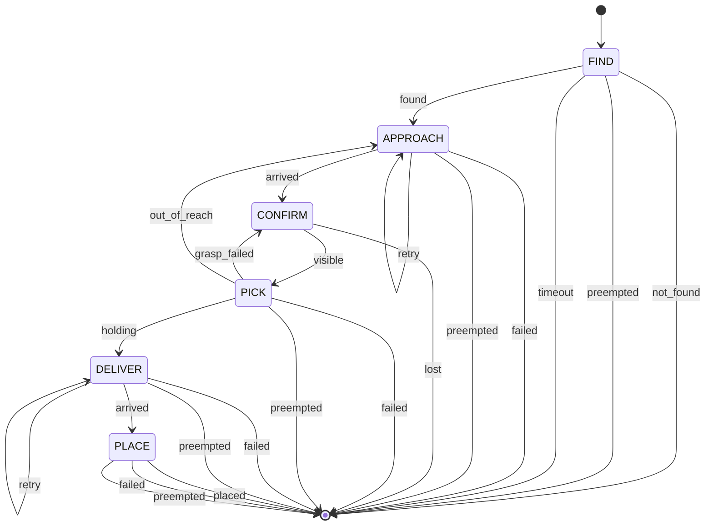
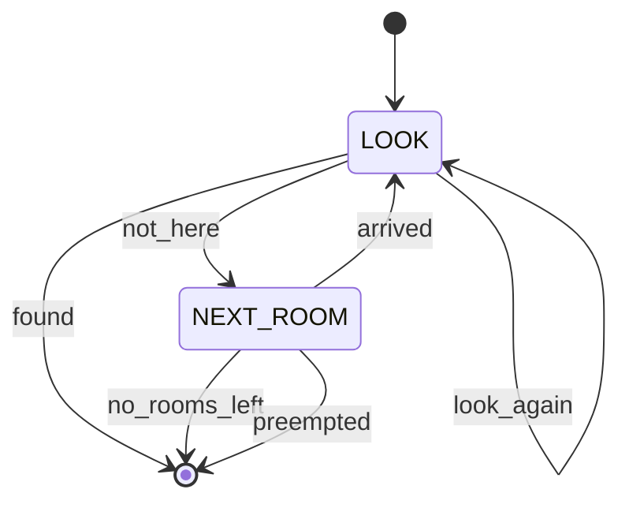

# 19.04 — State machines for robot tasks

<!-- glance:start -->
<!-- generated by tools/build.py from curriculum/syllabus.yaml — edit the syllabus, not this block -->

| | |
|---|---|
| **Track** | Main path |
| **Difficulty** | Intermediate |
| **Time** | 50 min |
| **Hardware** | none |
| **Software** | python |
| **Prerequisites** | [19.01 Why the LLM should not drive the motors — the layered agent architecture](19.01-why-llms-dont-drive-motors.md) |
| **Skip if** | You model robot tasks as explicit state machines. |

<!-- glance:end -->

## What you will learn

- Model a robot task as an explicit machine: states with declared outcomes, and one transition per outcome.
- Validate a machine before it runs and catch the three structural bugs — an unmapped outcome, a transition to nowhere, an unreachable state.
- Nest machines so that a sub-task's outcomes become one state's outcomes, and count what that saves you in transitions.
- Preempt a running task from an e-stop, an operator or a deadline, and know why checking between states is not enough.
- Read a transition trace and say exactly what the robot did and why.

## Why it matters

[19.03](19.03-tool-calling-sim-robot.md) put a language model in charge of choosing the next skill. That works, and it costs 1–10 seconds and a fraction of a cent per decision, it is not reproducible, and it stops working when the network does.

Most of a robot's decisions do not deserve that. "The grasp failed — look again and retry, at most three times" is not a judgement call; it is a rule you can write down, test, and run for free at 10 Hz on the robot itself. The executive layer is where those rules live, and it is the layer that keeps the robot sane when the layer above it is slow, wrong or gone ([19.01](19.01-why-llms-dont-drive-motors.md)).

A finite state machine is the simplest executive that is worth building. It is also the one you already know from workflow engines and saga orchestrators, with one robotics-specific twist: every state is a *physical activity* that takes seconds, can fail in several distinguishable ways, and must be interruptible. This lesson builds that machine, and [19.05](19.05-behavior-trees.md) shows you exactly where it starts to hurt.

<!-- prereqs:start -->
## Prerequisites

You need these first:

- [19.01 Why the LLM should not drive the motors — the layered agent architecture](19.01-why-llms-dont-drive-motors.md)

### Optional prerequisite links

None.

Check your readiness: `python course.py why 19.04`
<!-- prereqs:end -->

## Concept

Write the fetch task as ordinary code and it looks reasonable for about fifteen minutes:

```python
if not found:
    detect()
    if not found:
        drive_to_next_room()
        ...
pick()
if failed:
    if reason == "out of reach":
        drive_closer(); pick()
    elif ...
```

Then the questions start. Where does the e-stop go — into all eleven branches? How many times has it retried, and is that counter reset when it moves to another room? Which of these branches has never run? When the robot did something strange at 14:32, which branch was it in? You cannot answer any of them by reading the code, because the *state* is spread across the call stack, a handful of booleans and the program counter.

A state machine is the same logic with the state pulled out into the open:

- A **state** is one activity with a declared, closed set of **outcomes**. `PICK` can end as `holding`, `grasp_failed`, `out_of_reach`, `failed` or `preempted`. Nothing else.
- A **transition** maps each (state, outcome) pair to the next state, or to one of the machine's own outcomes. Every outcome must be mapped — that is a rule the engine enforces, not a convention.
- A **machine is itself a state**: it has outcomes, so it can be dropped into a bigger machine. `FIND` is a two-state machine whose outcomes (`found`, `not_found`, `preempted`, `timeout`) become the outcomes of one state in the top-level task.

What you get for that structure is not elegance, it is four specific things. The set of reachable situations is finite and printable. Every unhandled case is a *build-time* error rather than a robot standing still. Preemption has exactly one place to live. And the execution trace — `t=28.80 FETCH CONFIRM --visible--> PICK` — is a complete, readable account of what the robot decided and when.

The analogy that holds: this is a workflow engine, where every activity is a long-running, cancellable job with typed failure modes. The analogy that breaks: a workflow engine's activity does not keep moving after you stop looking at it. A robot's does, so "the machine is between states" is a physical condition, not an instant.

> [!TIP]
> **Ask your teacher:** "Take the `if/else` version of the fetch task and turn it into a state machine with me, one state at a time, and tell me at each step which bug the structure just made impossible."

## Technical explanation

### Level 1 — The engine, in one page

`robot_agent/fsm.py` is a small SMACH-style engine in plain Python. Four pieces:

```python
class State:
    outcomes: tuple[str, ...] = ()
    def execute(self, bb: Blackboard) -> str: ...      # returns one of `outcomes`

@dataclass
class StateMachine(State):
    name: str
    outcomes: tuple[str, ...]                          # the machine's own outcomes
    clock: Callable[[], float]                         # simulated time, not wall clock
    preempt: Callable[[Blackboard], str | None]        # returns an outcome to abort with
    states: dict[str, State]
    transitions: dict[str, dict[str, str]]             # state -> {outcome: target}
```

The **blackboard** (`bb`) is a plain dict shared by every state in the machine: where the object was seen, how many grasps have been attempted, when the task started. It exists because states must not talk to each other directly — a state that calls another state is back to the call stack you were escaping.

The execution loop is eight lines, and the interesting part is what it refuses to do:

```python
for _ in range(self.max_transitions):
    if (forced := self.preempt(bb)) is not None:       # e-stop, operator cancel, deadline
        return forced
    outcome = self.states[current].execute(bb)
    if outcome not in self.states[current].outcomes:
        raise InvalidMachine(f"{current} returned undeclared outcome '{outcome}'")
    nxt = self.transitions[current][outcome]
    self.trace.append(TraceEntry(round(self.clock(), 2), self.name, current, outcome, nxt))
    if nxt in self.outcomes:
        return nxt
    current = nxt
raise RuntimeError(f"more than {self.max_transitions} transitions (a loop without a counter?)")
```

`max_transitions` is not paranoia. A state machine whose retry counters live on the blackboard and whose author forgot to increment one is an infinite loop that drives a real robot. The bound turns it into a crash with a trace, which is strictly better.

### Level 2 — Validation: three bugs caught before anything moves

`validate()` runs before the first state executes and refuses three classes of machine. Each one is a bug you would otherwise find on hardware.

**An unmapped outcome.** A state declares `("holding", "grasp_failed", "out_of_reach", "failed", "preempted")` and the transition table covers four of them. At run time the machine would raise — probably twenty minutes in, with the arm extended. The validator says so at construction:

```text
InvalidMachine: FETCH.PICK: outcome 'out_of_reach' has no transition
```

**A transition to nowhere.** `{"arrived": "CONFRIM"}` — a typo that Python will not catch, because it is a dict key, and that no type checker will catch either.

```text
InvalidMachine: FETCH.APPROACH: 'arrived' goes to unknown 'CONFRIM'
```

**An unreachable state.** You added a `RECHARGE` state and never pointed anything at it. The machine is *valid* in the sense that nothing will crash; it is broken in the sense that the behaviour you wrote will never happen. A reachability walk from the start state finds it:

```text
InvalidMachine: FETCH: unreachable states ['RECHARGE']
```

There is a fourth check at run time, because it cannot be done statically: a state that returns an outcome it never declared. That is a bug in the state's own code, and raising immediately beats transitioning somewhere plausible.

This is the practical argument for the whole approach. `if/else` has no equivalent of any of these. A missing `elif` is silence.

### Level 3 — Why hierarchy: counting transitions

karmel's fetch task, as built by `build_fetch_fsm`:

| Machine | States | Transitions |
|---|---|---|
| `FETCH` (top) | 6 — FIND, APPROACH, CONFIRM, PICK, DELIVER, PLACE | 22 |
| `FIND` (sub) | 2 — LOOK, NEXT_ROOM | 6 |
| **total** | **7** | **28** |

Now add global abort conditions. A flat machine has to route each one out of every state, because "abort" is only meaningful from somewhere. With $n$ states and $k$ abort conditions:

$$E_\text{extra} = n \cdot k$$

For $n = 7$ and the three karmel actually needs — e-stop pressed, operator cancel, task deadline exceeded:

$$E_\text{extra} = 7 \times 3 = 21$$

Twenty-one new edges on top of 28, a 75 % increase, every one of them hand-written, and each one a place to forget. Worse, they multiply with the next feature: add a battery-low abort and it is 28 extra.

The hierarchical engine handles all three in one function, checked between states, in one place:

```python
def preempt(bb: Blackboard) -> str | None:
    if world.estop or cancel.cancelled:
        return "preempted"
    if world.t - bb["t_start"] > cfg.deadline_s:
        return "timeout"
    return None
```

Cost: two outcomes on each machine (`preempted`, `timeout`) and four transitions that map them straight out — which are already counted in the 28 above. So the real comparison is **28 transitions with preemption included, against 49 without it**, and the second number grows with every state you add.

That is the first half of why hierarchy pays. The second half is the ordinary one: `FIND` is 8 of the 28 edges and is *complete in itself*. You can test it alone, reuse it for "where are my keys?", and replace it with a smarter search without touching `FETCH`, because the contract between them is four outcome names.

### Level 4 — Preemption: between states is not enough

Here is the detail that separates a state machine you drew from one that runs on a robot.

`preempt()` is checked **between** states. `navigate_to("kitchen")` takes 12.6 seconds. If the e-stop is pressed at t = 12.0, a purely between-states check notices it after the navigation finishes — twelve seconds of driving after the button was pressed. That is not a safety system, it is a log entry.

So preemption has to reach *inside* the running skill, and the mechanism is the one [19.02](19.02-robot-skill-api.md) already built: a `CancelToken` passed into `skills.call`, checked by the running `ActionHandle` on every step.

```python
def run(bb: Blackboard, name: str, **args: Any) -> SkillResult:
    r = skills.call(name, args, cancel=cancel)        # the skill can be stopped mid-motion
    bb.setdefault("log", []).append((round(world.t, 2), name, args, r.code))
    return r
```

Two independent paths, and you need both: the token stops the *current* skill within one control step, and `preempt()` stops the *machine* before it starts another. With both, the e-stop at t = 12.0 produces this, and the robot is stopped at t = 12.04:

```text
t= 12.04  FIND  NEXT_ROOM  --preempted--> preempted
t= 12.04  FETCH FIND       --preempted--> preempted
```

Note that the preemption propagates *up*: `FIND` aborts with `preempted`, which is one of its declared outcomes, which `FETCH` maps to its own `preempted`. Nothing special-cases it. That is hierarchy doing its job.

And below both of them sits the layer that does not ask permission: the firmware watchdog stops the motors 300 ms after commands stop arriving, whatever the software thinks ([19.01](19.01-why-llms-dont-drive-motors.md)). Three layers, three independent stops.

Finally, the one guarantee the executive owes its caller:

```python
try:
    outcome = fsm.execute(bb)
finally:
    skills.world.base.stop()        # every path, including exceptions
```

### Where this is used in ROS 2

State machines are the classic ROS task executive. SMACH is the original — a Python framework of states, outcomes and containers whose *vocabulary* (this engine's `outcomes`, `transitions`, blackboard) is lifted straight from it. YASMIN is the maintained ROS 2 equivalent, with a viewer that shows the active state live. Nav2 went the other way and uses behavior trees, for reasons that are the subject of the next lesson.

Whichever you use, the shape is the same: states wrap action clients, outcomes are the action result codes, and the blackboard carries what the states have learned.

> [!TIP]
> **Ask your teacher:** "Give me a fetch machine with one deliberate structural bug in it — an unmapped outcome, a typo'd target or an unreachable state — and let me find it before I run `validate()`."

## Diagram

The top-level machine, as printed by the code itself (`run_executives.py fsm --mermaid`; the labels below drop the engine's redundant `(outcome)` suffix):



Read the three recovery edges, because they are the entire value of the diagram: a failed grasp goes back to `CONFIRM` (look again — the object moved), an out-of-reach failure goes back to `APPROACH` (drive closer), and a navigation failure retries itself up to `max_nav_attempts`. Each edge is one failure code from the skill API turned into one recovery, at a glance, without reading any code.

And the `FIND` sub-machine:



Two states carry the whole search: look up to three times from here (the detector misses), then drive to the next room on the list; when the list is empty, report `not_found`.

## Code

`19-llm-robot-agents/code/robot_agent/fsm.py` is the engine plus `build_fetch_fsm`, which wires the task to the **same `RobotSkills` gateway** the LLM used in [19.03](19.03-tool-calling-sim-robot.md) — same allowlist, same validation, same logging. That is the point of having a skill API: the executive and the model are interchangeable callers.

```bash
py 19-llm-robot-agents/code/run_executives.py fsm                 # the happy path, with the trace
py 19-llm-robot-agents/code/run_executives.py fsm --grasp-p 0.3   # a clumsy gripper: watch the retries
py 19-llm-robot-agents/code/run_executives.py fsm --estop-at 12   # press the e-stop at t = 12 s
py 19-llm-robot-agents/code/run_executives.py fsm --mermaid       # print the machine as a diagram
py -m pytest 19-llm-robot-agents/code/tests/test_fsm_bt.py -q
```

The state that shows the pattern most clearly is `PICK`: one skill call, one branch per failure code, counters on the blackboard.

```python
def pick(bb: Blackboard) -> str:
    r = run(bb, "pick", object_id=bb["object"]["object_id"])
    if r.ok:
        return "holding"
    if failed_because_of_preemption(r):
        return "preempted"
    bb["grasp_attempts"] = bb.get("grasp_attempts", 0) + 1
    if bb["grasp_attempts"] >= cfg.max_grasp_attempts:
        bb["failure"] = f"pick failed {bb['grasp_attempts']} times: {r.code}"
        return "failed"
    return "out_of_reach" if r.code == "OUT_OF_REACH" else "grasp_failed"
```

Every failure code from the skill's declared set ends up as an outcome, the counter lives on the blackboard rather than in a local variable, and the choice of *where to go* is not made here — it is made in the transition table, which is the thing you can read and draw.

## Exercise

### Exercise 19.04-E1 — Predict the trace `[predict]`

Hardware: none.

The fetch machine starts in the living room; the water bottle is on the kitchen counter; the detector misses far or small objects. **Before running**, predict for the default run (`--grasp-p 0.85`, seed 1):

1. The sequence of `FETCH` states visited, in order.
2. How many times `LOOK` runs before `FIND` succeeds, and in which rooms.
3. Total simulated robot time, to the nearest 5 s.
4. The final outcome.

Then run `py 19-llm-robot-agents/code/run_executives.py fsm` and compare.

Now predict the same four things for `--grasp-p 0.3`, and say which *edge* of the diagram gets used that was not used before. Run it.

### Exercise 19.04-E2 — Build the engine `[coding]`

Hardware: none.

Implement the state-machine engine: `StateMachine.add_state`, `validate` and `execute`, plus a `CallbackState` wrapper. The tests pin the three structural checks (unmapped outcome, unknown target, unreachable state), the run-time check for an undeclared outcome, nesting (a machine used as a state, sharing one trace), preemption between states, the transition bound, and the trace format.

Check it: `python course.py check 19.04`

### Exercise 19.04-E3 — Add a battery-low abort, two ways `[design]`

Hardware: none.

karmel must abandon the task and drive to the charging dock when the battery drops below 11.1 V ([SAFETY.md](../SAFETY.md) and the battery monitor of [01.14](../01-first-robot/01.14-battery-monitoring.md)).

1. **Flat version.** Take the 7-state machine and add the abort as ordinary transitions. Draw it. Count the new edges and the new states. How many places would you have to touch to change the threshold from 11.1 V to 11.3 V?
2. **Hierarchical version.** Add it through `preempt()` instead. Write the code. Count the new edges.
3. There is a catch that neither version solves by itself: the battery can cross the threshold *during* a 12-second navigation. Say exactly which mechanism handles that, and why the answer is not "check the battery more often in `preempt()`".
4. `RECHARGE` — drive to the dock and wait — is a *state*, but in the hierarchical version there is nowhere obvious to put it. Where does it go, and what does that tell you about the difference between "abort" and "recover"?

## Expected result

**19.04-E1.** The default run is deterministic (seed 1) and ends `succeeded` in **45.7 s**:

```text
t=  0.20  FIND  LOOK       --look_again--> LOOK
t=  0.40  FIND  LOOK       --look_again--> LOOK
t=  0.60  FIND  LOOK       --not_here--> NEXT_ROOM
t=  5.70  FIND  NEXT_ROOM  --arrived--> LOOK
t=  5.90  FIND  LOOK       --look_again--> LOOK
t=  6.10  FIND  LOOK       --look_again--> LOOK
t=  6.30  FIND  LOOK       --not_here--> NEXT_ROOM
t= 18.86  FIND  NEXT_ROOM  --arrived--> LOOK
t= 19.06  FIND  LOOK       --found--> found
t= 19.06  FETCH FIND       --found--> APPROACH
t= 28.40  FETCH APPROACH   --arrived--> CONFIRM
t= 28.80  FETCH CONFIRM    --visible--> PICK
t= 33.30  FETCH PICK       --holding--> DELIVER
t= 42.22  FETCH DELIVER    --arrived--> PLACE
t= 45.72  FETCH PLACE      --placed--> succeeded

OUTCOME succeeded   bottle on: kitchen_table   holding: None   robot time 45.7 s
```

`FETCH` visits FIND → APPROACH → CONFIRM → PICK → DELIVER → PLACE, with no retries. `LOOK` runs **seven** times: three from the start pose, three in the living room, and once in the kitchen where it finds the bottle. Note how cheap looking is (0.2 s) and how expensive driving is (5.1 s and 12.6 s) — which is exactly why `looks_per_room` is 3 and not 1.

With `--grasp-p 0.3` the run fails after 38.2 s, and the new edge is `PICK --grasp_failed--> CONFIRM`, taken twice:

```text
t= 28.80  FETCH CONFIRM    --visible--> PICK
t= 31.80  FETCH PICK       --grasp_failed--> CONFIRM
t= 32.00  FETCH CONFIRM    --visible--> PICK
t= 35.00  FETCH PICK       --grasp_failed--> CONFIRM
t= 35.20  FETCH CONFIRM    --visible--> PICK
t= 38.20  FETCH PICK       --failed--> failed
```

Three grasp attempts (`max_grasp_attempts = 3`), each preceded by a fresh `CONFIRM` — because a failed grasp nudges the object and invalidates the detection, which the skill's own failure message says: *"the gripper closed on nothing; 'bottle-1' may have moved — detect it again"*. The machine gives up cleanly, the bottle stays on the counter, the gripper is empty and the robot is stopped. A failure the operator can read is the correct outcome here; there is nothing left to try.

With `--estop-at 12` the run ends at **t = 12.04 s** with outcome `preempted`, mid-navigation to the kitchen — the cancel token stops the drive within one control step, and the preemption then propagates `FIND → FETCH`.

**19.04-E2.** `python course.py check 19.04` passes with no skipped tests.

**19.04-E3.** Flat: one new state (`RECHARGE`) and **7 new edges** — one `battery_low` outcome out of each existing state — plus the threshold appears in seven places unless you were careful enough to put it in a shared helper, which is already half of the hierarchical solution. Hierarchical: **zero new edges**; one condition in `preempt()` returning a new machine outcome `battery_low`, which the top machine already knows how to route because aborts leave through the machine's outcomes.

Part 3: the mid-navigation case is handled by the `CancelToken` that reaches inside the running skill, not by `preempt()`. Checking `preempt()` more often is impossible in this design — it is only consulted between states, and a state is a blocking skill call. The general rule: `preempt()` decides whether to start the *next* activity; the cancel token stops the *current* one. You need both, and under both sits the watchdog.

Part 4: `RECHARGE` belongs in a *wrapper machine* — `MISSION = FETCH → (on battery_low) → RECHARGE → done` — not inside `FETCH`. That is the distinction: aborting is something a machine does to itself and reports upward; recovering is a decision about what to do next, which belongs to whoever chose the task in the first place. Putting recovery inside the task is how executives grow into unreadable ones, and it is the same layering argument as [19.01](19.01-why-llms-dont-drive-motors.md), one level down.

## Troubleshooting

### Symptom: `InvalidMachine: outcome 'x' has no transition`

Working as intended, and the fix is a decision, not a line of code. Ask what should happen after that outcome: another state, or out of the machine? If the answer is "it can't happen", it can — the state declared it. If the answer is "the same as `failed`", map it to `failed` *explicitly*; a reader must be able to see that you decided, not that you forgot.

### Symptom: the machine loops forever, or hits `max_transitions`

Print the trace — it is the whole diagnosis. Look for a cycle: `A --x--> B --y--> A` repeating with the same outcomes. Then find the counter that should be breaking it. Two failure modes are common: the counter is a *local variable* inside the state function, so it resets on every entry (it belongs on the blackboard), or it is on the blackboard but reset by a state you did not expect — `next_room` sets `bb["looks"] = 0` deliberately, and that is correct for looks-per-room but would be a bug for grasp attempts. Decide, per counter, what its scope is, and write it down next to it.

### Symptom: the e-stop is pressed and the robot keeps moving for ten seconds

Preemption is only wired between states. Check three things in order: (1) is a `CancelToken` passed into `skills.call`, and does the running skill check it — `ActionHandle.run(should_cancel=...)`? (2) does the skill's generator actually poll `h.cancel_requested` inside its motion loop, rather than only between stages? (3) does the firmware watchdog fire when commands stop ([03.03](../03-robot-software/03.03-robust-serial-communication.md))? Each of the three covers a different span of time; a gap in any one is seconds of unwanted motion.

### Symptom: the machine works in simulation and takes forever on the robot

Compare the traces. The structure is deterministic, so the difference is in the *durations*, and the trace has timestamps. Usual causes: a skill server that retries internally, so one state absorbs three attempts invisibly (its timeout is too generous — lower it and let the machine decide); a `LOOK` that takes 0.2 s in simulation and 0.6 s with a real detector, multiplied by `looks_per_room × rooms`; and real navigation recoveries ([12.10](../12-navigation/12.10-recovery-and-navigation-safety.md)) that inflate `navigate_to`. Fix it in the configuration — `looks_per_room`, timeouts, `deadline_s` — not in the structure.

### Symptom: the trace does not explain what happened

Then the machine is under-decomposed: a state is doing several things and returning one outcome. If `APPROACH` internally detects, replans and drives, its trace entry says `arrived` and hides three decisions. Split it. The test is the one from [19.02](19.02-robot-skill-api.md): one state, one activity you could time out, cancel and verify.

## Common mistakes

- **Keeping counters in local variables.** They reset silently on re-entry. Retry counts, visited rooms and timestamps belong on the blackboard, where the trace and the tests can see them.
- **Not validating before running.** `validate()` is three cheap graph checks and it converts run-time surprises into construction errors. Call it in a unit test for every machine you build.
- **Mapping an outcome to "whatever" to make the validator quiet.** The validator is asking you a design question. Answer it.
- **Relying on between-state preemption for safety.** A 12-second skill is 12 seconds of blindness. Cancel tokens inside, watchdog below.
- **Boolean outcomes.** `("succeeded", "failed")` throws away exactly the information the recovery edges are made of. Let the outcomes mirror the skill's failure codes.
- **Growing a task machine by adding states to the same level.** Past about ten states in one machine, nest. The measure that matters is transitions, not states, and transitions grow much faster.
- **Forgetting the `finally: stop()`.** An exception in a state leaves the robot doing whatever it was doing.

## Knowledge check

1. A state declares outcomes `("done", "failed")` but its `execute` returns `"timeout"`. When do you find out, and why is that the right moment?
   <details><summary>Answer</summary>

   At run time, immediately, with `InvalidMachine: ... returned undeclared outcome 'timeout'`. It cannot be caught statically — the engine does not know what the function will return — but raising at once is right because the alternative is worse: transitioning somewhere "reasonable" would run a recovery that was never designed for this case, and the trace would show a decision nobody made. A crash with a trace at the exact transition is the cheapest possible bug report.
   </details>

2. `FETCH` has 6 states and 22 transitions; `FIND` has 2 and 6. How many transitions would you add for three global abort conditions if there were no preemption hook, and what is that as a percentage?
   <details><summary>Answer</summary>

   $n \cdot k = 7 \times 3 = 21$ new edges — one abort route out of each of the seven states, for each of the three conditions — taking the machine from 28 to 49 transitions, a 75 % increase. With the preemption hook it is zero new edges and one function, because the abort leaves through the machine's own outcomes, which are already mapped. The number to watch when a machine grows is transitions, not states.
   </details>

3. Predict: you set `max_grasp_attempts = 1` and run with `--grasp-p 0.3`. What does the trace look like, and what is the final outcome?
   <details><summary>Answer</summary>

   `PICK` runs once; with a 30 % success probability it most likely fails, and because the attempt counter has reached its limit the state returns `failed` rather than `grasp_failed` — so the `PICK --grasp_failed--> CONFIRM` edge is never taken. The trace ends `FETCH PICK --failed--> failed` at roughly t = 31.8 s, the bottle stays on the counter, and the robot is stopped. The interesting part is that the *edge still exists in the diagram* and is now dead code: a retry policy expressed as a counter can silently disable a transition, which is one of the things behavior trees make more visible ([19.05](19.05-behavior-trees.md)).
   </details>

4. Why does `next_room` set `bb["looks"] = 0`, and what would break if `pick` reset `bb["grasp_attempts"]` the same way?
   <details><summary>Answer</summary>

   "Looks" is a per-room budget: the machine should look three times *in each room*, so arriving somewhere new resets it. "Grasp attempts" is a per-task budget: three failures mean the grasp is not working, wherever you try it. If `pick` reset the counter on each entry, the `grasp_failed → CONFIRM → PICK` cycle would never terminate — a live robot repeatedly closing an empty gripper until `max_transitions` fires. Every counter needs its scope decided explicitly; the bug is always "the right counter, the wrong scope".
   </details>

5. The e-stop is pressed 2 s into a 12.6 s `navigate_to`. Trace what stops the robot, in order, with times.
   <details><summary>Answer</summary>

   (1) Within one control step (20 ms), the running `ActionHandle` notices `cancel_requested` (or `world.estop`), stops commanding the wheels and returns a terminal result. (2) The state returns `preempted`; `FIND` aborts with `preempted`; `FETCH` maps that to its own `preempted` and returns — this is the trace showing both machines at the same timestamp. (3) `run_fetch`'s `finally` calls `base.stop()`. (4) Underneath all of it, if software had done nothing at all, the firmware watchdog stops the motors 300 ms after the last command. The measured result is the run ending at t = 12.04 s with the robot stopped.
   </details>

6. Someone proposes dropping the `FIND` sub-machine and inlining `LOOK` and `NEXT_ROOM` into `FETCH`. What exactly is lost?
   <details><summary>Answer</summary>

   Three things, none of them aesthetic. Testability: `FIND` currently has four outcomes and can be tested on its own; inlined, the only way to test the search is to run the whole fetch task. Reuse: "where are my keys?" is `FIND` plus a report, and inlining deletes that. And the transition budget: `FIND`'s 6 internal edges plus 1 edge into the parent become edges in an 8-state machine whose abort routing is now 8 × k instead of 7 × k, and whose diagram no longer fits on a slide. What you gain is one less indirection — worth it for two states, never worth it for five.
   </details>

7. A colleague says "state machines are obsolete, Nav2 uses behavior trees". Where are they right and where are they wrong?
   <details><summary>Answer</summary>

   Right that Nav2's navigator is a behavior tree, and right that BTs handle *reactivity* — re-checking a condition while something runs — far more gracefully, which is the next lesson. Wrong that a machine with explicit states is obsolete: it is more readable when the task really is a sequence of phases with named recoveries, its trace is a complete account of the decision history, and its structural bugs are caught by three graph checks. ROS 2 ships a maintained FSM framework (YASMIN) precisely because plenty of tasks are sequential. Pick by shape: phases with named recoveries → FSM; "keep re-checking these guards while doing the next thing" → BT.
   </details>

## Practical challenge

Build **`PATROL`** — a hierarchical machine that visits every room in order, looks for a named object in each, and reports where it found it — and prove it is correct without running the robot more than you must.

1. Design it as two machines: a reusable `VISIT_AND_LOOK(room)` and a top-level `PATROL` that walks the room list. Reuse `RobotSkills`; do not call the simulator directly.
2. Give it three abort conditions through one `preempt()`: e-stop, operator cancel, and a task deadline. Each gets its own machine outcome.
3. Validate it in a unit test. Then write three tests that each construct a *deliberately broken* variant and assert the exact `InvalidMachine` message: an unmapped outcome, a transition to a misspelled state, and an unreachable state.
4. Behaviour tests, no hardware: it finds `keys-1` on the desk and reports `study`; it reports `not_found` for an object that is not in the apartment and visits every room before doing so; an e-stop injected mid-navigation ends it within 0.1 s of simulated time with the robot stopped; and a deadline of 20 s ends it with `timeout`.
5. Print the machine with `to_mermaid()` and paste both diagrams into your notes. Count states and transitions, and compare with the flat version you did *not* build.

> [!CAUTION]
> **Safety:** if you run a patrol on the real robot, it drives autonomously between rooms. The e-stop must be within reach of a standing person along the whole route, the deadline must be short enough that you can wait it out, and you test it with the wheels off the ground first ([SAFETY.md](../SAFETY.md)).

Acceptance criteria: the abort conditions are in exactly one place; the three broken variants fail validation with the messages you asserted; the e-stop test measures simulated time, not "it looked fast"; and the trace of a successful patrol reads as a complete account of where the robot went and why.

## You can skip this if…

Answer knowledge-check questions 2, 4 and 5 correctly without looking, and you can take a task of your own, write it as a hierarchical machine with declared outcomes, and say for each counter on the blackboard what its scope is and which state resets it. You can also state the two independent mechanisms that stop a running skill and explain why one is not enough.

`python course.py skip 19.04 --reason "I build validated hierarchical state machines with preemption and cancellation"`

## Go deeper

- YASMIN — a maintained ROS 2 state-machine framework (Python and C++, supports Jazzy), with a live state viewer: https://github.com/uleroboticsgroup/yasmin — docs at https://uleroboticsgroup.github.io/yasmin/. The closest production version of the engine in this lesson.
- SMACH — the original ROS task executive (a `ros2` branch exists): https://github.com/ros/executive_smach — worth reading for the vocabulary: states, outcomes, containers, userdata.
- Behavior Trees in Robotics and AI (Colledanchise & Ögren, 2017): https://arxiv.org/abs/1709.00084 — read the chapter comparing BTs with FSMs *after* this lesson and before [19.05](19.05-behavior-trees.md); it makes the trade-off precise rather than fashionable.
- Nav2 behavior trees: https://docs.nav2.org/jazzy/getting_started/nav2_behavior_trees/ — what the navigation stack chose instead, and why the recovery structure looks different.
- ROS 2 Jazzy, writing an action client: https://docs.ros.org/en/jazzy/Tutorials/Intermediate/Writing-an-Action-Server-Client/Py.html — how a state wraps a long-running skill on the real robot, including cancellation.

## Progress checkpoint

- [ ] I can model a robot task as states with declared outcomes and an explicit transition table.
- [ ] I can name the three structural bugs `validate()` catches and what each one looks like on hardware.
- [ ] I can count what hierarchy and a preemption hook save in transitions, with numbers.
- [ ] I can wire preemption both between states and inside a running skill, and say why both are needed.
- [ ] I can read a transition trace and reconstruct the robot's decisions from it.

`python course.py complete 19.04` (exercises done) · `python course.py master 19.04` (challenge done) · `python course.py struggle 19.04 "what was hard"`

Next: [19.05 — Behavior trees](19.05-behavior-trees.md).
