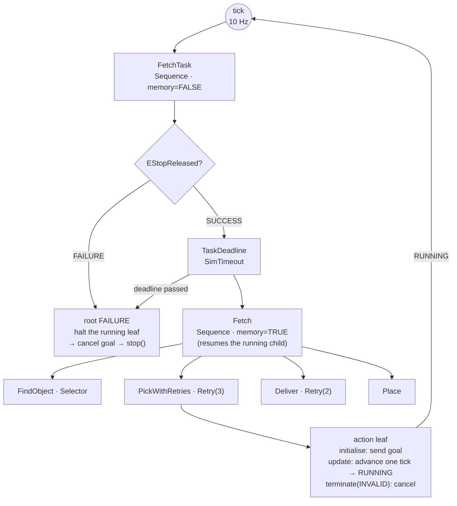

# 19.05 — Behavior trees

<!-- glance:start -->
<!-- generated by tools/build.py from curriculum/syllabus.yaml — edit the syllabus, not this block -->

| | |
|---|---|
| **Track** | Main path |
| **Difficulty** | Intermediate |
| **Time** | 1 h 15 min |
| **Hardware** | none |
| **Software** | python, py-trees |
| **Prerequisites** | [19.04 State machines for robot tasks](19.04-state-machines.md)<br>[12.06 Nav2 architecture — servers, lifecycle and behavior trees](../12-navigation/12.06-nav2-architecture.md) |
| **Skip if** | You write behavior trees and know why Nav2 uses them. |

<!-- glance:end -->

## What you will learn

- Read and write a behavior tree: sequence, fallback, decorators, condition and action leaves, and the three statuses.
- Use `memory` deliberately, and say for any node whether it resumes or re-checks on the next tick.
- Write a non-blocking action leaf over a long-running skill: start, advance, cancel on halt.
- Measure reactivity — how long after a guard becomes false the robot actually stops — and compare it with the state machine's.
- Choose between a behavior tree and a state machine from the shape of the task, not from fashion.

## Why it matters

The state machine of [19.04](19.04-state-machines.md) runs the fetch task correctly and reads beautifully. Then you add a requirement that sounds trivial: *"abandon everything and stop if the e-stop is pressed, the battery drops below 10.5 V (`low_warning_v`), or the task has run for five minutes."*

In a state machine those are conditions checked **between** states. A `navigate_to` takes 12.6 seconds, so a deadline that expires mid-drive is noticed when the drive finishes. Measured, in this lesson's own code: with a 30-second deadline the state machine stops the robot at **t = 33.3 s**, holding the bottle, in the middle of the apartment. The behavior tree stops at **t = 30.1 s** — one tick late — and cancels the navigation goal it was in the middle of.

That difference is the whole reason behavior trees took over robot executives, and it is why Nav2's navigator is a tree ([12.06](../12-navigation/12.06-nav2-architecture.md)) rather than a state machine. A BT re-evaluates its guards continuously, by construction, without you writing a single abort edge. It is also why [19.06](19.06-task-planning-decomposition.md) compiles an LLM's plan into a tree instead of into a chain of calls: the safety structure comes with the shape.

<!-- prereqs:start -->
## Prerequisites

You need these first:

- [19.04 State machines for robot tasks](19.04-state-machines.md)
- [12.06 Nav2 architecture — servers, lifecycle and behavior trees](../12-navigation/12.06-nav2-architecture.md)

### Optional prerequisite links

None.

Check your readiness: `python course.py why 19.05`
<!-- prereqs:end -->

## Concept

A behavior tree is a program that is **re-executed from the root, many times per second**, and whose nodes remember just enough to continue where they left off.

That sentence contains the whole idea, and it is genuinely different from anything in ordinary software. You are not calling a function and waiting. Every 100 ms the root is *ticked*: the tick flows down, each node decides what to do with it, and each node returns one of three statuses:

- **SUCCESS** — done, and it worked.
- **FAILURE** — done, and it did not.
- **RUNNING** — not done; ask again next tick.

`RUNNING` is the status that does not exist in a state machine, and it is what makes the structure work. An action leaf that is driving the robot returns `RUNNING` on every tick until the goal finishes. Meanwhile the tick had to *pass through* every node above it to get there — and each of those nodes got a chance to say no.

That is reactivity, and it is structural rather than bolted on. Put a condition to the left of your task under a sequence that does not remember:

```text
FetchTask  (Sequence, memory=False)
├── EStopReleased?      condition — re-checked on EVERY tick
└── Fetch               the actual task, which may take five minutes
```

Now the e-stop is checked ten times a second for as long as the task runs, and when it fails, the tick never reaches `Fetch` — which is told to halt, which cancels whatever goal was running. You wrote one node. In the state machine that was one abort route out of every state, plus a cancel token threaded through every skill call.

The node vocabulary is small:

| Node | Ticks children | Returns SUCCESS when | Returns FAILURE when |
|---|---|---|---|
| **Sequence** (`-->`) | left to right | all succeeded | any child fails |
| **Selector** / fallback (`?`) | left to right | any child succeeds | all failed |
| **Parallel** | all | policy (one / all) | policy |
| **Decorator** (Retry, Inverter, Timeout…) | exactly one | it decides | it decides |
| **Condition** leaf | — | the predicate holds | it does not |
| **Action** leaf | — | the skill succeeded | the skill failed |

Sequence is "and, in order". Selector is "try these until one works" — it is how recovery is written, and it reads exactly like a priority list: *do I already know where it is? no → look here; still no → search the living room; still no → search the kitchen…*

> [!TIP]
> **Ask your teacher:** "Draw the fetch tree, then tick it with me node by node for the first five ticks and tell me what each node returns and why."

## Technical explanation

### Level 1 — `memory`: the knob that decides everything

Every composite has a `memory` flag, and getting it wrong is the classic behavior-tree bug.

- **`memory=True`** — remember which child was running and resume there on the next tick. The children to its left are *not* re-ticked.
- **`memory=False`** — start from the first child every tick. Everything to the left of the running child is re-evaluated.

In karmel's tree the root is `memory=False` and the task body is `memory=True`:

```python
fetch = Sequence("Fetch", memory=True, children=[find, pick, deliver, place])
root = Sequence("FetchTask", memory=False, children=[
    Check("EStopReleased?", lambda: not world.estop),
    SimTimeout("TaskDeadline", fetch, cfg.deadline_s, clock=lambda: world.t),
])
```

Both choices are deliberate. The root forgets, so `EStopReleased?` is a real guard — re-asked ten times a second for the whole run. The body remembers, so `Fetch` does not restart the search every tick; it resumes the leaf that was running.

If you flipped them you would get the two classic failures. A remembering root checks the guard once, at the start — a condition that is not re-ticked is a comment. A forgetting body re-enters `FindObject` and `PickWithRetries` on every tick, so the robot starts driving back to where the object was as soon as it sets off for the table: it oscillates between two places until a retry budget runs out. You measure both in exercise 19.05-E4.

The rule that keeps you out of trouble: **guards go to the left, under a composite without memory; work goes to the right, under a composite with memory.** Left is "still true?", right is "keep going".

### Level 2 — The fetch tree, node by node

```text
FetchTask                 Sequence(memory=False)   re-checks the guard on EVERY tick
├── EStopReleased?        Condition
└── TaskDeadline          Decorator (simulated clock)
    └── Fetch             Sequence(memory=True)    resumes the running child
        ├── FindObject    Selector(memory=True)
        │   ├── ObjectKnown?          Condition — already found it? then skip all of this
        │   ├── LookHere              Retry(3) → DetectObject
        │   └── Search <room>         Sequence: NavigateTo(room), Retry(3) → DetectObject
        ├── PickWithRetries           Retry(3) → Sequence: NavigateTo(object), Detect, Pick
        ├── Deliver                   Retry(2) → NavigateTo(target)
        └── Place                     the last step
```

Read `FindObject` as the priority list it is. Do I already know where the object is? If not, look from here (three attempts — the detector misses). If not, drive to the living room and look three times. If not, the kitchen. If not, the study. If not, the bedroom. If none of them worked, the selector fails, the sequence above it fails, the task fails.

`PickWithRetries` is the node that shows what a decorator buys you. `Retry(3)` wraps *a sequence*, not just the `Pick` leaf, so a failed grasp re-runs navigate → detect → pick, with a fresh detection each time. That matters because a failed grasp invalidates the detection: the skill says so — *"the gripper closed on nothing; 'bottle-1' may have moved — detect it again"*. In [19.04](19.04-state-machines.md) the same recovery took a named edge, `PICK --grasp_failed--> CONFIRM`. Here it is the *scope* of one decorator. Neither is better; they are different ways of writing the same sentence, and the tree's version is harder to get subtly wrong because there is no second place to keep the counter.

### Level 3 — Counting: what a tree costs and what it saves

The same task, both ways:

| | State machine (19.04) | Behavior tree |
|---|---|---|
| Structural elements | 7 states | 32 nodes (14 action leaves, 7 sequences, 7 retries, 2 conditions, 1 selector, 1 decorator) |
| Connections | 28 transitions | 31 edges (a tree: $n - 1$) |
| Cost of one more global guard | $n$ new transitions (7) | **1 node** |
| Cost of one more search room | 0 (it is a list on the blackboard) | 1 sub-tree (2 nodes + a retry) |
| Where the retry count lives | a counter on the blackboard | the `Retry` decorator's own state |

Two honest observations. A tree has *more nodes* — 32 against 7 — because it makes explicit what the machine kept in counters and lists. And its connection count is fixed at $n-1$ by construction, which is the structural reason a new guard costs one node: there is nowhere to add an edge, only somewhere to add a parent.

The cost that is easy to miss is **ticks**. The tree is re-entered from the root at its tick rate, so a 47.6-second task at a 0.1-second tick period is:

$$N_\text{ticks} = \frac{47.6\ \text{s}}{0.1\ \text{s}} = 476 \qquad \text{(measured: 479)}$$

Each of those ticks walks from the root down to the running leaf — here a depth of about 6 — so roughly 3,000 node visits for one fetch task. That is nothing in Python at 10 Hz and it is worth knowing before you put a tree on a 1 kHz loop. Nav2 ticks its navigator at 100 Hz with a C++ engine; `bt_loop_duration` is 10 ms.

The tick period also sets your reactivity, exactly:

$$t_\text{react} \le T_\text{tick} + t_\text{cancel}$$

At 10 Hz, an e-stop is noticed within 100 ms and the running goal is cancelled within a control step. Measured on the e-stop run: the guard fails at **t = 12.10 s** for a press at t = 12.00 s. That is the number you put in a safety case — and it is an *upper bound you chose*, not an emergent property, which is the difference between a design and a hope.

### Level 4 — A non-blocking action leaf

This is the part people get wrong when they first write a tree: an action leaf must **not** block. If `update()` drives to the kitchen and returns twelve seconds later, the tree was never ticked during those twelve seconds and every guard above it was asleep. You have written a state machine with extra steps.

The correct shape has three methods, and it is the same one BehaviorTree.CPP's `StatefulActionNode` uses (`onStart` / `onRunning` / `onHalted`), which is what Nav2's nodes are built on:

```python
def initialise(self) -> None:                     # onStart: send the goal
    self.call_args = self.args(self.bb)
    started = self.skills.start(self.skill, self.call_args)
    self.handle, self.rejected = (started, None) if isinstance(started, ActionHandle) else (None, started)

def update(self) -> Status:                       # onRunning: advance by ONE tick period
    if self.rejected is not None:                 # the gateway refused it: no goal was ever sent
        return Status.FAILURE
    state = self.handle.step(self.tick_period_s)
    if state is ActionStatus.RUNNING:
        return Status.RUNNING
    result = result_from_action(...)
    return Status.SUCCESS if result.ok else Status.FAILURE

def terminate(self, new_status: Status) -> None:  # onHalted: a guard above us failed
    if new_status == Status.INVALID and self.handle is not None and self.handle.status is ActionStatus.RUNNING:
        self.handle.cancel()
        while self.handle.step() is ActionStatus.RUNNING:
            pass
        self.skills.world.base.stop()
```

Three details carry the weight:

**`initialise` sends the goal; `update` only advances it.** On a real robot `initialise` is `send_goal_async` and `update` polls the future — never `spin_until_future_complete`.

**`terminate(INVALID)` is the halt path**, and it is what makes the guard real. py_trees calls it when a node is stopped by something above it. Cancel the goal, wait for the cancellation to take effect, stop the base. Without this, `EStopReleased?` returns FAILURE, the tree returns FAILURE, and the robot keeps driving to the kitchen because nobody told it not to.

**Every leaf still goes through `RobotSkills`** — allowlist, schema, idempotency, logging ([19.02](19.02-robot-skill-api.md)). A behavior tree is a different *caller*, not a different robot.

One more thing the course had to fix, which you will hit too: py_trees' built-in `Timeout` decorator uses the wall clock. A robot in simulation, or any ROS node with `use_sim_time`, needs the simulated clock, so the course ships `SimTimeout`:

```python
class SimTimeout(py_trees.decorators.Decorator):
    def initialise(self) -> None:
        self.deadline = self.clock() + self.duration_s
    def update(self) -> Status:
        if self.decorated.status == Status.RUNNING and self.clock() > self.deadline:
            self.decorated.stop(Status.INVALID)     # halts the running child -> cancels the goal
            return Status.FAILURE
        return self.decorated.status
```

`self.decorated.stop(Status.INVALID)` is the line that produces the measured behaviour in the intro: the deadline does not wait for the navigation to finish, it cancels it.

> [!TIP]
> **Ask your teacher:** "Show me a tree where `memory=True` and `memory=False` are swapped, run both, and explain the two different wrong behaviours I get."

## Diagram

How one tick flows, and where each status goes:



And the real thing, printed by py_trees after a successful run (`✓` succeeded, `✕` failed, `-` never ran):

```text
[-] FetchTask [✓]
    --> EStopReleased? [✓]
    -^- TaskDeadline [✓]
        {-} Fetch [✓]
            {o} FindObject [✓]
                --> ObjectKnown? [-]
                -^- LookHere [-] -- final failure [status: 3 failure from 3]
                {-} Search living_room [-]
                    --> GoTo living_room [-] -- SUCCEEDED
                    -^- Look in living_room [-] -- final failure [status: 3 failure from 3]
                {-} Search kitchen [✓]
                    --> GoTo kitchen [✓] -- SUCCEEDED
                    -^- Look in kitchen [✓] -- succeeded [status: 0 failure from 3]
                {-} Search study [-]
                {-} Search bedroom [-]
            -^- PickWithRetries [✓] -- succeeded [status: 1 failure from 3]
            -^- Deliver [✓] -- succeeded [status: 0 failure from 2]
            --> Place [✓] -- SUCCEEDED
```

This is the artefact that repays the whole approach: the final tree *is* the report. The object was not visible from the start pose (3 detection attempts failed), it was not in the living room (3 more), it was found in the kitchen, the study and bedroom branches never ran, and the grasp failed once out of three allowed attempts.

## Code

`19-llm-robot-agents/code/robot_agent/bt.py` builds the tree with **py_trees**, the standard Python behavior-tree library and the one with ROS 2 bindings (`py_trees_ros`).

> [!IMPORTANT]
> **Version-sensitive** (verified 2026-09 against py_trees 2.6.0). `pip install py_trees` — it is the only extra dependency in module 19, and only this lesson and [19.06](19.06-task-planning-decomposition.md) need it. Check the current API at https://py-trees.readthedocs.io/ before copying node signatures; composites' `memory` argument and the decorator constructors have changed between major versions.

```bash
pip install py_trees
py 19-llm-robot-agents/code/run_executives.py bt                 # the tree, its trace and its final status
py 19-llm-robot-agents/code/run_executives.py bt --grasp-p 0.3   # retries, then a clean failure
py 19-llm-robot-agents/code/run_executives.py bt --estop-at 12   # the guard fires mid-navigation
py 19-llm-robot-agents/code/run_executives.py bt --deadline 30   # the deadline cancels a running goal
py 19-llm-robot-agents/code/run_executives.py fsm --deadline 30  # the same deadline, one lesson earlier
py -m pytest 19-llm-robot-agents/code/tests/test_fsm_bt.py -q
```

The builder reads as the diagram:

```python
find = Selector("FindObject", memory=True, children=[
    Check("ObjectKnown?", lambda: reader.object is not None),
    Retry("LookHere", detect("DetectHere"), num_failures=cfg.looks),
    *[Sequence(f"Search {room}", memory=True, children=[
        navigate(f"GoTo {room}", lambda bb, r=room: r),
        Retry(f"Look in {room}", detect(f"Detect in {room}"), num_failures=cfg.looks),
    ]) for room in cfg.rooms],
])
```

and the tick loop is deliberately explicit, so you can inject events (an e-stop press, an obstacle) at a known simulated time:

```python
for tick in range(1, max_ticks + 1):
    if on_tick is not None:
        on_tick(tick, root)            # inject the world's events here
    tree.tick()
    if root.status != Status.RUNNING:
        break
skills.world.base.stop()
```

### The blackboard

py_trees has a real blackboard with namespaces and per-node read/write access declarations — a deliberate contrast with the plain dict of [19.04](19.04-state-machines.md). Each leaf declares what it touches:

```python
self.bb = self.attach_blackboard_client(name=name, namespace=ns)
for key in ("object", "last_result"):
    self.bb.register_key(key, access=Access.WRITE)
```

The namespace matters in practice: two trees in one process (a test suite, or a robot running a patrol and a charge monitor) would otherwise share one global key space. The access declarations give you `py_trees.display.unicode_blackboard_activity_stream()`, which tells you which node wrote a key and when — the blackboard equivalent of the tool log.

## Exercise

### Exercise 19.05-E1 — Predict the tree `[predict]`

Hardware: none.

Before running `py 19-llm-robot-agents/code/run_executives.py bt` (seed 1), predict:

1. Which of the four `Search <room>` branches run, and which stay `-`.
2. The status of `ObjectKnown?` at the end, and why it is what it is.
3. The number of ticks, given that the tick period is 0.1 s and the task takes about 48 s of robot time.
4. Whether `PickWithRetries` reports zero, one or more failures.

Run it. Then run the state machine on the same task (`run_executives.py fsm`) and explain, in one sentence each, why the robot times differ by about two seconds and why the two executives search the rooms in the same order.

### Exercise 19.05-E2 — Build the tick engine `[coding]`

Hardware: none.

Implement a minimal behavior-tree engine: `Status`, `Behaviour` with `tick`/`initialise`/`update`/`terminate`, `Sequence` and `Selector` with a `memory` flag, and the `Retry`, `Inverter` and `Succeeder` decorators. The tests pin the semantics that matter: `memory=False` re-ticks from the first child, `memory=True` resumes, a node that stops being ticked is **halted** (its `terminate(INVALID)` runs), `initialise` is called once per entry and not on every tick, and `Retry` re-enters its child after a failure.

Check it: `python course.py check 19.05`

### Exercise 19.05-E3 — Measure reactivity, both ways `[simulation]`

Hardware: none.

1. Run `run_executives.py bt --deadline 30` and `run_executives.py fsm --deadline 30`. Record, for each: the simulated time the run ended, what the robot was holding, where the bottle was, and the last skill call with its result code.
2. Explain the difference from the structure of each executive — not from the numbers.
3. Now the harder half: the state machine *can* be made to react mid-skill. Which mechanism does that ([19.04](19.04-state-machines.md), Level 4), and what exactly would you have to add to `build_fetch_fsm` to make the deadline behave like the tree's? Is it one change or one per state?
4. Run `bt --estop-at 12` and `fsm --estop-at 12`. The state machine stops *earlier* (12.04 s against 12.10 s). Explain why that is not a point in the state machine's favour, using the words "tick period" and "per-state plumbing".

### Exercise 19.05-E4 — Swap the memory flags `[debugging]`

Hardware: none.

Copy `build_fetch_tree` into your own file. First add a second guard next to `EStopReleased?` — an operator pause that the simulated world does **not** enforce by itself:

```python
Check("OperatorRunning?", lambda: not getattr(world, "paused", False)),
```

and set `world.paused = True` at t = 12 s through `run_tree`'s `on_tick` hook. (Use this rather than the e-stop, because `HomeWorld` refuses to move while `world.estop` is set — layer 3 doing its job — which would mask the bug you are hunting.)

Now run three configurations and record status, ticks, simulated time, what the robot holds, and the last skill call with its code:

1. **Baseline**: root `memory=False`, `Fetch` `memory=True`.
2. Root `Sequence("FetchTask", memory=True, ...)`, `Fetch` unchanged.
3. Root back to `False`, and `Sequence("Fetch", memory=False, ...)`, with a tick cap of 2,000.

For each of (2) and (3): what went wrong, the one-line rule that would have prevented it, and how long it would take a normal test run to reveal it. Then say which of the two is more dangerous on a real robot, and why.

## Expected result

**19.05-E1.** The run ends `SUCCESS` in **479 ticks** and **47.6 s** of robot time, with the bottle on the `kitchen_table`. Only `Search living_room` and `Search kitchen` run; `study` and `bedroom` stay `-`, which is a Selector doing its job — it stops at the first child that succeeds. `ObjectKnown?` ends `-` (INVALID, never ticked to completion) because the selector found the object through a later child in this run and the condition was only ever asked once, at the start, when the answer was no. Ticks: 47.6 / 0.1 = 476 predicted, 479 measured — the small excess is the handful of ticks that do not advance the simulated clock, where one leaf finishes and the next is initialised. `PickWithRetries` reports `succeeded [status: 1 failure from 3]`: one grasp failed, the retry re-ran navigate → detect → pick, and the second attempt worked.

Against the state machine: 47.6 s against 45.7 s. The difference is the tree's `LookHere` retry at the *start pose* plus one extra confirm-and-approach cycle inside `PickWithRetries` after the failed grasp; the search order is identical because both read the same room list in the same order, and both are driven by the same seeded world. Two executives, two structures, the same robot behaviour — which is the point: the choice is about which one you can maintain.

**19.05-E2.** `python course.py check 19.05` passes with no skipped tests.

**19.05-E3.** The measured contrast is the lesson:

| | Behavior tree | State machine |
|---|---|---|
| Run ended at | **30.1 s** (one tick after the deadline) | **33.3 s** (3.3 s late) |
| Last skill call | `navigate_to` → **CANCELED** | `pick` → SUCCEEDED |
| Robot holding | nothing | **bottle-1** |
| Bottle | on the kitchen counter | in the gripper, robot stopped mid-apartment |

Structurally: the tree's `SimTimeout` decorator is *on the path of every tick*, so when the deadline passes it calls `self.decorated.stop(Status.INVALID)`, which halts the running leaf, which cancels the navigation goal. The machine's `preempt()` is consulted only *between* states, so it cannot interrupt a running `pick`; it fires at the next transition and leaves the robot in whatever physical state the last completed state produced — here, holding an object it has nowhere to put.

Part 3: the mechanism is the `CancelToken` threaded into `skills.call`. To make the deadline behave like the tree's you would set the token from a deadline watcher and ensure every state passes it — which `build_fetch_fsm` already does through its shared `run()` helper, so in *this* code base it is one change. In a machine where states call skills directly it is one change per state, and the one you forget is the one that strands the robot. That asymmetry — reactivity by construction versus reactivity by discipline — is the argument.

Part 4: the state machine's 12.04 s comes from a cancel token checked every 20 ms control step, and the tree's 12.10 s from a 0.1 s **tick period**. The tree's number is a parameter you set, uniformly, for every guard at once; the machine's is the result of **per-state plumbing** that has to be correct in every state. Tick the tree at 20 ms and it matches. A bound you configure beats a bound you maintain.

**19.05-E4.** Measured (seed 1, pause injected at t = 12 s):

```text
1  baseline, root memory=False   FAILURE  125 ticks  t=12.1 s  holding: none        last: navigate_to CANCELED
2  root memory=True              SUCCESS  479 ticks  t=47.6 s  holding: none        last: place SUCCEEDED
3  Fetch memory=False            FAILURE  366 ticks  t=36.2 s  holding: bottle-1    last: detect_objects SUCCEEDED
```

(1) is the correct behaviour: the guard fails on the next tick after the pause, the running navigation is halted and **cancelled**, the robot stops 0.1 s later.

(2) is the bug the exercise exists for. With `memory=True` at the root, the sequence remembers that `TaskDeadline` was its running child and resumes there on every subsequent tick — `OperatorRunning?` is never asked again. The operator pauses at t = 12 and the robot cheerfully finishes the task at t = 47.6 s, placing the bottle on the table. Status: `SUCCESS`. The general name is a **guard that is not a guard**: a condition under a remembering composite is a one-time assertion. Rule: *a condition that must keep holding goes under a composite with `memory=False`.* A normal test run reveals nothing — the run succeeds — which is exactly what makes it dangerous.

(3) is a different failure and a noisier one. With `memory=False` on `Fetch`, every tick restarts the sequence from `FindObject`. That part is cheap (`ObjectKnown?` short-circuits it), but `PickWithRetries` is then re-entered too, and its first leaf drives back to where the object *was*. The skill log shows the oscillation plainly: `pick SUCCEEDED` → `navigate_to kitchen_table CANCELED` → `navigate_to kitchen_counter SUCCEEDED` → `detect_objects` → `navigate_to kitchen_counter` … until the retry budget is exhausted and the tree fails at t = 36.2 s **holding the bottle**. Rule: *work goes under a composite with `memory=True`, or it never finishes what it starts.* This one is obvious in the first run — the robot visibly ping-pongs between two places — which is why (2), not (3), is the one that reaches a customer.

## Troubleshooting

### Symptom: a condition never seems to be checked

Walk up from the condition to the root and look at every composite's `memory`. The first `memory=True` you meet is where re-checking stops: once its running child is chosen, everything to that child's left is skipped. Guards belong above every `memory=True` node in the path, under a composite that forgets. If it must be re-checked *inside* a remembering region, that region needs a non-remembering parent of its own — which is exactly what the root sequence is.

### Symptom: the guard fires but the robot keeps moving

The halt path is not implemented. In order: (1) does your action leaf override `terminate`, and does it act on `new_status == INVALID`? (2) does it actually **cancel** the goal, or only drop its handle — a dropped `ActionHandle` is a goal still running on a server somewhere. (3) does it wait for the cancellation to complete before returning, and then stop the base? (4) On a real robot: is the action server honouring `cancel_goal_async`, and is there a watchdog underneath for when it does not? Each of those is a different number of seconds of unwanted motion.

### Symptom: the tree ticks thousands of times and nothing happens

Something is being re-initialised every tick. Print `tree.tip()` each tick — if it keeps returning to the same leaf while the world clock does not advance, the leaf is being re-entered rather than resumed. Usual causes: a `memory=False` on a composite that does work; a decorator whose `update` returns something other than its child's status while the child is RUNNING; or an action leaf that starts a new goal in `update` instead of in `initialise`.

### Symptom: the deadline never fires, or fires immediately

Which clock? py_trees' built-in `Timeout` reads the wall clock. In a lockstep simulator wall time passes while simulated time does not, so a wall-clock deadline fires almost at once (or never, if the simulation runs faster than real time). Use a decorator that takes the clock as a parameter, as `SimTimeout` does, and in ROS 2 make it the node clock so `use_sim_time` works. Then check the obvious: `initialise` must set the deadline, not the constructor, or a retried sub-tree inherits an expired one.

### Symptom: the tree works alone and misbehaves in the test suite

Blackboard namespaces. py_trees' blackboard is process-global; two trees built in the same process share keys unless each gets its own namespace. `bt.py` uses `ns = f"/fetch{next(_ids)}"` for exactly this reason. The symptom is a test that passes alone and fails in a full run, which is the most expensive kind.

## Common mistakes

- **Blocking in `update`.** The tree is not ticked while you block, so every guard above is asleep. Start in `initialise`, advance in `update`, cancel in `terminate`.
- **A guard under a remembering composite.** It is checked once and then ignored for the rest of the run. Guards left, under `memory=False`.
- **Forgetting `terminate(INVALID)`.** The tree reacts, the robot does not.
- **Wrapping only the last leaf in `Retry`.** `Retry(Pick)` re-runs a grasp against a detection the failure just invalidated. Wrap the sub-tree that re-establishes the preconditions.
- **A wall clock inside a decorator.** Breaks in simulation, breaks with `use_sim_time`, works on your laptop.
- **Deep trees for sequential tasks.** If the task really is phases-with-recoveries and nothing needs continuous re-checking, a state machine is shorter and its trace reads better. Choose by shape.
- **Sharing a global blackboard between trees.** Namespaces are one argument and save a class of test flake.
- **Treating the tree as the safety system.** It is layer 2. The e-stop and the watchdog are layer 3 and do not tick ([19.01](19.01-why-llms-dont-drive-motors.md)).

## Knowledge check

1. What does a composite's `memory` flag change, and where does each value belong?
   <details><summary>Answer</summary>

   `memory=True` resumes at the child that was RUNNING, skipping everything to its left; `memory=False` re-ticks from the first child every time. Guards go to the left under `memory=False`, so they are re-evaluated continuously; work goes under `memory=True`, so it is not restarted. The bug to recognise on sight is a condition node sitting under a remembering composite — it is a one-time assertion wearing a guard's clothes.
   </details>

2. Why must an action leaf never block, and what are the three methods that replace blocking?
   <details><summary>Answer</summary>

   Because the tree is re-entered from the root on every tick, and a blocked leaf means no tick, which means no guard above it is evaluated for the whole duration — the e-stop condition is not checked while the robot drives. Instead: `initialise` sends the goal (once, on entry), `update` advances it by one tick period and returns RUNNING until it finishes, and `terminate(INVALID)` cancels it when something above halts the node. Same pattern as BehaviorTree.CPP's `StatefulActionNode`.
   </details>

3. A 47.6-second task at a 0.1 s tick period. How many ticks, and what is the worst-case reaction time to the e-stop?
   <details><summary>Answer</summary>

   476 predicted (479 measured — the extras are the ticks where one leaf finished and the next was initialised). Worst case reaction is one tick period plus the cancellation time: 100 ms plus a control step, measured at 12.10 s for a press at 12.00 s. The important property is that this is a number you *chose* by setting the tick rate, uniformly for every guard — not something you derive per state.
   </details>

4. Predict: you wrap only the `Pick` leaf in `Retry(3)` instead of wrapping the navigate-detect-pick sequence. Run with `--grasp-p 0.3`. What happens?
   <details><summary>Answer</summary>

   The first grasp fails. The failure nudges the object and invalidates its detection, so the retry's `pick` returns `OBJECT_NOT_FOUND` rather than attempting a grasp, and so does the third. The tree fails after three attempts having made exactly one real grasp attempt — worse than no retry at all, because it looks like a retry policy and is not one. The fix is to wrap the sub-tree that re-establishes the precondition. This is not hypothetical: the plan compiler in [19.06](19.06-task-planning-decomposition.md) has a rule specifically to avoid it.
   </details>

5. A 30 s deadline expires while `navigate_to` is driving. Give the two executives' behaviour, with times and with the robot's physical state.
   <details><summary>Answer</summary>

   The tree fires at t = 30.1 s — one tick after the deadline — halts the running leaf, which cancels the navigation goal (`navigate_to → CANCELED`), and stops the base; the robot is stopped, holding nothing, the bottle still on the counter. The state machine notices only at the next transition, t = 33.3 s, after `pick` completed, and stops holding `bottle-1` in the middle of the apartment. Same deadline, 3.2 seconds and one held object apart. The structural reason is that the decorator is on every tick's path and `preempt()` is only consulted between states.
   </details>

6. When would you still choose a state machine over a behavior tree?
   <details><summary>Answer</summary>

   When the task is genuinely a sequence of phases with named recoveries, and nothing has to be re-checked continuously during a phase: a calibration routine, a docking sequence, a start-up procedure. There the machine is shorter (7 states against 32 nodes), the diagram is the specification, and the transition trace is a complete decision history in a way a tick-based log is not. Reach for the tree when the sentence "while X is true" appears in the requirements, or when recovery has to interrupt work rather than follow it.
   </details>

7. `FindObject` is a Selector whose first child is `ObjectKnown?`. What is that child for, given that the object is never known on the first tick?
   <details><summary>Answer</summary>

   It makes the sub-tree **idempotent and re-enterable**. If anything above re-enters `FindObject` — a retry, a resumption after a halted branch, or a later task that reuses the same sub-tree — the condition short-circuits the whole search instead of driving to every room again. It is the behavior-tree idiom for "already done?", and it is what lets a sub-tree be reused rather than copied. In the traced run it ends `-` because it was only asked once, at the start.
   </details>

8. Nav2 ticks its navigation tree at 100 Hz. Why can it, and what would break if you ticked karmel's Python tree at the same rate?
   <details><summary>Answer</summary>

   Nav2's engine is BehaviorTree.CPP — a C++ tick over a small tree, with `bt_loop_duration` at 10 ms, and leaves that only poll action futures. karmel's tree is Python: about 6 node visits per tick at depth, which is trivial at 10 Hz and 10× the work at 100 Hz, competing with the detector and the control loop on a Raspberry Pi 5 for no benefit — the reaction time you need is bounded by the skills' own latency, not by the tick. Pick the tick rate from the reactivity you must guarantee, then check that the executive's CPU cost still fits in its rate band ([19.01](19.01-why-llms-dont-drive-motors.md)).
   </details>

## Practical challenge

Give karmel a **charge-aware patrol tree** and prove its reactivity with a measurement.

1. Build a tree that patrols the four rooms, looking for a named object in each, using `Retry` for detection misses — reuse `SkillAction` and `Check` from `bt.py` rather than writing new leaves.
2. Add two guards to the left of the work, under a `memory=False` root: `EStopReleased?` and `BatteryOk?` (`world.robot_state()["battery_v"] > 11.1`).
3. Add a recovery branch, so the tree does not merely fail: a Selector whose first child is the patrol and whose second is `GoToDock` — and then explain in two sentences why that is **not** the same as putting the dock behaviour inside the patrol.
4. Measure reactivity: inject a battery drop at a known simulated time via the `on_tick` hook, and assert that the robot is stopped within one tick period plus one control step. Do the same for the e-stop. Report both numbers.
5. Run the same patrol at tick periods of 0.05, 0.1 and 0.5 s. Report reaction time and total ticks for each, and pick a tick rate with a sentence justifying it.

> [!CAUTION]
> **Safety:** a patrol drives autonomously between rooms. On hardware, the e-stop must be reachable along the whole route, and you verify the battery guard with a *simulated* low reading before you ever let a real pack get that low ([SAFETY.md](../SAFETY.md), [01.14](../01-first-robot/01.14-battery-monitoring.md)).

Acceptance criteria: the guards are single nodes, not edges repeated per task step; a halted leaf provably cancels its goal (assert on the skill log's result code, not on timing); the reaction-time numbers are measured in simulated time; and your tick-rate choice is justified by a requirement, not by a default.

## You can skip this if…

Answer knowledge-check questions 1, 2 and 5 correctly without looking, and you can take the fetch task, draw it as a tree with the guards in the right place, and say for every composite in it why it does or does not have memory. You can also state your executive's worst-case reaction time as a formula with your numbers in it.

`python course.py skip 19.05 --reason "I write reactive behavior trees with non-blocking, cancellable action leaves"`

## Go deeper

- Behavior Trees in Robotics and AI (Colledanchise & Ögren, 2017/2018): https://arxiv.org/abs/1709.00084 — the standard reference. Read how a tick works, the design principles, and the FSM comparison; skip the formal analysis chapters.
- py_trees documentation: https://py-trees.readthedocs.io/ — composites, decorators and the blackboard, with the API this lesson's code uses. ROS 2 tutorials: https://py-trees-ros-tutorials.readthedocs.io/
- BehaviorTree.CPP: https://www.behaviortree.dev/ — the C++ engine Nav2 runs, and the Groot editor. `StatefulActionNode` is the leaf pattern above, written by the people who standardised it.
- Nav2 behavior trees: https://docs.nav2.org/jazzy/getting_started/nav2_behavior_trees/ — the XML, the node library and the shipped navigation trees. Read `navigate_to_pose_w_replanning_and_recovery.xml` and find its guards.
- The Marathon 2: A Navigation System (Macenski et al., 2020): https://arxiv.org/abs/2003.00368 — why Nav2 replaced a state machine with a behavior-tree navigator, from the people who did it.
- A Survey of Behavior Trees in Robotics and AI (Iovino et al., 2020): https://arxiv.org/abs/2005.05842 — where BTs are used, including learning and LLM-generated trees, which is [19.06](19.06-task-planning-decomposition.md).

## Progress checkpoint

- [ ] I can read a behavior tree and predict which branches run.
- [ ] I can place guards and work correctly with respect to `memory`, and explain both failure modes.
- [ ] I can write a non-blocking action leaf that cancels its goal when halted.
- [ ] I can state and measure my executive's worst-case reaction time.
- [ ] I can choose between a tree and a state machine from the shape of the task.

`python course.py complete 19.05` (exercises done) · `python course.py master 19.05` (challenge done) · `python course.py struggle 19.05 "what was hard"`

Next: [19.06 — Task planning and decomposition — LLM plans, validated execution](19.06-task-planning-decomposition.md).
