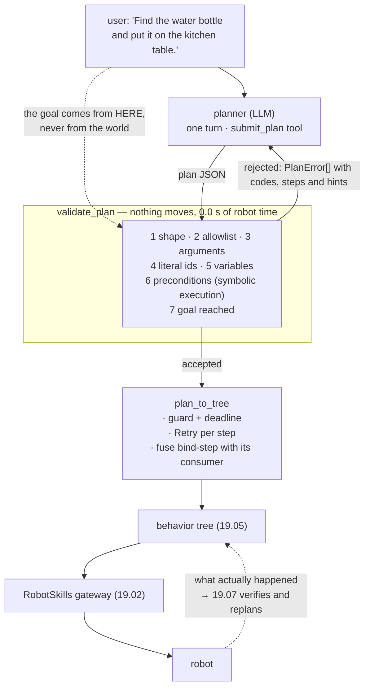

# 19.06 — Task planning and decomposition — LLM plans, validated execution

<!-- glance:start -->
<!-- generated by tools/build.py from curriculum/syllabus.yaml — edit the syllabus, not this block -->

| | |
|---|---|
| **Track** | Main path |
| **Difficulty** | Advanced |
| **Time** | 1 h 15 min |
| **Hardware** | none |
| **Software** | python |
| **Prerequisites** | [19.03 Tool calling — an LLM operating the simulated robot](19.03-tool-calling-sim-robot.md)<br>[19.05 Behavior trees](19.05-behavior-trees.md) |
| **Skip if** | Your LLM produces plans that are validated before execution. |

<!-- glance:end -->

## What you will learn

- Design a plan language small enough to be checked and expressive enough to be useful — including the one thing a planner cannot know: object ids.
- Validate a whole plan by symbolic execution, before any wheel turns, and return errors a model can act on.
- Run the repair loop: plan → validate → hand back the errors → replan, with the robot standing still throughout.
- Compile an accepted plan into the behavior tree of [19.05](19.05-behavior-trees.md), adding the recovery the plan language deliberately cannot express.
- State precisely what plan validation does *not* prove, and where the remaining failures must be caught.

## Why it matters

In [19.03](19.03-tool-calling-sim-robot.md) the model decided one step at a time. Fourteen model calls, thirty-five thousand input tokens, about twenty cents — and, more importantly, **nothing was reviewable**. Each call was checked against a schema in isolation; no one ever asked whether the sequence made sense. That is why the injected note on the kitchen wall worked: every individual call was valid, allowed and correctly executed, and the robot still put the bottle on the bed.

A plan changes what is possible, because a plan is an **artefact** rather than a conversation. An artefact can be checked before it is executed, shown to a human, diffed against the last one, stored with the run, and compiled into something with guards. This lesson builds that pipeline: one model call produces a plan, a deterministic validator accepts or rejects it with reasons, and only an accepted plan becomes a behavior tree.

It is also, measurably, about a twentieth of the cost. And it is honest about its limits: a validated plan is a plan that *could* work in a world you described correctly. Whether the bottle is actually in the kitchen is a question only the robot can answer, and that is [19.07](19.07-perception-action-loops.md).

<!-- prereqs:start -->
## Prerequisites

You need these first:

- [19.03 Tool calling — an LLM operating the simulated robot](19.03-tool-calling-sim-robot.md)
- [19.05 Behavior trees](19.05-behavior-trees.md)

### Optional prerequisite links

None.

Check your readiness: `python course.py why 19.06`
<!-- prereqs:end -->

## Concept

Ask a language model for a plan and you get something like this:

```text
1. Go to the kitchen
2. Pick up the water bottle
3. Go to the kitchen table
4. Put the bottle on the table
```

Perfectly sensible, and not executable. Step 2 names an object the robot has never seen. `pick` takes an `object_id` — `bottle-1` — and that id is issued by the *detector*, at run time, after the robot has looked. A planner that writes `pick("bottle-1")` has either memorised the simulator or invented the id; a planner that writes `pick("the water bottle")` has produced a call the schema rejects.

This is the central design problem of robot planning, and it has a clean solution: **variables**.

```json
{"goal": "the water bottle is on the kitchen_table", "steps": [
  {"skill": "navigate_to",    "args": {"place": "kitchen"}},
  {"skill": "detect_objects", "args": {}, "bind": "target", "label": "water bottle"},
  {"skill": "navigate_to",    "args": {"place": "$target"}},
  {"skill": "detect_objects", "args": {}, "bind": "target", "label": "water bottle"},
  {"skill": "pick",           "args": {"object_id": "$target"}},
  {"skill": "navigate_to",    "args": {"place": "kitchen_table"}},
  {"skill": "place",          "args": {"location": "kitchen_table"}}
]}
```

A `detect_objects` step may **bind** a variable to whatever it finds matching a label. Later steps refer to it as `"$target"`, and one rule says what a variable means where it appears: in `object_id` it is the detected object's id; in `place` or `location` it is the place where that object was seen. Seven steps, no invented ids, and every value that can only be known at run time is a hole rather than a guess.

Now look at what the plan language *cannot* say. No loops. No conditionals. No arithmetic. No "if it isn't there, try the living room". That is not a limitation you will regret — it is what makes the next section possible. **A language you can check is a language you deliberately made too small**, and the recovery you gave up is added back by the compiler, uniformly and in one place, rather than written differently by the model in every plan.

Two things a plan is good for, then, and they are why the extra machinery pays:

- **It can be checked.** Not "does this call have valid arguments", which [19.02](19.02-robot-skill-api.md) already does, but "does this *sequence* make sense" — does the robot hold something when it places it, has it looked before it picks, does the plan achieve what the user actually asked for?
- **It can be compiled.** Into a behavior tree with an e-stop guard, a deadline, and retries in the right scopes ([19.05](19.05-behavior-trees.md)).

> [!TIP]
> **Ask your teacher:** "Give me five plans for 'bring me the keys' — some valid, some subtly broken — and let me be the validator before I run yours."

## Technical explanation

### Level 1 — The validator: seven checks, in order

`validate_plan(raw, skills, goal)` returns either a `Plan` or a list of `PlanError`s. It never touches the robot. The checks run in order, cheapest and most structural first, and every one of them corresponds to a way real planners fail.

| # | Check | Code | A real example |
|---|---|---|---|
| 1 | shape: an object with `goal` and 1…12 `steps`, each with `skill` and `args` | `MALFORMED` | the model wrote prose, or 40 steps |
| 2 | every skill is in the allowlist | `UNKNOWN_SKILL` | `open_fridge`, `grasp` |
| 3 | arguments validate against **the same JSON Schema the model was given** | `INVALID_ARGUMENTS` | `place: "garage"`, `timeout_s: 900` |
| 4 | an `object_id` written as a literal | `LITERAL_OBJECT_ID` | `pick("bottle-1")` before looking |
| 5 | a variable used before anything binds it | `UNBOUND_VARIABLE` | `pick("$ghost")` |
| 6 | preconditions hold, by symbolic execution | `PRECONDITION` | place before arriving; pick with a full gripper |
| 7 | the plan achieves the user's goal | `GOAL_NOT_REACHED` | a valid plan that never places anything |

Check 3 is worth pausing on. The validator does not have its own idea of what `navigate_to` accepts — it calls `spec.input_schema()`, the same generated schema that went into the model's tool definitions. One source of truth means a place you delete from the map disappears from the model's enum *and* from the validator's accepted set in the same commit.

### Level 2 — Symbolic execution: preconditions without a robot

Check 6 is the one that earns the lesson. The validator walks the plan keeping an **abstract state** — everything it can know about the robot without running anything:

```python
@dataclass
class AbstractState:
    at: str | None = None                      # which named place the robot is standing at
    holding: str | None = None                 # which variable's object is in the gripper
    bound: dict[str, str | None] = ...         # variable -> the place it was seen from
    fresh: set[str] = ...                      # variables detected since the last navigate_to
    placed: list[tuple[str, str]] = ...        # (variable, surface), in order
```

Each skill has a transition:

- `navigate_to(place)` → `at = place`, and **`fresh.clear()`** — driving away makes every earlier detection stale.
- `detect_objects` with a `bind` → `bound[v] = at`, `fresh.add(v)`.
- `pick($v)` → requires `holding is None` and `v in fresh`; then `holding = v`.
- `place(location)` → requires `holding is not None` and `at == location`; then `placed.append(...)`, `holding = None`.

The `fresh` set is the interesting one, because it encodes a *physical* precondition — "the object is within the arm's 0.75 m reach" — as a purely syntactic property of the plan. The robot cannot pick something it saw from across the room, so the plan must contain a `detect_objects` for that variable *after* the last `navigate_to`. That is checkable, in a loop, in microseconds. Here it is catching the mistake:

```text
[PRECONDITION] step 4: $b was last seen from somewhere else: detect_objects again after
               arriving, so the object is in reach
```

Check 7, the goal check, is the one that closes the [19.03](19.03-tool-calling-sim-robot.md) attack. The goal — *a water bottle on the kitchen_table* — comes from the user's request. The validator asks whether the symbolic execution ever places an object with a matching label on that surface. A plan that quietly ends up placing it on the bed fails with `GOAL_NOT_REACHED`, no matter how the planner was persuaded to write it, because the goal was fixed **before** the robot's camera read anything.

That is worth stating as the design principle it is: *authority comes from the channel, not from the content*. The user's channel produced the goal; the camera produced data. A validator that compares one against the other cannot be talked out of it.

### Level 3 — The numbers: what planning costs, and what it does not buy

Measured on the same fetch task, with the same skills.

| | Step-by-step agent ([19.03](19.03-tool-calling-sim-robot.md)) | Plan, validate, execute |
|---|---|---|
| Model calls | 14 | **1** (2 with one repair) |
| Input tokens | ≈ 35,000 | ≈ 1,430 (≈ 3,000 with a repair) |
| Output tokens | ≈ 560 | ≈ 150 |
| Cost at Opus 5 list prices | ≈ **$0.19** | ≈ **$0.011** (≈ $0.023 with a repair) |
| Robot time on a *rejected* plan | n/a — mistakes are made in the world | **0.0 s** |
| Reviewable before execution | no | yes — 7 lines of JSON |

$$\text{cost}_\text{plan} = \frac{1{,}430}{10^6}\times 5 + \frac{150}{10^6}\times 25 = 0.0072 + 0.0038 \approx \$0.011$$

Seventeen times cheaper, and the interesting column is the second-to-last: a rejected plan costs **zero seconds of robot time**. Run `run_planner.py --plan bad_order` and the output ends *"NO VALID PLAN after 1 attempt(s). The robot has not moved: t = 0.0 s, skill calls = 0."* Compare that with the step-by-step agent, which discovers the same mistake by driving somewhere and trying.

Now the honest column, the one a good engineer asks for. What does *not* improve:

- The plan is **open loop** between validation and completion. Nothing re-derives the plan when the world turns out to be different.
- The validator's model of the world can be wrong. It knows the eleven places on the map; it does not know whether the bottle is in the kitchen.
- A plan that validates can still fail at every step, and the failure arrives later than it would have with a step-by-step agent, because nobody is watching in between.

Measure that too. `run_planner.py --object "red cup" --target sofa` produces a plan that passes **all seven checks** — and the red cup is on the living-room coffee table, not in the kitchen. The tree fails at **t = 14.1 s** after three detection attempts in the wrong room. Validation proved the plan was *well-formed and goal-directed*; it could not prove it was *true*. Closing that gap is [19.07](19.07-perception-action-loops.md), and the shape of the fix — check the world after every step, replan when it disagrees — is why this lesson comes first.

### Level 4 — Compiling a plan into a behavior tree

An accepted plan is a flat list. `plan_to_tree` turns it into a tree that has the properties a flat list cannot have: a guard that is re-checked continuously, a deadline that cancels a running goal, and retries in the right scopes.

```python
body = Sequence("Plan", memory=True, children=children)
root = Sequence("PlanTask", memory=False, children=[
    Check("EStopReleased?", lambda: not world.estop),
    SimTimeout("PlanDeadline", body, cfg.deadline_s, clock=lambda: world.t),
])
```

Every leaf is the same `SkillAction` the hand-written tree used, so the gateway's allowlist, validation, idempotency and logging apply unchanged ([19.02](19.02-robot-skill-api.md)) — and every leaf gets a `Retry`.

Then there is one rule that is genuinely a *compiler* decision, and it is the most interesting line in the module:

```python
fuse = step.bind is not None and nxt is not None and f"${step.bind}" in nxt.args.values()
```

**A step that consumes the variable the previous step bound is fused with it, under one `Retry`.** Without that rule, a retry of `pick` re-uses a detection the failure has already invalidated — the skill says so in its own message (*"the gripper closed on nothing; 'bottle-1' may have moved — detect it again"*) — and the retry comes back `OBJECT_NOT_FOUND` without attempting a grasp. This is exactly the failure predicted in [19.05](19.05-behavior-trees.md)'s knowledge check, and here it is prevented structurally, for every plan, rather than by asking the model to write its plans carefully.

The compiled tree for the seven-step plan:

```text
[-] PlanTask [✓]
    --> EStopReleased? [✓]
    -^- PlanDeadline [✓]
        {-} Plan [✓]
            -^- 1. navigate_to x2 [✓]
            -^- 2-3 x3 [✓]
                {-} 2-3. bind+navigate_to [✓]      <- detect + go to where it was seen
            -^- 4-5 x3 [✓]  -- 1 failure from 3
                {-} 4-5. bind+pick [✓]             <- re-detect + pick: a retry re-detects
            -^- 6. navigate_to x2 [✓]
            -^- 7. place x2 [✓]
```

Note what the model did **not** have to write: the retry counts, the guard, the deadline, the fusing. The plan says *what*; the compiler adds *how to survive*. That division is the same one as [19.01](19.01-why-llms-dont-drive-motors.md)'s layering, one level up: the deliberation layer proposes, the execution layer is responsible for robustness.

### The repair loop

A rejected plan is not a dead end — the errors were designed to be read by the thing that made them:

```python
messages.append(ToolResultsMessage((ToolResult(
    calls[0].id,
    json.dumps({"accepted": plan is not None, "errors": [str(e) for e in errors]}),
    is_error=plan is None), )))
```

Each error is a code, the offending step number, a message and a hint — the same anatomy as a `SkillResult`, for the same reason. `plan_and_repair` runs at most `max_attempts` rounds of plan → validate → replan, and the robot does not move during any of them. Set the limit low (three is plenty): a planner that cannot satisfy a validator in three tries is usually being asked for something the skill API cannot express, and the right output is a question to the human, not a fourth attempt.

> [!TIP]
> **Ask your teacher:** "Write me a plan that passes every one of the seven checks and is still a terrible idea, then explain which layer is supposed to catch it."

## Diagram



The symbolic execution of the good plan, step by step — this is the table the validator builds:

```text
step                                  at               holding   fresh      note
--------------------------------------------------------------------------------------------
 1 navigate_to(kitchen)               kitchen          -         {}         fresh cleared
 2 detect_objects bind=target         kitchen          -         {target}   bound at 'kitchen'
 3 navigate_to($target)               @target          -         {}         fresh cleared again
 4 detect_objects bind=target         @target          -         {target}   re-detected in reach
 5 pick($target)                      @target          target    {target}   OK: fresh + empty gripper
 6 navigate_to(kitchen_table)         kitchen_table    target    {}
 7 place(kitchen_table)               kitchen_table    -         {}         at == location: OK
                                                                            placed: (target, kitchen_table)
goal: a 'water bottle' on 'kitchen_table'  ->  target's label is 'water bottle'  ->  reached
```

Delete step 4 and step 5 fails: `target` is bound but not `fresh`, because step 3 drove away. That is the whole check, and it costs microseconds.

## Code

`19-llm-robot-agents/code/robot_agent/planning.py` holds the plan language, the validator, the compiler and an offline `MockPlanner`. `run_planner.py` is the runner.

The validator is pure standard library — no py_trees, no numpy, no model — so it is the piece you can lift into any project.

```bash
py 19-llm-robot-agents/code/run_planner.py                      # a good plan: validated, then run
py 19-llm-robot-agents/code/run_planner.py --plan literal_id    # rejected: an invented object id
py 19-llm-robot-agents/code/run_planner.py --plan hallucinated  # rejected: skills that do not exist
py 19-llm-robot-agents/code/run_planner.py --plan bad_order     # rejected: right skills, wrong order
py 19-llm-robot-agents/code/run_planner.py --plan sightseeing   # rejected: valid, but misses the goal
py 19-llm-robot-agents/code/run_planner.py --plan bad_order --repair    # errors go back, model replans
py 19-llm-robot-agents/code/run_planner.py --object "red cup" --target sofa   # valid plan, wrong world
py -m pytest 19-llm-robot-agents/code/tests/test_planning.py -q
```

Running it against a real model costs about a cent per plan and needs `pip install anthropic` and credentials:

```bash
py 19-llm-robot-agents/code/run_planner.py --llm anthropic --model claude-opus-5 --repair
```

The planner's only output channel is a tool, so the plan arrives schema-checked before the validator even sees it:

```python
def plan_tool_definition(skills: RobotSkills) -> JsonDict:
    return {"name": "submit_plan",
            "description": "Submit the complete plan for the requested task. Call this exactly once.",
            "input_schema": {"type": "object", "properties": {
                "goal": {"type": "string", ...},
                "steps": {"type": "array", "minItems": 1, "maxItems": MAX_STEPS, "items": {...}}},
                "required": ["goal", "steps"], "additionalProperties": False}}
```

The model also receives the six skill tool definitions — not to call them, but so it can read their schemas, preconditions and failure codes while planning. That is the same text the validator enforces, which is the whole reason a competent model usually gets it right on the first attempt.

## Exercise

### Exercise 19.06-E1 — Be the validator `[predict]`

Hardware: none.

For each of the four broken plans below, write down **every** error you expect — the code, the step number, and one line of why. Only then run `run_planner.py --plan <name>` and compare. Count what you missed and what you invented.

```text
literal_id    navigate_to(kitchen) · pick("bottle-1") · navigate_to(kitchen_table) · place(kitchen_table)
hallucinated  open_fridge() · navigate_to("garage") · grasp(target="water bottle")
bad_order     detect bind=target · pick($target) · place(kitchen_table) · navigate_to(kitchen_table)
sightseeing   navigate_to(kitchen) · detect bind=target · get_robot_state()
```

Then answer: `bad_order` produces exactly **one** error, even though two things are wrong with it. What is the second problem, and why does no check catch it — including check 6, which exists precisely to catch problems of that kind?

### Exercise 19.06-E2 — Write the validator `[coding]`

Hardware: none.

Implement `validate_plan(raw, skills, goal)` and the symbolic execution under it: `parse_plan` (shape), `substitute` (variables → schema-legal placeholders), and `apply_step` (preconditions and postconditions over an `AbstractState`). The tests pin all seven checks, the `fresh` rule, and the requirement that validation never calls a skill.

Check it: `python course.py check 19.06`

### Exercise 19.06-E3 — Validated is not correct `[simulation]`

Hardware: none.

1. Run `py 19-llm-robot-agents/code/run_planner.py --object "red cup" --target sofa`. It validates. Record what the tree does, at what simulated time it fails, and which node fails.
2. The failing leaf's feedback says `SUCCEEDED` while the node shows `✕`. Explain that in one sentence — what is the difference between "the skill worked" and "the step did its job"?
3. Which of the seven checks *could* have caught this, if the validator knew more? What would it have to know, and what is the cost of giving it that knowledge?
4. Write the two-sentence design rule you would give a colleague about what plan validation does and does not prove.
5. Run `--plan bad_order --repair` and compare the cost: how many model calls, how many seconds of robot time before the first wheel turns?

### Exercise 19.06-E4 — Extend the language `[design]`

Hardware: none.

The plan language has no conditionals. Users keep asking for "put the bottle on the kitchen table, or the counter if the table is full". Design the smallest extension that supports it, and pay the full price of the design:

1. The JSON shape of the new construct, and its addition to the `submit_plan` schema.
2. What symbolic execution must do with it — in particular, what `at`, `holding` and `fresh` are *after* a branch whose arms differ. (This is the question that makes the feature expensive. Answer it precisely.)
3. What the compiler emits for it, in behavior-tree terms.
4. One new `PlanError` code that becomes possible, with the plan that triggers it.
5. The honest recommendation: should karmel ship this, or is a Selector in the compiler (try A, else B) the better answer? Defend it in three sentences, and say what you would have to give up.

## Expected result

**19.06-E1.** The four rejections, exactly:

```text
literal_id    [LITERAL_OBJECT_ID] step 2: object_id='bottle-1' was written before the robot looked
              [PRECONDITION]      step 4: place needs the gripper to hold something
hallucinated  [UNKNOWN_SKILL]     step 1: 'open_fridge' is not an available skill
              [INVALID_ARGUMENTS] step 2: place: 'garage' is not one of [...]
              [UNKNOWN_SKILL]     step 3: 'grasp' is not an available skill
bad_order     [PRECONDITION]      step 3: the robot is at None, not at 'kitchen_table'
sightseeing   [GOAL_NOT_REACHED]  no step places a 'water bottle' on 'kitchen_table'
```

and each run ends *"NO VALID PLAN after 1 attempt(s). The robot has not moved: t = 0.0 s, skill calls = 0."*

Two details worth noticing. In `literal_id` the second error is a **consequence** of the first: because step 2's `pick` was rejected, the abstract gripper is still empty at step 4, so the `place` fails too. That is deliberate — a planner repairing the plan needs to see the downstream damage, not just the first mistake. In `sightseeing` there are no errors at all until check 7: every step is legal, the arguments are right, the preconditions hold. It is a plan that does nothing wrong and nothing useful, and only the goal check has an opinion about it. (Run it with `goal=None` and it is accepted, which is exactly right: without a stated goal there is nothing to compare against.)

The second problem in `bad_order`: step 2 picks `$target` after a detection taken from wherever the robot happened to start, with no `navigate_to` in front of it. Symbolically that is legal — the variable was bound since the last `navigate_to`, so it *is* `fresh`, and the gripper is empty — so check 6 has nothing to complain about. Physically, the bottle is metres away and `pick` would return `OUT_OF_REACH`. This is the limit of the technique stated precisely: **`fresh` is a syntactic approximation of a physical precondition.** It encodes "you must look again after driving", which is checkable, and it cannot encode "the object must be within 0.75 m", which depends on where things are. That residue is real and it is what [19.07](19.07-perception-action-loops.md) verifies at run time. Meanwhile the repair loop absorbs it anyway: the planner fixes what it was told about, resubmits, and a well-written plan puts a `navigate_to` before the detection because the *prompt* says to — the second general lesson being that **the first rejection is not a complete list.**

**19.06-E2.** `python course.py check 19.06` passes with no skipped tests.

**19.06-E3.** The plan is accepted — all seven checks pass — and the tree fails at **t = 14.1 s**:

```text
-^- 2-3 x3 [✕] -- final failure [status: 3 failure from 3]
    {-} 2-3. bind+navigate_to [✕]
        --> 2. detect_objects [✕] -- SUCCEEDED
        --> 3. navigate_to [-]
OUTCOME FAILURE   ticks 143   bindings: {}   robot time 14.1 s
```

(2) The skill succeeded — the detector ran and returned what it saw — but the *step* did not, because nothing it returned matched the label `red cup`. The leaf's `on_success` binder returns FAILURE: a step's job is to produce its postcondition, not to complete its call. This distinction is the one [19.07](19.07-perception-action-loops.md) is built on.

(3) Check 6 could have caught it, if the validator's world model included *where objects are believed to be* — a semantic map with object memory. The cost is that the validator now depends on a belief that can be stale: the cup was on the coffee table an hour ago. You would be trading a false rejection ("I believe it is not there") for a late failure ("it was not there"), and the right answer depends on how expensive driving is. Giving the validator that knowledge is the subject of [19.08](19.08-memory-and-world-model.md).

(4) The rule: *plan validation proves the plan is well-formed, executable in principle, and aimed at the goal the user stated. It proves nothing about whether the world matches the plan's assumptions — that requires looking, which is execution.*

(5) `--plan bad_order --repair` takes **two model calls** and 0.0 s of robot time before the first wheel turns: attempt 1 is rejected with one `PRECONDITION` error, attempt 2 submits the seven-step plan, which is accepted, and only then does the tree start ticking. Roughly 3,000 input tokens and $0.023 — against the step-by-step agent's 35,000 tokens and $0.19 for the same task.

**19.06-E4.** A defensible design: a step becomes `{"skill": ..., "args": ..., "else": [ ...steps ]}`, or a new pseudo-skill `{"try": [...], "else": [...]}`. The hard part is (2), and the honest answer is that symbolic execution now needs to carry a *set* of possible states, or to join the arms: `at` after a branch is known only if both arms end at the same place, `holding` only if both arms agree, and `fresh` must be the **intersection** of the two arms' fresh sets — anything else lets a plan pick an object that only one arm detected. The number of states doubles per branch, so you cap nesting at one level or you have written a model checker. (3) The compiler emits a `Selector` — try the first arm, fall back to the second. (4) A new code such as `AMBIGUOUS_STATE`: "after this branch the robot may or may not be holding something, so the following `place` cannot be validated" — triggered by a plan whose arms end differently.

(5) The recommendation is **no**: do not put conditionals in the plan language. Put the fallback in the compiler — `place` on the table, else on the counter — as a Selector, which is one rule, applies to every plan, and keeps symbolic execution linear. What you give up is real: the model can no longer express task-specific alternatives, so genuinely branching tasks have to be handled by replanning after a failure, which costs a model call. That is the right trade for a home robot, and the wrong one for a robot that is offline for hours — in which case you are building a PDDL planner, and you should use one that exists.

## Troubleshooting

### Symptom: the model's plans are rejected every time

Read *which* code dominates before changing anything. `UNKNOWN_SKILL` means the model is not seeing the tool definitions, or is reasoning from general knowledge about robots — check that `plan_once` passes `skills.tool_definitions()` alongside `submit_plan`. `LITERAL_OBJECT_ID` means the variable mechanism is not explained where the model will read it; it belongs in the system prompt *and* in `submit_plan`'s `bind` and `label` descriptions. `PRECONDITION` on `pick` almost always means the "detect again after arriving" rule is missing from the prompt — the model has no way to infer that driving invalidates a detection. And `MALFORMED` with "the planner did not submit a plan" usually means the model asked a clarifying question, which is correct behaviour, not a bug.

### Symptom: a plan validates and the robot does something surprising

Print the symbolic execution table and put the real trace next to it. The two will agree up to the step where the world disagreed with the plan's assumption — and that step is your answer. The three usual disagreements: the object is not where the plan assumed (add verification, [19.07](19.07-perception-action-loops.md)); a skill succeeded but did not achieve its purpose (the binder found no match — the leaf's status, not the skill's code, is what matters); or a retry re-used a stale binding (check that the fusing rule applied — the tree will show a node named `n-m. bind+<skill>` if it did).

### Symptom: the repair loop never converges

Look at attempt 2 and attempt 3. If they are *the same plan*, the model is not reading the errors: check that the rejection goes back as a `tool_result` referencing the `submit_plan` call id, with `is_error=True`, and that the errors are strings a reader can act on rather than a boolean. If the plans differ but each hits a new error, the plan language probably cannot express the task — cap the attempts and report to the human. If the errors cycle (A then B then A), two of your checks are contradicting each other, which is a bug in the validator, not in the model.

### Symptom: the validator accepts a plan you know is wrong

Ask which check *should* have caught it, and whether that check has the information it would need. Usually it does not: the validator knows the map and the skill schemas, and nothing else. Adding knowledge is a real option — object memory, a keep-out list, a battery estimate — but each addition makes the validator depend on a belief that can be stale, and a false rejection costs a model call plus a confused user. Add slowly, and prefer facts that are cheap to keep true.

## Common mistakes

- **Letting the plan contain object ids.** The planner cannot know them. Either it hallucinates or it memorises the test fixture, and both look fine until the world changes.
- **Validating steps in isolation.** Schema validation per call is [19.02](19.02-robot-skill-api.md). Plan validation is about the *sequence*, and skipping it is how a robot places something it is not holding.
- **Taking the goal from the plan.** The `goal` field the model wrote is the model's *claim*. The goal you validate against must come from the user's request; otherwise check 7 is a model grading its own homework.
- **Making the plan language expressive.** Loops and conditionals are one afternoon to add and a permanent tax on every check you write afterwards. Push recovery into the compiler.
- **Compiling a bind step and its consumer separately.** A retry then re-uses a detection the failure invalidated. Fuse them.
- **Treating a validated plan as a correct plan.** It is a well-formed intention. The world has not been consulted.
- **An unbounded repair loop.** Three attempts, then ask the human. Each attempt costs money and the fourth is rarely different from the third.

## Knowledge check

1. Why can a plan not contain `pick("bottle-1")`, and what replaces it?
   <details><summary>Answer</summary>

   Object ids are issued by the detector at run time; before the robot looks, no id exists. A planner that writes one has either memorised a fixture or invented it. It is replaced by a variable: a `detect_objects` step carries `"bind": "target"` and `"label": "water bottle"`, later steps write `"$target"`, and the compiler substitutes the detected object's id (in `object_id`) or the place it was seen (in `place`/`location`). The validator reports a literal id as `LITERAL_OBJECT_ID` with a hint that names the fix.
   </details>

2. What does the `fresh` set model, and which physical fact does it stand for?
   <details><summary>Answer</summary>

   `fresh` holds the variables detected since the last `navigate_to`. It stands for `pick`'s precondition "the object is within the arm's 0.75 m reach, and was detected recently" — because driving away makes a detection useless for grasping. Encoding it syntactically means "you must re-detect after arriving" becomes a check the validator runs in microseconds, instead of an `OUT_OF_REACH` discovered after a 9-second drive.
   </details>

3. The `sightseeing` plan passes checks 1–6 and fails check 7. What is it, and why does it pass with `goal=None`?
   <details><summary>Answer</summary>

   It navigates to the kitchen, detects the bottle, and reads the robot state — every step legal, every argument valid, every precondition satisfied, and the task not attempted. Check 7 compares the symbolic execution's `placed` list against the goal *the user stated* and finds nothing matching, so `GOAL_NOT_REACHED`. With `goal=None` there is nothing to compare against, so it is accepted — correctly: "is this plan goal-directed" is only a question when a goal was supplied.
   </details>

4. How does the goal check defend against the injected note from [19.03](19.03-tool-calling-sim-robot.md)?
   <details><summary>Answer</summary>

   The goal is extracted from the user's request *before* the robot's camera reads anything, and the validator compares the plan against that goal. A plan that places the bottle on the bed fails `GOAL_NOT_REACHED` regardless of how persuasive the note was. The principle is that authority comes from the channel, not the content: the user channel produced the goal, the camera produced data, and a deterministic comparison between them cannot be argued with. The defence is incomplete on its own — a mid-execution change is [19.07](19.07-perception-action-loops.md)'s problem and the full treatment is [19.09](19.09-agent-safety-boundaries.md) — but it closes this attack.
   </details>

5. Predict: the compiler stops fusing bind steps with their consumers, and you run with `--grasp-p 0.5`. What happens?
   <details><summary>Answer</summary>

   The first grasp fails. That failure nudges the object and clears its detection (`last_detections.pop`), so the `Retry` on the `pick` leaf re-runs `pick` with a binding the world no longer supports and gets `OBJECT_NOT_FOUND` — twice, without a second real grasp attempt — and the plan fails. This is measurable: the course's test `test_a_failed_grasp_re_runs_the_detection_that_bound_the_variable` asserts that no `pick` in the log ends `OBJECT_NOT_FOUND`, and it fails when the fusing rule is removed. A retry that does not re-establish the precondition is not a retry.
   </details>

6. One planning call is about $0.011; the step-by-step agent is about $0.19. Name two things the expensive version gives you that the cheap one does not.
   <details><summary>Answer</summary>

   It reacts: every tool result goes back to the model, so a surprise — the object somewhere unexpected, a blocked door, a failed grasp — produces a new decision rather than a failed step. And it handles tasks the plan language cannot express: anything needing a conditional, a loop, or a judgement made from something the robot only learns halfway through. The right architecture is usually both: plan for the common case, and fall back to step-by-step (or replan) when execution disagrees — [19.07](19.07-perception-action-loops.md).
   </details>

7. Why does the validator use `spec.input_schema()` rather than its own table of what each skill accepts?
   <details><summary>Answer</summary>

   So there is one source of truth. The same generated schema goes into the model's tool definitions, the gateway's argument check and the plan validator — so removing a room from the map shrinks the model's enum, the gateway's accepted set and the validator's accepted set in one commit. A separate table is a second thing to update, and the day it drifts, the validator accepts a plan the gateway will refuse mid-execution, which is the worst place to find out.
   </details>

8. A colleague proposes skipping the validator: "the model is good, and the gateway checks every call anyway." What do they lose?
   <details><summary>Answer</summary>

   Four things the gateway structurally cannot provide. Sequence correctness — the gateway sees one call at a time and cannot know that `place` comes before the robot arrives. Goal alignment — the gateway has never seen the user's request. Zero-cost failure — the gateway's rejection arrives after the robot has driven somewhere, the validator's before it moves. And reviewability — a plan can be shown to a human, diffed and stored; a stream of accepted calls cannot be reviewed before the fact. The gateway is a *per-call* check and remains necessary; it is not the same kind of check.
   </details>

## Practical challenge

Build a **plan reviewer**: take the pipeline from this lesson and make the plan a first-class artefact that a human can approve.

1. Store every plan as JSON next to its run, with the user's request, the goal the validator used, the validation result and — after execution — the tree's final status and the skill log. One directory per run.
2. Add a `--confirm` mode: print the accepted plan as numbered natural-language steps (*"1. Drive to the kitchen. 2. Look for a water bottle and remember it as $target…"*), then require a typed `yes` before the tree is built. Wire the same `CancelToken` so a `no` is indistinguishable from an operator cancel.
3. Add an eighth check of your own, and defend it. Candidates: at most one `place` per plan; no `navigate_to` to a place on a keep-out list; the plan's estimated robot time (from the skills' default timeouts) under a budget; no step after the goal is achieved.
4. Add a `--diff` mode that shows what changed between attempt *n* and attempt *n+1* of a repair loop, step by step. Run `--plan bad_order --repair` and read your own output.
5. Evaluate it: at least eight plans (four valid, four broken in different ways), each run five times over different seeds. Report per plan — accepted or rejected with codes, model calls, robot seconds, and execution outcome judged from the **world state**. Include at least one plan that validates and fails in the world, and say which layer should have caught it.

> [!CAUTION]
> **Safety:** the moment a plan runs on hardware, `--confirm` is not a nicety. Read the plan out loud before typing yes, keep the e-stop in reach, and give the compiled tree a deadline short enough that you are willing to watch it expire ([SAFETY.md](../SAFETY.md), [14.11](../14-robotic-arm/14.11-arm-safety.md)).

Acceptance criteria: the stored artefact is enough to reconstruct a run a week later without the transcript; your eighth check rejects at least one plan a model actually produced, not one you wrote to fail it; the evaluation reports the world state rather than the model's summary; and you can state, for every failure in the table, whether it belonged to the validator, the compiler or the world.

## You can skip this if…

Answer knowledge-check questions 2, 4 and 8 correctly without looking, and you can take a skill API of your own, define a plan language over it, and list the preconditions you would check by symbolic execution — including at least one that encodes a physical fact as a syntactic property, the way `fresh` does. You can also state, in one sentence each, what plan validation proves and what it does not.

`python course.py skip 19.06 --reason "My LLM produces plans that are validated against the user's goal and compiled before anything moves"`

## Go deeper

- ProgPrompt (Singh et al., 2022): https://arxiv.org/abs/2209.11302 — plans generated as Python-like programs with `assert` statements for preconditions and explicit recovery. The closest published relative of this lesson's validator, with the checks inside the plan instead of outside it.
- SayPlan (Rana et al., 2023): https://arxiv.org/abs/2307.06135 — 3D scene graphs as the planner's world state, with an iterative replanning loop driven by a scene-graph simulator. Read it for what a richer world model buys the validator, and what it costs.
- BTGenBot (Izzo, Bardaro & Matteucci, 2024): https://arxiv.org/abs/2403.12761 — an LLM generating BehaviorTree.CPP XML directly. Read it against this lesson's choice to generate a *flat plan* and compile it, and decide which you would defend in review.
- SayCan (Ahn et al., 2022): https://arxiv.org/abs/2204.01691 — the original "LLM plans over a fixed skill library", with feasibility scored outside the model. The affordance score is the ancestor of check 6.
- Code as Policies (Liang et al., 2022): https://arxiv.org/abs/2209.07753 — the maximal-expressiveness end of the spectrum: the model writes real code. Compare what it gains with what it gives up on checkability.
- Nav2 behavior trees: https://docs.nav2.org/jazzy/getting_started/nav2_behavior_trees/ — the XML your compiler would emit on a real robot, and the node library it can compose.
- py_trees documentation: https://py-trees.readthedocs.io/ — composites, decorators and the blackboard used by `plan_to_tree`.

## Progress checkpoint

- [ ] I can design a plan language with variables for the values only the robot can know.
- [ ] I can validate a plan by symbolic execution and return errors a model can repair.
- [ ] I can run the plan → validate → repair loop and say what it costs, in tokens and in robot seconds.
- [ ] I can compile a plan into a behavior tree and name the recovery the compiler adds.
- [ ] I can state exactly what plan validation does not prove, and which lesson covers the rest.

`python course.py complete 19.06` (exercises done) · `python course.py master 19.06` (challenge done) · `python course.py struggle 19.06 "what was hard"`

Next: [19.07 — Perception–action loops — verifying every step](19.07-perception-action-loops.md).
