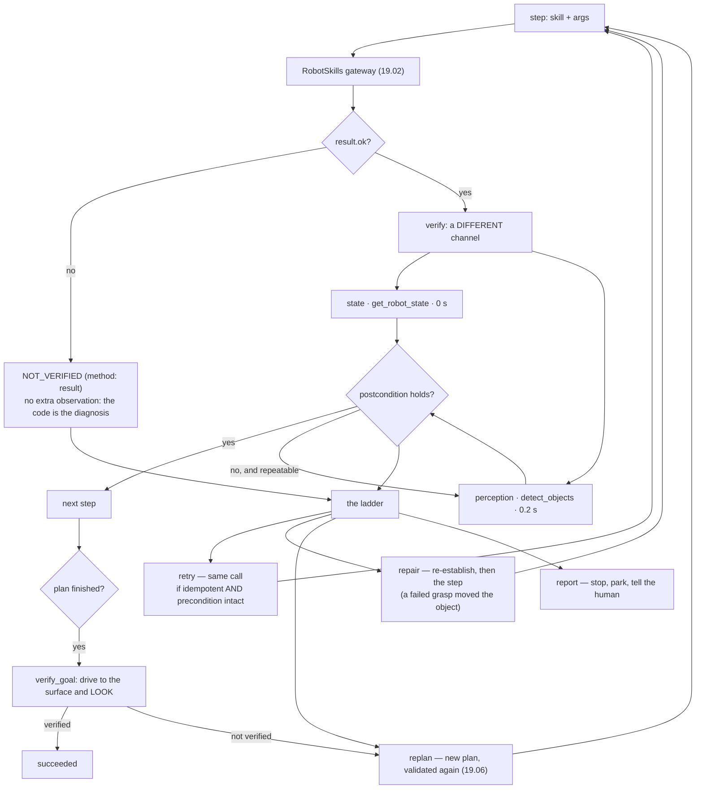

# 19.07 — Perception–action loops — verifying every step

<!-- glance:start -->
<!-- generated by tools/build.py from curriculum/syllabus.yaml — edit the syllabus, not this block -->

| | |
|---|---|
| **Track** | Main path |
| **Difficulty** | Advanced |
| **Time** | 1 h |
| **Hardware** | none |
| **Software** | python, ros2 |
| **Prerequisites** | [19.06 Task planning and decomposition — LLM plans, validated execution](19.06-task-planning-decomposition.md)<br>[13.16 From detection to a 3D position in the map frame](../13-computer-vision/13.16-detection-to-map-position.md) |
| **Skip if** | Your agent checks the world after every action and replans on failure. |

<!-- glance:end -->

## What you will learn

- Write a verifier that decides whether a skill's postcondition holds, using a different channel from the one that did the work.
- Choose between the three channels — the return code, proprioception and perception — and say what each costs and what each cannot see.
- Build the repair ladder: retry, repair, replan, report, with a budget on every rung and a rule for which rung to start on.
- Measure a closed loop against the same task run open loop: robot seconds spent verifying, failures caught, replans triggered.
- Finish a task by *looking at the goal*, and explain why an agent that reports success from its own transcript is grading its own homework.

## Why it matters

[19.06](19.06-task-planning-decomposition.md) ended with an honest admission. A validated plan is a
plan that *could* work in a world you described correctly; whether the bottle is actually in the
kitchen is a question only the robot can answer. The last run of that lesson — a plan that passed
all seven checks and then failed in the world at t = 14.1 s — is where this one starts.

The gap is narrower than "the plan was wrong" and much more interesting. Run the fetch task open
loop and watch what happens:

```text
t= 26.22  5.pick     GRASP_FAILED
t= 35.14  6.navigate_to   SUCCEEDED      <- driving to the table with an empty gripper
t= 35.14  7.place    NOT_HOLDING_OBJECT
```

Nine seconds of driving happened *after* the task had already failed, because nothing between step
5 and step 6 asked whether step 5 had worked. That is the cheap version of the problem. The
expensive version is the opposite: a skill that reports `SUCCEEDED` when nothing happened. A
gripper with no force sensor closes on air and reports a grasp. A costmap declares the goal reached
a metre early. Both are ordinary hardware faults, both produce a transcript that looks perfect, and
neither is visible to a plan validator, a behavior tree, or a model reading tool results.

So this lesson adds the half that was missing: after every step, an **independent observation**
decides whether the world changed, and a **repair ladder** decides what to do when it did not. The
result is the executive layer that [19.08](19.08-memory-and-world-model.md) gives a memory,
[19.09](19.09-agent-safety-boundaries.md) puts a safety layer under, and
[20.01](../20-final-robot/20.01-final-architecture.md) makes the spine of the final robot.

<!-- prereqs:start -->
## Prerequisites

You need these first:

- [19.06 Task planning and decomposition — LLM plans, validated execution](19.06-task-planning-decomposition.md)
- [13.16 From detection to a 3D position in the map frame](../13-computer-vision/13.16-detection-to-map-position.md)

### Optional prerequisite links

None.

Check your readiness: `python course.py why 19.07`
<!-- prereqs:end -->

## Concept

Three different things can tell you what the robot just did, and they disagree.

**The return code.** `pick` came back `SUCCEEDED`. That is the arm's report on itself: the motion
planner found a trajectory, executed it, and the gripper controller reached its commanded position.
Every one of those can be true with an empty hand.

**Proprioception.** `get_robot_state` says `holding: "bottle-1"`. That is a different subsystem —
the gripper's own sensing, the arm's joint states, the base's odometry — and it is free: no motion,
no camera, zero simulated seconds. It catches the case where the skill's internal bookkeeping and
the robot's state have come apart.

**Perception.** `detect_objects` looks. That costs 0.2 s and it is the only channel with an opinion
that does not come from the robot's own machinery. It catches the case where *both* of the above
are wrong — the gripper's limit switch is stuck closed, the state says "holding", and the bottle is
visibly still standing on the counter.

The design rule follows immediately, and it is the one sentence to take away:

> **A verifier must not use the channel that did the work.**

This is not a robotics idea; you already apply it. You do not assert that a write succeeded by
checking that `INSERT` returned without throwing — you read the row back, and you read it through a
path that does not share the write's cache. The robotics part is only that here the "read back"
costs 0.2 seconds of a battery, so you have to choose which reads are worth taking.

And there is a second distinction that sounds pedantic until it bites:

> **"The skill worked" and "the step did its job" are different questions.**

`detect_objects` returning `SUCCEEDED` means the detector ran. If the step existed to find a red
cup and there is no red cup in the result, the *step* failed while the *skill* succeeded. The
knowledge check in [19.06](19.06-task-planning-decomposition.md) already made you notice this; now
it becomes a line of code with a status.

> [!TIP]
> **Ask your teacher:** "Give me five robot failures and, for each, tell me which of the three
> channels would have caught it and which would have been fooled."

## Technical explanation

### Level 1 — A verification is a value, not an assertion

```python
@dataclass(frozen=True)
class Verification:
    skill: str
    ok: bool
    code: str        # VERIFIED | NOT_VERIFIED | UNCHECKABLE | SKIPPED
    method: str      # "result" | "state" | "perception" | "-"
    message: str
    observed: JsonDict          # what was actually seen — this is the evidence
    cost_s: float               # simulated robot seconds this check spent
    repeatable: bool = True     # is looking again worth it? (see Level 3)
```

`method` is there so that a log answers "how do you know?" a week later. `cost_s` is there so you
can add up what verification costs and decide whether it was worth it — in this module it comes to
0.6 s out of 43.9 s, **1.4 % of robot time**, which is the number that ends the argument.

`UNCHECKABLE` is not a failure. `list_places` has no postcondition in the world; a `detect_objects`
step with no label to match has nothing to check. Recording "there was nothing to verify" is
different from recording "it verified", and a harness that conflates them will report a green
column for a robot nobody is watching.

The four verifiers in one table:

| Skill | Postcondition | Channel | Cost | What it cannot see |
|---|---|---|---|---|
| `navigate_to` | the robot is at the place | state: `at_place`, or within 0.30 m | 0 s | that the place itself moved (furniture) |
| `pick` | the object is in the gripper | state: `holding == object_id` | 0 s | a gripper sensor that lies |
| `pick` (strong) | …and it is no longer in the scene | perception | 0.2 s | an object hidden behind the robot's own arm |
| `place` | gripper empty **and** object on the surface | state + perception | 0.2 s | that it will stay there |
| `detect_objects` | a detection matching the step's label | the result itself | 0 s | that the label is the right one |

### Level 2 — The ladder: retry, repair, replan, report

When a verification fails, the executive has four options, and they differ by a factor of a hundred
in cost. Take the cheapest one that can possibly work.

| Rung | What it does | Cost | Use when |
|---|---|---|---|
| **retry** | the same call, unchanged | one skill's time | the failure was transient and the *precondition still holds* |
| **repair** | re-establish the precondition, then the step | a few seconds | the failure invalidated what the step was planned from |
| **replan** | throw the plan away, make a new one | one model call + everything after it | the world is not what the plan assumed |
| **report** | stop, park safely, tell the human | the task | nothing above worked, or a budget is gone |

The interesting rung is *repair*, because it is the one people leave out. A failed grasp nudges the
object and invalidates the detection that chose it — the skill says so in its own message
(*"the gripper closed on nothing; 'bottle-1' may have moved — detect it again"*). Retrying `pick`
unchanged then returns `OBJECT_NOT_FOUND` without attempting a second grasp. So:

```python
INVALIDATES_BINDING = frozenset({"GRASP_FAILED", "OBJECT_NOT_FOUND"})

invalidated = step.skill == "pick" and (result.code in INVALIDATES_BINDING
                                        or v.code == "NOT_VERIFIED")
if attempt < budget and not invalidated and idempotent:
    return "retry"
```

This is the [19.06](19.06-task-planning-decomposition.md) fusing rule again — a bind step and its
consumer retried together — but now it is a run-time decision with a reason attached rather than a
compile-time transformation, which means it also covers the case where the *verification* failed
rather than the call.

The `idempotent` term is the other half, and it comes straight out of the skill contracts of
[19.02](19.02-robot-skill-api.md). `place` declares `idempotent=False`. A `place` that is not
verified must never be retried: the gripper is already open, and the second call returns
`NOT_HOLDING_OBJECT` — which is not a second attempt, it is a different failure that hides the
first one. The API said so; the executive is the first component that has to believe it.

### Level 3 — Looking again, and the trap in it

A detector that misses 8 % of what is in front of it makes a verifier that fails 8 % of the time on
a perfectly good step. Left alone, that is a replan every twelve steps for no reason. Two looks take
it to 0.6 % for 0.2 s:

$$P(\text{false alarm after } n \text{ looks}) = p_\text{miss}^{\,n} = 0.08^2 = 0.0064$$

So the executor loops. And here is the trap, which is worth the whole section: **it depends on the
polarity of the check.**

- `place` fails when it *does not see* the object it expects. A second look removes a miss. Loop.
- `pick` fails when it *still sees* the object that should be in the gripper. A second look can only
  miss it — and a miss reads as success. Looping here converts a real failure into a pass.

```python
repeatable: bool = True   # False on the pick-still-sees-it verification
...
while not v.ok and v.repeatable and v.method == "perception" and looks < cfg.looks:
```

I found this by writing the loop without the flag: the blind-gripper test started passing, which is
exactly the kind of "fix" that makes a safety mechanism decorative. If a check's failure signal is
"the sensor detected something", repeating it weakens the check. Write that down on your own
verifiers before you add retries to them.

### Level 4 — Implementation: the executor

```python
while i < len(plan.steps):
    step = plan.steps[i]
    if world.estop:            return "estop", ...
    if t - t0 > cfg.deadline_s: return "deadline", ...
    budget = cfg.looks if step.bind else cfg.retries
    verdict, situation = self._do_step(plan, i, step, report, budget)
    if verdict == "ok":              i += 1;  continue
    if verdict == "repair_pick" and repairs.get(i, 0) < cfg.retries:
        repairs[i] += 1;  i -= 1;    continue      # back to the step that bound the variable
    return "replan", ..., situation
```

Four things are deliberate.

**Every rung has a counter.** `repairs[i]` bounds the repair loop, `cfg.retries` bounds retries,
`cfg.max_replans` bounds replans, `cfg.deadline_s` bounds the whole thing. An unbounded recovery
mechanism is an infinite loop with good intentions.

**The e-stop and the deadline are checked between steps, every step**, not once at the top. This is
the same reactivity a behavior tree gets from a `Sequence(memory=False)` guard
([19.05](19.05-behavior-trees.md)); here it is a `while` loop, and the property is the property, not
the implementation.

**`visited` records places the robot was *observed* to reach**, not places `navigate_to` claimed.
It feeds the replanner's search order, and seeding a search with a room the robot never entered is
a bug that hides for months.

**A replan produces a whole new plan**, not a patch. It goes through the validator of
[19.06](19.06-task-planning-decomposition.md) like any other plan. Patching a plan in place means
the thing that runs was never checked as a whole.

### The last measurement: verifying the goal

```python
def verify_goal(skills, goal, cfg):
    if state["at_place"] != goal.surface:
        skills.call("navigate_to", {"place": goal.surface})
    hits = [d for d in look(skills)
            if d["near_place"] == goal.surface and label_matches(d["label"], goal.label)]
```

The executor's last act is to go and look at the goal. This is the single most valuable line in the
module and it is worth being blunt about why: **every other check in modules 19.02–19.09 asks
whether a component behaved; only this one asks whether the user got what they asked for.**

It is also the one that makes the open-loop comparison brutal. Run the same plan with
`--verify none`: every step returns, the robot drives to the table, `place` fails with
`NOT_HOLDING_OBJECT`, and the run ends `goal_not_verified` — *"no 'water bottle' visible on
'kitchen_table'"* — with the bottle still on the counter. The verification cost 0.4 s. Without it
the agent would have reported "completed" and a human would have found the bottle later.

> [!TIP]
> **Ask your teacher:** "Which of my verifiers would still pass if the robot's camera were
> disconnected and returned an empty list every time? What should that case return instead?"

## Diagram



The three channels, and what each one is blind to:

```text
                 what the arm    what the robot    what the camera
                 reports         senses            sees
  --------------------------------------------------------------------
  healthy        SUCCEEDED       holding: bottle-1  bottle gone from
                                                    the counter          -> verified
  phantom grasp  SUCCEEDED       holding: null      bottle on counter    -> caught by STATE   (0 s)
  blind gripper  SUCCEEDED       holding: bottle-1  bottle on counter    -> caught by CAMERA  (0.2 s)
  short nav      SUCCEEDED       at_place: null     (n/a)                -> caught by STATE   (0 s)
                                 3.42 m from goal
  camera dead    SUCCEEDED       holding: bottle-1  nothing detected     -> UNDECIDABLE: the
                                                                            check must say so,
                                                                            not say "verified"
```

## Code

`19-llm-robot-agents/code/robot_agent/verify.py` holds the verifiers, the fault injector, the
replanners and the closed-loop executor. `run_closed_loop.py` is the runner. Everything is offline:
the plan comes from the `MockPlanner` of [19.06](19.06-task-planning-decomposition.md) and the
replanner is deterministic.

```bash
py 19-llm-robot-agents/code/run_closed_loop.py                     # verified execution
py 19-llm-robot-agents/code/run_closed_loop.py --verify none       # open loop, for comparison
py 19-llm-robot-agents/code/run_closed_loop.py --verify state      # proprioception only
py 19-llm-robot-agents/code/run_closed_loop.py --fault phantom_grasp
py 19-llm-robot-agents/code/run_closed_loop.py --fault blind_gripper
py 19-llm-robot-agents/code/run_closed_loop.py --fault blind_gripper --verify state
py 19-llm-robot-agents/code/run_closed_loop.py --fault short_nav
py 19-llm-robot-agents/code/run_closed_loop.py --object "red cup" --target sofa
py 19-llm-robot-agents/code/run_closed_loop.py --object "red cup" --target sofa --no-replan
py -m pytest 19-llm-robot-agents/code/tests/test_verify.py -q
```

### The fault injector

Verification is insurance, and you cannot price insurance without claims. `FaultySkills` wraps the
gateway and lies in one specific, realistic way:

```python
if self.fault in ("phantom_grasp", "blind_gripper") and name == "pick":
    if self.skills.world.holding is None:
        self.lies += 1
        return SkillResult("pick", True, "SUCCEEDED", f"holding '{target}'", ...)
```

- `phantom_grasp` — a gripper with no force sensor closing on air. `get_robot_state` still tells the
  truth, so proprioception catches it at zero cost.
- `blind_gripper` — the same, *and* the limit switch that would have noticed is the thing that
  broke, so `get_robot_state` agrees with the lie. Only the camera catches it.
- `short_nav` — the costmap declared the goal reached a metre early.

Each fault is caught by exactly one channel, which is how you justify paying for the second one.

### The replanner

```python
class SearchReplanner:
    def replan(self, s: Situation) -> Plan | None:
        if s.step.skill not in ("detect_objects", "pick"):
            return None
        room = next((r for r in self.rooms if r not in s.visited), None)
        ...
```

Deterministic, offline, and it covers the commonest real failure: the object is not where the plan
assumed. Note the first line — it returns `None` for a `navigate_to` that could not be verified,
because a navigation stack that reports arrival from three metres away is not a planning problem and
replanning around it would hide a broken robot. `LLMReplanner` is the expensive alternative: it
appends a situation report to the original task and asks the planning model again, at about a cent
and several seconds per call, which is exactly why it is the last rung.

## Exercise

### Exercise 19.07-E1 — Predict the channel `[predict]`

Hardware: none.

Before running anything, fill in this table from first principles. For each fault, say whether the
run will succeed, which channel (if any) catches the lie, and at roughly what simulated time.

```text
                              --verify none    --verify state    --verify perception
  no fault
  --fault phantom_grasp
  --fault blind_gripper
  --fault short_nav
```

Then run the nine combinations and compare. For every cell you got wrong, write one sentence saying
what you assumed about the robot that is not true.

### Exercise 19.07-E2 — Write the verifiers and the ladder `[coding]`

Hardware: none.

Implement `verify_navigate`, `verify_pick`, `verify_place`, `verify_detect`, `verify_step`,
`choose_repair` and `should_look_again`. The tests inject the three faults above and pin the rules
that matter: a failed call is diagnosed without spending robot time, a non-idempotent skill is never
retried, a failed grasp skips the retry rung, and the `pick` perception check is not repeatable.

Check it: `python course.py check 19.07`

### Exercise 19.07-E3 — What verification costs, and what it buys `[simulation]`

Hardware: none.

1. Run the default and record: total robot seconds, seconds spent verifying, and the percentage.
2. Run `--verify none` on the same task. It is faster. Explain, in one sentence, why "faster" is the
   wrong word for what happened.
3. Run `--fault blind_gripper` and `--fault blind_gripper --verify state` and put the two traces
   side by side. Both fail. At what simulated time does each *discover* that it has failed, and how
   many metres does the robot drive between the lie and the discovery?
4. Run `--object "red cup" --target sofa` with and without `--no-replan`. Report the robot time for
   each, and the time at which the `--no-replan` version gives up. Compare with
   [19.06](19.06-task-planning-decomposition.md)'s open-loop run of the same task (it failed at
   t = 14.1 s).
5. Now the design question. Verification costs 0.6 s per task here because the apartment is small
   and `detect_objects` takes 0.2 s. On the real robot, a detection is 0.3–1.0 s
   ([13.15](../13-computer-vision/13.15-vision-in-ros2.md)) and a task is minutes. Which of the four
   verifiers would you drop first, and what is the failure you are accepting in exchange? Name it.

### Exercise 19.07-E4 — The verifier that cannot decide `[debugging]`

Hardware: none.

A camera cable works loose. `detect_objects` still returns `SUCCEEDED` — with an empty list, every
time.

1. Walk through `verify_pick`, `verify_place` and `verify_goal` with that detector and write down
   what each returns. Two of the three now return something dangerously wrong. Which, and why?
2. Simulate it: construct a `HomeWorld` whose objects list is empty, run the fetch task with
   `--verify perception` in your head (or in code), and confirm your answer.
3. Design the fix. `Verification` has `ok`, and codes `VERIFIED`, `NOT_VERIFIED`, `UNCHECKABLE`.
   Which code should "the sensor I need is not producing data" use, what should the executive do
   with it, and why is that different from both a pass and a fail?
4. Write the health check that makes the difference detectable *before* the task starts — in one
   sentence, using only the skills in the API.
5. State the general rule in one sentence, in a form you would put in a code review comment.

## Expected result

**19.07-E1.** The table, from the runs (seed 1):

```text
                          --verify none              --verify state           --verify perception
no fault        goal_not_verified, 35.5 s      succeeded, 43.5 s        succeeded, 43.9 s
                (one grasp failed, nobody      (state catches the       (0.6 s verifying,
                 noticed until the goal check)  failed grasp: repair)    1.4 % of robot time)
phantom_grasp   goal_not_verified, 32.5 s      caught at t=23.2 by      caught at t=23.4 by
                (1 lie, never detected)         STATE, then replans      STATE, then replans
blind_gripper   goal_not_verified, 32.5 s      NOT caught: fails at     caught at t=23.4 by
                                                place, t=32.1 s          the CAMERA
short_nav       fails immediately (no path      caught at t=0.00,       caught at t=0.00,
                 progress at all)                0 s of robot time        0 s of robot time
```

Two cells are the lesson. `blind_gripper --verify state` is the one where proprioception *agrees
with the lie*: the run proceeds happily through `pick` and `navigate_to`, and the failure surfaces
nine seconds later at `place` with `NOT_HOLDING_OBJECT` — a confusing error far from its cause. And
`short_nav` is caught at **t = 0.00 s for zero cost**, because a state read is free: the cheapest
verifier in the set catches the most dangerous fault class.

The default run with faults off also repays reading: at t = 26.22 s a real `GRASP_FAILED` happens,
the ladder chooses `repair` (not `retry`), step 4's detection re-runs at t = 26.42 s, and the second
`pick` succeeds at t = 31.12 s. Total cost of the recovery: 4.9 s.

**19.07-E2.** `python course.py check 19.07` passes with no skipped tests.

**19.07-E3.**

(1) 43.9 s total, **0.6 s verifying — 1.4 %**. Three perception checks at 0.2 s each; every state
check is free.

(2) `--verify none` finishes in 35.5 s and the bottle is on the counter. It is not faster, it is
*shorter*: it did less of the task. Comparing the wall time of a run that succeeded with one that
failed is the most common way agent benchmarks lie to their authors, and it is why the harness in
[19.10](19.10-ros2-for-agents-mcp.md) reports time **and** success from the world state, never one
without the other.

(3) `--fault blind_gripper` (perception) catches the lie at **t = 23.42 s**, immediately after the
`pick` call, with the robot standing still at the counter. `--verify state` does not catch it: the
run continues, drives to the kitchen table — **8.9 s and about 2.6 m** — and discovers the problem
at **t = 32.14 s** as `NOT_HOLDING_OBJECT`. The distance between a fault and its discovery is the
real cost of a weak verifier, and it is measured in metres of a robot doing the wrong thing.

(4) With replanning: **succeeded at 54.3 s**, one replan, three failed verifications caught (three
detections in the kitchen that found no red cup). With `--no-replan`: fails at **t = 14.1 s** with
*"step 2 (detect_objects) could not be repaired and there is no replanner"* — the same instant
[19.06](19.06-task-planning-decomposition.md)'s tree failed, which is the point: verification tells
you *that* the plan was wrong at the earliest possible moment; replanning is what does something
about it. 40 extra seconds bought a completed task.

(5) A defensible answer: drop the **perception half of `verify_pick`** first and keep the state
half. You are then accepting the blind-gripper class — a grasp sensor that fails closed — in
exchange for one detection per pick. Justify it with the rate: if your gripper has a force sensor
and a decade of field data says it misreports once in ten thousand grasps, paying 0.5 s on every
pick to catch it is the wrong trade; if it is a hobby servo with a position limit and no force
feedback, it is the right one. What you must not drop is `verify_goal`: it is one check per *task*,
not per step, and it is the only one the user's question depends on.

**19.07-E4.**

(1) `verify_place` returns **NOT_VERIFIED** — safe, it will retry and replan pointlessly but it will
not lie. `verify_pick`'s perception check returns **VERIFIED**: it passes when it does *not* see the
object, and a dead camera never sees anything. `verify_goal` likewise returns NOT_VERIFIED, which is
safe. So the dangerous one is `pick`, and the reason generalises: **a check whose pass condition is
"the sensor reported nothing" passes when the sensor is dead.**

(2) With an empty object list the `pick` perception check reports *"holding bottle-1, no longer in
the scene"* on a gripper holding nothing at all, every time.

(3) It should be `UNCHECKABLE`, and `UNCHECKABLE` must not be treated as a pass by anything that
matters. The executive's right response is to degrade deliberately: fall back to the state check,
log that it did, and — because the robot is now running with one fewer independent channel — refuse
to enter a mode that needs it (this is the mode machinery of
[19.09](19.09-agent-safety-boundaries.md)). "I cannot tell" is a third answer, and a two-valued
verifier is forced to round it to one of the other two.

(4) Before the task: `detect_objects` at a place where the semantic map says something is always
visible (the charging dock, a wall poster) and require at least one detection. A sensor that has
never produced a positive reading this session has not been shown to work.

(5) *"A check that passes on absence of evidence passes when the sensor is broken — state the pass
condition as positive evidence, or return UNCHECKABLE."*

## Troubleshooting

### Symptom: the agent replans constantly on a task that used to work

Count the verifications before touching anything: `report.caught` against `len(report.steps)`. If
one in ten steps is failing verification and the world state is fine afterwards, you are measuring
your detector's miss rate, not the robot's failures. Look at `method` on the failures — if they are
all `perception`, raise `VerifyConfig.looks` to 2 and recompute: a 0.08 miss rate becomes 0.0064.
If they are `state`, the tolerance is wrong: `place_tolerance_m` at 0.30 m is generous for a 0.05 m
goal tolerance, and a robot that parks 0.4 m out has a navigation problem the verifier is correctly
reporting. If they are `result`, the step's label does not match what the detector calls the object
("mug" against "red cup"), and no amount of looking will fix a vocabulary mismatch.

### Symptom: a step is retried forever

Find which rung it is stuck on. Every rung has a counter, so an infinite loop means one of them is
not being incremented: `repairs[i]` in the executor, `attempt` in `_do_step`, `report.replans` in
`run`. The classic version is a repair that goes back to a step that immediately sends it forward
again — check that the repair budget is keyed on the *step index*, not on the skill name, or two
different picks in one plan will share one counter and neither will terminate.

### Symptom: verification says the step failed and the world says it worked

Take the verification's `observed` field and compare it with the world directly. Three usual causes,
in order of frequency: the detector missed (check `method == "perception"` and whether a second look
succeeds); the semantic naming disagrees (`near_place` is computed by nearest surface within 0.5 m,
so an object placed near the edge of a table can be named for the next surface over); or the
verifier is checking the wrong thing — `place` verified by "the gripper is empty" passes when the
object was dropped on the floor. That last one is not a bug in the code, it is a bug in the
postcondition, and it is why the perception check exists.

### Symptom: the run ends `goal_not_verified` but the object is clearly on the surface

Read `goal_check.observed`. If it is empty, the robot did not see it: check that `verify_goal`
actually navigated to the surface (it skips the drive when `at_place` already matches — and
`at_place` uses a 0.15 m tolerance, tighter than the verifier's 0.30 m, so the robot can be "at" the
table for the navigation verifier and not for `current_place`). If it saw a detection but rejected
it, compare `near_place` with `goal.surface` and the detection's label with `goal.label`: the goal
check is the strictest matcher in the pipeline, deliberately, and a goal of "bottle" against a label
of "water bottle" is fine while "cup" against "coffee mug" is not.

## Common mistakes

- **Verifying with the channel that acted.** Checking `pick` by reading the gripper controller's own
  status is a unit test of the gripper controller.
- **Treating `UNCHECKABLE` as a pass.** "There was nothing to verify" and "it verified" must not be
  the same value; the first is an invitation to find a second channel.
- **Retrying a non-idempotent skill.** The API declared it; the executive is where that declaration
  finally does some work.
- **Retrying a step whose precondition the failure destroyed.** A failed grasp moved the object.
  Re-establish, then retry.
- **Looking again at a check that fails on presence.** It converts real failures into passes. Set
  `repeatable=False` and mean it.
- **Replanning as the first response.** It is the most expensive rung and it throws away work that
  was fine. Most failures are local.
- **Unbounded repair.** Every rung needs a counter, and the counters need to be keyed correctly.
- **Reporting success from the transcript.** The agent's summary is a claim. The goal check is
  evidence.
- **Comparing open-loop and closed-loop runs by wall time.** One of them did not do the task.

## Knowledge check

1. `pick` returns `SUCCEEDED`, `get_robot_state` says `holding: "bottle-1"`, and the camera sees the
   bottle still on the counter. Which is right, and what should the executive do?
   <details><summary>Answer</summary>

   The camera. The gripper's state is derived from the same subsystem that reported the grasp, so a
   sensor stuck closed produces exactly this pattern — it is the `blind_gripper` fault, and it is
   ordinary hardware. The executive must treat the step as failed, and because a failed grasp
   invalidates the detection that chose the object, the right rung is **repair**: re-detect, then
   pick again. Note that it must *not* look a second time before believing the camera: the failure
   signal here is "I still see it", and a second look can only miss.
   </details>

2. Why does a failed call get `NOT_VERIFIED` with method `"result"` and no extra observation?
   <details><summary>Answer</summary>

   Because the diagnosis already arrived. `pick` returning `OUT_OF_REACH` with a distance in the
   message is more informative than anything a 0.2 s detection would add, and the executive's next
   move (navigate closer) does not depend on the extra data. Verification exists to catch the case
   where the call *claims* to have worked; a call that admits failure needs no second opinion, and
   spending robot seconds to confirm failures is how a verified agent becomes slower than an
   unverified one with nothing to show for it.
   </details>

3. Predict: you remove the `idempotent` term from `choose_repair` and run the default task. What
   changes?
   <details><summary>Answer</summary>

   A `place` whose verification fails — usually a detector miss, since the object really is on the
   table — is retried. The gripper is already empty, so the retry returns `NOT_HOLDING_OBJECT`, and
   now the executive has a hard failure with a code that describes neither the original situation
   nor a recoverable one. The run ends by replanning from a false premise. This is not hypothetical:
   it is what the first version of this lesson's executor did, and the symptom was a run that failed
   with `NOT_HOLDING_OBJECT` immediately after a `place` that had actually worked.
   </details>

4. The open-loop run takes 35.5 s and the closed-loop run takes 43.9 s. Is verification 24 % more
   expensive?
   <details><summary>Answer</summary>

   No. Verification cost **0.6 s** — the three `detect_objects` calls, 1.4 % of the run. The other
   7.8 s is the *recovery*: a failed grasp that the open-loop run also suffered, silently, and then
   drove nine seconds with an empty gripper to discover at `place`. The closed-loop run is longer
   because it finished the task. Any comparison of agent architectures that does not condition on
   success is measuring how quickly each one gives up.
   </details>

5. Name a postcondition for `navigate_to` that the state verifier cannot check, and say what would.
   <details><summary>Answer</summary>

   "The robot is at the kitchen table" is checked as a pose comparison against the map, so it is
   blind to the map being wrong — someone moved the table. Odometry and the map agree with each
   other and both disagree with the room. Catching it needs perception: detect the surface (or a
   marker on it) and compare its observed position with the map's, which is the semantic-map
   maintenance problem of [13.16](../13-computer-vision/13.16-detection-to-map-position.md) and
   [19.08](19.08-memory-and-world-model.md). It is also a good example of a check that is worth
   running once a week rather than once a step.
   </details>

6. Why does `verify_goal` exist when every step was already verified?
   <details><summary>Answer</summary>

   Because verified steps compose into a task only if the plan was right, and the plan is the thing
   nobody has checked against the world. A plan can execute perfectly and place the wrong object, or
   the right object on the wrong surface, or place it correctly and have it roll off. The goal check
   is also the only measurement whose subject is the *user's request* rather than a component's
   contract — which makes it the one an evaluation harness can score
   ([19.10](19.10-ros2-for-agents-mcp.md)) and the one a safety layer can lock
   ([19.09](19.09-agent-safety-boundaries.md)).
   </details>

7. `SearchReplanner` returns `None` when the failed step is a `navigate_to`. Defend that.
   <details><summary>Answer</summary>

   A navigation that reports `SUCCEEDED` from 3.42 m away is a broken robot, not a wrong plan.
   Replanning around it would send the robot to a different place with the same broken stack, and
   the symptom would become "the agent wanders" instead of "navigation reports false arrivals" —
   converting a diagnosable hardware fault into an unexplainable behavioural one. The correct
   response is to stop and report, which is what returning `None` produces. The general rule:
   replanning is for a world that differs from the plan, never for a robot that differs from its
   specification.
   </details>

8. Your verifier's false-alarm rate is 8 % per step and a task has 7 steps. What fraction of
   successful tasks trigger at least one unnecessary repair, and what do you do about it?
   <details><summary>Answer</summary>

   $1 - 0.92^7 = 44\%$ — nearly half of perfectly good runs. That is unusable, and it is why the
   second look exists: at two looks the per-step false alarm is $0.08^2 = 0.0064$ and the per-task
   figure falls to $1 - 0.9936^7 = 4.4\%$. The cost is 0.2 s on the failures only. Note the two
   things you must *not* do: raise the pass threshold (that turns false alarms into missed
   failures), and apply the second look to checks that fail on presence (question 1).
   </details>

## Practical challenge

Build a **verification budget report** for the closed loop, and then earn the budget back.

1. Instrument `ClosedLoopExecutor` so every run emits one JSON record per step: skill, arguments,
   result code, verification code, method, `cost_s`, the rung taken, and the world state before and
   after. One directory per run, alongside the plan ([19.06](19.06-task-planning-decomposition.md)'s
   challenge produced the plan artefact; this is its execution half).
2. Run a suite of at least five tasks × three faults (`none`, `phantom_grasp`, `blind_gripper`) ×
   five seeds. For each cell report: success from the **world state**, total robot seconds,
   verification seconds, failures caught per channel, repairs, replans, and the time between a
   fault's occurrence and its detection.
3. From that table, compute the one number that decides the design: **seconds of verification per
   second of wrong-robot-behaviour prevented**. Report it per verifier, not in aggregate.
4. Now cut the cost in half without losing a fault class. Candidates worth trying: verify `pick`
   with perception only when the previous grasp attempt failed; verify `navigate_to` by state on
   every step and by perception once per room; skip `verify_place` when `verify_goal` will look at
   the same surface within ten seconds anyway. Re-run the suite and show what you lost.
5. Add one fault class of your own that none of the current verifiers catch, demonstrate it, and
   either add the verifier or write the two sentences explaining why you are accepting it.

> [!CAUTION]
> **Safety:** the first time this runs on hardware, the `deadline_s` and the physical budget are
> not tuning parameters — they are the reason you can watch it. Wheels on a stand for the first
> closed-loop run, arm torque and speed limits set ([14.11](../14-robotic-arm/14.11-arm-safety.md)),
> e-stop in your hand, and a deadline short enough that you are willing to sit through it expiring
> ([SAFETY.md](../SAFETY.md)).

Acceptance criteria: every number comes from a run, not an estimate; success is read from the world
and never from an outcome string; your table shows at least one fault detected by exactly one
channel; the halved-cost version is compared against seed-to-seed variation rather than against a
single run; and you can state, for each verifier you kept, the failure it is insurance against and
roughly what that failure costs when it happens.

## You can skip this if…

Answer knowledge-check questions 1, 3 and 8 correctly without looking, and you can take a skill API
of your own and write, for each skill, its postcondition, the channel that checks it, the cost of
that check and the failure it cannot see. You can also state the repair ladder in order with a
budget on each rung, and say why a `place` is never retried.

`python course.py skip 19.07 --reason "My agent verifies every step through an independent channel, repairs before replanning, and confirms the goal by looking"`

## Go deeper

- Inner Monologue (Huang et al., 2022): https://arxiv.org/abs/2207.05608 — closing the loop in
  language: success detection, scene descriptions and human feedback fed back into the prompt. The
  paper this lesson's architecture descends from; read the feedback-sources section against the
  three channels above.
- REFLECT (Liu et al., 2023): https://arxiv.org/abs/2306.15724 — a hierarchical summary of multi-modal
  sensor data used to explain robot failures and drive correction. Read it for what a *learned*
  success detector buys over the hand-written ones here.
- DoReMi (Guo et al., 2023): https://arxiv.org/abs/2307.00329 — the LLM emits explicit constraints
  alongside the plan and a vision model checks them during execution. The closest published version
  of "the planner writes its own postconditions".
- Nav2 recovery behaviors: https://docs.nav2.org/jazzy/configuration_and_development/configuration_guide/core_servers/bt_plugins/
  — the production version of the ladder, in BehaviorTree.CPP: clear costmap, spin, back up, wait.
  Read it for how a mature stack orders its rungs.
- ROS 2 actions, feedback and result codes: https://docs.ros.org/en/jazzy/Tutorials/Intermediate/Writing-an-Action-Server-Client/Py.html
  — where `SUCCEEDED` actually comes from, and why it is a statement about the server.
- *Probabilistic Robotics*, Thrun, Burgard & Fox: https://mitpress.mit.edu/9780262201629/probabilistic-robotics/
  — chapter 2 on why a single observation is a likelihood and not a fact. The formal backing for
  "look twice".

## Progress checkpoint

- [ ] I can write a verifier that uses a different channel from the one that acted.
- [ ] I can name what each of the three channels costs and what each is blind to.
- [ ] I can order the repair ladder and put a budget on every rung.
- [ ] I can measure verification cost as a fraction of robot time, and the distance between a fault and its detection.
- [ ] I can explain why the task is not finished until the robot has looked at the goal.

`python course.py complete 19.07` (exercises done) · `python course.py master 19.07` (challenge done) · `python course.py struggle 19.07 "what was hard"`

Next: [19.08 — Memory and the agent's world model](19.08-memory-and-world-model.md).
