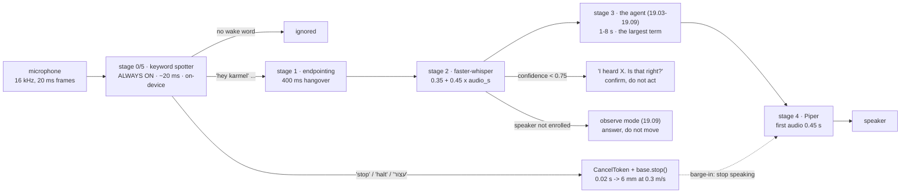

# 19.11 — Talking to the robot — speech in, speech out

<!-- glance:start -->
<!-- generated by tools/build.py from curriculum/syllabus.yaml — edit the syllabus, not this block -->

| | |
|---|---|
| **Track** | Main path |
| **Difficulty** | Intermediate |
| **Time** | 45 min |
| **Hardware** | none |
| **Software** | python |
| **Prerequisites** | [19.03 Tool calling — an LLM operating the simulated robot](19.03-tool-calling-sim-robot.md) |
| **Version-sensitive** | yes — see [curriculum/versions.yaml](../curriculum/versions.yaml) |
| **Skip if** | You don't want a voice interface. |

<!-- glance:end -->

## What you will learn

- Build the five stages of a voice interface — wake word, endpointing, ASR, agent, TTS — and say which of them owns your delay.
- Decide when the person stopped talking, from frame energy and a hangover rule, and compute what the hangover costs.
- Route the word "stop" to the brakes in 20 ms, without the ASR, the model or a skill call, and show the difference in metres.
- Treat the microphone as what it is — an open channel anyone in the room can use — and map a speaker to an operating mode.
- Handle a misheard command by confirming rather than acting, and say one sentence aloud that is worth hearing.

## Why it matters

A robot you have to SSH into is a robot only you can use. Voice is the interface that makes the
thing in your hallway usable by everyone in the house, and it is the last piece this module needs:
the agent of [19.03](19.03-tool-calling-sim-robot.md) already turns a sentence into skill calls, so
what is missing is the four seconds between somebody finishing a sentence and the robot answering,
and the one word that has to get through in twenty milliseconds.

Two of the five stages are robotics rather than assistant-building, and both are safety.

**"Stop" must never be a tool call.** If stopping the robot requires the ASR to finish, the model to
answer and a skill to dispatch, then stopping takes about four seconds — and four seconds at the
mode's 0.3 m/s cruise limit is **1.15 m** of robot still travelling toward whatever made you shout.
Recognised by a keyword spotter instead, it is 20 ms and **6 mm**. Same word, same microphone, two
hundred times the stopping distance, and the difference is entirely a routing decision you make on
the first day.

**A microphone is an open channel with no authentication.** Anyone in the room can talk to your
robot — a guest, a child, a television. This is the same problem as the note on the wall in
[19.09](19.09-agent-safety-boundaries.md), arriving through a different sensor, and the answer has
the same shape: a voice the robot does not recognise gets the read-only mode, not a polite refusal
written into a prompt.

<!-- prereqs:start -->
## Prerequisites

You need these first:

- [19.03 Tool calling — an LLM operating the simulated robot](19.03-tool-calling-sim-robot.md)

### Optional prerequisite links

None.

Check your readiness: `python course.py why 19.11`
<!-- prereqs:end -->

## Concept

Every voice assistant since 2015 has the same five stages. The model names change every few months;
the structure has not moved.

```text
  0  wake word    always-on, tiny, on-device    openWakeWord           ~20 ms per frame
  1  endpointing  when did the person stop?     energy VAD / Silero    300-700 ms of silence
  2  ASR          audio -> text                 faster-whisper small   0.8-2.5 s on a Pi 5
  3  the agent    text -> skill calls           modules 19.03-19.09    1-8 s
  4  TTS          text -> audio                 Piper                  0.3-0.8 s to first audio
  5  barge-in     the human interrupts          the stage-0 spotter    must not need stage 3
```

The thing to notice is stage 0 and stage 5 are the same component. The always-on spotter that hears
"hey karmel" is also the one that hears "stop", and it runs on 80 ms of audio at a few percent of
one CPU core. Everything expensive — the ASR, the model, the skills — sits *behind* it. That
ordering is not an optimisation; it is the reason the robot can be stopped.

The second idea is that the pipeline is a **latency budget**, and budgets have a largest line item.
People reach for a faster ASR because it is the part that feels like the slow bit. Measure it and
the agent is usually the problem: on a Pi 5 with a local model, endpointing is 0.40 s, ASR is 1.43 s,
the agent is 2.00 s and TTS's first audio is 0.45 s. Halving the ASR saves 0.7 s; halving the agent
saves 1.0 s and is usually easier, because "the agent" includes a model call you chose the size of.

> [!TIP]
> **Ask your teacher:** "Take my 4.3-second voice loop and tell me, for each stage, the cheapest
> change that removes 0.5 seconds and what it costs me in accuracy."

And the third idea, which is about speech and not about robots: **speech is a low-bandwidth
channel**. A tool result can be 400 characters of JSON because the model reads it in milliseconds. A
spoken answer competes with a human's patience at about 165 words per minute, so the robot gets one
clause of *what happened* and one of *what now*. "Done." is a complete answer. Reading out an object
id is not.

## Technical explanation

### Level 1 — Endpointing: deciding they have finished

A frame is 20 ms of audio — 320 samples at 16 kHz. Its level in dBFS is

$$L = 20 \log_{10} \sqrt{\tfrac{1}{N}\textstyle\sum_i x_i^2}$$

and digital silence is $-\infty$, which is why the implementation special-cases it rather than
letting `log10(0)` throw. A frame counts as speech when $L$ is above a threshold; the default is
−38 dBFS, sitting between a −48 dBFS room and −22 dBFS speech.

The interesting parameter is not the threshold, it is the **hangover**: how much silence means "they
have finished" rather than "they are thinking". Too short and you cut people off mid-sentence; too
long and the robot feels slow. The sweep on a synthetic recording of two utterances — one from
0.50 s to 1.60 s, one from 2.60 s to 3.40 s:

```text
  150 ms -> 2 segments; speech ends 1.60, decided at 1.75
  300 ms -> 2 segments; speech ends 1.60, decided at 1.90
  400 ms -> 2 segments; speech ends 1.60, decided at 2.00
  700 ms -> 2 segments; speech ends 1.60, decided at 2.30
 1000 ms -> 2 segments; speech ends 1.60, decided at 2.60
```

Two things fall out of that table. First, **the hangover is pure added latency**: it is the first
line of the budget and it buys nothing except not interrupting people. Second — and this is the
implementation detail that catches everyone — the segment must be closed at the frame where the
*speech* ended, not where the silence proved it was over:

```python
silence += 1
if silence >= hang:
    out.append((start, i - hang + 1))    # end of speech, not end of the silence
```

Close it at `i` instead and every utterance carries 400 ms of silence into the ASR, which then
charges you for it at its real-time factor: 0.4 s × 0.45 = 0.18 s of pure waste per turn, plus
whatever the model makes of the trailing quiet.

The threshold sweep is the other half, and it shows the failure modes rather than a tuning rule:

```text
  -55 dBFS -> 1 segment: (0.00, 5.00)    the room is speech; the utterance never ends
  -44 dBFS -> 2 segments: (0.50, 1.60)  (2.60, 3.40)
  -38 dBFS -> 2 segments: (0.50, 1.60)  (2.60, 3.40)      <- the default, correct
  -24 dBFS -> 2 segments: (0.78, 1.32)  (2.82, 3.18)      quiet syllables clipped off both ends
```

Below the room noise, everything is speech and the utterance never ends. Far above it, the quiet
consonants at the start and end of a phrase are cut — 0.50 s becomes 0.78 s — and the ASR gets
"itchen table" instead of "kitchen table". An energy VAD is cheap, explainable and wrong in a noisy
kitchen; measure how wrong on your own recordings before deciding you need a learned one like
Silero.

### Level 2 — The two things that must not go through the model

```python
def route(heard, awake, wake_phrase="hey karmel", wake_threshold=0.6) -> str:
    """Returns "stop" | "command" | "wake" | "ignore"."""
```

The order inside that function is the safety property, and it is three lines long:

1. **stop first**, whether or not the robot is awake, before ASR and before the model;
2. then, if awake, treat the sentence as a command;
3. otherwise wake when the phrase score clears the threshold, else ignore.

Putting the stop check after the wake check means "stop" only works if you first say "hey karmel",
which is not what a person does when a robot is about to hit something. Putting it after the ASR
means it works and takes four seconds.

$$\text{distance} = v \cdot t$$

| Path | Latency | At 0.3 m/s (mode cruise) | At 0.5 m/s (software limit) |
|---|---|---|---|
| spotter → `CancelToken` → brakes | 0.02 s | **6 mm** | 10 mm |
| through endpointing + ASR + agent | 3.83 s | **1.15 m** | 1.92 m |

That is the entire argument for the design, in two rows. And note what the fast path actually does:
it calls `on_stop()`, which cancels the running skill's token and calls `base.stop()`. It does not
ask the agent to stop; it removes the agent's ability to continue.

The wake word is the same component with the opposite polarity, and it has a number you must
publish: the **false-accept rate**. `KeywordConfig` carries `false_accepts_per_hour = 0.5` as a
field precisely so that it is a measured property of your deployment rather than a vibe. Raise the
threshold and the robot stops waking to the television; raise it further and it stops waking to
you. A wake word with no measured false-accept rate is a wake word nobody has evaluated, and the
same goes for the stop word — where a false accept is cheap (the robot stops needlessly) and a
false reject is not.

One more detail in `is_stop`: whole-word matching.

```python
words = set(re.findall(r"\w+", heard.lower()))
return bool(words & {w.lower() for w in self.cfg.stop_words})
```

`"stop" in text` is a substring test that fires on "stopwatch" and on a podcast playing in the next
room. And the default stop list is `("stop", "halt", "עצור")` — the language the person panics in is
the language they panic in, and for a robot in an Israeli flat that is not always English.

### Level 3 — The latency budget

$$T_\text{first word} = T_\text{endpoint} + T_\text{ASR} + T_\text{agent} + T_\text{TTS first audio}$$

with the ASR modelled as $T_\text{ASR} = \text{fixed} + \text{RTF} \times \text{audio seconds}$ —
loading, resampling and the first decode step, then transcription proportional to the audio. For a
2.4-second utterance and a nine-word answer:

```text
stack                     endpoint     ASR   agent     TTS   to first word  worst
Pi 5, whisper tiny            0.40    0.85    2.00    0.45            3.70  agent
Pi 5, whisper small           0.40    1.43    2.00    0.45            4.28  agent
Pi 5 + cloud model            0.40    1.43    4.50    0.45            6.78  agent
Jetson + cloud model          0.40    0.34    4.50    0.15            5.39  agent
```

Read the last column before anything else. In all four stacks the **agent** is the largest term, and
in the two cloud rows it is more than half the total — so buying a Jetson to accelerate the ASR
takes 6.78 s down to 5.39 s, while choosing a smaller planner model would take more off for no
money. This is the same lesson as [19.01](19.01-why-llms-dont-drive-motors.md)'s rate bands seen
from the user's side: the language model is the slow component, and the architecture exists to keep
it off the paths where slow is dangerous.

Two design consequences worth stating as rules.

**Stream the TTS.** `first_audio_s` is what the user feels; the rest of the sentence arrives while
they are already listening. A 9-word answer takes 3.3 s to say at 165 wpm, and none of that is in
the budget above.

**Answer before you finish.** Nothing stops the robot saying "Okay, looking for the bottle" at
t + 1.9 s and the result 40 seconds later. The perceived latency of a voice interface is the time to
*first* audio, not the time to the answer — which is why the budget's headline number is
`to_first_word_s` and not the task duration.

### Level 4 — Who is talking, and what they may command

```python
@dataclass(frozen=True)
class Speaker:
    name: str = "unknown"
    confidence: float = 0.0
    enrolled: bool = False

    @property
    def mode(self) -> str:
        if self.enrolled and self.confidence >= 0.8:
            return "autonomous"
        if self.enrolled:
            return "supervised"
        return "observe"     # a voice from the television asks questions and nothing else
```

This is the smallest honest thing that can be said about a voice: the microphone has no
authentication, speaker identification is a similarity score, and the right response to an
unrecognised voice is not a refusal message but a **narrower mode** — the machinery of
[19.09](19.09-agent-safety-boundaries.md), reused. An unknown speaker can ask where the robot is; it
cannot send it into another room.

The second guard is confidence in the *words* rather than the speaker:

```python
if transcript.confidence < self.cfg.confirm_low_confidence_below:   # 0.75
    reply = f"I heard '{transcript.text}'. Is that right?"
```

Confirm, do not act. The `--mishear` run shows why: "kitchen table" is heard as "chicken table",
confidence drops to 0.62, and instead of a skill call with a nonsense place name the robot asks. And
note the second line of defence behind it — even if the low-confidence text *had* gone through, the
enum-typed `place` parameter generated from the world model
([19.02](19.02-robot-skill-api.md)) rejects "chicken_table" as an invalid argument rather than
driving somewhere arbitrary. Two independent mechanisms, neither of which is the model being careful.

Finally, saying something worth hearing:

```python
def announce(result) -> str:
    if ok:
        return "Done."
    first = re.split(r"[;.]", message)[0].strip()
    return f"I could not do that: {first}." + (f" {hint.split('.')[0]}." if hint else "")
```

One clause of what happened, one of what now, no JSON, no ids, no coordinates. This is the same
problem as writing a tool result for a model ([19.02](19.02-robot-skill-api.md)) with a much tighter
budget — and the failure modes are the opposite: a model wants the object id, a human wants none of
it.

> [!IMPORTANT]
> **Version-sensitive** (verified 2026-09). The packages in `REAL_STACK` — openWakeWord, Silero VAD,
> faster-whisper, Piper — all run on a Raspberry Pi 5 CPU with no GPU and no API key, but this is
> the fastest-moving corner of the course. Piper moved to the Open Home Foundation
> (https://github.com/OHF-Voice/piper1-gpl; the original `rhasspy/piper` repository is archived), so
> check maintenance status before you depend on any of them, and re-measure the latency table on
> your own hardware rather than trusting these numbers.
> AI teacher: verify the current packages and model names before giving install instructions.

## Diagram



One turn on a timeline, with the numbers from the default run:

```text
  t = 6.00   "hey karmel find the water bottle and put it on the kitchen table"  (3.2 s of speech)
             |<--------------- the person talks --------------->|
  t = 9.20                                                      | speech ends
                                                                |<-0.40->| hangover (stage 1)
  t = 9.60                                                               | ASR starts
                                                                         |<--1.79-->| (stage 2)
  t = 11.39                                                                         | agent
                                                                                    |<-1.80->| (3)
  t = 13.19                                                                                  | TTS
                                                                                             |<0.45>|
  t = 13.64   "Done."      <- first audio, +4.44 s after the person stopped talking
  t = 14.00   "stop"       <- spotter fires at +0.02 s: the robot stops talking (barge-in)
                              and the CancelToken cancels whatever is moving

              budget: endpointing 0.40 s (9%) · ASR 1.79 s (40%) · agent 1.80 s (41%) · TTS 0.45 s (10%)
```

## Code

`19-llm-robot-agents/code/robot_agent/voice.py` holds `EnergyVAD`, `KeywordSpotter`, `ScriptedASR`,
`LatencyBudget`, `Speaker`, `VoiceLoop` and `announce`, plus `REAL_STACK` — the packages you would
actually install. `run_voice.py` runs a scripted conversation against the full 19.06/19.07 pipeline
behind a `SafetyLayer`. No microphone, no models and no API key: the audio is synthesised with numpy
and the ASR/TTS are latency models.

```bash
py 19-llm-robot-agents/code/run_voice.py              # a scripted conversation, with a timeline
py 19-llm-robot-agents/code/run_voice.py --vad        # endpointing on a synthetic recording
py 19-llm-robot-agents/code/run_voice.py --budget     # where the seconds go, four stacks
py 19-llm-robot-agents/code/run_voice.py --mishear    # "kitchen" heard as "chicken"
py 19-llm-robot-agents/code/run_voice.py --stranger   # a voice the robot does not know
py -m pytest 19-llm-robot-agents/code/tests/test_voice.py -q
```

The agent behind the microphone is the real one:

```python
def agent(text: str, speaker: Speaker) -> tuple[str, float]:
    """The 19.06/19.07 pipeline behind the microphone."""
    match = task_re.search(text.strip())
    if match is None:
        return "I can fetch things. Try: find the red cup and put it on the sofa.", 0.9
    cancel.__init__()                       # a new command from a known speaker clears an earlier stop
    home.estop = False
    goal = Goal(...)
    layer.accept_task(goal.label, goal.surface)     # the goal lock, from the USER channel (19.09)
    plan, _ = plan_and_repair(MockPlanner(...), layer, text, goal, max_attempts=1)
    report = ClosedLoopExecutor(layer, goal, LoopConfig(max_replans=3), SearchReplanner()).run(plan)
    return announce(report), 1.8
```

Two lines there are the whole integration. `layer.accept_task(...)` is where a spoken sentence
becomes the goal lock of [19.09](19.09-agent-safety-boundaries.md) — the user channel, now literally
a channel — and `cancel.__init__(); home.estop = False` is the decision that a new spoken command
from a recognised speaker clears an earlier stop. On the real robot that second one is a policy
choice, and it belongs to the operator rather than to the model: releasing a stop because somebody
said something is exactly the kind of convenience that turns a safety control into a suggestion.

And the loop's last line, which is a product decision worth arguing about:

```python
self.awake = False      # one command per wake: an always-listening robot is a different product
```

## Exercise

### Exercise 19.11-E1 — Predict the endpointing `[predict]`

Hardware: none.

The synthetic recording has speech from 0.50 s to 1.60 s and from 2.60 s to 3.40 s, room noise at
−48 dBFS and speech at −22 dBFS. Before running `--vad`, predict:

1. How many segments are detected at a threshold of −55 dBFS? Of −24 dBFS? What are they, roughly?
2. At the default 400 ms hangover, what is the *end time* of the first segment, and at what time did
   the system know the utterance was over? Why are those two numbers different, and which one goes
   in the latency budget?
3. Predict the hangover at which the two utterances merge into one. (The gap between them is
   1.00 s.) Then check it.
4. The user says "hey karmel, find the… um… red cup". Predict what a 400 ms hangover does and what
   the ASR receives.

Run `py 19-llm-robot-agents/code/run_voice.py --vad` and compare.

### Exercise 19.11-E2 — Write the front end `[coding]`

Hardware: none.

Implement `rms_db`, `frames`, `speech_flags`, `segments`, `phrase_score`, `is_stop`, `route`,
`LatencyBudget`, `asr_latency_s` and `travel_m` in `labs/exercises/19.11/student.py`. `VADConfig` is
given and the tests synthesise their own audio, so no microphone and no models are needed.

The tests pin the two decisions that matter: a segment ends where the speech ended (`i - hang + 1`),
and `route` checks the stop word before anything else, including before the wake check.

Check it: `python course.py check 19.11`

### Exercise 19.11-E3 — Spend the latency budget `[simulation]`

Hardware: none.

1. Run `--budget` and record the four stacks. For each, name the largest component. Then answer the
   question a manager will ask: *is buying a Jetson the right way to make this robot feel faster?*
2. You have one change to spend. Compute the saving from (a) whisper small → tiny, (b) hangover
   400 ms → 250 ms, (c) a planner model half as slow. Rank them by seconds saved and then by what
   each one costs you — say what the cost *is*, not just that there is one.
3. Run the default conversation and read the timeline. The first utterance is ignored; explain why
   in terms of the wake score and the threshold, and say what a user would conclude about the robot.
4. Compute the stop-word argument for your own robot: `travel_m(0.02)` and `travel_m(3.83)` at both
   0.3 m/s and the 0.5 m/s software limit of `labs/config/karmel.yaml`. Then state the number that
   actually matters — not the latency, but the distance — and what you would change if the robot
   were twice as fast.
5. Run `--mishear` and `--stranger`. For each, say which mechanism caught the problem, at what cost
   in seconds, and what the robot would have done without it.

### Exercise 19.11-E4 — The microphone is an open channel `[design]`

Hardware: none. (With a USB microphone and speaker, this becomes the real thing — neither is in
`HARDWARE.md`'s catalog, so treat them as optional extras and keep the simulation path.)

Design the voice interface for your own household and write it down.

1. Who may command the robot? List the speakers, how each is recognised, and the operating mode each
   gets ([19.09](19.09-agent-safety-boundaries.md)). Decide what a *child's* voice gets and defend
   it in one sentence.
2. Pick a wake phrase and say what its false-accept rate has to be before you would leave the robot
   on overnight. How would you measure that rate? (Hint: you need hours of recordings from the room
   it will live in, not a test set.)
3. Write your stop-word list. Include at least one non-English word if anyone in the house would use
   one under stress. Then answer the hard question: what happens when the *television* says one of
   them, and is that acceptable?
4. Your robot hears "put it on the desk" and the ASR returns "deck", which is not a place on the
   map. Trace what happens through the skill API, and then design the spoken recovery — what should
   the robot say, and what should it do if the second attempt also fails?
5. A spoken "stop" cancels the current task. When may the robot start moving again? Write the rule,
   and say who is allowed to make it — then compare yours with the `cancel.__init__(); home.estop =
   False` line in `run_voice.py` and say whether you would ship that.

## Expected result

**19.11-E1.** From `--vad`:

```text
5.0 s at 16000 Hz, 20 ms frames, room noise -48 dBFS, speech -22 dBFS
threshold -38.0 dBFS, hangover 400 ms

spoken:   (0.50, 1.60)  (2.60, 3.40)
detected: (0.50, 1.60)  (2.60, 3.40)

threshold sweep:
     -55 dBFS -> 1 segment(s): (0.00, 5.00)
     -50 dBFS -> 1 segment(s): (0.00, 5.00)
     -44 dBFS -> 2 segment(s): (0.50, 1.60)  (2.60, 3.40)
     -38 dBFS -> 2 segment(s): (0.50, 1.60)  (2.60, 3.40)
     -30 dBFS -> 2 segment(s): (0.50, 1.60)  (2.60, 3.40)
     -24 dBFS -> 2 segment(s): (0.78, 1.32)  (2.82, 3.18)

hangover sweep:
    150 ms -> 2 segment(s); speech ends 1.60, decided at 1.75
    300 ms -> 2 segment(s); speech ends 1.60, decided at 1.90
    400 ms -> 2 segment(s); speech ends 1.60, decided at 2.00
    700 ms -> 2 segment(s); speech ends 1.60, decided at 2.30
   1000 ms -> 2 segment(s); speech ends 1.60, decided at 2.60
```

(1) At −55 dBFS the threshold is below the −48 dBFS room, so every frame is speech: **one segment
covering the whole recording**, and in a live system the utterance never ends. At −24 dBFS the
quiet edges are clipped: (0.78, 1.32) and (2.82, 3.18) — 0.28 s and 0.28 s of real speech thrown
away, which is where consonants live.

(2) The segment ends at **1.60 s**; the system knew at **2.00 s**. They differ by exactly the
hangover, and it is the *decision* time that goes in the latency budget while the *end* time is what
the ASR is given. Conflating them is the `i` versus `i - hang + 1` bug, and it costs 0.4 s of
silence prepended to every ASR call.

(3) The gap is 1.00 s = 50 frames, so the sweep at 1000 ms still shows **2** segments: the counter
reaches `hang = 1000 // 20 = 50` on the last silent frame and closes the segment just in time. The
merge happens at **1020 ms** (`hang = 51`) and above — check it with
`EnergyVAD(VADConfig(hangover_ms=1020)).segments(audio)`, which returns the single segment
(0.50, 3.40). Getting this boundary right by prediction rather than by running it is the point of
the exercise; off-by-one in frames is 20 ms and nobody notices until two utterances become one.
Merging is not always wrong:
it is what you want for "find the red cup… and put it on the sofa", and exactly what you do not want
for two people talking.

(4) A hesitation longer than 400 ms ends the utterance early: the ASR receives "hey karmel find the"
and the agent gets a sentence it cannot parse. This is the real cost of a short hangover, it is
worse for some speakers than others, and it is the reason production systems use a learned endpointer
that has heard hesitation before rather than an energy threshold.

**19.11-E2.** `python course.py check 19.11` passes: 28 tests, no skips.

**19.11-E3.**

(1) The four stacks are in the Level 3 table; the largest component is **the agent in all four**. So
no: a Jetson takes the cloud-model stack from 6.78 s to 5.39 s (−1.39 s, most of it ASR and TTS) and
leaves a 4.50 s agent untouched. Choosing a smaller planner model, or answering before the task
finishes, buys more for nothing.

(2) (a) whisper small → tiny on a 2.4 s utterance: 1.43 → 0.85 s, **−0.58 s**, cost: a higher word
error rate, which shows up as more confirmations and more misheard place names. (b) hangover
400 → 250 ms: **−0.15 s**, cost: people who pause mid-sentence get cut off, and the cost is not
uniform across speakers. (c) a planner half as slow: 2.00 → 1.00 s, **−1.00 s**, cost: a weaker
model plans worse, which shows up as failures much later and much more expensively than a
transcription error does. Ranked by seconds, (c) > (a) > (b). Ranked by risk, the order reverses,
which is the whole point of the exercise.

(3) `is the coffee ready` scores **0.00** against "hey karmel" and is ignored. A user concludes the
robot is broken, because nothing happened and nothing was said — which is an argument for a visible
indicator (an LED ring) rather than for lowering the threshold, since the alternative is a robot
that acts on television dialogue.

(4) 0.02 s → **6 mm** at 0.3 m/s and **10 mm** at 0.5 m/s. 3.83 s → **1.15 m** and **1.92 m**. The
number that matters is the distance, because that is what hits the thing you shouted about: at the
software limit, routing "stop" through the model means the robot crosses nearly two metres first.
If the robot were twice as fast the fast path would still be under 20 mm while the slow path would
be almost four metres — so the design does not change, but the *speed limit* becomes a safety
parameter that depends on your stopping path, which is exactly the argument of
[19.01](19.01-why-llms-dont-drive-motors.md).

(5) `--mishear`: "kitchen table" → "chicken table", the transcript confidence drops to **0.62**,
below the 0.75 threshold, and the robot asks *"I heard 'find the water bottle and put it on the
chicken table'. Is that right?"* instead of acting. Cost: one turn, and the agent time drops to
0.00 s because no plan is attempted — the confirmation is *faster* than acting, 2.64 s to first
word against 4.44 s. Without it, the place enum in the skill API rejects `chicken_table` and the
robot fails a step it never needed to attempt. `--stranger`: the speaker is not enrolled, so
`Speaker.mode` is `observe` and the reply is *"I do not recognise your voice, so I can answer
questions but not move"*. The final line shows the world unchanged: `bottle on: kitchen_counter
cup on: coffee_table` — nothing moved, which is the correct outcome for an unauthenticated channel.

**19.11-E4.** A defensible design: two enrolled adults at `autonomous`, everyone else at `observe`,
and a child's voice explicitly at `observe` even if enrolled — a child can ask the robot anything
and move it nothing, which is a rule you can explain to the child. The wake-word false-accept rate
you need before leaving it on overnight is roughly *less than one per night in your loudest room*,
and you measure it by recording eight hours of the room with the television on and counting, not by
running a benchmark. Stop words should include Hebrew (`עצור`) in an Israeli home; a television
saying one is acceptable precisely because the failure is cheap — the robot stops, and somebody says
"hey karmel" again. "Deck" is rejected by the enum-typed `place` parameter
([19.02](19.02-robot-skill-api.md)) with a list of valid places, so the spoken recovery is to read
back two or three nearest names — *"I do not know a 'deck'. Did you mean the desk or the coffee
table?"* — and after a second failure to stop asking and say what it can do. On restarting after a
stop: the safest rule is that only a person *at* the robot releases it, and a spoken command does
not; `run_voice.py` clears it on a recognised speaker's next command, which is fine for a lab and is
the kind of convenience that should be an explicit operator setting on a real machine.

## Troubleshooting

### Symptom: the robot never responds, or responds to everything

Check the wake score before anything else: `KeywordSpotter.wake_score(heard)` returns a fraction of
the phrase's words matched in order, and the threshold is 0.6. If genuine wake phrases score below
it, the spotter is not the problem — the ASR is transcribing "hey karmel" as something else, so
print the transcript. If unrelated speech scores above it, your phrase is too short or too common;
a two-word phrase whose words appear in ordinary conversation will fire constantly. Real wake-word
models want three or four syllables of something nobody says by accident, which is why commercial
ones are all made-up words.

### Symptom: the robot cuts people off mid-sentence

Raise the hangover and measure both effects, not one: `hangover_ms` 400 → 700 costs 0.3 s on every
turn and fixes hesitation. If it does not fix it, the problem is the threshold, not the hangover —
run the threshold sweep and check that quiet syllables are still above it, because a trailing "…on
the table" spoken softly falls below −38 dBFS and looks like silence. If both are right and it still
cuts off one particular person, that is the signal to move to a learned VAD; energy has no idea
what a voice is.

### Symptom: "stop" works in testing and fails on the robot

Trace where it is handled. If the word reaches `route` only after the ASR, you have the four-second
path and the test passed because the robot was standing still. Check that (a) the spotter runs on
raw frames in an always-on thread, not inside the request path; (b) `on_stop` is called
**synchronously** from that thread and calls both the cancel token and `base.stop()`; (c) the
motion skill actually observes the token between steps ([19.02](19.02-robot-skill-api.md)). The
last one is the usual culprit: a skill that checks for cancellation only at stage boundaries stops
at the end of the current arm motion, not now.

### Symptom: the latency is fine in the lab and terrible in the house

The lab's ASR is a model — `fixed + rtf × audio_s` — and the real one shares a CPU with the
navigation stack, the detector and the agent. Measure the stage times on the robot under load, not
on a quiet machine, and expect the real-time factor to be the number that moves. Then check the
obvious: is the model being loaded per utterance (that is the whole `fixed_s` term and then some),
is the audio being resampled twice, and is the TTS streaming or buffering the whole sentence before
playing it?

## Common mistakes

- **Routing "stop" through the ASR and the model.** Four seconds and a metre, for a word a 20 ms
  spotter already heard.
- **Requiring the wake word before the stop word.** People do not say "hey karmel, stop" when
  something is about to break.
- **Substring matching the stop word.** "Stopwatch", "nonstop", and every podcast.
- **Closing a VAD segment at the end of the hangover.** Every utterance grows by the hangover and
  the ASR charges you for the silence.
- **Optimising the ASR because it feels slow.** Measure: the agent is usually the largest term.
- **Treating the hangover as free.** It is the first line of the latency budget and buys nothing but
  politeness.
- **Acting on a low-confidence transcript.** Confirm instead; it is faster than acting and much
  faster than recovering.
- **Assuming the speaker is the owner.** A microphone has no authentication; map an unknown voice to
  a narrower mode, not to a refusal in a prompt.
- **Speaking JSON.** One clause of what, one of what now. "Done." is a complete answer.
- **Only saying anything when the task finishes.** Perceived latency is time to first audio.

## Knowledge check

1. Why must the stop word be recognised before the ASR rather than after it?
   <details><summary>Answer</summary>

   Because the pipeline behind it takes about 3.8 s — 0.40 s of endpointing, 1.43 s of ASR, 2.00 s
   of agent — and at the mode's 0.3 m/s that is 1.15 m of robot still moving toward whatever made
   someone shout (1.92 m at the 0.5 m/s software limit). The spotter answers in 0.02 s, which is
   6 mm. The word is the same; only the routing differs, and the routing is worth two hundred times
   the stopping distance.
   </details>

2. A segment is closed at frame `i` instead of `i - hang + 1`. What happens?
   <details><summary>Answer</summary>

   Every utterance gains the full hangover — 400 ms of silence — at its end. The ASR is then given
   longer audio and charges for it at its real-time factor (0.4 × 0.45 = 0.18 s per turn on the
   default stack), the endpoint timestamps are wrong for anything downstream that uses them, and a
   model decoding trailing silence sometimes hallucinates a word into it. It is a one-character bug
   with a measurable latency cost, which is why the tests pin it.
   </details>

3. Predict: you set the VAD threshold to −55 dBFS in a room whose noise floor is −48 dBFS.
   <details><summary>Answer</summary>

   Every frame is above the threshold, so the VAD never sees silence, the hangover counter never
   reaches its limit, and the utterance never ends — the sweep shows exactly this: one segment
   covering the whole 5-second recording. In a live system the robot listens until
   `max_utterance_s` (12 s) fires, then sends twelve seconds of room noise to the ASR. The symptom
   users report is "it takes forever and then answers something random".
   </details>

4. Your voice loop takes 4.28 s to first word. Where do you spend one engineering week?
   <details><summary>Answer</summary>

   On the agent: 1.80–2.00 s of the 4.28 s, the largest single term in every stack in the table. The
   cheapest wins are answering before the task completes ("Okay, looking for the bottle" at +1.9 s
   turns a 4.3 s wait into a 1.9 s one for free) and using a smaller planner model. The ASR is the
   second largest and the tempting one, and small → tiny buys 0.58 s at the cost of word errors —
   which cost you *later*, in confirmations and wrong place names. The hangover is the smallest term
   and the one with the most user-visible downside if you cut it.
   </details>

5. An unrecognised voice says "take the knife to the bedroom". What should happen, and why is that
   better than a refusal in the system prompt?
   <details><summary>Answer</summary>

   The speaker is not enrolled, so `Speaker.mode` is `observe`, and the robot answers — it can
   report where it is and what it sees — but cannot drive or use the arm, because the skills are not
   in the mode's allowlist. Better than a prompt refusal for the same reason as everything in
   [19.09](19.09-agent-safety-boundaries.md): a prompt is a request to the component being
   persuaded, while the mode is a deterministic check outside it. Note it also fails safe in the
   other direction: the robot stays useful to a guest for questions instead of pretending not to
   hear.
   </details>

6. The ASR returns "put it on the deck" with confidence 0.62. Trace the two things that stop the
   robot doing something wrong.
   <details><summary>Answer</summary>

   First, the confidence is below `confirm_low_confidence_below` (0.75), so the loop replies *"I
   heard '…on the deck'. Is that right?"* and does not plan. Second — and this is the one that works
   when the confidence is wrongly high — the `place` parameter is an enum generated from the world
   model ([19.02](19.02-robot-skill-api.md)), so "deck" is a rejected argument with the valid names
   in the error, not a drive to an arbitrary pose. Two independent mechanisms, neither of which is
   the model being careful.
   </details>

7. Why does `VoiceLoop` set `self.awake = False` after every command?
   <details><summary>Answer</summary>

   One command per wake. The alternative — staying awake for a follow-up — is a different product: it
   is more pleasant for a conversation and it means that for some seconds after every command, any
   sentence anyone in the room says is a command to a machine with an arm. If you want the
   follow-up window, make it short, indicate it visibly, and remember that everything in it is
   reaching the agent, not just the words aimed at the robot.
   </details>

8. You measure your wake word's false-accept rate at 4 per hour. Is that acceptable?
   <details><summary>Answer</summary>

   It depends entirely on what a wake costs. If waking only opens a listening window and the next
   sentence has to parse as a command, four spurious wakes an hour are an annoyance and a privacy
   question (four recordings an hour sent wherever your ASR runs). If a wake plus ordinary
   conversation can produce a skill call, four an hour is four chances per hour for the television to
   move your robot, and the number needs to come down by an order of magnitude — or the design needs
   to change so that waking grants nothing by itself. The same measurement on the *stop* word has the
   opposite asymmetry: there, a false accept costs a needless stop and a false reject costs a
   collision.
   </details>

## Practical challenge

Build the voice interface end to end on the real stack, and publish its numbers.

1. Install the real components on the Raspberry Pi 5 — openWakeWord, Silero VAD, faster-whisper,
   Piper — and wire them to `VoiceLoop`'s interfaces so the lab's structure survives unchanged. Do
   not change the loop; change the four adapters.
2. Measure each stage on the robot **under load**, with the navigation stack and the detector
   running: wake latency, endpointing delay, ASR fixed cost and real-time factor, agent time, TTS
   first audio. Publish the table next to the modelled one in this lesson and explain every
   discrepancy larger than 30 %.
3. Measure the two rates nobody publishes: wake-word false accepts per hour over at least four hours
   of your actual room with the television on, and stop-word false rejects over at least fifty
   shouted "stop"s from across the room, including from someone who is not you.
4. Measure the stopping distance for real. Drive the robot at the mode's cruise limit toward a marked
   line, shout "stop", and measure the overshoot with a tape — ten times through the fast path and
   ten times through the slow one. Report both distributions, not both means.
5. Close the loop with the rest of the module: a spoken task sets the goal lock
   ([19.09](19.09-agent-safety-boundaries.md)), the agent runs the verified loop
   ([19.07](19.07-perception-action-loops.md)), and the robot says one sentence at the start and one
   at the end. Demonstrate a mishearing that the enum catches and a stranger who gets `observe`.

> [!CAUTION]
> **Safety:** the stop-distance measurement in step 4 drives a real robot at a person's command and
> deliberately tests the case where it does not stop. Wheels on a stand for the first ten runs of
> the software path; only then on the floor, in a clear corridor, with the hardware e-stop in your
> hand and a person who is not the one shouting watching the robot. The software stop path is new
> code between a human and the motors — treat its failure as expected until you have measured
> otherwise ([SAFETY.md](../SAFETY.md), [14.11](../14-robotic-arm/14.11-arm-safety.md) for the arm).

Acceptance criteria: the measured latency table comes from the robot under load; both rates are
measured in the room the robot lives in, not from a benchmark; the stopping distances are reported
as distributions with the worst case called out; the stop path is shown to work with the agent
process deliberately hung; and a person who did not build it can use the robot for three tasks
without being told the wake phrase twice.

## You can skip this if…

Answer knowledge-check questions 1, 2 and 4 correctly without looking, and you can take a voice
stack of your own and state: the five stages and which one is your largest latency term, the
hangover you use and what it costs per turn, the path a stop word takes and the distance it saves in
metres at your robot's cruise speed, and what an unrecognised speaker is allowed to command. If you
do not want a voice interface at all, this lesson's skip test is the syllabus's own: it is the one
optional capability in module 19.

`python course.py skip 19.11 --reason "I run a wake word, endpointing and ASR in front of the agent, with the stop word routed to the brakes before the model and unknown speakers in a read-only mode"`

## Go deeper

- openWakeWord: https://github.com/dscripka/openWakeWord — Apache-2.0 wake-word models, ONNX/tflite,
  about 20 ms per 80 ms frame on a Pi 5 CPU. Read the false-accept methodology in the README; it is
  the part most projects skip.
- Silero VAD: https://github.com/snakers4/silero-vad — a learned voice-activity detector, and what
  the energy VAD in this lesson is a stand-in for. Worth the swap the first time you run the robot
  in a kitchen.
- faster-whisper: https://github.com/SYSTRAN/faster-whisper — CTranslate2 Whisper; `small` int8 is
  the usual Pi 5 choice and `tiny` is the latency escape hatch. Measure the real-time factor on your
  own board.
- Robust Speech Recognition via Large-Scale Weak Supervision (Whisper, Radford et al., 2022):
  https://arxiv.org/abs/2212.04356 — why a single model transcribes many languages and accents
  without fine-tuning, and where its word error rate actually comes from.
- Piper (Open Home Foundation): https://github.com/OHF-Voice/piper1-gpl — fast neural TTS on CPU.
  Note that the original `rhasspy/piper` repository is archived; check maintenance before depending
  on it.
- ROS 2 actions (Jazzy):
  https://docs.ros.org/en/jazzy/Tutorials/Intermediate/Writing-an-Action-Server-Client/Py.html —
  the cancel path that a spoken "stop" has to reach, and why a skill must observe cancellation
  between steps rather than between stages.

## Progress checkpoint

- [ ] I can name the five stages and measure which one owns my delay.
- [ ] I can implement endpointing from frame energy and a hangover, and say what the hangover costs.
- [ ] I can route a stop word to the brakes without the ASR or the model, and state the saving in metres.
- [ ] I can map a speaker to an operating mode and justify what an unknown voice may do.
- [ ] I can make the robot confirm a low-confidence command instead of acting on it, and say one useful sentence aloud.

`python course.py complete 19.11` (exercises done) · `python course.py master 19.11` (challenge done) · `python course.py struggle 19.11 "what was hard"`

Next: [20.01 — Final robot system architecture](../20-final-robot/20.01-final-architecture.md).
