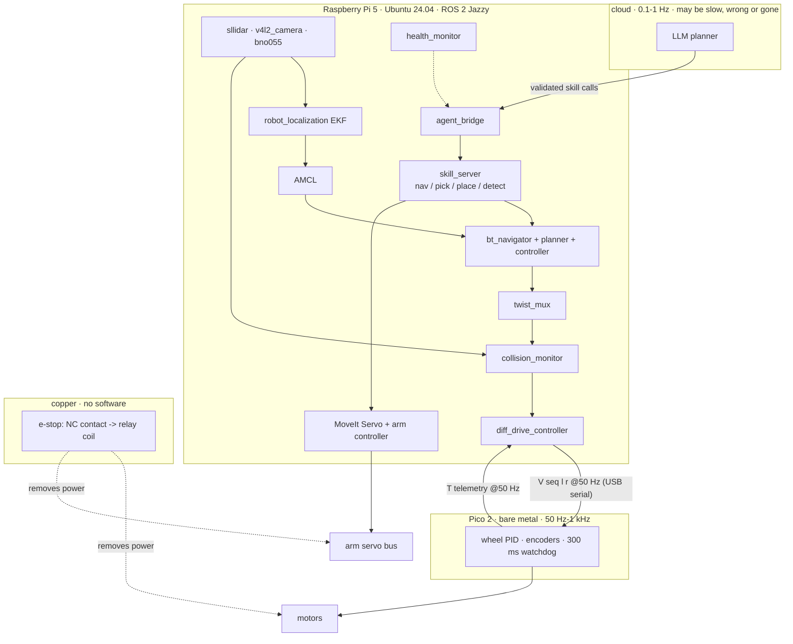

# 20.01 — Final robot system architecture

<!-- glance:start -->
<!-- generated by tools/build.py from curriculum/syllabus.yaml — edit the syllabus, not this block -->

| | |
|---|---|
| **Track** | Main path |
| **Difficulty** | Advanced |
| **Time** | 1 h |
| **Hardware** | none |
| **Software** | none |
| **Prerequisites** | [19.07 Perception–action loops — verifying every step](../19-llm-robot-agents/19.07-perception-action-loops.md)<br>[15.10 Mobile manipulation — the arm on the moving base](../15-manipulation/15.10-mobile-manipulation.md) |
| **Skip if** | Never — this is the capstone design. |

<!-- glance:end -->

## What you will learn

- Draw karmel's final architecture as four layers and say which layer keeps the robot safe when each of the others dies.
- Write an interface contract — type, frame, units, rate, QoS, owner, timeout behaviour — and check a whole system of them for the four faults that eat integration weeks.
- Compute the bandwidth and the worst-case end-to-end latency of a chain, and name the link that dominates each one.
- Place every job of the robot on the Pico, the Pi 5, a Jetson, your laptop or the cloud from its deadline, its CPU cost and its safety role, and prove the placement fits.
- Decide, in writing, what the robot does when each part of it is missing.

## Why it matters

You have built nineteen modules of parts. A base that drives ([08.12](../08-control/08.12-control-in-ros2.md)), odometry and an EKF ([10.07](../10-localization/10.07-fusing-imu-and-odometry.md)), a map ([11.07](../11-slam/11.07-mapping-your-room.md)), Nav2 ([12.08](../12-navigation/12.08-nav2-on-the-real-robot.md)), a camera and a detector ([13.16](../13-computer-vision/13.16-detection-to-map-position.md)), an arm ([14.10](../14-robotic-arm/14.10-move-gripper-to-position.md)), pick and place ([15.08](../15-manipulation/15.08-pick-and-place-pipeline.md)), and an agent that turns a sentence into skill calls ([19.06](../19-llm-robot-agents/19.06-task-planning-decomposition.md)). Every one of them works. Run them at the same time on one Raspberry Pi and the robot will, on the first afternoon, do something none of them does alone.

That is not a code-quality problem. It is what happens when eleven processes share a CPU, a serial line, a tf tree and a wall clock without anyone having written down what each one promises the others. In your world the equivalent is a system where each service passes its tests and the integration environment still falls over, because the contracts between services were in someone's head. The robot version has the same cause and a worse failure mode: a service that misbehaves returns a 500, and a robot that misbehaves drives into a wall.

This lesson is the design you hold the rest of module 20 to. The output is not a diagram; it is a file of contracts that a program checks, a compute plan with numbers, and a written answer for "what happens when this part is gone".

<!-- prereqs:start -->
## Prerequisites

You need these first:

- [19.07 Perception–action loops — verifying every step](../19-llm-robot-agents/19.07-perception-action-loops.md)
- [15.10 Mobile manipulation — the arm on the moving base](../15-manipulation/15.10-mobile-manipulation.md)

### Optional prerequisite links

None.

Check your readiness: `python course.py why 20.01`
<!-- prereqs:end -->

## Concept

An architecture document on a wiki is wrong within three weeks, and nobody notices until the integration week. So karmel's architecture is a Python file. Every interface between two parts of the robot is a `Contract` object with the fields that actually decide whether two nodes talk, and a handful of rules turn "does this design hold together?" into `py system_contracts.py check`.

The shape of the design is four layers, and each one is defined by what it *survives*:

| Layer | Runs on | Rate | Survives |
|---|---|---|---|
| **Deliberation** — intent, plans, skill choice | cloud | 0.1–1 Hz | nothing; it is allowed to be slow, wrong, or gone |
| **Executive** — skills, retries, timeouts, preconditions | Pi 5 | 1–10 Hz | the deliberation layer vanishing |
| **Reactive** — Nav2 controller, collision monitor, ros2_control | Pi 5 | 20–50 Hz | the executive hanging |
| **Firmware and hardware** — wheel PID, watchdog, e-stop relay | Pico, copper | 50–1000 Hz | the Pi crashing, the software being wrong, and you |

[19.01](../19-llm-robot-agents/19.01-why-llms-dont-drive-motors.md) argued for this split from latency. This lesson is where it becomes an implementation: which process runs where, which topic carries what, and what each layer does with silence from above.

The second idea is smaller and does more work. **An interface is a contract with eight fields**, and the four that people skip are the four that break integration:

1. the **frame** the data is expressed in (REP-105: `map`, `odom`, `base_link`, `laser`, …);
2. the **units** (SI, always — REP-103);
3. the **rate**: what the publisher offers and what each subscriber needs;
4. the **QoS profile**, because two nodes on the same topic with the same message type can exchange exactly nothing;
5. the **owner**: the single node allowed to publish it;
6. **what happens when it stops arriving**;
7. the message type; 8. the topic name. Everyone gets 7 and 8 right.

> [!TIP]
> **Ask your teacher:** "Pick three interfaces on my robot and interrogate me on each one's frame, units, rate, QoS and timeout behaviour — then tell me which answers were guesses."

## Technical explanation

### Level 1 — The survival rule, written down

The layering above is only useful if each layer has an answer to *the layer above went quiet*. For karmel:

| If this dies | The layer below does | The robot ends up |
|---|---|---|
| the model API | the executive finishes or cancels the current skill, then stops | stationary, mission reported as failed |
| `agent_bridge` | Nav2 finishes its current goal; no new goals arrive | stationary after the current goal |
| `bt_navigator` / the executive | `controller_server` stops being commanded; `collision_monitor` sees no `cmd_vel_smoothed` and publishes zero | stopped within 0.5 s |
| the whole Pi | no `V` commands reach the Pico; the firmware watchdog trips at 300 ms | stopped within 300 ms |
| the software, entirely | the e-stop relay still opens when the button is pressed | power removed from the motors and the arm |

Read the column of times: 0.5 s, 0.3 s, 12 ms. Each layer is faster than the one above it, and the last one does not run any code at all. That is the whole safety argument, and [20.04](20.04-safety-case.md) turns it into a test procedure.

### Level 2 — What a contract contains, and the four faults

Here are two rows of karmel's interface table, generated by `py 20-final-robot/code/system_contracts.py table`:

| Interface | Type | Frame | Units | Rate | QoS | Owner | On timeout |
|---|---|---|---|---|---|---|---|
| `/scan` | sensor_msgs/LaserScan | laser | m, rad | 10 Hz | best/vol/5 | sllidar_node | collision_monitor stops the robot after 1 s of no scan |
| `/cmd_vel` | geometry_msgs/TwistStamped | base_link | m/s, rad/s | 20 Hz | rel/vol/1 | collision_monitor | diff_drive_controller halts after cmd_vel_timeout (0.5 s) |

Four rules catch almost everything that goes wrong when you connect nineteen modules' worth of nodes:

**Single writer.** More than one publisher on an actuator topic is a race whose winner depends on the scheduler. This is why karmel's velocity chain is a pipeline of four differently-named topics — `/cmd_vel_nav` → `/cmd_vel_teleop` → `twist_mux` → `/cmd_vel_smoothed` → `collision_monitor` → `/cmd_vel` — instead of everyone publishing `/cmd_vel` and hoping. `/tf` is the documented exception: it is designed for many writers, each owning different parent→child edges.

**QoS request versus offered.** DDS matches a subscriber's *request* against a publisher's *offer*, and a subscriber may ask for the same or **less**, never more. Ask for `reliable` from a `best_effort` sensor publisher and you get no messages at all — no error, no warning, an empty `ros2 topic echo`. The same for `transient_local` (latching) and for deadlines:

| Publisher offers | Subscriber requests | Result |
|---|---|---|
| `best_effort` | `reliable` | **no data** |
| `reliable` | `best_effort` | fine |
| `volatile` | `transient_local` | **no data for late joiners** |
| deadline 200 ms | deadline 100 ms | **no match** |

**Rate.** `controller_server` runs at 20 Hz and needs `/odom` at 20 Hz. Slowing the EKF to 10 Hz to save CPU is a one-line change that makes the controller abort goals under load, and nothing in the logs says "rate".

**Frame.** `frame_id: "imu"` instead of `"imu_link"` costs an afternoon, because the symptom is `ExtrapolationException` from tf2 and the cause is a string.

### Level 3 — The numbers: bandwidth and latency

Bandwidth first, because it decides whether anything else matters. Each interface costs

$$B = \sum_{\text{publishers}} f_i \cdot s_i$$

with $f$ the rate and $s$ the serialised message size. For a 360-point `LaserScan` at 10 Hz: the header is 32 B, seven floats of geometry 28 B, and two arrays of 360 floats, 2880 B — 2952 B per message, 29.5 kB/s. Run `py 20-final-robot/code/system_contracts.py bandwidth` and the whole robot comes out at **773.7 kB/s = 6.2 Mbit/s**, of which the VGA JPEG camera stream at 15 fps is **675.7 kB/s — 87 % of the total**. Everything else together is 98 kB/s.

That single number decides several design questions at once. Loopback DDS on the Pi handles 6 Mbit/s without noticing. A 2.4 GHz Wi-Fi link in a flat with twenty neighbouring networks does not handle it reliably, so RViz on the laptop gets the compressed topic and not `image_raw` — which would be 640×480×3×15 = **13.8 MB/s, 110 Mbit/s**, i.e. 140 times the rest of the robot.

Latency second. A chain's worst case is the sum over steps of a sampling period plus the work:

$$T_\text{worst} = \sum_i \left( \frac{1}{f_i} + c_i \right)$$

The $1/f_i$ term is the part people forget: a 10 Hz sensor contributes 100 ms of *waiting* before it contributes any processing at all. `py 20-final-robot/code/system_contracts.py chain` prints three chains; here is the one that matters:

```text
obstacle in the path -> wheels slow  (budget 400 ms)
   LiDAR scan period                         10 Hz    100.0 ms
   driver + DDS                                  -      5.0 ms
   collision_monitor tick                    20 Hz     52.0 ms
   diff_drive_controller update              50 Hz     21.0 ms
   serial line to the Pico @115200               -      2.8 ms
   Pico control tick                         50 Hz     20.5 ms
   worst case                                         201.3 ms  OK
```

201 ms at 0.3 m/s is 6 cm of travel before the wheels change — comfortable inside karmel's 0.365 m margin ([19.01](../19-llm-robot-agents/19.01-why-llms-dont-drive-motors.md)). Note that the LiDAR's own 10 Hz period is half the budget: buying a faster controller would buy you nothing, and a 20 Hz LiDAR would halve the chain.

The third chain is the one with no software in it at all: mushroom button contact 2 ms, relay 10 ms, **12 ms total**, against a 50 ms budget. No scheduler, no DDS, no Python.

### Level 4 — Where each job runs

Five places, and the rule that assigns jobs to them is short enough to be code (`py 20-final-robot/code/compute_plan.py rules`):

```text
deadline <= 5 ms, or safety-critical with no OS        -> Pico   (bare metal, deterministic)
needs CUDA                                             -> Jetson
safety-critical, or deadline <= 200 ms                 -> Pi 5   (on the robot, always there)
deadline >= 2 s                                        -> cloud
needs > 3 cores or > 4 GB                              -> laptop (development only)
```

The feasibility check is just addition, and that is the point — `py 20-final-robot/code/compute_plan.py plan`:

```text
host      cores used     of  headroom   RAM MB  jobs
pico            0.35    1.0      0.65        0     2
pi5             2.95    3.2      0.25     1600    11
jetson          4.00    5.0      1.00     4000     2
laptop          4.00    8.0      4.00     6000     1
```

The Pi 5 has four cores; the plan budgets 3.2 usable, because the kernel, DDS and your ssh session need the rest. Eleven jobs add up to 2.95, leaving **0.25 cores of headroom — 8 %**. That is tight, and it is the honest answer: this robot is at the edge of its computer, which is why 20.03 measures it and 20.02 discusses when to add a Jetson.

Ask the same file what happens without one:

```text
$ py 20-final-robot/code/compute_plan.py whatif no-jetson
PROBLEM  pi5: 18.95 cores of work on 3.2 usable (15.75 cores over)
```

Object detection and a learned pick policy on a CPU need about four times the CPU time they need on a GPU. 18.95 cores on a 4-core machine is not a tuning problem; it is a different robot. The useful conclusion is not "buy a Jetson" — it is "either buy one, or run detection at 2 fps and drop the learned policy", which is a *design decision* you now make with a number instead of a feeling.

> [!TIP]
> **Ask your teacher:** "Give me a job — say, running AMCL with 2000 particles — and make me work out from first principles which host it belongs on and what it displaces."

## Diagram



The same robot seen as hosts and links, with the numbers that constrain each one:

```text
        laptop (dev only)                         cloud
        RViz, Gazebo, training                    LLM planner
              |  Wi-Fi 2.4/5 GHz                        |  internet, p50 1.5 s / p99 8 s
              |  compressed topics only                 |  never inside a control loop
              |  (image_raw would be 110 Mbit/s)        |
    ==========+=========================================+=============================
              |                                         |
        +-----------------------------------------------------+
        |  Raspberry Pi 5 (8 GB)   3.2 usable cores           |
        |  11 jobs, 2.95 cores, 1.6 GB, 0.25 cores headroom   |
        |  total DDS traffic 6.2 Mbit/s (87 % camera)         |
        +-----------------------------------------------------+
              |  USB CDC serial, 115200 baud, 50 Hz both ways
              |  V <seq> <l_mrad_s> <r_mrad_s>   ->
              |  T <ms> <ticks...>               <-
        +-----------------------------------------------------+
        |  Pico 2   1 core, no OS, 2 ms deadline              |
        |  wheel PID, encoders, watchdog 300 ms, e-stop sense |
        +-----------------------------------------------------+
              |  PWM + DIR                        e-stop NC contact
              v                                          v
            motors  <------------------------------ relay opens the
            arm servo bus <------------------------ actuator supply
```

## Code

Two files, both runnable on this machine with no hardware and no ROS.

`20-final-robot/code/system_contracts.py` holds every interface of the final robot as data, plus the rules. The whole checker is one function, and reading it is the lesson:

```python
def check_system(system: list[Contract]) -> list[Problem]:
    problems: list[Problem] = []
    for c in system:
        if len(c.publishers) > 1 and not c.multi_writer_ok:
            problems.append(Problem(c.topic, "single-writer", ...))
        if c.frame_id is not None and c.frame_id not in KNOWN_FRAMES:
            problems.append(Problem(c.topic, "frame", ...))
        if not c.subscribers:
            problems.append(Problem(c.topic, "orphan", "published but nobody subscribes"))
        for sub in c.subscribers:
            for pub in c.publishers:
                why = qos_incompatibility(pub.qos, sub.qos)
                if why:
                    problems.append(Problem(c.topic, "qos", f"{pub.node} -> {sub.node}: {why}"))
            if sub.rate_hz and c.rate_hz and sub.rate_hz > c.rate_hz + 1e-9:
                problems.append(Problem(c.topic, "rate", ...))
        if c.on_timeout == "—" and c.layer in ("act", "safety"):
            problems.append(Problem(c.topic, "timeout", "an actuation interface with no documented timeout behavior"))
    return problems
```

```bash
py 20-final-robot/code/system_contracts.py table          # the interface table
py 20-final-robot/code/system_contracts.py check          # 19 interfaces, no problems.
py 20-final-robot/code/system_contracts.py check --broken # four planted integration faults
py 20-final-robot/code/system_contracts.py bandwidth      # bytes/s per interface
py 20-final-robot/code/system_contracts.py chain          # the three latency budgets
py 20-final-robot/code/system_contracts.py graph          # a mermaid graph of the system
```

`20-final-robot/code/compute_plan.py` holds the jobs, the hosts and the placement rules:

```bash
py 20-final-robot/code/compute_plan.py plan              # load and headroom per host
py 20-final-robot/code/compute_plan.py rules             # the rule applied to every job
py 20-final-robot/code/compute_plan.py whatif no-jetson  # detection on the Pi's CPU
py 20-final-robot/code/compute_plan.py whatif no-laptop  # everything on the robot
```

Both exit non-zero when the design does not hold, so they belong in CI next to the unit tests.

## Exercise

### Exercise 20.01-E1 — Predict the four faults `[predict]`

Hardware: none.

`broken_system()` in `system_contracts.py` is karmel's architecture with four mistakes that a real integration week produces: a second publisher on `/cmd_vel`, a subscriber that requests `reliable` from the `best_effort` LiDAR, an EKF slowed to 10 Hz, and `frame_id: "imu"`.

Before running anything, write down for each one: **what a human watching the robot would see**, and **what `ros2 topic echo`, `ros2 topic hz` or the logs would show**. Be specific — "it breaks" is not an answer. Then run `py 20-final-robot/code/system_contracts.py check --broken` and compare the four findings with your four predictions.

### Exercise 20.01-E2 — Implement the review `[coding]`

Hardware: none.

Implement `qos_incompatibility` and `interface_rules` in `labs/exercises/20.01/student.py`: the DDS request/offered rules, and the six rules an interface table must satisfy. Your review must find the same faults the course's checker finds.

Check it: `python course.py check 20.01`

### Exercise 20.01-E3 — Your compute plan, with your numbers `[numerical]`

Hardware: none (a Raspberry Pi if you have one running).

1. Run `py 20-final-robot/code/compute_plan.py plan` and note the Pi's headroom.
2. If you have the robot: bring up what you have and measure. `top -H -p $(pgrep -d, -f ros)` for per-thread CPU, `ros2 topic hz /scan` and `ros2 topic bw /camera/image_raw/compressed` for the real rates and sizes. Replace at least three `Job` entries with measured numbers. If you have no robot yet, instead compute what the CPU figures would have to be for the plan to fail, and write that number down as the thing you will watch for.
3. Re-run `plan`. Does it still fit? Which job would you move or cut first, and why that one?
4. Run `whatif no-laptop` and explain, in one sentence each, why the two jobs that move are safe to move and the one that is not.

### Exercise 20.01-E4 — The two contracts nobody wrote `[design]`

Hardware: none.

karmel's table has 19 interfaces. Two that the final robot needs are missing: **`/skill/place`** (the arm's place action) and **a docking service** the robot calls when the battery is low. For each, write the full contract — topic/action name, type, frame, units, rate, QoS, owner, and the timeout behaviour — and add it to `karmel_system()`. Then run `check`. If your addition passes on the first try, deliberately break one field and confirm the checker catches it.

Then answer in writing: which layer owns each of these, and what happens to each if the layer above it goes silent mid-action?

## Expected result

**20.01-E1.** The checker reports exactly four problems:

```text
[qos] /scan: sllidar_node -> collision_monitor: publisher offers best_effort, subscriber requests reliable — no messages are delivered
[frame] /imu/data: frame_id 'imu' is not in the robot's tf tree
[rate] /odom: controller_server needs 20 Hz, publishers give 10 Hz
[single-writer] /cmd_vel: 2 publishers (collision_monitor, agent_bridge) — who wins is a race
```

The observable symptoms you should have predicted: (1) the collision monitor never stops the robot and `ros2 topic echo /scan` from a `reliable` subscriber prints nothing while `ros2 topic hz /scan` from the driver's side shows a healthy 10 Hz; (2) tf2 raises `ExtrapolationException`/`LookupException` for `imu_link` and the EKF silently ignores the IMU; (3) the robot navigates but stutters and aborts goals under load, with `controller_server` logging that it missed its control cycle; (4) the robot occasionally lurches or ignores the collision monitor, non-deterministically, and the bug disappears when you attach a debugger.

**20.01-E2.** 21 tests pass. Your `interface_rules` over `broken_system()` returns the same rule set the course checker does: `["frame", "qos", "rate", "single-writer"]`.

**20.01-E3.** The shipped plan reports `plan is feasible` with pi5 at 2.95/3.2 cores (0.25 headroom) and no host over budget. With measured numbers your Pi will almost certainly be *worse* than the reference — the reference assumes nothing else is running, and `v4l2_camera` in particular varies by a factor of two depending on whether the JPEG comes from the camera or from the CPU. `whatif no-laptop` moves RViz/Gazebo/training onto the Pi and reports roughly 6.95 cores of work on 3.2: the answer is that you do not run RViz on the robot, you run it on the laptop and send it compressed topics.

**20.01-E4.** Your `check` run prints `21 interfaces, no problems.` once both contracts are correct. A `/skill/place` action with no `on_timeout` and `layer="act"` is caught by the `timeout` rule; a docking service whose `frame_id` is `dock` (not in `KNOWN_FRAMES`) is caught by `frame`. Expected answers to the written part: both are owned by the executive layer; a place action that loses its caller must complete or abort within its own timeout and end with the arm parked and torque held, never mid-trajectory; a docking service that loses its caller must still finish docking or return to a safe pose, because a robot abandoned halfway onto a charging contact is a short circuit.

## Troubleshooting

### Symptom: two nodes agree on the topic and the type, and no data arrives

Check QoS before anything else, because the failure is silent. `ros2 topic info /scan --verbose` prints the offered and requested profiles for every endpoint. Compare reliability, durability and deadline in that order. If they match, check that both nodes are in the same `ROS_DOMAIN_ID` and that you are not looking at a namespaced topic (`/robot1/scan`). Only then suspect the network. On Jazzy, `ros2 doctor --report` prints the middleware and domain in one place.

### Symptom: everything works alone and nothing works together

Almost always CPU, and the evidence is in the rates, not the logs. Start every node you need, then measure `ros2 topic hz` on the three fastest topics and compare with the contract table. A topic at 60 % of its contracted rate means something is starved. `top -H` shows which thread; `chrt -p <pid>` shows whether a real-time priority you set is actually applied. Add jobs back one at a time and watch which addition moves the rates — the 0.25 cores of headroom in the plan is small enough that one careless node closes it.

### Symptom: the robot is fine until the camera node starts

Bandwidth and CPU at once. VGA JPEG at 15 fps is 87 % of the robot's DDS traffic and 0.35 cores of encoding. Test the two causes separately: run the camera with no subscribers (`ros2 run v4l2_camera v4l2_camera_node`) to isolate the CPU, then subscribe from the laptop to add the network. If only the subscribed case hurts, it is Wi-Fi; drop the frame rate or the resolution rather than the quality, since the size scales with pixels and rate but only weakly with JPEG quality.

### Symptom: intermittent `ExtrapolationException` from tf2

Something is publishing a transform late or with the wrong stamp. `ros2 run tf2_tools view_frames` gives the tree with the publish rate and the average delay on every edge. An edge with a rate far below its contract is your culprit; an edge with a *negative* delay means two nodes disagree about the clock (`use_sim_time` set on some nodes and not others is the classic version of this).

### Symptom: the design check passes and the robot still misbehaves

The checker only knows what is in the table. The three things it cannot see are: a node that publishes at its contracted rate but with stale *data*; two nodes that share a resource not modelled here (the I²C bus, the USB controller, the SD card); and a contract that is written down wrong. When the checker and reality disagree, reality is right — fix the table, do not argue with the robot.

## Common mistakes

- **Treating the architecture as a picture.** A diagram cannot be wrong, which is exactly the problem. Keep the machine-checkable version next to it and run it in CI.
- **One `/cmd_vel` for everyone.** Teleop, Nav2 and a skill server all publishing the same topic works in a demo and races in a flat. Name the sources, mux them explicitly, and let exactly one node write the actuator topic.
- **Copying a QoS profile because it "worked for the LiDAR".** `qos_profile_sensor_data` is `best_effort` and a subscriber that needs every message will silently get none. Choose per interface, and write the choice in the table.
- **Sizing the compute for the average.** The Pi's headroom is 8 %, so the number that matters is what happens during a costmap update *and* a JPEG encode *and* a rosbag flush. Measure the peak, not the mean.
- **Forgetting the sampling period in a latency budget.** A 10 Hz sensor contributes 100 ms before any code runs. Half of karmel's obstacle chain is waiting.
- **No written answer for "what if this is missing".** Every interface's `on_timeout` field exists because "we never thought about it" is the same as "the robot keeps driving".
- **Putting the arm and the base on the same actuator supply without saying so.** The interface table is about data; [20.02](20.02-hardware-integration.md) is about the other shared resource, and the two constrain each other.

## Knowledge check

1. `collision_monitor` subscribes to `/scan` with `reliability: reliable`. The LiDAR driver publishes with `qos_profile_sensor_data`. What happens, and what does `ros2 topic hz /scan` show?
   <details><summary>Answer</summary>

   The subscriber receives nothing: DDS refuses the match because the request (`reliable`) exceeds the offer (`best_effort`). `ros2 topic hz /scan` shows a healthy 10 Hz, because the `ros2` CLI creates its *own* subscription with a compatible profile — which is why this bug survives so long. `ros2 topic info /scan --verbose` is the tool that shows it: it prints each endpoint's QoS.
   </details>

2. karmel's camera publishes VGA JPEG at 15 fps (≈45 kB per frame). What is the bandwidth, what fraction of the robot's total is that, and what would raw images cost?
   <details><summary>Answer</summary>

   $15 \times 45{,}000 \approx 676$ kB/s, about 87 % of the robot's total 774 kB/s. Raw VGA RGB is $640\times480\times3 = 921{,}600$ B per frame, so $15 \times 921{,}600 = 13.8$ MB/s = 110 Mbit/s — twenty times the compressed stream and about 140 times everything else on the robot put together. That is the whole reason RViz on the laptop subscribes to the compressed topic.
   </details>

3. The obstacle chain's worst case is 201 ms, of which 100 ms is the LiDAR's scan period. You are asked to halve the reaction time. What do you change, and what would changing the controller rate from 20 to 40 Hz buy you?
   <details><summary>Answer</summary>

   Change the LiDAR: a 20 Hz scanner removes 50 ms directly. Raising the controller from 20 to 40 Hz removes 25 ms of the 52 ms `collision_monitor` term — useful but half as much, and it costs CPU on a host with 8 % headroom. Always attack the largest term in $\sum (1/f_i + c_i)$ first; on this robot that term is a sensor, not a loop.
   </details>

4. Predict: you move `AMCL` from the Pi to your laptop over Wi-Fi to free CPU. What breaks?
   <details><summary>Answer</summary>

   AMCL consumes `/scan` (30 kB/s, fine) and publishes the `map`→`odom` transform, which Nav2 needs at 10 Hz with bounded latency. Wi-Fi gives you a variable delay of tens to hundreds of milliseconds and occasional multi-second stalls, so tf lookups start failing with extrapolation errors and Nav2 aborts goals. Worse, the robot now cannot localise at all when the laptop closes its lid. The rule in `compute_plan.py` says it directly: safety-critical or deadline ≤ 200 ms means *on the robot*.
   </details>

5. Why does `/tf` have `multi_writer_ok = True` while `/cmd_vel` does not?
   <details><summary>Answer</summary>

   `/tf` is a stream of independent edges: `ekf_filter_node` owns `odom`→`base_footprint`, `amcl` owns `map`→`odom`, `robot_state_publisher` owns the links from the URDF. No two publishers write the same edge, so there is no race — tf2 merges them into one tree. `/cmd_vel` is a single physical resource: two publishers means the wheels obey whichever message arrived last, which depends on scheduling. The general rule is that multiple writers are fine when the topic is a set of disjoint keys and fatal when it is one actuator.
   </details>

6. The compute plan gives the Pi 3.2 usable cores out of 4. Why not 4?
   <details><summary>Answer</summary>

   The kernel, the DDS participant threads, the USB and serial interrupt handling, your ssh session and whatever `journald` is doing all need CPU, and none of them appear in the job table. Budgeting 100 % of the cores means the first unmodelled load causes missed deadlines in something that *is* modelled. The 0.8-core reserve is a scheduling margin, the same reason you do not run a database at 100 % CPU and call it "fully utilised".
   </details>

7. A colleague proposes running the LLM planner on the Pi "to remove the network dependency". Argue it with the numbers in this lesson.
   <details><summary>Answer</summary>

   Two separate arguments. Capacity: a useful model does not fit in the Pi's RAM or run at any useful speed on four Cortex-A76 cores, and the plan already has 0.25 cores of headroom. Architecture: the planner's deadline is 5 s, which by the placement rule puts it off the robot by definition — a job that may take seconds must never sit where it can starve a job that may not. The network dependency is real and the answer to it is the one in the table: when the model is unreachable the executive finishes or cancels the current skill and the robot stops safely. Removing the dependency is not worth making the robot's control loop share a CPU with a language model.
   </details>

## Practical challenge

Write **your** robot's interface table and compute plan, and reconcile them with measurements.

1. Copy `karmel_system()` and edit it until it describes the robot you actually have: delete what you did not build, add what you did (your own skills, your own sensors), and fill in every field — especially `on_timeout`.
2. Bring the robot up as far as it goes and measure, for at least six interfaces: `ros2 topic hz <topic>`, `ros2 topic bw <topic>`, and `ros2 topic info <topic> --verbose` for the real QoS. Put the measured numbers in the table and re-run `check`.
3. Do the same for `course_plan()`: measure CPU per node with `top -H` while the full stack runs, and record the worst case you see over two minutes of navigation, not the average.
4. Write the "what if this is missing" column for every component, in one sentence each. Where you cannot answer, that is a design hole — fix the design, not the sentence.
5. Put both files in CI, or at least in a `make check` target that you run before every session on the robot.

Acceptance criteria: `check` passes on a table that matches your real robot; at least six interfaces carry measured rather than assumed numbers; the compute plan is feasible with your measured CPU or you can name what you are cutting; every component has a written failure behaviour; and you can point at one thing in your design that the exercise changed.

## You can skip this if…

Answer knowledge-check questions 1, 3 and 5 correctly without looking, and you can take any interface on a robot you have built and state its frame, units, rate, QoS profile, owner and timeout behaviour from memory — then show a machine-checkable version of that table in a repository you own.

`python course.py skip 20.01 --reason "I design and check robot interface contracts and compute placement with measured numbers"`

## Go deeper

- REP-103, Standard Units of Measure and Coordinate Conventions: https://www.ros.org/reps/rep-0103.html — the two-page document behind every "units" and "frame" field in the table.
- REP-105, Coordinate Frames for Mobile Platforms: https://www.ros.org/reps/rep-0105.html — why `map`, `odom` and `base_link` exist and which node owns each edge.
- ROS 2 Quality of Service settings: https://docs.ros.org/en/jazzy/Concepts/Intermediate/About-Quality-of-Service-Settings.html — the request/offered rules, the compatibility matrix and the built-in profiles.
- ROS 2 executors and callback groups: https://docs.ros.org/en/jazzy/Concepts/Intermediate/About-Executors.html — how the jobs in your compute plan actually share threads inside one process.
- Nav2 navigation concepts: https://docs.nav2.org/jazzy/getting_started/navigation_concepts/ — the rates and the server layering that the contract table encodes.
- ROS 2 design: intra-process communication: https://design.ros2.org/articles/intraprocess_communications.html — what composing nodes into one process buys you when bandwidth, not CPU, is the constraint.

## Progress checkpoint

- [ ] I can draw karmel's four layers and say what each one survives.
- [ ] I can write a complete interface contract and name the four faults a table check catches.
- [ ] I can compute a bandwidth total and a worst-case latency chain, and name the dominant term in each.
- [ ] I can place any job on the right host and show the placement is feasible.
- [ ] My own robot's interface table and compute plan exist, with measured numbers.

`python course.py complete 20.01` (exercises done) · `python course.py master 20.01` (challenge done) · `python course.py struggle 20.01 "what was hard"`

Next: [20.02 — Hardware integration: mounting, power v2, compute, cabling](20.02-hardware-integration.md).
